# 第五章：与类、结构体和 OOP 一起工作

由于显而易见的原因，本书的目标不是让你因为信息过载而头痛欲裂。然而，接下来的这些主题将带你走出初学者的隔间，进入**面向对象编程**（**OOP**）的广阔天地。到目前为止，我们一直在依赖 C#语言中作为其一部分的预定义变量类型：底层的字符串、列表和字典都是类，这就是为什么我们可以通过点符号创建它们并使用它们的属性。然而，依赖内置类型有一个明显的弱点——无法偏离 C#已经设定的蓝图。

创建你的类为你提供了定义和配置设计蓝图的自由，捕捉特定于你的游戏或应用程序的信息和驱动动作。本质上，自定义类和 OOP 是编程王国的钥匙；没有它们，独特的程序将寥寥无几。

在本章中，你将亲自动手从头创建类，并讨论类变量、构造函数和方法的工作原理。你还将了解到引用类型和值类型对象的区别，以及这些概念如何在 Unity 中应用。随着你的学习深入，以下主题将更详细地讨论：

+   面向对象编程简介

+   定义类

+   声明结构体

+   理解引用类型和值类型

+   整合面向对象思维

+   在 Unity 中应用 OOP

# 面向对象编程简介

面向对象编程（OOP）是你在使用 C#进行编码时将使用的主要编程范式。如果类和结构体实例是我们程序的原型，那么 OOP 就是将一切联系起来的架构。当我们提到 OOP 作为编程范式时，我们是在说它有特定的原则来指导整体程序应该如何工作和通信。

从本质上讲，OOP 关注的是对象而不是纯粹的顺序逻辑——它们持有的数据、它们如何驱动动作，以及最重要的是，它们如何相互通信。

# 定义类

回到*第二章*，*编程的基本元素*，我们简要地讨论了类是如何作为对象的原型，并提到它们可以被当作自定义变量类型。我们还了解到`LearningCurve`脚本是一个类，但它是 Unity 可以附加到场景中对象的特殊类。关于类，我们需要记住的主要事情是它们是*引用类型*——也就是说，当它们被分配或传递给另一个变量时，引用的是原始对象，而不是一个新的副本。在讨论结构体之后，我们再深入探讨这一点。然而，在所有这些之前，我们需要了解创建类的基础知识。

目前，我们将暂时放下 Unity 中类和脚本的工作方式，专注于在 C#中它们是如何创建和使用的。类是通过使用`class`关键字创建的，如下所示：

```cs
accessModifier class UniqueName
{
    Variables 
    Constructors
    Methods
} 
```

在类内部声明的任何变量或方法都属于该类，并且可以通过其唯一的类名来访问。

为了使本章中的示例尽可能连贯，我们将创建和修改一个典型的游戏会有的简单 `Character` 类。我们还将从代码截图转向让你习惯于像在“野外”看到的那样阅读和解释代码。然而，我们首先需要的是我们自己的自定义类，所以让我们创建一个。

在我们能够理解它们的内部工作原理之前，我们需要一个类来练习，所以让我们创建一个新的 C# 脚本并从头开始：

1.  右键单击你在 *第一章*，*了解你的环境* 中创建的 `Scripts` 文件夹，然后选择 **创建** | **C# 脚本**。

1.  将脚本命名为 `Character`，在 Visual Studio 中打开它，并删除所有生成的代码。

1.  声明一个名为 `Character` 的公共类，然后跟着一组花括号，然后保存文件。你的类代码应该与以下代码完全匹配：

    ```cs
    using System.Collections;
    using System.Collections.Generic;
    using UnityEngine;

    public class Character
    { 
    } 
    ```

1.  我们删除了生成的代码，因为我们不需要将此脚本附加到 Unity GameObject 上。

`Character` 现在已注册为公共类蓝图。这意味着项目中的任何类都可以使用它来创建角色。然而，这些只是指令——创建一个角色需要额外的步骤。这个创建步骤被称为 *实例化*，也是下一节的主题。

## 实例化类对象

实例化是从一组特定的指令创建对象的行为，这些指令被称为实例。如果类是蓝图，那么实例就是根据它们的指令建造的房屋；每个新的 `Character` 实例都是它的对象，就像根据相同指令建造的两个房屋仍然是两个不同的物理结构一样。一个发生的事情不会对另一个有任何影响。

在 *第四章*，*控制流和集合类型* 中，我们创建了列表和字典，这些是 C# 中的默认类，使用它们的类型和 `new` 关键字。我们也可以为自定义类，如 `Character`，做同样的事情，你将在下一节中这样做。

我们将 `Character` 类声明为公共的，这意味着可以在任何其他类中创建 `Character` 实例。由于我们已经有了 `LearningCurve` 在工作，让我们在 `Start()` 方法中声明一个新的角色。

打开 `LearningCurve` 并在 `Start()` 方法中声明一个新的 `Character` 类型变量，名为 `hero`：

```cs
Character hero = new Character(); 
```

让我们一步一步地分解这个过程：

1.  变量类型指定为 `Character`，这意味着该变量是该类的一个实例。

1.  变量名为 `hero`，它使用 `new` 关键字、`Character` 类名称和两个括号创建。这是在程序内存中创建实际实例的地方，即使类目前为空。

1.  我们可以使用 `hero` 变量就像我们迄今为止使用的任何其他对象一样。当 `Character` 类有自己的变量和方法时，我们可以通过点符号从 `hero` 访问它们。

你同样可以在创建`hero`变量时使用推断声明，如下所示：

```cs
var hero = new Character(); 
```

现在我们没有类字段来工作，我们的角色类几乎什么也做不了。你将在接下来的几节中添加类字段和其他内容。

## 添加类字段

向自定义类添加变量或字段与我们在`LearningCurve`中已经做过的操作没有区别。同样的概念适用，包括访问修饰符、变量作用域和值赋值。然而，属于类的任何变量都是与类实例一起创建的，这意味着如果没有分配值，它们将默认为零或 null。一般来说，选择设置初始值取决于它们将存储的信息：

+   如果变量需要在每次创建类实例时具有相同的起始值，设置初始值是一个好主意。这对于像经验值或起始分数这样的东西很有用。

+   如果需要为每个类实例定制变量，如`CharacterName`，则保留其值未分配，并使用类构造函数（我们将在*使用构造函数*部分讨论这个话题）。

每个角色类都需要一些基本字段；你的任务是添加它们在下面的部分。

让我们包含两个变量来存储角色的名称和起始经验点数：

1.  在`Character`类的花括号内添加两个`public`变量——一个用于名称的`string`变量和一个用于经验点的`integer`变量。

1.  将`name`值留空，但将经验值设置为`0`，这样每个角色都从底部开始：

    ```cs
    public class Character
    {
        public string name;
        public int exp = 0; 
    } 
    ```

1.  在`LearningCurve`中在`Character`实例初始化后立即添加一个调试日志。使用它通过点符号打印出新角色的`name`和`exp`变量：

    ```cs
    Character hero = new Character(); 
    Debug.LogFormat("Hero: {0} - {1} EXP", hero.name, hero.exp); 
    ```

1.  当`hero`初始化时，`name`被分配一个 null 值，在调试日志中显示为空格，而`exp`打印出`0`。注意，我们不需要将`Character`脚本附加到场景中的任何 GameObject 上；我们只是在`LearningCurve`中引用了它们，Unity 就完成了剩余的工作。控制台现在将调试我们的角色信息，如下所示：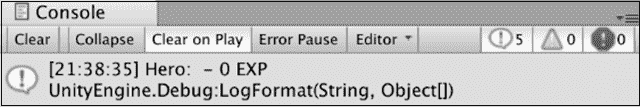

    图 5.1：控制台中打印的自定义类属性截图

到目前为止，我们的类已经可以工作，但使用这些空值并不实用。你需要通过所谓的类构造函数来修复这个问题。

## 使用构造函数

类构造函数是特殊方法，在创建类实例时自动触发，这与`LearningCurve`中的`Start`方法运行方式类似。构造函数根据其蓝图构建类：

+   如果没有指定构造函数，C#将生成一个默认的构造函数。默认构造函数将任何变量设置为它们的默认类型值——数值设置为零，布尔值设置为 false，引用类型（类）设置为 null。

+   可以像任何其他方法一样定义具有参数的自定义构造函数，并用于在初始化时设置类变量值。

+   一个类可以有多个构造函数。

构造函数的编写方式与常规方法类似，但有一些区别；例如，它们需要是公开的，没有返回类型，并且方法名总是类名。作为一个例子，让我们向 `Character` 类添加一个不带参数的基本构造函数，并将名称字段设置为非空值。

将此新代码直接放在类变量下面，如下所示：

```cs
public string name;
public int exp = 0;
**public****Character****()**
**{**
 **name =** **"Not assigned"****;**
**}** 
```

在 Unity 中运行项目，你会看到使用这个新构造函数的 `hero` 实例。调试日志将显示英雄的名称为 **未分配** 而不是空值：

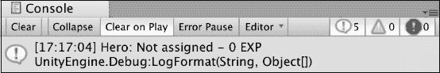

图 5.2：控制台打印的未分配自定义类变量的截图

这是个不错的进展，但我们还需要使类构造函数更加灵活。这意味着我们需要能够传入值，以便它们可以作为起始值使用，这将是你的下一个任务。

现在，`Character` 类开始更像一个真实对象的行为，但我们可以通过添加一个接受初始化时名称并设置到 `name` 字段的第二个构造函数来使其更好：

1.  为 `Character` 添加另一个接受 `string` 参数的构造函数，称为 `name`。

1.  使用 `this` 关键字将参数赋值给类的 `name` 变量。这被称为 *构造函数重载*：

    ```cs
    public Character(string name)
    {
        this.name = name;
    } 
    ```

    为了方便，构造函数通常会具有与类变量共享名称的参数。在这些情况下，使用 `this` 关键字来指定哪个变量属于类。在这个例子中，`this.name` 指的是类的 `name` 变量，而 `name` 是参数；如果没有 `this` 关键字，编译器将抛出警告，因为它无法区分它们。

1.  在 `LearningCurve` 中创建一个新的 `Character` 实例，称为 `heroine`。使用自定义构造函数在初始化时传入一个名称，并在控制台打印出详细信息：

    ```cs
    Character heroine = new Character("Agatha");
    Debug.LogFormat("Hero: {0} - {1} EXP", heroine.name,
            heroine.exp); 
    ```

    当一个类有多个构造函数或一个方法有多个变体时，Visual Studio 将在自动完成弹出窗口中显示一组箭头，可以使用箭头键滚动浏览：

    

    图 5.3：Visual Studio 中多个方法构造函数的截图

1.  现在我们可以选择在初始化新的 `Character` 类时使用基本构造函数或自定义构造函数。`Character` 类本身在配置不同情况下的不同实例方面现在更加灵活了！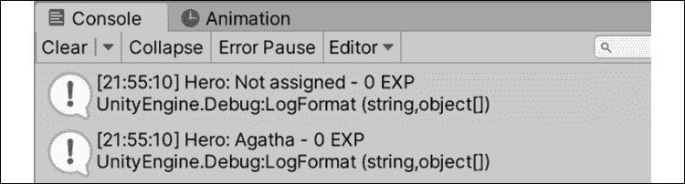

    图 5.4：控制台打印的多个自定义类实例的截图

现在真正的挑战开始了；我们的类需要方法来执行除了作为变量存储设施之外的有用操作。你的下一个任务是将其付诸实践。

## 声明类方法

向自定义类添加方法与向 `LearningCurve` 添加方法没有区别。然而，这是一个讨论良好编程的一个基本准则——**不要重复自己**（**DRY**）的好机会。DRY 是所有良好代码的标准。本质上，如果你发现自己一遍又一遍地写相同的行或几行，那么是时候重新思考和重新组织了。这通常以一个新的方法的形式出现，以保存重复的代码，使其更容易修改并在当前脚本或甚至在其他脚本中调用该功能。

在编程术语中，你会看到这被称为**抽象**一个方法或特性。

我们已经有了相当多的重复代码，所以让我们看看我们可以在哪里提高脚本的易读性和效率。

我们的重复调试日志是直接将一些代码抽象到 `Character` 类中的完美机会：

1.  向 `Character` 类添加一个新的 `public` 方法，具有 `void` 返回类型，名为 `PrintStatsInfo`。

1.  将 `LearningCurve` 中的调试日志复制并粘贴到方法体中。

1.  将变量改为 `name` 和 `exp`，因为它们现在可以直接从类中引用：

    ```cs
    public void PrintStatsInfo()
    {
          Debug.LogFormat("Hero: {0} - {1} EXP", name, exp);
    } 
    ```

1.  用 `PrintStatsInfo` 方法调用替换我们之前添加到 `LearningCurve` 中的角色调试日志，然后点击播放：

    ```cs
     Character hero = new Character();
     **hero.PrintStatsInfo();**
     Character heroine = new Character("Agatha");
     **heroine.PrintStatsInfo();** 
    ```

1.  现在 `Character` 类有了方法，任何实例都可以使用点符号自由访问它。由于 `hero` 和 `heroine` 都是单独的对象，`PrintStatsInfo` 将它们各自的 `name` 和 `exp` 值调试到控制台。

这种行为比直接在 `LearningCurve` 中放置调试日志要好。总是将功能分组到类中并通过方法驱动动作是一个好主意。这使得代码更易于阅读——因为我们的 `Character` 对象在打印调试日志时发出命令，而不是重复代码。

整个 `Character` 类应该看起来像以下代码：

```cs
using System.Collections;
using System.Collections.Generic;
using UnityEngine;

public class Character
{
    public string name;
    public int exp = 0;

    public Character()
    {
        name = "Not assigned";
    }

    public Character(string name)
    {
        this.name = name;
    }

    public void PrintStatsInfo()
    {
        Debug.LogFormat("Hero: {0} - {1} EXP", name, exp);
    }
} 
```

在了解了类之后，你已经朝着编写模块化、易于阅读、轻量级和可重用的代码迈出了很大一步。现在是时候处理类的表亲——结构体了！

# 声明结构体

**结构体**与类相似，因为它们也是你想要在程序中创建的对象的蓝图。主要区别在于它们是**值类型**，这意味着它们是通过值传递而不是引用传递，就像类一样。当结构体被分配或传递给另一个变量时，会创建结构体的一个新副本，因此原始结构体不会被引用。我们将在下一节中更详细地介绍这一点。首先，我们需要了解结构体是如何工作的以及创建它们时适用的特定规则。

结构体的声明方式与类相同，可以包含字段、方法和构造函数：

```cs
accessModifier struct UniqueName 
{
    Variables
    Constructors
    Methods
} 
```

类似于类，任何变量和方法都属于结构体，并且通过其唯一名称访问。

然而，结构体有一些限制：

+   除非变量被标记为 `static` 或 `const` 修饰符，否则不能在结构体声明中使用其内部的值来初始化变量——你可以在 *第十章，重新审视类型、方法和类* 中了解更多关于这个内容。

+   不带参数的构造函数是不允许的。

+   结构体自带一个默认构造函数，它会自动根据其类型将所有变量设置为默认值。

每个角色都需要一把好武器，而这些武器对于结构体对象来说比类更合适。我们将在本章的 *理解引用和值类型* 部分讨论为什么是这样。然而，首先，你需要创建一个来试验一下。

我们的角色将需要好的武器来完成他们的任务，这些任务非常适合简单的结构体：

1.  右键点击 `Scripts` 文件夹，选择 **创建**，然后选择 **C# 脚本**。

1.  将其命名为 `Weapon`，在 Visual Studio 中打开它，并删除 `using UnityEngine` 之后的所有生成的代码。

1.  声明一个名为 `Weapon` 的公共结构体，然后是一组花括号，然后保存文件。

1.  添加一个 `name` 字段，类型为 `string`，以及一个 `damage` 字段，类型为 `int`：

    你可以将类和结构体嵌套在一起，但这通常是不受欢迎的，因为它会使代码变得混乱。

    ```cs
    public struct Weapon
    {
        public string name;
        public int damage;
    } 
    ```

1.  使用 `name` 和 `damage` 参数声明一个构造函数，并使用 `this` 关键字设置结构体字段：

    ```cs
    public Weapon(string name, int damage)
    {
        this.name = name;
        this.damage = damage;
    } 
    ```

1.  在构造函数下方添加一个调试方法来打印出武器信息：

    ```cs
    public void PrintWeaponStats()
    {
        Debug.LogFormat("Weapon: {0} - {1} DMG", name, damage);
    } 
    ```

1.  在 `LearningCurve` 中，使用自定义构造函数和 `new` 关键字创建一个新的 `Weapon` 结构体：

    ```cs
    Weapon huntingBow = new Weapon("Hunting Bow", 105); 
    ```

1.  我们新的 `huntingBow` 对象使用自定义构造函数，并在初始化时为两个字段提供值。

限制脚本只在一个类中是很不错的想法，但通常可以看到只由一个类使用的结构体被包含在文件中。

现在我们已经有了引用（类）和值（结构体）对象的示例，是时候熟悉它们各自的细节了。更具体地说，你需要了解每个对象是如何在内存中传递和存储的。

# 理解引用和值类型

除了关键字和初始字段值之外，到目前为止，我们在类和结构体之间并没有看到太大的区别。类最适合于组合程序中会改变复杂动作和数据；结构体更适合于简单对象和大部分保持不变的数据。除了它们的用途之外，它们在关键领域上本质上是不同的——那就是，它们如何在变量之间传递或分配。类是 *引用类型*，意味着它们是通过引用传递的；结构体是 *值类型*，意味着它们是通过值传递的。

## 引用类型

当我们的`Character`类实例初始化时，`hero`和`heroine`变量不持有其类信息——相反，它们持有对象在程序内存中的位置引用。如果我们将`hero`或`heroine`赋值给同一类中的另一个变量，分配的是内存引用，而不是角色数据。这有几个含义，其中最重要的是，如果我们有多个变量存储相同的内存引用，对其中一个的更改会影响它们所有。

这样的主题最好是演示而不是解释；这取决于你，在下一个实际示例中尝试一下。

是时候测试`Character`类是否是一个引用类型了：

1.  在`LearningCurve`中声明一个新的`Character`变量，命名为`hero2`。将`hero2`赋值给`hero`变量，并使用`PrintStatsInfo`方法打印出两组信息。

1.  点击播放并查看控制台出现的两个调试日志：

    ```cs
    Character hero = new Character();
    **Character hero2 = hero;**

    hero.PrintStatsInfo();
    **hero2.PrintStatsInfo();** 
    ```

1.  两个调试日志将完全相同，因为当创建`hero2`时，它被赋值给了`hero`。在这个时候，`hero2`和`hero`都指向内存中`hero`的位置！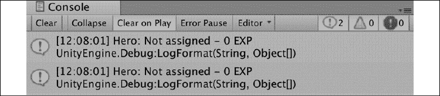

    图 5.5：控制台打印出的结构体统计截图

1.  现在，将`hero2`的名字改为一个有趣的名字，然后再次点击播放：

    ```cs
    Character hero2 = hero;
    **hero2.name =** **"Sir Krane the Brave"****;** 
    ```

1.  你会看到`hero`和`hero2`现在拥有相同的名字，尽管我们只更改了其中一个角色的数据！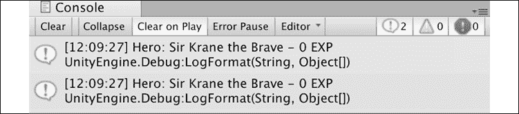

    图 5.6：控制台打印出的类实例属性的截图

这里的教训是，引用类型需要小心处理，并且在赋值给新变量时不要复制。对任何一个引用的任何更改都会渗透到持有相同引用的所有其他变量中。

如果你试图复制一个类，要么创建一个新的、独立的实例，要么重新考虑结构体是否可能是你对象蓝图更好的选择。你将在下一节中更好地了解值类型。

## 值类型

当创建结构体对象时，所有数据都存储在其对应的变量中，没有引用或与其内存位置的连接。这使得结构体对于创建需要快速高效复制且保持各自独立身份的对象非常有用。在下面的练习中尝试使用我们的`Weapon`结构体。

让我们通过将`huntingBow`复制到一个新变量并更新其数据来创建一个新的武器对象，看看这些更改是否会影响两个结构体：

1.  在`LearningCurve`中声明一个新的`Weapon`结构体，并将其初始值设置为`huntingBow`：

    ```cs
    Weapon huntingBow = new Weapon("Hunting Bow", 105);
    **Weapon warBow = huntingBow;** 
    ```

1.  使用调试方法打印出每件武器的数据：

    ```cs
    **huntingBow.PrintWeaponStats();**
    **warBow.PrintWeaponStats();** 
    ```

1.  现在它们的设置方式是，`huntingBow`和`warBow`将具有相同的调试日志，就像我们在更改任何数据之前我们的两个角色一样！

    图 5.7：控制台打印出的结构体实例的截图

1.  将`warBow.name`和`warBow.damage`字段更改为你选择的值，然后再次点击播放：

    ```cs
     Weapon warBow = huntingBow;
     **warBow.name =** **"War Bow"****;**
     **warBow.damage =** **155****;** 
    ```

1.  控制台将显示只有与`warBow`相关的数据被更改，而`huntingBow`保留其原始数据。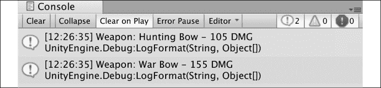

图 5.8：更新后的结构属性打印到控制台的截图

从这个例子中我们可以得出的结论是，结构体作为独立的对象很容易被复制和修改，而类则保留对原始对象的引用。现在我们更了解结构体和类在底层是如何工作的，并确认了引用和值类型在其自然环境中是如何表现的，我们就可以开始讨论一个最重要的编程主题，即面向对象编程（OOP），以及它如何融入编程领域。

# 集成面向对象思维

物质世界中的事物在某种程度上与面向对象（OOP）相似；当你想买软饮料时，你会拿一罐汽水，而不是液体本身。罐子是一个对象，将相关信息和操作组合在一个自包含的包中。然而，在处理对象时，无论是编程还是杂货店，都有规则——例如，谁可以访问它们。不同的变体和通用操作都影响着我们周围所有对象的本质。

在编程术语中，这些规则是面向对象编程（OOP）的主要原则：*封装*、*继承*和*多态*。

## 封装

面向对象编程（OOP）的最好之处在于它支持封装——定义对象的变量和方法对外部代码的访问性（这有时被称为*调用代码*）。以我们的汽水瓶为例——在自动售货机中，可能的交互是有限的。由于机器是锁着的，不是任何人都可以走过来拿一个；如果你恰好有正确的零钱，你将被允许临时访问它，但数量有限。如果机器本身被锁在一个房间里，只有有门钥匙的人甚至知道汽水瓶的存在。

你现在问自己的问题是，我们如何设置这些限制？简单的答案是，我们一直在通过指定对象变量和方法的作用域修饰符来使用封装。

如果你需要复习，请回到第三章的*访问修饰符*部分，*深入变量、类型和方法*。

让我们尝试一个简单的封装示例，以了解这在实践中是如何工作的。我们的`Character`类是公开的，它的字段和方法也是如此。然而，如果我们想要一个可以将角色的数据重置为其初始值的方法呢？这可能会很有用，但如果意外调用，可能会造成灾难，因此它是一个完美的私有对象成员候选：

1.  在`Character`类中创建一个名为`Reset`的`private`方法，该方法内部没有返回值。将`name`和`exp`变量分别设置为`"Not assigned"`和`0`：

    ```cs
    private void Reset()
    {
        this.name = "Not assigned";
        this.exp = 0;
    } 
    ```

1.  在打印出`hero2`数据后尝试从`LearningCurve`调用`Reset()`：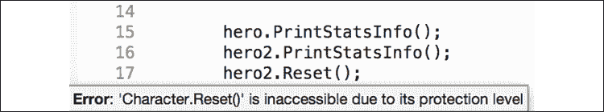

图 5.9：Character 类中不可访问方法的屏幕截图

如果你怀疑 Visual Studio 是否出了问题，其实并没有。将方法或变量标记为私有会使它在这个类或结构体中使用点符号无法访问；如果你手动输入并悬停在`Reset()`上，你会看到一个关于方法受保护的错误信息。

要实际调用这个私有方法，我们可以在类构造函数中添加一个重置命令：

```cs
public Character()
{
    Reset();
} 
```

封装确实允许使用对象进行更复杂的可访问性设置；然而，现在，我们将坚持使用`public`和`private`成员。在我们下一章开始充实我们的游戏原型时，我们将根据需要添加不同的修饰符。

现在，让我们谈谈继承，这在你在未来游戏中创建类层次结构时将成为你的好朋友。

## 继承

一个 C#类可以按照另一个类的形象创建，共享其成员变量和方法，但能够定义其独特的数据。在面向对象编程中，我们称这为*继承*，这是一种无需重复代码就能创建相关类的强大方式。再次以汽水为例——市场上有一些通用的汽水，它们具有所有相同的基本属性，然后还有特殊的汽水。特殊的汽水具有相同的基本属性，但有不同的品牌或包装，使其与众不同。当你将它们并排放在一起看时，很明显它们都是汽水瓶——但它们显然也不相同。

原始类通常被称为基类或父类，而继承的类被称为派生类或子类。任何用`public`、`protected`或`internal`访问修饰符标记的基类成员都会自动成为派生类的一部分——除了构造函数。类构造函数始终属于其包含的类，但它们可以从派生类中使用，以将重复的代码量保持在最低。现在不必太担心不同的基类场景。相反，让我们尝试一个简单的游戏示例。

大多数游戏都有不止一种类型的角色，所以让我们创建一个新的类，称为`Paladin`，它继承自`Character`类。你可以将这个新类添加到`Character`脚本中或创建一个新的脚本。如果你要将新类添加到`Character`脚本中，确保它位于`Character`类的花括号之外：

```cs
public class Paladin: Character
{
} 
```

就像`LearningCurve`继承自`MonoBehavior`一样，我们只需要添加一个冒号和我们要继承的基类，C#就会完成剩下的工作。现在，任何`Paladin`实例都将能够访问`name`属性和`exp`属性以及`PrintStatsInfo`方法。

通常认为，为不同的类创建新的脚本而不是将它们添加到现有脚本中是最佳实践。这可以分离你的脚本，并避免任何单个文件中有太多的代码行（称为膨胀文件）。

这很好，但是继承的类是如何处理它们的构造的呢？你可以在下面的部分中找到答案。

### 基础构造函数

当一个类从另一个类继承时，它们形成一种金字塔结构，成员变量从父类流向其任何派生子类。父类不知道任何子类，但所有子类都知道它们的父类。然而，父类构造函数可以直接从子类构造函数中通过简单的语法修改来调用：

```cs
public class ChildClass: ParentClass
{
    public ChildClass(): **base****()**
    {
    }
} 
```

`base`关键字代表父构造函数——在这种情况下，默认构造函数。然而，由于`base`代表一个构造函数，而构造函数是一个方法，子类可以将参数向上传递到金字塔中的父构造函数。

由于我们希望所有的`Paladin`对象都有一个名字，而`Character`已经有一个构造函数来处理这一点，我们可以在`Paladin`类中直接调用`base`构造函数，从而避免重写构造函数的麻烦：

1.  向`Paladin`类添加一个接受名为`name`的`string`参数的构造函数。使用冒号和`base`关键字调用父构造函数，传递`name`：

    ```cs
    public class Paladin: Character
    {
    **public****Paladin****(****string** **name****):** **base****(****name****)**
     **{**

     **}**
    } 
    ```

1.  在`LearningCurve`中创建一个新的名为`knight`的`Paladin`实例。使用基础构造函数分配值。从`knight`调用`PrintStatsInfo`并查看控制台：

    ```cs
    Paladin knight = new Paladin("Sir Arthur");
    knight.PrintStatsInfo(); 
    ```

1.  调试日志将与我们的其他`Character`实例相同，但带有我们分配给`Paladin`构造函数的名字：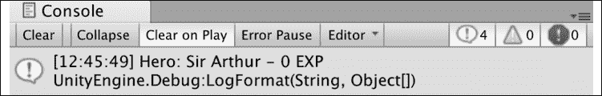

图 5.10：基本角色构造函数属性截图

当`Paladin`构造函数被触发时，它将`name`参数传递给`Character`构造函数，该构造函数设置`name`值。本质上，我们使用了`Character`构造函数来完成`Paladin`类的初始化工作，使得`Paladin`构造函数只负责初始化其独特的属性，而目前它没有这些属性。

除了继承之外，有时你想要通过组合其他现有对象来创建新的对象。想想乐高；你不会从无到有开始建造——你已经有不同颜色和结构的积木块可以工作。在编程术语中，这被称为*组合*，我们将在下一节中讨论。

## 组成

除了继承之外，类还可以由其他类组成。以我们的`Weapon`结构体为例。`Paladin`可以轻松地在自身内部包含一个`Weapon`变量，并访问其所有属性和方法。让我们通过更新`Paladin`以接受一个起始武器并在构造函数中分配其值来实现这一点：

```cs
public class Paladin: Character
{
   **public** **Weapon weapon;**

    public Paladin(string name, **Weapon weapon**): base(name)
    {
        **this****.weapon = weapon;**
    }
} 
```

由于`weapon`是`Paladin`特有的，而不是`Character`，我们需要在构造函数中设置它的初始值。我们还需要更新`knight`实例以包含一个`Weapon`变量。所以，让我们使用`huntingBow`：

```cs
Paladin knight = new Paladin("Sir Arthur", **huntingBow**); 
```

如果你现在运行游戏，你不会看到任何不同，因为我们正在使用来自`Character`类的`PrintStatsInfo`方法，它不知道`Paladin`类的`weapon`属性。为了解决这个问题，我们需要讨论多态。

## 多态

多态是希腊语中“多形态”的意思，并且以两种不同的方式应用于面向对象编程（OOP）：

+   派生类对象被当作父类对象对待。例如，一个`Character`对象的数组也可以存储`Paladin`对象，因为它们是从`Character`派生出来的。

+   父类可以标记方法为`virtual`，这意味着它们的指令可以被派生类使用`override`关键字修改。在`Character`和`Paladin`的情况下，如果我们能够从每个`PrintStatsInfo`中调试不同的消息，那将是有用的。

多态允许派生类保持其父类的结构，同时也有自由来调整操作以适应其特定需求。你标记为`virtual`的任何方法都会给你对象多态的自由。让我们利用这个新知识并将它应用到我们的角色调试方法中。

让我们修改`Character`和`Paladin`，使用`PrintStatsInfo`打印出不同的调试日志：

1.  通过在`public`和`void`之间添加`virtual`关键字来更改`Character`类中的`PrintStatsInfo`：

    ```cs
    public **virtual** void PrintStatsInfo()
    {
        Debug.LogFormat("Hero: {0} - {1} EXP", name, exp);
    } 
    ```

1.  使用`override`关键字在`Paladin`类中声明`PrintStatsInfo`方法。添加一个调试日志，以你喜欢的任何方式打印出`Paladin`属性：

    ```cs
    public override void PrintStatsInfo()
    {
        Debug.LogFormat("Hail {0} - take up your {1}!", name, 
                 weapon.name);
    } 
    ```

    这可能看起来像是重复的代码，我们之前已经说过这是不好的形式，但这是一个特殊情况。我们在`Character`类中将`PrintStatsInfo`标记为`virtual`所做的是告诉编译器，这个方法可以根据调用类有多种形态。

1.  当我们在`Paladin`中声明覆盖版本的`PrintStatsInfo`时，我们添加了仅适用于该类的自定义行为。多态的功劳，我们不需要从`Character`或`Paladin`对象中选择要调用的`PrintStatsInfo`版本——编译器已经知道了！: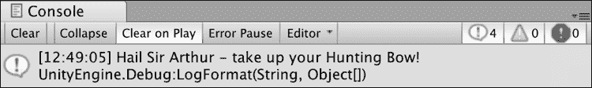

    图 5.11：多态角色属性的截图

我知道这有很多内容需要消化。因此，在我们接近终点时，让我们回顾一下面向对象编程（OOP）的一些主要点：

+   面向对象编程（OOP）的全部内容都是将相关的数据和操作组合成对象——这些对象可以相互通信并独立行动。

+   可以使用访问修饰符设置对类成员的访问，就像变量一样。

+   类可以继承自其他类，创建父/子关系的级联层次结构。

+   类可以有其他类或结构体类型的成员。

+   类可以覆盖标记为`virtual`的任何父方法，允许它们执行自定义操作，同时保留相同的蓝图。

面向对象编程（OOP）不是唯一可以与 C#一起使用的编程范式——你可以在以下链接中找到其他主要方法的实用解释：[`cs.lmu.edu/~ray/notes/paradigms`](http://cs.lmu.edu/~ray/notes/paradigms)。

本章中你学到的所有面向对象编程知识都直接适用于 C#世界。然而，我们仍然需要将 Unity 与之结合起来，这是本章剩余部分将重点关注的。

# 在 Unity 中应用面向对象编程

如果你足够了解面向对象的语言，你最终会听到开发者之间像秘密祈祷一样低声说出“万物皆对象”的短语。遵循面向对象的原则，程序中的所有内容都应该是一个对象，但 Unity 中的 GameObject 可以代表你的类和结构体。然而，这并不意味着 Unity 中的所有对象都必须在物理场景中，因此我们仍然可以在幕后使用我们新发现的程序化类。

## 对象是一流的

在*第二章*，*编程的基本要素*中，我们讨论了当脚本被添加到 Unity 中的 GameObject 时，脚本是如何转换为组件的。从面向对象原则的组合角度来考虑这个问题——GameObject 是父容器，它们可以由多个组件组成。这听起来可能有些矛盾，但实际上，这与其说是一个实际要求，不如说是一个更好的可读性的指南。类可以嵌套在彼此内部——但这很快就会变得混乱。然而，将多个脚本组件附加到单个 GameObject 上可能非常有用，尤其是在处理管理类或行为时。

总是尝试将对象简化为其最基本元素，然后使用组合来构建由这些较小的类组成的大而复杂的对象。由小型可互换组件组成的 GameObject 比一个大而笨拙的 GameObject 更容易修改。

让我们看看**主摄像机**来了解这一动作：

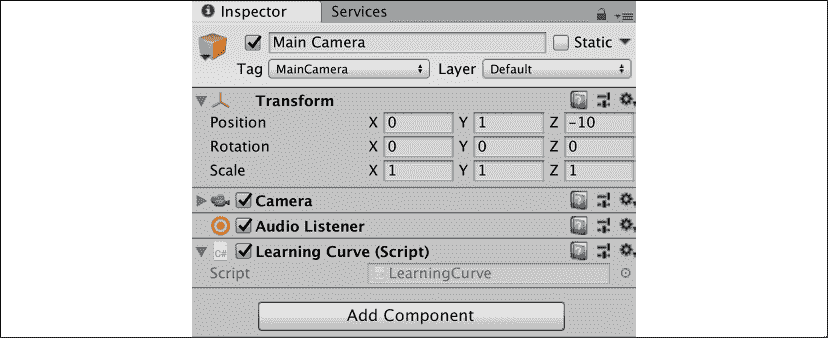

图 5.12：主摄像机对象在检查器中的截图

前一截图中的每个组件（**Transform**、**Camera**、**Audio Listener**和**Learning Curve**脚本）最初都是 Unity 中的一个类。就像`Character`或`Weapon`的实例一样，当我们点击播放时，这些组件成为计算机内存中的对象，包括它们的成员变量和方法。

如果我们将`LearningCurve`（或任何脚本或组件）附加到 1,000 个 GameObject 上并点击播放，就会在内存中创建并存储 1,000 个单独的`LearningCurve`实例。

我们甚至可以使用它们的组件名称作为数据类型来创建这些组件的实例。就像类一样，Unity 组件类是引用类型，可以像任何其他变量一样创建。然而，找到和分配这些 Unity 组件的方式与之前看到的不同。为此，你需要了解以下部分中关于 GameObject 工作方式的一些更多内容。

## 访问组件

既然我们已经知道了组件在 GameObject 上的行为，我们该如何访问它们的特定实例呢？幸运的是，Unity 中的所有 GameObject 都继承自`GameObject`类，这意味着我们可以使用它们的成员方法在场景中找到我们需要的任何东西。有几种方法可以分配或检索当前场景中活动的 GameObject：

1.  通过`GameObject`类中的`GetComponent()`或`Find()`方法，它们与公共和私有变量一起工作。

1.  通过将`Project`面板中的 GameObject 本身拖放到**检查器**选项卡中的变量槽中。此选项仅适用于 C#中的公共变量，因为它们是唯一会出现在检查器中的变量。如果你决定需要在检查器中显示私有变量，你可以使用`SerializeField`属性对其进行标记。

你可以在 Unity 文档中了解更多关于属性和`SerializeField`的信息：[`docs.unity3d.com/ScriptReference/SerializeField.html`](https://docs.unity3d.com/ScriptReference/SerializeField.html)。

让我们看看第一个选项的语法。

### 在代码中访问组件

使用`GetComponent`相当简单，但它的方法签名与我们迄今为止看到的其他方法略有不同：

```cs
GameObject.GetComponent<ComponentType>(); 
```

我们需要的只是我们正在寻找的组件类型，如果存在，`GameObject`类将返回该组件，如果不存在，则返回 null。`GetComponent`方法有其他变体，但这个是最简单的，因为我们不需要知道我们正在寻找的`GameObject`类的具体信息。这被称为`泛型`方法，我们将在第十三章*探索泛型、委托以及其他内容*中进一步讨论。然而，现在，让我们只处理相机的变换。

由于`LearningCurve`已经附加到**主相机**对象，让我们获取相机的`Transform`组件并将其存储在一个公共变量中。`Transform`组件控制 Unity 中对象的位置、旋转和缩放，因此它是一个方便的例子：

1.  将一个新的公共`Transform`类型变量`CamTransform`添加到`LearningCurve`中：

    ```cs
    public Transform CamTransform; 
    ```

1.  在`Start`中使用`GameObject`类的`GetComponent`方法初始化`CamTransform`。使用`this`关键字，因为`LearningCurve`附加到与`Transform`组件相同的`GameObject`组件。

1.  使用点符号访问和调试`CamTransform`的`localPosition`属性：

    ```cs
    void Start()
    {
        CamTransform = this.GetComponent<Transform>();
        Debug.Log(CamTransform.localPosition); 
    } 
    ```

1.  我们在`LearningCurve`的顶部添加了一个未初始化的`public Transform`变量，并在`Start`方法中使用`GetComponent`方法对其进行初始化。`GetComponent`找到附加到该`GameObject`组件的`Transform`组件，并将其返回给`CamTransform`。现在`CamTransform`存储了一个`Transform`对象，我们可以访问其所有类属性和方法——包括以下截图中的`localPosition`：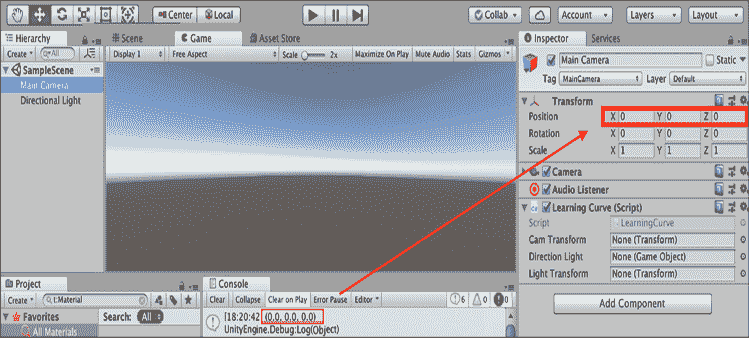

图 5.13：Transform 位置打印到控制台的截图

`GetComponent`方法对于快速检索组件非常出色，但它只能访问调用脚本附加到的 GameObject 上的组件。例如，如果我们从附加到**主相机**的`LearningCurve`脚本中使用`GetComponent`，我们只能访问**Transform**、**Camera**和**音频监听器**组件。

如果我们想要引用一个位于独立 GameObject 上的组件，例如**方向光**，我们首先需要使用`Find`方法获取该对象的引用。只需提供 GameObject 的名称，Unity 就会返回相应的 GameObject 供我们存储或操作。

为了参考，当对象被选中时，每个 GameObject 的名称都可以在**检查器**标签的顶部找到：


图 5.14：检查器中方向光对象的截图

在 Unity 中，查找游戏场景中的对象至关重要，因此你需要练习。让我们拿我们正在处理的对象来练习查找和分配它们的组件。

让我们尝试一下`Find`方法，并从`LearningCurve`中检索**方向光**对象：

1.  在`CamTransform`下添加两个变量到`LearningCurve`——一个是`GameObject`类型，另一个是`Transform`类型：

    ```cs
    public GameObject DirectionLight;
    public Transform LightTransform; 
    ```

1.  通过名称查找`DirectionLight`组件，并在`Start()`方法中使用它来初始化`DirectionLight`：

    ```cs
    void Start()
    {
        DirectionLight = GameObject.Find("Directional Light"); 
    } 
    ```

1.  将`LightTransform`的值设置为`DirectionLight`附加的`Transform`组件，并调试其`localPosition`。由于`DirectionLight`现在是它的`GameObject`，`GetComponent`工作得非常完美：

    ```cs
    LightTransform = DirectionLight.GetComponent<Transform>();
    Debug.Log(LightTransform.localPosition); 
    ```

1.  在运行游戏之前，重要的是要理解方法调用可以串联起来以减少代码步骤的数量。例如，我们可以通过组合`Find`和`GetComponent`，而不必通过`DirectionLight`来初始化`LightTransform`，从而在单行中完成：

    ```cs
    GameObject.Find("Directional Light").GetComponent<Transform>(); 
    ```

提醒一句——长串的代码链在处理复杂应用程序时可能会导致可读性差和混淆。避免超过这个示例的长行是一个好的经验法则。

虽然在代码中查找对象总是可行的，但你也可以直接将对象拖放到**检查器**标签中。让我们在下一节中演示如何做到这一点。

### 拖放

现在我们已经介绍了代码密集型的方法，让我们快速看一下 Unity 的拖放功能。尽管拖放比使用代码中的`GameObject`类要快得多，但 Unity 在保存或导出项目，或者当 Unity 更新时，有时会丢失通过这种方式建立的对象和变量之间的连接。

当你需要快速分配几个变量时，不妨利用这个特性。在大多数情况下，我建议坚持使用代码。

让我们改变`LearningCurve`来展示如何使用拖放分配`GameObject`组件：

1.  注释掉以下代码行，其中我们使用了`GameObject.Find()`来检索并分配`Directional Light`对象到`DirectionLight`变量：

    ```cs
    //DirectionLight = GameObject.Find("Directional Light"); 
    ```

1.  选择**主摄像机**GameObject，将**方向光**拖动到**学习曲线**组件中的`方向光`字段，然后点击播放！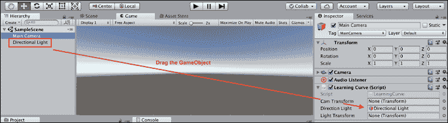

    图 5.15：将方向光拖动到脚本属性中的截图

1.  **方向光**GameObject 现在被分配给`DirectionLight`变量。没有涉及代码，因为 Unity 内部分配了变量，没有改变`LearningCurve`类。

在决定是否使用拖放或`GameObject.Find()`来分配变量时，理解以下几点很重要。首先，`Find()`方法稍微慢一些，如果你在多个脚本中多次调用该方法，可能会使你的游戏面临性能问题。其次，你需要确保场景层次结构中的 GameObject 都具有唯一的名称；如果没有，当有多个同名对象或更改对象名称时，可能会导致一些棘手的错误。

# 摘要

我们对类、结构和面向对象编程的探索标志着 C#基础知识第一部分的结束。你已经学会了如何声明你的类和结构体，这是你将制作的每个应用程序或游戏的基础。你还确定了这两个对象在传递和访问方面的差异以及它们与面向对象编程的关系。最后，你亲身体验了面向对象编程的原则——使用继承、组合和多态创建类。

识别相关数据和操作，创建蓝图以赋予它们形状，并使用实例来构建交互是处理任何程序或游戏的基础。将访问组件的能力加入其中，你就有了 Unity 开发者的雏形。

下一章将过渡到游戏开发的基础和直接在 Unity 中脚本化对象行为。我们将从细化一个简单开放世界冒险游戏的需求开始，在场景中与 GameObject 一起工作，并以一个为我们的角色准备好的白盒环境结束。

# 快速问答——所有关于面向对象编程的内容

1.  哪个方法处理类内部的初始化逻辑？

1.  作为值类型，结构体是如何传递的？

1.  面向对象编程的主要原则是什么？

1.  你会使用哪个`GameObject`类方法来在调用类相同的对象上找到组件？

# 加入我们的 Discord！

与其他用户、Unity/C#专家和哈里森·费罗尼一起阅读这本书。提问，为其他读者提供解决方案，通过“问我任何问题”的环节与作者聊天，以及更多。

现在加入我们！

[`packt.link/csharpunity2021`](https://packt.link/csharpunity2021)


