# 第八章：游戏机制脚本化

在上一章中，我们专注于使用代码来移动玩家和摄像机，并在 Unity 物理方面进行了一次探索。然而，仅控制可玩角色还不足以制作出引人入胜的游戏；实际上，这可能是不同游戏标题中相对保持不变的一个领域。

一款游戏独特的火花来自于其核心机制，以及这些机制给玩家带来的力量感和自主感。如果没有有趣且引人入胜的方式来影响您所创造的虚拟环境，您的游戏就不太可能被重复游玩，更不用说有趣了。当我们着手实现游戏机制时，我们也会提升我们对 C#及其中级特性的了解。

本章将基于《英雄降世》原型，重点关注单独实现的游戏机制，以及系统设计和**用户界面**（**UI**）的基础知识。您将深入研究以下主题：

+   添加跳跃

+   射击弹丸

+   创建游戏管理器

+   创建 GUI

# 添加跳跃

记住上一章的内容，Rigidbody 组件为 GameObject 添加了模拟的真实世界物理，而 Collider 组件通过 Rigidbody 对象相互交互。

在上一章中，我们没有讨论的另一件关于使用 Rigidbody 组件来控制玩家移动的伟大事情是，我们可以轻松地添加依赖于施加力的不同机制，例如跳跃。在本节中，我们将让玩家跳跃并编写我们的第一个实用函数。

实用函数是一个类方法，它执行某种类型的粗活，以便我们不会使游戏代码变得杂乱无章——例如，想要检查玩家胶囊是否接触地面以便跳跃。

在此之前，您需要熟悉一种新的数据类型，即枚举类型，您将在下一节中进行学习。

## 介绍枚举

根据定义，枚举类型是一个集合或集合，其中包含属于同一变量的命名常量。当您想要一组不同的值，但同时又希望它们都属于同一父类型时，这些类型非常有用。

与其说，不如用枚举来展示，让我们看看以下代码片段中的语法：

```cs
enum PlayerAction { Attack, Defend, Flee }; 
```

让我们按以下方式分解其工作原理：

+   `enum`关键字声明了类型，后跟变量名。

+   枚举可以具有的不同值写在花括号内，用逗号分隔（最后一项除外）。

+   `enum`关键字必须以分号结尾，就像我们之前使用过的所有其他数据类型一样。

在这种情况下，我们声明了一个名为`PlayerAction`的变量，其类型为`enum`，可以设置为三个值之一——`攻击`、`防御`或`逃跑`。

要声明枚举变量，我们使用以下语法：

```cs
PlayerAction CurrentAction = PlayerAction.Defend; 
```

再次，我们可以按以下方式分解：

+   类型设置为`PlayerAction`，因为我们的枚举类型就像字符串或整数等其他类型一样。

+   变量名为 `currentAction`，并设置为 `PlayerAction` 的一个值。

+   每个枚举常量都可以使用点符号访问。

我们当前的 `currentAction` 变量现在设置为 `Defend`，但它可以随时更改为 `Attack` 或 `Flee`。

枚举在第一眼看起来可能很简单，但在适当的情况下它们非常强大。它们最有用的特性之一是能够存储底层类型，这是你将要跳入的下一个主题。

### 底层类型

枚举带有底层类型，这意味着花括号内的每个常量都有一个关联的值。默认的底层类型是 `int`，从 `0` 开始，就像数组一样，每个连续的常量都会得到下一个最高的数字。

并非所有类型都是相同的——枚举的底层类型仅限于 `byte`、`sbyte`、`short`、`ushort`、`int`、`uint`、`long` 和 `ulong`。这些被称为整型，用于指定变量可以存储的数值的大小。

这对于本书来说有点高级，但你将在大多数情况下使用 `int`。有关这些类型的信息，请在此处查找：[`docs.microsoft.com/en-us/dotnet/csharp/language-reference/keywords/enum`](https://docs.microsoft.com/en-us/dotnet/csharp/language-reference/keywords/enum)。

例如，我们的 `PlayerAction` 枚举值目前如下所示，即使它们并没有明确写出：

```cs
enum PlayerAction { Attack = 0, Defend = 1, Flee = 2 }; 
```

没有规则说底层值必须从 `0` 开始；实际上，你只需要指定第一个值，然后 C# 会为我们自动递增其余的值，如下面的代码片段所示：

```cs
enum PlayerAction { Attack = 5, Defend, Flee }; 
```

在前面的示例中，`Defend` 等于 `6`，而 `Flee` 自动等于 `7`。然而，如果我们想让 `PlayerAction` 枚举持有非连续的值，我们可以显式地添加它们，如下所示：

```cs
enum PlayerAction { Attack = 10, Defend = 5, Flee = 0}; 
```

我们甚至可以通过在枚举名称后添加冒号来将 `PlayerAction` 的底层类型更改为任何批准的类型，如下所示：

```cs
enum PlayerAction :  **byte** { Attack, Defend, Flee }; 
```

获取枚举的底层类型需要一个显式的转换，但我们已经讨论过这些，所以下面的语法不应该让你感到惊讶：

```cs
enum PlayerAction { Attack = 10, Defend = 5, Flee = 0};
PlayerAction CurrentAction = PlayerAction.Attack;
**int** ActionCost = **(****int****)**CurrentAction; 
```

在上面的示例代码中，由于 `CurrentAction` 被设置为 `Attack`，`ActionCost` 将是 `10`。

枚举是编程工具箱中非常强大的工具。你的下一个挑战是利用你对枚举的了解，从键盘获取更具体的用户输入。

现在我们对枚举类型有了基本的了解，我们可以使用 `KeyCode` 枚举来捕获键盘输入。更新 `PlayerBehavior` 脚本，如下所示的高亮代码，保存它，然后播放：

```cs
public class PlayerBehavior : MonoBehaviour 
{
    // ... No other variable changes needed ...

    **// 1**
    **public****float** **JumpVelocity =** **5f****;**
    **private****bool** **_isJumping;**

    void Start()
    {
        _rb = GetComponent<Rigidbody>();
    }

    void Update()
    {
        **// 2**
        **_isJumping |= Input.GetKeyDown(KeyCode.Space);**
        // ... No other changes needed ...
    }

    void FixedUpdate()
    {
        **// 3**
        **if****(_isJumping)**
        **{**
            **// 4**
            **_rb.AddForce(Vector3.up * JumpVelocity, ForceMode.Impulse);**
        **}**
        **// 5**
        **_isJumping =** **false****;**
        // ... No other changes needed ...
    }
} 
```

让我们按以下方式分解这段代码：

1.  首先，我们创建了两个新的变量——一个公共变量用于存储我们想要施加的跳跃力的大小，一个私有布尔变量用于检查我们的玩家是否应该跳跃。

1.  我们将 `_isJumping` 的值设置为 `Input.GetKeyDown()` 方法，该方法返回一个 `bool` 类型的值，取决于指定的键是否被按下。

    +   我们使用`|=`运算符来设置`_isJumping`，这是一个逻辑“或”条件。这个运算符确保当玩家跳跃时，连续的输入检查不会相互覆盖。

    +   该方法接受一个键参数，可以是`string`或`KeyCode`，它也是一个枚举类型。我们指定我们想要检查`KeyCode.Space`。

        在`FixedUpdate`中检查输入有时会导致输入丢失甚至双重输入，因为它不是每帧运行一次。这就是为什么我们在`Update`中检查输入，然后在`FixedUpdate`中应用力或设置速度的原因。

1.  我们使用`if`语句来检查`_isJumping`是否为真，如果是，则触发跳跃机制。

1.  由于我们已经将 Rigidbody 组件存储起来，我们可以将`Vector3`和`ForceMode`参数传递给`RigidBody.AddForce()`，从而使玩家跳跃。

    +   我们指定向量（或施加的力）应在`up`方向上，乘以`JumpVelocity`。

    +   `ForceMode`参数决定了力的应用方式，它也是一个枚举类型。`Impulse`在考虑物体的质量的同时向物体施加即时力，这对于跳跃机制来说非常完美。

        其他`ForceMode`选择在不同的场景中可能很有用，所有这些都在这里详细说明：[`docs.unity3d.com/ScriptReference/ForceMode.html`](https://docs.unity3d.com/ScriptReference/ForceMode.html)。

1.  在每个`FixedUpdate`帧的末尾，我们将`_isJumping`重置为 false，这样输入检查就知道完整的跳跃和着陆周期已经完成。

如果你现在玩游戏，你将能够移动并在按下空格键时跳跃。然而，这个机制允许你无限期地跳跃，这不是我们想要的。在下一节中，我们将通过使用所谓的层掩码来限制我们的跳跃机制，每次只能跳跃一次。

## 使用层掩码

将层掩码想象成 GameObject 可以属于的无形组，由物理系统用来确定从导航到相交的碰撞组件等任何事情。虽然层掩码的更高级用法超出了本书的范围，但我们将创建并使用一个来执行简单的检查——检查玩家胶囊是否接触地面，以便限制玩家每次只能跳跃一次。

在我们能够检查玩家胶囊是否接触地面之前，我们需要将我们关卡中的所有环境对象添加到自定义层掩码中。这将使我们能够使用已经附加到玩家上的 Capsule Collider 组件执行实际的碰撞计算。按照以下步骤操作：

1.  在**层次结构**中选择任何环境 GameObject，并在相应的**检查器**面板中，点击**层** | **添加层...**，如图所示：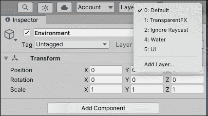

    图 8.1：在检查器面板中选择层

1.  通过在第一个可用槽位中输入名称来添加一个名为`Ground`的新层，该槽位是层 6。层 0-5 是为 Unity 的默认层保留的，即使层 3 是空的，如以下截图所示！

    图 8.2：在检查器面板中添加层

1.  在**层次结构**中选择**环境**父 GameObject，点击**层**下拉菜单，并选择**地面**。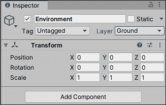

    图 8.3：设置自定义层

在选择以下截图所示的**地面**选项后，当出现对话框询问你是否要更改所有子对象时，点击**是，更改子对象**。在这里，你已定义了一个名为**地面**的新层，并将**环境**的每个子对象分配到该层。

从现在开始，所有位于**地面**层的对象都可以检查是否与特定对象相交。你将在下面的挑战中使用这个功能，确保玩家在地面时可以执行跳跃；这里没有无限跳跃的漏洞。

由于我们不希望代码在`Update()`方法中变得杂乱，我们将我们的层掩码计算放在一个实用函数中，并根据结果返回一个`true`或`false`值。为此，请按照以下步骤操作：

1.  将以下高亮代码添加到`PlayerBehavior`中，并再次播放场景：

    ```cs
    public class PlayerBehavior : MonoBehaviour 
    {
        **// 1**
        **public****float** **DistanceToGround =** **0.1f****;**
        **// 2** 
        **public** **LayerMask GroundLayer;**
        **// 3**
        **private** **CapsuleCollider _col;**
        // ... No other variable changes needed ...

        void Start()
        {
            _rb = GetComponent<Rigidbody>();

            **// 4**
            **_col = GetComponent<CapsuleCollider>();**
        }

        void Update()
        {
            // ... No changes needed ...
        }

        void FixedUpdate()
        {
            **// 5**
            if(**IsGrounded() &&** _isJumping)
            {
                _rb.AddForce(Vector3.up * JumpVelocity,
                     ForceMode.Impulse);
             }
             // ... No other changes needed ...
        }

        **// 6**
        **private****bool****IsGrounded****()**
        **{**
            **// 7**
            **Vector3 capsuleBottom =** **new** **Vector3(_col.bounds.center.x,**
                 **_col.bounds.min.y, _col.bounds.center.z);**

            **// 8**
            **bool** **grounded = Physics.CheckCapsule(_col.bounds.center,**
                **capsuleBottom, DistanceToGround, GroundLayer,**
                   **QueryTriggerInteraction.Ignore);**

            **// 9**
            **return** **grounded;**
        **}**
    **}** 
    ```

1.  在选择`PlayerBehavior`脚本后，在**检查器**面板中将**地面层**从**地面层**下拉菜单设置为**地面**，如以下截图所示！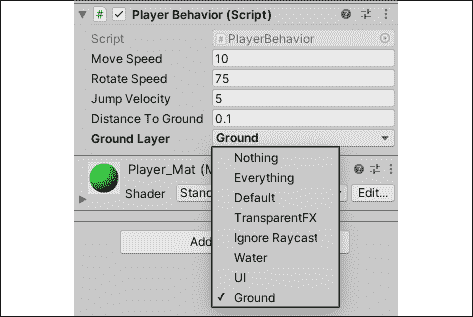

    图 8.4：设置地面层

让我们按以下方式分解前面的代码：

1.  我们为将在玩家胶囊碰撞体和任何**地面层**对象之间检查的距离创建一个新变量。

1.  我们创建一个`LayerMask`变量，我们可以在**检查器**中设置它，并用于碰撞检测。

1.  我们创建一个变量来存储玩家的胶囊碰撞体组件。

1.  我们使用`GetComponent()`来查找并返回附加到玩家的胶囊碰撞体。

1.  我们更新`if`语句以检查`IsGrounded`是否返回`true`以及空格键是否在执行跳跃代码之前被按下。

1.  我们声明一个返回`bool`类型的`IsGrounded()`方法。

1.  我们创建一个局部`Vector3`变量来存储玩家胶囊碰撞体底部的位置，我们将使用它来检查与**地面**层上任何对象的碰撞。

    +   所有碰撞体组件都有一个`bounds`属性，它为我们提供了访问其*x*、*y*和*z*轴的最小、最大和中心位置的能力。

    +   碰撞体的底部是中心*x*、最小*y*和中心*z*的 3D 点。

1.  我们创建一个局部`bool`变量来存储从`Physics`类中调用的`CheckCapsule()`方法的结果，该方法接受以下五个参数：

    +   胶囊的起始位置，我们将其设置为胶囊碰撞体的中间，因为我们只关心底部是否接触地面。

    +   胶囊的末端，即我们已经计算出的 `capsuleBottom` 位置。

    +   胶囊的半径，即已经设置的 `DistanceToGround`。

    +   我们想要检查碰撞的层掩码，在 **检查器** 中设置为 `GroundLayer`。

    +   查询触发器交互，它确定方法是否应该忽略设置为触发器的碰撞体。由于我们想忽略所有触发器，我们使用了 `QueryTriggerInteraction.Ignore` 枚举。

        我们也可以使用 `Vector3` 类的 `Distance` 方法来确定我们距离地面的距离，因为我们知道玩家胶囊的高度。然而，我们将坚持使用 `Physics` 类，因为这是本章的重点。

1.  我们在计算结束时返回存储在 `grounded` 中的值。

我们可以手动进行碰撞计算，但这将需要比我们在这里有时间覆盖的更复杂的 3D 数学。然而，当可用时，使用内置方法总是一个好主意。

那是一段复杂的代码，我们刚刚添加到 `PlayerBehavior` 中，但当你分解它时，我们唯一的新操作是使用 `Physics` 类的一个方法。用简单的话说，我们向 `CheckCapsule()` 提供了起始点和终点、碰撞半径以及层掩码。如果终点比碰撞半径更接近层掩码上的对象，该方法返回 `true`——这意味着玩家正在接触地面。如果玩家处于跳跃中的位置，`CheckCapsule()` 返回 `false`。

由于我们在 `Update()` 中的每一帧都在检查 `IsGround`，因此我们的玩家的跳跃技能只有在接触地面时才被允许。

这就是跳跃机制的所有操作，但玩家仍然需要一个方式来交互并保护自己免受最终将充满竞技场的敌人群的攻击。在下一节中，你将通过实现简单的射击机制来填补这个空白。

# 射击弹体

射击机制如此普遍，以至于很难想象一个没有某种变化的第一人称游戏，而《英雄降生》也不例外。在本节中，我们将讨论如何在游戏运行时从 Prefab 实例化 GameObject，并使用我们学到的技能利用 Unity 物理将其推进。

## 实例化对象

游戏中实例化 GameObject 的概念与实例化类的实例类似——两者都需要起始值，以便 C# 知道我们想要创建什么类型的对象以及它需要在何处创建。为了在运行时创建场景中的对象，我们使用 `Instantiate()` 方法并提供一个 Prefab 对象、起始位置和起始旋转。

实际上，我们可以告诉 Unity 在这个位置创建一个具有所有组件和脚本的指定对象，朝这个方向看，然后根据需要对其进行操作，一旦它在 3D 空间中诞生。在我们实例化对象之前，你需要创建对象 Prefab 本身，这是你的下一个任务。

在我们可以射击任何投射物之前，我们需要一个用作参考的预制件，所以现在让我们创建它，如下所示：

1.  在**层次结构**面板中选择**+** | **3D** **对象** | **球体**，并将其命名为`Bullet`。

    +   在**变换**组件中将**缩放**的*x*、*y*和*z*轴的值更改为 0.15。

1.  在**检查器**中选择**子弹**，并使用底部的**添加组件**按钮搜索并添加一个**刚体**组件，保留所有默认属性。

1.  在**材质**文件夹中使用**创建** | **材质**创建一个新的材质，并将其命名为`Bullet_Mat`：

    +   将**Albedo**属性更改为深黄色。

    +   将**材质**文件夹中的材质拖放到**层次结构**面板中的`Bullet`GameObject 上![img/B17573_08_05.png]

    图 8.5：设置投射物属性

1.  在**层次结构**面板中选择**子弹**，并将其拖动到**项目**面板中的`Prefabs`文件夹中。然后，从**层次结构**中删除它以清理场景![img/B17573_08_06.png]

    图 8.6：创建投射物预制件

您创建并配置了一个**子弹**预制件 GameObject，可以在游戏中根据需要多次实例化并更新。这意味着您已经准备好迎接下一个挑战——射击投射物。

## 添加射击机制

现在我们有了可以操作的预制件对象，我们可以在按下左鼠标按钮时实例化和移动预制件的副本，从而创建射击机制，如下所示：

1.  更新`PlayerBehavior`脚本，如下所示：

    ```cs
    public class PlayerBehavior : MonoBehaviour 
    {
        **// 1**
        **public** **GameObject Bullet;**
        **public****float** **BulletSpeed =** **100f****;**

        **// 2**
        **private****bool** **_isShooting**;

        // ... No other variable changes needed ...

        void Start()
        {
            // ... No changes needed ...
        }

        void Update()
        {
            **// 3**
            **_isShooting |= Input.GetMouseButtonDown(****0****);**
            // ... No other changes needed ...
        }

        void FixedUpdate()
        {
            // ... No other changes needed ...

            **// 4**
            **if** **(_isShooting)**
            **{**
                **// 5**
                **GameObject newBullet = Instantiate(Bullet,**
                    **this****.transform.position +** **new** **Vector3(****1****,** **0****,** **0****),**
                       **this****.transform.rotation);**
                **// 6**
                **Rigidbody BulletRB =** 
                     **newBullet.GetComponent<Rigidbody>();**

                **// 7**
                **BulletRB.velocity =** **this****.transform.forward *** 
                                                **BulletSpeed;**
            **}**
            **// 8**
            **_isShooting =** **false****;**
        }

        private bool IsGrounded()
        {
            // ... No changes needed ...
        }
    } 
    ```

1.  在**检查器**中，将**子弹**预制件从**项目**面板拖动到`PlayerBehavior`的**子弹**属性中，如图所示![img/B17573_08_07.png]

    图 8.7：设置子弹预制件

1.  播放游戏并使用左鼠标按钮向玩家面向的方向发射投射物！

让我们分解以下代码：

1.  我们创建了两个变量：一个用于存储子弹预制件，另一个用于存储子弹速度。

1.  就像我们的跳跃机制一样，我们在`Update`方法中使用布尔值来检查玩家是否应该射击。

1.  我们使用逻辑运算符`or`和`Input.GetMouseButtonDown()`来设置`_isShooting`的值，如果按下指定的按钮，则返回`true`，就像使用`Input.GetKeyDown()`一样。

    +   `GetMouseButtonDown()`接受一个`int`参数，用于确定我们想要检查哪个鼠标按钮；`0`是左按钮，`1`是右按钮，`2`是中间按钮或滚轮。

1.  然后我们检查是否应该使用`_isShooting`输入检查变量来射击。

1.  每次按下左鼠标按钮时，我们都会创建一个局部的 GameObject 变量：

    +   我们使用`Instantiate()`方法通过传递`Bullet`预制件将 GameObject 分配给`newBullet`。我们还使用玩家胶囊的位置将新的`Bullet`预制件放置在玩家前方，以避免任何碰撞。

    +   我们将其作为`GameObject`附加，以显式地将返回的对象转换为与`newBullet`相同的类型，在这种情况下是一个 GameObject。

1.  我们调用`GetComponent()`来返回并存储`newBullet`上的 Rigidbody 组件。

1.  我们将 Rigidbody 组件的`velocity`属性设置为玩家`transform.forward`方向乘以`BulletSpeed`：

    +   改变`velocity`而不是使用`AddForce()`确保子弹在发射时不会被重力拉成弧形。

1.  最后，我们将`_isShooting`值设置为`false`，以便我们的射击输入在下一个输入事件之前被重置。

再次，你已经显著提升了玩家脚本所使用的逻辑。现在你应该能够使用鼠标从玩家位置发射直线飞行的弹丸。

然而，现在的问题是你的游戏场景和层次结构中充满了用过的子弹对象。你的下一个任务是清理这些对象，一旦它们被发射，以避免任何性能问题。

## 管理对象累积

无论你是编写完全基于代码的应用程序还是 3D 游戏，确保定期删除未使用的对象以避免程序过载是很重要的。子弹在发射后并不扮演特别重要的角色；它们似乎只是存在于地板上，靠近它们碰撞的墙壁或对象。

对于像射击这样的机制，这可能会导致数百甚至数千个子弹，这是我们不想看到的。你的下一个挑战是在设定延迟时间后销毁每个子弹。

对于这个任务，我们可以利用我们已经学到的技能，使子弹负责它们的自毁行为，如下所示：

1.  在`Scripts`文件夹中创建一个新的 C#脚本，并将其命名为`BulletBehavior`。

1.  将`BulletBehavior`脚本拖放到`Prefabs`文件夹中的`Bullet`预设上，并添加以下代码：

    ```cs
    using System.Collections;
    using System.Collections.Generic;
    using UnityEngine;
    public class BulletBehavior : MonoBehaviour 
    {
        // 1
        public float OnscreenDelay = 3f;

        void Start () 
        {
            // 2
            Destroy(this.gameObject, OnscreenDelay);
        }
    } 
    ```

让我们按以下方式分解这段代码：

1.  我们声明一个`float`变量来存储我们希望子弹预设在场景中保持多长时间。

1.  我们使用`Destroy()`方法删除 GameObject。

    +   `Destroy()`始终需要一个对象作为参数。在这种情况下，我们使用`this`关键字来指定脚本附加到的对象。

    +   `Destroy()`可以可选地接受一个额外的`float`参数作为延迟，我们使用它来使子弹在屏幕上保持短暂的时间。

再次玩游戏，发射一些子弹，并观察它们在场景中经过特定延迟后自行从**层次结构**中删除。这意味着子弹执行其定义的行为，而无需另一个脚本告诉它做什么，这是*组件*设计模式的理想应用。

现在我们已经完成了清理工作，你将学习任何设计良好且组织有序的项目的一个关键组件——管理类。

# 创建游戏管理器

当学习编程时，一个常见的误解是所有变量都应该自动设置为 `public`，但一般来说，这并不是一个好主意。根据我的经验，变量应该从一开始就被视为受保护的和私有的，只有在必要时才设置为 `public`。你将看到经验丰富的程序员通过管理类来保护他们的数据，因此，为了养成良好的习惯，我们将效仿他们。将管理类想象成一个漏斗，其中重要的变量和方法可以安全地访问。

当我说“安全地”时，我的意思就是如此，这在编程环境中可能看起来不熟悉。然而，当你有不同类相互通信并更新彼此的数据时，事情可能会变得混乱。这就是为什么有一个单一的接触点，比如管理器类，可以将其保持在最低限度。我们将在下一节中探讨如何有效地做到这一点。

## 跟踪玩家属性

*英雄诞生* 是一个简单的游戏，所以我们只需要跟踪的两个数据点是玩家收集了多少物品以及他们剩余多少生命值。我们希望这些变量是私有的，这样它们就只能从管理器类中修改，这给我们提供了控制和安全性。你的下一个挑战是为 *英雄诞生* 创建一个游戏管理器，并填充它有用的功能。

游戏管理器类将是您未来开发的任何项目中一个恒定的组成部分，因此让我们学习如何正确创建一个，如下所示：

1.  在 `Scripts` 文件夹中创建一个新的 C# 脚本，并将其命名为 `GameBehavior`。

    通常，这个脚本会被命名为 `GameManager`，但 Unity 为其自己的脚本保留了该名称。如果你创建了一个脚本，并且旁边出现了一个齿轮图标而不是 C# 文件图标，那说明它是受限的。

1.  在 **Hierarchy** 中创建一个新的空游戏对象，使用 **+** | **Create Empty**，并将其命名为 `Game_Manager`。

1.  将 `GameBehavior.cs` 脚本从 **Scripts** 文件夹拖放到 `Game_Manager` 对象上，如图所示：![img/B17573_08_08.png]

    图 8.8：附加游戏管理器脚本

    管理脚本和其他非游戏文件被设置在空对象上，以便将它们放入场景中，即使它们不与实际的 3D 空间交互。

1.  将以下代码添加到 `GameBehavior.cs` 文件中：

    ```cs
    public class GameBehavior : MonoBehaviour 
    {
        private int _itemsCollected = 0;
        private int _playerHP = 10;
    } 
    ```

让我们分解这段代码。我们添加了两个新的 `private` 变量来存储拾取的物品数量和玩家剩余的生命值；这些变量是 `private` 的，因为它们只应该在这个类中可修改。如果它们被设置为 `public`，其他类可以随意更改它们，这可能导致变量存储不正确或并发数据。

将这些变量声明为 `private` 意味着你负责它们如何被访问。以下关于 `get` 和 `set` 属性的主题将介绍你如何以标准、安全的方式完成这项任务。

## 获取和设置属性

我们已经设置了管理脚本和私有变量，但如果它们是私有的，我们如何从其他类访问它们？虽然我们可以在`GameBehavior`中编写单独的公共方法来处理将新值传递给私有变量，但让我们看看是否有更好的方法来做这件事。

在这种情况下，C#为所有变量提供了`get`和`set`属性，这些属性非常适合我们的任务。想象一下，这些就像是由 C#编译器自动调用的方法，无论我们是否显式调用它们，就像 Unity 在场景开始时执行`Start()`和`Update()`一样。

`get`和`set`属性可以添加到任何变量，无论是否有初始值，如下面的代码片段所示：

```cs
public string FirstName { get; set; };
// OR
public string LastName { get; set; } = "Smith"; 
```

然而，这样使用它们并不会增加任何额外的优势；为了达到这个目的，你需要为每个属性包含一个代码块，如下面的代码片段所示：

```cs
public string FirstName
{
    get {
        // Code block executes when variable is accessed
    }
    set {
        // Code block executes when variable is updated
    }
} 
```

现在，`get`和`set`属性已经设置好，以执行额外的逻辑，具体取决于需要的地方。但我们还没有完成，因为我们还需要处理新的逻辑。

每个 get 代码块都需要返回一个值，而每个 set 代码块都需要

分配一个值；这就是为什么需要一个名为后置变量的私有变量和具有`get`和`set`属性的公共变量的组合。私有变量保持受保护状态，而公共变量允许其他类进行受控访问，如下面的代码片段所示：

```cs
private string _firstName
public string FirstName {
    get { 
        **return** _firstName;
    }
    set {
        _firstName = **value**;
    }
} 
```

让我们按以下方式分解：

+   我们可以从`get`属性返回存储在私有变量中的值，当另一个类需要它时，而不必实际上给那个外部类直接访问权限。

+   当外部类将新值分配给公共变量时，我们可以随时更新私有变量，以保持它们同步。

+   `value`关键字是用于替代所分配的新值的占位符。

没有实际应用的情况下，这可能会显得有些晦涩难懂，所以让我们更新`GameBehavior`，添加具有 getter 和 setter 属性的公共变量，以配合我们现有的私有变量。

现在我们已经理解了`get`和`set`属性访问器的语法，我们可以在我们的管理类中实现它们，以提高效率和代码可读性。

按以下方式更新`GameBehavior`中的代码：

```cs
public class GameBehavior : MonoBehaviour 
{
    private int _itemsCollected = 0; 
    private int _playerHP = 10;

    **// 1**
    **public****int** **Items**
    **{**
        **// 2**
        **get** **{** **return** **_itemsCollected; }**
        **// 3**
        **set** **{** 
               **_itemsCollected =** **value****;** 
               **Debug.LogFormat(****"Items: {0}"****, _itemsCollected);**
        **}**
    **}**
    **// 4**
    **public****int** **HP** 
    **{**
        **get** **{** **return** **_playerHP; }**
        **set** **{** 
               **_playerHP =** **value****;** 
               **Debug.LogFormat(****"Lives: {0}"****, _playerHP);**
         **}**
    **}**
} 
```

让我们按以下方式分解代码：

1.  我们声明一个新的名为`Items`的公共变量，具有`get`和`set`属性。

1.  我们使用`get`属性在从外部类访问`Items`时返回存储在`_itemsCollected`中的值。

1.  我们使用`set`属性在更新`Items`的新值时将`_itemsCollected`分配给它，并添加了一个`Debug.LogFormat()`调用，以打印出`_itemsCollected`的修改后的值。

1.  我们设置了一个名为`HP`的公共变量，具有`get`和`set`属性，以补充私有的`_playerHP`后置变量。

这两个私有变量现在都是可读的，但只能通过它们的公共对应物来读取；它们只能在`GameBehavior`中更改。通过这种设置，我们确保我们的私有数据只能从特定的接触点访问和修改。这使得从我们的其他机械脚本与`GameBehavior`通信以及显示我们在本章末尾创建的简单 UI 中的实时数据变得更加容易。

让我们通过在竞技场中成功与物品拾取互动时更新`Items`属性来测试一下。

## 更新物品集合

现在我们已经在`GameBehavior`中设置了变量，每次我们在场景中收集到`Item`时，都可以更新`Items`，如下所示：

1.  将以下高亮代码添加到`ItemBehavior`脚本中：

    ```cs
    public class ItemBehavior : MonoBehaviour 
    {
        **// 1**
        **public** **GameBehavior GameManager;**
        **void****Start****()**
        **{**
              **// 2**
              **GameManager = GameObject.Find(****"Game_Manager"****).GetComponent<GameBehavior>();**
        **}**
        void OnCollisionEnter(Collision collision)
        {
            if (collision.gameObject.name == "Player")
            {
                Destroy(this.transform.parent.gameObject);
                Debug.Log("Item collected!");
                **// 3**
                **GameManager.Items +=** **1****;**
            }
        }
    } 
    ```

1.  播放游戏并收集拾取物品，以查看管理脚本中打印出的新控制台日志，如图所示：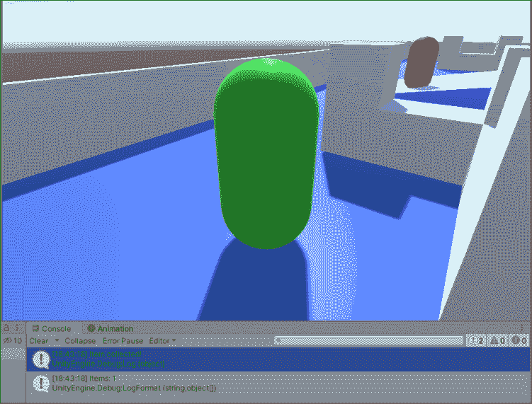

图 8.9：收集拾取物品

让我们按以下方式分解代码：

1.  我们创建了一个新的`GameBehavior`类型的变量来存储附加脚本的引用。

1.  我们使用`Start()`通过`Find()`在场景中查找`GameManager`并添加对`GetComponent()`的调用来初始化`GameManager`。

    你在 Unity 文档和社区项目中经常会看到这种单行代码。这样做是为了简化，但如果你觉得单独编写`Find()`和`GetComponent()`调用更舒服，那就直接这么做吧；清晰的显式格式化没有问题。

1.  在销毁物品预制体后，我们在`GameManager`类的`OnCollisionEnter()`方法中增加`Items`属性。

由于我们已经设置了`ItemBehavior`来处理碰撞逻辑，因此修改`OnCollisionEnter()`以在玩家拾取物品时与我们的管理类通信很容易。记住，像这样分离功能使得代码更加灵活，并且在开发过程中进行更改时更不容易出错。

最后缺少的部分是某种显示游戏数据的界面，这在编程和游戏开发中被称为 UI。本章的最终任务是熟悉 Unity 如何创建和处理 UI 代码。

# 创建 GUI

到目前为止，我们已经有几个脚本协同工作，为玩家提供移动、跳跃、收集和射击机制。然而，我们仍然缺少任何显示或视觉提示来显示玩家的统计数据，以及赢或输游戏的方式。在结束本节之前，我们将重点关注这两个主题。

## 显示玩家统计数据

UI 是任何计算机系统的视觉组件。鼠标光标、文件夹图标以及笔记本电脑上的程序都是 UI 元素。对于我们的游戏，我们想要一个简单的显示，让玩家知道他们收集了多少物品，他们的当前健康状态，以及当某些事件发生时提供更新的文本框。

在 Unity 中，UI 元素可以通过以下两种方式添加：

+   直接从**层级**面板中的**+**菜单添加，就像添加任何其他 GameObject 一样

+   使用代码中的内置 GUI 类

我们将坚持使用第一种方法，因为内置的 GUI 类是 Unity 遗留 UI 系统的一部分，而我们希望保持最新，对吧？这并不是说你不能完全通过编程实现，但对我们这个原型来说，较新的 UI 系统更合适。

如果你对 Unity 中的程序化 UI 感兴趣，请亲自查看文档：[`docs.unity3d.com/ScriptReference/GUI.html`](https://docs.unity3d.com/ScriptReference/GUI.html).

你的下一个任务是向游戏场景添加一个简单的 UI，显示收集到的物品、玩家健康和存储在`GameBehavior.cs`中的进度信息变量。

首先，让我们在我们的场景中创建三个文本对象。Unity 中的用户界面是基于 Canvas 的，这正好符合其名称。将 Canvas 想象成一块空白画布，你可以在上面绘制，Unity 会为你将其渲染在游戏世界之上。每次你在**层级**面板中创建第一个 UI 元素时，都会同时创建一个**Canvas**父对象。

1.  在**层级**面板中右键单击，选择**UI** | **文本**，并将新对象命名为**Health**。这将一次性创建一个**Canvas**父对象和新的**Text**对象！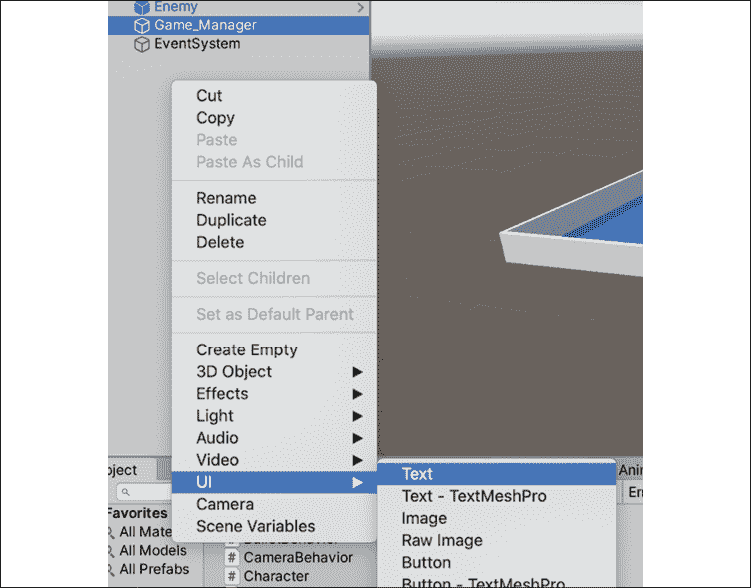

    图 8.10：创建文本元素

1.  要正确查看 Canvas，请在上面的**场景**标签页中选择**2D**模式。从这种视图来看，我们的整个层级就是左下角的那条细小的白色线条。

    +   即使在场景中**Canvas**和层级没有重叠，当游戏运行时，Unity 会自动正确地将它们叠加在一起！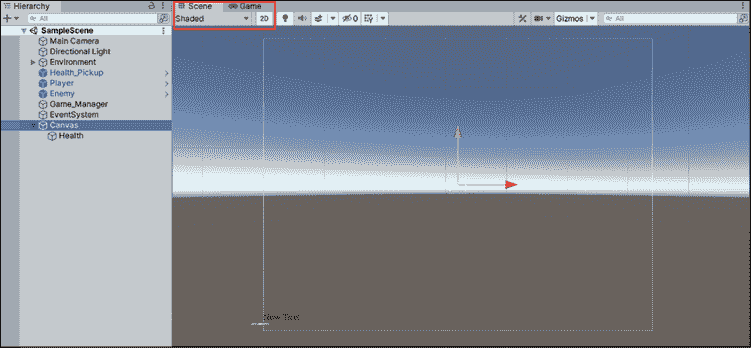

    图 8.11：Unity 编辑器中的 Canvas

1.  如果你选择**层级**中的**Health**对象，你会看到新创建的文本对象默认位于画布的左下角，并且在**检查器**面板中有一系列可自定义的属性，如文本和颜色！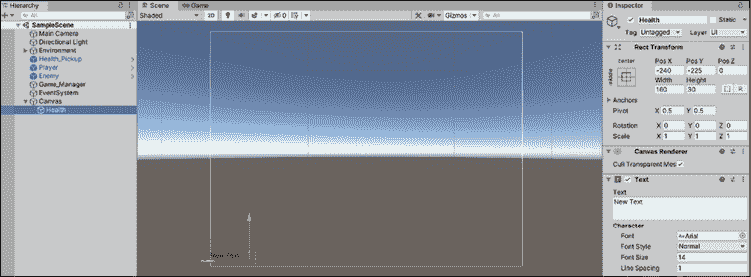

    图 8.12：Unity Canvas 上的文本元素

1.  在**层级**面板中选择**Health**对象，然后点击**检查器**中**Rect Transform**组件的**锚点**预设，并选择**左上角**。

    +   锚点设置 UI 元素在 Canvas 上的参考点，这意味着无论设备屏幕的大小如何，我们的健康点始终锚定在屏幕的左上角！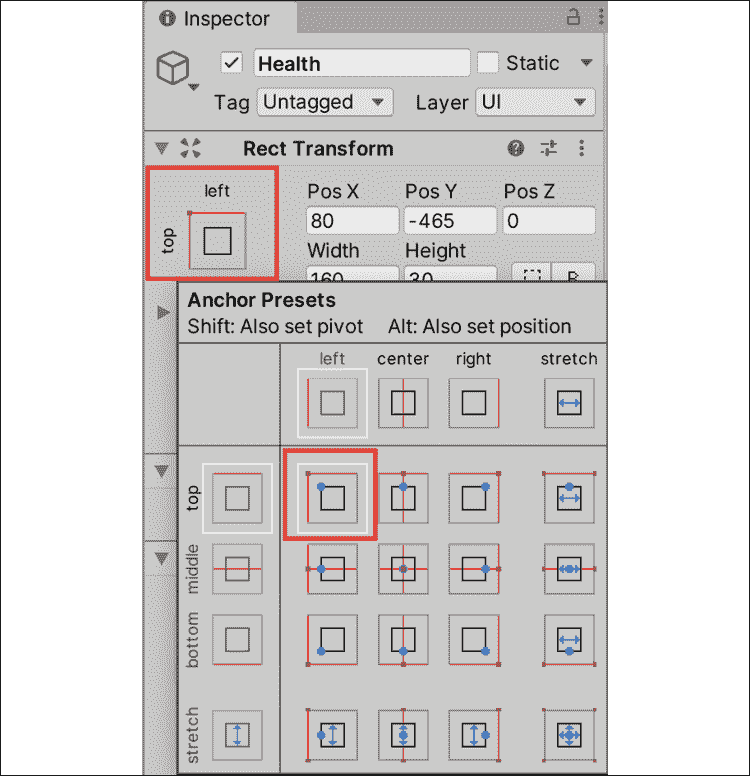

    图 8.13：设置锚点预设

1.  在**检查器**面板中，将**Rect Transform**的位置在**X**轴上设置为**100**，在**Y**轴上设置为**-30**，以将文本定位在右上角。同时，将**文本**属性更改为**玩家健康**：。我们将在稍后的步骤中通过代码设置实际值！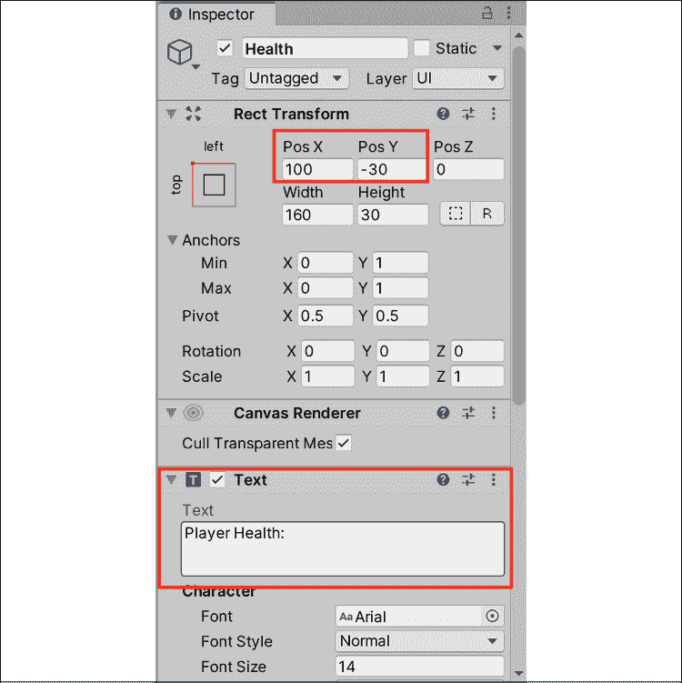

    图 8.14：设置文本属性

1.  重复步骤 1-5 以创建一个新的 UI**文本**对象，并将其命名为**Items**：

    +   将锚点预设设置为**左上角**，**Pos X**设置为**100**，**Pos Y**设置为**-60**

    +   将**文本**设置为**收集到的物品：**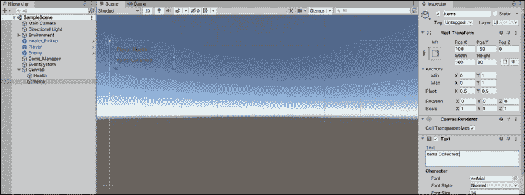

    图 8.15：创建另一个文本元素

1.  重复*步骤 1-5*以创建一个新的 UI**文本**对象，并将其命名为**Progress**：

    +   将锚点预设设置为**底居中**，**Pos X**设置为**0**，**Pos Y**设置为**15**，**Width**设置为**280**

    +   将**文本**设置为**收集所有物品并赢得自由！**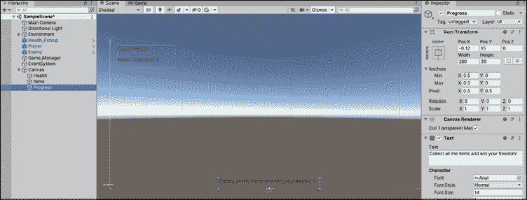

图 8.16：创建进度文本元素

现在我们已经设置了 UI，让我们将我们在游戏管理器脚本中已有的变量连接起来。按照以下步骤操作：

1.  使用以下代码更新`GameBehavior`以收集物品并在收集物品时显示屏幕文本：

    ```cs
    // 1
    using UnityEngine.UI; 
    public class GameBehavior : MonoBehaviour 
    {
        // 2
        public int MaxItems = 4;
        // 3
        public Text HealthText;     
        public Text ItemText;
        public Text ProgressText;
        // 4
        void Start()
        { 
            ItemText.text += _itemsCollected;
            HealthText.text += _playerHP;
        }
        private int _itemsCollected = 0;
        public int Items
        {
            get { return _itemsCollected; }
            set { 
                _itemsCollected = value; 
                **// 5**
                ItemText.text = "Items Collected: " + Items;
                // 6
                if(_itemsCollected >= MaxItems)
                {
                    ProgressText.text = "You've found all the items!";
                } 
                else
                {
                    ProgressText.text = "Item found, only " + (MaxItems - _itemsCollected) + " more to go!";
                }
            }
        }

        private int _playerHP = 10;
        public int HP 
        {
            get { return _playerHP; }
            set { 
                _playerHP = value;
                // 7
                HealthText.text = "Player Health: " + HP;
                Debug.LogFormat("Lives: {0}", _playerHP);
            }
        }
    } 
    ```

1.  在**层次结构**中选择**Game_Manager**，并将我们的三个文本对象逐个拖放到**检查器**中对应的`GameBehavior`脚本字段中：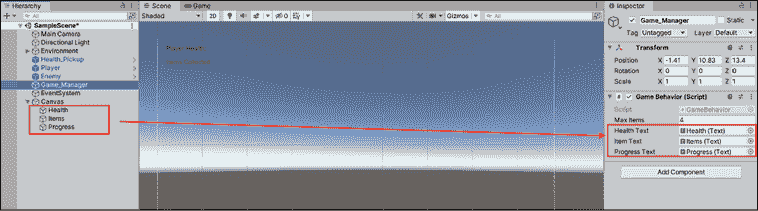

    图 8.17：将文本元素拖放到脚本组件中

1.  运行游戏并查看我们新的屏幕 GUI 框，如下面的截图所示：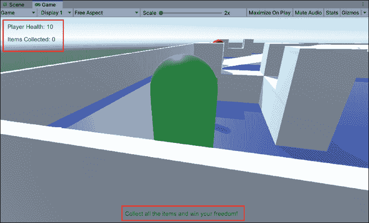

图 8.18：测试游戏模式下的 UI 元素

让我们分解以下代码：

1.  我们添加`UnityEngine.UI`命名空间，以便我们可以访问**文本**变量类型。

1.  我们为关卡中的最大物品数量创建了一个新的公共变量。

1.  我们创建了三个新的**文本**变量，并在**检查器**面板中连接它们。

1.  然后，我们使用`Start`方法通过**+=**运算符设置我们的健康和物品文本的初始值。

1.  每次收集到物品时，我们都会更新**ItemText**的`text`属性，以显示更新的`items`计数。

1.  我们在`_itemsCollected`的设置属性中声明了一个`if`语句。

    +   如果玩家收集到的物品数量超过或等于`MaxItems`，则他们赢了，并且`ProgressText.text`会更新。

    +   否则，`ProgressText.text`会显示还有多少物品需要收集。

1.  每当玩家的健康受损时（我们将在下一章中介绍），我们就会更新`HealthText`的`text`属性，以显示新的值。

现在我们玩游戏时，我们的三个 UI 元素会显示正确的值；当收集到物品时，`ProgressText`和`_itemsCollected`计数会更新，如下面的截图所示：

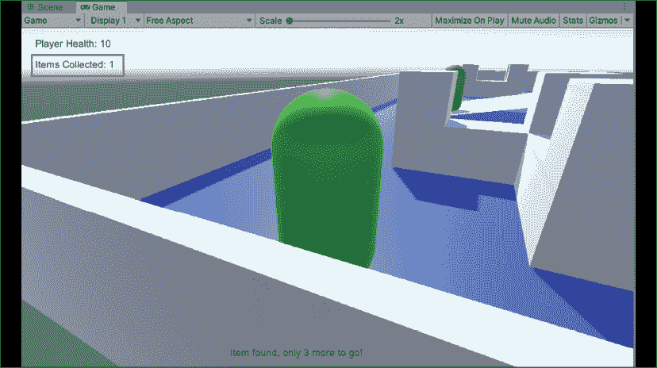

图 8.19：更新 UI 文本

每个游戏都可以赢或输。在本章的最后部分，你的任务是实现这些条件以及与之相关的用户界面。

## 胜负条件

我们已经实现了核心游戏机制和简单的 UI，但“英雄诞生”仍然缺少一个重要的游戏设计元素：其胜负条件。这些条件将管理玩家如何赢得或输掉游戏，并根据情况执行不同的代码。

在 *第六章* 的游戏文档中，*用 Unity 搞定一切*，我们设置了以下胜利和失败条件：

+   收集关卡中的所有物品，并且至少剩余 1 点生命值以赢得胜利

+   从敌人那里受到伤害直到生命值降至 0 以失败

这些条件将影响我们的 UI 和游戏机制，但我们已经设置了 `GameBehavior` 以高效地处理这些。我们的 `get` 和 `set` 属性将处理任何与游戏相关的逻辑以及玩家胜利或失败时对 UI 的更改。

我们将在本节中实现胜利条件的逻辑，因为我们已经有了拾取系统。当我们进入下一章的敌人 AI 行为时，我们将添加失败条件的逻辑。你的下一个任务是确定在代码中何时游戏胜利。

我们总是希望给玩家提供清晰且即时的反馈，因此我们将首先添加胜利条件的逻辑，如下所示：

1.  将 `GameBehavior` 更新为以下代码：

    ```cs
    public class GameBehavior : MonoBehaviour 
    { 
        **// 1**
        **public** **Button WinButton;**
        private int _itemsCollected = 0;
        public int Items
        {
            get { return _itemsCollected; }
            set
            {
                _itemsCollected = value;
                ItemText.text = "Items Collected: " + Items;

                if (_itemsCollected >= MaxItems)
                {
                    ProgressText.text = "You've found all the items!";

                    **// 2**
                    **WinButton.gameObject.SetActive(****true****);**
                }
                else
                {
                    ProgressText.text = "Item found, only " + (MaxItems - _itemsCollected) + " more to go!";
                }
            }
        }
    } 
    ```

1.  在 **层次结构** 中右键单击，选择 **UI** | **按钮**，然后将其命名为 **胜利条件**：

    +   选择 **胜利条件** 并将 **X 坐标** 和 **Y 坐标** 设置为 **0**，其 **宽度** 为 **225**，**高度** 为 **115**！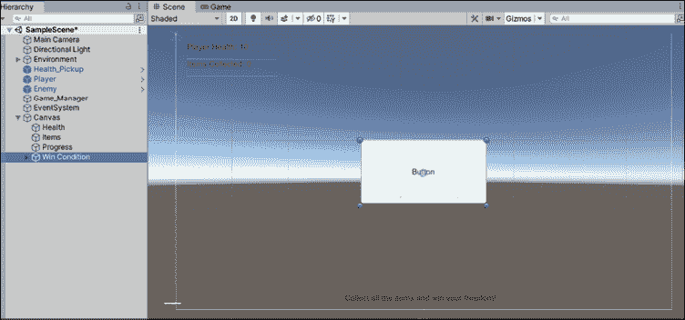

    图 8.20：创建 UI 按钮

1.  点击 **胜利条件** 按钮右侧的箭头以展开其文本子对象，然后将文本更改为 **你赢了**：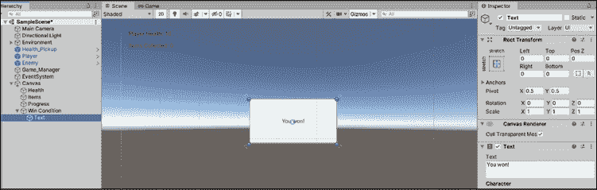

    图 8.21：更新按钮文本

1.  再次选择 **胜利条件** 父对象，然后在 **检查器** 的右上角点击勾选图标！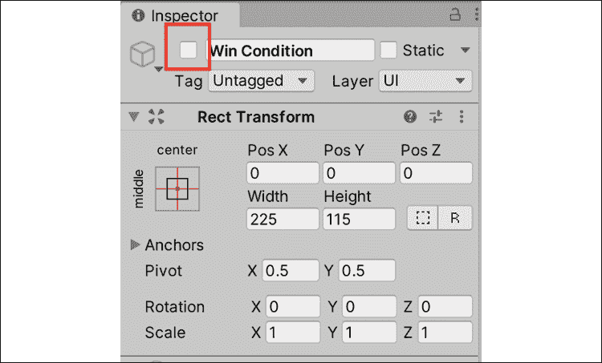

    图 8.22：停用游戏对象

    这将隐藏按钮，直到我们赢得游戏：

    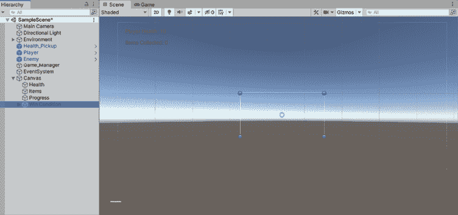

    图 8.23：测试隐藏的 UI 按钮

1.  在 **层次结构** 中选择 **Game_Manager**，然后将 **胜利条件** 按钮从 **层次结构** 拖到 **检查器** 中的 **游戏行为（脚本）**，就像我们处理文本对象一样：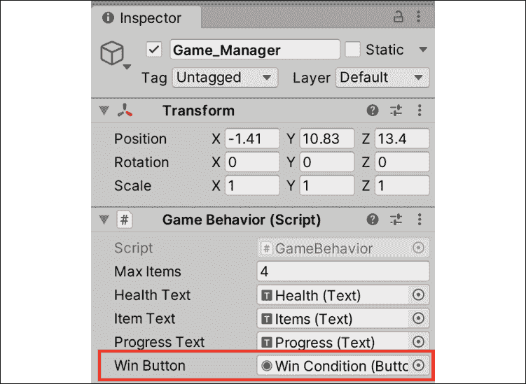

    图 8.24：将 UI 按钮拖放到脚本组件中

1.  在 **检查器** 中将 **最大物品数** 更改为 `1` 以测试新屏幕，如图下截图所示：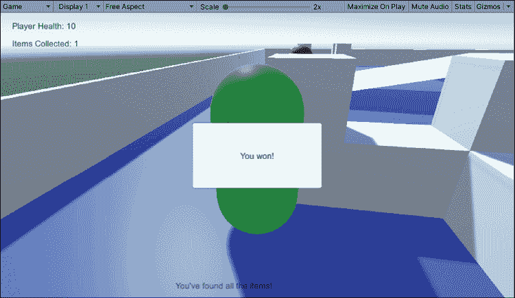

    图 8.25：显示胜利界面

让我们分解以下代码：

1.  我们创建了一个 UI 按钮变量，用于连接到 **层次结构** 中的胜利条件按钮。

1.  由于我们在游戏开始时将胜利条件按钮设置为 **隐藏**，因此当游戏胜利时，我们将重新激活它。

将 **最大物品数** 设置为 `1`，当收集场景中的唯一 `Pickup_Item` 时，**胜利** 按钮将显示出来。点击按钮目前没有任何作用，但我们将在这部分内容中解决它。

## 使用指令和命名空间暂停和重新启动游戏

目前，我们的胜利条件按预期工作，但玩家仍然可以控制胶囊，并且一旦游戏结束，就没有重启游戏的方法。Unity 在`Time`类中提供了一个名为`timeScale`的属性，将其设置为`0`可以冻结游戏场景。然而，要重启游戏，我们需要访问一个名为`SceneManagement`的**命名空间**，默认情况下我们的类无法访问。

命名空间收集并按特定名称组织一组类，以组织大型项目并避免可能具有相同名称的脚本之间的冲突。需要向一个类添加一个`using`指令来访问命名空间的类。

从 Unity 创建的所有 C#脚本都包含三个默认的`using`指令，如下面的代码片段所示：

```cs
using System.Collections;
using System.Collections.Generic;
using UnityEngine; 
```

这些允许访问常见的命名空间，但 Unity 和 C#提供了许多其他可以通过`using`关键字后跟命名空间名称来添加的命名空间。

由于我们的游戏在玩家获胜或失败时需要暂停和重启，这是一个使用默认情况下不包括在新的 C#脚本中的命名空间的好时机。

1.  将以下代码添加到`GameBehavior`中并播放：

    ```cs
    using System.Collections;
    using System.Collections.Generic;
    using UnityEngine;
    using UnityEngine.UI;
    **// 1**
    **using** **UnityEngine.SceneManagement;**
    public class GameBehavior : MonoBehaviour 
    {
        // ... No changes needed ...
        private int _itemsCollected = 0;
        public int Items
        {
            get { return _itemsCollected; }
            set { 
                _itemsCollected = value;

                if (_itemsCollected >= MaxItems)
                {
                    ProgressText.text = "You've found all the items!";
                    WinButton.gameObject.SetActive(true);

                    **// 2**
                    **Time.timeScale =** **0f****;**
                }
                else
                {
                    ProgressText.text= "Item found, only " + (MaxItems – _itemsCollected) + " more to go!";
                }
            }
        }
        **public****void****RestartScene****()**
        **{**
            **// 3**
            **SceneManager.LoadScene(****0****);**
            **// 4**
            **Time.timeScale =** **1f****;**
        **}**

        // ... No other changes needed ...
    } 
    ```

1.  从**层次结构**中选择**胜利条件**，在**检查器**中向下滚动到**按钮组件**的**OnClick**部分，然后点击加号图标：

    +   每个 UI 按钮都有一个**OnClick**事件，这意味着你可以将脚本中的一个方法分配给按钮，以便在按钮被按下时执行。

    +   当按钮被点击时，可以有多个方法被触发，但在这个情况下我们只需要一个！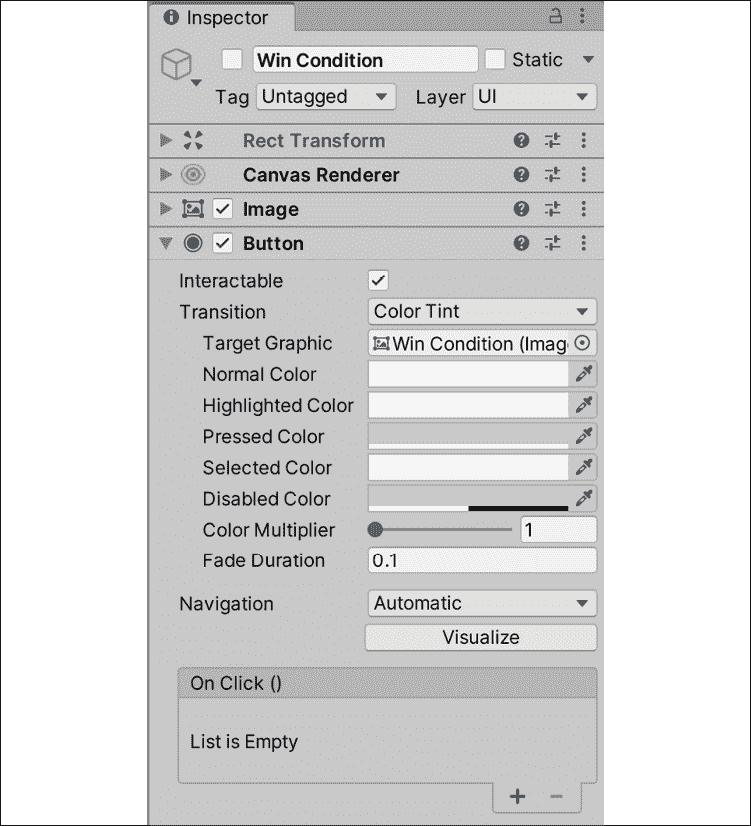

    图 8.26：按钮的 OnClick 部分

1.  从**层次结构**中，将**Game_Manager**拖到**Runtime**下的槽中，告诉按钮我们想要选择一个来自我们的管理脚本的方法，以便在按钮被按下时触发：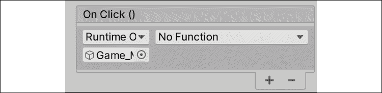

    图 8.27：在 OnClick 中设置游戏管理器对象

1.  选择**无功能**下拉菜单，选择**GameBehavior** | **RestartScene ()**来设置按钮要执行的方法！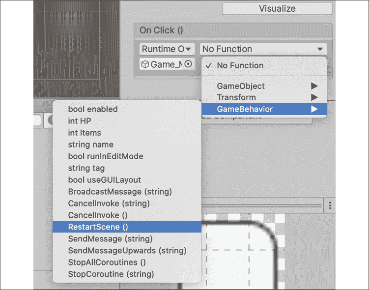

    图 8.28：选择按钮点击的重启方法

1.  前往**窗口** | **渲染** | **照明**，在底部选择**生成照明**。确保**自动生成**没有被选中：

此步骤是解决 Unity 问题所必需的，该问题在没有任何照明的情况下重新加载场景。

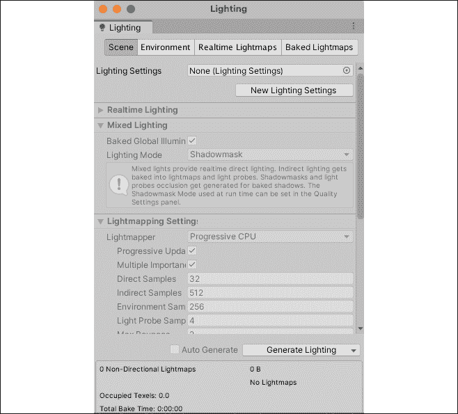

图 8.29：Unity 编辑器中的照明面板

让我们分解以下代码：

1.  我们使用`using`关键字添加`SceneManagement`命名空间，它处理所有与场景相关的逻辑，如创建加载场景。

1.  我们将`Time.timeScale`设置为`0`，以便在显示胜利屏幕时暂停游戏，这将禁用任何输入或移动。

1.  我们创建一个新的方法`RestartScene`，并在胜利屏幕按钮被点击时调用`LoadScene()`：

    +   `LoadScene()`接受一个场景索引作为`int`参数。

    +   由于我们的项目中只有一个场景，我们使用索引`0`从开始重启游戏。

1.  我们将 `Time.timeScale` 重置为默认值 `1`，这样当场景重新启动时，所有控制和行为将能够再次执行。

现在，当你收集物品并点击胜利屏幕按钮时，关卡将重新开始，所有脚本和组件都将恢复到其原始值，并设置好另一轮！

# 摘要

恭喜！*英雄诞生* 现在是一个可玩的原型。我们实现了跳跃和射击机制，管理物理碰撞和对象生成，并添加了一些基本的 UI 元素来显示反馈。我们甚至做到了当玩家获胜时重置关卡。

本章引入了许多新主题，重要的是要回顾并确保你理解了我们编写的代码中包含的内容。特别关注我们对枚举、`get` 和 `set` 属性以及命名空间的讨论。从现在开始，随着我们进一步深入 C# 语言的潜力，代码将变得更加复杂。

在下一章中，我们将开始工作，让我们的敌人 GameObject 在我们靠近时注意到我们，从而实现一个跟随和射击协议，这将提高玩家的赌注。

# 快速问答 - 与机制一起工作

1.  枚举存储什么类型的数据？

1.  你如何在活动场景中创建一个 Prefab GameObject 的副本？

1.  哪些变量属性允许你在引用或修改其值时添加功能？

1.  哪个 Unity 方法显示场景中的所有 UI 对象？

# 加入我们的 Discord！

与其他用户、Unity/C# 专家和 Harrison Ferrone 一起阅读这本书。提出问题，为其他读者提供解决方案，通过 *Ask Me Anything* 会话与作者聊天等等。

立即加入！

[`packt.link/csharpunity2021`](https://packt.link/csharpunity2021)


