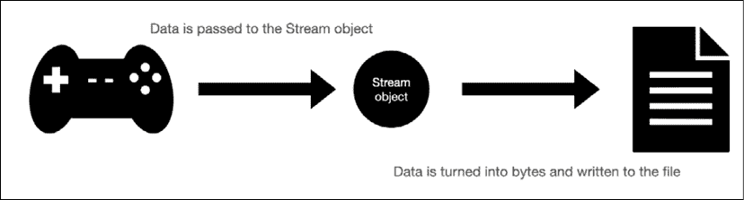

# 第十二章：保存、加载和序列化数据

你玩过的每一款游戏都使用数据，无论是你的玩家统计数据、游戏进度，还是在线多人排行榜。你最喜欢的游戏也管理内部数据，这意味着程序员使用了硬编码的信息来构建关卡、跟踪敌人统计数据，并编写有用的工具。换句话说，数据无处不在。

在本章中，我们将从 C#和 Unity 如何处理你电脑上的文件系统开始，然后继续介绍读取、写入和序列化我们的游戏数据。我们的重点是处理你可能会遇到的最常见的三种数据格式：文本文件、XML 和 JSON。

到本章结束时，你将对你电脑的文件系统、数据格式和基本读写功能有一个基础的了解。这将是你构建游戏数据的基础，为你的玩家创造更加丰富和吸引人的体验。你也将处于一个很好的位置来思考哪些游戏数据足够重要，值得保存，以及你的 C#类和对象在不同数据格式中的样子。

在此过程中，我们将涵盖以下主题：

+   介绍文本、XML 和 JSON 格式

+   理解文件系统

+   处理不同的流类型

+   阅读和写入游戏数据

+   序列化对象

# 介绍数据格式

在编程中，数据可以采取不同的形式，但在你数据之旅的开始阶段，你应该熟悉以下三种格式：

+   **文本**，就是你现在正在阅读的内容

+   **XML**（**可扩展标记语言**），是一种编码文档信息的方式，使其对你和电脑都是可读的

+   **JSON**（**JavaScript 对象表示法**），是一种由属性值对和数组组成的人可读文本格式

这些数据格式各自都有其优势和劣势，以及在编程中的应用。例如，文本通常用于存储更简单、非层次结构化或嵌套的信息。XML 在存储文档格式信息方面做得更好，而 JSON 具有更广泛的功能，特别是在数据库信息和应用程序与服务器通信方面。

你可以在[`www.xml.com`](https://www.xml.com)找到更多关于 XML 的信息，以及[`www.json.org`](https://www.json.org)关于 JSON 的信息。

数据在任何编程语言中都是一个很大的主题，所以让我们从下一两个部分中实际了解 XML 和 JSON 格式开始。

## XML 的分解

一个典型的 XML 文件具有标准化的格式。XML 文档的每个元素都有一个开标签（`<element_name>`），一个闭标签（`</element_name>`），并支持标签属性（`<element_name attribute= "attribute_name"></element_name>`）。一个基本的文件将从使用的版本和编码开始，然后是起始或根元素，接着是一系列元素项，最后是闭元素。作为一个蓝图，它看起来像这样：

```cs
<?xml version="1.0" encoding="utf-8"?>
<root_element>
    <element_item>[Information goes here]</element_item>
    <element_item>[Information goes here]</element_item>
    <element_item>[Information goes here]</element_item>
</root_element> 
```

XML 数据也可以通过使用子元素来存储更复杂的对象。例如，我们将使用本书中早些时候编写的 `Weapon` 类将武器列表转换为 XML。由于每个武器都有名称和伤害值属性，它看起来会是这样：

```cs
// 1
<?xml version="1.0"?>
// 2
<ArrayOfWeapon>
     // 3
    <Weapon>
     // 4
        <name>Sword of Doom</name>
        <damage>100</damage>
     // 5
    </Weapon>
    <Weapon>
        <name>Butterfly knives</name>
        <damage>25</damage>
    </Weapon>
    <Weapon>
        <name>Brass Knuckles</name>
        <damage>15</damage>
    </Weapon>
// 6
</ArrayOfWeapon> 
```

让我们分解上面的例子，以确保我们理解正确：

1.  XML 文档以正在使用的版本开始

1.  根元素使用名为 `ArrayOfWeapon` 的开标签声明，它将包含所有元素项

1.  一个名为 `Weapon` 的开标签创建了一个武器项目

1.  其子属性通过在单行上使用开闭标签添加，用于 `name` 和 `damage`

1.  武器项目关闭，并添加了两个更多武器项目

1.  数组关闭，标志着文档的结束

好消息是，我们的应用程序不需要手动以这种格式写入数据。C# 有一个完整的类库和用于帮助我们直接将简单的文本和类对象转换为 XML 的方法和类。

我们将在稍后深入实际代码示例，但首先我们需要了解 JSON 的工作原理。

## 分解 JSON

JSON 数据格式与 XML 类似，但没有标签。相反，一切都是基于属性-值对，就像我们在 *第四章*，*控制流和集合类型* 中使用的 **Dictionary** 集合类型。每个 JSON 文档都以一个父字典开始，该字典包含您需要的属性-值对。字典使用开闭花括号（`{}`），冒号分隔每个属性和值，每个属性-值对由逗号分隔：

```cs
// Parent dictionary for the entire file
{
    // List of attribute-value pairs where you store your data
    "attribute_name": value,
    "attribute_name": value
} 
```

JSON 也可以通过将属性-值对的值设置为属性-值对的数组来具有子结构或嵌套结构。例如，如果我们想存储一个武器，它看起来会是这样：

```cs
// Parent dictionary
{
    // Weapon attribute with its value set to an child dictionary
    "weapon": {
          // Attribute-value pairs with weapon data
          "name": "Sword of Doom",
          "damage": 100
    }
} 
```

最后，JSON 数据通常由列表、数组或对象组成。继续我们的例子，如果我们想存储玩家可以选择的所有武器的列表，我们会使用一对方括号来表示一个数组：

```cs
// Parent dictionary
{
    // List of weapon attribute set to an array of weapon objects
    "weapons": [
        // Each weapon object stored as its own dictionary
        {
            "name": "Sword of Doom",
            "damage": 100
        },
        {
            "name": "Butterfly knives",
            "damage": 25
        },
        {
            "name": "Brass Knuckles",
            "damage": 15
        }
    ]
} 
```

您可以混合使用这些技术来存储任何需要的复杂数据，这是 JSON 的主要优势之一。但就像 XML 一样，不要被新的语法所压倒——C# 和 Unity 都有辅助类和方法，可以在不进行任何繁重操作的情况下将文本和类对象转换为 JSON。阅读 XML 和 JSON 类似于学习一门新语言——您使用得越多，就越熟悉。很快，它就会变得像本能一样！

现在我们已经涉猎了数据格式化的基础知识，我们可以开始讨论计算机文件系统的工作原理以及我们可以从我们的 C# 代码中访问哪些属性。

# 理解文件系统

当我们提到文件系统时，我们谈论的是你已经熟悉的东西——文件和文件夹在你的计算机上是如何创建、组织和存储的。当你你在计算机上创建一个新的文件夹时，你可以给它命名，并在其中放置文件或其他文件夹。它还由一个图标表示，这个图标既是视觉提示，也是拖放和移动到任何你想要的位置的方式。

你可以在代码中做的一切，你都可以在桌面上做。你所需要的是文件夹的名称，或者称为目录，以及一个存储位置。任何时候你想添加文件或子文件夹，你引用父目录并添加你的新内容。

为了使文件系统更加清晰，让我们开始构建`DataManager`类：

1.  右键点击**层次结构**并选择**创建空文件**，然后命名为**数据管理器**：

    图 12.1：数据管理器在层次结构中

1.  在**层次结构**中选择**数据管理器**对象，并将我们在第十章“回顾类型、方法和类”中创建的`DataManager`脚本从**脚本**文件夹拖放到**检查器**中：

    图 12.2：数据管理器在检查器中

1.  打开`DataManager`脚本，并使用以下代码更新它以打印出一些文件系统属性：

    ```cs
    using System.Collections;
    using System.Collections.Generic;
    using UnityEngine;

    **// 1**
    **using** **System.IO;**

    public class DataManager : MonoBehaviour, IManager
    {
        // ... No variable changes needed ...

        public void Initialize()
        {
            _state = "Data Manager initialized..";
            Debug.Log(_state);

            **// 2**
            **FilesystemInfo();**
        }
        public void FilesystemInfo()
        {
            **// 3**
            **Debug.LogFormat(****"Path separator character: {0}"****,**
              **Path.PathSeparator);**
            **Debug.LogFormat(****"Directory separator character: {0}"****,**
              **Path.DirectorySeparatorChar);**
            **Debug.LogFormat(****"Current directory: {0}"****,**
              **Directory.GetCurrentDirectory());**
            **Debug.LogFormat(****"Temporary path: {0}"****,**
              **Path.GetTempPath());**
        }
    } 
    ```

让我们分解一下代码：

1.  首先，我们添加了`System.IO`命名空间，其中包含我们与文件系统一起工作所需的所有类和方法。

1.  我们将调用我们在下一步中创建的`FilesystemInfo`方法。

1.  我们创建了`FilesystemInfo`方法来打印出一些文件系统属性。每个操作系统处理其文件系统路径的方式都不同——路径是目录或文件在字符串中的位置。在 Mac 上：

    +   路径由冒号(`:`)分隔

    +   目录由正斜杠(`/`)分隔

    +   当前目录路径是存储*英雄诞生*项目的地方

    +   临时路径是文件系统临时文件夹的位置

如果你使用的是其他平台和操作系统，在处理文件系统之前，请确保自己检查`Path`和`Directory`方法。

运行游戏并查看输出：


图 12.3：数据管理器的控制台消息

`Path`和`Directory`类是我们将在以下部分构建的基础，我们将使用它们来存储数据。然而，它们都是大型类，所以我鼓励你在继续你的数据之旅时查看它们的文档。

你可以在[`docs.microsoft.com/en-us/dotnet/api/system.io.path`](https://docs.microsoft.com/en-us/dotnet/api/system.io.path)找到关于`Path`类的更多文档，以及在[`docs.microsoft.com/en-us/dotnet/api/system.io.directory`](https://docs.microsoft.com/en-us/dotnet/api/system.io.directory)找到关于`Directory`类的更多文档。

现在我们已经在`DataManager`脚本中打印出了简单的文件系统属性示例，我们可以创建一个文件系统路径到我们想要保存数据的位置。

## 处理资产路径

在一个纯 C# 应用程序中，你必须选择保存文件的文件夹，并将文件夹路径以字符串形式写出来。然而，Unity 提供了一个方便的预配置路径，作为 `Application` 类的一部分，你可以在这里存储持久游戏数据。持久数据意味着信息在每次程序运行时都会保存并保留，这使得它非常适合此类玩家信息。

重要的是要知道，Unity 持久数据目录的路径是跨平台的，这意味着如果你为 iOS、Android、Windows 等构建游戏，它是不同的。你可以在 Unity 文档中找到更多信息，请参阅 [`docs.unity3d.com/ScriptReference/Application-persistentDataPath.html`](https://docs.unity3d.com/ScriptReference/Application-persistentDataPath.html)。

我们需要更新 `DataManager` 的唯一操作是创建一个私有变量来保存我们的路径字符串。我们将其设置为私有，因为我们不希望任何其他脚本能够访问或更改该值。这样，`DataManager` 负责所有与数据相关的逻辑，而不会涉及其他方面。

将以下变量添加到 `DataManager.cs` 文件中：

```cs
public class DataManager : MonoBehaviour, IManager
{
    // ... No other variable changes needed ...

    **// 1**
    **private****string** **_dataPath;**
    **// 2**
    **void****Awake****()**
    **{**
        **_dataPath = Application.persistentDataPath +** **"/Player_Data/"****;**

        **Debug.Log(_dataPath);**
    **}**

    // ... No other changes needed ...
} 
```

让我们分解我们的代码更新：

1.  我们创建了一个私有变量来保存数据路径字符串

1.  我们将数据路径字符串设置为应用程序的 `persistentDataPath` 值，使用开放和闭合的斜杠添加了一个名为 **Player_Data** 的新文件夹名称，并打印出了完整的路径：

    +   重要的是要注意，`Application.persistentDataPath` 只能在 `MonoBehaviour` 方法（如 `Awake()`、`Start()`、`Update()` 等）中使用，并且游戏需要运行，Unity 才能返回一个有效的路径。

    图 12.4：Unity 持久数据文件的文件路径

由于我使用的是 Mac，我的持久数据文件夹嵌套在我的 `/Users` 文件夹中。如果你使用的是不同设备，请记住查看 [`docs.unity3d.com/ScriptReference/Application-persistentDataPath.html`](https://docs.unity3d.com/ScriptReference/Application-persistentDataPath.html) 以了解你的数据存储位置。

当你不在使用预定义的资产路径，如 Unity 的持久数据目录时，C# 中的 `Path` 类提供了一个方便的 `Combine` 方法来自动配置路径变量。`Combine()` 方法可以接受最多四个字符串作为输入参数，或者是一个表示路径组件的字符串数组。例如，你的 `User` 目录的路径可能看起来像这样：

```cs
var path = Path.Combine("/Users", "hferrone", "Chapter_12"); 
```

这解决了路径和目录中分隔字符以及前后斜杠的任何潜在跨平台问题。

现在我们有了存储数据的路径，让我们在文件系统中创建一个新的目录或文件夹。这将使我们能够安全地存储数据，并在游戏运行之间保持数据，而不是在临时存储中，那里数据会被删除或覆盖。

## 创建和删除目录

创建新的目录文件夹很简单——我们检查是否在相同的路径上已经存在具有相同名称的目录，如果没有，我们告诉 C#为我们创建它。每个人在处理文件和文件夹中的重复项都有自己的方法，所以在本章的其余部分，我们将重复大量的重复检查代码。

我仍然建议在现实世界的应用中遵循**DRY**（**不要重复自己**）原则；重复检查代码在这里只重复是为了使示例完整且易于理解：

1.  将以下方法添加到`DataManager`中：

    ```cs
    public void NewDirectory()
    {
        // 1
        if(Directory.Exists(_dataPath))
        {
            // 2
            Debug.Log("Directory already exists...");
            return;
        }
        // 3
        Directory.CreateDirectory(_dataPath);
        Debug.Log("New directory created!");
    } 
    ```

1.  在`Initialize()`中调用新方法：

    ```cs
    public void Initialize()
    {
        _state = "Data Manager initialized..";
        Debug.Log(_state);
        **NewDirectory();**
    } 
    ```

让我们分解我们所做的：

1.  首先，我们使用上一步创建的路径检查目录文件夹是否已经存在

1.  如果它已经被创建，我们在控制台中发送给自己一条消息，并使用`return`关键字退出方法，不再继续

1.  如果目录文件夹不存在，我们将数据路径传递给`CreateDirectory()`方法，并记录它已被创建

运行游戏并确保你在控制台中看到正确的调试日志，以及在你持久化数据文件夹中的新目录文件夹。

如果找不到，请使用我们在上一步中打印出的`_dataPath`值。


图 12.5：创建新目录的控制台消息


图 12.6：在桌面上创建的新目录

如果你再次运行游戏，将不会创建重复的目录文件夹，这正是我们想要的类型的安全代码。


图 12.7：重复目录文件夹的控制台消息

删除目录与创建目录非常相似——我们检查它是否存在，然后使用`Directory`类删除我们传递的路径上的任何文件夹。

将以下方法添加到`DataManager`中：

```cs
public void DeleteDirectory()
{
    // 1
    if(!Directory.Exists(_dataPath))
    {
        // 2
        Debug.Log("Directory doesn't exist or has already been
deleted...");

        return;
    }
    // 3
    Directory.Delete(_dataPath, true);
    Debug.Log("Directory successfully deleted!");
} 
```

由于我们想要保留刚刚创建的目录，你现在不需要调用这个函数。然而，如果你想尝试它，你只需要在`Initialize()`函数中将`NewDirectory()`替换为`DeleteDirectory()`。

空的目录文件夹并不特别有用，所以让我们创建我们的第一个文本文件，并将其保存在我们的新位置。

## 创建、更新和删除文件

与文件一起工作与创建和删除目录相似，所以我们已经有了需要的所有基本构建块。为了确保我们不重复数据，我们将检查文件是否已经存在，如果没有，我们将在新的目录文件夹中创建一个新的文件。

在本节中，我们将使用`File`类，它包含许多有用的方法来帮助我们实现我们的功能。你可以在这里找到完整的列表：[`docs.microsoft.com/en-us/dotnet/api/system.io.file`](https://docs.microsoft.com/en-us/dotnet/api/system.io.file)。

在我们开始处理文件之前，有一个重要的问题需要强调，那就是在添加文本之前需要打开文件，在完成操作后需要关闭文件。如果你没有关闭你正在程序中处理的文件，它将保持在程序的内存中。这不仅会消耗计算资源，用于你未积极编辑的内容，还可能创建潜在的内存泄漏。关于这些内容，我们将在本章后面进行更多介绍。

我们将为每个要执行的操作（创建、更新和删除）编写单独的方法。我们还将检查我们正在处理的文件是否存在，这在每种情况下都是重复的。我已经将本书的这一部分结构化，以便你可以牢固掌握每个程序。然而，在你掌握了基础知识之后，你可以绝对地将它们合并成更经济的方法。

按照以下步骤操作：

1.  为新文本文件添加一个新的私有字符串路径，并在`Awake`中设置其值：

    ```cs
    private string _dataPath;
    **private****string** **_textFile;**
    void Awake()
    {
        _dataPath = Application.persistentDataPath + "/Player_Data/";

        Debug.Log(_dataPath);

        **_textFile = _dataPath +** **"Save_Data.txt"****;**
    } 
    ```

1.  在`DataManager`中添加一个新方法：

    ```cs
    public void NewTextFile()
    {
        // 1
        if (File.Exists(_textFile))
        {
            Debug.Log("File already exists...");
            return;
        }
        // 2
        File.WriteAllText(_textFile, "<SAVE DATA>\n\n");
        // 3
        Debug.Log("New file created!");
    } 
    ```

1.  在`Initialize()`中调用新方法：

    ```cs
    public void Initialize()
    {
        _state = "Data Manager initialized..";
        Debug.Log(_state);

        FilesystemInfo();
        NewDirectory();
        **NewTextFile();**
    } 
    ```

让我们分析我们的新代码：

1.  我们检查文件是否已存在，如果存在，我们`return`出方法以避免重复：

    +   值得注意的是，这种方法对于不会更改的新文件效果很好。我们将在下一项练习中介绍如何更新和覆盖文件中的数据。

1.  我们使用`WriteAllText()`方法，因为它将我们需要的所有操作都集成在一个方法中：

    +   使用我们的`_textFile`路径创建了一个新文件

    +   我们添加一个标题字符串，表示`<SAVE DATA>`，并添加两个带有`\n`字符的新行

    +   然后文件会自动为我们关闭

1.  我们打印一条日志消息，让我们知道一切顺利

现在你玩游戏时，你将在控制台中看到调试日志，并在你的持久数据文件夹位置看到新的文本文件：


图 12.8：创建新文件的控制台消息


图 12.9：在桌面上创建的新文件

为了更新我们的新文本文件，我们将执行一系列类似的操作。知道何时开始新游戏总是很令人愉快，因此你的下一个任务是添加一个方法，将此信息写入我们的存档数据文件：

1.  在`DataManager`的顶部添加一个新的`using`指令：

    ```cs
    using System.Collections;
    using System.Collections.Generic;
    using UnityEngine;
    using System.IO;
    **using** **System;** 
    ```

1.  在`DataManager`中添加一个新方法：

    ```cs
    public void UpdateTextFile()
    {
        // 1
        if (!File.Exists(_textFile))
        {
            Debug.Log("File doesn't exist...");
            return;
        }

        // 2
        File.AppendAllText(_textFile, $"Game started: {DateTime.Now}\n");
        // 3
        Debug.Log("File updated successfully!");
    } 
    ```

1.  在`Initialize()`中调用新方法：

    ```cs
    public void Initialize()
    {
        _state = "Data Manager initialized..";
        Debug.Log(_state);

        FilesystemInfo();
        NewDirectory();
        NewTextFile();
        **UpdateTextFile();**
    } 
    ```

让我们分析上述代码：

1.  如果文件存在，我们不希望重复它，所以我们只需退出方法而不采取任何进一步的操作

1.  如果文件确实存在，我们使用另一个名为`AppendAllText()`的集成方法来添加游戏开始时间：

    +   此方法打开文件

    +   它添加一个新行文本，该文本作为方法参数传入

    +   它关闭文件

1.  打印一条日志消息，让我们知道一切顺利

再次玩游戏，你将看到我们的控制台消息和文本文件中的新行，包含新游戏的日期和时间：


图 12.10：更新文本文件的控制台消息


图 12.11：文本文件数据已更新

为了读取我们新的文件数据，我们需要一个方法来获取所有文件文本并将其作为字符串返回给我们。幸运的是，`File` 类有方法可以做到这一点：

1.  向 `DataManager` 添加一个新方法：

    ```cs
    // 1
    public void ReadFromFile(string filename)
    {
        // 2
        if (!File.Exists(filename))
        {
            Debug.Log("File doesn't exist...");
            return;
        }

        // 3
        Debug.Log(File.ReadAllText(filename));
    } 
    ```

1.  在 `Initialize()` 中调用新方法，并将 `_textFile` 作为参数传入：

    ```cs
    public void Initialize()
    {
        _state = "Data Manager initialized..";
        Debug.Log(_state);

        FilesystemInfo();
        NewDirectory();
        NewTextFile();
        UpdateTextFile();
        **ReadFromFile(_textFile);**
    } 
    ```

让我们分解一下新方法的代码：

1.  我们创建了一个新方法，该方法接受一个字符串参数，用于指定我们想要读取的文件

1.  如果文件不存在，则不需要采取任何操作，所以我们退出方法

1.  我们使用 `ReadAllText()` 方法获取所有文件文本数据作为字符串，并将其打印到控制台。

玩游戏，你会在控制台中看到一个包含我们之前保存的新保存的控制台消息！


图 12.12：从文件读取保存的文本数据的控制台消息

最后，如果我们想删除我们的文本文件，我们可以添加一个方法。实际上我们不会使用这个方法，因为我们想保留我们的文本文件不变，但你可以自己尝试一下：

```cs
public void DeleteFile(string filename)
{
    if (!File.Exists(filename))
    {
        Debug.Log("File doesn't exist or has already been deleted...");

        return;
    }

    File.Delete(_textFile);
    Debug.Log("File successfully deleted!");
} 
```

现在我们已经稍微深入了解了文件系统，是时候讨论一种稍微升级的信息处理方式了——数据流！

# 处理流

到目前为止，我们一直让 `File` 类为我们处理数据中的繁重工作。我们还没有讨论的是，`File` 类，或者任何处理读取和写入数据的类，是如何在底层完成这些工作的。

对于计算机来说，数据由字节组成。将字节想象成计算机的原子，它们构成了所有东西——甚至有一个 C# 的 `byte` 类型。当我们读取、写入或更新文件时，我们的数据被转换成一个字节数组，然后通过 `Stream` 流向或从文件传输。数据流负责将数据作为字节序列传输到或从文件，作为我们游戏应用程序和数据文件之间的翻译者或中介。 



图 12.13：将流数据写入文件的示意图

`File` 类会自动为我们使用 `Stream` 对象，并且有不同功能的 `Stream` 子类：

+   使用 `FileStream` 读取和写入文件中的数据

+   使用 `MemoryStream` 读取和写入内存中的数据

+   使用 `NetworkStream` 读取和写入其他网络计算机的数据

+   使用 `GZipStream` 压缩数据以便于存储和下载

在接下来的章节中，我们将学习如何管理流资源，使用名为 `StreamReader` 和 `StreamWriter` 的辅助类来创建、读取、更新和删除文件。你还将学习如何使用 `XmlWriter` 类更轻松地格式化 XML。

## 管理你的流资源

我们还没有讨论的一个重要主题是资源分配。这意味着你的代码中的一些进程会将计算能力和内存放在一种类似分期付款的计划中，你无法触及它。这些进程将等待你明确告诉程序或游戏关闭并返回分期付款的资源，这样你就能恢复到全功率状态。流就是这样一种进程，使用完毕后需要关闭。如果你没有正确关闭你的流，即使你不再使用，程序也会继续使用这些资源。

幸运的是，C#有一个名为`IDisposable`的方便接口，所有`Stream`类都实现了这个接口。这个接口只有一个方法，即`Dispose()`，它告诉流何时将资源归还给你。

你不必过于担心这个问题，因为我们将介绍一种自动确保你的流始终正确关闭的方法。资源管理只是理解良好的编程概念。

在本章的剩余部分，我们将使用`FileStream`，但我们将使用名为`StreamWriter`和`StreamReader`的便利类。这些类省略了手动将数据转换为字节的步骤，但仍然使用`FileStream`对象本身。

## 使用 StreamWriter 和 StreamReader

`StreamWriter`和`StreamReader`类都作为使用属于`FileStream`的对象来写入和读取特定文件的辅助工具。这些类非常有帮助，因为它们创建、打开并返回一个你可以使用的流，而无需编写大量的样板代码。我们之前讨论的示例代码对于小型数据文件来说是可以的，但如果你处理的是大型和复杂的数据对象，流就是最佳选择。

我们只需要知道我们想要写入或读取的文件名，然后我们就可以设置了。你的下一个任务是使用流将文本写入新文件：

1.  为新的流文本文件添加一个新的私有字符串路径，并在`Awake()`中设置其值：

    ```cs
    private string _dataPath;
    private string _textFile;
    **private****string** **_streamingTextFile;**

    void Awake()
    {
        _dataPath = Application.persistentDataPath + "/Player_Data/";
        Debug.Log(_dataPath);

        _textFile = _dataPath + "Save_Data.txt";
        **_streamingTextFile = _dataPath +** **"Streaming_Save_Data.txt"****;**
    } 
    ```

1.  向`DataManager`添加一个新方法：

    ```cs
    public void WriteToStream(string filename)
    {
        // 1
        if (!File.Exists(filename))
        {
            // 2
            StreamWriter newStream = File.CreateText(filename);

            // 3
            newStream.WriteLine("<Save Data> for HERO BORN \n\n");
            newStream.Close();
            Debug.Log("New file created with StreamWriter!");
        }

        // 4
        StreamWriter streamWriter = File.AppendText(filename);

        // 5
        streamWriter.WriteLine("Game ended: " + DateTime.Now);
        streamWriter.Close();
        Debug.Log("File contents updated with StreamWriter!");
    } 
    ```

1.  删除或注释掉上一节中使用的`Initialize()`方法，并添加我们的新代码：

    ```cs
    public void Initialize()
    {
        _state = "Data Manager initialized..";
        Debug.Log(_state);

        FilesystemInfo();
        NewDirectory();
        **WriteToStream(_streamingTextFile);**
    } 
    ```

让我们分析上面代码中的新方法：

1.  首先，我们检查文件是否存在

1.  如果文件尚未创建，我们添加一个新的`StreamWriter`实例，称为`newStream`，它使用`CreateText()`方法创建和打开新文件

1.  一旦文件打开，我们使用`WriteLine()`方法添加一个标题，关闭流，并打印出调试信息

1.  如果文件已经存在，我们只想更新它，我们通过一个新的`StreamWriter`实例使用`AppendText()`方法来获取我们的文件，这样我们的现有数据就不会被覆盖

1.  最后，我们写入一行包含游戏数据的新行，关闭流，并打印出调试信息

    图 12.14：使用流写入和更新文本的控制台消息

    

    图 12.15：使用流创建和更新新文件

从流中读取几乎与我们在上一节中创建的 `ReadFromFile()` 方法完全相同。唯一的区别是我们将使用 `StreamReader` 实例来打开和读取信息。同样，当你处理大型数据文件或复杂对象时，你想要使用流而不是使用 `File` 类手动创建和写入文件：

1.  向 `DataManager` 添加一个新方法：

    ```cs
    public void ReadFromStream(string filename)
    {
        // 1
        if (!File.Exists(filename))
        {
            Debug.Log("File doesn't exist...");
            return;
        }

        // 2
        StreamReader streamReader = new StreamReader(filename);
        Debug.Log(streamReader.ReadToEnd());
    } 
    ```

1.  在 `Initialize()` 中调用新方法，并将 `_streamingTextFile` 作为参数传递：

    ```cs
    public void Initialize()
    {
        _state = "Data Manager initialized..";
        Debug.Log(_state);

        FilesystemInfo();
        NewDirectory();
        WriteToStream(_streamingTextFile);
        **ReadFromStream(_streamingTextFile);**
    } 
    ```

让我们分解我们的新代码：

1.  首先，我们检查文件是否存在，如果不存在，则打印控制台消息并退出方法

1.  如果文件存在，我们创建一个新的 `StreamReader` 实例，其名称是我们想要访问的文件，并使用 `ReadToEnd` 方法打印出整个内容！

    图 12.16：控制台打印出从流中读取的保存数据

如您将开始注意到的那样，我们的大部分代码开始看起来很相似。唯一的区别是我们使用流类来执行实际的读写工作。然而，重要的是要记住不同的用例将决定你选择哪种路线。回顾本节的开头，了解每种流类型的不同之处。

到目前为止，我们已经介绍了使用文本文件的基本 CRUD（**创建**、**读取**、**更新**和**删除**）应用程序的功能。但在 C# 游戏 和应用程序中，您将使用不止一种数据格式。一旦您开始与数据库和您自己的复杂数据结构一起工作，您很可能会看到大量的 XML 和 JSON，这在效率或存储方面是文本无法比拟的。

在下一节中，我们将处理一些基本的 XML 数据，然后讨论管理流的一种更简单的方法。

## 创建一个 XMLWriter

有时候，你不仅要从文件中写入和读取普通文本。您的项目可能需要 XML 格式的文档，在这种情况下，您需要了解如何使用常规的 `FileStream` 来保存和加载 XML 数据。

将 XML 数据写入文件与我们在文本和流中做过的事情并没有太大的不同。唯一的区别是我们将显式创建一个 `FileStream` 并使用它来创建一个 `XmlWriter` 实例。将 `XmlWriter` 类想象成一个包装器，它接受我们的数据流，应用 XML 格式化，并将我们的信息作为 XML 文件输出。一旦我们有了这个，我们就可以使用 `XmlWriter` 类的方法来以正确的 XML 格式结构化文档，并关闭文件。

您的下一个任务是创建一个新 XML 文档的文件路径，并使用 `DataManager` 类添加将 XML 数据写入该文件的能力：

1.  将高亮的 `using` 指令添加到 `DataManager` 类的顶部：

    ```cs
    using System.Collections;
    using System.Collections.Generic;
    using UnityEngine;
    using System.IO;
    using System;
    **using** **System.Xml;** 
    ```

1.  为新的 XML 文件添加一个新的私有字符串 path 并在 `Awake()` 中设置其值：

    ```cs
    // ... No other variable changes needed ...
    **private****string** **_xmlLevelProgress;**
    void Awake()
    {
         // ... No other changes needed ...
         **_xmlLevelProgress = _dataPath +** **"Progress_Data.xml"****;**
    } 
    ```

1.  在 `DataManager` 类的底部添加一个新方法：

    ```cs
    public void WriteToXML(string filename)
    {
        // 1
        if (!File.Exists(filename))
        {
            // 2
            FileStream xmlStream = File.Create(filename);

            // 3
            XmlWriter xmlWriter = XmlWriter.Create(xmlStream);

            // 4
            xmlWriter.WriteStartDocument();
            // 5
            xmlWriter.WriteStartElement("level_progress");

            // 6
            for (int i = 1; i < 5; i++)
            {
                xmlWriter.WriteElementString("level", "Level-" + i);
            }

            // 7
            xmlWriter.WriteEndElement();

            // 8
            xmlWriter.Close();
            xmlStream.Close();
        }
    } 
    ```

1.  在 `Initialize()` 中调用新方法，并将 `_xmlLevelProgress` 作为参数传递：

    ```cs
    public void Initialize()
    {
        _state = "Data Manager initialized..";
        Debug.Log(_state);

        FilesystemInfo();
        NewDirectory();
        **WriteToXML(_xmlLevelProgress);**
    } 
    ```

让我们分解我们的 XML 编写方法：

1.  首先，我们检查文件是否已经存在

1.  如果文件不存在，我们使用我们创建的新路径变量创建一个新的`FileStream`

1.  我们然后创建一个新的`XmlWriter`实例，并将我们的新`FileStream`传递给它

1.  接下来，我们使用`WriteStartDocument`方法指定 XML 版本 1.0

1.  然后我们调用`WriteStartElement`方法来添加名为`level_progress`的开根元素标签

1.  现在我们可以使用`WriteElementString`方法将单个元素添加到我们的文档中，将`level`作为元素标签，使用`for`循环及其索引值`i`来指定层级编号

1.  要关闭文档，我们使用`WriteEndElement`方法添加一个关闭的`level`标签

1.  最后，我们关闭写入器和流以释放我们一直在使用的流资源

如果你现在运行游戏，你会在我们的**Player_Data**文件夹中看到一个名为`.xml`的新文件，其中包含关卡进度信息：


图 12.17：使用文档数据创建的新 XML 文件

你会注意到没有缩进或格式化，这是预期的，因为我们没有指定任何输出格式。在这个例子中，我们不会使用任何格式化，因为在下一节中，我们将讨论一种更有效的方法来编写 XML 数据，即序列化。

你可以在[`docs.microsoft.com/dotnet/api/system.xml.xmlwriter#specifying-the-output-format`](https://docs.microsoft.com/dotnet/api/system.xml.xmlwriter#specifying-the-output-format)找到输出格式化属性的列表。

好消息是，读取 XML 文件与读取任何其他文件没有区别。你可以在`initialize()`方法中调用`readfromfile()`或`readfromstream()`方法，并得到相同的控制台输出：

```cs
public void Initialize()
{
    _state = "Data Manager initialized..";
    Debug.Log(_state);
    FilesystemInfo();
    NewDirectory();
    WriteToXML(_xmlLevelProgress);
    **ReadFromStream(_xmlLevelProgress);**
} 
```


图 12.18：读取 XML 文件数据的控制台输出

现在我们已经使用流编写了一些方法，让我们看看如何高效地，更重要的是自动地关闭任何流。

## 自动关闭流

当你使用流工作时，通过将它们包裹在`using`语句中，会自动为你调用我们之前提到的`IDisposable`接口中的`Dispose()`方法来关闭流。

这样，你永远不必担心你的程序可能出于无理由的原因保留的未使用分配的资源。

语法几乎与我们之前所做的完全相同，只是我们在行首使用`using`关键字，然后在括号内引用一个新的流，后面跟着一组大括号。我们想要流执行的操作，如读取或写入数据，都在代码的大括号块内完成。例如，创建一个新文本文件，就像我们在`WriteToStream()`方法中所做的那样，看起来会是这样：

```cs
// The new stream is wrapped in a using statement
using(StreamWriter newStream = File.CreateText(filename))
{
     // Any writing functionality goes inside the curly braces
     newStream.WriteLine("<Save Data> for HERO BORN \n");
} 
```

一旦流逻辑在代码块内部，外部的 `using` 语句会自动关闭流并将分配的资源返回到你的程序。从现在开始，我建议始终使用这种语法来编写你的流代码。它更高效，更安全，并将展示你对基本资源管理的理解！

由于我们的文本和 XML 流代码已经工作，现在是时候继续前进了。如果你想知道为什么我们没有流任何 JSON 数据，那是因为我们需要向我们的数据工具箱中添加一个额外的工具——序列化！

# 序列化数据

当我们谈论序列化和反序列化数据时，我们实际上在谈论的是转换。虽然在前面的章节中我们已经逐块转换了文本和 XML，但能够一次性将整个对象转换成另一种格式是一个非常有用的工具。

根据定义：

+   **序列化**一个对象将对象的整个状态转换成另一种格式

+   **反序列化**的行为是相反的，即从文件中获取数据并将其恢复到其原始对象状态


图 12.19：将对象序列化为 XML 和 JSON 的示例

让我们从一个上面的图像中的实际例子入手——我们的 `Weapon` 类的一个实例。每种武器都有自己的名称和伤害属性以及相关值，这被称为其状态。对象的状态是唯一的，这使得程序能够区分它们。

对象的状态还包括属性或字段，它们是引用类型。例如，如果我们有一个具有 `Weapon` 属性的 `Character` 类，在序列化和反序列化时，C# 仍然会识别武器的 `name` 和 `damage` 属性。在编程世界中，你可能听到具有引用属性的物体被称为对象图。

在我们深入之前，值得注意的是，如果你没有密切注意确保对象属性与文件中的数据匹配，序列化对象可能会变得很棘手。例如，如果你的类对象属性与正在反序列化的数据不匹配，序列化器将返回一个空对象。我们将在本章后面尝试将 C# 列表序列化为 JSON 时更详细地介绍这一点。

为了真正掌握这个，让我们将我们的 `Weapon` 示例转换为工作代码。

## 序列化和反序列化 XML

本章剩余的任务是将武器列表序列化和反序列化为 XML 和 JSON，XML 需要先进行！

1.  在 `DataManager` 类的顶部添加一个新的 `using` 指令：

    ```cs
    using System.Collections;
    using System.Collections.Generic;
    using UnityEngine;
    using System.IO;
    using System;
    using System.Xml;
    **using** **System.Xml.Serialization;** 
    ```

1.  在 `Weapon` 类中添加一个可序列化属性，以便 Unity 和 C# 知道该对象可以序列化：

    ```cs
    **[****Serializable****]**
    public struct Weapon
    {
        // ... No other changes needed ...
    } 
    ```

1.  添加两个新变量，一个用于 XML 文件路径，一个用于武器列表：

    ```cs
    // ... No other variable changes needed ...
    **private****string** **_xmlWeapons;**
    **private** **List<Weapon> weaponInventory =** **new** **List<Weapon>**
    **{**
        **new** **Weapon(****"Sword of Doom"****,** **100****),**
        **new** **Weapon(****"Butterfly knives"****,** **25****),**
        **new** **Weapon(****"Brass Knuckles"****,** **15****),**
    **};** 
    ```

1.  在 `Awake` 中设置 XML 文件路径值：

    ```cs
    void Awake()
    {
        // ... No other changes needed ...
        **_xmlWeapons = _dataPath +** **"WeaponInventory.xml"****;**
    } 
    ```

1.  在 `DataManager` 类的底部添加一个新的方法：

    ```cs
    public void SerializeXML()
    {
        // 1
        var xmlSerializer = new XmlSerializer(typeof(List<Weapon>));

        // 2
        using(FileStream stream = File.Create(_xmlWeapons))
        {
            // 3
            xmlSerializer.Serialize(stream, weaponInventory);
        }
    } 
    ```

1.  在 `Initialize` 中调用新方法：

    ```cs
    public void Initialize()
    {
        _state = "Data Manager initialized..";
        Debug.Log(_state);

        FilesystemInfo();
        NewDirectory();
        **SerializeXML();**
    } 
    ```

让我们分解我们的新方法：

1.  首先，我们创建一个`XmlSerializer`实例，并传入我们将要转换的数据类型。在这种情况下，`_weaponInventory`是`List<Weapon>`类型，这是我们使用`typeof`运算符的地方：

    +   `XmlSerializer`类是另一个有用的格式化包装器，就像我们之前使用的`XmlWriter`类一样

1.  然后，我们使用`_xmlWeapons`文件路径创建一个`FileStream`，并用`using`代码块包装，以确保它被正确关闭。

1.  最后，我们调用`Serialize()`方法，并传入流以及我们想要转换的数据。

再次运行游戏，看看我们创建的新 XML 文档，而无需指定任何额外的格式！


图 12.20：武器库存文件中的 XML 输出

为了将我们的 XML 读回到武器列表中，我们设置了一切几乎完全相同，只是我们使用`XmlSerializer`类的`Deserialize()`方法代替：

1.  将以下方法添加到`DataManager`类的底部：

    ```cs
    public void DeserializeXML()
    {
        // 1
        if (File.Exists(_xmlWeapons))
        {
            // 2
            var xmlSerializer = new XmlSerializer(typeof(List<Weapon>));

            // 3
            using (FileStream stream = File.OpenRead(_xmlWeapons))
            {
               // 4
                var weapons = (List<Weapon>)xmlSerializer.Deserialize(stream);

               // 5
               foreach (var weapon in weapons)
               {
                   Debug.LogFormat("Weapon: {0} - Damage: {1}", 
                     weapon.name, weapon.damage);
               }
            }
        }
    } 
    ```

1.  在`Initialize`中调用新方法，并将`_xmlWeapons`作为参数传递：

    ```cs
    public void Initialize()
    {
        _state = "Data Manager initialized..";
        Debug.Log(_state);

        FilesystemInfo();
        NewDirectory();
        SerializeXML();
        **DeserializeXML();**
    } 
    ```

让我们分解一下`deserialize()`方法：

1.  首先，我们检查文件是否存在

1.  如果文件存在，我们创建一个`XmlSerializer`对象，并指定我们将 XML 数据放回一个`List<Weapon>`对象中

1.  然后，我们打开一个名为`_xmlWeapons`的`FileStream`：

    +   我们使用`File.OpenRead()`来指定我们想要打开文件进行读取，而不是写入

1.  接下来，我们创建一个变量来保存我们的反序列化武器列表：

    +   在调用`Deserialize()`之前，我们在前面明确地进行了`List<Weapon>`的强制类型转换，以确保从序列化器返回正确的类型

1.  最后，我们使用`foreach`循环在控制台打印出每件武器的名称和伤害值

当你再次运行游戏时，你会看到我们为从 XML 列表中反序列化的每一件武器在控制台得到一条消息。


图 12.21：反序列化 XML 的控制台输出

这就是我们处理 XML 数据所需做的全部工作，但在我们完成本章之前，我们仍然需要学习如何处理 JSON！

## 序列化和反序列化 JSON

当涉及到序列化和反序列化 JSON 时，Unity 和 C#并不完全同步。本质上，C#有一个自己的`JsonSerializer`类，它的工作方式与我们在前例中使用的`XmlSerializer`类完全相同。

为了访问 JSON 序列化器，你需要`System.Text.Json`的`using`指令。这里的问题是——Unity 不支持该命名空间。相反，Unity 使用`System.Text`命名空间，并实现了自己的 JSON 序列化器类，称为`JsonUtility`。

由于我们的项目在 Unity 中，我们将使用 Unity 支持的序列化类。然而，如果你在非 Unity 的 C#项目中工作，这些概念与我们所写的 XML 代码相同。

你可以在 Microsoft 的文档中找到一个完整的指南，包括代码：[`docs.microsoft.com/en-us/dotnet/standard/serialization/system-text-json-how-to#how-to-write-net-objects-as-json-serialize`](https://docs.microsoft.com/en-us/dotnet/standard/serialization/system-text-json-how-to#how-to-write-net-objects-as-json-serialize)。

你的下一个任务是序列化单个武器，以熟悉`JsonUtility`类：

1.  在`DataManager`类的顶部添加一个新的`using`指令：

    ```cs
    using System.Collections;
    using System.Collections.Generic;
    using UnityEngine;
    using System.IO;
    using System;
    using System.Xml;
    using System.Xml.Serialization;
    **using** **System.Text;** 
    ```

1.  为新的 XML 文件添加一个新的私有字符串路径，并在`Awake()`中设置其值：

    ```cs
    **private****string** **_jsonWeapons;**
    void Awake()
    {
        **_jsonWeapons = _dataPath +** **"WeaponJSON.json"****;**
    } 
    ```

1.  在`DataManager`类的底部添加一个新的方法：

    ```cs
    public void SerializeJSON()
    {
        // 1
        Weapon sword = new Weapon("Sword of Doom", 100);
        // 2
        string jsonString = JsonUtility.ToJson(sword, true);

        // 3
        using(StreamWriter stream = File.CreateText(_jsonWeapons))
        {
            // 4
            stream.WriteLine(jsonString);
        }
    } 
    ```

1.  在`Initialize()`中调用新方法，并将`_jsonWeapons`作为参数传递：

    ```cs
    public void Initialize()
    {
        _state = "Data Manager initialized..";
        Debug.Log(_state);

        FilesystemInfo();
        NewDirectory();
        **SerializeJSON();**
    } 
    ```

这是序列化方法的分解：

1.  首先，我们需要一个武器来操作，所以我们使用我们的类初始化器创建一个

1.  然后我们声明一个变量来保存当 JSON 数据格式化为字符串时的翻译数据，并调用`ToJson()`方法：

    +   我们使用的`ToJson()`方法接受我们想要序列化的`sword`对象和一个布尔值`true`，这样字符串将以适当的缩进格式化。如果我们没有指定`true`值，JSON 仍然会打印出来，但它将是一个普通的字符串，这并不容易阅读。

1.  现在我们有一个要写入文件的文本字符串，我们创建一个`StreamWriter`流并将`_jsonWeapons`文件名传递给它

1.  最后，我们使用`WriteLine()`方法并将`jsonString`值传递给它来写入文件

运行程序并查看我们创建并写入数据的新 JSON 文件！


图 12.22：序列化武器属性的 JSON 文件

现在我们尝试将我们在 XML 示例中使用的武器列表序列化，看看会发生什么。

更新`SerializeJSON()`方法，使用现有的武器列表而不是单个`sword`实例：

```cs
public void SerializeJSON()
{
    string jsonString = JsonUtility.ToJson(**weaponInventory,** true);

    using(StreamWriter stream = 
      File.CreateText(_jsonWeapons))
    {
        stream.WriteLine(jsonString);
    }
} 
```

当你再次运行游戏时，你会看到 JSON 文件数据被覆盖，我们最终得到的是一个空数组：


图 12.23：序列化后的 JSON 文件，其中包含一个空对象

这是因为 Unity 处理 JSON 序列化的方式不支持列表或数组本身。任何列表或数组都需要成为类对象的一部分，以便 Unity 的`JsonUtility`类能够识别并正确处理它。

不要慌张，如果我们思考这个问题，这是一个相当直观的修复——我们只需要创建一个具有武器列表属性的类，并在我们将数据序列化为 JSON 时使用它！

1.  打开`Weapon.cs`文件，并将以下可序列化的`WeaponShop`类添加到文件底部。请务必将新类放在`Weapon`类的大括号之外：

    ```cs
    [Serializable]
    public class WeaponShop
    {
        public List<Weapon> inventory;
    } 
    ```

1.  在`DataManager`类中，使用以下代码更新`SerializeJSON()`方法：

    ```cs
    public void SerializeJSON()
    {
        // 1
        **WeaponShop shop =** **new** **WeaponShop();**
        **// 2**
        **shop.inventory = weaponInventory;**

        // 3
        string jsonString = JsonUtility.ToJson(**shop**, true);

        using(StreamWriter stream = File.CreateText(_jsonWeapons))
        {
            stream.WriteLine(jsonString);
        }
    } 
    ```

让我们分解我们刚刚所做的更改：

1.  首先，我们创建一个新的变量`shop`，它是`WeaponShop`类的一个实例

1.  然后将`inventory`属性设置为已经声明的`weaponInventory`武器列表

1.  最后，我们将`shop`对象传递给`ToJson()`方法，并将新的字符串数据写入 JSON 文件

再次运行游戏并查看我们创建的漂亮打印的武器列表：


图 12.24：正确序列化到 JSON 的列表对象

将 JSON 文本反序列化为对象是我们刚才做的过程的逆过程：

1.  在`DataManager`类的底部添加一个新方法：

    ```cs
    public void DeserializeJSON()
    {
        // 1
        if(File.Exists(_jsonWeapons))
        {
            // 2
            using (StreamReader stream = new StreamReader(_jsonWeapons))
            {
                // 3
                var jsonString = stream.ReadToEnd();

                // 4
                var weaponData = JsonUtility.FromJson<WeaponShop>
                  (jsonString);

                // 5
                foreach (var weapon in weaponData.inventory)
                {
                    Debug.LogFormat("Weapon: {0} - Damage: {1}", 
                      weapon.name, weapon.damage);
                }
            }
        }
    } 
    ```

1.  在`Initialize()`中调用新方法，并将`_jsonWeapons`作为参数传递：

    ```cs
    public void Initialize()
    {
        _state = "Data Manager initialized..";
        Debug.Log(_state);

        FilesystemInfo();
        NewDirectory();
        SerializeJSON();
        **DeserializeJSON();**
    } 
    ```

让我们分解下面的`DeserializeJSON()`方法：

1.  首先，我们检查文件是否存在

1.  如果文件存在，我们使用`using`代码块将`_jsonWeapons`文件路径包装起来创建一个流

1.  然后，我们使用流的`ReadToEnd()`方法从文件中获取整个 JSON 文本

1.  接下来，我们创建一个变量来保存我们的反序列化武器列表，并调用`FromJson()`方法：

    +   注意，我们在将 JSON 字符串变量传递之前，使用`<WeaponShop>`语法指定我们想要将 JSON 转换为`WeaponShop`对象

1.  最后，我们遍历武器店的`inventory`列表属性，并在控制台打印出每个武器的名称和伤害值

再次运行游戏，您将在控制台消息中看到我们 JSON 数据中的每个武器的打印信息：


图 12.25：反序列化 JSON 对象的控制台输出

# 数据汇总

本章中我们涵盖的每个模块和主题都可以单独使用或组合使用以满足您项目的需求。例如，您可以使用文本文件来存储角色对话，并且只有在需要时才加载它。这将比游戏每次运行时都跟踪信息更有效率。

您也可以将角色数据或敌人统计数据放入 XML 或 JSON 文件中，并在需要提升角色或生成新怪物时从文件中读取。最后，您可以从第三方数据库获取数据并将其序列化到您自己的自定义类中。这是一个非常常见的场景，用于存储玩家账户和外部游戏数据。

您可以在[`docs.microsoft.com/en-us/dotnet/framework/wcf/feature-details/types-supported-by-the-data-contract-serializer`](https://docs.microsoft.com/en-us/dotnet/framework/wcf/feature-details/types-supported-by-the-data-contract-serializer)找到可以序列化的数据类型列表。Unity 处理序列化的方式略有不同，所以请确保您检查[`docs.unity3d.com/ScriptReference/SerializeField.html`](https://docs.unity3d.com/ScriptReference/SerializeField.html)中可用的类型。

我试图说明的是，数据无处不在，而您的任务是创建一个系统来以游戏所需的方式处理它，一块砖接一块砖。

# 摘要

这样，我们就完成了数据操作基础的学习！恭喜你完整地通过了这一章。在任何编程环境中，数据都是一个很大的话题，所以将本章学到的所有内容作为一个起点。

你已经知道如何导航文件系统，以及如何创建、读取、更新和删除文件。你还学习了如何有效地处理文本、XML 和 JSON 数据格式，以及数据流。你知道如何将整个对象的状态序列化或反序列化成 XML 和 JSON。总的来说，学习这些技能并非易事。不要忘记多次复习和回顾这一章；这里有很多内容可能不会在第一次阅读时变得自然而然。

在下一章中，我们将讨论泛型编程的基础，获得一些关于委托和事件的实践经验，并以异常处理概述结束。

# 突击测验 - 数据管理

1.  哪个命名空间可以让你访问`Path`和`Directory`类？

1.  在 Unity 中，你使用哪个文件夹路径在游戏运行之间保存数据？

1.  `Stream`对象使用什么数据类型来读取和写入文件中的信息？

1.  当你将对象序列化为 JSON 时，会发生什么？

# 加入我们的 Discord！

与其他用户、Unity/C#专家和哈里森·费罗尼一起阅读这本书。提问，为其他读者提供解决方案，通过“问我任何问题”的环节与作者聊天，以及更多。

立即加入！

[`packt.link/csharpunity2021`](https://packt.link/csharpunity2021)


