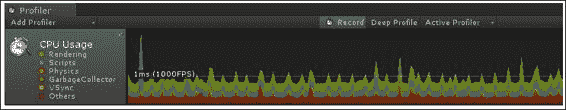
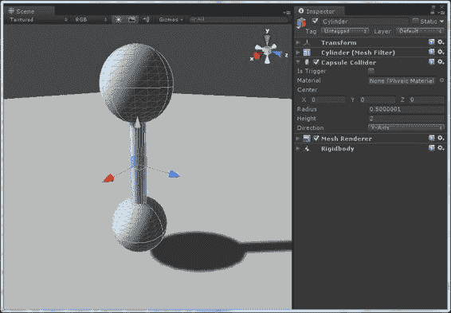
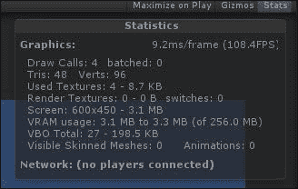
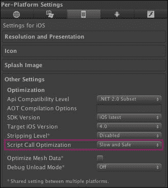

# 第七章：使用 Unity3D 中的物理优化应用程序性能

在本章中，你将学习如何在 Unity3D 开发过程中优化你的游戏或应用程序。为了使应用程序或游戏顺利运行，需要考虑几个因素。我们将使用物理最佳实践来处理优化。尽管本章主要涵盖物理技巧以处理性能优化，但你还将作为额外内容学习其他 Unity3D 性能处理技巧。

我们将涵盖以下主题：

+   开发一个优化的应用程序和游戏

+   检查性能

+   移动静态碰撞体

+   网格碰撞体

+   复杂的碰撞体形状

+   刚体

+   连接器

+   布料组件

+   优化图形

+   低时间步长

+   性能优化的优点

# 开发一个优化的应用程序和游戏

性能是游戏和应用程序的关键因素，对于快节奏的动作游戏来说，它成为关键点。对于需要快速物理、全动画角色和 3D 世界的地方，性能优化是最重要的因素。任何游戏或应用程序都需要每秒 60 帧的性能，因此我们需要针对目标设备优化我们的游戏以实现这一点。

## 检查性能

**Unity Profiler** 是我们检查游戏或应用程序性能的第一件事。Profiler 是 Unity Pro 附带的一个强大工具，通过它我们可以确定任何帧率问题来自何处。

当我们玩游戏时，Profiler 使用图表来显示 CPU 使用情况。Profiler 被分为多个类别，如 **渲染**、**脚本**、**物理**、**垃圾回收器**、**VSync** 以及其他。它看起来是这样的：

现在，让我们看看我们在物理实现过程中如何处理优化。

## 移动静态碰撞体

为了减少昂贵的性能，我们应该避免移动静态碰撞体。你从前几章中学到，静态碰撞体是一个带有碰撞组件的游戏对象；然而，它没有刚体组件。移动静态碰撞体是 Unity 游戏中性能问题的首要原因之一，而且成本很高。如果我们需要通过代码创建它们，我们应该在定位后添加碰撞体和物理材料。

## 网格碰撞体

**网格碰撞体** 相比于原始的 Box/Sphere 碰撞体较慢。球体比立方体有更多的顶点，但由于从中心到各点的距离均匀，与许多单独的三角形相比，计算要容易得多。网格碰撞体的性能开销比原始碰撞体要高得多。

## 复杂的碰撞体形状

为了获得更复杂形状的更好性能，我们应该结合原始碰撞器。让我们看看一个例子。如果我们有一个具有箱式碰撞器和刚体组件的父对象，我们应该添加仅具有箱式碰撞器的子对象。整个对象的碰撞将有一个多部分对象。我们不是将多个对象链接在一起，而是可以添加更多具有刚体和碰撞器的子对象，并使用关节将它们连接到父对象。如下所示，我们为复杂对象使用了胶囊碰撞器：

## 刚体

减少刚体和材料的使用可以节省性能。再次强调，不建议在刚体上使用插值和外推。总的物理计算量取决于场景中非休眠刚体和碰撞器的数量以及碰撞器的复杂性。我们应该通过尽可能减少计算来处理性能。

## 关节

由于不支持在一个游戏对象上使用多个基本关节，因此我们不能这样做，但我们可以使用多个可配置关节，这在性能优化方面非常有帮助。我们应尽可能使用可配置关节，而不是使用关节对象网络，以避免不必要的内存消耗。

## 布料组件

在一个游戏中使用多个布料组件非常昂贵，因此应尽量减少使用多个布料组件。

## 较低的时间步长

较低的帧率提供了更多的呼吸空间，有助于内存优化。我个人发现 0.03 的固定时间步长，最大约为 0.05，对更好的性能是有益的。我们可以通过调整固定时间步长设置来减少物理更新的时间。增加时间步长将减少 CPU 开销，但有时会影响物理的准确性。

## 预计算

在开发过程中进行预计算对于实现高性能和实现某些效果非常重要。在执行开始时尽可能计算的方法可以对性能产生重大影响。

除了基于物理的性能优化外，还有其他因素我们也应该用来优化我们的游戏或应用。让我们举几个例子。

## 优化图形

性能优化取决于 GPU 的渲染速度，这主要受渲染像素数和内存带宽的限制。CPU 性能也受处理绘制调用的数量的限制。我们可以使用 GPU 分析器来找出场景中有多少时间和多少绘制调用。为了节省渲染时间，我们应该尽可能多地移除绘制调用。

如以下截图所示，通过点击**Stats**，我们可以看到**统计信息**窗口：

为了提高 CPU 性能，我们应该考虑以下要点：

+   为了获得高性能，每帧不要使用超过几百个绘制调用，而绘制调用数量对于旧设备会有所不同

+   通过将附近的对象组合成单个网格，我们可以减少绘制调用

+   通过使用 Unity 自动的绘制调用批处理，我们可以减少绘制调用

+   使用更少的材料可以更好地批处理网格

+   在可能的情况下使用纹理图集，我们可以减少绘制调用

为了提高 GPU 性能，我们应该注意以下要点：

+   通过在**质量**设置中降低纹理质量，我们可以使游戏运行得更快；我们通过这种方式限制内存带宽

+   我们可以使用移动 GPU 减少着色器复杂性并避免 alpha 测试着色器。

+   使用纹理压缩或 16 位纹理

+   减少纹理大小

## iOS 构建的脚本调用优化

要对项目完成产生重大影响，从项目的初始阶段开始，我们应该使用缓慢但安全的**脚本调用优化**选项。使用这个未处理的异常会导致 Unity 构建崩溃，但如果处理得当，我们可以在项目结束时获得更高的性能。要应用此选项，请导航到**玩家**设置并选择**iOS**，如图下截图所示：

处理性能有一些简单的规则，例如：

+   像素灯光太昂贵了，因此我们应该避免它们以获得高性能

+   保持你的绘制调用数量低，因为图形渲染是 CPU 密集型的

+   我们应该将不移动的对象标记为静态

+   对于移动对象，尽量保持顶点数低于 300

+   我们应该避免在运行时实例化或销毁对象，因为内存较慢

+   避免使用 alpha 通道，因为它在 iOS 设备上拒绝像素并且速度慢；使用 alpha 混合代替

# 性能优化的优点

对于一个成功的游戏或应用，最重要的和必需的关键点是良好的性能。流畅的游戏吸引玩家；同样，更好的快速用户体验可以吸引大量观众。

一个伟大的游戏或应用，但如果速度慢或经常崩溃，永远不会成功。因此，性能优化的最重要的优势是，使用它，我们提供快速流畅的游戏体验和更好的用户体验，避免卡顿或崩溃。

# 摘要

在本章中，你学习了处理性能的不同方法。你学习了不同的物理组件以及它们如何用于提高性能。你学习了如何为复杂对象使用单个碰撞器，不应该在一个游戏中使用多个布料组件，以及我们可以通过减少绘制调用数量来优化图形。

这本书全部关于使用 Unity3D 学习物理。我们看到了 Unity 拥有强大的物理引擎。你学习了 Unity3D 提供的不同物理组件，以使开发者的生活更轻松。你学习了如何在创建动画时使用物理。现在，你准备好学习使用 Unity3D 进行网络和多人游戏及应用的开发了。
