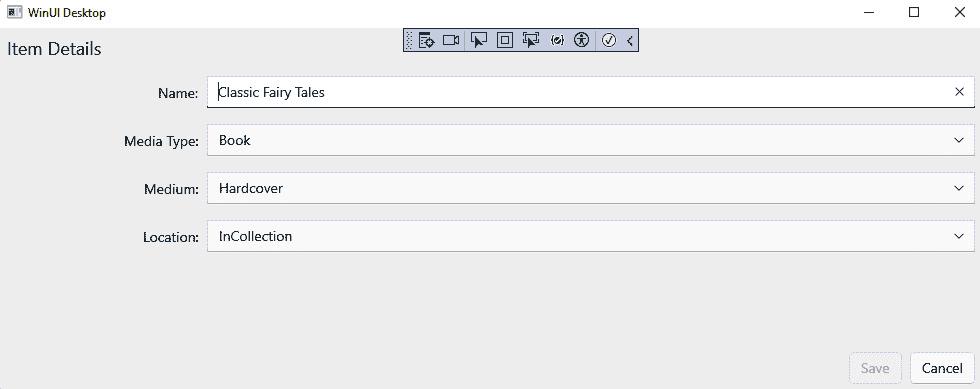

# 第四章：高级 MVVM 概念

在学习了 MVVM 模式的基础知识及其在 WinUI 中的实现之后，现在是时候在此基础上构建知识库，以处理一些更高级的技术了。现在，你将学习如何在向项目中添加新依赖项时，保持组件松散耦合且可测试。

现代应用很少只有单个页面或窗口。有一些 MVVM 技巧可以用来在 `ViewModel` 命令之间导航页面，而不与 UI 层耦合。

在本章中，你将了解以下概念：

+   理解依赖注入（DI）的基本概念

+   利用依赖注入（DI）将 `ViewModel` 类暴露给 WinUI 视图

+   使用 MVVM 和 `x:Bind` 在 ViewModel 中处理额外的 UI 事件

+   使用 MVVM 和 DI 在页面之间导航

到本章结束时，你将更深入地理解 MVVM 模式，并将知道如何将你的 ViewModel 与任何外部依赖项解耦。

# 技术要求

要跟随本章中的示例，请参考*第二章*中的*技术要求*部分，*配置开发环境和创建项目*。

你可以在这里找到本章的代码文件：[`github.com/PacktPublishing/Learn-WinUI-3-Second-Edition/tree/main/Chapter04`](https://github.com/PacktPublishing/Learn-WinUI-3-Second-Edition/tree/main/Chapter04)。

# 理解依赖注入（DI）的基本概念

在我们项目中使用依赖注入（DI）之前，我们应该花些时间了解 DI 是什么以及为什么它是构建现代应用的基础。你经常会看到 DI 与另一个相关概念**控制反转（IoC**）一起提及。让我们通过以下方式来讨论这两个概念：

+   阐明它们之间的关系

+   本章将为你准备正确使用 DI 的知识

现代开发者使用依赖注入（DI）将依赖对象注入到类中，而不是在类内部创建对象的实例。有几种方法可以注入这些对象：

+   **方法注入**：对象作为参数传递给类中的方法

+   **属性注入**：对象通过属性设置

+   **构造函数注入**：对象作为构造函数参数传递

依赖注入（DI）最常见的方法是构造函数注入。在本章中，我们将使用属性注入和构造函数注入。方法注入将不会使用，因为在 .NET 项目中通常不使用方法来设置单个对象的值。大多数开发者使用属性来完成这个目的。

控制反转（IoC）的概念是，一个类不应该负责（或了解）其依赖项的创建。你正在反转对象创建的控制。这听起来有点像 DI，不是吗？好吧，DI 是在代码中实现这种 IoC 的方法之一。还有其他实现 IoC 的方法，包括以下内容：

+   **委托**：这个委托持有对可以用来创建和返回对象的方法的引用

+   **事件**：与委托类似，这通常用于与用户输入或其他外部动作相关联

+   **服务定位器模式**：这个模式用于在运行时注入服务的实现

当你将对象创建和使用职责分离时，它有助于代码重用并提高可测试性。

本章中将利用 DI 的类是视图和 ViewModel。所以，如果我们不会在那些类中创建对象实例，它们将在哪里创建？我们不是只是将紧密耦合移动到了别处吗？从某种意义上说，这是真的，但通过将其集中到项目的某个部分，即`App.xaml.cs`文件，我们可以最小化耦合。如果你还记得上一章，`App`类是我们处理应用程序范围操作和数据的地方。

我们将使用一个`App`类来管理应用程序的依赖。DI 容器负责创建和维护它所管理的对象的生存期。在容器中，对象的生存期通常是*实例化*（每个对象请求返回对象的新实例）或*单例*（每个对象请求返回相同的对象实例）。容器在`App`类中配置，并使实例对应用程序中的其他类可用。

在.NET 6 及更高版本中，DI 现在是.NET 本身的一部分。我们将利用.NET 中的**主机构建器**配置来注册应用程序的依赖关系，并在需要的地方解决它们。

有许多其他可以从 MVVM 框架中利用的 DI 实现。如果你想探索其中的一些，以下是它们各自的链接：

+   **Unity**：这个 DI 实现支持所有类型的.NET 应用程序，并具有功能齐全的 IOC 容器([`unitycontainer.org/articles/introduction.html`](http://unitycontainer.org/articles/introduction.html))

)

+   **DryIoc**：这个小型、轻量级的 IOC 容器支持.NET Standard 2.0 和.NET 4.5 及更高版本的应用程序([`github.com/dadhi/DryIoc`](https://github.com/dadhi/DryIoc))

+   **Prism**：这个 MVVM 框架不支持 WinUI 3，但开发者仍然可以利用 DI 功能([`prismlibrary.com/docs/dependency-injection/index.html`](https://prismlibrary.com/docs/dependency-injection/index.html))

当我们在应用程序中实现代码时，这些概念将更容易理解。现在，是时候看看 DI 和 DI 容器在实际中的应用了。

# 使用 ViewModel 类与 DI 结合

今天，大多数流行的 MVVM 框架都包含一个 DI 容器来管理依赖项。因为 .NET 现在包含了自己的 DI 容器，所以我们将使用它。.NET 团队已经将之前与 **ASP.NET Core** 一起捆绑的 DI 容器整合进来。它既轻量又易于使用。幸运的是，这个容器现在可以通过 **NuGet** 包供所有类型的 .NET 项目使用：

1.  打开上一章的项目或使用 GitHub 仓库中本章的 `Start` 文件夹中的项目。在 `MyMediaCollection` 项目中，打开 `Microsoft.Extensions.Hosting`：


图 4.1 – 微软的 DI NuGet 包

1.  选择包并安装最新稳定版本。安装完成后，关闭 `App.xaml.cs`。我们在这里将进行一些更改以开始使用 DI 容器。

    DI 容器通过名为 `IHostBuilder` 和 `IServiceCollection` 的接口实现依赖注入。正如其名称所暗示的，它们旨在通过共享宿主创建应用程序的服务集合。然而，我们可以将任何类型的类添加到容器中。其使用并不局限于服务。`IServiceCollection` 构建容器，实现 `IServiceProvider` 接口。在以下步骤中，你将为应用程序添加依赖注入的支持。

1.  你应该做的第一件事是在 `App` 类中添加一个 `public` 属性，使宿主容器对项目可用：

    ```cs
    public static IHost HostContainer { get; private set;
    }
    ```

    在这里，`get` 是公共的，但属性有一个 `private set` 访问器。这限制了容器创建仅限于 `App` 类。别忘了在代码中添加所需的 `using` 语句：

    ```cs
    using Microsoft.Extensions.DependencyInjection;
    using Microsoft.Extensions.Hosting;
    ```

1.  下一步是创建一个新的方法来初始化容器，将其设置为 `public` 属性，并添加我们的第一个依赖项：

    ```cs
    private void RegisterComponents()
    {
        HostContainer = Host.CreateDefaultBuilder()
            .ConfigureServices(services =>
        {
            services.AddTransient<MainViewModel>();
        }).Build();
    }
    ```

    在新的 `RegisterComponents` 方法中，我们正在创建 `HostContainer` 和其服务集合，将 `MainViewModel` 注册为 `Build` 方法以创建和返回 DI 容器。尽管这不是严格必要的，但在向容器添加多个类型时，首先将依赖对象添加到服务集合中是一种良好的做法。我们很快将向容器中添加更多项。

1.  最后，你需要在 `App.OnLaunched` 事件处理程序中创建 `MainWindow` 实例之前调用 `RegisterComponents`：

    ```cs
    protected override void
    OnLaunched(LaunchActivatedEventArgs args)
    {
        RegisterComponents();
        m_window = new MainWindow();
        m_window.Activate();
    }
    ```

这就是创建和向应用程序公开 DI 容器所需的全部代码。现在，由于我们将 `MainViewModel` 的创建委托给了容器，你可以从 `App` 类中删除公开 `MainViewModel` 静态实例的属性。

使用由容器控制的 ViewModel 简单。继续打开 `MainWindow.xaml.cs` 并更新 `ViewModel` 属性以删除初始化。然后，在调用 `InitializeComponent` 之前，使用 `App` 类中的 `HostContainer.Services.GetService` 设置 `ViewModel` 属性的值：

```cs
public MainWindow()
{
    ViewModel = App.HostContainer.Services
      .GetService<MainViewModel>();
    this.InitializeComponent();
}
public MainViewModel ViewModel;
```

如果现在构建并运行应用程序，它将像以前一样工作。然而，现在我们的`MainViewModel`实例将在`App`类中注册并由容器管理。随着新模型、视图模型、服务和其他依赖项被添加到项目中，它们可以被添加到`RegisterComponents`方法中的`HostContainer`。

我们将在本章的后面添加页面导航到应用程序。首先，让我们讨论**事件到命令**模式。

# 利用 x:Bind 和事件

在上一章中，我们将`ViewModel`命令绑定到`Command`属性的`Command`属性？对于这种情况，您有两个选择：

+   在.NET MAUI 社区工具包中使用自定义行为，例如`EventToCommandBehavior`。这允许您将 ViewModel 中的命令与任何事件连接起来。

+   在视图中使用`x:Bind`直接绑定到视图模型上的事件处理程序。

在这个应用程序中，我们将使用`x:Bind`。此选项将提供编译时类型检查和性能提升。如果您想了解更多关于.NET MAUI 社区工具包的信息，可以阅读 Microsoft Learn 上的文档：[`learn.microsoft.com/dotnet/communitytoolkit/maui/behaviors/event-to-command-behavior`](https://learn.microsoft.com/dotnet/communitytoolkit/maui/behaviors/event-to-command-behavior)。

我们希望为**我的媒体收藏**应用程序的用户提供双击（或双击）列表中的行以查看或编辑其详细信息的选项。新的**项目详情**窗口将在下一节中添加。在此之前，双击项目将调用与**添加项目**按钮相同的代码，因为这将成为**添加/编辑项目**按钮：

1.  首先，向`MainViewModel`类添加一个名为`ItemRowDoubleTapped`的事件处理程序，该处理程序调用现有的`AddEdit`方法：

    ```cs
    public void ListViewDoubleTapped(object sender,
    DoubleTappedRoutedEventArgs args)
    {
        AddEdit();
    }
    ```

1.  接下来，将`ListView.DoubleTapped`事件绑定到 ViewModel：

    ```cs
    <ListView Grid.Row="1" ItemsSource="{x:Bind
        ViewModel.Items}"
        SelectedItem="{x:Bind
        ViewModel.SelectedMediaItem,
        Mode=TwoWay}"
        DoubleTapped="{x:Bind ViewModel
    Grid inside ListView.ItemTemplate to set the IsHitTestVisible property to False:

    ```

    <ListView.ItemTemplate>

    <DataTemplate x:DataType="model:MediaItem">

    <Grid IsHitTestVisible="False">

    ...

    </Grid>

    </DataTemplate>

    </ListView.ItemTemplate>

    ```cs

    ```

现在运行应用程序时，您可以通过点击**添加项目**按钮或双击列表中的行来添加新项目。在下一节中，您将更新**添加项目**按钮以成为**添加/编辑****项目**按钮。

# 使用 MVVM 和 DI 进行页面导航

到目前为止，应用程序只包含一个窗口。现在，是时候通过添加一个宿主`Frame`和两个`Page`对象来实现页面导航，这样我们就可以处理添加新项目或编辑现有项目。新的`Page`将通过**添加/编辑项目**按钮或通过在列表中双击项目来访问。

## 将 MainWindow 迁移到 MainPage

如果你熟悉 UWP 应用开发，你应该已经理解了页面导航。在 UWP 中，应用程序仅由一个窗口组成。窗口的根处有一个 `Frame` 对象，它承载页面并处理它们之间的导航。为了在桌面 WinUI 3 应用中实现相同的结果，我们将创建一个新的 `MainPage`，将 `MainWindow` 中的所有 XAML 内容移动到 `MainPage` 中，并将 `App` 类更新为创建一个 `Frame` 作为新的 `MainWindow` 内容。然后我们可以通过导航到 `MainPage` 来显示相同的内容。让我们开始吧：

1.  首先，在项目中添加一个名为 `Views` 的新文件夹。

1.  右键点击 `Views` 文件夹，选择 **添加** | **新建项**。

1.  在 `MainPage` 上点击 **创建**。

1.  打开 `MainWindow.xaml` 并剪切掉整个 `Window` 的 XAML 内容。

1.  打开 `MainPage.xaml` 并将 `MainWindow` 中的 XAML 粘贴进去，替换掉空的 `Grid` 控件。

1.  您还需要将 `MainWindow` 中的 `xmlns` 声明从 `model` 复制粘贴到 `MainPage` 中：

    ```cs
    xmlns:model="using:MyMediaCollection.Model"
    ```

1.  在 `MainWindow.xaml.cs` 中，删除 `ViewModel` 变量和从 `HostContainer` 中获取它的构造函数代码。将此相同的代码放入 `MainPage.xaml.cs` 中：

    ```cs
    public MainPage()
    {
        ViewModel = App.HostContainer.Services.GetService
          <MainViewModel>();
        this.InitializeComponent();
    }
    public MainViewModel ViewModel;
    ```

1.  接下来，打开 `App.xaml.cs` 并在 `OnLaunched` 方法内部添加一些代码来创建一个 `rootFrame`，将其添加到 `MainWindow` 中，并在激活窗口之前导航到 `MainPage`：

    ```cs
    protected override void OnLaunched
      (LauchActivatedEventArgs args)
    {
        m_window = new MainWindow();
        var rootFrame = new Frame();
        RegisterComponents();
        rootFrame.NavigationFailed +=
          RootFrame_NavigationFailed;
        rootFrame.Navigate(typeof(MainPage), args);
        m_window.Content = rootFrame;
        m_window.Activate();
    }
    private void RootFrame_NavigationFailed(object sender,
      NavigationFailedEventArgs e)
    {
        throw new Exception($"Error loading page
          {e.SourcePageType.FullName}");
    }
    ```

    我们还添加了一个事件处理程序来处理 `Frame` 的导航失败。

1.  确保将必要的 `using` 语句添加到文件中：

    ```cs
    using System;
    using Microsoft.UI.Xaml;
    using Microsoft.UI.Xaml.Controls;
    using Microsoft.UI.Xaml.Navigation;
    using MyMediaCollection.Views;
    ```

如果你现在运行应用程序，它应该看起来和之前一样，但现在的控件嵌套在 `Window` 中的 `Page` 和 `Frame` 内。让我们添加第二个页面并准备开始在列表页面和详情页面之间导航。

## 添加 ItemDetailsPage

完整的 `ItemDetailsPage.xaml` 代码可以在 GitHub 上找到 ([`github.com/PacktPublishing/Learn-WinUI-3-Second-Edition/blob/main/Chapter04/Complete/MyMediaCollection/Views/ItemDetailsPage.xaml`](https://github.com/PacktPublishing/Learn-WinUI-3-Second-Edition/blob/main/Chapter04/Complete/MyMediaCollection/Views/ItemDetailsPage.xaml))。您可以跟随本节中的步骤，或者在 GitHub 上查看最终代码。

注意

在我们将新的 ViewModel 添加到项目中并将其添加到 DI 容器以供视图使用之前，项目将无法成功编译。在添加 ViewModel 之前，我们需要创建一些服务以启用视图之间的导航和数据持久性。

我们将展示 `Page` 控件。`Page` 将被设置为内容，并通过我们创建的 `Frame` 进行导航。有关使用 WinUI 进行页面导航的更多信息，您可以阅读这篇 Microsoft Learn 文章：[`learn.microsoft.com/windows/apps/design/basics/navigate-between-two-pages?tabs=wasdk`](https://learn.microsoft.com/windows/apps/design/basics/navigate-between-two-pages?tabs=wasdk)。

要添加 `ItemDetailsPage`，请按照以下步骤操作：

1.  在**解决方案资源管理器**中的**Views**文件夹上右键单击，然后选择**添加** | **新项**。

1.  在新项目对话框中，选择`ItemDetailsPage`。

1.  页面上将有几个输入控件，具有一些常见的属性。首先，在顶级`Grid`控件之前，在`Page.Resources`部分添加三个样式：

    ```cs
    <Page.Resources>
        <Style x:Key="AttributeTitleStyle"
          TargetType="TextBlock">
            <Setter Property="HorizontalAlignment"
              Value="Right"/>
            <Setter Property="VerticalAlignment"
              Value="Center"/>
        </Style>
        <Style x:Key="AttributeValueStyle"
           TargetType="TextBox">
            <Setter Property="HorizontalAlignment"
              Value="Stretch"/>
            <Setter Property="Margin" Value="8"/>
        </Style>
        <Style x:Key="AttributeComboxValueStyle"
           TargetType="ComboBox">
            <Setter Property="HorizontalAlignment"
              Value="Stretch"/>
            <Setter Property="Margin" Value="8"/>
        </Style>
    </Page.Resources>
    ```

    在下一步中，我们可以将`AttributeTitleStyle`分配给每个`TextBlock`，`AttributeValueStyle`分配给每个`TextBox`，以及`AttributeComboValueStyle`分配给每个`ComboBox`。如果您以后需要添加任何其他属性到输入标签，您只需更新`AttributeTitleStyle`，属性将自动应用于使用该样式的每个`TextBlock`。

1.  顶级`Grid`将包含三个子`Grid`控件，将视图分为三个区域——一个标题、输入控件和`Grid.RowDefinitions`如下：

    ```cs
    <Grid.RowDefinitions>
        <RowDefinition Height="Auto"/>
        <RowDefinition Height="*"/>
        <RowDefinition Height="Auto"/>
    </Grid.RowDefinitions>
    ```

1.  标题区域将只包含一个`TextBlock`。您可以根据自己的喜好设计这个区域：

    ```cs
    <TextBlock Text="Item Details" FontSize="18"
    Margin="8"/>
    ```

1.  输入区域包含一个`Grid`，有四个`RowDefinitions`和两个`ColumnDefinitions`用于标签和用户可以当前编辑的四个字段的输入控件：

    ```cs
    <Grid Grid.Row="1">
        <Grid.RowDefinitions>
            <RowDefinition Height="Auto"/>
            <RowDefinition Height="Auto"/>
            <RowDefinition Height="Auto"/>
            <RowDefinition Height="Auto"/>
        </Grid.RowDefinitions>
        <Grid.ColumnDefinitions>
            <ColumnDefinition Width="200"/>
            <ColumnDefinition Width="*"/>
        </Grid.ColumnDefinitions>
        <TextBlock Text="Name:" Style="{StaticResource
          AttributeTitleStyle}"/>
        <TextBox Grid.Column="1"
            Style="{StaticResource AttributeValueStyle}"
            Text="{x:Bind ViewModel.ItemName, Mode=TwoWay,
    UpdateSourceTrigger=PropertyChanged}"/>
        <TextBlock Text="Media Type:" Grid.Row="1"
            Style="{StaticResource AttributeTitleStyle}"/>
        <ComboBox Grid.Row="1" Grid.Column="1"
            Style="{StaticResource AttributeCombox
              ValueStyle}"
            ItemsSource="{x:Bind ViewModel.ItemTypes}"
            SelectedValue="{x:Bind ViewModel
              .SelectedItemType, Mode=TwoWay}"/>
        <TextBlock Text="Medium:" Grid.Row="2"
            Style="{StaticResource AttributeTitleStyle}"/>
        <ComboBox Grid.Row="2" Grid.Column="1"
            Style="{StaticResource
              AttributeComboxValueStyle}"
            ItemsSource="{x:Bind ViewModel.Mediums}"
            SelectedValue="{x:Bind ViewModel
              .SelectedMedium, Mode=TwoWay}"/>
        <TextBlock Text="Location:" Grid.Row="3"
            Style="{StaticResource AttributeTitleStyle}"/>
        <ComboBox Grid.Row="3" Grid.Column="1"
            Style="{StaticResource
              AttributeComboxValueStyle}"
            ItemsSource="{x:Bind ViewModel.LocationTypes}"
            SelectedValue="{x:Bind ViewModel
              .SelectedLocation,Mode=TwoWay}"/>
    </Grid>
    ```

1.  该项目的`名称`是一个自由文本输入字段，而其他的是`ComboBox`控件，允许用户从绑定到`ItemsSource`的列表中选择值。顶级`Grid`的最后一个子元素是一个右对齐的水平`StackPanel`，包含**保存**和**取消**按钮：

    ```cs
    <StackPanel Orientation="Horizontal"
            Grid.Row="2" HorizontalAlignment="Right">
        <Button Content="Save" Margin="8,8,0,8"
            Command="{x:Bind ViewModel.SaveCommand}"/>
        <Button Content="Cancel" Margin="8"
            Command="{x:Bind ViewModel.CancelCommand}"/>
    </StackPanel>
    ```

下一个阶段是添加接口和服务，让我们继续这个工作。

## 添加新的接口和服务

现在我们需要在应用程序中管理多个页面，我们需要一些服务来集中页面管理和从`ViewModel`代码中抽象细节。首先，在项目中创建`Services`和`Interfaces`文件夹。每个服务将实现一个接口。这个接口将用于依赖注入（DI），如果将来您要向测试项目添加单元测试，它也会被使用。

## 创建导航服务

我们需要的第一个服务是`Interfaces`文件夹中的`INavigationService`接口。该接口定义了获取当前页面名称、导航到特定页面或导航回上一页的方法：

```cs
public interface INavigationService
{
string CurrentPage { get; }
void NavigateTo(string page);
void NavigateTo(string page, object parameter);
void GoBack();
}
```

现在，在`Services`文件夹中创建一个`NavigationService`类。在类定义中，确保`NavigationService`实现了`INavigationService`接口。完整的类可以在 GitHub 上查看（[`github.com/PacktPublishing/Learn-WinUI-3-Second-Edition/blob/master/Chapter04/Complete/MyMediaCollection/Services/NavigationService.cs`](https://github.com/PacktPublishing/Learn-WinUI-3-Second-Edition/blob/master/Chapter04/Complete/MyMediaCollection/Services/NavigationService.cs)）。让我们讨论一些亮点。

在 MVVM 中，导航服务的目的是在应用程序中存储一组可用的页面，以便当其`NavigateTo`方法被调用时，该服务可以找到一个与请求的`名称`或`类型`匹配的页面并导航到它。

页面集合将存储在 `ConcurrentDictionary<T>` 集合中。`ConcurrentDictionary<T>` 的功能类似于标准的 `Dictionary<T>`，但它可以自动添加锁，以防止多个线程同时更改字典：

```cs
private readonly IDictionary<string, Type> _pages = new
ConcurrentDictionary<string, Type>();
```

当你创建 `NavigationService` 并将其添加到 DI 容器之前，将调用 `Configure` 方法。这个方法不是 `INavigationService` 接口的一部分，并且不会对从容器中消费服务的类可用。这里有一个检查，以确保视图只添加到服务一次。我们检查字典以确定是否存在相同数据类型的任何页面。如果这个条件是 `true`，则页面已经注册：

```cs
public void Configure(string page, Type type)
{
    if (_pages.Values.Any(v => v == type))
    {
        throw new ArgumentException($"The {type.Name} view
          has already been registered under another
            name.");
    }
    _pages[page] = type;
}
```

这些是服务中三个导航方法的实现。两个 `NavigateTo` 方法导航到特定的页面，第二个方法提供了向页面传递参数的能力。第三个是 `GoBack`，它执行你想象中的操作：导航到应用程序中的上一页。它们封装了 `Frame` 导航调用，以将 UI 实现从使用此服务的视图模型中抽象出来：

```cs
public void NavigateTo(string page)
{
    NavigateTo(page, null);
}
public void NavigateTo(string page, object parameter)
{
    if (!_pages.ContainsKey(page))
    {
        throw new ArgumentException($"Unable to find a page
          registered with the name {page}.");
    }
    AppFrame.Navigate(_pages[page], parameter);
}
public void GoBack()
{
    if (AppFrame?.CanGoBack == true)
    {
        AppFrame.GoBack();
    }
}
```

我们已经准备好开始使用 `NavigationService`，但首先，让我们为应用程序创建一个数据服务。

注意

如果你愿意，可以跳到下一节实现服务。`DataService` 和 `IDataService` 代码可在 GitHub 上的完成解决方案中找到：[`github.com/PacktPublishing/Learn-WinUI-3-Second-Edition/tree/master/Chapter04/Complete/MyMediaCollection`](https://github.com/PacktPublishing/Learn-WinUI-3-Second-Edition/tree/master/Chapter04/Complete/MyMediaCollection).

## 创建数据服务

`MainViewModel` 的 `MainPage` 上的数据。这不会在多个页面之间很好地工作。通过使用数据服务，视图模型不需要知道数据是如何创建或存储的。

目前，数据仍然是样本记录，这些记录在会话之间不会保存。稍后，我们可以更新数据服务以从数据库中保存和加载数据，而无需更改使用数据的视图模型。

第一步是将名为 `IDataService` 的接口添加到 `Interfaces` 文件夹中：

```cs
public interface IDataService
{
    IList<MediaItem> GetItems();
    MediaItem GetItem(int id);
    int AddItem(MediaItem item);
    void UpdateItem(MediaItem item);
    IList<ItemType> GetItemTypes();
    Medium GetMedium(string name);
    IList<Medium> GetMediums();
    IList<Medium> GetMediums(ItemType itemType);
    IList<LocationType> GetLocationTypes();
    int SelectedItemId { get; set; }
}
```

这些方法应该让你想起前面的章节，但让我们简要回顾一下每个方法的用途：

+   `GetItems`: 返回所有可用的媒体项

+   `GetItem`: 根据提供的 `id` 查找媒体项

+   `AddItem`: 向集合中添加新的媒体项

+   `UpdateItem`: 更新集合中的媒体项

+   `GetItemTypes`: 获取媒体项类型的列表

+   `GetMedium`: 根据提供的名称获取 `Medium`

+   `GetMediums`: 这两个方法要么获取所有可用的媒体，要么获取提供的 `ItemType` 的任何可用媒体

+   `GetLocationTypes`: 获取所有可用的媒体位置

+   `SelectedItemId`: 在 `MainPage` 上持久化所选项的 ID

现在，在 `Services` 文件夹中创建 `DataService` 类。确保 `DataService` 在类定义中实现了 `IDataService`。

同样，我们只会审查部分代码。你可以在 GitHub 上审查整个实现（[`github.com/PacktPublishing/Learn-WinUI-3-Second-Edition/blob/master/Chapter04/Complete/MyMediaCollection/Services/DataService.cs`](https://github.com/PacktPublishing/Learn-WinUI-3-Second-Edition/blob/master/Chapter04/Complete/MyMediaCollection/Services/DataService.cs)）。`DataService` 中的数据将保存在四个列表和 `SelectedItemId` 属性中：

```cs
private IList<MediaItem> _items;
private IList<ItemType> _itemTypes;
private IList<Medium> _mediums;
private IList<LocationType> _locationTypes;
public int SelectedItemId { get; set; }
```

从 `MainViewModel` 复制 `PopulateItems` 方法，并将其修改为使用 `List<T>` 集合，并为每个项目添加 `Location` 属性赋值。

首先创建三个 `MediaItem` 对象：

```cs
var cd = new MediaItem
{
    Id = 1,
    Name = "Classical Favorites",
    MediaType = ItemType.Music,
    MediumInfo = _mediums.FirstOrDefault(m => m.Name ==
      "CD"),
    Location = LocationType.InCollection
};
var book = new MediaItem
{
    Id = 2,
    Name = "Classic Fairy Tales",
    MediaType = ItemType.Book,
    MediumInfo = _mediums.FirstOrDefault(m => m.Name ==
      "Hardcover"),
    Location = LocationType.InCollection
};
var bluRay = new MediaItem
{
    Id = 3,
    Name = "The Mummy",
    MediaType = ItemType.Video,
    MediumInfo = _mediums.FirstOrDefault(m => m.Name ==
      "Blu Ray"),
    Location = LocationType.InCollection
};
```

然后，初始化 `_items` 列表，并添加你刚刚创建的三个 `MediaItem` 对象：

```cs
_items = new List<MediaItem>
{
    cd,
    book,
    bluRay
};
```

还有三个其他方法用于预填充示例数据：`PopulateMediums`、`PopulateItemTypes` 和 `PopulateLocationTypes`。所有这些方法都从 `Data` 服务构造函数中调用。这些方法将在以后更新，以使用 **SQLite** 数据存储进行数据持久化。

大多数 `Get` 方法的实现都非常直接。`GetMediums(ItemType itemType)` 方法使用 `Medium` 对象来处理选定的 `ItemType`：

```cs
public IList<Medium> GetMediums(ItemType itemType)
{
    return _mediums
        .Where(m => m.MediaType == itemType)
        .ToList();
}
```

注意

如果你不太熟悉 LINQ 表达式，Microsoft 在这个主题上有一些很好的文档：[`learn.microsoft.com/dotnet/csharp/programming-guide/concepts/linq/`](https://learn.microsoft.com/dotnet/csharp/programming-guide/concepts/linq/)。

`AddItem` 和 `UpdateItems` 方法也很简单。它们向 `_items` 集合添加和更新内容：

```cs
public int AddItem(MediaItem item)
{
    item.Id = _items.Max(i => i.Id) + 1;
    _items.Add(item);
    return item.Id;
}
public void UpdateItem(MediaItem item)
{
    var idx = -1;
    var matchedItem = (from x in _items
                       let ind = idx++
                       where x.Id == item.Id
                       select ind).FirstOrDefault();
    if (idx == -1)
    {
        throw new Exception("Unable to update item. Item
          not found in collection.");
    }
    _items[idx] = item;
}
```

`AddItem` 方法有一些基本的逻辑来找到最高的 `Id` 并将其增加 `1` 以用于新项目的 `Id`。`Id` 也会返回给调用方法，以防调用者需要这些信息。

所有服务都已创建。当应用程序启动时，是时候设置它们并消费它们在视图模型中。

## 通过消费服务提高可维护性

在视图模型中使用服务之前，打开 `App.xaml.cs` 中的 `RegisterServices` 方法，并将以下代码添加到 DI 容器中注册新服务，并注册一个新的 `ItemDetailsViewModel`（尚未创建）。我们还在方法中添加了一个参数，将其传递给 `NavigationService` 构造函数。这将提供对 `Frame` 的访问，以便进行页面导航：

```cs
private IServiceProvider RegisterServices(Frame rootFrame)
{
var navigationService = new NavigationService(rootFrame);
navigationService.Configure(nameof(MainPage),
typeof(MainPage));
navigationService.Configure(nameof(ItemDetailsPage),
typeof(ItemDetailsPage));
HostContainer = Host.CreateDefaultBuilder()
    .ConfigureServices(services =>
    {
        services.AddSingleton<INavigationService>
          (navigationService);
        services.AddSingleton<IDataService, DataService>();
        services.AddTransient<MainViewModel>();
        services.AddTransient<ItemDetailsViewModel>();
    }).Build();
}
```

`INavigationService` 和 `IDataService` 都注册为 **单例**。这意味着容器中将只存储每个的单个实例。这些服务中持有的任何状态都将跨所有使用它们的类共享。

你会注意到，当我们注册`INavigationService`时，我们正在将已创建的实例传递给构造函数。这是 Microsoft 的 DI 容器以及大多数其他 DI 容器的一个特性。它允许在实例被添加到容器之前进行初始化和配置。

我们需要对`MainViewModel`进行一些更改以消费`IDataService`和`INavigationService`，更新`PopulateData`方法，并在调用`AddEdit()`时导航到`ItemDetailsPage`：

1.  首先向`MainViewModel`添加`INavigationService`和`IDataService`的属性：

    ```cs
    private INavigationService _navigationService;
    private IDataService _dataService;
    ```

    不要忘记为`MyMediaCollection.Interfaces`添加一个`using`语句。

1.  接下来，更新构造函数以接收和存储服务：

    ```cs
    public MainViewModel(INavigationService
    navigationService, IDataService dataService)
    {
        _navigationService = navigationService;
        _dataService = dataService;
        PopulateData();
    }
    ```

    等等，我们已经向构造函数中添加了两个参数，但还没有更改将它们添加到 DI 容器的代码。这是怎么工作的呢？嗯，容器足够智能，可以传递它们，因为这两个接口也已经注册了。非常酷！

1.  接下来，更新`PopulateData`以从`_dataService`获取视图模型所需的数据：

    ```cs
    public void PopulateData()
    {
        items.Clear();
        foreach(var item in _dataService.GetItems())
        {
            items.Add(item);
        }
        allItems = new
        ObservableCollection<MediaItem>(Items);
        mediums = new ObservableCollection<string>
        {
            AllMediums
        };
        foreach(var itemType in _dataService
          .GetItemTypes())
        {
            mediums.Add(itemType.ToString());
        }
        selectedMedium = Mediums[0];
    }
    ```

    你需要向`mediums`集合中添加一个名为`AllMediums`的字符串常量，其值为`"All"`，因为它不是持久化数据的一部分。它仅用于 UI 过滤器。务必将此常量定义添加到`MainViewModel`中。

1.  最后，当隐藏的`AddEditCommand`调用`AddEdit`方法时，而不是将硬编码的项目添加到集合中，你将在导航到`ItemDetailsPage`时传递`selectedItemId`作为参数：

    ```cs
    private void AddEdit()
    {
        var selectedItemId = -1;
        if (SelectedMediaItem != null)
        {
            selectedItemId = SelectedMediaItem.Id;
        }
        _navigationService.NavigateTo("ItemDetailsPage",
          selectedItemId);
    }
    ```

对于`MainViewModel`来说，这就完成了。现在让我们来处理`ItemDetailsPage`。

## 在 ItemDetailsPage 中处理参数

要在导航期间接受从另一个页面传递的参数，你必须覆盖`ItemDetailsPage.xaml.cs`中的`OnNavigatedTo`方法。`NavigationEventArgs`参数包含一个名为`Parameter`的属性。在我们的情况下，我们传递了一个包含所选项目`Id`的`int`。将此`Parameter`属性转换为`int`并将其传递给`ViewModel`上的一个名为`InitializeItemDetailData`的方法，该方法将在下一节中创建：

```cs
protected override void OnNavigatedTo(NavigationEventArgs
e)
{
    base.OnNavigatedTo(e);
    var itemId = (int)e.Parameter;
    if (itemId > 0)
    {
        ViewModel.InitializeItemDetailData(itemId);
    }
}
```

在下一节中，我们将添加拼图的最后一块，即`ItemDetailsViewModel`类。

## 创建 ItemDetailsViewModel 类

要在应用程序中添加或编辑项目，你需要一个视图模型来绑定到`ItemDetails`页面。在`ItemDetailsViewModel`的`ViewModels`文件夹上右键单击。

该类将像`MainViewModel`一样继承自`ObservableObject`。完整的类可以在 GitHub 上找到：[`github.com/PacktPublishing/Learn-WinUI-3-Second-Edition/blob/master/Chapter04/Complete/MyMediaCollection/ViewModels/ItemDetailsViewModel.cs`](https://github.com/PacktPublishing/Learn-WinUI-3-Second-Edition/blob/master/Chapter04/Complete/MyMediaCollection/ViewModels/ItemDetailsViewModel.cs)。让我们回顾一下该类的一些重要成员。

构造函数从容器中接收两个服务并调用`PopulateLists`以从数据服务中填充`ComboBox`数据：

```cs
public ItemDetailsViewModel(INavigationService
  navigationService, IDataService dataService)
{
    _navigationService = navigationService;
    _dataService = dataService;
    PopulateLists();
}
```

一个名为`InitializeItemDetailData`的`public`方法将接受`ItemDetailsPage.OnNavigatedTo`传递的`itemId`参数。它将调用方法来填充列表并初始化一个`IsDirty`标志来启用或禁用`SaveCommand`：

```cs
public void InitializeItemDetailData(int itemId)
{
    _selectedItemId = itemId;
    PopulateExistingItem(_dataService);
    IsDirty = false;
}
```

`PopulateExistingItem`方法将在页面处于编辑模式时添加现有项目数据，而`PopulateLists`方法，从构造函数中调用，填充要绑定到视图的下拉数据：

```cs
private void PopulateExistingItem(IDataService dataService)
{
    if (_selectedItemId > 0)
    {
        var item = _dataService.GetItem(_selectedItemId);
        Mediums.Clear();
        foreach (string medium in dataService.GetMediums
          (item.MediaType).Select(m => m.Name))
            Mediums.Add(medium);
        _itemId = item.Id;
        ItemName = item.Name;
        SelectedMedium = item.MediumInfo.Name;
        SelectedLocation = item.Location.ToString();
        SelectedItemType = item.MediaType.ToString();
    }
}
private void PopulateLists()
{
    ItemTypes.Clear();
    foreach (string iType in Enum.GetNames
      (typeof(ItemType)))
        ItemTypes.Add(iType);
    LocationTypes.Clear();
    foreach (string lType in Enum.GetNames
      (typeof(LocationType)))
        LocationTypes.Add(lType);
    Mediums = new TestObservableCollection<string>();
}
```

这个视图模型的大多数属性都很直接，但`SelectedItemType`有一些逻辑，根据选定的`ItemType`重新填充`Mediums`列表。例如，如果你正在向收藏夹添加一本书，就没有必要在选择列表中看到 DVD 或 CD 媒体。我们将在`OnSelectedItemTypeChanged`中处理这个自定义逻辑：

```cs
partial void OnSelectedItemTypeChanged(string value)
{
    IsDirty = true;
    Mediums.Clear();
    if (!string.IsNullOrWhiteSpace(value))
    {
        foreach (string med in _dataService.GetMediums
          ((ItemType)Enum.Parse(typeof(ItemType),
            SelectedItemType)).Select(m => m.Name))
            Mediums.Add(med);
    }
}
```

最后，让我们看看`SaveCommand`和`CancelCommand`将调用来保存并导航回`MainPage`的代码：

```cs
private void Save()
{
    MediaItem item;
    if (_itemId > 0)
    {
        item = _dataService.GetItem(_itemId);
        item.Name = ItemName;
        item.Location = (LocationType)Enum.Parse
          (typeof(LocationType), SelectedLocation);
        item.MediaType = (ItemType)Enum.Parse(typeof
          (ItemType), SelectedItemType);
        item.MediumInfo = _dataService.GetMedium
          (SelectedMedium);
        _dataService.UpdateItem(item);
    }
    else
    {
        item = new MediaItem
        {
            Name = ItemName,
            Location = (LocationType)Enum.Parse
              (typeof(LocationType), SelectedLocation),
            MediaType = (ItemType)Enum.Parse(typeof
              (ItemType), SelectedItemType),
            MediumInfo = _dataService.GetMedium
              (SelectedMedium)
        };
        _dataService.AddItem(item);
    }
    _navigationService.GoBack();
}
private void Cancel()
{
    _navigationService.GoBack();
}
```

在你运行应用程序以测试新页面之前，需要做的另一个更改是从`ItemDetailsPage.xaml.cs`中消费`ItemDetailsViewModel`：

```cs
public ItemDetailsPage()
{
    ViewModel = App.HostContainer.Services.GetService
      <ItemDetailsViewModel>();
    this.InitializeComponent();
}
public ItemDetailsViewModel ViewModel;
```

现在，运行应用程序并尝试添加或编辑一个项目——你应该能看到新页面。如果你正在编辑，你也应该看到控件中的现有项目数据：



图 4.2 – 填充了编辑数据的项详情页面

太好了！现在当你保存时，你应该能看到任何添加的记录或编辑的数据出现在`MainPage`上。我们的项目开始真正成形。让我们回顾一下在本章中我们学到的关于 WinUI 和 MVVM 的知识。

# 摘要

在本章中，你已经学到了很多关于 MVVM 和 WinUI 页面导航的知识。你学习了如何在应用程序中创建和消费服务，并利用依赖注入（DI）和 DI 容器来保持视图模型和服务的松耦合。理解和使用 DI 是构建可测试、可维护代码的关键。此时，你应该有足够的知识来创建一个健壮、可测试的 WinUI 应用程序。

在下一章中，你将学习更多关于 WinUI 3 中可用的控件和库。

# 问题

1.  DI 和 IoC 如何相关？

1.  你如何在 WinUI 应用程序中导航到上一页？

1.  我们使用什么对象来管理依赖关系？

1.  使用微软的 DI 容器，你可以调用什么方法来获取对象实例？

1.  查询内存中对象的框架的名称是什么？

1.  你可以访问哪个事件参数属性来获取传递给另一个`Page`的参数？

1.  哪种字典类型可以在多线程之间安全使用？
