# 第七章：Windows 应用程序的 Fluent Design System

**Fluent Design System**是由微软创建的一套应用程序设计原则，并在多个桌面、移动和 Web 平台上实现。Windows 的 Fluent Design System 是一套为 Windows 应用程序构建的控件、模式和样式。实际上，它是所有 WinUI 控件的内隐样式。

学习 Fluent Design 的原则以及如何在 WinUI 应用程序中实现它们非常重要。我们还将探索 Windows 的**Fluent XAML 主题编辑器**应用程序。此应用程序帮助开发者创建应用程序的主题，包括颜色方案和样式元素，如边框和角落。然后开发者可以轻松导入资源以实现主题。

在本章中，我们将涵盖以下主题：

+   学习 Fluent Design 的概念

+   如何找到关于 Fluent Design 的最新信息

+   将 Fluent Design 概念融入 WinUI 应用程序

+   使用 Fluent XAML 主题编辑器自定义和使用 UI 主题

+   探索**Acrylic**材质和 Fluent Design System

+   在 WinUI 应用程序中使用**Mica**材质

到本章结束时，你将了解 Windows 应用程序的 Fluent Design System。你还将知道如何将这些设计标准融入你的 WinUI 应用程序中。

# 技术要求

为了跟随本章中的示例，需要以下软件：

+   Windows 10 版本 1803（版本 17134）或更高版本

+   Visual Studio 2022 或更高版本，已安装并配置了.NET 桌面开发工作负载以进行 Windows App SDK 开发

本章的源代码可在 GitHub 上通过此 URL 获取：[`github.com/PacktPublishing/Learn-WinUI-3-Second-Edition/tree/master/Chapter07`](https://github.com/PacktPublishing/Learn-WinUI-3-Second-Edition/tree/master/Chapter07)。

# Fluent Design System 是什么？

Fluent Design System 是一个跨平台系统，帮助开发者创建美观、直观的应用程序。Fluent Design 的网站([`fluent1.microsoft.design/`](https://fluent1.microsoft.design/))为多个平台上的开发者提供了专门的页面和资源：

+   Android

+   iOS

+   macOS

+   Web

+   Windows

+   跨平台（React Native）

注意

微软已经开始发布他们的 Fluent 2 设计指南，网址为[`fluent2.microsoft.design/`](https://fluent2.microsoft.design/)。你可以将 Fluent 1 样式视为 Windows 10 样式，而 Fluent 2 样式则类似于 Windows 11 的外观和感觉。在撰写本文时，Fluent 2 指南仅针对 React Web 应用程序发布。其他平台尚不可用。

Fluent 设计旨在简单直观。虽然它在各个平台上保持其设计理念，但它也调整其设计以在每个平台上感觉原生。在 *第一章*“WinUI 简介”中，我们讨论了当前 Fluent 设计概念中的一些起源，这些概念是在 Windows Phone 中引入的 **Metro** 设计中。虽然微软的设计在多年中有所演变，但一些原则仍然存在。Fluent 设计系统的三个核心原则如下：

+   **自然适用于所有设备**：软件应适应其运行的设备，无论是 PC、平板电脑、游戏机、手机还是 AR/VR 设备。

+   **直观且强大**：UI 预测用户的行为，并在使用应用程序时将用户带入体验中。

+   **引人入胜且沉浸式**：设计借鉴现实世界的元素，使用光线、阴影、纹理和深度为用户创造沉浸式体验。

设计背后的驱动哲学是适应和自然。设备和应用程序应感觉舒适，并预测用户的行为。

到目前为止，这是一个非常抽象和高级的解释。让我们在下一节中具体探讨 Windows 的 Fluent 设计。

## 探索 Windows 的 Fluent 设计

对于 Windows 应用程序，Fluent 设计涵盖了多个领域。与其他设计系统相比，Fluent 更加全面。苹果的 **人类界面指南**([`developer.apple.com/design/human-interface-guidelines/`](https://developer.apple.com/design/human-interface-guidelines/)) 只在苹果的平台：iOS、iPadOS 和 macOS 上得到广泛采用。谷歌的 **Material Design**([`material.io/`](https://material.io/)) 系统得到了更广泛的采用，但仅提供 Android、Flutter 和网页的工具包。

Fluent 设计最常与 Material Design 相比较，因为它们在形状和纹理方面有一些共同的概念，但 Fluent 设计在透明度方面比 Material Design 有着更显著的效果。Fluent 设计提供了一个丰富的工具集，您可以在 WinUI 和几乎任何其他开发平台上使用。

让我们探索这些设计方面的具体内容以及它们如何应用于您的 WinUI 应用程序。

## 控件

控件等同于单个 *用户输入* 或 *交互* 元素。我们已经在 *第五章*“探索 WinUI 控件”中探讨了 WinUI 中可用的许多控件。以下是一些常见的 WinUI 控件在 Windows 11 亮暗模式下的样子：

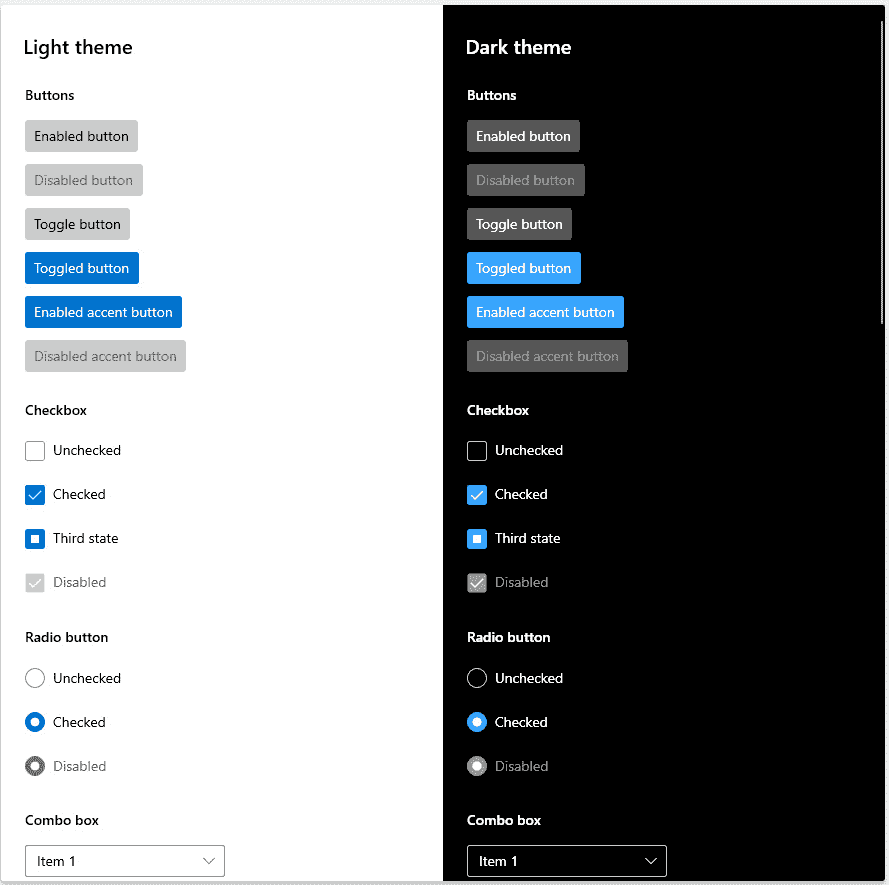

图 7.1 – 亮暗模式下的一些常见控件

默认情况下，WinUI 控件使用 Fluent 风格。我们将在本章后面看到如何覆盖 WinUI 控件中的默认 Fluent 风格。

## 模式

**模式**: 模式是一组相关的控件或一组成为单个新元素的控件组。这个组可以被添加到复合控件中以供重用。WinUI 中模式的一些示例包括以下内容：

+   **搜索**: 在其最简单的形式中，搜索模式需要接受输入的控件、调用搜索和显示搜索结果的控件。在接收到任何输入之前，可以添加一个用于建议搜索的额外元素。例如，*亚马逊 Alexa* 会根据用户的日历、联系人、新闻偏好等来执行此操作。基于用户输入添加自动建议列表是现代搜索控件的一个常见功能。你还可以将聊天控件与**人工智能**（**AI**）如微软的**Bot Framework**或 OpenAI 的**ChatGPT**集成，根据初始搜索参数提出一些后续问题。

+   **表单**: 表单是一种非常常见的控制模式。它们由相关标签、输入控件和命令按钮的组构成，用于收集一组相关的数据元素。一些具有重用潜力的常见表单包括用户账户创建表单和收集用户反馈的表单。表单应遵循 Fluent Design 的间距、灵活布局和利用字体排印创建层次结构的指南（Microsoft Learn 示例：[`learn.microsoft.com/windows/apps/design/controls/forms`](https://learn.microsoft.com/windows/apps/design/controls/forms)）。

+   使用 `ListView` 控件和 `SplitView` 控件将列表与所选项目的详细信息分开。根据页面宽度，这两个视图可以是垂直堆叠或并排显示（Microsoft Learn 示例：[`learn.microsoft.com/windows/apps/design/controls/list-details`](https://learn.microsoft.com/windows/apps/design/controls/list-details)）。

这些模式中的每一个都封装了 Fluent Design 的元素，以创建一个可以在应用程序间重用的复合控件。你可能在项目中有一些可以添加到共享控件库中的控制模式，以便于重用。这样的共享库可以节省时间并确保团队遵循良好的设计实践。

## 布局

布局对于确保应用程序适应任何屏幕尺寸或方向非常重要。灵活性是良好设计的布局的关键原则。当一个窗口或页面被调整大小时，内容可以通过重新定位控件、添加/删除项目、更改项目流、用更适合当前可用空间的控件替换控件，或者简单地调整项目大小来适应。这通常在 XAML 中使用`VisualState`来处理，为页面必须适应的每个大小阈值定义`VisualState`，可能定义为`VisualState`更新控件属性以适应新的布局。Microsoft Learn 有一个很好的例子，见[`learn.microsoft.com/windows/apps/design/layout/layouts-with-xaml`](https://learn.microsoft.com/windows/apps/design/layout/layouts-with-xaml)。WinUI 包括几个不同的布局面板，可以帮助开发者创建适合他们页面的布局，并响应大小、方向和分辨率的更改。

## 输入

对于响应用户输入，Fluent Design 有一些建议。对于反应开发者几十年来一直在处理的传统鼠标和键盘输入，也有一些指南。现代应用可以根据鼠标输入进行平移、缩放、旋转或滚动。键盘可能是一个物理键盘，也可能是移动和触摸用户的屏幕键盘。

随着今天硬件的发展，输入可以以其他形式出现：

+   笔/触控笔

+   触控

+   触控板

+   游戏手柄/控制器

+   遥控

+   Surface Dial（见[`learn.microsoft.com/windows/apps/design/input/windows-wheel-interactions`](https://learn.microsoft.com/windows/apps/design/input/windows-wheel-interactions)）

+   AR/VR 手势

+   语音

用户输入也可以通过输入注入 API 进行模拟。这种功能可能在你应用中创建“**展示如何**”或“**导览**”功能时非常有用。你的代码可以执行一些预定义的步骤，引导用户在页面上执行某些操作。这个 API 超出了本书的范围。要了解使用输入注入截获鼠标输入并将其转换为触摸输入的示例，请阅读 Microsoft Learn 上的这篇文章：[`learn.microsoft.com/windows/apps/design/input/input-injection`](https://learn.microsoft.com/windows/apps/design/input/input-injection)。

## 风格

风格涵盖了 Fluent Design 的多个方面：

+   **图标**：好的图标应该是简单的，并能传达应用程序的目的。

+   **颜色**：颜色选择很重要。允许用户自定义颜色也是让应用感觉个性化的好方法。WinUI 通过使用主题画刷，使适应用户的浅色或深色主题选择以及 Windows 高亮颜色变得容易。

+   **字体排印**：Microsoft 建议所有 Windows 应用程序都使用 Segoe UI 字体。选择字体大小可以帮助传达应用程序内的层次结构，例如书籍或文档布局。为此，Microsoft 定义了一个**字体级数**（可在[`learn.microsoft.com/windows/apps/design/style/typography#type-ramp`](https://learn.microsoft.com/windows/apps/design/style/typography#type-ramp)找到）。字体级数定义了屏幕上不同样式元素字体大小的增加，如*正文*、*标题*和*副标题*。WinUI 中有静态资源可以利用，以选择控件预期用途的正确大小。

+   **间距**：控件之间以及控件内部的间距对于可读性和可用性非常重要。WinUI 控件允许选择标准或紧凑密度。有关尺寸和 Fluent 密度的更多信息，请参阅此处：[`learn.microsoft.com/windows/apps/design/style/spacing`](https://learn.microsoft.com/windows/apps/design/style/spacing)。

+   **揭示焦点**：在较大的显示设备上，如 Xbox 或 Surface Hub，将注意力引向可聚焦元素非常重要。这通过 Fluent 的灯光效果来实现。

+   **亚克力**：这是一种 WinUI 画笔类型，它通过透明度创建纹理。这种纹理给用户界面带来深度感。我们将在本章后面更详细地讨论亚克力。

+   **米卡**：这是一种类似于亚克力的动态材料，但与亚克力不同，它是非透明的。它通过结合当前操作系统主题和桌面壁纸的元素来创建应用程序的背景。我们将在本章后面看到如何将米卡整合到自己的 WinUI 应用程序中。

+   **圆角半径**：Fluent 设计推崇的观点是圆角可以促进用户的积极情绪。WinUI 控件具有与 Fluent 设计建议一致的圆角半径。

+   **声音**：声音可以是您应用程序中创造沉浸式体验的一个组成部分。当面板打开或关闭时，发出细微的呼啸声，以及在警报声音中使用恰当的音调和音量，可以沉浸应用程序的用户。

+   **写作风格**：信不信由你，写作风格是应用程序设计的一部分。业务线应用程序不应与休闲消费者应用程序或益智游戏有相同的写作风格。如果用户没有注意到写作风格，因为他们期望的应用程序类型与之相符，他们将被吸引到应用程序体验中。

这些只是 Fluent 设计定义的样式的一些方面。您可以在 Microsoft Learn 上了解更多信息：[`learn.microsoft.com/windows/apps/design/style/`](https://learn.microsoft.com/windows/apps/design/style/)。

Fluent 风格的许多方面都通过 XAML 样式和其他静态资源提供给我们的 WinUI 应用程序。接下来，我们将探讨如何更新我们的示例应用程序以响应用户的 Windows 主题变化。

# 在 WinUI 应用程序中整合 Fluent 设计

是时候将一些 Fluent 设计原则融入到**My Media Collection**应用程序中，并对 UI 进行一些润色了。大多数 WinUI 控件已经设计得符合 Fluent 标准，但我们修改了一些属性，而没有理解 Fluent 设计。

## 更新标题栏

在我们开始改进 XAML 中的样式之前，让我们先修复应用程序的标题栏。到目前为止，标题栏总是显示**MyMediaCollection**，没有任何空格或当前页面的指示：

1.  首先，为了修复应用程序打包和分发时的间距问题，从`My Media Collection`中打开`Package.appmanifest`。如果你愿意，你还可以更改**描述**。

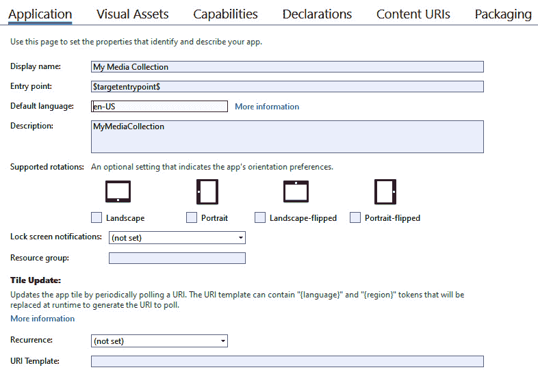

图 7.2 – 更新 Package.appmanifest 中的信息

更新`AppWindow`类。

1.  要更新应用程序标题栏中的文本，请将以下代码添加到`MainWindow.xaml.cs`中：

    ```cs
    using Microsoft.UI;
    using Microsoft.UI.Windowing;
    using Microsoft.UI.Xaml;
    using System;
    using WinRT.Interop;
    namespace MyMediaCollection
    {
        public sealed partial class MainWindow : Window
        {
            private AppWindow _appWindow;
            private const string AppTitle = "My Media Collection";
            public MainWindow()
            {
                this.InitializeComponent();
                _appWindow = GetCurrentAppWindow();
                _appWindow.Title = AppTitle;
            }
            private AppWindow GetCurrentAppWindow()
            {
                IntPtr handle = WindowNative.GetWindowHandle(this);
                WindowId windowId = Win32Interop.GetWindowIdFromWindow(handle);
                return AppWindow.GetFromWindowId(windowId);
            }
        }
    }
    ```

1.  现在，添加一个名为`SetPageTitle`的`internal`方法，以便每个页面都可以将其标题追加到主窗口标题中：

    ```cs
    internal void SetPageTitle(string title)
    {
        if (_appWindow == null)
        {
            _appWindow = GetCurrentWindow();
        }
        _appWindow.Title = $"{AppTitle} – {title}";
    }
    ```

1.  为了让每个页面都能访问`MainWindow`，在`App.xaml.cs`中公开一个内部成员：

    ```cs
    internal Window Window => m_window;
    ```

1.  接下来，在`MainPage.xaml.cs`中，为页面的`Loaded`事件添加一个事件处理器。在事件处理器中，添加一些代码以将页面标题`Home`追加到当前窗口的`Title`中。当我们启动应用程序时，标题栏应该显示**My Media Collection - Home**：

    ```cs
    public MainPage()
    {
        this.InitializeComponent();
        Loaded += MainPage_Loaded;
    }
    private void MainPage_Loaded(object sender, RoutedEventArgs e)
    {
        var mainWindow = (Application.Current as App)?.Window as MainWindow;
        if (mainWindow != null)
        {
            mainWindow.SetPageTitle("Home");
        }
    }
    ```

1.  最后，在`ItemDetailsView.xaml.cs`中做出相同的更改，但将页面标题设置为`Item Details`。

现在，当你运行应用程序时，你应该会看到标题栏文本在你在项目列表和项目详情之间导航时更新。让我们接下来对`MainPage`的样式做一些更改。

## 更改 MainPage 的样式

目前，我们应用程序的主页风格并不多。我们设置了一些`TextBlock`控件的`FontWeight`为`Bold`，以便将它们作为重要项目区分出来，但这并不遵循字体排印的 Fluent 设计指南。同时，还有一个紫色边框将`ListView`的标题与其项目分开：

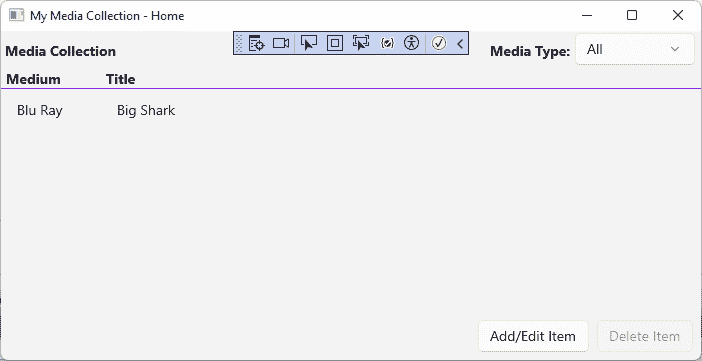

图 7.3 – My Media Collection 当前主页

直接编写颜色代码不是一种好习惯。即使你使用自定义颜色作为产品品牌，也可以在`Application.Resources`中集中管理。让我们逐步处理`MainPage.xaml`文件，并进行一些改进：

1.  首先，将第一个`TextBlock`的文本从`Media Collection`更新为`Home`，与窗口标题栏中的文本匹配。将其包裹在一个水平对齐的`StackPanel`中，并添加一个前置的`SymbolIcon`控件来显示导入`SubheaderTextBlockStyle StaticResource`的`Style`属性。这些更改应该看起来像这样：

    ```cs
    <StackPanel Orientation="Horizontal">
        <SymbolIcon Symbol="Home" Margin="8"/>
        <TextBlock Text="Home"
                   Style="{StaticResource SubheaderTextBlockStyle}"
                   Margin="8"/>
    </StackPanel>
    ```

1.  我们还应该从**媒体类型**标签中移除`FontWeight`属性，并使用 Fluent 样式资源：

    ```cs
    <TextBlock Text="Media Type:" Margin="4"
               Style="{StaticResource SubtitleTextBlockStyle}"
               VerticalAlignment="Bottom"/>
    ```

1.  接下来，将周围的`Grid`更改为`StackPanel`，并删除`Grid.Column`定义。除了简化布局外，这还将允许**主页**符号和文本出现在页面上的其他控件之上，从而加强层次结构。完整的代码块将看起来像这样：

    ```cs
    <StackPanel>
        <StackPanel Orientation="Horizontal">
            <SymbolIcon Symbol="Home" Margin="8"/>
            <TextBlock Text="Home"
                       Style="{StaticResource SubheaderTextBlockStyle}"
                       Margin="8"/>
        </StackPanel>
        <StackPanel Orientation="Horizontal"
                    HorizontalAlignment="Right">
            <TextBlock Text="Media Type:"
                       Margin="4"
                       Style="{StaticResource SubtitleTextBlockStyle}"
                       VerticalAlignment="Bottom"/>
            <ComboBox ItemsSource="{x:Bind ViewModel.Mediums}"
                      SelectedItem="{x:Bind ViewModel.SelectedMedium, Mode=TwoWay}"
                      MinWidth="120"
                      Margin="0,2,6,4"
                      VerticalAlignment="Bottom"/>
        </StackPanel>
    HeaderTemplate of the ListView to replace the purple BorderBrush attributes with SystemAccentColor from ThemeResource. This will make sure that the border’s color picks up the user’s preferred accent color from their selected Windows theme. Also, change each TextBlock to use a built-in Style instead of setting FontWeight and change the Width of the first column to be 120 to accommodate the larger title font:

    ```

    <ListView.HeaderTemplate>

    <DataTemplate>

    <Grid Margin="4,0,4,0">

    <Grid.ColumnDefinitions>

    <ColumnDefinition Width="120"/>

    <ColumnDefinition Width="*"/>

    </Grid.ColumnDefinitions>

    <Border BorderBrush="{ThemeResource SystemAccentColor}"

    边框厚度="0,0,0,1">

    <TextBlock Text="Medium"

    外边距="4,0,0,0"

    样式设置为"{StaticResource TitleTextBlockStyle}"</Grid>

    </Border>

    <Border Grid.Column="1"

    边框刷="{ThemeResource SystemAccentColor}"

    边框厚度="0,0,0,1">

    <TextBlock Text="标题"

    外边距="4,0,0,0"

    样式设置为"{StaticResource TitleTextBlockStyle}"</Grid>

    </Border>

    </Grid>

    </DataTemplate>

    </ListView.HeaderTemplate>

    ```cs

    Note that you will also need to change the first column `Width` to `120` in the `ListView.ItemTemplate`.
    ```

1.  最后，让我们通过在`ListView`底部和命令按钮之间添加边框来定义列表区域的结束。通过将按钮的`StackPanel`包装在`Border`控件中，再次使用`SystemAccentColor`来实现。`Margin= "4,0"`是等同于`Margin= "4,0,4,0"`的简写：

    ```cs
    <Border Grid.Row="2"
            BorderBrush="{ThemeResource SystemAccentColor}"
            BorderThickness="0,1,0,0"
            Margin="4,0">
        <StackPanel Orientation="Horizontal"
                    HorizontalAlignment="Right">
            <Button Command="{x:Bind ViewModel.AddEditCommand}"
                    Content="Add/Edit Item" Margin="8,8,0,8"/>
            <Button Command="{x:Bind ViewModel.DeleteCommand}"
                    Content="Delete Item"
                    Grid.Column="1"
                    Margin="8"/>
        </StackPanel>
    </Border>
    ```

1.  运行应用程序并检查重新设计的用户界面。它看起来好多了。你现在可以轻松地看到数据层次结构，尽管在我们这个简单的应用程序中可能有限：

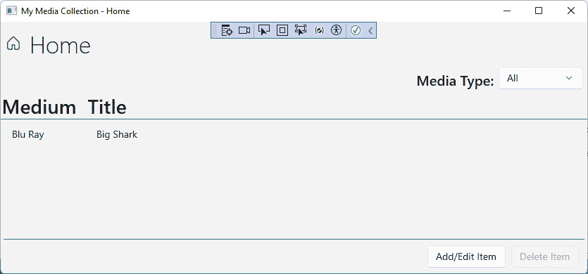

图 7.4 – 新样式化的“我的媒体收藏”主页

在进入详细页面之前，让我们看看在 Windows 中选择暗黑模式时页面看起来如何。打开**Windows 设置**，转到**个性化 | 颜色**，并从**选择你的颜色**下拉菜单中选择**暗黑**（如果你通常使用**暗黑**，尝试将其更改为**浅黑**）：

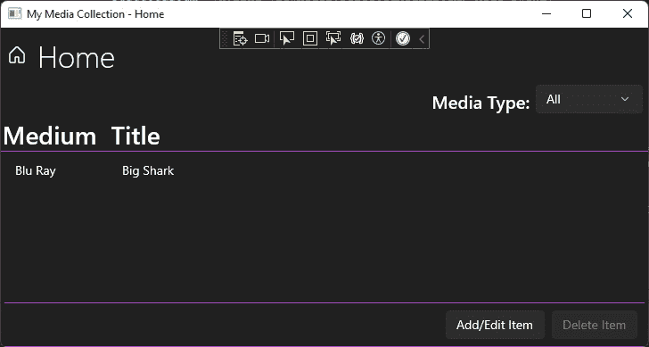

图 7.5 – “我的媒体收藏”在暗黑模式下的运行效果

页面上的所有内容都切换到暗黑模式，除了标题栏外无需任何代码更改。要了解更多关于标题栏自定义的信息，包括更改颜色或图标，甚至完全用自定义标题栏替换它，请参阅 Microsoft Learn 上的此主题：[`learn.microsoft.com/windows/apps/develop/title-bar`](https://learn.microsoft.com/windows/apps/develop/title-bar)。

如果你有一个很好的理由保持你的应用程序在浅色或暗黑模式，你可以更新`Application.xaml`，通过使用此命令向`Application`元素添加单个属性：

```cs
RequestedTheme="Dark"
```

这将把`Dark`主题应用到整个应用程序。如果你有理由只强制将此主题应用到应用程序的一部分，可以将`RequestedTheme`属性应用到单个`Page`或`Control`。现在，让我们将相同类型的样式应用到详细页面。

## 修改 ItemDetailsPage 的样式

我们希望更新`ItemDetailsPage.xaml`，使其具有与主页相同的整体外观和感觉：

1.  打开文件，首先更新 `Item Details`。给它与 `Home` 上使用的相同的 `Subheader` 和 `TextBlockStyle`，并在水平对齐的 `Stack` 面板中包裹它。在 `TextBlock` 前面加上一个使用 `Edit` 符号的 `SymbolIcon`：

    ```cs
    <StackPanel Orientation="Horizontal">
        <SymbolIcon Symbol="Edit" Margin="8"/>
        <TextBlock Text="Item Details"
                   Style="{StaticResource SubheaderTextBlockStyle}"
                   Margin="8"/>
    </StackPanel>
    ```

1.  接下来，修改跟随新 `StackPanel` 的 `Grid`，使其具有顶部和底部边框。同时，修改 `Margin` 以在 `Grid` 的两侧各有 4 px：

    ```cs
    <Grid Grid.Row="1"
          BorderBrush="{ThemeResource SystemAccentColor}"
          BorderThickness="0,1,0,1"
          Margin="4,0,4,8">
    ```

在这个页面上，我们只需要进行这些更改。再次运行应用程序并导航到详情页面，看看效果如何：

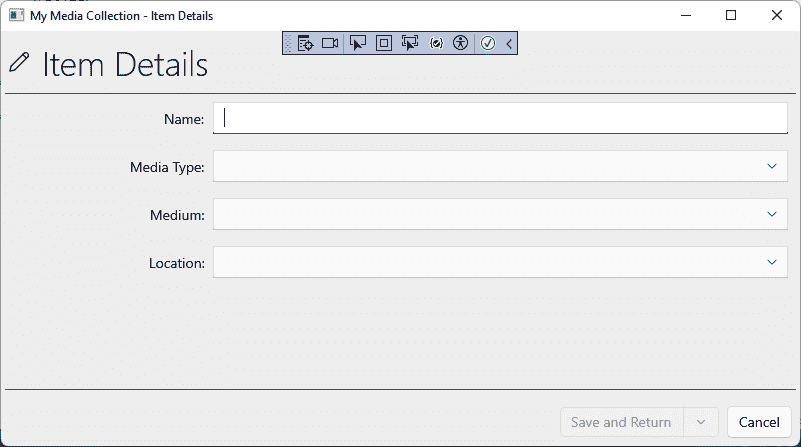

图 7.6 – 重新设计的项目详情页面

看起来很棒。现在两个页面的样式匹配，添加的边框线与高亮的活动输入字段的颜色相匹配。

让我们现在转换一下思路，回顾一下可以帮助设计师和开发者在实现 Fluent 设计时使用的工具。

# 使用 Fluent XAML 主题编辑器

我们已经看到，从用户的 Windows 设置中采用默认颜色和主题资源是多么容易，但如果你或你的公司想要为应用程序创建一个自定义主题怎么办？也许这个主题需要跨一系列应用程序共享。你可以在 Visual Studio 中创建一个包含 `ResourceDictionary` 的 XAML 文件，并手动编写所有标记以创建新样式。Visual Studio 的 **IntelliSense** 在某些方面会提供帮助。然而，有一个更简单的方法。

微软创建了一个名为 `ResourceDictionary` 的开源工具 XAML 文件，你可以将其拖放到你的项目中。

注意

Fluent XAML 主题编辑器是为了调整 UWP 控件的样式而创建的，但相同的样式也可以与 WinUI 3 控件一起使用。

要安装应用程序，在搜索字段中打开 `fluent xaml`，你将在搜索结果中找到 **Fluent XAML 主题编辑器**。在搜索结果中点击它以查看产品页面：

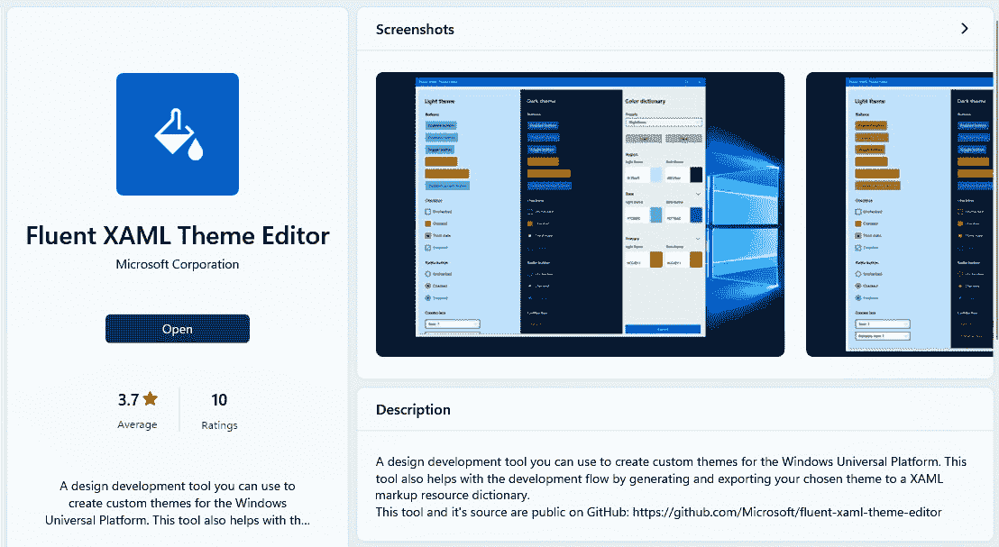

图 7.7 – 微软商店中的 Fluent XAML 主题编辑器页面

如果你已经安装了应用程序，将有一个**启动**按钮。如果没有安装，你可以点击**安装**按钮。安装完成后，你将在**开始**菜单中找到该应用程序。

当你第一次启动应用程序时，它将以 UWP 应用程序的默认样式启动，显示在浅色和深色主题中。在右侧面板中，你可以找到用于更改 UI 元素的颜色和形状的控件。**字体**列在**即将推出**中，但它已经承诺了多年：

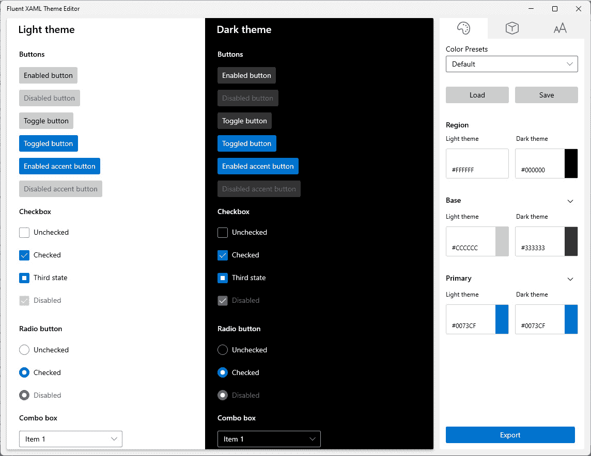

图 7.8 – Windows 版本的 Fluent XAML 主题编辑器

## 颜色

在**颜色**选项卡上，您可以从**颜色预设**下拉列表中选择一个默认配置文件。除了默认预设外，还有**薰衣草**、**森林**和**夜间**选项。还有加载其他预设或保存当前颜色设置作为新预设的选项。这些颜色预设以 JSON 格式保存。

注意

您在这里指定的任何颜色都将覆盖 Windows 系统的默认强调色，该强调色通常会被 WinUI 应用程序默认拾取。除非您的应用程序有很好的理由遵循另一个主题，否则最好让 WinUI 使用用户选择的强调色。设计自定义主题应由经验丰富的设计团队承担。

点击当前预设中的任何颜色将启动颜色选择器窗口，您可以在其中调整当前颜色：

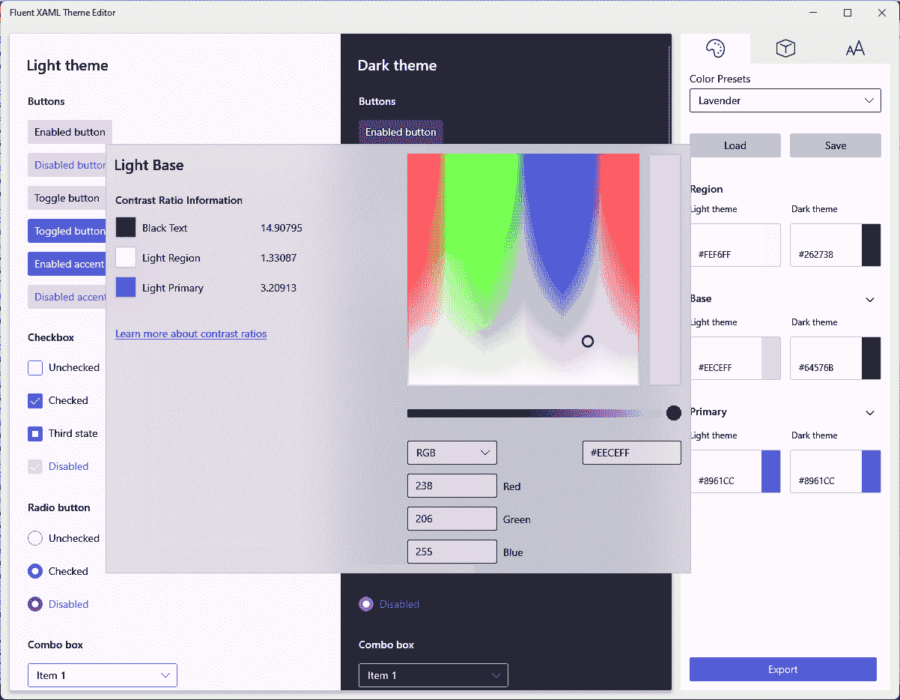

图 7.9 – 使用颜色选择器调整预设颜色

**区域**、**基础**和**主要**颜色可以分别独立调整，以改变它们的浅色和深色主题外观。

## 形状

**形状**面板提供了调整**控件**和**覆盖层**的**圆角**的控件。这也是您可以调整主题默认**边框厚度**的地方。

与颜色一样，形状预设也可以保存和加载。应用程序自带两个预设：**默认**和**无圆角，较厚的边框**。区别细微但明显：

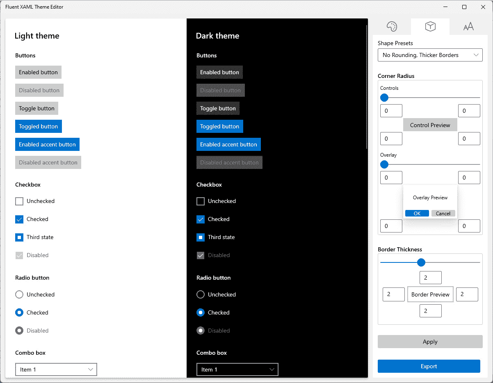

图 7.10 – 应用了无圆角和较厚边框的形状

当您调整完颜色和形状设置后，使用包含您的主题数据的 `ResourceDictionary`。您可以将 XAML 复制并粘贴到项目中的 `Resources` 部分：

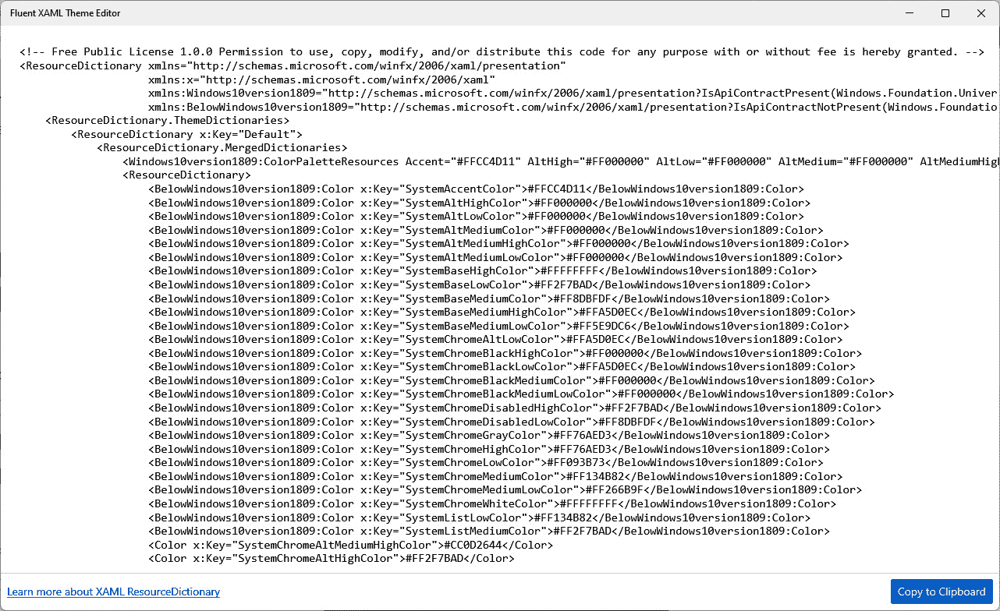

图 7.11 – 从 Fluent XAML 主题编辑器导出主题

接下来，让我们探索 Acrylic 材质，这是我们在本章前面提到的 Fluent 设计系统的一部分。

# Acrylic 材质和 Fluent 设计系统

Acrylic 是一种 WinUI 画笔，当应用于您的应用程序时，提供半透明纹理。这种纹理在 Windows 的浅色和深色主题中都能工作，并且是给用户带来深度感的绝佳方式。`AcrylicBrush` 类是 Windows App SDK 中 `Microsoft.UI.Xaml.Media` 命名空间的一部分，其中还可以找到 `Brush`、`SolidColorBrush` 和 `GradientBrush`。

注意

Acrylic 材质也适用于使用 WinUI 2.8.x 的 UWP 应用程序。

如果您想在决定在自己的项目中使用 `AcrylicBrush` 之前先探索它，您可以在 WinUI 3 Gallery 应用程序中尝试：

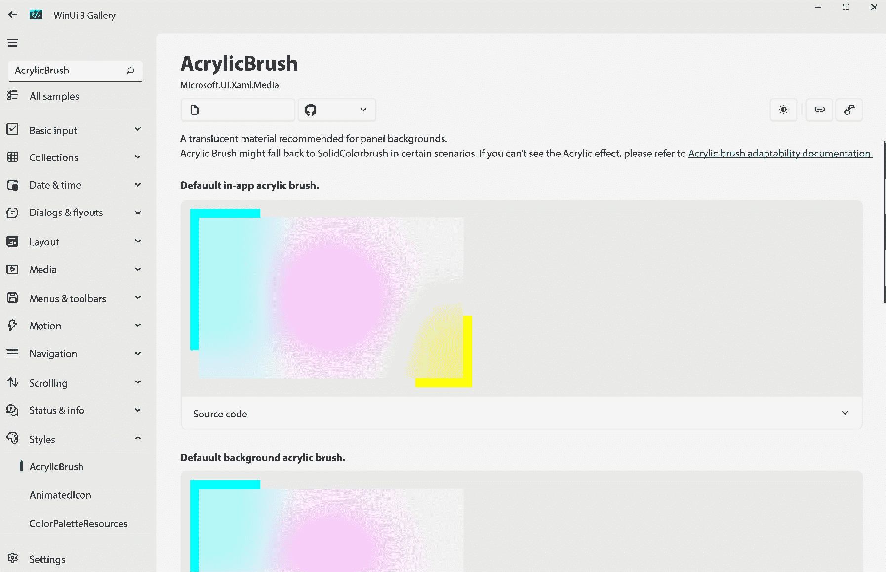

图 7.12 – 在 WinUI 3 Gallery 中探索 AcrylicBrush

在画廊页面，你可以看到`AcrylicBrush`的默认样式以及它们在 Windows 浅色和深色主题中的显示效果。此外，画廊页面还提供了调整画笔不透明度和色调的控件。你还可以为画笔设置一个回退的纯色。回退颜色用于没有资源加载丙烯酸画笔的系统。

根据应用了哪种画笔，元素将根据背景元素或当前重叠元素背后的应用内元素来绘制丙烯酸画笔。WinUI 3 画廊中有如何应用这两种类型画笔的示例。这是一个应用内画笔的示例：

```cs
<Rectangle Fill="{ThemeResource AcrylicInAppFillColorDefaultBrush}"/>
```

本例展示了如何应用背景丙烯酸画笔：

```cs
<Rectangle Fill="{ThemeResource AcrylicBackgroundFillColorDefaultBrush}"/>
```

当云母融入你的 WinUI 应用中时，它会给用户带来质感和深度的感觉，这是流畅设计的基本原则之二。你还可以选择将另一种材料云母融入其中。

# 在 WinUI 应用中使用云母

**云母**是 WinUI 应用中可用的一种材料。你可以将云母视为没有透明度的丙烯酸背景画笔。它根据 Windows 中的当前桌面背景颜色创建画笔样式。云母材料有两种变体：**云母**和**云母替代**。云母替代创建与云母相同的半透明背景，但它具有更强的色调。

注意

云母仅在 Windows 11 及更高版本中可用。如果你的应用使用云母且安装在 Windows 10 上，则不会应用该材料。

如果你使用 WinUI 3 画廊并打开系统背景（云母/丙烯酸）页面，你可以启动一个 WinUI 窗口并循环显示应用于窗口背景的云母、云母替代和丙烯酸材料：

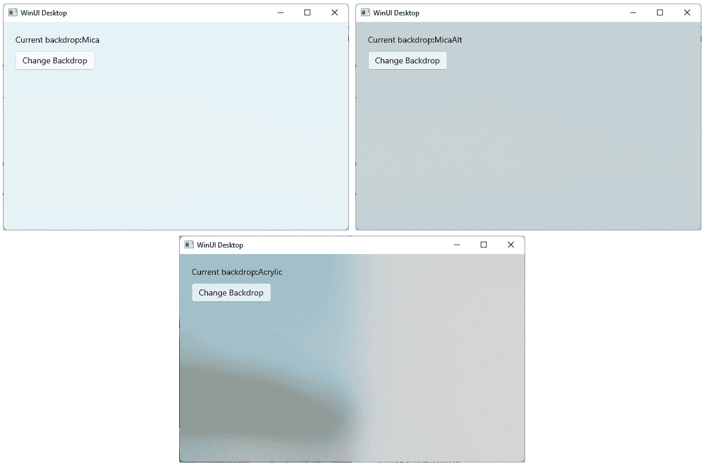

图 7.13 – 使用云母、云母替代和丙烯酸查看相同的窗口

设置窗口系统背景的代码比仅将画笔应用到`Rectangle`或其他 UI 元素的`Fill`属性要复杂得多。让我们在 My Media Collection 应用中尝试配置云母替代。

## 将云母加入我的媒体收藏

使用 Windows App SDK 1.3 或更高版本将云母引入你的应用非常简单。让我们在 My Media Collection 中使用云母替代材料。这只需要几个步骤：

1.  首先，确认你的项目正在使用 Windows App SDK 1.3 或更高版本。如果不是，你可以使用**NuGet 包管理器**将其升级到最新版本。

1.  接下来，打开`MainPage.xaml`和`ItemDetailsPage.xaml`文件，并移除每个`Page`元素的`Background`属性。如果`Page`元素（或其任何子元素）不透明，你将看不到云母背景。

1.  最后，打开`MainWindow.xaml.cs`文件，并在调用`InitializeComponent`方法之后立即添加以下代码到构造函数中：

    ```cs
    SystemBackdrop = new MicaBackdrop
    {
        Kind = MicaKind.BaseAlt
    };
    ```

就这些了。现在运行应用，看看使用云母的背景效果如何。应用中的颜色将根据你当前的 Windows 背景而变化：

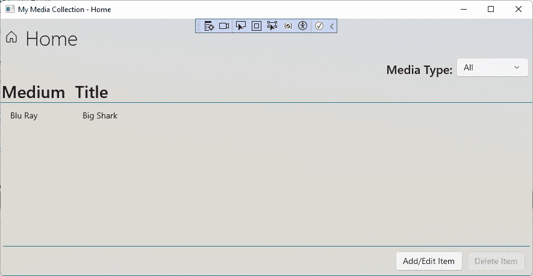

图 7.14 – 使用 Mica 样式化我的媒体收藏

注意，标题栏不会拾取 Mica 材质，就像它忽略主题更改一样。如果您想自己这样做，可以遵循 Microsoft Learn 的说明来扩展您的窗口内容到标题栏区域：[`learn.microsoft.com/windows/apps/develop/title-bar?tabs=wasdk#full-customization`](https://learn.microsoft.com/windows/apps/develop/title-bar?tabs=wasdk#full-customization)。采用这种方法，您需要创建自己的标题栏控件，包括任何按钮和图标，并在页面导航时更新标题栏文本。

现在，我们将快速浏览一些面向设计师的额外 Fluent Design 工具。

# Fluent Design 的设计资源和工具包

虽然深入探讨用户界面设计超出了本书的范围，但我们将简要回顾一些适用于流行设计工具的 Fluent Design 工具包。您可以从 Microsoft Learn 下载这些工具的设计资源和示例：[`learn.microsoft.com/windows/apps/design/downloads/`](https://learn.microsoft.com/windows/apps/design/downloads/)。

+   **Figma**: 这是一个具有免费和付费选项的设计和原型工具，具体取决于团队和项目规模。您可以在其网站上了解更多关于 Figma 的信息：[`www.figma.com/`](https://www.figma.com/)。

+   **草图**: 这是一款流行的工具，可以单独或与团队一起设计和原型化应用程序。虽然没有免费计划，但 Sketch 提供免费试用期。Sketch 可在[`www.sketch.com/`](https://www.sketch.com/)获取。

+   **Adobe XD**: XD 是 Adobe 的设计/原型工具。与 Figma 类似，Adobe XD 提供免费和付费选项来设计应用程序。您可以查看[`helpx.adobe.com/support/xd.html`](https://helpx.adobe.com/support/xd.html)了解 XD。

+   **Adobe Illustrator**: 这是由 Adobe 推出的一款强大的矢量设计工具。提供免费试用。您可以在[`www.adobe.com/products/illustrator.html`](https://www.adobe.com/products/illustrator.html)下载并开始使用 Adobe Illustrator。

+   **Inkscape** ([`inkscape.org/`](https://inkscape.org/))是一款免费的矢量图像编辑器，也可以处理**Adobe Illustrator (****AI)**文件。

+   **Adobe Photoshop**: 这可能是最知名的栅格图像编辑器之一。Adobe 还为 Photoshop 提供免费试用。[`www.adobe.com/products/photoshop.html`](https://www.adobe.com/products/photoshop.html)。

Photoshop 的 Fluent Design 工具包包括几个 PSD 文件。您还可以在免费的图像编辑器中处理 PSD 文件，例如**GIMP** ([`www.gimp.org/`](https://www.gimp.org/))或**Paint.NET** ([`www.getpaint.net/`](https://www.getpaint.net/))。Paint.NET 需要开源插件，可在[`www.psdplugin.com/`](https://www.psdplugin.com/)获取。

# 摘要

在本章中，我们学习了大量关于 Fluent Design、设计资源和可供 WinUI 开发者使用的工具的知识。您将能够在您的 WinUI 应用程序设计中使用这些工具和技术，或者向您公司的设计师推荐它们。我们还更新了 My Media Collection 应用程序，使其更符合 Fluent Design 的建议，并学习了如何融入 Acrylic 和 Mica 材料。

在下一章中，我们将探讨如何使用 Windows App SDK 通知系统向 WinUI 添加通知。

# 问题

1.  哪些平台实现了 Fluent Design？

1.  控件模式是什么？

1.  微软推荐使用哪种字体来实现 Fluent Design？

1.  哪个风格方面是针对大屏幕设备的？

1.  Fluent Design 中可用的两种间距密度分别叫什么名字？

1.  在 `Application.xaml` 中可以设置哪个属性来覆盖用户的浅色/深色主题选择？

1.  哪些设计工具提供了 Fluent Design 工具包？
