# 第十三章：使用 Uno Platform 将您的应用程序跨平台化

**Uno Platform** 允许开发者在一个代码库中编写 XAML 标记和 C# 代码，并将应用程序部署到多个平台。目前 Uno 支持 iOS、Android、Windows、macOS、Linux、Tizen 以及网页（通过 **WebAssembly**）。Uno Platform 使用与 WinUI 相同的 XAML 语法，使得 WinUI 开发者可以轻松地跳转到 Uno，同时重用大量现有的 XAML 和 C# 代码。我们将探讨如何将 **My Media Collection** 示例应用程序适配到使用 Uno Platform 在这些其他平台上运行。

在本章中，我们将涵盖以下主题：

+   Uno Platform 的历史及其当前功能讨论

+   如何配置 Visual Studio 以创建 Uno Platform 项目

+   将现有的 WinUI 视图和 ViewModels 适配以在 Uno 项目中重用

+   使用 **Windows Subsystem for Android** （**WSA**）在 Android 上运行和调试 Uno Platform 应用程序

+   使用 WebAssembly 在浏览器中本地运行您的应用程序

到本章结束时，你将了解如何将使用 Windows App SDK 构建的 WinUI 应用程序移植到 Windows 生态系统之外的其他多个平台使用 Uno Platform。

# 技术要求

要跟随本章中的示例，需要以下软件：

+   Windows 11 版本 22000.0 或更高版本，并已从 Microsoft Store 安装 WSA。要使用 WSA，建议至少 16 GB 的 RAM。

+   Visual Studio 2022 或更高版本，并已配置 **.NET Desktop Development** 工作负载以进行 Windows App SDK 开发。

+   如果你想要构建和运行 iOS 或 macOS 版本的示例应用程序，你需要一台运行 macOS 12.5 或更高版本的 Mac，并已从 App Store 安装 Xcode 14 或更高版本。

+   要针对 Android 设备，你可以在 Visual Studio 安装程序中安装 **.NET Multi-platform App UI development** 工作负载。这将安装一个受支持的 Android SDK 版本。

# Uno Platform 概述

Uno Platform 是一个开源的 UI 框架，作为 Visual Studio 的扩展进行安装。它是跨平台的，能够针对 Windows、iOS、Android、macOS、Linux 和 WebAssembly。使用单个 C# 和 WinUI XAML 代码库，你可以针对所有这些平台。虽然 Uno Platform 团队推荐使用 Visual Studio 以获得最佳体验，但你也可以使用 Visual Studio Code 或 **JetBrains Rider** IDE 来构建 Uno 应用程序。每个开发环境的优缺点在 Uno Platform 的 **入门** 文档中有讨论：[`platform.uno/docs/articles/get-started.html?tabs=windows#select-your-development-environment`](https://platform.uno/docs/articles/get-started.html?tabs=windows#select-your-development-environment)。

Uno Platform 首次发布于 2018 年 5 月，近年来其受欢迎程度一直在增长。他们还增加了支持的平台，并在 XAML 支持中从 UWP 转向 WinUI 3。今年，在他们的 4.10.13 版本中，他们甚至增加了在 Uno Platform 应用程序中嵌入 **.NET MAUI** 控件的支持，并支持大量第三方控件。我们不会在本章中介绍 .NET MAUI 的嵌入，但您可以在他们的文档中探索这个令人兴奋的功能：[`platform.uno/docs/articles/external/uno.extensions/doc/Overview/Maui/MauiOverview.html`](https://platform.uno/docs/articles/external/uno.extensions/doc/Overview/Maui/MauiOverview.html)。

谈到 .NET MAUI，您可能想知道为什么开发者会选择 Uno Platform 而不是 Microsoft 对 **Xamarin.Forms** 的跨平台继任者。WinUI 开发者选择 Uno Platform 的一个原因是 **熟悉度**。Uno 应用程序使用 WinUI XAML 创建，因此没有学习曲线。.NET MAUI XAML 与 WinUI 略有不同。如果您认为针对 Linux 和网页浏览器很重要，.NET MAUI 应用程序目前无法针对这两个平台，而 Uno Platform 可以。如果您或您公司的设计师使用 **Figma** 创建用户界面，您会发现 Uno Platform Figma 插件将在构建下一个应用程序时为您的团队提供一个很好的起点。

Uno Platform 是开源的。您可以在他们的 GitHub 仓库 ([`github.com/unoplatform/uno`](https://github.com/unoplatform/uno)) 中跟踪开放问题、提交拉取请求以改进框架，或了解他们最新的发布信息。如果您想在安装并构建您的第一个应用程序之前尝试 Uno Platform，您可以在浏览器中打开他们的交互式 **Uno Playground**，网址为 [`playground.platform.uno/#wasm-start:`](https://playground.platform.uno/#wasm-start:])

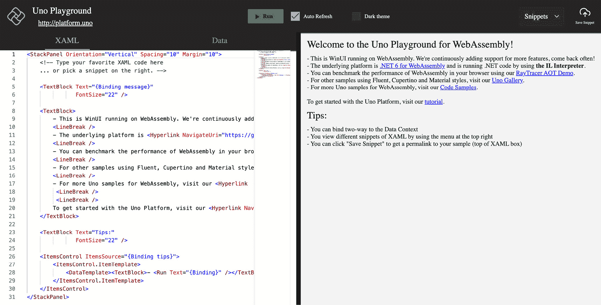

图 13.1 – 在网页浏览器中探索 Uno Playground

Uno Playground 示例应用程序在浏览器中以 WebAssembly 的形式交互式运行。您可以在左侧面板中修改 XAML，并实时观察右侧预览的更新。

您还可以探索的其他基于浏览器的资源是 **Uno Gallery** ([`gallery.platform.uno/`](https://gallery.platform.uno/))。在 Uno Gallery 中，您可以探索 Uno Platform 的控件、主题功能以及其他 UI 和非 UI 功能。例如，在 **按钮** 控件的画廊页面中，您可以看到该控件将以不同的样式呈现 – **Material**、**Fluent** 或 **Cupertino** 设计：

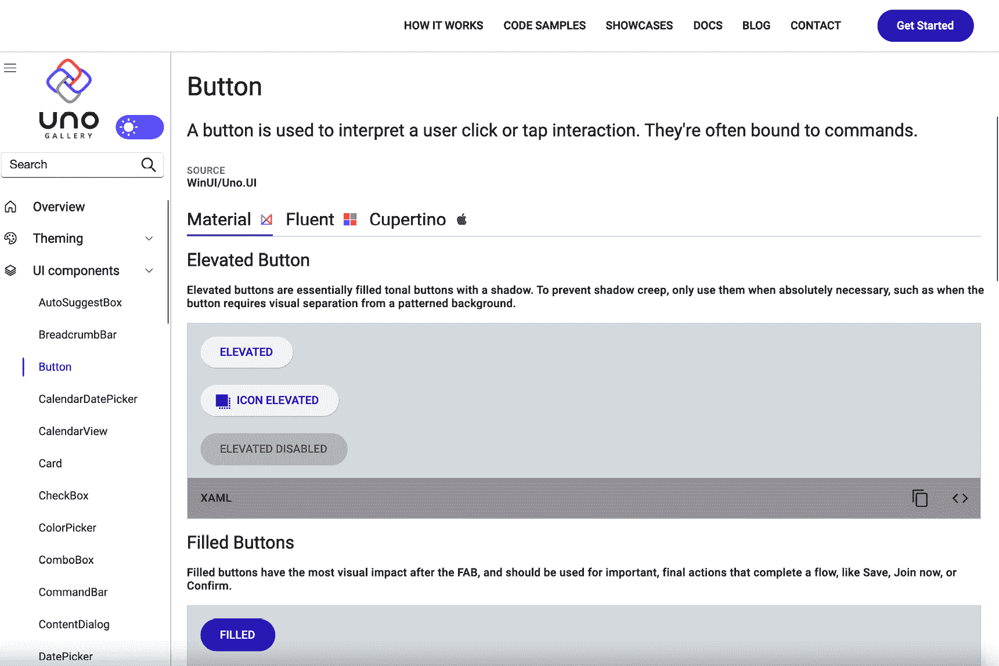

图 13.2 – 在 Uno Gallery 中探索按钮控件

在我们继续使用 Uno Platform 创建第一个项目之前，花些时间查看这些在线资源。

# 创建您的第一个 Uno Platform 项目

在本节中，我们将创建一个新的 Uno Platform 项目，这将是我们跨平台版本的 *My Media Collection* 应用程序的基础，该应用程序在本书的几个早期章节中创建。在我们能够创建一个新的 Uno Platform 项目之前，我们需要安装扩展：

1.  首先打开 Visual Studio 并转到 **扩展** | **管理扩展** 以打开 **管理扩展** 窗口。

1.  在 `Uno Platform`。

1.  **Uno Platform** 扩展应该是第一个结果。点击 **安装** 并重新启动 Visual Studio 以完成安装。

1.  当你再次打开 Visual Studio 时，选择 **创建一个** **新项目**。

1.  在 `Uno Platform` 中。你将得到不同 Uno Platform 项目类型的结果。

1.  选择 **Uno Platform App** 模板并点击 **下一步**。

1.  将项目命名为 `UnoMediaCollection` 并选择 **创建**。这将启动 **Uno Platform** **模板向导**：

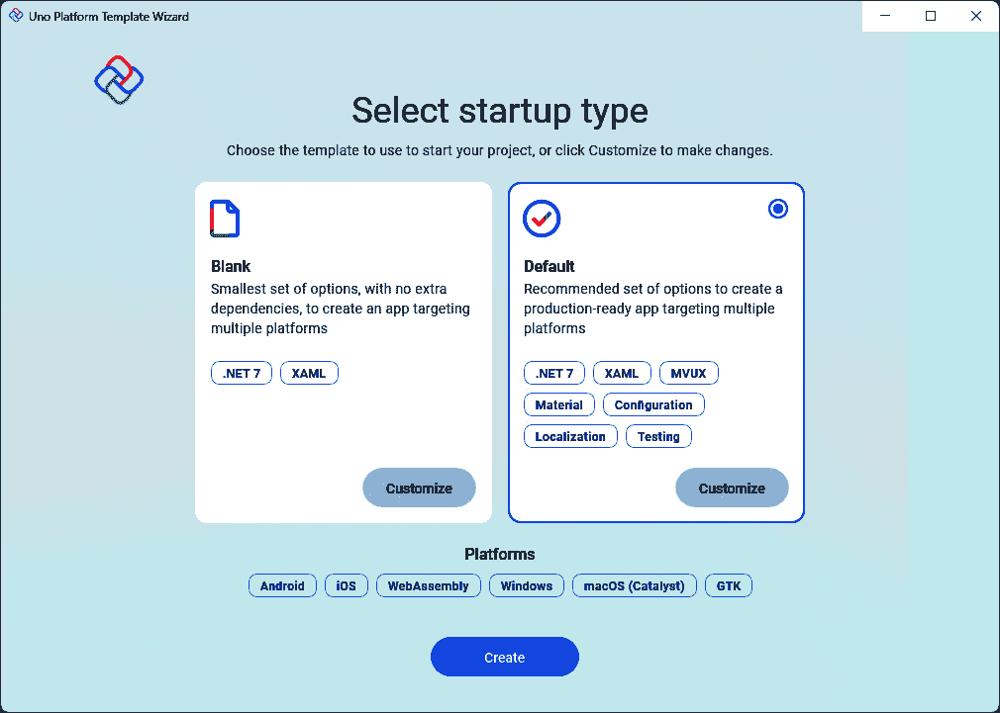

图 13.3 – Uno Platform 模板向导

1.  在 **选择启动类型** 页面上，选择 **默认** 类型下的 **自定义** 按钮。

    这将打开向导的详细步骤。从这里，你可以配置所有可用的 Uno Platform 选项。我们将保留大多数默认设置，但让我们逐页浏览。

1.  在 **框架** 页面上，当前默认为 **.NET 7.0**，但当你阅读这本书时，它可能是 **.NET 8.0**。你可以保留默认选择。

1.  在 **平台** 页面上，我们将只使用 **Windows**、**Android** 和 **WebAssembly**。你可以取消选择其他平台。

1.  在 `MyMediaCollection` 应用程序。

1.  在 **主题** 页面上，选择 **Fluent** 以使用原始应用程序相同的 Fluent 设计。

1.  在 **扩展** 页面上，你可以移除 **本地化** 并将 **导航** 改为 **空白**。

1.  你可以在 **测试** 页面上取消选中 **单元测试** 和 **UI 测试** 选项。我们不会在本章中涉及测试。

1.  你可以在 **项目**、**功能**、**身份验证** 和 **应用程序** 页面上保留默认设置。要了解更多关于这些选项的信息，你可以查看 Uno Platform 文档：[`platform.uno/docs/articles/get-started-vs-2022.html#create-an-application`](https://platform.uno/docs/articles/get-started-vs-2022.html#create-an-application)。

1.  点击 **创建** 以生成项目并开始在 Visual Studio 中使用它们。如果 Visual Studio 提示你重新加载任何项目，请点击 **重新加载**。

1.  在 Visual Studio 的 Uno 欢迎屏幕上遵循 **验证您的开发环境** 步骤：

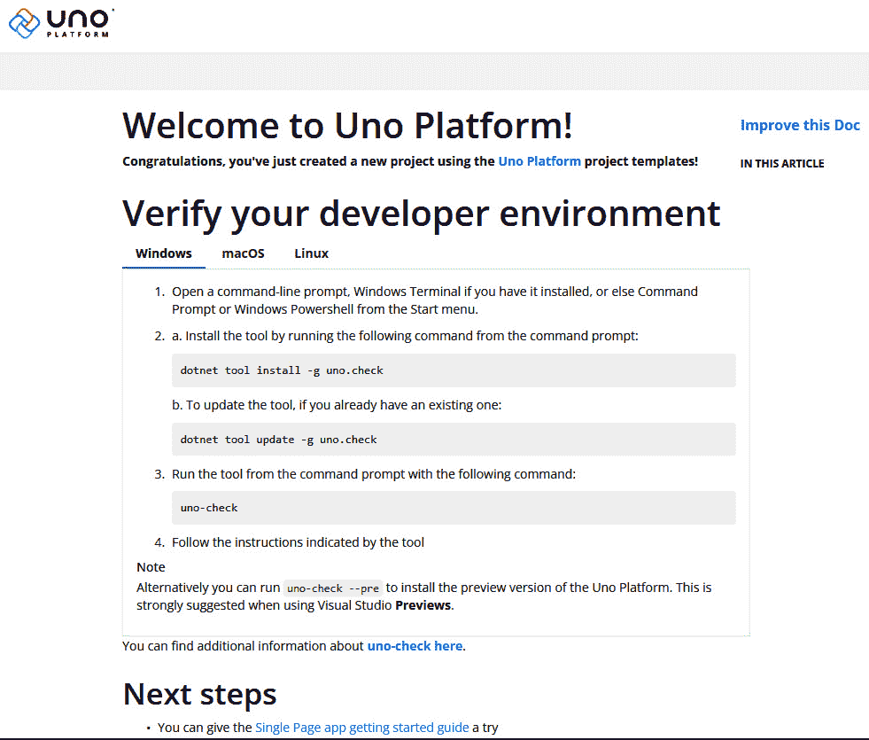

图 13.4 – Uno Platform 欢迎屏幕

`uno-check`命令行工具在诊断潜在的开发环境问题并自动修复它们方面做得很好。您应该允许它在继续之前修复它识别出的任何问题。完成之后，您可能需要重新启动系统。完成此操作并重新打开项目，然后再继续下一步。

1.  确保将`UnoMediaCollection.Windows`项目设置为启动项目并开始调试。应用程序应该启动并显示一个包含**Hello Uno Platform**消息的窗口：

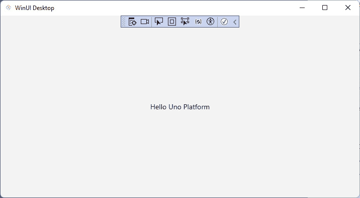

图 13.5 – 以 Windows 应用程序运行 UnoMediaCollection

就这样！我们已经有一个运行的应用程序作为我们的起点。在下一节中，我们将通过从`MyMediaCollection`项目重用代码来增强`UnoMediaCollection`，我们将学习更多关于项目结构的信息。

# 将 WinUI XAML 标记和代码迁移到 Uno 平台

在本节中，我们将从上一节创建的`UnoMediaCollection`解决方案中提取代码，从`MyMediaCollection`的早期版本迁移代码。这将给我们一个跨平台的应用程序版本，我们将在接下来的部分中在 Windows、Android 和 WebAssembly 上运行。

为了使我们的第一个项目保持简单，我们将从*第五章*“探索 WinUI 控件”中找到的已完成的`MyMediaCollection`解决方案迁移代码。如果您没有该代码的副本，您可以从 GitHub 这里获取：[`github.com/PacktPublishing/Learn-WinUI-3-Second-Edition/tree/main/Chapter05/Complete`](https://github.com/PacktPublishing/Learn-WinUI-3-Second-Edition/tree/main/Chapter05/Complete)。遵循说明的最简单方法是下载解决方案，但您也可以在 Uno 项目解决方案中创建每个类，并将 GitHub 编辑器中的 WinUI 项目代码复制粘贴。

我们将使用*第五章*中的代码，因为在这个阶段还没有添加 SQLite 数据库。向 Uno 平台项目添加具有文件访问权限的代码是可能的，但更复杂。这需要编写一些**平台特定代码**。此代码将根据应用程序当前运行的平台进行条件执行。在大多数平台上使用 SQLite 相对简单，但在 WebAssembly 上本地文件访问则不那么容易。您可以在 Uno Platform 的文档中了解更多关于平台特定代码的信息：[`platform.uno/docs/articles/platform-specific-csharp.html`](https://platform.uno/docs/articles/platform-specific-csharp.html)。

如果不关心离线工作，那么在这些所有平台上进行数据访问的最佳选项是创建一个轻量级的 Web 服务来处理您的数据访问。这样做也意味着添加一个身份解决方案以确保每个用户都在访问自己的数据。如果您对自行探索此选项感兴趣，Uno Platform 有一些关于消费 Web API 的文档：[`platform.uno/docs/articles/howto-consume-webservices.html`](https://platform.uno/docs/articles/howto-consume-webservices.html)。

现在，让我们开始将 WinUI 项目迁移到 Uno Platform。

## 迁移 WinUI 项目代码

是时候开始我们的 `MyMediaCollection` 的跨平台转换了。我们将首先从旧项目中导入 C# 类：

1.  首先，从上一节打开 `UnoMediaCollection` 解决方案，并在 `UnoMediaCollection` 项目中创建四个新的文件夹：`Enums`、`Interfaces`、`Model` 和 `ViewModels`。我们还将从 `Services` 文件夹添加类，但该文件夹已存在于新项目中：

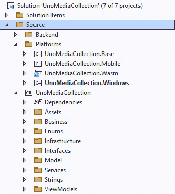

图 13.6 – 添加到 UnoMediaCollection 项目的新的文件夹

1.  右键单击 `Enums` 文件夹，在 WinUI `MyMediaCollection` 项目中选择 `Enums` 文件夹，选择 `ItemType.cs` 和 `LocationType.cs` 文件，然后点击 **添加**。

1.  打开每个新添加的文件，并将 `namespace` 改为 `UnoMediaCollection.Enums`。

1.  我们将为剩余的每个文件夹重复这些步骤。接下来，将现有的 `IDataService.cs` 和 `INavigationService.cs` 文件添加到 `Interfaces` 文件夹。

1.  在 `IDataService` 中，将 `namespace` 改为 `UnoMediaCollection.Interfaces` 并更新 `using` 语句为以下内容：

    ```cs
    using UnoMediaCollection.Enums;
    using UnoMediaCollection.Model;
    ```

    您可以删除任何其他 `using` 语句，因为它们是 `INavigationService` 的一部分，您可以更新 `namespace` 为 `UnoMediaCollection.Interfaces` 并删除 `using` `System;` 语句。

1.  将现有的 `MediaItem.cs` 和 `Medium.cs` 文件添加到 `Model` 文件夹。

1.  修改 `MediaItem` 以如下所示（变更已突出显示）：

    ```cs
    using UnoMediaCollection.Enums;
    namespace UnoMediaCollection.Model
    {
        public class MediaItem
        {
            public int Id { get; set; }
            public string? Name { get; set; }
            public ItemType MediaType { get; set; }
            public Medium? MediumInfo { get; set; }
            public LocationType Location { get; set; }
        }
    }
    ```

1.  修改 `Medium` 类以如下所示：

    ```cs
    using UnoMediaCollection.Enums;
    namespace UnoMediaCollection.Model
    {
        public class Medium
        {
            public int Id { get; set;  }
            public string? Name { get; set; }
            public ItemType MediaType { get; set; }
        }
    }
    ```

1.  将现有的 `DataService.cs` 和 `NavigationService.cs` 文件添加到 `Services` 文件夹。

1.  在 `DataService` 中，更新 `namespace` 为 `UnoMediaCollection.Services` 并更新您的 `using` 语句，使其仅包含以下三个语句：

    ```cs
    using UnoMediaCollection.Enums;
    using UnoMediaCollection.Interfaces;
    using UnoMediaCollection.Model;
    ```

1.  在 `NavigationService` 中，更新 `namespace` 为 `UnoMediaCollection.Services` 并将 `AppFrame` 变量的访问器从 `private static` 更改为 `internal static`。我们稍后需要从 `App.cs` 设置此值。同时，更新 `using` 语句，使其仅包含以下两个语句：

    ```cs
    using UnoMediaCollection.Interfaces;
    using System.Collections.Concurrent;
    ```

1.  将现有的 `ItemDetailsViewModel.cs` 和 `MainViewModel.cs` 文件添加到 `ViewModels` 文件夹。

1.  在 `ItemDetailsViewModel` 中，将 `namespace` 改为 `UnoMediaCollection.ViewModels` 并修改 `using` 语句以包含以下四个语句：

    ```cs
    using UnoMediaCollection.Enums;
    using UnoMediaCollection.Interfaces;
    using UnoMediaCollection.Model;
    using System.Collections.ObjectModel;
    ```

1.  在 `MainViewModel` 中，将 `namespace` 更改为 `UnoMediaCollection.ViewModels` 并更新 `using` 语句，使其只包含以下四个语句：

    ```cs
    using Microsoft.UI.Xaml.Input;
    using UnoMediaCollection.Interfaces;
    using UnoMediaCollection.Model;
    using System.Collections.ObjectModel;
    ```

    到目前为止的所有更改都比较简单。Uno Platform 项目已经使用了我们在 WinUI 项目中引用的 NuGet 包，所以代码非常兼容。

1.  在我们继续到两个视图之前，让我们对 `App.cs` 进行必要的修改。我们需要设置 `NavigationService` 并将我们的服务和 ViewModel 类注册到 IoC 容器中。首先，将以下三个 `using` 语句添加到 `App` 类中：

    ```cs
    using UnoMediaCollection.Interfaces;
    using UnoMediaCollection.Services;
    using UnoMediaCollection.ViewModels;
    ```

1.  将 `Host` 变量重命名为 `HostContainer` 以匹配我们的 WinUI 项目的名称，并使其为 `internal static`：

    ```cs
    internal static IHost? HostContainer { get; private set; }
    ```

1.  在 `OnLaunched` 方法开始处，在创建 `builder` 对象之前，添加以下代码：

    ```cs
    var navigationService = new NavigationService(new Frame());
    navigationService.Configure(nameof(MainPage), typeof(MainPage));
    navigationService.Configure(nameof(ItemDetailsPage), typeof(ItemDetailsPage));
    ```

    这创建了 `navigationService` 类，稍后它将被注册到 IoC 容器中，并注册两个视图以进行导航。我已经突出显示了与原始 WinUI 项目代码的一个不同之处。我们暂时将 `new Frame()` 传递到构造函数中。在方法中稍后，我们将 `AppFrame` 设置为 `OnLaunched` 方法末尾创建的 `rootFrame`。

1.  接下来，更新 `OnLaunched` 中的 `ConfigureServices` 块，使其看起来像这样：

    ```cs
    .ConfigureServices((context, services) =>
    {
        services.AddSingleton<INavigationService>(navigationService);
        services.AddSingleton<IDataService, DataService>();
        services.AddTransient<MainViewModel>();
        services.AddTransient<ItemDetailsViewModel>();
    })
    ```

    这就像我们在 WinUI 项目中所做的那样，将我们的类注册到 IoC 容器中。

1.  将 `OnLaunched` 中的 `Host = builder.Build();` 代码行更新为 `HostContainer = builder.Build();`.

1.  最后，在 `OnLaunched` 结尾的 `MainWindow.Activate();` 调用之前，添加以下代码行以更新 `NavigationService` 中的 `AppFrame` 静态变量：

    ```cs
    NavigationService.AppFrame = rootFrame;
    ```

除了两个视图之外，我们还需要添加和更新的内容就这些了。代码还不能成功编译，因为我们已经在 `OnLaunched` 中引用了 `ItemsDetailsPage`，但还没有添加它。我们将在下一节中处理这个问题。

## 迁移 WinUI XAML 视图

在本节中，我们将完成对 `UnoMediaCollection` 项目的添加和更改，并运行应用程序的 Windows 版本。让我们从 `ItemDetailsView` 开始：

1.  右键点击 `UnoMediaCollection` 项目，选择 **添加** | **新建项**.

1.  在 `ItemDetailsPage.xaml` 中，并点击 **添加**：

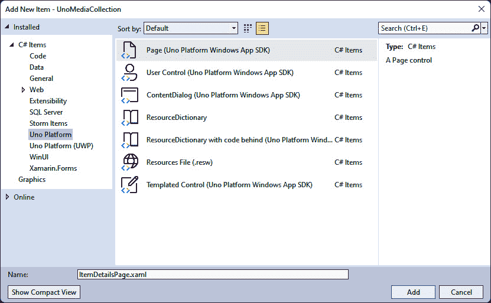

图 13.7 – 将 ItemDetailsPage 添加到项目中

1.  打开 `ItemDetailsPage.xaml.cs` 并将类的全部内容替换为 WinUI 项目中的以下代码：

    ```cs
    public ItemDetailsPage()
    {
        ViewModel = App.HostContainer.Services.GetService<ItemDetailsViewModel>();
        this.InitializeComponent();
    }
    public ItemDetailsViewModel ViewModel;
    protected override void OnNavigatedTo(NavigationEventArgs e)
    {
        base.OnNavigatedTo(e);
        var itemId = (int)e.Parameter;
        if (itemId > 0)
        {
            ViewModel.InitializeItemDetailData(itemId);
        }
    }
    ```

    注意，我们在构造函数中的 `InitializeComponent` 调用之后没有迁移任何用户设置代码。为了我们的第一次迁移尝试，我们将保持简单。

1.  您还可以从 `ItemDetailsPage` 类中删除所有 `using` 语句，除了以下这些：

    ```cs
    using UnoMediaCollection.ViewModels;
    ```

1.  打开 `ItemDetailsPage.xaml` 并将 `Page` 的子内容替换为 WinUI 项目中 `ItemDetailsPage.xaml` 的内容。不要替换 `Page` 本身，因为命名空间不同。

1.  删除此 `SplitButton.Resources` 块，因为我们不会使用 `TeachingTip`。我们删除了依赖于将用户首选项保存到文件系统的代码。没有它，每次页面打开时都会出现：

    ```cs
    <SplitButton.Resources>
        <TeachingTip x:Name="SavingTip"
                        Target="{x:Bind SaveButton}"
                        Title="Save and create new"
                        Subtitle="Use the dropdown button option to save your item and create another.">
        </TeachingTip>
    </SplitButton.Resources>
    ```

1.  打开 `MainPage.xaml.cs` 并添加以下 `using` 语句：

    ```cs
    using UnoMediaCollection.ViewModels;
    ```

1.  `MainPage` 类的内容将与 `ItemDetailsPage` 相似：

    ```cs
    public MainPage()
    {
        ViewModel = App.HostContainer.Services.GetService<MainViewModel>();
        this.InitializeComponent();
    }
    public MainViewModel ViewModel;
    protected override void OnNavigatedTo(NavigationEventArgs e)
    {
        base.OnNavigatedTo(e);
        if (e.NavigationMode == NavigationMode.Back)
        {
            ViewModel.PopulateData();
        }
    }
    ```

    这与 WinUI 项目中 `MainPage` 的实现略有不同。我们添加了对 `OnNavigatedTo` 的重写。在某些平台上，在 `ItemDetailsPage` 上添加项目后，`MainPage` 上的项目列表没有更新。当用户导航到 `Back` 时调用 `MainViewModel` 上的 `PopulateData()` 解决了这种行为。这是 Android 和 WebAssembly 上的一个问题。Windows 项目按预期工作。

1.  打开 `MainPage.xaml` 并替换 `Page` 中的 `Page` 的整个子内容。就像我们在 `ItemDetailsPage.xaml` 中做的那样，由于命名空间的不同，请小心不要替换 `Page` 本身。

1.  最后，将以下 `using` 声明添加到 `MainPage` 中的 `Page` 元素：

    ```cs
    xmlns:model="using:UnoMediaCollection.Model"
    ```

    `MediaItem` 模型类在 `ListView` 中的 `DataTemplate` 中被引用，并需要此 `using` 声明。

这些就是使应用程序准备好使用 Uno Platform 运行的所有更改。我们根本不需要更改我们的 XAML 控件，除了删除 `TeachingTip`。

让我们运行 Windows 版本的应用程序，以确保一切按预期工作。确保将 `UnoMediaCollection.Windows` 设置为启动项目并运行应用程序。当它启动时，应该看起来像这样：

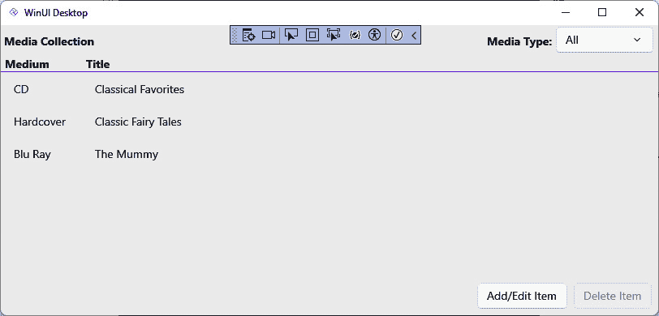

图 13.8 – 使用 Uno Platform 运行 Windows 项目

它看起来与我们的 WinUI 应用程序的 *第五章* 版本完全一样。如果您尝试添加、编辑或删除项目，一切都应该按预期工作。做得好！这很简单。让我们继续前进，尝试使用 WSA 在 Android 上使用该应用程序。

# 使用 WSA 在 Android 上运行

使用 WSA 在 Windows 上运行和调试 Android 应用程序既快又简单。在 Windows 11 上安装 WSA 的最简单方法是安装来自 Microsoft Store 的 **Amazon Appstore**。您可以通过此处获取应用程序：[`aka.ms/AmazonAppstore`](https://aka.ms/AmazonAppstore)。

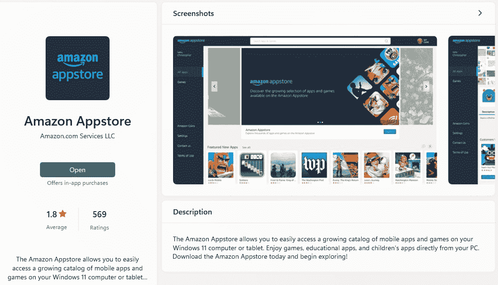

图 13.9 – Microsoft Store 中的 Amazon Appstore 应用

安装应用程序并按照提示将 WSA 作为过程的一部分进行安装。在完成初始安装后，您需要重新启动计算机以完成 WSA 的安装和配置：

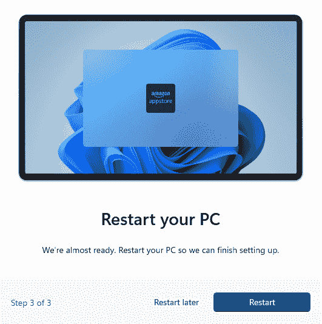

图 13.10 – 完成 Amazon Appstore 的安装

重启完成后，在您的 Windows 开始菜单中找到 Amazon Appstore 应用并启动它。您会看到 WSA 首先启动：

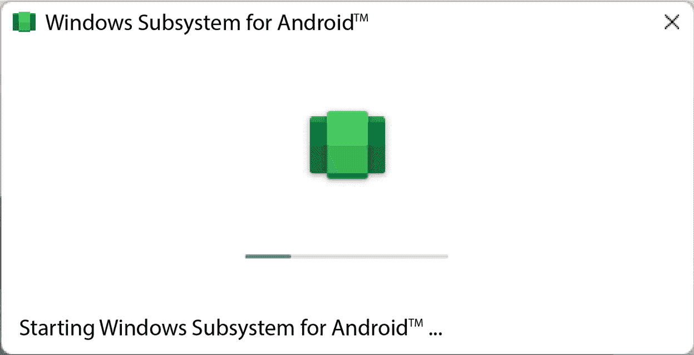

图 13.11 – 启动 WSA 进程

请保持 Amazon Appstore 在后台运行，以确保您的 Android 系统保持活跃。如果您喜欢，可以最小化窗口。您还需要做的另一件事是确保 **开发者模式** 已开启。从开始菜单启动 **Windows Subsystem for Android**。这将打开 WSA **系统** 设置页面。从左侧导航面板中选择 **高级设置** 以打开 **高级** **设置** 页面：


图 13.12 – WSA 系统设置

如果 **开发者模式** 没有开启，请现在开启它。最后的准备步骤是将 **Android SDK** 连接到 WSA 以进行我们的调试会话。为此，您需要找到您的 Android SDK 安装位置。如果它是与 Visual Studio 安装一起安装的，它应该在这个路径上：

```cs
c:\Program Files (x86)\Android\android-sdk\
```

您需要从命令提示符运行以下命令。在您的 SDK 位置的 `platform-tools` 子文件夹中打开一个终端或命令窗口。如果您在 **PowerShell** 中运行，这是该命令：我使用 **Windows Terminal** 中的 PowerShell 窗口：

```cs
.\adb connect 127.0.0.1:58526
```

如果您收到 `failed to authenticate to 127.0.0.1:58526` 的消息，请检查是否有 WSA 弹出对话框在您的其他窗口后面。每次您使用 WSA 开始调试时，都点击 `adb connect` 命令。

现在是时候使用 WSA 运行我们应用程序的 Android 版本了。将启动项目更新为 **UnoMediaCollection.Mobile**：


图 13.13 – 更新启动项目以在移动设备上运行

如果 WSA 仍然处于活动状态，您应该在 **调试** 按钮上看到 **Microsoft Corporation Subsystem for Android** 以及一个 Android 版本号。开始调试并等待几分钟。编译、部署和运行 Android 应用程序可能比 Windows 版本花费的时间要长。当应用程序启动时，它应该看起来像这样：


图 13.14 – 使用 WSA 在 Android 上运行 UnoMediaCollection 应用程序

所有的功能应该和在 Windows 上一样，但根据您系统的性能，UI 可能会有轻微的延迟。使用 WSA 的酷之处在于您可以将应用程序的窗口大小调整到测试不同宽高比下的 UI 布局。试试看。

如果您在系统上的 Android SDK 中配置了 Android 模拟器，您也可以尝试在 **调试** 按钮上选择它并在那里运行。在传统手机模拟器图像上，它看起来可能像这样：

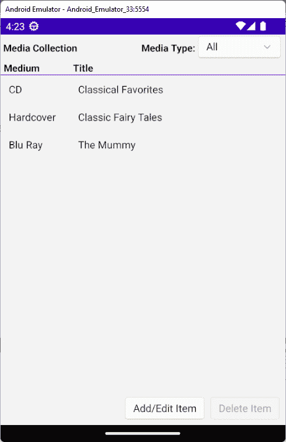

图 13.15 – 在 Android 模拟器上运行应用程序

我们已经在 Android 上运行起来了。在许多情况下，切换平台就像更改启动项目一样简单。让我们通过在 Web 上使用 WebAssembly 尝试我们的应用程序来结束这次尝试。

# 使用 WebAssembly 在浏览器中运行

在本节的最后，我们将尝试在浏览器中使用 WebAssembly 运行应用程序。Uno Platform 使得这变得很容易，但就像 Android 一样，编译和部署可能需要一点时间。这是因为整个应用程序需要在浏览器中作为客户端运行。这意味着除了部署我们的应用程序外，所有其依赖项（甚至包括 .NET 运行时的一个版本）也需要被部署。

这就是为什么 WebAssembly 的采用速度没有像许多人预期的那样快的原因之一。这些应用程序的首次加载性能在最理想的情况下也可能比较慢。Uno Platform 发布了一篇关于使用 Uno Platform 优化 WebAssembly 性能的博客文章。如果你打算追求这个选项，你应该阅读这篇文章：[`platform.uno/blog/optimizing-uno-platform-webassembly-applications-for-peak-performance/`](https://platform.uno/blog/optimizing-uno-platform-webassembly-applications-for-peak-performance/)。

将启动项目更改为 `UnoMediaCollection.Wasm` 并开始调试。你会在后台看到一个命令窗口启动，它承载着部署 WebAssembly 应用程序的 Web 服务器。接下来，将打开一个浏览器窗口。在应用程序部署和加载的过程中，你会看到一个 Uno Platform 标志作为启动画面。当应用程序加载完成后，它看起来会是这样：

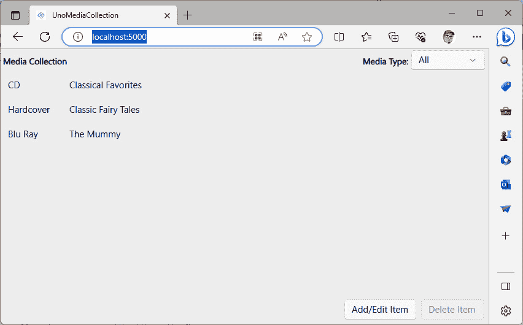

图 13.16 – 在浏览器中使用 WebAssembly 运行 Uno Platform 应用程序

尝试使用该应用程序。它应该与在其他平台上运行时完全一样。虽然一些视觉元素可能在不同平台上有所不同，但 Uno Platform 承诺在每个支持平台上都能实现接近像素级的完美应用程序。

如果你想要进一步探索调试，调试 WebAssembly 应用程序时有一些不同之处。Uno Platform 文档中关于这方面的信息非常出色：[`platform.uno/docs/articles/external/uno.wasm.bootstrap/doc/debugger-support.html`](https://platform.uno/docs/articles/external/uno.wasm.bootstrap/doc/debugger-support.html)。

在本节中，我们将使用 WebAssembly 和 Uno Platform 完成所有操作。让我们总结一下，回顾一下本章所学的内容。

# 摘要

在本章中，我们学习了关于 Uno Platform 的所有内容。WinUI 开发者可以利用他们的 Windows 开发经验，将其用于构建适用于每个平台的应用程序。虽然我们在这里专注于 Visual Studio 和 Windows 开发，但使用 Visual Studio、VS Code 和 JetBrains Rider，你可以在任何平台上构建你的 Uno Platform 应用程序。我们从基本的 *Hello World* 风格的应用程序开始，将代码和 XAML 从我们的 WinUI 项目导入，以极少的更改创建了一个跨平台版本的应用程序。我们还学习了如何利用 WSA 在 Windows 上调试可调整大小的 Android 应用程序，而无需配置模拟器。最后，我们使用 Uno Platform 和 WebAssembly 在浏览器中运行了我们的应用程序。你现在可以亲自尝试 Uno Platform 并测试它支持的其他平台。

在下一章（也是最后一章）中，我们将了解如何通过 **WinGet** 或企业部署选项将 WinUI 3 应用程序部署到 Microsoft Store。

# 问题

1.  使用 Visual Studio 调试 Android 应用程序时，有哪些两种部署选项？

1.  Uno Platform 支持哪两种应用程序设计模式？

1.  Uno Platform 支持哪些 XAML 架构？

1.  第一版 Uno Platform 是何时发布的？

1.  .NET 和 Uno Platform 开发者可以利用哪种客户端 Web 技术在浏览器中本地运行应用程序？

1.  Uno Platform 提供哪两种在线资源，以便你在浏览器中测试其控件和组件？

1.  你可以利用哪种设计工具在设计你喜欢的 IDE 中开发 Uno Platform 应用程序之前设计它们？
