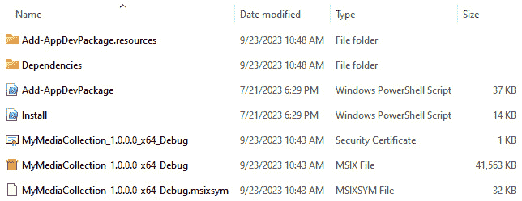

# 第十四章：打包和部署 WinUI 应用程序

WinUI 开发者有几种选项来打包和部署他们的应用程序。开发者可以在 **Microsoft Store** 上创建一个账户，并将打包的应用程序上传到 **Microsoft Partner Center** 以供公众消费。应用程序包也可以创建，以便通过 **Microsoft Endpoint Manager** 和 **Microsoft Intune** 由组织分发，或者由个人在 Windows PC 上侧载。

在本章中，我们将涵盖以下主题：

+   探索应用程序打包和 **MSIX** 基础知识

+   在 Visual Studio 中开始应用程序打包

+   使用 **Windows** **Package Manager** 部署应用程序

+   使用 Microsoft Store 分发应用程序

+   使用 MSIX 侧载 WinUI 应用程序

到本章结束时，您将了解可用于打包和分发 WinUI 应用程序的方法，以及如何使用每种方法。

# 技术要求

要跟随本章中的示例，需要以下软件：

+   Windows 10 版本 1809（构建 17763）或更高版本，或 Windows 11

+   Visual Studio 2022 或更高版本，已配置 **.NET Desktop Development** 工作负载以进行 Windows App SDK 开发

本章的源代码可在 GitHub 上通过此 URL 获取：[`github.com/PacktPublishing/Learn-WinUI-3-Second-Edition/tree/master/Chapter14`](https://github.com/PacktPublishing/Learn-WinUI-3-Second-Edition/tree/master/Chapter14)。

# 探索应用程序打包和 MSIX 基础知识

在本书的大部分内容中，我们都在本地构建和运行我们的 WinUI 3 应用程序。现在，是时候学习打包和部署 WinUI 应用程序的概念，并将这些知识付诸实践。

为什么要打包应用程序？嗯，应用程序包是 WinUI 应用程序及其依赖项在 Windows 上安装的最简单方式。今天，当你在 Visual Studio 中运行 WinUI 项目时，**集成开发环境**（**IDE**）会创建一个包并将其本地部署。打包还有其他几个重要的用途，如下所述：

+   **提供干净的卸载**：打包系统确保在应用程序卸载时，任何由应用程序安装或更新的文件都会被删除或恢复到其之前的状态

+   **捆绑依赖项**：应用程序包将捆绑并交付所有应用程序的依赖项，通过在可能的情况下共享安装应用程序中的文件来优化磁盘空间

+   **简化更新**：差异更新已优化，仅根据原始包和更新包的清单交付需要更新的文件

+   **声明能力**：通过在清单中声明应用程序的能力，用户在选择安装之前就会知道应用程序需要哪些类型的访问权限

+   **验证完整性和真实性**：为了在其他人的设备上安装 Windows 应用程序，应用程序包必须使用来自 **受信任**的 **签名机构**的有效证书进行数字签名。

如果你打算分发你的 WinUI 应用程序，你将使用的打包格式是 **MSIX**。什么是 MSIX？让我们来了解一下。

## MSIX

MSIX 是 Microsoft 引入的最新打包应用程序的标准。它不仅限于 Windows。**MSIX SDK**（[`learn.microsoft.com/windows/msix/msix-sdk/sdk-overview`](https://learn.microsoft.com/windows/msix/msix-sdk/sdk-overview)）是一个开源项目，可以用于为任何平台创建应用程序包。您可以使用 SDK 为 Windows、Linux、macOS、iOS、Android 以及甚至网页浏览器创建应用程序包。在本章中，我们将专注于向 Windows 用户提供 WinUI 应用程序，但您可以在其 GitHub 仓库 [`github.com/Microsoft/msix-packaging`](https://github.com/Microsoft/msix-packaging) 上了解更多关于 MSIX SDK 的信息。

在 Windows 上，以下平台目前支持 MSIX 格式：

+   Windows 10 版本 1709 及以后的版本，以及 Windows 11

+   Windows Server 2019 **长期服务渠道**（**LTSC**）及以后的版本

+   Windows Enterprise 2019 LTSC 及以后的版本

Windows 10 的早期版本需要 **APPX** 包，它是 MSIX 包的前身。然而，WinUI 3 支持的所有 Windows 10 版本也支持 MSIX 包。Microsoft 于 2018 年引入了 MSIX 包，作为 APPX 的发展，旨在满足 APPX 以及传统的 **Windows 安装程序**（**MSI**）包的需求。MSIX 是一个开放标准，因此它可以用于向任何平台分发应用程序。自 1999 年以来，MSI 一直是打包和安装 Windows 桌面应用程序的标准。在 Windows 95 及以后的操作系统上支持使用 MSI 包安装 Windows 应用程序。

使用新的 MSIX 打包标准，发送给 Windows 用户的 **通用 Windows 平台**（**UWP**）应用程序将在一个轻量级的应用容器内运行。WinUI 3 应用程序也可以配置为在应用容器中运行，以提供额外的安全性。**Windows 应用容器**为应用程序的执行提供了一个沙箱，限制了对其注册表、文件系统和其他系统功能（如摄像头）的访问。任何应用程序需要访问的功能都必须在清单文件中指定。打包为在应用容器中运行并使用 MSIX 安装的程序默认具有对 Windows 注册表的 **读取访问**权。在这种配置下，如果应用程序被卸载或重置，写入虚拟注册表中的任何数据都将被完全删除。对写入虚拟文件系统的数据也是如此。

如 Microsoft Learn 上所述（[`learn.microsoft.com/windows/msix/overview#inside-an-msix-package`](https://learn.microsoft.com/windows/msix/overview#inside-an-msix-package)），MSIX 包的内容被分为 *应用程序文件* 和 *脚印文件*，如下面的图示所示：


图 14.1 – MSIX 包的内容

应用程序文件是代码文件和其他资产的有效负载，这些文件被交付给用户。脚印文件是包需要的元数据和其它资源，以确保应用程序文件按预期交付。此元数据包括以下内容：

+   `AppManifest`：清单（`AppxManifest.xml`）包括有关应用程序标识、依赖项、功能、扩展点和视觉元素的信息。这是从 WinUI 项目的 `Package.appxmanifest` 文件生成的。

+   `AppBlockmap`：`AppxBlockMap.xml` 文件包括一个索引和加密散列的文件列表，这些文件位于包中，并在签名时进行数字签名，以确保包签名时的完整性。

+   `AppSignature`：当包被签名时，包中的 `AppxSignature.p7x` 文件被生成。这允许操作系统在安装过程中验证签名。

+   `CodeIntegrity`：通过验证 `AppxManifest.xml`、`AppxBlockMap.xml` 和 `AppxSignature.p7x` 中的包信息来确保代码完整性。

包中的应用程序文件将被安装到 `C:\Program Files\WindowsApps`\<package_name>，应用程序的可执行文件位于 `C:\Program Files\WindowsApps\<package_name>\<app_name>.exe`。请注意，您不能直接执行此 `EXE` 文件，并且对 `WindowsApps` 文件夹的访问受到 Windows 的限制。应用程序在安装期间和安装后创建的数据将存储在 `C:\Users\<user_name>\AppData\Local\Packages\<package_name>` 下。当应用程序被卸载时，所有应用程序文件、依赖项和数据都将被删除。

既然我们已经了解了 MSIX 的背景和历史，让我们回顾一下可供开发者和 IT 专业人员使用的工具。

## 检查 MSIX 工具和资源

在我们开始使用 MSIX 打包自己的应用程序之前，我们将回顾一些其他可用的工具和资源，如下所示：

+   **MSIX 工具包**：MSIX 工具包是由 Microsoft 在 GitHub 上维护的 MSIX 工具和脚本的开源集合：[`github.com/microsoft/MSIX-Toolkit`](https://github.com/microsoft/MSIX-Toolkit)。

+   **MSIX 实验室**：Microsoft 为对利用 MSIX 感兴趣的开发者和 IT 专业人员维护了一套动手教程，用于打包和分发他们的应用程序：[`github.com/Microsoft/msix-labs`](https://github.com/Microsoft/msix-labs)。

+   **MSIX 打包工具**：MSIX 打包工具是一个用于将经典应用程序重新打包为 MSIX 格式的应用程序。现有的 EXE、MSI 和**应用程序虚拟化**（**App-V**）安装包可以通过工具的交互式用户界面或命令行工具转换为 MSIX 包。它可在 Microsoft Store 中找到：[`apps.microsoft.com/store/detail/msix-packaging-tool/9N5LW3JBCXKF`](https://apps.microsoft.com/store/detail/msix-packaging-tool/9N5LW3JBCXKF)。

+   **MSIX 视频教程**：Microsoft Learn 在这里提供了一系列关于 MSIX 打包的入门视频：[`learn.microsoft.com/windows/msix/resources#msix-videos`](https://learn.microsoft.com/windows/msix/resources#msix-videos)。这是开始您的 MSIX 之旅的好方法。

+   **MSIX 社区**：**Microsoft Tech Community** 有一个专门讨论 MSIX 打包和部署的讨论空间。加入社区并参与其中：[`techcommunity.microsoft.com/t5/msix/bd-p/MSIX-Discussions`](https://techcommunity.microsoft.com/t5/msix/bd-p/MSIX-Discussions)。

这些工具和资源将帮助您在学习 WinUI 应用程序部署的细节过程中。重要的是要记住，MSIX 是微软持续投资的一个领域。它是打包所有应用程序的向前策略和推荐。WinUI 开发者不需要对 MSIX 有深入的了解。您只需要对 MSIX 以及与我们应用程序相关的属性有基本的知识。在我们动手操作之前，我们将简要讨论 Windows 中 **打包应用程序**、**包标识**和**应用容器**的概念。

## 打包应用程序和应用程序标识

在 Windows App SDK 中有一些特定的部署概念。在我们开始打包和部署自己的应用程序之前，让我们先在这里介绍这些基础知识。

需要理解的最重要概念之一是打包应用程序。我们迄今为止讨论的概念适用于打包的 WinUI 应用程序。这些应用程序使用 MSIX 打包和安装，具有包标识，并且默认情况下是**框架依赖**的。我们在那个句子中提到了一些重要的概念；让我们首先检查包标识。

所有打包的应用程序，无论是 WinUI、UWP 还是其他桌面 Windows 应用程序类型，都受益于包标识符。包标识符是 Windows 用来区分和验证应用程序身份的唯一标识符。有一些 Windows App SDK 功能仅适用于具有包标识符的应用程序。我们在*第八章*，*添加* *Windows 通知到 WinUI 应用程序*中使用的新的 Windows App SDK 通知 API，对任何打包应用程序都可用，因为这些应用程序具有包标识符。有关需要包标识符的其他功能的当前列表，请参阅此 Microsoft Learn 主题：[`learn.microsoft.com/windows/apps/desktop/modernize/modernize-packaged-apps`](https://learn.microsoft.com/windows/apps/desktop/modernize/modernize-packaged-apps)。

现在，让我们讨论打包应用程序和**未打包应用程序**。我们已经审查了打包应用程序的一些方面。大多数打包应用程序都是通过 MSIX 打包和安装的。然而，有一种打包应用程序的特殊变体，称为**具有外部位置的打包应用程序**。这些应用程序使用 MSIX 打包，因此具有包标识符，但它们使用不同的安装程序机制进行安装。我们不会部署具有外部位置的打包应用程序，但你可以在 Microsoft Learn 上了解更多关于它们的信息：[`learn.microsoft.com/windows/apps/desktop/modernize/grant-identity-to-nonpackaged-apps`](https://learn.microsoft.com/windows/apps/desktop/modernize/grant-identity-to-nonpackaged-apps)。

未打包的应用程序没有包标识符，因此它们可以访问的 API 受到限制，正如之前所讨论的。在大多数情况下，你只会选择这条路线来处理不需要任何需要包标识符的功能的旧版应用程序，并且通常对它们的功能限制较少，例如文件系统或注册表访问。UWP 应用程序不能进行解包，但 WinUI 应用程序可以。

最后一个要审查的概念是框架依赖型应用程序和**自包含**应用程序。依赖框架的 WinUI 应用程序依赖于 Windows App SDK 运行时在目标机器上安装。这减少了应用程序安装程序的大小，并允许应用程序在运行时接收安全漏洞修复更新，而无需每个应用程序都进行更新。缺点是在安装期间必须检查运行时的存在，以及用户在应用程序安装后卸载运行时的潜在风险。

自包含部署将 Windows App SDK 运行时与 MSIX 打包在一起。这增加了安装程序的大小，但提供了对应用程序使用的运行时版本的完全控制。自包含应用程序还支持 **Xcopy 部署**。你可以将应用程序及其依赖项从项目的输出文件夹复制到任何支持的 PC。除了包大小之外，此选项的主要缺点是性能。自包含应用程序加载较慢，并且由于它们的依赖项不与其他 WinUI 应用程序共享，因此它们使用更多的系统内存。它们被隔离在你的应用程序进程中。

关于这些概念的更详细信息，Microsoft Learn 上有两个优秀主题：

+   *Windows App SDK 部署概述* ([`learn.microsoft.com/windows/apps/package-and-deploy/deploy-overview`](https://learn.microsoft.com/windows/apps/package-and-deploy/deploy-overview)) 讨论了自包含部署的优缺点

+   *部署概述* 主题 ([`learn.microsoft.com/windows/apps/package-and-deploy/`](https://learn.microsoft.com/windows/apps/package-and-deploy/)) 深入探讨了打包应用与未打包应用之间的区别

现在，让我们开始动手，在 Visual Studio 中创建我们的 MSIX 包。

# 在 Visual Studio 中开始应用程序打包

在本节中，我们将了解如何使用 Visual Studio 将我们的应用程序打包为 MSIX。Visual Studio 2022 包含两个能够创建 MSIX 部署包的 WinUI 项目模板，具体如下：

+   使用 `package.appxmanifest` 文件生成 MSIX 包

+   `package.appxmanifest` 文件

我们将使用来自 *第八章* 的完成后的 **MyMediaCollection** 解决方案。你可以使用该章节中自己的解决方案，或者从该章节的 GitHub 仓库下载副本，网址为 [`github.com/PacktPublishing/Learn-WinUI-3-Second-Edition/tree/master/Chapter14`](https://github.com/PacktPublishing/Learn-WinUI-3-Second-Edition/tree/master/Chapter14)。让我们看看如何为应用程序生成 MSIX 包，如下所示：

1.  首先在 Visual Studio 中打开解决方案。

1.  如果你想查看项目的清单数据，可以打开 `Package.appxmanifest` 文件并查看每个选项卡上的设置，如图所示：


图 14.2 – 查看应用程序清单

1.  然后，在 **解决方案资源管理器** 中右键单击 `MyMediaCollection` 项目，并选择 **包和发布** | **创建应用包**。将出现 **创建应用包** 窗口，如图所示：


图 14.3 – 创建应用包窗口

1.  选择**侧载**，保留**启用自动更新**选项选中，并点击**下一步**。这是 MSIX 的**ClickOnce** **部署**（[`learn.microsoft.com/visualstudio/deployment/clickonce-security-and-deployment`](https://learn.microsoft.com/visualstudio/deployment/clickonce-security-and-deployment)）的等效操作。

1.  在**选择签名方法**页面，如果出现当前证书，请将其删除。您将看到从**Azure Key Vault**、存储或本地文件添加证书的选项，或者创建一个新的证书，如以下截图所示：


图 14.4 – 选择包的签名方法

1.  我们在这里将创建一个自签名证书。如果您想使用受信任机构的证书创建一个包，您可以选择一个`.pfx`文件。对于这个练习，请选择**创建**。

1.  在**创建自签名测试证书**对话框中输入并确认一个安全密码，然后点击**确定**。如果您被提示覆盖现有证书，您可以这样做。选择**是**以继续。您还将收到一条关于证书被导入到证书存储以进行包签名存储的消息。您可以在该消息对话框中点击**确定**。

1.  当您返回到**选择签名方法**页面时，新的证书详细信息将出现。确保在继续之前，您点击页面上的**信任**按钮以信任您机器上的证书。然后点击**下一步**。

1.  在**选择和配置包**页面，有选项可以更改版本号、生成应用程序包，或者添加、删除和更改解决方案配置映射。还有一个复选框可以包含与您的包一起的公共符号文件。保留所有默认设置并点击**下一步**。

1.  在**配置更新设置**页面，需要一个**安装位置**路径。对于您将在内部网络上安装工作站的程序，您可以在此处输入包的网络路径。对于我们测试的目的，我们将输入一个本地路径，如以下截图所示。为了使应用程序在其他机器上正确更新，需要存在相同的本地路径到安装程序：


图 14.5 – 配置包的更新设置

1.  点击**创建**。解决方案将被构建，包将被创建。当它完成后，点击**复制并关闭**按钮将安装程序复制到您选择的安装位置。

1.  打开`MyMediaCollection_1.0.0.0_x64_Debug_Test`文件夹以查看生成的 MSIX 文件，如以下截图所示：



图 14.6 – 为 MyMediaCollection 创建的 MSIX 包

1.  导航到 `MyMediaCollection` 的父文件夹，并双击 `index.html` 文件来安装软件包。它将在你的默认浏览器中打开文件，并显示在打包过程中选择的任何配置的安装选项。注意，在下面的屏幕截图中，我已经第二次打包了应用程序，因此版本号已自动增加到 `1.0.1.0`：


图 14.7 – MyMediaCollection 的安装页面

1.  如果你尝试在已经安装并运行软件包的同一台机器上安装该软件包，系统会提示你更新应用程序。继续在你的系统上安装或更新应用程序。

使用 Visual Studio 创建软件包是大多数 IDE 用户选择生成安装程序的方式。还有命令行工具可以创建 MSIX 软件包和捆绑包，这些工具在微软学习文档中有描述：[`learn.microsoft.com/windows/msix/package/manual-packaging-root`](https://learn.microsoft.com/windows/msix/package/manual-packaging-root)。

现在，让我们看看另一种替代的发行方法，Windows 软件包管理器。

# 使用 Windows 软件包管理器部署应用程序

Windows 软件包管理器，也被称为其命令名 `WinGet` 命令来安装已发布的软件包以及将你的 MSIX 软件包添加到 `WinGet` 的步骤。微软商店是 `WinGet` 可用的软件包源之一。因此，如果你计划将你的应用程序发布到商店，就没有必要将其也发布到 WinGet 仓库。

首先，让我们回顾一下将软件包添加到社区仓库的步骤。

## 将软件包添加到社区仓库

要通过 `WinGet` 命令使你的应用程序可供 Windows 用户使用，它们必须发布到微软的软件包管理器社区仓库或微软商店。任何发布到社区仓库的应用程序都可以通过 Windows 中的 `WinGet` 命令被发现和安装。

注意

与通过微软商店的发行方式相比，这种发行方式在本质上要安全得多。理论上，任何能够访问公共仓库的人都可以提取软件包并反编译你的应用程序。

要将你的现有 MSIX 捆绑包添加到仓库，我们需要使其公开可用，创建一个 WinGet 清单，并向 GitHub 提交一个 **pull request** (**PR**) 以将清单添加到社区仓库，具体操作如下：

1.  首先，将我们创建的安装程序文件夹（`C:\Installers\MyMediaCollection`）的内容推送到一个公开的 URL。为此，你可以在 Azure 中创建一个静态网站。这个 Microsoft Learn 主题将介绍这个过程：[`learn.microsoft.com/azure/static-web-apps/get-started-portal`](https://learn.microsoft.com/azure/static-web-apps/get-started-portal)。这将需要一个 GitHub 或 Azure DevOps 仓库来托管要部署的文件。

    文件可以被放在任何公开的 URL 上。另一个选项是将文件托管在 **Azure Blob Storage** 中（[`learn.microsoft.com/azure/storage/blobs/storage-blob-static-website-how-to?tabs=azure-portal`](https://learn.microsoft.com/azure/storage/blobs/storage-blob-static-website-how-to?tabs=azure-portal)）。我们将选择这个选项。

1.  在我们将上传为索引文档名称的 `index.html` 文件名之后。保存文件后，将出现 **主端点** 字段，如下面的截图所示：


图 14.8 – 在 Azure Blob 存储中设置静态网站

1.  点击该页面上的 **$web** 链接以导航到门户页面，在那里你可以上传文件到静态网站文件夹。

1.  点击 `C:\Installers\MyMediaCollection` 文件夹。

一旦你的包在云端，你就可以为社区仓库创建你的清单文件了。该文件以 **YAML** 格式创建。YAML 文件是当前 **DevOps** 工作流程的标准。

有关创建清单的详细说明以及有关 YAML 的更多信息，请查看此 Microsoft Learn 主题：[`learn.microsoft.com/windows/package-manager/package/manifest`](https://learn.microsoft.com/windows/package-manager/package/manifest):

1.  将你的 YAML 文件命名为 `YourCompany.MyMediaCollection.yaml`；内容应该看起来像这样：

    ```cs
    PackageIdentifier: YourCompany.MyMediaCollection
    PackageVersion: 1.0.0.0
    PackageLocale: en-US
    Publisher: Your Company Name
    PackageName: My Media Collection
    License: MIT
    ShortDescription: My Media Collection helps you get your media collection organized.
    Installers:
      - Architecture: x64
        InstallerType: msix
        InstallerUrl: https://mymediacollectiondeploy.z20.web.core.windows.net/MyMediaCollection_1.0.0.0_x64_Debug_Test/MyMediaCollection_1.0.0.0_x64_Debug.msix
        InstallerSha256: 712f139d71e56bfb306e4a7b739b0e1109abb662dfa164192a5cfd6adb24a4e1
        SignatureSha256: e53f48473621390c8243ada6345826af7c713cf1f4bbdf0d030599d1e4c175ea
    ManifestVersion: 1.0.0
    ```

1.  要获取你的 `.msix` 文件的 `Sha256` 信息，你可以使用此命令：

    ```cs
    certUtil –hashfile
      C:\Installers\MyMediaCollection\
        MyMediaCollection_1.0.0.0_x64_Debug_Test\
          MyMediaCollection_1.0.0.0_x64_Debug.msix SHA256
    ```

1.  然后，使用 WinGet 测试你的清单。要安装 WinGet，你可以从 Microsoft Store 安装 **App Installer** 应用程序，链接为 [`apps.microsoft.com/store/detail/app-installer/9NBLGGH4NNS1`](https://apps.microsoft.com/store/detail/app-installer/9NBLGGH4NNS1)。

1.  应用程序从商店安装后，使用以下命令测试你的清单中的语法：

    ```cs
    winget validate <manifest-file-name>
    ```

1.  然后，使用此命令测试从你的清单中安装应用程序：

    ```cs
    publisher name must be unique. If you have an account on package is the name of your application:

    ```

    manifests\<字母表中的字母>\<发布者>\<包>\<版本>\<文件名>.yaml

    ```cs

    ```

注意

如果你对 GitHub 分支和 PR 工作流程不熟悉，Package Manager 文档中有更详细的步骤：[`learn.microsoft.com/windows/package-manager/package/repository#step-3-clone-the-repository`](https://learn.microsoft.com/windows/package-manager/package/repository#step-3-clone-the-repository).

在 PR 被批准并合并后，任何拥有 WinGet 的用户都将能够从命令行安装你的应用程序。让我们看看如何使用 WinGet。

## 使用 WinGet 进行包管理

WinGet 是 Windows 包管理器的命令行客户端。如果你熟悉其他应用程序包管理器，例如 Windows 的**Chocolatey**（[`chocolatey.org/`](https://chocolatey.org/))或 macOS 的**Homebrew**（[`brew.sh/`](https://brew.sh/))，WinGet 会让你感到熟悉。包管理器允许你在操作系统中安装、列出和更新应用程序，并可以编写脚本安装多个应用程序，例如在设置新电脑时。在本节中，我们将了解如何使用 WinGet 安装**Windows Terminal**，这是微软使用 WinUI 构建的现代命令行应用程序！

注意

要了解 Windows Terminal 团队如何使用 WinUI 创建应用程序，请查看这篇博客文章：[`devblogs.microsoft.com/commandline/building-windows-terminal-with-winui/`](https://devblogs.microsoft.com/commandline/building-windows-terminal-with-winui/)。

现在我们来看一下步骤：

1.  你已经安装了应用程序安装器预览版，因此请打开**命令提示符**。

1.  使用以下命令测试 WinGet：

    ```cs
    search command to find the application we want to install, as follows:

    ```

    winget search windowsterminal

    ```cs

    You will see two results, as illustrated here:
    ```


图 14.9 – 使用 WinGet 进行搜索

注意

在继续之前，你可能需要同意 Microsoft Store 的**交易条款**。

1.  要获取有关包的更多信息，请使用`show`命令，如下所示：

    ```cs
    winget show Microsoft.WindowsTerminal
    ```

    这将返回应用程序清单中的以下信息：


图 14.10 – 查看 WinGet 包的清单信息

1.  然后，输入以下命令来安装 Windows Terminal：

    ```cs
    Microsoft.PowerToys (you can find out more about Microsoft PowerToys at https://learn.microsoft.com/windows/powertoys/).
    ```

这就是使用 WinGet 的全部内容。因为它是一个命令行工具，你可以构建脚本，安装所有需要的软件，以便在新电脑或**虚拟机**（**VM**）上运行。在 Microsoft Learn 上获取有关使用 WinGet 进行脚本编写的更多信息：[`learn.microsoft.com/windows/package-manager/winget/#scripting-winget`](https://learn.microsoft.com/windows/package-manager/winget/#scripting-winget)。

让我们继续到最后一个部分，我们将学习如何在 Microsoft Store 中分发应用程序。

# 通过 Microsoft Store 分发应用程序

我们已经看到如何通过可以侧载的包将 WinUI 应用程序传递给用户，以及如何使用 WinGet。对于 Windows 开发者来说，还有其他几个分发渠道可用——**Microsoft Intune**用于企业应用程序分发，以及**Microsoft Store**用于消费类应用程序。

对**Microsoft Endpoint Configuration Manager**和 Intune 的深入探讨超出了本书的范围，但如果您想了解如何通过它们分发**业务线**（**LOB**）应用程序，您可以阅读这个 Microsoft Learn 主题：[`learn.microsoft.com/windows/apps/publish/distribute-lob-apps-to-enterprises`](https://learn.microsoft.com/windows/apps/publish/distribute-lob-apps-to-enterprises)。

Microsoft 商店是 Windows 用户的消费应用商店。商店接受免费和付费应用的提交。还可以配置额外的货币化选项，例如应用内购买、销售定价和带免费试用期的付费应用。

在本节中，我们将介绍提交免费应用程序到商店的基本知识。如果您想了解更多关于货币化您的应用的信息，您可以从这里开始：[`learn.microsoft.com/windows/apps/publish/publish-your-app/price-and-availability`](https://learn.microsoft.com/windows/apps/publish/publish-your-app/price-and-availability)。

让我们看看如何将**MyMediaCollection**提交到 Microsoft 商店。

## 准备免费应用程序提交到 Microsoft 商店

在本节中，我们将使用 Visual Studio 准备和提交**MyMediaCollection**应用程序到 Microsoft 商店。Microsoft 商店是消费应用程序的主要分发渠道。在开始此过程之前，您需要在商店中拥有一个开发者账户。我们现在就来做，如下所示：

1.  首先，访问 Microsoft 商店的注册页面([`developer.microsoft.com/microsoft-store/register/`](https://developer.microsoft.com/microsoft-store/register/))并点击**注册**。

1.  使用 Microsoft 账户登录，并选择您或您的公司所在的国家或地区。

注意

此账户将是商店账户的所有者，并且无法轻易更改。如果您为组织创建商店账户，建议使用一个与组织或公司中任何个人无关的单独的 Microsoft 账户。

1.  选择您的账户类型为**个人**或**公司**。

1.  输入您的发布者显示名称。这是用户在您的公共应用商店列表中看到的名称，因此请仔细选择。

1.  输入您的联系信息——如果您的商店列表有任何问题或更新，Microsoft 将使用这些信息与您联系。点击**下一步**继续并输入付款信息。

1.  支付一次性的商店注册费。Microsoft 在您首次在商店注册账户时收取少量费用。这有助于防止欺诈和恶意账户的创建。在大多数国家，费用大约为**个人**约*19 美元（USD）*和**公司账户**约*99 美元（USD）*。

    各国的完整费用列表可在以下链接查看：[`learn.microsoft.com/windows/apps/publish/partner-center/account-types-locations-and-fees#developer-account-and-app-submission-markets`](https://learn.microsoft.com/windows/apps/publish/partner-center/account-types-locations-and-fees#developer-account-and-app-submission-markets)。

1.  完成后，点击**审查**。

1.  查看您的账户详情和应用开发者协议，然后点击**完成**以确认您的注册。此时将处理付款，并且您将收到确认电子邮件。

现在您已经在 Microsoft Store 上有了账户，我们可以继续提交我们的第一个应用，具体步骤如下：

1.  返回 Visual Studio，在**解决方案资源管理器**中右键单击`MyMediaCollection`项目。

1.  选择**包和发布** | **创建应用包**。这个过程与创建用于旁加载的包的过程相同。

1.  在**选择分发方式**屏幕上，选择**以新应用名称在 Microsoft Store 下**，然后点击**下一步**。

1.  在**选择应用名称**屏幕上，确保选择与您的商店账户链接的 Microsoft 账户，并在**预留新应用名称**字段中输入您希望的应用名称。点击**预留**以检查名称是否可用。每个应用名称在 Microsoft Store 中必须是唯一的。应用名称将出现在您的应用列表中，如以下截图所示：


图 14.11 – 为 Microsoft Store 列表选择应用名称

1.  在您的**现有应用名称**列表中选择应用名称，然后点击**下一步**。

1.  您可以在**选择和配置包**屏幕上保留默认值，除非您想更新版本或解决方案配置映射。如以下截图所示，在屏幕底部点击**创建**：


图 14.12 – 选择和配置包屏幕

1.  Visual Studio 将构建您的项目并为商店准备包。它还将对您的应用清单数据进行一些验证。如果在打包过程中遇到任何错误，请修复它们并再次尝试。如果您在审查提交清单（[`learn.microsoft.com/windows/apps/publish/publish-your-app/create-app-submission#app-submission-checklist`](https://learn.microsoft.com/windows/apps/publish/publish-your-app/create-app-submission#app-submission-checklist)）后认为您的提交已准备好，您可以在**完成创建包**屏幕上勾选**在 Windows 应用认证工具包验证后自动提交到 Microsoft Store**复选框。这将使您的包在验证运行成功后提交到商店。

1.  点击**启动 Windows 应用程序认证工具包**按钮。当认证工具包启动时，保留所有测试，然后点击**下一步**。测试可能需要几分钟才能完成，应用程序在验证过程中可能会启动几次。以下截图说明了**验证****应用程序**的进度：


图 14.13 – 微软商店应用程序验证过程

1.  此过程应在**查看最终报告**页面上提供**通过**结果。完成后，您可以点击**点击此处查看结果**选项，以查看哪些测试通过或失败。在继续商店提交之前，应解决所有失败。这些测试将在微软商店的审批过程中运行，任何失败都可能导致提交被拒绝。有关测试和针对失败可以采取的纠正措施的详细信息，您可以查看此微软学习主题：[`learn.microsoft.com/windows/uwp/debug-test-perf/windows-app-certification-kit-tests`](https://learn.microsoft.com/windows/uwp/debug-test-perf/windows-app-certification-kit-tests)。

当您有一个准备提交到商店的验证应用程序时，您可以继续此过程。让我们通过微软合作伙伴中心网站来了解如何提交 WinUI 应用程序。

## 上传包到商店

在本节中，我们将通过合作伙伴中心仪表板将 Visual Studio 创建的包提交到微软商店。为此，请按照以下步骤操作：

1.  首先，在以下 URL 使用您的微软账户登录到合作伙伴中心：[`partner.microsoft.com/dashboard/home`](https://partner.microsoft.com/dashboard/home)。

1.  点击**应用程序和游戏**，您将被带到**概览**页面，以将应用程序和游戏提交到 Windows 和 Xbox。

1.  在这里，您将看到您账户中预留的应用程序名称和提交的应用程序列表。如果您还没有预留应用程序名称，您可以点击**新产品** | **MSIX 或 PWA 应用程序**。我将从我的应用程序中选择**我的媒体收藏**来提交此应用程序的初始版本。以下截图说明了您如何开始预留新名称：


图 14.14 – 为您的应用程序预留新名称

1.  在您所选应用程序的**应用程序概览**页面，点击**开始您的提交**，如图下所示：


图 14.15 – 开始您的新的应用程序提交

1.  通过选择**定价和可用性**部分开始提交。

1.  我们将在这个部分保留所有默认设置，除了**基础价格**选项。这里必须进行选择。请选择**免费**选项或从列表中选择一个基础价格。完成后，选择**保存草稿**。

1.  然后，选择**属性**部分。选择一个类别和子类别（如果需要），并输入您的**支持信息**数据。在**显示模式**、**产品声明**和**系统要求**部分输入您应用的任何相关数据，然后点击**保存**。

    **属性**部分可以在以下屏幕截图中看到：


图 14.16 – 应用提交的属性部分

1.  在**年龄分级**页面上完成问卷并点击**预览分级**。此页面根据收集或与其他用户交换的数据确定您的应用是否应限制在特定年龄组。如果生成后一切看起来都很好，点击**保存**，然后点击**继续**。

1.  选择`.msixupload`或`.msix`文件并将其上传到提交网站。选择兼容的设备系列并点击**保存**。

1.  然后，在**商店列表**部分下选择一种语言。支持多种语言并在此处指定它们会使您的应用在不同国家安装的可能性更大。添加应用描述和至少一张应用截图。其余字段是可选的，但您完成的越多，客户找到您的应用就越容易，他们尝试它的可能性也越大。完成所有内容后，点击**保存**。

    以下屏幕截图中显示了某些示例语言选项：


图 14.17 – 选择应用提交的语言

1.  完成提交选项页面是可选的。默认情况下，您的应用在通过认证后将被立即发布。我将选择**在我选择现在发布之前不发布此提交**，因为我希望在做出一些额外更改之前不希望此应用在商店中可用。

1.  最后，点击**提交到商店**。您的应用将提交进行认证。如果通过认证，当您在提交选项页面上指定时，它将在 Microsoft Store 中可用。如果您的应用未通过验证，您将收到一个问题列表，您需要在尝试另一次提交之前解决这些问题。

这些是将新应用提交到 Microsoft Store 的基本步骤。有关更详细的情况，以及有关更新和附加信息的说明，您可以查看 Microsoft Learn 的*应用提交*文档：[`learn.microsoft.com/windows/apps/publish/publish-your-app/create-app-submission`](https://learn.microsoft.com/windows/apps/publish/publish-your-app/create-app-submission)。

现在，我们将介绍如何在 Windows 中使用 MSIX 侧载应用。

# 使用 MSIX 旁路加载 WinUI 应用

在本节中，我们将为 WinUI 项目创建一个 MSIX 包，并学习如何在 Windows 10 上旁路加载它。当您旁路加载一个应用时，您可以直接使用 MSIX UI 或 PowerShell 命令来安装它。这种安装方法非常重要，因为企业经常用它来内部分发应用。

注意

您也可以创建一个自包含的应用程序包，并使用 Xcopy 部署进行分发，但这种方法有一些性能缺点，我们已在本章前面讨论过。

我们将首先创建一个用于旁路加载的包。

## 创建用于旁路加载的 MSIX 包

在本节中，我们将使用 Visual Studio 创建一个 WinUI 项目的包。您可以从打开一个现有的 WinUI 项目或创建一个新的、空的开始。我已创建了一个名为`ProjectTracker`的新项目。按照以下步骤操作：

1.  首先，在**解决方案资源管理器**中右键单击项目，然后选择**打包和发布** | **创建** **应用包**。

1.  在**创建应用包**窗口的**选择分发方法**屏幕上，保持**旁路加载**单选按钮和**启用自动更新**复选框选中状态。点击**下一步**。

1.  在下一页上，选择签名方法。选择**是，选择一个证书**，然后点击**创建**按钮。在这里，您将创建一个自签名证书。使用自签名证书，任何安装应用的用户都需要信任您的包并从 MSIX 包中导入证书。我们将在下一节中解释此过程，当我们在旁路加载包时。输入证书的名称和密码，如下截图所示：


图 14.18 – 为包创建自签名证书

1.  选择**信任**以信任证书，然后点击**下一步**。

1.  在**选择和配置包**页面上保留默认设置。点击**下一步**。

1.  输入安装程序路径。这可以是一个本地文件路径或网络位置。点击**创建**。您的项目将编译，包将在指定位置创建。

现在我们已经有了项目的 MSIX 包，我们准备旁路加载它。让我们一步步来走这个过程。

## 旁路加载 MSIX 包

在本节中，我们将学习如何使用 MSIX 旁路加载 WinUI 应用。在前一节中，我们已创建了一个新的 MSIX 包。导航到项目文件夹内创建包的文件夹，并检查包文件夹中的文件——在我的例子中，文件名为`ProjectTracker_1.0.0.0_x64_Test`。以下截图展示了这一过程：


图 14.19 – 查看包文件

现在，让我们看看旁路加载应用程序的步骤：

1.  要在另一台 Windows 设备上安装此包，首先将 `Project` Tracker_1.0.0.0_x64.msix` 文件复制到机器上。此文件包含安装应用程序所需的所有信息和文件。

1.  然后，我们需要安装用于签名包的自签名证书。您可以通过运行 `Install.ps1` **PowerShell** 脚本来安装它，但如果您在同一台机器上安装，您也可以在创建时安装它。我们将通过右键单击 MSIX 文件并选择 **属性** 来安装它。

1.  点击 **数字签名** 选项卡，并在 **签名列表** 框中选中证书，如图所示以下屏幕截图：


图 14.20 – 在 MSIX 包属性中选择证书

1.  点击 **详细信息** 以打开 **数字签名** **详细信息** 屏幕。

1.  点击 **查看证书** 按钮。在打开的 **证书** 页面上，点击 **安装证书**。

1.  在完成 **证书导入向导** 时，将证书导入到本地计算机，并在 **证书存储** 页上选择 **将所有证书放置在以下存储中**，如图所示以下屏幕截图：


图 14.21 – 导入包证书

1.  点击 **浏览**，然后选择 **受信任的根证书颁发机构** 文件夹。在对话框中点击 **确定**，并在向导中点击 **下一步**。

1.  点击 **完成** 后，证书将被导入。如果一切顺利，您将收到一条消息，表明证书已成功导入。您可以关闭 **属性** 页面并继续安装包。

1.  现在，双击 `MSIX` 包文件。安装程序将打开一个窗口，显示应用程序的一些清单信息。点击 **安装**，并选中 **准备就绪时启动** 复选框，如图所示：


图 14.22 – 从其 MSIX 包安装受信任的应用程序

应用程序将安装并启动，您就可以开始了。请注意，由于我们已将证书导入到 **受信任的根证书颁发机构** 文件夹，因此包是受信任的。

如果目标机器上已经信任了 MSIX 证书，则可以使用 PowerShell 自动化此安装。使用 `Add-AppPackage` 命令从 PowerShell 提示符安装 MSIX 包或 MSIX 打包，如图所示以下命令：

```cs
Add-AppPackage -path c:\Installers\ProjectTracker\ProjectTracker_1.0.0.0_x64.msix
```

如果你有多份软件包要分发，你可以创建一个自定义 PowerShell 脚本来遍历给定文件夹中的所有 MSIX 软件包。有关 MSIX 的 PowerShell 脚本信息，请参阅以下 Microsoft Learn 主题：[`learn.microsoft.com/windows/msix/desktop/powershell-msix-cmdlets`](https://learn.microsoft.com/windows/msix/desktop/powershell-msix-cmdlets)。

让我们总结并回顾一下本章学到的内容。

# 摘要

在本章中，我们回顾了将 WinUI 应用程序提供给消费者的各种方法。我们学习了 MSIX 软件包的基础知识以及如何创建软件包以侧载我们的应用程序。我们还介绍了在 Microsoft Partner Center 上创建账户以在 Microsoft Store 上创建应用程序提交的过程。

然后，我们验证并提交了一个 MSIX 应用程序包到商店。最后，我们学习了如何手动侧载 MSIX 软件包以及如何利用 PowerShell 自动化侧载过程。这些概念将帮助你在准备创建自己的 WinUI 应用程序用于企业或消费者使用时。

这是本书的最后一章。我希望每一章中涵盖的概念能帮助你成功实现成为 WinUI 应用程序开发者的目标。

# 问题

1.  在 MSIX 之前，有哪些应用程序安装格式？

1.  MSIX 是否仅适用于 UWP 和 WinUI 应用程序？

1.  在一个 WinUI 项目中，哪个文件包含应用程序清单数据？

1.  使用 Windows 包管理器安装软件包时，使用哪个命令？

1.  你如何使用 WinGet 使你的应用程序可用？

1.  提交应用程序到 Microsoft Store 的在线门户名称是什么？

1.  在 Microsoft Store 列表中需要多少张截图？
