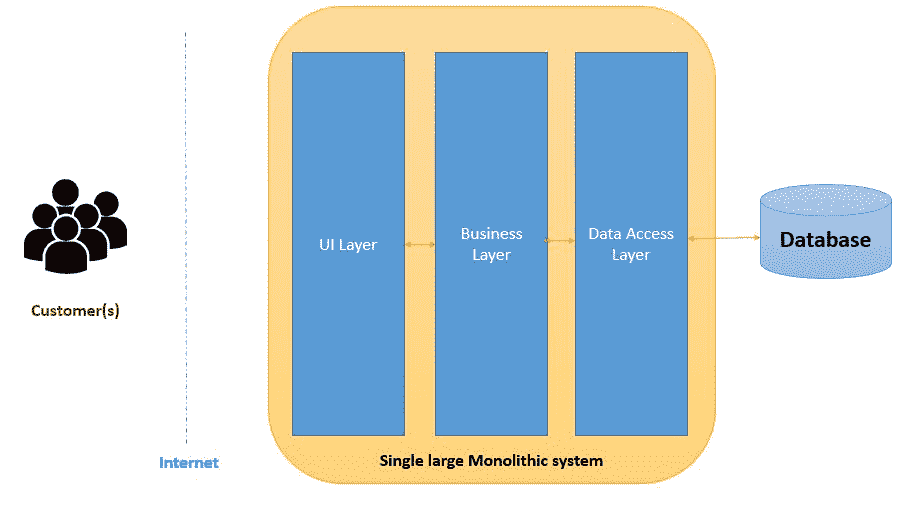
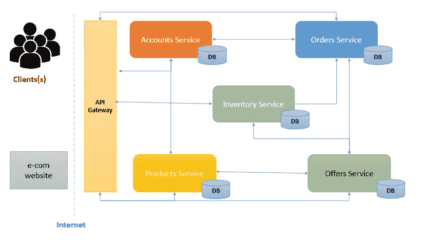

# 一、微服务和面向服务的架构简介

随着互联网可用性的增加，数据通信技术正在不断发展。架构的改进非常具有创新性、可扩展性，并且可以跨环境采用。需要在互联网上提供具有通用接口的软件组件，以便在不同平台和编程语言之间进行通信。

这导致了创建易于部署且具有可伸缩性的服务的概念，并通过 internet 公开这些服务。

服务功能设计被广泛采用；以服务的形式向异构客户机提供特性是一个好主意。这种使用服务的概念导致了**SOA**（**面向服务的架构**。

在本章中，我们将研究以下主题：

*   SOA 中的服务
*   单片建筑
*   微服务简介

# SOA 中的服务

服务是向系统内或系统外的其他软件提供功能的软件。

其他软件（客户端）可以是任何东西，从 web 应用（网站）到移动应用（本机或混合），或桌面应用，甚至是使用其他服务来执行特定类型功能的其他服务。

在电子商务网站上下文中，当用户下订单时，web 应用与服务通信，对数据库执行**创建、读取、更新和删除**（**CRUD**操作。

软件组件（客户端）和服务之间的通信通常通过具有某种通信协议的网络进行，例如，通过互联网与服务通信的移动应用。

以这种方式使用一个或多个服务的系统具有面向服务的架构。

这种架构背后的主要思想是，它不在每个客户端应用中使用模块，而是让我们使用一个或多个服务来为它们提供功能。这允许我们有许多使用相同功能的客户端应用。

SOA 之所以成功，是因为它具有以下特点：

*   它允许我们在需求增加时扩展软件，使其能够在多台服务器上拥有服务的副本，因此当流量进来时，负载平衡器将该请求重定向到服务的特定实例，我们可以拥有服务的多个实例。因此，当需求增加时，增加服务器上的实例数量可以帮助我们扩展它。
*   SOA 拥有标准化的契约或接口。当客户端应用调用服务时，它通过调用方法调用服务。该方法的签名通常不会在服务更改时更改，因此只要合同和接口不变，我们就可以升级服务，而无需升级客户机。
*   事实上，服务是无状态的，因此当从网站向我们的服务发出请求时，该服务实例不必记住来自该特定客户的前一个请求。它基本上拥有请求中的所有信息，以便检索与服务中以前的请求相关联的所有数据，因此，服务不必记住客户端以前对该服务的特定实例进行的调用。

# 服务实现

SOA 因其服务的实现而广受欢迎，这些服务可以通过独立于操作系统平台和编程语言的标准 internet 协议访问。

来自开发人员 POV 的服务只不过是托管在 web 服务器上的 web 服务，使用**SOAP**（**简单对象访问协议**或 JSON 进行通信。很有意思的是，web 服务可以用作遗留系统的包装器，使它们能够实现网络功能。

实现服务（SOA）的一些流行技术如下：

*   基于**WSDL**（**Web 服务描述语言**和 SOAP 的 Web 服务
*   消息传递，例如，使用 ActiveMQ、JMS 和 RabbitMQ
*   WCF（微软的 Web 服务实现）
*   阿帕奇节俭
*   巫师
*   RESTful HTTP

当单片架构方法的经验证明比之前想象的更痛苦时，面向服务的架构开始获得动力。让我们简要了解什么是单片系统，以及它们导致采用 SOA 的缺点。

# 单片建筑

基于单片架构的系统在 SOA 或微服务运动之前就存在了。这些类型的系统与 SOA 试图实现的恰恰相反。

典型的单片系统是基于企业的应用，该应用可能是一个大型网站的形式，所有工作模块都打包在一个包中，也可能是一个与网站对话的服务的形式。它可以打包为部署在计算机上的大型可执行文件。

在这些系统中，我们向应用添加了不同的组件以保持增长；没有大小限制，也没有划分。总有一个包包含所有内容，因此，我们最终得到了一个庞大的代码库。

单片系统的高级架构图如下所示：

Typical Monolithic architecture

# 单片建筑的管理费用

从长远来看，企业在将单片架构应用于其系统时面临以下缺点：

*   由于代码库太大，团队花了更长的时间在应用中开发新功能。
*   大型系统的部署也可能具有挑战性，因为即使对于一个小的 bug 修复，我们也必须部署整个系统的新版本，因此，这会产生更大的风险。
*   这是一个庞大的代码库，因此，我们也只能使用一个技术堆栈。
*   这会降低整个系统的竞争力，因为我们不能轻易地采用可能给我们带来竞争优势的新技术。
*   由于代码在一个大的包中，我们可能还具有高度的耦合，这意味着如果在系统的一个部分中进行更改，它可能会影响系统的另一个部分，因为代码是相互交织的。这种耦合可能存在于模块之间，也可能存在于不同的服务之间。
*   扩大这项服务以满足需求效率很低。例如，如果系统的 Orders 模块有需求，我们必须创建整个包、整个服务的副本，以便仅扩展 Orders 部分。
*   需要购买功能更强大的服务器，才能高效地运行大量单片应用。
*   对如此庞大的代码库进行单元测试需要时间，而 QA 的回归测试也是一个耗时的过程。

The only one advantage that a Monolithic system has is the fact that we can run the entire code base on one machine, so, when developing and testing, we could probably replicate the entire environment on a machine.

单片系统的一个示例可以是 ASP.NET MVC 站点，其中站点本身是 UI 层，然后在业务层中，您拥有业务逻辑和数据访问层。多年来，如果我们继续采用同样的方法，那么它将成为一个整体系统。

# 引入微服务

微服务架构基本上是面向服务的架构。在使用面向服务的架构多年之后，软件开发人员已经意识到面向服务的架构应该是什么样子，这基本上就是微服务架构——它是面向服务架构的演变。

微服务是小型的、自治的服务，它可以很好地执行一项功能，同时也可以与其他服务协同工作。

Microservices 引入了一组新的附加设计原则，它们教会我们如何正确地调整服务的大小。以前，没有关于如何确定服务大小以及服务中包含什么的指导。传统的面向服务的架构导致了单一的大型服务，并且由于服务的大小，这些服务的扩展变得效率低下。

让我们看看使用微服务的优势。

# 轻量级但可扩展

微服务提供的服务具有更高的可扩展性和灵活性，并且可以在需要性能的领域提供高性能。

基于微服务架构的应用通常是由多个微服务驱动的应用，其中每一个都为应用的特定部分提供一组功能或一组相关功能。微服务架构通常为应用、客户端应用和客户端服务提供一组相关功能。

微服务架构还使用客户端和服务之间或两个或多个服务之间的轻量级通信机制。通信机制必须是轻量级和快速的，因为当一个微服务架构的系统执行一个事务时，它是一个由多个服务完成的分布式事务。因此，服务需要通过网络以快速有效的方式相互通信。

# 技术不可知论

微服务的应用接口，或者我们与微服务的通信方式，也需要与技术无关。这意味着服务需要使用开放式通信协议，这样它就不会指定客户端应用需要使用的技术。通过使用开放通信协议，例如 HTTP REST（基于 JSON），我们可以很容易地拥有一个与基于 Java 的微服务对话的.NET 客户端应用。

# 独立可变

微服务的另一个关键特征是它是独立可变的。我们可以升级、增强或修复特定的微服务，而无需更改任何客户端或系统内的任何其他服务。

在微服务架构中，每个微服务都有自己的数据存储。通过修改一个微服务，我们应该能够在系统中独立地部署该更改，而无需部署任何其他内容。

Sample Microservices architecture app

上图描绘了微服务系统的高级架构图。这是一个典型的电子商务系统示例，正如您在左侧看到的，客户的浏览器中运行着一个购物网站，或者它可能是一个使用 API 网关的移动应用。

浏览器通过 internet 连接到演示购物网站——演示购物网站可能是在 IIS 上运行的 ASP.NET MVC 网站。与网站的所有交互所需的所有处理实际上都是由大量后台运行的微服务执行的。

每个微服务都有一个焦点，或一组相关功能，有自己的数据存储，并且可以独立地更改和部署。例如，我们可以升级 Orders 服务，而无需升级此系统的任何其他部分。

每种类型的微服务也可能有多个实例。例如，如果 Orders 服务有需求，我们可能有几个 Orders 服务实例来满足需求。为了将来自购物网站的请求定向到订单服务的正确实例，我们有一个 API 网关，用于管理请求并将其路由到系统中正确的微服务。

因此，在本例中，当客户下订单时，购物网站可能会在这些服务中使用多个服务和多个功能来满足该交易。这就是为什么在微服务架构中，一个事务通常是一个分布式事务，因为该事务实际上由多个软件（即微服务）来满足。

# 微服务的好处

以下是微服务的好处：

*   微服务架构满足了快速响应变化的需要。当今软件市场竞争激烈。如果您的产品不能提供所需的功能，它将很快失去市场份额。
*   它满足了业务领域驱动设计的需要。应用的架构需要与组织结构或组织内业务功能的结构相匹配。
*   微服务架构使用自动化测试工具。我们已经看到，在微服务架构中，事务是分布式的，因此，一个事务在完成之前将由多个服务处理。这些服务之间的集成需要测试，手动测试这些微服务可能是一项相当复杂的任务。自动化测试工具帮助我们执行此集成测试，减少了手动负担。
*   云兼容的微服务可以减轻部署和发布管理的负担。
*   微服务架构提供了一个采用新技术的平台。由于系统由多个运动部件组成，因此我们可以轻松地将一个部件（即微服务）从一个技术堆栈更改为另一个技术堆栈，以获得竞争优势。
*   通过使用异步通信，分布式事务不必等待单个服务完成任务后才能完成。
*   微服务的开发时间更短。因为系统被分成更小的活动部分，我们可以单独处理一个活动部分，可以让团队同时处理不同的部分，而且因为微服务的规模较小，而且它们只有一个焦点，所以团队在范围方面不必太担心。
*   微服务架构还为我们提供了更多的正常运行时间，因为在升级系统时，我们可能会一次部署一个微服务，而不会影响系统的其余部分。

Netflix adopted the Microservices architecture; the lessons learnt on architectural designs are summarized in this link along with a video: [https://www.nginx.com/blog/microservices-at-netflix-architectural-best-practices/](https://www.nginx.com/blog/microservices-at-netflix-architectural-best-practices/).

# 总结

在过去的十年中，随着互联网带宽、机器处理能力、更好的框架等方面的改进，建筑服务的发展经历了许多变化。

从开发人员的角度来看，微服务是使用 ASP.NET、Java、PHP 或其他工具的基于 REST 的 Web API。在接下来的章节中，我们将学习开发基于 ASP.NET Core 的 Web API 应用的各个方面。