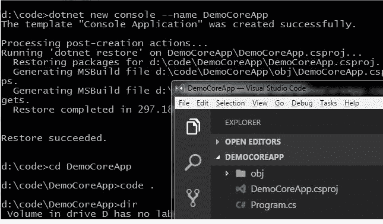
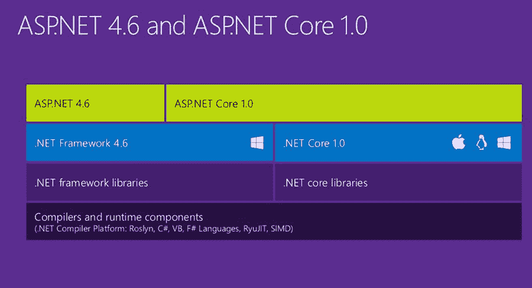
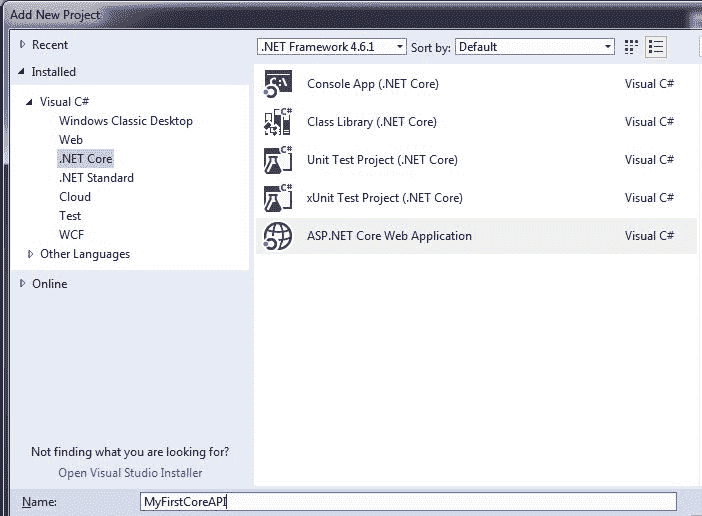
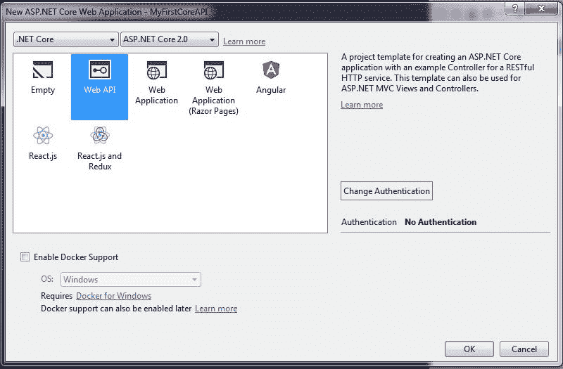
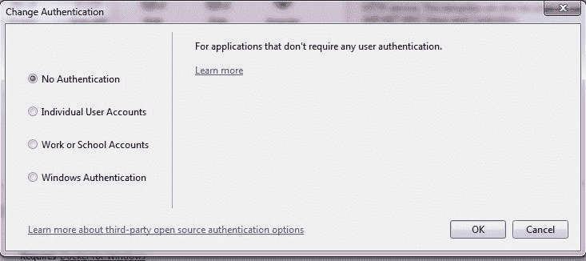
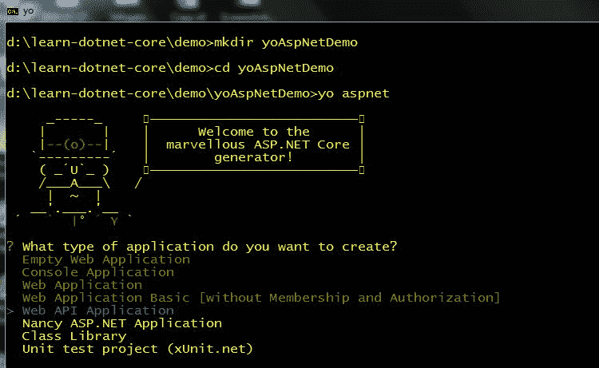
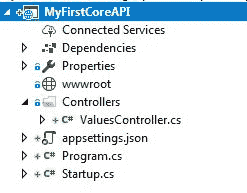
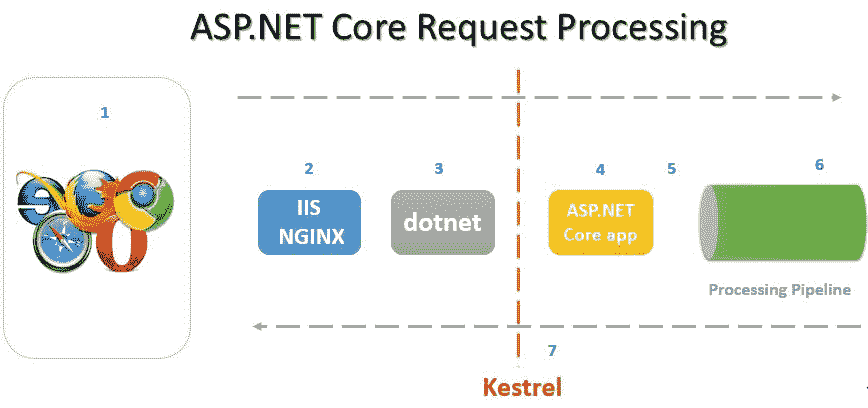
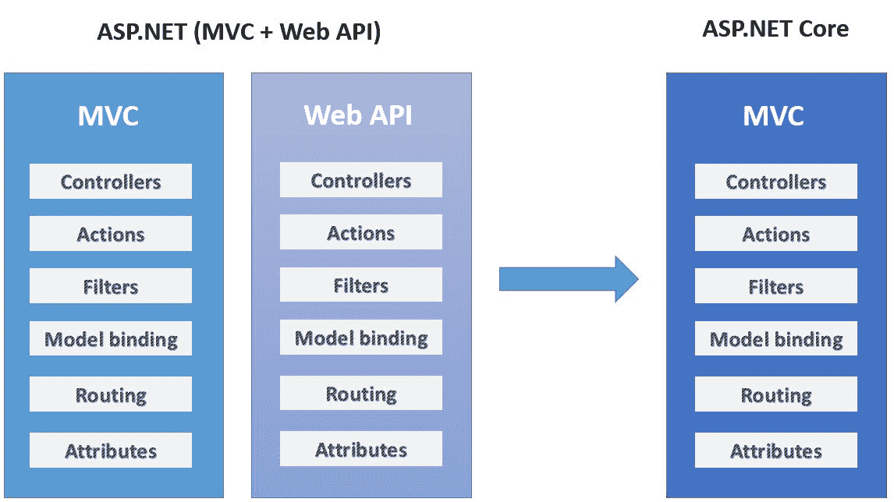
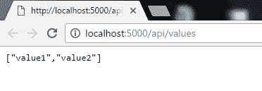

# 三、ASP.NET Core Web API 剖析

本章首先简要回顾一下 MVC。当我们使用 web API 时，您可能会惊讶于为什么我们需要 MVC。这是因为 ASP.NET Web API 是基于控制器、模型和视图的 MVC 原则设计的（在 Web API 的情况下，返回的响应可以被视为一个无面视图）。

本章的重点是了解为什么我们需要 Web API 形式的基于 HTTP 的轻量级服务技术，它的发展以满足不断变化的行业需求，以及 Microsoft 以.NET Core 和 ASP.NET Core 应用的形式进入开源世界，并且不局限于开发 ASP.NET web 应用的 Windows 操作系统世界。

在本章中，我们将研究以下主题：

*   快速回顾 MVC 框架
*   web API 的诞生及其发展
*   NET Core 简介
*   ASP.NET Core 架构概述
*   使用 Visual Studio IDE 创建 ASP.NET Core 项目
*   在 Linux/macOS 中创建 ASP.NET Core 项目
*   检查 ASP.NET Core 项目文件和结构
*   理解请求处理
*   MVC 与 webapi 的统一
*   运行 ASP.NET Core Web API

# 快速回顾 MVC 框架

**模型视图控制器**（**MVC**）是一种功能强大且优雅的分离应用中关注点的方法，它非常适合于 web 应用。

对于 ASP.NET MVC，MVC 代表以下内容：

*   **模型（M）**：这些是表示域模型的类。其中大多数表示存储在数据库中的数据，例如，员工、客户等。
*   **视图（V）**：这是一个动态生成的 HTML 页面作为模板。
*   **控制器（C）**：这是一个管理视图和模型之间交互的类。视图上的任何操作都应该在控制器中具有相应的处理，如用户输入、呈现适当的 UI、身份验证、日志记录等。

# Web API 的诞生及其发展

回顾基于 ASP.NET ASMX 的 XML web 服务被广泛用于构建面向服务的应用的日子，创建基于**SOAP**（**简单对象访问协议**）的服务是最简单的方法，该服务可供.NET 应用和非.NET 应用使用。它只在 HTTP 上可用。

在 2007 年底，微软发布了 Tyt T0\. Windows 通信基金会 T1 T1（Po.T2。WCF 过去和现在都是构建基于 SOA 的应用的强大技术。这是微软.NET 世界的一次巨大飞跃。

WCF 足够灵活，可以配置为 HTTP 服务、远程处理服务、TCP 服务等。使用 WCF 的契约，我们将保持整个业务逻辑代码基础不变，并通过 SOAP/非 SOAP 将服务公开为基于 HTTP 或非基于 HTTP。

直到 2010 年，基于 ASMX 的 XML web 服务（或 WCF 服务）被广泛应用于基于客户机-服务器的应用中；事实上，一切都很顺利。

但是.NET 和非.NET 社区的开发人员开始感到有必要为客户机-服务器应用开发一种全新的 SOA 技术。这背后的一些原因如下：

*   随着应用投入生产，通信时使用的数据量开始爆炸式增长，通过网络传输这些数据会消耗带宽。
*   SOAP 在某种程度上是轻量级的，开始显示出有效负载增加的迹象。几 KB 的 SOAP 数据包将变成几 MB 的数据传输。
*   由于 WSDL 和代理生成，在应用中使用 SOAP 服务导致了巨大的应用规模。在 web 应用中使用时，情况更糟。
*   对 SOAP 服务的任何更改都会导致更新服务代理以反映更改。对于任何开发人员来说，这都不是一项容易的任务。
*   基于 JavaScript 的 web 框架已经发布，并为更简单的 web 开发方式奠定了基础。使用基于 SOAP 的服务并不是那么理想。
*   平板电脑和智能手机等手持设备开始流行。他们有更专注的应用，需要一种非常轻量级的面向服务的方法。
*   基于浏览器的**单页应用**（**SPA**）发展非常迅速。对这些 SPA 来说，使用基于 SOAP 的服务是相当繁重的。
*   微软发布了基于 REST 的 WCF 组件，这些组件可以配置为以 JSON 或 XML 响应，但它仍然构建在 WCF 的重型技术之上。
*   应用不再只是大型企业服务，需要一个更加专注、轻量级和易于使用的服务，它可以在几天内启动并运行。

任何看过基于 SOA 的技术（如 ASMX、WCF 或任何基于 SOAP 的技术）不断发展的开发人员都觉得需要更轻的、基于 HTTP 的服务。

基于 HTTP 的、与 JSON 兼容的**POCO**（**普通的旧 CLR 对象**）轻量级服务是当下的需要，Web API 的概念开始获得发展势头。

# 介绍 webapi

使用 HTTP 谓词通过 web 访问的任何方法都称为 web API。它是一种通过 HTTP 传输数据的轻量级方式，很容易被各种客户端（如浏览器、桌面应用、手持设备，甚至其他 SOA 应用）使用。

要使 web API 成为一个成功的基于 HTTP 的服务，它需要一个强大的 web 基础设施，如托管、缓存、并发、日志记录、安全性等。最好的 web 基础设施之一就是 ASP.NET。

ASP.NET 以 Web 表单或 MVC 的形式被广泛采用，因此 Web 基础设施的坚实基础已经足够成熟，可以扩展为 Web API。

微软通过创建 ASP.NETWebAPI 来回应社区的需求——这是一个超级简单但功能强大的框架，用于构建仅限 HTTP 的默认 JSON Web 服务，而无需 WCF 的繁琐工作。

ASP.NET Web API 可用于在几分钟内构建基于 REST 的服务，并且可以轻松使用任何前端技术。

它于 2012 年推出，具有基于 HTTP 的服务的最基本需求，如基于约定的路由、HTTP 请求和响应消息。

后来，微软在 Visual Studio 2013 中发布了更大更好的 ASP.NET Web API 2 和 ASP.NET MVC 5。

ASP.NET Web API 2 通过以下功能以更快的速度发展：

*   通过使用 NuGet，WebAPI2 的安装变得更加简单；您可以创建空的 ASP.NET 或 MVC 项目，然后在 NuGet Package Manager 控制台上运行以下命令：

```cs
        Install-Package Microsoft.AspNet.WebApi

```

*   WebAPI 的初始版本基于基于约定的路由，这意味着我们定义了一个或多个路由模板，并围绕它展开工作。它很简单，没有太多麻烦，因为路由逻辑在一个地方，并且它适用于所有控制器。
*   现实世界的应用更为复杂，因为资源（控制器/操作）具有子资源，例如，客户有订单，书籍有作者，等等。在这种情况下，基于约定的路由是不可伸缩的。
*   WebAPI2 引入了属性路由的新概念，它使用编程语言中的属性来定义路由。一个直接的优点是，开发人员可以完全控制 web API 的 URI 的形成方式。
*   下面是属性路由的一个快速片段：

```cs
        Route("customers/{customerId}/orders")] 
        public IEnumerable<Order>GetOrdersByCustomer(int customerId) { ... } 

```

For more details on this, read Attribute Routing in ASP.NET Web API 2 at [https://www.asp.net/web-api/overview/web-api-routing-and-actions/attribute-routing-in-web-api-2.](https://www.asp.net/web-api/overview/web-api-routing-and-actions/attribute-routing-in-web-api-2)

*   ASP.NET Web API 位于 ASP.NET framework 上，这可能会让您认为它只能托管在 IIS 上。但是，使用 OWIN self-host，也可以在没有 IIS 的情况下托管它。
*   如果任何 web API 都是使用.NET 或非.NET 技术开发的，并且要跨不同的 web 框架使用，那么启用 CORS 是必须的。

A must read on CORS and ASP.NET Web API 2 can be found at this link: [https://www.asp.net/web-api/overview/security/enabling-cross-origin-requests-in-web-api](https://www.asp.net/web-api/overview/security/enabling-cross-origin-requests-in-web-api).

*   IHTTPActionResult 和 WebAPI OData 改进是帮助 WebAPI 2 发展成为开发基于 HTTP 的服务的强大技术的其他几个显著特性。
*   随着 C 语言的改进，ASP.NET Web API 2 在过去几年中变得更加强大，如使用 Async/Await、LINQ、实体框架集成、依赖注入 DI 框架等进行异步编程。

# ASP.NET 进入开源世界

每种技术都必须随着硬件、网络和软件行业的需求和进步而不断发展，ASP.NET Web API 也不例外。

从开发人员社区、企业和最终用户的角度来看，ASP.NET Web API 应该进行的一些更改如下：

*   虽然 ASP.NET MVC 和 web API 是 ASP.NET 堆栈的一部分，但它们的实现和代码库不同。统一的代码库减少了维护它们的负担。
*   众所周知，web API 由各种客户端使用，例如 web 应用、本机应用、混合应用和使用不同技术的桌面应用（.NET 或非.NET）。但是，如何以跨平台的方式开发 web API，开发人员不必总是依赖 Windows OS/Visual Studio IDE。
*   ASP.NET 堆栈应该是开源的，以便在更大范围内采用。
*   最终用户受益于开源创新。

我们看到了 web API 被接受的原因，它们是如何演变成一个强大的基于 HTTP 的服务的，以及一些必要的演变。有了这些想法，微软通过发布.NETCore 和 ASP.NETCore 进入了开源世界。

# NET Core 简介

.NETCore 是一个跨平台的开源托管软件框架。它构建在 CORECRL 之上，CORECRL 是 CLR 的一个完整的跨平台运行时实现。

.NET Core 应用可以在 Windows、Linux 和 macOS 系统等跨平台上开发、测试和部署。

.NET Core 具有以下重要组件：

*   **CORECRL**：这是一个.NET Core 执行引擎，执行 GC、编译机器代码等基本任务。
*   **CoreFX**：它包含用于.NETCore 的集合、文件系统、XML、异步等的类库。
*   **SDK 工具**：这是一套用于日常开发体验的 SDK 工具。创建项目、构建、运行和测试是开发人员的常见需求，也是这些 SDK 工具的一部分。

.NET Core 共享原始.NET Framework 的一个子集，另外它还附带了自己的一组 API，这些 API 不是.NET Framework 的一部分。这就产生了一些可供.NET Core 和.NET 框架使用的共享 API。

.NET Core 应用可以轻松地在现有的.Net 框架上工作，但反之亦然。

.NET Core 为操作系统的执行入口点提供**CLI**（**命令行界面**，并提供编译、包管理等开发人员服务。

以下是有关.NET Core 的一些有趣的知识点：

*   .NET Core 可以安装在 Windows、Linux 和 macOS 等跨平台上。它可用于设备、云和嵌入式/物联网场景。
*   Visual Studio IDE 不是与.NET Core 一起工作所必需的，但在 Windows 操作系统上工作时，我们可以利用现有的 IDE 知识。
*   .NET Core 是模块化的，这意味着开发人员处理的不是程序集，而是 NuGet 包。
*   .NETCore 依靠其软件包管理器接收更新，因为跨平台技术不能依赖 Windows 更新。
*   要学习.NETCore，我们只需要一个 shell、文本编辑器，并在运行时安装它。
*   .NET Core 具有灵活的部署。它可以包含在您的应用中，也可以在用户或机器范围内并排安装。
*   .NET Core 应用也可以作为独立应用自托管/运行。

.NET Core 支持四种跨平台方案：ASP.NET Core web 应用、命令行应用、库和通用 Windows 平台应用。

它不支持 Windows 窗体或 WPF，这些窗体或 WPF 在 Windows 上呈现桌面软件的标准 GUI。

目前，只有 C#编程语言可以用来编写.NET Core 应用。F#和 VB 支持正在进行中。

我们将主要关注 ASP.NET Core web 应用，其中包括 MVC 和 web API。将简要介绍 CLI 应用和库。由于其跨平台性，必须安装 VisualStudioIDE 才能创建应用不是强制性的。在本节中，我们将安装.NET Core，构建一个非常基本的.NET Core 应用，并了解.NET Core 的不同命令。

# 安装.NET Core SDK

打开.NET Core（[https://www.microsoft.com/net/core/preview](https://www.microsoft.com/net/core/preview) 网站，根据您选择的平台下载 SDK。在撰写本文时，.NET Core 2 预览版 2 已可用。

对于 Windows 环境，.NET Core 2.0 SDK 可以通过两种方式安装：

*   **.NET Core 2.0 和 Visual Studio 工具**：在 Visual Studio 2017 安装期间，提供了安装所需工具的选项，或者.NET Core SDK 也可以安装它们。CLI 与此一起安装。
*   **.NET Core 2.0 Windows SDK**：这是使用.NET Core 应用的 CLI 模式。

If you're using Windows OS, and prefer Visual Studio 2017 IDE, then it's better to leverage your IDE experience..

要使用代码，还可以安装一个文本编辑器，如 VisualStudio 代码。它是微软为 Windows、Linux 和 macOS 开发的轻量级代码编辑器。可从[下载 https://code.visualstudio.com/](https://code.visualstudio.com/) 。也可以使用其他文本编辑器，如 Vim、Atom 和 Sublime。

对于非 Windows 计算机，请提供适当的.NET Core SDK（请参阅此链接了解您选择的操作系统：[https://www.microsoft.com/net/core/preview 应安装用于处理代码的](https://www.microsoft.com/net/core/preview)和 Visual Studio 代码（推荐）。

Visual Studio for Mac is an exclusive IDE for macOS users, and can be used for .NET Core and ASP.NET Core apps. Download it from [https://www.visualstudio.com/vs/visual-studio-mac/.](https://www.visualstudio.com/vs/visual-studio-mac/)

# 创建和运行基本的.NET Core 应用

我们将重点学习.NETCore 的一些基本概念，以及如何使用命令行。以下步骤是跨平台学习.NET Core 的步骤。有关更多详细信息，请参阅[中的文档链接 https://docs.microsoft.com/en-us/dotnet/core/tools/.](https://docs.microsoft.com/en-us/dotnet/core/tools/)

首先，让我们确保一切都已正确安装。打开 Console/Shell（根据您选择的操作系统），输入以下命令以查看 CLI 命令和工具版本、产品信息以及运行时环境：

```cs
> dotnet -info  

```

.NET Core CLI 提供了以下要使用的命令：

| `new` | 初始化基本.NET 项目 |
| `restore` | 恢复.NET 项目中指定的依赖项（大多数情况下自动运行） |
| `build` | 构建一个.NET 项目 |
| `publish` | 发布用于部署的.NET 项目（包括运行时） |
| `run` | 编译并立即执行.NET 项目 |
| `test` | 使用项目中指定的测试运行程序运行单元测试 |
| `pack` | 创建一个 NuGet 包 |

还有一些命令，也可以去寻找它们。

在命令行中，键入以下命令：

```cs
> dotnet new console --name DemoCoreApp  

```



.NET Core Command in action

让我们了解在前面的屏幕截图中发生了什么：

*   `dotnet new`；在目录上下文中创建.NET Core C#控制台项目。它有两个文件：`program.cs`包含 C#代码，它的项目文件`csproj`。
*   `DemoCoreApp.csproj`是一个常见的.NET 项目文件，以 XML 格式包含项目的所有详细信息。然而，在.NETCore 中，由于使用 netcoreapp2.0 作为目标框架，项目被高度精简。
*   从.NETCore2.0 开始，无论何时创建、构建或发布项目，`dotnet restore`都会自动运行。

如前面的屏幕截图所示，演示项目在 VS 代码中打开；查看`program.cs`查看控制台上输出文本的 C#代码。

就像在传统的.NET 项目中一样，我们构建一个 C#项目，同样的方式，运行`dotnet build`命令，将执行例行构建并生成`bin`和`obj`文件夹。

现在`dotnet run`将运行 C#console 应用，并在控制台上显示结果`Hello World`。

此 C#项目可以通过运行`dotnet publish`发布并用于部署。这将在`bin`目录下创建`publish`文件夹。这个`publish`文件夹可以移植到任何安装了.NET Core SDK 的机器上。

我们看到了一个控制台应用的构建；我们可以使用相同的`dotnet new`命令创建库、web 和 xunittest 项目，如下所示：

```cs
dotnet new [--type] 

```

`--type`选项指定要创建的项目的模板类型，即 console、web、lib 和 xunittest。

使用.NET CLI 命令`dotnet new web`，您可以创建一个使用.NET Core 的 web 应用，该应用称为 ASP.NET Core。

# 介绍 ASP.NET Core

ASP.NET Core 是一个新的开源跨平台框架，用于使用.NET 构建基于云的现代 web 应用。

ASP.NET Core 是完全开源的，您可以从 GitHub（[下载 https://github.com/aspnet/Mvc](https://github.com/aspnet/Mvc) ）。它是跨平台的，这意味着您可以在 Linux/macOS 上开发 ASP.NET Core 应用，当然也可以在 Windows 操作系统上开发。

ASP.NET 最早是在大约 15 年前与.NET framework 一起发布的。从那时起，它已被数百万开发人员用于大型和小型应用。

由于.NET Core 是跨平台的，ASP.NET 在开发和部署 web 应用方面跨越了 Windows 操作系统环境的界限。让我们深入了解跨平台 ASP.NET 的更多细节。

# ASP.NET Core 概述



ASP.NET Core Architecture overview

ASP.NET Core 的高级概述提供了以下见解：

*   ASP.NET Core 在完整的.NET framework 和.NET Core 上运行。
*   具有完整.NET framework 的 ASP.NET Core 应用只能在 Windows 计算机上开发和部署。
*   当使用.NETCore 时，可以在所选的平台上开发和部署它。Windows、Linux 和 macOS 的徽标表明您可以在这些系统上使用 ASP.NET Core。
*   ASP.NET Core 在非 Windows 计算机上运行时，使用.NET Core 库运行应用。很明显，您不会拥有所有的.NET 库，但大多数都是可用的。
*   在 ASP.NET Core 上工作的开发人员可以轻松地切换到不限于 Visual Studio IDE 的任何机器上工作。
*   ASP.NET Core 可以与不同版本的.NET Core 一起运行。

除了跨平台之外，ASP.NET Core 还有许多其他基础性改进。以下是使用 ASP.NET Core 的优点：

*   ASP.NET Core 采用完全模块化的方法进行应用开发——构建应用所需的每个组件都被很好地分解到 NuGet 包中。我们只需要通过 NuGet 添加所需的包，以保持整个应用的轻量级。
*   ASP.NET Core 不再基于`System.Web.dll`。
*   Visual Studio IDE 用于在 Windows OS box 上开发 ASP.NET 应用。现在，由于我们已经超越了 Windows 世界，我们需要在 Linux/macOS 上开发 ASP.NET 应用所需的 IDE/编辑器/工具。Microsoft 为几乎所有类型的 web 应用开发了功能强大的轻量级代码编辑器，称为 Visual Studio 代码。
*   NET Core 就是这样一个框架，我们不需要 Visual Studio IDE/代码来开发应用。我们也可以使用 Sublime 和 Vim 等代码编辑器。要在编辑器中使用 C 代码，请安装 OmniSharp 插件。
*   ASP.NET Core 与 Angular、Ember、NodeJS 和 Bootstrap 等现代 web 框架进行了强大的无缝集成。
*   使用 bower 和 NPM，我们可以使用现代 web 框架。
*   ASP.NET Core 应用通过配置系统实现了云端准备——它只是无缝地从内部部署过渡到云端。
*   内置依赖注入。
*   可以托管在 IIS 上，也可以在您自己的进程或 Nginx 上自托管（它是一个免费、开源、高性能的 HTTP 服务器和 LINUX 环境的反向代理）。
*   新的轻量级和模块化 HTTP 请求管道。
*   web UI 和 web API 的统一代码库。当我们探索 ASP.NET Core 应用的剖析时，我们将看到更多关于这方面的内容。

# 使用 Visual Studio IDE 创建 ASP.NET Core 项目

现在，我们将使用 Visual Studio 2017 IDE 创建一个 ASP.NET Core Web API 应用。在开始之前，请确保此先决条件：

*   安装 Visual Studio 2017（安装时请选择.NET Core SDK 选项）。我们将一直使用社区版。本书通篇使用 ASP.NET Core 2.0 预览版 2

让我们开始逐步构建 ASP.NET Core Web API：

1.  打开 Visual Studio 2017 IDE，单击新建项目以打开“项目模板”对话框。
2.  在 Visual C#Templates 下，单击.NET Core，然后选择 ASP.NET Core Web 应用，如以下屏幕截图所示：



Create ASP.NET Core project in Visual Studio 2017 IDE We can also create an ASP.NET Core web application targeting the full .NET framework by web template under the Visual C# section

3.  提供适当的项目名称，如`MyFirstCoreApi`，单击“确定”。

# 选择应用类型

ASP.NET Core 为我们提供了不同的应用模板来开始开发应用。这些模板为我们提供了一个最佳的项目结构，以保持一切井然有序。我们有以下几种：

*   Empty：这是项目模板的最简单形式，只包含`Program.cs`和`Startup.cs`类。由于 ASP.NET Core 的完全模块化特性，我们可以将这个空项目升级到任何类型的 web 应用。
*   Web API：这将创建带有控制器、`web.config`等的 Web API 项目。我们的重点将放在这个应用模板上。
*   Web 应用：这将创建一个 ASP.NET Core MVC 类型的项目，其中包含控制器、视图、客户端配置、`Startup.cs`和`web.config`。
*   Web 应用（Razor 页面）：这将使用 Razor 页面创建 ASP.NET Core Web 应用。
*   Angular、React.js 和 React.js 与 Redux：这将创建基于 JavaScript 框架的 ASP.NET Core web 应用。



ASP.NET Core Project Templates

遵循 ASP.NET Core 提供的模板项目结构不是强制性的。在处理大型项目时，最佳做法是将它们拆分为单独的项目以实现可维护性。默认项目结构足以理解各个组件之间的交互。

# 选择身份验证类型

每个应用都需要某种类型的身份验证，以防止未经授权访问该应用。在前面的屏幕截图中，更改身份验证将提供以下身份验证选项：

*   无身份验证：选择此选项不会向应用添加任何身份验证包。但是，我们可以在需要时添加这样的包来完全保护我们的应用数据。
*   个人用户帐户：连接到 Azure AD B2C 应用将为我们提供所有身份验证和授权数据。
*   工作或学校帐户：使用 Office 365、Active Directory 或 Azure Directory 服务对用户进行身份验证的企业、组织和学校可以使用此选项。
*   Windows 身份验证：在 Intranet 环境中使用的应用可以使用此选项。

在更改身份验证选项中，选择无身份验证，如此屏幕截图所示：



Select Authentication Type for Web API

单击 OK 创建一个 ASP.NET Core Web API 项目；VisualStudio 工具将立即开始恢复所需的包。

执行`dotnet restore`命令以恢复所有 NuGet 包。

我们了解了 Visual Studio IDE 工具如何帮助我们在 Windows 操作系统上创建 ASP.NET Core 应用。这与创建 ASP.NET（MVC4/5 和 ASPX）应用时的操作类似。

# 在 Linux/macOS 上创建 ASP.NET Core web 应用

ASP.NET Core 是一种跨平台技术，在 Linux/macOS 上创建 web 应用时，我们需要类似的用户体验。众所周知，Visual Studio IDE 不能安装在 Linux/macOS 上，因此，在非 Windows 操作系统上使用 ASP.NET Core 应用有一种不同的方法。

以下是 Linux/macOS 机器的软件要求：

*   安装最新的 NodeJS 版本（[https://nodejs.org/en/](https://nodejs.org/en/) ）。
*   安装 Visual Studio 代码--一个跨平台的轻量级代码编辑器。也可以使用升华、Vim、原子（[https://code.visualstudio.com/#alt-下载](https://code.visualstudio.com/#alt-downloads)。
*   安装 Linux/macOS 的.NET Core SDK（[https://www.microsoft.com/net/download](https://www.microsoft.com/net/download) ）。

On Windows machines too, we can use NodeJS, Visual Studio Code, and .NET Core SDK for working with ASP.NET Core and avoid Visual Studio IDE.

# 使用 Yeoman 创建 ASP.NET Core web 应用

Yeoman 是现代网络应用的网络脚手架工具。它是一个开源工具，使用命令行选项与 VisualStudio 模板类似。Yeoman 命令行工具 yo 与 Yeoman 生成器一起工作。

Yeoman 生成一个完整的项目，其中包含运行应用所需的所有文件，就像 VS IDE 一样。阅读链接[http://yeoman.io/](http://yeoman.io/) 了解更多。

要安装 Yeoman，请确保从前面给出的软件先决条件中的链接安装 NodeJS 和 NPM。

打开命令行运行命令安装**Yeoman**（**yo**）。选项`-g`全局安装 npm 包，以便可以从任何路径使用。

```cs
npm install -g yo 

```

一旦 Yeoman 安装成功，我们需要为 yo 安装 ASP.NET Core 生成器。它将有助于项目创建和构建 web 应用的不同组件。在命令行中，运行以下命令：

```cs
npm install -g generator-aspnet

```

Yeoman 脚手架只能与 ASP.NET Core web 应用用于.NET Core。

# 使用 Yeoman 创建 ASP.NET Core Web API

确保所有内容都已正确安装，打开命令行，键入`yo aspnet`以查看与 Visual Studio IDE 类似的不同项目模板。我们将创建一个 web API 应用，提供一个合适的名称，如`yowebapidemo`，然后点击*输入*来创建项目。



Create ASP.NET Core apps using Yeoman

一旦 Yeoman 生成 web API 项目，它将显示创建的项目文件列表和要执行的指令。

We can even use the .NET Core CLI commands to create an ASP.NET Core Web API project by referring to the link [https://docs.microsoft.com/en-us/dotnet/core/tools/](https://docs.microsoft.com/en-us/dotnet/core/tools/).

# ASP.NET Core Web API 应用结构

我们已经使用 Windows 上的 Visual Studio IDE、Yeoman generator 或 Linux/macOS 上的.NET Core CLI 创建了一个 web API 项目——应用结构将是相同的，包括文件、文件夹和配置设置。让我们详细了解应用结构：

| **文件和文件夹** | **目的** |
| `/Controllers`文件夹 | 这就是我们放置处理请求的`Controller`类的地方 |
| `Program.cs`文件 | 这是使用`Main`方法执行应用的入口点。 |
| `Startup.cs`文件 | 这是设置配置和连接应用将使用的服务所必需的 |
| `.csproj`文件 | 这是一个 C#项目文件（`.csproj`，它更轻量级、更健壮、更易于使用。 |
| `Appsettings.json`文件 | 这是基于键/值的配置设置文件 |
| `Web.config`文件 | 这严格用于 IIS 配置，并在 IIS 上运行时调用应用 |

What about Model classes?
Domain models or POCO classes can be added in the Models folder, or we can create a separate class library for models. The preceding project structure is a good starting point; on larger projects, we can split the controllers, repositories, and domain models into separate class libraries for maintainability.



Asp.Net Core Web API project structure

让我们详细了解每个文件的内容。

# Program.cs

从根本上说，ASP.NET Core web 应用是控制台应用——知道这一点不奇怪吗？就像每个控制台应用都需要`Main()`才能执行一样，.NET Core 应用也有包含`Main()`方法的`Program.cs`文件。

ASP.NET Core 是建立在.NET Core 之上的，这就是我们刚才创建的应用结构中有`program.cs`的原因。签出此文件：

```cs
    using Microsoft.AspNetCore; 
    using Microsoft.AspNetCore.Hosting; 

    namespace MyFirstCoreAPI 
    { 
      public class Program 
      { 
        public static void Main(string[] args) 
        { 
            BuildWebHost(args).Run(); 
        } 

        public static IWebHost BuildWebHost(string[] args) => 
          WebHost.CreateDefaultBuilder(args) 
          .UseStartup<Startup>() 
          .Build(); 
      } 
    } 

```

您可以按如下方式分解前面的代码：

*   就像任何.NET 控制台应用都需要`Main()`方法来开始执行一样，.NET Core 运行时将通过调用`Main()`方法来启动应用。
*   需要使用`IWebHost`接口将这些控制台应用作为 web 应用（MVC 或 web API）运行。
*   `WebHost`类有`CreateDefaultBuilder`，它预先配置了运行应用的默认值。这意味着 web 应用需要一个 web 服务器（Kestrel）、一个 IIS 集成设置、用于读取各种值的配置文件以及`Content Root`文件夹。所有这些需求都在该方法中预先配置。
*   虽然我们可以实现一个自定义方法，但是提供的默认实现足以启动。通过此链接了解 ASP.NET Core GitHub 回购协议中的`CreateDefaultBuilder`代码[https://github.com/aspnet/MetaPackages/blob/rel/2.0.0-preview1/src/Microsoft.AspNetCore/WebHost.cs](https://github.com/aspnet/MetaPackages/blob/rel/2.0.0-preview1/src/Microsoft.AspNetCore/WebHost.cs) 。让我们从 GitHub repo 中了解这些方法：
    *   `UseKestrel ()`是一种扩展方法，其作用类似于运行 ASP.NET Core 应用的 web 服务器。它基于 libuv。Kestrel 通常被称为负责运行应用的内部 web 服务器。它重量轻、速度快、跨平台。在[有更多关于这方面的内容 https://github.com/aspnet/KestrelHttpServer.](https://github.com/aspnet/KestrelHttpServer)
    *   `UseContentRoot()`是一种扩展方法，用于指定 web 主机要使用的内容根目录。这通常是当前的工作目录；可以将其配置为指向另一个文件夹，其中包含运行应用所需的所有文件。
    *   当使用 ASP.NET Core 应用时，IIS 被视为一个外部 web 服务器，暴露于 internet 以接收请求。`UseIISIntegration()`配置服务器在`AspNetCoreModule`之后运行时应监听的端口和基本路径。
    *   `ConfigureAppConfiguration`读取配置文件，并添加`UserSecrets`和环境变量。
    *   `ConfigureLogging`设置控制台日志记录和调试窗口。
    *   `UseStartup(StartUp)`设置类来配置各种服务，如点击请求-响应管道等。Startup 是一个没有任何基类的简单类，有两个方法，`Configuration`和`Configure`。
    *   `Build()`构建并准备`WebHostBuilder`运行 web 应用。
    *   `Run()`；在 Kestrel web 服务器下运行 ASP.NET Core web 应用。

# Startup.cs

在 ASP.NET Core 中，`webHostBuilder`从`Main()`运行时调用 Startup 类，所有应用都需要该类。

它是任何请求或响应返回时的第一行执行。它执行一系列操作，如提供依赖项注入、添加和使用各种中间件组件等。

`Startup.cs`类必须定义`Configure`和`ConfigureServices`方法；当主机开始运行时，将调用它们。

# 配置方法

ASP.NET Core 是完全模块化的，也就是说，如果您真的需要组件，您可以添加它们。通过这种方法，web 应用在部署和性能方面变得轻量级。

`Startup.cs`类的`Configure`方法的主要目的是配置 HTTP 请求管道。在下面的`Startup.cs`代码示例中，您可以看到`IApplicationBuilder`使用扩展方法来配置管道。

`UseMvc`扩展方法将路由中间件添加到请求管道中，并将 MVC 配置为默认处理程序，如下所示：

```cs
    app.UseMvc(); 

```

我们已经创建了一个简单的 web API，为此，我们使用 MVC。您可能想知道，当我们使用 web API 时，为什么要使用 MVC？原因是 ASP.NET Core 具有统一的 MVC 和 web API。

`IApplicationBuilder`定义一个类，该类提供配置应用请求管道的机制。您可以将自定义管道配置构建为中间件，并使用扩展方法将其添加到`IApplicationBuilder`。[第 6 章](06.html#3UQQQ1-b5b28eac0b2e417189a3e09b61402d4f)*中间件和过滤器*专门针对此。

默认情况下，`IApplicationBuilder`、`IHostingEnvironment`和`ILoggerFactory`由服务器在 web API 或 MVC 项目中注入：

```cs
    using Microsoft.AspNetCore.Builder; 
    using Microsoft.AspNetCore.Hosting; 
    using Microsoft.Extensions.DependencyInjection; 

    namespace MyFirstCoreAPI 
    { 
      public class Startup 
      { 
        // This method gets called by the runtime. Use this method to add services to
          the container. 
        public void ConfigureServices(IServiceCollection services) 
        { 
          services.AddMvc(); 
        } 

        // This method gets called by the runtime. Use this method to configure the
          HTTP request pipeline. 
        public void Configure(IApplicationBuilder app, IHostingEnvironment env) 
        { 
          app.UseMvc(); 
        } 
      } 
    } 

```

在下一节中，我们将详细讨论 ASP.NET Core 请求管道处理以及中间件的角色。

# ConfigureServices 方法

`ConfigureServices`方法使用**依赖项注入**（**DI**设置应用运行的所有可用服务。将服务列表添加到`IServiceCollection`实例中，在`Configure`之前调用。

运行时首先调用此方法的原因是，在准备好请求管道处理之前，需要添加一些特性，如 MVC、标识、实体框架等。因此，在前面的代码中，我们看到了`services.AddMvc()`。

`ConfigureServices`方法有助于在 ASP.NET Core 应用中实现依赖项注入模式。让我们看一个简单的例子，假设我们通过实现`INewsOfDay`接口来编写`NewsOfDay`类。我想使用 DI 模式，以便任何其他类都可以轻松地注入此接口以获得当天的报价。

```cs
    public void ConfigureServices(IServiceCollection services) 
    { 
      // using DI to inject the interface 
      services.AddSingleton<INewsOfDay, NewsOfDay>(); 
    } 

```

ASP.NET Core 默认支持依赖注入；我们不需要使用任何第三方 DI 容器，如 Unity、StructureMap、Autofac 等。但是，如果开发人员觉得需要使用其他 DI 容器，他们可以覆盖默认实现。

# *csproj 先生

任何.Net 开发人员都会熟悉.Net 项目中的`*.csproj`文件；在 ASP.NET Core 应用中，我们确实可以找到此文件。与传统的.NET 应用相比，它是一个非常精简的版本。

在 ASP.NET Core 的初始版本中，基于 JSON 的`project.json`文件用于包管理，但为了与其他.NET 应用保持同步，并与 MSBUILD 系统配合良好，该文件被删除。

The `.csproj` file can be now edited in Visual Studio 2017 IDE without reloading the entire project. Right-click on the project file, click on Edit to make changes.

我们来看看 ASP.NET Core 项目的`*.csproj`文件的内容：

```cs
    <Project Sdk="Microsoft.NET.Sdk.Web"> 
     <PropertyGroup> 
       <TargetFramework>netcoreapp2.0</TargetFramework> 
       <UserSecretsId>aspnet-MyFirstCoreAPI-D0B356AB-BC35-4D73-9576-
         997BC358BEE9</UserSecretsId> 
     </PropertyGroup> 

     <ItemGroup> 
       <Folder Include="wwwroot\" /> 
     </ItemGroup> 

     <ItemGroup> 
       <PackageReference Include="Microsoft.AspNetCore.All"
         Version="2.0.0-preview2-final" /> 
     </ItemGroup> 

     <ItemGroup> 
       <DotNetCliToolReference
         Include="Microsoft.VisualStudio.Web.CodeGeneration.Tools"
         Version="2.0.0-preview2-final" /> 
     </ItemGroup> 
    </Project> 

```

您可以将`*.csproj`文件分解如下：

*   `TargetFramework`标签指向`netcoreapp2.0`。这是.NET 标准 2.0 的 ASP.NET Core 名称。我建议您访问此链接以了解有关.NET 标准 2.0 的更多信息：[https://blogs.msdn.microsoft.com/dotnet/2016/09/26/introducing-net-standard/](https://blogs.msdn.microsoft.com/dotnet/2016/09/26/introducing-net-standard/) 。
*   指示`Folder`在构建过程中包含`wwwroot`目录。
*   `PackageReference`是将包含在项目中的 NuGet 软件包或任何自定义库。`Microsoft.AspNetCore.All`元包引用了所有 ASP.NET Core 包，只有一个版本号。只有更改此版本，才能更新任何新版本。虽然您可以将它们作为单独的包添加，但建议使用`Microsoft.AspNetCore.All`。

**为什么选择 Microsoft.AspNetCore.All 元软件包？**

.NETCore2.0 带来了一个称为运行时存储的新功能。从本质上说，这让我们可以在中央位置的机器上预安装软件包，这样我们就不必将它们包含在单个应用的发布输出中。

# ASP.NET Core 请求处理

ASP.NET（MVC 和 ASPX）的所有请求处理都依赖于`system.web.dll`。它曾经完成所有繁重的浏览器-服务器通信工作，并且与 IIS 紧密耦合。

NET Core 是通过完全删除`system.web.dll`来实现跨平台设计的；这导致了一种完全可插拔的不同请求处理技术。这种删除也有助于统一 ASP.NET 中的 MVC 和 web API 堆栈。

ASP.NET Core 没有区分 MVC 和 web API，因此请求处理现在将很常见。在下一节中，我们将了解有关统一的更多信息。

下图显示了 ASP.NET Core 请求处理的概述：



ASP.NET Core request processing

让我们一步一步地了解 ASP.NET Core 请求处理。

各种客户端，如 web 应用（浏览器）、本机应用和桌面应用，都会访问托管在外部 web 服务器（如 IIS/Nginx）上的 web API。有趣的是，IIS 现在是外部 web 服务器的一部分，因为它不运行 ASP.NET Core 应用。它只充当通过 internet 公开的托管 web 服务器。Nginx 是 Linux 机器上 IIS 的对应物。

IIS/Nginx 调用计算机上安装的 dotnet 运行时来启动处理请求。现在，该处理属于.NET Core。为此，`web.config`文件仍存在于 ASP.NET Core 应用中。

Dotnet 运行时调用 kestrelweb 服务器（内部 web 服务器）来运行应用。Kestrel 是一个基于 libuv 的开源轻量级跨平台 web 服务器；这是使 ASP.NET Core 应用真正跨平台的重要步骤之一。

Kestrel 然后通过应用中的`Main ()`方法启动应用。请记住，ASP.NET Core 应用是控制台应用。`Program.cs`中的`Main ()`方法是.NET Core 应用的起点。

然后，`Main ()`方法构建并运行`webHostBuilder`。然后，请求被推送到`Startup.cs`类的`Configure`方法；HTTP 请求管道在此处配置。我们之前创建的默认 web API 模板项目只在管道中添加了`app.UseMvc ()`。我们可以以中间件的形式定制 HTTP 请求管道处理逻辑（详见[第 6 章](06.html#3UQQQ1-b5b28eac0b2e417189a3e09b61402d4f)、*中间件和过滤器*：

1.  MVC 中间件构建在通用路由中间件之上，用于处理请求。此时，请求被处理，并发送到相应的控制器进行处理。
2.  当请求处理完成时，响应将以相反的顺序通过相同的管道发送。如果请求无效，定制中间件可以帮助我们返回响应。

ASP.NET Core 请求管道处理完全可插拔；`Configure`方法应该只包括所需的中间件，而不是 ASP.NET web 堆栈中存在的繁重的`system.web.dll`。

# ASP.NET Core 中统一的 MVC 和 Web API

主要的架构演进之一是在 ASP.NET Core 中统一 MVC 和 web API。ASP.NET Core 中的 MVC 和 web API 控制器之间没有区别。

在以前的 ASP.NET 堆栈中，MVC 和 web API 中的控制器从各自的基本控制器派生，如下所示：

```cs
    // ASP.NET MVC 5 Controller 
    public class HomeController : Controller 
    {  
      // Action Methods 
    } 
    // ASP.NET MVC 5 Controller  
    public class ValuesController : ApiController 
    {  
      // API Action Methods 
    } 

```



MVC and Web API unification

ASP.NET MVC 4/5 和 web API 2 都具有控制器、操作、过滤器、模型绑定、路由和属性，但由于以下原因，它们具有不同的代码基：

*   ASP.NET MVC（4/5）依赖于`system.web.dll`，该`system.web.dll`绑定到 IIS 进行托管。如果没有 IIS，您将托管一个 MVC 应用。
*   ASP.NET Web API 设计为自托管；它不依赖 IIS 托管。

ASP.NET Core 的设计思想之一是使其自托管，并独立于 IIS 进行托管。通过这种方式，`system.web.dll`被删除，因此它可以在没有 IIS 的情况下托管。这导致了 MVC 和 WebAPI 的合并，形成了一个单一的代码库。

在 ASP.NET Core 中，MVC 和 web API 共享同一个基本控制器，因此，MVC 和 web API 之间没有实现差异。

# 运行 ASP.NET Core Web API 项目

我们的 ASP.NET Core Web API 是由 Visual Studio 2017 IDE 为 Windows 环境和 Yeoman generator 为 Linux/macOS 创建的。我们将使用 IIS Express 或 Kestrel 服务器运行该应用。

在运行应用之前，让我们进一步了解`Values`控制器（默认创建）。在`Controllers`文件夹下有一个名为`ValuesController.cs`的 C#类文件：

```cs
    using System.Collections.Generic; 
    using Microsoft.AspNetCore.Mvc; 

    namespace MyFirstCoreAPI.Controllers  
    {    
      [Route("api/[controller]")] 
      public class ValuesController : Controller 
      { 
        // GET api/values 
        [HttpGet] 
        public IEnumerable<string> Get() 
        { 
            return new string[] { "value1", "value2" }; 
        } 

        // GET api/values/5 
        [HttpGet("{id}")] 
        public string Get(int id) 
        { 
            return "value"; 
        } 

        // POST api/values 
        [HttpPost] 
        public void Post([FromBody]string value) 
        { 
        } 

        // PUT api/values/5 
        [HttpPut("{id}")] 
        public void Put(int id, [FromBody]string value) 
        { 
        } 

        // DELETE api/values/5 
        [HttpDelete("{id}")] 
        public void Delete(int id) 
        { 
        } 
      } 
    } 

```

您可以按如下方式分解前面的代码：

*   Web API 基于模型、值和控制器概念。`ValuesController.cs`是客户端通过 HTTP 访问的 C#类。
*   它派生自控制器基类，使任何类都成为 MVC 或 WebAPI 控制器
*   `[Route("api/[controller]")]`定义路由策略。基于此配置可以访问控制器
*   `ValuesController`提供了以下可通过 HTTP 访问的方法：

| **方法名称** | **HTTP 动词** | **备注** |
| `Get()` | HttpGet | 返回字符串的 IEnumerable |
| `Get(int id)` | HttpGet | 返回基于值的字符串 |
| `Post([FromBody]string value)` | httpost | 使用 POST 插入字符串 |
| `public void Put(int id, [FromBody]string value)` | HttpPut | 使用 PUT 根据 Id 更新字符串 |
| `public void Delete(int id)` | HttpDelete | 使用 DELETE 删除字符串记录 |

# 在 VisualStudioIDE 中运行应用

在使用 Visual Studio 2017 IDE 时，我们有两种运行 ASP.NET Core 应用的方法：

*   **使用 IIS Express**：如果您想使用 IIS Express。按*F5*开始运行应用；它将打开选定的 web 浏览器。
*   **使用红隼服务器**：如果您想运行红隼服务器，请从运行选项中选择`MyFirstCoreAPI`。按*F5*开始运行应用；它将打开所选的 web 浏览器以及控制台窗口。

在这些环境中，我们将使用命令行选项来运行应用。他们使用 Kestrel 服务器来运行应用。

# 在 Linux/macOS 上运行 ASP.NET Core Web API

从 Linux/macOS 机器的项目根目录中打开 console/shell，如下所示：

```cs
dotnet run 

```

上述命令编译、构建和运行应用；它还开始监听`http://localhost:5000`上的请求。打开任何浏览器，粘贴 URL`http://localhost:5000/api/values`以查看 web API 从值控制器返回响应。

您将看到应用正在运行，并在浏览器中显示响应，如以下屏幕截图所示：



Response after Web API on browser

我们可以使用 Postman 发送请求并接收来自所示 web API 的响应。端口是自动生成的，并且会根据机器的不同而有所不同。

Postman 是一个用于使用 API 各种活动的工具——我们将使用它进行 API 测试。您可以从[下载 https://www.getpostman.com/](https://www.getpostman.com/) 。

在 ASP.NET Core Web API 项目中，响应格式化程序默认设置为 JSON。但是，我们可以根据需要定制。

**How about debugging using Visual Studio Code?** If you need a similar experience for debugging .NET Core (C#) in Visual Studio Code,
Omnisharp--C# extension for .NET core--should be installed. Refer to this link to set up debugging: [https://github.com/OmniSharp/omnisharp-vscode/blob/master/debugger.md](https://github.com/OmniSharp/omnisharp-vscode/blob/master/debugger.md)

# 进一步阅读

有关的详细信息，请参阅以下链接。净核心：

*   [https://docs.microsoft.com/en-us/dotnet/](https://docs.microsoft.com/en-us/dotnet/)

有关 ASP.NET Core 的更多信息，请参阅以下内容：

*   [https://docs.asp.net/en/latest/](https://docs.asp.net/en/latest/)
*   [https://github.com/aspnet/Mvc](https://github.com/aspnet/Mvc)
*   第 9 频道的 ASP.NET 怪物系列 MSDN
*   ASP.NET 社区站在[上 https://live.asp.net/](https://live.asp.net/)

# 总结

在本章中，我们已经介绍了很多方面。我们首先介绍了 MVC，然后介绍了 ASP.NET Web API 在过去十年中是如何成熟的。有了背景知识，我们学会了如何使用.NET Core 和跨平台框架的强大功能。

我们了解 ASP.NET Core 及其架构，并使用.NET Core SDK 设置系统。我们还使用 VisualStudio 工具和 Yeoman 生成器创建了一个 web API。我们详细了解了 ASP.NET Core 请求处理以及将 web API 和 MVC 统一到单个代码库中的过程。

在下一章中，您将了解有关模型、视图和控制器的更多信息。