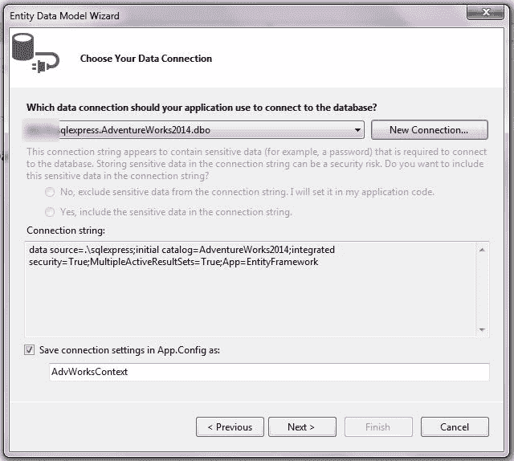
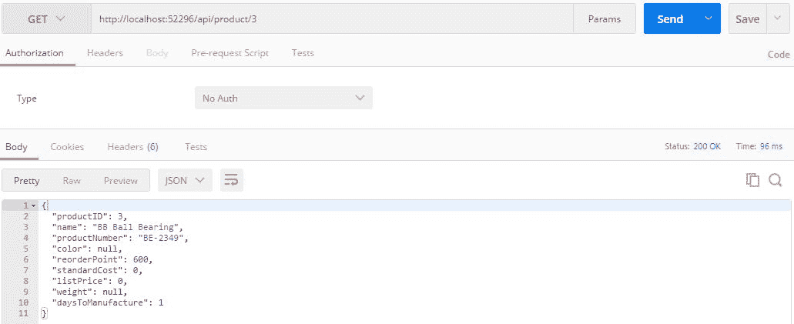
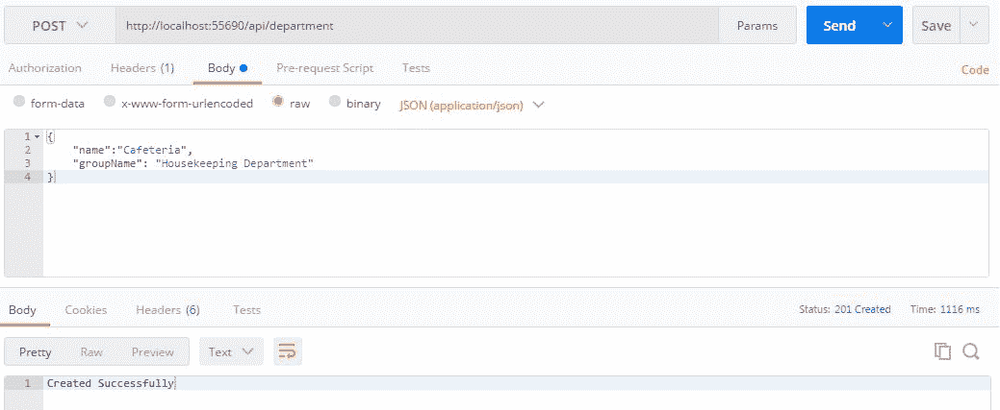
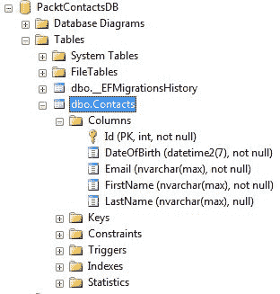
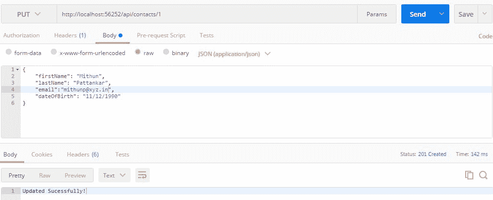

# 九、与数据库集成

数据是软件应用中的王者，无论是以数据库、文件、流等形式。很难找到不与数据库交互的应用。在上一章中，您学习了大量关于 ASP.NET Core 以路由、中间件和过滤器的形式处理请求及其安全机制的知识；它们构成了应用的匿名前端。

到目前为止，我们还没有讨论过 ASP.NET Core 处理后端（数据存储的流行术语），也就是数据库。任何 ASP.NET Core（Web API）都必须在应用开发期间或从一开始就与数据库集成。

Microsoft SQL Server 通常被认为是 ASP.NET 应用的登录数据库。现在有了 ASP.NET Core，与不同类型数据库的集成比以往任何时候都更有趣。在不同的数据库系统中，如 Oracle、MySQL、PostgreSQL、SQLite 等，集成本质上是跨平台的。

在 ORMs 的帮助下，与数据库的集成是快速、可扩展和高效的。我们将探索微软的 ORM，即现有和新数据库的**实体框架**（EF 6.x 和 EF Core）和**Dapper**（Micro ORM）。

在本章中，我们将介绍以下主题：

*   对象关系映射器简介
*   使用实体框架 6.x 进行集成
*   用简洁的语言进行集成
*   利用 EF 核进行积分

# 对象关系映射器简介

与数据库集成需要做大量的基础工作来执行简单的**CRUD**（**创建**、**读取**、**更新**、**删除**等操作操作。一些基础工作包括连接到数据库、释放连接、池、查询数据库、处理单个或多个记录、连接弹性、批量更新等。

为这项基础工作编写代码是一项艰巨的任务，通常以大量手写代码、代码重复、错误结果和维护问题而告终。

**对象关系映射器（ORM）**以类对象映射到关系数据库表的形式提供了更好的与数据库集成的方法。

ORM 提供了上述必要的基础工作，还使用面向对象的概念将类对象映射到关系数据库表。

例如，广泛使用的 Microsoft SQL Server 学习数据库是 Adventure Works。在基于.NET 的应用中，关系表`Production.Product`映射到`Product`类。ORM 不局限于表格；它们处理存储过程、视图、模式迁移等。

一些流行的 ORM 有实体框架（6.x 和 core）、NHibernate、Dapper 等等。

在本章中，我们将重点介绍如何使用实体框架和简洁的 ORM 将数据库与 ASP.NET Core Web API 集成。

# 使用 Entity Framework 6.x 集成 ASP.NET Core Web API 和现有数据库

**实体框架**（**EF**是针对.NET world 的 ORM。EF 和其他 ORM 一样，可以用于创建新的数据库和表，或者对现有数据库使用 EF。

我们将使用 EntityFramework6.1 构建 ASP.NET Core Web API，与现有数据库集成。我们将使用 Microsoft SQL Server 学习数据库**AdventureWorks2014**。

EF 6.1 是一个使用完整的.NET 框架构建的 ORM，这意味着它只适用于完整的.NET 应用。为了实现这一点，我们需要为完整的.NET 框架而不是.NET Core 创建 ASP.NET Core。

通过以下步骤，我们将使用 EF 6.1 创建与 AdventureWorks2014 数据库集成的`AdvWorksAPI`（ASP.NET Core Web API）。

# 恢复 AdventureWorks2014 数据库

下载并恢复 AdventureWorks2014 数据库备份（[https://msftdbprodsamples.codeplex.com/releases/view/125550](https://msftdbprodsamples.codeplex.com/releases/view/125550) ）。本例中使用的是 Microsoft SQL Server 2014。

这将作为我们使用 EF 6.1 的现有数据库。您可以使用任何现有数据库。

# EF6 数据访问库

如前一节所述，EF6 只在完整的.NET 框架上工作；因此，我们不能在 ASP.NET Core 应用中直接使用它们。为此，我们需要一个类库，并对现有数据库执行反向工程，AdventureWorks2014 就是我们的示例。

**逆向工程**是实体框架（ORM）中的一个过程，用于生成类/模型（它们对应于表）并构建数据库上下文以使用数据库。

创建一个空白的 Visual Studio 解决方案`AdvWorksAPI`，并向其添加类库`AdvWorksAPI.DataAccess`。这将作为数据访问层，并将在 ASP.NET Core 应用中引用。

要使用反向工程生成类/模型，请右键单击项目名称以添加新的 ADO.NET 实体数据模型，并按照步骤连接到数据库，使用实体数据模型向导选择适当的表、存储过程和其他数据库项。

更多可视步骤请参考[https://msdn.microsoft.com/en-us/data/jj200620](https://msdn.microsoft.com/en-us/data/jj200620) 。

在此过程中，我们只选择了`Production.Product`表；这将导致`Product`类、`AdvWorksContext`类包含`Product`中的`DbSet`进行处理。在 EF 术语中，我们执行了逆向工程代码，这是 AdventureWorks2014 数据库的第一个过程。

In the real world, existing database schema will surely contain many tables, SPs, and so on. Web API's are usually built targeting only relevant tables. By reverse engineering only the relevant tables, we are reducing the in-memory database snapshot generated when EF runs in the application.

It's one of the recommended approaches to use required tables when working with the existing database for EF.



Connect to the existing database using the Entity Data Model wizard

# 为完整的.NET Framework 创建 ASP.NET Core 应用

正如本章前面提到的，EF6 是在完整的.NET 框架上构建的，因此我们不能在.NET Core 下创建 ASP.NET Core 应用，相反，我们应该针对完整的.NET 框架创建它。

每个 ASP.NET Core 功能都可以使用，但不能部署在非 Windows 计算机上。大多数现有企业仍然在部署的机器上使用完整的.NET 框架，因此利用它不会成为问题。

在空白解决方案中，创建带有 ASP.NET API 模板的 ASP.NET Core Web 应用（.NETFramework）。这将是我们与 AdventureWorks2014 数据库集成的 ASP.NET Core Web API。

由于我们已经准备好了数据访问类库，请使用 Add 引用将其包含在 webapi 项目中。确保您添加的 EntityFramework（6.1.3）库使用 NuGet 或 Package Manager 控制台。

On the target project, right-click the project name and click Add Reference to open a folder dialog window, navigate to the `bin` folder and select AdvWorksAPI.DataAccess to add it web API project.

# 使用 IPProductRepository 访问数据库

通常，在使用 ORM 访问数据库时，使用存储库模式访问 EF DataContext。使用它有很多目的，其中最突出的是：

*   它分离了检索数据的逻辑
*   实体到业务模型的映射，与数据源无关
*   它有助于单元测试和集成测试

在`Service`文件夹中创建接口`IProductRepository`及其实现`ProductRepository`，如下所示：

```cs
    namespace AdvWorks.WebAPI.Services 
    { 
      public class ProductRepository : IProductRepository 
      { 
        private AdvWorksContext _context; 
        public ProductRepository(AdvWorksContext context) 
        { 
          _context = context; 
        } 
        public void AddProduct(Product proddetails) 
        { 
          _context.Products.Add(proddetails); 
        } 
        public void DeleteProduct(Product proddetails) 
        { 
          _context.Products.Remove(proddetails); 
        } 
        public Product GetProduct(int productId) 
        { 
          return _context.Products.Where(c => c.ProductID == 
            productId).FirstOrDefault(); 
        } 
        public IEnumerable<Product> GetProducts() 
        { 
          return _context.Products.Take(10).ToList(); 
        } 
        public bool ProductExists(int productId) 
        { 
          return _context.Products.Any(c => c.ProductID == productId); 
        } 
        public bool Save() 
        { 
          return (_context.SaveChanges() >= 0); 
        } 
      } 
    }

```

您可以按如下方式分解前面的代码：

*   它是`IProductRepository`接口的一个实现。
*   `AdvWorksContext`是从`Startup`类注入的依赖项，这有助于单元测试。
*   `AddProduct`接收`Product`对象并将其添加到`AdvWorksContext`中。它还没有保存在数据库中。
*   `DeleteProduct`接收`Product`对象并从`AdvWorksContext`中移除。它还没有保存在数据库中。
*   `GetProduct`接收`ProductId`以检索产品详细信息。
*   `GetProducts`返回数据库中存储的前 10 个产品。由于该表有许多记录，因此它将使用前 10 条记录。
*   `ProductExists`返回基于现有产品的布尔值。
*   `Save`方法保留所有`AdvWorksContext`更改。

# 启动中的连接字符串和 IPProductRepository

使用数据库时，连接字符串是必须的；它包含数据库服务器的位置、数据库名称、访问数据库的凭据以及其他信息。

ASP.NET Core 将所有配置/连接数据存储在 JSON 文件中，称为`appsettings.json`。在`appsettings.json`文件中复制以下连接字符串：

```cs
    { 
      //Others removed for brevity 
      "connectionStrings": { 
        "AdvWorksDbConnection": "Server=.\\sqlexpress;initial 
        catalog=AdventureWorks2014;Trusted_Connection=True;
        MultipleActiveResultSets=true" 
      } 
    } 

```

既然我们已经提供了连接字符串（`AdvWorksDbConnection`并编写了`IProductRepository`来访问数据库，那么我们需要在应用中配置（参与依赖项注入）它们。

为此，我们需要在`ConfigureServices`方法的服务中添加它们，如下代码所示：

```cs
    public void ConfigureServices(IServiceCollection services) 
    { 
      services.AddMvc(); 
      services.AddScoped<AdvWorksContext>(_ => new 
        AdvWorksContext(Configuration.GetConnectionString(
        "AdvWorksDbConnection"))); 
      services.AddScoped<IProductRepository, ProductRepository>(); 
    } 

```

# 使用自动映射器

任何现有数据库的表中都会有许多列。有时，web API 响应或请求对象不需要与表列一致的所有属性。

我们可以在数据访问层编写一个精简版的`Product`类，作为`Models`文件夹中的`ProductDTO`类。对于许多列，手动映射变得很难维护。`Product`类应转换为`ProductDTO`类，反之亦然；使用`AutoMapper`可以简化此转换。

`AutoMapper`是一个基于约定的.NET 对象映射器。使用 NuGet 安装此程序。

首先，我们在`Models`文件夹中创建`ProductDTO`，这是`Product`类的精简版本，如下所示：

```cs
    using System.ComponentModel.DataAnnotations; 
    namespace AdvWorks.WebAPI.Models 
    { 
      public class ProductDTO 
      { 
         public int ProductID { get; set; } 
         [Required] 
         [StringLength(50)] 
         public string Name { get; set; } 
         [Required] 
         [StringLength(25)] 
         public string ProductNumber { get; set; } 
         [StringLength(15)] 
         public string Color { get; set; }         
         public short ReorderPoint { get; set; } 
         public decimal StandardCost { get; set; } 
         public decimal ListPrice { get; set; } 
         public decimal? Weight { get; set; } 
         public int DaysToManufacture { get; set; } 
      } 
    } 

```

Using `AutoMapper` is optional, using it would help keep objects lean.

我们需要在管道处理中初始化`Mapper`，以便相应地映射请求和响应：

```cs
    public void Configure(IApplicationBuilder app, 
      IHostingEnvironment env, ILoggerFactory loggerFactory) 
    { 
      AutoMapper.Mapper.Initialize(cfg => 
      { 
        cfg.CreateMap<Product, ProductDTO>(); 
        cfg.CreateMap<ProductDetailsDTO, Product>(); 
      }); 
      app.UseMvc();  
    } 

```

现在我们有了一个使用`DbContext`与数据库对话的接口，这是一个初始化的对象转换映射器，现在是编写 web API 控制器的时候了。

# 写入 ProductController 以访问数据库

右键点击`Controllers`文件夹添加`Web API Controller`类，命名为`ProductController`。复制以下代码在`Product`表上执行 CRUD 操作：

```cs
    public class ProductController : Controller 
    { 
      private readonly IProductRepository _productRepository; 

      public ProductController(IProductRepository productRepository) 
      { 
        _productRepository = productRepository; 
      } 
      // GET: api/values 
      [HttpGet] 
      public IActionResult Get() 
      { 
         var prodlist = _productRepository.GetProducts(); 
         var results = Mapper.Map<IEnumerable<ProductDTO>>(prodlist); 
         return Ok(results); 
      } 
      // GET api/values/5 
      [HttpGet("{id}")] 
      public IActionResult Get(int id) 
      { 
        if (!_productRepository.ProductExists(id)) 
        { 
          return NotFound(); 
        } 
        var prod = _productRepository.GetProduct(id); 
        var results = Mapper.Map<ProductDTO>(prod); 
        return Ok(results); 
      } 

      //Complete code part of source code bundle 
    } 

```

Complete source code is available in the code bundle.

我们可以将前面的代码分解如下：

*   `IProductRepository`在构造函数中注入依赖项；我们在`Startup`课上注册了这个。
*   `Get()`方法通过`IProductRepository`接口从数据库返回产品列表。`AutoMapper`对`Product`到`ProductDTO`的对象转换生效。
*   `Get(int id)`方法根据`ProductID`返回匹配产品，否则返回`NotFound(404)`HTTP 响应。`AutoMapper`也会转换为`ProductDTO`。
*   `Post()`方法使用`FromBody`请求接收`ProductDetailsDTO`（类似于`ProductDTO`的对象）。它检查空值和模型验证，如果有，返回`BadRequest`。它还映射回`Product`对象，并将其添加到 EF6 的`DbContext`。调用`Save`方法来持久化`AdventureWorks2014`数据库的`Production.Product`表中的条目。
*   `Put()`方法也执行与 post 类似的操作，唯一的区别是更新，而不是创建。
*   `Delete()`方法检查产品是否存在，然后通过调用`Save()`方法将其从数据库中删除。

建设和运行项目；使用`PostMan`对`ProductController`进行积垢操作，如下图所示：



Get product from the database using EF 6

# 用简洁的语言进行集成

**Dapper**是一款开源的简单对象映射器，适用于基于.NET 的应用。与实体框架或 NHibernate 相比，也称为**微 ORM**。

扩展了`IDbConnection`接口，不依赖任何具体的 DB 实现；这使得它可以与几乎所有的关系数据库一起工作，如 SQLite、SQLCE、Firebird、Oracle、MySQL、PostgreSQL 和 SQLServer。

它被认为是 ORM 之王，因为它在其他 ORM 中重量轻、性能高。我建议在[上阅读他们的 GitHub 回购协议 https://github.com/StackExchange/dapper-dot-net](https://github.com/StackExchange/dapper-dot-net) 。

由于 Dapper 与现有数据库一起使用，因此我们将对其使用相同的 AdventureWorks2014 数据库。在本节中，我们将使用`HumanResources.Department`表。

让我们使用 Dapper ORM 创建一个与 AdventureWorks2014 数据库集成的 ASP.NET Core Web API 应用。

# 创建 advwrksdapperWebAPI 并添加 Dapper 库

Dapper 可以与完整的.NET Framework 以及.NET Core Framework 一起使用，因此让我们使用 web API 创建 ASP.NET Core（.NET Core）应用，并将其命名为`AdvWrksDapper`。使用 NuGet 管理器添加 Dapper 库。

# 使用 IDepartmentRepository 和 department 模型访问数据库

在`Models`文件夹中创建`Department`类参与数据库访问。请记住，属性名称应与表列名一致：

```cs
    using System.ComponentModel.DataAnnotations; 

    namespace AdvWrksDapper.Models 
    { 
      /// <summary> 
      /// HR.Department Table of Adventure Works Database  
      /// </summary> 
      public class Department 
      { 
        [Key] 
        public int DepartmentID { get; set; } 
        [Required] 
        [StringLength(50)] 
        public string Name { get; set; } 
        [Required] 
        [StringLength(50)] 
        public string GroupName { get; set; } 
      } 
    } 

```

正如我们在前面的示例中所做的，我们将创建用于执行 CRUD 操作的`IDepartmentRepository`，如下所示：

```cs
    public class DepartmentRepository : IDepartmentRepository 
    { 
      private readonly AdvWorksConfig _advConfig; 
      public DepartmentRepository(IOptions<AdvWorksConfig> advconfig) 
      { 
         _advConfig = advconfig.Value; 
      } 

      public IDbConnection Connection 
      { 
        get 
        { 
           return new SqlConnection(_advConfig.DbConnectionString); 
        } 
      } 

      public bool AddDepartment(Department deptdetails) 
      { 
        bool isSuccess = false; 
        using (IDbConnection dbConnection = Connection) 
        { 
          dbConnection.Open(); 
          var rows = dbConnection.Execute("INSERT INTO
            HumanResources.Department (name,groupname)
            VALUES(@Name,@GroupName)", deptdetails); 
          if (rows == 1) 
          { 
            isSuccess = true; 
          } 
        } 
        return isSuccess; 
      }       

      public IEnumerable<Department> GetDepartments() 
      { 
        using (IDbConnection dbConnection = Connection) 
        { 
          dbConnection.Open(); 
          return dbConnection.Query<Department>("SELECT * FROM
            HumanResources.Department"); 
        } 
      } 
      //Complete code part of source code bundle 
    }

```

我们可以将前面的代码分解如下：

*   使用 ASP.NET Core 选项模式读取`Startup`类中配置的连接字符串`appsettings.json`。
*   `Connection`属性用于使用连接字符串访问 SQL 数据库。
*   `AddDepartment`方法通过打开连接并执行`INSERT SQL`语句来添加部门，并在成功时返回`TRUE`。这与上一节中看到的 EF6 示例有很大不同。
*   `DeleteDepartment`方法基于`DepartmentId`从数据库表中删除记录，成功返回`TRUE`。
*   `DepartmentExists`方法检查记录是否存在。
*   `GetDepartment`方法根据`DepartmentId`返回部门记录。
*   `GetDepartments`方法返回表中存在的部门列表。
*   `UpdateDepartment`方法执行更新 SQL 操作，成功返回`TRUE`。

# ASP.NET Core 中的连接字符串和 IOption

任何数据库都可以通过包含其位置、数据库名称、访问凭据等的连接字符串进行访问。此信息可以放在`appsettings.json`中，如下代码所示：

```cs
    {   
      "ApiConfig": { 
        "DbConnectionString": "Server=.\\sqlexpress;initial
          catalog=AdventureWorks2014;Trusted_Connection=True;
          MultipleActiveResultSets=true" 
      } 
    } 

```

我们可以在应用中访问此配置或连接字符串详细信息，并将其作为跨应用的强类型配置类使用，从而消除魔术字符串。

为此，我们在`Models`文件夹中创建`AdvWorksConfig`类，如下代码行所示：

```cs
    namespace AdvWrksDapper.Models  
    { 
      public class AdvWorksConfig 
      { 
        public string DbConnectionString { get; set; } 
      } 
    } 

```

在`Startup`类中，`ConfigureServices`方法修改代码以读取配置节，并将`IDepartmentRepository`注册为应用中注入的依赖项：

```cs
    public void ConfigureServices(IServiceCollection services) 
    { 
      // Add framework services. 
      services.AddMvc(); 
      services.Configure<AdvWorksConfig>(Configuration.GetSection(
       "ApiConfig"));  services.AddScoped<IDepartmentRepository, 
       DepartmentRepository>(); 
    } 

```

# 添加 DeparmentController Web API

在`Controllers`文件夹中添加一个新的 web API 控制器类，命名为`DepartmentController`，并添加以下代码以使用 HTTP 谓词执行 CRUD 操作：

```cs
    [Route("api/[controller]")] 
    public class DepartmentController : Controller 
    { 
      private readonly IDepartmentRepository _deptrepo; 
      public DepartmentController(IDepartmentRepository deptrepo) 
      { 
         _deptrepo = deptrepo; 
      } 
      // GET: api/values 
      [HttpGet] 
      public IActionResult Get() 
      { 
        var results = _deptrepo.GetDepartments(); 
        return Ok(results); 
      } 

      // GET api/values/5 
      [HttpGet("{id}")] 
      public IActionResult Get(int id) 
      {             
        if (!_deptrepo.DepartmentExists(id)) 
        { 
           return NotFound(); 
        } 
        var dept = _deptrepo.GetDepartment(id); 
        return Ok(dept); 
      } 

      // POST api/values 
      [HttpPost] 
      public IActionResult Post([FromBody]Department dept) 
      { 
        if (dept == null) 
        { 
          return BadRequest(); 
        } 
        if (!ModelState.IsValid) 
        { 
          return BadRequest(ModelState); 
        } 

        if (!_deptrepo.AddDepartment(dept)) 
        { 
          return StatusCode(500, "A problem happened while handling
            your request."); 
        } 
        else 
        { 
          return StatusCode(201, "Created Successfully"); 
        } 
        //Complete code part of source code bundle 
      } 
    }

```

您可以按如下方式分解前面的代码：

*   构造函数中的依赖项注入`IDepartmentRepository`。
*   `Get()`方法获取所有部门并作为列表返回。
*   `Get(int id)`方法根据 ID 获取部门记录。
*   `Post()`方法检查请求是否为空且有效，否则返回`BadRequest`响应。如果一切正常，它会将记录保存到数据库中。
*   `Put()`方法更新单个部门的记录。
*   `Delete()`方法检查部门是否存在，如果存在则删除，或者返回`NotFound`响应。

构建并运行应用；使用 Postman（或 Fiddler）测试 web API。在本场景中，我们将通过传递`Department`对象对应的`JSON`对象来测试`POST`方法：

```cs
    { 
      "name":"Cafeteria", 
      "groupName": "Housekeeping Department" 
    }  

```

在 HTTP 请求主体中传递此 JSON，并将内容类型设置为 application/JSON。

发送请求后，通过`POST`方法，再到`IDepartmentRepository`，进行`INSERT`操作，增加新部门。

同样，使用邮递员执行其他操作，如`GET`、`PUT`和`DELETE`。

Note that we didn't use `AutoMapper` here; you can use it by referring to the EF6 demo.



Post department data to web API using Dapper

# 与 EF 核集成

**实体框架核心**（**EF 核心**）是微软针对.NET Core 框架的最新 ORM，符合 ASP.NET Core 路线图。现在，ASP.NET Core 和 EF Core 为构建跨平台 web 应用提供了一个很好的平台。

EF Core 是将 EF 6 完全重写为更集中的包，以使其更精简。EF 团队计划同时支持关系数据库和非关系数据库。在写这本书的时候，EF1.1 已经发布，作为一个成熟的 ORM 开发还需要一段时间。欲了解更多关于 EF Core 的信息，请访问[https://docs.microsoft.com/en-us/ef/](https://docs.microsoft.com/en-us/ef/) 。

在本节中，我们将创建`PacktContactsCore`web API 项目，以使用 EF Core 与数据库集成。我们将使用 MS SQL Server 2014 Express Edition 作为数据库服务器；但是，目前，您还可以使用 SQLite、MySQL 和 PostgreSQL。

# 创建 PacktContactsCore ASP.NET Core 项目

我们正在完全处理 ASP.NET 和 EFORM 的.NET Core 框架，因此让我们使用名为`PacktContactsCore`的 web API 模板创建一个 ASP.NET Core 项目。

您可以使用 Yeoman 生成器或.NET CLI 创建项目。

# 添加 EF 核心包和工具

这一步非常重要，因为我们正在使用 NuGet 包和 EF Core 工具添加 EF Core。EF 工具提供 CLI 支持，以使用 EF 迁移和执行数据库更新。

使用 NuGet 软件包管理器或 PMC（CLI）添加 EF Core SQL Server 软件包：

```cs
"Microsoft.EntityFrameworkCore.SqlServer": "2.0.0-preview2-final" 
"Microsoft.EntityFrameworkCore.Tools": "2.0.0-preview2-final", 

```

To work with other databases, install appropriate NuGet packages by referring to the provider list in this link: [https://docs.efproject.net/en/latest/providers/index.html](https://docs.efproject.net/en/latest/providers/index.html).

# 联系人模型类和 DbContext

在`Models`文件夹中创建一个`Contacts`类，该类对应于数据库中的`Contacts`表，如下所示：

```cs
    using System; 
    using System.ComponentModel.DataAnnotations; 
    namespace PacktContactsCore.Model 
    { 
      public class Contacts 
      { 
        [Key] 
        public int Id { get; set; } 
        [Required] 
        [MinLength(4)] 
        public string FirstName { get; set; } 
        public string LastName { get; set; } 
        [Required] 
        public string Email { get; set; } 
        public DateTime DateOfBirth { get; set; } 
      } 
    } 

```

有了 EF，我们需要`ContactsContext`-一个`DbContext`类作为数据库和应用之间的桥梁来执行与数据库相关的操作：

```cs
    using Microsoft.EntityFrameworkCore; 
    using PacktContactsCore.Model; 
    namespace PacktContactsCore.Context 
    { 
      public class ContactsContext : DbContext 
      { 
        public ContactsContext(DbContextOptions<ContactsContext> 
         options) 
        : base(options) { } 
        public ContactsContext() { 
        } 
        public DbSet<Contacts> Contacts { get; set; } 
      } 
    } 

```

# 配置服务以使用 SQL Server 数据库

要连接到数据库应用，需要一个连接字符串；与前面的 EF6 和 Dapper 示例一样，在`appsettings.json`文件中添加连接字符串详细信息，如下所示：

```cs
    {   
      "ConnectionStrings": { 
        "SqlDbConnStr": "Server=.\\sqlexpress;initial 
        catalog=PacktContactsDB;Trusted_Connection=True;" 
      } 
    } 

```

`ContactsContext`方法需要通过读取数据库连接字符串添加到`Startup`类中的服务集合中：

```cs
    public void ConfigureServices(IServiceCollection services) 
    { 
      // Add framework services. 
      services.AddDbContext<ContactsContext>(options => 
        options.UseSqlServer(Configuration.GetConnectionString(
        "SqlDbConnStr"))); 
      services.AddMvc(); 
    } 

```

# 数据库迁移和更新的 EF 工具

现在我们已经准备好了`Contacts`和`ContactsContext`（`DbContext`类），并且已经使用连接字符串将 SQL Server 注册到服务集合，现在是添加 EF 迁移和更新数据库的时候了。（在 EF 术语中，它意味着创建或更新数据库模式。）

在使用 EF（6.x 或 Core）时，第一步是基于数据模型生成一个`migration`类。这一步在`C#`代码中生成 SQL 脚本的副本，如创建表、添加列约束、种子设定等。

从项目的`root`文件夹中运行以下命令创建 EF migrations 类：

```cs
dotnet ef migrations add init 

```

成功执行迁移命令后，将在项目中创建一个包含第一个 SQL 脚本（代码格式）的`Migrations`文件夹，并联系上下文快照（其代码模式副本）。

在前面的命令中，`init`是添加迁移的步骤，即初始化（第一步）。假设进行了任何更改，那么我们需要提供一个合适的名称。例如，添加了一个新的表地址，因此，通过添加`addressAdded`而不是`init`来使`migration`类唯一。

现在，运行以下命令，在连接字符串中提供的数据库位置生成数据库及其架构：

```cs
dotnet ef database update  

```

此命令将连接到 SQL server 数据库服务器并创建（更新，如果已经存在）数据库。数据库名称出现在连接字符串中，如以下屏幕截图所示：



PacktContactsDB created by running EF Core commands

# 用于积垢操作的接触器控制器

添加新的 web API 控制器类`ContactsController`；它将在`PacktContactsDB`上执行积垢操作。复制以下代码：

```cs
    [Route("api/[controller]")] 
    public class ContactsController : Controller 
    { 
      private readonly ContactsContext _context; 
      public ContactsController(ContactsContext contactContext) 
      { 
         _context = contactContext; 
      } 

      // GET api/values/5 
      [HttpGet("{id}", Name ="GetContactById")] 
      public IActionResult Get(int id) 
      { 
        var result = _context.Contacts.Any(c => c.Id == id); 
        if (!result) 
        { 
          return NotFound(); 
        } 
        return Ok(_context.Contacts.Where(c => c.Id == id)
          .FirstOrDefault()); 
      } 

      // POST api/values 
      [HttpPost] 
      public IActionResult Post([FromBody]Contacts reqObj) 
      { 
        if (reqObj == null) 
        { 
          return BadRequest(); 
        } 
        if (!ModelState.IsValid) 
        { 
          return BadRequest(ModelState); 
        } 

        var contextObj = _context.Contacts.Add(reqObj); 
        var count = _context.SaveChanges(); 
        if (count == 1) 
        { 
          return Ok(); 
        } 
        else 
        { 
          return StatusCode(500, "A problem happened while handling
            your request."); 
        } 
      } 
      //Complete code part of source code bundle 
    }  

```

Controller code does not use repository pattern and `AutoMapper`, reader can explore EF 6 example to implement repository pattern and `AutoMapper`.

我们可以将前面的代码分解如下：

*   构造函数通过 DI 获取`ContactsContext`。
*   `Get()`方法从数据库中检索联系人列表。
*   `Get(int id)`方法获取联系人详细信息以匹配传递的 ID，否则返回`NotFound`。
*   `Post()`方法在空检查和模型验证之后将`Contacts`对象插入数据库。
*   `Put()`根据 ID 更新`Contacts`对象并更新所有属性。此处可以使用`AutoMapper`进行对象映射。
*   `Delete()`方法根据 ID 从数据库中删除。

构建并运行应用，并使用 Postman 测试 web API。下面的屏幕截图显示了一个`PUT`请求正在运行，并有相应的响应：



The PUT method in action for EF Core Exercise for reader to perform other operations either using Postman or Fiddler.

# 总结

在本章中，您学习了大量有关使用 ORM（如 EF 6.x、Dapper 和 EF Core）将 ASP.NET Core 应用与数据库集成的知识。由于有许多使用数据库提供者的选项，它当然提供了很大的灵活性。

在不使用 ORMs 的情况下，我们仍然可以使用经典的 ADO.NET 与数据库通信。

在下一章中，我们的重点将是处理错误和异常，优雅地通知客户，并设计跟踪和日志机制。