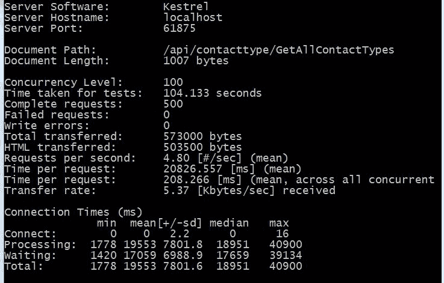
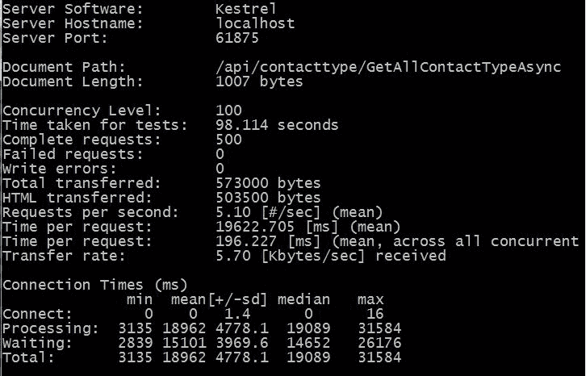
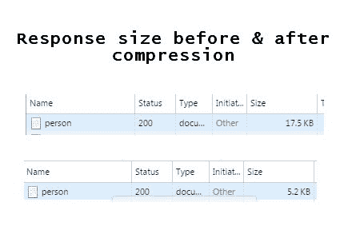

# 十一、优化与性能

任何 web API 的真正测试都是在各种客户端（大多数是前端应用）使用它时开始的，它会随着负载的变化而增加 HTTP 流量。当我们开始意识到 web API 的性能受到了冲击时，就需要进行优化和性能改进。

对性能的关注主要是特定于应用的，但建议在构建 web API 应用时遵循最佳实践和技术。性能和优化是一个连续的过程，需要定期监控以检查瓶颈。

由于 web API 是通过 HTTP 公开和使用的，探索各种最佳实践以保持应用在轻负载或重负载情况下的良好性能应该是头等大事。

在本章中，我们将学习如何度量应用性能，以异步方式编写控制器操作方法，压缩 HTTP 响应，以及实现缓存策略以优化资源使用。

在本章中，我们将研究以下主题：

*   测量应用性能
*   异步控制器动作方法
*   HTTP 压缩
*   内存缓存的实现
*   使用分布式缓存
*   响应缓存

# 测量应用性能

web API 应用性能可以通过使用各种技术来衡量。最重要的测量参数之一是在 WebAPI 上运行负载测试。

我们将使用**Apache HTTP 服务器基准测试工具**，也称为**ab.exe。**它是在端点上发送数百个并发请求的工具。

我们要瞄准的终点是`/api/contacttype`，动作方式是`GetAllContactTypes`和`GetAllContactTypeAsync`。

这两种操作方法都使用同步和异步方式，使用 Dapper ORM 从数据库调用存储过程。在下一节中，我们将更详细地了解使用`async await`关键字的异步 web API。

请参阅链接[https://httpd.apache.org/docs/2.4/programs/ab.html](https://httpd.apache.org/docs/2.4/programs/ab.html) ，用于使用 ab.exe 工具，然后运行应用并执行负载测试。运行该命令后，我们将看到类似的测试结果（它们根据系统配置而不同）：



ab.exe for synchronous API endpoint

通过检查`Requests per second`参数，我们可以看到`async`在负载测试中确实表现出了改进的性能：



ab.exe for asynchronous API endpoint

其他测量应用的方法：

*   **使用 JMeter**：[对 REST Api 进行性能测试 https://www.3pillarglobal.com/insights/performance-testing-of-a-restful-api-using-jmeter](https://www.3pillarglobal.com/insights/performance-testing-of-a-restful-api-using-jmeter)
*   **Visual Studio 2015/17**：[https://www.visualstudio.com/en-us/docs/test/performance-testing/getting-started/getting-started-with-performance-testing](https://www.visualstudio.com/en-us/docs/test/performance-testing/getting-started/getting-started-with-performance-testing)
*   **应用见解**：[https://azure.microsoft.com/en-in/resources/videos/instrumenting-your-web-api-using-application-insights-with-victor-mushkatin/](https://azure.microsoft.com/en-in/resources/videos/instrumenting-your-web-api-using-application-insights-with-victor-mushkatin/)

# 异步控制器动作方法

ASP.NET 使用**TAP**（**基于任务的异步模式**）支持异步操作，该模式首次在.NET 4.0 框架中发布，并在.NET 4.5 及更高版本中使用`async`和`await`关键字进行了重大改进。

通常，.NET 中的异步编程有助于实现响应性应用，提高可伸缩性，并在 web 应用中处理大量请求。

.NET Core 还支持以`async`和`await`模式的形式进行异步编程。当使用 I/O 或 CPU 绑定或数据库访问时，应使用此模式。

由于异步意味着不在同一时间发生，因此以异步方式调用的任何方法稍后都将返回结果。为了协调返回的结果，我们使用了`Task`（无返回值，即`Void`）或`Task<T>`（返回值）。`await`关键字允许我们执行其他有用的工作，直到`Task`返回结果。

要了解更多关于`async await`模式的信息，请阅读此链接[https://msdn.microsoft.com/en-us/magazine/jj991977.aspx](https://msdn.microsoft.com/en-us/magazine/jj991977.aspx) 。

在 ASP.NET Web API（Core 或 Web API 2）中，`action`方法执行异步工作，并返回结果。web API 控制器不应分配有`async`关键字。

从上一章的`MyWallet`web API 演示应用示例（[第 10 章](10.html#6976M1-b5b28eac0b2e417189a3e09b61402d4f)、*错误处理、跟踪和日志记录*中），我们将重构`WalletController`动作方法以异步工作。

`MyWallet`演示应用使用 EF Core In Memory provider，我们将按照[第 9 章](09.html#5J99O1-b5b28eac0b2e417189a3e09b61402d4f)中的*与 EF Core*部分、*与数据库的集成*对其进行扩展，以与 Microsoft SQL Server 数据库配合使用。

创建新的 web API 控制器或修改现有控制器。`WalletController`动作方法现在被重构，以异步方式工作。检查以下控制器代码：

```cs
    [Route("api/[controller]")] 
    public class WalletController : Controller 
    { 
       private readonly WalletContext _context;        
       private readonly ILogger<WalletController> _logger;         
       public WalletController(WalletContext context,
         ILogger<WalletController> logger) 
       { 
          _context = context; 
          _logger = logger; 
       }         

       // GET api/values/5 
       [HttpGet("{id}")] 
       public async Task<IActionResult> Get(int id) 
       {             
          var spentItem = await _context.Wallet.FindAsync(id); 
          if (spentItem == null) 
          { 
             _logger.LogInformation($"Daily Expense for {id} 
               does not exists!!");                 
             return NotFound(); 
          } 
          return Ok(spentItem); 
       } 

       // POST api/values 
       [HttpPost] 
       public async Task<IActionResult> Post([FromBody]DailyExpense value) 
       { 
         if (value == null) 
         { 
            _logger.LogError("Request Object was NULL"); 
            return BadRequest(); 
         } 
         CheckMovieBudget(value); 
         if (!ModelState.IsValid) 
         {                 
            return BadRequest(ModelState); 
         } 
         var newSpentItem = _context.Wallet.AddAsync(value); 
         await SaveAsync(); 
         return Ok(newSpentItem.Result.Entity.Id); 
       } 

       //Complete code part of source code bundle 
    } 

```

现在让我们通过分解代码来理解代码：

*   所有动作（`GET`、`POST`、`PUT`、`DELETE`方法现在都有一个`async`关键字，表示它们是异步调用的一部分。
*   所有的`async`方法返回包含方法操作返回值的`Task<IActionResult>`，通常值为状态码和响应数据。
*   `await`关键字用于实现了`async`的方法。我们使用 efcore，因为它为异步操作提供了几乎所有的函数。

Best practice is to make methods asynchronous from top to bottom, that is, don't mix synchronous and asynchronous code.

运行应用并使用 Postman 对其进行测试。对于简单的测试，我们感觉不到异步方法的优势。当我们有大量的负载时，它表现得很好，但是仍然编写`async`方法将使应用负载就绪。

# HTTP 压缩

Web API 请求和响应通过 internet 传输（基于 HTTP 的数据传输）。网络带宽是宝贵的，它因地区而异。Web API 响应大多是 JSON 形式（一个轻量级的字符串集合）。在这些情况下，即使我们发送了大量数据，这也非常重要。

为了通过 HTTP 快速传输响应数据，最好在返回到客户端之前压缩响应。ASP.NET Core 提供了**响应压缩中间件**，在将响应发送给客户端之前对其进行压缩。

让我们看看它的操作，在`GET`请求上创建`PersonController`，返回列表为`Person`（您仍然可以继续使用书中的任何 Web API 项目）。我正在使用**GenFu**——NuGet 软件包生成真实的原型数据，安装这个软件包，或者我们甚至可以连接到数据库并返回任何表的响应。

GenFu 会给我一个`Person`类的集合，我在调用`PersonController`时返回。以下是`PersonController`的代码：

```cs
    using GenFu;
    using Microsoft.AspNetCore.Mvc;
    using System;
    namespace compression_cache_demo.Controllers 
    {
      [Route("api/[controller]")]
      public class PersonController : Controller  
      {
        // GET: api/values
        [HttpGet]
        public IActionResult Get()
        {
          //Generate demo list using GenFu package 
          //Returns 200 counts of Person object
          var personlist = A.ListOf<Person>(200);
          return Ok(personlist);
        }
      }
      public class Person
      {
        public int Id { get; set; }
        public string FirstName { get; set; }
        public string LastName { get; set; }
        public int Age { get; set; }
        public DateTime DoB { get; set; }
      }
    }

```

运行应用，浏览 Google Chrome 中的`Person`控制器（首选），您将看到 200 个`Person`对象在 HTTP 上的 JSON 格式响应大小（大小可能在您的机器上有所不同）。

# 添加响应压缩中间件

ASP.NET Core 提供了一个中间件，在将响应发送回之前对其进行压缩。该中间件提供程序压缩不同的 MIME 类型，在本例中，我们对 JSON 数据感兴趣。

这个包`Microsoft.AspNetCore.ResponseCompression`是作为.NET SDK 的一部分包含的，有趣的是，我们不需要在控制器或操作级别工作，只需要在 HTTP 管道处理中包含这个中间件。

默认情况下，使用 GZIP 压缩提供程序；我们可以使用其他压缩提供程序或编写自己的压缩提供程序。

打开`Startup`类，在`ConfigureServices`和`Configure`方法中进行如下更改：

```cs
    public void ConfigureServices(IServiceCollection services) 
    {             
       services.AddResponseCompression();             
       services.AddMvc(); 
    }         
    public void Configure(IApplicationBuilder app, IHostingEnvironment env,
       ILoggerFactory loggerFactory) 
    {             
       app.UseResponseCompression(); //Before logging 
       app.UseMvc(); //code removed for brevity 
    } 

```

运行应用以查看压缩后的响应大小。请参阅以下屏幕截图（您的系统可能会有所不同）：



Response compression middleware in action

# 内存缓存的实现

访问资源是一项昂贵的操作，如果频繁地请求资源，并且几乎不更新资源，那么访问资源的成本甚至更高。为了获得性能更好的 Web API，必须通过实现缓存机制来减少访问更新最少的资源的负担。

缓存概念通过减少生成内容所需的工作，有助于提高应用的性能和可伸缩性。

NET Core 提供了一种基于 web 服务器的内存缓存技术，称为内存缓存。内容缓存通过使用`IMemoryCache`接口在 web 服务器内存上进行。

内存缓存是有限使用的好选择；不在 web 场上承载的应用。它速度快，但使用简单。只需将`IMemoryCache`接口注入`Controller/`类即可。下面的代码片段说明了这一点。

在本例中，Dapper（Micro-ORM）用于从数据库中获取值，并将其作为响应发送。要在 ASP.NET Core 中使用 Dapper，请参考[第 9 章](09.html#5J99O1-b5b28eac0b2e417189a3e09b61402d4f)、*与数据库集成：*

```cs
    [Route("api/[controller]")] 
    public class ContactTypeController : Controller 
    { 
       private string connectionString; 
       private readonly IMemoryCache _cache; 

       public ContactTypeController(IMemoryCache memoryCache) 
       { 
          _cache = memoryCache; 
          connectionString = "Data Source=..\\SQLEXPRESS;
          Initial Catalog=AdventureWorks2014;Integrated Security=True"; 
       } 
       public IDbConnection Connection 
       { 
          get 
          { 
             return new SqlConnection(connectionString); 
          } 
       } 

       // GET: api/values 
       [HttpGet] 
       public async Task<IActionResult> Get() 
       { 
         // Look for cache key. 
         if (!_cache.TryGetValue("ContentTypeKey", out IList<ContactType>
           contentList)) 
         { 
            // Setting the cache options 
            var cacheEntryOptions = new MemoryCacheEntryOptions() 
            // Keep in cache for this time, reset time if accessed. 
            .SetSlidingExpiration(TimeSpan.FromSeconds(60)); 
            contentList = await GetAllContactTypesAsync(); 
            // Save data in cache. 
            _cache.Set("ContentTypeKey", contentList, cacheEntryOptions); 
         } 
         return Ok(contentList); 
       } 
       //Complete code part of source code bundle 
    } 

```

现在让我们通过分解来理解整个代码：

*   使用 DI，我们将`IMemoryCache`注入到与工作缓存相关的方法中，如`TryGetValue`和`Set`。
*   我们正在使用`Connection`属性使用 Dapper ORM 连接到数据库。我们正在使用 AdventureWorks2014 数据库。您也可以使用任何示例或真实世界的数据库。
*   在`Get`方法中，首先我们要检查缓存键条目是否存在，如果存在，它将返回它的响应。
*   如果缓存密钥不存在，则使用`GetAllContactTypesAsync`方法获取记录，然后使用`ContentTypeKey`方法`SET`添加到内存缓存中。

运行应用。当第一次访问`ContactTypeController`时，从数据库中提取数据，在任何后续访问中，web API 都会从缓存中返回数据。

# 使用分布式缓存

大多数真实世界的企业应用从各种数据源（如第三方数据库、web 服务）获取数据，最重要的是，web API 部署在云或服务器场环境中。

在前面的例子中，内存不能用于缓存，因为它是基于 web 服务器内存的。为了在部署的环境中提供更健壮的缓存策略，建议使用分布式缓存。

分布式缓存将数据存储在持久性存储中，而不是 web 服务器内存中，这样缓存数据就可以跨部署的环境使用。

实际数据存储获得的请求少于内存中的请求，因此分布式缓存在 web 服务器重新启动、部署甚至失败时仍能生存。

分布式缓存既可以通过`Sql Server`实现，也可以通过`IDistributedCache`接口通过`Redis`实现。

# 使用 SQL Server 分布式缓存

我们将使用 SQL Server 进行分布式缓存；甚至 Redis 也可以使用。要使用 SQL Server，请使用 NuGet 安装以下软件包：

```cs
Microsoft.Extensions.Caching.SqlServer: 2.0.0-preview2-final 

```

要使用 sql 缓存工具，请将`SqlConfig.Tools`添加到`.csproj`文件的`<ItemGroup>`元素并运行`dotnet restore`（可选）：

```cs
<DotNetCliToolReference Include="Microsoft.Extensions.Caching.SqlConfig.Tools"
 Version=" 2.0.0-preview2-final" /> 

```

完成此操作后，通过从项目的根文件夹运行以下命令，验证 SQL tools for cache 工作正常：

```cs
dotnet sql-cache create -help 

```

之后，运行以下命令在`PacktDistCache`数据库中创建一个`Democache`表，该表存储所有缓存项。

在运行以下命令之前，确保创建了一个`PacktDistCache`数据库：

```cs
dotnet sql-cache create "Data Source=..\SQLEXPRESS;Initial Catalog=PacktDistCache;Integrated Security=True;" dbo DemoCache 

```

您可以验证该表是使用 SQLServerManagementStudio 创建的。

现在，我们已经准备好在 MS SQL Server 中使用分布式缓存存储，请更新`Startup`类以通知它使用此位置进行分布式缓存：

```cs
    public void ConfigureServices(IServiceCollection services) 
    { 
      services.AddDistributedSqlServerCache(options => 
      { 
        options.ConnectionString = @"Data Source=..\SQLEXPRESS;
        Initial Catalog=PacktDistCache;Integrated Security=True;"; 
        options.SchemaName = "dbo"; 
        options.TableName = "DemoCache"; 
      }); 

      // Add framework services. 
      services.AddMvc(); 
    } 

```

我们将创建`CurrencyConverterController`，它从公共 web API 获取每日货币汇率，并将其存储在缓存数据库中。对于对`CurrencyConverterController`的任何进一步访问，数据将从缓存返回，而不是从公共 web API 返回。这减少了服务器获取每个请求的速率的负担：

```cs
    namespace distributed_cache_demo.Controllers 
    { 
      [Route("api/[controller]")] 
      public class CurrencyConverterController : Controller 
      { 
        private readonly IDistributedCache _cache; 
        public CurrencyConverterController(IDistributedCache cache) 
        { 
          _cache = cache; 
        } 
        // GET: api/values 
        [HttpGet] 
        public async Task<IActionResult> Get() 
        { 
          var rate = await GetExchangeRatesFromCache(); 
          if (rate != null) 
          { 
             return Ok(rate); 
          } 

          await SetExchangeRatesCache(); 
          return Ok(await GetExchangeRatesFromCache()); 
        }        

        private async Task SetExchangeRatesCache() 
        { 
          var ratesObj = await DownloadCurrentRates(); 
          byte[] ratesObjval = Encoding.UTF8.GetBytes(ratesObj); 

          await _cache.SetAsync("ExchangeRates", ratesObjval, 
            new DistributedCacheEntryOptions()                     
            .SetSlidingExpiration(TimeSpan.FromMinutes(60))                     
            .SetAbsoluteExpiration(TimeSpan.FromMinutes(240)) 
          ); 
        } 
        private async Task<RatesRoot> GetExchangeRatesFromCache() 
        { 
          var rate = await _cache.GetAsync("ExchangeRates"); 
          if (rate != null) 
          { 
            var ratestr = Encoding.UTF8.GetString(rate); 
            var ratesobj = JsonConvert.DeserializeObject<RatesRoot>(ratestr); 
            return ratesobj; 
          } 
          return null; 
        } 
      }  
    } 

```

这就是代码的工作原理：

1.  `IDistributedCache`为`Set`和`Get`值被 DI 到 web API 控制器类中。
2.  `SetExchangeRatesCache`方法调用`DownloadCurrentRates()`，然后使用`ExchangeRates`键将它们设置为缓存。
3.  `GetExchangeRatesFromCache`方法读取缓存数据库，从`ExchangeRates`键获取值。
4.  `Get()`方法获取数据并返回响应（如果存在），否则首先设置数据并返回缓存值。

运行应用时，访问`CurrencyConverterController`会将值设置到缓存数据库中，任何后续访问都会从数据库返回数据。缓存数据存储在数据库中，如图所示：


Distributed Cache store

# 响应缓存

在 ASP.NET Core 中，响应缓存中间件允许响应缓存。它将缓存相关的头添加到响应中。这些头指定您希望客户端、代理和中间件如何缓存响应。

要使用此功能，我们需要使用 NuGet 包含其软件包，根据.NET Core 2.0 最新版本，预安装了相关软件包：

```cs
"Microsoft.AspNetCore.ResponseCaching": "2.0.0-preview2-final " 

```

安装包后，更新`Startup`类，将`ResponseCaching`添加到服务集合中：

```cs
    public void ConfigureServices(IServiceCollection services) 
    {    
       //Response Caching Middleware 
       // Code removed for brevity 
       services.AddResponseCaching(); 
       services.AddMvc(); 
    } 

```

还包括 HTTP 管道处理中的`ResponseCaching`中间件：

```cs
    public void Configure(IApplicationBuilder app, IHostingEnvironment env,
      ILoggerFactory loggerFactory) 
    { 
       app.UseResponseCompression(); 
       app.UseResponseCaching();             
       app.UseMvc(); 
    } 

```

现在中间件`Startup`类被更新为使用响应缓存，是时候将它们添加到控制器操作方法中了。

应避免对经过身份验证的客户端或数据进行响应缓存，因此，我们正在使用`ResponseCache`属性更新控制器操作方法：

```cs
    public class PersonController : Controller 
    { 
      // GET: api/values 
      [HttpGet] 
      [ResponseCache(VaryByHeader = "User-Agent", Duration = 30)] 
      public IActionResult Get() 
      {        
         //Generate demo list using GenFu package 
         //Returns 200 counts of Person object 
         var personlist = A.ListOf<Person>(200); 
         return Ok(personlist); 
      }         
    } 

```

此属性将设置缓存控制标头，并将最大使用时间设置为 30 秒。运行应用时，响应头显示缓存控制头（在 Fiddler 或 Chrome 工具中）。

# 总结

在本章中，我们学习了大量关于如何编写异步 Web API 控制器、响应压缩以及通过连接缓存机制来提高响应时间的知识。

我们还学习了如何度量 web API 应用的性能。

在下一章中，我们将研究将应用发布和部署到不同环境和托管提供商上的不同方式。