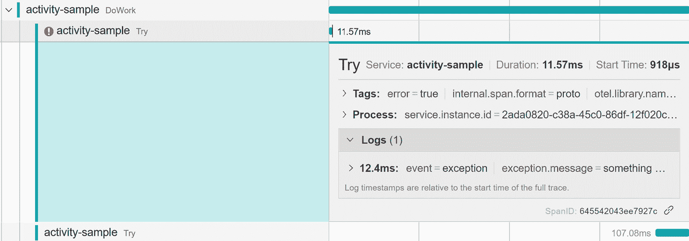
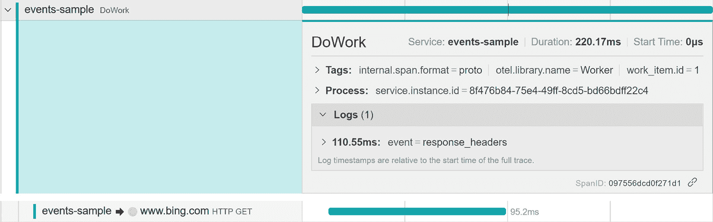
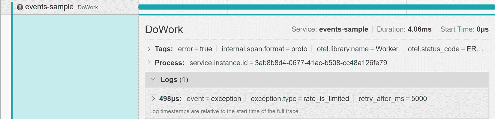
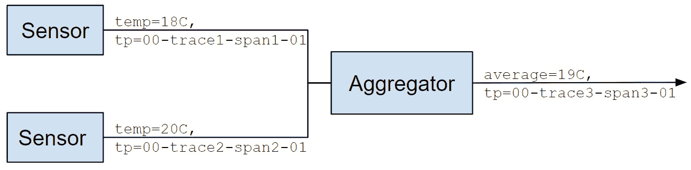
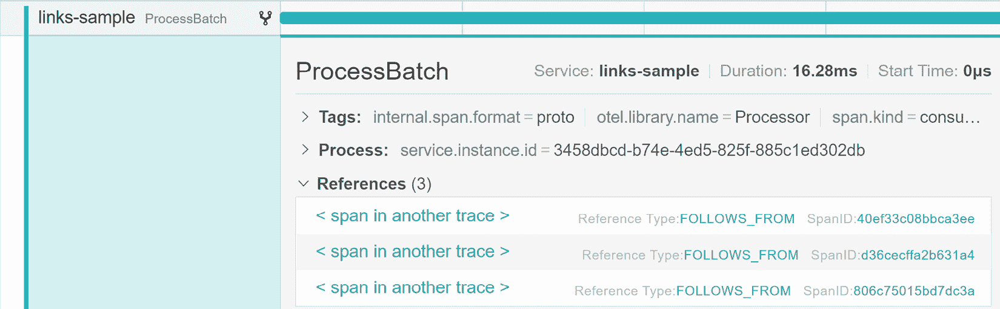
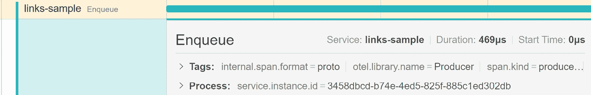
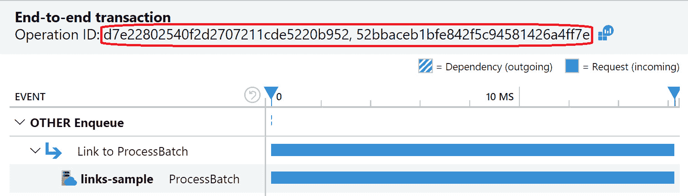

# 第六章：跟踪您的代码

在前面的章节中，我们讨论了仪器库，并学习了如何使用自动收集的遥测来监控和调试分布式系统。自动仪器化，当可用时，为网络调用提供必要的合理覆盖，但您可能希望跟踪额外的逻辑操作、I/O、套接字或其他没有共享仪器可用的调用。

本章提供了使用 `System.Diagnostics` 原语或 OpenTelemetry API 进行手动跟踪的深入指南，并解释了自动仪器化背后的机制。我们将涵盖 `Activity` 属性以及如何填充它们，并展示如何记录事件。然后，我们将学习如何使用链接来表示跨度之间的复杂关系。最后，我们将涵盖仪器的测试方面。

您将学习如何执行以下操作：

+   使用 .NET API 或 OpenTelemetry API 适配器创建活动

+   使用 `Activity.Current` 进行环境上下文传播并了解其限制

+   使用 `ActivityEvent` 并了解何时使用日志

+   使用链接表示跟踪之间的复杂关系

+   验证您的仪器

到本章结束时，您应该能够使用手动跟踪来满足您的应用程序需求。

# 技术要求

本章的代码可以在本书的 GitHub 仓库中找到：[`github.com/PacktPublishing/Modern-Distributed-Tracing-in-.NET/tree/main/chapter6`](https://github.com/PacktPublishing/Modern-Distributed-Tracing-in-.NET/tree/main/chapter6)。

我们需要以下工具来完成这项工作：

+   NET SDK 7.0 或更高版本

+   推荐使用带有 C# 开发设置的 Visual Studio 或 Visual Studio Code，但任何文本编辑器都可以工作

+   Docker

如果您想探索 Jaeger 中的示例应用程序的跟踪，可以使用以下命令运行它：

```cs
$ docker run -d --name jaeger -p 6831:6831/udp -p
  16686:16686 jaegertracing/all-in-one:latest
```

# 使用 System.Diagnostics 或 OpenTelemetry API 适配器进行跟踪

正如我们在前面的章节中看到的，.NET 中的分布式跟踪依赖于 `System.Diagnostics` 命名空间中的原语：`Activity` 和 `ActivitySource`。它们被 HTTP 客户端和 ASP.NET Core 仪器化所使用。

.NET 和 OpenTelemetry 使用的术语不同：`Activity` 代表 OpenTelemetry 跨度，`ActivitySource` 映射到跟踪器，而标签映射到属性。

`OpenTelemetry.Api` NuGet 包还提供了 `TelemetrySpan`、`Tracer` 以及 `OpenTelemetry.Trace` 命名空间中的几个辅助类。这些 API 是 .NET 跟踪 API 的 **适配器** – 一个不提供任何额外功能的薄层包装，它不会在 .NET 跟踪 API 上提供任何额外功能。

您可能想知道应该使用哪一个。一般来说，除非您想坚持使用 OpenTelemetry 术语，否则应使用 .NET API。适配器只是一个额外的层，它带来了一点点性能开销。

## 使用 System.Diagnostics 进行跟踪

假设我们想要仪器化一个操作——例如，一个处理工作项的方法。它可能分解为更小的、可能自动仪器化的操作，如 HTTP 请求。在这种情况下，描述单个请求的跨度不会显示处理的整体持续时间和结果，因此我们需要创建一个新的逻辑 `Activity` 来描述它。

活动应该从 `ActivitySource` 创建，它会通知 OpenTelemetry 和其他潜在监听器有关它们的信息。使用这种方法，我们可以使用以下代码对我们的工作处理操作进行仪器化：

Worker.cs

```cs
private static readonly ActivitySource Source =
  new ("Worker");
...
using var activity = Source.StartActivity("DoWork");
activity?.SetTag("work_item.id", workItemId);
try
{
  await DoWorkImpl(workItemId);
}
catch (Exception ex)
{
  activity?.SetStatus(ActivityStatusCode.Error,
    ex.Message);
  throw;
}
```

[`github.com/PacktPublishing/Modern-Distributed-Tracing-in-.NET/blob/main/chapter6/tracing-with-net/Worker.cs`](https://github.com/PacktPublishing/Modern-Distributed-Tracing-in-.NET/blob/main/chapter6/tracing-with-net/Worker.cs)

在这个例子中，实际的处理发生在 `DoWorkImpl` 方法中。我们在调用此方法之前创建了一个新的活动，并隐式地结束了它。如果该方法抛出异常，我们将活动的状态设置为 `Error`，并在描述中提供异常消息。当控制离开作用域时，活动将被处置（并结束），但我们也可以调用 `Activity.Stop` 方法来显式停止它。

我们在这里创建 `ActivitySource` 作为静态单例，因为我们假设我们需要它在应用程序的生命周期内使用。如果你决定将其作为实例变量，并将其生命周期绑定到你的应用程序中的某个长期存在的客户端或服务，请确保将其处置掉。

在这个例子中，我们唯一配置的是 `Activity` 名称——我们将 `DoWork` 传递给 `ActivitySource.StartActivity` 方法。

注意

由 `ActivitySource.StartActivity` 返回的活动是可空的。如果没有为此源设置监听器，或者监听器以返回 `ActivitySamplingResult.None` 的方式以特定方式采样此活动，则它可以是 null。

我们将在稍后了解更多关于 API 的内容，但首先，让我们学习如何导出生成的活动。

### 使用 OpenTelemetry 导出活动

到目前为止，我们已经使用 `OpenTelemetry.Extensions.Hosting` NuGet 包在 ASP.NET Core 应用程序中配置了 OpenTelemetry。在这里，我们将使用纯 OpenTelemetry SDK 配置，它看起来与我们之前在 *第五章* 中看到的相当相似，*配置和* *控制平面*：

Program.cs

```cs
using var provider = Sdk.CreateTracerProviderBuilder()
  .ConfigureResource(b => b.AddService("activity-sample"))
  .AddSource("Worker")
  .AddJaegerExporter()
  .AddConsoleExporter()
  .Build()!;
```

[`github.com/PacktPublishing/Modern-Distributed-Tracing-in-.NET/blob/main/chapter6/tracing-with-net/Program.cs`](https://github.com/PacktPublishing/Modern-Distributed-Tracing-in-.NET/blob/main/chapter6/tracing-with-net/Program.cs)

在这个例子中，我们通过将服务名称设置为 `activity-sample` 并启用 `ActivitySource`（我们在上一个示例中用它来创建活动）来构建 `TracerProvider` 实例。我们还在使用控制台导出器的同时使用 Jaeger – 跨度将被导出到两者中。

OpenTelemetry 需要显式配置以监听 `ActivitySource`，但您可以使用通配符启用一组它们，正如我们在 *第三章* 中所看到的，*The .NET* *Observability Ecosystem*。

让我们使用以下命令运行这些示例：

```cs
tracing-with-net$ dotnet run open-telemetry –scenario basic
```

我们应该看到 `Activity` 被导出到控制台：

```cs
Activity.TraceId:         9c45e1b454e28bf1edbba296c3315c51
Activity.SpanId:          bcd47a4fc7d92063
Activity.TraceFlags:         Recorded
Activity.ActivitySourceName: Worker
Activity.DisplayName:        DoWork
Activity.Kind:               Internal
Activity.StartTime:          2022-12-07T23:10:49.1998081Z
Activity.Duration:           00:00:00.1163745
Resource associated with Activity:
    service.name: activity-sample
```

当我们配置 OpenTelemetry 以监听 `Worker` 源时，它利用了 `System.Diagnostics.ActivityListener` 原语。如果您使用 OpenTelemetry，您可能不需要直接使用监听器，但您可能仍然会发现它在测试目的或调试仪表问题时很有用。让我们看看它是如何工作的。

### 使用 ActivityListener 监听活动

`ActivityListener` 允许我们通过其名称订阅任何 `ActivitySource` 实例，并在由启用源创建的活动开始或结束时接收通知。以下示例展示了如何编写一个监听器：

Program.cs

```cs
ActivitySource.AddActivityListener(new ActivityListener()
{
  ActivityStopped = PrintActivity
  ShouldListenTo = source => source.Name == "Worker",
  Sample = (ref ActivityCreationOptions<ActivityContext> _)
    => ActivitySamplingResult.AllDataAndRecorded
});
```

[Modern Distributed Tracing in .NET](https://github.com/PacktPublishing/Modern-Distributed-Tracing-in-.NET/blob/main/chapter6/tracing-with-net/Program.cs)

在这里，我们通过 `Worker` 订阅 `ActivitySource` 并指定我们在所有活动中进行采样。当 `Activity` 结束时，我们调用我们的 `PrintActivity` 方法。我们也可以在需要时提供 `ActivityStarted` 回调。

因此，让我们使用以下命令运行此示例：

```cs
tracing-with-net$ dotnet run activity-listener
```

您应该看到类似以下内容：

```cs
DoWork: Id = 00-7720a4aca8472f92c36079b0bee3afd9-
0d0c62b5cfb15876-01, Duration=110.3466, Status = Unset
```

现在您已经了解了 OpenTelemetry 和 `ActivitySource` 如何协同工作，是时候探索其他跟踪 API 了。

### 开始活动

`ActivitySource` 类定义了多个 `CreateActivity` 和 `StartActivity` 方法重载。

调用 `StartActivity` 等同于调用 `CreateActivity` 并稍后使用 `Activity.Start` 方法启动它：

```cs
Source.CreateActivity("foo", ActivityKind.Client)?.Start()
```

`Start` 方法生成一个新的 span ID，捕获开始时间，并通过 `Activity.Current` 属性填充环境上下文。`Activity` 在启动之前不能使用。因此，在大多数情况下，`StartActivity` 方法是最简单选择，而 `CreateActivity` 可能仅在你想要构造一个活动实例但稍后启动它时有用。

注意

采样回调发生在活动创建期间，因此您必须将影响采样决策的所有属性传递给 `StartActivity` 或 `CreateActivity` 方法。

这里是开始时间属性：

+   `Internal` 表示本地或逻辑操作。`Client` 和 `Server` span 描述了同步远程调用（如 HTTP 请求）的客户端和服务器端。同样，`Producer` 和 `Consumer` span 描述了异步操作（如异步消息）的相应端。

可观察性后端依赖于 span 类型进行可视化，例如服务图和半自动化的性能分析。

+   `ActivityContext` 结构体。这通常基于 W3C Trace Context 标准（适用于 HTTP）并可能对其他协议有所不同。`ActivityContext` 包含跟踪 ID、跨度 ID、跟踪标志和跟踪状态。

另一个选项是将 W3C Trace Context 格式的 `traceparent` 值作为字符串传递给 `StartActivity` 方法。活动启动后，您可以稍后设置 `tracestate`，但当然，您将无法使用它来做出采样决策。

如果未提供父上下文，则使用 `Activity.Current`。

+   `Activity` 启动并应影响采样决策。如果您不使用属性来做出基于头的采样决策，最好不填充它们，并最小化采样活动性能开销。

+   **链接**：链接可以关联不同的跟踪，并代表跨度之间的关系，而不仅仅是父子关系。我们将在本章后面了解更多关于它们的内容。

+   `Activity` 启动。

`Activity` 也支持自定义跟踪上下文格式——例如，传统的分层格式。

在 `Activity` 启动后，我们可以随时添加更多属性，更改开始和结束时间，更新采样决策，设置 `tracestate`，并记录事件。

在添加新事件或属性之前，请确保检查 `IsAllDataRequested` 标志，该标志指定活动是否已被采样。我们可以使用它通过保护任何昂贵的操作来最小化仪表化的性能影响：

StartSamples.cs

```cs
if (activity?.IsAllDataRequested == true)
    activity?.SetTag("foo", GetValue());
```

https://github.com/PacktPublishing/Modern-Distributed-Tracing-in-.NET/blob/main/chapter6/tracing-with-net/StartSamples.cs

`Activity` 和 `ActivitySource` API 是任何仪表化的基础。我们将在本章后面介绍允许填充事件和链接的附加 API，并在本书的其余部分提供更多示例。现在，让我们快速看一下如何使用 OpenTelemetry API shim。

## 使用 OpenTelemetry API shim 进行跟踪

OpenTelemetry API shim 在 .NET API 之上不提供任何附加功能；它仅将术语与 OpenTelemetry 对齐。如果您在其他语言中使用 OpenTelemetry，那么它可能对您更有吸引力。如果您决定走这条路，请记住，`Tracer` 和 `Span` 的行为与 `ActivitySource` 和 `Activity` 相匹配。例如，这意味着您仍然需要在配置 OpenTelemetry 时启用每个追踪器。

让我们重复使用 `Tracer` 和 `TelemetrySpan` 类来对我们的处理仪表化进行操作：

Worker.cs

```cs
private static readonly Tracer Tracer = TracerProvider
  .Default.GetTracer("Worker");
...
using var workSpan = Tracer.StartActiveSpan("DoWork"));
  workSpan.SetAttribute("work_item.id", workItemId);
  try
  {
    await DoWorkImpl(workItemId);
  }
  catch (Exception ex)
  {
    workSpan.SetStatus(Status.Error.WithDescription(
      ex.Message));
    throw;
  }
}
```

[`github.com/PacktPublishing/Modern-Distributed-Tracing-in-.NET/blob/main/chapter6/tracing-with-shim/Worker.cs`](https://github.com/PacktPublishing/Modern-Distributed-Tracing-in-.NET/blob/main/chapter6/tracing-with-shim/Worker.cs)

整体流程是相同的：我们创建一个 `Tracer` 实例而不是 `ActivitySource`，然后使用它来创建一个跨度。添加属性和设置状态的方式与 `ActivitySource` 示例类似。

如果我们要查看`Tracer`和`TelemetrySpan`的内部，我们会看到它们完全依赖于`ActivitySource`和`Activity`。因此，启用此仪表化和丰富以及自定义它与启用基于`ActivitySource`的仪表化相同——这是通过在`TracerProviderBuilder`上使用`AddSource`方法来完成的（源名称与跟踪器名称匹配）。

尽管 API 看起来很相似，但有一些重要的区别：

+   Span 不是可空的。你总是得到一个 Span 的实例，即使没有监听底层的`ActivitySource`（但那时它是一个优化后的、不可操作的实例）。

+   所有对 Span 的操作都由`TelemetrySpan.IsRecording`标志内部保护，该标志等同于`activity?.IsAllDataRequested == true`检查。然而，在`IsRecording`标志后面保护计算属性值和其他 Span 属性等昂贵的操作可能仍然很有用。

+   Span 默认不是活动的（即，当前的）。虽然你不能在没有使其成为当前的情况下启动一个活动，但对于`TelemetrySpan`来说并非如此。你可能已经注意到，我们在`DoWork` Span 中使用了`Tracer.StartActiveSpan`方法，它填充了`Activity.Current`。

如果我们使用`Tracer.StartSpan`方法，我们会得到一个已启动的活动，但`Activity.Current`不会指向它。为了使其成为当前，我们可以调用`Tracer.WithSpan`方法。

如果我们使用`tracing-with-otel-api$ dotnet run`命令运行之前的 OpenTelemetry API 示例，我们会看到与之前使用纯.NET 跟踪 API 相同的跟踪。

现在，让我们看看我们如何创建活动的层次结构并使用环境上下文来丰富它们。

# 使用环境上下文

在复杂的应用程序中，我们通常在每个跟踪中都有多层的 Span。这些 Span 是由不同的库发出的，这些库彼此之间并不知情。然而，由于在`Activity.Current`属性中传播的环境上下文，它们仍然相关联。

让我们创建两层活动——我们将通过重试失败的操作并对尝试和逻辑`DoWork`操作进行仪表化来使处理更加健壮：

Worker.cs

```cs
public static async Task DoWork(int workItemId) {
  using var workActivity = Source.StartActivity();
  workActivity?.AddTag("work_item.id",  workItemId);
  await DoWithRetry(async tryCount => {
    using var tryActivity = Source.StartActivity("Try");
    try
    {
      await DoWorkImpl(work.Id, tryCount);
      tryActivity?.SetTag("try_count", tryCount);
    }
    catch (Exception ex)
    {
      tryActivity?.RecordException(ex);
      tryActivity?.SetStatus(ActivityStatusCode.Error);
      throw;
    }
  }
}
```

https://github.com/PacktPublishing/Modern-Distributed-Tracing-in-.NET/blob/main/chapter6/tracing-with-net/Worker.cs

在这个例子中，我们有一个`workActivity`，它描述了逻辑操作，还有一个`tryActivity`，它描述了一个尝试。让我们用以下命令来运行它：

```cs
tracing-with-net$ dotnet run open-telemetry –scenario with-
retries
```

在 Jaeger 中查看跟踪，网址为`http://localhost:16686`。你应该看到与*图 6.1*中显示的跟踪类似的内容：



图 6.1 – 工作项处理

在这里，我们可以看到有两个尝试来处理一个工作项——第一个尝试失败并抛出异常，然后在第二次尝试后操作成功。通过查看这个跟踪，可以清楚地了解为什么`DoWork`操作花费了这么多时间——它是在尝试之间花费的。

注意，我们没有对`workActivity`和`tryActivity`进行任何特殊的关联操作。这是因为当`tryActivity`开始时`workActivity`是当前的——因为我们没有提供任何父活动，它默认为`Activity.Current`实例。

要解决工具问题，我们可以通过查看其属性来检查启动活动上的`Activity`的父级。`Activity.Parent`代表一个隐式父级。当我们启动一个活动时，我们也可以显式提供字符串形式的`traceparent`或父`ActivityContext`——在这些情况下，`Parent`属性将为 null。你可以在[`github.com/PacktPublishing/Modern-Distributed-Tracing-in-.NET/blob/main/chapter6/tracing-with-net/StartSamples.cs`](https://github.com/PacktPublishing/Modern-Distributed-Tracing-in-.NET/blob/main/chapter6/tracing-with-net/StartSamples.cs)找到一些示例，我们将在*第十章*中看到更多关于上下文传播的示例，即*跟踪网络调用*。`Activity.ParentId`等同于`traceparent`头，而`Activity.ParentSpanId`代表它的`span-id`部分。如果`Activity`有任何父级，这些属性将被填充。

回到我们的例子，如果所有尝试都失败了会发生什么？我们是否应该在`DoWork`活动上设置一个错误？嗯，我们可以在`DoWithRetry`方法内部这样做，使用`Activity.Current?.SetStatus(ActivityStatusCode.Error)`。我们可以在这里使用当前活动，因为我们控制着何时以及如何调用`DoWithRetry`方法。

作为一条经验法则，除非你确信它是正确的，否则请避免添加属性、事件或在`Activity.Current`上设置状态。由于抑制、过滤或中间创建的新活动，`Current`可能指向其他活动。所以，请确保在你的工具中显式传递活动实例。

如果你想要丰富一个自动收集的`Activity`，在启用工具时提供的丰富回调中访问`Current`属性应该是安全的。

一些工具可能也提供了对创建的`Activity`的访问权限。例如，ASP.NET Core 通过`IHttpActivityFeature`接口这样做。你也可以使用`Parent`属性向上遍历活动树，以找到你想要丰富的那一个。

`Activity.Current`是在`AsyncLocal`之上工作的，因此.NET 运行时会通过异步调用传播它。这在与后台处理或手动线程操作中不起作用，但你可以始终显式传递活动并手动设置所需的`Activity.Current`值。

现在，我们知道如何创建活动层次结构并使用属性来描述我们的场景。但有时，我们需要更轻量级的东西，比如事件——让我们更仔细地看看它们。

# 记录事件

Span 描述了具有持续时间和结果的操作，但有时创建 span 可能过于冗长和昂贵 - 例如，对于繁忙的套接字级通信。事件常见的用例包括记录 gRPC 流调用中的异常或单个消息。

要表示在某个时间点发生的事情，我们应该使用事件或日志。在 OpenTelemetry 中，日志和事件之间的区别是语义上的 - 它们是相同的数据结构，具有相同的网络格式，但属性不同。例如，日志有强制性的严重性，这并不适用于事件。另一方面，事件有强制性的名称。

它们在 API 和实现方面也有所不同（至少在.NET 7.0 和之前的版本中）。在本节中，我们将探索 Activity 的事件 API；我们将在*第八章*中查看日志，*编写结构化和* *关联日志*。

## 何时使用事件

要创建一个活动事件，我们需要一个活动实例，但这在例如启动时并不适用。

活动事件依赖于采样 - 我们可以将它们添加到一个已采样的`Activity`中，但通常情况下，它们会随着它一起被丢弃。

事件的生命周期与`Activity`实例紧密耦合，因此它将保留在内存中，直到被垃圾回收。在.NET 侧，你可以有的事件数量没有限制，但 OpenTelemetry 导出器限制了导出事件的数量。默认设置为 128，可以通过`OTEL_SPAN_ATTRIBUTE_COUNT_LIMIT`环境变量来控制。

注意

活动事件应该用来表达那些不值得创建 span、没有持续时间或太短，并且有可预测结果的操作。事件必须在某个`Activity`的作用域内发生，并且只有在`Activity`被采样时才应该导出。在单个`Activity`实例下，也应该有合理数量的它们。考虑到这些限制，只要你的可观察性后端支持，日志通常是一个更好的选择。

既然我们已经知道了这些限制，我们终于可以开始玩转事件了。

## ActivityEvent API

事件用`ActivityEvent`类表示。要创建一个事件，我们必须提供一个事件名称，并且可以可选地指定一个时间戳（默认为事件构造时的时间），以及一组属性。

事件名称是一个低基数字符串，它暗示了事件的结构：具有相同名称的事件预期描述的是同一件事物的发生，并且应该使用相同的属性集。

让我们用事件丰富 HTTP 客户端的检测。想象一下，我们已经通过 HTTP 读取了一个长流，并想要控制内容缓冲。

要实现这一点，我们可以将 `HttpCompletionOption.ResponseHeadersRead` 标志传递给 `HttpClient.SendAsync` 方法。然后 HTTP 客户端将在读取响应体之前返回响应。了解我们收到响应的时间点很有用，这样我们就可以知道读取响应花费了多长时间。

以下示例演示了这一点：

Worker.cs

```cs
public static async Task DoWork(int workItemId) {
  using var work = Source.StartActivity();
  try
  {
    work?.AddTag("work_item.id", workItemId);
    var res = await Client.GetAsync(
      "https://www.bing.com/search?q=tracing",
      HttpCompletionOption.ResponseHeadersRead);
    res.EnsureSuccessStatusCode();
    work?.AddEvent(
      new ActivityEvent("received_response_headers"));
    ...
  }
  catch (Exception ex)
  {
    work?.SetStatus(ActivityStatusCode.Error,
      ex.Message);
  }
}
```

https://github.com/PacktPublishing/Modern-Distributed-Tracing-in-.NET/blob/main/chapter6/events/Worker.cs

在此示例中，我们通过 HTTP 客户端管道启动 `Activity` 以跟踪整体逻辑请求处理，然后记录 `response_headers` 事件。此事件没有任何属性 – 它的唯一目的是记录我们从服务器收到响应的时间戳。

让我们添加更多事件！假设我们在 HTTP 管道中使用节流或断路器，我们将不会有任何物理 HTTP 请求，也不会有自动仪表化报告的跨度。事件可以提供对其的可观察性。

我们将使用 .NET 7 中可用的 `RateLimiter` 类实现客户端节流，该类包含在 `System.Threading.RateLimiting` NuGet 包中。我们将在 `DelegatingHandler` 类中这样做，如下例所示：

RateLimitingHandler.cs

```cs
private readonly TokenBucketRateLimiter _rateLimiter =
  new (Options);
protected override async Task<HttpResponseMessage>
  SendAsync(HttpRequestMessage req, CancellationToken ct)
{
  using var lease = _rateLimiter.AttemptAcquire();
  if (lease.IsAcquired)
    return await base.SendAsync(req, ct);
  return Throttle(lease);
}
```

[`github.com/PacktPublishing/Modern-Distributed-Tracing-in-.NET/blob/main/chapter6/events/RateLimitingHandler.cs`](https://github.com/PacktPublishing/Modern-Distributed-Tracing-in-.NET/blob/main/chapter6/events/RateLimitingHandler.cs)

在这里，我们正在尝试从速率限制器获取租约。如果成功获取，我们将调用 `base.SendAsync` 方法，让此请求进一步处理。否则，我们必须像以下代码片段中所示那样节流请求：

RateLimitingHandler.cs

```cs
private HttpResponseMessage Throttle(RateLimitLease lease)
{
  var res = new HttpResponseMessage(
    HttpStatusCode.TooManyRequests);
  if (lease.TryGetMetadata(MetadataName.RetryAfter,
    out var retryAfter))
  {
    var work = Activity.Current;
    if (work?.IsAllDataRequested == true)
    {
      var tags = new ActivityTagsCollection();
tags.Add("exception.type", "rate_is_limited");
      tags.Add("retry_after_ms",
        retryAfter.TotalMilliseconds);
      work?.AddEvent(new ActivityEvent("exception",
        tags: tags));
    }
    res.Headers.Add("Retry-After",
      ((int)retryAfter.TotalSeconds).ToString());
  }
  return res;
}
```

[`github.com/PacktPublishing/Modern-Distributed-Tracing-in-.NET/blob/main/chapter6/events/RateLimitingHandler.cs`](https://github.com/PacktPublishing/Modern-Distributed-Tracing-in-.NET/blob/main/chapter6/events/RateLimitingHandler.cs)

在 `Throttle` 方法中，我们发出 `exception` 事件，并提供与 `retry_after` 属性相关的消息。我们从速率限制器获取了此属性的值；它提供了有关何时重试此请求将是有意义的提示。

`events` 文件夹中的示例演示了一个完整的速率限制解决方案 – 它配置速率限制器每 5 秒允许一个请求，但并行发送两个请求，以便第一个请求通过，而第二个请求被节流。

运行示例 `events$ dotnet run`，然后切换到 Jaeger，以查看 `events-sample` 服务发出的两个跟踪。

一个跟踪有两个跨度，代表一个成功的操作，如图 *6**.2* 所示：



图 6.2 – 带有逻辑和物理 HTTP 跨度和 response_headers 事件的跟踪

这里，我们可以看到第一个字节的传输时间大约为 110 毫秒。然后，我们得到了`response_headers`事件；逻辑`DoWork`操作的其余部分都花在了读取流内容上。

另一个跟踪只有一个跨度，表示一个失败的操作；它在*图 6.3*中显示：



图 6.3 – 带有逻辑调用和 rate_is_limited 异常事件的跟踪

这里，我们可以看到一个逻辑`DoWork`跨度，它以错误结束。如果我们展开属性，我们会看到一个状态描述，表明`Response status code does not indicate success: 429 (Too Many Requests)`。这可能会给我们一些关于发生了什么的线索，即使我们没有事件。这里没有物理 HTTP 跨度，这可能会令人困惑且不清楚响应来自何处。

使用`rate_is_limited`事件，我们可以填充额外的属性，如`retry_after_ms`，但最重要的是，我们可以轻松理解问题的根本原因，并找到事件发送的代码位置。

### 记录异常

在前面的例子中，我们创建了一个表示错误的事件，这是一个在 OpenTelemetry 中定义的特殊事件。它的名称是`exception`，并且具有`exception.type`、`exception.message`和`exception.stacktrace`属性。需要`type`或`message`之一。

如果我们有一个异常对象，我们就可以使用在`OpenTelemetry.Trace.ActivityExtensions`类中声明的`RecordException`扩展方法。我们可以使用`activity?.RecordException(ex)`记录异常，然后传递自定义标签集合以添加到事件中。

此方法在底层调用`Activity.AddEvent`方法，填写所有异常属性，包括堆栈跟踪。由于堆栈跟踪可能非常大，记录未处理的异常并只记录一次是一个好主意。

# 将跨度与链接关联

到目前为止，我们讨论了跨度之间的父子关系。它们很好地覆盖了请求-响应场景，并允许我们将分布式调用堆栈描述为一棵树，其中每个跨度最多有一个父级，所需的孩子数量。

但如果我们的场景更复杂呢？例如，如何表达从多个传感器接收温度数据并在后端聚合，如图*图 6.4*所示？



图 6.4 – 批处理

在这个例子中，传感器在不同的跟踪范围内将数据发送到聚合器。聚合器必须启动第三个跟踪 – 它不应该继续传感器的任何跟踪。

我们可以使用链接将`trace3`连接到`trace1`和`trace2`，这样我们就可以关联所有这些跟踪。链接不指定跨度之间的确切关系，但在本例的范围内，我们可以将它们视为单个跨度的多个父级。

链接主要用于消息场景，在这些场景中，消息以批量的形式发送和接收以优化网络使用，或者也可以一起处理。

链接有两个属性：一个链接跟踪上下文和一组属性。目前，它们只能提供给 `StartActivity` 方法，并且可以用于做出采样决策。这是 OpenTelemetry 规范的限制，未来可能会被移除。

## 使用链接

让我们看看如何使用链接来使用内存队列对批量处理场景进行仪器化。在后台处理中，我们不能依赖于 `Activity.Current` 从入队操作流向处理。因此，我们将 `ActivityContext` 与工作项一起通过队列传递。

但首先，我们需要为入队操作创建一个 `Activity`，以便我们有上下文来捕获和传递：

Producer.cs

```cs
public void Enqueue(int id)
{
  using var enqueue = Source
    .StartActivity(ActivityKind.Producer)?
    .SetTag("work_item.id", id);
  _queue.Enqueue(new WorkItem(id, enqueue?.Context));
}
```

[`github.com/PacktPublishing/Modern-Distributed-Tracing-in-.NET/blob/main/chapter6/links/Producer.cs`](https://github.com/PacktPublishing/Modern-Distributed-Tracing-in-.NET/blob/main/chapter6/links/Producer.cs)

虽然对远程队列的发布调用进行仪器化很重要，但在本例中并非必需。我们在这里这样做只是为了捕获一些有效的 `ActivityContext`。如果我们有任何其他活动，我们可以使用其上下文。

现在，我们已经准备好对工作项处理器进行仪器化：

BatchProcessor.cs

```cs
async Task ProcessBatch(List<WorkItem> items)
{
  using var activity = Source.StartActivity(
      ActivityKind.Consumer,
      links: items
        .Select(i => new ActivityLink(i.Context)));
  activity?.SetTag("work_items.id",
       items.Select(i => i.Id).ToArray());
  ...
}
```

[`github.com/PacktPublishing/Modern-Distributed-Tracing-in-.NET/blob/main/chapter6/links/BatchProcessor.cs`](https://github.com/PacktPublishing/Modern-Distributed-Tracing-in-.NET/blob/main/chapter6/links/BatchProcessor.cs)

在这里，我们遍历工作项，并为每个工作项使用随 `WorkItem` 实例传递的跟踪上下文创建了一个 `ActivityLink`。

然后，我们将包含所有接收到的 ID 的数组添加到 `BatchProcessing` 活动中的 `work_item.id` 属性。理想情况下，我们会在 `ActivityLink` 构造函数上为链接本身添加属性，但我不了解现在有任何可观察性后端支持它。作为替代方案，我们也可以为每个工作项创建一个事件，并在它们上填充属性。

让我们运行带有 `links$ dotnet run` 的示例。它将入队三个工作项，然后一次性处理它们。在 Jaeger 中，我们应该看到四个独立的跟踪 – 一个用于每个入队操作，一个用于批量处理。后者如图 *6**.5* 所示：



图 6.5 – 使用链接处理跨度

我们可以看到它有三个引用（在 Jaeger 术语中称为链接），我们可以点击它们并到达相应的 `Enqueue` 操作，如图 *6**.6* 所示：



图 6.6 – 入队跨度

在 Jaeger 中，无法从`Enqueue`跨度导航到`ProcessBatch`跨度。但一些可观察性后端支持双向导航。例如，*图 6**.7 显示了与 Azure Monitor 中处理相关的`Enqueue`操作：



图 6.7 – 在 Azure Monitor 中可视化的两个链接跟踪

注意，已经使用链接关联了两个不同的操作 ID（跟踪 ID）。我们将在*第十一章*中看到更多关于消息场景中链接的示例，*消息场景的仪器化*。现在，让我们学习如何测试我们的仪器化。

# 测试你的仪器

测试日志的想法可能看起来很疯狂 – 日志不是为了停留在某个地方或保留特定的结构。跟踪就不是这样。

仪器化直接影响你评估生产健康和使用的功能。测试自动仪器化可能仅限于基本快乐案例验证 – 我们只需要检查它是否启用并且以正确的格式发出一些数据。这将帮助我们检测依赖项更新的潜在问题。手动仪器化需要更多的关注。

让我们看看我们如何在 ASP.NET Core 应用程序中测试任何仪器。我们将依赖`Microsoft.AspNetCore.Mvc.Testing` NuGet 包提供的集成测试功能。您可以在 https://learn.microsoft.com/aspnet/core/test/integration-tests 中找到更多详细信息。它允许我们为了测试目的修改 ASP.NET Core 应用程序的配置。在本节中，我们将使用它来更改 OpenTelemetry 管道并拦截活动。

## 拦截活动

有几种不同的方法可以拦截活动；让我们列出它们：

+   我们可以添加一个跨度处理器，类似于我们在*第五章*中丰富活动的方式，*配置和控制平面*。由于处理器是同步运行的，我们可以验证`Activity`属性与环境上下文 – 例如，`Baggage.Current` – 的对应关系。我们还可以检查（当需要时）属性是否在`OnStart`回调的开始时间提供。

+   我们可以实现一个测试导出器。这种方法的不利之处在于，我们只能看到已完成的活动。此外，导出器是异步运行的，并且将没有环境上下文来验证。

+   我们可以编写一个自定义的`ActivityListener`实现。这种方法将不允许我们测试我们使用 OpenTelemetry 所做的自定义和配置。我们甚至无法验证 OpenTelemetry 是否配置为监听特定的`ActivitySource`实例或检查采样是否按预期工作。

因此，`ActivityListener` 可以是一个很好的单元测试选择，处理器在集成测试方面提供了最大的灵活性，这是我们在这里要关注的重点。让我们看看如何在测试中向 OpenTelemetry 管道中注入处理器。

`OpenTelemetry.Extensions.Hosting` NuGet 包允许我们使用 `ConfigureOpenTelemetryTracerProvider` 扩展方法自定义管道。它在 OpenTelemetry 管道配置之后、`TracerProvider` 实例构建之前被调用。如果你使用的是纯 OpenTelemetry，你将不得不为测试实现一个回调来更改管道。

下面是添加测试处理器的示例：

TestFactory.cs

```cs
public class TestFactory : WebApplicationFactory<Program>
{
  public readonly TestActivityProcessor Processor = new ();
  protected override void ConfigureWebHost(
    IWebHostBuilder b)
  {
    b.ConfigureServices(s => {
      s.ConfigureOpenTelemetryTracerProvider(
        (_, traceProviderBuilder) =>
          traceProviderBuilder.AddProcessor(Processor));
      ...
    });
  }
}
```

[`github.com/PacktPublishing/Modern-Distributed-Tracing-in-.NET/blob/main/chapter6/testing/app.tests/TestFactory.cs`](https://github.com/PacktPublishing/Modern-Distributed-Tracing-in-.NET/blob/main/chapter6/testing/app.tests/TestFactory.cs)

`TestFactory` 类允许我们为测试设置 ASP.NET Core 应用程序，我们在 `ConfigureWebHost` 方法中这样做。在那里，我们调用 `ConfigureOpenTelemetryTracerProvider` 方法，在那里我们更改 OpenTelemetry 管道并注入我们的测试处理器。以下是简约的处理器实现：

TestActivityProcessor.cs

```cs
public class TestActivityProcessor :BaseProcessor<Activity>
{
  ConcurrentQueue<Activity> _processed = new ();
  public override void OnEnd(Activity activity) =>
    _processed.Enqueue(activity);
  ...
}
```

[`github.com/PacktPublishing/Modern-Distributed-Tracing-in-.NET/blob/main/chapter6/testing/app.tests/TestActivityProcessor.cs`](https://github.com/PacktPublishing/Modern-Distributed-Tracing-in-.NET/blob/main/chapter6/testing/app.tests/TestActivityProcessor.cs)

我们几乎准备好编写一些测试了，但还有一个挑战——我们如何过滤与特定测试相关的活动？

## 过滤相关活动

当我们并行运行测试时，我们实际上注册了多个监听相同 `ActivitySource` 实例的 OpenTelemetry 管道。通过覆盖我们的工具化的单元测试，我们可以更好地控制这一点，但在集成测试的情况下，`ActivitySource` 及其监听器实际上是静态的和全局的——如果我们并行运行测试，我们将在处理器中看到所有这些活动。我们需要过滤与我们的测试相关的相关活动，我们可以使用分布式跟踪来完成这一点。

我们将为每个测试启动一个新的活动并将上下文传播到被测试的服务。然后，我们可以根据它们的跟踪 ID 过滤处理过的活动。这种方法在 `TracingTests` 中实现（[`github.com/PacktPublishing/Modern-Distributed-Tracing-in-.NET/blob/main/chapter6/testing/app.tests/TracingTests.cs`](https://github.com/PacktPublishing/Modern-Distributed-Tracing-in-.NET/blob/main/chapter6/testing/app.tests/TracingTests.cs)）。

### 验证

一旦我们可以过滤与这次测试执行相关的所有活动，我们就可以对它们进行检查。检查你在监控和调试任务中依赖的所有属性是有用的。例如，以下代码验证了 ASP.NET Core 的 `Activity` 的几个属性：

TracingTests.cs

```cs
Assert.Equal("/document/foo",
  httpIn.GetTagItem("http.target"));
Assert.Equal(404, httpIn.GetTagItem("http.status_code"));
Assert.Equal(ActivityStatusCode.Unset, httpIn.Status);
Assert.Empty(httpIn.Events);
```

[`github.com/PacktPublishing/Modern-Distributed-Tracing-in-.NET/blob/main/chapter6/testing/app.tests/TracingTests.cs`](https://github.com/PacktPublishing/Modern-Distributed-Tracing-in-.NET/blob/main/chapter6/testing/app.tests/TracingTests.cs)

现在，你已经准备好编写和测试你的仪器化了！你可能会发现使用分布式跟踪来满足你的通用集成测试需求也很有用——依靠它来验证预期的测试行为，并调查不可靠的测试或不稳定的服务行为。你还可以使用跟踪作为验证服务行为的一个输入。

# 摘要

在这一章中，我们探讨了使用 .NET 诊断原语的手动分布式跟踪仪器化。`Activity` 和 `ActivitySource` 是默认的代码仪器化方式——创建、开始、结束和丰富活动属性和事件。你可以使用 OpenTelemetry API 包中的 `Tracer` 和 `TelemetrySpan` 实现相同的功能。它们在 .NET 诊断 API 上提供了一个薄薄的包装，同时使用 OpenTelemetry 术语。

我们还研究了使用 `Activity.Current` 的环境上下文传播以及它是如何使多个仪器层协同工作的。然后，我们了解了事件及其限制，并使用链接关联不同的跟踪。

最后，我们涵盖了测试——因为仪器化对于监控可能是关键的，所以我们应该像验证其他功能一样验证它。我们学习了如何在 ASP.NET Core 应用程序中可靠地做到这一点。

通过这种方式，你应该能够编写丰富的跟踪仪器，并调试和验证自定义跟踪代码。为了实现更好的可观察性，我们可以将多个信号结合在一起，尽量减少重复，因此，在下一章中，我们将探讨手动指标仪器化，并看看它如何与跟踪一起工作。

# 问题

1.  假设你使用 `ActivitySource` 开始了 `Activity`，你该如何配置 OpenTelemetry 来监听它？它是如何工作的？

1.  你应该在什么时候使用 `Activity` 事件？有哪些替代方案？

1.  我们需要链接做什么？我们如何使用它们？
