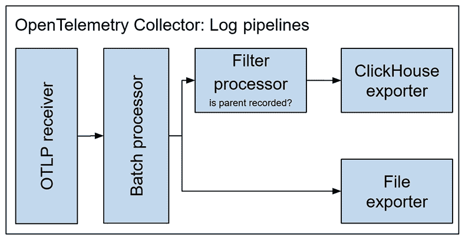

# 第八章：编写结构化和关联日志

分布式跟踪是一个描述和关联操作的优秀工具，但有时我们需要记录回调和启动配置等信息，或者有条件地写入调试信息。在本章中，我们将探讨日志——这是最古老且最受欢迎的遥测信号，可以描述任何事物。

首先，我们将讨论日志用例，并发现 .NET 中可用的不同 API，然后我们将关注 `ILogger` —— 一个常见的日志外观。我们将学习如何高效地使用它来编写结构化事件。我们将看到如何使用 OpenTelemetry 导出日志并对其编写丰富的查询。最后，我们将探索日志采样和成本节约策略。

在本章中，你将学习以下内容：

+   何时写入日志以及使用哪个 .NET API

+   如何使用 `Microsoft.Extentions.Logging.ILogger` 类写入日志

+   如何使用 OpenTelemetry 捕获和导出日志

+   使用 OpenTelemetry Collector 的成本管理策略

到本章结束时，你将能够使用日志和事件高效地对你的应用程序进行配置，以便调试和分析服务行为。

# 技术要求

本章的代码可在 GitHub 上的书籍仓库中找到，网址为 [`github.com/PacktPublishing/Modern-Distributed-Tracing-in-.NET/tree/main/chapter8`](https://github.com/PacktPublishing/Modern-Distributed-Tracing-in-.NET/tree/main/chapter8)。

为了运行示例和执行分析，我们需要以下工具：

+   .NET SDK 7.0 或更高版本

+   Docker 和 `docker-compose`

# .NET 中的日志演变

日志是最灵活的遥测信号，通常包括时间戳、级别、类别、消息，有时还有属性。

日志通常旨在人类可读，并且没有严格的格式。以下是一个 ASP.NET Core 应用程序写入 `stdout` 的日志记录示例：

```cs
info: Microsoft.Hosting.Lifetime[14]
      Now listening on: http://localhost:5050
```

如果我们需要调查某些内容，我们首先会寻找描述有趣操作的日志，然后阅读过滤后的日志。我们理解发生了什么的能力取决于记录了多少上下文以及它有多容易通过工具如 `grep` 搜索。

结构化日志有时被称为 **事件**。事件旨在查询，可能跨越多个请求，基于任何属性，并且需要一个严格和一致的结构。以下是之前日志记录的 OpenTelemetry JSON 格式：

```cs
"timeUnixNano":"1673832588236902400",
"severityNumber":9, "severityText":"Information",
"body":{"stringValue":"Now listening on: {address}"},
"attributes":[
  {"key":"dotnet.ilogger.category",
     "value":{"stringValue":"Microsoft.Hosting.Lifetime"}},
  {"key":"Id","value":{"intValue":"14"},
  {"key":"address",
     "value":{"stringValue":"http://[::]:5050"}}], "traceId":"",
        "spanId":""}
```

虽然它不是人类可读的，但即使写入 `stdout` 或文件，也可以很容易地解析成结构化记录，而不需要任何关于事件语义的先验知识。

正如我们在 *第一章* 中开始探讨的，*现代应用程序的可观察性需求*，日志和事件之间的区别是语义上的——相同的信息可以优化并以人类可读的格式打印，或者以结构化格式存储和索引到数据库中。

我们将学习如何使用 `Microsoft.Extensions.Logging.ILogger` 类编写这样的结构化日志，但首先，让我们快速查看 .NET 中的其他日志记录 API。

## 控制台

我们可以使用 `System.Console` 类作为日志记录器并将所有内容写入 `stdout`。我们需要从头实现所有日志原语，并在转发到日志管理系统的同时解析它，以恢复原始日志结构。将日志记录到 `Console` 既不便利也不高效。

## Trace

`System.Diagnostics.Trace` 和 `System.Diagnostics.TraceSource` 类提供了写入消息的方法，以及一些参数，并支持日志级别。我们还可以使用 `TraceListener` 类来监听它们，以便将它们导出到日志管理系统。

这看起来是个不错的开始，但有几个限制：

+   `TraceSource` API 不提供写入参数的标准方式。因此，很容易将消息格式化为字符串，但我们需要知道特定事件的语义才能知道参数名称。

+   默认情况下，`TraceSource` 和 `TraceListener` 在每个操作上都使用全局锁。它们可以以无锁的方式使用，但直到负载足够高时才可能容易忽略。

因此，`Trace` API 解决了一些日志问题，但也引入了新的问题。

## EventSource

`System.Diagnostics.Tracing.EventSource` 是 .NET 中的另一个日志记录 API。它设计用于高性能场景，支持日志级别和丰富的有效负载，并捕获参数的名称和值。可以通过实现 `EventListener` 类或以边车进程运行 .NET 诊断工具来监听它。

`EventSource` 是 .NET 平台的一部分，可以直接使用而无需任何额外依赖。`EventSource` 是在库中不希望添加任何新依赖项的情况下进行日志记录的完美候选者。

当涉及到消费时，许多可观察性供应商提供自定义包来监听事件源，但目前还没有与 OpenTelemetry 集成，这可能在您阅读时有所改变。

如我们在 *第四章* 的 *使用诊断工具进行低级性能分析* 和 *第二章* 的 *在 .NET 中的原生监控* 中所见，`EventSource` 事件也可以使用 `dotnet` 诊断工具 – `dotnet-trace` 和 `dotnet-monitor` – 进行捕获。

## ILogger

`Microsoft.Extensions.Logging.ILogger` 是一个与 ASP.NET Core 集成的常见日志外观。它支持结构化日志和级别，并拥有丰富的生态系统，这使得配置和向任何提供者（本地或远程）发送数据变得容易。

使用 `ILogger` 编写的日志可以从其他日志库中消费，例如 `Serilog` 或 `NLog`，并且它也受到 OpenTelemetry 的支持。许多可观察性后端支持 `ILogger`，使其成为编写应用程序日志的完美工具。

`ILogger`日志可以使用.NET 诊断工具在进程外捕获。这是通过首先使用`Microsoft.Extensions.Logging.EventSource.EventSourceLoggingProvider`类将日志转发到`EventSource`来完成的。此提供程序在 ASP.NET Core 应用程序中默认启用，你可以使用`AddEventSourceLogger`扩展方法手动配置它，该扩展方法用于`ILoggingBuilder`接口。我们使用这种机制通过`dotnet-monitor`捕获日志，并在*第二章*的*Native Monitoring in .NET*部分动态控制日志详细程度。

让我们更详细地了解`ILogger`的使用。

# 使用 ILogger 进行日志记录

`ILogger`类是`Microsoft.Extensions.Logging.Abstractions` NuGet 包的一部分。如果你在开发 ASP.NET Core 应用程序、工作服务或使用其他`Microsoft.Extensions`包，你已经是间接依赖于它的。

`ILogger`接口公开了一些方法：

+   `Log`使用给定的级别、ID、异常、状态和格式器记录日志消息。状态类型是泛型的，但应该包含消息，以及所有参数及其名称。

+   `IsEnabled`检查当前级别的日志记录是否启用。

+   `BeginScope`向日志作用域添加一个对象，允许你使用它丰富嵌套的日志记录。我们在*第二章*的*Native Monitoring in .NET*中看到了作用域的实际应用，在那里我们使用跟踪上下文和 ASP.NET Core 请求信息注释了控制台日志。

通常，我们会使用在`Microsoft.Extensions.Logging.LoggerExtensions`类中定义的方便的扩展方法，而不是使用普通的`ILogger.Log`方法。

在编写任何日志之前，我们首先获取一个`ILogger`实例 - 在 ASP.NET Core 应用程序中，我们可以通过构造函数参数注入来实现，如下例所示：

frontend/RetryHandler.cs

```cs
private readonly ILogger<RetryHandler> _logger;
public RetryHandler(ILogger<RetryHandler> logger) =>
    _logger = logger;
```

[`github.com/PacktPublishing/Modern-Distributed-Tracing-in-.NET/blob/main/chapter8/memes/frontend/RetryHandler.cs`](https://github.com/PacktPublishing/Modern-Distributed-Tracing-in-.NET/blob/main/chapter8/memes/frontend/RetryHandler.cs)

在这里，我们使用`RetryHandler`类型参数获取一个`ILogger`实例。类型参数的完整名称转换为日志**类别**，这对于控制详细程度和查询日志非常重要，正如我们将在*使用 OpenTelemetry 捕获日志*部分中看到的。

注意

请参考[.NET 文档](https://learn.microsoft.com/aspnet/core/fundamentals/logging)了解如何创建和配置日志记录器。

现在，我们终于可以记录一些东西了。例如，我们可以使用`_logger.LogInformation("hello world")`来写入信息日志。

如果你使用标准的日志实现，此调用将广播到所有已注册的日志提供程序，这些提供程序已为该日志类别启用了`Information`级别。

过滤器在配置时提供，可以是全局的，也可以是针对特定日志提供程序的。例如，以下是我们 memes 应用程序中的全局日志配置：

frontend/appsettings.json

```cs
"Logging": {
  "LogLevel": {
    "frontend": "Information",
    "Microsoft.Hosting.Lifetime": "Information",
    "Default": "Warning"
  }
}
```

[`github.com/PacktPublishing/Modern-Distributed-Tracing-in-.NET/blob/main/chapter8/memes/frontend/appsettings.json`](https://github.com/PacktPublishing/Modern-Distributed-Tracing-in-.NET/blob/main/chapter8/memes/frontend/appsettings.json)

此全局配置将 `frontend` 和 `Microsoft.Hosting.Lifetime` 类别的 `Information` 级别设置为，将其他所有内容的级别设置为 `Warning`。

让我们回到 `ILogger` API，看看我们如何可以记录更有用的日志。例如，让我们记录包含响应体的错误响应的调试消息。

我们在这里应该小心——体流通常只能读取一次，并且可能非常长，但无论如何，我们应该能够控制引入的任何开销：

frontend/RetryHandler.cs

```cs
if (!response.IsSuccessStatusCode &&
     _logger.IsEnabled(LogLevel.Debug))
  _logger.LogDebug("got response: {status} {body} {url}",
    (int)response.StatusCode,
    await response.Content.ReadAsStringAsync(),
    response.RequestMessage?.RequestUri);
}
```

[`github.com/PacktPublishing/Modern-Distributed-Tracing-in-.NET/blob/main/chapter8/memes/frontend/RetryHandler.cs`](https://github.com/PacktPublishing/Modern-Distributed-Tracing-in-.NET/blob/main/chapter8/memes/frontend/RetryHandler.cs)

在这里，我们以 `Debug` 级别记录日志记录，并在读取响应流之前检查级别是否启用。我们还使用 **语义**（即结构化）日志记录，在消息字符串中用花括号提供参数名称，并作为参数提供它们的值。

注意

确保使用语义日志记录。对于 `ILogger` 消息，使用字符串插值或显式格式化会移除结构，使得基于日志级别的性能优化变得不可能。

参数作为对象传递。`ILogger` 实现，如 `OpenTelemetryLogger`，支持某些类型，并且通常对其他所有内容调用 `ToString` 方法。如果在此级别禁用日志记录，则永远不会调用 `ToString`，这可以节省一些 CPU 周期和内存分配。

通过 `IsEnabled` 检查来保护日志调用，以及检索或计算参数，是保持禁用类别性能影响非常低的好方法。

## 优化日志

与日志相关的代码经常成为性能退化的来源。避免内存分配和参数计算，尤其是在此级别禁用日志时，是第一步，但我们还应该在启用时优化热路径上的日志。以下是一些技巧：

+   **避免过度日志记录**：在进入重要的代码分支、回调被调用或捕获异常时，可能需要写入日志记录。避免在异常传播过程中多次记录异常，或在内联方法中记录相同的回调。

+   **避免重复**：统一与同一操作相关的多个日志，当可用时，使用来自 ASP.NET Core 和其他库的日志，而不是添加自己的日志。

+   **避免仅为了日志记录目的计算任何值**：通常，序列化对象和解析或格式化字符串是常见的操作，但通常可以通过重用现有对象、缓存值或在查询时格式化文本来优化。

最后，当日志量和参数优化后，我们可以进行一些微优化。其中之一是使用编译时日志源生成，以下是一个示例：

StorageService.cs

```cs
[LoggerMessage(EventId = 1, Level = LogLevel.Information,
  Message = "download {memeSize} {memeName}")]
private partial void DownloadMemeEvent(long? memeSize,
  string memeName);
```

[`github.com/PacktPublishing/Modern-Distributed-Tracing-in-.NET/blob/main/chapter8/memes/frontend/StorageService.cs`](https://github.com/PacktPublishing/Modern-Distributed-Tracing-in-.NET/blob/main/chapter8/memes/frontend/StorageService.cs)

在这里，我们定义了一个部分方法，并用 `LoggerMessage` 属性进行了注释，提供了事件 ID、级别和消息。此方法的实现是在编译时生成的（你可以在 .NET 文档的[`learn.microsoft.com/dotnet/core/extensions/logger-message-generator`](https://learn.microsoft.com/dotnet/core/extensions/logger-message-generator)中找到更多相关信息）。

如果我们检查生成的代码，我们可以看到它缓存了日志调用及其静态参数。有关此方法的更多详细信息，请参阅 .NET 文档中的[`learn.microsoft.com/dotnet/core/extensions/high-performance-logging`](https://learn.microsoft.com/dotnet/core/extensions/high-performance-logging)。

我们可以通过运行 `logging-benchmark$ dotnet run -c Release` 并检查 `BenchmarkDotNet.Artifacts` 文件夹中的结果来比较不同日志方法的性能。该基准使用了一个虚拟日志记录器，并仅测量仪器侧。如果我们比较编译时日志源生成和 `LogInformation`（或类似）方法的性能，我们将看到以下结果：

+   编译时日志源生成消除了在仪器侧的内存分配，即使日志已启用也是如此。因此，垃圾回收（GC）变得更加频繁，导致更高的吞吐量和更小的 P95 延迟。

+   使用编译时日志源生成时，如果参数值 readily available，则不需要进行 `IsEnabled` 检查。

+   当启用日志记录时，单个日志调用的持续时间在很大程度上不依赖于所使用的方法。

这些结果可能会因参数类型和值的不同而有所变化。请确保运行性能、压力和负载测试，或者使用与生产环境中类似的日志配置来分析你的应用程序。

现在，你已经完全准备好编写日志了，所以是时候探索消费端了。

# 使用 OpenTelemetry 捕获日志

默认情况下，ASP.NET Core 应用程序将日志写入`stdout`，但因为我们希望将它们与跟踪关联并按任何属性查询，所以我们应将它们导出到支持该功能的可观察性后端或日志管理工具。如果您的供应商支持`ILogger`，您可以通过配置相应的日志提供程序直接将日志发送到您的供应商。这将由该日志提供程序负责为日志添加跟踪上下文或环境信息。通过使用 OpenTelemetry 收集日志，我们可以与其他信号保持一致地注释它们。

让我们看看如何使用 OpenTelemetry 收集 meme 应用程序的日志。为了充分利用结构，我们将它们导出到**ClickHouse**——一个支持 SQL 查询的开源数据库。

这里是一个将日志导出为**OpenTelemetry 协议**（**OTLP**）导出器到 OpenTelemetry Collector 的配置示例：

frontend/Program.cs

```cs
builder.Logging.AddOpenTelemetry(b => {
  b.SetResourceBuilder(resource);
  b.ParseStateValues = true;
  b.AddOtlpExporter();
});
```

[`github.com/PacktPublishing/Modern-Distributed-Tracing-in-.NET/blob/main/chapter8/memes/frontend/Program.cs`](https://github.com/PacktPublishing/Modern-Distributed-Tracing-in-.NET/blob/main/chapter8/memes/frontend/Program.cs)

在这里，我们向应用程序的`ILoggingBuilder`实例添加了 OpenTelemetry 日志提供程序，然后配置了该提供程序。我们配置了资源属性，启用了解析状态值以填充参数，并添加了 OTLP 导出器。导出器端点配置了`OTEL_EXPORTER_OTLP_ENDPOINT`环境变量。

OpenTelemetry Collector 配置为将所有日志发送到文件，并将采样日志写入 ClickHouse——我们将在下一节中查看其配置。

让我们继续运行 meme 应用程序，使用`memes$ docker-compose up --build`。然后，我们将访问`http://localhost:5051/`的前端来上传和下载一些 meme。

要在 ClickHouse 中查询日志，请运行`$ docker exec -it memes-clickhouse-1 /usr/bin/clickhouse-client`——这将启动一个客户端，我们可以在其中编写 SQL 查询，例如以下查询，它返回所有日志记录：

```cs
$ select * from otel_logs order by Timestamp desc
```

这里是一个输出示例——我们在本章早期添加的下载 meme 日志（如果您看不到，请记住日志是采样的，您可能需要下载更多 meme）：

```cs
│ 2023-01-17 03:28:37.446217500 │ 1bf63116f826fcc34a1e255
4b633580e │ 2a6bbdfee21d260a │         1 │ Information │ 9
│ frontend │ download {memeSize} {memeName}│
{'service.instance.id':'833fb55a4717','service.name':'front
end'} │ {'dotnet.ilogger.category':'frontend
.StorageService',
'Id':'1','Name':'DownloadMemeEvent',
'memeSize':'65412', 'memeName':'this is fine'}
```

它几乎无法阅读但易于查询，因为它包括时间戳、跟踪上下文、日志级别、正文、资源信息和属性——一个事件名称、一个 ID、一个 meme 大小和一个名称。

注意

在撰写本文时，OpenTelemetry 日志规范仍处于实验阶段，因此.NET 实现是最小的，细节可能会发生变化；ClickHouse 导出器处于 alpha 状态，表模式可能在后续版本中发生变化。

我们没有启用捕获日志作用域；否则，我们也会看到一些作为属性的作用域。它们由 ASP.NET Core 填充，并描述传入的 HTTP 请求属性。正如我们在*第二章*中看到的，*Native Monitoring in .NET*，作用域包括 OpenTelemetry 为我们捕获的跟踪上下文。

通过这种方式，我们可以使用跟踪上下文或任何属性来关联日志。例如，我们可以使用如下查询找到最受欢迎的梗：

```cs
select LogAttributes['memeName'], count(*) as downloads
from otel_logs
where ServiceName='frontend' and
  LogAttributes['Name']='DownloadMemeEvent'
group by LogAttributes['memeName'] order by downloads desc
limit 3
```

这在做出业务或技术决策时可能很有用。例如，它有助于优化缓存或分区策略，或规划容量。

我们可以编写这样的查询，因为我们日志中已经有了足够的结构，包括可选的事件 ID 和名称。如果没有它们，我们就必须根据消息文本来过滤日志，这既不高效也不可靠。例如，当有人修改消息以修复错别字或添加新参数时，所有已保存的查询都需要更改以反映这一点。

小贴士

要使日志可查询，请确保使用语义日志。提供静态事件 ID 和名称。使用一致的（在整个系统中）属性名称。

通过遵循这种方法，我们可以更改可观察性供应商，以人类可读的格式打印日志，同时将它们以结构化形式存储，如果需要，还可以进行后处理或聚合。

结构化日志与跟踪结合使用允许我们报告业务遥测并运行查询，但它带来了新的成本——让我们看看我们如何控制它们。

# 管理日志成本

与跟踪和度量类似，日志增加了运行应用程序所需的计算资源，以及（如果有的话）运行日志管道的成本，以及使用（或运行）可观察性后端相关的成本。供应商定价通常基于遥测量、保留时间和 API 调用（包括查询）的组合。

我们已经知道如何高效地编写日志，那么让我们来谈谈管道和后端。

## 管道

日志管道由将日志发送到您选择的后端所需的基础设施组成。通常，在发送到后端的过程中，会进行一些解析、解析、转换、缓冲、节流和加固。

在简单的情况下，这一切都由您的供应商的日志提供者或进程内部的 OpenTelemetry 处理器和导出器来完成。

在许多情况下，我们需要日志管道来捕获来自外部（如操作系统、自托管的第三方服务、代理和其他基础设施组件）的日志和事件。它们可以是结构化的，如 Kubernetes 事件，具有众所周知的可配置格式，如 HTTP 服务器日志，或者完全没有结构。

日志管道可以帮助解析此类日志并将它们转换为通用格式。在 OpenTelemetry 的世界里，这可以在收集器上完成。

我们会通过一个**接收器**从`files`、`syslog`、`journald`、`fluentd`、其他系统或收集器接收日志，然后通过一个**处理器**对它们进行按摩、过滤和路由，最后将它们导出到最终目的地。

管道成本节约策略从一种典型方法开始，以最小化日志量并避免重复和复杂的转换，正如我们在本章前面讨论的那样。

例如，您可能需要启用来自客户端和服务器以及 HTTP 代理的 HTTP 跟踪、指标和日志。您需要代理的日志吗？您使用它们吗？

通过可能用指标、更简洁的事件或其他信号上的属性替换它们来消除重复。如果某些信息很少需要，则可以懒惰地处理它们。

监控您的日志管道也很重要——测量错误率并估计端到端延迟和吞吐量。OpenTelemetry 收集器通过公开其自己的指标和日志来帮助。

曾经，我所在的团队发现，在日志管道中某些日志的丢失率高达 ~80%。我们以火速发布它们，并且直到我们无法在生产环境中调查事件时，才知道它们丢失了。

## 后端

后端成本优化也是从尽可能产生最少日志开始的。然后，根据您的约束和可观察性后端定价模型，以不同的方式控制成本：

+   可以通过采样减少日志量。基于采样事件的聚合需要相应地进行扩展，但使用无偏采样时，会提供未偏斜的结果。日志可以与跟踪以相同的或更高的速率进行一致采样。

+   日志可以在热存储中保留一段时间，然后移动到冷存储。在前几天，热存储中的日志可以用于紧急的临时查询，但之后，查询速度变得不那么重要。

这种策略可以与采样结合——日志可以发送到冷（且便宜）存储，而采样的日志将进入热存储。

+   某些日志可以进行后处理并汇总成指标或报告，以便频繁查询。

所有这些策略及其组合都可以使用 OpenTelemetry 收集器实现。例如，在我们的 memes 应用程序中，我们使用采样和热/冷存储的组合，如图 *图 8**.1* 所示：



图 8.1 – 使用采样和热/冷存储记录管道

在这里，我们有两条不同的日志管道。它们都从 OTLP 接收器和批量处理器开始。然后，一条管道将所有日志写入文件，另一条管道根据日志记录属性运行一个过滤器。它检查`trace-flags`，当父跨度未被记录时丢弃日志。记录了父跨度（或根本没有父跨度，例如启动日志）的日志最终会进入 ClickHouse。以下是相应的日志管道配置：

otel-collector-config.yml

```cs
logs:
  receivers: [otlp]
  processors: [batch]
  exporters: [file]
logs/sampled:
  receivers: [otlp]
  processors: [batch, filter]
  exporters: [clickhouse]
```

[`github.com/PacktPublishing/Modern-Distributed-Tracing-in-.NET/blob/main/chapter8/memes/configs/otel-collector-config.yml`](https://github.com/PacktPublishing/Modern-Distributed-Tracing-in-.NET/blob/main/chapter8/memes/configs/otel-collector-config.yml)

过滤器处理器以及许多其他处理器利用了丰富的转换语言——**OTTL**。OTTL 可以用来重命名属性、更改它们的值、丢弃指标和跨度、创建派生指标或添加和删除属性。以下是过滤器处理器的配置：

```cs
filter:
  logs:
    log_record:
      - 'flags == 0 and trace_id != TraceID
        (0x00000000000000000000000000000000)'
```

[`github.com/PacktPublishing/Modern-Distributed-Tracing-in-.NET/blob/main/chapter8/memes/configs/otel-collector-config.yml`](https://github.com/PacktPublishing/Modern-Distributed-Tracing-in-.NET/blob/main/chapter8/memes/configs/otel-collector-config.yml)

收集器可以解决许多常见的后处理需求，并从你的服务中移除这些负担。

这就结束了本章的内容。让我们回顾一下到目前为止我们学到了什么。

# 摘要

日志是最灵活的遥测信号——它们可以用来以人类可读的格式写入信息，补充跟踪以提供更多信息，或记录结构化事件以分析使用情况或性能。

要编写日志，我们可以使用不同的日志 API——`ILogger` 对于应用程序代码来说效果最好，而 `EventSource` 通常是最适合库的选择。

`ILogger` 使得高效地编写结构化日志变得简单，但它依赖于应用程序作者通过最小化日志量和计算日志参数所需的操作来实现这一点。

`ILogger` 拥有丰富的与 .NET 框架、库和提供者的集成生态系统，可以将日志几乎发送到任何地方，以平面或结构化格式。

使用 OpenTelemetry 收集和导出 `ILogger` 日志会产生与其它遥测信号一致且相关的日志。

除了应用程序日志之外，我们通常还需要收集来自基础设施或遗留系统的日志。我们可以使用 OpenTelemetry 收集器来完成这项工作，它允许我们从多个目的地收集和统一日志。收集器的日志管道可以限制、聚合或路由日志，以帮助您管理日志成本。

你现在应该已经准备好使用结构化日志高效地对你的应用程序进行配置，并使用 OpenTelemetry 导出它们。你也为使用 OpenTelemetry 构建日志管道做好了准备，以增加你的基础设施的可观察性并控制日志成本。

这标志着我们对单个遥测信号的深入研究告一段落。在下一章中，我们将讨论根据场景选择一组良好的遥测信号，并基于 OpenTelemetry 语义约定添加适当的信息级别。

# 问题

1.  以下代码片段是否正确？你会如何改进它？

    ```cs
    var foo = 42;
    ```

    ```cs
    var bar = "bar";
    ```

    ```cs
    logger.LogInformation($"hello world: {foo}, {bar}");
    ```

1.  假设你的应用程序使用`ILogger` API 来记录使用事件。事件被导出到某个地方，然后用于构建业务关键报告。随着应用程序的发展，你可能需要重构代码、重命名命名空间和类、改进日志消息，并添加更多参数。你如何编写日志以保持使用报告对日志更改的鲁棒性？

1.  假设已经收集了 HTTP 请求的跟踪信息，你是否还需要为相同的 HTTP 调用编写日志？

# 第三部分：常见云场景的可观察性

本部分提供了针对常见场景（如网络调用、异步消息、数据库和 Web 客户端）的监控配方。它展示了如何编写自己的监控或覆盖自动监控的空白，最重要的是，如何结合分布式跟踪、指标和日志来调查性能问题。

本部分包含以下章节：

+   *第九章*, *最佳实践*

+   *第十章*, *跟踪网络调用*

+   *第十一章*, *消息场景的监控*

+   *第十二章*, *监控数据库调用*
