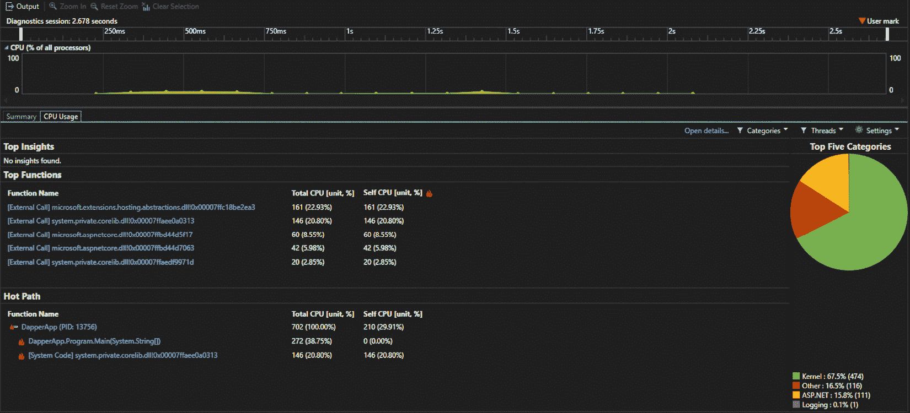

# 第十章：性能分析和识别瓶颈

随着您最小的 API 项目不断发展，性能瓶颈的可能性增加。处理数据、在网络中进行连接以及运行业务逻辑和计算——所有这些活动都有性能成本。如果配置不当，这些活动可能会产生比必要更高的成本。

在本章中，我们将探讨分析资源利用率、识别常见瓶颈并实施它们的策略。我们将涵盖以下内容：

+   性能分析和监控简介

+   性能分析工具和技术

+   常见性能瓶颈

# 技术要求

您至少需要运行 Visual Studio 2022 或 Visual Studio code，并创建一个新的 ASP.NET core 最小 API 项目。建议使用上一章的代码，因为我们将在**MyCompany** API 项目的上下文中处理性能示例。由于本章的示例是针对第十章的代码示例运行的（见[B20968_10.xhtml#_idTextAnchor154]），您需要按照上一章的说明安装 Entity Framework。（参见第九章的*在最小 API 项目中配置 Entity Framework*部分[B20968_09.xhtml#_idTextAnchor143]。）

# 性能分析和监控简介

在本章的开头，我们确定了在最小 API 应用程序中运行的代码将产生性能成本，其中一些可能表现为瓶颈，阻碍整体系统的效率。为了解决这个问题，我们可以利用性能分析工具，也称为分析器。

## 介绍分析器

**分析器**是一段测量代码运行成本的软件。当您的 API 应用程序运行时，分析器将提供遥测数据，概述代码库中某些区域的资源使用成本。这使我们能够识别效率低下的区域，这对于优化最小 API 应用程序的性能至关重要。这出于许多原因，不仅限于以下内容：

+   **可扩展性**：确保您的代码能够以不断增长的需求率执行的能力。

+   **可用性**：外部客户端访问 API 至关重要。如果由于缺乏可用硬件资源，客户端无法访问 API，则应用程序已失去可用性。

+   **安全性**：客户端和 API 之间的连接不应比必要的更长。如果您的 API 完成请求需要很长时间，连接就会保持更长时间，这为恶意活动提供了更多机会。

+   **成本**：未优化系统可能带来的财务成本可能非常严重。如果生产服务器因软件瓶颈而频繁需要升级，每次硬件升级都会产生财务成本。

+   **用户体验**：确保您的 API 尽可能快速运行，这样可以确保人们会有积极的体验，从而确保应用程序的重复使用。

+   **错误检测**：虽然分析允许检测瓶颈，但它也可以间接揭示代码库中可能未被单元或集成测试检测到的其他错误。

同样，分析最小 API 的优势是相当可观的：

+   **延迟降低**：通过分析，响应时间可以增加，从而使得 API 响应更加迅速。

+   **最佳硬件使用**：分析可以帮助您看到您在过度消耗资源（如 CPU、内存和 I/O）的地方。

+   **预防措施**：运行分析器以识别潜在的优化，让开发者能够提前解决可能出现的未来问题，使他们能够做出计划性的改变，而不是反应性的改变。

+   **维护**：总的来说，性能更好的代码库通常更容易维护。如果最小的 API 应用程序易于维护，它可能会看到更频繁的发布周期。

接下来，让我们看看一些性能指标。

## 性能指标

在发布应用程序供公共使用之前，不进行压力测试和收集结果数据，很难准确预测 API 在重负载下的表现。**性能监控**可以通过提供关于代码在特定场景下表现的见解来帮助。这些以指标形式的数据可以告知您在接近发布时如何优化代码。您需要从性能指标中理解的关键一点是，机器上运行的 API 资源如何处理大量请求。

分析可以监控最小 API 及其依赖项内的各种资源，包括以下内容：

+   **响应时间**：API 处理请求并返回响应给客户端所需的时间。

+   **吞吐量**：在任何给定时间内通过连接流动的数据量。

+   **CPU 处理**：API 主机 CPU 在请求期间或甚至在其他与客户端请求无关的背景任务中完成的处理量。

+   **内存**：在任何给定时间内应用程序消耗的 RAM 量。

获取到指标使我们能够开始识别潜在的瓶颈，这样我们就可以采取措施在最小的 API 代码中解决它们。

例如，分析器可能会显示在特定操作期间 CPU 使用量的突然增加。这可能会表明该操作是以次优的方式编写的（例如，不必要的循环或集合上的迭代）。

在对分析器和性能监控有一些了解之后，让我们来看看一些分析器的工具和技术。

# 分析工具和技术

可用的分析工具有很多，但为了开发 ASP.NET 中的最小 API，我们将探讨两个示例：Visual Studio 分析器和 BenchmarkDotNet。前者是一个基于 GUI 的工具，而后者是一个库，我们可以将其添加到项目中作为依赖项。

这些工具中的每一个都有其特定的用例优势，如这里所示：

+   **Visual Studio 分析器**：它集成到 IDE 中，提供实时性能数据和 CPU 以及内存指标。它非常适合快速捕获分析、执行基本性能分析以及识别 CPU 和内存使用量高的区域。

+   **BenchmarkDotNet**：它可以作为一个包安装到 .NET 项目中，擅长于微基准测试。它用于建立基线性能和代码的微调。

还有其他一些可能的选择不是免费的，例如 JetBrains 的 dotTrace，它是一个非常强大的分析器，可以提供通常的资源消耗指标，以及一些非常深入的对调用树和事件随时间线视图。我当然可以推荐 dotTrace，但由于它不是免费的，我们将通过在 Visual Studio 分析器和 BenchmarkDotNet 中探索分析示例来保持简单。

## Visual Studio 中的分析

让我们从在 Visual Studio 中设置分析开始：

1.  在 Visual Studio 中打开 **MyCompany** API 示例。然后，点击 **调试** ，并选择 **性能分析器** 。屏幕上将显示针对各种类型分析的不同选项。对于本例，我们将分析 CPU 使用情况以演示分析过程。

1.  打勾 **CPU 使用情况** 并点击 **开始** 。


图 10.1：分析配置屏幕

目标将是开始分析，以便在我们在与 API 交互的同时，它在后台捕获 CPU 使用数据。一旦应用程序停止，将生成一个报告，它将给出 CPU 使用量随时间的变化分析，然后我们可以将其追踪回特定的代码行。

1.  在开始分析器（确保它在记录）后，您的 API 项目也将开始运行。通过调用 **GetEmployeeById** 端点与 API 交互，传递现有员工记录的 ID 值。您会注意到，在发出请求时，分析器会实时更新。您应该会看到 CPU 使用量在请求开始时立即增加，一旦请求完成，又会恢复平静。

1.  一旦向 API 发送了一些请求，请点击屏幕左上角的 **停止收集** 按钮，然后点击 **CPU 使用情况** 选项卡（屏幕左侧大约四分之一的位置）。结果应该是一个诊断报告，显示在分析时间段内 CPU 使用情况的峰值和低谷。



图 10.2：CPU 使用情况的分析报告

如你在*图 10.2*中看到的，在分析会话开始时 CPU 使用量出现了峰值。这是在向**employees**端点发出**GET**请求时发生的，API 通过返回具有给定 ID 的**Employee**对象来处理请求。

在这个视图中可以过滤出大量信息。仅举一例，关于.NET 的分析可以写成一整本书。然而，为了举例说明，点击**CPU 使用**面板右上角的**打开详细信息**按钮。

屏幕上显示的详细信息将提供关于在给定时间内消耗各种 CPU 百分比级别的代码的更详细信息。有几个关键视图，例如**调用树**视图，它显示了函数和方法调用之间的嵌套关系（即*什么调用了什么*）。


图 10.3: 调用树视图，显示树中各层函数的 CPU 消耗

**函数**视图非常有用，因为它可以用来识别哪些特定的代码行消耗了更多的 CPU。通过按**总 CPU%降序**排序这个视图，你可以快速识别 CPU 消耗量最大的部分。这在优化最小 API 时可能很有益处，因为你可以了解底层函数对端点响应时间的影响，例如。

更重要的是，这个视图中的任何条目都可以双击以显示原始源代码，并在函数签名旁边标注 CPU 使用情况。

**调用者/被调用者**视图，展示了哪些函数被调用以及它们自身调用了什么，在这个请求中尤其具有洞察力。

以*图 10.4*为例。我们可以看到，对于当前在**EmployeeService**中的函数**GetEmployeeById()**，CPU 资源消耗了**51.42**%。进一步分析，我们可以看到该函数被调用到 Entity Framework Core 中的某个方法。在这种情况下，该函数是**FirstOrDefault()**。

**FirstOrDefault()**是**语言集成查询**（**LINQ**）的一个特性，它将获取满足给定条件的集合中的第一个项目，或者返回默认值，在这种情况下是**null**。

在*图 10.4*中我们可以看到，**GetEmployeeById()**消耗了 CPU 使用的**51.42**%，其中**50.34**%的使用被**FirstOrDefault()**占用；如果你得到的相同分析值有所不同，请不要感到惊讶。这个值应该在不同的机器之间有所变化。重要的是，你能看到使用量的峰值。


图 10.4: 调用者/被调用者视图，展示了 GetEmployeeById()函数的 CPU 使用情况分解

这个结果展示了每个函数的 CPU 使用率百分比。单独来看，这并不一定表明存在瓶颈，但在调试性能或进行一般优化时，这是一条有用的信息。

我们可以通过用我们自己的自定义循环实现替换**FirstOrDefault()**来进一步研究这个问题，以找到匹配 ID 的第一个员工。

循环看起来就像这里给出的示例：

```cs
foreach(var employee in _companyContext.Employees)
{
    if (employee.Id == id)
    {
        return employee;
    }
}
throw new EmployeeNotFoundException(id);
```

如果我们将这个循环替换**FirstOrDefault()**，我们可以检查相同的性能分析捕获并比较 CPU 使用率。

在这种情况下，当使用循环而不是**FirstOrDefault()**运行更新后的代码时，我们看到了 CPU 使用量略有增加。因此，虽然**FirstOrDefault()**尚未被证实是获取调用 API 端点**Employee**的最高效方法，但我们的替代方案的性能确实较低。这是一个排除法技术，值得在整个代码库中练习。


图 10.5：使用 foreach 循环而不是 FirstOrDefault()对 GetEmployeeById()的 CPU 使用情况

如前所述，我们可以进一步深入 Visual Studio 分析器，但这超出了本书的范围。有了这个基础，你现在应该至少有一个用于优化最小 API 的工具。让我们看看另一个用于分析 API 性能的有用工具——BenchmarkDotNet。

## 使用 BenchmarkDotNet 进行基准测试

**BenchmarkDotNet**是一个开源的.NET 库，旨在简化.NET 应用程序中的微基准测试。它是由软件工程师 Andrey Akinshin 创建的，他是.NET 社区的一位杰出成员，专注于软件性能。

该项目始于 2014 年左右，旨在为开发者提供一个易于使用的工具，用于测量和比较不同代码片段的性能。

该库作为 NuGet 包提供，我们需要将其安装到**MyCompany** API 项目中进行性能基准测试。

为了保持整洁，我们将基准测试放在另一个项目中执行。然而，我们可以通过将新的基准测试项目添加到当前解决方案中，保持在当前的 Visual Studio 设置中。

在 Visual Studio 的解决方案资源管理器中，右键单击当前解决方案，然后选择**添加** | **新建项目**。

在**新建项目**界面中，窗口顶部有一个搜索框，允许你搜索项目模板。使用它来搜索**"C#控制台应用程序"**。一旦看到它，选择它并点击**"下一步"**。你将被要求选择.NET 版本。我们使用版本 9，所以保持选中并点击**"创建"**。

接下来，我们需要通过包管理控制台将**BenchmarkDotNet**库包添加到新项目中：

```cs
dotnet add package BenchmarkDotNet
```

新项目在我们的解决方案中，并且安装了所需的库，但它是如何能够从最小 API 项目中引用依赖项的呢？

解决这个问题的方法是创建一个项目引用。这允许我们在多个 .NET 项目之间引用对象类型。当项目与这个例子一样位于同一个解决方案中时，这尤其容易。

要添加项目引用，右键单击你的新基准测试项目，然后点击 **添加** | **项目引用**。

你将看到一个对话框，你可以浏览到项目位置。你的 ASP.NET 项目应该已经被编译为一个 **动态链接库** ( **DLL** )，因此你应该能够从你的 ASP.NET 项目目录中的 bin 文件夹中选择它。

现在你有了项目引用，你可以添加使用语句来引用该项目中的类型，就像它们是在基准测试项目中创建的一样。

我们现在可以继续设置我们的基准测试并利用我们通常注入的依赖项，但首先，基准测试需要它们自己的类；因此，创建一个名为 **EmployeeBenchmarks** 的类。

在这个新类中，创建一个私有字段来保存 **EmployeeService**：

```cs
public class EmployeeBenchmarks
{
    private EmployeeService _employeeService;
}
```

接下来，我们可以创建一个方法来访问所需的依赖项。我们将把这个方法命名为 **Setup()**。我们需要用属性来注释这个方法 – **[** **GlobalSetup]**

有这个属性意味着 BenchmarkDotNet 会在基准测试运行之前运行 **Setup()** 中的逻辑：

```cs
[GlobalSetup]
    public void Setup()
    {
        var services = new ServiceCollection();
        services.AddScoped<MyCompanyContext>();
        services.AddScoped<EmployeeService>();
        var serviceProvider =
            services.BuildServiceProvider();
        _employeeService =
            serviceProvider
                .GetRequiredService<EmployeeService>();
    }
```

这段代码使用了 **ServiceCollection**，这将需要安装 **Microsoft.Extensions.DependencyInjection** 包。

在 **Setup()** 中，我们创建了所需的依赖项并将它们添加到 **ServiceContainer** 中，以便它们在运行时可以使用。

我们还检索了 **EmployeeService** 并将其存储在私有字段中，以便我们的基准测试可以调用其内部的 **GetEmployeeId()** 函数。

最后，对于这个类，我们添加了基准测试本身，这是重要的部分。我们想要为在 Entity Framework 中运行的活动创建一个基准测试，因此我们将调用 **GetEmployeeId()** 函数，以便通过 **MyCompanyContext** 与数据库交互，并且这个活动将被 BenchmarkDotNet 记录。我们向 **GetEmployeeById()** 传递了一个硬编码的 ID，因为我们知道 ID 为 **6** 的 **Employee** 记录存在，并且这不会改变（显然，你必须确保存在具有此 ID 的记录，或者将值从 **6** 更改为你知道存在于数据库中的值）：

```cs
  [Benchmark]
  public void GetEmployeeByIdBenchmark()
  {
      var result = _employeeService
          .GetEmployeeById(6)
          .GetAwaiter()
          .GetResult();
  }
```

注意到 **[Benchmark]** 属性装饰了 **GetEmployeeByIdBenchmark()** 方法。这表明该方法是一个相关的基准测试，应该运行。

现在，拥有一个单独的控制台应用程序在这里真的很有帮助。在基准控制台应用程序的**Program.cs**类的**Main()**方法中，我们可以简单地调用静态的**BenchmarkRunner**，并告诉它运行基准类中的任何基准测试，它将根据**[** **Benchmark]**属性的存在来检测：

```cs
static void Main(string[] args)
{
    var result = BenchmarkRunner.Run<EmployeeBenchmarks>();
}
```

现在可以运行基准测试控制台应用程序，为**EmployeeBenchmarks**中带有**[** **Benchmark]**属性的任何方法或函数提供结果。

在运行控制台应用程序之前，在解决方案资源管理器中右键单击控制台应用程序项目，并选择**设置为** **启动项目**。

控制台应用程序运行完成后，你将在控制台窗口中看到基准输出，以及一系列发布到应用程序**bin**目录中名为**BenchmarkDotNet.Artifacts**的文件夹中的文件。在这里，你可以找到控制台输出，以及以 HTML、Markdown 和 Excel 格式组织的结果。

让我们看看输出中最重要的一部分。在控制台显示的结果中，你会注意到一个表格。这个表格包含了**GetEmployeeById()**的基准测试信息：

```cs
| Method                   | Mean     | Error   | StdDev  |
|------------------------- |---------:|--------:|--------:|
| GetEmployeeByIdBenchmark | 171.1 μs | 3.37 μs | 5.63 μs |
```

此表显示了运行**GetEmployeeById()**所需的平均时间（以微秒为单位），这是在多次迭代中得出的。

平均耗时以平均值的形式显示，为我们提供了一个可以用于性能分析的基础测量值。建议记录这个平均值，然后使用不同的输入多次运行基准测试，以进一步证实这个平均值。

**错误**和**StdDev**列提供了一些额外的支持信息。**StdDev**代表**标准偏差**，即与平均值的差异量。标准偏差越小，基准时间越一致。如果你看到更高的标准偏差，这意味着平均结果有更大的变异性。

**错误**列表示平均平均结果的估计标准偏差，这是结果可靠性的一个指标。数字越小，结果越可靠。

再次，运行具有不同输入的几个基准测试是有意义的。如果你看到相似的标准偏差和误差，你可以对结果的准确性有信心。

发布模式

为了使前面的分析工作正常，你的项目需要以发布模式构建。如果你在 Visual Studio 顶部的工具栏下拉菜单中看到单词**调试**，将其更改为**发布**，然后重新构建你的项目。

# 常见性能瓶颈

让我们看看可能导致性能下降的一些常见原因以及如何解决它们。这些方法并不适用于所有情况，但它们是众所周知的问题瓶颈：

+   **数据库访问**：瓶颈是由缓慢的数据库查询或数据库连接使用不当引起的。为了减轻这种情况，请执行以下操作：

    +   使用异步数据库操作（**async/await**）。

    +   优化 SQL 查询并使用适当的索引。查看任何可能对系统造成负担的**WHERE**子句或**JOIN**操作。

    +   实现连接池以减少需要打开新连接的次数。

    +   使用缓存系统，如 ASP.NET 的**IMemoryCache**，来存储频繁访问的数据。

+   **I/O 操作**：瓶颈是由于阻塞 I/O 操作，如文件或网络访问。为了缓解这种情况，请执行以下操作：

    +   使用异步 I/O 操作。

    +   最小化磁盘和网络 I/O。在可能的情况下，从内存中检索常用数据，而不是从持久存储或通过网络。

    +   使用高效的数据格式（例如，使用 JSON 而不是 XML）。

+   **序列化/反序列化**：瓶颈源于数据序列化和反序列化的缓慢或低效。为了缓解这种情况，请执行以下操作：

    +   使用优化的序列化程序，如**System.Text.Json**，而不是**Newtonsoft.Json**。

    +   最小化序列化数据的尺寸。

+   **中间件管道**：瓶颈是由请求管道中过多的或不高效的中间件引起的。为了缓解这种情况，请执行以下操作：

    +   审查和优化中间件组件。

    +   移除不必要的中间件。

    +   使用轻量级中间件。

+   **日志记录**：瓶颈源于广泛的或同步的日志记录。为了缓解这种情况，请执行以下操作：

    +   使用异步日志记录。

    +   在生产环境中降低日志的详细程度。

    +   使用高效的日志框架，如 Serilog。

+   **依赖注入（DI）**：瓶颈是由于依赖注入的不高效使用。为了缓解这种情况，请执行以下操作：

    +   在适当的情况下使用作用域或单例生命周期。

    +   避免不必要的服务注入。如果存在更简单的替代方案，可以避免依赖注入，请使用它。

+   **垃圾回收（GC）压力**：瓶颈源于过度的内存分配，导致频繁的垃圾回收。为了缓解这种情况，请执行以下操作：

    +   通过重用对象来减少分配。

    +   在可能的情况下使用值类型而不是引用类型。

    +   优化数据结构，并避免在堆上大量分配对象（尽可能使用值类型而不是引用类型）。

+   **网络延迟**：瓶颈是由网络调用中的高延迟引起的。为了缓解这种情况，请执行以下操作：

    +   最小化网络调用的数量。

    +   实现具有指数退避的重试策略。

    +   调查替代网络协议，使用基准测试来查看它们是否资源消耗更少。

通过对最常见的瓶颈及其缓解方法有一个一般性的了解，你将在调试和审查最小 API 中的代码时更加警觉。

现在我们将回顾本章中我们涵盖的各种主题。

# 摘要

在本章中，我们从高层次探讨了最小 API 中性能问题的各种陷阱和缓解选项。

我们首先概述了性能分析的基本原理以及为什么它在不仅仅是最小化 API，而且在一般软件工程中都很重要。

然后，我们审查了一些不同的工具，在缩小我们使用的工具范围后，将工具聚焦于 Visual Studio 分析器和 BenchmarkDotNet。

然后，我们开始使用 Visual Studio 分析器对**MyCompany** API 进行性能分析，分析器输出的各种指标被分解到由分析器生成的诊断报告中。这使得我们能够找到代码某一部分的整体 CPU 使用情况，但随后还可以进一步通过调用树中较低层的被调用函数来分解。

接下来转向 BenchMarkDotNet，我们实现了与 Visual Studio 分析器相同的分析示例，这次是对目标方法进行性能基准测试。然后我们审查了输出结果，以了解如何根据错误率的稳定性和标准差来确保基准测试的准确性。

就像本书中的许多主题一样，这只是一个表面的探讨，但它将为最小化 API 的进一步优化提供一个坚实的基础，并为你分析它们的效率提供一个良好的基础。

让我们继续到下一章，我们将探讨如何使用异步编程来扩展最小化 API。
