# 第十四章：最小 API 的单元测试、兼容性和部署

当你准备将应用程序部署到生产环境时，这是一个令人兴奋的时刻。在那之前，有许多问题需要回答，主要是：“这是高质量的代码吗？”“一切都会按预期工作吗？”“它将在长时间内保持可持续性吗？”

为了帮助我们的最小 API 成功，在它们进入用户手中或负责任何关键业务操作之前，需要进行测试。

这个声明*非常*明显。当然我们需要测试，但在某些情况下，不那么明显的是*我们将如何测试*。单元和集成测试可以帮助我们在这方面，为我们提供自动化的解决方案来测试我们的验收标准，检查代码更改引入的新错误，通常被称为**回归**，并在某些 IDE 中（字面上）为我们提供部署的红绿灯。

在部署之前，也需要考虑兼容性问题。我们将部署到哪个操作系统？将使用哪种类型的 Web 服务器？我们是托管在云端还是本地？

最后，适当的部署方法可以由所有前面的考虑因素决定。虽然看起来很多，但当我们不可避免地自信地部署我们的最小 API，并希望它们带来预期的价值，甚至更多时，这一切都是值得的。

在本章中，我们将涵盖以下内容：

+   最小 API 的单元测试和集成测试

+   兼容性和将最小 API 迁移到 .NET 9

+   部署最小 API

# 技术要求

为了运行本章中的代码，建议使用 Visual Studio 2022 或最新版本的 Visual Studio Code。本章的代码示例可在 GitHub 仓库中找到：[`github.com/PacktPublishing/Minimal-APIs-in-ASP.NET-9`](https://github.com/PacktPublishing/Minimal-APIs-in-ASP.NET-9)。

要跟随本章中所有部署方法，您需要能够访问 Azure 订阅并安装 Docker。

# 最小 API 的单元测试和集成测试

很可能你已经遇到过单元测试和集成测试这两个术语，但为了复习，让我们简要地定义它们。

**单元测试**涉及在隔离状态下测试代码库中函数的各个组件，而集成测试则检查系统模块的不同组件之间的交互。在最小 API 中，单元测试可能只是测试一个服务是否按预期工作，而集成测试将确认对端点的 HTTP 请求是否正确地一起使用了服务和其它组件。

简而言之，你要么在测试单个代码单元，要么在测试不同的单元如何相互交互。

让我们为执行非常简单的操作的服务创建一个单元测试：计算给定数值的总和。以下是它在 **Program.cs** 中的样子，其中它被注册为依赖注入并用作 POST 端点的一部分：

```cs
public class Program
{
    public static void Main(string[] args)
    {
        var builder = WebApplication.CreateBuilder(args);
        builder.Services.AddTransient<CalculatorService>();
        var app = builder.Build();
        app.MapPost(
            "/SumIntegers",
            (int[] integers,
             CalculatorService calculatorService) =>
        {
            var result = calculatorService.Sum(integers);
            return Results.Ok(result);
        });
        app.Run();
    }
}
```

我们可以实现几个测试框架，但为了保持简单，我将使用 xUnit：

1.  在 Visual Studio 中右键单击您的解决方案，然后选择 **添加** | **新建项目…** 。

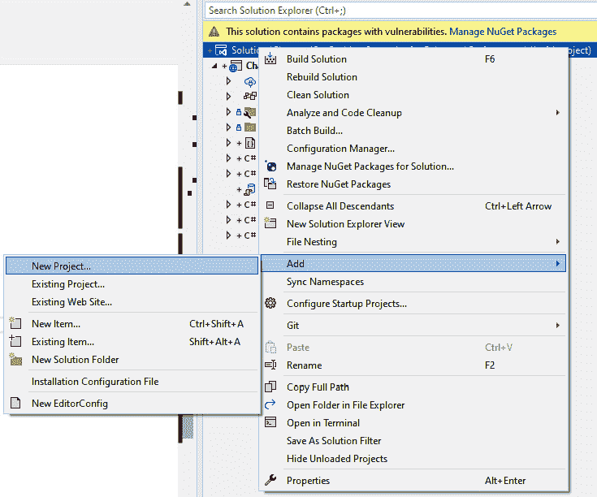

图 14.1：在解决方案资源管理器中添加新项目

1.  然后搜索 **xUnit**（或者如果您不想完全跟随，您首选的测试框架）。

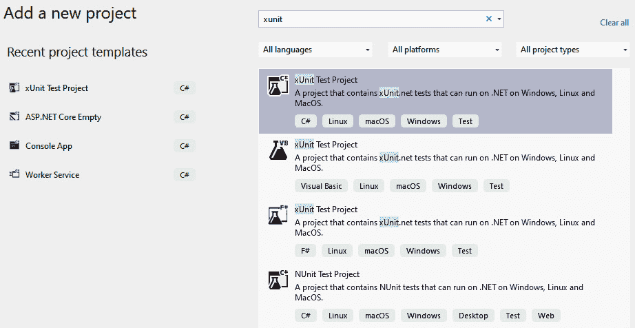

图 14.2：创建一个新的 xUnit 项目

1.  如果显示 **不使用顶级语句** 选项，我建议取消选中它，这样您可以清楚地看到每个类中使用的命名空间。这是一个个人偏好，但它会使您更容易跟随这个示例。

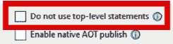

图 14.3：取消选中“不使用顶级语句”复选框

1.  一旦在解决方案中创建了您的测试项目，右键单击测试项目的 **依赖项**，然后添加对 API 项目的项目引用。

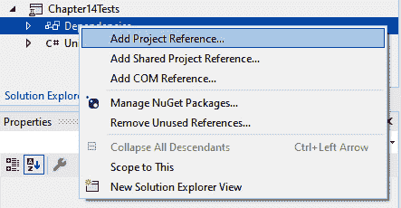


您现在在解决方案中有两个项目。一个是最小化的 API 项目，另一个是与前者链接的测试项目。

现在我们可以开始编写一些测试了。让我们从一个针对 **CalculatorService** 的简单单元测试开始。

在我们的测试项目中，创建一个名为 **CalculatorTests** 的新类。然后，更新代码，使得一个名为 **Sum_Test()** 的方法存在，并在方法签名上方有一个属性 **[Fact]** ：

```cs
[Fact]
public void Sum_Test()
{
}
```

**[Fact]** 属性是 xUnit 用于标记方法为测试的属性。我喜欢这样想：我们是在声明该方法代表的是事实；它应该是客观的。在这种情况下，我们想要一个测试来证明给定整数集合的总和等于我们期望它等于的值。让我们通过编写测试逻辑来更详细地探讨这一点。

在 **Sum_Test()** 的主体中，实例化一个新的 **CalculatorService** 实例，并创建一个整数数组，我们可以在测试中使用它：

```cs
var calculatorService = new CalculatorService();
int[] integers = [ 1, 1, 8 ];
```

由于我们保持了简单性，因此可以一眼看出，**integers** 中值的总和的预期结果必须是 **10** 。

在 **CalculatorService** 中添加对 **Sum()** 函数的调用，并将其存储在一个变量中。同时，添加一个硬编码的变量 **10** 作为预期结果：

```cs
var result = calculatorService.Sum(integers);
var expectedResult = 10;
```

在单元测试中，有一个被称为 *三 A* 原则的原则，代表 arrange（准备）、act（执行）和 assert（断言）：

1.  第一步，安排，强迫我们收集数据和资源到特定的状态，以便进行测试。我们通过创建**CalculatorService**的一个实例，一个我们知道应该加起来等于 10 的整数数组，我们还将它硬编码到一个变量中作为参考，实现了这一点。最后，我们调用**Sum()**函数以获得实际结果。

1.  第二步是行动。这仅仅意味着采取行动以使测试可以被评估。例如，如果你正在测试两个整数值之间的计算，实际的计算将在这一点上进行。

1.  最后一步是断言。断言就是测试本身。在这里，我们将断言我们的**[Fact]**是真实的。如果断言是正确的，**[Fact]**就是真实的，测试将通过。如果断言是错误的，测试将失败。

不同的测试框架都有自己的断言实现，但原则是相同的。在 xUnit 中，一个静态类**Assert**包含各种类型的断言，可以在测试期间使用。例如，一个断言某物为 null 或非 null 是通过**Assert.Null()**和**Assert.NotNull()**分别表示的。同样，我们可以使用**Assert.True()**来断言一个语句为真。

我们想要断言**Sum()**的预期结果与实际结果相等。为此，我们可以使用**Assert.Equal()**：

```cs
[Fact]
public void Sum_Test()
{
    var calculatorService = new CalculatorService();
    int[] integers = { 1, 1, 8 };
    var result = calculatorService.Sum(integers);
    var expectedResult = 10;
    Assert.Equal(result, expectedResult);
}
```

运行此测试就像在方法签名上右键单击并选择**运行测试**一样简单。测试将运行，并且测试结果将通过 Visual Studio 在测试资源管理器中显示。你应该在测试旁边看到一个绿色圆圈，表示成功。

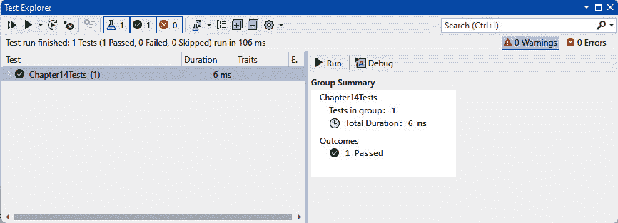

图 14.5：测试资源管理器屏幕，显示可用的测试及其结果

对于集成测试，可以采用与编写测试类似的方法，主要区别在于测试的作用域。在这个例子中，一个最小 API，一个简单的集成测试的作用域可以覆盖整个端点。让我们通过编写一个针对**/sumintegers** API 端点的集成测试来检查结果状态码，将其付诸实践。

要运行此测试，我们需要能够访问**HttpClient**对象并在测试项目中运行**WebApplication**，因为测试需要针对端点发出请求。为此，你可以让你的测试类实现**WebApplicationFactory**类型的**IClassFixture**。

在测试类中使用 IClassFixture

**IClassFixture**是一个接口，允许对象在类级别上共享作用域。在这种情况下，我们想要共享**WebApplicationFactory**对象的作用域，以便在类内部为测试创建**HttpClient**实例。

因为**WebApplicationFactory**需要安装**Microsoft.AspNetCore.Mvc.Testing**，所以使用 NuGet 包管理器控制台安装此包：

```cs
dotnet add package Microsoft.AspNetCore.Mvc.Testing
```

更新**CalculatorTests**类，使其实现**IClassFixture**：

```cs
public class CalculatorTests :
    IClassFixture<WebApplicationFactory<Program>>
```

这将需要你为类添加一个构造函数，在其中你可以注入**WebApplicationFactory**。你还可以使用这个**WebApplicationFactory**在测试期间创建一个新的**HttpClient**。让我们将其存储在一个**readonly**字段中，这样我们就可以通过在构造函数运行后不重新初始化它来保持事物的整洁：

```cs
private readonly HttpClient _httpClient;
public CalculatorTests(
    WebApplicationFactory<Program> applicationFactory)
{
    _httpClient = applicationFactory.CreateClient();
}
```

最后，我们可以编写我们的测试。让我们通过创建一个整数数组作为所需的参数并序列化为 JSON 字符串来*安排*测试数据，以便它们可以添加到请求体中：

```cs
[Fact]
public async Task SumIntegers_ShouldReturnOk()
{
    //Arrange
    var integers = new[] { 2, 4, 4 };
    var jsonContent = new
        StringContent(JsonSerializer.Serialize(integers),
        Encoding.UTF8,
        "application/json"
    );
}
```

接下来，我们可以通过向目标端点发送 POST 请求来*执行*操作：

```cs
// Act
var response = await _httpClient.PostAsync(
    "/SumIntegers", jsonContent);
```

最后，我们可以*断言*响应代码是我们预期的，在这种情况下，**200 OK**：

```cs
Assert.Equal(HttpStatusCode.OK, response.StatusCode);
```

你还可以通过检查响应内容来断言结果是预期的：

```cs
Assert.Equal(10, JsonSerializer.Deserialize<int>(await response.Content.ReadAsStringAsync()));
```

这个集成测试可能看起来与我们在本章早期编写的原始单元测试非常相似，但它有所不同，因为它具有更广泛的范围。

通过调用这个测试，我们不仅向目标端点发送请求，还覆盖了对封装的**CalculatorService**的测试。

在这两个例子中，对现有的逻辑进行了集成和单元测试。如果我们采用**测试驱动开发**（**TDD**），我们会在任何逻辑之前编写测试来增强我们的实践。显然，我们预计测试最初会失败，但我们的目标是编写允许测试通过的代码。假设你的测试与 API 需求方面的验收标准具有相同的断言，TDD 通常被认为是将自动化测试应用于代码库的最佳方式。

不论是 TDD 还是其他方式，在单元和集成测试中，拥有测试覆盖率将有助于提高你的最小 API 代码质量，并有望减少发布后报告的 bug 数量。

当谈到 API 的质量和稳定性时，测试代码的逻辑是一个方面；但在迁移到部署之前，还有一个方面需要考虑：兼容性。让我们探讨兼容性，特别是关注撰写本书时的最新.NET 版本——.NET 9。

# 兼容性和将最小 API 迁移到.NET 9

假设你已经创建了一个最小化的 API 项目，但.NET 版本不是最新的。你希望部署 API，但在这样做之前，你打算将代码库升级到最新的.NET 版本，在撰写本书时是 9.我们需要考虑哪些因素才能有信心确保我们的应用程序在新版本上运行高效，以及我们如何迁移到它？

在进行任何.NET 迁移之前，咨询微软的文档至关重要，其中概述了任何已知的破坏性更改。

.NET 破坏性更改分为三类：

+   **二进制不兼容**：现有的二进制文件可能无法加载，可能需要重新编译。

+   **源不兼容**：代码可能需要更改才能编译。

+   **行为变化**：更新后，代码和二进制文件可能表现不同，这意味着需要代码更改。

虽然微软通常在避免重大破坏性变化方面相当有效，但在更新之前查看[`learn.microsoft.com/en-us/dotnet/core/compatibility/9.0`](https://learn.microsoft.com/en-us/dotnet/core/compatibility/9.0)的文档将为你提供关于可能遇到的问题的宝贵见解。除此之外，如果破坏性变化确实出现在最小 API 更新后，单元和集成测试将增加发现破坏性变化的机会。

微软概述了.NET 不同领域的破坏性变化。对于最小 API，你将最关注 ASP.NET 领域的更改，但确保你审查其他领域，例如核心.NET 库、部署、网络、SDK、MSBuild 和序列化，因为这些是所有与最小 API 相关的次要领域。

在撰写本文时，ASP.NET 为.NET 9 概述了两个破坏性变化，这里简要总结如下：

+   **DefaultKeyResolution.ShouldGenerateNewKey**：在先前版本中返回的布尔值（true/false）结果背后有不同的含义。这种破坏性变化是由**ShouldGenerateNewKey**返回的**true/false**结果的重定义引起的。让我们更详细地探讨这个问题：

    +   当你在最小 API 中管理密钥时，如果你使用 ASP.NET 的默认实现来生成密钥，会提供一个布尔值来告诉你是否应该生成新的密钥。

    +   之前，布尔值的结果是基于默认密钥是否在到期前两天。

    +   决定“在到期前两天”本身并不合适，因为还有其他因素可能会影响是否需要重新生成密钥。现在，**ShouldGenerateNewKey**的结果基于与**IdefaultKeyResolver**相关的几个因素，以及是否最初存在默认密钥，而不是基于密钥是否在到期前两天的一个任意含义。

+   当一个最小化 API 应用程序启动时，你可以在**UseDefaultServiceProvider**中指定是否应该在注册的服务和服务作用域上运行验证。之前，验证默认是关闭的。让我们进一步分析这个变化，看看它是否会影响你的现有代码：

    +   服务的验证确保所有服务都可以在启动时创建。

    +   作用域的验证检查作用域服务是否不是从根提供程序解析的，这会违反其作用域。

    +   总的来说，这意味着默认情况下没有进行验证。你必须打开之前的验证才能在应用程序加载时执行它。然而，现在默认情况下会执行验证。

基于此，将最小化 API 迁移到.NET 9 时没有重大破坏性变化（至少在 ASP.NET Core 方面是这样）。然而，仍然重要的是要为任何潜在的变化做好准备。考虑到这一点，我们如何减轻这些变化？

+   对于影响密钥解析的**DefaultKeyResolution.ShouldGenerateNewKey**，你只有在已经编写了现在由于.NET 9 检查过期密钥的方式而变得冗余的逻辑时才真正需要采取行动。

    例如，如果之前你需要检查是否存在默认密钥，现在你不再需要这样做，因为.NET 9 会为你完成这项工作。因此，这种变化的冲击力相对较小。

+   对于**UseDefaultServiceProvider**，所需更改很简单。如果你通过将你的最小化 API 更新到.NET 9 开始看到启动时的错误，这可能是由于服务验证和作用域现在默认启用，你必须解决输出的验证错误。

对于大多数基本场景，你的最小化 API 不太可能配置得无法解析服务或从根提供程序中错误地解析作用域服务，但仍然重要的是要意识到这些因素。

编写时的准确性和.NET 的其他受影响区域

重要的是要强调，这些变化是在.NET 9 发布前，在其预览期间报告的。在迁移之前，开发者必须查阅微软的文档，以查看是否还有进一步的破坏性变化被报告。此外，本书中提供的摘要仅针对 ASP.NET Core，这是我们编写最小化 API 时主要关注的领域。然而，提到的其他区域，如.NET SDK、网络和序列化，都可能根据用例影响最小化 API 项目。

现在我们已经探讨了将最小化 API 应用程序发布到.NET 9 时可能遇到的兼容性问题，让我们来看看我们可用的各种部署方法。

# 部署最小化 API

部署最小化 API 项目有众多不同的方式，探索所有这些方式超出了本书的范围。然而，我们可以查看一些最常见的部署目标。

## 将应用部署到微软 Azure App Service（云部署）

将应用部署到 Azure App Service 非常简单，可以使用 Visual Studio 中的发布配置文件来实现。发布配置文件是一个配置对象，它指定了项目应该如何部署。它包含有关正在运行的运行时类型、目标架构（x86、ARM 等）和目标主机（在这个例子中是 Azure）的元数据。

在这个示例中，我假设你的 Azure 订阅中已经存在一个 Azure App Service 实例，并且你有权部署。如果 Azure 中没有 App Service 实例，你需要创建一个。

Azure 应用服务的定价可以通过 Microsoft 的定价计算器在 https://azure.microsoft.com/en-gb/pricing/calculator/ 计算得出。在撰写本文时，有一个免费层允许进行基本测试，这可能适合本书的大多数读者进行部署练习。基本层应用服务的当前费用约为每月 55-60 美元，但根据用例和所需规格，费用可能会增加。

创建 App Service 实例超出了本书的范围：

1.  首先，在 Visual Studio 的 **解决方案资源管理器** 中右键单击您要部署的项目，然后点击 **发布…**：

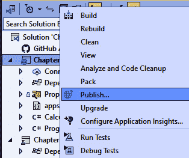

图 14.6：在 Visual Studio 的解决方案资源管理器中发布

如果您尚未设置任何发布配置文件，您将看到 **发布** 对话框。如果您没有看到这个对话框，那是因为您已经为另一个部署设置了发布配置文件。如果这种情况发生，您可以选择 **添加发布配置文件** 来打开 **发布** 对话框。

1.  一旦您看到 **发布** 对话框，请选择 **Azure**：

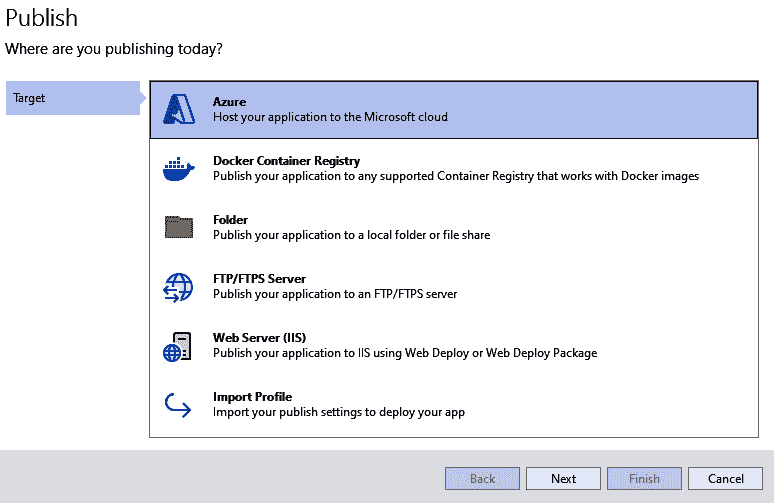

图 14.7：在 Visual Studio 中选择发布目标

1.  然后选择 **Azure App Service**，确保您选择了在 Azure 目标 App Service 上运行的正确操作系统（Windows 或 Linux）。

    下一个屏幕将要求您选择您的 Azure 订阅。如果您尚未登录 Azure，可以使用对话框右上角的选项进行连接。

1.  连接成功后，您应该在下拉菜单中看到您的 Azure 订阅，以及可部署到的可用 App Service 实例。选择您希望针对的服务，然后点击 **下一步**：


图 14.8：选择目标 Azure App Service 资源

1.  最后，系统会询问您是否希望使用 **.pubxml** 文件或通过 GitHub Actions 进行发布。本书不会涵盖像 GitHub Actions 这样的持续集成/持续交付管道，因此请选择 **发布**。

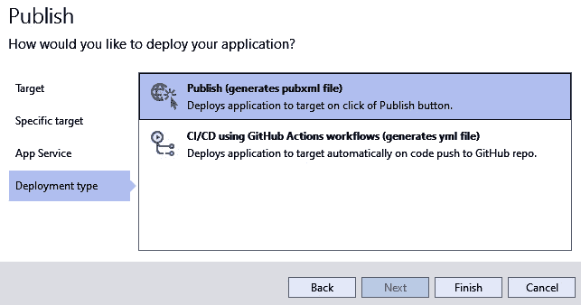

图 14.9：选择发布输出类型

完成此操作后，对话框将关闭，并创建新的发布配置文件。从那里，您可以查看和更改发布设置，例如您将发布什么配置（几乎总是 **发布**），框架（在我们的示例中是 .NET9），部署模式，是 **框架依赖** 还是 **自包含**（关于这一点将在下面详细介绍），以及目标运行时，在我的示例中是 **64 位 Linux**。

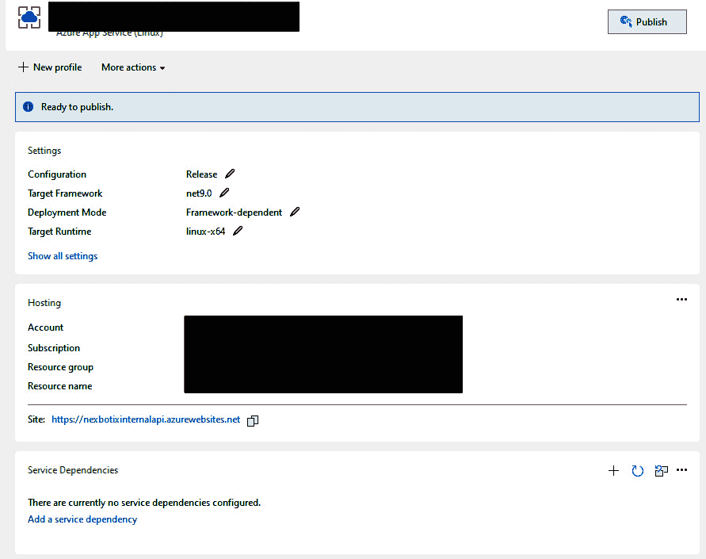

图 14.10：新创建的发布配置文件

执行此操作后，你的应用程序将在部署到目标 App Service 之前构建。完成后，Visual Studio 将自动打开浏览器窗口并导航到最小 API 的 URL。

框架依赖与自包含部署模式

你有两种部署模式选择。**框架依赖**要求在目标机器上安装 .NET 9（或你正在使用的任何版本）。**自包含**将运行时与应用程序打包在一起。前者生成更小的输出文件集，但缺点是需要在目标机器上安装特定的 .NET 版本，而后者输出文件更大，但目标机器对应用程序运行的要求更少，使其更便携。

接下来，让我们继续部署到 Docker 容器。

## 部署到 Docker 容器

ASP.NET 和 .NET Core 已经很好地定位了提供跨平台功能，但根据主机操作系统，配置上仍有细微的差异。使用 Docker 容器化你的最小 API 应用程序可以使它变得无差别，这意味着它不关心它在哪个操作系统上运行。

首先，你必须确保 Docker 已安装在你的系统上。有关此内容的文档可在[`docs.docker.com/engine/install/`](https://docs.docker.com/engine/install/)找到。对于 Windows，你需要安装 Docker Desktop，相关文档可在此处找到[`docs.docker.com/desktop/install/windows-install/`](https://docs.docker.com/desktop/install/windows-install/)，而对于 Linux，只需运行 Docker Engine 就足够了。

安装完成后，你需要创建一个 Dockerfile，该文件将描述你的最小 API 项目应该如何打包到 Docker 容器中，以及它应该如何在主机机器上运行。

你可以在 Visual Studio 中创建此文件，作为项目中的新项目：

1.  选择 **解决方案资源管理器**左上角的按钮以更改视图：

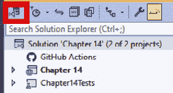

图 14.11：在解决方案资源管理器中更改视图选项

1.  选择 **文件夹视图**：

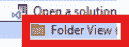

图 14.12：切换到文件夹视图

1.  然后，右键单击你的项目文件夹，选择 **添加** | **新建文件**。

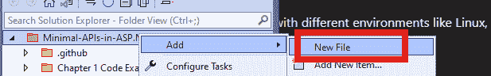

图 14.13：在文件夹视图中创建项目中的新文件

1.  Docker 文件没有名称，只有一个 **.dockerfile** 扩展名。创建此文件。然后它应该作为选项卡在 Visual Studio 中打开。（有报道称，如果 Docker 文件不命名为 **Dockerfile**，则可能无法正常工作，所以如果你遇到类似问题，可以尝试这样做。）

现在我们可以编写 Docker 文件。

首先，我们需要指定用于最小 API 应用程序运行时环境的基本镜像。我们可以像这样从微软的容器注册库拉取官方 .NET 9 ASP.NET 运行时镜像：

```cs
FROM mcr.microsoft.com/dotnet/aspnet:9.0 AS base
```

然后，我们可以告诉 Docker 我们想要将容器内的工作目录设置为**/app**，这样任何后续命令都将相对于此目录执行。我们还将指定我们希望容器上暴露端口**80**：

```cs
WORKDIR /app
EXPOSE 80
```

接下来，我们添加一个部分，下载所需的 .NET 9 SDK，这是编译最小 API 应用程序所需的全局运行时。然后我们再次设置工作目录，这次选择一个我们选择的文件夹；我们将选择**/src**。

之后，当前目录的整个内容被复制到容器内的**/src**目录中，以便进行构建，执行**dotnet restore**以添加所需的任何 NuGet 包作为依赖项，并将应用程序以发布模式编译到**/** **app**文件夹中：

```cs
FROM mcr.microsoft.com/dotnet/sdk:9.0 AS build
WORKDIR /src
COPY . .
RUN dotnet restore
RUN dotnet publish -c Release -o /app
```

在执行的这个阶段，容器已经被构建。最后，我们可以在 Dockerfile 中添加一个部分，通过复制容器组件并在编译后的 .NET 生成的 DLL 上运行来运行构建的容器：

```cs
FROM base AS final
WORKDIR /app
COPY --from=build /app .
ENTRYPOINT ["dotnet", "MyminimalAPIProject.dll"]
```

到目前为止，我们已经指定了容器镜像应该如何构建，但我们还没有触发构建。为此，打开从您的项目目录运行的控制台或命令提示符窗口，并运行以下命令，将**MYAPINAME**替换为合适的镜像名称：

```cs
docker build -t MYAPINAME .
```

在这个命令中，我们正在为正在构建的镜像创建一个带有给定名称的标签，然后我们使用**.**来表示镜像的构建上下文是 Dockerfile 所在的当前目录。

构建完成后，您可以运行容器以启动应用程序，该应用程序应该可以在您选择的端口上接收请求：

```cs
docker run -d -p 8080:80 --name MYCONTAINERNAME MYAPINAME
```

在这个命令中，我们已告诉 Docker 引擎以**-d**（分离模式）运行容器，这允许它在后台运行。然后我们使用**-p**指定容器上的端口**80**应映射到主机机器上的端口**8080**。这意味着您的最小 API 将在**http://localhost:8080**上可用。

最后，还有一种非常简单的方法可以使用：部署到内置的 Kestrel 网络服务器。

## 使用 Kestrel 在本地部署

如果您只想在 Windows 机器上将您的最小 API 作为 ASP.NET Core 应用程序托管，您可以创建一个新的发布配置文件，然后按照本章前面概述的 Visual Studio 中的发布配置文件向导进行操作。然而，不要选择 Azure 作为目标，而是选择**文件夹**。


图 14.14：选择文件夹作为发布目标

选择后，向导将要求您指定要部署到的目标文件夹。这个文件夹可以是本地的，也可以是远程服务器上的网络路径。

一旦发布，生成的**.EXE**文件可以双击运行，应用程序将使用默认监听端口**5000**的 Kestrel 网络服务器运行。

如果您想更改端口，您可以通过项目中的**appsettings.json**文件进行更改，添加以下内容（例如，更改为端口**8080**）：

```cs
"Kestrel": {
    "Endpoints": {
        "Http": {
            "Url": "http://*:8080"
        }
    }
}
```

我们探讨了如何为我们的最小 API 准备部署和最终用户消费的高级概述。现在，我们即将结束这次旅程。让我们总结一下在本章中我们学到了什么。

# 摘要

在本章中，我们探讨了准备最小 API 投入生产所需的必要步骤，重点关注测试、与.NET 9 的兼容性和部署策略。这些方面的每一个都在确保您的 API 健壮、兼容并无缝交付给最终用户中发挥着关键作用。

我们探讨了单元测试，它隔离和验证单个组件，以及集成测试，它确保系统的不同部分能正确协同工作。通过 xUnit 的实际示例，我们展示了如何设置和执行这些测试以验证功能和性能。关键要点是，彻底的测试——无论是通过单元测试还是集成测试——都有助于早期发现潜在问题，降低错误滑入生产的可能性，并确保您的 API 满足其验收标准。

与.NET 9 的兼容性对于保持最小 API 的长期性和效率至关重要。我们讨论了理解破坏性变化并相应调整代码库的重要性。通过关注 Microsoft 关于.NET 9 变化的文档，并利用单元和集成测试，您可以减轻任何破坏性变化的影响。这种主动方法确保您的 API 能够与最新的.NET 版本正确运行，并在迁移期间提供更平滑的过渡。

部署包括针对不同环境和需求定制的方法。我们介绍了部署到 Microsoft Azure App Service，它为云环境提供了一个简单、可扩展的解决方案。我们还探讨了使用 Docker 的容器化，提供了一种便携、跨平台的部署选项。对于本地部署，直接使用 Kestrel 运行最小 API 提供了一种简单有效的方法。每种部署方法都有自己的配置和考虑因素，例如在框架依赖和自包含部署之间进行选择，或管理容器端口和环境设置。

确保你的最小 API 经过良好的测试，与最新的.NET 版本兼容，并使用最合适的方法部署，这将使你能够交付高质量、可靠的软件。通过应用本章中概述的实践，你为 API 的成功部署和长期维护奠定了坚实的基础，这有助于即时的运营成功和未来的可扩展性。

我们现在已经到达了最小 API 之旅的终点，随着本书的结束，我希望你已经对如何在各种用例中创建最小 API 有了坚实的理解，并且你发现这个过程是愉快的。

对于一个热衷于在不同用例和环境中使用最小 API 的人来说，写作这本书是一种乐趣。API 对于几乎所有现代软件系统都至关重要，我认为对最小 API 及其优势的良好了解将使任何.NET 开发者在他们的编程生涯中占据优势。

感谢阅读。现在去构建更多最小 API 吧！
