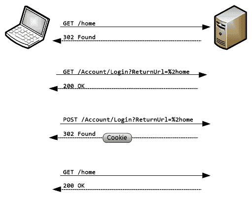
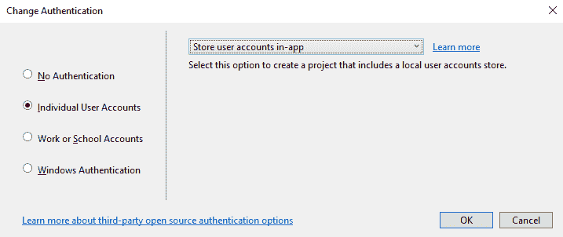
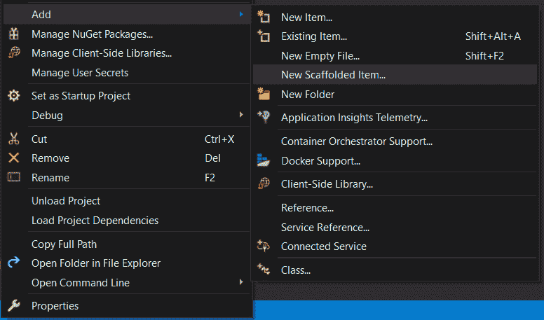
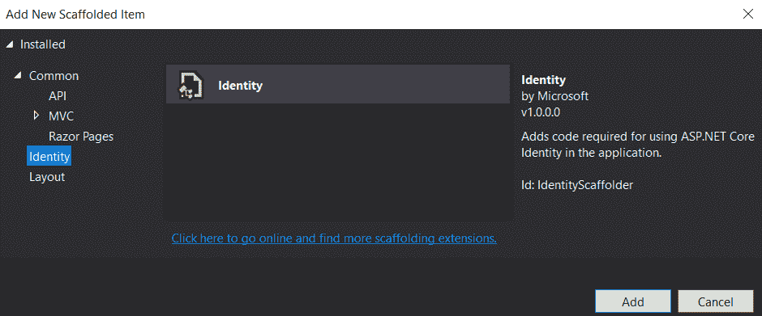
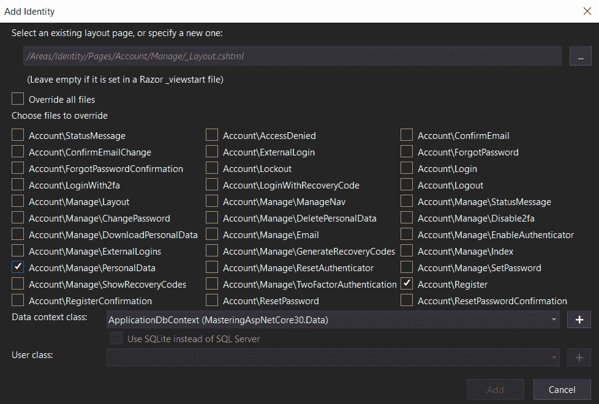
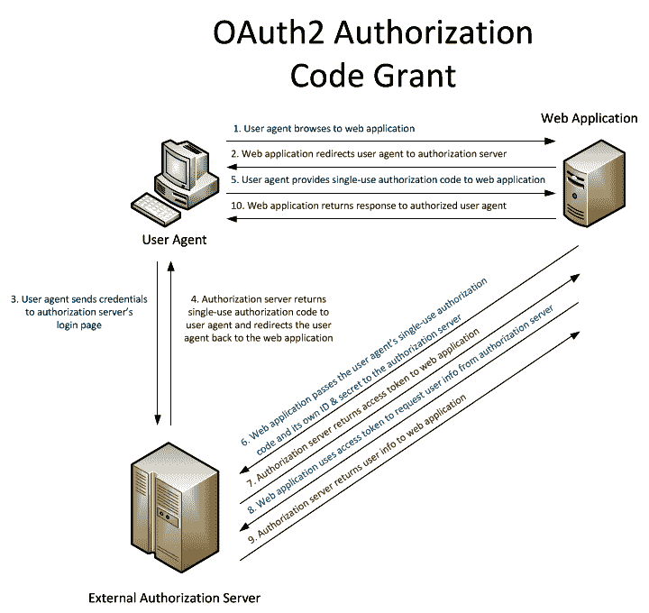
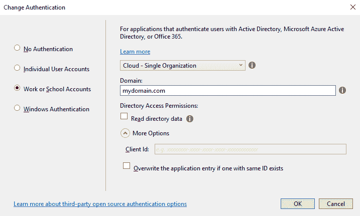
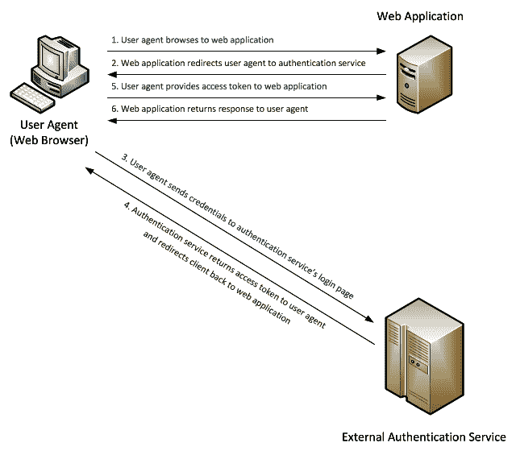
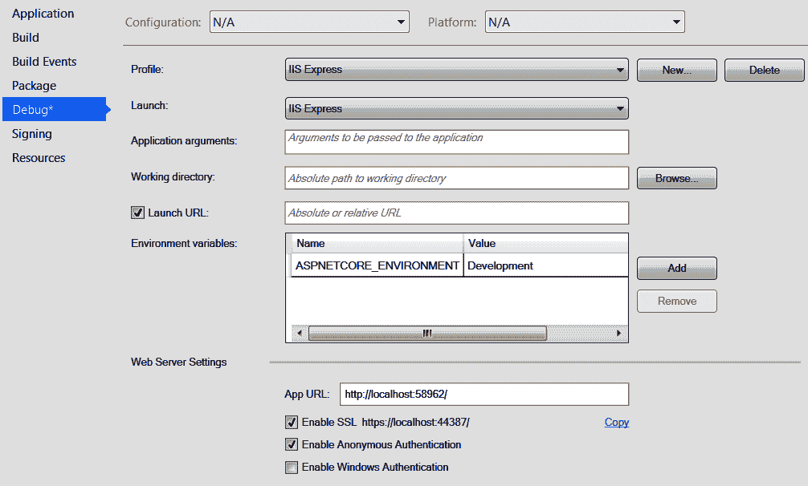

# 十一、安全

安全是当今非常热门的话题；没有一家公司能够像最近这样暴露客户的数据，这是非常不幸的。安全不仅仅是数据；它涵盖了很多方面。这不仅仅是限制对网站或其特定部分的访问；它是关于防止上传恶意内容、存储配置（和其他）数据、允许访问特定来源的脚本，以及最重要的是，创建客户端和服务器之间通信的安全通道。

阅读本章后，您将对围绕 ASP.NET Core 应用的安全性的许多方面有很好的理解。

本章将介绍以下主题：

*   验证用户
*   授权请求
*   检查伪造请求
*   应用**超文本标记语言**（**HTML**编码
*   使用**超文本传输协议安全**（**HTTPS**）
*   理解**跨源资源共享**（**CORS**）
*   使用数据保护
*   保护静态文件
*   应用**HTTP 严格传输安全**（**HSTS**）
*   了解**通用数据保护条例**（**GDPR**）
*   绑定安全

我们将从两个主题开始：**认证**-谁是谁；和**授权**-谁能做什么。这些是任何安全 web 应用的构建块。让我们在以下各节中逐一研究。

# 技术要求

为了实现本章介绍的示例，您需要.NET Core 3**软件开发工具包**（**SDK**和某种形式的文本编辑器。当然，VisualStudio2019（任何版本）满足所有要求，但您也可以使用 VisualStudio 代码。

源代码可以在这里从 GitHub 检索：[https://github.com/PacktPublishing/Modern-Web-Development-with-ASP.NET-Core-3-Second-Edition](https://github.com/PacktPublishing/Modern-Web-Development-with-ASP.NET-Core-3-Second-Edition) 。

# 验证用户

**认证**是你告诉你的申请者你是谁的过程；从这一刻起，应用至少会了解您一段时间。

身份验证与身份验证不同，尽管它与授权有关。如果您有需要授权才能访问的资源，则可能需要身份验证。

一般授权流程如下所示：

1.  有人请求访问受保护的资源。
2.  框架检查用户是否未经授权，并将其重定向到登录页面，并发出`302`代码。这是挑战阶段。
3.  用户提供其凭据。
4.  检查凭证，如果凭证有效，用户将被引导到请求的资源（`HTTP 302`），并使用 cookie（通常）将其标识为已登录。
5.  否则，框架将重定向到失败的登录页面。
6.  现在已授予对受保护资源的访问权限。

以下屏幕截图描述了客户端浏览器和应用之间的 HTTP 流：



Image taken from https://docs.microsoft.com/en-us/aspnet/web-api/overview/security/basic-authentication

在 ASP.NET Core 中，我们使用`[Authorize]`属性或某种形式的过滤器来限制对资源的访问，无论是通过整个控制器还是通过某些特定的操作方法，如以下代码片段所示：

```cs
//whole controller is protected
[Authorize]
public class AdminController { }

public class SearchController
{
    //only this method is restricted
    [Authorize]
    public IActionResult Admin() { ... }
}
```

除此之外，当我们试图访问其中一个资源时，我们将得到一个`401 Unauthorized`错误代码。我们需要的是某种形式的中间件，它能够拦截错误代码并相应地进行处理。

下一节仅与 Windows 开发人员相关。我们将首先了解 Windows 的授权工作原理。

## 使用索赔

现代身份验证和授权使用声明的概念来存储登录用户将有权访问的信息。例如，这将包括角色，但它可以是身份验证提供商（Windows 或第三方）指定的任何其他信息。

在.NET Core 中，所有身份信息都可用的根类是`ClaimsPrincipal`。`HttpContext`类中提供了对当前标识的引用，如`HttpContext.User`。在其中，我们可以找到三个重要属性，具体如下：

*   `Identity`（`IIdentity`：与当前登录用户关联的主标识
*   `Identities`（`IEnumerable<ClaimsIdentity>`：与当前登录用户关联的身份集合；它通常只包含一个标识
*   `Claims`（`IEnumerable<Claim>`：与当前登录用户关联的索赔的集合

`Identity`属性包含以下内容：

*   `Name`（`string`：登录用户的姓名，如有
*   `IsAuthenticated`（`bool`：当前用户是否经过身份验证
*   `AuthenticationType`（`string`：当前认证类型，如果使用

不要忘记，正如我们将看到的，我们可以在同一个应用上使用多种身份验证类型，每种类型都有不同的名称，用户将根据其中一种类型进行身份验证。

对于`Claims`类，一个典型的索赔集合可能包含以下索赔类型，这些类型将映射到`Claim`类的`Type`属性：

*   `ClaimTypes.Authentication`
*   `ClaimTypes.Country`
*   `ClaimTypes.DateOfBirth`
*   `ClaimTypes.Email`
*   `ClaimTypes.Gender`
*   `ClaimTypes.GivenName`
*   `ClaimTypes.HomePhone`

*   `ClaimTypes.MobilePhone`
*   `ClaimTypes.Name`
*   `ClaimTypes.Role`
*   `ClaimTypes.Surname`
*   `ClaimTypes.WindowsAccountName`

但是，这将取决于身份验证提供程序。实际上有更多的标准化声明，正如您从`ClaimTypes`类中看到的，但是没有任何东西阻止任何人添加他们自己的声明。请记住，一般来说，索赔并不意味着什么，但也有一些例外：`Name`和`Role`可用于安全检查，我们稍后将看到。

因此，`Claim`类具有以下主要属性：

*   `Issuer``string`：索赔人
*   `Type`（`string`）：权利要求的类型通常是`ClaimTypes`中的一种，但也可能是其他类型
*   `Value`（`string`：索赔的价值

让我们从讨论 Windows 身份验证开始讨论身份验证。

## Windows 身份验证

ASP.NET Core 不受平台影响，因此不支持 Windows 身份验证。如果我们确实需要的话，可能实现这一点的最佳方法是使用**Internet Information Server**（**IIS**）/IIS Express 作为**反向代理**，处理所有请求并将它们定向到 ASP.NET Core。

对于 IIS Express，我们需要在项目的`Properties\launchSettings.json`文件中配置启动设置如下，更改为**粗体**：

```cs
"iisSettings": {
 "windowsAuthentication": true, "anonymousAuthentication": false,  "iisExpress": {
    "applicationUrl": "http://localhost:5000/",
    "sslPort": 0
  }
}
```

对于 IIS，我们需要确保我们的网站启用了`AspNetCoreModule`。

在任何情况下，我们都需要在`ConfigureServices`方法中配置 Windows 身份验证，如下所示：

```cs
services.AddAuthentication(IISDefaults.AuthenticationScheme);
```

最后，`AspNetCoreModule`使用了 ASP.NET Core 本身不需要或不使用的`Web.config`文件；它用于部署，包括以下内容：

```cs
<?xml version="1.0" encoding="utf-8"?>
 <configuration>
     <system.webServer>
         <aspNetCore forwardWindowsAuthToken="true" 
          processPath="%LAUNCHER_PATH%" 
             arguments="%LAUNCHER_ARGS%" />
         <handlers>
             <add name="aspNetCore" path="*" verb="*" 
              modules="AspNetCoreModule" 
                 resourceType="Unspecified" />
         </handlers>
     </system.webServer>
 </configuration>
```

就这样。`[Authorize]`属性将要求经过身份验证的用户，并且将对 Windows 身份验证感到满意。`HttpContext.User`将被设置为`WindowsPrincipal`的一个实例，`ClaimsPrincipal`的一个子集，任何 Windows 组都可以作为角色和声明使用（`ClaimTypes.Role`。Windows 名称将以`domain\user`的形式设置在`ClaimsIdentity.Name`中。

在要获取当前 Windows 身份验证的任何位置，都可以使用以下代码：

```cs
var identity = WindowsIdentity.GetCurrent();
```

此外，例如，如果您想知道当前用户是否属于特定角色，例如内置管理员，则可以使用以下代码：

```cs
var principal = new WindowsPrincipal(identity);
var isAdmin = principal.IsInRole(WindowsBuiltInRole.Administrator);
```

如果当前用户是 Windows 内置管理员组的一部分，则此代码将返回`true`。

Don't forget that, although this code will compile on any platform, you can only use Windows authentication on Windows. You can check that by using `System.Runtime.InteropServices.RuntimeInformation.IsOSPlatform(System.Runtime.InteropServices.OSPlatform.Windows)`.

接下来，让我们看看如何为所有非 Windows 开发人员烘焙我们自己的身份验证机制。

## 自定义身份验证

ASP.NET Core 不包括任何身份验证提供程序，这与以前版本的 ASP.NET 不同，ASP.NET 支持 Windows 和基于**结构化查询语言**（**SQL**）的身份验证提供程序。这意味着我们必须手动或不完全地实现所有内容，稍后我们将看到这一点。

注册服务的方式为`AddAuthentication`，后面可以跟`AddCookie`，如下代码所示：

```cs
services
    .AddAuthentication(CookieAuthenticationDefaults.AuthenticationScheme)    
    .AddCookie(CookieAuthenticationDefaults.AuthenticationScheme, options 
=>
    {
        options.LoginPath = "/Account/Login/";
        options.AccessDeniedPath = "/Account/Forbidden/";
        options.LogoutPath = "/Account/Logout";
        options.ReturnUrlParameter = "ReturnUrl";
    });
```

我们在`Configure`中增加`UseAuthentication`方法，如下：

```cs
app.UseAuthentication();
```

`AccountController`的变化很小，我们必须调用`HttpContext`实例上的`SignInAsync`和`SignOutAsync`扩展方法，而不是调用`HttpContext.Authorization`中的**旧**版本，如下代码块所示：

```cs
[HttpPost]
[AllowAnonymous]
public async Task<IActionResult> PerformLogin(string username, string password, string returnUrl, 
    bool isPersistent)
{
    //...check validity of credentials
    await this.HttpContext.SignInAsync(CookieAuthenticationDefaults.
    AuthenticationScheme, new ClaimsPrincipal(user), new 
    AuthenticationProperties { IsPersistent = isPersistent });
    return this.LocalRedirect(returnUrl);
}

[HttpGet]
public async Task<IActionResult> Logout()
{
    await this.HttpContext.SignOutAsync(CookieAuthenticationDefaults
    .AuthenticationScheme);
    //...
}
```

在使用这些新方法之前，为`Microsoft.AspNetCore.Authentication`名称空间添加一个`using`语句。

最小登录页面（`Views/Account/Login`可能如下所示：

```cs
using (Html.BeginForm(nameof(AccountController.PerformLogin), "Account", FormMethod.Post))
{
    <fieldset>
        <p>Username:</p>
        <p><input type="text" name="username" /></p>
        <p>Password:</p>
        <p><input type="password" name="password" /></p>
        <p>Remember me: <input type="checkbox" name="isPersistent" 
        value="true" /></p>
        <input type="hidden" name="ReturnUrl" value="@Context.Request.
        Query["ReturnUrl"]"/>
        <button>Login</button>
    </fieldset>
}
```

与实现我们自己的身份验证机制不同，使用现有的和完善的身份验证机制通常更方便，这正是我们接下来要讨论的。

### 身份

因为您不必自己处理低级身份验证，所以有许多包可以帮助您完成这项任务。微软推荐的是**微软身份**（[http://github.com/aspnet/identity](https://github.com/aspnet/Identity) [。](https://github.com/aspnet/Identity)

Identity 是一个可扩展的库，用于进行用户名密码身份验证和存储用户属性。它是模块化的，默认情况下，它使用**实体框架**（**EF**核心进行数据存储持久化。当然，因为 EF 本身是非常可扩展的，所以它可以使用它的任何数据提供程序（SQLServer、SQLite、Redis 等等）。用于 Identity with EF Core 的 NuGet 软件包有`Microsoft.AspNetCore.Identity.EntityFrameworkCore`、`Microsoft.EntityFrameworkCore.Tools`和`Microsoft.AspNetCore.Diagnostics.EntityFramework`，如果我们选择通过个人用户帐户进行身份验证，您还应该知道，默认情况下，Identity 是通过 Visual Studio 模板为*ASP.NET Core Web 应用*安装的。以下屏幕截图显示了 Visual Studio 屏幕，我们可以在其中选择身份验证方法：



标识同时支持用户属性和角色。为了使用 Identity，我们首先需要注册其服务，如下所示：

```cs
services
    .AddDbContext<ApplicationDbContext>(options => 
        options.UseSqlServer(this.Configuration.
        GetConnectionString("DefaultConnection")))
    .AddDefaultIdentity<IdentityUser>(options => options.SignIn.
     RequireConfirmedAccount = false)
    .AddEntityFrameworkStores<ApplicationDbContext>();
```

无论如何，请将配置中的连接字符串键（`Data:DefaultConnection:ConnectionString`）替换为最适合您的键，并确保它指向有效的配置值。

它将是这样的：

```cs
"ConnectionStrings": {
    "DefaultConnection": "Server=(localdb)\\mssqllocaldb;
    Database=aspnet-chapter07-2AF3F755-0DFD-4E20-BBA4-9B9C3F56378B;
    Trusted_Connection=True;MultipleActiveResultSets=true"
},
```

当涉及到安全性时，Identity 支持大量选项；这些可以在调用`AddDefaultIdentity`时配置，如下所示：

```cs
services.AddDefaultIdentity<IdentityUser>(options =>
{
    options.SignIn.RequireConfirmedAccount = false;
    options.Password.RequireDigit = false;
    options.Password.RequireLowercase = false;
    options.Password.RequiredUniqueChars = 0;
    options.Password.RequiredLength = 0;
    options.Password.RequireNonAlphanumeric = false;
    options.Password.RequireUppercase = false;

    options.Lockout.DefaultLockoutTimeSpan = TimeSpan.FromMinutes(30); 
    options.Lockout.MaxFailedAccessAttempts = 10;
});

```

此示例为登录设置了许多选项，例如禁用电子邮件确认、简化密码要求以及设置超时和失败登录尝试次数。我不会详细介绍所有可用的选项；请参考身份网站了解全貌：[https://docs.microsoft.com/en-us/aspnet/core/security/authentication/identity](https://docs.microsoft.com/en-us/aspnet/core/security/authentication/identity)

如果需要更改路径和 cookie 选项，则需要使用`ConfigureApplicationCookie`，如下例：

```cs
services.ConfigureApplicationCookie(options =>
{
    options.Cookie.HttpOnly = true;
    options.ExpireTimeSpan = TimeSpan.FromMinutes(20);
    options.SlidingExpiration = true;

    options.LoginPath = "/Account/Login";
    options.AccessDeniedPath = "/Account/Forbidden";
    options.LogoutPath = "/Account/Logout";
    options.ReturnUrlParameter = "ReturnUrl";
});
```

此简单示例将路径设置为与前面在“自定义身份验证”主题中提供的路径相同，并设置一些 cookie 属性，如下所示：

*   `HttpOnly`：要求发送 cookie 时设置`HttpOnly`标志（参见[https://owasp.org/www-community/HttpOnly](https://owasp.org/www-community/HttpOnly)
*   `ExpireTimeSpan`：认证 cookie 的持续时间
*   `SlidingExpiration`：将 cookie 到期时间设置为滑动，即每次访问应用时，cookie 到期时间将被更新相等的时间

身份注册码（本小节中列出的第一个代码）提到了`ApplicationDbContext`和`IdentityUser`类。当我们使用使用使用自定义身份验证的 Visual Studio 模板创建项目时，会自动添加这些类的框架，但我在此处添加它们以供参考，如下所示：

```cs
public class ApplicationDbContext : IdentityDbContext
{
    public ApplicationDbContext(DbContextOptions options) : base(options) { }
}
```

现在，这非常重要，您需要在使用 Identity 之前创建数据库。为此，打开`Package Manager Console`并运行以下命令：

```cs
Add-Migration "Initial"
Update-Database
```

在此之后，我们可以向模型添加一些附加属性。

#### 添加自定义属性

正如你所看到的，这里没有什么特别的东西。唯一值得一提的是，您可以将自己的自定义属性添加到`IdentityUser`和`IdentityRole`类中，这些属性将作为登录过程的一部分进行持久化和检索。你为什么要这么做？因为这些基类不包含任何有用的属性，所以只包含用户名、电子邮件和电话（对于用户）以及角色名。这些类分别映射一个用户和一个角色，其中一个用户可以有一个角色，而每个角色可以有多个与其关联的用户。您只需要创建新类并让上下文使用它们，如以下代码块所示：

```cs
public class ApplicationUser : IdentityUser
{
    public ApplicationUser() {}
    public ApplicationUser(string userName) : base(userName) {}

    //add other properties here, with public getters and setters
    [PersonalData]
    [MaxLength(50)]
    public string FullName { get; set; }
    [PersonalData]
    public DateTime? Birthday { get; set; }
}

public class ApplicationRole : IdentityRole
{
    public ApplicationRole() {}
    public ApplicationRole(string roleName) : base(roleName) {}

    //add other properties here, with public getters and setters
}
```

请注意`[PersonalData]`属性，该属性用于标记正在添加的新属性：这是一个要求，因此它可以自动下载和删除。这是**GDPR**的要求，将在本章后面讨论。如果你不在乎它，你可以忽略它。

You can add validation attributes to this model.

您还需要修改上下文以使用新属性，如下所示：

```cs
public class ApplicationDbContext : IdentityDbContext<ApplicationUser, ApplicationRole, string>
{
    public ApplicationDbContext(DbContextOptions options) : base(options) {}
}
```

名称`ApplicationUser`和`ApplicationRole`是身份和角色数据自定义类的典型名称。请注意`ApplicationDbContext`的三个通用参数：标识用户和角色的类型，以及主键的类型，即`string`。

您还必须更改`Startup`类中的注册码以引用新的 Identity user 类，如下所示：

```cs
services
    .AddDefaultIdentity<ApplicationUser>(options =>
    {
        //...
    });
```

最后，我们必须在 Visual Studio（`Package Manager Console`中创建迁移并更新数据库以反映更改，如下所示：

```cs
Add-Migration "PersonalData"
Update-Database
```

或者，我们可以从命令行执行此操作，如下所示：

```cs
dotnet ef migrations add PersonalData
dotnet ef database update
```

当然，如果我们有自定义数据，我们还需要更新注册表，使其包含新属性。

#### 更新用户界面

幸运的是，ASP.NET Core 标识完全支持这一点：可以提供全部或部分表单，它们将替换提供的表单！

右键单击 web 项目并选择“新建脚手架项目…”，如以下屏幕截图所示：



然后，在它之后，选择 Identity，如以下屏幕截图所示：



然后，我们可以选择在当前项目中覆盖哪些页面，如以下屏幕截图所示：



请注意，您必须选择要使用的上下文（`DbContext`-派生类）。默认情况下，将在新文件夹`Areas/Identity`下创建文件，该文件夹将对应于**模型视图控制器**（**MVC**区域。这些页面本身就是剃刀页面，这意味着它们不使用控制器，但它们使用代码隐藏文件（一个`.cshtml`和一个`.cshtml.cs`文件）。

因此，如果您按照我的示例，将`FullName`和`Birthday`属性添加到`ApplicationUser`类中，并为账户注册生成页面，我们需要将它们添加到`Areas/Identity/Pages/Account/Manage/Register.cshtml`文件中（粗体更改），如下所示：

```cs
...
<div asp-validation-summary="All" class="text-danger"></div>
<div class="form-group">
    <label asp-for="Input.FullName"></label>
    <input asp-for="Input.FullName" class="form-control" />
    <span asp-validation-for="Input.FullName" class="text-danger"></span>
</div>
<div class="form-group">
    <label asp-for="Input.Birthday"></label>
    <input type="date" asp-for="Input.Birthday" class="form-control" />
    <span asp-validation-for="Input.Birthday" class="text-danger"></span>
</div>
<div class="form-group">
  <label asp-for="Input.Email"></label>
    <input asp-for="Input.Email" class="form-control" />
    <span asp-validation-for="Input.Email" class="text-danger"></span>
</div>
...
```

在`Register.cshtml.cs`中，我们需要添加代码来持久化数据，如下所示：

```cs
...
[BindProperty]
public InputModel Input { get; set; }

public class InputModel
{
    [Display(Name = "Full Name")]
    [DataType(DataType.Text)]
    [MaxLength(50)]
 public string FullName { get; set; }

 [Display(Name = "Birthday")]    [DataType(DataType.Date)]
 public DateTime? Birthday { get; set; } 
    [Required]
    [EmailAddress]
    [Display(Name = "Email")]
    public string Email { get; set; } 
    ...
}

public async Task<IActionResult> OnPostAsync(string returnUrl = null)
{
    returnUrl = returnUrl ?? Url.Content("~/");

    if (ModelState.IsValid)
    {
        var user = new ApplicationUser { UserName = Input.Email,
            Email = Input.Email, 
            Birthday = Input.Birthday, FullName = Input.FullName };
        var result = await _userManager.CreateAsync(user, Input.Password);
    ...
}
...
```

本质上，我们只是将新属性添加到`InputModel`，它只是一个**普通的旧 CLR 对象**（**POCO**）类，用于绑定表单数据，并从那里添加到`ApplicationUser`类，然后传递到`CreateAsync`方法。

#### 使用身份提供程序

现在，继续上一个身份验证示例，让我们看看它与标识的关系：

```cs
public class AccountController : Controller
{
    private readonly IOptions<IdentityOptions> _options;
    private readonly UserManager<ApplicationUser> _userManager;
    private readonly RoleManager<ApplicationRole> _roleManager;
    private readonly SignInManager<ApplicationUser> _signInManager;

    public AccountController(
        IOptions<IdentityOptions> options,
        UserManager<ApplicationUser> userManager, 
        RoleManager<ApplicationRole> roleManager, 
        SignInManager<ApplicationUser> signInManager)
    {
        this._options = options;
        this._signInManager = signInManager;
        this._userManager = userManager;
        this._roleManager = roleManager;
    }

    [HttpPost]
    [AllowAnonymous]
    public async Task<IActionResult> PerformLogin(string username,
    string password, string returnUrl)
    {
        var result = await this._signInManager.PasswordSignInAsync
        (username, password, 
            isPersistent: true,
            lockoutOnFailure: false);

        if (result.Succeeded)
        {
            return this.LocalRedirect(returnUrl);
        }
        else if (result.IsLockedOut)
        {
            this.ModelState.AddModelError("User", "User is locked out");
            return this.View("Login");
        }

        return this.Redirect(this._options.Value.Cookies.
        ApplicationCookie.AccessDeniedPath);
    }

    [HttpGet]
    public async Task<IActionResult> Logout()
    {
        await this._signInManager.SignOutAsync();
        return this.RedirectToRoute("Default");
    }

    private async Task<ApplicationUser> GetCurrentUserAsync()
    {
        //the current user properties
        return await this._userManager.GetUserAsync
        (this.HttpContext.User);
    }

    private async Task<ApplicationRole> GetUserRoleAsync(string id)
    {
        //the role for the given user
        return await this._roleManager.FindByIdAsync(id);
    }
}
```

用于管理身份验证过程的类有`UserManager<T>`、`SignInManager<T>`和`RoleManager<T>`，这些类都是泛型的，以具体身份用户或身份角色类作为参数。这些类通过对`AddDefaultIdentity`的调用注册到**依赖项注入**（**DI**框架中，因此可以在任何需要它们的地方注入。对于记录，调用`AddDefaultIdentity`与添加以下服务相同：

```cs
services
    .AddIdentity()              //adds core functionality
    .AddDefaultUI()             //adds self-contained Razor Pages UI in 
                                // an area called /Identity
    .AddDefaultTokenProviders(); //for generating tokens for new 
                                // passwords, resetting operations
```

我们调用`UserManager<T>`类的以下三种方法：

*   `PasswordSignInAsync`：实际验证用户名和密码，返回用户状态的方法；可选地，它将 cookie 设置为持久性（`isPersistent`），这意味着用户将在一段时间内保持身份验证，如配置设置中所指定，并且还指示在多次尝试失败的情况下是否锁定用户（`lockoutOnFailure`）——同样，可配置。
*   `SignOutAsync`：通过设置身份验证 cookie 的过期时间来注销当前用户
*   `RefreshSignInAsync`：通过延长认证 cookie 的到期时间来刷新认证 cookie（此处未显示）

`UserManager<T>`类公开了一些有用的方法，如下所示：

*   `GetUserAsync`：检索当前用户的数据（或者`IdentityUser`或者子类）
*   `CreateAsync`：创建用户（此处未显示）
*   `UpdateAsync`：更新用户（此处未显示）
*   `DeleteAsync`：删除用户（此处未显示）
*   `AddClaimAsync/RemoveClaimAsync`：向用户添加/删除索赔（此处未显示）
*   `AddToRoleAsync/RemoveFromRoleAsync`：在角色中添加/删除用户（此处未显示）

*   `ConfirmEmailAsync`：为最近创建的用户确认电子邮件（此处未显示）
*   `FindByEmailAsync`/`FindByIdAsync`/`FindByNameAsync`：尝试通过电子邮件/ID/姓名查找用户（此处未显示）

对于`RoleManager<T>`，它在这里的唯一用途是通过`FindByIdAsync`方法（此处未显示）检索当前用户的角色（`IdentityRole`-派生）。

正如您所看到的，该代码与前面的代码非常相似，但这只是一个玩笑，因为 Identity 支持许多其他功能，包括以下功能：

*   用户注册，包括电子邮件激活码
*   为用户分配角色
*   多次登录尝试失败后帐户锁定
*   双因素认证
*   密码检索
*   外部身份验证提供程序

有关更多信息，请咨询身份网站：[https://www.asp.net/identity](https://www.asp.net/identity)

现在，让我们来看一个非常流行的服务器，用于集成数据源并向多个客户端提供身份验证请求。

### 使用 IdentityServer

**IdentityServer**是针对 ASP.NET 的**OpenID Connect**和**OAuth 2.0**协议的开源实现。我们感兴趣的版本**IdentityServer4**是专门为 ASP.NET Core 设计的；其源代码可在[上获得 https://github.com/IdentityServer/IdentityServer4](https://github.com/IdentityServer/IdentityServer4) 及其文件位于[http://docs.identityserver.io/](http://docs.identityserver.io/) 。它非常流行，事实上，它是微软推荐的服务联合和**单点登录**（**SSO**的实现。

这是用于授予对资源访问权限的 OAuth 2.0 流程：



Image taken from https://docs.microsoft.com/en-us/aspnet/web-api/overview/security/external-authentication-services

粗略地说，IdentityServer 可以作为服务用于身份验证，这意味着它可以接受身份验证请求，根据任意数量的数据存储验证请求，并授予访问令牌。

我们将不深入讨论设置 IdentityServer 的细节，因为它可能非常复杂，并且具有大量的功能。我们感兴趣的是如何使用它对用户进行身份验证。为此，我们需要`Microsoft.AspNetCore.Authentication.OpenIdConnect`和`IdentityServer4.AccessTokenValidation`NuGet 包。

我们在`ConfigureServices`方法中设置了所有配置，如下代码块所示：

```cs
services.AddCookieAuthentication(CookieAuthenticationDefaults.AuthenticationScheme);

services.AddOpenIdConnectAuthentication(options =>
{
    options.ClientId = "MasteringAspNetCore";
    //change the IdentityServer4 URL
    options.Authority = "https://servername:5000";
    //uncomment the next line if not using HTTPS
    //options.RequireHttpsMetadata = false;
});
```

然后，在`Configure`中添加认证中间件，如下所示：

```cs
JwtSecurityTokenHandler.DefaultInboundClaimTypeMap.Clear();

app.UseAuthentication();
```

这两行将首先删除**JSON Web 令牌**（**JWT**的声明映射，然后添加认证中间件。

For additional information, consult the wiki article at [https://social.technet.microsoft.com/wiki/contents/articles/37169.secure-your-netcore-web-applications-using-identityserver-4.aspx](https://social.technet.microsoft.com/wiki/contents/articles/37169.secure-your-netcore-web-applications-using-identityserver-4.aspx) and the IdentityServer Identity documentation at [http://docs.identityserver.io/en/release/quickstarts/6_aspnet_identity.html](http://docs.identityserver.io/en/release/quickstarts/6_aspnet_identity.html).

以下各节介绍针对第三方提供商的身份验证。

### 使用 Azure Active Directory

随着一切都转移到云上，ASP.NET Core 也支持使用**Azure Active Directory**（**Azure AD**进行身份验证也就不足为奇了。创建新项目时，您可以选择工作或学校帐户进行身份验证，然后输入 Azure 云的详细信息，如以下屏幕截图所示：



You must enter a valid domain!

实际上，向导将以下两个 NuGet 包添加到项目`Microsoft.AspNetCore.Authentication.Cookies`和`Microsoft.AspNetCore.Authentication.OpenIdConnect`（Azure 身份验证基于 OpenID）。它还将以下条目添加到`appsettings.json`配置文件中：

```cs
"Authentication": {
  "AzureAd": {
    "AADInstance": "https://login.microsoftonline.com/",
    "CallbackPath": "/signin-oidc",
    "ClientId": "<client id>",
    "Domain": "mydomain.com",
    "TenantId": "<tenant id>"
  }
}
```

身份验证使用 cookies，因此在`ConfigureServices`方法中添加了类似的条目，如以下代码片段所示：

```cs
services.AddAuthentication(options =>
    options.SignInScheme = CookieAuthenticationDefaults
    .AuthenticationScheme
);
```

最后，OpenID 中间件被添加到`Configure`中的管道中，如下面的代码片段所示：

```cs
app.UseOpenIdConnectAuthentication(new OpenIdConnectOptions
{
    ClientId = this.Configuration["Authentication:AzureAd:ClientId"],
    Authority = this.Configuration["Authentication:AzureAd:AADInstance"] +   
            this.Configuration["Authentication:AzureAd:TenantId"],
    CallbackPath = this.Configuration["Authentication:AzureAd:
    CallbackPath"]
});
```

在`AccountController`类中登录（`SignIn`）、注销（`Logout`）和显示注销页面（`SignedOut`）的相关方法（来自本章开头的原始列表）如下代码块所示：

```cs
[HttpGet]
public async Task<IActionResult> Logout()
{
    var callbackUrl = this.Url.Action("SignedOut", "Account", 
        values: null, 
        protocol: this.Request.Scheme);
    return this.SignOut(new AuthenticationProperties {
    RedirectUri = callbackUrl },
        CookieAuthenticationDefaults.AuthenticationScheme,  
        OpenIdConnectDefaults.AuthenticationScheme);
}

[HttpGet]
public IActionResult SignedOut()
{
    return this.View();
}

[HttpGet]
public IActionResult SignIn()
{
    return this.Challenge(new AuthenticationProperties { RedirectUri = "/" }, 
        OpenIdConnectDefaults.AuthenticationScheme);
    });
}
```

现在，我们将了解如何使用知名社交网络应用作为应用的身份验证提供商。

### 使用社交登录

另一种自行保存和维护用户凭据的方法是使用第三方的身份验证信息，如社交网络应用。这是一个有趣的选项，因为您不需要用户完成帐户创建过程；您只需为此信任外部身份验证提供程序。

所有外部身份验证提供程序都遵循以下流程：



Image taken from https://docs.microsoft.com/en-us/aspnet/web-api/overview/security/external-authentication-services For more information, please consult [https://docs.microsoft.com/en-us/aspnet/core/security/authentication/social/](https://docs.microsoft.com/en-us/aspnet/core/security/authentication/social/)

该机制基于提供者，微软提供了许多提供者；您必须知道所有这些都依赖于标识，因此您需要首先配置它（`UseIdentity`。创建项目时，请确保选择使用身份验证并选择个人帐户。这将确保使用正确的模板，并且项目中存在所需的文件。让我们在接下来的部分中学习一些。

#### 脸谱网

**Facebook**其实并不需要介绍。其提供商可作为`Microsoft.AspNetCore.Authentication.Facebook`NuGet 包提供。您需要先在 Facebook 上创建一个开发者帐户，然后在`Configure`方法中注册提供商时使用应用 ID 和用户密码，如下所示：

```cs
app.UseFacebookAuthentication(new FacebookOptions()
{
    AppId = Configuration["Authentication:Facebook:AppId"],
    AppSecret = Configuration["Authentication:Facebook:AppSecret"]
});
```

Facebook login details are available here: [https://docs.microsoft.com/en-us/aspnet/core/security/authentication/social/facebook-logins](https://docs.microsoft.com/en-us/aspnet/core/security/authentication/social/facebook-logins)

#### 啁啾

**推特**是另一个流行的社交网站，其提供商可作为`Microsoft.AspNetCore.Authentication.Twitter`NuGet 软件包提供。您还需要在 Twitter 开发者网站上注册您的应用。其配置如下所示：

```cs
app.UseTwitterAuthentication(new TwitterOptions()
{
    ConsumerKey = Configuration["Authentication:Twitter:ConsumerKey"],
    ConsumerSecret = Configuration["Authentication:Twitter:
    ConsumerSecret"]
});
```

Twitter login details are available here: [https://docs.microsoft.com/en-us/aspnet/core/security/authentication/social/twitter-logins](https://docs.microsoft.com/en-us/aspnet/core/security/authentication/social/twitter-logins).

#### 谷歌

**谷歌**提供商包含在`Microsoft.AspNetCore.Authentication.Google`NuGet 包中。同样，您需要创建一个开发者帐户，并事先注册您的应用。Google 提供程序的配置如下：

```cs
app.UseGoogleAuthentication(new GoogleOptions()
{
    ClientId = Configuration["Authentication:Google:ClientId"], 
    ClientSecret = Configuration["Authentication:Google:ClientSecret"]
});
```

For more information about the Google provider, please consult [https://docs.microsoft.com/en-us/aspnet/core/security/authentication/social/google-logins](https://docs.microsoft.com/en-us/aspnet/core/security/authentication/social/google-logins).

#### 微软

当然，**微软**为自己的认证服务提供了一个提供商；这包含在`Microsoft.AspNetCore.Authentication.MicrosoftAccount`NuGet 包中，配置如下：

```cs
app.UseMicrosoftAccountAuthentication(new MicrosoftAccountOptions()
{
    ClientId = Configuration["Authentication:Microsoft:ClientId"], 
    ClientSecret = Configuration["Authentication:Microsoft:ClientSecret"]
});
```

Go to [https://docs.microsoft.com/en-us/aspnet/core/security/authentication/social/microsoft-logins](https://docs.microsoft.com/en-us/aspnet/core/security/authentication/social/microsoft-logins) for more information.

所有这些机制都依赖于 cookie 来持久化身份验证，因此我们有必要稍微讨论一下 cookie 安全性。

## Cookie 安全性

`CookieAuthenticationOptions`类有几个属性可用于配置额外的安全性，如下所示：

*   `Cookie.HttpOnly`（`bool`：cookie 是否应该是 HTTP 唯一（参见[）https://www.owasp.org/index.php/HttpOnly](https://www.owasp.org/index.php/HttpOnly) ；默认值为`false`。如果未设置，则不发送`HttpOnly`标志。
*   `Cookie.Secure`（`CookieSecurePolicy`：cookie 是否应该只通过 HTTPS（`Always`）发送，始终（`None`），还是根据请求（`SameAsRequest`）发送，这是默认设置；如果未设置，则不发送`Secure`标志。
*   `Cookie.Path`（`string`：cookie 应用的可选路径；如果未设置，则默认为当前应用路径。
*   `Cookie.Domain`（`string`：cookie 的可选域；如果未设置，将使用站点的域。
*   `DataProtectionProvider`（`IDataProtectionProvider`：可选的数据保护提供者，用于对 cookie 值进行加密解密；默认为`null`。
*   `CookieManager`（`ICookieManager`）：可选的 cookie 存储区；例如，在应用之间共享 cookie 可能很有用（请参见[https://docs.microsoft.com/en-us/aspnet/core/security/data-protection/compatibility/cookie-sharing](https://docs.microsoft.com/en-us/aspnet/core/security/data-protection/compatibility/cookie-sharing) ）。
*   `IsEssential`（`bool`：就 GDPR 而言，cookie 是否重要（ss）。
*   `ClaimsIssuer`（`string`：谁发布了饼干的声明。
*   `ExpireTimeSpan`（`TimeSpan`：认证 cookie 的有效性。
*   `SlidingExpiration`（`bool`）：是否在每次请求时更新`ExpireTimeSpan`中指定的 cookie 的有效性（默认）。
*   `AccessDeniedPath`（`string`：质询阶段后，如果验证失败，浏览器将重定向到的路径。
*   `LoginPath`（`string`：如果需要验证，浏览器将重定向到的登录路径（质询阶段）。
*   `LogoutPath`（`string`）：注销路径，其中验证 cookie（以及其他内容）被清除。
*   `ReturnUrlParameter`（`string`）：查询字符串参数，质询阶段保留原**统一资源定位器**（**URL**）；默认为`ReturnURL`。

滑动过期意味着每次服务器接收到请求时，在过期中指定的时间段都将延长：返回具有相同名称的 cookie，其过期时间与覆盖前一个 cookie 的相同。

所有这些属性都在 Identity 中可用。为了设置值，您可以在`ConfigureServices`中调用`AddAuthentication`后，构建`CookieAuthenticationOptions`实例或使用`AddCookie`扩展方法中可用的委托，如下所示：

```cs
services
    .AddAuthentication()
    .AddCookie(options =>
    {
        //set global properties
        options.LoginPath = "/Account/Login";
        options.AccessDeniedPath = "/Account/Forbidden";
        options.LogoutPath = "/Account/Logout";
        options.ReturnUrlParameter = "ReturnUrl";
    });
```

The HTTP cookie specification is available at [https://tools.ietf.org/html/rfc6265](https://tools.ietf.org/html/rfc6265).

### 支持 SameSite cookies

**SameSite**是**征求意见**（**RFC**）6265 的扩展，称为 RFC 6265bis，定义 HTTP cookies，其目的是缓解**跨站点请求伪造**（**CSRF**）通过选择性地仅允许从同一站点上下文设置 cookie 进行攻击。例如，假设您的站点位于`www.abc.com`；那么，`dev.abc.com`也被认为是**同一站点**，而`xpto.com`被认为是**跨站点**。

SameSite 与其他 cookie 参数一起由浏览器发送，它有三个选项，如下所示：

*   `Strict`：只有当 cookie 的站点与当前在浏览器上查看的站点匹配时，才会发送 cookie。
*   `Lax`：仅当浏览器 URL 中的域与 cookie 的域匹配时，才会设置 cookie。
*   `None`：必须通过 HTTPS 发送

对于 Edge、FireFox 和 Chrome，默认值现在为`Lax`，这意味着第三方 cookie 现在被阻止。

SameSite 安全性可以在`CookieOptions`类上设置，这意味着当我们显式设置 cookie 时，它可以一起设置，或者当使用基于 cookie 的身份验证机制时，可以在`CookieAuthenticationOptions`上可用的 cookie 生成器上设置，如下代码所示：

```cs
services
    .AddAuthentication()
    .AddCookie(options =>
    {
        options.Cookie.SameSite = SameSiteMode.Strict;
    });
```

我们可以传递给`SameSite`的可能值如下：

*   `Lax`：客户端浏览器应发送具有相同站点和跨站点顶级请求的 cookie。
*   `None`：未对客户进行相同的现场验证。
*   `Strict`：客户端浏览器只发送具有相同站点请求的 cookie。
*   `Unspecified`：默认设置，由客户端浏览器指定。

在添加身份验证之前，我们不能忘记将 cookie 中间件添加到管道中，如下所示：

```cs
public void Configure(IApplicationBuilder app, IWebHostEnvironment env)
{
    app.UseCookiePolicy();
    app.UseAuthentication();
    //rest goes here
}
```

现在我们已经讨论了身份验证，也就是说，构建一个定制的身份验证提供者，并使用`IdentityServer`或社交网站进行身份验证和一些 cookie 安全性，让我们谈谈授权。

# 授权请求

在这里，我们将看到如何控制对应用部分的访问，无论是控制器还是更细粒度的应用。

因此，假设您想要将整个控制器或特定操作标记为需要身份验证。最简单的方法是向控制器类添加一个`[Authorize]`属性，就像这样。如果您试图访问受保护的控制器或资源，将返回一个`401 authorization Required`错误。

为了增加授权支持，我们必须在`UseAuthentication`调用之后向`Configure`方法添加所需的中间件，如下所示：

```cs
app.UseRouting();

app.UseCookiePolicy();
app.UseAuthentication();
app.UseAuthorization();

app.UseEndpoints(endpoints =>
{
    //...
});
```

不要忘记这个订单-`UseAuthorization`之前的`UseAuthentication`-这是强制性的！

以下各节描述了为 web 应用上的资源声明授权规则的不同方法。让我们从角色开始，这是定义用户组的常用方法。

## 基于角色的授权

如果我们想在授权过程中更进一步，我们可以请求仅当经过身份验证的用户处于给定角色时才能访问受保护的资源控制器或操作。角色只是声明，受任何身份验证机制的支持，如下所示：

```cs
[Authorize(Roles = "Admin")]
public IActionResult Admin() { ... }
```

可以指定多个角色，用逗号分隔。在以下情况下，如果当前用户至少担任其中一个角色，则将授予访问权限：

```cs
[Authorize(Roles = "Admin,Supervisor")]
```

如果您想通过代码知道当前用户是否属于特定角色，可以使用`ClaimsPrincipal`实例的`IsInRole`方法，如下面的代码片段所示：

```cs
var isAdmin = this.HttpContext.User.IsInRole("Admin");
```

如果当前用户是`Admin`组的成员，则返回`true`。

定义授权的另一种方法是通过策略，策略允许对权限进行更细粒度的控制。现在让我们看看这是怎么回事。

## 基于策略的授权

策略是一种更灵活的授权方式；在这里，我们可以使用我们想要的任何规则，而不仅仅是属于某个角色或正在验证的规则。

要使用策略，我们需要使用`[Authorize]`属性和`Policy`属性来修饰要保护的资源（控制器、操作），如下面的代码片段所示：

```cs
[Authorize(Policy = "EmployeeOnly")]
```

策略是通过`AddAuthorization`方法在`AuthorizationOptions`类中配置的，如下面的代码片段所示

```cs
services.AddAuthorization(options =>
{
    options.AddPolicy("EmployeeOnly", policy => policy.RequireClaim
    ("EmployeeNumber"));
});
```

这段代码要求当前用户具有特定的声明，但我们可以考虑其他示例，例如仅允许本地请求。`RequireAssertion`允许我们指定任意条件，如下代码块所示：

```cs
options.AddPolicy("LocalOnly", builder =>
{
    builder.RequireAssertion(ctx =>
    {
        var success = false;
        if (ctx.Resource is AuthorizationFilterContext mvcContext)
        {
            success = IPAddress.IsLoopback(mvcContext.HttpContext.
            Connection.RemoteIpAddress);
        }
        return success;
    });
});
```

注意，在这里，我们假设`Resource`属性是`AuthorizationFilterContext`。记住，只有在`[Authorize]`过滤器的上下文中，这才是真的；否则，情况就不会如此。

您还可以将策略用于特定声明（`RequireClaim`）或角色（`RequireRole`），用于身份验证（`RequireAuthenticatedUser`），甚至用于拥有特定用户名（`RequireUserName`），甚至可以将所有这些策略组合在一起，如下所示：

```cs
options.AddPolicy("Complex", builder =>
{
    //a specific username
    builder.RequireUserName("admin");
    //being authenticated
    builder.RequireAuthenticatedUser();
    //a claim (Claim) with any one of three options (A, B or C)
    builder.RequireClaim("Claim", "A", "B", "C");
    //any of of two roles
    builder.RequireRole("Admin", "Supervisor");
});
```

天空是您可以使用任何逻辑授予访问权限的限制。`Resource`属性原型为`object`，表示可以接受任何值；如果作为 MVC 授权过滤器的一部分调用，它将始终是`AuthorizationFilterContext`的一个实例。

现在我们来看一种将这些策略封装在可重用类中的方法。

## 授权处理程序

授权处理程序是在类中封装业务验证的一种方法。有一个由以下内容组成的授权 API：

*   `IAuthorizationService`：所有授权检查的入口点
*   `IAuthorizationHandler`：授权规则的实现
*   `IAuthorizationRequirement`：单一授权需求的合同，传递给授权处理人
*   `AuthorizationHandler<TRequirement>`：绑定到特定`IAuthorizationRequirement`的`IAuthorizationHandler`抽象基实现

我们实现了一个`IAuthorizationHandler`（可能是`AuthorizationHandler<TRequirement>`的子类），并在其中定义了我们的规则，如下所示：

```cs
public sealed class DayOfWeekAuthorizationHandler : AuthorizationHandler<DayOfWeekRequirement>
{
    protected override Task HandleRequirementAsync(
        AuthorizationHandlerContext context,
        DayOfWeekRequirement requirement)
    {
        if ((context.Resource is DayOfWeek requestedRequirement) && 
        (requestedRequirement == requirement.DayOfWeek))
        {
            context.Succeed(requirement);
        }
        else
        {
            context.Fail();
        }

        return Task.CompletedTask;
    }
}

public sealed class DayOfWeekRequirement : IAuthorizationRequirement
{
    public DayOfWeekRequirement(DayOfWeek dow)
    {
        this.DayOfWeek = dow;
    }

    public DayOfWeek DayOfWeek { get; }
}
```

此处理程序响应`DayOfWeekRequirement`类型的需求。当一个这样的需求被传递到`AuthorizeAsync`方法时，它会自动绑定到它。

授权管道可以接受许多需求，为了使授权成功，所有需求也必须成功。这是一个非常简单的示例，我们需要一周中的某一天，授权处理程序要么成功，要么失败，这取决于一周中的当前日期是否符合给定的要求。

`IAuthorizationService`类在 DI 框架中注册；默认实例为`DefaultAuthorizationService`。我们将使用以下代码启动权限检查：

```cs
IAuthorizationService authSvc = ...;

if (await (authSvc.AuthorizeAsync(
    user: this.User,
    resource: DateTime.Today.DayOfWeek,
    requirement: new DayOfWeekRequirement(DayOfWeek.Monday))).Succeeded)
) { ... }
```

授权处理程序还可以绑定到策略名称，如以下代码段所示：

```cs
services.AddAuthorization(options =>
{
    options.AddPolicy("DayOfWeek", builder =>
    {
        builder.AddRequirements(new DayOfWeekRequirement
        (DayOfWeek.Friday));
    });
});
```

在这种情况下，前一个调用将改为以下调用：

```cs
if ((await (authSvc.AuthorizeAsync(
    user: this.User,
    resource: DateTime.Today.DayOfWeek,
    policyName: "DayOfWeek"))).Succeeded)
) { ... }
```

这两个重载的参数如下所示：

*   `user`（`ClaimsPrincipal`：当前登录用户
*   `policyName`（`string`：已注册的保单名称
*   `resource`（`object`：将传递到授权管道的任何对象
*   `requirement`（`IAuthorizationRequirement`：将传递给授权处理程序的一个或多个需求

如果我们想要覆盖默认授权处理程序，我们可以在`ConfigureServices`中非常轻松地完成，如下所示：

```cs
services.AddSingleton<IAuthorizationHandler, DayOfWeekAuthorizationHandler>();
```

这将注册一个自定义授权处理程序，我们需要对其执行自己的检查。在替换默认处理程序时要小心，因为这可能很棘手，而且很容易忘记某些东西！

现在，如果我们需要使用上下文进行更复杂的验证，我们需要将其注入到处理程序中。以下示例将允许访问仅来自本地主机的请求：

```cs
public sealed class LocalIpRequirement : IAuthorizationRequirement
{
 public const string Name = "LocalIp";
}

public sealed class LocalIpHandler : AuthorizationHandler<LocalIpRequirement>
{
    public LocalIpHandler(IHttpContextAccessor httpContextAccessor)
    {
        this.HttpContext = httpContextAccessor.HttpContext;
    }

    public HttpContext HttpContext { get; }

    protected override Task HandleRequirementAsync(
        AuthorizationHandlerContext context, 
        LocalIpRequirement requirement)
    {
        var success = IPAddress.IsLoopback(this.HttpContext.Connection
        .RemoteIpAddress);

        if (success)
        {
            context.Succeed(requirement);
        }
        else
        {
            context.Fail();
        }

        return Task.CompletedTask;
    }
}
```

为此，我们需要执行以下操作：

1.  注册`IHttpContextAccessor`服务，如下：

```cs
services.AddHttpContextAccessor();
```

2.  将`LocalIpHandler`注册为作用域服务，如下所示：

```cs
services.AddScoped<IAuthorizationHandler, LocalIpHandler>();
```

3.  当我们想检查当前请求是否与策略匹配时，我们会这样做：

```cs
var result = await authSvc.AuthorizeAsync(
    user: this.User,
    requirement: new LocalIpRequirement(),
    policyName: LocalIpRequirement.Name
);

if (result.Succeeded) { ... }
```

我们应该很好。

现在，让我们来看一种查询定义为策略的当前权限的方法。

## 基于资源的授权

我们可以利用授权处理程序进行基于资源的授权。基本上，我们要求授权服务检查访问给定资源和策略的权限。我们调用`IAuthorizationService`实例的`AuthorizeAsync`方法之一，如下面的代码片段所示：

```cs
IAuthorizationService authSvc = ...;

if ((await authSvc.AuthorizeAsync(this.User, resource, "Policy")).Succeeded) { ... }
```

`IAuthorizationService`实例通常从 DI 框架获取。`AuthorizeAsync`方法采用以下参数：

*   `user`（`ClaimsPrincipal`：当前用户
*   `resource`（`object`：用于检查对`policyName`的权限的资源
*   `policyName`（`string`：检查`resource`权限的策略名称

可以在控制器和视图中调用此方法以检查细粒度权限。它将执行在策略名称下注册的`AuthorizationPolicy`并将资源传递给它，然后调用所有注册的授权处理程序。

细粒度授权检查的一个典型示例是请求对给定记录的编辑权限，例如，在视图中，如下所示：

```cs
@inject IAuthorizationService authSvc
@model Order

@{
     var order = Model; 
 }

@if ((await (authSvc.AuthorizeAsync(User, order, "Order.Edit"))).Succeeded)
{
    @Html.EditorForModel()
}
else
{
    @Html.DisplayForModel()
}
```

这里，我们正在检查一个名为`Order.Edit`的策略，该策略需要一个`Order`类型的资源。它的所有需求都已运行，如果它们都成功，那么我们有权编辑订单；否则，我们只显示它。

如果我们需要允许任何用户访问受保护的资源控制器操作或 Razor 页面，该怎么办？

## 允许匿名访问

在使用访问控制时，如果出于任何原因，您希望允许访问特定控制器或控制器中的特定操作，则可以对其应用`[AllowAnonymous]`属性。这将绕过任何安全处理程序并执行操作。当然，在 action 或 view 中，您仍然可以通过检查`HttpContext.User.Identity`属性来执行显式安全检查。

授权是两个构建块之一，我们讨论了为 web 资源或命名策略定义规则的不同方式。在下一节中，我们将讨论安全性的其他方面，从请求伪造开始。

# 检查伪造请求

**CSRF**（或**XSRF**）攻击是最常见的黑客攻击之一，用户被诱骗在其登录的某个站点执行某些操作。例如，假设你刚刚访问了你的电子银行网站，然后你去了一个恶意网站，没有注销；恶意网站上的一些 JavaScript 可能会让浏览器向电子银行网站发布一条指令，将一定数量的资金转移到另一个帐户。意识到这是一个严重的问题，微软一直支持一个防伪软件包`Microsoft.AspNetCore.Antiforgery`，它实现了**开放式 Web 应用安全项目**（**OWASP**中描述的*双提交 Cookie*和*加密令牌*模式的混合备忘单：[https://www.owasp.org/index.php/Cross-Site_Request_Forgery_（CSRF）(预防)(欺诈)单(CSRF)](https://www.owasp.org/index.php/Cross-Site_Request_Forgery_(CSRF)_Prevention_Cheat_Sheet#CSRF_Specific_Defense)[特定(防御)](https://www.owasp.org/index.php/Cross-Site_Request_Forgery_(CSRF)_Prevention_Cheat_Sheet#CSRF_Specific_Defense)

**OWASP**旨在提供一个非盈利的网络安全最佳实践库。它列出了常见的安全问题，并解释了如何解决这些问题。

防伪框架执行以下操作：

*   在每个表单上生成一个带有防伪标记的隐藏字段（也可以是标题）
*   发送具有相同令牌的 cookie
*   回发时，检查它是否收到了作为有效负载一部分的防伪令牌，以及它是否与防伪 cookie 相同

`BeginForm`方法默认在生成`<form>`标记时输出防伪令牌，除非在`antiforgery`参数设置为`false`的情况下调用。

您需要通过调用`AddAntiforgery`来注册所需的服务，如以下代码片段所示：

```cs
services.AddAntiforgery(options =>
{
    options.FormFieldName = "__RequestVerificationToken";
});
```

可能的选择如下：

*   `CookieName`（`string`：替换默认 cookie 的 cookie 名称；这是自动生成的，前缀为`.AspNetCore.Antiforgery`。
*   `CookiePath`（`PathString?`：限制 cookie 适用性的可选路径；默认值为`null`，这意味着不会随 cookie 发送任何路径设置

*   `CookieDomain`（`string`：限制（或增加）cookie 适用性的可选域；默认为`null`，不设置域设置
*   `FormFieldName`（`string`：存储防伪令牌的隐藏表单字段名称；默认为`__RequestVerificationToken`，为必填项
*   `HeaderName`（`string`：将存储令牌的头名称；默认值为`RequestVerificationToken`
*   `RequireSsl`（`bool`：`True`如果防伪 cookie 仅使用 HTTPS 发送；默认为`false`
*   `SuppressXFrameOptionsHeader`（`bool`）：是否发送`X-Frame-Options`头；默认为`false`，表示发送`SAMEORIGIN`的值

防伪服务在`IAntiforgery`界面下注册。

有许多属性可用于控制默认行为，如下所示：

*   `[ValidateAntiforgeryToken]`：向特定控制器或操作添加防伪验证
*   `[IgnoreAntiforgeryToken]`：禁用特定控制器或操作上的防伪验证（如果已全局启用）
*   `[AutoValidateAntiforgeryToken]`：将防伪验证添加到任何不安全的请求中（`POST`、`PUT`、`DELETE`、`PATCH`）

所有这些都可以作为全局过滤器添加到属性旁边，如以下代码段所示：

```cs
services.AddMvc(options =>
{
    options.Filters.Add(new AutoValidateAntiforgeryTokenAttribute());
});
```

`[ValidateAntiforgeryToken]`与`[AutoValidateAntiforgeryToken]`的区别在于后者被设计成一个全局滤波器；没有必要在任何地方都明确地应用它。

Check out [https://docs.microsoft.com/en-us/aspnet/core/security/anti-request-forgery](https://docs.microsoft.com/en-us/aspnet/core/security/anti-request-forgery) for a more in-depth explanation of the anti-forgery options available.

如果您想将它与 AJAX 结合使用，同时保护这些类型的请求，该怎么办？首先，您需要从服务器获取一个令牌和要使用的头的名称，以便将其添加到每个 AJAX 请求中。您可以将令牌注入视图，然后将其添加到 AJAX 头中（例如，使用 jQuery），如以下代码块所示：

```cs
@using Microsoft.AspNetCore.Antiforgery
@inject IAntiforgery AntiForgery;

var headers = {};
headers['RequestVerificationToken'] = '@AntiForgery.GetAndStoreTokens
(HttpContext).RequestToken';

$.ajax({
    type: 'POST',
    url: url,
    headers: headers}
)
.done(function(data) { ... });
```

在这里，我们无缝地将防伪令牌与每个 AJAX 请求一起发送，因此 ASP.NET Core 框架捕获了防伪令牌并对此感到满意。

接下来，我们将看到如何使用 HTML 编码防止脚本注入。

# 应用 HTML 编码

ASP.NET Core 中的视图引擎使用 HTML 编码器呈现 HTML，以防止脚本注入攻击。`RazorPage`类是所有 Razor 视图的基础，具有`HtmlEncoder`类型的`HtmlEncoder`属性。默认情况下，它作为`DefaultHtmlEncoder` 从 DI 获得，但您可以将其设置为不同的实例，尽管可能不需要它。我们要求使用`@("...")`Razor 语法对内容进行显式编码，如下所示：

```cs
@("<div>encoded string</div>")
```

这将呈现以下 HTML 编码字符串：

```cs
&lt;div&gt;encoded string&lt;/div&gt;
```

您还可以使用`IHtmHelper`对象的`Encode`方法显式地执行此操作，如下所示：

```cs
@Html.Encode("<div>encoded string</div>")
```

最后，如果您有一个 helper 方法返回一个值`IHtmlContent`，它将使用注册的`HtmlEncoder`自动呈现。

If you want to learn more about script injection, please consult [https://www.owasp.org/index.php/Code_Injection](https://www.owasp.org/index.php/Code_Injection).

脚本注入保护就到此为止。现在，让我们转到 HTTPS。

# 使用 HTTPS

如今，HTTPS 的使用越来越普遍，不仅早期存在的性能损失现在已经消失，而且获得证书的成本也显著降低；在某些情况下，它甚至可能是免费的，例如，**让我们加密**（[https://letsencrypt.org](https://letsencrypt.org) 提供此类证书。此外，谷歌（Google）等搜索引擎通过 HTTPS 为网站提供搜索结果。当然，ASP.NET Core 完全支持 HTTPS。现在，我们将了解如何添加证书，以便使用 HTTPS 为我们的站点提供服务，以及如何仅限制对 HTTPS 的访问。

让我们从证书开始。

## 证书

为了使用 HTTPS，我们需要一个浏览器接受为有效的有效证书。我们可以从根证书提供商处获取一个证书，也可以出于开发目的生成一个证书。这不会被识别为来自可信来源。

为了生成证书并将其安装到计算机的存储（在 Windows 和 macOS 上），我们运行以下代码：

```cs
dotnet dev-certs https --clean
dotnet dev-certs https --trust
```

如果需要，我们可以将证书文件导出到文件系统，如下所示：

```cs
dotnet dev-certs https --trust -ep .\certificate.pfx
```

请记住，该证书有以下两个用途：

*   加密通信
*   确保 web 服务器是可信的

`dotnet`工具生成的开发证书仅用于第一个目的。

获得证书后，我们现在必须使用它，这取决于我们的主机选择。下面将介绍这一点。

## 托管我们的应用

继续的方式取决于我们是直接连接到 ASP.NET Core 主机（如 Kestrel）还是通过反向代理（如 IIS Express）连接。IIS Express 是 IIS 的轻型版本，可以在本地运行以进行开发。它提供了成熟 IIS 的所有功能，但性能和可伸缩性并不完全相同。让我们看看什么是 IIS Express。

### 服务器

如果我们要使用 IIS Express，我们只需要将其设置配置为启用**安全套接字层**（**SSL**，如下所示：



### 红隼

另一方面，如果我们和红隼一起去，事情就有点不同了。首先，我们需要`Microsoft.AspNetCore.Server.Kestrel.Https`NuGet 包和一个证书文件。在引导代码中，它是隐式使用的。我们需要运行以下代码：

```cs
Host
    .CreateDefaultBuilder(args)
    .ConfigureWebHostDefaults(builder =>
    {
        builder.ConfigureKestrel(options =>
        {
            options.ListenAnyIP(443, listenOptions =>
            {
                listenOptions.UseHttps("certificate.pfx", "<password>");
            });
        });
        builder.UseStartup<Startup>();
    });
```

您将遵守以下规定：

*   证书从名为`certificate.pfx`的文件加载，受密码`<password>`保护。
*   我们在端口`443`上侦听任何本地 IP 地址。

如果我们只想更改默认端口和宿主服务器（Kestrel），而不想使用证书，那么可以通过代码轻松完成，如下所示：

```cs
builder.UseSetting("https_port", "4430");
```

这也可以通过`ASPNETCORE_HTTPS_PORT`环境变量实现。

### HTTP.sys

对于`HTTP.sys`，我们需要`Microsoft.AspNetCore.Server.HttpSys`包，而不是`ConfigureKestrel`，我们称之为`UseHttpSys`，如下所示：

```cs
.UseHttpSys(options =>
{
    options.UrlPrefixes.Add("https://*:443");
});
```

需要在 Windows 上为您希望提供服务的特定端口和主机头配置与`HTTP.sys`一起使用的证书。

在现代网络中，我们可能只想使用 HTTPS，所以让我们看看如何实施这一点。

## 强制 HTTPS

有时，我们可能要求所有呼叫都通过 HTTPS 进行，而所有其他请求都被拒绝。为此，我们可以使用全局过滤器`RequireHttpsAttribute`，如以下代码块所示：

```cs
services.Configure<MvcOptions>(options =>
{
    options.SslPort = 443; //this is the default and can be omitted
    options.Filters.Add(new RequireHttpsAttribute());
});
```

我们还需要告诉 MVC 我们在 HTTPS 中使用的端口，只是在我们使用非标准端口的情况下（`443`是标准端口）。

另一个选项是逐个控制器执行，如下所示：

```cs
[RequireHttps]
public class SecureController : Controller
{
}
```

或者，这可以一个接一个地发生，比如：

```cs
public class SecureController : Controller
{
    [HttpPost]
    [RequireHttps]
    public IActionResult ReceiveSensitiveData(SensitiveData data) { ... }
}
```

Mind you, using `[RequireHttps]` in web APIs might not be a good idea—if your API client is not expecting it, it will fail and you may not know what the problem is.

如果我们有两个版本，HTTP 和 HTTPS，并且希望以静默方式引导客户机使用 HTTPS，该怎么办？

## 重定向到 HTTPS

ASP.NET Core 包括一个重定向中间件。它的功能与 ASP.NET IIS 重写模块类似（请参见[https://www.iis.net/learn/extensions/url-rewrite-module](https://www.iis.net/learn/extensions/url-rewrite-module) ）。它的描述超出了本章的范围，但足以解释如何强制从 HTTP 重定向到 HTTPS。请查看以下代码段：

```cs
var options = new RewriteOptions()
    .AddRedirectToHttps();

app.UseRewriter(options);
```

`Configure`中的这段简单代码注册重定向中间件，并指示它将所有到 HTTP 的流量重定向到 HTTPS 协议。就这么简单，但它甚至可以更简单：由于 ASP.NET Core 的 2.1 版，我们只需要在`Configure`方法中调用`UseHttpsRedirection`，如下所示：

```cs
app.UseHttpsRedirection();
```

如果我们想指定其他信息，我们调用`AddHttpsRedirection`，并在`ConfigureServices`中添加选项，如下所示：

```cs
services.AddHttpsRedirection(options =>
{
    options.RedirectStatusCode = StatusCodes.Status307TemporaryRedirect;
    options.HttpsPort = 4430;
});
```

Again, redirecting to HTTPS with web APIs might not be a good idea because API clients may be configured to not follow redirects.

仍然在 HTTPS 方面，现在让我们研究另一种引导用户使用 HTTPS 的机制。

## 使用 HST

**HSTS**是一种网络安全策略机制，有助于保护网站免受协议降级攻击（HTTPS->HTTP）和 cookie 劫持。它允许 web 服务器声明 web 浏览器只能使用安全的 HTTPS 连接与之交互，而不能通过不安全的 HTTP 协议。浏览器会记住这个定义。

To learn more about HSTS, please consult [https://developer.mozilla.org/en-US/docs/Web/HTTP/Headers/Strict-Transport-Security](https://developer.mozilla.org/en-US/docs/Web/HTTP/Headers/Strict-Transport-Security).

将 HSTS 添加到`Configure`方法中，如下所示：

```cs
app.UseHsts();
```

它向响应中添加一个标题，如下所示：

```cs
Strict-Transport-Security: max-age=31536000
```

如您所见，它有一个`max-age`参数。我们通过调用`AddHsts`在`ConfigureServices`中进行配置，如下所示：

```cs
services.AddHsts(options =>
{
    options.MaxAge = TimeSpan.FromDays(7);
    options.IncludeSubDomains = true;
    options.ExcludedHosts.Add("test");
    options.Preload = true;
});
```

## HSTS 预载

如果站点在 HSTS 标头中发送`preload`指令，则视为请求包含在预加载列表中，并可通过[上的表格提交 https://hstspreload.org](https://hstspreload.org) 地点。

因此，在本节中，我们了解了如何使用 HTTPS，从构建证书到使用证书，以及强制从 HTTP 重定向到 HTTPS。现在，让我们转到安全的其他方面，从 CORS 开始。

# 理解 CORS

**CORS**本质上是从一个域从另一个域提供服务的页面请求资源的能力：例如，想想`http://mysite.com`的一个页面从`http://javascriptdepository.com`请求 JavaScript 文件。这是在所有大型门户网站中完成的，例如，包括访客跟踪或广告脚本。现代浏览器默认情况下不允许这样做，但可以逐个启用。

If you want to learn more about CORS, please consult [https://developer.mozilla.org/en/docs/Web/HTTP/Access](https://developer.mozilla.org/en/docs/Web/HTTP/Access_control_CORS)[_control_CORS](https://developer.mozilla.org/en/docs/Web/HTTP/Access_control_CORS)[.](https://developer.mozilla.org/en/docs/Web/HTTP/Access_control_CORS)

ASP.NET Core 支持 CORS 服务。您首先需要注册所需的服务（在`ConfigureServices`中），如下所示：

```cs
services.AddCors();
```

或者，一个稍微复杂一点的示例涉及定义策略，如下所示：

```cs
services.AddCors(options =>
{
    options.AddPolicy("CorsPolicy", builder =>
        builder
            .AllowAnyOrigin()
            .AllowAnyMethod()
            .AllowAnyHeader()
            .AllowCredentials()
    );
});
```

策略可以采用特定的 URL；不需要支持任何来源。请查看以下代码示例：

```cs
builder
    .WithOrigins("http://mysite.com", "http://myothersite.com")
```

包含标题、方法和来源的更完整示例如下：

```cs
var policy = new CorsPolicy();
policy.Headers.Add("*");
policy.Methods.Add("*");
policy.Origins.Add("*");
policy.SupportsCredentials = true;

services.AddCors(options =>
{
    options.AddPolicy("CorsPolicy", policy);
});
```

`Headers`、`Methods`和`Origins`集合包含所有应明确允许的值；向其添加`*`与调用`AllowAnyHeader`、`AllowAnyMethod`、`AllowAnyOrigin`相同。将`SupportsCredentials`设置为`true`意味着将返回`Access-Control-Allow-Credentials`头，这意味着应用允许从不同的域发送登录凭据。请注意此设置，因为它意味着不同域中的用户可以尝试登录到您的应用，甚至可能是恶意代码的结果。明智地使用这个。

然后，在`Configure`中添加 CORS 中间件，这将导致全局允许 CORS 请求。代码可以在以下代码段中看到：

```cs
app.UseCors(builder => builder.WithOrigins("http://mysite.com"));
```

或者，使用特定的策略执行此操作，例如：

```cs
app.UseCors("CorsPolicy");
```

注意，所有这些都需要`Microsoft.AspNetCore.Cors`NuGet 软件包。您可以使用`WithOrigins`方法添加任意数量的 URL，并且可以使用要授予访问权限的所有地址顺序调用它。您也可以将其限制为特定的头和方法，如下所示：

```cs
app.UseCors(builder =>
    builder
        .WithOrigins("http://mysite.com", "http://myothersite.com")
        .WithMethods("GET")
);
```

需要记住的一点是，`UseCors`必须在`UseMvc`之前调用！

另一方面，如果希望逐个控制器或逐个操作在控制器上启用 CORS，则可以使用`[EnableCors]`属性，如以下代码段所示：

```cs
[EnableCors("CorsPolicy")]
public class HomeController : Controller { ... }
```

在这里，您需要指定策略名称，而不是单个 URL。同样，您可以通过应用`[DisableCors]`属性来禁用特定控制器或操作的 CORS。这一个没有策略名称；它只是完全禁用了 CORS。

现在来看看完全不同的东西。让我们研究 ASP.NET Core 可用于动态加密和解密数据的提供程序。

# 使用数据保护

ASP.NET Core 使用**数据保护提供商**来保护暴露给第三方的数据，如 cookie。`IDataProtectionProvider`接口定义了它的合约，ASP.NET Core 附带了一个在`KeyRingBasedDataProtector`DI 框架中注册的默认实例，如下面的代码片段所示：

```cs
services.AddDataProtection();
```

cookie 的身份验证和 cookie 临时数据提供程序 API 使用数据保护提供程序。数据保护提供程序公开了一个方法`CreateProtector`，该方法用于检索保护器实例，然后可用于保护字符串，如以下代码段所示：

```cs
var protector = provider.CreateProtector("MasteringAspNetCore");
var input = "Hello, World";
var output = protector.Protect(input); //CfDJ8AAAAAAAAAAAAAAAAAAAAA...uGoxWLjGKtm1SkNACQ
```

您当然可以将其用于其他目的，但对于前面介绍的两个目的，您只需要在`ConfigureServices`方法中将提供程序实例传递给`CookiesAuthenticationOptions`实例，如下代码片段所示：

```cs
services.AddCookieAuthentication(CookieAuthenticationDefaults.AuthenticationScheme, options =>
{
    options.DataProtectionProvider = instance;
});
```

`CookieTempDataProvider`类在其构造函数中已经接收到一个`IDataProtectionProvider`实例，因此当 DI 框架构建它时，它会传入已注册的实例。

如果您使用的是群集解决方案，并且希望以安全的方式在群集的不同计算机之间共享状态，那么数据保护提供程序非常有用。在这种情况下，您应该同时使用数据保护和分布式缓存提供程序（`IDistributedCache`实现），例如 Redis，您将在其中存储共享密钥。如果出于某种原因，您需要在没有分布式提供程序的情况下运行，则可以在本地存储共享密钥文件。事情是这样的：

```cs
services
    .AddDataProtection()
    .PersistKeysToFileSystem(new DirectoryInfo("<location>"));
```

如果您愿意，您可以在配置文件上设置`<location>`，如下所示：

```cs
{
  "DataProtectionSettings": {
    "Location": "<location>"
  }
}
```

这里，`<location>`是指数据文件存储的路径。

Data protection providers is a big topic and one that is outside the scope of this book. For more information, please consult [https://docs.microsoft.com/en-us/aspnet/core/security/data-protection/](https://docs.microsoft.com/en-us/aspnet/core/security/data-protection/).

我们已经了解了如何保护任意数据，现在让我们看看如何保护静态文件。

# 保护静态文件

无法保护 ASP.NET Core 上的静态文件。然而，不用说，这并不意味着你做不到。基本上，您有以下两个选项：

*   将要提供服务的文件保存在`wwwroot`文件夹之外，并使用控制器操作检索它们；此操作应强制执行您想要的任何安全机制
*   使用中间件组件检查对文件的访问，并有选择地限制对文件的访问

我们将在下一节中看到每个过程。

## 使用操作检索文件

因此，您需要使用操作方法来检索文件。可以用一个`[Authorize]`属性装饰这个动作方法，或者检查它内部的细粒度访问（`IAuthorizationService.AuthorizeAsync`。请查看以下代码：

```cs
private static readonly IContentTypeProvider _contentTypeProvider = 
    new FileExtensionContentTypeProvider();

[Authorize]
[HttpGet]
public IActionResult DownloadFile(string filename)
{
    var path = Path.GetDirectoryName(filename);

    //uncomment this if fine-grained access is not required
    if (this._authSvc.AuthorizeAsync(this.User, path, "Download"))
    {
        _contentTypeProvider.TryGetContentType("filename",
         out var contentType);

        var realFilePath = Path.Combine("ProtectedPath", filename);

        return this.File(realFilePath, contentType);
    }

    return this.Challenge();
}
```

这将只允许通过身份验证的用户发出`GET`请求，并检查下载策略以获取文件的路径。然后，将请求的文件与`ProtectedPath`组合，以获得真实的文件名。`FileExtensionContentTypeProvider`实例用于根据文件扩展名推断文件的内容类型。

## 使用中间件加强安全性

您从[第 1 章](01.html)、*开始使用 ASP.NET Core*了解 ASP.NET Core/**开放式 Web 界面用于.NET**（**OWIN**管道。其中的每个中间件组件都会影响其他组件，甚至会阻止它们的执行。此其他选项将拦截任何文件。让我们添加一个配置类和一个扩展方法，如下所示：

```cs
public class ProtectedPathOptions
{
    public PathString Path { get; set; }
    public string PolicyName { get; set; }
}

public static IApplicationBuilder UseProtectedPaths(
    this IApplicationBuilder app, params ProtectedPathOptions [] options)
{
    foreach (var option in options ?? 
    Enumerable.Empty<ProtectedPathOptions>())
    {
        app.UseMiddleware<ProtectedPathsMiddleware>(option);
    }

    return app;
}
```

接下来，实际中间件组件的代码需要在管道的早期添加（`Configure`方法），如下所示：

```cs
public class ProtectedPathsMiddleware
{
    private readonly RequestDelegate _next;
    private readonly ProtectedPathOptions _options;

    public ProtectedPathsMiddleware(RequestDelegate next, 
    ProtectedPathOptions options)
    {
        this._next = next;
        this._options = options;
    }

    public async Task InvokeAsync(HttpContext context)
    {
        using (context.RequestServices.CreateScope())
        {
            var authSvc = context.RequestServices.GetRequiredService
            <IAuthorizationService>();

            if (context.Request.Path.StartsWithSegments
            (this._options.Path))
            {
                var result = await authSvc.AuthorizeAsync(
                    context.User,
                    context.Request.Path,
                    this._options.PolicyName);

                if (!result.Succeeded)
                {
                    await context.ChallengeAsync();
                    return;
                }
            }
        }

        await this._next.Invoke(context);
    }
}
```

该中间件检查所有注册的路径保护选项，并检查请求路径是否满足它们指定的策略。如果没有，它们将质询响应，从而影响到登录页面的重定向。

要激活它，您需要在`Configure`方法中将此中间件添加到管道中，如下所示：

```cs
app.UseProtectedPaths(new ProtectedPathOptions { Path = "/A/Path", PolicyName = "APolicy" });
```

If, by any chance, you need to lock down your app—meaning bring it offline—you can do so by adding an `app_offline.htm` file to the root of your app (not the `wwwroot` folder!). If this file exists, it will be served, and any other requests will be ignored. This is an easy way to temporarily disable access to your site, without actually changing anything.

我们已经了解了如何为静态文件应用授权策略。在下一节中，我们将看到 GDPR 是什么的解释。

# 了解 GDPR

**欧盟**（**欧盟**于 2018 年采用 GDPR。虽然这主要针对欧洲国家，但所有在那里可用的网站也应遵守这一规定。我将不讨论该法规的技术方面，但从本质上讲，它确保用户允许他人访问其个人数据，并可以自由撤销该访问权限，从而让他们在任何时候销毁这些信息。这可能在许多方面影响应用，甚至迫使采用特定的需求。至少，对于所有使用 cookie 跟踪个人信息的应用，它们都必须警告用户并征得用户的同意。

Read more about the GDPR here: [https://gdpr-info.eu/](https://gdpr-info.eu/)

## 所需曲奇

从 3.x 版开始，默认的 ASP.NET Core 模板包括获得用户对使用 cookie 的批准的支持。用于提供诸如到期等 cookie 数据的`CookieOptions`类现在有了一个新属性`IsEssential`，这取决于应用的 cookie 策略，由其`CookiePolicy`实例的`CheckConsentNeeded`属性决定。这实际上是一个函数，如果它返回`true`但用户没有明确授予权限，则某些事情将无法工作：`TempData`和`Session`cookies 将无法工作。

通过`ITrackingConsentFeature`功能设置客户端 cookie（谁能说出？）来获得实际同意，如以下代码片段所示：

```cs
HttpContext.Features.Get<ITrackingConsentFeature>().GrantConsent();
```

或者，如果我们希望拒绝此同意，我们将运行以下代码：

```cs
HttpContext.Features.Get<ITrackingConsentFeature>().WithdrawConsent();
```

在任何时候，我们都可以通过运行以下代码来检查授权的当前状态：

```cs
var feature = HttpContext.Features.Get<ITrackingConsentFeature>();
var canTrack = feature.CanTrack;
var hasConsent = feature.HasConsent;
var isConsentNeeded = feature.IsConsentNeeded;
```

这些属性的含义如下：

*   `CanTrack`：是否已经同意或不需要同意
*   `HasConsent`：是否同意
*   `IsConsentNeeded`：申请是否要求 cookies 同意

配置应该在`ConfigureServices`方法中完成，如下面的代码片段所示：

```cs
services
    .Configure<CookiePolicyOptions>(options =>
    {
        options.CheckConsentNeeded = (context) => true;
        options.MinimumSameSitePolicy = SameSiteMode.None;
        options.HttpOnly = HttpOnlyPolicy.Always;
        options.Secure = CookieSecurePolicy.SameAsRequest;
    });
```

如您所见，`CheckConsentNeeded`是一个委托，它将`HttpContext`实例作为其唯一参数，并返回一个布尔值；这样，您就可以根据具体情况决定要做什么。

`MinimumSameSitePolicy`、`HttpOnly`和`Secure`的行为与`CookieOptions`类中的行为完全相同，用于设置单个 Cookie 的选项。

配置完成后，我们需要通过向管道中添加中间件来实现这一点；在`Configure`方法中是这样的：

```cs
app.UseCookiePolicy();
```

## 个人资料

我们已经讨论过的另一件事是，在使用身份验证提供程序时，您应该使用`[PersonalData]`属性标记添加到用户模型中的任何个人属性。这是一个提示，如果用户要求，这些属性将需要提供给用户，同样，如果用户要求，这些属性将与其他用户数据一起删除。

请记住，GDPR 是欧洲的一项要求，一般来说，是全世界都期待的事情，因此这绝对是你应该做好准备的事情。

现在，安全性的另一个方面与模型绑定有关。

# 绑定安全

现在是一个完全不同的主题。我们知道 ASP.NET Core 会自动将提交的值绑定到模型类，但是如果我们劫持了一个请求并要求 ASP.NET 绑定一个不同于我们现有的用户或角色，会发生什么情况？例如，考虑是否有一种使用以下模型更新用户配置文件的方法：

```cs
public class User
{
    public string Id { get; set; }
    public bool IsAdmin { get; set; }
    //rest of the properties go here
}
```

如果将此模型提交到数据库，很容易看出，如果我们传递一个值`IsAdmin=true`，那么我们将立即成为管理员！为防止这种情况，我们应采取以下措施之一：

*   从`public`模型中移出敏感属性，该模型从用户发送的数据中检索
*   将`[BindNever]`属性应用于这些敏感属性，如下所示：

```cs
[BindNever]
public bool IsAdmin { get; set; }
```

在后一种情况下，我们需要使用正确的逻辑自己填充这些属性。

As a rule of thumb, never use as the MVC model the domain classes that you use in your **object-relational mapping** (**O/RM**); it is better to have a clear distinction between the two and map them yourself (even if with the help of a tool such as AutoMapper), taking care of sensitive properties.

请小心绑定的属性，因为您不希望用户能够访问所有内容。仔细检查您的模型和绑定规则。

# 总结

本章讨论了安全的许多方面。在这里，我们学习了如何使我们的应用更安全，更能抵御攻击。

我们了解如何使用授权属性来保护应用的敏感资源。使用策略比使用实际命名的声明或角色更好，因为更改策略配置要容易得多，而且您几乎可以做任何事情。

然后，我们了解了如何使用身份进行身份验证，而不是推出自己的机制。如果您的需求允许，请使用社交登录，因为这可能被广泛接受，因为大多数人都使用社交网络应用。

在将敏感数据绑定到模型时要小心；防止它自动发生，并为 MVC 和实际数据存储使用不同的模型。我们看到，我们总是对来自数据库的数据进行 HTML 编码，以防止恶意用户向其中插入 JavaScript 的可能性。

我们看到，我们需要警惕静态文件，因为它们在默认情况下不受保护。最好检索这些文件。

最后，在本章的最后一部分，我们理解我们应该考虑将站点的整体移动到 HTTPS，因为它显著地减少了窃听数据的机会。

这是一个相当广泛的主题，涵盖了安全的许多方面。如果你坚持这些建议，你的应用会更安全，但这还不够。始终遵循您使用的 API 的安全建议规则，并确保您知道它们的含义。

在下一章中，我们将看到如何提取 ASP.NET Core 中发生的事情的信息

# 问题

因此，在本章结束时，您应该知道以下问题的答案：

1.  我们可以使用什么属性来标记方法或控制器，以便只能通过 HTTPS 调用它？
2.  基于角色的授权和基于策略的授权有什么区别？
3.  CORS 的目的是什么？
4.  HSTS 的目的是什么？
5.  身份验证过程的挑战阶段是什么？
6.  为什么在将请求绑定到模型类时要小心？
7.  饼干的滑动过期时间是多少？