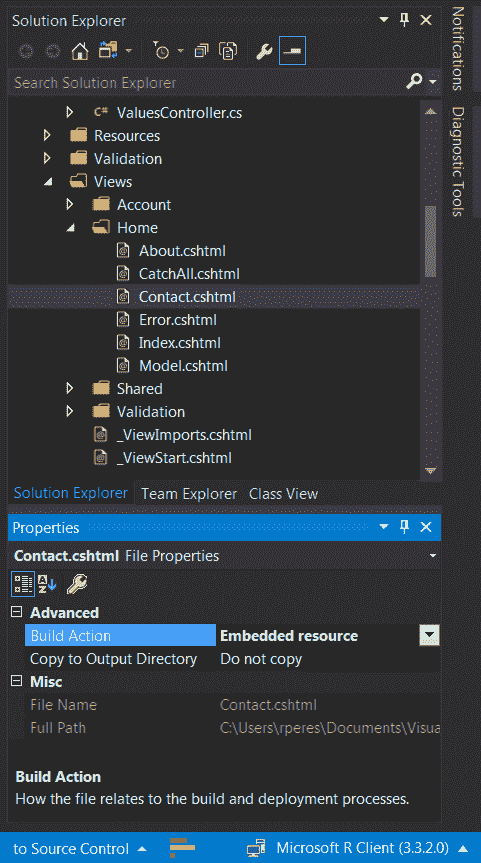
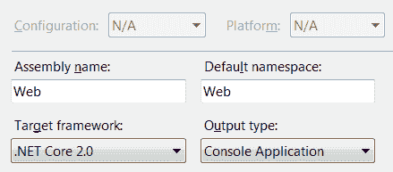
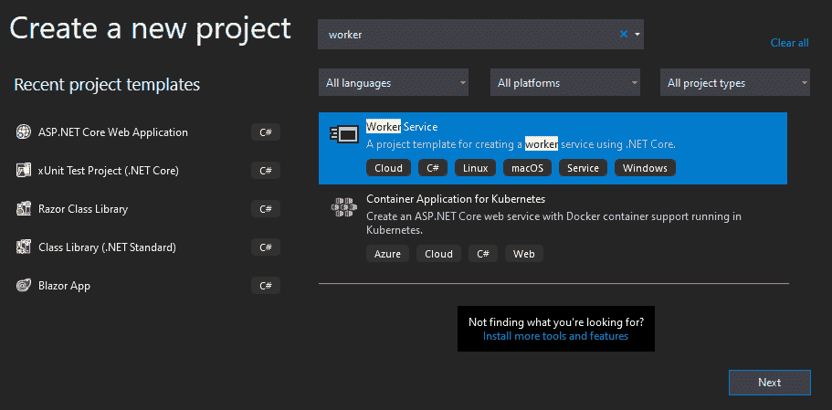

# 十八、gRPC 和其它话题

在本章中，我们将介绍一些不适合本书前几章的主题。这是因为，尽管它们很重要，但在前面的章节中，它们没有理想的位置，或者它们需要自己的小章节。

其中一些主题非常重要，即**谷歌远程过程调用**（**gRPC**），这是一种跨平台、跨技术、强类型消息传递的新技术。gRPC 与新的 ASP.NET Core 端点路由系统集成良好，该系统允许 ASP.NET Core 服务于您能想到的几乎任何协议。我们还将介绍使用**实体框架**（**EF**核心）和 ASP.NET Core 的最佳实践。静态文件也很重要，因为我们离不开它们。

基本上，我们将在本章中介绍的主题包括：

*   地区
*   静态文件
*   应用生存期事件
*   习俗
*   嵌入式资源
*   主机扩展
*   URL 重写
*   后台服务
*   使用 EF 核
*   理解 gRPC 框架
*   使用 HTTP 客户端工厂

让我们看看它们都是关于什么的。

# 技术要求

为了实现本章中介绍的示例，您需要.NET Core 3 SDK 和文本编辑器。当然，VisualStudio2019（任何版本）满足所有要求，但您也可以使用 VisualStudio 代码。

本章的源代码可从 GitHub 的[检索 https://github.com/PacktPublishing/Modern-Web-Development-with-ASP.NET-Core-3-Second-Edition](https://github.com/PacktPublishing/Modern-Web-Development-with-ASP.NET-Core-3-Second-Edition) 。

# 使用区域组织代码

区域是以逻辑方式物理分隔应用内容的功能。例如，您可以有一个区域用于管理，另一个区域用于其他内容。这在大型项目中特别有用。每个区域都有自己的控制器和视图，这在[第 3 章](03.html)、*路由*中进行了讨论。

为了使用区域，我们需要在我们的应用中创建一个与`Controllers`和`Views`级别相同的`Areas`文件夹。在它下面，我们将创建一个特定的区域文件夹，例如，`Admin`——在它里面，我们需要一个类似于根目录中的结构，即，`Controllers`和`Views`文件夹：


## 代码中区域的使用

控制器的创建方式相同，但我们需要添加一个`[Area]`属性：

```cs
[Area("Admin")]
public class ManageController : Controller
{
}
```

It is OK to have multiple controllers with the same name, provided they are in different namespaces (of course) and are in different areas.

此控制器的视图将自动位于`Areas/Admin/Views/Manage`文件夹中；这是因为内置的**视图位置扩展器**（您可以在[第 5 章](05.html)、*视图*中阅读）已经查看了`Areas`下的文件夹。我们需要做的是在`Configure`方法中的默认路由（或任何定制路由）之前为该区域注册路由：

```cs
app.UseEndpoints(endpoints =>
{
    endpoints.MapControllerRoute(
        name: "areas",
        pattern: "{area:exists}/{controller=Home}/{action=Index}");

    endpoints.MapAreaControllerRoute(
        name: "default",
        areaName: "Personal",
        pattern: "{area=Personal}/{controller=Home}/{action=Index}
        /{id?}");
});
```

对`MapControllerRoute`的调用只是确保任何存在指定区域的路径都被接受，而对`MapAreaControllerRoute`的调用注册了一个名为`Personal`的显式区域，该区域实际上并不需要，因为第一次调用将覆盖该区域。

路由现在有一个额外的内置模板令牌-`[area]`，您可以在路由中使用该令牌，使用方式与`[controller]`和`[action]`几乎相同：

```cs
[Route("[area]/[controller]/[action]")]
```

让我们看看如何在内置标记帮助器中引用区域。

## 标记和 HTML 帮助程序

包含的标记帮助程序（如`<a>`、`<form>`等）识别`asp-area`属性，可用于生成特定区域下控制器的正确 URL：

```cs
<a asp-controller="Manage" asp-action="Index" asp-area="Admin">Administration</a>
```

但是，HTML 帮助程序并非如此，您需要显式提供路由的`area`参数：

```cs
@Html.ActionLink(
    linkText: "Administration",
    actionName: "Index",
    controllerName: "Manage",
    routeValues: new { area = "Admin" } )
```

此代码生成一个超链接，该超链接除了引用控制器和操作外，还引用控制器所在的区域，例如`/Admin/Manage/Index`。

现在让我们从区域转到静态文件。我们不能没有他们，因为我们即将发现！

# 使用静态文件和文件夹

ASP.NET Core 可以提供静态文件、图像、样式表、JavaScript 脚本和文本，甚至支持文件系统文件夹。这非常有用，因为它们非常重要，因为并非所有内容都是动态生成的。让我们首先关注它们的配置。

## 配置

VisualStudio 中的默认模板包括`Microsoft.AspNetCore.StaticFiles`NuGet 包，该包也包含在`Microsoft.AspNetCore.All`元包中。此外，初始化主机 Kestrel 或 HTTP.sys 的代码将应用的根文件夹定义为用于提供静态文件（如 HTML、JavaScript、CSS 和图像）的根文件夹，如`Directory`返回的。

这是`.GetCurrentDirectory()`，但是您可以在`Program`类中使用`UseContentRoot`来更改，在`Program`类中主机被初始化：

```cs
public static IHostBuilder CreateHostBuilder(string[] args)
{
    Host.CreateDefaultBuilder(args)
        .ConfigureWebHostDefaults(webBuilder =>
        {
            webBuilder
                .UseContentRoot("<some path>")
                .UseStartup<Startup>();
       });
}
```

请注意，这里实际上涉及两个文件夹：

*   承载 web 应用的根文件夹
*   提供文件的根文件夹

稍后我们将进一步探讨这一点。

## 允许目录浏览

可以为整个应用启用文件系统的目录浏览；只需在没有任何参数的情况下调用`UseDirectoryBrowser`（在`Configure`中）：

```cs
app.UseDirectoryBrowser();
```

Beware—if you do this instead of running the default action of the default controller, you will end up with a file listing the files on the root folder!

但是，您可能希望在虚拟路径下公开根文件夹：

```cs
app.UseDirectoryBrowser("/files");
```

请注意前导正斜杠（`**/**`）字符，这是必需的。另外，请注意，如果您不包括对静态文件的支持（我们将在下面介绍），则您将无法下载任何静态文件，并将返回一条 HTTP`404 Error`消息。这不是一个物理位置，而是 ASP.NET Core 显示`wwwroot`文件夹中文件的路径。

再深入一点，可以指定要返回哪些文件以及如何呈现它们；这是通过采用`DirectoryBrowserOptions`参数的`UseDirectoryBrowser`重载完成的。此类具有以下属性：

*   `RequestPath`（`string`：虚拟路径。
*   `FileProvider`（`IFileProvider`：获取目录内容的文件提供者。默认为`null`，此时将使用`PhysicalFileProvider`。

配置根目录的示例如下所示：

```cs
app.UseDirectoryBrowser(new DirectoryBrowserOptions
{
    RequestPath = "/resources",
    FileProvider = new EmbeddedFileProvider(Assembly.GetEntryAssembly())
});
```

这个非常简单的示例公开了`/resources`虚拟路径下当前应用的所有程序集嵌入资源。

You can serve multiple directory browsers with different options.

您可以通过查看`IWebHostEnvironment.ContentRootPath`来检索安装 ASP.NET Core 应用的文件夹。默认根目录（`wwwroot`可用作`IWebHostEnvironment.WebRootPath`。只需使用`Path.GetFullPath("wwwroot")`即可，它将获得`wwwroot`文件夹的完整路径。

## 提供静态文件

为了服务（允许下载）静态文件，我们需要调用`UseStaticFiles`：

```cs
app.UseStaticFiles();
```

同样，可以将虚拟根目录设置为任意文件夹，如前一节所述：

```cs
app.UseStaticFiles("/files");
```

但是，您需要做更多的工作才能真正提供文件服务。

还有另一个过载`UseStaticFiles`采用`StaticFileOptions`参数。它具有以下属性：

*   `DefaultContentType`（`string`：未知文件的默认内容类型。默认值为`null`。
*   `ServeUnknownFileTypes`（`bool`：是否提供 MIME 类型未知的文件。默认值为`false`。
*   `ContentTypeProvider`（`IContentTypeProvider`：用于获取给定扩展的 MIME 类型。
*   `FileProvider`（`IFIleProvider`：用于检索文件内容的文件提供者；默认为`null`，即使用`PhysicalFileProvider`。
*   `OnPrepareResponse`（`Action<StaticFileResponseContext>`）：可用于拦截响应的处理程序，例如设置默认头或明确拒绝响应。
*   `RequestPath`（`string`：虚拟基路径。

如果要指定虚拟路径，请务必使用此重载：

```cs
app.UseStaticFiles(new StaticFileOptions
{
    RequestPath = "/files",
    FileProvider = new PhysicalFileProvider(Path.GetFullPath("wwwroot"))
});
```

对于嵌入文件，请使用以下命令：

```cs
app.UseStaticFiles(new StaticFileOptions
{
    RequestPath = "/resources",
    FileProvider = new EmbeddedFileProvider(Assembly.GetEntryAssembly())
});
```

You can have multiple calls to `UseStaticFiles`, as long as they have different `RequestPath` parameters.

对于文件，设置内容（**MIME**类型很重要；这是从文件扩展名推断出来的，我们可以选择是否允许下载未知文件类型（扩展名没有注册 MIME 类型的文件），如下所示：

```cs
app.UseStaticFiles(new StaticFileOptions
{
    DefaultContentType = "text/plain",
    ServeUnknownFileTypes = true
});
```

在这里，我们允许下载任何具有未知扩展名的文件，并使用`text/plain`内容类型为其提供服务。如果`ServeUnknownFileTypes`未设置为`true`并且您尝试下载这样的文件，您将收到一条 HTTP`404 Error`消息。

但是，有一个类知道公共文件扩展名-`FileExtensionContentTypeProvider`-并实现了`IContentTypeProvider`，这意味着我们可以将其分配给`StaticFileOptions`的`ContentTypeProvider`属性：

```cs
var provider = new FileExtensionContentTypeProvider();
provider.Mappings[".text"] = "text/plain";

app.UseStaticFiles(new StaticFileOptions
{
    ContentTypeProvider = provider,
    DefaultContentType = "text/plain",
    ServeUnknownFileTypes = true
});
```

如您所见，我们正在向内置列表中添加一个新的扩展名（`.text`及其关联的 MIME 类型（`text/plain`。如果您感到好奇，您可以对它进行迭代以查看它包含的内容，或者通过调用`Clear`从头开始。扩展名需要有一个`.`字符，并且不区分大小写。

与目录浏览一样，我们可以通过设置`FileProvider`属性来指定`IFileProvider`，用于检索实际的文件内容。

如果我们想为所有文件设置一个自定义头或实现安全性（这在静态文件处理中明显不存在），我们可以使用以下方法：

```cs
app.UseStaticFiles(new StaticFileOptions
{
    OnPrepareResponse = ctx => 
 {
 ctx.Context.Response.Headers.Add("X-SENDER", "ASP.NET Core");
 };
});
```

当然，我们也可以返回 HTTP 错误代码、重定向或任何其他类型的操作。

## 提供默认文件

如果我们启用目录浏览，我们还可以提供一个默认文档（如果它存在的话）。为此，我们需要通过调用`UseDefaultFiles`（总是在`UseStaticFiles`之前）来添加一些中间件：

```cs
app.UseDefaultFiles();
app.UseStaticFiles();
```

不用说，可以通过传递一个`DefaultFilesOptions`实例来配置默认文档。此类包含以下内容：

*   `DefaultFileNames`（`IList<string>`：要服务的默认文件的有序列表
*   `RequestPath`（`string`：虚拟路径
*   `FileProvider`（`IFileProvider`：获取文件列表的文件提供者，默认为`null`

如果您感兴趣，默认文件名如下：

*   `default.htm`
*   `default.html`
*   `index.htm`
*   `index.html`

配置单个默认文档的示例如下：

```cs
app.UseDefaultFiles(new DefaultFilesOptions
{
    DefaultFileNames = new [] { "document.html" };
});
```

如果任何可浏览的文件夹中存在名为`document.html`的文件，则将提供该文件，并且不会列出该文件夹的内容。

## 应用安全性

正如我前面提到的，静态文件处理没有安全性，但是我们可以使用`StaticFileOptions`的`OnPrepareResponse`处理程序作为基础来实现我们自己的机制，如下所示：

```cs
app.UseStaticFiles(new StaticFileOptions
{
    OnPrepareResponse = ctx => 
    {
        //check if access should be granted for the current user and file
        if (!AccessIsGranted(ctx.File, ctx.Context.User))
        {
            ctx.Context.Response.StatusCode = (int) HttpStatusCode.
            Forbidden;
            ctx.Context.Abort();
        }
    };
});
```

如果您想从`wwwroot`文件夹之外提供文件，请传递一个自定义`IFileProvider`属性，可能是`PhysicalFileProvider`的一个实例，该实例设置为使用不同的根目录。

## 文件提供者

ASP.NET Core 包括以下文件提供程序，它们是`IFileProvider`的实现：

*   `PhysicalFileProvider`：查找文件系统上的物理文件
*   `EmbeddedFileProvider`：用于访问程序集中嵌入的文件，区分大小写
*   `ManifestEmbeddedFileProvider`：当嵌入到程序集中时，使用程序集中编译的清单重建嵌入文件的原始路径
*   `CompositeFileProvider`：组合多个文件提供程序
*   `NullFileProvider`：始终返回`null`

文件提供程序（`IFileProvider`实现）负责以下工作：

*   返回给定文件夹的文件列表（`GetDirectoryContents`
*   返回文件夹中命名文件的信息（`GetFileInfo`
*   当文件掩码（文件夹中的文件）更改时获取通知（`Watch`

具体如何实现这一点取决于提供者，甚至可能只在虚拟环境中发生。

如您所见，有两个提供程序可以处理嵌入式文件。两者的区别在于`ManifestEmbeddedFileProvider`在程序集开始构建时以完全逼真的方式尊重文件系统的结构，并允许我们正确地枚举**目录**。也优于`EmbeddedFileProvider`。

现在让我们从物理文件转到应用事件。

# 应用生存期事件

ASP.NET Core 公开整个应用生命周期的事件。您可以连接到这些事件，以便在它们即将发生时收到通知。这些事件由主机使用应用（`IHostLifetime`调用，[第 1 章](01.html)、*ASP.NET Core 入门*对此进行了解释。这个接口的入口点是`IHostApplicationLifetime`接口，您可以从依赖项注入框架获得该接口。它公开了以下属性：

*   `ApplicationStarted`（`CancellationToken`：主机完全启动并准备等待请求时引发。
*   `ApplicationStopping`（`CancellationToken`）：当应用即将在所谓的正常关闭中停止时引发。某些请求可能仍在处理中。
*   `ApplicationStopped`（`CancellationToken`：应用完全停止时引发。

其中每一个都是一个`CancellationToken`属性，这意味着它可以传递给任何接受此类参数的方法，但更有趣的是，这意味着我们可以向其添加自己的处理程序：

```cs
public void Configure(IApplicationBuilder app, IWebHostEnvironment env, IHostApplicationLifetime events)
{
    events.ApplicationStopping.Register(
        callback: state =>
        {
            //application is stopping
        },
        state: "some state"); 

    events.ApplicationStarted.Register(state =>
    {
        //application started
        var appParameter = state as IApplicationBuilder;
    }, app);
}
```

`state`参数为可选参数；如果未提供，`callback`参数不接受任何参数。

有很多方法可以导致优雅的关机，一种是通过调用`IHostApplicationLifetime`接口的`StopApplication`方法，另一种是通过添加`app_offline.htm`文件。如果存在这种类型的文件，应用将停止响应，并在每个请求中返回其内容。

最后，您应该尽快连接到应用事件，无论是在`Configure`方法中（如图所示），还是在应用引导过程中：

```cs
public static IHostBuilder CreateHostBuilder(string[] args) => 
    Host
        .CreateDefaultBuilder(args)
        .ConfigureWebHostDefaults(builder =>
        {
            builder.Configure(builder =>
            {
                var events = builder.ApplicationServices.
                GetRequiredService<IHostApplicationLifetime>();
                //hook to events here
            });
            builder.UseStartup<Startup>();
        });
```

如果希望在请求的开始或结束时有事件，最好使用筛选器。您可以在[第 10 章](10.html)、*了解过滤器*中了解过滤器。

这就是应用事件的全部内容。现在，让我们转到汇编嵌入式资源。

# 使用嵌入式资源

从.NET 的原始版本开始，就可以在程序集中嵌入内容，包括二进制文件。这样做的原因很简单，因为它们包含在应用二进制文件中，所以可以最小化要分发的文件数量。为此，我们可以使用 Visual Studio 在 Visual Studio 的属性资源管理器中设置 Build Action 属性：



然后，要检索嵌入式资源，您需要一个`EmbeddedFileProvider`（前面讨论过）或`ManifestEmbeddedFileProvider`的实例。这些类属于`Microsoft.Extensions.FileProviders.Embedded`包并实现`IFileProvider`接口，这意味着它们可以在任何期望`IFileProvider`的 API 中使用。您可以通过向其传递程序集来初始化它们，如下所示：

```cs
var embeddedProvider = new ManifestEmbeddedFileProvider
(Assembly.GetEntryAssembly());
```

还可以传递可选的基本命名空间：

```cs
var embeddedProvider = new ManifestEmbeddedFileProvider
(Assembly.GetEntryAssembly(), "My.Assembly");
```

此基本命名空间是在项目属性中指定的命名空间：



`EmbeddedFileProvider`和`ManifestEmbeddedFileProvider`的区别在于后者需要将原始文件路径存储在程序集中，您需要将其（粗体）添加到`.csproj`文件中：

```cs
<PropertyGroup>
    <TargetFramework>netcoreapp3.1</TargetFramework>
    <GenerateEmbeddedFilesManifest>true</GenerateEmbeddedFilesManifest>
</PropertyGroup>
```

只要坚持`EmbeddedFileProvider`就行了，不要太担心这个。

这取决于您是否了解嵌入式资源中的内容；例如，这可以是文本或二进制内容。您应该知道 ASP.NET Core 3 还允许包含 Razor 类库中的静态内容，这可能是一个更好的解决方案。这在[第 9 章](09.html)、*可重用组件*中进行了讨论。

下一节将讨论用于自动加载类和运行后台任务的内置基础结构机制。

# 主机扩展

我们现在将讨论一种自动从其他程序集中加载类的机制，以及另一种自动生成后台线程的机制。第一个用于.NET 自动注册某些扩展（即 Azure 和 Application Insights），第二个用于在后台执行工作，而不妨碍 web 应用。让我们从托管来自外部程序集的代码开始。

## 托管启动

有一个接口`IHostingStartup`，它公开了一个方法：

```cs
public class CustomHostingStartup : IHostingStartup
{
 public void Configure(IWebHostBuilder builder)
 {
 }
}
```

这可以在主机启动时用于向主机中注入其他行为。`IWebHostBuilder`与`Program.Main`方法中使用的实例完全相同。那么，这个类是如何加载的呢？这可以通过以下两种方式之一实现：

*   通过在程序集级别添加一个`[HostingStartup]`属性。我们可以指定一个或多个`IHostingStartup`实现的类，这些类应该从应用的程序集自动加载。
*   通过设置`ASPNETCORE_HOSTINGSTARTUPASSEMBLIES`环境变量的值，该值可以是程序集名称和/或完全限定类型名称的分号分隔列表。对于每个程序集名称，宿主框架将检测任何`[HostingStartup]`属性，对于类型名称，如果它们实现`IHostingStartup`，将自动加载它们。

这是加载类（如插件）的一种很好的机制，事实上，一些 Microsoft 软件包（如 ApplicationInsights）就是这样工作的。

现在让我们看看如何在后台运行任务。

# 托管后台服务

`IHostedService`接口定义后台任务的合约。通过在一个具体的类中实现这个接口，我们可以在我们的应用的后台生成工作人员，并且我们不会干扰它。这些服务具有 ASP.NET 应用的生命周期。

Visual Studio 中有一个用于创建辅助服务的特殊模板：



这是一种特殊的项目，不能用于提供 web 内容。如果您感到好奇，它将使用以下声明：

```cs
<Project Sdk="Microsoft.NET.Sdk.Worker">
```

ASP.NET Core 提供了一个方便的类`BackgroundService`，您可以从中继承，而不是实现`IHostedService`：

```cs
public class BackgroundHostedService : BackgroundService
{
    protected override Task ExecuteAsync(CancellationToken 
    cancellationToken)
    {
        while (!cancellationToken.IsCancellationRequested)
        {
            //do something

            Task.Delay(1000, cancellationToken);
        }

        return Task.CompletedTask;
    }
}
```

当然，托管服务启动时会自动调用`ExecuteAsync`。它接受一个`CancellationToken`参数，可以用来知道托管服务何时被取消。在它里面，我们通常执行一个永远运行的循环（直到`cancellationToken`被取消）。在这里，我们等待 1000 毫秒，但是您希望在循环之间延迟的时间取决于您和您的需求。

在引导的早期阶段，托管服务需要在依赖项注入框架中注册，即在工作者服务项目的`Program`类中：

```cs
public static IHostBuilder CreateHostBuilder(string [] args) => 
    Host
        .CreateDefaultBuilder(args)
        .ConfigureServices(services =>
        {
            services.AddHostedService<BackgroundHostedService>(); 
        });
```

但是，它们也可以在 web 应用中使用；在本例中，只需在`ConfigureServices`中将我们的后台服务类注册为`IHostedService`的单例实例：

```cs
services.AddSingleton<IHostedService, BackgroundHostedService>();
```

托管服务可以通过其构造函数将服务注入其中，就像从依赖项注入容器构建的任何其他服务一样。它们与 ASP.NET Core 应用具有相同的生命周期，即使它们在依赖项注入容器中注册（作为临时实例），它们也不是真正需要手动检索的。如果您需要这样做，请考虑注册为单身，并有一些注册服务来传递数据。

下一个主题是关于 ASP.NET Core 模型约定的，它可以用于默认行为。

# ASP.NET Core 模型约定

ASP.NET Core 支持约定，约定是实现已知接口的类，可以注册到应用以修改其某些方面。约定接口如下所示：

*   `IApplicationModelConvention`：这提供了对应用范围约定的访问，允许您迭代以下每个级别，即控制器模型、动作模型和参数模型。
*   `IControllerModelConvention`：这些是特定于控制器的约定，但也允许您评估较低级别（动作模型）。
*   `IActionModelConvention`：这允许您更改操作级别约定以及操作的任何参数（参数模型）。
*   `IParameterModelConvention`：仅针对参数。

*   `IPageRouteModelConvention`：这让我们可以自定义 Razor 页面的默认路由（ASP.NET Core 2.x）。
*   `IPageApplicationModelConvention`：允许定制剃须刀型号。

从最高到最低的范围，我们有应用，然后是控制器，然后是动作，最后是参数。

非剃须刀约定通过`MvcOptions`的`Conventions`集合进行注册：

```cs
services
    .AddMvc(options =>
    {
        options.Conventions.Add(new CustomConvention());
    });
```

因此，这适用于`IApplicationModelConvention`、`IControllerModelConvention`、`IActionModelConvention`和`IParameterModelConvention`。剃须刀约定在`RazorPagesOptions`中的类似集合上配置：

```cs
services
    .AddMvc()
    .AddRazorPagesOptions(options =>
    {
        options.Conventions.Add(new CustomRazorConvention());
    });
```

通过让自定义属性实现其中一个约定接口并在正确级别应用它，也可以应用自定义约定：

*   `IControllerModelConvention`：控制器类
*   `IActionModelConvention`：动作方式
*   `IParameterModelConvention`：动作方式参数

那么，我们可以用自定义约定做什么呢？一些例子如下：

*   注册新控制器并将属性动态添加到现有控制器
*   为所有或某些控制器动态设置路由前缀

*   动态定义操作方法的授权
*   动态设置动作方法中参数的默认位置

如果我们想在已注册的控制器列表中添加一个新控制器，我们将执行以下操作：

```cs
public class CustomApplicationModelConvention : IApplicationModelConvention
{
    public void Apply(ApplicationModel application)
    {
        application.Controllers.Add(new ControllerModel
        (typeof(MyController), 
            new List<object> { { new AuthorizeAttribute() } }));
    }
}
```

要添加全局筛选器，我们可以执行以下操作：

```cs
application.Filters.Add(new CustomFilter());
```

如果我们希望所有控制器都有一个带有特定前缀（`Prefix`的`[Route]`属性，我们将执行以下操作：

```cs
foreach (var applicationController in application.Controllers)
{
    foreach (var applicationControllerSelector in 
    applicationController.Selectors)
    {
        applicationControllerSelector.AttributeRouteModel =
            new AttributeRouteModel(new RouteAttribute("Prefix"));
    }
}
```

这也可以在`IActionModelConvention`实现中实现，但可以表明您可以在`IApplicationModelConvention`的所有级别应用约定。

现在，为了向某些动作方法添加一个以`Auth`结尾的`[Authorize]`属性，我们执行以下操作：

```cs
foreach (var controllerModel in application.Controllers)
{
    foreach (var actionModel in controllerModel.Actions)
    {
        if (actionModel.ActionName.EndsWith("Auth"))
        {
            var policy = new AuthorizationPolicyBuilder()
                .RequireAuthenticatedUser()
                .Build();
            actionModel.Filters.Add(new AuthorizeFilter(policy));
        }
    }
}
```

最后，当参数的名称以`Svc`结尾时，我们可以将参数的源设置为服务提供者：

```cs
foreach (var controllerModel in application.Controllers)
{ 
    foreach (var actionModel in controllerModel.Actions)
    {
        foreach (var parameterModel in actionModel.Parameters)
        {
            if (parameterModel.ParameterName.EndsWith("Svc"))
            {
                if (parameterModel.BindingInfo == null)
                {
                    parameterModel.BindingInfo = new BindingInfo();
                }
                parameterModel.BindingInfo.BindingSource = 
                BindingSource.Services;
            }
        }
    }
}
```

对于 Razor 页面，它有些不同，因为两个约定接口之间没有关系；也就是说，它们用于完全不同的目的。两个例子如下：

*   将所有页面模型属性设置为自动绑定到服务提供商
*   设置所有页面的根目录

对于第一个示例，我们需要一个`IPageApplicationModelConvention`实现：

```cs
public class CustomPageApplicationModelConvention : IPageApplicationModelConvention
{
    public void Apply(PageApplicationModel model)
    {
        foreach (var property in model.HandlerProperties)
        {
            if (property.BindingInfo == null)
            {
                property.BindingInfo = new BindingInfo();
            }
            property.BindingInfo.BindingSource = BindingSource.Services;
        }
    }
}
```

它会自动将依赖项注入设置为页面模型类中任何属性的绑定源；这与在它们上设置`[FromServices]`属性相同。

设置自定义路由前缀时，使用`IPageRouteModelConvention`实现：

```cs
public class CustomPageRouteModelConvention : IPageRouteModelConvention
{
    public void Apply(PageRouteModel model)
    {
        foreach (var selector in model.Selectors)
        {
            if (selector.AttributeRouteModel == null)
            {
                selector.AttributeRouteModel = new AttributeRouteModel(new 
                RouteAttribute("Foo"));
            }
            else
            {
                selector.AttributeRouteModel = AttributeRouteModel
                    .CombineAttributeRouteModel(selector.
                        AttributeRouteModel, 
                        new AttributeRouteModel(new RouteAttribute
                        ("Foo")));
            }
        }
    }
}
```

在这里，我们要做的是将所有剃须刀页面的`[Route]`属性设置为以`Foo`开头。

接下来，我们将看到如何修改传入的请求。

# 应用 URL 重写

尽管 MVC 路由很方便，但有时我们需要向公众提供不同的 URL，反之亦然，以便能够接受公众知道的 URL。这就是 URL 重写的用武之地。

URL 重写不是新的；自从 ASP.NET Web 表单通过**IIS URL 重写**模块（参见[以更先进的方式在本机上形成以来，它就一直存在 https://www.iis.net/downloads/microsoft/url-rewrite](https://www.iis.net/downloads/microsoft/url-rewrite) ）。ASP.NET Core 通过`Microsoft.AspNetCore.Rewrite`包提供类似的功能。让我们看看它是如何工作的。

从本质上讲，URL 重写是一种功能，通过该功能，您可以根据一组预配置的规则将请求 URL 转换为不同的内容。Microsoft 建议在某些情况下使用此功能：

*   为需要临时或永久更改的资源提供不变的 URL
*   跨应用拆分请求
*   重新组织 URL 片段
*   为**搜索引擎优化**（**SEO**优化 URL）
*   创建用户友好的 URL
*   将不安全的请求重定向到安全端点
*   防止图像（或其他资产）热链接（有人从其他网站引用您的资产）

`Microsoft.AspNetCore.Rewrite`包可以通过代码进行配置，但也可以接受 IIS 重写模块配置文件（[https://docs.microsoft.com/en-us/iis/extensions/url-rewrite-module/creating-rewrite-rules-for-the-url-rewrite-module](https://docs.microsoft.com/en-us/iis/extensions/url-rewrite-module/creating-rewrite-rules-for-the-url-rewrite-module) ）。毕竟，ASP.NET Core 是跨平台的，Apache 的`mod_rewrite`配置（[http://httpd.apache.org/docs/current/mod/mod_rewrite.html 除 IIS 外，还支持](http://httpd.apache.org/docs/current/mod/mod_rewrite.html)。

URL 重写不同于 URL 重定向，后者中，服务器在收到应重定向的请求时发送一个`3xx`状态码，由客户端跟踪该请求。在 URL 重写中，服务器会立即处理请求，而无需再次往返，但根据重写规则，应用会以不同的方式看待请求。`Microsoft.AspNetCore.Rewrite`支持两种情况。

首先，有一个`RewriteOptions`类，用于定义所有规则。它有两种扩展方法：

*   `AddRedirect`：添加 URL 重定向规则，状态代码可选（`3xx`）
*   `AddRewrite`：添加 URL 重写规则
*   `Add(Action<RewriteContext>)`：添加可用于动态生成重写或重定向规则的委托
*   `Add(IRule)`：添加`IRule`的实现，定义运行时规则，方式类似`Action<RewriteContext>`委托

然后，有两种特定于 Apache 和 IIS 的扩展方法：

*   `AddApacheModRewrite`：读取`mod_rewrite`配置文件
*   `AddIISUrlRewrite`：读取 IIS URL 重写模块配置文件

这两种方法要么采用文件提供程序（`IFileProvider`）和路径，要么采用已经指向打开文件的`TextReader`实例。

最后，有两种强制 HTTPS 的方法：

*   `AddRedirectToHttps`：告知客户端请求相同的请求，但这次使用的是 HTTPS 协议而不是 HTTP。
*   `AddRedirectToHttpsPermanent`：与前面的方法类似，只是发送`301 Moved Permanently`消息，而不是`302 Found`。

如果请求是针对服务器上的任何资源的 HTTP，这些方法将强制重定向到 HTTPS。接下来让我们看看 URL 重定向！

## URL 重定向

首先，让我们看一个 URL 重定向的示例。本例使用`RewriteOptions`类：

```cs
services.Configure<RewriteOptions>(options =>
{
    options.AddRedirect("redirect-rule/(.*)", "redirected/$1", 
    StatusCodes.Status307TemporaryRedirect);
});
```

第一个参数是一个正则表达式，它应该与请求匹配，我们可以在其中指定捕获（括号内）。第二个参数是重定向 URL；注意我们如何使用第一个参数中定义的捕获。第三个参数是可选的，如果不使用，则默认为`302 Found`。

Read about HTTP redirection in the HTTP specification at [https://www.w3.org/Protocols/rfc2616/rfc2616-sec10.html#sec10.3](https://www.w3.org/Protocols/rfc2616/rfc2616-sec10.html#sec10.3).

## URL 重写

接下来，我们看看什么是内部 URL 重写。`AddRewrite`的一个例子可以是：

```cs
options.AddRewrite(@"^rewrite-rule/(\d+)/(\d+)", "rewritten?var1=$1&var2=$2", skipRemainingRules: true);
```

这里，我们指示`Microsoft.AspNetCore.Rewrite`将`rewrite-rule`之后由数字组成的任何路径组件（这也使用正则表达式）转换为查询字符串参数。如果找到第一个参数的匹配项，则第三个参数（`skipRemainingRules`指示重写中间件停止处理任何其他规则，只使用此规则。`skipRemainingRules`参数的默认值为`false`。

## 运行时评估

采用`Action<RewriteContext>`或`IRule`的扩展实际上做了相同的事情，第一个操作只是将传递的委托包装在`DelegateRule`中，这是`IRule`的一个具体实现。此接口仅定义一个方法：

```cs
void ApplyRule(RewriteContext context)
```

`RewriteContext`提供了几个属性，您可以从这些属性访问上下文并设置响应：

*   `HttpContext`（`HttpContext`：当前 HTTP 上下文。
*   `StaticFileProvider`（`IFileProvider`：用于检查是否存在静态文件和文件夹的当前文件提供程序。

*   `Logger`（`ILogger`：记录器。
*   `Result`（`RuleResult`：规则评估结果，必须设置。默认值为`ContinueRules`，指示中间件继续处理其他请求，其他可能的值为`EndResponse`（按照您的预期执行）和`SkipRemainingRules`（推迟处理其他规则，仅应用当前规则）。

要使用`IRule`或委托，我们使用以下选项之一：

```cs
.Add(new RedirectImageRule("jpg", "png"));
```

我们还可以使用以下工具：

```cs
.Add((ctx) => 
{
    ctx.HttpContext.Response.Redirect("/temporary_offline",
     permanent: true);
    ctx.Result = RuleResult.EndResponse;
});
```

`RedirectImageRule`规则如下所示：

```cs
public sealed class RedirectImageRule : IRule
{
    private readonly string _sourceExtension;
    private readonly string _targetExtension;

    public RedirectImageRule(string sourceExtension, string 
    targetExtension)
    {
        if (string.IsNullOrWhiteSpace(sourceExtension))
        {
            throw new ArgumentNullException(nameof(sourceExtension));
        }

        if (string.IsNullOrWhiteSpace(targetExtension))
        {
            throw new ArgumentNullException(nameof(targetExtension));
        }

        if (string.Equals(sourceExtension, targetExtension,   
            StringComparison.InvariantCultureIgnoreCase))
        {
            throw new ArgumentException("Invalid target extension.", 
            nameof(targetExtension));
        }

        this._sourceExtension = sourceExtension;
        this._targetExtension = targetExtension; 
    }

    public void ApplyRule(RewriteContext context)
    {
        var request = context.HttpContext.Request;
        var response = context.HttpContext.Response;

        if (request.Path.Value.EndsWith(this._sourceExtension, 
        StringComparison.OrdinalIgnoreCase))
        {
            var url = Regex.Replace(request.Path, $@"^(.*)\.
            {this._sourceExtension}$", 
                $@"$1\.{this._targetExtension}");
            response.StatusCode = StatusCodes.Status301MovedPermanently;
            context.Result = RuleResult.EndResponse;

            if (!request.QueryString.HasValue)
            {
                response.Headers[HeaderNames.Location] = url;
            }
            else
            {
                response.Headers[HeaderNames.Location] = url + "?" + 
                request.QueryString;
            }
        }
    }
}
```

此类将对特定图像扩展的任何请求转换为另一个请求。委托故意非常简单，因为它只是重定向到本地端点，从而结束请求处理。

## 重定向到 HTTPS

如果当前请求是 HTTP，则重定向到 HTTPS 的扩展非常简单。唯一的选项是发送`301 Moved Permanently`消息而不是`301 Found`或指定自定义 HTTPS 端口：

```cs
.AddRedirectToHttps(sslPort: 4430);
```

接下来，我们继续讨论特定于平台的重写。

## 平台特定

`AddIISUrlRewrite`和`AddApacheModRewrite`具有相同的签名，它们都可以采用文件提供程序和现有文件的路径或流。以下是后者的一个例子：

```cs
using (var iisUrlRewriteStreamReader = File.OpenText("IISUrlRewrite.xml"))
{
    var options = new RewriteOptions()
        .AddIISUrlRewrite(iisUrlRewriteStreamReader)
}
```

I have not covered the format of the **IIS Rewrite module** or the `mod_rewrite` configuration files. Please refer to its documentation for more information.

接下来，我们将看到如何强制 URL 重写。

## 强制 URL 重写

在`Configure`方法中，我们必须添加对`UseRewriter`的调用。如果我们不传递参数，它将使用之前在依赖项注入中配置的`RewriteOptions`操作，但我们也可以在此处传递它的实例：

```cs
var options = new RewriteOptions()
    .AddRedirectToHttps();

app.UseRewriter(options);
```

现在我们来看一些关于如何将 EF Core 与 ASP.NET Core 结合使用的实用建议。

# 使用 EF 核

**EF Core**是一款流行的**对象关系映射器**（**ORM**用于检索和更新数据。您可以想象，ASP.NET Core 对它有很好的支持，因为两者都是 Microsoft 工具。本节将介绍 EF Core 与 ASP.NET Core 的一些常见用法。

确保首先安装最新的`dotnet-ef`全局工具：

```cs
dotnet tool install --global dotnet-ef
```

接下来，让我们看看如何注册上下文。

## 注册 DbContext

首先，我们可以向依赖注入框架注册一个`DbContext`实例：

```cs
services.AddDbContext<MyDbContext>(options =>
{
    options.UseSqlServer(this.Configuration.GetConnectionString
     ("<connection string name>"));
});
```

正如您在本例中看到的，我们必须设置提供者及其连接字符串；否则，上下文几乎毫无用处。默认情况下，上下文将注册为作用域实例，这通常是我们想要的，因为它将在请求结束时被销毁。注册后，它可以被注入到我们想要的任何地方，比如控制器中。如果您还记得[第 2 章](02.html)，*配置*，`GetConnectionString`是一种扩展方法，它从已知位置`("ConnectionStrings:<named connection>")`的配置中检索连接字符串。

您的`DbContext`-派生类必须有一个特殊的公共构造函数，采用`DbContextOptions`类型或`DbContextOptions<T>`类型的参数，其中`T`是上下文的类型（在本例中为`MyDbContext`：

```cs
public class OrdersContext : DbContext
{
    public OrdersContext(DbContextOptions options) : base(options) { }
}
```

拥有此构造函数是必需的，但您可以拥有其他构造函数，甚至是无参数的构造函数。

## 使用异步方法

尽可能使用可用方法的异步版本（`AddAsync`、`FindAsync`、`ToListAsync`和`SaveAsync`）。这将提高应用的可伸缩性。此外，如果您希望将数据传递给一个视图，而该视图不可能被修改，请在结果查询中使用`AsNoTracking`扩展方法：

```cs
return this.View(await this.context.Products.AsNoTracking()
.ToListAsync());
```

这确保了实例化后从数据源返回的任何记录都不会添加到更改跟踪器中，这使得操作更快，占用的内存更少。

Do have a look at Microsoft's documentation for asynchronous programming at [https://docs.microsoft.com/en-us/dotnet/csharp/programming-guide/concepts/async](https://docs.microsoft.com/en-us/dotnet/csharp/programming-guide/concepts/async).

## 急装

当返回具有惰性关联的实体时，如果您确定它们将被使用，请急切地获取它们。这将最小化数据库调用的数量：

```cs
var productsWithOrders = await this.context.Products.Include(x => x.Orders).ToListAsync();
```

如果您正在从 web API 返回数据，这一点尤其重要，因为一旦发送实体，它们将失去与数据库的连接，因此无法再从数据库加载惰性数据。

但请注意，快速加载通常会导致发出`INNER JOINs`或`LEFT JOINs`，这可能会增加返回结果的数量。

## 初始化数据库

这可能是应用启动后需要完成的任务之一。最好的方法是应用引导：

```cs
public static class HostExtensions
{
    public static IHost CreateDbIfNotExists(IHost host)
    {
        using (var scope = host.Services.CreateScope())
        {
            var services = scope.ServiceProvider;
            var logger = services.GetRequiredService<ILogger<Program>>();

            try
            {
                var context = services.GetRequiredService
                <OrdersContext>();
                var created = context.Database.EnsureCreated();
                logger.LogInformation("DB created successfully: 
                {created}.", created);
            }
            catch (Exception ex)
            {
                logger.LogError(ex, "An error occurred while
                 creating the DB.");
            }
        }

        return host;
    }
}
```

此代码创建一个作用域并从其内部请求`DbContext`；通过这种方式，我们确信它将在范围结束时得到适当处理，从而释放所有资源。如果数据库已经存在，`EnsureCreated`方法将返回`false`，如果数据库已经创建，`true`方法将返回。

构建通用主机时，只需将对此方法的调用排队：

```cs
public static void Main(string [] args)
{
    CreateHostBuilder(args)
        .Build()
        .CreateDbIfNotExists()
        .Run();
}
```

如果您需要将数据库迁移到最新的迁移版本，只需将对`EnsureCreated`的调用替换为`Migrate`：

```cs
context.Database.Migrate();
```

如果没有任何参数，它会将数据库迁移到最新的迁移版本。如果迁移程序集与应用程序程序集不同，则在注册上下文时必须执行以下操作：

```cs
services.AddDbContext<OrdersContext>(options =>
{
    //set options, like, connection string and provider to use
    options.MigrationsAssembly("MyMigrationAssembly");
});
```

本例声明`MyMigrationAssembly`为包含所有迁移代码的程序集。

## 显示迁移错误和运行迁移

在开发模式下运行时，通常会有一个开发人员异常页面，显示发生的错误及其堆栈跟踪和其他信息。虽然这很有用，但它不包括可能由数据库不匹配（例如缺少迁移）引起的错误。幸运的是，ASP.NET Core 包含一个中间件组件，它可以捕获这些错误，并提供一个友好的错误页面来突出显示这些错误。

为了使用这个数据库错误页面，我们需要添加对`Microsoft.AspNetCore.Diagnostics. EntityFrameworkCore`NuGet 包的引用。然后，通过以下调用将中间件添加到`Configure`方法中的管道中：

```cs
app.UseDatabaseErrorPage();
```

这通常只在开发环境中启用，并且可以与`UseDeveloperExceptionPage`或您可能拥有的其他错误处理程序一起使用。

现在，您可能还想触发最新迁移的应用，可能是为了解决相关错误；这个中间件也允许您这样做。它使`"/ApplyDatabaseMigrations"`处的端点仅可用于此目的。您需要使用字段名`context`发布上下文的完全限定名称类型。以下是一个例子：

```cs
POST /ApplyDatabaseMigrations HTTP/1.1

context=Orders.OrderContext,Orders
```

本例在`Orders`程序集中使用了一个名为`Orders.OrderContext`的假设上下文。

如果出于任何原因，需要修改端点，可以按如下操作：

```cs
app.UseDatabaseErrorPage(new DatabaseErrorPageOptions { MigrationsEndPointPath = "/Migrate" });
```

这将使用`"/Migrate"`而不是默认路径。

## 将 EF 上下文与 HTTP 上下文集成

有时，在初始化 EF 上下文时，您可能需要从 HTTP 上下文获取一些信息。为什么？例如，这可能需要从请求或请求域获取用户特定的信息，在多租户场景中，这些信息可用于选择连接字符串。

在这种情况下，最好的方法是从 HTTP 上下文中获取应用服务提供者，唯一的方法是将`IHttpContextAccessor`服务注入`DbContext`的构造函数中：

```cs
public class OrdersContext : DbContext
{
    public class OrdersContext(DbContextOptions options, 
    IHttpContextAccessor httpContextAccessor) : 
        base(options)
    {
        this.HttpContextAccessor = httpContextAccessor;
    }

    protected IHttpContextAccessor HttpContextAccessor { get; }

    //rest goes here
}
```

别忘了我们需要通过调用`AddDbContext`来注册`DbContext`类。我们有了`IHttpContextAccessor`之后，我们可以在`OnConfiguring`中使用它来获取当前用户：

```cs
protected override void OnConfiguring(DbContextOptionsBuilder builder)
{
    var httpContext = this.HttpContextAccessor.HttpContext;
    var userService = httpContext.RequestServices.GetService
    <IUserService>();

    var user = httpContext.User.Identity.Name;
    var host = httpContext.Request.Host.Host;

    var connectionString = userService.GetConnectionStringForUser
    (userService);
    //var connectionString = userService
    //.GetConnectionStringForDomain(host);

    builder.UseSqlServer(connectionString);

    base.OnConfiguring(builder);
}
```

在本例中，我们从当前请求中检索用户和主机。然后，我们使用一个虚构的服务-`IUserService`-检索该用户（`GetConnectionStringForUser`）或主机（`GetConnectionStringForDomain`）的连接字符串，然后使用该字符串。这是因为注入了`IHttpContextAccessor`类，它需要通过调用`Startup.ConfigureServices`中的`AddHttpContextAccessor`来注册。

Some people may object that this ties `DbContext` to ASP.NET Core. Although this is true, for the scope of this book, it makes total sense to do that.

现在让我们看一个更复杂的例子，说明如何使用 efcore 构建一个功能齐全的 REST 服务。

## 建立休息服务

下面是一个 REST 服务的完整示例，该服务使用 EF Core 作为数据访问的底层 API。它具有检索、创建、更新和删除实体的操作，适合用作 web API 或 AJAX 样式的 web 应用：

```cs
[ApiController]
[Route("api/[controller]")]
public class BlogController : ControllerBase
{
    private readonly BlogContext _context;

    public BlogController(BlogContext context)
    {
        this._context = context;
    }

    [HttpGet("{id?}")]
    public async Task<ActionResult<Blog>> Get(int? id = null)
    {
        if (id == null)
        {
            return this.Ok(await this._context.Blogs.AsNoTracking()
            .ToListAsync());
        }
        else
        {
            var blog = await this._context.Blogs.FindAsync(id);

            if (blog == null)
            {
                return this.NotFound();
            }
            else
            {
                return this.Ok(blog);
            }
        }
    }

    [HttpPut("{id}")]
    public async Task<ActionResult<Blog>> Put(int id, [FromBody]
     Blog blog)
    {
        if (id != blog.Id)
        {
            return this.BadRequest();
        }

        if (this.ModelState.IsValid)
        {
            this._context.Entry(blog).State = EntityState.Modified;
            try
            {
                await this._context.SaveChangesAsync();
            }
            catch (DbUpdateConcurrencyException)
            {
                return this.Conflict();
            }
            return this.Ok(blog);
        }
        else
        {
            return this.UnprocessableEntity();
        }
    }

    [HttpDelete("{id}")]
    public async Task<IActionResult> Delete(int id)
    {
        var blog = await this._context.Blogs.FindAsync(id);

        if (blog == null)
        {
            return this.NotFound();
        }

        this._context.Blogs.Remove(blog);
        await this._context.SaveChangesAsync();
        return this.Accepted();
    }

    [HttpPost]
    public async Task<ActionResult<Blog>> Post([FromBody] Blog blog)
    {
        if (blog.Id != 0)
        {
            return this.BadRequest();
        }

        if (this.ModelState.IsValid)
        {
            this._context.Blogs.Add(blog);
            await this._context.SaveChangesAsync();
            return this.CreatedAtAction(nameof(Post), blog);
        }
        else
        {
            return this.UnprocessableEntity();
        }
    }
}
```

正如您所看到的，这个控制器有几个动作方法，每个 HTTP 动词（`GET`、`POST`、`PUT`和`DELETE`都有一个动作方法。以下是它的工作原理：

*   控制器在其构造函数中获取`DbContext`派生类的一个实例，该类来自依赖项注入框架。
*   所有方法都是异步的。
*   所有方法都遵循约定，并且它们的名称与它们接受的 HTTP 谓词匹配。
*   所有方法都在签名中描述返回的内容。
*   对`DbContext`派生类的所有调用都是异步的。
*   `Get`方法采用可选的`id`参数，如果提供该参数，将从该主键对单个实例发出查询。如果未找到，则返回`404 Not Found`结果；否则返回一个`200 OK`结果。如果没有传递 ID，则返回所有实体，但不会跟踪它们，因为它们不打算被修改。

*   `Put`方法获取从请求主体读取的 ID 和实体；如果 ID 与从请求中读取的 ID 不匹配，则返回一个`501 Bad Request`错误。然后验证实体，如果认为无效，则返回`422 Unprocessable Entity`结果。否则，将尝试将其标记为已修改并保存，但如果乐观并发检查失败，将返回一个`409 Conflict`结果。如果一切顺利，将返回一个`200 OK`结果
*   `Post`方法获取从请求主体读取的实体。如果该实体已经拥有 ID，则返回`501 Bad Request`结果；否则，它会尝试验证它。如果失败，`422 Unprocessable Entity`返回。否则，实体将添加到上下文并保存，并返回一个`201 Created`结果
*   最后，`Delete`方法获取要删除的实体 ID 并尝试从中加载实体；如果找不到，则返回一个`404 Not Found`结果。否则，它会将实体标记为已删除并保存更改，返回一个`202 Accepted`结果。

就这样！这可以作为使用 efcore 构建 REST 服务的通用方法。

您可以在[第 8 章](08.html)、*API 控制器*中了解更多关于 API 控制器和 REST 的信息。

# 理解 gRPC 框架

gRPC 是一个相对较新的框架，用于绑定到.NET Core 的**远程过程调用**（**RPC**）。简单地说，它允许客户端和服务器之间的多种语言（包括 C++、java、JavaScript、C++、Python、DART 和 PHP）的结构化、高性能、类型安全的通信。ASP.NET Core 3 包括 gRPC 的一个实现。

gRPC 由**谷歌**创建，但现在是开源的，并使用现代标准，如 HTTP/2 进行数据传输和**协议缓冲区**进行内容序列化。

本节的目的不是深入介绍 gRPC，但应该足以让您开始学习！

首先，为了与 ASP.NET Core 一起使用，我们需要 NuGet`Grpc.AspNetCore`元包。Visual Studio 和`dotnet`工具都可以为 gRPC 创建模板项目：

```cs
dotnet new grpc
```

在我们开始之前，您可以先看看生成的代码。

## 接口定义

我们首先需要用 gRPC 自己的定义语言定义一个接口定义，从中可以用我们感兴趣的编程语言（在我们的例子中是 C#）生成存根。这包括将来回发送的方法和类型。以下是一个此类定义（`Greet.proto`的示例：

```cs
syntax = "proto3";

option csharp_namespace = "Greet";

package Greet;

enum Ok
{
    No = 0;
    Yes = 1;
}

service Greeter
{
    rpc SayHello (HelloRequest) returns (HelloReply);
}

message HelloRequest
{
    string name = 1;
} 

message HelloReply
{
    string message = 1;
    Ok ok = 2;
}
```

我们可以在这里看到一些东西：

*   C#名称空间定义-`Greet`，在本例中，该名称空间定义与包定义匹配，将用于生成的代码。稍后我们将进一步研究这个问题。
*   枚举-`Ok`-具有两个可能的值。请注意，它们中的每一个都必须具有唯一的数值集。

*   服务或接口定义-`Greeter`-具有 RPC 类型的单个方法-`SayHello`-将消息作为参数（`HelloRequest`）并返回消息作为响应（`HelloReply`）。
*   两个消息定义-`HelloRequest`和`HelloReply`-每个消息定义都有一些字段，并分配了一个唯一的编号。

消息中的每个字段都将是以下类型之一（括号中为相应的.NET 类型）：

*   消息类型
*   枚举类型
*   `double`：`double`
*   `float`：`float`
*   `int32`、`sint32`、`sfixed32`：`int`
*   `int64`、`sint64`、`sfixed64`：`long`
*   `uint32`和`fixed32`：`uint`
*   `uint64`和`fixed64`：`ulong`
*   `bool`：`bool`
*   `string`：`string`（最多 2<sup>32</sup>UTF-8 个字符）
*   `bytes`：`byte[]`（最多 2<sup>32</sup>字节）

也可以包含来自其他文件的定义：

```cs
import "Protos\common.proto";
```

在我们有了描述我们想要调用的服务的接口定义文件之后，我们必须编译它，以便为我们感兴趣的语言生成源代码。到目前为止，我们需要手动将该文件添加到我们的`.csproj`文件中，在服务器端使用如下条目：

```cs
<ItemGroup>
    <Protobuf Include="Protos\greet.proto" GrpcServices="Server" />
</ItemGroup>
```

客户端需要以下条目：

```cs
<ItemGroup>
    <Protobuf Include="Protos\greet.proto" GrpcServices="Client" />
</ItemGroup>
```

客户端生成的源代码和服务器端生成的源代码之间的区别在于我们想用它做什么。该代码是用于 ASP.NET Core web 应用来承载服务，还是用于希望连接服务的客户端应用？

## 消息类型

假设我们有一个**乒乓**服务，它发送**乒乓**并接收**乒乓**。gRPC 定义了四种类型的消息传递：

*   **一元 RPC**：客户端向服务器发送请求并返回响应：

```cs
rpc Ping(PingRequest) returns (PongResponse);
```

*   **服务器流式 RPC**：客户端向服务器发送一个请求，并获取一个可以读取消息的流，直到不再有消息为止：

```cs
rpc LotsOfPongs(PingRequest) returns (stream PongResponse);
```

*   **客户端流式 RPC**：客户端连续向服务器写入一系列消息：

```cs
rpc LotsOfPings(stream PingRequest) returns (PongResponse);
```

*   **双向流式 RPC**：双方使用独立的读写流发送一系列消息：

```cs
rpc BidiPingPong(stream PingRequest) returns (stream PongResponse);
```

Keep in mind that a full description of all of these messaging types is beyond the scope of this chapter, but you can find more information on the gRPC site at [https://grpc.io/docs/guides/concepts](https://grpc.io/docs/guides/concepts).

其声明如下：

```cs
syntax = "proto3";

option csharp_namespace = "PingPong";

package PingPong;

message PingRequest
{
    string name = 1;
};

message PongResponse
{
    string message = 1;
    Ok ok = 2;
};

enum Ok
{
    No = 0;
    Yes = 1;
};

service PingPongService
{
    rpc Ping(PingRequest) returns (PongResponse);

    rpc LotsOfPongs(PingRequest) returns (stream PongResponse);

    rpc LotsOfPings(stream PingRequest) returns (PongResponse);

    rpc BidiPingPong(stream PingRequest) returns (stream PongResponse);
};
```

接下来，我们将了解如何托管服务。

## 托管服务

在`Startup`类的`ConfigureServices`方法中，我们必须注册 gRPC 所需的服务：

```cs
services.AddGrpc();
```

可以为端点配置一些选项，但现在让我们暂且不谈。然后，我们需要为要公开的 gRPC 服务（或多个服务）创建端点：

```cs
app.UseEndpoints(endpoints =>
{
    endpoints.MapGrpcService<PingPongService>();
});
```

`PingPongService`类是我们需要实现的；它是我们为其指定接口定义的服务的核心。我们可以按以下方式实施：

```cs
public class PingPongService : PingPong.PingPongService.PingPongServiceBase
{
    private readonly ILogger<PingPongService> _logger;

    public PingPongService(ILogger<PingPongService> logger)
    {
        this._logger = logger;
    }

    public async override Task<PongResponse> Ping(PingRequest request, 
    ServerCallContext context)
    {
        this._logger.LogInformation("Ping received");

        return new PongResponse
        {
            Message = "Pong " + request.Name,
            Ok = Ok.Yes
        };
    }
}
```

您可以看到，我们从`PingPong.PingPongBase`继承的基类将接口定义文件中定义的方法定义为抽象，因此我们需要实现它们，因此需要`override`关键字。

当您在 VisualStudio 中开始编写此代码时，您会注意到一些奇怪的事情，您对某些类型（即，`PingPong`名称空间和`PingPong.PingPongBase`类型）没有 IntelliSense。这是因为它们是在编译时根据`PingPong.proto`文件上的定义生成的，因此，.NET 等价物还不可用。

我们可以看到，`using`声明与`.proto`文件上的`csharp_namespace`直接匹配，`PingPong`静态类（就是这样！）来自该文件上的服务名称。`PingPongBase`是从编译器生成的，因为我们在`.csproj`文件中设置了`Server`选项。

我们可以看到依赖项注入的工作方式与我们以前的工作方式几乎相同。在本例中，我们通过构造函数注入一个记录器。实际上，默认情况下，依赖项注入框架将 gRPC 服务实例化为瞬态，但我们可以手动注册它，使其具有不同的生存期（通常，使用单例）：

```cs
services.AddSingleton<PingPongService>();
```

现在让我们看看请求上下文中是什么。

### 请求上下文

在 gRPC 方法的实现中，最后一个参数始终为`ServerCallContext`。这使我们能够从运行的服务器和发出请求的客户端获得大量有用的信息。这一次，我们可以通过调用`GetHttpContext`扩展方法来获得当前请求的`HttpContext`，从那里，我们可以访问我们熟悉的所有属性和方法。我们还有以下几点：

*   `Host`（`string`：被调用主机的名称
*   `Method`（`string`：被调用方法的名称（当前方法）
*   `Peer`（`string`：客户端地址，URI 格式
*   `RequestHeaders`（`Metadata`：客户端发送的所有报头
*   `ResponseTrailers`（`Metadata`：将发送回客户端的所有头文件
*   `Status`（`Status`：操作完成后发送给客户端的状态，通常自动设置
*   `UserState`（`IDictionary<object, object>`）：可用于在拦截器之间传递信息的数据（稍后讨论）
*   `WriteOptions`（`WriteOptions`：一组标志，可用于调整响应的某些方面（如压缩和响应缓冲）

`Metadata`类只不过是一个键和值的字典，`Status`只包含一个状态码（整数）和一个细节（字符串）。

现在，我们怎样才能截获信息？

## 拦截器

拦截器可用于在 gRPC 方法之前、之后或代替 gRPC 方法执行操作。拦截器必须从基类继承，适当地称为`Interceptor`，该基类为每种消息传递类型提供虚拟方法。以下是一个简单的例子：

```cs
public class LogInterceptor : Interceptor
{
    private readonly ILogger<LogInterceptor> _logger;

    public LogInterceptor(ILogger<LogInterceptor> logger)
    {
        this._logger = logger;
    }

    public override AsyncUnaryCall<TResponse> AsyncUnaryCall<TRequest, 
    TResponse>(
        TRequest request, 
        ClientInterceptorContext<TRequest, TResponse> context, 
        AsyncUnaryCallContinuation<TRequest, TResponse> continuation)
    {
        this._logger.LogInformation("AsyncUnaryCall called");
        return base.AsyncUnaryCall(request, context, continuation);
    }

    public override TResponse BlockingUnaryCall<TRequest, TResponse>(
        TRequest request, 
        ClientInterceptorContext<TRequest, TResponse> context, 
        BlockingUnaryCallContinuation<TRequest, TResponse> continuation)
    {
        this._logger.LogInformation("BlockingUnaryCall called");
        return base.BlockingUnaryCall(request, context, continuation);
    }

    public override Task<TResponse> UnaryServerHandler<TRequest, 
    TResponse>(
        TRequest request, 
        ServerCallContext context, 
        UnaryServerMethod<TRequest, TResponse> continuation)
    {
        this._logger.LogInformation("UnaryServerHandler called");
        return base.UnaryServerHandler(request, context, continuation);
    }
}
```

当接收到一元 RPC 类型的请求以及将要发送响应时，这只会记录日志。我们不需要覆盖任何方法，只需要覆盖我们感兴趣的方法。根据发出请求的方式，每种消息类型都有一个阻塞版本和一个异步版本。如果我们希望返回自己的响应，我们只需从中返回我们想要的任何内容，而不是调用基本实现。因为所有这些方法都是通用的，所以我们需要使用反射来找出确切的参数（请求和响应）。另外，请注意所有方法中都存在`ServerCallContext`参数。

当 gRPC 服务从以下类型添加到依赖项注入框架时，拦截器按实例或类型注册：

```cs
services.AddGrpc(options =>
{
    options.Interceptors.Add<LogInterceptor>();
});
```

通过一个实例，我们有以下几点：

```cs
services.AddGrpc(options =>
{
    options.Interceptors.Add(new LogInterceptor());
});
```

之后，让我们检查听力选项。

## 听力选项

在开发模式下运行时，您可能需要侦听其他端口或禁用加密连接（TLS）。您可以在`Program`类中执行以下操作：

```cs
Host
    .CreateDefaultBuilder(args)
    .ConfigureWebHostDefaults(builder =>
    {
        builder.ConfigureKestrel(options =>
        {
            options.ListenLocalhost(5000, o => o.Protocols = 
            HttpProtocols.Http2);
        });
        builder.UseStartup<Startup>();
    });
```

这将使红隼在端口`5000`上侦听，带有`HTTP/2`和不带 TLS。

# 使用 HTTP 客户端工厂

我们生活在一个微服务的世界中，在.NET 世界中，这些微服务经常使用 API 调用，比如`HttpClient`。`HttpClient`的问题在于，它经常被误用，因为即使它实现了`IDisposable`，但它实际上并不意味着每次使用后都会被处理掉，而是应该被重用。它是线程安全的，每个应用都应该有一个实例。

处理它会绕过类的原始目的，并且由于所包含的本机套接字不会立即被处理，如果您以这种方式实例化和处理许多`HttpClient`API，您可能会耗尽系统的资源。

.NET Core 2.1 引入了用于创建和维护预配置的`HttpClient`API 池的`HttpClient`工厂。这个想法很简单，用一个基本 URL 和一些可能的选项（比如头和超时）注册一个命名的客户机，并在需要时注入它们。当不再需要它时，它被返回到池中，但仍保持活着；然后，经过一段时间，它被回收。

让我们看一个例子。假设我们要注册一个对微服务的调用，该调用需要将特定授权作为头。我们将在`ConfigureServices`方法中添加如下内容：

```cs
services.AddHttpClient("service1", client =>
{
    client.BaseAddress = new Uri("http://uri1");
    client.DefaultRequestHeaders.Add("Authorization",
     "Bearer <access token>");
    client.Timeout = TimeSpan.FromSeconds(30);
});
```

唯一的强制设置是`BaseAddress`，但为了完整性，这里我还设置了`Timeout`和一个标题（`"Authorization**"**`。显然，`<access token>`应该被实际的令牌所取代。

如果我们需要使用`HttpClient`的实例，我们使用依赖注入注入`IHttpClientFactory`并从中创建命名客户端：

```cs
public class HomeController : Controller
{
    private readonly IHttpClientFactory _httpClientFactory;

    public HomeController(IHttpClientFactory httpClientFactory)
    {
        this._httpClientFactory = httpClientFactory;
    }

    public async Task<IActionResult> Index()
    {
        var client = this._httpClientFactory.CreateClient("service1");
        var result = await client.GetAsync("Process"); 
         //URL relative to the base address

        //do something with the result

        return this.View();
    }
}
```

传递给`CreateClient`的名称必须与在`AddHttpClient`注册的名称相同。注意，我们没有处理创建的客户端；这是没有必要的。

注册`HttpClient`时，有`AddHttpClient`的重载，同时接收`IServiceProvider`类型的参数，可用于从依赖注入框架获取服务：

```cs
services.AddHttpClient("service1", (serviceProvider, client) =>
{
    var configuration = serviceProvider.GetRequiredService
    <IConfiguration>();
    var url = configuration["Services:Service1:Url"];
    client.BaseAddress = new Uri(url);
});
```

在本例中，我从 DI 检索`IConfiguration`实例，并获取`service1`微服务的 URL，我使用该 URL 设置为`HttpClient`的基址。

另一个例子是，如果您需要将来自当前用户或当前上下文的信息传递给`HttpClient`该怎么办？在这种情况下，唯一的方法就是使用一个定制的`DelegatingHandler`实例并利用我们之前多次提到的`IHttpContextAccessor`服务。一些以`DelegatingHandler`开头的示例代码如下：

```cs
public class UserIdHandler : DelegatingHandler
{
    public UserIdHandler(IHttpContextAccessor httpContextAccessor)
    {
        this.HttpContext = httpContextAccessor.HttpContext;
    }

    protected HttpContext HttpContext { get; }

    protected override Task<HttpResponseMessage> 
    SendAsync(HttpRequestMessage request, 
        CancellationToken cancellationToken)
    {
        request.Headers.Add("UserId", this.HttpContext.User.
        Identity.Name);

        return base.SendAsync(request, cancellationToken);
    }
}
```

此类在其构造函数上接收一个`IHttpContextAccessor`实例，该实例是一个可用于获取当前`HttpContext`类的服务。在`SendAsync`覆盖上，它添加了一个包含当前用户名内容的标题。

在本例中，`HttpClient`实例的工厂注册如下：

```cs
services
    .AddHttpClient("service1", client =>
    {
        client.BaseAddress = new Uri("http://uri1");
    })
    .AddHttpMessageHandler<UserIdHandler>();
```

唯一的区别是使用我们刚刚创建的类的泛型参数调用`AddHttpMessageHandler`。

正如我在开始时提到的，`IHttpClientFactory`返回的`HttpClient`实例被合并，经过一段时间后，它们被回收。这实际上意味着，保存本机套接字的内部`HttpMessageHandler`类保持活动状态，并且出于性能原因，套接字保持打开一段时间，然后将其处理并关闭套接字。当再次请求`HttpClient`时，插座再次打开。可以通过`SetHandlerLifetime`方法调整`HttpClient`保持活动的时间段：

```cs
services
    .AddHttpClient("service1", client =>
    {
        client.BaseAddress = new Uri("http://uri1");
    })
    .SetHandlerLifetime(TimeSpan.FromMinutes(5));
```

默认时间为 3 分钟。不建议将其打开太长时间，因为如果不需要发送请求，可能会浪费资源，并且可能检测不到 DNS 配置中的更改，例如目标主机地址的更改。这需要根据微服务的使用情况进行选择。如果在一段时间内频繁使用，您可能需要增加该值。如果您不确定，请保持原样。

我们还有另一个选项可以将`HttpClient`用于由强类型客户机组成的客户机工厂。本质上，这只是一个类，它在构造函数中接受`HttpClient`并公开一些方法来检索来自`HttpClient`的数据。让我们想象一下，我们想要从世界任何地方的城市检索天气信息。

我们可以使用现有的方法，而不是自己实现一个方法，例如**OpenWeatherMap**（[https://openweathermap.org](https://openweathermap.org) ）。OpenWeatherMap 为开发人员提供了一个免费的 RESTAPI，可以实时返回大量有用的信息。为了使用此 API，我们需要编写一些类来对其发送的数据进行建模：

```cs
public class OpenWeatherCoordinates
{
    public float lon { get; set; }
    public float lat { get; set; }
}

public class OpenWeatherWeather
{
    public int id { get; set; }
    public string main { get; set; }
    public string description { get; set; }
    public string icon { get; set; }
}

public class OpenWeatherMain
{
    public float temp { get; set; }
    public int pressure { get; set; }
    public int humidity { get; set; }
    public float temp_min { get; set; }
    public float temp_max { get; set; }
}

public class OpenWeatherData
{
    public OpenWeatherCoordinates coord { get; set; }
    public OpenWeatherWeather [] weather { get; set; }
    public string @base { get; set; }
    public OpenWeatherMain main { get; set; }
    public int visibility { get; set; }
    public OpenWeatherWind wind { get; set; }
    public OpenWeatherClouds clouds { get; set; }
    public OpenWeatherSys sys { get; set; }
    public int dt { get; set; }
    public int id { get; set; }
    public string name { get; set; }
    public int cod { get; set; }
}

public class OpenWeatherSys
{
    public int type { get; set; }
    public int id { get; set; }
    public float message { get; set; }
    public string country { get; set; }
    public int sunrise { get; set; }
    public int sunset { get; set; }
}

public class OpenWeatherClouds
{
    public int all { get; set; }
}

public class OpenWeatherWind
{
    public float wind { get; set; }
    public int deg { get; set; }
}
```

Don't bother with all of these properties; they are required to fully map the information returned by OpenWeatherMap, but you can safely ignore most of it!

至于服务本身，我们可以表示为：

```cs
public interface IOpenWeatherMap
{
    Task<OpenWeatherData> GetByCity(int id);
}
```

使用`HttpClient`的可能实现如下：

```cs
public class OpenWeatherMap : IOpenWeatherMap
{
    //this is for sample data only
    //get your own developer key from https://openweathermap.org/
    private const string _key = "439d4b804bc8187953eb36d2a8c26a02";

    private readonly HttpClient _client;

    public OpenWeatherMap(HttpClient client)
    {
        this._client = client;
    }

    public async Task<OpenWeatherData> GetByCity(int id)
    {
        var response = await this._client.GetStringAsync($"/data/2.5
        /weather?id=${id}&appid=${_key}");

        var data = JsonSerializer.Deserialize<OpenWeatherData>(response);

        return data;
    }
}
```

这里唯一的问题是您必须更改密钥以供自己使用。此项仅用于抽样目的；您需要向 OpenWeatherMap 注册，并从[获取您自己的密钥 https://openweathermap.org/appid](https://openweathermap.org/appid) 。

You can download the list of city codes from [http://bulk.openweathermap.org/sample/city.list.json.gz](http://bulk.openweathermap.org/sample/city.list.json.gz).

现在，我们只需在`ConfigureServices`中登记本合同及其执行情况：

```cs
services.AddHttpClient<IOpenWeatherMap, OpenWeatherMap>("OpenWeatherMap", client =>
{
     client.BaseAddress = new Uri("https://samples.openweathermap.org");
});
```

在此之后，您将能够使用依赖注入来注入`IOpenWeatherMap`。

在本节中，我们学习了如何使用 HTTP 客户端工厂预先准备`HttpClient`实例来调用微服务。与动态创建实例相比，这有几个优点，而且绝对值得使用。

# 总结

在本章中，我们看到，如果要在文件系统上提供某些文件，请始终为其指定一个虚拟路径，以免干扰控制器。

使用区域是组织内容的一种简便方法。它们在大型 ASP.NET Core 项目中特别有用。

我们还了解到，要结合使用静态文件、目录浏览和默认文档，您只需调用`UseFileServer`。你也应该提防不需要的文件下载，因为对它们应用安全性并不容易。

然后，我们看到资源文件非常有用，因为我们不需要将文件与程序集分开分发，并且可以使用与其余代码相同的版本控制。它们绝对值得考虑。

在下一节中，我们看到，如果我们不想公开站点的内部结构，不想遵守外部定义的 URL，不想使用托管服务自动生成后台服务并将其链接到应用的生命周期，那么应该使用 URL 重写。

EF Core 是一个有用的工具，但在 web 环境中使用时有一些缺陷。确保在从 web API 返回数据时避免延迟加载，使用其异步方法，并且不要跟踪对不打算修改的实体的更改。

然后，我们介绍了 gRPC，它为分布式编程提供了一个高性能的框架，它与语言无关，因此对于将不同的系统用于通信非常有用。

最后，我们看到`HTTPClient`工厂可以通过在中心位置注册每个微服务所需的配置，并允许通过依赖项注入注入客户端，从而提高需要调用多个微服务的代码的可读性和可伸缩性。

本章结束了我们的 ASP.NET Core API 之旅。我们查看了一些使用较少的功能，这些功能在 ASP.NET Core 中发挥着重要作用。在下一章中，我们将介绍有关应用部署的不同选项。

# 问题

您现在应该能够回答以下问题：

1.  什么是 gRPC？
2.  URL 重写的目的是什么？
3.  后台服务对什么有用？
4.  区域的目的是什么？
5.  公约对什么有用？
6.  我们如何从引用的程序集中自动执行代码？
7.  我们可以从程序集中加载文件吗？