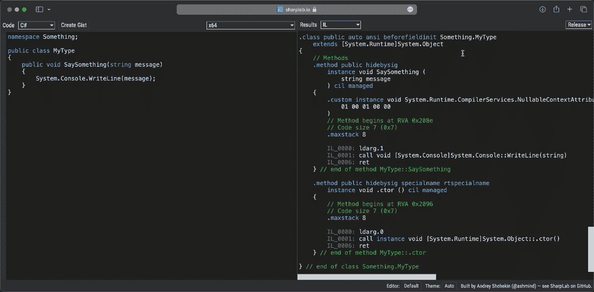

# 第六章：动态代理生成

在前面的章节中，我们探讨了拥有.NET 运行时提供的强大元数据类型是多么强大，结合创建自己的元数据、分析它的能力，以及将其转换为有用的信息或根据它采取行动的能力。现在，我们将进一步探索，让代码根据元数据生成新的代码。

在本章中，我们将探讨如何利用你的代码在托管运行时环境中运行的事实，以及如何在你代码编译后创建新的代码。

我们将涵盖以下主题：

+   IL 和 Reflection.Emit 简介

+   创建动态程序集和模块

+   虚拟成员和重写

+   实现接口

完成本章后，你应该理解.NET 运行时的强大功能以及如何将元数据转换为新的代码，从而提高你的工作效率。

# 技术要求

本章的特定源代码可以在 GitHub 上找到（[`github.com/PacktPublishing/Metaprogramming-in-C-Sharp/tree/main/Chapter6`](https://github.com/PacktPublishing/Metaprogramming-in-C-Sharp/tree/main/Chapter6)）。

# IL 和 Reflection.Emit 简介

在*第二章*，*元编程概念*中，我们提到了 C#编译器将你的代码转换成什么。**IL**，即**中间语言**，是.NET 运行时理解的指令表示，并将其转换为针对你的代码运行的 CPU 的 CPU 指令。

由于.NET 运行时以这种方式动态地在你代码上运行，这意味着可以得出结论，你应该能够在程序执行时生成代码。幸运的是，情况确实如此。.NET API 包括一个专门用于生成代码的命名空间——**System.Reflection.Emit**。

使用**Emit** API，你可以从头开始创建任何你想要的构造，引入不存在于任何源代码中的新类型，或者创建从其他类型继承并添加新功能的新类型。

对于所有不同类型的工件，你可以创建类、方法、属性等。存在特定的构建器类型——**TypeBuilder**用于类和**MethodBuilder**用于方法。属性也被视为方法，并且基于一个前缀具有**get_**或**set_**名称的约定，分别代表**get**或**set**方法。

使用构建器，你可以调用一个名为**.GetILGenerator()**的方法。这个方法将返回一个名为**ILGenerator**的类型。**ILGenerator**方法就是所有魔法发生的地方。这是你可以用来生成实际代码的类型。你主要使用的方法是**.Emit()**方法。**.Emit()**方法有几个重载，是用于添加构成你程序的指令的方法。指令被称为**操作码**，有一个包含所有允许指令或操作码的类，称为**OpCodes**。

所有不同的操作码都定义良好且文档齐全，你可以在微软的文档页面上找到所有这些文档的链接([`learn.microsoft.com/en-us/dotnet/api/system.reflection.emit.opcodes?view=net-7.0#fields`](https://learn.microsoft.com/en-us/dotnet/api/system.reflection.emit.opcodes?view=net-7.0#fields))。

尽管它们定义良好且文档齐全，但要正确地准备指令顺序可能会很困难且令人畏惧。因此，从实际代码中推导指令是一个好主意。这样做的一个很好的资源是使用像**Sharplab**([`sharplab.io`](https://sharplab.io))这样的工具。使用 Sharplab，你可以查看执行常规 C#代码所需的指令，以便能够重现它。

为了达到生成 IL 代码的实际阶段，你需要跳过几个额外的步骤。

# 创建动态组件和模块

当你的代码经过编译并输出为可运行的二进制文件时。这段代码被认为是静态的，不能被修改。表示为组件的二进制文件是完全静态的；你不仅不能修改其中的代码，而且也不能向其中添加内容。如果任意代码可以修改运行中的代码，这将是一个安全风险。

为了克服这一点，你必须显式地创建一个新的组件，它只存在于内存中。这被称为**动态组件**。

所有组件也都有模块的概念。一个组件至少必须有一个模块。模块是一个容器，它包含具体的 IL 代码及其相关的元数据，而组件是一个更高层次的抽象容器，包含更多的元数据，实际上可以引用多个**.dll**文件。通常，你只会看到组件和模块之间的一对一关系。

开始这个过程非常简单：

```cs
using System.Reflection;
using System.Reflection.Emit;
var assemblyName = new AssemblyName("MyDynamicAssembly");
var dynamicAssembly = AssemblyBuilder.Define
  DynamicAssembly(assemblyName, AssemblyBuilderAccess.Run);
var dynamicModule = dynamicAssembly.DefineDynamicModule
  ("MyDynamicModule");
```

代码定义了所需的两个容器——首先，**.DefineDynamicAssembly()**方法创建动态组件，并告诉它提供一个你将用于运行代码的组件。一旦你有了动态组件，你调用**.DefineDynamicModule()**来获取你将生成实际运行代码的容器。

你应该考虑的一件事是动态程序集和动态模块的名称。程序集名称需要在运行过程中是唯一的，并且在程序集内部，每个模块也需要一个唯一的名称。因此，如果你打算创建多个动态程序集以及它们内部的多个模块，你需要保证名称的唯一性。

做这件事最简单的方法是利用**Guid**并将其混合到你的名字中。以下代码将给出一个唯一的名称：

```cs
static string CreateUniqueName(string prefix)
{
    var uid = Guid.NewGuid().ToString();
    uid = uid.Replace('-', '_');
    return $"{prefix}{uid}";
}
```

代码生成一个新的**Guid**并将其与一个前缀组合。前缀的目的是能够识别具有友好名称的不同程序集。在程序集名称中可以使用的字符有一些限制；这就是为什么你会看到**-**被替换为**_**。

如果你的代码只需要一个动态程序集以及它内部的动态模块，那么创建唯一名称的需求可能不是必需的，因为你可以相当容易地给它一个唯一的名称。

你可能甚至不需要有多个动态程序集，以及很可能不需要在动态程序集内部有多个模块。拥有一个全局动态程序集是完全可行的。这完全取决于你的代码以及你是否会为不同的目的生成具有相同名称的类型，这些类型应该被分组到特定的程序集/模块对容器中。

在设置了动态程序集和动态模块之后，我们可以开始生成一些代码。

让我们动态创建一个没有源代码的简单类型，它可以打印出一条消息。如果我们用 C#编写，目标类型看起来可能如下所示：

```cs
public class MyType
{
    public void SaySomething(string message)
    {
        System.Console.WriteLine(message);
    }
}
```

如果我们将此代码放入 Sharplab（[`sharplab.io`](https://sharplab.io)），我们可以看到其背后的 IL 代码，并将其作为我们想要实现的模板：



图 6.1 – IL 代码

1.  首先创建一个名为**Chapter6**的文件夹。在命令行界面中打开此文件夹，并创建一个新的控制台项目：

    ```cs
    dotnet new console
    ```

添加一个名为**MyTypeGenerator.cs**的文件。首先让文件看起来像以下这样：

```cs
using System.Reflection;
using System.Reflection.Emit;
namespace Chapter6;
public class MyTypeGenerator
{
    public static Type Generate()
    {
        // Do the generation
    }
}
```

1.  如你所见，我们引入了两个命名空间——**System.Reflection**和**System.Reflection.Emit**。这些包含了我们将需要的 API。

我们想要做的第一件事是创建程序集和模块，并将以下内容添加到**Generate**方法中：

```cs
var name = new AssemblyName("MyDynamicAssembly");
var assembly = AssemblyBuilder.DefineDynamicAssembly(name,
  AssemblyBuilderAccess.Run);
var module = assembly.DefineDynamicModule
  ("MyDynamicModule");
```

从模块中，我们可以创建一个新的类型，并在类型内部创建一个方法。然后，在定义了模块之后，我们将以下内容追加到**Generate**方法中：

```cs
var typeBuilder = module.DefineType("MyType",
  TypeAttributes.Public | TypeAttributes.Class);
var methodBuilder = typeBuilder.DefineMethod
  ("SaySomething", MethodAttributes.Public);
methodBuilder.SetParameters(typeof(string));
methodBuilder.DefineParameter(0, ParameterAttributes.None,
  "message");
```

代码创建了一个名为**MyType**的公共类，然后定义了一个名为**SaySomething**的公共方法。在方法中，我们设置它有参数。该方法接受**param**，这允许我们定义一个或多个参数类型。我们最后要做的是定义参数。这是通过给它参数索引和名称来完成的。

重要提示

你赋予参数的**ParameterAttributes**值表示它没有任何特殊之处；它是一个常规参数。如果你想让它成为一个**out**或**ref**参数，你需要这样告诉它。

1.  现在你已经有了具有预期签名的方法的定义。现在是时候填写实际的代码了。

此方法的代码非常简单，因为我们只是将传入的参数传递给另一个方法。

方法定义就绪后，你可以开始构建代码。将以下代码追加到**生成**方法中：

```cs
var consoleType = typeof(Console);
var writeLineMethod = consoleType.GetMethod(nameof
  (Console.WriteLine), new[] { typeof(string) })!;
var methodILGenerator = methodBuilder.GetILGenerator();
methodILGenerator.Emit(OpCodes.Ldarg_1);
methodILGenerator.EmitCall(OpCodes.Call, writeLineMethod,
  new[] { typeof(string) });
methodILGenerator.Emit(OpCodes.Ret);
```

代码首先获取**System.Console**类型和名为**WriteLine**的方法，该方法接受一个简单的**string**。这个方法是你将要用来调用和转发最终在控制台产生消息的参数的方法。一旦你有了**WriteLine**方法，你需要为构建的**SaySomething**方法获取**ILGenerator**。然后，你做的第一件事是发出一个指令将实际传递给参数的参数加载到所谓的**评估堆栈**中。**OpCodes.Ldarg_1**指的是 1，这可能会显得有些反直觉。在实例类型的上下文中，**OpCodes.Ldarg_0**将代表**this**的值。参数加载到堆栈上后，你发出调用**Console**上的**WriteLine**方法的代码，给它传递参数的类型。完成你的方法后，你发出一个从方法返回的指令。

1.  **生成**方法的最后一部分是构建实际的**类型**并将其返回。将以下内容追加到**生成**方法中：

    ```cs
    return typeBuilder.CreateType()!;
    ```

**MyTypeGenerator**类的完整列表现在应该如下所示：

```cs
using System.Reflection;
using System.Reflection.Emit;
namespace Chapter6;
public class MyTypeGenerator
{
    public static Type Generate()
    {
        var name = new AssemblyName("MyDynamicAssembly");
        var assembly = AssemblyBuilder.DefineDynamic
          Assembly(name, AssemblyBuilderAccess.Run);
        var module = assembly.DefineDynamicModule
          ("MyDynamicModule");
        var typeBuilder = module.DefineType("MyType",
          TypeAttributes.Public | TypeAttributes.Class);
        var methodBuilder = typeBuilder.DefineMethod
          ("SaySomething", MethodAttributes.Public);
        methodBuilder.SetParameters(typedoc(string));
        var parameterBuilder = methodBuilder
          .DefineParameter(0, ParameterAttributes.None,
            "message");
        var consoleType = typeof(Console);
        var writeLineMethod = consoleType.GetMethod
          (nameof(Console.WriteLine), new[] { typeof
            (string) })!;
        var methodILGenerator = methodBuilder
          .GetILGenerator();
        methodILGenerator.Emit(OpCodes.Ldarg_1);
        methodILGenerator.EmitCall(OpCodes.Call,
          writeLineMethod, new[] { typeof(string) });
        methodILGenerator.Emit(OpCodes.Ret);
        return typeBuilder.CreateType()!;
    }
}
```

在你的第一个代码生成器就绪后，你想要试运行它。由于这是一个对编译器完全未知的类型，实际上没有方法可以编写标准的 C#代码来调用它。你将不得不回到反射来做这件事。

在**Chapter6**项目的**Program.cs**文件中，将现有代码替换为以下内容：

```cs
using Chapter6;
var myType = MyTypeGenerator.Generate();
var method = myType.GetMethod("SaySomething")!;
var myTypeInstance = Activator.CreateInstance(myType);
method.Invoke(myTypeInstance, new[] { "Hello world" });
```

代码调用你的新生成器以获取生成的**类型**。接下来，它要求生成的类型调用名为**SaySomething**的方法。然后，你使用.NET 中的**Activator**类型创建该类型的实例。从该方法中，你可以调用它并将实例作为第一个参数传递，然后添加它期望的数组中的参数。

使用**dotnet run**或，如果你更喜欢，你的 IDE 运行此代码，你应该得到一条简单的消息：

```cs
Hello world
```

中间语言以及运行时如何与指令交互是逻辑的，但与编写 C#相比可能不太直观。然而，它赋予你巨大的力量并使新的场景成为可能。

# 虚拟成员和重写

根据我的经验，从头开始生成在编译时不存在的新类型并不是最常见的用例。我发现自己，大多数情况下，只是想自动化一些我觉得繁琐且被迫从必须使用的库中执行的任务。

在这种情况下，通常的做法是取一个类型，创建一个新的类型，使其继承自该类型，然后开始重写行为。

由于 C#不像 Java 那样所有成员都是虚拟的，因此成员必须显式声明为虚拟。一个虚拟方法的例子是所有对象都会继承的方法——**ToString**方法。

让我们继续对**MyTypeGenerator**代码的工作，通过添加对**ToString**方法的重写来了解它是如何实现的：

1.  在**MyTypeGenerator**类的**Generate**方法中，在你返回类型之前，你需要定义一个新的方法，它将是**MyType**的**ToString**方法实现：

    ```cs
    var toStringMethod = typeof(object).GetMethod(nameof
      (object.ToString))!;
    var newToStringMethod = typeBuilder.DefineMethod(nameof
      (object.ToString), toStringMethod.Attributes,
        typeof(string), Array.Empty<Type>());
    var toStringGenerator = newToStringMethod.GetILGenerator();
    toStringGenerator.Emit(OpCodes.Ldstr, "A message from
      ToString()");
    toStringGenerator.Emit(OpCodes.Ret);
    typeBuilder.DefineMethodOverride(newToStringMethod,
      toStringMethod);
    ```

首先，代码从基类获取它想要重写的方法的引用。由于此类型没有特定的基类型，它将隐式地成为**object**。然后，你开始定义新的**ToString**方法，并指定它将返回**string**类型。由于**ToString**方法不接受任何参数，你只需传递一个空的**Type**数组。从方法定义中，你像之前一样获取**ILGenerator**。然后，你只需将字符串加载到评估堆栈中，这将是唯一的东西，并从方法返回。为了使其成为重写方法，你随后在类型构建器上调用**.DefineMethodOverride()**来告诉它你要重写哪个方法，并给出原始的**ToString**方法。

1.  打开**Program.cs**文件，添加一行代码来调用**ToString**方法，以验证其是否正常工作：

    ```cs
    using Chapter6;
    var myType = MyTypeGenerator.Generate();
    var method = myType.GetMethod("SaySomething")!;
    var myTypeInstance = Activator.CreateInstance(myType);
    method.Invoke(myTypeInstance, new[] { "Hello world" });
    Console.WriteLine(myTypeInstance); // Added line
    ```

运行程序应该会打印出以下消息：

```cs
A message from ToString()
```

在本章中，你已经学到了创建具有成员的类型以及从继承的基类型重写虚拟成员的基本构建块。所有这些都会让你走得很远。现在我们已经了解了生成代码的机制，让我们举一个更具体的例子。

# 实现接口

除了从基类型重写虚拟成员之外，通常还需要实现接口，以满足使用第三方库的需求。接口的实现可能对你的代码并不重要，但它是一种被迫执行的任务，以启用某些行为。

任何进行过任何 XAML 风格开发的人都会遇到一个名为**INotifyPropertyChanged**的接口。**INotifyPropertyChanged**接口是数据绑定引擎能够识别并自动使用的一个接口，如果一个类型实现了它。它的目的是在属性发生变化时通知使用你对象的任何人。当你有一个 UI 元素自动反映后台数据的变化时，这非常有用。

**INotifyPropertyChanged**接口本身非常简单，看起来如下：

```cs
public interface INotifyPropertyChanged
{
    event PropertyChangedEventHandler? PropertyChanged;
}
```

对于实现**INotifyPropertyChanged**的对象，这意味着它需要在值设置时为每个属性实现逻辑。这可能会非常繁琐，并且会使你的代码库膨胀，包含不属于你领域代码。

假设你有一个代表人的对象：

```cs
public class Employee
{
    public string FirstName { get; set; }
    public string LastName { get; set; }
}
```

由于绑定目的需要**INotifyPropertyChanged**，对象只需对其中一个属性进行以下操作：

```cs
using System.ComponentModel;
public class Employee : INotifyPropertyChanged
{
    private string _firstName;
    public string FirstName
    {
        get { return _firstName; }
        set
        {
            _firstName = value;
            RaisePropertyChanged("FirstName");
        }
    }
    public event PropertyChangedEventHandler
      PropertyChanged;
    protected void RaisePropertyChanged(string
      propertyName)
    {
        if (PropertyChanged != null)
        {
            PropertyChanged(this, new Property
              ChangedEventArgs(propertyName));
        }
    }
}
```

如你所见，代码从每个属性的简单单行语句变成了具有显式 getter、setter 和私有字段来保存实际值的结构。在 setter 中，你必须引发**PropertyChanged**事件，并且一个典型的模式是有一个方便的方法，用于所有属性的重用。

多亏了代码生成，你可以让这一切都消失，让你的代码回到可读性和可维护性更高的状态，从而在过程中提高你的生产力。

在**Chapter6**文件夹中，创建一个名为**Person.cs**的新文件，并使其看起来如下：

```cs
namespace Chapter6;
public class Employee
{
    public virtual string FirstName { get; set; }
    public virtual string LastName { get; set; }
}
```

现在，**Person**类代表的目标版本不包含任何**INotifyPropertyChanged**相关的内容。在编译时，它没有实现**INotifyPropertyChanged**接口，但我们将使其在运行时实现。

由于我们已经使属性**virtual**，我们可以创建一个新的类型，它从**Person**类型继承并覆盖属性以实现我们想要的功能。

## NotifyObjectWeaver 类

为了能够做到我们想要的事情，我们需要做以下事情：

1.  创建一个新的类型。

1.  从现有类型继承。

1.  实现接口**INotifyPropertyChanged**。

1.  添加一个处理属性变化逻辑的方法。

1.  覆盖任何虚拟方法并实现属性变化时所需的代码。

此外，也常见到一些属性依赖于其他属性——例如，将多个属性组合在一起。这些属性也应该通知你它们的变化，因此你希望有一种机制来处理这一点。

首先，在**Chapter6**项目中添加一个名为**NotifyObjectWeaver.cs**的文件。然后，向文件中添加以下内容：

```cs
using System.ComponentModel;
using System.Linq.Expressions;
using System.Reflection;
using System.Reflection.Emit;
namespace Chapter6;
public static class NotifyingObjectWeaver
{
    const string DynamicAssemblyName = "Dynamic Assembly";
    const string DynamicModuleName = "Dynamic Module";
    const string PropertyChangedEventName = nameof
      (INotifyPropertyChanged.PropertyChanged);
    const string OnPropertyChangedMethodName =
      "OnPropertyChanged";
    static readonly Type VoidType = typeof(void);
    static readonly Type DelegateType = typeof(Delegate);
    const MethodAttributes EventMethodAttributes =
        MethodAttributes.Public | MethodAttributes
          .HideBySig | MethodAttributes.Virtual;
    const MethodAttributes OnPropertyChanged
      MethodAttributes =
        MethodAttributes.Public | MethodAttributes
          .HideBySig;
}
```

代码添加了在代码生成过程中将使用的常见常量和静态变量，确保你不需要在代码中重复它们，并且它们聚集在顶部以获得更好的结构。

通过这种方式，你现在有了**NotifyObjectWeaver**类的起点。

### 创建类型

你将要开始编写的是定义类型的代码。这基本上是你之前所做过的，只是我们现在将使你动态创建的类型继承自基类型，并实现一个接口：

```cs
static TypeBuilder DefineType(Type type)
{
    var name = $"{type.Name}_Proxy";
    var typeBuilder = DynamicModule.DefineType(name,
      TypeAttributes.Public | TypeAttributes.Class);
    typeBuilder.SetParent(type);
    var interfaceType = typeof(INotifyPropertyChanged);
    typeBuilder.AddInterfaceImplementation(interfaceType);
    return typeBuilder;
}
```

调用 **.SetParent()** 是继承的关键。它指示构建器将方法提供的 **Type** 输入作为父类。接下来，你需要指示构建器你将实现 **INotifyPropertyChanged** 接口。

### 实现 **INotifyPropertyChanged** 接口

**INotifyPropertyChanged** 接口上只有一个字段，即我们需要实现的 **PropertyChanged** 事件字段。我们需要添加代码来定义事件，并实现添加和从事件中移除事件处理器的逻辑。

在 **NotifyObjectWeaver** 类中添加以下方法：

```cs
static void DefineEvent(TypeBuilder typeBuilder, Type
  eventHandlerType, FieldBuilder fieldBuilder)
{
    var eventBuilder = typeBuilder.DefineEvent(nameof
      (INotifyPropertyChanged.PropertyChanged),
        EventAttributes.None, eventHandlerType);
    DefineAddMethodForEvent(typeBuilder, eventHandlerType,
      fieldBuilder, eventBuilder);
    DefineRemoveMethodForEvent(typeBuilder,
      eventHandlerType, fieldBuilder, eventBuilder);
}
```

**DefineEvent** 方法在类型上定义实际的事件，然后调用两个方法来定义事件的 **add** 和 **remove** 方法。

将以下方法添加到 **NotifyObjectWeaver** 类中：

```cs
static void DefineAddMethodForEvent(TypeBuilder
  typeBuilder, Type eventHandlerType, FieldBuilder
    fieldBuilder, EventBuilder eventBuilder)
{
    var combineMethodInfo = DelegateType.GetMethod
      ("Combine", BindingFlags.Public |
        BindingFlags.Static, null,
          new[] { DelegateType, DelegateType }, null)!;
    var addEventMethod = string.Format("add_{0}",
      PropertyChangedEventName);
    var addMethodBuilder = typeBuilder.DefineMethod
      (addEventMethod, EventMethodAttributes, VoidType,
        new[] { eventHandlerType });
    var addMethodGenerator = addMethodBuilder
      .GetILGenerator();
    addMethodGenerator.Emit(OpCodes.Ldarg_0);
    addMethodGenerator.Emit(OpCodes.Ldarg_0);
    addMethodGenerator.Emit(OpCodes.Ldfld, fieldBuilder);
    addMethodGenerator.Emit(OpCodes.Ldarg_1);
    addMethodGenerator.EmitCall(OpCodes.Call,
      combineMethodInfo, null);
    addMethodGenerator.Emit(OpCodes.Castclass,
      eventHandlerType);
    addMethodGenerator.Emit(OpCodes.Stfld, fieldBuilder);
    addMethodGenerator.Emit(OpCodes.Ret);
    eventBuilder.SetAddOnMethod(addMethodBuilder);
}
```

代码添加了一个方法，按照惯例，当添加事件处理器时将使用此方法，**add_PropertyChanged**。它使用在类开头添加的 **Delegate** 类型来获取将被调用的 **Combine** 方法。

然后，它生成所需的 IL 代码，通过调用检索到的 **Combine** 方法，将传入的回调添加到在发生更改时将被调用的回调中。

为了保险起见，你还应该添加相反的方法——即移除已添加的回调的方法。将以下方法添加到 **NotifyObjectWeaver** 类中：

```cs
static void DefineRemoveMethodForEvent(TypeBuilder
  typeBuilder, Type eventHandlerType, FieldBuilder
    fieldBuilder, EventBuilder eventBuilder)
{
    var removeEventMethod = string.Format("remove_{0}",
      PropertyChangedEventName)!;
    var removeMethodInfo = DelegateType.GetMethod("Remove",
      BindingFlags.Public | BindingFlags.Static, null,
        new[] { DelegateType, DelegateType }, null)!;
    var removeMethodBuilder = typeBuilder.DefineMethod
      (removeEventMethod, EventMethodAttributes, VoidType,
        new[] { eventHandlerType });
    var removeMethodGenerator = removeMethodBuilder
      .GetILGenerator();
    removeMethodGenerator.Emit(OpCodes.Ldarg_0);
    removeMethodGenerator.Emit(OpCodes.Ldarg_0);
    removeMethodGenerator.Emit(OpCodes.Ldfld,
      fieldBuilder);
    removeMethodGenerator.Emit(OpCodes.Ldarg_1);
    removeMethodGenerator.EmitCall(OpCodes.Call,
      removeMethodInfo, null);
    removeMethodGenerator.Emit(OpCodes.Castclass,
      eventHandlerType);
    removeMethodGenerator.Emit(OpCodes.Stfld,
      fieldBuilder);
    removeMethodGenerator.Emit(OpCodes.Ret);
    eventBuilder.SetRemoveOnMethod(removeMethodBuilder);
}
```

**remove** 的实现与 **add** 几乎相同，区别在于从 **Delegate** 类型获取 **Remove** 方法并调用 **.SetRemoveOnMethod()**。

### **OnPropertyChanged** 方法

在事件逻辑就绪后，你现在需要一个私有方法，所有属性都将调用它——一个将执行所有繁重工作的 **OnPropertyChanged** 方法。

首先在 **NotifyObjectWeaver** 类中添加以下方法：

```cs
static MethodBuilder DefineOnPropertyChangedMethod
  (TypeBuilder typeBuilder, FieldBuilder
    propertyChangedFieldBuilder)
{
    var onPropertyChangedMethodBuilder =
      typeBuilder.DefineMethod(OnPropertyChangedMethodName,
        OnPropertyChangedMethodAttributes, VoidType,
    new[] { typeof(string) });
    var onPropertyChangedMethodGenerator =
      onPropertyChangedMethodBuilder.GetILGenerator();
    var invokeMethod = typeof(PropertyChangedEventHandler)
      .GetMethod(nameof(PropertyChangedEventHandler
        .Invoke))!;
}
```

代码定义了带有 **string** 签名的 **OnPropertyChanged** 方法，其中包含已更改属性的名称。

然后，在 **DefineOnPropertyChangedMethod** 的末尾添加以下内容，以声明一个用于存储代码将创建的事件参数类型的局部变量：

```cs
var propertyChangedEventArgsType = typeof(
  PropertyChangedEventArgs);
onPropertyChangedMethodGenerator.DeclareLocal(
  propertyChangedEventArgsType);
```

现在，你需要代码来检查 **PropertyChanged** 事件字段是否为空，并具有代码可以跳转到的 **propertyChangedNullLabel** 标签，如果值为空。

在 **DefineOnPropertyChangedMethod** 方法的末尾添加以下代码：

```cs
var propertyChangedNullLabel = onPropertyChangedMethod
  Generator.DefineLabel();
onPropertyChangedMethodGenerator.Emit(OpCodes.Ldnull);
onPropertyChangedMethodGenerator.Emit(OpCodes.Ldarg_0);
onPropertyChangedMethodGenerator.Emit(OpCodes.Ldfld,
  propertyChangedFieldBuilder);
onPropertyChangedMethodGenerator.Emit(OpCodes.Ceq);
onPropertyChangedMethodGenerator.Emit(OpCodes.Brtrue_S,
  propertyChangedNullLabel);
```

现在，你需要添加代码来创建带有传递给 **OnPropertyChanged** 方法的参数的 **PropertyChangedEventArgs** 实例。然后，调用 **invoke** 方法：

```cs
onPropertyChangedMethodGenerator.Emit(OpCodes.Ldarg_1);
onPropertyChangedMethodGenerator.Emit(OpCodes.Newobj,
  propertyChangedEventArgsType.GetConstructor(new[] {
    typeof(string) })!);
onPropertyChangedMethodGenerator.Emit(OpCodes.Stloc_0);
onPropertyChangedMethodGenerator.Emit(OpCodes.Ldarg_0);
onPropertyChangedMethodGenerator.Emit(OpCodes.Ldfld,
  propertyChangedFieldBuilder);
onPropertyChangedMethodGenerator.Emit(OpCodes.Ldarg_0);
onPropertyChangedMethodGenerator.Emit(OpCodes.Ldloc_0);
onPropertyChangedMethodGenerator.EmitCall(OpCodes.Callvirt,
  invokeMethod, null);
```

最后一个拼图是标记如果为空，null 检查将跳转到的标签，然后从方法中返回。在 **DefineOnPropertyChangedMethod** 方法的末尾添加以下内容：

```cs
onPropertyChangedMethodGenerator.MarkLabel(propertyChanged
  NullLabel);
onPropertyChangedMethodGenerator.Emit(OpCodes.Ret);
return onPropertyChangedMethodBuilder;
```

定义 **OnPropertyChanged** 方法的代码现在已完成。现在，你需要定义属性。

### 覆盖属性

我们一开始的一个要求是，我们希望能够通知其他属性以创建复合体，或者如果相关的话，让另一个属性重新评估：

1.  添加一个名为 **NotifyChangedForAttribute.cs** 的文件，并使其看起来如下：

    ```cs
    namespace Chapter6;
    [AttributeUsage(AttributeTargets.Property)]
    public class NotifyChangesForAttribute : Attribute
    {
        public NotifyChangesForAttribute(params string[]
          propertyNames)
        {
            PropertyNames = propertyNames;
        }
        public string[] PropertyNames { get; }
    }
    ```

此自定义属性接受一个 **param** 数组，其中包含将因更改而调用的属性名称，以及更改的属性。

1.  为了方便起见，你应该添加一个方法来获取通知的属性，基于 **PropertyInfo** 对属性进行操作。在 **NotifyingObjectWeaver** 类中添加以下方法：

    ```cs
    static string[] GetPropertiesToNotifyFor(PropertyInfo
      property)
    {
        var properties = new List<string>
        {
            property.Name
        };
        foreach (var attribute in (NotifyChangesForAttribute[])
          property.GetCustomAttributes(typeof(NotifyChangesFor
            Attribute), true))
        {
            properties.AddRange(attribute.PropertyNames);
        }
        return properties.ToArray();
    }
    ```

代码结合属性名称，查找 **NotifyChangesForAttribute** 属性，并添加声明的名称。

1.  你现在可以添加定义新类型上所有属性的方法。将以下方法添加到 **NotifyingObjectWeaver** 类中：

    ```cs
    static void DefineProperties(TypeBuilder typeBuilder, Type
      baseType, MethodBuilder onPropertyChangedMethodBuilder)
    {
        var properties = baseType.GetProperties();
        var query = from p in properties
                    where p.GetGetMethod()!.IsVirtual && !p
                      .GetGetMethod()!.IsFinal
                    select p;
        foreach (var property in query)
        {
            DefineGetMethodForProperty(property, typeBuilder);
            DefineSetMethodForProperty(property, typeBuilder,
              onPropertyChangedMethodBuilder);
        }
    }
    ```

代码检查基类型，获取所有属性，并筛选出仅虚拟方法。然后，对于它找到的所有属性，它定义属性的 **get** 和 **set** 方法。

1.  将以下方法添加到 **NotifyingObjectWeaver** 类中：

    ```cs
    static void DefineSetMethodForProperty(PropertyInfo
      property, TypeBuilder typeBuilder, MethodBuilder
        onPropertyChangedMethodBuilder)
    {
        var setMethodToOverride = property.GetSetMethod();
        if (setMethodToOverride is null)
        {
            return;
        }
        var setMethodBuilder = typeBuilder.DefineMethod
          (setMethodToOverride.Name, setMethodToOverride
            .Attributes, VoidType, new[] { property
              .PropertyType });
        var setMethodGenerator = setMethodBuilder
          .GetILGenerator();
        var propertiesToNotifyFor = GetPropertiesToNotifyFor
          (property);
        setMethodGenerator.Emit(OpCodes.Ldarg_0);
        setMethodGenerator.Emit(OpCodes.Ldarg_1);
        setMethodGenerator.Emit(OpCodes.Call,
          setMethodToOverride);
        foreach (var propertyName in propertiesToNotifyFor)
        {
            setMethodGenerator.Emit(OpCodes.Ldarg_0);
            setMethodGenerator.Emit(OpCodes.Ldstr,
              propertyName);
            setMethodGenerator.Emit(OpCodes.Call,
              onPropertyChangedMethodBuilder);
        }
        setMethodGenerator.Emit(OpCodes.Ret);
        typeBuilder.DefineMethodOverride(setMethodBuilder,
          setMethodToOverride);
    }
    ```

**set_*** 方法是执行通知的方法。代码定义了该方法，并首先调用基类型的 **set** 方法，以便基类型可以为自己处理设置的值。然后，它遍历所有要通知的属性，并添加代码来调用带有属性名称的 **OnPropertyChanged** 方法。

1.  获取值的方式略有不同，因为你只想让它读取到基类型并从中获取值。

将以下方法添加到 **NotifyingObjectWeaver** 类中：

```cs
static void DefineGetMethodForProperty(PropertyInfo
  property, TypeBuilder typeBuilder)
{
    var getMethodToOverride = property.GetGetMethod()!;
    var getMethodBuilder = typeBuilder.DefineMethod
      (getMethodToOverride.Name, getMethodToOverride
        .Attributes, property.PropertyType,
          Array.Empty<Type>());
    var getMethodGenerator = getMethodBuilder
      .GetILGenerator();
    var label = getMethodGenerator.DefineLabel();
    getMethodGenerator.DeclareLocal(property.PropertyType);
    getMethodGenerator.Emit(OpCodes.Ldarg_0);
    getMethodGenerator.Emit(OpCodes.Call,
      getMethodToOverride);
    getMethodGenerator.Emit(OpCodes.Stloc_0);
    getMethodGenerator.Emit(OpCodes.Br_S, label);
    getMethodGenerator.MarkLabel(label);
    getMethodGenerator.Emit(OpCodes.Ldloc_0);
    getMethodGenerator.Emit(OpCodes.Ret);
    typeBuilder.DefineMethodOverride(getMethodBuilder,
      getMethodToOverride);
}
```

你现在拥有了执行属性代码生成所需的全部代码，以及引发 **PropertyChanged** 事件的函数。

### 初始化和公共 API

最后一个拼图将是执行主要初始化，定义动态程序集和模块。

在 **NotifyingObjectWeaver** 类中添加以下内容：

```cs
static readonly AssemblyBuilder DynamicAssembly;
static readonly ModuleBuilder DynamicModule;
static readonly Dictionary<Type, Type> Proxies = new();
static NotifyingObjectWeaver()
{
    var assemblyName = new AssemblyName
      (DynamicAssemblyName);
    DynamicAssembly = AssemblyBuilder
      .DefineDynamicAssembly(assemblyName,
        AssemblyBuilderAccess.Run);
    DynamicModule = DynamicAssembly.DefineDynamicModule
      (DynamicModuleName);
}
The code introduces a private Proxies field. This will serve as a cache to avoid generating the same type multiple times every time one needs a proxy of a type.
```

你现在需要一个公共 API，可以从外部调用以获取其他类型的代理类型。

将以下代码添加到 **NotifyingObjectWeaver** 类中：

```cs
public static Type GetProxyType(Type type)
{
    Type proxyType;
    if (Proxies.ContainsKey(type))
    {
        proxyType = Proxies[type];
    }
    else
    {
        proxyType = CreateProxyType(type);
        Proxies[type] = proxyType;
    }
    return proxyType;
}
```

**GetProxyType** 方法首先检查是否存在给定类型的代理类型，如果存在，则返回现有的代理类型；如果缓存中没有，则创建代理类型。

### 使用 NotifyingObjectWeaver

现在你已经拥有了一个功能齐全的对象编织器。让我们在 **Program.cs** 文件中试运行它。添加以下代码：

```cs
var type = NotifyingObjectWeaver.GetProxyType
  (typeof(Person));
Console.WriteLine($"Type name : {type}");
var instance = (Activator.CreateInstance(type) as
  INotifyPropertyChanged)!;
instance.PropertyChanged += (sender, e) =>
  Console.WriteLine($"{e.PropertyName} changed");
var instanceAsViewModel = (instance as Person)!;
instanceAsViewModel.FirstName = "John";
```

代码要求一个包装后的类型，然后创建它的一个实例。由于它现在实现了**INotifyPropertyChanged**，我们可以简单地将其转换为该类型，并与之交互**PropertyChanged**事件。

由于新类型继承自**Person**类，我们也可以将其转换为该类型，并设置其属性。

当你运行这个程序时，你应该看到以下结果：

```cs
Type name : Person6e46bfa7_e47a_4299_8ae6_f928b8a027ee
FirstName changed
```

现在是尝试你添加的**NotifyChangesFor**功能的好时机。打开**Person.cs**文件，将其修改为以下样子：

```cs
public class Person
{
    [NotifyChangesFor(nameof(FullName))]
    public virtual string FirstName { get; set; } =
      string.Empty;
    [NotifyChangesFor(nameof(FullName))]
    public virtual string LastName { get; set; } =
      string.Empty;
    public virtual string FullName => $"{FirstName}
      {LastName}";
}
```

由于**FullName**是**FirstName**和**LastName**的组合，因此当这些属性中的任何一个发生变化时通知是有意义的。

运行程序现在应该会给你以下结果：

```cs
Type name : Person6e46bfa7_e47a_4299_8ae6_f928b8a027ee
FirstName changed
FullName changed
```

GitHub 仓库中的代码具有更多功能，可以作为参考。例如，如果基类型有一个接受参数的构造函数，你应该在类型中实现相同的构造函数，并将构造函数参数传递给基构造函数。

你可能会遇到另一个常见的情况，即需要能够忽略属性。由于本章的实现是一个**opt-out**模型，所有虚拟属性都被视为通知变化的属性。这可能并不总是正确的，但很可能正是大多数属性所需要的东西。因此，你需要有一种方法来忽略这些属性。

请查看 GitHub 仓库中的完整列表，你可以看到这些功能是如何实现的。

# 摘要

在本章中，我们学习了拥有托管运行时环境的力量，看到我们如何通过动态创建将在与预编译代码相同的条件下执行代码来充分利用它。

这样的功能几乎有无穷的可能性。它作为自动化繁琐任务和优化开发者体验的方式非常有帮助，但它可以用于更多的事情。例如，如果你有一个动态连接到其他系统的系统，并且类型是通过配置或类似方式动态创建的，那么，而不是通过如**Dictionary<,>**类型这样的无类型机制来持有属性值，一种优化方法是在运行时动态创建类型。好处是，你将拥有在运行时类型安全的某种东西。这也可能对你的系统性能提升有所帮助，因为你不需要从字典中查找值。

在下一章中，我们将深入研究一个名为**Expression**的构造函数，了解它如何表示代码和逻辑，以及如何从**Expression**中提取信息。
