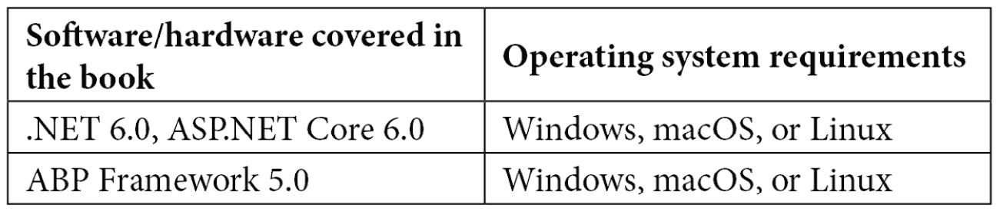

# 前言

*ABP 框架是一个完整的现代 Web 应用基础设施，通过遵循软件开发最佳实践和约定来创建。ABP 提供了一个高级框架和生态系统，帮助您实现“不要重复自己”（DRY）原则，并专注于您的业务代码。*

*本书由 ABP 框架的创造者撰写，将帮助您从头开始全面理解 ABP 框架和现代 Web 应用开发技术。通过逐步解释基本概念和实际示例，您将了解现代 Web 解决方案的需求以及 ABP 框架如何使开发自己的解决方案变得愉快。您将发现企业 Web 应用开发的常见需求，并探索 ABP 框架提供的基础设施。在本书中，您将掌握构建可维护和模块化 Web 解决方案的软件开发最佳实践。*

*本书结束时，您将能够创建一个完整的 Web 解决方案，该解决方案易于开发、维护和测试。*

# 本书面向对象

*本书面向希望学习软件架构和最佳实践，使用 Microsoft 技术和 ABP 框架构建可维护的 Web 解决方案的 Web 开发者。要开始阅读本书，需要具备 C#和 ASP.NET Core 的基本知识。*

# 本书涵盖内容

*第一章**，现代软件开发与 ABP 框架*，讨论了开发商业应用时面临的常见挑战，并解释了 ABP 如何解决这些挑战。

*第二章**，ABP 框架入门*，解释了您如何使用 ABP 框架创建和运行新的解决方案。

*第三章**，逐步应用开发*，是本书中最长的章节，通过一个广泛的示例应用展示了使用 ABP 框架进行应用开发。这是将所有内容整合在一起的主要章节。在本章之后，您可能不会完全理解所有 ABP 功能，但将能够使用 ABP 的基本概念创建自己的应用。您将在这里了解整体情况。然后，您将在下一章中填补空白，了解所有细节。

*第四章**，理解参考解决方案*，解释了参考解决方案 EventHub 的架构和结构，该解决方案作为本书读者的一个大示例应用被创建。建议您阅读本章，并在您的环境中使解决方案工作。

*第五章**，探索 ASP.NET Core 和 ABP 基础设施*，解释了一些基本概念，如依赖注入、基本模块化、配置和日志。这些主题对于理解使用 ABP 和 ASP.NET Core 进行开发至关重要。

*第六章**，与数据访问基础设施协同工作*，介绍了实体、仓储和单元工作概念，并展示了如何与 Entity Framework Core 和 MongoDB 协同工作。你将了解查询和操作数据以及控制数据库事务的不同方法。

*第七章**，探索横切关注点*，重点关注你在应用程序中需要的三项重要关注点：授权、验证和异常处理。这些关注点在应用程序的每个部分都得到了实现。你将学习如何定义和使用基于权限的授权系统，验证用户输入，并处理异常和异常消息。

*第八章**，使用 ABP 的功能和服务*，涵盖了 ABP 的一些常用功能，例如与当前用户协同工作、使用数据过滤和审计日志系统、缓存数据和本地化用户界面。

*第九章**，理解领域驱动设计*，是 DDD 相关章节的第一部分。它首先定义了 DDD 并基于 DDD 构建.NET 解决方案的结构。你将了解 ABP 的启动模板是如何从 DDD 的标准四层解决方案模型演变而来的。你还将了解 DDD 的构建块和原则。

*第十章**，DDD – 领域层*，继续探讨 DDD 与领域层的关系。它首先解释了 EventHub 领域对象，因为本章和下一章的示例将基于这些对象。你将学习如何设计聚合；实现领域服务、仓储和规范；并使用事件总线发布领域事件。

*第十一章**，DDD – 应用层*，重点关注应用层。你将了解设计、验证数据传输对象和实现应用程序服务的最佳实践。你还将在本章中找到讨论和示例，帮助你理解领域层和应用层的责任。

*第十二章**，与 MVC/Razor Pages 协同工作*，涵盖了开发在服务器端生成 HTML 的 MVC（Razor Pages）应用程序。你将了解 ABP 的主题方法，并学习基本方面，如捆绑和压缩、标签助手、表单、菜单和模态。你还将学习如何进行客户端到服务器的 API 调用，并使用 ABP 框架提供的 JavaScript 实用 API 来显示通知、消息框等。

*第十三章**，使用 Blazor WebAssembly UI 进行工作*，与上一章类似，解释了使用微软的新 Blazor SPA 框架和 ABP 框架进行 UI 开发。Blazor 是一个让开发者能够在浏览器中使用现有.NET 技能的出色框架。ABP 通过提供内置的解决方案来进一步推进，包括消费 HTTP API、实现主题化和提供实用服务，以简化常见的 UI 任务。

*第十四章**，构建 HTTP API 和实时服务*，解释了如何使用经典 ASP.NET 方法以及 ABP 的自动 API 控制器系统创建 API 控制器，并讨论了何时需要手动定义控制器。在本章中，您还将了解动态和静态 C#代理，以自动化.NET 客户端到您的 ABP 基于 HTTP 服务的 API 调用。本章还涵盖了使用 SignalR 与 ABP 框架。

*第十五章**，使用模块化进行工作*，通过一个示例案例解释了可重用应用程序模块的开发。我们将为 EventHub 解决方案创建一个支付模块，并在本章中解释该模块的结构。通过这种方式，您将了解如何开发可重用模块并将它们安装到应用程序中。

*第十六章**，实现多租户*，专注于另一个基本的 ABP 架构，多租户，这是一种构建**软件即服务**（**SaaS**）解决方案的架构模式。您将了解多租户是否是您解决方案的正确架构，并学习如何编写与 ABP 多租户系统兼容的代码。本章还涵盖了 ABP 的功能系统，该系统用于将应用程序功能定义为特性，并将它们分配给多租户解决方案中的租户。

*第十七章**，构建自动化测试*，解释了 ABP 的测试基础设施以及如何使用**xUnit**作为测试框架为您的应用程序构建单元和集成测试。您还将学习自动化测试的基础知识，例如断言、模拟和替换服务，以及处理异常。

# 为了充分利用这本书

*要开始阅读这本书，需要具备 C#和 ASP.NET Core 的基本知识。*



**如果您正在使用这本书的数字版，我们建议您亲自输入代码或从书的 GitHub 仓库（下一节中有一个链接）获取代码。这样做将帮助您避免与代码复制粘贴相关的任何潜在错误。**

# 下载示例代码文件

您可以从 GitHub 下载本书的示例代码文件：[`github.com/PacktPublishing/Mastering-ABP-Framework`](https://github.com/PacktPublishing/Mastering-ABP-Framework)。如果代码有更新，它将在 GitHub 仓库中更新。

我们还有其他来自我们丰富的图书和视频目录的代码包，可在[`github.com/PacktPublishing/`](https://github.com/PacktPublishing/)找到。查看它们吧！

# 下载彩色图像

我们还提供了一份包含本书中使用的截图和图表的彩色 PDF 文件。您可以从这里下载：[`static.packt-cdn.com/downloads/9781801079242_ColorImages.pdf`](https://static.packt-cdn.com/downloads/9781801079242_ColorImages.pdf)

# 使用的约定

本书使用了多种文本约定。

`文本中的代码`：表示文本中的代码单词、数据库表名、文件夹名、文件名、文件扩展名、路径名、虚拟 URL、用户输入和 Twitter 昵称。以下是一个示例：“如果您想指定数据库连接字符串，您也可以像以下示例中那样传递`--connection-string`参数：”

代码块设置如下：

```cs
"ConnectionStrings": {
  "Default": "Server=(LocalDb)\\MSSQLLocalDB;Database=ProductManagement;Trusted_Connection=True"
}
```

任何命令行输入或输出都应如下编写：

```cs
dotnet tool install -g Volo.Abp.Cli
```

**粗体**：表示新术语、重要单词或您在屏幕上看到的单词。例如，菜单或对话框中的单词以**粗体**显示。以下是一个示例：“ABP 框架提供了一个预构建的**应用程序启动模板**。”

小贴士或重要提示

看起来是这样的。

# 联系我们

我们始终欢迎读者的反馈。

在邮件主题中提及书名，并发送至`customercare@packtpub.com`。

**勘误表**：尽管我们已经尽一切努力确保内容的准确性，但错误仍然可能发生。如果您在这本书中发现了错误，我们将非常感激您向我们报告。请访问[www.packtpub.com/support/errata](http://www.packtpub.com/support/errata)并填写表格。

通过链接到材料发送至`copyright@packt.com`。

**如果您有兴趣成为作者**：如果您在某个主题上具有专业知识，并且您有兴趣撰写或为书籍做出贡献，请访问[authors.packtpub.com](http://authors.packtpub.com)。
