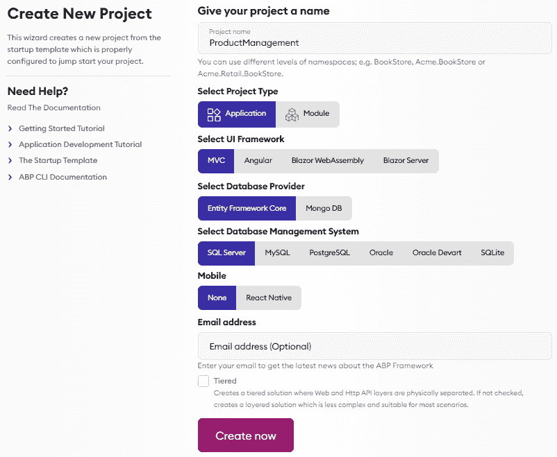
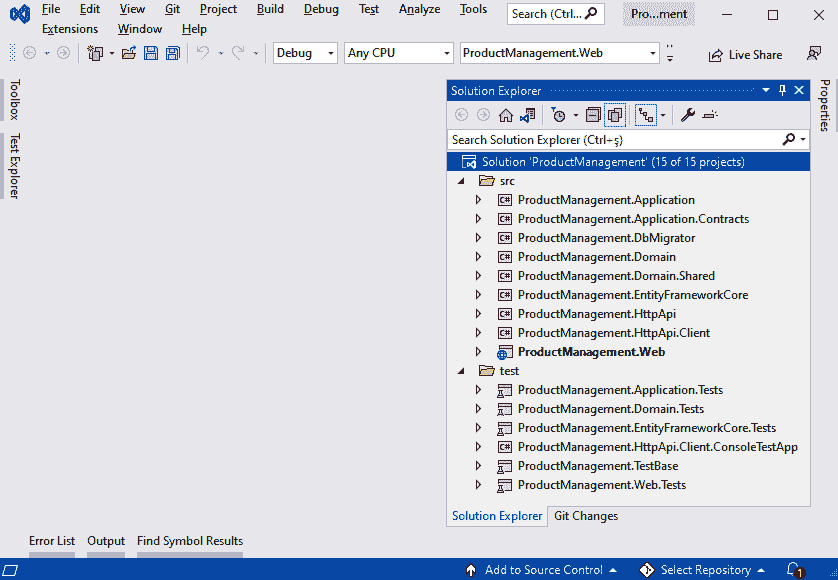
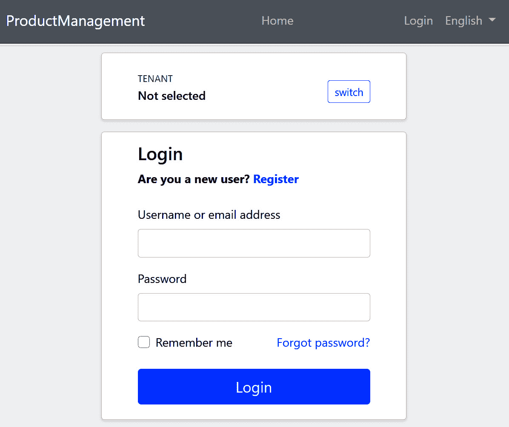
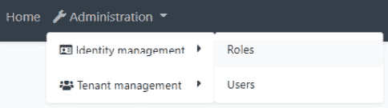
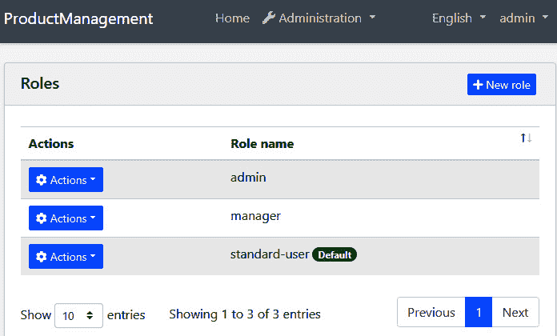

# 第二章：*第二章*：ABP 框架入门

ABP 框架以大量 NuGet 和 **Node 包管理器 (NPM)** 包的形式分发。它具有模块化设计，因此您可以添加和使用您需要的包。然而，也有一些预构建的解决方案模板，您通常希望从它们开始。

我们将了解如何准备我们的开发环境并使用 ABP 的启动模板创建解决方案。到本章结束时，您将拥有一个使用 ABP 框架构建的运行解决方案。

本章包括以下主题：

+   安装 ABP CLI

+   创建新的解决方案

+   运行解决方案

+   探索预构建模块

# 技术要求

在开始使用 ABP 框架之前，您需要在您的计算机上安装一些工具。

## IDE/编辑器

本书假设您正在使用 **Visual Studio 2022**（v10.0，支持 .NET 6.0）或更高版本。如果您尚未安装它，**社区版**在 [`visualstudio.microsoft.com`](https://visualstudio.microsoft.com) 上免费提供。但是，您可以使用您喜欢的 **集成开发环境**（**IDE**）或编辑器，只要它支持使用 C# 开发 .NET 应用程序即可。

## .NET 6 SDK

如果您已安装 Visual Studio，您将已经安装了 **.NET 软件开发工具包 (SDK)**。否则，请从 [`dotnet.microsoft.com/download`](https://dotnet.microsoft.com/download) 安装 .NET 6.0 或更高版本。

## 数据库管理系统

ABP 框架可以与任何数据源一起工作。然而，有两个主要提供程序是预集成的：**Entity Framework Core**（**EF Core**）和 **MongoDB**。对于 EF Core，可以使用所有 **数据库管理系统**（**DBMS**），例如 SQL Server、MySQL、PostgreSQL、Oracle 等。

在本章中，我将使用 **SQL Server** 作为数据库管理系统 (DBMS)。启动解决方案使用 **LocalDB**，这是一个与 Visual Studio 一起安装的简单 SQL Server 实例。但是，您可能想使用 SQL Server 的完整版本。在这种情况下，您可以从 [`www.microsoft.com/sql-server/sql-server-downloads`](https://www.microsoft.com/sql-server/sql-server-downloads) 下载 **SQL Server 开发者版**。

# 安装 ABP CLI

许多现代框架都提供 CLI，ABP 框架也不例外。**ABP CLI** 是一个命令行实用程序，用于执行 ABP 应用的一些常见任务。它用于创建一个新的解决方案，其中 ABP 框架作为基本功能。

使用以下命令在终端安装它：

```cs
dotnet tool install -g Volo.Abp.Cli
```

如果您已经安装了它，您可以使用以下命令将其更新到最新版本：

```cs
dotnet tool update -g Volo.Abp.Cli
```

我们现在已准备好创建新的 ABP 解决方案。

# 创建新的解决方案

ABP 框架提供了一个预构建的应用程序启动模板。使用此模板创建新解决方案（项目）有两种方式，我们将现在探讨。

## 下载启动解决方案

你可以直接从[`abp.io/get-started`](https://abp.io/get-started)创建并下载一个解决方案。在此页面上，如图所示，你可以轻松选择**用户界面**（**UI**）框架、数据库提供者和其他可用选项：



图 2.1 – 下载新解决方案

值得注意的是此页面上的选项，因为它们直接影响你的解决方案的架构、结构和工具。

在`.sln`文件和你的代码库的根命名空间中。

对于**项目类型**，有两个选项，如下所示：

+   **模块**模板用于创建可重用的应用程序模块。

+   **应用程序**模板用于使用 ABP 框架构建 Web 应用程序。

使用**模块**模板将在*第十五章*，*使用模块化*中介绍。在这里，我选择了**应用程序**模板，因为我想要创建一个将在下一章中使用的新的 Web 应用程序。

在撰写本书时，有四个**UI 框架**选项可用，如下所示：

+   MVC/Razor Page

+   Angular

+   Blazor WebAssembly

+   Blazor Server

你可以选择最适合你的应用程序需求和个人或团队技能的选项。本书的*第四部分*，*用户界面和 API 开发*，将涵盖**MVC/Razor Page**和**Blazor**选项。你可以在 ABP 的文档中了解更多关于 Angular UI 的信息。在这里，我选择了**MVC/Razor Page**选项，因为我们将在下一章中使用它。

在撰写本书时，有两个数据库提供者选项可用，如下所示：

+   Entity Framework Core

+   MongoDB

如果你选择**Entity Framework Core**选项，你可以使用 EF Core 支持的任何数据库管理系统（DBMS）。我在这里选择了带有**SQLServer**选项的 EF Core。

ABP 还提供了一个基于 Facebook 提供的流行**单页应用程序**（**SPA**）框架**React Native**的移动启动模板。如果你选择它，它为你的移动应用程序与相同的后端集成提供了一个良好的起点。本书不涵盖移动开发，所以我将其留为**无**。

最后，如果你想将你的 UI 应用程序从物理上与**HTTP API**分离，可以勾选**分层**选项。在这种情况下，UI 应用程序将不会直接连接到数据库，而是通过 HTTP API 执行所有操作。你可以将 UI 和 HTTP API 应用程序部署到不同的服务器。我没有勾选它以保持简单，并专注于 ABP 功能而不是分布式系统的复杂性。然而，ABP 也支持这样的分布式场景。你可以从 ABP 的文档中了解更多信息。

当您选择选项时，ABP 会创建一个完全工作、生产就绪的解决方案，您可以在其上开始构建您的应用程序。如果您稍后想更改选项（例如，如果您想使用 MongoDB 而不是 EF Core），您应该重新创建您的解决方案或手动更改和配置 NuGet 包。在创建和自定义您的解决方案之后，没有 *自动魔法* 的方法来更改这些选项。

从网站下载您的解决方案可以轻松查看和选择选项。然而，对于那些喜欢命令行工具的用户来说，还有一个替代方法。

## 使用 ABP CLI

或者，您可以使用 ABP CLI 中的 `new` 命令创建新的解决方案。打开命令行终端，在空目录中输入以下命令：

```cs
abp new ProductManagement
```

`ProductManagement` 是这里的解决方案名称。此命令使用 EF Core 和 SQL Server LocalDb 创建一个新的 Web 应用程序，因为这些都是默认选项。如果我想指定所有内容，我可以重写相同的命令，如下所示：

```cs
abp new ProductManagement -t app -u mvc -d ef -dbms SqlServer --mobile none
```

如果您想指定数据库连接字符串，您也可以传递 `--connection-string` 参数，如下例所示：

```cs
abp new ProductManagement -t app -u mvc -d ef -dbms SqlServer --mobile none --connection-string "Server=(LocalDb)\\MSSQLLocalDB;Database=ProductManagement;Trusted_Connection=True"
```

此示例中的连接字符串已经是默认连接字符串值，并使用 `LocalDb`。如果您需要稍后更改连接字符串，请参阅本章中的 *连接字符串* 部分。

请参阅 ABP CLI 文档以获取所有可能的选项和值：[`docs.abp.io/en/abp/latest/CLI`](https://docs.abp.io/en/abp/latest/CLI)。

关于示例应用程序

在下一章中，我们将构建一个名为 `ProductManagement` 的示例应用程序。您可以将您目前正在创建的解决方案作为下一章的起点。

我们现在有一个结构良好、生产就绪的解决方案。下一节将展示如何运行此解决方案。

# 运行解决方案

我们可以使用 IDE 或代码编辑器打开解决方案，创建数据库，并运行 Web 应用程序。在 Visual Studio 或您喜欢的 IDE 中打开 `ProductManagement.sln` 解决方案。您将看到如下所示的解决方案结构：




图 2.2 – Visual Studio 中的 ProductManagement 解决方案

该解决方案分层，包含多个项目。测试文件夹包含用于测试这些层的项目。其中大部分是类库，而少数是可执行应用程序。这些将在以下内容中描述：

+   `ProductManagement.Web` 是解决方案的主要 Web 应用程序。

+   `ProductManagement.DbMigrator` 用于应用数据库迁移并初始化数据。

该解决方案使用数据库。在创建数据库之前，您可能想要检查和更改数据库连接字符串。

## 连接字符串

连接字符串用于连接到数据库，通常包括服务器、数据库名称和凭据。连接字符串在`ProductManagement.Web`和`ProductManagement.DbMigrator`项目的`appsettings.json`文件中定义，如下面的代码片段所示：

```cs
"ConnectionStrings": {
  "Default": "Server=(LocalDb)\\MSSQLLocalDB;Database=ProductManagement;Trusted_Connection=True"
}
```

默认连接字符串使用`LocalDb`，这是一个轻量级、兼容 SQL Server 的数据库，用于开发目的。它安装在 Visual Studio 中。如果您想连接到另一个 SQL Server 实例，您可以更改它。如果更改了它，请同时在两个地方更改。

在下一节创建数据库时，将使用此连接字符串。

## 创建数据库

该解决方案使用 EF Core 代码优先数据库迁移。因此，我们可以使用标准的`Add-Migration`和`Update-Database`命令通过代码来管理数据库模式变更。

`ProductManagement.DbMigrator`是一个控制台应用程序，它简化了在开发和生产中创建和迁移数据库的过程。它还初始化数据，创建一个`admin`角色和用户以登录到应用程序。

右键单击`ProductManagement.DbMigrator`项目，并选择**设置为启动项目**命令。然后，使用*Ctrl* + *F5*运行项目以不调试的方式运行。

关于初始迁移

如果您使用的是 Visual Studio 以外的 IDE（例如，JetBrains Rider），第一次运行时可能会有问题，因为它会添加初始迁移并编译项目。在这种情况下，在`ProductManagement.DbMigrator`项目的目录中打开一个命令行终端，并执行`dotnet run`命令。对于下一次运行，您可以在 IDE 中像平常一样运行它。

数据库已准备就绪，因此我们可以最终运行应用程序以探索用户界面。

## 运行 Web 应用程序

将`ProductManagement.Web`设置为启动项目，并使用*Ctrl* + *F5*（不调试启动）运行它。

小贴士：启动时无需调试

强烈建议除非您需要调试，否则请以不调试的方式运行应用程序，因为这将会更快。

这将打开一个着陆页，您可以在其中删除内容并构建自己的应用程序主页。当您点击**登录**按钮时，您将被重定向到登录页面，如下面的截图所示：



图 2.3 – 应用程序的登录页面

默认用户名是`admin`，默认密码是`1q2w3E*`。您可以在登录应用程序后更改它。

ABP 是一个模块化框架，启动解决方案已安装了基本模块。在开始构建您的应用程序之前，探索预构建模块的功能是很好的。

# 探索预构建模块

本节将探讨启动解决方案中预安装的基本模块：**账户**、**身份**和**租户管理**。

这些模块的源代码默认不包含在下载解决方案中，但它们在 GitHub 上免费提供。它们作为 **NuGet** 包使用，并在发布新的 ABP 版本时易于升级。它们被设计为高度可定制的，无需接触它们的代码。但是，如果您需要，可以将它们的源代码包含在您的解决方案中，根据您独特的需求自由更改它们。

让我们从提供用户认证功能的 **账户** 模块开始。

## 账户模块

如 *图 2.3* 所示的登录页面来自 **账户** 模块。此模块实现了登录、注册、忘记密码功能、社交登录以及一些其他常见需求。它还显示了一个租户选择区域，以便在多租户应用程序的开发环境中切换租户。多租户将在 *第十六章* *实现多租户* 中介绍，因此我们将再次回到这个屏幕。

当您登录时，您将看到一个 **管理** 菜单项，其中包含几个子菜单项。这些菜单项包含 ABP 的预构建 **身份** 和 **租户管理** 模块。

## 身份模块

**身份** 模块用于管理您应用程序中的用户、角色及其权限。它在 **管理** 菜单下添加了一个 **身份管理** 菜单项，其中 **角色** 和 **用户** 作为其子菜单项，如下面的截图所示：



图 2.4 – 身份管理菜单

如果您点击 **角色** 菜单项，将打开角色管理页面，如下面的截图所示：



图 2.5 – 角色管理页面

在此页面上，您可以管理您应用程序中的角色及其权限。在 ABP 中，角色是一组权限。角色被分配给用户以授权他们。*图 2.5* 中的 **默认** 徽章表示默认角色。默认角色在用户注册系统时自动分配给新用户。我们将在 *第七章* *探索横切关注点* 的 *与授权和权限系统一起工作* 部分返回到 **角色** 页面。

另一方面，**用户**页面用于管理您应用程序中的用户。一个用户可以有零个或多个角色。

角色和用户在几乎所有业务应用中都是相当标准的，而 **租户管理** 页面模块仅用于多租户系统。

## 租户管理模块

**租户管理**模块是您在多租户系统中创建和管理租户的地方。在多租户应用程序中，租户是一个拥有自己的数据——包括角色、用户和权限——并且与其他租户隔离的客户。这是构建**软件即服务**（**SaaS**）解决方案的一种高效且常见的方式。如果您的应用程序不是多租户的，您只需从您的解决方案中移除此模块即可。

租户管理模块和多租户将在*第十六章* *实现多租户*中介绍。

# 摘要

在本章中，我们安装了一些必要的工具来准备我们的开发环境。然后，我们看到了如何使用直接下载和 CLI 选项创建一个新的解决方案。最后，我们配置并运行了应用程序，以探索预构建的功能。

在下一章中，我们将学习如何通过理解解决方案结构来添加我们自己的功能到这个创业解决方案中。
