# 第一章. CLR 内部

由于 CLR 只是对基于计算机中已知和公认原则的不同工具和软件的通用名称，因此我们将从回顾一些我们经常视为理所当然的最重要的软件编程概念开始。因此，为了使事情更有背景，本章回顾了围绕.NET 创建动机的最重要概念，该框架如何与 Windows 操作系统集成，以及是什么使得所谓的 CLR 成为如此优秀的运行时。

简而言之，本章涵盖了以下主题：

+   一个简要但精心挑选的通用和.NET 编程中使用的常见术语和概念词典

+   对.NET 创建后的目标和其主要构建者的快速回顾

+   对组成 CLR 的各个主要部分、其工具以及工具如何工作的解释

+   算法复杂性的基本方法及其度量方式

+   与 CLR 相关的一些最突出的特性列表，这些特性出现在最近版本中

# 一些重要计算术语的注释提醒

让我们来看看在软件构建中广泛使用的一些重要概念，这些概念在.NET 编程中经常出现。

## 上下文

如维基百科所述：

> 在计算机科学中，任务上下文是任务（可能是进程或线程）必须保存的最小数据集，以便在给定日期中断任务，并在中断点和任意未来日期继续此任务。

换句话说，上下文是与线程处理的数据相关的术语。这些数据按需由系统方便地存储和恢复。

实际应用此概念的方法包括 HTTP 请求/响应和数据库场景，其中上下文起着非常重要的作用。

## 操作系统的多任务执行模型

CPU 能够在一段时间内管理多个进程。正如我们提到的，这是通过使用称为上下文切换的技术来保存和恢复（以极快的方式）执行上下文来实现的。

当一个线程停止执行时，它处于**空闲**状态。这种分类在分析能够隔离空闲状态的线程的工具处理进程执行时可能很有用：

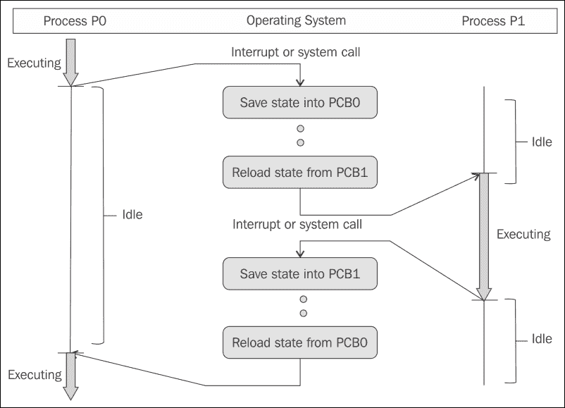

## 上下文类型

在某些语言中，例如 C#，我们也发现了安全或安全上下文的概念。在某种程度上，这与所谓的线程安全相关。

## 线程安全

如果一段代码只以保证多个线程同时安全执行的方式操作共享数据结构，则称该代码为线程安全。为了创建线程安全的数据结构，使用了各种策略，而.NET 框架对此概念及其实现非常谨慎。

实际上，大多数 MSDN（官方文档）对于适用对象（大多数）都在底部包含指示“此类型是线程安全的”。

## 状态

计算机程序的状态是一个技术术语，指的是在某一时刻，程序可以访问的所有存储信息。计算机程序在任何时刻的输出完全由其当前输入和状态决定。这个概念的一个重要变体是程序的状态。

## 程序状态

这个概念特别重要，并且有几个含义。我们知道计算机程序在变量中存储数据，这些变量只是计算机内存中的标记存储位置。在任何给定程序执行点，这些内存位置的包含内容被称为程序的状态。

在面向对象的编程语言中，据说一个类通过字段定义其状态，而这些字段在执行过程中的值决定了该对象的状态。尽管这不是强制性的，但在面向对象编程中，当类的方法仅用于保持其状态的一致性和逻辑时，这被认为是一种良好的实践。

此外，编程语言的常见分类建立了两个类别：命令式编程和声明式编程。C#或 Java 是前者的例子，而 HTML 是典型的声明式语法（因为它本身不是一种语言）。在声明式编程中，句子倾向于使用声明性范式改变程序的状态，而语言仅指示所需的结果，没有关于引擎如何获得结果的说明。

## 序列化

序列化是将数据结构或对象状态转换为可以存储（例如，在文件或内存缓冲区中）或通过网络连接传输的格式的过程，稍后可以在同一或另一台计算机环境中重建。

因此，我们过去常说，序列化一个对象意味着将其状态转换为字节流，这样字节流就可以被转换回对象的副本。流行的文本格式多年前出现，现在已知并得到广泛接受，例如 XML 和 JSON，独立于其他之前的格式（包括二进制）：


## 进程

操作系统在几个功能单元之间分配操作。这是通过为每个执行单元分配不同的内存区域来实现的。区分进程和线程很重要。

操作系统为每个进程分配一组资源，在 Windows 中这意味着进程将拥有自己的虚拟地址空间，并相应地进行分配和管理。当 Windows 初始化一个进程时，它实际上是在建立一个执行上下文，这暗示了一个进程环境块（也称为 PEB）和数据结构。然而，让我们明确一点：操作系统不执行进程；它只建立执行上下文。

## 线程

线程是进程的功能（或工作）单元。这就是操作系统执行的内容。因此，单个进程可能有多个执行线程，这是非常常见的事情。每个线程在进程创建时分配的资源中都有自己的地址空间。这些资源由所有链接到该进程的线程共享：

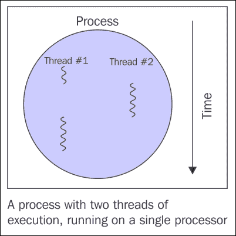

重要的是要记住，线程只属于单个进程，因此只能访问该进程定义的资源。当使用现在将要建议的工具时，我们可以查看多个线程同时执行（这意味着它们以独立的方式开始工作）并共享资源，如内存和数据。

不同的进程不共享这些资源。特别是，进程中的线程共享其指令（可执行代码）和上下文（在任何给定时刻其变量的值）。

如.NET 语言、Java 或 Python 等编程语言在运行时向开发者暴露线程，同时抽象了线程实现的具体平台差异。

### 提示

注意，线程之间的通信可以通过进程创建时初始化的公共资源集来实现。

当然，关于这两个概念有更多内容被撰写，这些内容远远超出了本书的范围（有关更多详细信息，请参阅维基百科，[`en.wikipedia.org/wiki/Thread_(computing)`](https://en.wikipedia.org/wiki/Thread_(computing)))，但系统为我们提供了检查任何进程执行情况的机制，也可以检查正在执行的线程。

如果你对此感兴趣或只是需要检查是否有错误发生，我推荐两种主要工具：任务管理器（包含在操作系统中，你可能已经知道），以及——更好的是——由杰出的工程师和技术伙伴马克·拉辛诺维奇（Mark Russinowitch）设计的工具，免费提供，并包含 50 多个实用工具。

有些具有 Windows 界面，而有些是控制台实用工具，但所有这些都非常优化且可配置，可以在任何时刻监控和控制我们操作系统的内部方面。它们可以在[`technet.microsoft.com/en-us/sysinternals/bb545021.aspx`](https://technet.microsoft.com/en-us/sysinternals/bb545021.aspx)免费获取。

如果您不想安装任何其他东西，请打开**任务管理器**（只需右键单击任务栏即可访问它）并选择**详细信息**选项卡。您将看到每个进程的更详细描述，每个进程使用的 CPU 量，每个进程分配的内存量等等。您甚至可以右键单击其中一个进程，并看到一个上下文菜单，它提供了一些可能性，包括启动一个显示与其相关的某些属性的新的对话框窗口：

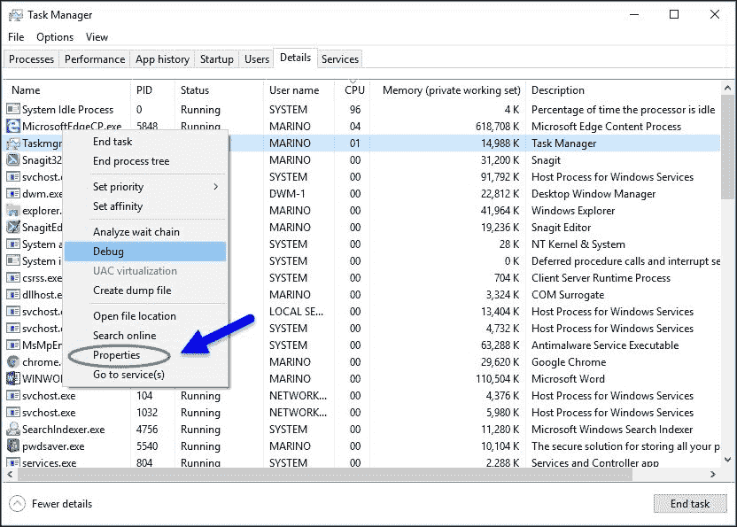

## SysInternals

如果您真的想了解一个进程的整体行为，请使用 SysInternals 工具。如果您访问之前提到的链接，您将看到一个专门针对进程实用程序的菜单项。在那里，您有多个选择可供工作，但最全面的是**进程探索器**和**进程监视器**。

**进程探索器**和**进程监视器**无需安装（它们是用 C++编写的），因此您可以直接在任何 Windows 平台上从任何设备执行它们。

例如，如果您运行**进程探索器**，您将看到一个显示系统当前所有活动进程的每个细节的详细窗口。

使用**进程探索器**，您可以找出进程打开了哪些文件、注册表键以及其他对象，以及它们加载的 DLL，每个进程的所有者等等。每个线程都是可见的，并且该工具提供了一个非常直观的用户界面，提供详细的信息：

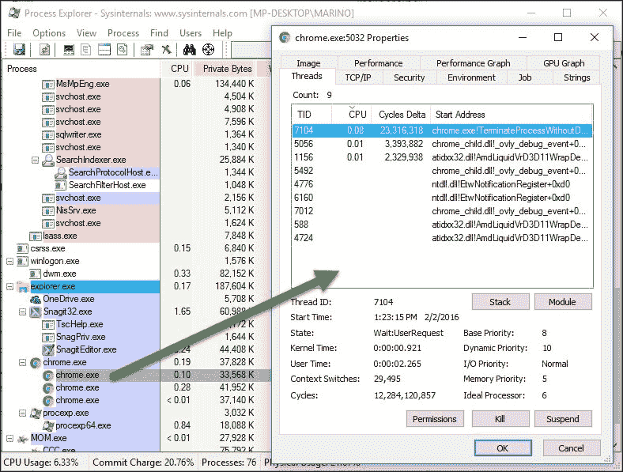

检查系统的实时行为也非常有用，因为它创建了 CPU 使用率、I/O、内存等活动图形，如下面的截图所示：

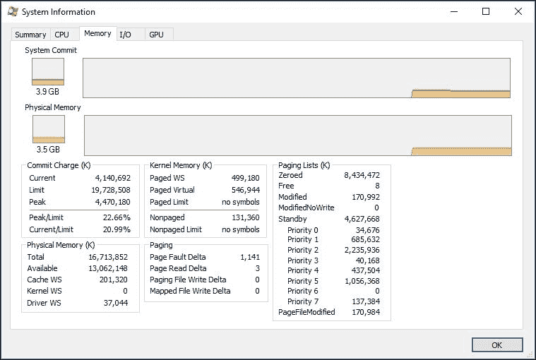

以类似的方式，**进程监视器**专注于实时监控文件系统、注册表以及所有进程和线程的活动，因为它实际上是将两个之前的实用程序合并在一起：**FileMon（文件监视器**）和**RegMon（注册表监视器**），这些工具现在已不再可用。

如果您尝试使用 PM，您将看到 PE 中包含的一些信息，以及 PM 提供的特定信息——只是以不同的方式传达。

## 静态内存与动态内存

当程序开始执行时，操作系统通过调度将其分配给一个进程：通过某种方式指定的工作分配给完成工作的资源的方法。这意味着进程的资源被分配，这也就意味着内存分配。

正如我们将看到的，主要有两种类型的内存分配：

+   固定内存（与堆栈链接），在编译时确定。局部变量在堆栈中声明和使用。请注意，这是一个在进程资源最初分配时分配的连续内存块。分配机制非常快（尽管访问速度并不快）。

+   另一种是动态内存（堆），它可以随着程序的需求增长，并且是在运行时分配的。这是实例变量分配的地方（那些指向类或对象实例的变量）。

通常，第一种类型是在编译时计算的，因为编译器知道根据其类型（例如`int`、`double`等）需要分配多少内存来声明变量。它们在具有如下语法的函数内部声明：`int x = 1;`

第二种类型需要调用`new`运算符。假设我们的代码中有一个名为`Book`的类，我们使用这种类型的表达式创建一个这样的`Book`实例：

```cs
Book myBook = new Book();
```

这指示运行时在堆中分配足够的空间来容纳该类型的实例及其字段；类的状态在堆中分配。这意味着程序的全部状态将存储在不同的内存（和可选的磁盘）位置。

当然，还有更多方面需要考虑，我们将在本章的*栈和堆*部分进行介绍。幸运的是，IDE 允许我们在调试时观察和分析所有这些方面（以及更多），提供非凡的调试体验。

## 垃圾收集器

**垃圾收集**（**GC**）是一种自动内存管理形式。.NET 中的 GC 试图回收垃圾或程序不再使用的对象的内存。回到之前`Book`代码声明的例子，当栈中没有对`Book`对象的引用时，GC 将回收该空间并归还给系统，从而释放内存（实际上要复杂一些，我将在本章后面的内存管理部分进一步详细说明——当我们讨论内存管理时，但暂时可以这样理解）。

重要的是要注意，垃圾收集器并不仅限于.NET 平台。实际上，你可以在所有平台和程序中找到它，即使你正在处理浏览器。例如，当前的 JavaScript 引擎，如 Chrome 的 V8、Microsoft 的 Chakra 以及其他一些引擎，也使用垃圾收集机制。

## 并发计算

并发或并发计算是当今一个非常常见的概念，我们将在本书的几个实例中了解到它。维基百科上的官方定义是：

> “并发计算是一种在重叠时间段内执行多个计算的计算形式——并发——而不是顺序执行（一个完成后再开始下一个）。这是一个系统的属性——这可能是一个单独的程序、计算机或网络——并且每个计算都有一个单独的执行点或“控制线程”。一个并发系统是一个计算可以在等待所有其他计算完成之前继续进行；在多个计算可以同时进行的地方。”

## 并行计算

并行计算是一种计算类型，其中许多计算是同时进行的，基于大问题通常可以分解成更小的部分，然后同时解决的原则。.NET 提供了这种类型计算的好几种变体，我们将在接下来的几章中介绍：


## 强制性编程

强制性编程是一种编程范式，它用程序的状态来描述计算。C#、JavaScript、Java 或 C++是强制语言典型的例子。

## 声明性编程

与强制性编程相反，被认为是声明性的语言只描述所需的输出结果，而不明确列出必须执行的命令或步骤。许多标记语言，如 HTML、XAML 或 XSLT，都属于这一类别。

# .NET 的演变

在.NET 到来之前，Microsoft 的编程生态系统一直由少数经典语言统治，Visual Basic 和 C++（带有 Microsoft Foundation Classes）是这种类型的典型例子。

### 注意

也称为**MFC**（**Microsoft Foundation Classes**），是一个将 Windows API 的部分功能封装在 C++类中的库，包括使它们能够使用默认应用程序框架的功能。为许多句柄管理的 Windows 对象以及预定义的窗口和常见控件定义了类。它在 1992 年随着 Microsoft 的 C/C++ 7.0 编译器推出，用于与 16 位版本的 Windows 一起使用，作为 Windows API 的一个极其薄的面向对象 C++包装器。

然而，.NET 提出的重大变化始于一种完全不同的组件模型方法。直到 2002 年.NET 正式推出之前，这种组件模型是**COM**（**Component Object Model**），该公司在 1993 年引入。COM 是包括 OLE、OLE 自动化、ActiveX、COM+、DCOM、Windows 外壳、DirectX、**UMDF**（**User-Mode Driver Framework**）和 Windows 运行时在内的其他几个 Microsoft 技术和框架的基础。

### 注意

一种设备驱动程序开发平台（Windows Driver Development Kit）首次在 Microsoft 的 Windows Vista 操作系统中引入，也适用于 Windows XP。它便于创建某些类别的设备的驱动程序。

在撰写本文时，COM 是另一个名为**CORBA**（**Common Object Request Broker Architecture**）的规范的竞争对手，这是一个由**对象管理组**（**OMG**）定义的标准，旨在促进部署在不同平台上的系统的通信。CORBA 使不同操作系统、编程语言和计算硬件上的系统之间能够协作。在其生命周期中，它受到了很多批评，主要是因为标准的实现不佳。

## .NET 作为对 Java 世界的反应

在 1995 年，为了取代 COM 及其相关的副作用，特别是版本和依赖于 Windows 注册表的 COM 的使用，注册表的损坏或修改片段可能表明组件在运行时不可访问；同时，为了安装应用程序，需要提升权限，因为 Windows 注册表是系统的一个敏感部分，一个新的模型被构想出来。

一年后，微软的各个部门开始与一些最杰出的软件工程师取得联系，这些联系在多年中一直保持活跃。这些人包括像 Anders Hejlsberg（成为 C#的主要作者和.NET 框架的主要架构师）、Jean Paoli（XML 标准的签署者之一，也是 AJAX 技术的早期倡导者）、Don Box（参与了 SOAP 和 XML Schema 的创建）、Stan Lippman（C++之父之一，当时在迪士尼工作）、Don Syme（泛型的架构师和 F#语言的主要作者）等等。

该项目的目的是创建一个新的执行平台，一个摆脱 COM 限制的平台，并且能够以安全和可扩展的方式运行一组语言。新的平台应该能够编程和集成刚刚出现的基于 XML 的 Web 服务世界，以及其他技术。新提议的初始名称是**下一代 Windows 服务**（**NGWS**）。

到 2000 年底，.NET 框架的第一个 beta 版本发布，第一个版本于 2002 年 2 月 13 日推出。从那时起，.NET 始终与 IDE（Visual Studio）的新版本保持一致。在撰写本文时，经典.NET 框架的当前版本是 4.6.1，但我们将在此章节的后面更详细地介绍这一点。

2015 年，首次出现了一个替代.NET。在`//BUILD/`活动中，微软宣布了另一个.NET 版本（称为.NET Core）的创建和可用性。

### 开源运动和.NET Core

开源运动和.NET Core 的一部分灵感来源于现在在雷德蒙德对软件创建和可用性的深刻变化。当 Satya Nadella 成为微软的 CEO 时，他们明确转向了新的口号：“**移动优先，云优先**”。他们还重新定义了自己为**一家软件和服务公司**。

这意味着接受开源理念及其所有后果。因此，NET Framework 的很大一部分已经向社区开放，有人说这一运动将持续到整个平台完全开放。此外，第二个目的（在`//BUILD/`活动上多次明确陈述）是创建一个强大的编程生态系统，足以让任何人能够为任何平台或设备编写任何类型的应用程序。因此，他们开始支持 Mac OS 和 Linux，以及为 Android 和 iOS 构建应用程序的几个工具。

然而，影响更深。如果你想要为 Mac OS 和 Linux 构建应用程序，你需要一个不同的**公共语言运行时**（**CLR**），它能够在这些平台上执行而不损失性能。这正是.NET Core 发挥作用的地方。

在撰写本文时，微软已经发布了针对.NET 生态系统的一些（雄心勃勃的）改进，主要基于.NET 的两种不同版本：

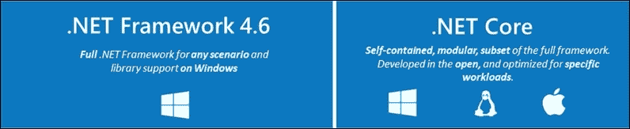

第一个是最后一个可用的版本——.NET（.NET 框架 4.6.x），第二个是新版本，旨在允许编译不仅适用于 Windows 平台，还适用于 Linux 和 Mac OS 的编译。

.NET Core 是 2015 年（上次更新于 2015 年 11 月，更新到版本 1.1）发布的 CLR 新开源版本的通用名称，旨在支持多种灵活的.NET 实现。此外，该团队正在开发一个名为**.NET Native**的项目，它将编译成每个目标平台的本地代码。

然而，让我们继续探讨 CLR 背后的主要概念，从版本无关的角度来看。

### 注意

整个项目可在 GitHub 上找到：[`github.com/dotnet/coreclr`](https://github.com/dotnet/coreclr)。

## 公共语言运行时

为了解决 COM 的一些问题并引入作为新平台一部分所请求的一大批新功能，微软的一个团队开始演进先前的想法（以及与平台相关的名称）。因此，在第一个公开测试版之前，该框架很快被更名为**组件对象运行时**（**COR**），最终被命名为公共语言运行时，以强调新平台与单一语言无关。

实际上，有数十种编译器可用于.NET 框架，它们都会生成类型中间代码，该代码在执行时被转换为本地代码，如下面的图所示：

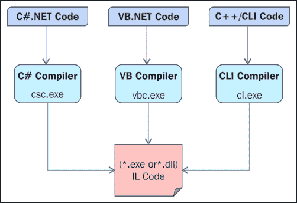

CLR（公共语言运行时）以及 COM（组件对象模型）都侧重于组件之间的契约，这些契约基于类型，但相似之处到此为止。与 COM 不同，CLR 建立了一种明确的形式来指定契约，这通常被称为元数据。

此外，CLR 包括读取元数据而不需要了解底层文件格式的可能性。此外，这种元数据可以通过自定义属性进行扩展，这些属性本身是强类型的。元数据中包含的其他有趣信息包括版本信息（记住，不应该有对注册表的依赖）和组件依赖。

此外，对于任何组件（称为程序集），存在元数据是强制性的，这意味着不可能在没有读取其元数据的情况下部署组件的访问。在初始版本中，安全性的实现主要基于元数据中包含的一些证据。此外，这种元数据通过称为 **Reflection** 的过程对 CLR 内部的任何程序或外部程序都可用。

另一个重要的区别是，.NET 合同首先描述了类型的逻辑结构。正如 Don Box 在其杰出的《Essential .NET》中详细解释的那样，其中没有内存表示、读取顺序序列、对齐或参数约定等。

### 常见中间语言

这些先前约定和协议在 CLR 中通过一种称为合同虚拟化的技术得到解决。这意味着为 CLR 编写的代码（如果不是所有代码）不包含机器代码，而是一种称为 **常见中间语言**（**CIL**）或简称为 **中间语言**（**IL**）的中间语言。

CLR 永远不会直接执行 CIL。相反，CIL 总是通过一种称为 **JIT**（**即时**）编译的技术在执行之前转换为本地机器代码。这意味着 JIT 过程始终将生成的可执行代码适应目标机器（独立于开发者）。执行 JIT 过程有几种模式，我们将在本章后面更详细地探讨它们。

因此，CLR 可以被称为以类型为中心的框架。对于 CLR 来说，一切都是类型、对象或值。

### 托管执行

CLR 行为的另一个关键因素是程序员被鼓励忘记对内存的显式管理和线程的手动管理（尤其是与 C 和 C++ 等语言相关），以采用 CLR 提出的新执行方式：托管执行。

在托管执行下，CLR 对其执行上下文中发生的所有事情都有完全的了解。这包括每个变量、方法、类型、事件等。这鼓励并促进了生产力，并以多种方式简化了调试过程。

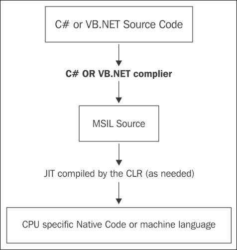

此外，CLR 通过一个名为 CodeDOM 的实用工具支持运行时代码（或生成式编程）的创建。有了这个特性，你可以在不同的语言中生成代码，并直接在内存中编译（和执行）它。

所有这些都引导我们到下一个逻辑问题：可以使用此基础设施的语言有哪些，它们之间有哪些共同点，生成的代码是如何组装和准备执行，存储信息单元（如我所说，它们被称为程序集）是什么，最后，所有这些信息是如何组织并结构化到这些程序集中的？

### 组件和语言

每个执行环境都有一个关于软件组件的概念。对于 CLR 来说，这些组件必须用 CLI 兼容的语言编写，并相应地编译。你可以在维基百科上找到 CLI 语言的列表。但问题是什么是 CLI 兼容的语言？

**CLI** 代表 **通用语言基础设施**，它是由 **ISO** 和 **ECMA** 标准化的软件规范，描述了可执行代码和运行时环境，允许多种高级语言在不同的计算机平台上使用，而无需为特定架构重写。.NET 框架和免费开源的 Mono 都是 CLI 的实现。

### 注意

注意，这些术语和实体的官方网站如下：

**ISO**: [`www.iso.org/iso/home.html`](http://www.iso.org/iso/home.html)

**ECMA**: [`www.ecma-international.org/`](http://www.ecma-international.org/)

**MONO**: [`www.mono-project.com/`](http://www.mono-project.com/)

**CLI 语言**: [`en.wikipedia.org/wiki/List_of_CLI_languages`](https://en.wikipedia.org/wiki/List_of_CLI_languages)

CLI 中最相关的要点如下（根据维基百科）：

+   首先，为了替代 COM，元数据是关键，它提供了关于组件架构的信息，例如菜单或索引，里面可以找到什么内容。由于它不依赖于语言，任何程序都可以读取这些信息。

+   基于此，应该有一套共同的规则来遵守数据类型和操作。这就是 **公共类型系统**（**CTS**）。所有遵循 CTS 的语言都可以使用一套规则。

+   为了语言之间的最小互操作性，有一套规则，并且这些规则应该适用于这个组中的所有编程语言，因此用一种语言制作的 DLL 然后编译，可以由用不同 CTS 语言编译的另一个 DLL 使用，例如。

+   最后，我们有一个虚拟执行系统，它负责运行此应用程序以及许多其他任务，例如管理程序请求的内存、组织执行块等。

考虑到所有这些，当我们使用 .NET 编译器（从现在起，称为编译器）时，我们生成一个字节流，通常以文件的形式存储在本地文件系统或 Web 服务器上。

### 程序集文件的结构

编译过程生成的文件称为程序集，任何程序集都遵循 Windows 中任何其他可执行文件的基本规则，并添加了一些适合和必需的扩展和信息，以便在托管环境中执行。

简而言之，我们理解程序集只是一组包含 IL 代码和元数据的模块，它们是 CLI 中软件组件的主要单元。安全性、版本控制、类型解析、进程（应用程序域）等，都是在每个程序集的基础上工作的。

这的重要性意味着可执行文件结构的改变。这导致了一个新的文件架构，如下面的图所示：

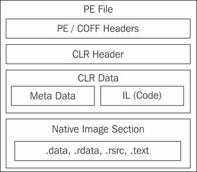

注意，PE 文件是符合可移植/可执行格式的文件：一种用于可执行文件、对象代码、DLLs、FON（字体）文件等文件格式，用于 32 位和 64 位版本的 Windows 操作系统。它最初由微软在 Windows NT 3.1 中引入，所有后续版本的 Windows 都支持这种文件结构。

这就是为什么我们在格式中找到一个 PE/COFF 头，它包含系统所需的兼容信息。然而，从.NET 程序员的视角来看，真正重要的是程序集包含三个主要区域：CLR 头、IL 代码和一个包含资源（如图中的**原生映像部分**）的部分。

### 小贴士

关于 PE 格式的详细描述可在[`www.microsoft.com/whdc/system/platform/firmware/PECOFF.mspx`](http://www.microsoft.com/whdc/system/platform/firmware/PECOFF.mspx)找到。

#### 程序执行

在与 CLR 链接的库中，我们发现了一些负责在内存中加载程序集、启动和初始化执行上下文的库。它们通常被称为 CLR 加载器。与其他一些实用工具一起，它们提供了以下功能：

+   自动内存管理

+   使用垃圾回收器

+   元数据访问以查找类型信息

+   加载模块

+   分析托管库和程序

+   一个强大的异常管理子系统，以使程序能够以结构化的方式通信和响应故障

+   原生和遗留代码互操作性

+   将托管代码即时编译成原生代码

+   一个复杂的安全基础设施

此加载器使用 OS 服务来简化程序集的加载、编译和执行。正如我们之前提到的，CLR 作为.NET 语言的执行抽象。为了实现这一点，它使用一组 DLLs，这些 DLLs 作为 OS 和应用程序程序之间的中间层。记住，CLR 本身就是一个 DLL 集合，这些 DLLs 共同定义了虚拟执行环境。其中最相关的是以下内容：

+   `mscoree.dll`（有时被称为 shim，因为它只是 CLR 所包含的实际 DLLs 前面的一个门面）

+   `clr.dll`

+   `mscorsvr.dll`（多处理器）或`mscorwks.dll`（单处理器）

在实践中，`mscoree.dll`的主要作用之一是根据包括（但不限于）底层硬件在内的任何数量因素选择适当的构建（单处理器或多处理器）。 

`clr.dll`是真正的管理者，其余的都是用于不同目的的实用程序。这个库是 CLR 中唯一位于`$System.Root$`的库，正如我们可以通过简单的搜索找到的那样：


我的系统显示两个版本（还有一些其他版本），每个版本都准备好启动为 32 位或 64 位版本编译的程序。其余的 DLL 位于另一个地方：通常称为**全局程序集缓存**（**GAC**）的安全目录集。

实际上，Windows 10 的最新版本安装了所有此类 GAC 的文件，对应于 1.0、1.1、2.0、3.0、3.5 和 4.0 版本，尽管其中一些只是具有最少信息的占位符，而我们只找到了.NET 2.0、.NET 3.5（仅部分）和.NET 4.0 的完整版本。

此外，请注意，这些占位符（对于未完全安装的版本）允许进一步安装，如果某些旧软件需要它们的话。这意味着.NET 程序的执行依赖于其元数据中指示的版本，而不是其他任何东西。

您可以使用`CLRver.exe`实用程序检查系统中安装的.NET 版本，如下图所示：

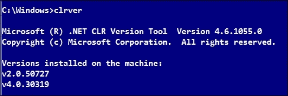

在执行之前，内部发生几个操作。当我们启动.NET 程序时，我们将像往常一样进行，就像它是 Windows 的另一个标准可执行文件一样。

在幕后，系统将读取包含指令以启动`mscore.dll`的标题，该`mscore.dll`反过来将在托管环境中启动整个运行过程。在这里，我们将省略此过程固有的所有复杂性，因为它远远超出了本书的范围。

## 元数据

我们提到，新编程模型的关键方面是大量依赖于元数据。此外，对元数据进行反射的能力使得程序可以通过其他程序（而不是人类）生成，这正是 CodeDOM 发挥作用的地方。

当处理语言时，我们将涵盖 CodeDOM 的一些方面及其用法，并探讨 IDE 本身在每次从模板创建源代码时如何频繁地使用此功能。

为了帮助 CLR 找到程序集的各个部分，每个程序集恰好有一个模块，其元数据包含程序集清单：这是 CLR 元数据的附加部分，充当包含附加类型定义和代码的辅助文件的目录。此外，CLR 可以直接加载包含程序集清单的模块。

那么，在真实程序中，清单的方面是什么，我们如何检查其内容呢？幸运的是，我们有一系列.NET 实用工具（从技术上讲，它们不属于 CLR，而是属于.NET 框架生态系统），这些工具使我们能够轻松地可视化这些信息。

### 使用基本的 Hello World 介绍元数据

让我们构建一个典型的 Hello World 程序，并在编译后分析其内容，这样我们就可以检查它如何转换为**中间语言**（**IL**）以及我们所讨论的元信息在哪里。

在本书的整个过程中，我将使用 Visual Studio 2015 社区版更新 1（或如果出现更新版本，则使用更高版本），原因我将在后面解释。你可以免费安装它；这是一个功能齐全的版本，拥有大量的项目类型、实用工具等。

### 注意

Visual Studio 2015 CE 更新 1 可在[`www.visualstudio.com/vs/community/`](https://www.visualstudio.com/vs/community/)获取。

唯一的要求是免费注册以获取微软用于统计目的的开发者许可证——仅此而已。

在启动 Visual Studio 后，在主菜单中选择**新建项目**，然后转到**Visual C#**模板，在那里 IDE 提供了几种项目类型，并选择一个控制台应用程序，如图所示：

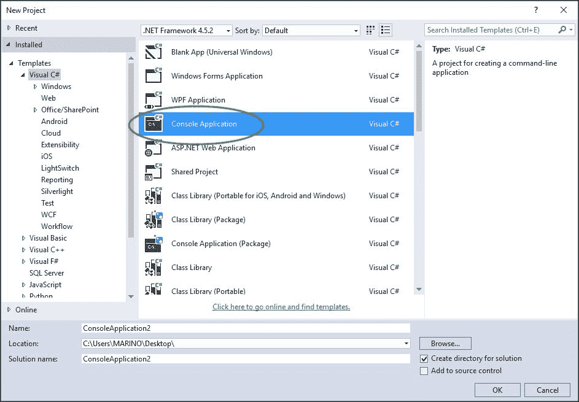

Visual Studio 将创建一个基本的代码结构，由对库的几个引用（关于这一点稍后讨论）以及包含`program`类的命名空间块组成。在这个类内部，我们将找到一个类似于 C++或 Java 语言中的应用程序入口点。

为了产生某种输出，我们将使用`Console`类的两个静态方法：`WriteLine`，它输出一个字符串并添加换行符，以及`ReadLine`，它强制程序停止，直到用户输入一个字符并按下回车键，这样我们就可以看到产生的输出。

在清理这些我们不会使用的引用，并包括之前提到的几句话后，代码将看起来像这样：

```cs
using System;
namespace ConsoleApplication1
{
  class Program
  {
    static void Main(string[] args)
    {
      Console.WriteLine("Hello! I'm executing in the CLR context.");
      Console.ReadLine();
    }
  }
}
```

要测试它，我们只需按下*F5*或**启动**按钮，我们就会看到相应的输出（没有什么惊人的，所以我们不包括截图）。

在编辑代码的时候，你会注意到 IDE 编辑器的几个有用特性：语句的着色（区分不同的目的：类、方法、参数、字面量等）；**IntelliSense**，为每个类的成员提供合理的内容；**工具提示**，指示每个方法的返回类型；字面量或常量的值类型；以及程序中每个成员的引用次数。

从技术上讲，还有数百个其他有用的功能，但这些都是我们将在下一章中测试的内容，当我们进入 C#方面并发现如何证明它们时。

对于这个小程序，检查它产生了什么样的输出会更有趣一些，这些输出我们可以在我们项目的`Bin/Debug`文件夹中找到。（顺便提醒一下，记得在解决方案资源管理器顶部按下**显示所有文件**按钮）：

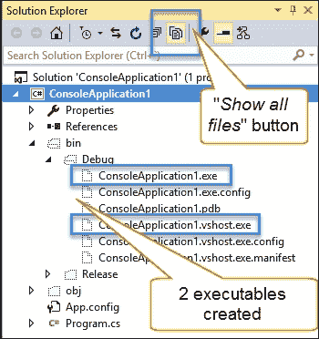

如我们所见，生成了两个可执行文件。第一个是你可以直接从其文件夹中启动的独立可执行文件。另一个，扩展名前有`.vshost`前缀，是 Visual Studio 在调试时使用的，它包含 IDE 所需的额外信息。两者产生相同的结果。

一旦我们有了可执行文件，就是时候将.NET 工具链接到 Visual Studio 了——这将让我们查看我们正在讨论的元数据。

要完成这个操作，我们需要在主菜单中选择**工具** | **外部工具**选项，然后我们会看到一个配置对话框窗口，其中展示了几个（并且已经调整好的）外部工具；按下**新建**按钮，并将标题更改为`IL 反汇编器`，如图所示：

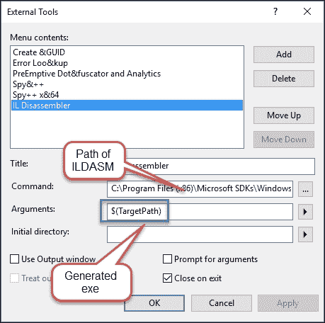

接下来，我们需要配置将要传递给新条目的参数：工具的名称和所需的参数。

你会注意到这个工具有几个版本。这些取决于你的机器。

对于我们的目的，包含以下信息就足够了：

+   工具的根目录（命名为`ILDASM.exe`，位于我的机器上`C:\Program Files (x86)\Microsoft SDKs\Windows\v10.0A\bin\NETFX 4.6.1 Tools`）

+   生成的可执行文件的路径，我使用的是由`$targetpath`表示的预定义宏

由于我们的程序已经编译，我们可以回到**工具**菜单，并找到一个名为`IL 反汇编器`的新条目。一旦启动，会出现一个窗口，显示我们程序的 IL 代码，以及一个名为`Manifest`的引用（显示元数据），我们还可以双击以显示包含此信息的另一个窗口，如图所示：

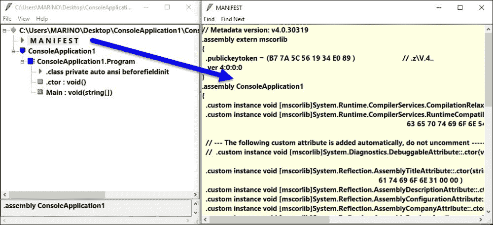

### 注意

注意，我已经修改了 ILDASM 的字体大小以提高清晰度。

包含在清单中的信息来自两个来源：IDE 本身，配置为准备程序执行（如果我们更详细地查看窗口内容，我们可以查看大多数行），以及我们可以嵌入到可执行文件清单中的可自定义信息，例如描述、程序标题、公司信息、商标、文化等等。我们将在下一章中探讨如何配置这些信息。

以同样的方式，我们可以继续分析主 ILDASM 窗口中显示的每个单独节点的内容。例如，如果我们想查看与我们的`Main`入口点链接的 IL 代码，该工具将显示另一个窗口，我们可以欣赏 IL 代码的方面（注意声明 main 旁边的文本`cil`托管）：


正如我在截图中所指出的，带有前缀`IL_`的条目将在执行时转换为机器代码。注意这些指令与汇编语言的相似性。

此外，请注意，这个概念自.NET 的第一个版本以来没有改变：生成 CIL 和机器代码的主要概念和过程基本上与以前相同。

### PreJIT、JIT、EconoJIT 和 RyuJIT

我已经提到，将此 IL 代码转换为机器代码的过程由.NET 框架的另一部分执行，通常称为**即时编译器**（**JIT**）。然而，自从.NET 的最初版本以来，这个过程可以以至少三种不同的方式执行，这就是为什么有三个以 JIT 后缀命名的名称。

为了简化这些过程的细节，我们将说默认的编译方法（以及在一般术语中首选的方法）是 JIT 编译（让我们称之为正常 JIT）：

+   在正常 JIT 模式下，代码按需编译（按需）并且不会丢弃，而是缓存以供以后使用。以这种方式，随着应用程序的持续运行，任何以后需要执行且已经编译的代码只需从缓存区域检索即可。这个过程高度优化，性能损失可以忽略不计。

+   在 PreJIT 模式下，.NET 以不同的方式运行。要使用 PreJIT 运行，你需要一个名为`ngen.exe`（代表原生生成）的工具来在第一次执行之前生成原生机器代码。然后，代码被转换，`.exe`文件被重写为机器代码，这提供了一些优化，尤其是在启动时间方面。

+   至于 EconoJIT 模式，它主要用于部署在低内存设备上的应用程序，如手机，并且它与 NormalJIT 非常相似，区别在于编译的代码不会被缓存以节省内存。

在 2015 年，微软继续开发一个名为 Roslyn 的特殊项目，这是一个提供额外功能（包括代码管理、编译和部署等）的工具和服务集合。与这个项目（将在第四章中深入探讨，*比较编程方法*)相关联，另一个 JIT 出现了，称为 RyuJIT，它从一开始就被作为一个开源项目提供，现在默认包含在最新的 Visual Studio 版本中（记住，Visual Studio 2015 更新 1）。

现在，让我引用.NET 团队关于他们新编译器的话：

> "RyuJIT 是一个新的、下一代 x64 编译器，比之前的编译器快一倍，这意味着使用 RyuJIT 编译的应用程序启动速度可以快达 30%（JIT 编译器花费的时间只是启动时间的一个组成部分，所以应用程序的启动速度不会因为 JIT 编译器快一倍而快两倍。）此外，新的 JIT 编译器仍然生成在整个服务器进程长时间运行中运行高效的代码。
> 
> 此图比较了 JIT64 和 RyuJIT 在各种代码样本上的编译时间（"吞吐量"）比率。每一行显示了 RyuJIT 比 JIT64 快多少倍，所以数字越高越好。"

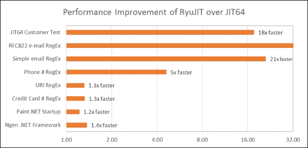

他们最后说，RyuJIT 将成为他们未来所有 JIT 编译器的基础：x86、ARM、MDIL 以及未来可能出现的任何其他技术。

### 公共类型系统

在.NET 框架中，**公共类型系统**（**CTS**）是一组规则和规范，用于以语言无关的方式定义、使用和管理任何.NET 应用程序使用的数据类型。

我们必须理解，类型是任何 CLR 程序的基本构建块。例如，C#、F#和 VB.NET 等编程语言都有几种表达类型的结构（例如，`类`、`结构体`、`枚举`等），但最终，所有这些结构都映射到 CLR 类型定义。

此外，请注意，类型可以声明私有和非私有成员。后一种形式，有时被称为类型的合约（因为它暴露了该类型的可用部分），是我们可以通过编程技术访问的。这就是为什么我们强调了在 CLR 中元数据的重要性。

公共类型系统比大多数编程语言能够处理的内容要广泛得多。除了 CTS 之外，一个名为 CLI 的子集选择 CTS 的一个子集，所有与 CLI 兼容的语言都必须遵守这个子集。这个子集被称为**公共语言规范**（**CLS**），建议组件编写者通过 CLS 兼容的类型和成员使他们的组件功能可访问。

#### 命名约定、规则和类型访问模式

至于类型的命名规则，这是适用的：任何 CLR 类型名称都有三个部分：程序集名称、可选的命名空间前缀和本地名称。在先前的例子中，`ConsoleApplication1`是程序集名称，它与命名空间相同（但我们也可以在不出现问题的情况下更改它）。`Program`是唯一可用的类型的名称，在这个例子中恰好是一个类。因此，这个类的完整名称是`ConsoleApplication1.ConsoleApplication1.Program`。

命名空间是可选的前缀，有助于我们在代码中定义逻辑分区。它们的目的在于避免混淆和成员的最终覆盖，以及允许应用程序代码的更有组织的分布。

例如，在一个典型的应用中（不是之前展示的演示），一个命名空间会描述整个解决方案，这可能被分为几个域（应用被划分的不同区域，有时它们对应于解决方案中的单个项目），每个域很可能包含几个类，每个类都包含几个成员。当你处理包含例如 50 个项目的解决方案时，这种逻辑划分对于保持事物在控制之下非常有帮助。

至于类型成员的访问方式，每个成员都管理它如何被使用以及类型如何工作。因此，每个成员都有自己的访问修饰符（例如，`private`、`public`或`protected`），它控制了如何访问它以及该成员是否对其他成员可见。如果我们没有指定任何访问修饰符，则假定它是`private`。

此外，你可以确定是否需要引用类型的实例来引用成员，或者你可以通过其完整名称直接引用这样的成员，而无需调用构造函数并获取类型的实例。在这种情况下，我们在这些成员的声明前加上`static`关键字。

#### 类型成员

基本上，一个类型接受三种类型的成员：字段、方法和嵌套类型。通过嵌套类型，我们理解的是作为声明类型实现的一部分包含的另一个类型。所有其他类型成员（例如，属性和事件）仅仅是扩展了额外元数据的简单方法。

我知道，你可能正在想，“所以，属性是方法吗？”嗯，是的；一旦编译，生成的代码就变成了方法。它们转换成了`name_of_class.set_method(value)`和`name_of_class.get_method()`方法，负责分配或读取与方法名称相关联的值。

让我们用一个非常简单的类来回顾一下，这个类定义了一些方法：

```cs
class SimpleClass
{
  public string data { get; set; }
  public int num { get; set; }
}
```

好吧，一旦编译，我们可以像之前一样使用 IL 反汇编器检查生成的 IL 代码，获得以下视图：

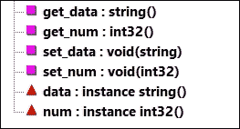

正如我们所见，编译器将`data`和`num`声明为`string`和`int`类的实例，并定义了相应的访问这些属性的方法。

CLR 如何在运行时管理类型占用的内存空间？如果你记得，我们在本章开头强调了状态概念的重要性。其意义在这里很清楚：类型中定义的成员类型将决定所需的内存分配。

此外，CLR 将保证，如果我们在声明语句中指定了它，这些成员将被初始化为其默认值：对于数值类型，默认值是零；对于布尔类型，是`false`，对于对象引用，值是`null`。

我们还可以根据内存分配对类型进行分类：值类型存储在栈中，而引用类型将使用堆。关于这一点将更深入地解释，因为 Visual Studio 2015 的新功能允许我们以许多不同的视角详细分析代码在运行时发生的一切。

### Visual Studio 2015 中程序集执行和内存分析的快速提示

到目前为止，我们回顾的所有概念都可以直接使用新的调试工具获得，如下面的截图所示，它显示了之前程序在断点处停止的执行线程：

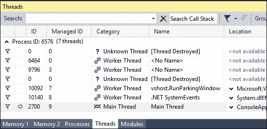

注意工具提供的信息中的不同图标和列。我们可以区分已知和未知的线程，如果它们被命名（或未命名），它们的位置，甚至`ThreadID`，如果我们需要一些这里未包含的额外信息，我们可以将其与 SysInternals 工具结合使用：

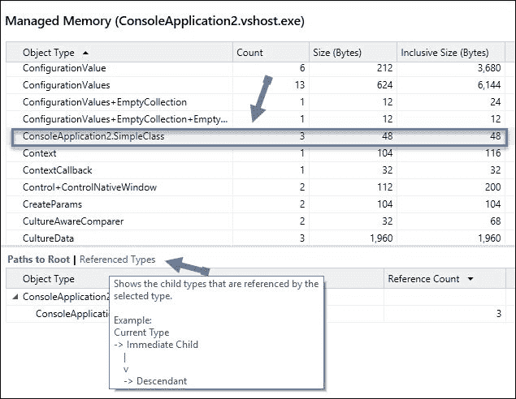

同样的功能也适用于内存分析。它甚至超越了运行时周期，因为 IDE 能够捕获并分类应用程序执行中运行时所需的内存使用情况，并在我们进行内存快照时为我们准备好。

这样，我们可以进一步审查它，并检查可能的瓶颈和内存泄漏。前面的截图显示了之前的应用程序在运行时使用的托管内存。

本书的不同章节将深入探讨 Visual Studio 2015 中发现的调试功能，因为有许多不同的场景，这种辅助工具将非常有帮助且清晰。

### 栈和堆

这两个概念的快速回顾可能很有帮助，因为它们超越了.NET 框架，并且是许多语言和平台共有的。

首先，让我们回顾一下本章开头提到的与进程相关的一些概念：当程序开始执行时，它会根据 CLR 从程序集的清单中读取的元数据初始化资源（如图*程序集文件结构*部分所示）。这些资源将与其他线程共享，这些线程是该进程启动的。

当我们声明一个变量时，栈中会分配一个空间。所以，让我们从以下代码开始：

```cs
class Program
{
  static void Main(string[] args)
  {
    Book b;
    b.Title = "The C# Programming Language";
    Console.WriteLine(b.Title);
    Console.ReadLine();
  }
}

class Book
{
  public string Title;
  public int Pages;
}
```

如果我们尝试编译它，我们会得到一个编译错误消息，指示使用了未分配的变量`b`。原因是，在内存中，我们只有一个已声明的变量，并且它被分配为 null，因为我们没有实例化`b`。

然而，如果我们使用类的构造函数（默认构造函数，因为该类没有显式构造函数），将行更改为`Book b = new Book();`，那么我们的代码可以正确编译和执行。

因此，`new`运算符在这里的作用至关重要。它向编译器指示它必须为`Book`对象的新实例分配空间，调用构造函数，并且——我们将很快发现——将对象的字段初始化为其默认值类型。

那么，此刻栈内存中有什么？嗯，我们只有一个名为`b`的声明，其值为一个内存地址：正好是`StackAndHeap.Book`在堆中声明的地址（我预计将是`0x2525910`）。

然而，我究竟如何知道这个地址以及执行上下文中发生了什么？让我们看看这个小型应用程序的内部工作原理，因为 Visual Studio 提供了 IDE 本版本中可用的不同调试窗口。为此，我们将在第 14 行`Console.ReadLine();`处设置一个断点，并重新启动应用程序，以便它触碰到断点。

一旦到达这里，就有大量信息可供参考。在**诊断工具**窗口（也是 IDE 本版本的新功能），我们可以监视内存使用情况、事件和 CPU 使用率。在**内存使用**选项卡中，我们可以拍摄正在发生的事情的快照（实际上，我们可以在执行的不同时刻拍摄多个快照并比较它们）。

一旦快照准备就绪，我们将查看经过的时间、对象的大小以及堆大小（以及一些其他选项以改善体验）：

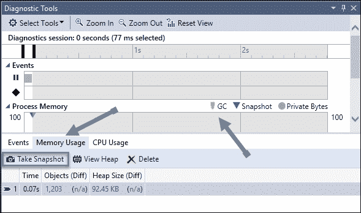

注意，我们可以选择按对象大小或堆大小对堆进行排序。此外，如果我们选择其中之一，将出现一个新窗口，显示执行上下文中实际存在的每个组件。

如果我们想确切了解我们的代码正在做什么，我们可以通过选择所需类的名称（在这种情况下为`Book`）进行过滤，以便仅查看此对象、其实例、在执行时刻存活的对该对象的引用以及大量其他细节。

当然，如果我们查看**自动变量**或**局部变量**窗口，我们也会发现这些成员的实际值：

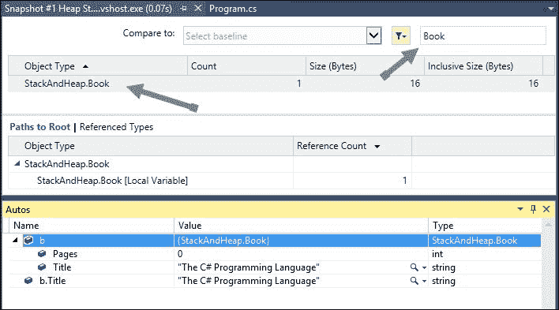

如我们在**自动变量**窗口中所见，对象使用该类型的默认值（对于整数值为 0）初始化了剩余的值（那些由代码未设置的值）。这种分析可执行文件的程度在出现模糊或偶尔发生的错误时非常有帮助。

我们甚至可以通过单击**StackAndHeap.Book**条目来查看每个成员的实际内存位置：

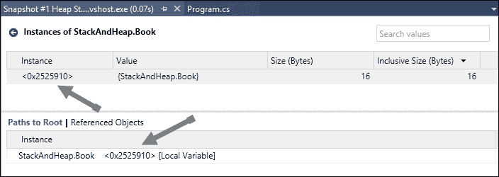

也许你在想，我们甚至能看到更远的地方吗？（我的意思是执行上下文实际产生的汇编代码）。答案是，是的；我们可以右键单击实例，选择**添加监视**，然后我们将在该内存位置直接添加一个检查点，如图所示：


当然，汇编代码也是可用的，只要我们在 IDE 中导航到**工具** | **选项** | **调试器**并启用它。此外，在这种情况下，你应在同一个对话框中启用**启用地址级调试**。之后，只需转到**调试** | **窗口** | **反汇编**，你将看到一个带有最低级别（可执行）代码的窗口，标记着断点、行号以及将这些代码翻译成原始 C#语句：

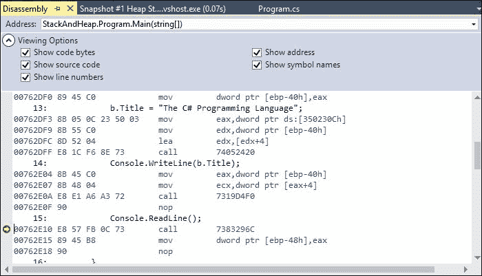

当对`Book`对象的引用被重新分配或置为 null（并且程序继续运行）时，为`Book`分配的内存将作为孤儿保留在内存中，这时垃圾收集器就会介入。

### 垃圾收集

基本上，垃圾收集是从系统中回收内存的过程。当然，这些内存不应该在使用中；也就是说，堆中分配的对象占用的空间不应该有任何变量指向它们，以便清除。

在.NET 框架包含的众多类中，有一个专门用于此过程。这意味着对象的垃圾收集不仅仅是 CLR 执行的自动过程，而是一个真正的、可执行的对象，甚至可以用于我们的代码中（顺便说一下，GC 是这个名称，我们将在尝试在其他章节中优化执行时处理它）。

实际上，我们可以以多种方式看到这一点。例如，假设我们创建一个在循环中连接字符串的方法，并且不对它们做任何其他操作；它只是在过程完成后通知用户：

```cs
static void GenerateStrings()
{
  string initialString = "Initial Data-";
  for (int i = 0; i < 5000; i++)
  {
    initialString += "-More data-";
  }
  Console.WriteLine("Strings generated");
}
```

这里有一点需要注意。由于字符串是不可变的（这意味着它们当然不能被改变），这个过程必须在每个循环中创建新的字符串。这意味着过程将使用大量内存，这些内存可以被回收，因为每个新的字符串都必须重新创建，而旧的字符串就变得无用了。

我们可以使用 CLR Profiler 来查看在运行此应用程序时 CLR 中发生了什么。您可以从[`clrprofiler.codeplex.com/`](http://clrprofiler.codeplex.com/)下载 CLR Profiler，一旦解压，您将看到两个版本（32 位和 64 位）的工具。此工具向我们展示了一组更详细的统计数据，包括 GC 干预。一旦启动，您将看到一个类似这样的窗口：

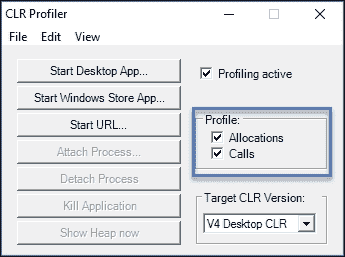

在使用**启动桌面应用**启动应用程序之前，请确保您已勾选分配和调用复选框。启动后（如果应用程序没有停止并且连续运行），没有中断，您将看到一个指向执行各种摘要的新统计窗口。

每个这些摘要都会引导到一个不同的窗口，您可以在其中更详细地分析（甚至使用统计图形）运行时发生的事情，以及垃圾收集器在需要时如何介入。

下图显示了主要的统计窗口（注意有两个部分专门用于 GC 统计和垃圾回收处理统计）：

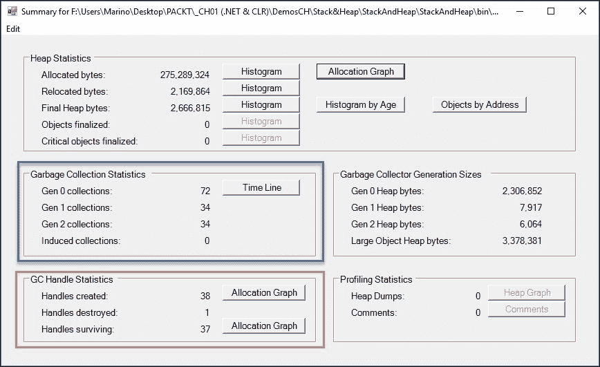

截图显示了两个与 GC 相关的区域。第一个区域指示了三种类型的收集，命名为`Gen 0`、`Gen 1`和`Gen 2`。这些名称只是代数的简称。

这是因为 GC 根据对象的引用来标记对象。最初，当 GC 开始工作时，这些没有引用的对象会被清理。那些仍然连接的对象被标记为`Gen 1`。GC 的第二次审查最初是相似的，但如果它发现仍然有标记为`Gen 1`的对象持有引用，它们会被标记为`Gen 2`，而任何有引用的`Gen 0`对象会被提升到`Gen 1`。这个过程在应用程序执行期间持续进行。

这也是我们经常读到以下原则适用于可回收对象的原因：

+   新创建的对象通常很快就会被回收（它们通常在函数调用中创建，并在函数结束时超出作用域）

+   最老的对象通常持续更久（通常是因为它们持有来自全局或静态类的引用）

第二个区域显示了创建、销毁和存活的句柄数量（由于垃圾收集器的存在而存活）。

第一个（**时间线**）将显示 GC 操作的精确执行时间统计，以及隐含的.NET 类型：

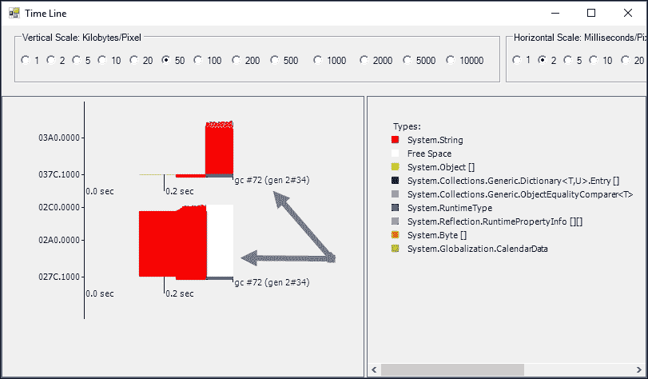

如您所见，随着程序的进行，图中显示了一组被回收和/或提升到其他代的对象。

当然，这比那要复杂得多。GC 根据代数有不同的操作频率规则。因此，`Gen 0`比`Gen 1`访问得更频繁，比`Gen 2`访问得少得多。

此外，在第二个窗口中，我们可以看到执行过程中隐含的所有机制，这使我们能够以不同的细节级别来获得整体图景，以便从不同的角度进行观察：

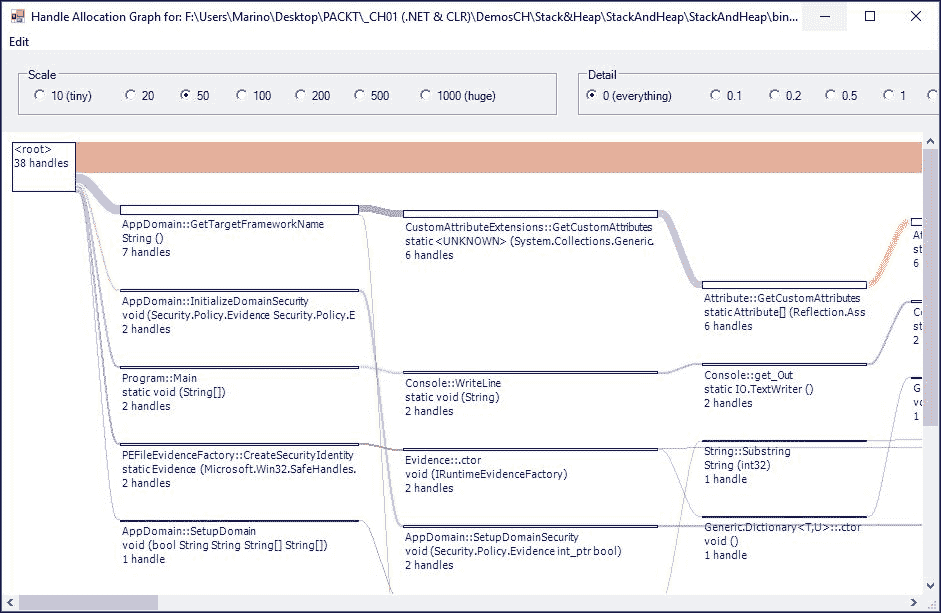

这证明了 GC 的一些特性。首先，一个解除引用的对象不会立即被回收，因为这个过程是周期性的，并且有许多因素会影响这个频率。另一方面，并不是所有的孤儿对象都会同时被回收。

这种情况的一个原因是收集机制本身计算成本较高，这会影响性能，因此建议在大多数情况下，只需让垃圾回收器按照其优化的方式执行其工作。

有没有这个规则的例外？是的；例外情况是那些你预留了大量资源，并确保在退出程序操作的方法或序列之前清理它们的情况。这并不意味着你在循环执行的每次迭代中都调用 GC（由于我们提到的性能原因）。

在这些情况下，可能的解决方案之一是实现`IDisposable`接口。让我们记住，你可以通过按*Ctrl* + *Alt* + *J*或选择主菜单中的**对象资源管理器**来查看 CLR 的任何成员。

我们将看到一个包含搜索框的窗口，以便过滤我们的成员，我们将看到此类成员出现的位置：

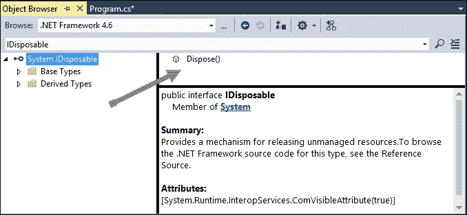

### 注意

注意，此接口在.NET Core 运行时不可用。

因此，我们将重新定义我们的类以实现`IDisposable`（这意味着我们应该在内部编写一个`Dispose()`方法来调用 GC）。或者，更好的是，我们可以遵循 IDE 的建议并实现`Dispose Pattern`，一旦我们表明我们的程序实现了此接口，它就会作为选项提供，如下面的截图所示：

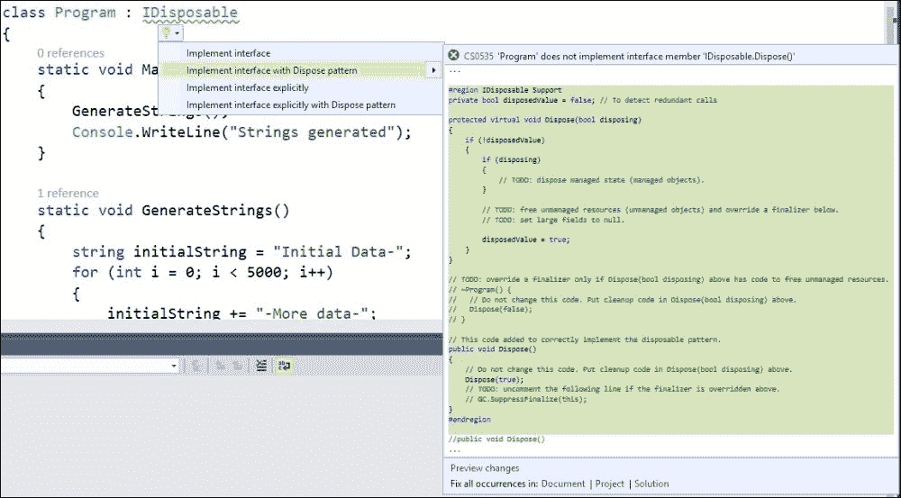

此外，请记住，在必须显式释放资源的情况下，另一种常见且更推荐的方式是在方法上下文中使用`using`块。一个典型的场景是使用`System.IO`命名空间中的某些类打开文件，例如 File。让我们快速回顾一下，以作提醒。

假设你有一个名为`Data.txt`的简单文本文件，你想打开它，读取其内容，并在控制台中显示。一种快速实现的方法是使用以下代码：

```cs
class Program2
{
  static void Main(string[] args)
  {
    var reader = File.OpenText("Data.txt");
    var text = reader.ReadToEnd();
    Console.WriteLine(text);
    Console.Read();
  }
}
```

这段代码的问题是什么？它运行正常，但它使用了一个外部资源，因为`OpenText`方法返回一个`StreamReader`对象，我们稍后使用它来读取内容，并且它没有被显式关闭。我们应该始终记住关闭我们打开并处理的对象。

可能的副作用之一是阻止其他进程访问我们打开的文件。

因此，这些情况的最佳和推荐解决方案是在`using`块中包含冲突对象的声明，如下所示：

```cs
string text;
using (var reader = File.OpenText("Data.txt"))
{
  text = reader.ReadToEnd();
}
Console.WriteLine(text);
Console.Read();
```

这样，垃圾回收器会自动调用以释放`StreamReader`管理的资源，无需显式关闭。

最后，总是有另一种强制对象死亡的方法，即使用相应的终结器（一个以`~`符号开头的函数，与析构函数正好相反）。这不是推荐销毁对象的方法，但它从一开始就存在（让我们记住，Hejlsberg 启发了语言中许多 C++特性的功能）。顺便说一下，实现`IDispose`的高级模式包括这个选项，以处理更高级的收集场景。

## 在 CLR 中实现算法

到目前为止，我们已经看到了一些与 CLR 相关的重要概念、技术和工具。换句话说，我们已经了解了引擎的工作原理以及 IDE 和其他工具如何为我们提供支持，以控制和监控幕后发生的事情。

让我们深入了解一些在日常生活中编程中常见的典型结构和算法，以便我们更好地理解.NET 框架为我们提供的资源，以解决常见问题。

我们提到.NET 框架安装了一个包含大量功能的 DLL 库。这些 DLL 按命名空间组织，因此可以单独使用或与其他 DLL 一起使用。

就像其他框架（如 J2EE）一样，在.NET 中，我们将使用面向对象编程范式作为解决编程问题的合适方法。

### 数据结构、算法和复杂度

在.NET 的初始版本（1.0、1.1）中，我们可以使用几种构造来处理元素集合。所有现代语言都将这些构造作为典型资源，其中一些你肯定应该知道：数组、栈和队列是典型的例子。

当然，.NET 的演变产生了许多新特性，从 2.0 版本的泛型开始，以及其他类似的结构，如字典、`ObservableCollections`等，在长长的列表中。

但问题是，我们是否正确地使用了这些算法？当你必须使用这些构造并将其推到极限时会发生什么？为了应对这些极限，我们是否有方法找出和测量这些实现，以便我们可以在每种情况下使用最合适的一个？

这些问题带我们来到了复杂度的度量。如今，解决这个问题的最常见方法依赖于一种称为*大 O 符号*或*渐近分析*的技术。

### 大 O 符号

**大 O 符号**（**大欧米茄符号**）是数学学科的一个变体，描述了函数在值趋向特定值或无穷大时的极限行为。当应用于计算机科学时，它用于根据算法对输入大小变化的响应来分类算法。

我们通过两种方式理解“它们如何响应”：时间响应（通常是最重要的）以及空间响应，这可能导致内存泄漏和其他类型的问题（最终包括 DoS 攻击和其他威胁）。

### 小贴士

到目前为止，最详尽的链接列表，解释了数千个已编目算法的解释，由**NIST**（**国家标准与技术研究院**）发布，可在[`xlinux.nist.gov/dads/`](https://xlinux.nist.gov/dads/)找到。

表达响应与输入（O 表示法）的关系的方式是一个如*O([公式]*)*的公式，其中公式是一个数学表达式，表示随着输入的增长，算法执行的次数，即增长。许多算法都是*O(n)*类型，它们被称为线性，因为增长与输入的数量成比例。换句话说，这种增长可以用一条直线表示（尽管它从不完全准确）。

一个典型的例子是对排序算法的分析，NIST 提到了一个典型情况：快速排序的平均时间复杂度为*O(n log n)*，冒泡排序为*O(n²)*。这意味着在桌面计算机上，快速排序的实现可以击败在超级计算机上运行的冒泡排序，当要排序的数字超过某个点时。

### 注意

例如，为了排序 1,000,000 个数字，快速排序平均需要 20,000,000 步，而冒泡排序需要 1,000,000,000,000 步！

下图显示了四种经典排序算法（冒泡、插入、选择和希尔）的时间增长。如图所示，直到元素数量超过 25,000，行为相当线性。希尔算法获胜，其最坏情况复杂度为*O(n¹.5)*。请注意，快速排序的因子较小，为*(n log n)*。

不幸的是，没有机械的方法来计算大 O，可以找到的只有一些更多或更少的经验方法。

然而，我们可以使用一些定义良好的表格来分类算法，并给出*O(公式)*，以了解其使用所能获得的结果，例如维基百科上发布的表格，可在[`en.wikipedia.org/wiki/Big_O_notation#Orders_of_common_functions`](http://en.wikipedia.org/wiki/Big_O_notation#Orders_of_common_functions)找到：


从.NET 框架的角度来看，我们可以使用所有链接到`System.Collections.Generics`命名空间且保证在大多数情况下优化性能的集合。

#### 最常见排序算法的性能方法

在`DEMO01-04`中，您将找到一个.NET 程序，该程序比较了三种经典算法（冒泡、归并和堆）与使用整数在`List<T>`集合中实现的算法。当然，这种方法是一种实用且日常的方法，而不是科学方法，对于科学方法，生成的数字应该是均匀随机生成的（参考 Rasmus Faber 对此问题的回答，见[`stackoverflow.com/questions/609501/generating-a-random-decimal-in-c/610228#610228`](http://stackoverflow.com/questions/609501/generating-a-random-decimal-in-c/610228#610228)）。

此外，还应该考虑生成器本身。对于测试这些算法等实际用途，.NET 框架中包含的生成器做得相当不错。然而，如果您需要或对严肃的方法感兴趣，或许最被记录和测试的方法是 Donald Knuth 的*光谱测试*，该测试发表在他的世界著名作品《计算机程序设计艺术，第 2 卷：半数值算法（第 2 版）》的第二卷中，由*Knuth, Donald E.*编写，由 Addison-Wesley 出版。

话虽如此，.NET 中包含的随机生成器类可以为我们提供足够好的结果。至于这里针对的排序方法，我选择了与极端情况相比最常推荐的那些：性能最慢的一个（具有*O(n²)*性能的冒泡排序）和包含在`System.Collections.Generic`命名空间中的`List<T>`类中（在内部，这是一个快速排序）。在中间，对堆和归并方法进行了比较——所有这些方法在性能上都被认为是*O(n log n)*。

之前提到的演示遵循推荐的实现，并对用户界面进行了一些更新和改进，这是一个简单的 Windows Forms 应用程序，因此您可以彻底测试这些算法。

此外，请注意，您应该多次执行这些测试，使用不同数量的输入，以真正了解这些方法的性能，并且.NET 框架是用针对整数、字符串和其他内置类型的优化排序方法构建的，避免了调用委托进行比较等开销。因此，与内置类型相比，典型的排序算法通常要慢得多。

例如，对于 30,000 个整数，我们得到以下结果：

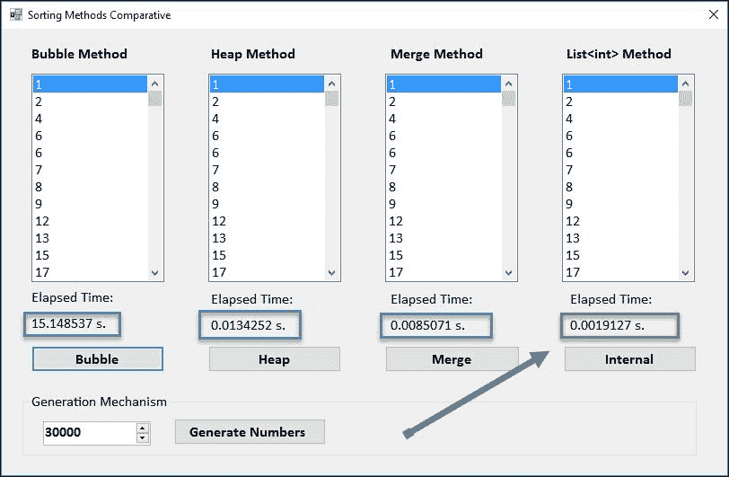

如您所见，当总数超过 10,000 时，冒泡排序（即使是经过优化的冒泡排序方法）的结果要差得多。当然，对于较小的数字，差异会减小，如果程序不超过 1,000，对于大多数实际用途来说可以忽略不计。

作为一项可选练习，我们留给您实现这些算法以进行字符串排序的实现。

### 小贴士

您可以使用这些程序中的一些来快速生成字符串：

```cs
int rndStringLength = 14; //max:32-> Guid limit
Guid.NewGuid().ToString("N").Substring(0, rndStringLength);
```

这个建议来自 Ranvir 在[`stackoverflow.com/questions/1122483/random-string-generator-returning-same-string`](http://stackoverflow.com/questions/1122483/random-string-generator-returning-same-string)：

```cs
public string RandomStr()
{
  string rStr = Path.GetRandomFileName();
  rStr = rStr.Replace(".", ""); // Removing the "."
  return rStr;
}
```

记住，在这种情况下，你应该使用合并和堆算法的泛型版本，以便可以独立于输入值调用相同的算法。

## 出现在 4.5x、4.6 和.NET Core 1.0 和 1.1 版本中的相关功能

在.NET 框架最新版本中可以找到的一些新功能，我们尚未提及，其中一些与 CLR（以及以下章节中将要涵盖的许多其他内容）相关，而在与.NET 核心相关的功能中，我们可以在接下来的几节中找到提到的那些。

### .NET 4.5.x

我们可以将.NET 4.5 中出现的主要改进和新功能总结如下：

+   减少了系统重启

+   64 位平台上的大于 2GB（GB）的数组

+   服务器背景垃圾收集的改进（对性能和内存管理有影响）

+   在多核处理器上可选的背景 JIT 编译（显然可以提高应用程序性能）

+   新的控制台（`System.Console`）对 Unicode（UTF-16）编码的支持

+   在检索资源时的性能改进（特别是对桌面应用程序非常有用）

+   可以自定义反射上下文，以便它覆盖默认行为

+   在 C#和 Visual Basic 语言中添加了新的异步功能，以便添加基于任务的模型来执行异步操作

+   改进了对并行计算的支持（性能分析、控制和调试）

+   在垃圾收集期间可以显式压缩**大对象堆（LOH**）

### .NET 4.6（与 Visual Studio 2015 对齐）

在.NET 4.6 中，新增功能和改进并不多，但它们很重要：

+   64 位 JIT 编译器用于托管代码（在测试版中称为 RyuJIT）。

+   集合加载器改进（与 NGEN 图像协同工作；减少虚拟内存并节省物理内存）。

+   **基类库（BCLs**）中的许多更改：

    +   垃圾收集类中的几个新功能

    +   SIMD 支持的改进（有关 SIMD 的信息，请参阅[`en.wikipedia.org/wiki/SIMD`](https://en.wikipedia.org/wiki/SIMD)）

    +   与 Windows CNG 加密 API 相关的加密更新（CNG 参考信息可在[`msdn.microsoft.com/library/windows/desktop/aa376214.aspx`](https://msdn.microsoft.com/library/windows/desktop/aa376214.aspx)找到）

+   .NET Native，一种新技术，将应用程序编译成本地代码而不是 IL。它们产生的应用程序具有更快的启动和执行时间等优势。

    ### 注意

    .NET Native 在运行时进行了重大改进，但也存在一些缺点，以及其他可能影响应用程序行为和编码方式的考虑因素。我们将在其他章节中更深入地讨论这个问题。

+   开源.NET 框架包（如不可变集合、SIMD API 和网络 API，现在可在 GitHub 上找到）

### .NET Core 1.0

.NET Core 是.NET 的新版本，旨在在任何操作系统（Windows、Linux、MacOS）上执行，可用于设备、云和嵌入式/IoT 场景。

它使用一组新的库，正如 Rich Lander 在官方文档指南([`docs.microsoft.com/en-us/dotnet/articles/core/`](https://docs.microsoft.com/en-us/dotnet/articles/core/))中提到的，最能定义这个版本的特征集是：

+   **灵活部署**：可以包含在您的应用程序中或并行安装到用户或机器范围内。

+   **跨平台**：在 Windows、MacOS 和 Linux 上运行；可以移植到其他操作系统。由微软、其他公司和个人提供的支持的操作系统([`github.com/dotnet/core/blob/master/roadmap.md`](https://github.com/dotnet/core/blob/master/roadmap.md))、CPU 和应用程序场景将随着时间的推移而增长。

+   **命令行工具**：所有产品场景都可以在命令行中执行。

+   **兼容性**：.NET Core 通过.NET Standard 库与.NET Framework、Xamarin 和 Mono 兼容([`docs.microsoft.com/en-us/dotnet/articles/standard/library`](https://docs.microsoft.com/en-us/dotnet/articles/standard/library))。

+   **开源**：.NET Core 平台是开源的，使用 MIT 和 Apache 2 许可证。文档许可在 CC-BY([`creativecommons.org/licenses/by/4.0/`](http://creativecommons.org/licenses/by/4.0/))下。.NET Core 是.NET Foundation 项目([`www.dotnetfoundation.org/`](http://www.dotnetfoundation.org/))。

+   **由微软支持**：.NET Core 由微软支持，请参阅.NET Core 支持([`www.microsoft.com/net/core/support/`](https://www.microsoft.com/net/core/support/))。

### .NET Core 1.1

增加了 Linus Mint 18、Open Suse 42.1、MacOS 10.12 和 Windows Server 2016 的支持，并支持并行安装。

新 API（超过 1000 个）和错误修复。

新的文档可在[`docs.microsoft.com/en-us/dotnet/`](https://docs.microsoft.com/en-us/dotnet/)找到。

ASP.NET Core 1.1 的新版本。

在本书的结尾，我们将介绍.NET Core，以便您对其行为和优势有一个了解，特别是在跨平台领域。

# 摘要

CLR 是.NET 框架的核心，我们已经回顾了其架构、设计和实现背后的某些重要概念，以便更好地理解我们的代码是如何工作的，以及如何在寻找可能的问题时进行分析。

因此，总体来说，在本章中，我们看到了一些重要计算术语和概念的注释（包括评论、图形和图表）提醒，这些术语和概念我们将在书中找到，并且基于这个基础，我们简要介绍了依赖于 .NET 框架创建及其父辈的动机。

接下来，我们介绍了 CLR 的内部结构以及如何使用 CLR 自身提供的工具和 Visual Studio 2015 更新 1 中可用的其他工具来观察其运行情况。

第三个要点是对算法复杂性的基本回顾，包括大 O 表示法和我们在实践中如何通过测试在 C# 中实现的某些排序方法来衡量它，以便结束本章，简要列出最新版本的 .NET 提供的最相关特性，这些特性将在本书的不同章节中介绍。

在下一章中，我们将从 C# 语言的本质开始深入探讨（不要错过 Hejlsberg 创建代理的真实原因），以及它是如何通过泛型、lambda 表达式、匿名类型和 LINQ 语法来简化并巩固编程技术的。
