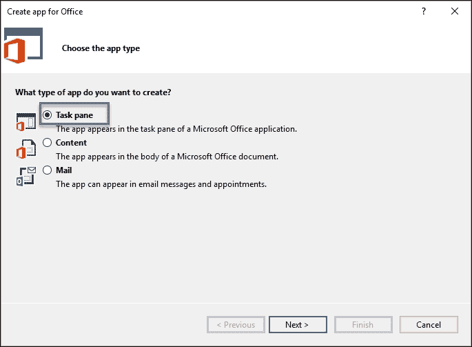

# 第五章。反射与动态编程

计算机科学中反射的原则由维基百科定义为：

> 计算机程序检查、内省和修改其自身结构和行为的能力。

我们在第一章中看到的.NET 程序集的内部结构使我们能够使用称为动态调用的技术，在运行时加载和调用嵌入在我们自己的或外部程序集中的类型。

此外，与 CodeDOM 和 Reflection.Emit 命名空间相关的类允许在 C#或其他语言中运行时生成代码，包括**中间语言**（**IL**）。

然而，除了.NET 到.NET 的对话框之外，我们还可以使用互操作性来操作用其他非.NET 编程语言构建的应用程序。实际上，许多专业应用程序发现依赖外部功能——这些功能我们可能检测到存在于宿主操作系统中的——是合适的，并且非常有用。这意味着我们可以与**Microsoft Office 套件**（其中**Word**和**Excel**是最典型的资源案例）进行互操作。

这些应用程序可以为我们提供新的和令人兴奋的可能性，例如图表（图表）生成、文本拼写、文档模板创建，甚至外接程序增强。

因此，在本章中，我们的目标是回顾一些程序员可能对这些主题感兴趣的最有用概念和用例。

我们将从反射开始，分析.NET 框架提供的用于内省程序集结构和以完全可编程的方式调用内部功能的可能性。

我还将涵盖在运行时生成源代码并生成新类型并在运行时启动它们的能力。

在第二部分，我们将回顾由互操作编程提供的最显著和统计上使用的选项，互操作编程是指当程序与另一个应用程序通信以建立受控的、程序化的对话框以交换数据和向其他应用程序发出指令时使用的名称。

因此，简而言之，我们将讨论以下主题：

+   反射在.NET 框架中的概念和实现

+   反射在日常编程中的典型用途

+   使用 System.Emit 在运行时生成源代码

+   从 C#语言进行互操作编程

+   使用互操作性访问 Microsoft Office 应用程序

+   创建 Office 外接程序或应用程序

# 反射在.NET 框架中的内容

像往常一样，从主要定义（MSDN 源）开始是好的，它声明如下：

> System.Reflection 命名空间中的类，连同 System.Type 一起，使您能够获取有关已加载的程序集及其内部定义的类型的信息，例如类、接口和值类型。您还可以使用反射在运行时创建类型实例，并调用和访问它们。

记住，正如我们在第一章中提到的，程序集的组织方式是它们包含模块，这些模块反过来又包含类型，这些类型包含成员。反射技术允许你找出（内省）给定程序集中存在的模块、类型和成员。

因此，当我们通过 Interop 访问任何成员时，与之相关联的是信息属性的一个层次结构：泛型成员的信息、其 System.Type（它所属的类型）命名空间、方法基类，以及与其属性、字段和事件相关的信息，如图所示：


根据前几章分析的.NET 架构，使这种行为成为可能的是程序集的元数据和.NET 的动态公共类型系统。

简单地看一下.NET 层次结构中最基本成员（`System.Object`）的基本成员，我们可以看到反射是其核心，因为我们有一个将在对象链中始终存在的`GetType()`方法。

实际上，`GetType()`返回一个`System.Type`类的实例，以封装正在检查的对象的所有元数据的方式提供服务。正是通过这个`System.Type`实例，你将能够遍历类型或类的所有细节（除了 IL 代码），并且还能获得发现周围上下文的能力：实现该类型的模块及其包含的程序集。

在第三章《C#和.NET 的高级概念》中，我们包含了以下示例来测试反射的非常基础的概念：

```cs
dynamic dyn = "This is a dynamic declared string";
Type t = dyn.GetType();
PropertyInfo prop = t.GetProperty("Length");
int stringLength = prop.GetValue(dyn, new object[] { });
Console.WriteLine(dyn);
Console.WriteLine(stringLength);
```

在此代码中，我们使用`GetType()`并将结果转换为`Type`对象，我们可以稍后使用它来检查`dyn`变量的成员。查看对象浏览器以寻找`System.Type`实例，可以使事情变得非常清晰：


截图显示了`System.Type`如何实现`IReflect`接口，该接口提供了一组用于内省的方法（大多数以`Get`开头，后面跟着目标内省以查找字段、成员等）。

此外，请注意`InvokeMember`方法的存在，它允许在运行时动态调用类型的成员，并可用于各种目的。这些方法的返回值是表示每个单独成员信息结构的数组：`MemberInfo[]`、`PropertyInfo[]`、`MethodInfo[]`和`FieldInfo[]`。

现在，让我们通过一个简单的控制台应用程序来实现这些想法，该应用程序声明了一个具有三个属性和一个方法的`Person`类，并学习我们如何在运行时获取所有这些信息。

请注意，`Person` 类拥有一个属性，它使用在单独的命名空间（`System.Windows.Forms`）中声明的方 法。通过反射访问并调用该方法没有问题，只是我们必须引用该命名空间，以及稍后我们将使用的 `System.Reflection`：

```cs
using System;
using System.Reflection;
using System.Windows.Forms;
using static System.Console;

namespace Reflection1
{
  class Program
  {
    static void Main(string[] args)
    {
      Person p = new Person()
      {
        eMail = "person@email",
        Name = "Person Name",
        BirthDate = DateTime.Today
      };
      WriteLine($"Type of p: { p.GetType() }");
      Read();
    }
  }
  class Person
  {
    public string Name { get; set; }
    public string eMail { get; set; }
    public DateTime BirthDate { get; set; }
    public void ShowPersonData(string caption, MessageBoxIcon icon)
    {
      MessageBox.Show(this.Name + " - " + this.BirthDate,
      caption, MessageBoxButtons.OK, icon);
    }
  }
}
// Output: "Type of p:  Reflection1.Person"
```

我们将输出包含在代码中，因为它相当可预测，我们只是请求类型。然而，在调用 `Read()` 之前，让我们继续添加一些更多行，以了解更多关于 `Person` 类的信息：

```cs
WriteLine($"Type of p: { p.GetType() }");
Type tPerson = p.GetType();
WriteLine($"Assembly Name: {tPerson.Assembly.ToString()}");
WriteLine($"Module Name (Path removed): {tPerson.Module.Name}");
WriteLine($"Name of the undelying type: {tPerson.UnderlyingSystemType.Name}");
WriteLine($"Number of Properties (public): {tPerson.GetProperties().Length}");
// Now ler's retrieve all public members
var members = tPerson.GetMembers();
foreach (var member in members)
{
  WriteLine($"Member: {member.Name}, {member.MemberType.ToString()}");
}
Read();
```

现在，我们来看看输出中显示的内部结构的其他信息：


一些 *隐藏* 成员现在出现了，例如编译器创建的默认构造函数（`.ctor`），将 `{get; set;}` 声明转换为字段/访问方法对，以及从对象继承的成员。使用这些方法，我们可以获得与成员相关的所有信息。

不仅我们可以找出其他类型的结构，还可以像之前提到的那样调用其成员。例如，`ShowPersonData` 方法接收两个参数来配置 `MessageBox` 对象，向用户展示一些信息。

这意味着我们需要能够调用该方法，并配置和发送它所需的参数。我们可以使用以下代码来完成：

```cs
// Invoke a method
var method = tPerson.GetMethod("ShowPersonData");
object[] parameters = new object[method.GetParameters().Length];
parameters[0] = "Caption for the MessageBox";
parameters[1] = MessageBoxIcon.Exclamation;
method.Invoke(p, parameters);
```

由于参数可以是任何类型，我们创建了一个对象数组，该数组将在运行时使用，以将数组中的每个项与其方法中的参数相对应。在这种情况下，我们想要传递对话框的标题和要使用的图标。

如预期，我们在运行时获得了具有正确配置的相应 `MessageBox` 对象：


当然，我们也可以以类似的方式执行属性的操纵：

```cs
// Change a Property
WriteLine(" Write/Read operations\n");
var property = tPerson.GetProperty("Name");
object[] argums = { "John Doe" };
WriteLine($" Property {property.Name} - Is writable: {property.CanWrite}");
tPerson.InvokeMember("Name", BindingFlags.SetProperty, null, p, argums);
WriteLine($" Property {property.Name}: written ok.");
// Read the Name property
object value = tPerson.InvokeMember(property.Name, BindingFlags.GetProperty, null, p, null);
WriteLine($" New {property.Name} is: {value}");
```

输出确认该属性是可读/写的类型，并确认了更改的结果（注意，我们未传递任何参数来读取数据）：


## 调用外部程序集

如果我们需要有关不同程序集的信息和/或功能，也可以使用 `Assembly` 对象或通过引用程序集并从 `Type` 对象的静态 `GetType()` 方法获取其数据来实现。

这包括那些是.NET 框架本身的一部分。要访问所有这些功能，`System.Reflection` 命名空间提供了一系列相关可能性。如下所示的语法可以满足这一目的：

```cs
using System;
using System.Windows.Forms;
using System.Reflection;
using static System.Console;

namespace Reflection1
{
  class Program2
  {
    static void Main(string[] args)
    {
      // Direct reflection of a referenced type
      // (System.Math belongs to mscorlib)
      WriteLine("\n MemberInfo from System.Math");
      // Type and MemberInfo data.
      Type typeMath = Type.GetType("System.Math");
      MemberInfo[] mathMemberInfo = typeMath.GetMembers();
      // Shows the DeclaringType method.
      WriteLine($"\n The type {typeMath.FullName} contains {mathMemberInfo.Length} members.");
      Read();
    }
  }
}

// output:
// MemberInfo from System.Math
// The type System.Math contains 76 members.
```

因此，我们正在反射包含在基本库 `mscorlib` 中的引用类型（`System.Math`），以找出包含多少成员，就像之前的例子一样。

或者，我们可以使用 `Assembly` 对象在运行时加载程序集，甚至可以使用 `CreateInstance()` 静态方法创建该对象的实例，如下所示：

```cs
// Loading an assembly at runtime.
Assembly asm = Assembly.Load("mscorlib");
Type ty = asm.GetType("System.Int32");
WriteLine(ty.FullName);
Object o = asm.CreateInstance("System.Int32");
WriteLine(o.GetType().FullName);   // => System.Int32
```

还可以获取当前（正在运行）程序集的所有引用程序集。`GetExecutingAssembly()`方法返回一个指向自身的`Assembly`对象，通过调用`GetReferencedAssemblies()`，我们得到所有这些信息。以下代码足以获取此列表：

```cs
// Get information on assemblies referenced in the current assembly.
AssemblyName[] refAssemblies;
refAssemblies =   Assembly.GetExecutingAssembly().GetReferencedAssemblies();
WriteLine(" Assemblies referenced by the running assembly:");
foreach (var item in refAssemblies)
{
  Console.WriteLine(" " + item.FullName);
}
Read();
```

整个输出（包括前面的三个例程）看起来就像以下屏幕截图所示：


## 泛型反射

泛型类型的反射也是可用的，可以使用布尔属性进行检查，例如`IsGenericType`、`IsGenericTypeDefinition`或`GetGenericArguments()`。在这种情况下，相同的机制适用，只是检查相应的类型以确定差异。以下是一个简短的演示，它声明了一个泛型`Dictionary`对象并恢复其类型信息：

```cs
using System;
using static System.Console;
using System.Collections.Generic;

namespace Reflection1
{
  class Program3
  {
    static void Main(string[] args)
    {
      var HttpVerbs = new Dictionary<string, string>();
      HttpVerbs.Add("Delete", "Requests that a specified URI be deleted.");
      HttpVerbs.Add("Get", "Retrieves info that is identified by the URI of the request");
      HttpVerbs.Add("Head", "Retrieves the message headers ");
      HttpVerbs.Add("Post", "Posts a new entity as an addition to a URI.");
      HttpVerbs.Add("Put", "Replaces an entity that is identified by a URI.");

      // Reflection on a generic type
      Type t = HttpVerbs.GetType();
      WriteLine($"\r\n {t}");
      WriteLine($" Is a generic type? {t.IsGenericType}");
      WriteLine($" Is a generic type definition? {t.IsGenericTypeDefinition}");

      // Info on type parameters or type arguments.
      Type[] typeParameters = t.GetGenericArguments();

      WriteLine($" Found {typeParameters.Length} type arguments:");
      foreach (Type tParam in typeParameters)
      {
        if (tParam.IsGenericParameter)
        {
          // Display Generic Parameters (if any);
          Console.WriteLine($" Type parameter: {tParam.Name} in position: " + $" {tParam.GenericParameterPosition}");
        }
        else
        {
          Console.WriteLine($" Type argument: {tParam}" );
        }
      }
      Read();
    }
  }
}
```

—相当可预测的—输出显示了类型（泛型）及其成员（非泛型）的特性，并在循环中迭代，在打印其详细信息之前检查每个类型的泛型性（使用`IsGenericParameter`布尔属性）：


因此，通过更改方法的调用和/或添加一些检查，我们也可以使用反射来使用泛型类型，就像我们使用*经典*类型一样。

## 运行时生成代码

另一个有趣的可能是.NET Framework 中某些类在运行时生成代码的能力，并最终编译和运行它。注意，Visual Studio 本身在许多场景中创建代码：从模板创建不同语言的文档结构，使用代码片段，在 ASP.NET 中构建 ORM，等等。

这个任务可以通过两种主要方式实现：使用 CodeDOM 或通过`System.Reflection.Emit`命名空间内的类。

### System.CodeDOM 命名空间

第一个选项指的是`System.CodeDOM`和`System.CodeDOM.Compiler`命名空间，并且自.NET 框架的第一个版本以来就存在。注意名称中的 DOM 部分：它意味着文档对象模型，就像在 HTML、XML 或其他文档结构中一样。

在 CodeDOM 内部使用类，我们可以使用模板生成源代码，这些模板定义了不同语言中的编码结构，因此我们甚至可以在.NET Framework 支持的所有语言中生成源代码。

要为任何.NET 结构生成代码，CodeDOM 类代表生成代码的任何方面，我们应该使用两种不同的机制：一种表达要构建的元素，另一种在运行时产生实际的代码。

让我们想象一下如何生成之前的`Person`类；只是，为了清晰起见，将其简化到最小元素。

我们需要以下内容：

+   一个`CodeCompileUnit`实例，负责生成我们组件的 DOM 结构（其代码图）。这个结构负责构建我们类包含的不同成员：属性、字段、方法等。

+   其余的元素必须逐个使用 CodeDOM 中可用的类创建，这些类代表每个可能的保留字或结构（类、方法、参数等）。

+   最后，在生成之前，所有单独创建的元素都包含在`CodeCompileUnit`对象中。

让我们看看代码，它生成一个包含我们在本章开头使用的`Person`类定义的文件（为了简洁起见，我仅包括这里的初始行和末尾行。你可以在本章源代码中的 demo `Reflection1`中找到完整的代码）：

```cs
using System.CodeDom;
using System.Reflection;
using System.CodeDom.Compiler;
using System.IO;

namespace Reflection1
{
  class Program5
  {
    static void Main(string[] args)
    {
      CodeCompileUnit oCU = new CodeCompileUnit();
      CodeTypeDeclaration oTD;

      // Working with CodeDOM
      CodeNamespace oNamespace = new CodeNamespace("Reflection1");
      // CodeNameSpace can import declarations of other namespaces
      // which is equivalent to the "using" statement
      oNamespace.Imports.Add(new CodeNamespaceImport("System.Windows.Forms"));
      // Class creation is undertaken by CodeTypeDeclaration class.
      // You can configure it with attributes, properties, etc.
      oTD = new CodeTypeDeclaration();
      oTD.Name = "Person";
      oTD.IsClass = true;

      // Generate code
      CodeDomProvider provider = CodeDomProvider.CreateProvider("CSharp");
      CodeGeneratorOptions options = new CodeGeneratorOptions();
      options.BracingStyle = "C";
      using (StreamWriter sr = new StreamWriter(@"Person.cs"))
      {
        provider.GenerateCodeFromCompileUnit(oCU, sr, options);
      }
    }
  }
}
```

一旦我们在`Program5`中建立了入口点，它的执行将生成一个包含我们在`Program.cs`文件中的相同代码的文件。

### 小贴士

注意，你将不得不检查`bin/debug`目录，因为我们没有建立不同的输出路径。

你应该在**解决方案资源管理器**中看到以下截图类似的内容：


如你所见，生成的代码相当冗长。然而，这正是按特征生成代码所必需的。让我们简要地浏览一下，并强调在生成过程中隐含的最重要类，从`Main`方法的末尾开始。

使一切工作的对象是`CodeDomProvider`类。它必须被实例化，指明要使用的语言（在我们的例子中是`CSharp`）。最后，我们将调用其`GenerateCodeFromCompileUnit`方法，它将使用所有之前的定义来生成为此目的定义的文件中的实际代码。

因此，在`Program5`的顶部，我们声明一个`CompilerUnit`对象。另一个关键组件是`CodeTypeDeclaration`对象，它负责存储在代码生成过程中使用的所有声明。

构造中隐含的其余类仅仅是构建结果类每个砖块的辅助类。这就是`CodeNamespace`、`CodeNamespaceImport`、`CodeSnippetTypeMember`、`CodeCommentStatement`、`CodeMemberMethod`和`CodeParameterDeclarationExpression`类的作用。

虽然你可能认为仅仅创建结果类就花费了太多的精力，但请记住，Visual Studio 内部任务的自动化遵循类似的路径，你可以创建适合你或公司需求的代码生成机制。

在这样的可编程环境中，很容易想象出许多情况，在这些情况下，代码生成可以在运行时由生成程序调整，允许你根据我们之前设定的选项产生不同变体的代码。

### Reflection.Emit 命名空间

`System.Reflection.Emit`命名空间旨在进行代码生成，允许开发者在应用程序内部创建代码或元数据，而不依赖于操作系统加载器的具体细节。

基本上，这个命名空间提供了以下编程选项：

+   它允许在运行时构建模块和程序集。

+   它创建类和类型并发出 IL。

+   它启动.NET 编译器来构建应用程序。

在这里生成代码的方式在几个方面与 CodeDOM 不同。其中之一是能够在运行时生成 IL 代码，这意味着某些 C#代码的执行将产生不是用 C#编写的输出，而是使用这些工具生成的。

在这种代码生成类型中隐含的一个对象是包含在`System.Reflection.Emit`命名空间中的`DynamicMethod`对象。此对象允许获取另一个类型为`ILGenerator`的对象。

一旦你获得`ILGenerator`，你就可以以非常直接的方式动态生成 IL 代码：

```cs
// 1st sample of emission (using ILGenerator):
// A way to obtain one is creating a dynamic method. When the
// method is invoked, its generated contents are executed.
DynamicMethod dn = new DynamicMethod("dynamicMethod", null, null);
var ilgen = dn.GetILGenerator();
ilgen.EmitWriteLine("Testing Reflection Emit.");
ilgen.EmitWriteLine("We use IlGenerator here...");
ilgen.Emit(OpCodes.Ret);
dn.Invoke(null, null);
```

观察我们最终如何调用`DynamicObject.Invoke`方法，就像调用委托一样。如果你测试前面的代码，生成的输出将与 C#代码中对应行的等效输出相对应，该代码产生相同的信息输出：


还要注意，在`ilgen.Emit`的最后调用中存在`OpCodes.Ret`值。这生成一个返回语句，如果存在返回值，则将其从评估堆栈推送到调用者的评估堆栈。

如果你查看与 OpCodes 相关的字段，你会发现它提供了一个广泛的 MSIL 指令的字段表示列表，如下一张截图所示：


### 提示

注意，如果你想深入了解这些可能性，MSDN 上有一个页面，其中包含所有 OpCodes 的详尽关系，链接为[`msdn.microsoft.com/en-us/library/system.reflection.emit.opcodes_fields(v=vs.110).aspx`](https://msdn.microsoft.com/en-us/library/system.reflection.emit.opcodes_fields(v=vs.110).aspx)。

# 互操作性。

本章我们要讨论的另一个重要主题是.NET 应用程序“与”我们系统中的其他已安装应用程序“交流”的可能性。这种交流意味着实例化这些应用程序，在它们之间交换数据，或者请求其他应用程序执行我们本应自己编写的任务。

最初（在 C# 4.0 之前的版本中），这项技术完全是基于 COM 的。这个技巧是通过 Interop 使用一些名为**类型库**（**TLB**）或**对象库**（**OLB**）的 DLL 完成的。程序员随后应该使用（引用）这些库并实例化它们内部的对象，这些对象代表应用程序的内部组件，以便进行通信。

这是通过使用**运行时可调用包装器**（**RCW**）实现的，其操作模式在以下图中解释：


让我们看看 COM 和.NET 世界之间是如何进行通信的。你必须记住，COM 不是一个托管环境，它执行 Windows 操作系统的本地指令。RCW 组件负责这一点，并在两个执行上下文之间充当代理。

在这个模型中，C#程序员没有可选参数可用。因此，你必须传递方法定义的所有参数，使用`System.Reflection.Missing.Value`类型，除此之外，还有使用 Reflection 查找哪些成员存在并可用的其他困难，以及相关的其他辅助工具。

这段代码展示了早期版本中这种情况的一个示例。它假设已经引用了 Microsoft Word 的相应 TLB，该 TLB 公开了一个名为`ApplicationClass`的对象，以允许 Word 实例化：

```cs
public void OpenWordDoc()
{
  ApplicationClass WordApp = new ApplicationClass();
  WordApp.Visible = true;
  object missing = System.Reflection.Missing.Value;
  object readOnly = false;
  object isVisible = true;
  object fileName = Path.Combine(
    AppDomain.CurrentDomain.BaseDirectory, @"..\..\..\Document.doc");
  Microsoft.Office.Interop.Word.Document theDoc = WordApp.Documents.Open(
      ref fileName, ref missing, ref readOnly, ref missing,
      ref missing, ref missing, ref missing, ref missing,
      ref missing, ref missing, ref missing, ref isVisible,
      ref missing, ref missing, ref missing, ref missing);
  theDoc.Activate();
}
```

注意所有由`Open`方法定义的参数，在这个情况下都必须以`missing`的形式传递。正如你所见，这是一种相当笨拙的方式来打开文档并访问其成员（实际上，在一段时间前，使用这种 Interop 功能，从 Visual Basic .NET 操作要容易得多，也更简单）。

## 主要互操作程序集

随着技术的演变，类型库被一种称为**PIAs（主要互操作程序集**）的东西所取代，它们扮演着与 RCWs 相同的作用，但以更简单的方式允许编程。

因此，与外部（互操作）应用程序通信的方式是通过那些负责在两个世界之间进行数据类型序列化的库，这两个世界最初并不容易连接，尤其是对于那些不够熟练使用 COM 平台的程序员。

下面的图示显示了这种通信架构：


让我们从一开始，只使用最新版本，看看我们今天是如何操作的。

要获取（并看到）一个互操作应用程序的实例，第一步是引用相应的 PIA，它将作为代理。这可以在任何.NET 应用程序的**引用**选项中找到，但不是在默认的 DLL 选项卡中，而是在**扩展**选项卡中。

注意你会看到很多 DLL 可用，并且在很多情况下你会观察到重复。你必须注意版本号，它将根据你机器上安装的 Office 版本而变化。

此外，你可能会在你的机器的不同位置找到甚至相同版本的重复。这是由于安装 Office 允许用户在安装过程中手动包含这些 PIAs，或者可能是因为之前安装了较旧的 Office 版本：


如果你检查**引用管理器**的**COM**选项，你也会发现一些包含`Excel`一词的条目。它们可能在你的机器上有所不同，但通常，它们指向被引用的相应可执行文件（下一个截图中的`Excel.exe`）。

然而，如果你也标记了这个选项并接受选择，你将不会在项目引用列表中看到对`Excel.exe`的引用。相反，你会看到一个与之前情况（当我引用 PIA 时）相同的名称的库，但它实际上指向 GAC 中的名为`Microsoft.Office.Interop.Excel`的 DLL，后面跟着一个 GUID 号码：引用被“重定向”以指向最合适的库：


Excel 提供给程序员的对象模型与它的用户界面完全相同。有一个`Application`对象，它代表整个应用程序，每个`Workbook`对象在模型中由相应的对象表示。每个对象包含一个`Worksheet`对象的集合。一旦起点准备就绪，`Range`对象就可以让你操作单个（或一组）单元格。

首先，让我们以现代、简单的方式调用一个 Excel 实例，并用一个新的 Excel 工作簿显示它。在这个示例中，为了在以后将信息在应用程序和 Excel 或 Word 之间交换，我使用了一个基本的 Windows Forms 应用程序，它将使用以下代码启动 Excel。

在我们的 Windows Form 中，我们定义如下：

```cs
using Excel = Microsoft.Office.Interop.Excel;
using Word = Microsoft.Office.Interop.Word;
...
private void Form1_Load(object sender, EventArgs e)
{
  OpenExcel();
}
public void OpenExcel()
{
  var excel = new Excel.Application();
  excel.Visible = true;
  excel.Workbooks.Add();
  excel.get_Range("A1").Value2 = "Initial Data";
  excel.get_Range("B1").Value2 = "Demo data 1";
  excel.get_Range("C1").Value2 = "Demo data 2";
  excel.get_Range("D1").Value2 = "Demo data 3";
}
```

这实际上启动了 Excel 并将这些信息传递给代码中引用的四个单元格，正如我们可以在输出中看到的那样。注意我们代码中的初始声明，以引用 Excel 和 Word。由于我们在文档加载时调用`OpenExcel`，因此两个应用程序都将打开，第二个是 Excel，展示了我们的数据：


这并不是什么惊人的或意料之外的事情，但我们看到使用 Interop 调用其他应用程序并传递数据给它们相当容易。无论如何，Office Interop（以及其他应用程序）的一些特殊性在这里是明显的。

首先，你必须将`excel`对象声明为`Visible`。这是因为默认情况下，Office Interop 应用程序不会显示。当你只想让某个功能发生并在你的应用程序中恢复结果，而不希望目标应用程序打扰最终用户时，这非常有用。

显然，我们正在使用一些你可能不熟悉的对象，因为它们属于目标应用程序：`Range` 代表当前工作表中的单元格范围，`get_Range` 方法恢复一个 `Set`/`Get` 引用到我们作为参数传递的所需单元格。注意，我们可以在传递给此方法的字符串中指定所需的范围或使用枚举，例如在 `get_Range(c1, c2)` 中。

或者，我们也可以使用如下语法创建一个 `Range` 对象：

```cs
// an alternative way to get a range object
var oSheet = excel.Sheets[1]; // Index starts by 1
var oRange = (Excel.Range)oSheet.Range[oSheet.Cells[1, 2],
  oSheet.Cells[4, 3]];
oRange.Value2 = "Same value";
```

观察到在这种情况下，我们声明了一个从 Excel 在初始工作簿中创建的可用工作表集合中恢复的 `Sheet` 对象。使用此对象和类似数组的语法，我们选择要包含在我们范围中的初始和结束单元格（默认情况下，所有这些都可以访问）。

此外，请注意，当我们用我们的单元格定义一个矩形时，会收集多个列，因此最终的修改结果如下所示：


### 格式化单元格

很可能，我们不得不格式化传递给 Excel 表格的内容。这意味着另一种操作方式（这是非常合理的；让我们强调这一点）。

这些对象中的大多数都是单独定义的，然后应用于要针对的对象。在格式化的情况下，请记住，格式应该应用于包含某些值的单元格（可能你打开了一个现有的工作簿对象）。

因此，我们将在我们的表单中创建另一个方法来调用 Excel 并创建一个可以应用于我们单元格的样式。现在这样的方法就足够了：

```cs
public Excel.Style FormatCells()
{
  Excel.Style style = excel.ActiveWorkbook.Styles.Add("myStyle");
  //Creation of an style to format the cells
  style.Font.Name = "Segoe UI";
  style.Font.Size = 14;
  style.Font.Color = ColorTranslator.ToOle(Color.White);
  style.Interior.Color = ColorTranslator.ToOle(Color.Silver);
  style.HorizontalAlignment = Excel.XlHAlign.xlHAlignRight;
  return style;
}
```

注意，一些对象总是引用当前（在那个时刻活跃的）元素，例如 `ActiveWorkBook` 或替代的 `ActiveSheet`。我们还可以依赖一个 `ActiveCell` 对象，它在之前选定的给定范围内操作。

最后，我们调用 `oRange.Columns.AutoFit()` 以使每个列的宽度与其中最大长度一致。有了这个定义，我们可以在需要将样式应用于任何范围时调用 `FormatCells`。在这种情况下，对第二个定义的范围进行操作，输出显示了正确应用了格式的结果：


### 在表格中插入多媒体

另一个有趣的选择是能够在我们的选择区域内插入外部图片。这甚至可以使用剪贴板上的任何内容来完成。在这种情况下，代码相当简单：

```cs
// Load an image to Clipboard and paste it
Clipboard.SetImage(new Bitmap("Packt.jpg"));
excel.get_Range("A6").Select();
oSheet.Paste();
```

输出显示了位于选定单元格中的 Packt 标志：


我们假设带有 Packt Publishing 标志的图片当前（执行）路径中可用。当然，我们可以将其保存在资源文件中，并以其他方式恢复。例如，我们可以使用以下代码从 Packt Publishing 网站上的相应链接恢复这本书的封面图像 [`www.packtpub.com/sites/default/files/B05245_MockupCover_Normal_.jpg`](https://www.packtpub.com/sites/default/files/B05245_MockupCover_Normal_.jpg)：

```cs
public Bitmap LoadImageFromSite()
{
  // Change your URL to point to any other image...
  var urlImg = @"https://www.packtpub.com/sites/default/files/B05245_MockupCover_Nor	mal_.jpg";
  WebRequest request = WebRequest.Create(urlImg);
  WebResponse response = request.GetResponse();
  Stream responseStream = response.GetResponseStream();
  return new Bitmap(responseStream);
}
```

在这里，我们需要 `System.Net` 命名空间中属于 `WebRequest/WebResponse` 对象的帮助，以及作为 `System.IO` 命名空间一部分的 `Stream` 类。正如你所想象的那样，在 Windows Forms 代码中，我们更改之前的代码为：

```cs
Clipboard.SetImage(LoadImageFromSite());
```

生成的输出显示了位于单元格 A6 的这本书的封面（记住，在这样做之前选择目标位置是很重要的）：


以这种方式，我们有一系列可能的添加到 Excel 表格中的内容，包括外部内容，当然，这些内容不必是图形的，并接受其他类型的内容（甚至是视频）。

当我们在 Excel 中处理图形时，通常我们真正想要的是指示 Excel 从一些数据中构建一个业务图表。一旦完成，我们可以将其保存为图像文件或在我们的应用程序中恢复并展示它（通常不会以任何方式显示 Excel 的用户界面）。

要使 Excel 图表对象启动并运行，我们必须以类似于我们对 WorkBook 本身所做的方式将图表添加到 WorkBook 的图表集合中。要生成特定类型的图表，一个有用的对象是 `ChartWizard` 对象，它接收配置参数，允许我们从一个可用的多种图表类型中选择一种，并为我们的图表提供所需的 `Title` 文本。因此，我们可能会得到如下所示的内容：

```cs
chart.ChartWizard(Source: range.CurrentRegion,
  Title: "Memory Usage of Office Applications");
chart.ChartType = Excel.XlChartType.xl3DArea;
chart.ChartStyle = 14;
chart.ChartArea.Copy();
```

### 小贴士

不同类型的图表和样式的解释可以在 MSDN 文档中找到，并超出了本书的覆盖范围（它可在 [`msdn.microsoft.com/en-us/library/microsoft.office.tools.excel.aspx`](https://msdn.microsoft.com/en-us/library/microsoft.office.tools.excel.aspx) 找到）。

注意，我们最终将生成的图形复制到剪贴板，以便使用与之前相同的技术，尽管你也可以使用其他方法来获取图像。

为了获取构建图像的一些直接数据，我从旧版的 Microsoft 演示开始，它从内存中恢复进程，但将目标更改为仅与 Microsoft Office 应用程序相关的进程，并将代码简化到最小：

```cs
public void DrawChart()
{
  var processes = Process.GetProcesses()
    .OrderBy(p => p.WorkingSet64);
  int i = 2;
  foreach (var p in processes)
  {
    if (p.ProcessName == "WINWORD" ||
      p.ProcessName == "OUTLOOK" ||
      p.ProcessName == "EXCEL")
    {
      excel.get_Range("A" + i).Value2 = p.ProcessName;
      excel.get_Range("B" + i).Value2 = p.WorkingSet64;
      i++;
    }
  }

  Excel.Range range = excel.get_Range("A1");
  Excel.Chart chart = (Excel.Chart)excel.ActiveWorkbook.Charts.Add(
    After: excel.ActiveSheet);

  chart.ChartWizard(Source: range.CurrentRegion,
    Title: "Memory Usage of Office Applications");
  chart.ChartType = Excel.XlChartType.xl3DArea;
  chart.ChartStyle = 14;
  //chart.CopyPicture(Excel.XlPictureAppearance.xlScreen,
  //    Excel.XlCopyPictureFormat.xlBitmap,
  //    Excel.XlPictureAppearance.xlScreen);
  chart.ChartArea.Copy();
}
```

在另一个与按钮相关联的事件处理程序中（整个演示始终可用，与本章的配套代码一起提供），我们以这种方式启动该过程：

```cs
private void btnGenerateGraph_Click(object sender, EventArgs e)
{
  DrawChart();
  if (Clipboard.ContainsImage())
  {
    pbChart.SizeMode = PictureBoxSizeMode.StretchImage;
    pbChart.Image = Clipboard.GetImage();
  }
  else
  {
    MessageBox.Show("Clipboard is empty");
  }
}
```

我们假设表单中存在一个名为 `pbChart` 的 `PictureBox` 控件。然而，在显示结果之前，请注意，如果用户与 Excel 交互，我们需要手动关闭和销毁应用程序创建的资源；因此，在 `form_closing` 事件中，我们包含了以下示例代码：

```cs
private void frmInteropExcel_FormClosing(object sender, FormClosingEventArgs e)
{
  excel.ActiveWorkbook.Saved = true;
  excel.UserControl = false;
  excel.Quit();
}
```

此外，我们在开始时创建了一个 Excel 对象（在表单的作用域内声明并在 `Initialize` 事件中实例化），因此 `excel` 变量在表单的所有方法中都是可用的。在执行时，我们同时运行两个应用程序（我保持 Excel 可见以进行演示）：


当按下 **生成 GraphChart** 按钮时，我们会看到重复的输出，其中包括在 `ActiveWorkBook` 中生成的图形以及表单中 `PictureBox` 控件内显示的图片：


Excel Interop 的其他常见用途包括图形报告的自动化、批量电子邮件的生成以及商业文档（发票、收据等）的自动生成。

## 与 Microsoft Word 互操作

Office 自动化解决方案中的另一个明星是 Microsoft Word。就像 Excel 一样，它提供了一个非常完整的 **对象模型**（**OM**），更新以展示每个版本的新功能，并且可以像我们对 Excel 所做的那样完全编程。

自然地，Word 的 OM，或简称 WOM，与 Excel 完全不同，包括程序员自动化任何任务所需的所有特性。实际上，用户界面对象（正如 Excel 的情况一样）得到了忠实的表现，这包括调用对话框以启动某些进程（如拼写检查）或编辑器的任何其他典型配置功能。

与 Excel 一样，自动化是通过 PIA (`Microsoft.Office.Interop.Word.dll`) 实现的，初始化过程相当相似：

```cs
Word.Application word = new Word.Application();
private void btnOpenWord_Click(object sender, EventArgs e)
{
  word.Visible = true;
  word.Documents.Add();

  var theDate = DateTime.Today.ToString(CultureInfo.CreateSpecificCulture("en-US"));
  word.Selection.InsertAfter(theDate + Environment.NewLine);
  word.Selection.InsertAfter("This text is passed to Word directly." + Environment.NewLine);
  word.Selection.InsertAfter("Number or paragraphs: " +
    word.ActiveDocument.Paragraphs.Count.ToString());
}
```

假设我们有一个按钮（`btnOpenWord`），我们在初始化时实例化一个 Word 对象；因此，当用户点击时，我们只需使 Word 可见并使用 `Selection` 对象（如果尚未选择任何内容，则它引用光标）。

从这个点开始，`Selection` 提供了多种方法来插入文本（`InsertDatetime`、`InsertAfter`、`InsertBefore`、`InsertParagraph`、`Text` 等）。注意，这个过程将写入 Word，并且插入的整个文本都保持选中状态：


总的来说，在运行时释放所使用的对象是很重要的。因此，我们在 `form_closing` 事件中编写了以下代码：

```cs
private void fmInteropWord_FormClosing(object sender, FormClosingEventArgs e)
{
  try
  {
    word.ActiveDocument.Saved = true;
    word.Quit();
  }
  catch (Exception)
  {
    MessageBox.Show("Word already closed or not present");
  }
}
```

图像的处理甚至更加简单，因为我们只需几行代码就可以引用任何外部图像。为了加载与 Excel 演示中相同的图像，我们会使用以下代码：

```cs
private void btnInsertImage_Click(object sender, EventArgs e)
{
  var filePath = Environment.CurrentDirectory;
  word.Selection.InsertAfter(Environment.NewLine + "Logo PACKT: ");
  var numChars = word.Selection.Characters.Count;
  word.Selection.InlineShapes.AddPicture(filePath + "\\Packt.jpg",
    Range: word.ActiveDocument.Range(numChars));
}
```

在这里指定图像的位置很重要，因为否则整个选择将被`AddPicture`方法替换。这就是为什么我们添加一个第四个参数（`Range`），这允许我们指明图像应该放在哪里。

此外，观察我们如何始终了解文档元素的所有方面（字符数和`Rows`、`Columns`、`Shapes`、`Tables`、`Paragraphs`等的集合）。此外，由于我们现在可以使用命名参数，我们只需传递所需的参数即可：


通过选择一个`Range`对象并将其配置到所需值，格式化也可以非常容易地实现（我们为此创建了一个名为`btnFormat`的特殊按钮；因此，在`Click`事件中，我们编写以下代码：

```cs
private void btnFormat_Click(object sender, EventArgs e)
{
  Word.Range firstPara = word.ActiveDocument.Paragraphs[1].Range;
  firstPara.Font.Size = 21;
  firstPara.Font.Name = "Century Gothic";
  firstPara.ParagraphFormat.Alignment =
    Word.WdParagraphAlignment.wdAlignParagraphCenter;
}
```

在我们的文档中的前一段文本，一旦点击事件被触发，我们就会得到这个捕获中显示的输出：


Word 的另一个非常常见的用途与其操作文本并返回文本到调用函数的能力有关。这在检查拼写和其他内部引擎，如语法修订时特别有用。

这种技术包括将所需文本传递给 Word，选择它，并启动**拼写和语法**对话框来操作它。一旦文本被修订，我们就可以将修正后的文本返回到调用应用程序。让我们看看在示例中它是如何工作的。我们有一个名为`Spell Check`（命名为`btnSpellCheck`）的按钮，它使用以下代码启动拼写校正过程：

```cs
private void btnSpellCheck_Click(object sender, EventArgs e)
{
  if (word.Documents.Count >= 1)
    rtbSpellingText.Text +=
      Environment.NewLine + Environment.NewLine +
    SpellCheck(rtbSpellingText.Text);
  else
    MessageBox.Show("Please, use the Open Word option first");
}

private string SpellCheck(string text)
{
  var corrected = string.Empty;
  var doc = word.ActiveDocument;
  if (!string.IsNullOrEmpty(text))
  {
    doc.Words.Last.InsertAfter(Environment.NewLine + text);
    var corRange = doc.Paragraphs.Last.Range;
    corRange.CheckSpelling();
    corrected = corRange.Text;
  }
  return corrected;
}
```

输出包括三个元素：我们的.NET 应用程序、Word 以及当调用`CheckSpelling`方法时启动的**拼写和语法**对话框，如下面的截图所示：


当过程结束后，修正后的结果会返回给调用函数，在那里我们更新用于保存文本的`RichTextBox`控件。请注意，您可以保持 Word 不可见，用户界面中唯一可用的功能就是您的应用程序和**拼写和语法**对话框。

此外，请注意，我们检查是否存在打开的文档，否则将生成运行时异常。在过程结束后，我们的`RichTextBox`控件将包含预期的修正文本：


除了这个实用程序之外，实际上任何其他与 Office 相关的功能都可以通过类似的方式进行自动化。然而，这并不是我们通过.NET 应用程序使用和扩展 Office 功能的唯一方法。实际上，最成功的一种选择依赖于插件构造或 Office 应用程序。

## Office 应用程序

在 Office 2013 的官方页面（我们在这里使用的是这个版本，尽管这个示例在 2016 版本中也运行得很好），Office 应用程序是这样定义的：

> Office 应用程序使用户能够在应用程序、平台和设备上运行相同的解决方案，并通过整合来自网络的丰富内容和服务，在 Office 应用程序中提供改进的体验。

关键架构进一步解释了，指出这些应用程序通过使用网络的力量和标准网络技术（如 HTML5、XML、CSS3、JavaScript 和 REST API）在支持的 Office 2013 应用程序中运行。这一点非常重要，原因有很多。

首先，标准技术的使用使我们能够整合我们可能拥有的任何先前或已经创建的功能性内容。如果它在 Web 上工作，它将在这些应用程序之一上工作（尽管通过 JavaScript API 的自动化并不涵盖 PIAs 提供的所有可能性）。然而，另一方面，JavaScript 5/6 暴露的 API 为开发人员提供了许多新的编程选项（Web Workers、Web Sockets 等）。

如果这还不够，请考虑今天可用的大量 JavaScript 和 CSS 框架：jQuery、BootStrap、Angular 等。我们可以在这些应用程序中使用所有这些框架。总的来说，我们谈论的是一个托管在 Office 客户端应用程序（Excel、Word、PowerPoint 和 Project 都是可用选项）内的网页。

注意，这些应用程序可以在桌面客户端、Office Online、移动浏览器以及本地和云环境中运行。部署选项包括 Office Store 或现场目录。

让我们看看这是如何工作的，通过使用 Visual Studio 2015 提供的默认模板，分析和自定义这些内容以创建一个初始的、可工作的演示。

### Office 应用程序默认项目

因此，让我们创建一个新的项目，并选择**Visual C#-Office/SharePoint-Apps**树元素：我们提供了三个选择。如果您选择**Office 应用程序**选项，将显示一个选择框（我将使用**任务窗格**，但您也可以选择**内容**和**邮件**）：



### 小贴士

网站上提供了许多不同类型应用程序的其他模板，该网站地址为[`dev.office.com/code-samples#?filters=office%20add-ins`](http://dev.office.com/code-samples#?filters=office%20add-ins)。

在这个演示中，我选择 Word 作为目标 Office 应用程序，尽管默认情况下所有复选框都被勾选：


如果您查看生成的文件，您会注意到这些应用程序基本上由两部分组成：一个清单文件，它配置应用程序的行为；以及一个网页，它引用所有必需的资源：jQuery、样式表、JavaScript 初始化文件、`web.config`文件等。

如果您打开清单文件，您会看到 Visual Studio 提供了一个配置文件编辑器，您可以在其中指示每个功能方面。在该窗口的**激活**选项卡中的注释提醒我们这个应用程序可能工作的目标：


实际上，这个模板一旦编译就可以工作，它操作所选文本块，将其传递回**任务**窗格，该窗格将出现在新 Word 文档的右侧，显示`Home.html`页面。这个页面反过来加载`Home.js`和`app.js`文件，负责初始化。此外，还添加了`.css`文件用于格式化。

此外，还有一个非常重要的 JavaScript 代码片段，通过 CDN 引用，名为`office.js`。这是负责此处两个世界之间交通的库：Office 编程模型和 HTML5/CSS3/JS 世界。

页面上有一个图形方案在[`technet.microsoft.com/en-us/library/jj219429.aspx`](https://technet.microsoft.com/en-us/library/jj219429.aspx)，它提供了在运行时对该场景的视觉观察：


要运行测试，从 Visual Studio 启动应用程序，当 Word 出现时，输入一些文本并选择它。可选地，你可以尝试*lorem 技巧*（你可能已经知道了）：只需在文档中输入`=lorem(n)`，其中*n*是你想要生成的 lorem 段落数量，lorem 文本将自动附加到文档的当前文本。

一旦我们这样做并选择一个片段，标记为**从选择获取数据**的按钮将恢复所选文本，并在**任务**窗格的底部展示它。你应该看到以下截图所示的内容：


### 架构差异

注意，这次没有引用 Interop 库。这是一个重大的架构变化，由 Office JavaScript 对象模型承担——虽然不如 PIAs 库中的详尽，但足够宽泛，为我们提供了许多有用的选项。

让我们添加一个非常简单的方法来展示我们如何反向操作：从**任务**窗格向文档中插入文本。

首先，我们需要向**任务**窗格用户界面添加一个新元素。一个简单的按钮就足够我们使用了，所以我们在现有的`get-data-from-selection`按钮旁边添加一个新按钮：在`Home.html`文件中，我将称之为`insert-data-from-Task-Pane`：

```cs
<button id="insert-data-from-Task-Pane">Insert data from TaskPane</button>
```

下一步是按照模板演示的方式编程按钮的点击事件处理程序，但在这里将代码简化到最大程度。因此，在`Home.js`文件中，紧邻其他按钮的初始化代码旁边，我们将添加一个类似的功能：

```cs
$('#insert-data-from-Task-Pane').click(insertDataFromTaskPane);
```

并且，`insertDataFromTaskPane`的主体包含以下代码：

```cs
function insertDataFromTaskPane() {
  Office.context.document.setSelectedDataAsync(
    'Text inserted from the Task Pane' +
    '\nCallaback function notifies status',
    function (result) {
      app.showNotification('Feedback:', result.status);
    }
  );
}
```

注意，**任务**窗格不允许使用对话框；因此，我们通过在应用程序对象上调用`showNotification`来通知用户过程的成功或错误，将数据发送到之前在初始化过程中配置的**任务**窗格通知区域。

因此，我们在这里向两个方向前进：从**任务窗格**到 Word 文档，插入几行并通知相反方向的工作情况。注意，`setSelectedDataAsync`方法为我们提供了一个机制，以类似于我们之前使用 PIAs 对象模型的`insertAfter`方法的方式将数据插入文档中。

最后，请记住，在 JavaScript 世界中，通常将回调函数作为许多函数调用的最后一个参数来分配，以便在方法执行完成后提供反馈或添加额外的功能。在函数声明中恢复的参数（`result`对象）包含包括操作状态等相关信息在内的属性。

在 MSDN 文档中关于编程此类应用程序的信息非常丰富，你将能够看到这类应用的新类型，特别是允许构建 Office 365 插件的程序。

仅为了完整性，让我们通过这张截图展示之前代码的结果：


# 摘要

我们看到了与.NET Framework 能够以标准方式自省其自己的程序集并调用其功能，甚至使用 CodeDOM 的可能性在运行时生成代码相关的编程的几个方面，这使我们可以随意生成模板和其他代码片段。

我们还简要介绍了`Reflection.Emit`，只是为了检查如何在运行时生成 IL 代码并将其插入其他可执行代码中。

在本章的第二部分，我们涵盖了在 Office 自动化中最常见的场景，这是一种允许我们调用包括 Excel 和 Word 在内的 Office 中包含的功能的技术，并通过代理库（主互操作程序集）与之交互，以几乎绝对控制其他应用程序的方式，能够通过向这些代理发出的指令在应用程序和 Office 合作伙伴之间传递和恢复信息。

我们最终包括了关于构建组件新方法的简要介绍，这种方法出现在 Office 2013 版本（Office 应用）中，并了解了这些类型组件的基本架构，回顾了 Visual Studio 提供的基本模板，并将其修改为通过**Office JavaScript 对象模型**实现简单、双向的功能。

在下一章中，我们将专注于数据库编程，涵盖在 Visual Studio 中可用的关系模型交互的基础。
