# 第六章 SQL 数据库编程

本章讨论根据关系模型原则构建的数据库的访问，通常我们将其称为 SQL 数据库，因为使用该语言来操作其数据。在下一章中，我们将探讨新兴的 noSQL 数据库模型。

### 注意

注意，我们在这里不会深入探讨数据访问。这只是一个快速回顾，介绍您在根据关系模型构建的数据库系统中可以使用的最常见可能性。

在这里，我们将在介绍 SQL Server 2014（我将在本章中使用）之前，快速回顾关系模型（模式、范式规则等）的规则和基础。此外，我们还将介绍安装 SQL Server 2014 Express Edition（完全免费）的过程，以及一些示例数据库，这些数据库将帮助我们进行演示。

在本节中，我们还将介绍 Visual Studio 提供的一种不太常见的项目类型，用于处理数据库，即 SQL Server 项目模板，并探讨我们如何直接从 Visual Studio 配置目标数据库的许多方面。我们甚至可以将所有这些配置保存为`.dacpac`文件，该文件可以在任何其他机器上复制。

然后，我们将介绍基本.NET Framework 数据库引擎，这些引擎被推荐用于数据管理。我们将从版本 1.0（ADO.NET）中出现的初始引擎开始提醒，然后过渡到实体框架模型（最常见且由微软推荐），该模型已经达到 6.1 版本（尽管新版本与.NET Core 浪潮保持一致，并且最近以 Entity Framework 1.1 的名义发布）。

我们将了解如何从一个演示数据库中构建 ORM 数据模式，以及如何使用 EF 查询和操作数据，以及这些版本为程序员提供的一些新可能性。

总体而言，本章将涵盖以下主题：

+   数据库关系模型的复习

+   SQL Server 2014 数据库系统、安装和功能

+   Visual Studio 中的 SQL Server 项目模板

+   使用 ADO.NET 进行基本数据访问

+   使用 Database-first *flavor*进行 Entity Framework 6.0 的基本数据访问，类似于 ASP.NET MVC 应用程序

# 关系模型

直到 1970 年，数据访问在性质和管理上都是多样化的。没有标准或常见的途径可用，我们今天理解的数据库所使用的术语是数据银行，但它们的结构相当不同。

当然，还有其他模型，如层次模型和网络模型，但它们的规范有些非正式。

在 1969 年和随后的几年里，IBM 的一名工程师（E.F. Codd）开始发表一系列论文，其中他确立了我们现在理解的关系模型的基础；特别是，他的论文《数据库管理的关系模型》现在被认为是 RM 宣言。在这个模型中，所有数据都是用元组表示的，这些元组被分组到关系中。因此，按照关系模型组织的数据库被称为关系数据库。

## 关系表属性

以下是关系表的属性：

+   所有数据都是以关系集合的形式提供的。

+   每个关系都描述为一个表。一个表由列和行组成。

+   列是实体的属性，由表的定义建模（在一个客户表中，你可能会有`customerID`、`e-mail`、`account`等等）。

+   每一行（或元组）代表一个单一实体（也就是说，在一个客户表中，`1234`、`thecustomer@site.com`、`1234`、`5678`等等，将表示一个包含单个客户的行）。

+   每个表都有一组属性（一个或多个），可以作为键使用，唯一地标识每个实体（在客户表中，客户 ID 将指定单个客户，并且这个值在表中应该是唯一的）。

许多类型的键提供了多种可能性，但最重要的两种是主键和外键。前者唯一地标识元组，后者位于另一个表中，允许建立表之间的关系。正是通过这种方式，我们可以根据公共字段查询与两个或多个表相关的数据（这个字段不需要命名为我们将与之匹配的另一个字段；它只需要是相同的数据类型）。

关系模型基于关系代数（也被 E.F. Codd 描述，他提出这种代数作为数据库查询语言的基础，因此与集合论相关）。这种代数使用集合的并集、差集和笛卡尔积，并给这些操作符添加了额外的约束，例如`select`、`project`和`join`。

这些操作在 SQL 语言中有直接的对应关系，SQL 语言用于操作数据，基本上我们找到以下内容：

+   **选择**：它从表中恢复行值（可选地，根据给定的标准）

+   **投影**：它读取选择的属性值

+   **连接**：它结合两个或多个表（或仅一个，作为第二个表）的信息

+   **交集**：它显示两个表中都存在的行

+   **并集**：它显示多个表中的行并删除重复的行

+   **差集**：它恢复一个表中不存在于另一个表中的行

+   **积**：笛卡尔积结合了两个或多个表中的所有行，通常与过滤子句和外部键关系一起使用

关系模型的一个重要方面是通过一系列规则确保数据完整性。主要的是，有五个规则必须考虑：

+   元组和/或属性顺序不重要：如果你在电子邮件之前有 ID，这与在 ID 之前有电子邮件是相同的。

+   每个元组都是唯一的。对于表中的每个元组，都有一个唯一标识它的值组合。

+   每个字段只包含单个值。或者说，如果你愿意，每个表单元格应该只包含一个值。这是由第一范式推导出来的；我们稍后会讨论这一点。

+   一个属性（可以将其视为列）内的所有值来自同一个域。也就是说，只有允许由属性定义的值是允许的，无论是数字、字符、日期等等。它们的实际实现将取决于数据库引擎允许的类型定义。

+   表的标识符在单个数据库中必须是唯一的，表中的列也是如此。

本文中提到的原则和规则通过范式规则（通常称为**规范化**）形式化。它们建立了一系列规则来加强数据完整性。然而，在实践中，只有前三个规则（1NF、2NF 和 3NF）在日常业务中应用，甚至第三个规则在某些情况下也允许进行**反规范化**过程，以避免设计中的不必要复杂性。

简而言之，这些是三个规范性范式的要求：

+   **1NF**：它消除了同一表中重复的列。也就是说，为每组相关数据创建单独的表，并用主键标识每一行。

+   **2NF**：它消除了适用于表的多行数据的子集，并创建了一个包含它们的新的表。之后，你可以创建外键来维护表之间的关系。

+   **3NF**：它删除了所有不依赖于主键的列。

使用这些范式，我们的数据完整性在 99%的情况下得到保证，并且我们可以非常高效地利用我们的数据银行使用 SQL。记住，那些唯一标识每个表行键允许创建索引，这些索引是额外的文件，旨在加快和简化数据恢复。

在 SQL Server（和其他数据库管理系统）的情况下，允许两种类型的索引：

+   **聚集索引**：每个表只能有一个。它们是极快的结构化数据，应该基于短字段长度，并且最好是基于那些不会改变的字段，例如我们之前提到的客户 ID。

+   **非聚集索引**：每个表可以定义多个，并允许在读取、连接和过滤操作中提高速度。建议候选字段是那些出现在`WHERE`和`JOIN`子句中的字段。

# 工具 – SQL Server 2014

在本章中，我使用的是 SQL Server 2014 Express Edition，它是免费安装的，包括可选安装**SQL Server Management Studio**（**SSMS**），这是一个可视化工具，允许用户管理 DBMS 内的所有对象，但您也可以使用 2016 版本，它具有相同（扩展）的功能。

您可以在[`www.microsoft.com/en-us/download/details.aspx?id=42299`](https://www.microsoft.com/en-us/download/details.aspx?id=42299)找到它们，一旦安装完成，您将在系统菜单中看到一个新条目，包括与该产品相关的几个工具。有了 SSMS 准备就绪，您应该下载并安装一些示例数据库。我推荐 Adventure Works 2014，它包含足够的数据，可以应对您在日常编程中需要测试的大多数典型情况。

在[`msftdbprodsamples.codeplex.com/Releases`](http://msftdbprodsamples.codeplex.com/Releases)有一个可用的版本。一旦安装，只需打开 SQL Server Management Studio，您应该会看到一个可用的数据库副本，如下面的截图所示：

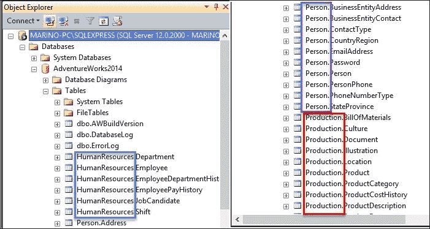

您将找到一些组织在模式（表示数据管理公共区域的名称，如**HumanResources**、**Person**或**Production**）中的表。如果您不熟悉 SQL Server 或已经了解其他 DBMS，您不会觉得创建和编辑查询或其他 SQL 相关命令的常规工具奇怪。它们可以通过在 SQL Server 资源管理器中选择列表中的任何成员时出现的上下文菜单获得。请参考以下截图：

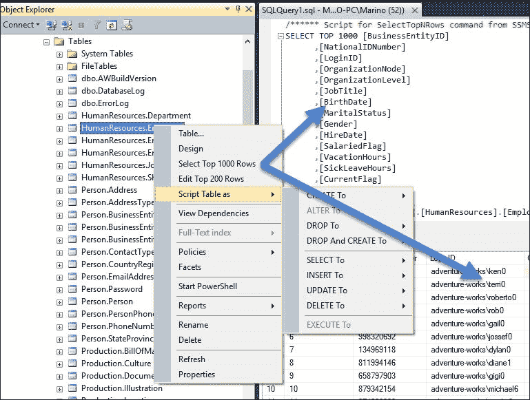

所有标准数据库管理所需的操作都可通过 SSMS 获得，因此我们可以始终检查结果、SQL 命令、测试执行计划、创建和设计现有或新数据库、建立安全要求，以及创建任何其他后端业务逻辑需要的对象，并且可以立即对其进行测试，如前一个截图所示。

编辑器中还有其他有用的可能性，因为——就像在 Visual Studio 中发生的那样——它们提供了在任何时间可用的对象的 Intellisense，编辑 SQL Server 命令、代码提示、语法错误建议等等。

程序员的经验也得到了增强，因为高级调试功能允许在 SSMS 内或甚至从 Visual Studio 本身进行调试，因此您可以启用**远程调试**选项并使用断点和所有常规工具，就像您在进行 C#代码调试会话一样：

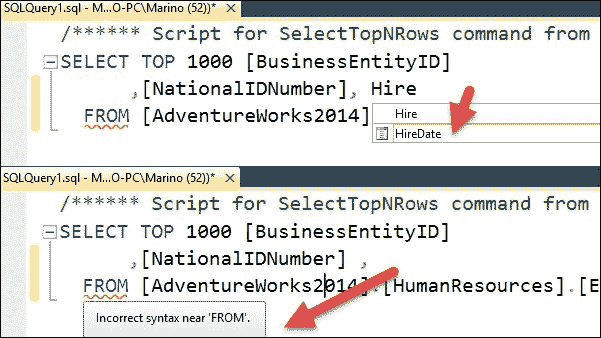

此外，您还可以打开**活动监视器**窗口，它将显示一个仪表板，其中包含从 SSMS 启动的任何 SQL 命令的不同使用相关统计信息：

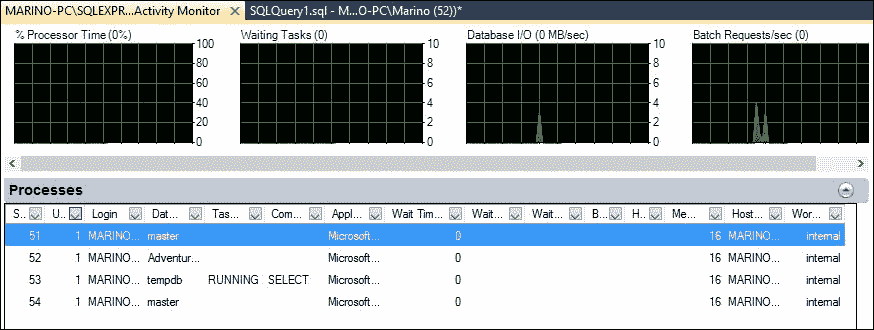

## SQL 语言

幸运的是，关系模型稳固的基础促成了标准的创建，该标准最早于 1986 年由 **美国国家标准协会**（**ANSI**）发布，并在 1987 年由 **国际标准化组织**（**ISO**）跟进。

从那时起，该标准定期修订，以通过新功能增强语言。因此，2003 年的修订包括了 XML 数据类型和自动生成的值（包括标识列），并在 2006 年扩展了 XML 支持，以涵盖 XML 数据的导入/导出和 XQuery 功能。

然而，正如维基百科提醒我们：

> 尽管存在这些标准，但大多数 SQL 代码在不同数据库系统之间没有调整的情况下并不能完全移植。

至少我们有一个共同的背景，这使我们能够通过这些调整编写可移植的代码，在多种关系型数据库管理系统（RDBMS）中执行。

在 SQL Server 中实现的 SQL 版本被称为 **T-SQL**（**Transact-SQL**）。正如维基百科提醒：

> T-SQL 在 SQL 标准的基础上扩展了过程编程、局部变量、各种字符串处理、日期处理、数学等方面的支持函数。

此外，你还可以在 `DELETE` 和 `UPDATE` 语句中找到变化。

所有这些附加功能使得 Transact-SQL 成为了一个 *图灵完备* 语言。

### 小贴士

注意，在可计算理论中，如果一个数据处理规则系统（如计算机的指令集、编程语言或细胞自动机）能够模拟任何单带图灵机，那么它就被认为是图灵完备的或计算上通用的。今天广泛接受的编程语言，如 .NET 语言、Java、C 等，都被认为是图灵完备的。（维基百科：[`en.wikipedia.org/wiki/Turing_completeness`](https://en.wikipedia.org/wiki/Turing_completeness)）。

正如我们所说，T-SQL 是一种非常强大的语言，它允许变量声明、流程控制、改进 `DELETE` 和 `UPDATE` 语句以及 `TRY/CATCH` 异常处理等功能。要获取 T-SQL 语言的完整参考，请访问 [`msdn.microsoft.com/en-us/library/bb510741.aspx`](https://msdn.microsoft.com/en-us/library/bb510741.aspx)，因为这种语言的细节值得一本专著。

## Visual Studio 中的 SQL Server

SQL Server 以不同的形式提供给 Visual Studio 程序员。首先，我们有一种项目类型，名为 `SQL Server Database Project`，你可以选择它就像选择另一个常见的可编程模板一样。

只需选择 **新建项目** 并向下滚动到 SQL Server。通常（这可能取决于你机器上已安装的其他模板），你会找到这种类型的项目，一旦选择，就会创建一个解决方案结构。

初始时，你将发现解决方案资源管理器非常空，查看**添加新**菜单将显示这种类型的项目为数据库操作提供的众多选项（参见图表）：

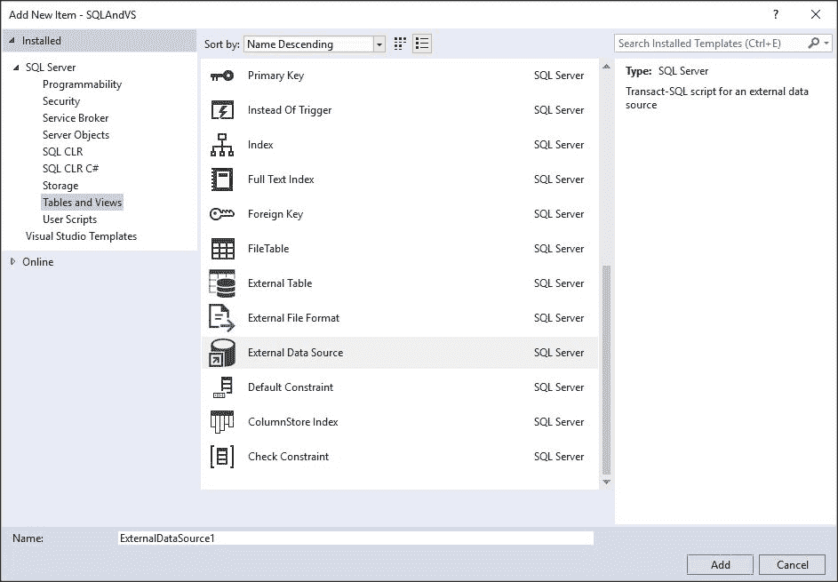

如我们所见，以这种方式提供了大量不同的数据库对象，包括 SQL Server 管理的大多数内部对象、外部文件、安全方面、CLR 集成等等。

第一步是选择菜单中的**工具/连接到数据库**选项，以便将我们的项目链接到已安装的`AdventureWorks`数据库。你将看到一个常规的**添加连接**对话框，你可以选择一个数据库。此时，查看服务器资源管理器将允许你查询数据和其他选项。

注意，尽管 Visual Studio 提供的选项不如在 SSMS 内部那么多，但其中最实用的数据管理选项仍然会出现，包括数据可视化，因此我们不必在许多常规的开发场景中打开 SSMS。

当你以这种方式打开 AdventureWorks2014 数据库时，你应该会找到一个类似于下一张截图的用户界面（注意，对于程序员来说，最重要的功能已经提供）：

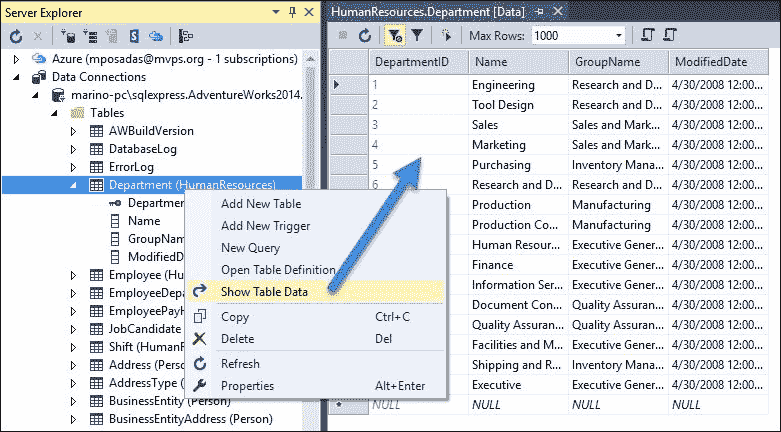

如果你启用了解决方案资源管理器中的**显示所有文件**，你将发现编译应用程序后，`bin`和`obj`目录中会出现许多文件，其中之一具有`.dacpac`扩展名。

这些文件为我们提供了许多可能性，正如 Jamie Thomson 在文章《Dacpac braindump - 什么是 dacpac？》中指出的，该文章可在官方 SQL 博客上找到（[`sqlblog.com/blogs/jamie_thomson/archive/2014/01/18/dacpac-braindump.aspx`](http://sqlblog.com/blogs/jamie_thomson/archive/2014/01/18/dacpac-braindump.aspx)）：

> 在那个单一文件中，收集了可以在 SQL Server 数据库中找到的对象定义，例如表、存储过程、视图，以及一些实例级别的对象，如登录名等（SQL Server 2012 支持的对象完整列表可以在 DAC 支持 SQL Server 对象和版本中找到）。由于 dacpac 是一个文件，这意味着你可以像处理任何其他文件一样处理它，存储它、通过电子邮件发送它、在文件服务器上共享它等……这意味着它们是分发许多对象定义（也许甚至是一个完整的数据库）的绝佳方式。或者，正如微软所说，这是一个自包含的 SQL Server 数据库部署单元，它使数据层开发人员和数据库管理员能够将 SQL Server 对象打包成一个可携带的工件，称为 DAC 包，也称为 DACPAC。

这些项目的另一个有趣特性可以通过在项目菜单中导航到**导入** | **数据库**来发现。如果你选择这个选项，你将看到一个对话框，你可以从中选择三种不同的数据来源：本地、网络和 Azure。

在我们的案例中，如果我们选择本地选项，我们将看到所有可用的数据库实例列表（这取决于我们机器的配置）：

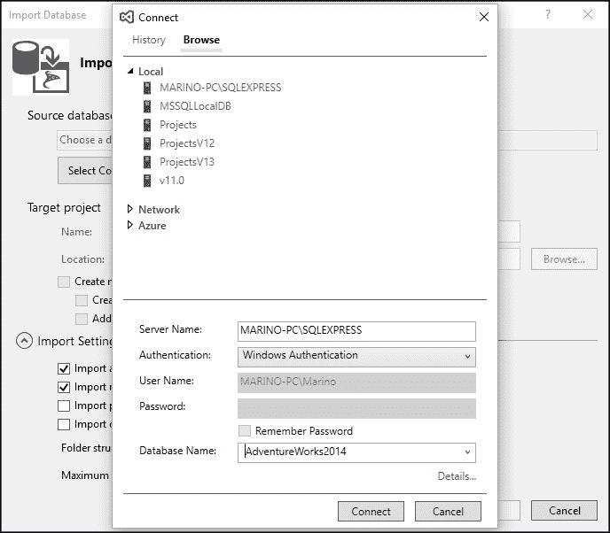

完成此选项后，导入数据的过程将开始——这可能需要一些时间，具体取决于数据的大小、网络速度（对于网络连接）或互联网带宽（对于 Azure 连接）。

当过程结束时，你将在项目中找到一系列元素，每个元素都代表你连接的数据库中可用的对象：表、模式、函数、存储过程、用户、登录等。

换句话说，你将在项目中以元素为单位表示整个数据库。查看文件显示，其内容取决于其性质：对于存储过程，你会看到创建和定义它的 SQL 语句，但对于表，你会看到设计编辑器和从 Visual Studio 更改它的其他编辑选项，如下一张截图所示：

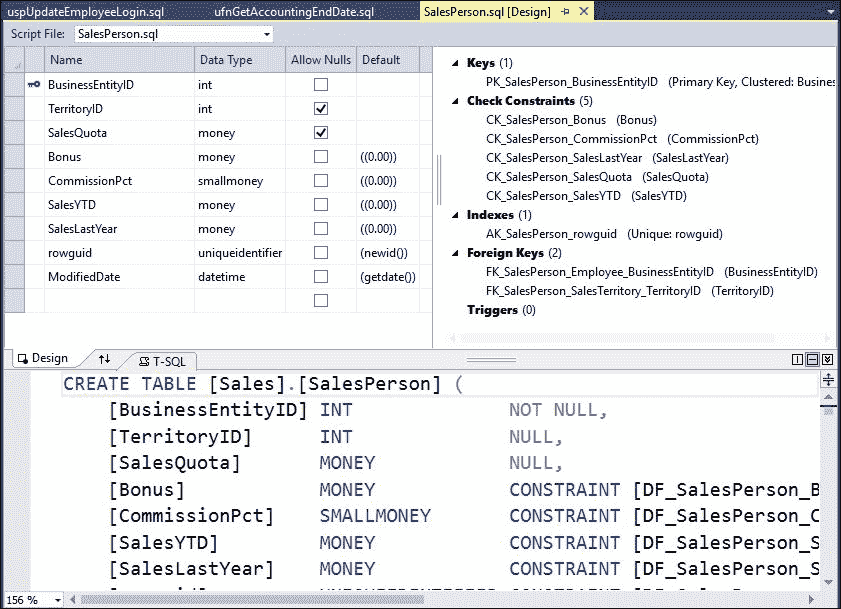

你在这个项目中可能对设计或任何对象的定义所做的任何修改，在将项目编译成`.dacpac`文件时都会被存储，并且可以轻松地在你的选择的目标 DBMS 中恢复或创建。

注意，`.dacpac`文件只是一个 ZIP 文件，因此你可以将此扩展名添加到文件中并检查其内容，这些内容以 XML 语法表达，它们只是你创建的项目的内容。它们只是以特殊的方式打包：它们传达了 Open Packaging Convention，这是由 Microsoft 创建的标准格式，以更轻便的方式将这些文件聚集在一起。

这种格式现在被许多 Microsoft 世界内外应用程序使用：AutoDesk、AutoCad、Siemens PLM、MathWorks 等。

因此，这类项目是管理数据库解决方案的完美补充，你可以将它们作为部署过程的一部分。如果你完成了你的修改，你可以像处理任何可执行文件一样构建项目。

一旦你的项目构建完成，你可以在现有的数据库管理系统（DBMS）中发布结果。为此，你需要选择**发布**选项，并且你将需要在**发布配置**对话框中获取初始数据，例如连接字符串、数据库名称等。

此外，这种发布配置可以保存并存储以供以后使用。与配置文件相关的三个按钮允许你加载已存在的配置文件，从当前配置创建配置文件，以及以不同的名称保存配置文件。

出现了一些其他有趣的选择，例如编辑数据库连接字符串（例如，在另一个 SQL Server 实例中复制它），还可以通过 **高级** 按钮获取更详细的信息：

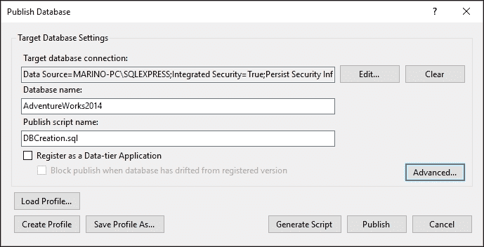

**高级** 按钮值得一看，因为目标中最终创建的每个方面都会在那里得到覆盖。许多选项都与我们希望在目标 DBMS 中转换数据的方式有关。

注意，你有三个选项卡，允许配置过程的各个方面，包括你想要删除的元素（**删除**）和想要忽略的元素（**忽略**）。下一张截图显示了此对话框：

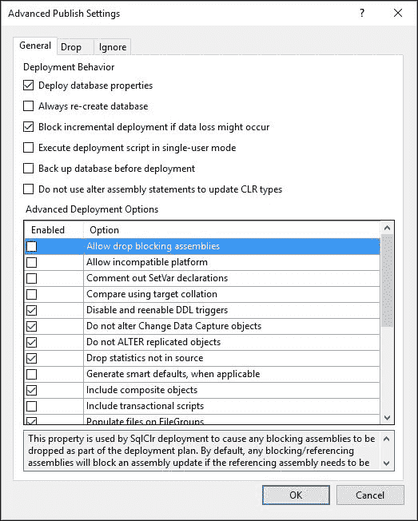

当一切正常时，过程将开始，你将能够从 Visual Studio 中直接看到创建的对象的目标；或者，你可以像往常一样打开 SSMS 并直接检查结果。

# Visual Studio 中的数据访问

使用 Visual Studio，你可以创建连接到任何类型数据的应用程序，覆盖几乎所有格式和位置上的数据库产品或服务：无论是从本地机器、局域网服务器，还是位于云中的位置。

IDE 允许你探索数据源或创建对象模型以在内存中存储和操作数据，并且当然可以在用户界面中建立数据绑定技术，无论你想要哪种类型的 UI：控制台、Windows 窗体、Windows 表现基金会、使用 ASP.NET 创建的网站等等。

此外，Microsoft Azure 为 .NET、Java、Node.js、PHP、Python、Ruby、移动应用程序以及 Visual Studio 中的工具提供了 SDK，以便连接到 Azure 存储。

下表显示了 IDE 中最近版本可用的数据库连接的多样性：

| Microsoft Azure (SQL 和 NoSQL) |
| --- |
| SQL Database (Azure) | Azure Storage (Blobs, Tables, Queues, Files) | SQL Data Warehouse (Azure) |
| SQL Server Stretch Database (Azure) | StorSimple (Azure) | DocumentDB (Azure) |
| Azure Redis Cache |   |   |
| SQL |
| SQL Server 2005* - 2016 | MySQL | Oracle |
| Firebird | PostgreSQL | SQLite |
| NoSQL |
| MongoDB | Apache Cassandra | NDatabase |
| OrientDB | RavenDB | VelocityDB |

你可以在[`msdn.microsoft.com/en-us/library/wzabh8c4(v=vs.140).aspx`](https://msdn.microsoft.com/en-us/library/wzabh8c4(v=vs.140).aspx)找到更多关于这个主题的信息。

除了这些直接的可能性之外，还有许多其他供应商允许通过 NuGet 包将 Visual Studio 集成。当使用主 **工具** 菜单中的 **扩展和更新** 选项时，你还有其他一些选项可供选择。

## .NET 数据访问

.NET 数据访问——包括新的**.NET Core**——基于**ADO.NET**，它由一组定义接口以访问任何类型数据源的类组成，无论是关系型还是非关系型。IDE 包含了一系列工具，旨在帮助连接到数据库并创建**ORMs**（**对象关系模型**），将数据库中的对象映射到.NET 语言世界的对象。

IDE 的选项包括在内存中操作数据和在开发时间以及运行时通过多个用户界面和对话框向用户展示数据。

### 小贴士

注意，为了在 ADO.NET 中使用，数据库必须有一个自定义的 ADO.NET 数据提供程序，或者它必须公开一个可用的 ODBC 或 OLE DB 接口。默认情况下，提供了 SQL Server 的 ADO.NET 数据提供程序以及 ODBC 和 OLE DB。然而，您可以在[`msdn.microsoft.com/en-us/data/dd363565`](https://msdn.microsoft.com/en-us/data/dd363565)找到提供程序的详尽列表，其中包括但不限于 Oracle、MySQL、Sybase、IBM、SQLLite 和其他。

Visual Studio 拥有多个工具和设计器，它们与 ADO.NET 一起工作，以帮助您连接到数据库，在内存中操作数据，并将数据展示给用户。ADO.NET 的官方架构图在 MSDN 的这张图片中展示：


如您所见，在这个图中，我们有两套类：我们使用的.NET Framework 数据提供程序的相关类和与 DataSet 对象相关的类，它是原始数据库中包含的部分（或全部）数据表、关系和约束的内存表示。

这两套类都包括数据维护，尽管数据集提供了一些额外的功能，这在许多情况下非常有用，例如批量更新和提供程序无关的数据存储。有了这个功能，一些原本不可能的事情变得可行，例如通过关系将两个表链接起来，独立于这些表可能的多样来源（比如说，一个 Oracle 表，一个 SQL 服务器表和一个 Excel 电子表格）。在执行时强化这些关系，建立其他情况下难以编码的复杂业务逻辑。

## 使用 ADO.NET 基本对象

让我们创建一个新的 WPF 项目，我们将使用它从我们的数据库中读取一些数据，并在 WPF 窗口内的数据网格中展示它。

一旦我们创建了基本项目，让我们添加一个新的数据集。为此，只需在项目选项中选择**添加新项**，您将看到一个空白的设计表面，您可以在其中拖放 Solution Explorer 中指向`AdventureWorks`数据库的任何表。选择**Person**表后，您可以通过在 Solution Explorer 的顶部图标中选择该选项来添加**代码映射**。结果您将有两个窗口：一个显示数据结构，另一个显示代码架构，如下面的截图所示：

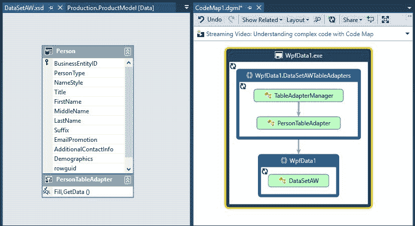

你可以看到，在你的解决方案中创建了一个新的嵌套文件集，显示了几个包含与之前提到的连接和关系映射相关的类定义的文件：

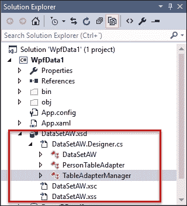

查看生成的 C#文件的内容将显示大量功能，为我们提供了大多数 CRUD 操作、存储过程调用、连接管理、搜索等所需的大部分资源。

### 配置用户界面

我们可以向我们的空窗口添加一个新的`DataGrid`对象，稍后用我们读取的数据填充。

当窗口显示时直接获取数据的第一个步骤是在 XAML 编辑器中在`<window>`声明末尾添加一个名为`Loaded`的事件：

```cs
<Window 

   x:Class="WpfData1.MainWindow" mc:Ignorable="d" Loaded="Window_Loaded" Title="MainWindow" Height="350" Width="622">
```

在 C#代码中，这个声明创建了一个`window_load`事件处理程序。接下来，我们可以以非常简单的方式使用在定义我们的模型时创建的`PersonTableAdapter`对象来加载和绑定数据到我们的 DataGrid 对象：

```cs
private void Window_Loaded(object sender, RoutedEventArgs e)
{
  var pta = new PersonTableAdapter();
  dataGrid.ItemsSource = pta.GetData().DefaultView;
}
```

在这里，`PersonTableAdapter`代码负责建立与数据库的连接，加载其内部`SQLCommand`对象中先前定义的数据，并返回一个适合分配给 DataGrid 的`DataView`对象，以便自动创建列（与表中的列数相同），如下一张截图所示：

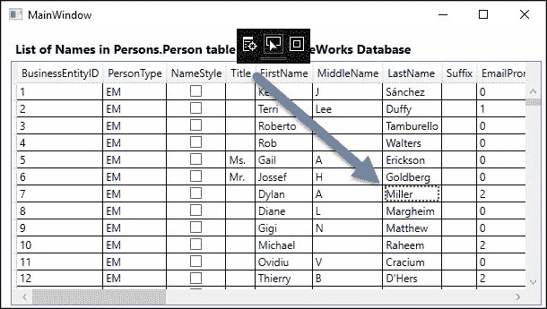

顺便说一句，数据网格标题上方的黑色工具栏是 Visual Studio 提供的调试选项，它显示/隐藏布局装饰器，启用/禁用选择，并且可选地可以带你到一个新窗口，Visual Tree，在那里你可以检查 XAML 用户界面中的所有元素，并在运行时检查它们的依赖关系和值，如指向列表中**LastName** `Miller`的箭头所示。

如果你查看 TableAdapter 和 DataSet 对象的属性，你会发现一组非常丰富的对象，为各种数据操作做好了准备。

这只是一个简单的演示，用来检查如果你使用 Visual Studio 为我们创建的 ORM 对象，使用 ADO.NET 读取数据有多容易。然而，由于其他选项在访问关系数据库时更受欢迎，尤其是 Entity Framework，因此 ADO.NET 并不是现在最常用的技术。

# Entity Framework 数据模型

按照微软的说法，Entity Framework 如下：

> **Entity Framework**（**EF**）是一种对象关系映射技术，它使.NET 开发者能够使用领域特定对象与关系数据一起工作。它消除了开发者通常需要编写的多数数据访问代码的需求。Entity Framework 是微软为新的.NET 应用程序推荐的对象关系映射建模技术。

### 注意

你可以在[`msdn.microsoft.com/en-us/data/ef.aspx`](https://msdn.microsoft.com/en-us/data/ef.aspx)找到一个关于 Entity Framework 的不错但基本的介绍视频。

如前所述，最新版本是 .NET Core 1.1，它仍在社区的采用阶段，所以我们在这里使用的是 6.0 版本，该版本完全稳定且经过广泛测试。在这个版本中，你有三个初始选择：从一个现有的数据库开始，从一个空模型开始，或者从一个现有的代码开始。

在第一种情况下，称为数据库优先，会建立与数据库管理系统的连接，从服务器读取元数据并创建所选对象的视觉模型。从这个模型中，生成一组类，默认情况下包括广泛的 CRUD 和搜索操作。

与此类似的是 **模型优先** 选项的行为，其中你从头开始，在图形编辑器中设计一个模型，类的生成过程随后进行。可选地，你可以根据连接字符串在关系数据库管理系统（RDBMS）中生成实际的数据库。在任何情况下，当底层数据库发生变化时，都可以自动更新你的模型，并且相关的代码也会自动生成。数据库生成和对象层代码生成都是高度可定制的。

在第三种选项中，**代码优先**，你从一个现有的代码开始，并通过启发式过程从该代码中推断出相应的模型，其余的选项与其他两种场景类似。

对于对实体框架的更深入的了解，我推荐 *Mastering Entity Framework*，*Rahul Rajat Singh*，Packt Publishing ([`www.packtpub.com/application-development/mastering-entity-framework`](https://www.packtpub.com/application-development/mastering-entity-framework))。

为了演示下一个示例，我正在使用数据库优先的方法来展示使用实体框架最常见的操作，但这次将项目类型更改为 ASP.NET MVC 应用程序，其中用于数据访问的代码应完全独立于消耗数据的 UI。

因此，让我们通过在可用的项目中选择该选项来创建一个新的 ASP.NET 应用程序。我们将根据版本和项目架构提供几种项目变体：

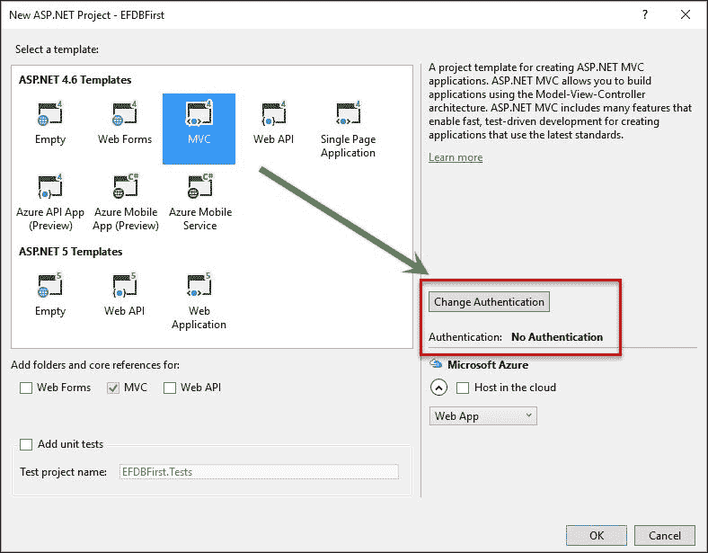

我在 **更改身份验证** 中选择了 **无身份验证** 功能，以避免自动创建数据库。当点击 **确定** 时，将生成一个新的项目（使用我们在上一章中看到的技术），最终我们将得到一个基本但功能齐全的项目，没有数据访问。

到目前为止，`Models` 文件夹应该是空的。因此，右键单击该文件夹，选择 **添加新项**，然后在 **数据** 菜单中选择 **ADO.NET 实体数据模型**。我将我的命名为 `AWModel` 并继续。在此阶段，你必须选择要使用的设计器类型，它决定了模型的内容。我选择了 **从数据库的 EF 设计器**。

现在，是时候选择连接了。默认情况下将显示最后使用的连接，对话框将在底部的 RichTextBox 中生成连接字符串。如果 AdventureWorks 没有显示，请手动选择要使用的连接。

然后，是时候选择你想要工作的表，以及其他对象，如视图和存储过程。所有这些都将用于生成模型。

对于这个演示，我选择了一个具有几个列的表以简化代码阅读，所以我选择了`HumanResources.Department`，只有四个字段：

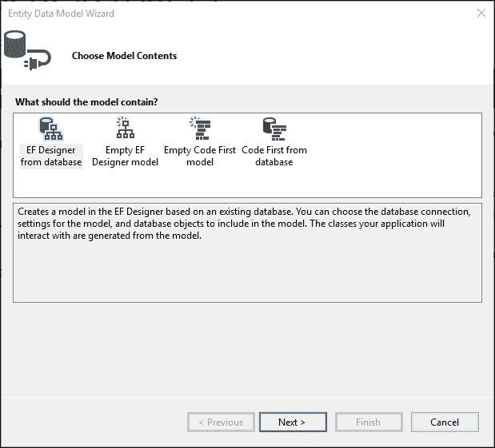

一个简单的架构应该出现在**设计**窗口及其属性中，在底部窗口**映射详情**中详细说明，该窗口指定了如何在 C# 语言中将数据库中定义的原数据类型和限制建模，以便由 Entity Framework 类管理。

这很重要，因为它允许你指定 EF 生成器在创建实际代码时的行为。

这里还有一个需要记住的重要功能。通常情况下，更改发生在原始数据库中，包括列格式化或更改数据类型，添加（或删除）表，更改关系等。

在这些情况下，上下文相关的**从数据库更新模型**选项很有用。整个模型将被重新读取，相应的更改将在**映射详情**部分和生成的代码中更新，生成的代码将被重新生成：

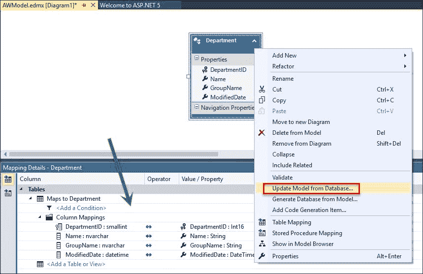

现在，我们需要了解如何修改代码生成。这是通过 T4 模板完成的，这些是具有 `.tt` 扩展名的文本文件，你可以在生成的文件中找到它们，与模型的文件相关联。

包含这些文件的原因有两个：它们允许用户决定代码的生成方式，并简化了生成过程（记住，Visual Studio 使用 CodeDOM 等技术内部生成代码）。

查看生成的类，你会了解到`Department`类是如何创建的，以及一个`AdventureWorks2014Entities`类，它将是数据操作的开始点。

好吧，现在我们需要控制器和视图来向用户提供数据操作的典型 CRUD 选项。再次，IDE 来帮忙。选择**添加控制器**，将出现一个对话框以选择可用的控制器类型。

### 注意

注意，你需要首先编译项目，因为可能需要实际的程序集来生成代码。

此外，请记住，由于与 Entity Framework 的自然集成，将提供一个涵盖所有所需控制器和视图的选项。因此，在 **添加 Scalffold** 对话框中，选择 **使用 Entity Framework 的 MVC 5 控制器与视图**选项。这将生成测试基本 CRUD 数据选项所需的所有代码：

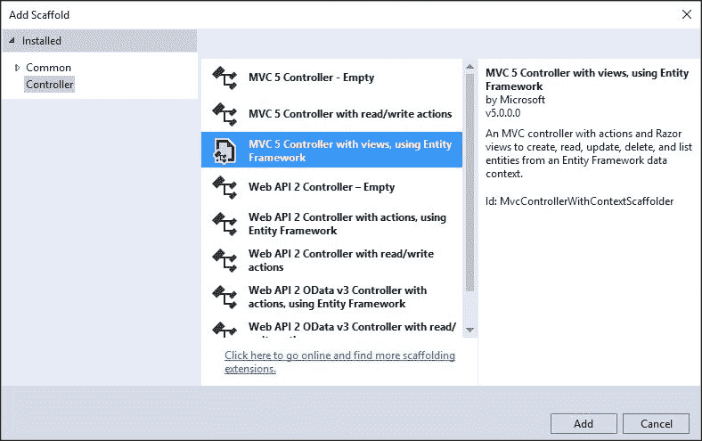

你仍然会被问到要使用哪个模型（在我的情况下是 **Department**），以及关于 `DataContext` 类（`AdventureWorks2014Entities`）。当助手完成时，将生成几个新文件。

首先，我们将有一个新的 `DepartmentsController` 控制器，其中包含我之前提到的 CRUD 操作。此外，一个新的 `Departments` 文件夹出现，显示了五个新的视图，对应于 **创建**、**删除**、**详情**（仅查看一个部门）、**编辑** 和 **索引**，它显示了所有部门的整个列表，以及一些允许你访问其他选项的链接。

该控制器类的第一行指示了建议的操作方式：

```cs
private AdventureWorks2014Entities db = new AdventureWorks2014Entities();

// GET: Departments
public ActionResult Index()
{
  return View(db.Departments.ToList());
}
```

`DBContext` 对象将恢复所有部门并将它们转换为 `List<Department>`，这是视图期望的模型（查看 **Views/Departments** 区域中的 `Index.cshtml` 文件）。当你启动它时，你需要在 URL 中引用控制器，因为默认情况下，应用程序配置为呈现 Home 控制器和 `Index` 动作方法。

如果你输入 `http://localhost:[端口号]/Departments`，路由模式将带你到 `Departments` 控制器中的 `Index` 方法，以下列表将显示出来（当然，无论你使用哪个浏览器都无关紧要）：

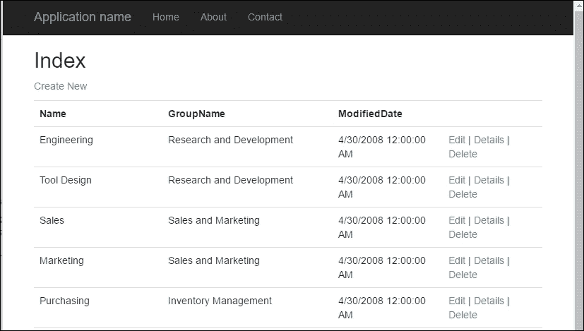

如果一切顺利，你将能够通过视图自动呈现的 **编辑** 和 **删除** 链接来更改数据，选择 **详情** 选项将带你到不同的视图，仅显示所选元素。

# 摘要

在本章中，我们回顾了关系模型中数据访问的基本知识。首先，我们检查了关系模型背后的概念，包括其基本和基本原理、其架构以及关系表的性质。

然后，我们回顾了 Microsoft 提供的用于处理这些模型的工具，例如 SQL Server 2014 Express 版本和 **SQL Server Management Studio**（**SSMS**），并复习了它们在编辑、调试、分析执行等方面的程序性和操作提供。

在简要介绍 T-SQL 语言后，我们介绍了 Visual Studio 提出的一个不太为人所知的项目类型，SQL Server 项目，并看到了我们如何创建和管理帮助我们在其他 RDBMS 中管理和管理任何数据库并复制其结构的包（`.dacpac` 文件）。

最后，我们回顾了在 Visual Studio 内部的一些数据访问选项，展示了如何使用两种广为人知且被广泛接受的技术，即 ADO.NET（使用 Windows Presentation Foundation 应用程序）和 Entity Framework，在 ASP.NET MVC 应用程序中访问数据。

在下一章中，我们将从关系型数据库模型切换到 NoSQL 模型，并研究其优缺点，同时以两种方式与 MongoDB NoSQL 数据库进行交互：一种是利用产品提供的工具，另一种是从 Visual Studio 进行操作。
