# 第八章：开源编程

在本章中，我们将回顾使用微软技术和工具的开源编程的当前状态。这是许多技术传教士所指的开放源代码生态系统。

在本章中，我们将涵盖以下主题：

+   我们将从该领域的初始动作开始，并探讨它们随时间的发展，总结任何开发者现在都可以访问的最重要倡议。

+   之后，我们将回顾一些最受欢迎的实现，无论是工具（IDE）还是 API 和语言。

+   我们将探讨使用开源解决方案进行编程，例如 Node.js，它在 Visual Studio 中的支持情况，以及如何轻松创建一个使用 Node 的此环境的项目，以及其他 IDE 选择，如 Visual Studio Code。

+   之后，我们将探讨微软最关键且被广泛采用的两个开源倡议：Roslyn 项目，一组提供扩展开发体验支持的 API 和服务；以及由 C#作者 Anders Hejlsberg 创建的新语言 TypeScript，它允许程序员今天使用高级 JavaScript 功能，并得到 IDE 的出色支持以及完全向后兼容。

# 历史上的开源运动

微软早在 2003 年就开始在开源领域铺路，当时采取了一些举措以在产品上采用 GPL 许可，最引人注目的是努力将.NET 框架平台（特别是 C#语言）标准化。

实际上，它很快就被 ECMA（ECMA-334）和 ISO（ISO/IEC 23270:2006）批准为标准。

之后，Mono 项目（Xamarin）（[`en.wikipedia.org/wiki/Mono_(software)`](https://en.wikipedia.org/wiki/Mono_(software)))，现在是微软的一部分，提供了能够在 Linux 和 MacOS 上运行的.NET 版本。这可能是第一个使 C#通用的严肃尝试。Mono 许可模式是明确开放的（[`www.mono-project.com/docs/faq/licensing/`](http://www.mono-project.com/docs/faq/licensing/)），尽管他们的 IDE 不是（Xamarin Studio）。

然而，微软收购 Xamarin 给开发者带来了更好的消息，因为现在，Visual Studio Community Edition 的客户可以在 IDE 中找到嵌入的 Xamarin 工具和库，无缝构建 Android、iOS 和 Windows Phone 解决方案，并享有所有这些价值。同样，还有一个名为 Xamarin Studio Community Edition 的免费产品版本。

## 其他项目和倡议

然而，到目前为止所讨论的只是冰山一角。从 2005 年开始，他们开始为知名的开放源代码倡议做出贡献，如 Linux 和 Hadoop，以便内部使用开源产品和工具，并发布一些成果。

其中一些最知名的项目包括.NET 基金会的倡议和 WinJS，这是一个使用 JavaScript 的库，允许访问 Windows API，并且与 Windows 8 操作系统的套件保持一致，允许开发者使用 HTML5、CSS3 和 JavaScript 构建应用程序。

Azure 一直是微软开始展示其对开源兴趣的重要部门。在直接在 Azure 中支持 Linux 和 MacOS 的先前运动中，我们必须加上最近宣布的 SQL Server 在 Linux 上运行([`blogs.microsoft.com/blog/2016/03/07/announcing-sql-server-on-linux`](http://blogs.microsoft.com/blog/2016/03/07/announcing-sql-server-on-linux))，以及 PowerShell 在 Mac OS 和 Linux 上的可用性。

最新的公告，在 11 月的 Connect()活动中正式确认，进一步加深了这一理念：微软成为 Linux 基金会的白金合作伙伴，Azure 上运行的每三个虚拟机中就有一个是 Linux“发行版”，Windows 10 中 Bash 的加入允许在系统中原生安装多个 Linux“发行版”。

在另一方面，谷歌已成为.NET 基金会的成员，并积极参与 C#标准的制定。截至目前，微软是 GitHub 上贡献“开源”项目数量最多的公司。

最后，与三星和 Tizen 倡议的最新合作仅扩展了与开源世界的合作数量。

## 为程序员提供的开源代码

那程序员呢？正如我们提到的，2013 年宣布免费 Visual Studio Community Edition 之后，声明了该工具将在后续版本中免费，同时 Xamarin Studio 的开放：

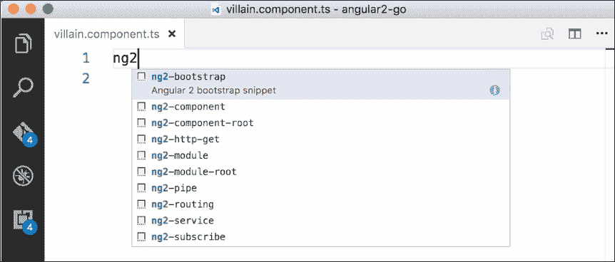

这一变化是在 2015 年春季通过发布 Visual Studio Code 提出的，（免费且适用于 Windows、Linux 和 MacOS）。它是一款将编辑器的功能与 IDE 的调试功能结合在一起的开发工具。

那 Visual Studio Code 是如何被编码以在三个平台上工作的呢？三个项目？并非如此。这得益于 2010 年开始的另一个重大运动，我们在第四章*比较编程方法*中介绍了它，并在本章后面会详细讨论：TypeScript。

### 其他语言

开源项目还出现在其他工具和语言中，如 Node.js，现在作为 Visual Studio（任何版本）的另一种项目类型使用，Python、PHP 或 Apache/Cordova。所有这些技术现在都是 IDE 中可安装/可编程项目的一部分。这也适用于 GitHub，其工程师正在合作以更好地将其与 Visual Studio 和 Visual Studio Code 集成。

在 Node.js 的情况下，你必须安装 Visual Studio 的模板（这是一个一次性、相当直接的操作），当你选择构建新项目时，你会看到以下截图所示的几个模板：

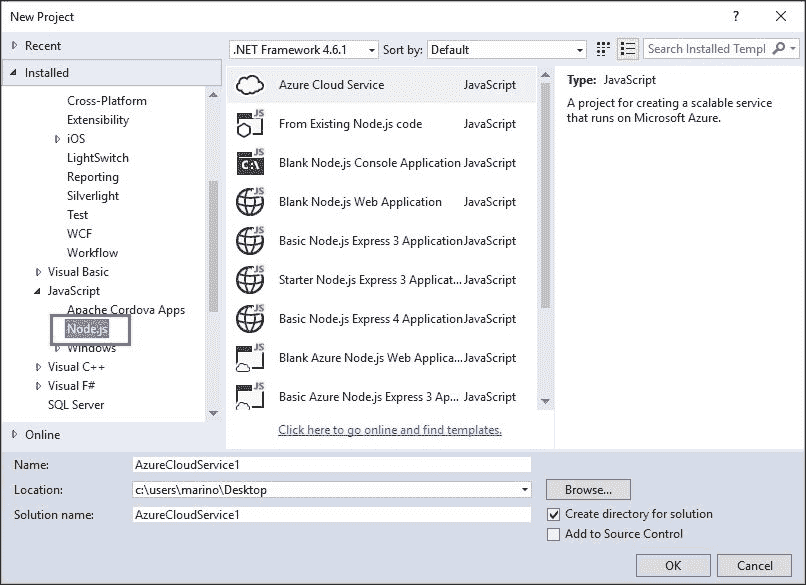

如果你参与这些项目之一，你会发现其他平台上的常用工具默认也在这里可用，例如 Grunt、Bower、NPM、Gulp 等等。

为了完整性，让我们使用这些模板进行 Node.js 的基本演示，看看它是如何工作的。如果你选择 **Basic Node.js Express Application**，将从模板生成一个完整的应用程序，包括启动 Node.js 工作实例所需的文件以及一个使用 Node 作为本地主机 Web 服务器的简单网页。

### 小贴士

关于 Node 的详细信息，你可以查看本系列中的另一本书籍，其中包含详细的文档、解释和演示：“Mastering Node.js”，作者桑德罗·帕斯卡利（[`www.packtpub.com/web-development/mastering-nodejs`](https://www.packtpub.com/web-development/mastering-nodejs)）。

默认情况下，项目使用 Express 库，它与 Node 无缝协作。视图引擎也是这些项目中最常见的一个（它被称为 Jade，你可以随时更改它或使用可用的替代方案）。

在审查生成的文件时，你会注意到在我们的项目中已下载和更新的许多库。这是 IDE 与 `package.json` 配置文件交互的结果，该文件确定了应用程序所依赖的库：

```cs
{
  "name": "ExpressApp1",
  "version": "0.0.0",
  "description": "ExpressApp1",
  "main": "app.js",
  "author": {
    "name": "Marino",
    "email": ""
  },
  "dependencies": {
    "express": "3.4.4",
    "jade": "*",
    "stylus": "*"
  }
}
```

此文件指示 IDE 下载所有必需的库以及这些库所依赖的所有依赖项。

启动时，将打开两个窗口。一方面，控制台将打开，另一方面，默认浏览器的实例将打开。在控制台中，Node.js 正在监听两个端口：调试端口 `[5858]` 和 Express 端口 `[1337]`，它们负责处理 Web 请求，如下截图所示：

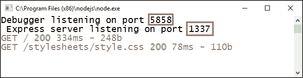

如前图所示，在运行时已发出两个请求：渲染的页面（Jade 从 `index.jade` 文件中的基本源代码生成）和样式表，它被引用在作为本演示中主页的 `layout.jade` 文件中。两者都运行良好（状态码 `200`）。

另一方面，混合这两个 `.jade` 文件（实际的母版或主页）的结果将在选定的浏览器中显示（请注意，你可以选择多个浏览器以创建多浏览器调试会话）：


无论是 Node.js 编程及其工具的方面，还是工具的支持都非常全面，因此我们甚至可以在单个解决方案中混合使用不同技术的项目，并且不再依赖于 IIS 的安装来进行调试：

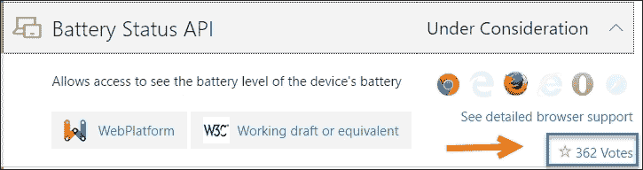

在 Microsoft 开源生态系统中，社区非常活跃的其他显著领域如下：

+   Entity Framework Core（现在版本为 1.1）

+   Microsoft Edge，用户可以在其中为正在考虑的新功能投票，并使用 JavaScript 内部引擎（Chakra）为自己的目的服务（就像 Chrome 的 V8 引擎一样）

    ### 注意

    您可以在 [`developer.microsoft.com/en-us/microsoft-edge/platform/status/backdropfilter`](https://developer.microsoft.com/en-us/microsoft-edge/platform/status/backdropfilter) 上了解更多关于这些项目的信息，并参与协作，如图中所示。

+   .NET Core 是 .NET 家族中的最新成员，它使得构建可在任何平台上运行的应用程序成为可能：Windows、Linux 或 MacOS

+   Roslyn 和 TypeScript 项目

以及，还有更多更多

# Roslyn 项目

也称为 .NET 编译器平台，由 Anders Hejlsberg 领导，Roslyn 是一套工具和服务，帮助开发者控制、管理和扩展任何源代码编辑器或 IDE 的功能，并以多种方式照顾代码，包括编辑、解析、分析和编译。它是 .NET 基金会倡议的一部分：

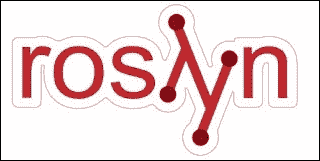

实际上，编辑器（Intellisense、代码片段、代码建议、重构等）背后的所有魔法都是由 Roslyn 管理的。

总体而言，使用 Roslyn，您将能够做到以下几件事情：

+   创建自定义的特定代码检查工具，这些工具可以集成到 Visual Studio 2015 和其他兼容工具的编辑器中。此外，您还可以根据自己制定的指南扩展实时代码检查引擎。这意味着您可以为您的 API 或特定的编程需求编写诊断和代码修复（称为分析器）以及代码重构规则。

+   此外，Visual Studio 编辑器会在您编写代码时识别代码问题，对需要考虑的代码进行波浪线标记，并提出最佳可能的修复建议。

+   您可以监控代码生成，生成 IL 代码（记得我们在前几章中看到的演示），并利用编译器 API 在您的 .NET 应用程序内部执行日常与代码相关的任务。

+   此外，通过构建个性化的插件，可以在 Visual Studio 之外执行，并配置 MSBuild，利用 C# 编译器执行与代码相关的任务，从而实现扩展。

+   使用您自己的 IDE 创建 REPL（读取-评估-打印循环），该 IDE 能够检查和执行 C# 代码。

## 与传统编译器的不同之处

通常，编译器表现为黑盒或源代码中的函数，其中要编译的代码是参数，中间发生了一些事情，在另一端生成输出。这个过程需要深入理解他们所处理的代码，但这种信息对开发者来说并不可用。此外，在生成翻译后的输出后，这些信息就会被忽略。

Roslyn 的使命是打开黑盒，让开发者不仅能够了解幕后发生的事情，而且最终能够创建自己的工具和代码检查器，并扩展旧编译器创建的传统可能性。

Roslyn 的官方文档（[`github.com/dotnet/roslyn`](https://github.com/dotnet/roslyn)）通过比较经典编译器管道与 Roslyn 提出的服务集来解释这种方法的 主要变化：

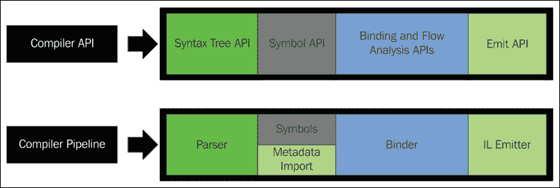

如图所示，管道的每个部分都已用允许你编写可解析代码的 API 替换，创建 **语法树 API**，并从中生成整个符号图，执行所需的 **绑定和流分析 API**，最终使用 **Emit API** 生成结果二进制文件。

Roslyn 处理这些阶段的方式是为每个阶段创建对象模型。深入研究这一套服务和工具提供的功能和机会超出了本书的范围，但我希望提供一个对这些可能性的简介，以及一些示例代码，以便你可以开始构建自己的工具：读取代码并帮助识别潜在问题和如何修复它们的项目。

## 开始使用 Roslyn

在您开始从 Visual Studio 使用 Roslyn 之前，有一些要求需要满足。首先是安装 Git 扩展：你可以在 **工具** 菜单中的 **扩展和更新** 工具中找到它，就像许多其他工具一样。

安装完成后，在 Visual Studio 中创建一个新的项目，选择 C# 语言，然后在 **扩展性** 项下选择 **下载 .NET 编译器平台 SDK**，如图所示：

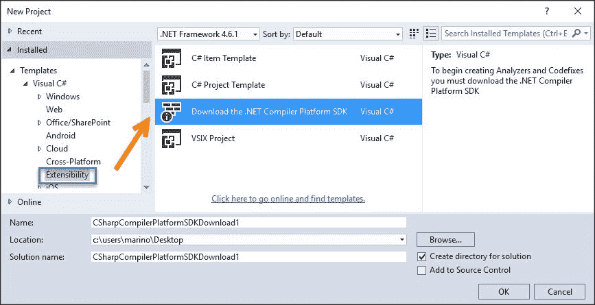

将出现一个 `index.html` 网页，其中包含一个按钮，链接到语法树可视化工具的下载、分析器模板等。请注意，如果你安装了多个版本的 Visual Studio，`.vsix` 安装程序将通知你希望扩展安装到哪些产品中。

现在根据不同的上下文出现了几个可用的选项。一方面，如果你转到 **工具/选项** 菜单并检查 **文本编辑器** 项，你可以在 C# 方面找到控制 Visual Studio 编辑器中此语言管理方式的新选项：用于 Intellisense 的代码格式化选项等。

另一方面，在重新加载 Visual Studio 后，如果你回到扩展和更新，你会发现在现在有新的项目类型可供选择，包括**独立代码分析工具**、**带代码修复的分析器（NuGet + VSIX）**、**代码重构（VSIX）**和**VSIX 项目**，最后一个专门用于插件等安装。你应该会收到如下截图所示的报价：

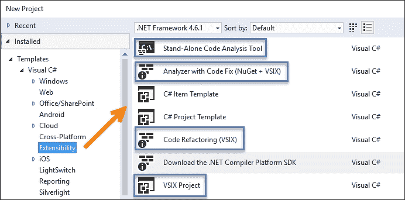

让我们从简单的类开始，看看我们可以使用哪些选项。因此，我创建了一个新的项目（控制台项目就很好）并去掉了默认包含的 using 声明。

即使有默认的初始代码，Roslyn 也会读取并将其转换为语法树表示，其中树中的每一部分（每个单词、空白、花括号等）都有一个位置，并且可以相应地管理。这个树可以使用之前过程安装的**视图** | **其他窗口** | **语法可视化器**中的新窗口进行检查。

一旦我们点击源代码（即在`class`单词的中间），窗口将显示代码分析的结果（我们也会显示图例）：

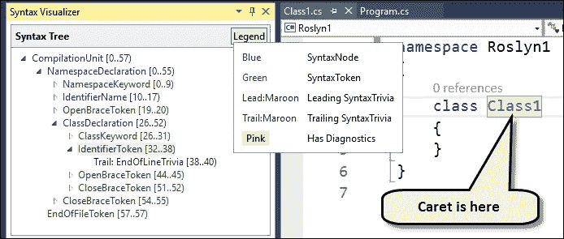

你会注意到，树从所谓的**CompilationUnit**开始，主要的**NamespaceDeclaration**节点悬挂在其上。因此，源代码中的每个元素现在都是可识别和可管理的。

如果我们想以更直观的方式查看此树，可以在**CompilationUnit**的上下文菜单中右键单击并选择**查看有向语法图**选项，这将显示编辑器中的`.dgml`文件，其中包含一个着色的树，图例中的每个颜色都代表代码中的一个元素。

当鼠标悬停在某个元素上时，其属性会在工具提示中显示（同样，右键单击单个节点会显示可能的选项的上下文菜单）：

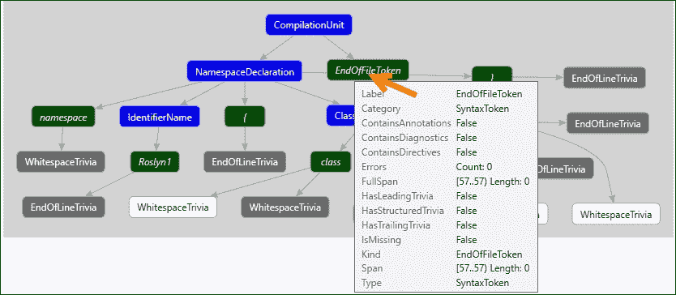

蓝色节点表示 C#语法的较高层节点，可以进一步划分为更小的单元。绿色节点被称为*语法标记*，在某种程度上，就像语法树的原子或基本单元（它们不能被进一步分割）。

其余的节点（白色和灰色节点）被称为所谓的*琐事*节点，根据官方文档，它们与编译无关，因为它们是源文本中被认为是*对代码的正常理解基本无关紧要的部分，例如空白、注释和预处理器指令*。

此外，还有一个非常有用的在线工具（开源），名为 Source Visualizer，可在[`source.roslyn.io/`](http://source.roslyn.io/)找到，它展示了 Roslyn 是如何编码的，以及其源代码。

你可以导航到 Roslyn 项目中找到的所有元素的全树，并检查它们，了解它们的编码方式，以作为你自己的代码的灵感来源。

例如，如果我们点击搜索 CSharp 编译器的左侧树，我们可以看到它的编码方式以及与之相关的所有细节，如下面的截图所示：

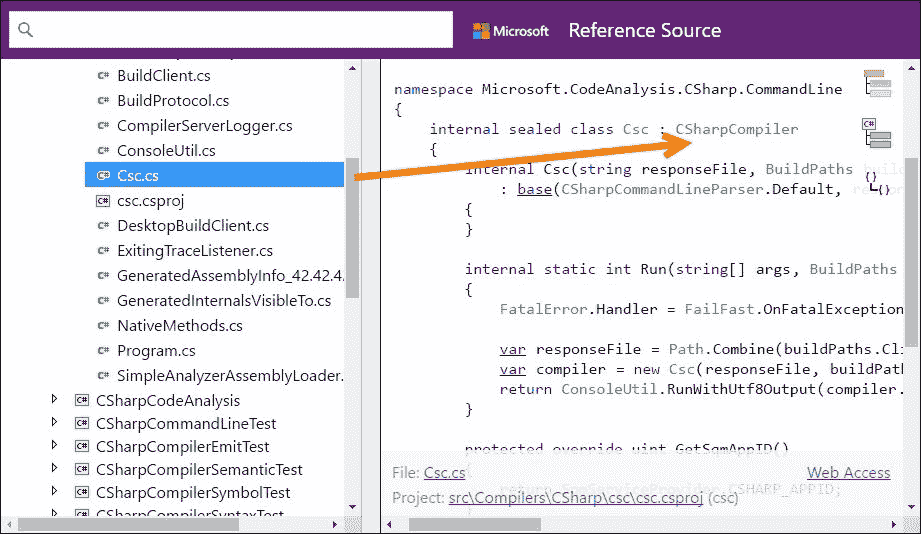

## 初探微软代码分析服务

在本书的整个过程中，也许在很久以前，你可能已经注意到了源代码编辑器中提供的大量选项，以便于执行常规操作，在编译前通知错误，以及提出更改等（记住，例如，当谈到 `IDispose` 接口的实现时，IDE 如何为我们建议几种可能的实现方式）。

从 Visual Studio 2015 开始，这些功能只是由 Roslyn 驱动的众多工具中的一部分。其中最受欢迎的是与代码分析器相关的一组服务。

### 代码分析器

它们并不新颖，因为它们已经在 Visual Studio 中可用多年。然而，作为与 Roslyn 一起工作的部分，这些功能——以及许多其他功能——被重新编写，以便允许使用额外的功能。

它们通常分为三大类：代码分析器、代码可视化器和代码重构器。这三者可以协同工作以执行更复杂的任务，并以多种方式帮助开发者：程序员经常需要处理他们没有编写的代码，或者他们只是想了解别人代码的质量（例如，当谈到 `IDispose` 接口的实现时，IDE 如何为我们建议几种可能的实现方式）。

+   第一类（代码分析器）负责处理我们在基本演示中看到的生成树。这些分析器将代码拆分成片段，使用某种分类法来识别每个单元，并将结果集以可以由其他工具稍后管理的形式放置。

+   代码可视化器负责以可读的方式呈现代码。它们还可以提供有关质量和错误的信息。

+   代码重构器是代码的小片段，当应用于先前识别的块时，能够提出更改，甚至直接应用这些更改，替换原始代码。

### 为您提供的一个完整的开源示例：ScriptCS

有一个开源项目可以让你了解一些这些可能性。它被称为 ScriptCS。记住，我们提到过，使用 Roslyn，你可以构建一个类似于 Node.js、Ruby 和 Python 等可用的 REPL（读取-评估-打印循环）的工具。我的意思是，一个可以检查和执行 C# 代码的工具。

要测试它，只需访问 ScriptCS 网站 ([`scriptcs.net/`](http://scriptcs.net/)) 并下载项目。这是一个由几个项目组成的 Visual Studio 解决方案，可以让我们了解这项技术提供的可能性。

编译完成后，如果你运行程序，你会看到一个控制台应用程序，这表明你需要编写一些代码来分析和执行。该工具将使用编译器，并且它的操作方式与浏览器中的控制台工具非常相似。

这个方面将类似于以下截图所示。请注意，我写了三个独立的句子，并且只有在写出了产生输出的那个句子之后，我们才会在控制台看到结果：

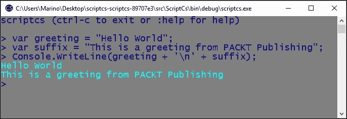

当然，Roslyn 服务在幕后为我们创建一个类，并将该代码插入其中，稍后调用编译器，执行代码，并将输出重定向到控制台窗口，在那里我们看到结果。

当我们只想检查一小段代码而不构建整个项目时，它变得很有用。

### 使用 Microsoft.CodeAnalysis 的基本项目

让我们开始使用这些工具，创建一个简单的控制台应用程序，并直接从 NuGet 包管理器控制台安装 Microsoft.CodeAnalysis 工具。

我们可以输入`Install-Package Microsoft.CodeAnalysis`，我们将看到安装过程，其中所有必需的依赖项都会被下载，最后一条消息显示类似于`Successfully installed 'Microsoft.CodeAnalysis 1.3.2' to [TheNameOfYourProject]`的信息。

在主方法中，我们将加载一个 C#文件以分析其内容。为此，我们创建了一个`Person.cs`文件，其内容如下：

```cs
using System;
using System.Collections.Generic;
using System.Linq;
using System.Text;
using System.Threading.Tasks;
namespace ConsoleRoselyn1
{
  class Person
  {
    public int id { get; set; }
    public string Name { get; set; }
    public int Age { get; set; }
    internal Person Create()
    {
      Person p = new Person();
      p.id = 1;
      p.Name = "Chris Talline";
      p.Age = 33;
      return p;
    }
    internal string PersonData()
    {
      var p = Create();
      return p.id.ToString() + "-" + p.Name + "-" + 
        p.Age.ToString();
    }
  }
}
```

之后，我们将定义一个新的入口点`InitialParser.cs`，它将负责分析。我们将把这个类作为应用程序的入口点，并在其主方法中，我们首先使用与之前相同的类（CSharpSyntaxTree）读取要检查的文件，只是这次我们提前加载文件内容，以便将它们传递给类的`ParseText`静态方法：

```cs
// Fist, we localize and load the file to check out
string filename = @"[Path-to-your-Project]\Person.cs";
string content = File.ReadAllText(filename);
// Now we have to analyze the contents
// So, we use the same class as before. Notice 
// it returns a SyntaxTree object.
SyntaxTree tree = CSharpSyntaxTree.ParseText(content);
```

观察到`ParseText`返回一个`SyntaxTree`对象。这对于分析是基本的，因为它允许你遍历整个树，以检查当它应用于我们的`Person`类时，树对象模型是如何实现的。

如果你想要清楚地了解为什么某些对象被选中以恢复代码的特性，请记住我们之前讨论过的语法树查看器可以实现我们将要执行的大多数操作，并且当我们从代码的一个点移动到另一个点时，它会提供相应元素的名称。

例如，如果你点击`class`关键字内部的代码，语法树可视化器将正好移动到树中的那个点，指示与对象模型关联的名称，如下一张截图所示：

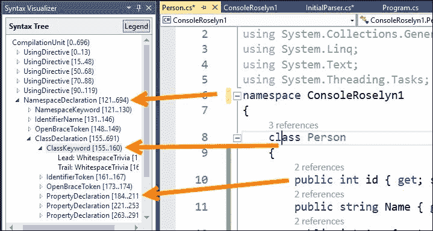

现在，我们有一个非常好的工具，可以建议我们应该在 API 中识别哪些类及其成员，以便获得组成语法树的元素的引用。

如果我们想要获取代码中定义的第一个类的名称（只有一个，但语法树会显示与之前相同数量的），首先，我们需要访问树的根节点。我们通过在之前获取的树对象中调用`GetRoot()`来实现这一点。

一旦我们有了根元素，查看使用的方法可以让我们了解我们拥有的可能性。以下是一些这些方法，仅举几个例子：

+   我们可以向上或向下查找，寻找后代以寻找祖先，因为我们有权访问整个节点列表

+   我们可以找到一个特定的节点或检查任何节点的内容以寻找特殊的东西

+   我们可以读取一个节点的文本

+   我们甚至可以插入或删除它们中的任何一个（参见图表）：

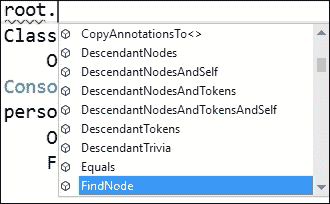

由于 API 提供的所有集合都是泛型集合，我们可以使用`OfType<element>`语法请求具体类型的节点。这就是我们接下来要做的事情，以便获取`Person`类的`ClassDeclarationSyntax`对象，所以我们按照以下方式将其打印到控制台：

```cs
ClassDeclarationSyntax personClass = root.DescendantNodes().OfType<ClassDeclarationSyntax>().First();
Console.WriteLine("Class names");
Console.WriteLine("-----------");
Console.WriteLine(personClass.Identifier);
```

我们可以继续并获取类中方法的名称，使用已经声明的对象。因此，在这种情况下，我们将请求`DescendantNodes()`调用之后可用的所有`MethodDeclarationSyntax`对象，并遍历它们，打印它们的名称：

```cs
Console.WriteLine("\nMethod names");
Console.WriteLine("------------");
personClass.DescendantNodes().OfType<MethodDeclarationSyntax>().ToList().ForEach(method => Console.WriteLine(method.Identifier));
```

因此，我们可以查看属性，知道语法树将它们分类为`PropertyDeclarationSyntax`对象：

```cs
// And the properties
Console.WriteLine("\nProperties");
Console.WriteLine("----------");
personClass.DescendantNodes()
.OfType<PropertyDeclarationSyntax>().ToList()
.ForEach(property => Console.WriteLine(property.Identifier));
```

之前的代码生成了以下输出：


这是一种推荐的方法来遍历语法树并恢复有关其成员的信息，尽管在这种情况下，我们只是读取数据并展示结果。

## 代码重构的第一种方法

基于前面的想法和 API，让我们看看如何编程 Visual Studio 提供的诊断和重构功能。这就是扩展性的主要原因。

只需记住一些关于 Visual Studio 构建和解析行为的事情。许多这些功能默认都是禁用的。分析功能的整个集合可以在任何项目的`项目/属性/代码分析`选项卡中找到，并提供了两个主要选项：

1.  在**构建**上启用**代码分析**，这内部定义了`CODE_ANALYSIS`常量，并强制在每次编译之前运行当前代码的激活功能集。此外，请注意，您可以配置行为，将任何问题的严重性更改为`Warning`、`Error`、`Info`、`Hidden`或`None`。

1.  选择 IDE 提供的可用规则集之一。默认情况下，**Microsoft Managed Recommended Rules**是激活的，但还有许多其他选项可供选择，您甚至可以激活/停用这些集合中的每个规则。以下截图显示了这些选项：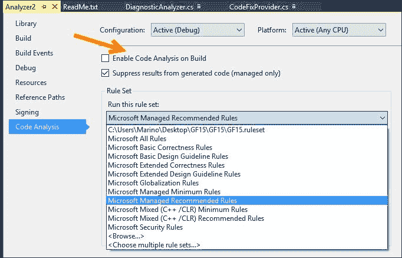

话虽如此，我们将创建一个在安装我们之前所做的 SDK 之后出现的项目之一。

我们将选择名为 Analyzer with code Fix (VSIX) 的项目类型，并查看其编程方式和主要代码单元。然后，我们将讨论调试，因为它与其他调试场景相比具有特殊的工作方式。

在创建新项目后，你将注意到解决方案中存在三个独立的项目：分析器本身、用于测试目的的另一个项目，以及最终带有 `.vsix` 扩展名的项目，它作为部署机制。

让我们专注于第一个。为了符合其名称，隐含了两个类：一个用于分析（`DiganosticAnalyzer.cs`）和一个负责代码修复（`CodeFixProvider.cs`）。识别这些角色并保持代码如此，即使我们想要扩展默认功能也很重要。

项目目的的简单性并不重要：它搜索包含小写字母的类定义，并将其标记为 `CodeFixProvider` 的建议目标。

为了执行这个找到代码的第一个任务，从 `DiagnosticAnalyzer` 继承的 `Analyzer2Analyzer` 类执行以下操作（我们逐个解释，因为一开始并不明显）：

1.  首先，该类被 `[DiagnosticAnalyzer]` 属性装饰，表示将要使用的语言将是 CSharp。

1.  然后，在类级别上，它声明了一些 `LocalizableString` 类型的字符串。原因是这可以在不同版本的 Visual Studio 和不同区域设置中工作。这就是为什么这些字符串分配的参数是从资源文件（为此创建的）中读取的原因。查看 `Resources.resx` 文件的內容以检查字符串是如何保存的。

1.  它创建了一个 `DiagnosticDescriptor` 实例（要检查的规则），它将负责创建给定诊断的 `Description` 实例。它需要一些参数来描述要查找的问题，其中之一是严重性，默认情况下只是一个警告。

1.  它重写了只读的 `SupportedDiagnostics` 属性，以返回一个基于先前规则的 `InmutableArray` 数组的新实例。

1.  它重写了 `Initialize` 方法，该方法接收一个类型为 `SymbolAnalysisContext` 的上下文对象，该对象负责注册我们想要在代码上执行的相关操作。

    +   在这个演示中，它调用 `RegisterSymbolAction` 方法来注册两件事：用于分析的方法和此类分析所属的类别。（实际上，它传递了 `AnalyzeSymbol` 作为方法的名称）。

    +   此外，请注意，`RegisterSymbolAction` 方法将根据需要多次调用，以便迭代所有可能满足测试条件的符号实例。

1.  最后，它声明了 `AnalyzeSymbol` 方法，该方法接收上下文，查看要检查的符号，如果它符合诊断条件（在这个演示中，如果它的名字中包含任何小写字母），它创建一个 `Diagnostic` 对象，并指示调用 `ReportDiagnostic` 的上下文，这将激活为这种情况编程的动作。

如我们所见，尽管代码行不多，但这不是简单的代码。这就是为什么我们需要了解 Roslyn 的内部工作原理，以便跟踪在上下文中检查特定问题的正确动作。完整的代码如下：

```cs
using Microsoft.CodeAnalysis;
using Microsoft.CodeAnalysis.Diagnostics;
using System.Collections.Immutable;
using System.Linq;

namespace Analyzer2
{
  [DiagnosticAnalyzer(LanguageNames.CSharp)]
  public class Analyzer2Analyzer : DiagnosticAnalyzer
  {
    public const string DiagnosticId = "Analyzer2";

    // You can change these strings in the Resources.resx file. If you do not want your analyzer to be localize-able, you can use regular strings for Title and MessageFormat.
    // See https://github.com/dotnet/roslyn/blob/master/docs/analyzers/Localizing%20Analyzers.md for more on localization
    private static readonly LocalizableString Title = new LocalizableResourceString(nameof(Resources.AnalyzerTitle), Resources.ResourceManager, typeof(Resources));
    private static readonly LocalizableString MessageFormat = new LocalizableResourceString(nameof(Resources.AnalyzerMessageFormat), Resources.ResourceManager, typeof(Resources));
    private static readonly LocalizableString Description = new LocalizableResourceString(nameof(Resources.AnalyzerDescription), Resources.ResourceManager, typeof(Resources));
    private const string Category = "Naming";

    private static DiagnosticDescriptor Rule = new DiagnosticDescriptor(DiagnosticId, Title, MessageFormat, Category, DiagnosticSeverity.Warning, isEnabledByDefault: true, description: Description);

    public override ImmutableArray<DiagnosticDescriptor> SupportedDiagnostics { get { return ImmutableArray.Create(Rule); } }

    public override void Initialize(AnalysisContext context)
    {
      // TODO: Consider registering other actions that act on syntax instead of or in addition to symbols
      // See https://github.com/dotnet/roslyn/blob/master/docs/analyzers/Analyzer%20Actions%20Semantics.md for more information
      context.RegisterSymbolAction(AnalyzeSymbol, SymbolKind.NamedType);
    }

    private static void AnalyzeSymbol(SymbolAnalysisContext context)
    {
      // TODO: Replace the following code with your own analysis, generating Diagnostic objects for any issues you find
      var namedTypeSymbol = (INamedTypeSymbol)context.Symbol;

      // Find just those named type symbols with names containing lowercase letters.
      if (namedTypeSymbol.Name.ToCharArray().Any(char.IsLower))
      {
        // For all such symbols, produce a diagnostic.
        var diagnostic = Diagnostic.Create(Rule, namedTypeSymbol.Locations[0], namedTypeSymbol.Name);

        context.ReportDiagnostic(diagnostic);
      }
    }
  }
}
```

虽然对应的（CodeFixer）有一些更多的代码行，但您可以通过查看包含在 `CodeFixProvider.cs` 文件中的 `Analyzer2CodeFixProvider` 来阅读其余的代码——并理解它是如何运行的。

这里有两个重要的方法：重写 `RegisterCodeFixesAsync` 方法，该方法接收 `CodeFixContext`（用于启动修复动作），以及由演示中的 `MakeUppercaseAsync` 方法表示的修复动作。

当调用此方法时，它返回一个 `Task<Solution>` 对象，并接收执行任务所需的所有信息，以及一个 `CancellationToken` 对象，允许用户忽略在上下文对话框中提供的修复建议。当然，如果用户接受修改，它负责更改代码。

### 调试和测试演示

要测试这些演示，将启动一个新的 Visual Studio 实例，该实例在加载时将注册并激活分析器。在这种情况下，我启动了项目，并在新的 IDE 实例中打开了之前的项目，以了解它是如何识别小写字母的标识符名称的。

因此，按照这种方式进行，并打开我们之前的 `Person.cs` 文件（或任何其他类似文件），以查看此诊断的实际效果。您将在 `Person` 类的声明上看到一条红色的波浪下划线。

当您将光标放在单词 `Person` 下方时，将显示一个工具提示，提醒您潜在的问题（在这种情况下，根本没有任何问题）：

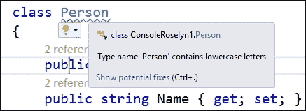

到目前为止，我们一直在处理第一个分析过的类（`Analyzer2Analyzer` 类）。但现在，我们有两个选择：黄色的灯泡，带有上下文菜单和**显示潜在修复**链接。两者都导向同一个窗口，显示所有可以应用此修复的地方的潜在修复。

此外，请注意这些修复是如何用颜色标记的。在这种情况下，颜色是绿色，表示修复不会引发另一个诊断问题，但如果确实发生了，我们将相应地得到通知：

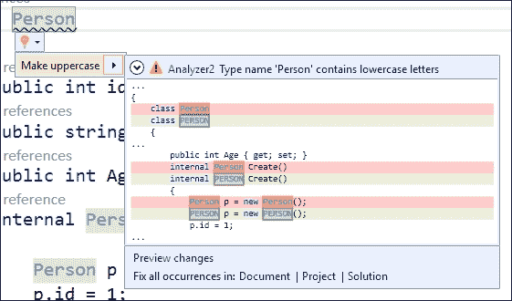

我们还有**预览更改**的选项，这反过来又提供了一个（可滚动的）窗口，以便详细检查如果我们接受建议会发生什么（如下面的截图所示）：

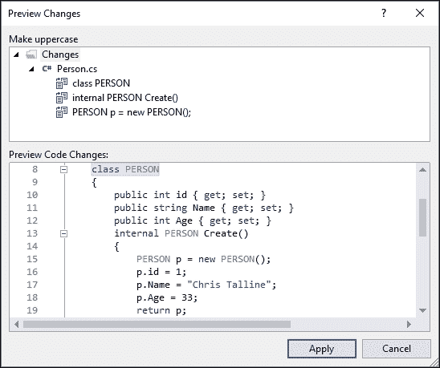

要部署项目，你可以遵循两种不同的方法：使用生成的 `NuGet` 包（在编译后，你可以在 `Bin/Debug` 文件夹中找到它，就像通常一样）或使用编译器生成的 `.vsix` 二进制文件，这些文件也位于相同的子目录中，但这次是在 Vsix 项目中。

在第一种情况下，你应该遵循 `Readme.txt` 文件中的指示（以下是对之前提到的文件的引用）：

要尝试 NuGet 包：

1.  按照以下说明创建本地 NuGet 源：[`docs.nuget.org/docs/creating-packages/hosting-your-own-nuget-feeds`](http://docs.nuget.org/docs/creating-packages/hosting-your-own-nuget-feeds)。

1.  将 `.nupkg` 文件复制到该文件夹中。

1.  在 Visual Studio 2015 中打开目标项目。

1.  在解决方案资源管理器中右键单击项目节点，然后选择 **管理 NuGet 包**。

1.  在左侧选择你创建的 NuGet 源。

1.  从列表中选择你的分析器，然后点击 **安装**。

如果你想在构建此项目时自动部署 `.nupkg` 文件到本地源文件夹，请按照以下步骤操作：

1.  在解决方案资源管理器中右键单击此项目并选择 **卸载项目**。

1.  右键单击此项目并点击 **编辑**。

1.  滚动到 **AfterBuild** 目标。

1.  在 **Exec** 任务中，将 `–OutputDirectory` 路径后面的 **Command** 中的值更改为指向你的本地 NuGet 源文件夹。

另一个选择是启动 `.vsix` 文件（系统将识别扩展名）。在请求一致性后，这将像任何其他你可能之前安装的包一样，在 Visual Studio 中安装该包。

到目前为止，我们已经介绍了 Roslyn 及其功能。现在，我们将参观另一个重要的开源项目，由于它在许多网络项目中的重要性，包括 Angular、Ionic 以及许多其他项目，因此受到了更多的关注：TypeScript。

# TypeScript

我们回到我们在 第四章 *编程方法比较* 中开始研究的 TypeScript，它作为语言的介绍，使用的工具，与 Visual Studio 的集成以及对其可能性的基本概述。

在那一章中，我承诺要回顾语言的特点，因为它是从一开始就与开源相关的另一个大型微软项目，并且它正在全球范围内获得动力并增加采用率。TypeScript，正如其创造者所说，*是一种可扩展的 JavaScript*。

### 小贴士

然而，如果你想深入了解语言及其可能性，请查看 Nathan Rozentals 的优秀作品 "Mastering TypeScript"，可在 [`www.packtpub.com/web-development/mastering-typescript`](https://www.packtpub.com/web-development/mastering-typescript) 获取。

让我们提醒自己，该项目始于 2010 年左右，作为对 JavaScript 日益增长的流行度的回应——不仅是在浏览器中，也在服务器上。这意味着编写应用程序，不仅只有数十万行代码，有时甚至数百万行代码。这种语言本身缺乏我们在大规模应用程序开发中习惯的一些功能。

正如我们之前提到的，直到 ECMAScript 2015，我们没有类或模块或任何静态类型系统。这个静态类型系统正是赋予 V. Studio、Eclipse、JetBrains 和其他工具能力，使我们能够在开发周期中习惯那些功能。

## TypeScript 调试

多亏了那个静态类型系统，TypeScript 为开发者提供了与使用 C#语言时相似的经验，这包括调试。

至于调试，TypeScript 没有额外的配置或困难。因为它编译成纯 JavaScript，所以所有典型的 JavaScript 资源在这里都可以使用。

这在使用 Visual Studio 的嵌入式调试器时特别有用，因为您可以在 TypeScript 代码中设置断点（而不仅仅是 JavaScript）并调试，就像往常一样，监视运行时值并检查涉及的过程元素。

例如，在我们在第四章中使用的代码中，*比较编程方法*，我们可以在`sorted.map`调用中设置断点，并监视数组中每个元素的值，检查这个值，访问`全局变量`定义，并且总的来说，见证我们在完整的、扩展的调试会话中期望的所有优点。

只需记住，您必须使用 Internet Explorer（Visual Studio 的默认浏览器）。

您也可以使用 Edge 作为默认浏览器，如果使用以下步骤将 Visual Studio 调试器附加到该进程：

1.  启动执行并转到**Visual Studio 调试器**菜单。

1.  进入**附加到进程**选项，在对话框中，选择**附加到**选项以标记脚本代码。

1.  最后，在进程列表中，选择列表中的**MicrosoftEdgeCP.exe**进程，并标记一个断点。

1.  当您重新加载页面时，执行将在断点处停止。

此外，您还可以使用 Chrome 来调试 TypeScript 代码！

## 使用 Chrome 调试 TypeScript

只需使用您选择的浏览器 Chrome 打开之前的代码。然后，按*F12*，您将能够访问**源**标签页。从那里，选择`app.ts`文件，并标记任何一行以设置断点。

当您重新加载页面时，您将发现代码如何停止在您标记的 TypeScript 行，并且所有在执行中隐含的变量和对象都完全可用。下一张截图说明了这个出色的功能：

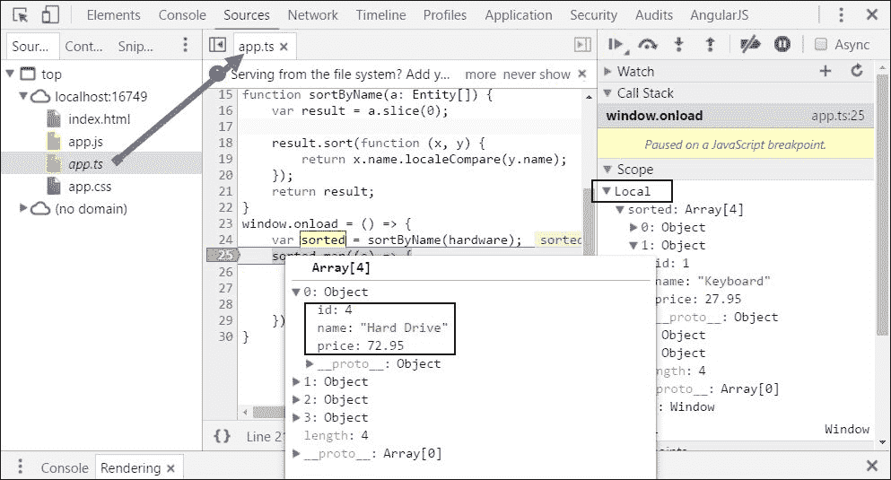

### 小贴士

注意，Firefox 不支持 `insertAdjacentElement` 方法。你应该使用 `appendChild` 代替。

## 接口和强类型

让我们考虑一个更复杂的对象，类似于 C# 对象，包含字段、具有多个签名的（重载）方法等。

例如，我们可以使用以下定义声明一个 `Calculator` 接口：

```cs
interface Calculator {
  increment?: number,
  clear(): void,
  result(): number,
  add(n: number): void,
  add(): void,
  new (s: string): Element;
}
```

状态的概念通过可选的增量字段（与 C# 中的语法相同）提供，并定义了四个方法。前两个是标准声明，但其他两个值得审查。

`add` 方法被重载。我们有两个定义：一个接受一个数字，另一个没有参数（两者都返回 void）。当使用实现 `Calculator` 接口的对象时，我们会发现编辑器识别重载的方式正如我们期望从用 C# 编程的类似对象中看到的那样（参考下一图）：

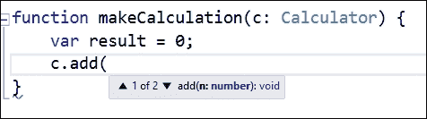

最后，`new` 方法是在接口内部定义构造函数的方式。这个构造函数接收一个字符串，但返回 `Element`。`Element` 是一个接口，表示文档中的对象（[`developer.mozilla.org/en-US/docs/Web/API/Element`](https://developer.mozilla.org/en-US/docs/Web/API/Element)）。这是属于 DOM（文档对象模型）的东西；因此，使用 TypeScript，我们可以管理几乎任何 DOM 组件，就像我们可以在纯 JavaScript 中做的那样。

## 实现命名空间

大多数发展中的语言都允许命名空间的概念。命名空间允许开发者创建彼此完全分离的代码区域，避免成员名称和功能的冲突。

TypeScript 使用 `module` 关键字包含这个概念。模块是 JavaScript 的一部分，其成员对模块是私有的。也就是说，除非我们以明确的方式声明它们，否则它们在模块外部不可用。这是通过使用 `export` 关键字来实现的。

因此，模块使用简单直观的语法声明：

```cs
module Utilities {
  // export generates a "closure" in JS 
  export class Tracker2 {
    count = 0;
    start() {
      // Something starts here...
      // Check the generated JS
    }
  }
}
```

之后，模块导出的成员可以通过点符号访问：

```cs
var t = new Utilities.Tracker2();
t.start();
```

模块声明也允许使用多个缩进来清楚地分隔不同的代码区域：

```cs
module Acme.core.Utilities {
  export var x: number = 7;
  export class Tracker2 {
    count = 0;
    start() {
      // Something here 
    }
  }
}
// This requires "nested access"
Acme.core.Utilities.x;
```

为了简化对嵌套模块的访问，我们还可以使用 `import` 关键字定义别名，这在区域倾向于增长时特别有用：

```cs
// Use of the "Import" technique
import ACU = Acme.core.Utilities;
ACU.x;
var h = new ACU.Tracker2();
```

## 声明、作用域和 Intellisense

我们不能假设由“上下文”（浏览器或用户代理）创建的对象在 TypeScript 中默认可访问。例如，navigator 创建的表示 DOM 的文档对象不是严格的语言的一部分。

然而，通过使用 **declare** 关键字声明这些成员，可以非常容易地使它们变得可访问。此外，对于这种情况，TypeScript 编译器自动提供声明，因为默认情况下，它包含一个 `'lib.d.ts'` 文件，该文件提供了内置 JavaScript 库以及文档对象模型（DOM）的接口声明。

正如官方文档所说，如果您需要其他库的帮助，您只需声明它们，相应的 `.ts` 库就会被使用。想象一下，如果我们想更改文档的标题；根据之前的代码，我们应该编写以下内容：

```cs
declare var document: Document;
document.title = "Hello";  // Ok because document has been declared
```

如果我们需要对 jQuery 提供支持，提及一个流行的库，我们只需以这种方式声明即可：

```cs
declare var $;
```

从这个点开始，任何对 `$` 符号的引用都将提供编辑器中预期的 Intellisense，前提是已经引用了该库的描述文件。

### 作用域和封装

与成员的作用域和可见性相关的重要概念还包括命名空间和模块声明。命名空间允许程序员将私有成员声明给一个命名的模块，使其对未包含在内的代码不可见；因此，它们类似于我们已看到的命名空间概念，并且在 .NET 编程中很典型。

如果我们想公开命名空间中的任何成员，`exports` 关键字允许这样的定义，这样我们就可以有一个部分公开的命名空间，其中包含私有成员。例如，看看以下代码：

```cs
namespace myNS {
  var insideStr = "Inside a Module";
  export function greeter() {
    return insideStr;
  }
}
myNS.greeter();
myNS.insideStr;
```

如果我们在 Visual Studio 中检查此代码，当我们翻过最后一句话时，编译器会给出建议，指出属性 `insideStr` 不存在于 `MyNS` 模块中（这实际上意味着从命名空间的角度来看，此成员未声明为可访问，或者它可能不存在）。

另一方面，关于公开的问候方法没有给出建议，因为它的声明中使用了 `exports` 子句（对于其他面向对象的编程语言，我们会说问候成员是公开的）。

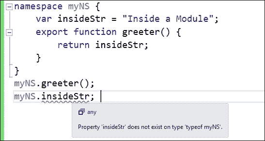

## 类和类继承

正如我们所见，类是 TypeScript 的关键部分，它们的声明语法几乎与我们所有人都知道的 C# 声明相同。

也就是说，我们可以声明私有成员、自定义构造函数、方法、访问属性，甚至静态成员，以便可以使用类的名称而不是变量实例来访问它们。看看安德斯·海尔斯伯格（Anders Hejlsberg）在 Channel 9 上发布的一个在线演示中编写的代码，[`channel9.msdn.com/posts/Anders-Hejlsberg-Introducing-TypeScript`](https://channel9.msdn.com/posts/Anders-Hejlsberg-Introducing-TypeScript)，如果您想了解作者提供的所有详细信息和注释：

```cs
class PointWithColor {
  x: number;
  y: number;
  // Private members 
  private color: string;
  constructor(x: number, y: number) {
    this.x = x;
    this.y = y;
    this.color = "Blue"; // Intellisense -in- the class
  }
  distance() {
    return Math.sqrt(this.x * this.x + this.y * this.y);
  }
  // We can also (ES5) turn distance into a property
  get distanceP() {
    return Math.sqrt(this.x * this.x + this.y * this.y);
  }
  // And declare static members
  static origin = new PointWithColor(0, 0)
}
```

如您所见，这里使用`private`关键字声明了一个颜色，一个自定义的构造函数，一个只读属性（get `distanceP`），以及一个静态声明（`origin`）来建立绘图的初始点。

在类的构造函数中，可以选择使用类似于 C#的{ get; set; }构造，这允许您简化声明并为构造函数的参数赋一个初始值。

使用这种语法，我们可以写出之前类的简化版本，如下所示：

```cs
class PointWithColor2 {
  // Private members 
  private color: string;
  // The following declaration produces the same effect 
  // as the previous as for accessibility of its members 
  // Even, assigning default values
  constructor(public x: number = 0, public y: number = 0) {
    this.color = "Red"; 
  }
  distance() { return Math.sqrt(this.x * this.x + this.y * this.y); }
  get distanceP() { return Math.sqrt(this.x * this.x + this.y * this.y); }
  static origen = new PointWithColor(0, 0)
}
```

当然，为了正确实现面向对象编程，我们还需要继承。继承是通过在类声明中使用`extends`关键字来实现的。因此，我们可以定义之前类的新的继承版本，如下所示：

```cs
class PointWithColor3D extends PointWithColor {
  // It uses the base class constructor, otherwise
  // creates a customized one.
  constructor(x: number, y: number, public z: number) {
    super(x, y);
  }
  // Method overloading 
  distance() {
    var d = super.distance();
    return Math.sqrt(d * d + this.z * this.z);
  }
}
```

之前的代码在这里使用了一个特定的关键字`super`来引用父类。关于这个语言还有很多其他内容，我们建议您查看 GitHub 上找到的详细文档([`github.com/Microsoft/TypeScript/blob/master/doc/spec.md`](https://github.com/Microsoft/TypeScript/blob/master/doc/spec.md))以获取更多细节和代码片段。

### 函数

在初始演示中讨论的 Greeter 类中，`start()`和`stop()`方法没有返回值。您可以用与参数相同的方式为函数表达返回值：在末尾添加一个冒号（`:`），这样我们就可以表达任何函数的整个签名。因此，对于典型的`add`函数，我们可以写出以下内容：

```cs
add(x: number, y: number): number {
    return x + y;
}
```

在这个语言中最常见的做法之一是使用接口来声明用户定义的对象类型。一旦声明，接口将检查任何声明其实例的成员：

```cs
interface Person {
    name: string, 
    age?: number  // the age is optional
}

function add(person: Person) {
    var name = person.name; // Ok
}

add({ name: "Peter" });  // Ok
add({ age: 37 });  // Error, name required
add({ name: "Irene", age: 17 });  // Ok
```

如您所见，`age`的声明与我们在 C#中用于可选值的语法相同，只是不需要默认值。

类似地，我们可以在同一句话中声明一个类型并为其赋值：

```cs
// Declare and initialize
var person: {
    name: string;
    age: number;
    emails: string[];
} = {
        name: 'John',
        age: 5,
        emails: ['john@site.com', 'john@anothersite.net']
    }
```

如果我们使用 lambda 表达式作为参数语法之一来声明一个函数，编译器会推断出参数的类型是函数：

```cs
function funcWithLambda(x: () => string) {
    x(); // Intellisense
}
```

这是在 IDE 中的显示方式：


接口也可能允许您声明方法重载。看看这个声明并注意`doSomething`方法的重复定义：

```cs
interface Thing {
    a: number;
    b: string;
    doSomething(s: string, n?: number): string; //methods
    // Method overloading
    doSomething(n: number): number;
}

function process(x: Thing) {
    x.doSomething("hola"); // Intellisense
    x.doSomething(3); // Ok
}
```

之前声明的变体允许我们声明重载并包含`doSomething`成员的数据字段：

```cs
// Methods with properties
// Equivalent to the previous + data
interface Thing3 {
    a: number;
    b: string;
    // Here we add a field data to doSomething
    doSomething: {
        (s: string): string;
        (n: number): number;
        data: any;
    };
}
```

之后，我们可以使用以下语法来引用`Thing3`：

```cs
function callThing3(x: Thing3) {
    x.doSomething("hello"); // Intellisense (overloading)
    x.doSomething(3);
    x.doSomething.data; // method with properties
}
```

在这里，您可以看到编译器如何认为对`doSomething`重载形式的三个不同引用是有效的。我们甚至有声明构造函数和索引器（类似于 C#）的可能性：

```cs
interface Thing4 {
    // Constructor
    new (s: string): Element;
    // Indexer
    [index: number]: Date;
}

function callThing4(x: Thing4) {
    // return new x("abc").getAttribute() -> returns Element
    return x[0].getDay(); // Date info
}
```

另一种可能性是基于 TypeScript 定义接口的能力来强制返回类型：

```cs
interface Counter {
    delete(): void;
    add(x: number): void;
    result(): number;
}

function createCounter(): Counter {
    var total = 0;
    return {
        delete: function () { total = 0 },
        add: function (value: number) {
            total += value;
        },
        result: function () { return total; }
    };
}

var a = createCounter();
a.add(5); //Ok

// It's also useful for event handlers
window.onmousemove = function (e) {
    var pos = e.clientX; // Intellisense in the event
    // You can use the "Go to Definition" option ->
    // which takes you to "lib.d.ts" library
}
```

我希望您检查任何成员的定义，记住右键单击并选择“**转到定义**”将打开相应的`lib.d.ts`文件并显示任何成员的原始定义；例如，`event`对象中的`clientX`成员将显示以下信息：

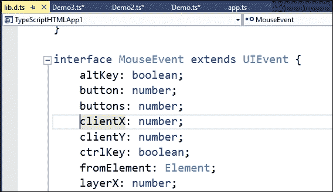

同样，我们可以从其他库导入声明并使用这种技术来检查这些实现：这包括 jQuery、Bootstrap 等等。Definitely Typed 网站([`github.com/DefinitelyTyped/DefinitelyTyped`](https://github.com/DefinitelyTyped/DefinitelyTyped))拥有数百个这样的定义。

此外，还有另一种声明重载函数的方法：您可以声明几个签名方法，并在实际函数定义和实现后结束块。这样做是为了避免 TypeScript 在编译时显示错误，尽管 JavaScript 的最终实现将只包含一个函数，因为 JavaScript 没有类型。

以这种方式，前面的定义被视为最后一个定义的重载版本，如下所示：

```cs
class OverloadedClass {
    overloadedMethod(aString: string): void;
    overloadedMethod(aNumber: number, aString: string): void;
    overloadedMethod(aStringOrANumber: any, aString?: string): void {
        // Version checking is performed on the first argument
        if (aStringOrANumber && typeof aStringOrANumber == "number")
            alert("Second version: aNumber = " + aStringOrANumber +
                ", aString = " + aString);
        else
            alert("First version: aString = " + aStringOrANumber);
    }
}
```

### 数组和接口

我们还可以使用接口的概念来声明与数组元素相关的条件、类型和行为。

看看这个代码，我们强制为数组中的山设置类型和行为：

```cs
interface Mountain {
    name: string;
    height: number;
}
// Mountain interface declared
var mountains: Mountain[] = [];
// Every added element is checked
mountains.push({
    name: 'Pico de Orizaba',
    height: 5636,
});
mountains.push({
    name: 'Denali',
    height: 6190
});
mountains.push({
    name: 'Mount Logan',
    height: 5956
});

function compareHeights(a: Mountain, b: Mountain) {
    if (a.height > b.height) {
        return -1;
    }
    if (a.height < b.height) {
        return 1;
    }
    return 0;
}
// Array.sort method expects a comparer which takes 2 arguments
var mountainsByHeight = mountains.sort(compareHeights);
// Read the first element of the array (Highest)
var highestMoutain = mountainsByHeight[0];
console.log(highestMoutain.name); // Denali
```

`Mountain`接口确保`mountains`数组中的每个元素实际上都实现了`Mountain`定义，以便以后可以进行比较，如果您在 HTML 脚本部分中包含此代码，您可以检查这一点。在控制台输出中，"Denali"山被正确排序为最高的，这是通过数组的`sort`方法实现的。

## 更多 TypeScript 应用

因此，让我们看看更多 TypeScript 的实际应用，从一些其他简单的代码开始。在 Visual Studio 中创建一个空解决方案并添加一个 JavaScript 文件（`.js`扩展名）后，这里，我使用官方网站上提供的几个演示中的代码模式来展示这些工具可以提供的一些变化。因此，我输入以下内容（一个用于排序数组并返回结果的简短函数）：

```cs
// JavaScript source code
function sortByName(arg) {
  var result = arg.slice(0);
  result.sort(function (x, y) {
    return x.name.localCompare(y.name);
  });
  return result;
};
```

当我们将鼠标移到`arg`参数上时，编辑器无法告诉任何关于参数类型的信息（只有这段代码，我们无法知道其他任何信息）。如果我们函数几行后写`sortByName`，编辑器会识别名称，但它无法添加更多关于它的信息：

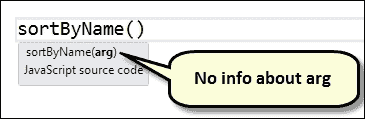

现在，让我们添加一个具有相同名称的新文件，并将上一个文件的全部内容复制进去，只需将扩展名更改为`.ts`（TypeScript）。即使内容完全相同，编辑器的行为也会改变。

首先，当您将光标移到参数上时，它会说它是`any`类型。当您将光标移到函数外部的`s`ortByName`声明上时，也会发生这种情况。

然而，它还可以变得更好。由于函数期望你操作一个具有`name`和`age`属性的数组类型，我们可以声明一个包含这两个属性的对象作为接口，例如一个`Person`接口（或任何符合此要求的其他接口）。现在，我们可以明确地定义`arg`是一个`Person`类型的数组，在冒号后的参数声明中指明，所以我们有如下所示：

```cs
interface Person {
  name: string, 
  age: number
}
function sortByName(arg: Person[]) {}
```

而在这里，魔法开始发生。当我将光标移到参数上时，它现在指示它应该接收的类型，而且，如果我将光标悬停在`arg.slice(0)`代码片段上，它会给我一个详细的解释，说明它期望接收的内容，当我将光标向下移动时，我看到在`localCompare`方法调用下有一个红色的波浪线，表示在字符串类型上不存在这样的方法（因为它认识到名称是之前定义的类型）。

你可以在以下（复合）截图中看到这两个提示：

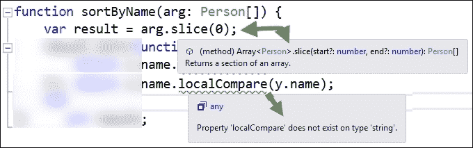

因此，只需对代码进行一些更改，就可以提供大量额外信息，以指导 TypeScript 关于我们正在处理的数据类型。如果我们尝试在搜索帮助时重写`name.local…`调用，我们会看到这一点。

如果我们这样做，并重新输入句子，当我们按下`return.name`旁边的点符号时，我们会得到一个列表，其中包含`name`属性接受的可能的值，包括拼写错误的句子正确的写法，如下一张截图所示。我们还看到了关于`localeCompare`应该接收的参数的额外信息以及它定义的重载数量：

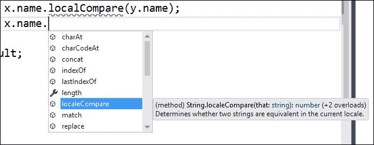

实际上，由于 TypeScript 支持高级功能，你现在可以使用它们，并且具有完全的向后兼容性：例如，我们可以将传递给排序方法的函数参数更改为 lambda 表达式，就像我们使用 ECMAScript 2015 一样。

让我们看一下整个示例。我们将定义一个包含硬件设备和它们价格及识别号的数组。目标是按名称对数组进行排序，并在一个页面上动态生成输出，显示排序数组中的名称和价格。

这是我们将要使用的代码：

```cs
interface Entity {
  name: string,
  price: number, 
  id : number
}

var hardware: Entity[] = [
  { name: "Mouse", price: 9.95, id: 3 },
  { name: "Keyboard", price: 27.95, id: 1 },
  { name: "Printer", price: 49.95, id: 2 },
  { name: "Hard Drive", price: 72.95, id: 4 },
];

function sortByName(a: Entity[]) {
  var result = a.slice(0);

  result.sort(function (x, y) {
    return x.name.localeCompare(y.name);
  });
  return result;
}
window.onload = () => {
  var sorted = sortByName(hardware);
  sorted.map((e) => {
    var elem = document.createElement("p");
    document.body.insertAdjacentElement("beforeEnd", elem);
    elem.innerText = e.name.toString() + " - " + e.price.toString();
  });
}
```

首先，`Entity`声明保证了编辑器可以识别类型为`Entity[]`的后续数组定义。在将一切组合在一起的时候，`window.onload`事件使用了一个不带参数的 lambda 表达式。

在这个表达式的主体中，从原始定义中生成一个排序后的数组，然后调用 JavaScript 5 中包含的新`map`方法，允许我们传递一个回调函数，该函数将对数组中的每个元素执行。

再次，我们使用 lambda 表达式来定义回调函数，其中 `e` 将依次代表数组的元素（`entities`）。即使在编辑 `e` 的属性时，我们也会拥有 Intellisense，以确保所有成员都拼写正确。

执行结果显示了按名称排序的元素列表，包括 `name` 和 `price` 字段，正如我们所期望的：

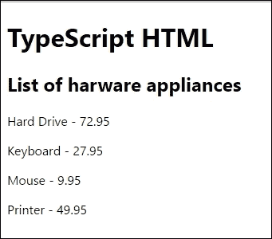

## DOM 连接

我们之前提到的“DOM 连接”在许多情况下非常有帮助。想象一下，我们想要一个当鼠标指针移过窗口时显示鼠标 X 坐标的警告对话框。我们可以编写类似这样的程序：

```cs
window.onmousemove = function (e) {
  alert("Mouse moved at X coord: " + e.clientX);
};
```

如果我们将鼠标移到 `e` 参数（表示事件对象）上，我们还会看到一个包含事件定义的工具提示。如果我们写 `e.`（点）…，Intellisense 也会出现，并确切地知道可以使用该对象做什么。（参见图表）：

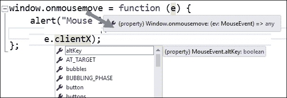

这额外的 Intellisense 从哪里来？我们有能力以与其他语言在 Visual Studio 中相同的方式检查此功能。只需标记 `onmousemove` 或 `e` 对象，然后在上下文菜单中选择**转到定义**或**查看定义**。

IDE 打开一个指向从名为 `Lib.d.ts` 的文件中提取的定义的新窗口，并显示所有细节。如前所述，此文件是整个 DOM 和所有 JavaScript 的标准运行时库的声明文件（包含大约 8,000 行代码声明）。

此外，任何人都可以编写这些声明文件并将它们上传到 DefinitelyTyped 网站，因为它是完全开源的：

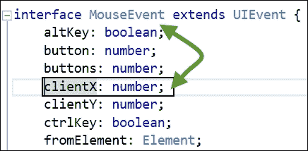

因此，让我们总结一下到目前为止讨论的一些最重要的要点：

+   我们依赖于对 JavaScript 类型的正式化，这允许出色的编辑工具

+   我们从一开始就发现了类型推断和结构化类型

+   所有这些都使用现有的 JavaScript，无需修改

+   一旦代码编译完成，所有内容都会消失，生成的代码只是你选择的版本的纯 JavaScript

# 摘要

在本章中，我们介绍了一些微软作为其开源生态系统一部分推广的最重要项目。

首先，我们回顾了“开源”项目自初始运动以来的演变，并对开源倡议下的一些新工具和技术进行了修订，包括如何在 Visual Studio 中使用 Node.js 进行编程。

然后，我们转向 Roslyn 工具和服务集，探讨了如何安装工具、识别语法对象模型，以及如何使用代码重构功能编写基本分析器，并了解如何调试它。

最后，我们游览了 TypeScript 的主要语言特性，研究了语言中最有意义和恰当的定义，并检查了由于它的静态类型系统，我们在代码编辑器中获得的出色支持。

在下一章中，我们将探讨软件架构的概念，从高级抽象概念到低级实现。我将概述一个从头开始设计.NET 应用程序的逐步指南。
