# 第九章。架构

本章和下一章致力于不同的应用程序开发视角。在第十章 *设计模式* 中，我们将涵盖设计模式、最佳实践以及理论家关于它们的提供解决方案。然而，在本章中，我们的目标是应用程序本身的架构及其构建可用的工具。

在本章中，首先，我们将推荐一个非常有用的指南，帮助您根据您必须构建的应用程序选择要使用的模型；然后，我们将继续按照微软解决方案框架及其治理模型推荐的过程本身。还应通过创建*威胁模型*来考虑安全规划和设计，解决安全场景。

为了充分构建应用程序生命周期所需的不同可交付成果，我们将使用 Visio，并检查这个工具如何成为应用程序架构团队的完美补充，提供各种模板以帮助这个过程。

然后，在开发、测试和部署领域，我们将深入研究 Visual Studio Enterprise，学习如何逆向工程代码、生成代码地图和图表，以及它对 UML 的支持。

最后，我们将涵盖一些与最终部署阶段相关的方面，以及当前工具提供的不同解决方案。

总的来说，在本章中，我们将讨论以下主题：

+   架构的选择

+   Visio 的作用

+   数据库设计

+   Visual Studio 架构、测试和分析工具

# 架构的选择

当一个新应用程序被规划时出现的第一个问题与模型的选择以及将更好地满足我们需求和要求的工具和工件有很大关系。

微软于 2013 年发布了*.NET 技术指南：商业应用程序*，由 Cesar de la Torre 和 David Carmona（均为微软/雷德蒙德的高级项目经理）撰写，旨在为其客户提供在选择应用程序模型时需要考虑的原则和限制的视角。您可以在[`blogs.msdn.microsoft.com/microsoft_press/2013/11/13/free-ebook-net-technology-guide-for-business-applications/`](https://blogs.msdn.microsoft.com/microsoft_press/2013/11/13/free-ebook-net-technology-guide-for-business-applications/)免费下载。

总结来说，该指南全面介绍了开发者可能遇到的所有不同场景，并详细说明了在决定哪些工具和技术适合您的业务问题之前应考虑的利弊。

## 微软平台

一旦做出选择，您就可以深入研究**应用程序生命周期管理**（**ALM**）。那么，通往幸福结局的道路是什么？考虑到即使今天，一些反映在统计数据中的事实似乎令人恐惧：

+   六分之一的 IT 项目最终成本平均超过预期目标的 200%，并且延期 70%（来源*：Harvard Business Review*：[`hbr.org/2011/09/why-your-it-project-may-be-riskier-than-you-think/ar/1`](https://hbr.org/2011/09/why-your-it-project-may-be-riskier-than-you-think/ar/1)）

+   仅在美国，由于不同类型的失败的 IT 项目，经济损失估计每年为 500 亿至 1500 亿美元（来源：*Gallup Business Review*：[`www.gallup.com/businessjournal/152429/cost-bad-management.aspx#1`](http://www.gallup.com/businessjournal/152429/cost-bad-management.aspx#1)）

+   过去一年中，所有项目中有不到三分之一的成功按时并在预算内完成（来源：*Standish Group*：[`www.versionone.com/assets/img/files/CHAOSManifesto2013.pdf`](https://www.versionone.com/assets/img/files/CHAOSManifesto2013.pdf)）

考虑到这些事实，我们需要探索如何在有信心的情况下，在最初预见的范围内和时间内正确管理一个新的项目。

## 通用平台

一方面，我们依赖一套完整的工具和技术（我们所说的开发平台），这允许任何开发者为任何类型的模型、平台或技术构建应用程序。

由于现在围绕通用 Windows 平台和.NET Core 的新选项，这个通用报价现在比在指南的出版时更加清晰（我们已经在本书中提到，将在最后一章中更详细地了解）。

此外，ASP.NET Core 以及与 Node.js、Apache Cordova、Azure 中的 Linux 支持、Linux 中的 SQL Server 支持、Mac OS 中的 Office 以及最近的 Visual Studio for Mac 相关的其他倡议，为开发者提供了广阔的机遇全景，这些机遇超越了 Windows 及其相关技术。

下一个图表是由微软正式发布并由几位传教士详细审查的，显示了微软开发生态系统范围的持续增长：

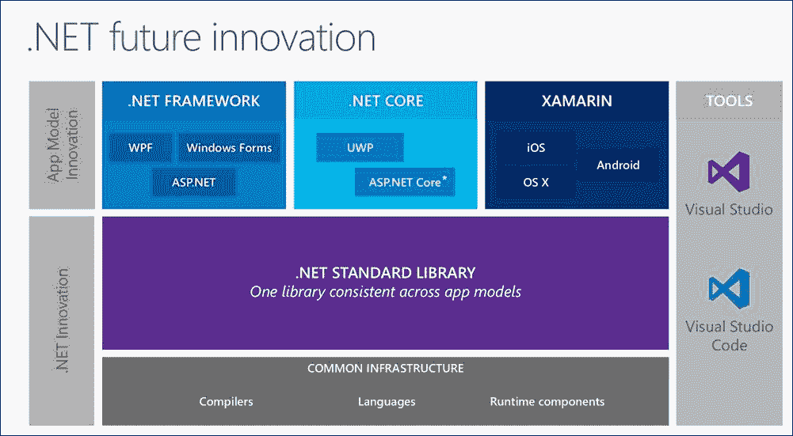

在这本书中，我们看到了.NET 自始至终都在不断进化，现在，无论要开发的应用程序类型是什么，或者我们是在为服务器还是客户端编码，它都提供了最先进的开发体验：

+   在服务器端，你可以用 C#编写云服务或本地服务，或者你可以像我们在上一章中看到的那样使用 Node.js 作为后端。服务器位置也是独立的，因为你服务器上安装和部署的任何东西都可以在 Azure 上安装和部署。

+   此外，随着新的 ASP.NET CORE 版本，你可以以两种方式部署你的应用程序：使用`Microsoft.AspNetCore.Server.WebListener`（仅限 Windows）或使用`Microsoft.AspNetCore.Server.Kestrel`，它是跨平台的，可以在任何主机上运行。

+   在客户端，你可以使用 Windows Forms、Windows Presentation Foundation，甚至 HTML5 + CSS3 + JavaScript 为基于浏览器的解决方案构建桌面应用程序，无论是在微软设备内部还是外部。

+   第二种选择现在得到了 Visual Studio 对 Apache/Cordova 和/或 Xamarin 作为移动解决方案的出色支持，这些解决方案可以在任何地方运行。

当然，这只是对现在平台中大量可能性的粗略看法，这些可能性还在不断增长。

## MSF 应用模型

微软解决方案框架，如维基百科所定义：

> “微软解决方案框架（MSF）是一套原则、模型、学科、概念和指南，用于交付微软的信息技术解决方案。MSF 不仅限于开发应用程序，也适用于其他 IT 项目，如部署、网络或基础设施项目。MSF 不强迫开发者使用特定的方法论（瀑布、敏捷），而是让他们决定使用哪种方法论。”

因此，MSF 位于任何方法论之上，并推荐在 ALM 的所有阶段应该做什么。自其创建以来，已经经历了四个版本，第四个版本是最新的修订版。

MSF 定义的两个模型如下：

+   **团队模型**，它涉及组成项目开发和管理的个人，以及他们的责任和操作

+   **治理模型**，之前称为**流程模型**，描述了在构建项目时需要经历的不同阶段，这包括根据使用的版本，从第一步到最后实施和部署（甚至更远）的五个或六个阶段。

它还定义了三个学科或要执行的任务集，并指导如何与项目的完成相关联。这些学科是项目管理、风险管理以及就绪管理。官方微软关于 ALM 的文档提供了这些概念的清晰架构：

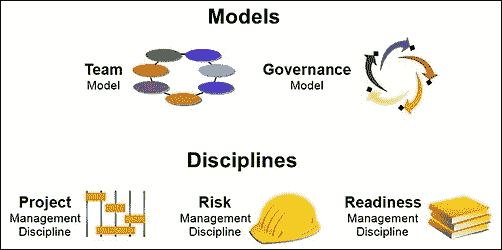

让我们回顾这些模型最重要的关键点以及它们如何解释和提出在 ALM 中沿用的明确程序和实践。

### 团队模型

团队模型基于一个架构，该架构定义了你可以分配给开发团队的不同角色。

微软提出了一种新的团队模型，与经典的层次模型相反，以避免其典型的缺点，这些缺点可以总结为几个方面：通信开销、非直接接触导致的误解、团队角色和责任不明确、成员疏离以及流程开销。

MSF 进而提出，团队模型应由一个*同侪团队*组成，其成员彼此平等相待，并清楚地知道每个成员的责任以及哪些决策是基于共识的。

团队模型赋予所有成员在项目最终成功中的同等重要角色。以这种方式，许多在其他项目管理解决方案中常见的模糊责任和含糊定义都得到了适当的解决。

在下一张图中，您可以看到官方微软 MSF 课程作者和传道者如何围绕“同伴团队”的概念组织这些角色：

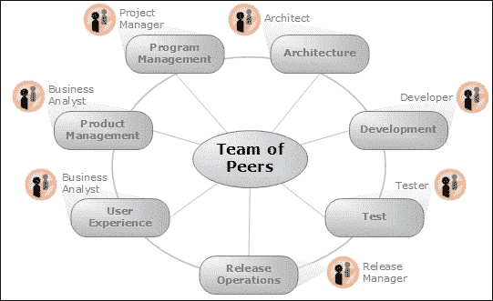

正如您在官方架构中可以看到的，共有七个角色——所有角色都被声明为具有同等重要性。请注意，然而，对于小型团队，同一个人可能扮演多个角色。

总结来说，每个角色的主要职责如下：

+   **产品管理**：作为与客户的联系，保证其满意度，并作为项目管理角色的客户声音。

    该角色的功能领域包括：

    +   市场营销/企业沟通

    +   业务分析

    +   产品规划

+   **项目管理**：负责管理项目的限制，并作为产品管理角色的团队声音。

    总体而言，功能领域应该是：

    +   项目管理

    +   项目管理

    +   资源管理

    +   流程保证

    +   项目质量管理

    +   项目运营

+   **架构**：目标是按照业务目标设计解决方案，同时不忘项目的限制（预算、时间表等）。

    该角色的功能领域主要是这两个：

    +   解决方案架构

    +   技术架构

+   **开发**：生成代码，同意项目规范、风格指示、时间表里程碑等。

    在这种情况下，功能领域如下：

    +   解决方案开发

    +   技术咨询

+   **测试**：这是在所有问题都得到正确解决时负责测试。

    通常，测试的四个方面被认为是关键的（在不同场景中）：

    +   回归测试

    +   功能测试

    +   可用性测试

    +   系统测试

+   **用户体验**：这被视为另一种测试形式，应该改善用户体验和性能。

    这里，目标更接近用户交互：

    +   可访问性

    +   国际化

    +   技术支持沟通

    +   培训

    +   可用性

    +   用户界面设计

+   **发布操作**：所有操作都需要满意的安装，并向团队提供有关未来发布的提示。

    在这个最终阶段，功能任务主要包括以下内容：

    +   可访问性

    +   国际化

    +   技术支持沟通

    +   培训

    +   可用性

    +   用户界面设计

然而，团队模型的建立方式使得某些角色不兼容。这取决于角色所承担的责任类型，因为其中一些被认为在本质上是对立的。以下图表以表格形式展示了这种情况：

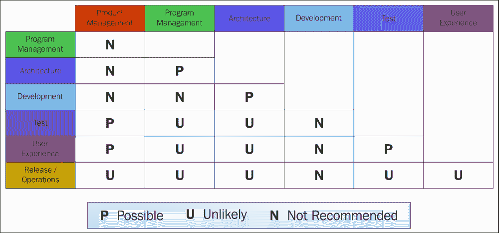

例如，项目管理就是这种情况，因为你所进行的关系类型本质上与产品管理（主要负责团队）不兼容。所有角色中最不可调和的是开发者，基本上与任何其他角色都不兼容。

## 治理模型

简而言之，MSF 的作者将项目管理定义为一系列工具、指南和技术，这些工具、指南和技术提供了足够的监督、流程指导和严谨性，以有效地使用项目资源并交付解决方案。所有这些都在处理权衡资助决策和平衡对一系列可能变化的项目的约束的遵守中发生。

它涉及构建应用程序的过程，并且根据所使用的模型传统上分为五个或六个阶段。在最新版本（4.0）中，Microsoft 文档中提出的方案如下：

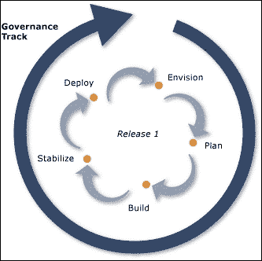

正如你所见，有五个阶段被考虑：**愿景**、**规划**、**构建**、**稳定**和**部署**。从一个阶段过渡到另一个阶段发生在你达到一个里程碑时，这个里程碑假定存在一套由团队所有成员批准的可交付成果。

这些步骤的主要目标如下：

+   **愿景**：在这里，目标是明确了解在项目约束的背景下需要什么（最初提到的指南在这里也可能很有帮助）。此外，文档还指出，它假设要组建必要的团队，以选择最佳选项和方法来设想解决方案，同时最优地满足约束。

+   **规划**：前一个阶段有点像是概念性的。这个阶段是将之前的思想具体化为可操作的解决方案：在所选的 RDBMS（关系数据库管理系统）中设计和实施数据库结构，定义用户界面及其与最终用户的交互，定义源代码管理工具的正确配置（Team Foundation Server 是 Microsoft 开发环境的首选选择），等等：

    +   在这个阶段，应明确确定一些安全方面的内容，特别是那些可能意味着资产损失、私人信息泄露（非故意披露）、可能的拒绝服务（DoS）攻击等。

+   **构建**：大多数人将这仅仅与编码联系起来，但它实际上要更进一步。它还应考虑良好的实践、风格指南以及许多其他编码实践：

    +   你可以在[`msdn.microsoft.com/en-us/library/ff926074.aspx`](https://msdn.microsoft.com/en-us/library/ff926074.aspx)找到 C#编码约定的专用页面。此外，.NET 解决方案的命名指南的完整列表可在[`msdn.microsoft.com/en-us/library/ms229002(v=vs.110).aspx`](https://msdn.microsoft.com/en-us/library/ms229002(v=vs.110).aspx)找到。

    +   这个阶段还包括愿意学习新的编码技术并以最佳方式实现需求。值得注意的是，MSF 建议这个阶段不应超过项目分配的总时间的 33%。

+   **稳定化**：该模型强调的不仅仅是消除错误。有时问题在于应用程序 UI 的使用，请求后访问某些数据所需的时间，或者确保没有与给定过程相关的副作用：

    +   此外，用户的观点也非常重要，某些技术很有用，例如单元测试或行为驱动测试，这些测试从开始到结束模拟用例。

    +   当然，安全也是这里的一个重要方面。如果威胁模型设计得当，行为驱动测试应包括所有评估和解决的安全方面。

+   **部署**：这是关于成功地将解决方案集成到生产中，并将剩余的管理转移到为此目的指定的支持团队。这是最终阶段，但很多时候，其结束只是与第二个版本（或更新、或发布，您叫它什么…）的开始相连接。

    ### 小贴士

    仅就部署阶段而言，微软后来创建了 Microsoft Operations Framework 提案，该提案涵盖了部署的各个方面，特别是对于具有一定规模和复杂性的应用程序（甚至包括整个操作系统）。

    这些复杂案例本身被视为另一个项目，包括所有阶段和考虑因素。在 MOF 的后续版本中，考虑了任何 IT 操作的整个覆盖范围，以及我们之前提到的所有场景：本地、云中、混合等。

    您可以在其专门的网站上找到有关此主题的完整文档：[`msdn.microsoft.com/en-us/library/cc506049.aspx`](https://msdn.microsoft.com/en-us/library/cc506049.aspx)。

## 风险模型

风险模型解释了如何在前述所有阶段处理安全，以及如何从应用程序生命周期的开始就考虑安全。一些理论家更喜欢将其包含在过程模型本身中，正如我们在本章开头的图中看到的。

我们将在第十一章中更深入地介绍安全，*安全*（基于 OAuth 2.0 标准），因此在这里深入讨论这些技术不是目标，但我希望回顾基于风险模型的原则。

MSF 风险管理学科在风险和问题（或已知或已知的问题）之间做出区分。因此，它定义了一种风险管理类型，主动识别、分析和解决风险，以提高成功的概率。

策略是预测而不是反应问题，因此团队应在问题发生之前准备问题解决方案，以便能够主动直接地应对根本原因，而不仅仅是症状。

官方文档以以下图形概述了风险管理：

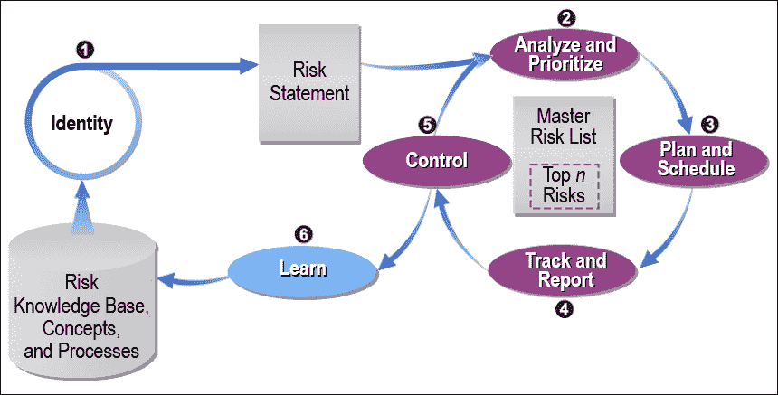

如您所见，第一步是识别和陈述一个既定的风险。这随后是对要解决的问题进行分析和优先级排序，这伴随着缓解计划和日程。

### 注意

在规划阶段，将应用程序的不同领域分配给不同的团队成员，每个成员承担与其相关的可能风险的职责。

### 风险评估

MSF 文档还根据此表对风险进行了分类，该表列出了四种类型风险的可能来源：

| 风险分类 | 风险来源 |
| --- | --- |
| 人员 | 客户、最终用户、利益相关者、人员、组织、技能和政治 |
| 流程 | 任务和目标、决策、项目特性、预算、成本、时间表、需求、设计、构建和测试 |
| 技术 | 安全、开发与测试环境、工具、部署、支持、操作环境以及可用性 |
| 环境 | 法律、法规、竞争、经济、技术以及商业 |

### 风险评估

评估风险的建议程序是发布一个可维护和可访问的列表，其中每个风险都使用两个因素进行评估：影响和概率，第一个因素是团队预先设定的值（比如说从 1 到 100，100 表示最坏的情况）。

第二个因素（概率）通常使用与该测量相关的数学概念来衡量（即，介于 0 和 1 之间的值，0 表示不可能，1 表示绝对确定）。

之后，这两个因素相乘并按降序排列，因此最危险的风险出现在顶部，团队可以在决定采取行动时确定其优先级。

### 风险行动计划

可以将不同的任务分配给风险管理，以便在这些问题被检测和分类后更好地应对潜在问题：

+   **研究**：这是在采取任何行动之前寻找更多关于风险信息的流程

+   **接受**：这意味着如果风险发生，可以接受其后果

+   **避免**：如果我们改变项目的范围，风险也会避免吗？

+   **转移**：在某些情况下，可以将风险转移到其他项目、团队、组织或个人

+   **缓解**：团队可以做什么来减少前面提到的两个因素中的任何一个（概率或影响）？

+   **应急计划**：团队应评估如果风险成为现实，计划中的策略是否会有帮助

考虑到所有这些考虑因素，团队将收集和设计一套与风险模型相关的可能活动。一旦完成，MSF 文档将提出的行动分为两个主要领域，它们将它们分类为主动和反应。

主动式方法意味着缓解，也就是说，在风险发生之前采取行动，以防止风险完全发生，或者——如果风险不可避免——将其影响降低到可接受的水平。

在另一种情况下，我们必须管理行动以减少真实问题（风险变成了现实），因此，提前分析可能的问题并——让我们面对现实——将自己置于最坏的情况，想象所有可行的解决方案是至关重要的。团队还应定义一个触发器，如果发生，应启动应急计划。

注意，这些触发器（与它们相关的风险相同）不仅与代码有关，还与许多其他因素有关。MSF 文档引用了一些：团队成员的辞职、超出可接受限制的 bug 数量，或者完成里程碑有显著延迟；这些只是常见的一些情况。

总结来说，MSF 评估这些规则，指出风险管理应该是：

+   **全面性**：它应该涵盖项目中的所有要素（不仅仅是技术要素，还包括人员和流程）

+   **系统性**：它应该包含一个可重复的项目风险管理流程

+   **持续性**：它应该在项目生命周期的整个过程中发生，而不仅仅是前两个阶段

+   **主动式**：它应该寻求避免或最小化风险发生的影响

+   **灵活性**：它应该能够适应广泛的风险评估方法

+   **面向未来**：它应该致力于个人和企业级的学习，并得到一个知识库的支持，该知识库为未来的努力服务

# CASE 工具

正如我们所看到的，MSF 并不强迫你使用任何特定的工具，因为它只关乎遵循良好实践、程序和协议，以便实现预期的目标，所有这些都在按时和项目预算内完成（这几乎是一个梦想，不是吗？）。

然而，确实有一些工具可以帮助你构建这些可交付成果。这包括不仅限于源代码，还包括所有报告、图形方案以及其他定义和阐明硬件和软件结构以及期望行为的文档，这些文档在 ALM 和在生产中都是必要的。这是超出编码阶段的事情，因为每个里程碑都需要自己的文档。

**CASE**（**计算机辅助软件工程**）工具是为此目的而命名的工具集。如果我们谈论微软，这些 CASE 工具今天相当多。

当然，源代码与不同版本的 Visual Studio 保持一致（也与我们看到的 Express 版本和 Visual Studio Code 一致）。

此外，Visual Studio 与 **Visual Studio Team Services**（**VSTS**）无缝集成，公司将其定义为允许软件团队共享代码、管理项目进展和问题以及以任何语言（是的，任何语言，包括 Java）交付软件的一套服务——所有这些都在一个包中。更进一步，Visual Studio Code 和最新的 Visual Studio 2017 可以直接与 Github 一起工作，作为协作编码的另一种选择。

实际上，之前被称为 **Visual Studio On-line** 的现在已成为 VSTS 的一部分，允许你在线编码、执行和保存开发项目，包括源代码控制、版本控制等。它以不同的形式呈现，非常适合在本地或云端（并且不排除 Git 或其他类型的代码和不同语言的存储库：C#、Java、JavaScript 等）进行源代码控制和其它编码服务。

此外，你可以独立于你选择的构建模型使用它们：MSF Agile、MSF for **CMMI**（**能力成熟度模型集成**），或任何其他模型。接下来的图示显示了 VSTS 中可用的主要功能架构：

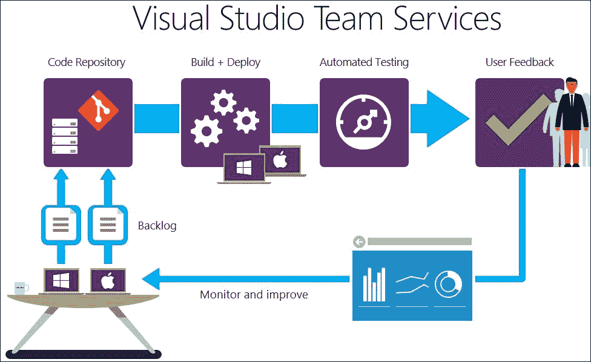

显然，还有许多其他任务也需要适当的工具和管理（实际上，有很多），但具体来说，当程序员处理开发周期的前两个阶段时，Microsoft Visio（现在是 2016 版本），可能是一个非常有用的工具。

# Visio 的作用

虽然它被认为是 Microsoft Office 套件的一部分，但实际上它是单独提供的，现在它是 Office 365（在线）的一部分。正如公司所说，Visio 的座右铭是“复杂化简单化”，它让你能够构建各种图表，这些图表甚至可以动态更新（随着原始数据的变化），覆盖数百种可能的图表场景。

你还可以将其与 Microsoft Project 和其他相关工具结合使用，它导入和整合外部信息的能力使其成为从其他来源集成数据并将其转换为有用图表的完美解决方案：


## 一个初步的例子

让我们假设我们已经有了团队模型中参与者的名单。我们已经与他们讨论了每个成员的胜任角色，并将这些信息记录在 Excel 表格中，表格中包含了团队每个成员的姓名、角色和照片。六个角色中的每一个都分配给了不同的人，正如团队模型中定义的那样。

我们可以创建一个组织结构图来表达这个初步声明，打开 Visio 并从提供的模板中选择 **组织结构图**。我们甚至有一个助手来引导我们完成这个过程，如果我们愿意的话。

然后，我们有一个选项菜单，**数据/快速导入**，它恢复我们需要的用于为每个形状提供相应信息的所需数据。如果你在创建 Excel 数据时小心谨慎，这可以自动完成，或者你可以手动完成，因为将打开一个新的面板，显示 Excel 表格中的信息（参见图表）：

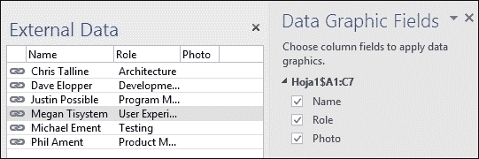

在此过程中，无论你是自动还是手动操作，你都可以选择更改数据、重新分配任何形状或从本地或远程位置加载图像以完成团队模型架构。

最终的形状应该与以下图示中的形状类似，包括所有分配的角色、名称和图片：

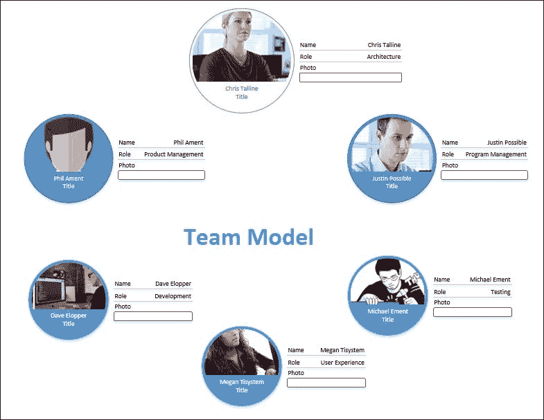

你现在可以将形状保存为多种不同的格式或与项目之前安装的任何协作资源共享（不仅仅是 TFS）。

如果之前的 Excel 表格位于可访问的位置（之前已告知助手），任何更改都可以进行检查。例如，为了对角色进行修改或添加新的兴趣字段，你可以在 Excel 表格中进行更改，一旦再次打开，这些更改就会立即反映在形状上。

我们还有模板来定义任何硬件架构、网络设计或任何其他硬件或软件架构，这些架构以图形方式概述了应用程序的结构。

例如，让我们考虑一个简单的网络应用程序（ASP.NET MVC），它访问数据库并为用户提供不同的设备（和形式因素），同时具备列出几个表的内容并通过 CRUD 操作修改它们的能力，我们将指导 Visual Studio 为我们生成这些操作。以下图示可以使用多浏览器客户端表达此场景：

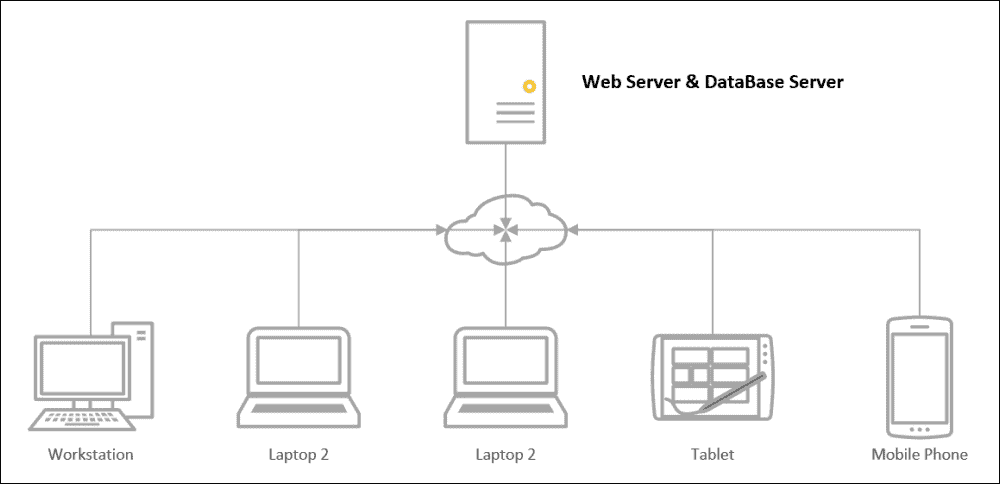

上述设计是从网络和外设模板开始的，没有导入特殊数据，只是使用工作站、笔记本电脑、平板电脑和智能手机以及 Visio 的连接器功能对应的形状。

你可以通过拖放连接器的两侧从充当初始连接（发射器）的形状的中心到目标（接收器）的中心来连接每个形状。此外，请注意，你可以为任何形状添加所需数量的描述字段，以指定，例如，网络标识符、IP、硬件特性、用户、角色、权限等等。

# 数据库设计

关于数据库设计，我们不需要使用 Visio。一方面，与 Visio 中数据库反向工程相关的部分功能自产品 2013 版本以来已被弃用。另一方面，Microsoft 将这部分功能的大部分移至 Visual Studio 本身，正如我们在第六章 *SQL 数据库编程*中提到的，当审查 IDE 的数据访问功能时。

实际上，我们甚至可以使用 **SQL Server Management Studio** （**SSMS**）通过使用工具的数据库图功能来生成我们所需的数据的图形架构。

我们应该确保数据库有一个有效的所有者链接到有效的登录。如果您没有为要使用的数据库分配一个，您可以在 **对象资源管理器** 中列出的每个数据库的 **属性** 对话框中分配它。在 **文件** 页面中，您应选择一个有效的所有者。下一个图形显示了此过程：

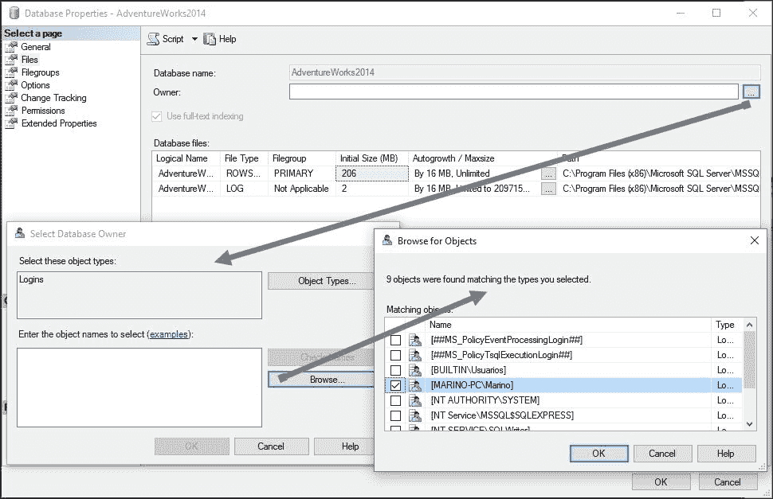

**SSMS** 可能还会询问您是否要安装管理图创建所需的对象，一旦接受，您将能够生成一个新的架构。

默认情况下，编辑器中将有一个空白架构，我们可以选择在过程中隐含的表。我在选择几个表（`SalesPerson` 和 `SalesTerritory`）以在架构中展示它们之间的关系，并展示一些其他功能。

生成的架构应类似于以下屏幕截图所示。请注意，编辑器表面在上下文菜单中提供了几个选项，您可以在其中添加注释、其他表（尚未选择）、查看表之间关系的详细信息等：

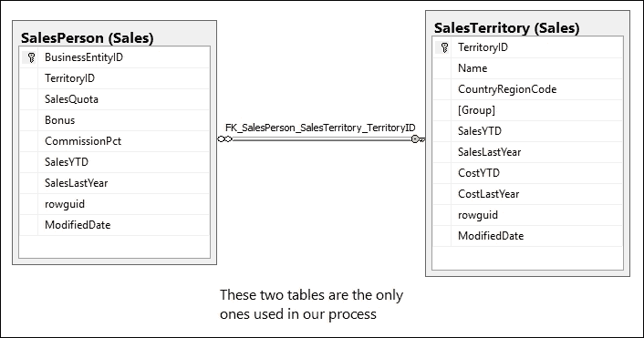

注意，编辑器会自动识别所有表的关系（在这个演示中，名为 `FK_SalesPerson_SalesTerritory_TerritoryId` 的外键关系以及任何选定对象的配置细节，如通常一样，在 **属性** 窗口中展示）。

您可能需要刷新对象资源管理器，以便 SSMS 在您保存后识别新的图。如果您对图进行了任何修改，这些修改意味着数据库结构的更改，则在保存之前将使用 **属性** 窗口中出现的值来检查新配置。如果任何更改与当前限制不兼容，则无法保存图。

## 在 Visual Studio 中创建演示应用程序

之后，我们将创建一个新的 ASP.NET MVC 应用程序，以便使用这两个表并从网页访问它们的数据。在创建时，当我们使用 Entity Framework 以我们在 第六章 中看到的方式添加新的 ORM 模型时，我们将得到一个类似的图（不是完全相同，但基本上包含相同的信息）。我们在这里不显示它，因为它与前面的输出没有有意义的关系。

然而，在这个新的 Visual Studio 内部图中，您将能够访问与 IDE 生成的代码相关的其他信息，以便方便程序员访问数据库并使用 Entity Framework 库。

这种信息，从 IDE 的 **属性** 窗口中可见，可能会显示与我们为我们的图选择的对象相关的有趣和具体数据。这包括用于代码生成的模板、代码生成策略、实体容器的名称以及几个布尔值（大多数可以更改），表示此类代码的所有方面。请参考以下截图：

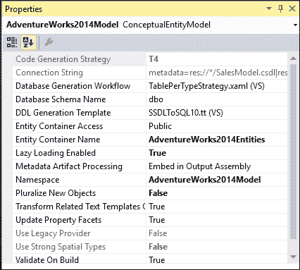

由于我们的目标不是代码本身，而是创建过程以及您在遵循 MSF 时可能生成的可交付成果，我将指示 Visual Studio 为这两个表生成完整的 CRUD 操作集的所有脚手架。然后，生成的代码将用于从 Visio 反向工程生成的网站并创建其他有用的模式。

因此，我将按照 第六章 中所述进行操作，*SQL 数据库编程*，并要求 IDE 为这里选择的每个表从 **添加控制器** 选项生成所有这些功能。检查生成的文件并测试基本功能是一个好习惯。

在这一点上，我对代码的唯一实际更改将是向主页（记住 `_Layout.cshtml` 文件）添加两个新链接，以便可以直接从着陆页访问这些新选项。

我还对模板默认显示的信息做了一些修改，只是为了反映这个演示提供的基本信息，而不是模板本身的信息。然而，唯一的操作更改将包括添加几个链接，以便可以从主页访问 CRUD 操作。

因此，我将使用两个 `ListItems` 和 `ActionLink` 辅助器来生成主菜单中的新条目，并检查它们是否正常工作，链接到每个生成的控制器中的 `Index` 动作方法。

如同往常，这些列表显示了每个表的完整记录列表，并且其他链接会自动生成（每个单独记录的 **编辑**、**详情** 和 **删除**，以及顶部创建新记录的选项）。在这个情况下，代码相当简单：

```cs
<li>@Html.ActionLink("Sales Person Info", "Index", "SalesPersons")</li>
<li>@Html.ActionLink("Sales Territory Info", "Index", "SalesTerritories")</li>
```

在检查了前面的功能之后，我们将在此时刻结束项目（参考以下截图）：

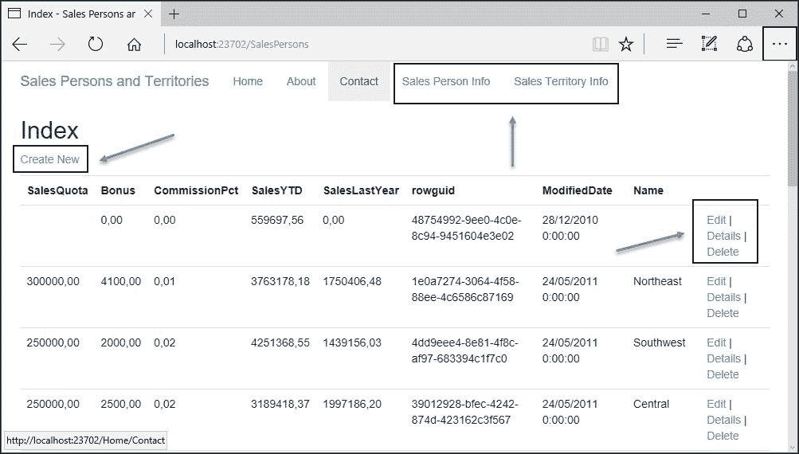

## 网站设计

设计阶段还有更多内容，可以使用 Visio 资源和工具来解决。现在，我们有一个可以测试 Visio 在逆向工程网站时的一些功能的网站。

Visio 提供了两种不同的网页模板：**概念网站**和**网站地图**，您在搜索可用模板时将会发现。

第一个是一些开发者在编写任何其他代码操作之前喜欢创建的架构类型。也就是说，它允许您定义网站的独特组件，并帮助您配置每个组件，定义其形状和字段：

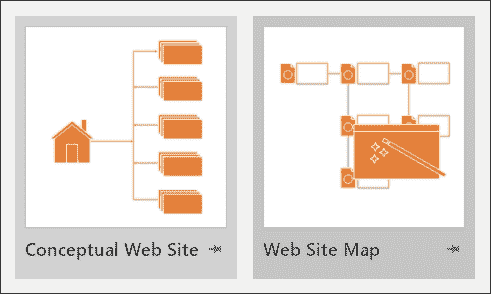

然而，网站地图可以从零开始创建，或者可以逆向工程，指导 Visio 从已存在的网站上读取文件信息。实际上，如果您从这个模板开始创建新的图表，您将有机会从现有网站上读取信息。

由于涉及许多因素，因此在底部有一个**设置…**按钮，让您调整 Visio 尝试读取信息的方式。对于这个演示，由于我们没有将我们的网站发布到任何真正的托管服务，我们可以使用`localhost:port`配置来配置 Visio，以确定查找信息的位置。

另一个重要的技巧是，您应该将层级数量减少到两个（通常）。最后，我们可以添加 Razor 引擎的扩展，以便这些文件被正确识别和分析。

正如您将看到的，还有许多其他方面可供选择：通信协议的选择、列表中出现的资源类型、构建图形树的布局类型等等：

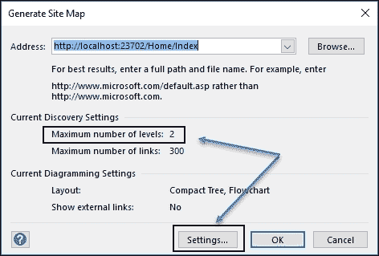

几秒钟后，您将看到一个包含网站上所有选定资源的新的图表。

这个最终的架构将按照与网站相同的方式组织，即层次结构，从初始 URL 开始，向下通过所有层级，正如前一个配置中所示（在某些情况下，请注意此值，否则可能需要一段时间才能完成检查所有可能的链接）。

另一个有用的配置是指（查看图示）要分析的超链接数量。对于这个演示，300 个已经足够了，但根据网站的不同，您可能会错过其中的一些（尤其是那些位于最深层级的）。

此外，一旦创建了树，您就可以调整该树的不同的视图，并在 Visio 默认提供的几个工具的帮助下进行进一步的研究：**过滤器窗口**和**列表窗口**。这两个窗口都折叠在编辑表面旁边，由该过程产生。

另一个需要注意的方面是图表的大小。你可以将其做得尽可能大，但默认情况下，图表会适应可用空间（无论网站有多大），因此你可能会发现生成的图形相当缩小（当然，缩放工具会让你以你喜欢的任何方式查看）。

总体而言，结果应该看起来与下一张捕获中显示的内容相似（尽管我已经改变了大小并润色了一些条目以使其更明显）：

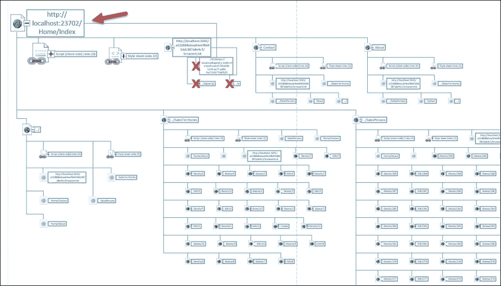

当你深入查看图像时，所有细节都会显示出来，并且有一些方面需要注意。例如，在涉及`SalesPersons`和`SalesTerritories`控制器区域，你会找到与`Index`动作方法返回时注册数量一样多的链接。

这意味着对于非常长的列表，图形的数量可能会难以管理。这就是为什么默认情况下限制链接数量为 300 的原因。

在这样一个复杂的架构中，如果直接从形状进行操作，单个元素的位置可能会很具挑战性。这就是**列表窗口**派上用场的地方：

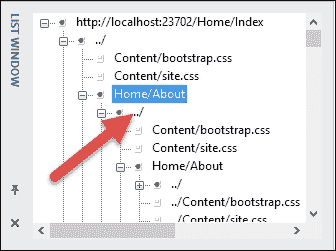

你只需在列表中定位任何项目，然后双击它；图形将定位并移动到该元素，显示其详细信息。

一旦项目展开，就会有一系列可用的选项供你使用。你会发现另一个可折叠窗口（形状数据），它显示了与所选元素（通常停靠在编辑表面的右上角）关联的所有字段。

你也可以展开相应的链接，以查看在视图呈现时哪些元素将是活动的。

更好的是，你还有一个上下文菜单，其中包括**交互式超链接选择**选项。如果你点击链接，将打开一个新窗口，显示在运行时你会看到的实际页面。参考对应于**SalesTerritories/Edit/9** URL 的屏幕截图：

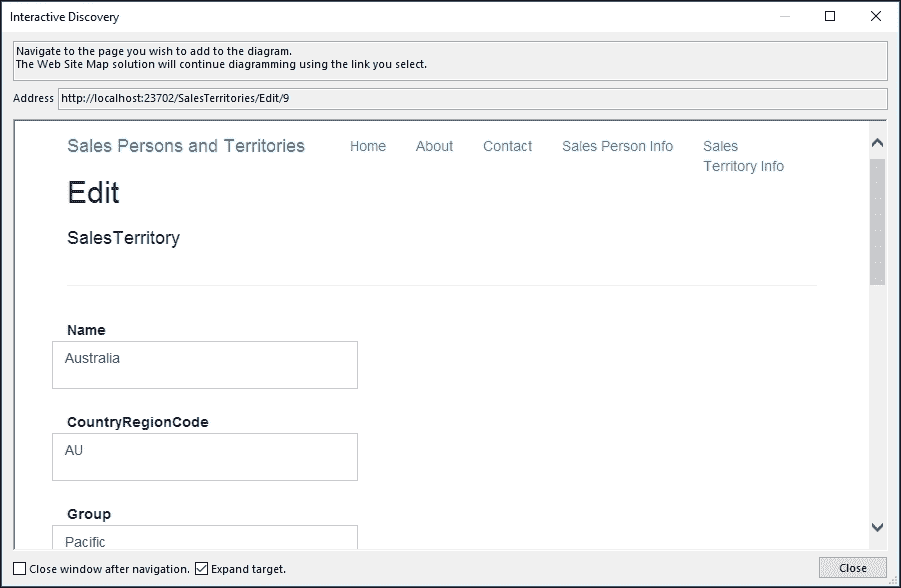

这个功能的最大优点是窗口不是一个只读的、仅查看的快照，而是允许你真正更改信息，并且将像实际页面在执行时一样操作。

例如，如果你尝试更改一些数据，字段中存在一些不兼容的信息，表单将不会发送，并且会显示错误消息，指示问题，正如你在以下捕获中可以看到的，其中在字段期望数字的地方引入了一个字符串：

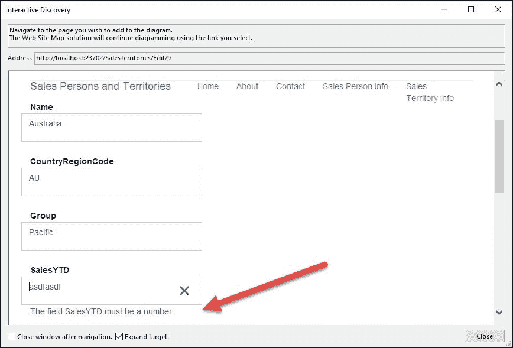

此外，我们还有**过滤器窗口**提供的选项，允许激活/停用链接和脚本，以减少图表中显示的元素数量：

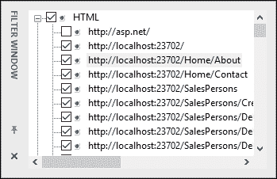

总体而言，我们依赖的是广泛的可能性，这些可能性仅从初始图表开始。

## 报告

在所有这些可能性中，我们可以收集大量可交付成果来伴随我们的项目文档，但 Visio 还提供了一些额外的功能来增强我们的文档。

其中一个选项是生成多种格式的报告（Excel、MS Access、Visio 图形等），从当前正在编辑的形状开始。

由于这些报告也可以链接，因此您可以在项目发生变化时刷新信息。要创建新的报告，我们只需将鼠标移动到 Visio 主菜单中的**网站地图**选项卡并选择**创建报告**。

我们可以选择整个报告，包括在地图中选定的所有元素（Visio 所称的库存），或者我们可以创建部分报告，以处理不同的方面，例如仅生成**链接报告**，甚至在**网站地图**选项卡中使用**带有错误的链接**选项生成损坏的链接报告。

在任何情况下，我们都会得到一个最终格式来保存信息，这可以是一个 Excel 表格、一个 Visio 形状、一个 HTML 页面或一个 XML 文件。如果我们选择 HTML 文件，它们可以轻松发布到企业 Office 365、项目专用的 SharePoint 网站或任何对我们团队方便的网站。

以下截图显示了以这种方式生成的网页，包括在我们网站上发现的全部链接。展示了一个基本表格，尽管您可以调整生成器的所有方面，包括要排除的错误类型等：


## 许多其他选项

如果您不习惯使用 Visio，您会注意到许多其他可能性来直观地表达项目生命周期的不同方面。其中许多自早期版本以来就存在，但公司以有意义的方式增强了选项和功能的数量。

例如，自从最初版本以来，Visio 就具有创建和更新日历和时间图表的能力，以便管理日程安排和进度表，例如 PERT 和甘特图。

例如，甘特图让您能够控制项目管理、任务管理、日程安排、进度表、目标设置，以及一般而言，项目的生命周期。有多种模板可供选择：带有日历的子任务、简单的任务瀑布图等。以下截图显示了这些模板的起始外观：

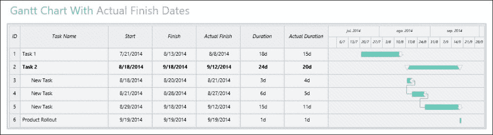

当然，您还可以配置日历，在其中可以插入每个日期的所有类型的数据，以便以更详细的方式扩展控制。

### BPMN 2.0 (业务流程模型和符号)

在业务流程方面，我们发现了几种解决方案（流程图、组织结构图等），但值得注意的是，Visio 现在也提供了对业务标准的支持。

标准的 BPMN 2.0 完全受支持，并提供多个模板来表示流程中的参与者：

+   BPMN 图表（从头开始）

+   包含网关的 BPMN 流程（对于包含两个结果的网关流程）

+   多角色 BPMN 流程（适用于存在多个主要参与者的案例）

+   BPMN 地址变更流程，当流程参与者包含多个角色或功能时，该工具推荐使用

    ### 注意

    标准的主要声明定义了 BPMN，指出*一个标准的业务流程模型和符号（BPMN）将使企业能够以图形符号理解其内部业务流程，并将使组织能够以标准方式传达这些流程*。

有趣的是，这些图形建议补充了其他经典方案，特别是某些 UML 图（如活动图或序列图），有助于更详细地阐明某些业务流程。

默认的 BPMN 地址变更流程模板是这一点的完美示例（参见图表）：


让我们来看看这个过程意味着什么：客户更改地址并通知银行。由于**帮助台**将此新信息传递给**处理中心**，而**处理中心**反过来向**帮助台**发送确认，然后**帮助台**将更改确认发送给客户（银行的任务在这里结束）。这也可以使用 UML 序列图来表示（甚至可以使用用例图，因为它暗示了三个参与者）。

因此，一个基本的 UML 图可以表达初始场景，我们可以使用更详细的 BPMN 图来更精确地描述任务步骤和完成情况。

## UML 标准支持

如果你倾向于遵循由**OMG 通用建模语言**（**OMG UML**）（目前版本为 2.5）提出的图表，你也会发现对规范中定义的所有类型图表的出色支持（包括在 Visio 和 Visual Studio 中）。

### 注意

如果你感兴趣的是 UML 标准的当前状态，完整的规范可在[`www.omg.org/spec/UML/Current`](http://www.omg.org/spec/UML/Current)找到。

也就是说，我们可以为用例、类、活动、序列和 UML 状态机设计图表，因为所有必需的工件都包含在相关的模板和额外形状中。

只需查看**更多形状/软件和数据库/软件**菜单，就可以找到所有这些模板以及标准为它们定义的形状。

# Visual Studio 架构、测试和分析工具

Visio 并非是唯一帮助架构师设计和组织软件项目的工具。所有版本的 Visual Studio 都包含额外的工具（取决于版本），以不同方式协助这些任务。

如果你现在使用的 Visual Studio 企业版，你将找到与此相关的三个主要菜单选项：

+   **架构**：代码图生成和 UML 图形（支持我们刚才提到的所有类型图）

+   **测试**：一组测试工具，包括特定、专注的对话框和工件

+   **分析**：这包括 Node.js 性能分析、代码度量、代码分析等功能。

## 使用 Visual Studio 的应用程序架构

为了保持良好的编码速度并防止技术债务，改进应用程序的架构至关重要。此外，在决定是否进行更改以及更改的后果时，理解代码潜在更改的影响是基本的。

第一步是为当前解决方案生成代码图。您可以通过两种方式完成：从头开始生成或使用 **为解决方案生成代码图** 选项。如果您选择后者，将弹出一个新的 DGML 编辑器窗口，并显示一个复杂的地图，显示两个主要节点的根：我们的代码编译的 DLL 本身（`WebApplication1.dll`），以及另一个名为 `Externals` 的节点，其中包含项目中使用的 DLL 的关系。

您必须展开两个节点才能理解整个图及其关系。请参考以下截图：

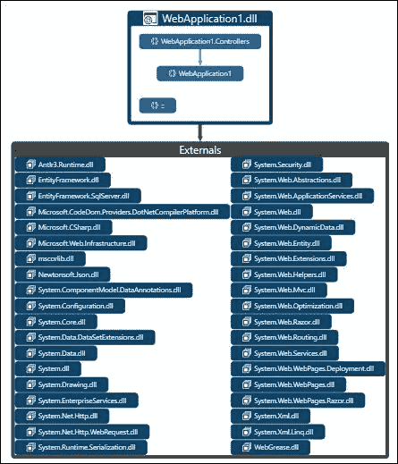

这种类型的图在快速查看应用程序的主要元素方面非常有用。但当我们展开节点并识别我们的控制器或其他应用程序配置元素时，它就更加出色了。

由于每个节点都可以展开，我们可以继续深入，直到达到任何类的成员及其依赖项。如果您双击任何节点，将打开一个新窗口，显示匹配的源代码，并将光标定位在该成员定义的确切位置。

这种能力让我们能够清晰地看到代码及其关系，可以快速识别哪些成员被哪些成员使用，以及一个类依赖于哪些库，以及其他有用的信息。

以下截图说明了这一点，标记了两个感兴趣的因素：我们的控制器和应用程序的配置类：

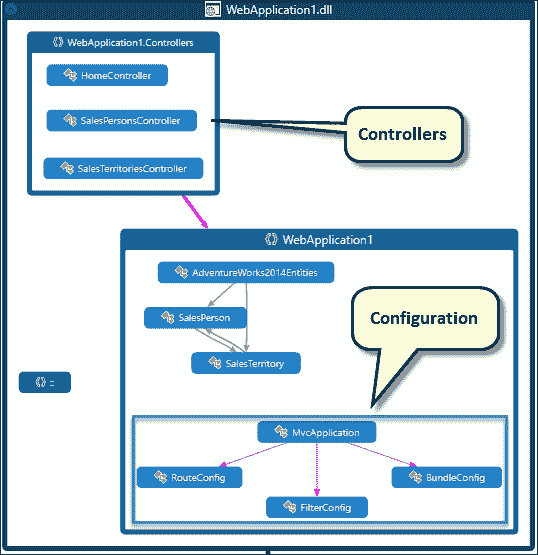

如果您检查节点的详细信息，您会看到您可以继续深入，直到获取元素的完整详细信息。

此外，在 DGML 编辑器的 **布局** 子菜单中，您可以找到额外的分析器来检查循环引用、查找中心节点或识别未引用的节点。

此外，**过滤器** 窗口，它出现在解决方案资源管理器旁边，显示包含在图中的元素类型列表，所有元素都默认选中。为了更好地了解您拥有的内容，您可以取消选择元素，然后图表将自动更新以显示新的图表，让您能够单独更改或保存任何视图以供以后研究。

可用的功能还有很多，当你浏览编辑器的不同选项时，你会看到这些功能。

该菜单的另一个主要功能是 UML 图。它允许您基于所选的 UML 图创建一个单独的项目，即建模项目，或者将新图添加到现有项目中（参见图表）：


### 类图

Visual Studio Enterprise（以及某些其他版本）最有趣的功能之一是能够从现有代码创建类图。最初它与 UML 类图相关联，但现在它直接属于类图绘制功能，作为一个单独的模板。

例如，我们可以从**添加**菜单中的**新/类图**选项为我们的项目创建一个新的类图。这将带您到一个新的编辑表面，在那里您可以拖放类（只是我们的类，而不是它们存储的文件）。

编辑器将逆向工程我们的类，因此我们可以通过三个简单的动作轻松地拥有我们的控制器图，并得到如图所示的图形：

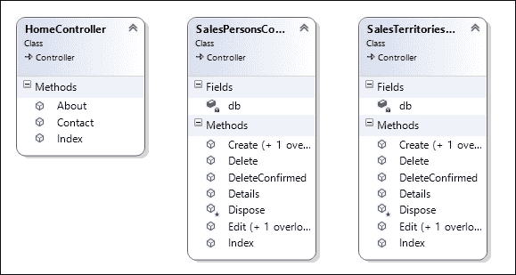

总体而言，我们有一个完整的基础设施来表达我们解决方案的细节并符合生命周期框架：要么我们使用 MSF，要么使用任何其他选项。

## 测试

测试是关于检查产品的质量。许多技术允许程序员测试软件，尽管最初的动作应该精确地定义要测试的内容。

测试有许多方法：单元测试、回归测试、行为测试、集成测试、循环复杂度测试等，尽管单元测试可能是程序员中使用最广泛的。

单元测试通过测试者使用与解决方案其余部分相同语言表达的句子所建立的某些断言，来验证函数的正确性。

### 小贴士

注意，这并不保证代码单元是正确的；它只保证它通过了测试所断言的条件。

在敏捷开发模型（以及在极限模型中），开发阶段的一部分遵循测试驱动设计范式。在该模型中，您测试实现单元（函数、类或模块），期望单元以正确执行的方式驱动后续的代码。

在名为**行为驱动设计**（或**BDD**）的替代模型中，我们通过行为来理解用例是如何被解决和完成的，这为过程提供了一个协作背景，将结果扩展到非程序员（例如，可以与团队模型的*用户体验*部分共享），*难以遗忘*。

Visual Studio 提供了广泛的测试支持，专注于单元测试和最流行的测试技术。让我们通过一个新的 ASP.NET MVC 应用程序来回顾它是如何工作的。

### 在 Visual Studio 中测试我们的应用程序

在 Visual Studio 中测试我们的应用程序的推荐步骤是创建我们的应用程序，并在创建时指出我们将使用测试项目。

为了简化这个解释，同时让你更容易检查这个功能，我将创建另一个 MVC 项目，但这次，我会确保从一开始就与主项目并行选择一个测试项目（参考以下截图）：

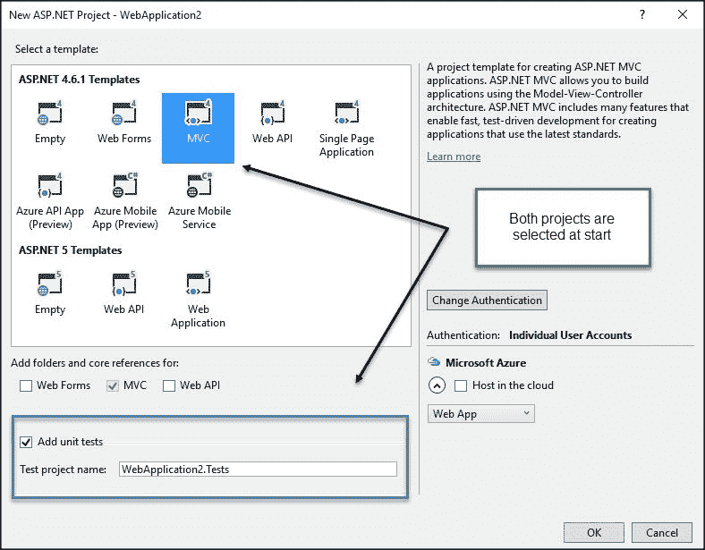

### 小贴士

虽然这不是绝对必要的，但强烈建议你为测试创建一个单独的项目。如果你认为测试与 Team Foundation Server 集成得非常好，这也会帮助团队的其他成员，你可以编程测试的节奏和类型，分配结果的责任等等。

在测试项目中，默认创建了一个名为 `HomeControllerTest` 的新类来测试 `Home` 控制器。它包含三个方法，与控制器中包含的操作方法同名。

然而，请注意，类和方法分别用属性 `TestClass` 和 `TestMethod` 标记。这表明测试引擎，哪些成员是测试目标的一部分，哪些应该仅被视为在测试过程中协作的辅助元素。

现在，是时候编译解决方案（两个项目）并打开位于 **测试/窗口** 菜单中的 **测试资源管理器** 窗口了。几秒钟后，测试引擎将检测到解决方案中所有可用的测试，并在即将出现的列表中显示它们。

注意，你会看到一个菜单，让你运行所有测试或仅运行选定的测试，甚至创建一个播放列表，其中你可以指定你想要证明的确切测试（一次性完成）。

如果你只选择一个测试并运行它，当测试成功时，它将被标记为 **通过**，并将显示一个新列表，列出已通过和待定的测试。例如，在执行 **About** 方法的测试后，你应该看到如下内容：

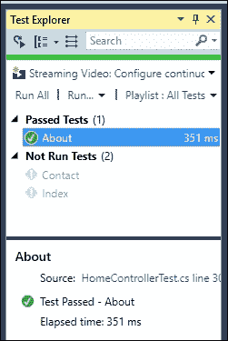

使用 **运行所有** 选项后，三个测试应该通过并显示为正确。然而，如果出了问题怎么办？为了检查发生了什么，将 `About` 测试方法中的字符串更改为任何其他字符串，并保存代码。

重新编译后，你会了解到测试不会显示为通过；如果你运行测试，它将会失败，**测试资源管理器**的第二个窗口将显示一个引用列表，指出出了什么问题，以便给你提供如何解决问题的线索。

请记住，测试可以像其他任何代码一样进行调试。这肯定会给你更多关于测试和代码中存在问题的线索。

另一个需要考虑的方面是，您的测试项目必须添加对要测试的项目以及命名空间的引用，例如使用 `Microsoft.VisualStudio.TestTools.UnitTesting`。在这个演示项目中，Visual Studio 默认会这样做，但如果您添加一个新的测试项目，这些引用将取决于您：

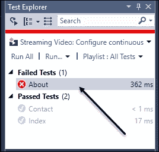

最后，让我们提一下，您可以使用几种不同的断言（检查 `Assert` 类之后的 Intellisense），并且您还可以选择不同的测试环境。在 **扩展和更新** 菜单中搜索测试将显示 Visual Studio 承认的许多其他测试框架，例如 NUnit 测试、Jasmine、Karma 等。

其中一些（例如 NUnit）也适用于 C#，而其他一些则专注于其他语言，如 Jasmine 和 Karma，它们在测试 JavaScript 解决方案时非常受欢迎。

### **分析** 菜单

**分析** 菜单让您可以计算代码度量（如循环复杂度、继承深度、类耦合等），这些度量提供了对代码质量的其他方面或视角。

您还可以使用项目属性窗口中的 **代码分析** 配置在代码中查找不准确之处（我们已在 第四章 中对此进行了评论，*比较编程方法*）。

# 生命周期结束 – 发布解决方案

发布（部署）是治理模型的最终步骤，可能会导致新版本或升级。

另一种常见的可能性是进入维护时间，在此期间会提出新的修改，整个周期再次开始——但功能范围（以及因此涉及的团队成员数量）将大大减少。

Visual Studio 允许您根据应用程序类型以不同的方式发布解决方案。此外，我们还可以使用第三方版本，这些版本只需要免费注册，例如 IDE 在 **其他项目** 部分提供的轻量级 InstallShield 版本。

对于 Web 应用程序，有许多选项。您可以使用 Team Foundation Server 配置部署，或者在这种情况下，我们可以探索如何直接从 IDE 部署此演示。

只需在 **构建** 菜单中选择 **发布**（或右键单击项目），就会显示一个新窗口 **发布 Web**，其中包含主要选项：

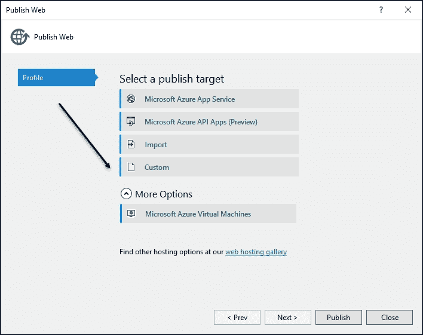

需要配置文件，您可以选择以前的配置文件发布（如果已定义）或选择 **自定义** 选项，给它命名，并选择发布目标：**Web Deploy**、**Web Deploy 包**、**FTP** 或 **文件系统**。

如果你想在实际实施之前尝试结果，**文件系统**选项很有用。创建一个新的文件夹作为目标位置，并指示助手将应用程序发布到那里。

如果一切顺利（你将在**输出**窗口中收到通知），所有必需的文件（包括二进制文件）都将被复制到目标文件夹，你将能够检查是否缺少任何内容，并在完成前对过程进行修改。

# 摘要

在本章中，我们探讨了应用程序的生命周期过程，从回顾微软的解决方案框架及其基本建议和指南开始。

通过 MSF，我们探讨了团队和治理模型的特点以及如何配置我们开发人员的角色和责任以及应用程序的主要资产。

我们还研究了适用于风险模型设计的主要原则以及评估应用程序风险的所用技术。

然后，我们回顾了 Visio 提供的许多选项，以便创建能够直观表达我们应用程序不同方面的交付成果。

最后，我们涵盖了 Visual Studio Enterprise Edition 中可用应用程序的架构、测试和部署的其他方面。

在下一章中，我们将继续讨论项目，但这次的重点将是代码的质量以及良好的实践、已知的建议、软件模式等如何帮助你进行更好的软件设计，以改善解决方案的稳定性和维护性。
