# 第十二章：性能

在上一章中，我们介绍了与 Top 10 OWASP 倡议相关的最重要的安全问题，该倡议的目标是，用他们自己的话说，“通过识别组织面临的一些最关键风险来提高对应用安全性的认识”。

在本章中，我们将回顾开发者遇到的应用性能的常见问题，并探讨通常建议的技术和技巧，以获得灵活、响应迅速且表现良好的软件，特别强调网络性能。我们将涵盖以下主题：

+   回顾性能背后的概念（**应用性能工程**）

+   我们将探讨在 Visual Studio 中可用的最有趣的工具，用于测量和调整性能，包括 IntelliTrace 和新的选项，如 PerfTips 和诊断工具

+   我们还将检查在**开发者工具**菜单（*F12*）中可用的最实用的可能性

+   我们将评论最被接受和知名的性能实践，以及一些用于检查瓶颈的软件工具

+   最后，我们将关注网络应用性能中最常见的问题，重点关注 ASP.NET 优化

# 应用性能工程

根据吉姆·梅茨勒和史蒂夫·泰勒的说法，**应用性能工程**（**APE**）涵盖了在应用生命周期每个阶段应用的职责、技能、活动、实践、工具和可交付成果，以确保应用将被设计、实施和运营支持，以满足非功能性性能需求。

定义中的关键词是非功能性。假设应用是工作的，但一些方面，如执行交易或文件上传所需的时间，应该从生命周期的开始就考虑。

因此，问题可以反过来分为几个部分：

+   一方面，我们必须确定应用哪些方面可能会产生有意义的**瓶颈**。

+   这意味着测试应用，测试当然会根据应用类型而变化：例如，业务线、游戏、网络应用、桌面应用等。这些应该引导我们确定与最终生产环境相关的应用性能目标。

+   开发团队应该能够处理可以通过经过验证的软件技术解决（或改善）的性能问题：将中间代码转换为本地代码、汇编重构、优化垃圾收集器、序列化消息以实现可伸缩性、异步请求、执行线程、并行编程等。

+   另一个方面是性能指标。这些指标应该可以通过某些性能测试来衡量，以便对性能目标有真正的洞察。

我们可以考虑许多可能性的性能指标：物理/虚拟内存使用、CPU 利用率、网络和磁盘操作、数据库访问、执行时间、启动时间等等。

每种类型的应用程序都会建议一个独特的目标集来关注。此外，请记住，性能测试应在所有集成测试完成后进行。

最后，让我们说，通常，在衡量性能时，一些测试被认为是标准的：

+   **负载测试**：这是为了测试软件在重负载下的表现，例如当你模拟大量用户测试一个网站，以确定在什么点应用程序的响应时间会下降甚至失败。

+   **压力测试**：这是你的应用程序想要获得官方“为 Windows X.x 制作”标志必须通过的一项测试。它基于将系统工作在超出其规格的条件下，以检查它在哪里（以及如何）失败。这可能包括使用超出存储容量的重负载、非常复杂的数据库查询，或者连续向系统或数据库中输入数据，等等。

+   **容量测试**：MSDN 模式和惯例也包括这种类型的测试，它是负载测试的补充，以确定服务器的最终故障点，而负载测试则检查在特定负载和流量级别下的结果。

在这些类型的测试中，明确确定要针对的负载以及为特殊情况制定应急计划是很重要的（这在网站上更为常见，当预计每秒用户量会有峰值时）。

## 工具

幸运的是，我们可以依赖 IDE 中提供的一系列工具以多种方式执行这些任务。正如我们在第一章中看到的，其中一些工具在我们在 Visual Studio 2015（包括社区版在内的所有版本）中启动应用程序时直接可用。

有关这些工具的更多详细信息，包括默认启动的**诊断工具**，显示**事件**、**CPU 使用率**和**内存使用率**，请参阅本书第一章“CLR 内部”中的“关于 Visual Studio 2015 中程序集执行和内存分析的快速提示”部分。

作为提醒，下面的截图显示了简单应用程序的执行以及**诊断工具**在运行时显示的预定义分析：

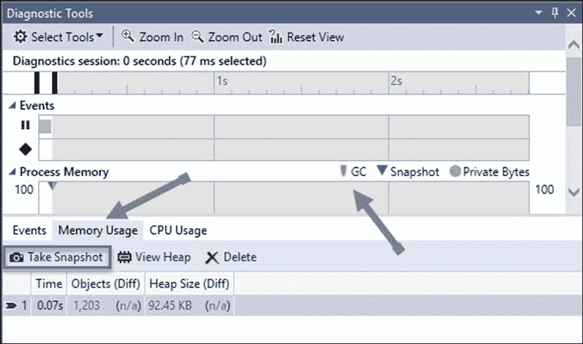

然而，请注意，一些其他工具也可能很有用，例如 Fiddler，这是一个流量嗅探器，在分析 Web 性能和请求/响应包内容时扮演着出色的角色。

其他工具是可编程的，例如`StopWatch`类，它允许我们精确地测量代码块执行所需的时间，我们还有.NET 自第一版以来的性能计数器和 Windows 事件跟踪（ETW）。

即使在系统本身中，我们也可以找到有用的元素，例如事件日志（用于监控行为——在.NET 中完全可编程），或者为 Windows 专门设计的工具，例如我们在第一章中提到的 SysInternals 套件。在这种情况下，您会发现最有用的工具之一是**PerfMon**（**性能监控器**），尽管您可能还记得我们还提到了 FileMon 和 RegMon。

### Visual Studio 2015 的高级选项

然而——尤其是 2015 和 2017 版本——IDE 包含了许多更多用于检查运行时执行和性能的功能。这些功能的大部分都可通过**调试**菜单选项（一些在运行时，一些在版本中）访问。

然而，在编辑器中可用的最易于使用的工具之一是一个名为**性能提示**的新选项，它显示了函数完成所需的时间，并在下一段代码中展示。

假设我们有一个简单的方法，它从磁盘读取文件信息，然后选择那些名称中不包含空格的文件。它可能看起来像这样：

```cs
private static void ReadFiles(string path)
{
    DirectoryInfo di = new DirectoryInfo(path);
    var files = di.EnumerateFiles("*.jpg", 
        SearchOption.AllDirectories).ToArray<FileInfo>();
    var filesWoSpaces = RemoveInvalidNames(files);
    //var filesWoSpaces = RemoveInvalidNamesParallel(files);
    foreach (var item in filesWoSpaces)
    {
        Console.WriteLine(item.FullName);
    }
}
```

`RemoveInvalidNames`方法使用另一个简单的`CheckFile`方法。其代码如下：

```cs
private static bool CheckFile(string fileName)
{
    return (fileName.Contains(" ")) ? true : false;
}
private static List<FileInfo> RemoveInvalidNames(FileInfo[] files)
{
    var validNames = new List<FileInfo>();
    foreach (var item in files)
    {
        if (CheckFile(item.Name)==true) {
            validNames.Add(item);
        }
    }
    return validNames;
}
```

我们本可以在`RemoveInvalidNames`方法内部插入`CheckFile`功能，但应用单一职责原则在这里有一些优势，正如我们将看到的。

由于文件选择将花费一些时间，如果我们直接在`foreach`循环之前设置一个断点，我们将在这些提示中的一个中得知时间：

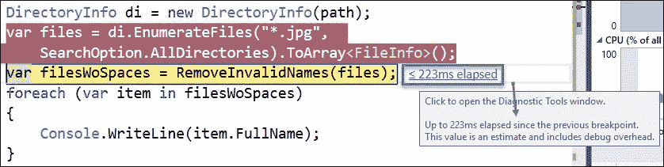

当然，这些代码片段的真实价值在于我们可以看到整个过程并对其进行评估。这不仅关乎所花费的时间，还关乎系统的行为。因此，让我们在方法末尾再设置一个断点，看看会发生什么：

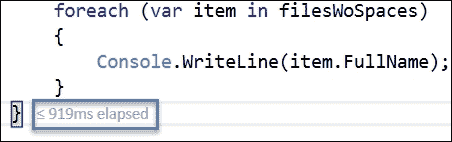

如您所见，整个过程大约花费了 1.2 秒。IDE 提醒我们，我们可以打开**诊断工具**来检查这段代码的行为，并有一个详细的总结，如下一个复合截图所示（请注意，您将在工具中的三个不同的停靠窗口中看到它）：

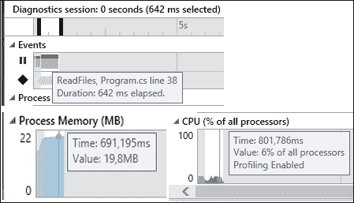

以这种方式，我们不需要显式创建一个`StopWatch`实例来测量过程延迟了多少。

这些**性能提示**报告了花费的时间，表明小于或等于（<=）一定数量的内容。这意味着它们考虑了调试过程的开销（符号加载等），并将其排除在测量之外。实际上，在 CLR v4.6 和 Windows 10 上可以获得最高的精度。

至于 CPU 图表，它使用所有可用的核心，当你发现一个值得检查的峰值时，即使它没有达到 100%，对于不同类型的问题，我们将在后面列举（请记住，此功能在调试结束之前不可用）。

#### 诊断工具菜单中的高级选项

实际上，我们可以逐句追踪并确切地看到大部分时间花在了哪里（以及我们应该在哪里修改代码以寻找改进）。

如果你在这个机器上重现此代码，根据读取的文件数量，你会在**诊断工具**菜单的底部窗口中看到一个列表，显示每个生成的事件及其处理所需的时间，如下面的截图所示：

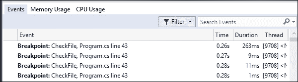

多亏了 IntelliTrace，您可以精确配置调试器在一般情况或特定应用程序中的行为方式。只需转到**工具** | **选项**，然后选择**IntelliTrace 事件**（在树视图中有一个单独的条目）。

这允许开发者选择他们感兴趣的事件类型。例如，如果我们想监控**控制台**事件，我们可以选择在应用程序中需要针对的目标：

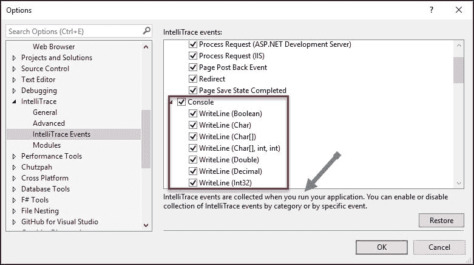

为了测试这一点，我编写了一个非常简单的控制台应用程序来显示一些值以及可用的行数和列数：

```cs
Console.WriteLine("Largest number of Window Rows: " + Console.LargestWindowHeight);
Console.WriteLine("Largest number of Window Columns: " + Console.LargestWindowWidth);
Console.Read();
```

一旦 IntelliTrace 配置为显示名为`ConsoleApplication1`的此应用程序的活动，我们就可以在**事件窗口**中跟踪所有事件，然后选择我们感兴趣的事件并检查其中的**激活历史调试**。


一旦我们这样做，IDE 将重新启动执行，现在，**自动**、**局部变量**和**监视**窗口再次出现，但显示应用程序在执行过程中在那个精确时刻管理的值。

实际上，这就像记录应用程序在运行时给出的每个步骤，包括我们在此过程中之前选定的任何变量、对象或组件的值（参见图表）：

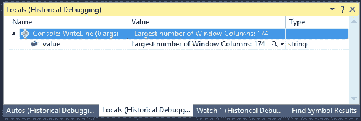

此外，请注意，提供的信息还包括每个事件在运行时花费的确切时间指示。

此外，我们还可以为应用程序的不同方面配置其他配置文件。我们可以在**调试器**菜单下的**不进行调试启动诊断工具**选项中进行配置。

### 小贴士

当使用**不进行调试启动诊断工具**时，IDE 会提醒我们更改默认配置为**发布**，如果我们想获得准确的结果。

注意，配置文件可以附加到系统中的不同应用程序，而不仅仅是我们在构建的应用程序。将打开一个新的配置页面，**分析目标**选项显示不同类型的应用程序，如您在下一张屏幕截图中所见。

这可以是当前的应用程序（`ConsoleApplication1`），一个 Windows 商店应用程序（无论是正在运行还是已经安装），在 Windows 手机上浏览网页，选择任何其他可执行文件，或者启动在 IIS 上运行的 ASP.NET 应用程序：

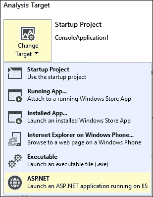

这还不是与性能和 IntelliTrace 相关的全部内容。如果您选择**显示所有工具**链接，将呈现更多选项，这些选项与要测量的不同类型的应用程序和技术相关。

以这种方式，在**不适用工具**链接中，我们看到其他一些有趣的功能，例如以下内容：

+   **应用程序时间线**：用于检查在应用程序执行中花费更多时间的地方（例如典型的低帧率）。

+   **HTML UI 响应性**：特别适用于您有一个混合服务器和客户端代码的应用程序，并且客户端的一些操作花费了太多时间（例如 Angular、Ext、React、Ember 等框架）。

+   **网络**：这是之前提到的网络场景的一个非常有用的补充，问题就出在网络本身。您可以检查响应头、每个请求的时间线、cookies 以及更多内容。

+   **能耗**：这在移动应用程序中尤其有意义。

+   **JavaScript 内存**：再次，当处理使用外部框架的 Web 应用程序时，我们不知道潜在的内存泄漏在哪里时，非常有用。

下一个屏幕截图显示了这些选项：

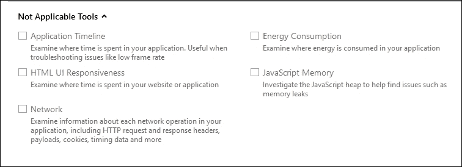

如您所见，这些选项显示为**不适用**，因为在控制台应用程序中它们没有意义。

一旦我们在**开始**按钮中启动配置文件，助手就会启动，我们必须选择目标类型：CPU 样本、仪器（用于测量函数调用）、.NET 内存分配和资源争用数据（并发），这可以检测等待其他线程的线程。

在助手的最后屏幕上，我们有一个复选框，表示我们是否希望在之后立即启动分析。应用程序将被启动，当执行完成后，将生成一个分析报告并在新窗口中显示：

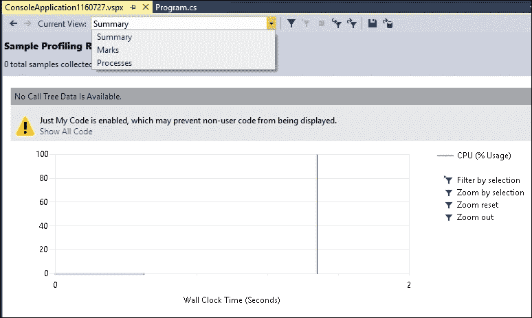

我们有几种可用的视图：**摘要**、**标记**（显示执行中所有相关的计时信息）和**进程**（显然，显示任何参与执行的过程的信息）。

在我们获得的结果中，这个最新的选项特别有趣。使用相同的 `ConsoleApplication1` 文件，我将添加一个新的方法来创建一个 `Task` 对象，并使执行暂停至 `1500` 毫秒：

```cs
private static void RunANewTask()
{
    Task task = Task.Run(() =>
    {
        Console.WriteLine("Task started at: " + 
            DateTime.Now.ToLongTimeString());
        Thread.Sleep(1500);
        Console.WriteLine("Task ended at: " + 
            DateTime.Now.ToLongTimeString());
    });
    Console.WriteLine("Task finished: " + task.IsCompleted);
    task.Wait();  // Blocked until the task finishes
}
```

如果我们在分析器中激活此进程选项，我们将看到一系列分析选项，生成的报告包含根据我们的需求以不同方式过滤数据的信息：**时间调用树**、**热点行**、**报告比较**（带有导出）、**过滤器**，甚至更多。

例如，我们可以通过在**诊断工具**菜单中双击一个事件来查看在收集视图时的调用堆栈：

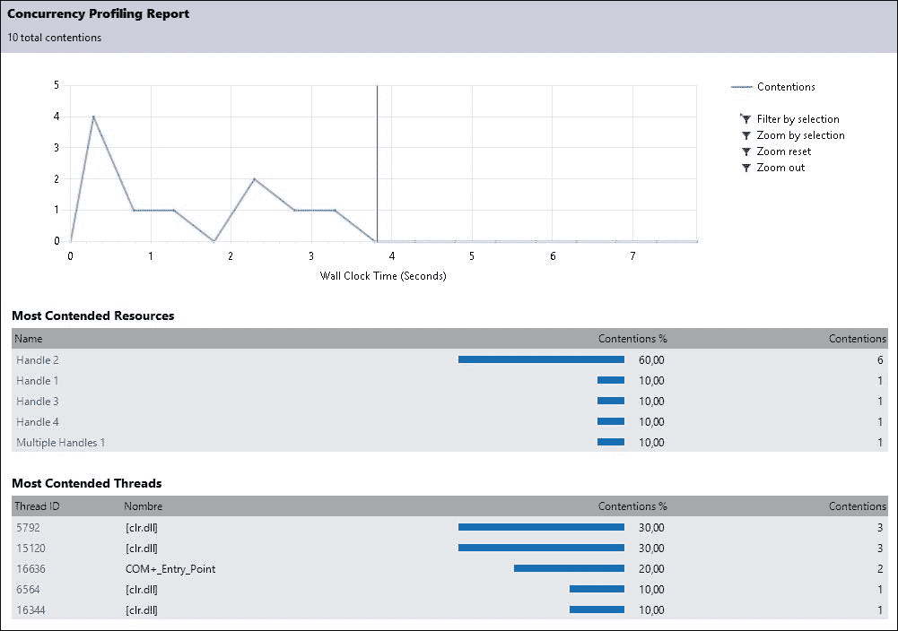

注意我们如何展示了与**最争用资源**和**最争用线程**相关的信息，并按每个监控元素进行了细分：要么是句柄，要么是线程编号。这是尽管在 Visual Studio 的早期版本中可用，但应通过性能计数器管理的功能之一，正如你在 Maxim Goldin 的文章《线程性能 - Visual Studio 2010 中的资源争用并发分析》中读到的，该文章作为 MSDN 杂志的一部分提供，网址为[`msdn.microsoft.com/en-us/magazine/ff714587.aspx`](https://msdn.microsoft.com/en-us/magazine/ff714587.aspx)。

除了截图显示的信息外，许多其他视图都提供了更多关于执行的数据：**模块**、**线程**、**资源**、**标记**、**进程**、**函数详情**等等。

下一个截图显示了如果你按照这些步骤操作，你将看到的内容：

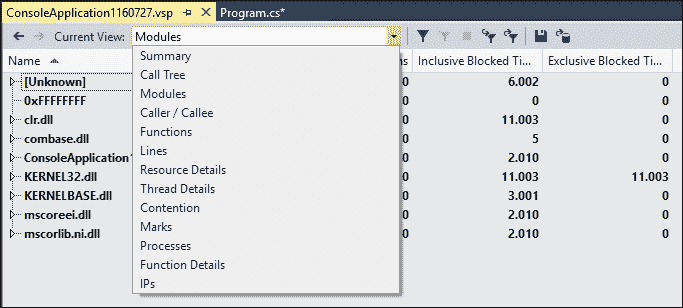

总结一下，你刚刚学习了 IDE 如何提供一套现代、更新的工具，而决定哪个是所需分析的最佳解决方案只是时间问题。

## 其他工具

如前一章所述，现代浏览器提供了分析网页行为的新颖和令人兴奋的可能性。

由于假设初始着陆时间对用户的感知至关重要，因此一些这些功能直接与性能相关（分析内容、总结每个资源的请求时间、通过一瞥展示图形信息等等）。

**网络**标签通常存在于大多数浏览器中，显示了当前页面中每个元素的加载时间详细报告。在某些情况下，此报告附有图形图表，指示哪些元素花费了更多时间完成。

在某些情况下，名称可能会有所不同，但功能相似。例如，在 Edge 中，你有一个**性能**标签，它记录活动并生成详细的报告，包括图形信息。

在 Chrome 中，我们发现其**时间线**标签，这是页面性能的记录，同时也展示了结果的摘要。

最后，在 Firefox 中，我们有一套出色的工具来检查性能，从**网络**标签开始，它分析每个请求的下载时间，甚至在我们将光标移至列表中的每个元素上时，还会显示详细的摘要，允许我们通过类别过滤这些请求：HTML、CSS、JS、图片、插件等，如下面的截图所示：

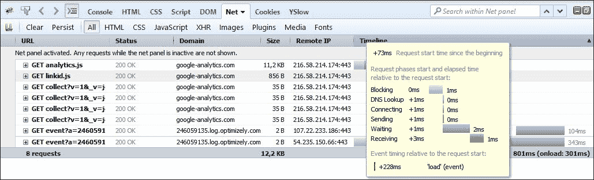

此外，在 Chrome 中，我们还可以找到一个有趣的标签：**审计**。其目的是监控页面行为的各个方面，例如 CSS 的正确使用（及其影响），合并 JavaScript 文件以提高整体性能（称为**捆绑和压缩**操作），以及 Chrome 认为可以改进的完整问题列表，主要在两个方面：**网络利用率**和**网页性能**。下面的截图显示了简单页面的最终报告：

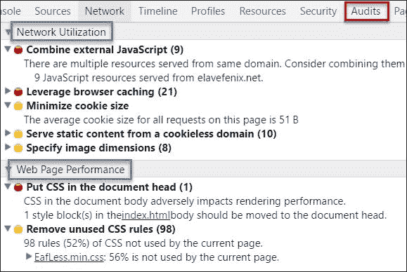

在结束与浏览器相关的性能功能回顾时，也要考虑在某些浏览器中，我们发现了一个**性能**标签，专门用于加载响应时间或类似工具，例如 Chrome 中的**页面洞察**和 Firefox 中的一个类似功能（我特别推荐 Firefox 开发者版，因为它为开发者提供了非常实用的功能）。

在这种情况下，你可以记录一个会话，其中 Firefox 获取所有必要的信息来展示性能，你可以在以后以多种形式分析这些信息：

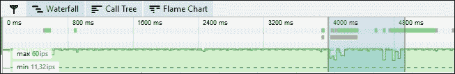

注意，性能主要关注 JavaScript 的使用，但它可以高度自定义页面行为的其他方面。

## 性能调优的过程

就像任何其他软件过程一样，我们可以将性能调优视为一个周期。在这个周期中，我们试图识别并消除任何缓慢的功能或瓶颈，直到达到性能目标。

该过程包括数据收集（使用我们看到的工具）、分析结果以及配置更改，有时甚至在代码中，具体取决于所需的解决方案。

完成每个周期更改后，你应该重新测试并测量代码，以检查是否达到了目标，并且你的应用程序是否更接近其性能目标。微软的 MSDN 建议一个周期过程，我们可以将其扩展到几个不同的场景或应用程序类型。

请记住，软件调优通常意味着也要调整操作系统。你不应该更改系统的配置以使特定应用程序正确运行。相反，尝试重新创建最终环境和该环境可能（或可预测的）演变的方式。

只有在你绝对确信你的代码是最佳可能的情况下，你才应该建议对系统进行更改（增加内存、更好的 CPU、显卡等）。

下图来自官方 MSDN 文档，突出了这个性能周期：

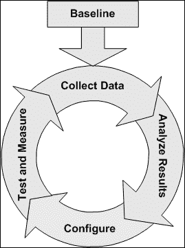

### 性能计数器

如您所知，操作系统使用性能计数器（默认安装的功能）来检查其性能，并最终通知用户有关性能限制或不良行为。

虽然它们仍然可用，但我们在 IDE 中看到的新工具提供了一个更好且更集成的方法来检查和分析应用程序的性能。

### 瓶颈检测

MSDN 的官方文档为我们提供了一些线索，我们可以在瓶颈检测过程中记住这些线索，并将可能的来源主要分为四类（每一类都提出了独特的管理）：CPU、内存、磁盘 I/O 和网络 I/O。

对于.NET 应用程序，在识别可能的瓶颈时，以下建议被认为是正确的：

+   **CPU**：至于 CPU，请在诊断工具中查找峰值。如果您找到了一个，请缩小搜索范围以确定原因并分析代码。如果峰值在一段时间内超过 CPU 使用率的 75%以上，则被视为有害。

    +   在这种情况下，后果可能与代码有关。一般来说，异步进程、任务或并行编程被认为对解决这类问题有积极影响。

+   **内存**：在这里，内存峰值可能有几个原因。它可能是我们的代码，但也可能是一个涉及大量使用内存（物理或虚拟）的过程。

    +   可能的原因包括不必要的分配、不高效的清理或垃圾回收、缺乏缓存系统等。当使用虚拟内存时，结果可能会立即变差。

+   **磁盘 I/O**：这指的是在本地存储系统或应用程序可访问的网络中执行的操作（读取/写入）数量。

    +   有多个原因可以引发这里的瓶颈：读取或写入长文件、访问过度使用或配置不佳的网络、涉及加密数据操作、从数据库中不必要的读取，或者过度的分页活动。

    +   为了解决这类问题，MSDN 推荐以下方法：

    +   首先从您的应用程序中移除任何多余的磁盘 I/O 操作。

    +   确定您的系统是否缺少物理内存，如果是，则添加更多内存以避免过度分页。

    +   确定您是否需要将数据分散到多个磁盘上。

    +   如果在执行了所有前面的选项之后，您仍然有磁盘 I/O 瓶颈，请考虑升级到更快的磁盘。

+   **网络 I/O**：这是关于您的服务器发送/接收的信息量。这可能是一个过多的远程调用数量，或者通过单个网络接口卡（NIC 流量）路由的数据量，或者可能与大量调用中发送或接收的大量数据有关。

每个可能的瓶颈可能都有一个不同的根本原因，我们应该基于诸如以下问题仔细分析可能的起源：这是否是因为我的代码，还是因为硬件？如果是硬件问题，是否有通过软件改进来加速过程的方法？等等。

#### 实际瓶颈检测

在确定.NET 瓶颈的时候，你仍然可以使用（除了我们已经看到的所有这些工具之外）性能计数器，尽管我们之前看到的技术本应大大简化检测过程。

然而，与一些问题检测相关的官方建议仍然是一个有价值的线索。因此，关键在于寻找等效的值。

根据要测量的特性，有几种类型，如 MSDN 建议：

+   **过度内存消耗**：由于原因通常是不正确的内存管理，我们应该在以下方面寻找值：

    +   进程/私有字节

    +   .NET CLR 内存/# 所有堆的字节数

    +   进程/工作集

    +   .NET CLR 内存/大对象堆大小

    这些计数器的关键是，如果你在所有堆的字节数保持不变的情况下发现私有字节的增加，这意味着存在某种未管理的内存消耗。如果你观察到两个计数器都增加，那么问题在于托管内存消耗。

+   **大的工作集大小**：我们应该理解*工作集*意味着在给定时间内加载到 RAM 中的所有内存页面。测量这个问题的方法是使用进程\工作集性能计数器。现在我们有了其他功能，但需要查找的点是一样的，基本上：

    +   如果你得到一个高值，这可能意味着加载的程序集数量也非常高。在这个计数器中没有特定的阈值要关注；然而，一个高值或频繁变化的值可能是内存短缺的关键。

    +   如果你看到高页面错误率，这可能意味着你的服务器应该有更多的内存。

+   **碎片化的大对象堆**：在这种情况下，我们必须关注分配在**大对象堆**（**LOH**）中的对象。通常，大于 85 KB 的对象被分配在那里，并且传统上使用.NET CLR 内存\大对象堆大小分析器来检测，现在使用我们之前看到的内存诊断工具。

    +   它们可能是缓冲区（用于大字符串、字节数组等），这在 I/O 操作（如`BinaryReaders`）中很常见。

    +   这些分配会极大地碎片化 LOH。因此，回收这些缓冲区是一种良好的做法，以避免碎片化。

+   **高 CPU 利用率**：这通常是由于编写不佳的托管代码引起的，就像代码执行以下操作时发生的那样：

    +   强制 GC 过度使用。这个特性的度量以前是用 GC 计数器的`%Time`完成的。

    +   此外，当代码引发许多异常时，你可以使用`.NET CLR 异常/每秒抛出的异常数`来测试。

    +   生成大量线程。这可能会导致 CPU 花费大量时间在线程之间切换（而不是执行实际工作）。之前使用`Thread\Context Switches/sec`进行测量，现在我们可以使用之前看到的**分析目标**功能进行检查。

+   **线程争用**: 这发生在多个线程尝试访问共享资源时（记住，一个进程创建了一个所有与其关联的线程都可以访问的共享资源区域）。

    通常通过观察两个性能计数器来识别这种症状：

    +   `.NET CLR LocksAndThreads\Contention Rate/sec`

    +   `.NET CLR LocksAndThreads\Total # of Contentions`

当这两个值有意义地增加时，你的应用程序被认为存在争用率问题或遇到线程争用。应识别出负责的代码并进行重写。

## 使用代码评估性能

如前所述，除了我们看到的工具集之外，还可以将这些技术与专门为方便我们自己的性能测量而设计的软件工具相结合。

最著名的是`Stopwatch`类，它属于`System.Diagnostics`命名空间，我们在第一章中已经使用它来测量排序算法等。

首先要记住的是，根据系统不同，`Stopwatch`类将提供不同的值。如果我们想知道我们可以获得多精确的测量，我们最初可以查询这些值。实际上，这个类包含两个重要的只读属性：`Frequency`和`IsHighResolution`。

此外，一些方法完成了一套完整的功能。让我们回顾一下它们的意义：

+   `频率`: 这将获取计时器的频率，以每秒的滴答次数表示。数字越高，我们的`Stopwatch`类表现越精确。

+   `IsHighResolution`: 这表示计时器是否基于高分辨率性能计数器。

+   `Elapsed`: 这将获取测量的总经过时间。

+   `ElapsedMilliseconds`: 这与`Elapsed`相同，但以毫秒为单位进行测量。

+   `ElapsedTicks`: 这与`Elapsed`相同，但以滴答为单位进行测量。

+   `IsRunning`: 这是一个布尔值，表示`Stopwatch`是否仍在运行。

`Stopwatch`类也有一些方便的方法来简化这些任务：`Reset`、`Restart`、`Start`和`Stop`，你可以通过它们的名字轻松推断出它们的功能。

因此，让我们使用之前和现在的测试中的读取文件方法，以及一个`Stopwatch`来通过一些基本代码检查这些功能：

```cs
var resolution = Stopwatch.IsHighResolution;
var frequency = Stopwatch.Frequency;
Console.WriteLine("Stopwatch initial use showing basic properties");
Console.WriteLine("----------------------------------------------");
Console.WriteLine("High resolution: " + resolution);
Console.WriteLine("Frequency: " + frequency);
Stopwatch timer = new Stopwatch();
timer.Start();
ReadFiles(pathImages);
timer.Stop();
Console.WriteLine("Elapsed time: " + timer.Elapsed);
```

使用这种基本方法，我们可以得到进程总经过时间的简单指示，如下一张截图所示：

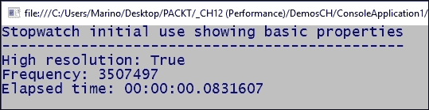

我们可以使用类提供的其他属性来获得更高的精度。例如，我们可以使用`Frequency`属性来测量`Stopwatch`在尝试获取纳秒时使用的基本时间单位。

此外，该类还有一个静态的`StartNew()`方法，我们可以用它来处理这些简单的情况；因此，我们可以这样更改前面的代码：

```cs
static void Main(string[] args)
{
    //BasicMeasure();
    for (int i = 1; i < 9; i++)
    {
        PreciseMeasure(i);
        Console.WriteLine(Environment.NewLine);
    }
    Console.ReadLine();
}
private static void PreciseMeasure(int step)
{
    Console.WriteLine("Stopwatch precise measuring (Step " + step +")");
    Console.WriteLine("------------------------------------");
    Int64 nanoSecPerTick = (1000L * 1000L * 1000L) / Stopwatch.Frequency;
    Stopwatch timer = Stopwatch.StartNew();
    ReadFiles(pathImages);
    timer.Stop();
    var milliSec = timer.ElapsedMilliseconds;
    var nanoSec = timer.ElapsedTicks / nanoSecPerTick;
    Console.WriteLine("Elapsed time (standard): " + timer.Elapsed);
    Console.WriteLine("Elapsed time (millisenconds): " + milliSec + "ms");
    Console.WriteLine("Elapsed time (nanoseconds): " + nanoSec + "ns");
}
```

正如你所见，我们使用一个小循环来执行测量三次。因此，我们可以比较结果，并得到一个更准确的测量，计算平均值。

此外，我们正在使用类的静态`StartNew`方法，因为它是针对这个测试有效的（想想你可能需要几个`Stopwatch`类的实例来测量应用程序的不同方面或块的情况）。

当然，在循环的每一步中，结果都不会完全相同，正如我们在下一个截图中所看到的程序输出（请记住，根据任务和机器的不同，这些值会有很大的变化）：

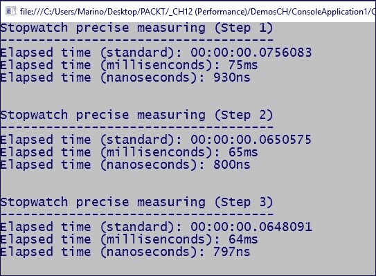

此外，请注意，由于系统的缓存和资源分配，每个新的循环似乎比前一个循环花费的时间少。这在我的机器上取决于不同的系统状态。如果您需要进行精确评估，建议至少执行这些测试 15 或 20 次，并计算平均值。

## 优化 Web 应用程序

对于许多专家来说，优化 Web 应用程序是一种**黑魔法**，它结合了如此多的功能，实际上，关于这个主题已经出版了大量的书籍。

我们将专注于.NET，因此也将专注于 ASP.NET 应用程序，尽管一些建议可以扩展到任何 Web 应用程序，无论其如何构建。

许多研究都探讨了推动用户卸载应用程序或避免使用它的原因。已确定以下四个因素：

+   应用程序（或网站）冻结

+   应用程序崩溃

+   响应缓慢

+   电池消耗量大（对于移动设备和平板电脑来说，显然）

所以，除了电池考虑之外，应用程序应该快速、流畅和高效。但这些关键词对我们来说究竟意味着什么呢？

+   快速意味着从一个点 A 到点 B 的移动应该始终以最短的时间完成：从应用程序启动到在页面之间导航、方向变化等等。

+   流畅性涉及到平滑的交互。翻页、软动画旨在指示状态或展示的信息的变化，消除故障、图像闪烁等等。

+   当资源的使用是适当的时候，一个应用程序或网站被认为是高效的：磁盘资源、内存占用、电池寿命、带宽等等。

在任何情况下，整体性能通常与以下领域相关：

+   托管环境（通常是 IIS）

+   ASP.NET 环境

+   应用程序的代码

+   客户端

因此，让我们快速回顾一下在优化这些因素时需要考虑的一些方面，以及一些在提高页面性能时通常被认为有用的其他建议。

### IIS 优化

在优化 IIS 时，有一些技术被广泛认为是有效的，所以我将总结一些 Brian Posey 在 *Top Ten Ways To Pump Up IIS Performance* ([`technet.microsoft.com/es-es/magazine/2005.11.pumpupperformance.aspx`](https://technet.microsoft.com/es-es/magazine/2005.11.pumpupperformance.aspx)) 这篇 Microsoft TechNet 文章中提供的建议：

+   **确保启用 HTTP Keep-Alives**：这将在所有文件请求完成之前保持连接开启，避免不必要的打开和关闭。自 IIS6 以来，此功能默认启用，但出于谨慎，最好还是检查一下。

+   **调整连接超时**：这意味着在一段时间的不活动后，IIS 无论如何都会关闭连接。请确保配置的超时时间足以满足您网站的需求。

+   **启用 HTTP 压缩**：这对于静态内容特别有用。但请注意，压缩动态页面：IIS 应该为每个请求每次压缩它们。如果您有大量流量，后果是额外的很多工作。

+   **考虑使用 Web Gardens**：您可以使用 Web Gardens 将多个工作进程分配给应用程序池。如果其中某个进程挂起，其余的可以继续处理请求。

+   **对象缓存 TTL（生存时间）**：IIS 缓存请求的对象并为每个对象分配一个 TTL（因此之后会删除它们）。但是，请注意，如果这个时间不够，您应该编辑注册表，并且要非常小心（前面提到的文章解释了如何做这件事）。

+   **回收**：您可以通过回收内存来避免服务器中的内存泄漏。您可以指定 IIS 在每天特定时间（例如每 3 小时或您认为合适的任何时间）或当您认为应用程序池已收到足够多的请求时回收应用程序池。`web.config` 中的 `<recycle>` 元素允许您调整此行为。

+   **限制队列长度**：如果您在服务器上检测到请求过多，限制 IIS 允许服务的请求数量可能是有用的。

### ASP.NET 优化

在最近版本的 ASP.NET 中，有许多优化技巧，这些技巧对应于错误修复、改进以及开发人员向开发团队提出的建议，您可以在网上找到大量关于此的文献。例如，Brij Bhushan Mishra 撰写了一篇关于这个主题的有趣文章（参考[`www.infragistics.com/community/blogs/devtoolsguy/archive/2015/08/07/12-tips-to-increase-the-performance-of-asp-net-application-drastically-part-1.aspx`](http://www.infragistics.com/community/blogs/devtoolsguy/archive/2015/08/07/12-tips-to-increase-the-performance-of-asp-net-application-drastically-part-1.aspx)），推荐了一些不太为人所知的 ASP.NET 引擎方面。

一般而言，我们可以将优化分为几个区域：**通用和配置**、**缓存**、**负载均衡**、**数据访问**和**客户端**。

#### 通用和配置

在处理 ASP.NET 应用程序的优化时，有一些通用的和配置规则适用。让我们看看其中的一些：

+   总是记得在**发布**模式下测量您的性能问题。差异可能很明显，并隐藏性能问题。

+   记得使用我们看到的分析工具，并使用这些工具和不同的浏览器比较相同的网站（有时，某个特定的功能可能在一个浏览器中受到影响，而在其他浏览器中则不太受影响）。

+   修订管道中的未使用模块：即使它们没有被使用，请求也必须通过为您的应用程序池预定义的所有模块进行传递。然而，我如何知道哪些模块是激活的？

    +   有一种简单的方法来实现这一点。我们可以使用应用程序实例并在一个变量中恢复加载的模块集合，正如您在以下代码中所看到的。稍后，只需设置一个断点来查看结果：

        ```cs
        HttpApplication httpApps = HttpContext.ApplicationInstance;
        //Loads a list with active modules in the ViewBag
        HttpModuleCollection httpModuleCollections = httpApps.Modules;
        ViewBag.modules = httpModuleCollections;
        ViewBag.NumberOfLoadedModules = httpModuleCollections.Count;
        ```

        您应该看到以下截图，以帮助您决定哪些正在使用，哪些没有：

        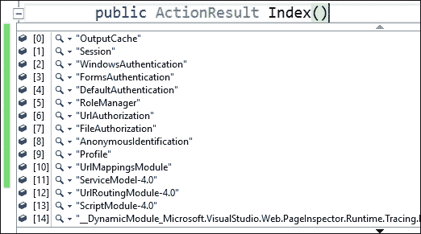

    +   一旦您看到所有模块在运行，如果您的网站不需要身份验证，您可以删除这些模块，并在`Web.config`文件中指明：

        ```cs
        <system.webServer>
          <modules>
            <removename="FormsAuthentication" />
            <removename="DefaultAuthentication" />
            <removename="AnonymousIdentification" />
            <removename="RoleManager" />
          </modules>
        </system.webServer>
        ```

    +   这样，我们只会使用我们的应用程序所需的模块，并且每当应用程序发出请求时都会发生这种情况。

+   管道模式的配置：从 IIS7 开始，有两种管道模式可用：**集成**和**经典**。然而，后者仅用于与从 IIS 6 迁移的版本兼容。如果您的应用程序不需要处理兼容性问题，请确保在 IIS 管理中的**编辑应用程序池**选项中**集成**是激活的。

+   一个好主意是在 HTML 生成后立即将其刷新（在您的`web.config`中），如果您没有使用它，请禁用**ViewState**：`<pages buffer="true" enableViewState="false">`。

+   优化 ASP.NET 应用程序性能的另一个选项是删除未使用的视图引擎。默认情况下，引擎会在不同的格式和不同的扩展名中搜索视图：

    +   如果你只使用 Razor 和 C#，那么激活你永远不会使用的选项是没有意义的。因此，一个选择是在开始时禁用所有引擎，只启用 Razor。只需将以下代码添加到`application_start`事件中：

        ```cs
        // Removes view engines
        ViewEngines.Engines.Clear();
        //Add Razor Engine
        ViewEngines.Engines.Add(newRazorViewEngine());
        ```

    +   另一个需要记住的配置选项是名为`runAllManagedModulesForAllRequests`的功能，我们可以在`Web.config`或`applicationHost.config`文件中找到它。它在某种程度上与前面的选项相似，因为它强制 ASP.NET 引擎为每个请求运行，包括那些不必要的请求，如 CSS、图像文件、JavaScript 文件等。

    +   为了在不干扰可能需要它的其他应用程序的情况下配置此属性，我们可以使用位于这些资源所在位置的本地目录版本的`Web.config`，并在我们之前使用的相同模块部分中指示它，将此属性值分配给`false`：

        ```cs
        <modulesrunAllManagedModulesForAllRequests="false">
        ```

+   使用 Gzip 确保内容被压缩。在你的`Web.config`中，你可以添加以下内容：

    ```cs
    <urlCompression doDynamicCompression="true" doStaticCompression="true" dynamicCompressionBeforeCache="true"/>
    ```

#### 缓存

首先，你应该考虑**内核模式缓存**。这是一个可选功能，可能默认未激活。

+   请求在管道中经过几个层次，缓存也可以在不同的级别进行。参考下一图：

    +   我们可以在**IIS 管理工具**中的**缓存配置**中添加一个新的配置，并启用**内核模式缓存**复选框。

+   与此相关，你还可以选择使用客户端缓存。如果你在包含静态内容的文件夹中添加定义，大多数情况下，你会提高 Web 性能：

    ```cs
    <system.webServer>
      <staticContent>
        <clientCachecacheControlMode="UseMaxAge"cacheControlMaxAge="1.00:00:00" />
      </staticContent>
    </system.webServer>
    ```

+   另一个选项是使用与`action`方法链接的`<OutputCache>`属性。在这种情况下，缓存可以更细粒度地使用仅与给定函数链接的信息。

    +   指示这一点很容易：

        ```cs
        [OutputCache(Duration=10, VaryByParam="none")]
        public ActionResult Index()
        {
          return View();
        }
        ```

    +   只需记住，此属性的多数属性与`<OutputCache>`指令兼容，除了`VaryByControl`。

+   除了 cookies 之外，你还可以使用新的 JavaScript 5 API 的`localStorage`和`sessionStorage`属性，它们提供相同的功能，但在安全和非常快速访问方面具有许多优势：

    +   使用`sessionStorage`存储的所有数据，当你离开网站时，将自动从本地浏览器的缓存中删除，而`localStorage`的值是永久的。

#### 数据访问

我们在这本书中已经提到了一些加快数据访问的技术，但总的来说，只需记住良好的实践几乎总是对访问有积极影响，例如我们在第十章中看到的某些模式，*设计模式*。此外，考虑使用仓库模式。

另一个好主意是使用`AsQueryable`，它只创建一个可以在以后使用`Where`子句进行更改的查询。

#### 负载均衡

除了我们可以通过 Web 花园和 Web 农场获得的内容外，MSDN 在其所有文档中推荐使用异步控制器，每当操作依赖于外部资源时。

使用我们看到的 async/await 结构，我们可以创建非阻塞代码，这总是更响应。您的代码应该看起来像 ASP.NET 网站提供的示例（[`www.asp.net/mvc/overview/performance/using-asynchronous-methods-in-aspnet-mvc-4`](http://www.asp.net/mvc/overview/performance/using-asynchronous-methods-in-aspnet-mvc-4)）：

```cs
public async Task<ActionResult>GizmosAsync()
{
  var gizmoService = newGizmoService();
  returnView("Gizmos", await gizmoService.GetGizmosAsync());
}
```

如您所见，主要区别在于`Action`方法返回的是`Task<ActionResult>`而不是`ActionResult`本身。我建议您阅读之前提到的文章以获取更多详细信息。

#### 客户端

客户端的优化可以是一个很大的话题，您将在互联网上找到数百个参考。以下是一些最常用和接受的实践：

+   使用现代浏览器中包含的优化技术来确定可能的瓶颈。

+   基于 AJAX 查询的单页应用程序架构可以部分刷新页面内容。

+   使用 CDN 来处理脚本和媒体内容。由于这些站点已经高度优化，这可以改善客户端的加载时间。

+   使用打包和压缩技术。如果您的应用程序使用 ASP.NET 4.5 或更高版本构建，则此技术默认启用。这两种技术通过减少对服务器的请求数量和减少请求资源的尺寸（如 CSS 和 JavaScript）来提高请求加载时间。

    +   这种技术与现代浏览器的功能有关，通常每个主机名将限制并发请求数量为六个。因此，每个额外的请求都会被浏览器排队。

    +   在这种情况下，检查加载时间，使用我们在浏览器工具中看到的方法来获取每个请求的详细信息。

    +   打包允许您将多个文件组合或捆绑成一个文件。这可以用于某些类型的资产，合并内容不会导致故障。

    +   您可以创建 CSS、JavaScript 和其他捆绑包，因为文件越少，请求越少，这可以提高首次页面加载性能。

    +   ASP.NET 的官方文档显示了以下带有和不带有此技术的结果比较表以及获得的变化百分比（有关完整说明，请参阅[`www.asp.net/mvc/overview/performance/bundling-and-minification`](http://www.asp.net/mvc/overview/performance/bundling-and-minification)）：

        |   | 使用 B/M | 不使用 B/M | 变化 |
        | --- | --- | --- | --- |
        | File requests | 9 | 34 | 256% |
        | KB sent | 3.26 | 11.92 | 266% |
        | KB received | 388.51 | 530 | 36% |
        | Load time | 510 MS | 780 MS | 53% |

如文档所述：通过捆绑，发送的字节数显著减少，因为浏览器在请求上应用的 HTTP 头信息相当冗长。由于最大的文件（`Scripts\jquery-ui-1.8.11.min.js` 和 `Scripts\jquery-1.7.1.min.js`）已经进行了压缩，所以接收到的字节数减少并不大。请注意，样本程序中的时间使用 Fiddler 工具模拟了慢速网络。（从 Fiddler 的**规则**菜单中选择**性能**，然后选择**模拟调制解调器速度**。）

# 摘要

在本章中，我们探讨了与应用程序和性能优化相关的不同工具和技术。

首先，我们了解了应用程序性能工程的概念，并回顾了 Visual Studio 2015（任何版本）和现代浏览器中可用的工具。

然后，我们介绍了为了检测问题和性能问题而应遵循的一些最重要的流程，并探讨了如何使用类来微调测量。

最后，我们回顾了一些推荐用于优化网站的重要技术，特别是那些使用 ASP.NET MVC 编写的网站。

在最后一章中，我们将介绍许多难以包含在前几章中的功能，包括高级技术，如并行处理、**平台调用**以及.NET Core 的简介。
