# 第十三章。高级主题

在第十二章中，我们研究了从多个角度分析应用程序的性能，并分析了我们可以用来提高软件响应时间的最有意义的工具。

本章涵盖了高级概念，主要与三个领域相关。因此，你可以将其视为一个杂项章节，涉及几个主题，这些主题要么不适合任何前一章的上下文，要么太新，例如.NET Core 会发生什么。

具体来说，我将介绍应用程序如何在自身函数中接收系统调用，并解释我们的代码如何通过其 API 集成和与操作系统通信。

我们还将涵盖另一个主题：**Windows 管理工具**（**WMI**），以及它如何允许开发者访问和修改系统的关键方面，这些方面在其他方法中有时难以触及。

我们还将涵盖并行性，分析这些主题的一些神话和误解，并测试这些方法，以便我们真正评估这种编程类型的优势。

本章以对.NET Core 1.0 及其衍生作品 ASP.NET Core 1.0 的介绍结束，包括它们在开源编程世界中的影响和意义，以及一些如何使用它们的示例。这项技术的可用性于 2016 年 6 月底公开，并在版本 1.1 中包含了一些小的补充，主要是错误修复和对更多操作系统的支持。

因此，我们将从允许操作系统和.NET 之间双向通信的机制开始。但首先，如果我们真的想理解和利用.NET 代码中的这个特性，记住操作系统内部工作的基础知识，特别是它如何管理窗口之间的消息，将会很有趣。

总结来说，在本章中我们将涵盖以下主题：

+   子类化和平台/调用

+   Windows 管理工具

+   并行编程的扩展技术

+   .NET Core 1.0 和 ASP.NET Core 1.0 简介

# Windows 消息子系统

所有基于 Windows 的应用程序都是事件驱动的。这意味着它们不会明确调用操作系统 API 中的函数。相反，它们等待系统将任何输入传递给它们。因此，负责提供输入的是系统本身。

系统的内核负责将硬件事件（用户的点击、键盘输入、触摸屏手势、通信端口中字节的到达等）转换为软件事件，这些事件以消息的形式指向软件目标：窗口中的按钮、表单中的文本框等。毕竟，这是事件驱动编程范式的灵魂。

我将从处理 .NET 如何使用操作系统的低级资源的部分开始，换句话说，我们的应用程序如何通过使用不同的模型、不同的数据类型和调用约定来编码，与操作系统的核心功能进行通信和使用。这种技术允许 .NET 应用程序使用 Windows 中未直接映射到 CLR 类的资源，并将该功能集成到我们的应用程序中。

## MSG 结构

消息不过是一个唯一标识特定事件的数字代码。例如，在用户按下左鼠标按钮的前一个案例中，窗口接收一个带有此消息代码的消息：`0x0201`。这个数字在代码中如下定义：

```cs
#define WM_LBUTTONDOWN    0x0201
```

一些消息与数据相关联。例如，在这种情况下，`WM_LBUTTONDOWN` 消息必须向程序员指示鼠标光标的 `x` 坐标和 `y` 坐标。

每当向窗口传递消息时，操作系统都会调用该窗口的一个特殊函数，称为窗口过程，该窗口过程在创建时注册为该窗口。

这是因为在 Windows 中，一切几乎都是窗口，每个窗口过程（称为 `WndProc`）都会在系统为该窗口发送一些输入时立即处理它接收到的消息。实际上，消息是排队处理的，系统通过优先级策略有能力提升队列中的某些消息。

窗口的各个方面（包括行为）都取决于窗口过程对这些消息的响应。

### 小贴士

记住，窗口是系统通过处理程序区分的任何东西：一个使该组件与其他组件不同的唯一数字。也就是说，按钮、图标等，只是嵌入在其他窗口中的窗口，每个窗口都有自己的处理程序。

因此，每次你点击一个按钮，将光标移过图标或使用 *Ctrl* + *C* 复制内容时，系统都会向目标窗口（按钮、图标、剪贴板等）发送消息。

消息通过与目标相关联的 `wndproc` 函数接收，该函数处理该消息并将控制权返回给系统。

下图更详细地展示了这个结构：

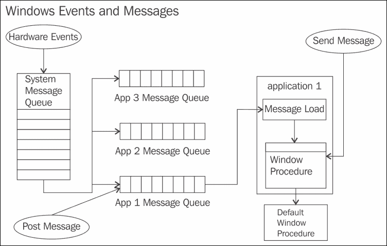

注意，根据 MSDN：

> “如果一个顶级窗口在几秒钟内停止响应消息，系统会认为该窗口没有响应。在这种情况下，系统会隐藏窗口，并用具有相同 Z 轴顺序、位置、大小和视觉属性的幽灵窗口替换它。这使用户可以移动它、调整它的大小，甚至关闭应用程序。然而，这些是唯一可用的操作，因为应用程序实际上没有响应。在调试模式下，系统不会生成幽灵窗口。”

如前所述，系统消息或用户消息都被排队，`wndproc`函数以先入先出的方式（有一些例外）处理它们。

实际上，你可以区分两种类型的信息：那些由用户应用程序发送的信息，通常进入 FIFO 队列，以及其他由操作系统发送的信息，这些信息可以有独特的优先级，因此可以在队列中排在其他信息之前（例如，错误信息）。

这些信息可以通过 Post Message 或 Send Message API 发送，具体取决于预期的行为，尽管我们不会深入探讨这些方面（因为它们远远超出了本章的范围），但我们将探讨如何使用这些 API 发送消息以及我们可以通过这种技术获得什么。

下一个图显示了系统中的不同线程如何发生这一切：

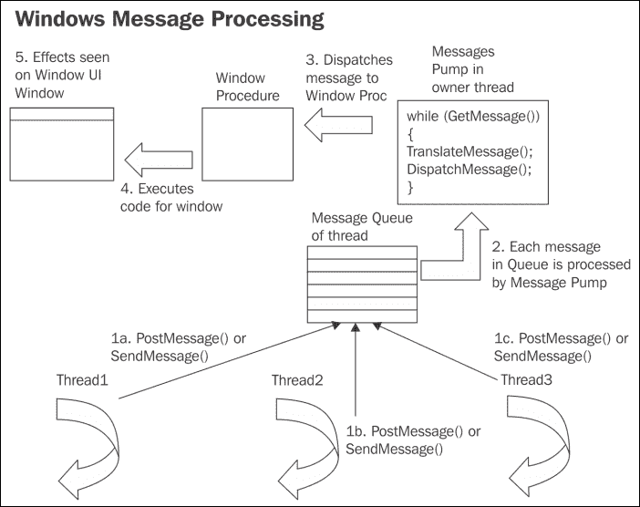

尽管我们的应用程序是受管理的，但它们的行为方式相同，并且我们可以从我们的代码中访问句柄，这使得我们可以捕获系统事件并随意更改行为。

在这些技术中，允许我们捕获系统或应用程序事件的技术被称为子类化。让我们解释它是如何工作的以及我们如何使用它。

# 子类化技术

一旦我们理解了之前的架构，就有很多方式可以使用它：避免控件或窗口的预定义行为，向现有的窗口组件添加特定元素，等等。

让我们尝试一个基本的例子。假设我们想要改变窗口对左键的响应方式。仅此而已。因此，我们有一个简单的 Windows Forms 应用程序，我们需要考虑我们需要哪些元素来编写这种行为。

首先，我们需要捕获针对左键的具体消息。然后，我们有与我们的窗口关联的`WndProc`重写，确定如果消息是我们需要的那个，应该做什么，最后，*始终*正确地将控制权返回给操作系统。

这个图显示了整个过程：

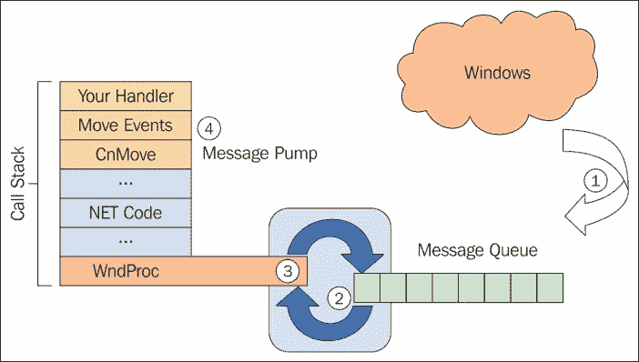

幸运的是，在 C#中，这很简单。只需看看我们添加到 IDE 创建的`main`默认窗口代码中的这段代码：

```cs
protected override void WndProc(ref Message m)
{
    // Captures messages relative to left mouse button
    if (m.Msg >= 513 && m.Msg <= 515)
    {
        MessageBox.Show("Processing message: " + m.Msg);
    }
    base.WndProc(ref m);
}
```

在这个片段中，有几件事情应该注意：首先，我们正在重写一个在我们代码中未定义的方法。实际上，`WndProc`是在`Form`类中定义的，正如你在类声明（在`Form`之上）中选择**转到定义**选项所看到的那样：

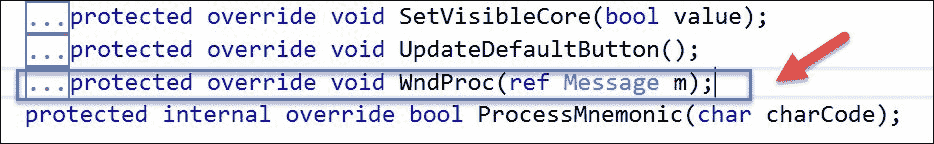

如果你启动应用程序，它应该运行得很好，但任何左键点击都会弹出一个消息框，指示处理的消息编号。无法通过左键点击它；只有右键点击才能正常工作！（你可能发现甚至关闭窗口都很困难，尽管你始终可以从 Visual Studio 关闭应用程序或右键点击标题区域）。

输出将类似于以下截图所示：

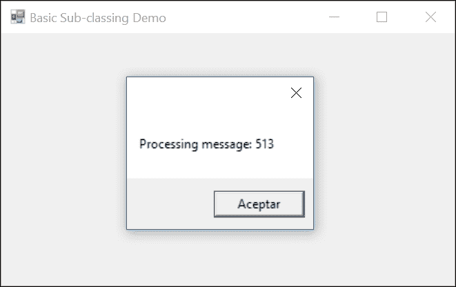

然而，你可能想知道数字 513 是如何定义的，以及我们可以在哪里找到有关它的信息。

这可能是讨论一些工具（本地或在线）的合适时机，你可以使用这些工具来查找不仅这些信息，还可以用于这些类型 .NET/OS 交互的任何其他系统相关数据。

# 一些有用的工具

如果我们处理定义，并且处理从 .NET 调用系统 API 的不同方式，有一个参考网站：[PInvoke.net](http://PInvoke.net)（可在 [`www.pinvoke.net/`](http://www.pinvoke.net/) 访问）。

你会发现大多数系统 API 都有详细的说明，解释它们的工作方式，它们应该如何在我们的代码中定义（无论是从 C# 还是 VB.NET），以及所有其他相关信息。

例如，知道所有窗口消息都是以 `WM_` 前缀定义的，我们可以在 **常量** 主题下展开它，以找到之前使用过的那个。

此外，我们还看到了消息的定义及其用途，以及与其相关的十六进制数，在列表的末尾，你会找到 C# 定义，其中很容易找到与左侧按钮相关联的链接，如下一张截图所示：

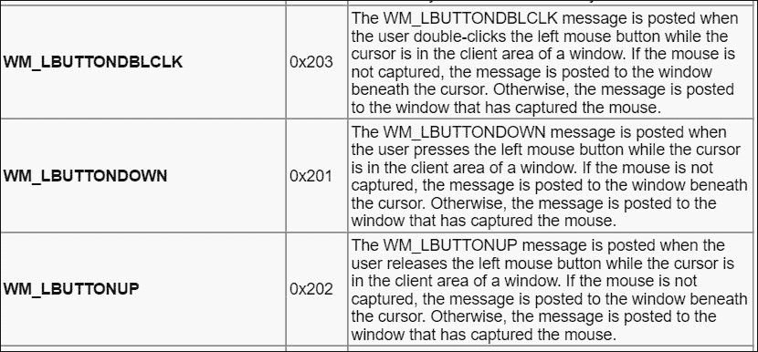

接下来，你可以看到 C# 代码中的定义，这些定义可以在程序中使用：

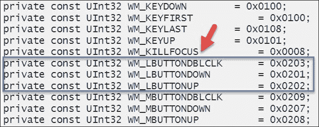

在代码中，正如你所知，我们可以使用十进制等效值（如我所做）或十六进制定义，结果相同。实际上，使用这些定义来生成更清晰、可读的代码比我在第一个演示中做的更可取。

如果，相反，你寻找一个函数或滚动到一些众所周知的系统 DLL，例如 `user32.dll`，你会看到它包含许多与 Windows 相关的函数，如 `FindWindowEx`。如果你展开这个函数，你会看到我们应该在我们的代码中使用的定义，以便调用该函数，正如我们将在下一节 *Platform/Invoke* 中所做的那样。

在下面一点，我们甚至可以找到一个如何在实际中（在这种情况下，这是为了获取窗口的水平滚动条的引用）使用该函数的示例。

还有另一个有趣的工具，由 Justin Van Patten 创建，在 **微软**：P/Invoke Interop Assistant，我们可以从 Codeplex 下载并安装，地址为 [`clrinterop.codeplex.com/releases/view/14120`](http://clrinterop.codeplex.com/releases/view/14120)。

下载并安装后，你将在 `Program Files (X86)/InteropSignatureToolkit` 目录下找到几个工具。其中两个是命令行工具，可以帮助你从其他库或 DLL（它们也可能是 TLBs）中定义函数的签名。

最后一个是 Windows 应用程序，它允许你执行我们在 PInvoke.net 网站上之前所做的操作，但仅从 Windows 应用程序中进行。它被称为 Windows 签名生成器 (`winsiggen.exe`)。

在这些工具中，你可以从系统中的任何位置导入 DLLs，或者甚至可以咨询之前的定义，而无需做更多的工作：通过选择 **SigImp 搜索** 标签，你可以过滤你正在寻找的内容，并查看列表中的定义。此外，通过选择你想要工作的定义，你将可以选择生成必要的 C# 或 VB.NET 代码，如下面的截图所示，其中我搜索了之前演示中使用的定义：

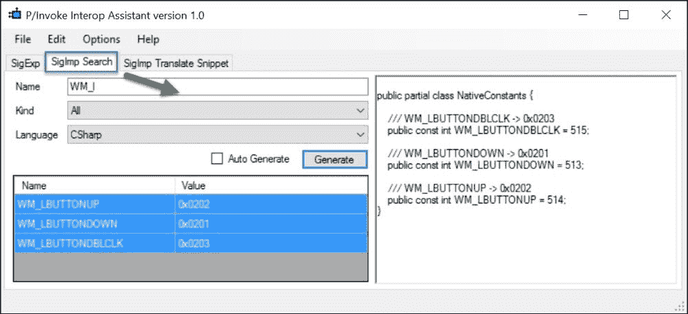

除了这个解决方案，还有一个选择，对于 Visual Studio 中的开发者来说非常有趣：在 **扩展和更新** 菜单下；如果你选择 **在线** 并过滤 **pinvoke** 或类似的内容，将有一个名为 **PInvoke.net for Visual Studio Extension** 的工具版本，最近由 Red Gate 管理。你应该能在下一个截图所示的条目中找到类似的内容：

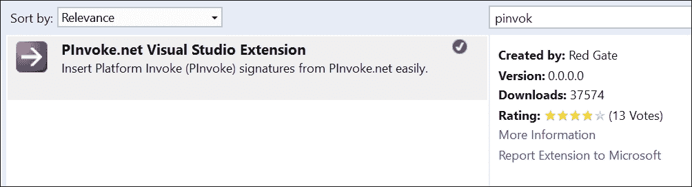

安装完成后（需要一点时间），在 Visual Studio 重启后，它将在 IDE 中创建一个新的菜单。

你将看到一个类似于上一个工具的窗口，但高度简化，并且可以选择搜索任何函数或模块，或者如果你需要查找定义，可以访问 [PInvoke.net](http://PInvoke.net) 网站。

# Platform/Invoke：从 .NET 调用操作系统

Platform/Invoke 允许程序员使用标准的（非托管）C/C++ DLLs。如果你需要访问广泛 Windows APIs（基本上包含了操作系统能执行的所有功能）中的任何函数，并且没有可用的包装器可以从 CLR 调用相同的功能，那么这就是你的选择。

从开发者的角度来看，通过 Platform/Invoke，我们理解 CLR 的一个特性，它允许程序与运行应用程序的系统中独特的功能进行交互，从而允许托管代码调用原生代码，反之亦然。

负责调用 API 的程序集将定义如何调用和访问原生代码，通过嵌入在其中的元数据，这通常需要属性装饰。这些属性定义在包含调用方法的类中，以指示编译器在托管和非托管两个世界之间进行封送处理（Marshaling）的正确方式。

理念是，如果我从托管代码中调用非托管函数，我应该指示目标上下文我传递的东西有多大，以及它们的方向。也就是说，如果我在请求数据或传递数据（或两者都是）。

但有一个缺点是存在许多异常，而且通常，即使代码编写正确，也总有一种更好的方法来做。这就是我们刚刚审查的工具帮助程序员处理这些情况的地方。

但首先让我们回顾一下平台调用的基础以及如何通过一个简单的示例从 C# 中使用它。

## 平台调用的过程

要实现平台调用，CLR 必须执行几个步骤：

+   定位包含函数的 DLL 并将其加载到内存中

+   定位函数的内存地址并将它的参数推入堆栈，按需封装数据

然而，以这种方式操作也有一些陷阱。例如，你不再有类型安全或垃圾回收的好处，并且在使用它们时必须小心。另一方面，巨大的优势是，系统提供的功能大量可用，而且我们谈论的是经过充分测试和优化的功能。

将外部 API 的定义插入到我们的代码中很容易。让我们通过一个例子来看看。想象一下，我们的应用程序使用系统的计算器（或任何其他系统工具），并且我们想确保在特定情况下，计算器位于给定的位置（例如屏幕的原点），并且我们还希望有能力从我们的程序中关闭计算器。

我们需要三个 API——`SetWindowPos`（用于更改计算器的位置）、`SendMessage`（用于关闭计算器）和 `FindWindow`——以便获取我们需要与其他两个一起使用的计算器句柄。

因此，我们在平台/调用助手中搜索这些函数以找到它们的定义，并使用插入按钮将翻译后的定义插入到我们的代码中。对于每个函数搜索，我们都应该看到一个类似这样的窗口：

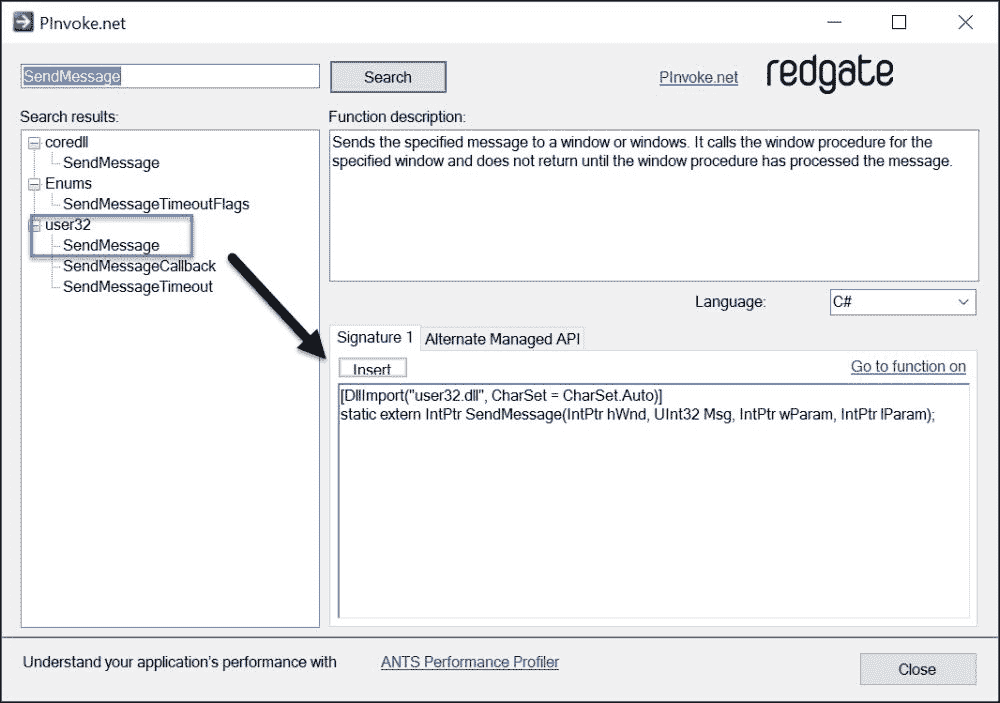

找到这三个函数后，我们应该有以下代码可用：

```cs
[DllImport("user32.dll", EntryPoint = "FindWindow", SetLastError = true)]
static extern IntPtr FindWindowByCaption(IntPtr ZeroOnly, string lpWindowName);
[DllImport("user32.dll", EntryPoint = "SetWindowPos")]
public static extern IntPtr SetWindowPos(IntPtr hWnd, int hWndInsertAfter, 
    int x, int Y, int cx, int cy, int wFlags);
[DllImport("user32.dll", CharSet = CharSet.Auto)]
static extern IntPtr SendMessage(IntPtr hWnd, UInt32 Msg, 
    IntPtr wParam, IntPtr lParam);
IntPtr calcHandler;
private const UInt32 WM_CLOSE = 0x0010;
```

这是我们的操作系统功能桥梁，我们可以从任何可访问的地方调用这些函数，就像它们是 .NET 函数一样。

对于这个演示，我将创建一个基本的 Windows Forms 应用程序，其中包含几个按钮，以便实现所需的功能。第一个按钮找到计算器的处理程序并将 `Calculator` 定位到最左上角的位置：

```cs
private void btnPosition_Click(object sender, EventArgs e)
{
  calcHandler =  FindWindowByCaption(IntPtr.Zero, "Calculator");
  SetWindowPos(calcHandler, 0, 0, 0, 0, 0, 0x0001 | 0x0040);
}
```

现在，在另一个按钮中，我们必须向 `Calculator` 发送一个消息来关闭它。同样，我们可以通过助手检查，知道消息标识符被称为 `WM_CLOSE`，并且我们将在搜索常量时找到它，向下到以 `WM_` 开头的那些。因此，我们插入这个定义并准备好调用第二个按钮，该按钮关闭计算器：

```cs
private const UInt32 WM_CLOSE = 0x0010;
private void btnClose_Click(object sender, EventArgs e)
{
  SendMessage(calcHandler, WM_CLOSE, IntPtr.Zero, IntPtr.Zero);
}
```

记住，当我们使用系统 API 时，一些参数必须被特别**封装**（转换）成目标类型。这就是为什么最后两个参数被表示为 `IntPrt.Zero`，这是 .NET 中此类型的正确定义。

自然，我们可以使用这种技术来关闭任何窗口，包括受管理的窗口，尽管在这种情况下，我们还有其他（更简单）的选项，包括与反射相关的可能性，如果持有组件是外部的。

此外，请注意，一些被称为*多平台*的解决方案是基于从托管代码调用本地代码的：在 Silverlight 中；运行时基于基于这些原则的**平台适配层**（**PAL**）。这允许你在不同的操作系统上调用本地函数。

这也适用于 Linux 和 MacOS 中的平台/调用，其中最成功的体现是 Xamarin 倡议（有关这些平台上的 Platform/Invoke 的更多信息，请参阅[`www.mono-project.com/docs/advanced/pinvoke/`](http://www.mono-project.com/docs/advanced/pinvoke/)）。

然而，正如我们将在最后看到的，新的.NET Core 在这方面是一个巨大的承诺，因为它被认为可以在任何平台和任何操作系统上运行。

然而，如果我们为 Windows 编程，有些情况下我们需要了解我们平台配置的特定数据。这就是**Windows 管理规范**（**WMI**）或其最近的替代品**Windows 管理基础设施**非常有用的地方，不仅对程序员，而且对 IT 人员也是如此。

### Windows 管理规范

官方文档以这种方式定义 WMI 技术：

> “Windows 管理规范（WMI）是 Windows 基于操作系统的管理数据和操作的基础设施。您可以使用 WMI 脚本或应用程序来自动化远程计算机上的管理任务，但 WMI 还向操作系统的其他部分和产品提供管理数据，例如，System Center Operations Manager，以前称为 Microsoft Operations Manager（**MOM**），或**Windows 远程管理**（**WinRM**）。”

然而，同样的文档还补充说：

> “WMI 完全由 Microsoft 支持；然而，最新的管理脚本和控制版本可通过 Windows **管理基础设施**（**MI**）获得。MI 与 WMI 的先前版本完全兼容，并提供了一系列功能和好处，使得设计和开发提供者和客户端比以往任何时候都更容易。有关更多信息，请参阅 Windows 管理基础设施（MI）。”

如果你想深入了解这些功能，可以在[`msdn.microsoft.com/en-us/library/dn313131(v=vs.85).aspx`](https://msdn.microsoft.com/en-us/library/dn313131(v=vs.85).aspx)找到更多关于配置 MI 的信息。

因此，使用 WMI，我们查询系统以获取其实施和安装的软件和硬件的详细信息。查询的原因是 WMI 将系统信息存储在**通用信息模型**（**CIM**）数据库中，这些数据库由系统持续存储和更新。

顺便说一下，CIM 不是 Windows 操作系统的专属。正如维基百科所述：

> “**通用信息模型**（**CIM**）是一个开放标准，它定义了 IT 环境中管理元素如何表示为一组公共对象及其之间的关系。
> 
> 分布式管理任务组维护 CIM，以允许独立于制造商或提供者的管理元素的一致管理。”

DMTF 频繁更新这些文档（有时一年两次）。

#### CIM 可搜索表

系统中有许多表被永久更新，我们可以搜索。完整的列表发布在 MSDN 上，你可以在[`msdn.microsoft.com/en-us/library/aa389273(v=vs.85).aspx`](https://msdn.microsoft.com/en-us/library/aa389273(v=vs.85).aspx)的*计算机系统硬件类*部分找到这些信息。

我将在这里总结一些对程序员最有用的搜索术语：

+   输入设备类

+   大容量存储类

+   主板、控制器和端口类

+   网络设备类

+   电源类

+   打印类

+   电信类

+   视频和显示器类

每个都包含一组独特的类，包含有关硬件和软件的各种信息。

在这次简要回顾中，我们只将使用经典的 WMI，查看在演示中可以向我们揭示的数据类型以及如何查询它。

虽然有几种方法可以访问.NET 程序员的这些信息，但.NET 通过`System.Management`命名空间提供了 WMI 功能的一部分，该命名空间包含用于搜索系统相关信息的类，例如`ManagementObjectSearcher`、`SelectQuery`、`ManagementObject`等。

对于一个简单的系统信息查询，我们首先创建一个`ManagementObjectSearcher`对象，该对象定义了搜索的焦点（一个信息提供者）。此对象应接收一个 SQL 字符串，指示我们想要搜索的表。

因此，在我们的演示中，我们将首先创建一个 Windows 窗体应用程序，包括几个按钮和一些 Listbox 控件来展示结果。

我们将首先编写一个通用查询来获取可用表的列表。负责此操作的按钮的代码如下：

```cs
ManagementObjectSearchermos = newManagementObjectSearcher
("SELECT * FROM meta_class WHERE __CLASS LIKE 'Win32_%'");
foreach (ManagementObject obj in mos.Get())
listBox1.Items.Add(obj["__CLASS"]);
```

如你所见，`meta_class`是一个包含可用于搜索的所有类的完整列表的 CIM 对象。请注意，查询可能需要一段时间，因为`ManagementObjectSearcher`必须遍历系统中所有可用并在 CIM 表中注册的信息。

你应该看到类似于下一张截图的输出：


之后，我们可以查询这些表以检索所需数据。在这个演示中，我们将使用几个表——**Win32_OperatingSystem**、**Win32_processor**、**Win32_bios**、**Win32_Environment**和**Win32_Share**——来查找有关运行机器和相关特性的信息。

它的工作方式始终相同：你创建`ManagementObjectSearcher`并遍历它，对搜索器返回的集合的每个实例调用`Get()`方法。因此，我们有以下代码：

```cs
private void btnQueryOS_Click(object sender, EventArgs e)
{
    listBox1.Items.Clear();
    listBox2.Items.Clear();

    // First, we get some information about the Operating System:
    // Name, Version, Manufacturer, Computer Name, and Windows Directory
    // We call Get() to retrieve the collection of objects and loop through it
    var osSearch = new ManagementObjectSearcher("SELECT * FROM Win32_OperatingSystem");
    listBox1.Items.Add("Operating System Info");
    listBox1.Items.Add("-----------------------------");
    foreach (ManagementObject osInfo in osSearch.Get())
    {
        listBox1.Items.Add("Name: " + osInfo["name"].ToString());
        listBox1.Items.Add("Version: " + osInfo["version"].ToString());
        listBox1.Items.Add("Manufacturer: " + osInfo["manufacturer"].ToString());
        listBox1.Items.Add("Computer name: " + osInfo["csname"].ToString());
        listBox1.Items.Add("Windows Directory: " + osInfo["windowsdirectory"].ToString());
    }

    // Now, some data about the processor and BIOS
    listBox2.Items.Add("Processor Info");
    listBox2.Items.Add("------------------");
    var ProcQuery = new SelectQuery("Win32_processor");
    ManagementObjectSearcher ProcSearch = new ManagementObjectSearcher(ProcQuery);
    foreach (ManagementObject ProcInfo in ProcSearch.Get())
    {
        listBox2.Items.Add("Processor: " + ProcInfo["caption"].ToString());
    }

    listBox2.Items.Add("BIOS Info");
    listBox2.Items.Add("-------------");
    var BiosQuery = new SelectQuery("Win32_bios");
    ManagementObjectSearcher BiosSearch = new ManagementObjectSearcher(BiosQuery);
    foreach (ManagementObject BiosInfo in BiosSearch.Get())
    {
        listBox2.Items.Add("Bios: " + BiosInfo["version"].ToString());
    }

    // An enumeration of Win32_Environment instances
    listBox2.Items.Add("Environment Instances");
    listBox2.Items.Add("-----------------------------");
    var envQuery = new SelectQuery("Win32_Environment");
    ManagementObjectSearcher envInstances = new ManagementObjectSearcher(envQuery);
    foreach (ManagementBaseObject envVar in envInstances.Get())
        listBox2.Items.Add(envVar["Name"] + " -- " + envVar["VariableValue"]);

    // Finally, a list of shared units
    listBox2.Items.Add("Shared Units");
    listBox2.Items.Add("------------------");
    var sharedQuery = new ManagementObjectSearcher("select * from win32_share");
    foreach (ManagementObject share in sharedQuery.Get())
    {
        listBox2.Items.Add("Share = " + share["Name"]);
    }
}
```

如果你运行演示，根据你的机器，你可能会得到一些不同的值，但信息的结构应该类似于下一张截图所示：

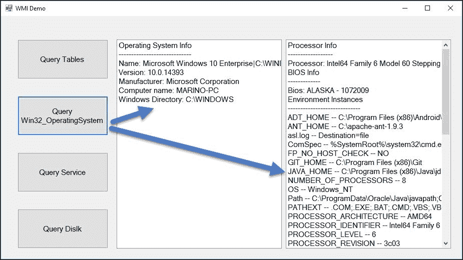

总结来说，WMI 提供了一种简单、受管理的访问我们机器上硬件和软件以及我们连接的网络中几乎所有相关数据的方法（只要查询具有所需的权限）。

关于安全方面的担忧，微软在 MSDN 上发布了一篇关于此主题的详尽文章：*维护 WMI 安全* ([`msdn.microsoft.com/en-us/library/aa392291(v=vs.85).aspx`](https://msdn.microsoft.com/en-us/library/aa392291(v=vs.85).aspx))，其中包含了关于在允许访问这些资源的同时维护安全性的所有关键信息和指南。

与`ManagementObject`类相关的功能还有很多。例如，你可以通过创建所需元素的新实例来获取有关进程或服务的信息，并使用该对象继承的方法。

例如，如果你想以编程方式知道哪些服务依赖于其他服务，你可以使用对象实例的`GetRelated`方法。让我们假设我们想知道与**LSM**（**本地会话管理器**）服务相关的服务。我们可以编写以下代码：

```cs
var mo = newManagementObject(@"Win32_service='LSM'");
foreach (var o in mo.GetRelated("Win32_Service", "Win32_DependentService",
null,null,"Antecedent","Dependent", false, null))
{
  listBox1.Items.Add(o["__PATH"]);
}
```

以这种方式，我们可以以完全程序化的方式获取这些（难以找到的）信息。这将帮助我们配置一些场景，其中我们的应用程序的某个过程需要某个服务的活跃存在（记住，我们也可以从代码中启动服务）。

此外，还有其他操作可用，例如停止、暂停或恢复指定的服务。在 LSM 服务的情况下，我们应该看到类似于以下截图所示的信息：

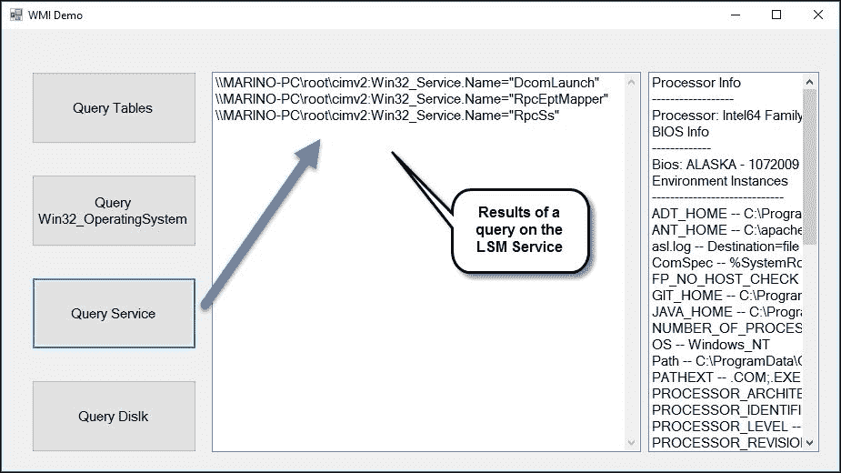

此外，还有更多通过`System.Management`相关类层次结构发现的信息。实际上，我们应该通过注册表或 Windows API 读取的几乎所有与系统相关的数据，都可以在这里以完全程序化的方式获得，无需复杂的方案。

唯一的缺点是文档非常长。因此，微软创建了一个名为 WMI Code Creator 的工具，该工具分析可用的信息，并为所有可能的场景生成代码（通常，此代码以 Windows Scripting Host 的形式表达），但大部分可以完美地转换为 C#。

此外，我们还拥有一个工具的优势，该工具将许多功能集成在一个用户界面中。

您可以从[`www.microsoft.com/en-gb/download/details.aspx%3Fid%3D8572`](https://www.microsoft.com/en-gb/download/details.aspx%3Fid%3D8572)下载它，得到一个包含可执行文件和源代码的 ZIP 文件，这对于在 WMI 中编码是一个宝贵的提示。

工具包括几个选项：

+   从 WMI 类查询数据

+   执行一个方法

+   接收一个事件

+   浏览此计算机上的命名空间

正如您在下一张屏幕截图中所见，这个工具在可能性和提供的信息方面都非常全面：

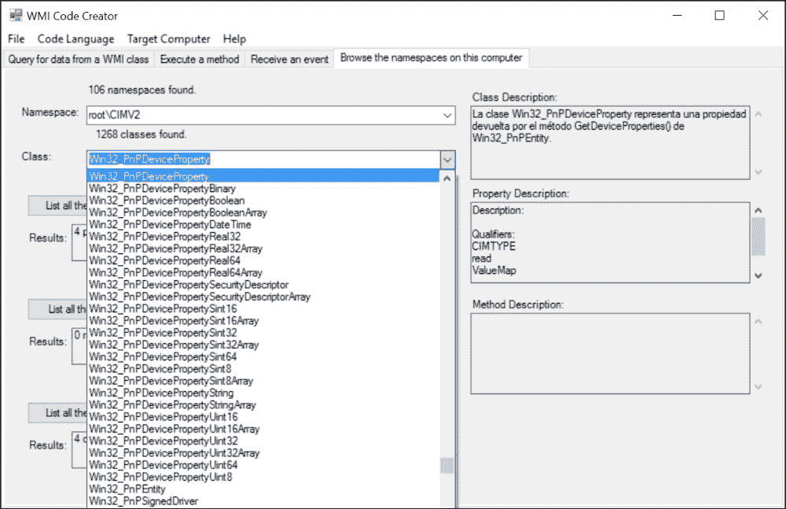

WMI 的另一个典型用途是在执行可能引发系统故障的操作之前检查硬件的状态，例如在复制可能超过磁盘配额的大量数据之前测试硬盘。

在这种情况下，代码很简单，它给我们提供了一个关于如何编写其他系统相关查询的想法。我们需要的只是类似这样的东西：

```cs
ManagementObject disk = new
ManagementObject("win32_logicaldisk.deviceid='c:'");
disk.Get();
var totalMb = long.Parse(disk["Size"].ToString()) / (1024 * 1024);
var freeMb = long.Parse(disk["FreeSpace"].ToString()) / (1024 * 1024);
listBox1.Items.Add("Logical Disk Size = " + totalMb + " Mb.");
listBox1.Items.Add("Logical Disk FreeSpace = " + freeMb + " Mb.");
```

因此，在添加一个新按钮并包含之前的代码以检查 `C:` 驱动的状态后，我们应该看到类似以下输出：

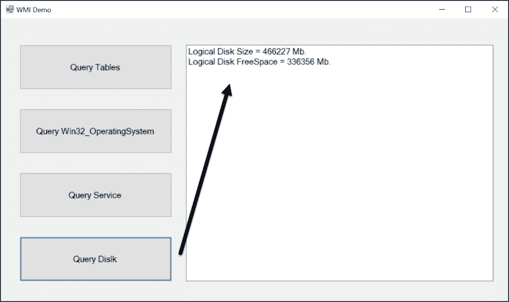

总结来说，我们已经看到了几种与操作系统交互的方式。我们可以分析哪些消息与特定的功能相关联，并捕获相关事件以更改、取消或修改默认行为。在这种情况下，通信是双向的。

当我们使用系统 API 通过 Platform/Invoke 调用功能时，也会发生这种情况（双向通信），它提供了无限的可能性。

### 注意

然而，官方微软建议，如果它们对 .NET 程序员可用，那么始终首选使用与 .NET 类关联的资源。

最后，Windows Management Instrumentation 及其变体 MI 提供了对其他难以触及的信息的访问，允许我们的应用程序根据操作系统的状态进行配置和更合适的行为。

# 并行编程

如您所记得，我们已经讨论了异步编程，当时我们处理的是在 .NET Framework 4.5 中出现的 `async/await` 关键字，作为避免性能瓶颈和提高应用程序整体响应性的解决方案。

并行编程在框架的 4.0 版本中就已经存在，并且与 **任务并行库**（**TPL**）程序相关联。但首先，让我们定义一下并行性的概念（至少根据维基百科的定义）：

> 并行计算是一种可以在同时执行多个操作的计算形式。它基于“分而治之”的原则，将任务分解成更小的任务，这些小任务随后并行解决。

这显然与硬件相关，我们应该意识到多处理器和多核心之间的区别。正如 Rodney Ringler 在他的优秀书籍《Packt Publishing》出版的 *C# Multithreading and Parallel Programming* 中所说：

> “多核 CPU 具有多个物理处理单元。本质上，它就像多个 CPU 一样工作。唯一的区别是，单个 CPU 的所有核心共享相同的内存缓存，而不是各自拥有自己的内存缓存。从多线程并行开发者的角度来看，多个 CPU 和 CPU 中的多个核心之间几乎没有区别。整个系统中 CPU 的核心总数是可以在并行调度和运行中的物理处理单元的数量，即真正可以并行执行的软件线程的数量。”

可以区分几种并行类型：在位级别、指令级别、数据并行和任务并行。这是在软件层面。

还有一种在硬件层面的并行性，其中可以暗示不同的架构，根据要解决的问题提供不同的解决方案（如果你对这个主题感兴趣，劳伦斯利弗莫尔国家实验室发布了一个特别详尽的解释，*并行计算简介*，可在[`computing.llnl.gov/tutorials/parallel_comp/`](https://computing.llnl.gov/tutorials/parallel_comp/)找到。当然，我们将坚持软件层面）。

并行性可以应用于计算的不同领域，例如蒙特卡洛算法、组合逻辑、图遍历和建模、动态规划、分支和界限方法、有限状态机等等。

从更实际的角度来看，这转化为解决与科学和工程广泛领域的相关问题：天文学、气象、高峰时段交通、板块构造、土木工程、金融、地球物理学、信息服务、电子学、生物学、咨询，以及在日常生活中的任何需要一定时间且可以通过这些技术改进的过程（如下载数据、I/O 操作、昂贵的查询等等）。

并行计算中遵循的过程在前面提到的源中用四个步骤进行了说明：

1.  将问题分解成可以同时解决的离散部分。

1.  每一部分都被进一步分解成一系列指令。

1.  每个部分的指令在不同的处理器上同时执行。

1.  采用了一种整体的控制/协调机制。

注意，计算问题必须具有以下性质：

+   可以分解成可以后来同时解决的工作的离散片段。

+   在任何时刻都必须能够执行多个指令

+   应该使用多个资源或计算机在更短的时间内解决，而不是使用单个资源。

结果的架构可以用以下图形方案来解释：

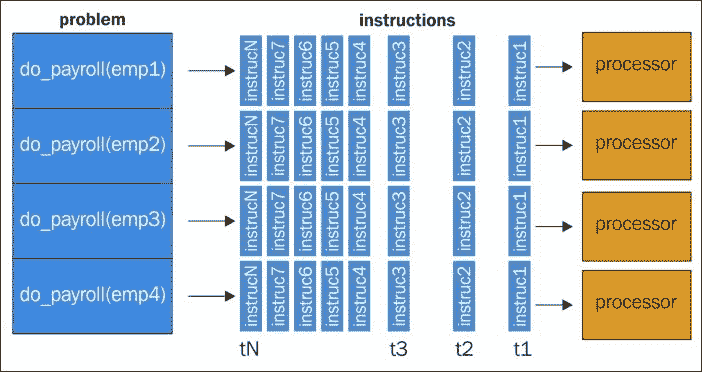

## 多线程与并行编程之间的区别

还重要的是要记住多线程和并行编程之间的区别。当我们在一个给定的进程中创建一个新的线程（如果你需要更多参考资料，请回顾第一章中的讨论），该线程由操作系统调度，并与一些 CPU 时间相关联。线程以异步方式执行代码：也就是说，它继续执行直到完成，此时它应该与主线程同步，以获得结果（我们之前也讨论过更新主线程）。

然而，与此同时，在我们的计算机中还有其他正在执行的应用（比如服务之类的）。这些应用也分配了相应的 CPU 时间；因此，如果我们的应用使用了多个线程，它也会得到更多的 CPU 时间，从而更快地获得结果，而不会阻塞 UI 线程。

此外，如果所有这些都在一个核心上执行，那么我们就不在谈论并行编程。如果没有超过一个核心，我们就不能谈论并行编程。

### 提示

我们常见的一个错误是当程序在虚拟机上执行时，代码使用了并行方法，因为在虚拟机上我们默认只使用一个核心。你必须配置虚拟机以使用超过一个核心，才能利用并行性。

此外，从日常程序员的视角来看，你可以主要将受并行编程影响的任务类型分为两大类：那些 CPU 密集型的和那些 I/O 密集型的（我们还可以增加另外两种，内存密集型，即相对于一个进程，可用的内存量是有限的，以及缓存密集型，这发生在进程受可用缓存的数量和速度限制时。想想一个处理比可用缓存空间更多的数据的任务）。

在第一种情况下，我们处理的是如果 CPU 更快，代码就会运行得更快的情况，这是 CPU 大部分时间都在使用 CPU 核心的情况（复杂计算是一个典型的例子）。

第二种场景（I/O 密集型）发生在如果 I/O 子系统也能更快地运行，某些事情会运行得更快的情况下。这种情况可能发生在不同的场景中：下载某些内容、访问磁盘驱动器或网络资源等。

前两种情况是最常见的，这也是 TPL（任务并行库）发挥作用的地方。任务并行库作为解决方案出现，用于在我们的应用程序中实现与第一种和第二种场景（CPU 密集型和 I/O 密集型）相关的并行编码。

从编程的角度来看，我们可以找到三种形式：并行 LINQ、Parallel 类和 Task 类。前两者主要用于 CPU 密集型过程，而 Task 类更适合（通常来说）I/O 密集型场景。

我们已经看到了与 Task 类一起工作的基础知识，它还允许你异步执行代码，在这里，我们将看到它如何执行取消（使用令牌）、继续、上下文同步等。

因此，让我们回顾这三种风味，看看一些典型的编码问题解决方案，在这些解决方案中，这些库有明显的改进。

# 并行 LINQ

如其名所示，并行 LINQ 是.NET 先前版本中提供的先前 LINQ 功能的扩展。

在第一个解决方案（并行 LINQ）中，Microsoft 专家 Stephen Toub 在*并行编程模式*（可在[`www.microsoft.com/en-us/download/details.aspx?id=19222`](https://www.microsoft.com/en-us/download/details.aspx?id=19222)找到）中解释了这种方法的理由：

> 在许多应用和算法中，大部分工作是通过循环控制结构完成的。毕竟，循环通常使应用程序能够反复执行一系列指令，将逻辑应用于离散实体，无论这些实体是整数值，例如在 for 循环的情况下，还是数据集，例如在 foreach 循环的情况下。
> 
> 许多语言都有内置的控制结构来处理这类循环，Microsoft Visual C#®和 Microsoft Visual Basic®就是其中之一，前者使用 for 和 foreach 关键字，后者使用 For 和 For Each 关键字。对于可能被认为是令人愉快的并行问题，循环的每个迭代要处理的实体可以并发执行：因此，我们需要一个机制来启用这种并行处理。

其中一种机制是`AsParallel()`方法，适用于暗示 LINQ 和泛型集合相关资源的表达式。让我们通过一个示例详细探讨这一点（在这种情况下，示例将链接到 CPU 密集型代码）。

我们的演示将有一个简单的用户界面，我们将计算 1 到 3,000,000 之间的素数。

我将首先创建一个素数计算算法，作为`int`类型的扩展方法，以下是其代码：

```cs
public static class BaseTypeExtensions
{
  public static bool IsPrime(this int n)
  {
    if (n <= 1) return false;
    if ((n & 1) == 0)
    {
      if (n == 2) return true;
      else return false;
    }
    for (int i = 3; (i * i) <= n; i += 2)
    {
      if ((n % i) == 0) return false;
    }
    return n != 1;
  }
}
```

现在，我们将使用三个按钮来比较不同的行为：无并行处理、有并行处理，以及使用有序结果的并行处理。

之前，我们定义了一些基本值：

```cs
Stopwatch watch = new Stopwatch();
IEnumerable <int> numbers = Enumerable.Range(1, 3000000);
string strLabel = "Time Elapsed: ";
```

这里的两个重要元素是`Stopwatch`，用于测量经过的时间，以及初始的数字集合，我们将使用`Enumerable`类的静态`Range`方法生成这些数字，从 1 到 3,000,000。

第一个按钮中的代码相当简单：

```cs
private void btnGeneratePrimes_Click(object sender, EventArgs e)
{
  watch.Restart();
  var query = numbers.Where(n => n.IsPrime());
  var primes = query.ToList();
  watch.Stop();
  label1.Text = strLabel + watch.ElapsedMilliseconds.ToString("0,000")+ " ms.";
  listBox1.DataSource = primes.ToList();
}
```

但是，在第二个按钮中，我们包括了之前提到的`AsParallel`结构。它与上一个类似，但我们指出，在获取任何结果之前，我们希望`numbers`集合以并行方式处理。

当你执行示例（经过的时间值将根据你使用的机器略有不同）时，这种方法比前一种方法快得多。

这意味着代码已经使用了机器上可用的所有核心来执行任务（紧挨着`AsParallel`的`where`方法）。

你有一种方法可以立即证明这一点：只需打开任务管理器并选择**性能**选项卡。在那里（如果你像我一样使用 Windows 10），你必须打开**资源监视器**来查看你机器上所有 CPU 的活动。

### 小贴士

为了确保你只关注与此演示相关的活动，请注意你可以选择输出进程来查看进程列表（在这种情况下，它将是**DEMOLINQ1.vshost.exe**）。

在运行时，差异变得明显：在第一个事件处理器中，似乎只有一个 CPU 在工作。如果你使用并行方法做这件事，你会看到有活动（如果不是以某种其他方式配置，可能是在所有 CPU 上）。

第三种选项也是如此，(关于它的更多内容很快就会介绍)，它使用了`AsOrdered()`子句。在我的机器（八个核心）上，结果窗口显示以下输出：

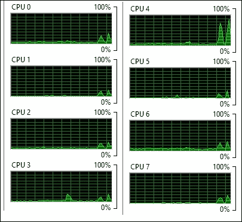

因此，我们实际上是在使用并行性，只是在我们的代码中添加了一个非常简单的功能！结果之间的差异变得明显（作为一个平均值，它大约是同步选项的三分之一）。

但我们仍然有问题。如果你查看第二个 Listbox 控制器的输出，在某个时候，你会看到列表没有排序，就像第一种情况一样。这是正常的，因为我们正在使用多个核心来运行结果，并且代码按照从八个核心接收到的顺序添加这些结果（在我的情况下）。

此顺序将根据核心数量、速度和其他难以预见因素而变化。因此，如果我们确实需要按顺序排列的结果，就像第一种情况一样，我们可以使用紧挨着`AsParallel()`指示的`AsOrdered()`方法。

以这种方式，生成的代码与第二种方法几乎相同，但现在结果是排序的，只是有一个（通常可以忽略不计）的延迟。

在下一张屏幕截图中，我正在将数字移动到**18973**这个质数，只是为了展示 Listboxes 填充的不同方式：

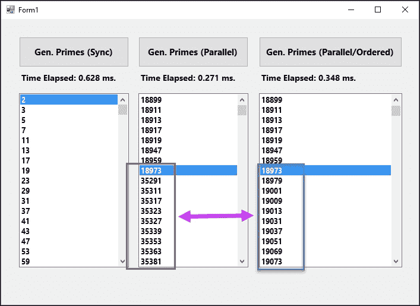

如果没有其他进程消耗 CPU，这些方法的连续执行将提供略微不同的结果，但变化将是微小的（实际上，有时你会看到`AsOrdered()`方法似乎比非排序的运行得更快，但这只是因为 CPU 活动）。

通常，如果你需要真正评估执行时间，你应该多次进行基准测试并改变一些初始条件。

## 处理其他问题

处理其他问题似乎是一种使用我们机器上所有可用资源的极好方式，但其他考虑可能使我们修改此代码。例如，如果我们的应用程序应在压力条件下正确运行，或者我们应该尊重其他应用程序的可能执行，并且要并行化的进程比这个重得多，那么使用称为并行化程度的特性可能很明智。

使用此特性，我们可以通过代码设置应用程序中要使用的核心数，其余的留给其他机器的应用程序和服务。

我们可以使用此代码在另一个按钮中包含此功能，这次将只使用有限数量的核心。但我们是如何确定核心数的呢？一个合理的解决方案是只使用系统可用的核心数的一半，另一半保持空闲。

幸运的是，有一种简单的方法可以找到这个数字（无需使用平台/调用、注册表值或 WMI）：`Environment`类具有静态属性，允许直接访问某些有用的值：在这种情况下，`ProcessorCount`属性返回核心数。因此，我们可以编写以下代码（这里只显示修改后的行）：

```cs
var query = numbers.AsParallel().AsOrdered()
.WithDegreeOfParallelism(Environment.ProcessorCount/2)
.Where(n => n.IsPrime());
```

在这个例子中，在我的机器上，我将只使用四个核心，这应该会显示出性能的提升，尽管不如使用所有核心时那么明显（我已经将数字集合改为 5,000.000，以便更好地欣赏这些值。请参考截图）：


## 取消执行

在我们的代码中，我们还应该考虑另一种情况，即用户出于任何原因希望在某个时刻取消进程。

如本节前面所述，此问题的解决方案是取消功能。它使用`token`执行，你在其定义中将它传递给进程，并且可以稍后用于强制取消（以及随后进程的终止）。

为了代码简洁，我们将使用一个技巧：再次扩展`int`类型，使其接受此令牌功能。我们可以编写简单的扩展代码，如下所示：

```cs
public static bool IsPrime(this int n, Cancellation TokenSource cs)
{
  if (n == 1000) cs.Cancel();
  return IsPrime(n);
}
```

正如你所见，我们现在有一个`IsPrime`的重载，它仅在`n`与`1000`不同时调用基本实现。当我们达到第 1000 个整数时，`CancellationTokenSource`实例的`Cancel`方法被调用。

这种行为取决于此类可能的先前配置值。如图所示，几个值允许我们操作并获取相关信息，例如是否可以真正取消，是否已请求取消，甚至是一个低级值`WaitHandle`，当令牌被取消时发出信号。

这个 `WaitHandle` 属性是另一个对象，它提供了对这个线程的本地操作系统句柄的访问权限，并具有属性和方法来释放当前 `WaitHandle` 属性（`Close` 方法）所持有的所有资源，或者阻塞当前线程，直到 `WaitHandle` 接收到信号：

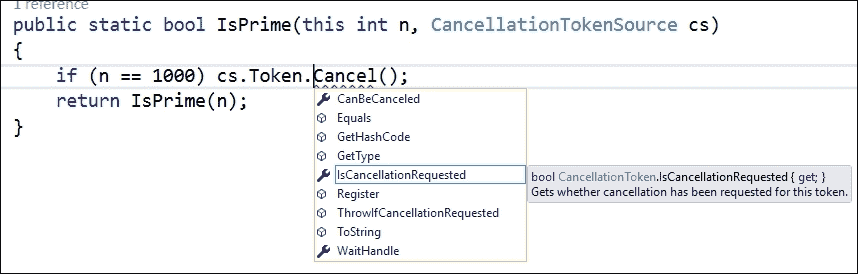

显然，在这种情况下，过程要复杂一些，因为我们需要捕获令牌抛出的异常并相应地处理：

```cs
private void btnPrimesWithCancel_Click(object sender, EventArgs e)
{
  List<int> primes;
  using (var cs = newCancellationTokenSource())
  {
    watch.Restart();
    var query = numbers.AsParallel().AsOrdered()
    .WithCancellation(cs.Token)
    .WithDegreeOfParallelism(Environment.ProcessorCount / 2)
    .Where(n => n.IsPrime(cs));
    try
    {
      primes = query.ToList();
    }
    catch (OperationCanceledException oc)
    {
      string msg1 = "Query cancelled.";
      string msg2 = "Cancel Requested: " +
      oc.CancellationToken.IsCancellationRequested.ToString();
      listBox5.Items.Add(msg1);
      listBox5.Items.Add(msg2);
    }
  }
  watch.Stop();
  lblCancel.Text = strLabel + watch.ElapsedMilliseconds.ToString("0,000") + " ms.";
}
```

注意查询中使用了 `WithCancellation(cs.Token)`，以及整个过程都嵌入在 `using` 结构中，以确保在过程结束后释放资源。

此外，而不是使用另一种机制，我们在相应的 Listbox 控件中添加了一个取消消息，指示令牌是否真的被取消。您可以在下一张截图（注意，所花费的时间明显少于其他情况）中看到这一点：

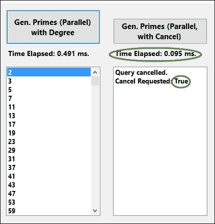

然而，在某些情况下，使用这种形式的并行可能不推荐或有限制，例如使用 `Take` 或 `SkipWhile` 等操作符，以及 `Select` 或 `ElementAt` 的索引版本。在其他情况下，产生的开销可能很大，例如使用 `Join`、`Union` 或 `GroupBy`。

# 并行类

并行类针对迭代进行了优化，其行为甚至比 PLINQ 更好——尤其是在循环中——尽管这种差异并不明显。然而，在某些情况下，对循环的微调可以显著提高用户体验。

该类有 `for` 和 `foreach` 方法的变体（也 `invoke`，但在实践中很少看到），当我们认为使用非并行版本可能会明显降低性能时，可以在循环中使用。

如果我们查看 `Parallel.For` 版本的定义，我们会看到它接收一对数字（`int` 或 `long`）来定义循环的范围，以及一个 `Action`，它关联到要执行的功能。

让我们用一个与之前类似但不完全相同的例子来测试这个方法。我们将使用相同的 `IsPrime` 算法，但这次，我们将在 `for` 循环中逐个检查结果。因此，我们从检查前 1000 个数字的简单循环开始，并将结果加载到 RichTextbox 中。

我们的非并行版本的初始代码如下：

```cs
private void btnStandardFor_Click(object sender, EventArgs e)
{
  rtbOutput.ResetText();
  watch.Start();
  for (int i = 1; i < 1000; i++)
  {
    if (i.IsPrime())
      rtbOutput.Text += string.Format("{0} is prime", i) + cr;
    else
      rtbOutput.Text += string.Format("{0} is NOT prime", i) + cr;
  }
  watch.Stop();
  label1.Text = "Elapsed Time: " + watch.ElapsedMilliseconds.ToString("0,000") + " ms."; ;
}
```

这里的问题是知道如何将之前的代码转换为 `Parallel.For`。现在，循环要执行的操作由一个 lambda 表达式指示，该表达式负责检查每个值。

然而，我们发现了一个额外的问题。由于这是并行操作，并且将创建新的线程，我们无法直接更新用户界面，否则会得到 `InvalidOperationException`。

对于这个问题，有几种解决方案，但最常用的解决方案之一是在 `SynchronizationContext` 对象中。正如 Joydip Kanjilal 在 *学习同步上下文、async 和 await*（参考 [`www.infoworld.com/article/2960463/application-development/my-two-cents-on-synchronizationcontext-async-and-await.html`](http://www.infoworld.com/article/2960463/application-development/my-two-cents-on-synchronizationcontext-async-and-await.html)）中所说的，`SynchronizationContext` 对象代表了一个抽象，它表示应用程序代码执行的位置，并允许您将任务排队到另一个上下文（每个线程都可以有自己的 `SynchronizatonContext` 对象）。`SynchronizationContext` 对象被添加到 `System.Threading` 命名空间中，以促进线程之间的通信。

我们 Parallel.For 的结果代码将看起来像这样：

```cs
// Previously, at class definition:
Stopwatch watch = newStopwatch();
string cr = Environment.NewLine;
SynchronizationContext context;

public Form1()
{
  InitializeComponent();
  //context = new SynchronizationContext();
  context = SynchronizationContext.Current;
}

private void btnParallelFor_Click(object sender, EventArgs e)
{
  rtbOutput.ResetText();
  watch.Restart();
  Parallel.For(1, 1000, (i) =>
  {
    if (i.IsPrime())
      context.Post(newSendOrPostCallback((x) =>
    {
      UpdateUI(string.Format("{0} is prime", i));
    }), null);
    else
      context.Post(newSendOrPostCallback((x) =>
    {
      UpdateUI(string.Format("{0} is NOT prime", i));
    }), null);
  });
  watch.Stop();
  label2.Text = "Elapsed Time: " + watch.ElapsedMilliseconds.ToString("0,000") + " ms.";
}
private void UpdateUI(string data)
{
  this.Invoke(newAction(() =>
  {
    rtbOutput.Text += data + cr;
  }));
}
```

采用这种方法，我们从正在执行线程（无论哪个）发送一个同步命令到主线程（UI 线程）。为此，我们在定义时首先缓存当前线程的 `SynchronizationContext` 对象，然后稍后使用它来在上下文中调用 `Post` 方法，这将调用一个新动作来更新用户界面。

注意，这个解决方案是这样编写的，以表明 `Parallel.For` 也可以用于（一次一个）操作用户界面的过程中。

我们可以通过下一个截图所示的相同素数的计算来欣赏两种方法之间的差异：

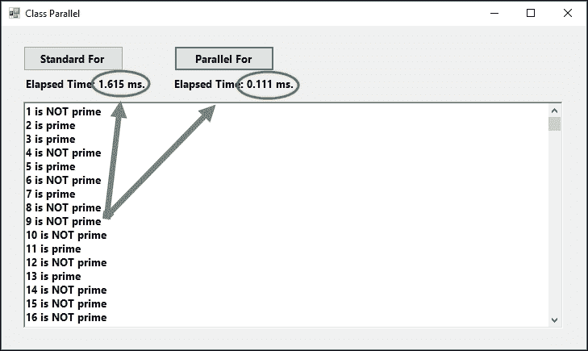

## Parallel.ForEach 版本

同样想法的另一个变体是 `Parallel.ForEach`。实际上它与它几乎相同，只是我们在定义中没有起始或结束数字。使用信息序列和唯一变量来迭代序列的每个元素会更好。

然而，我将改变这个演示中处理过程的类型，以便您可以进行比较并得出自己的结论。我将遍历一系列小的 `.png` 文件（图标 128 x 128），并为这些图标创建一个新的版本（透明），将修改后的新图标保存在另一个目录中。

在这种情况下，我们使用的是 I/O 密集型过程。慢速方法将链接到磁盘驱动器，而不是 CPU。您可以尝试的其他可能的 I/O 密集型过程包括从网站或任何社交网络下载文件或博客文章。

由于这里最重要的目标是节省时间，我们将依次处理文件并比较所花费的时间，将在窗口中显示输出。我将使用一个按钮来启动以下代码所示的过程（请注意，`Directory.GetFiles` 应指向一个包含一些 `.png` 文件的目录）：

```cs
Stopwatch watch = new Stopwatch();
string[] files = Directory.GetFiles(@"<Your Images Directory Goes Here>", "*.png");
string modDir = @"<Images Directory>/Modified";

public void ProcessImages()
{
  Directory.CreateDirectory(modDir);
  watch.Start();

  foreach (var file in files)
  {
    string filename = Path.GetFileName(file);
    var bitmap = ne0wBitmap(file);
    bitmap.MakeTransparent(Color.White);
    bitmap.Save(Path.Combine(modDir, filename));
  }
  watch.Stop();

  lblForEachStandard.Text += watch.ElapsedMilliseconds.ToString() + " ms.";
  watch.Restart();

Parallel.ForEach(files, (file) =>
  {
    string filename = Path.GetFileName(file);
    var bitmap = newBitmap(file);
    bitmap.MakeTransparent(Color.White);
    bitmap.Save(Path.Combine(modDir, "T_" + filename));
  });
  watch.Stop();
  lblParallel.Text += watch.ElapsedMilliseconds.ToString() + " ms.";
  MessageBox.Show("Finished");
}
```

如您所见，有两个循环。第二个循环也使用一个 `file` 变量来遍历 `Directory.GetFiles()` 调用检索到的文件集合，但 `Parallel.ForEach` 循环的第二个参数是一个 lambda 表达式，包含与第一个 `foreach` 方法完全相同的代码（好吧，有一点细微的区别，那就是我在保存之前将 `T_` 前缀附加到名称上）。

然而，即使在只有少量文件可用的情况下（大约一百个），处理时间的差异也是有意义的。

您可以在下一张截图中看到差异：

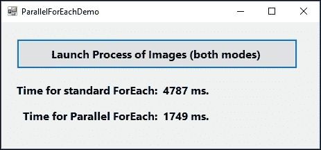

因此，在这两个示例中，无论是 CPU 密集型还是 IO 密集型，这种提升都是重要的，而且除了其他考虑因素之外（总是有一些），我们在这里有一个很好的解决方案，提供了这两种并行选项（记住，您应该根据要执行的演示更改程序入口点，在 `Program.cs` 文件中）。

# 任务并行

虽然所有这些都很重要，但有些情况下这种解决方案缺乏足够的灵活性，这就是为什么我们将 **任务并行库** 包含在可用的软件工具集中。

我们已经在 第三章，*C# 和 .NET 的高级概念* 和 第十二章，*性能* 中看到了 `Task` 对象的基础，但现在我们需要看看一些更高级的方面，这些方面使这个对象成为 .NET Framework 中并行编程中最有趣的对象之一。

## 线程间的通信

如您所知，任务完成后获得的结果可以是任何类型（包括泛型）。

当您创建一个新的 `Task<T>` 对象时，您继承了一些方法和属性，以方便数据操作和检索。例如，您有 `Id`、`IsCancelled`、`IsCompleted`、`IsFaulted` 和 `Status` 等属性来确定任务的状态，以及一个 `Result` 属性，它包含任务的返回值。

关于可用的方法，您有一个 `Wait` 方法来强制 `Task` 对象等待直到完成，还有一个非常有用的方法叫做 `ContinueWith`。使用这个方法，您可以在知道可以从 `Result` 属性获取结果的情况下，编写任务完成时要执行的操作。

因此，让我们想象一个类似于我们在早期演示中关于在目录中读取和操作文件的情况——只是这次，我们只是读取名称并使用一个 `Task` 对象。

在所有这些功能的基础上，我们可能会认为以下代码应该可以正确工作：

```cs
private void btnRead_Click(object sender, EventArgs e)
{
var getFiles = newTask<List<string>>(() =>  getListOfIconsAsync());
  getFiles.Start();
  getFiles.ContinueWith((f) => UpdateUI(getFiles.Result));
}
private List<string> getListOfIconsAsync()
{
  string[] files = Directory.GetFiles(filesPath, "*.png");
  return files.ToList();
}
private void UpdateUI(List<string> filenames)
{
  listBox1.Items.Clear();
  listBox1.DataSource = filenames;
}
```

如您所见，我们创建了一个新的 `Task<List<string>>` 对象实例；因此，我们可以利用其功能并调用 `ContinueWith` 来更新用户界面并显示结果。

然而，我们在`UpdateUI`方法中得到了`InvalidOperationException`，因为它仍然是任务（另一个线程）试图访问不同的线程。尽管你可以从下面的截图看到结果已经被正确获得，但这并不重要：


幸运的是，我们有一个与`TaskScheduler`对象相关的解决方案，它是这个工具集的一部分。我们只需要将另一个参数传递给`ContinueWith`方法，指明`FromCurrentSynchronizationContext`属性。

因此，我们将之前的调用修改如下：

```cs
getFiles.ContinueWith((f) => UpdateUI(getFiles.Result),
TaskScheduler.FromCurrentSynchronizationContext());
```

现在一切工作得非常完美，正如你在执行的最后一张截图中所看到的：

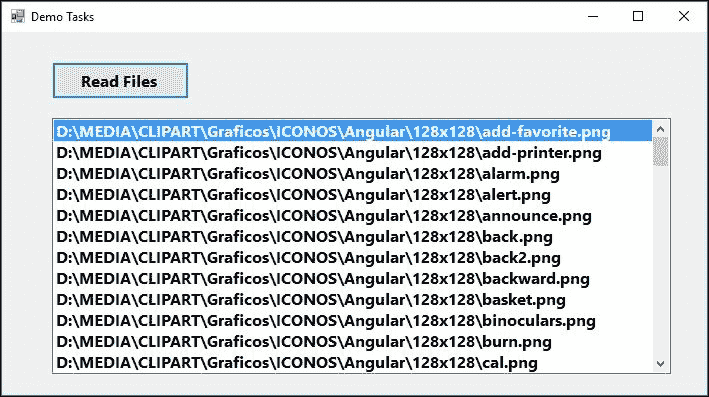

就这样！这是一种非常简单的从任务更新用户界面的形式，而不需要复杂的构造或其他特定对象。

还要注意，这个方法有高达 40 个重载，以便我们以许多不同的方式配置行为：

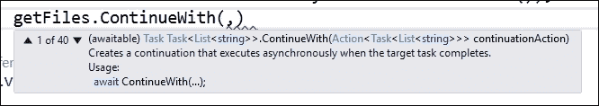

与`Task`对象相关的其他有趣的可能性与它的一些静态方法有关，特别是`WaitAll`、`WaitAny`、`WhenAll`和`WhenAny`。让我们看看它们的作用：

+   `WaitAll`：等待所有提供的`Task`对象完成执行（它接收一个`Task`对象的集合）

+   `WaitAny`：它与`WaitAll`具有相同的结构，但它等待第一个任务完成

+   `WhenAll`：创建一个新的任务，只有当所有提供的任务都完成后才会执行

+   `WhenAny`：与之前相同的结构，但它等待第一个任务完成

并且还有一个有趣的特性：`ContinueWhenAll`，它保证只有在所有作为参数传递的任务都完成后才会执行某些操作。

让我们通过一个例子来看看它是如何工作的。我们有三种图像处理算法：它们都接收一个`Bitmap`对象并返回另一个转换后的位图。你可以在演示代码中阅读这些算法（它们被命名为`BitmapInvertColors`、`MakeGrayscale`和`CorrectGamma`）。

当按钮被点击时，会创建四个任务：每个任务都调用负责转换位图并在不同的`pictureBox`控件中显示结果的函数。我们使用之前的`ContinueWith`方法来更新用户界面上的标签文本，以便我们知道它们的执行顺序。

代码如下：

```cs
private void btnProcessImages_Click(object sender, EventArgs e)
{
  lblMessage.Text = "Tasks finished:";
  var t1 = Task.Factory.StartNew(() => pictureBox1.Image =
    Properties.Resources.Hockney_2FIGURES);
  t1.ContinueWith((t) => lblMessage.Text += " t1-",
    TaskScheduler.FromCurrentSynchronizationContext());
  var t2 = Task.Factory.StartNew(() => pictureBox2.Image =
    BitmapInvertColors(Properties.Resources.Hockney_2FIGURES));
  t2.ContinueWith((t) => lblMessage.Text += " t2-",
    TaskScheduler.FromCurrentSynchronizationContext());
  var t3 = Task.Factory.StartNew(() => pictureBox3.Image =
    MakeGrayscale(Properties.Resources.Hockney_2FIGURES));
  t3.ContinueWith((t) => lblMessage.Text += " t3-",
    TaskScheduler.FromCurrentSynchronizationContext());
  var t4 = Task.Factory.StartNew(() => pictureBox4.Image =
    CorrectGamma(Properties.Resources.Hockney_2FIGURES, 2.5m));
  //var t6 = Task.Factory.StartNew(() => Loop());
  t4.ContinueWith((t) => lblMessage.Text += " t4-",
    TaskScheduler.FromCurrentSynchronizationContext());
  var t5 = Task.Factory.ContinueWhenAll(new[] { t1, t2, t3, t4 }, (t) =>
  {
    Thread.Sleep(50);
  });
  t5.ContinueWith((t) => lblMessage.Text += " –All finished",
    TaskScheduler.FromCurrentSynchronizationContext());
}
```

如果我们想让`All finished`标签更新最后一个任务，我们需要确保第五个任务作为序列中的最后一个执行（当然，如果我们不使用任务，它将作为第一个更新）。

如你在下一张截图中所见，第二、第三和第四个任务的顺序将是随机的，但第一个（因为它不做任何重工作；它只加载原始图像）将始终出现在序列的开头，而第五个将出现在最后：


还有其他一些有趣的功能，与我们在之前的并行演示中看到的取消功能类似。

要取消任务，我们将使用类似的程序——但在这个情况下，它更简单。我将使用控制台应用程序通过几个简单的方法来展示它：

```cs
static void Main(string[] args)
{
  Console.BackgroundColor = ConsoleColor.Gray;
  Console.WindowWidth = 39;
  Console.WriteLine("Operation started...");
  var cs = newCancellationTokenSource();
  var t = Task.Factory.StartNew(
    () => DoALongWork(cs)
  );
  Thread.Sleep(500);
  cs.Cancel();
  Console.Read();
}
private static void DoALongWork(CancellationTokenSource cs)
{
  try
  {
    for (int i = 0; i < 100; i++)
    {
      Thread.Sleep(10);
      cs.Token.ThrowIfCancellationRequested();
    }
  }
  catch (OperationCanceledException ex)
  {
    Console.WriteLine("Operation Cancelled. \n Cancellation requested: " + ex.CancellationToken.IsCancellationRequested);
  }
}
```

正如你所见，我们在一个 100 次迭代的循环中，对`DoALongWork`方法生成一个包含十分之一秒延迟的 Task。然而，在每次迭代中，我们都会检查`ThrowIfCancellationRequested`方法的值，这个方法属于在任务创建时之前生成的`CancellationTokenSource`方法，并将其传递给慢速方法。

在 500 毫秒后，在主线程中调用`cs.Cancel()`，线程执行停止，并在`catch`侧启动和恢复`Exception`，以便在控制台以消息的形式展示输出，显示是否真的请求了取消。

下一个截图显示了执行此代码时应看到的内容：

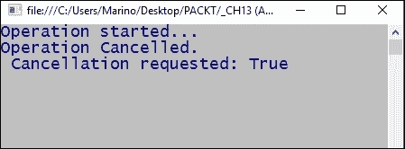

到目前为止，这只是一个关于 Task 并行库及其一些最有趣可能性的回顾。

我们将讨论这本书的结尾部分，现在关于.NET 的最新创新：所谓的 NET Core 1.0，它旨在在所有平台上执行，包括 Linux 和 MacOS。

# .NET Core 1.0

.NET Core 是 .NET Framework 的一个版本（最初版本于 2016 年夏季发布），标志着微软开发技术生态系统中的一次重大突破，其最大的承诺是能够跨平台执行：Windows、MacOS 和 Linux。

此外，.NET Core 是模块化的、开源的，并且为云做好了准备。它可以与应用程序本身一起部署，最小化安装问题。

虽然最初这个数字是连续的，但微软决定重新开始编号，强化了这样一个观点：这与经典版本相比是一个全新的概念，是一个更好的避免歧义的方法。对于那些已经了解初始版本的人来说，让我们记住以下等价关系（参考截图）：

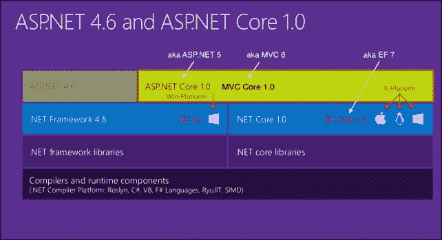

截图显示了新名称之间的等价性以及一些技术如何超越平台（正如在 ASP.NET Core 或 MVC Core 中发生的那样），甚至可以在经典平台（.NET Framework 4.6）上执行。

.NET Core 基于 CoreCLR，这是一个轻量级的运行时环境，提供基本服务。这包括自动内存管理、垃圾回收以及基本类型库。

与现在许多其他项目一样，.NET Core 是 .NET 基金会的一部分。

它还包括 CoreFx，这是一个模块化程序集的集合。根据你的需求，可以将这些程序集添加到你的项目中（记住，在.NET 4.x 中，我们总是必须提供整个 BCL）。现在，你只需选择你需要的程序集即可。

## 支持的环境列表

根据[C# Corner 的*.NET Core - Fork In The Road*](http://www.c-sharpcorner.com/article/net-core-fork-in-the-road/)，以下表格解释了不同平台上的可用性，尽管列表仍在不断增长：


.NET Core 的另一个目标是通过对一个独特的`project.json`文件进行项目统一，其中所有配置功能将独立于正在构建的项目类型出现（不再需要`app.config`、`web.config`等）。然而，在 Visual Studio 2017 中，`project.json`文件中声明的依赖项已经被移动到`.sln`文件中进行统一。

.NET Core 应该建立在四个部分之上，包括 Core FX、Core CLR、Core RT 和 Core CLI。让我们逐一快速查看这些部分。

### Core FX

Core FX 包含基础库的实现，包括经典命名空间：`System.Collections`、`System.IO`、`System.Xml`等。然而，它不包括`mscorlib`中的基类型，这些类型位于不同的仓库`CoreCLR`中。

您可以在 GitHub 上访问这些仓库：[`github.com/dotnet/corefx`](https://github.com/dotnet/corefx)。

### Core CLR

Core CLR 实际上是.NET 虚拟机（运行时）。它包括 RyuJIT（或 CLR JIT），这是一个新一代 64 位编译器，.NET 垃圾回收器，之前提到的`mscorlib.dll`以及一系列库。

仓库可在[`github.com/dotnet/coreclr`](https://github.com/dotnet/coreclr)找到，你也会在那里找到所有相关文档。

它与你的应用程序一起部署（因此不再需要`.NET Framework x.x 版本`消息），并允许并行执行；因此，它保证了其他现有应用程序的完整性。

### Core RT

Core RT 是 Core CLR 的替代品，针对**AoT**（**提前编译**）场景进行了优化。它可在[`github.com/dotnet/corert`](https://github.com/dotnet/corert)的仓库中找到。

显然，你可能想知道这个术语（AoT）以及与我们一直使用的 JIT 编译相比的区别。

让我们记住，JIT 编译器负责将 MSIL 代码转换为原生代码。这是在运行时完成的；因此，每次第一次调用方法时，它都会被编译并执行。

以这种方式，应用程序可以在安装了运行时的不同 CPU 和 OS 上执行，但缺点是这是一个耗时且会影响应用程序性能的过程。

另一方面，AoT 编译器也将 MSIL 编译成原生代码，但维基百科说，它们这样做是为了减少运行时开销，将结果二进制文件编译成原生（系统依赖）机器代码，目的是原生执行。

维基百科还补充说：

> “在大多数情况下，对于完全 AOT 编译的程序和库，可以删除相当一部分运行时环境，从而节省磁盘空间、内存、电池和启动时间（没有 JIT 预热阶段）等。因此，它对于嵌入式或移动设备非常有用。”

如 RobJb 在 StackOverflow 中指出：

> “AOT 编译器可以花费尽可能多的时间进行优化，而 JIT 编译受限于时间要求（以保持响应性）和客户端机器的资源。因此，AOT 编译器可以执行在 JIT 中过于昂贵的复杂优化。”

总结来说，CoreRT 的重点是代码优化和转换为特定的本地平台。生成的可执行文件将更大，但它包含了应用程序、所有依赖项以及 CoreRT。

使用 CoreRT 的应用程序执行速度更快，并且可以使用本地编译器的适当优化，从而提高性能和代码质量。

### Core CLI

Core CLI 是一个命令行界面，独立于其他库，提供了一种简单的方法来安装一个基本框架，我们可以在几步之内测试任何平台上的 .NET Core 代码。

安装很简单：Windows 中的 MSI 类型文件、MacOS 中的 PKG 类型文件或 Linux 中的 `apt-get`；或者甚至可以使用 `curl` 脚本。

此外，已经创建了一个基于 .NET Core 1.0 的 ASP.NET 重构，我们稍后会看到。项目文件将是一个 `.xproj` 文件，不同版本或语言之间没有差异。

安装完成后，你可以发出如 `dotnetbuild` 这样的命令，例如，并生成结果并查看执行情况。需要注意的是，Core CLI 本身是使用 Core RT 制作的；因此，它也使用了优化的本地技术。

## .NET Core 安装

自从第一个候选版本发布以来，.NET Core 的安装已经发生了变化，现在之前的 GitHub 位置将引导我们到 [`www.microsoft.com/net/core`](https://www.microsoft.com/net/core) 网站，在那里我们可以找到在四个不同环境中下载 .NET Core 的说明：Windows、Linux、MacOS 和 Docker。

### 注意

此外，请注意，要从 Visual Studio 2015 中使用 .NET Core，你需要安装升级 3。它将出现在 **更新** 部分的 **扩展和更新** 选项下。

除了这个安装之外，如果你额外安装了 NET Core 1.0.0 – VS 2015 Tooling，你可以在同一页面上使用 .NET Core 在 Visual Studio 2015 及更高版本中。这需要几分钟时间，并会要求确认（参考截图）：

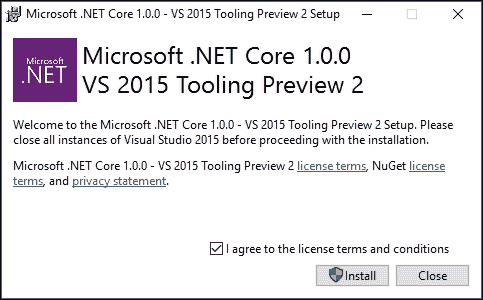

注意，在撰写本文时，VS 2015 Tooling 以预览版的形式提供，你阅读本文时可能已经是最终版本。此外，你可以从前面提到的同一页面上安装 Core CLI，或者直接访问 [`github.com/dotnet/cli`](https://github.com/dotnet/cli) 页面。

安装完成后，如果我们打开 Visual Studio 并选择 **新建项目**，我们会看到一个名为 **NET Core** 的新部分，提供三种应用程序类型：类库、控制台应用程序和 ASP.NET Core 网络应用程序：

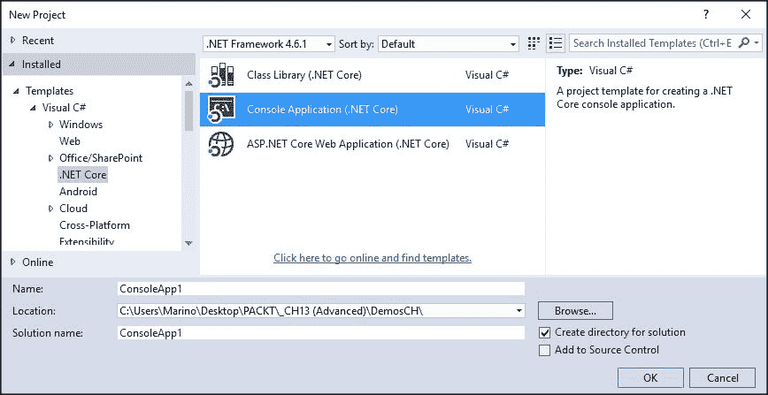

如你所想，在第一种情况下，我们可以创建一个 DLL 供其他项目使用，而最后两个选项（对于这个 .NET Core 的初始版本）是有意义的。

如果我们查看使用 **控制台应用程序** 选项创建的文件，解决方案资源管理器将显示一个熟悉的结构，尽管有一些不同。

首先，我们看到存在两个主要目录：一个用于解决方案（包括一个 `global.json` 文件）和另一个名为 `src` 的目录，其中包含我们应用程序的其余资产。

`global.json` 文件包含在编译时解决项目依赖项时应搜索的文件夹。构建系统将只搜索顶级子文件夹。

默认情况下，以下内容被包含：

```cs
{
  "projects": [ "src", "test" ],
  "sdk": {
    "version": "1.0.0-preview2-003121"
  }
}
```

这定义了我们解决方案中的两个项目：标准项目和另一个用于测试的项目。除此之外，`sdk` 键指示要使用的版本（`1.0.0-preview-003121`），我们可以随意添加或更改它。

### 注意

Visual Studio 2015 工具的一个非常有趣的方面是处理配置文件 `.json` 时，如果我们更改任何值，相应的引用将会自动在线搜索并下载到我们的项目中。

有其他选项可用，例如要使用的架构（x64 / x86）或目标运行时，如下一张截图所示：

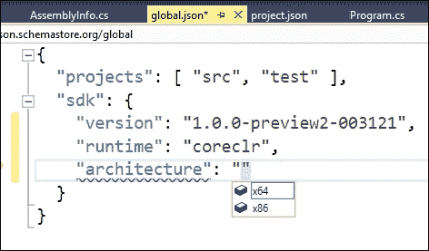

在 `src` 目录中，可以找到典型的控制台结构，只是所有包含在 **引用** 部分的引用都指向 **Microsoft.NETCore.App (1.0.0)**，并包含一个长列表的组件，所有这些组件都按照依赖关系的层次结构排列。

在这些项目中，主 `Program.cs` 文件的特点只是通常的（没有更改），对于 `AssemblyInfo.cs` 也是如此（尽管在其他平台上一些值会被忽略）。

然而，没有 `app.config` 文件。这个文件已经被另一个 `.json` 文件 `project.json` 替换，从现在起它将负责定义应用程序的配置（记住，在 Visual Studio 2017 中，`.sln` 文件用于声明依赖项）。

而且，就像 `global.json` 文件一样，编辑器识别分配给键的值，并在这里也提供智能感知，提供有关可配置的可能值的有趣提示（下一张截图包括初始引用列表和 `project.json` 文件中的智能感知操作）：

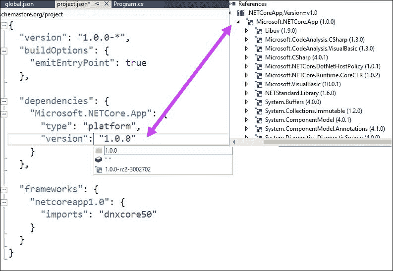

现在，我将使用一个简单的代码片段来探索一些常见命名空间在.NET Core 中的实现方式。在这种情况下，我们有三个与应用程序位于同一目录中的文本文件（当然，可以是任何目录），我们将搜索它们，读取它们的内容，并在控制台显示。

因此，我们在`program.cs`文件中有一些非常简单的代码，它作为应用程序的入口点：

```cs
staticstring pathImages = @"<Your Path to files>;
staticvoid Main(string[] args)
{
  Console.WriteLine(" Largest number of Rows: " + Console.LargestWindowHeight);
  Console.WriteLine(" Largest number of Columns: " + Console.LargestWindowWidth);
  Console.WriteLine(" ------------------------------\n");
  ReadFiles(pathImages);
  Console.ReadLine();
}

privatestaticvoid ReadFiles(string path)
{
  DirectoryInfo di = newDirectoryInfo(path);
  var files = di.EnumerateFiles("*.txt",
  SearchOption.TopDirectoryOnly).ToArray();
  foreach (var item in files)
  {
    Console.WriteLine(" "+ File.ReadAllText(item.FullName));
  }
}
```

我们可以像往常一样编译程序，在运行时，我们应该看到输出，只在工作在.NET Core 基础设施上（参考下一张截图）：

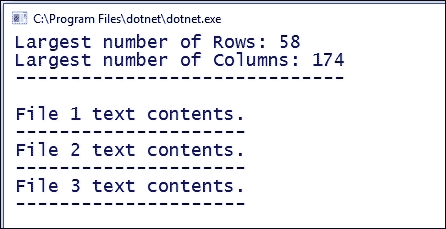

如你所见，使用的功能、代码、库和命名空间与我们在标准控制台应用程序中使用的完全相同——只是现在，我们使用的是.NET Core 1.0 库和架构。

然而，看一下代码（和输出）可能会引起你的注意，因为我们在输出窗口中看到的可执行文件名是`dotnet.exe`而不是我们给解决方案起的名字`NETCoreConsoleApp1`。

这种情况的原因与这种模型相关的复杂性有关。该应用程序被认为可以在不同的平台上执行。默认选项允许部署架构根据目标确定配置 JIT 编译器的最佳方式。这就是为什么执行是由 dotnet 运行时（命名为`dotnet.exe`）来完成的。

在.NET Core 中，定义了两种类型的应用程序：可移植的和自包含的。正如官方文档所述：

> “可移植应用程序是.NET Core 的默认类型。为了使它们能够运行，需要在目标机器上安装.NET Core。对你作为开发者来说，这意味着你的应用程序可以在.NET Core 的不同安装之间移植。”
> 
> 自包含应用程序不依赖于任何共享组件存在于你想要部署应用程序的机器上。正如其名所示，这意味着整个依赖项封闭，包括运行时，都与应用程序打包在一起。这使得它更大，但同时也使得它能够在任何.NET Core 支持的平台上运行，只要有正确的本地依赖项，无论是否安装了.NET Core。这使得将其部署到目标机器变得容易得多，因为你只需部署你的应用程序。”

我们正在使用的默认配置是可移植的。这个配置在哪里设置的？在`project.json`依赖项部分，你会看到有一个`"type":"Platform"`条目。这就是指示这种执行模型的原因。

实际上，生成的程序集是一个 DLL，正如你在编译后查看`bin/debug`目录时可以看到的。在我们的例子中，这个 DLL 只有 6 Kb 长。

那么，其他选择呢？好吧，如果你知道你将要针对某个平台，你可以在`project.json`文件中删除之前提到的条目（即第一个）。其次，你应该保留`Microsoft.NET Core.App`依赖项，因为它将检索所有其他所需组件。最后，你需要在（运行时节点中）指出你想要使用的那些。

因此，我将`project.json`文件更改为以下配置：

```cs
{
  "version": "1.0.0-*",
  "buildOptions": {
    "emitEntryPoint": true
  },

  "dependencies": {
    "Microsoft.NETCore.App": {
      "version": "1.0.0"
    }
  },
  "runtimes": {
    "win10-x64": {}
  },
  "frameworks": {
    "netcoreapp1.0": {
      "imports": "dnxcore50"
    }
  }
}
```

现在，编译器的行为有所不同：它生成一个新的文件夹（依赖于调试文件夹），包含一个真正的本地可执行文件，其中包含在那种类型的任何平台上运行所需的所有元素（在我们的演示中是`win10-x64`）。

编译后，你会看到出现新文件，其中之一现在将是一个可执行文件。如果你在资源管理器中移动到那个文件夹，你会看到一个新的名为`NETCoreConsoleApp1.exe`的文件，这是一个独立的可执行文件。此外，这个新文件比 DLL 大，因为它包含了所有需求（参见图表）：

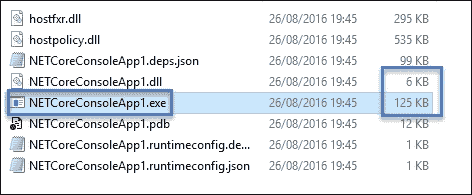

### 注意

在[`docs.microsoft.com/es-es/dotnet/articles/core/tools/project-json`](https://docs.microsoft.com/es-es/dotnet/articles/core/tools/project-json)中，对所有可能的配置选项进行了详尽的解释。

## CLI 界面

如我们之前提到的，现在可供开发此类应用程序的另一种选择是 Core CLI 的独立安装或之前安装的（`DotNetCore.1.0.0 - VS2015Tools.Preview2.0.1`文件）提供的命令行界面。

根据目标平台，提供了几个预配置的命令行窗口，统称为跨工具命令提示符。只需打开与你的目标平台相对应的一个，然后按照以下步骤进行操作。

你可以使用微软准备好的初始基本演示模式作为此工具的启动。在打开命令提示符后，创建一个新目录，该目录将作为新项目的根目录。在我的例子中，我在新的`C:\dev\hello_world`目录中这样做（避免使用`C:\`根目录可能引起的一些安全问题）。

到目前为止，你只需输入`dotnet –help`即可请求帮助，如下面的截图所示：

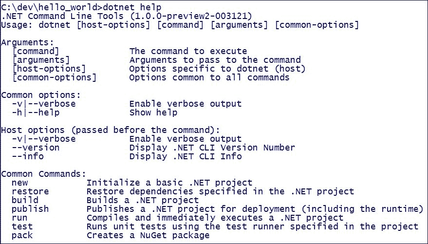

要在此位置创建一个新项目，请输入`dotnet new`。Core CLI 将下载所有必需的组件到你的目录中，包括一个基本的应用程序模板，其中包含一个`program.cs`文件，它包含经典的`Hello World`控制台应用程序，以及默认的`project.json`文件。

从这个点开始，你也可以使用 Visual Studio Code（任何平台，记住）打开项目并做出所需更改。点（`.`）表示 IDE 使用当前目录作为解决方案目录。

下一步是调用 `dotnet restore`。结果是 NuGet 被调用以恢复 `project.json` 中定义的树形依赖关系，并创建一个名为 `project.lock.json` 的此文件变体，如果你想要能够编译和运行（如果你打开此文件，你会看到它相当大）。

官方文档将此文件定义为：

> “一个持久且完整的 NuGet 依赖关系图集和描述应用程序的其他信息的集合。此文件由其他工具读取，例如 dotnet build 和 dotnet run，使它们能够使用正确的 NuGet 依赖关系集和绑定解析来处理源代码。”

从这里，有几个选项可供选择。你可以启动 `dotnet build` 命令，这将构建应用程序并生成类似于我们在 Visual Studio 中看到的目录结构。它不会运行；它只会生成结果文件。

替代选项是调用 `dotnet run`。使用此命令，将调用 `build` 选项，然后启动执行；因此，你应该会看到类似以下内容：


当然，查看生成的文件是一个好习惯，这些文件将位于调试文件的一个子目录中，就像我们的 Visual Studio 应用程序一样：

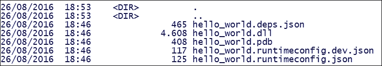

如果你好奇，可以将 `project.json` 文件更改为生成独立的可执行文件，就像我们之前做的那样，结果应该是等效的。

好吧，到目前为止，我们已经看到了 .NET Core 1.0 的介绍，但这不是 .NET Core 支持的唯一开发模型。让我们看看——非常有趣的——ASP.NET Core 1.0。

# ASP.NET Core 1.0

适用于使用 .NET Core 的 ASP.NET 应用程序所采用的模型完全基于之前的 MVC 模型。但它是从零开始构建的，目标是跨平台执行，消除一些功能（不再必要），以及将之前的 MVC 与 Web API 变体统一；因此，它们使用相同的控制器类型。

此外，在开发过程中，代码不需要在执行前编译。你可以即时更改代码，Roselyn 服务会负责更新；因此，你只需刷新页面即可看到更改。

如果我们查看新的模板列表，在“Web”开发部分安装 .NET Core 后，我们将获得一个经典的 ASP.NET 版本，其中包含你已知的典型模板（包括 Web 表单应用程序）和两个新选项：ASP.Core Web Application (.NET Core) 和 ASP.NET Core Web Application (.NET Framework)（回顾 *.NET Core 1.0* 部分开头的第一张图像以记住架构）。

## 新增功能

在这个版本的 ASP.NET Core 中出现了许多新事物。首先，有一个新的托管模型，因为 ASP.NET 已经完全从托管应用程序的 Web 服务器环境中解耦。它支持 IIS 版本，也支持通过 Kestrel（跨平台、极致优化、基于 LibUv，这是 Node.js 使用的相同组件）和 WebListener HTTP（仅限 Windows）服务器进行自托管。

我们还依赖于新一代的中间件，它们是异步的、非常模块化的、轻量级的，并且完全可配置的，其中我们定义了诸如路由、身份验证、静态文件、诊断、错误处理、会话、CORS、本地化和甚至你可以编写和包含你自己的中间件。

### 注意

对于那些不知道的人来说，中间件是在用户代码之前和之后运行的管道元素。管道的组件按顺序执行，并调用管道中的下一个组件。这样，我们可以执行预/后代码。当一个中间件生成`Response`对象时，管道返回。

参考以下架构：

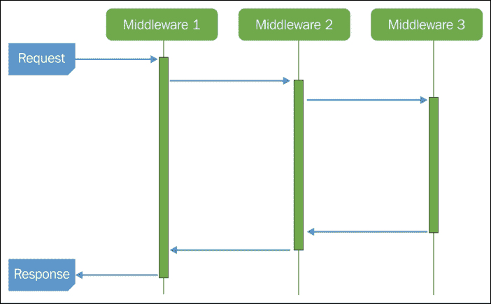

此外，一个新的内置 IoC 容器用于依赖注入负责启动系统，我们还发现了一个新的配置系统，我们将在稍后更详细地讨论。

ASP.NET Core 将许多之前分离的事物结合在一起。不再区分 MVC 和 Web API，并提供了一套完整的新 Tag Helpers。如果你针对.NET Core，或者如果你更喜欢针对.NET 的其他版本，那么架构模型将是 MVC，这是重建的架构。

## 第一次尝试

让我们看看由 Visual Studio 2015 中可用的默认模板组成的项目结构。你只需在 Visual Studio 中选择**新建项目** | **Web**，就可以看到这些替代方案的实际效果：

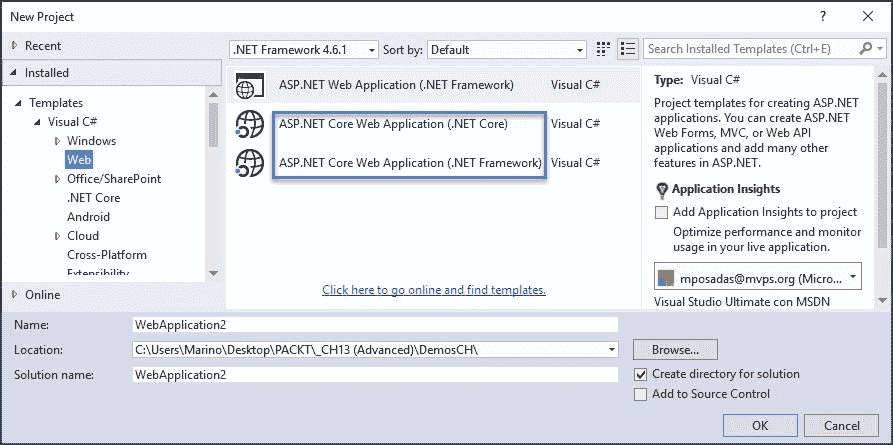

我认为从最简单的模板开始，并开始挖掘背后这个新提案的编程架构是一个好主意。所以，我会从这些新项目中的一个开始，并选择**空**选项。我得到了三个初始选择：**空**、**Web API**和**Web 应用程序**。

将为我们创建一个基本的目录结构，其中我们可以轻松地找到在.NET Core 简介中之前看到的一些元素（包括用于定义目录、项目和包的分离的`global.json`文件）。我给这个演示命名为`ASPNETCoreEmpty`（参考下一张截图以了解解决方案结构）。

你可能会惊讶地注意到某些文件最初缺失（以及存在）。

例如，有一个名为 `wwwroot` 的新文件夹，您可能从其他托管在 IIS 中的应用程序中很熟悉。在这种情况下，这与 IIS 没有关系：它仅仅意味着它是我们站点的根目录。实际上，您也会看到一个 `web.config` 文件，但只有在您确切希望网站托管在 IIS 上时才使用它。

您还会看到 `project.json` 文件的存在，但请注意这一点。正如官方文档所述：

> "ASP.NET Core 的配置系统已经从之前版本的 ASP.NET 中重新架构，之前版本的 ASP.NET 依赖于 System.Configuration 和像 web.config 这样的 XML 配置文件。新的配置模型提供了对基于键/值设置的流畅访问，这些设置可以从各种来源检索。然后应用程序和框架可以使用新的 Options 模式以强类型方式访问配置设置。"

下一个截图说明了项目创建的两个主要 `.cs` 文件：

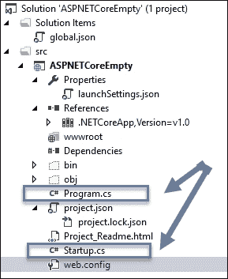

此外，官方建议您使用 C# 编写的配置，它与文件结构中看到的 `Startup.cs` 文件相关联。一旦到达那里，您应该使用 Options 模式来访问任何单个设置。

因此，我们现在有两个初始点：一个与宿主相关，另一个配置我们的应用程序。

## 配置和启动设置

让我们简要分析一下文件的内容：

```cs
// This method gets called by the runtime. Use this method to add 
// services to the container.
public void ConfigureServices(IServiceCollection services)
{
}
// This method gets called by the runtime. Use this method to configure
// the HTTP request pipeline.
public void Configure(IApplicationBuilder app, IHostingEnvironmentenv,
ILoggerFactory loggerFactory)
{
  loggerFactory.AddConsole();

  if (env.IsDevelopment())
  {
    app.UseDeveloperExceptionPage();
  }

  app.Run(async (context) =>
  {
    await context.Response.WriteAsync("Hello World!");
  });
}
```

您可以看到，这里只有两种方法：`ConfigureServices` 和 `Configure`。前者允许（您猜对了）配置服务。它接收的 `IServiceCollection` 元素允许您配置登录、选项以及两种服务类型：`scoped` 和 `transient`。

后者是我们的应用程序的初始入口点，它接收三个参数，允许开发者进行所有类型的配置和初始设置。第一个参数 `loggerFactory` 允许您向登录系统添加 `ILoggerProvider`（有关更多详细信息，请参阅 [`docs.asp.net/en/latest/fundamentals/logging.html`](https://docs.asp.net/en/latest/fundamentals/logging.html)），在这种情况下，它添加了 `Console` 提供者。

### 注意

注意，这两个方法的参数是自动接收的。在幕后，依赖注入引擎提供了这些和其他实例的元素。

我们可以添加任意多的日志提供者：每次我们写入日志条目时，该条目将被转发到每个日志提供者。默认提供者将写入控制台窗口（如果可用）。

以下行还解释了有关此管道工作方式的一些重要内容。第二个参数（类型为 `IHosting Environment`）允许您配置两个不同的工作环境：开发和生产，因此我们可以像在这种情况下一样激活适合开发的错误页面，或者我们可以以定制的方式配置这些错误。此参数还包含一些对开发者有用的属性。

第三个参数（类型为`IApplication Builder`）是真正启动应用程序的那个。正如你所见，它调用通过注入接收到的另一个对象的`Run`方法：`context`变量（类型为`HttpContext`），它包含所有必需的信息和方法来操作对话框过程。

如果你仔细看看，你会发现它具有诸如`Connection`、`Request`、`Response`、`Session`、`User`等属性，以及一个可以在任何时间取消连接的`Abort`方法。

实际上，代码以异步方式（使用`async/await`）调用`Run`方法，并写入面向客户端的内容。请注意，这里还没有隐含 HTML。如果你运行项目，你将看到每次在本地主机上对端口的请求时，都会如预期地看到`Hello World`文本。（IDE 为每个应用程序随机分配不同的端口，你当然可以更改它）。

因此，你可以更改`Response`对象，向初始响应中添加更多信息。查看`context`对象会显示与进程相关的几个属性，例如具有`Local Port`属性的`Connection`对象，我们可以通过仅修改此方式中的代码将其添加到`Response`中：

```cs
app.Run(async (context) =>
{
  string localPort = context.Connection.LocalPort.ToString();
  await context.Response.WriteAsync("Hello World! - Local Port: " + localPort);
});
```

然而，我们说过我们可以更改托管上下文。如果我们选择运行的主机是我们的应用程序名称而不是 IIS Express，那么我们就是在选择自托管选项，在运行时将打开两个窗口：一个控制台窗口（对应于主机）和选定的浏览器，通过应用程序发送请求。

因此，我们应该看到一个控制台，显示与托管相关的数据，如图中所示：

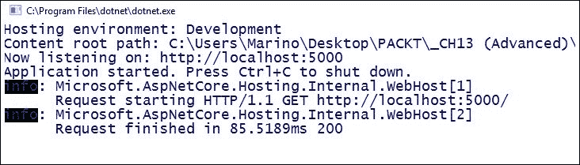

同时，选定的浏览器将打开，显示初始消息以及修改后的信息，包括端口号：

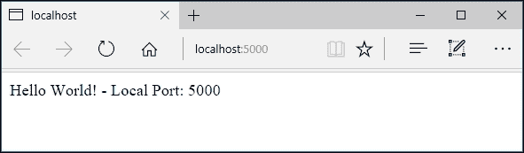

注意，尽管查看代码似乎有一些标记，但这被包含在浏览器中，因为当它们接收到纯文本时，它们会将其包裹在一些基本标记中，而不是简单地显示没有 HTML 的文本。但我们还没有激活提供静态文件的功能。

此外，请注意没有检查资源；因此，无论你在`localhost:5000`地址旁边放置什么，你都会得到相同的结果。

另一方面，主机构建是在`Program.cs`文件中进行的，在那里我们找到入口点，它仅创建一个新的主机，调用`WebHost Builder`的构造函数并配置一些默认行为：

```cs
public static void Main(string[] args)
{
  var host = new WebHostBuilder()
  .Use Kestrel()
  .Use ContentRoot(Directory.GetCurrentDirectory())
  .Use IIS Integration()
  .Use Startup<Startup>()
  .Build();
  host.Run();
}
```

如果你查看`WebHost Builder`类（它遵循构建器模式），你会发现它充满了`Use*`之类的函数，这些函数允许程序员配置这种行为：

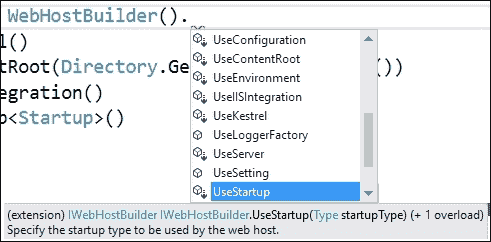

在前面的例子中，使用了 Kestrel web 服务器，但也可以指定其他 web 服务器。代码还表明，你使用当前目录作为内容根来与 IIS 集成（这就是为什么这是可选的），并使用可用的`Startup`实例来完成其配置，在实际上构建服务器之前。

一旦构建完成，服务器就会启动，这就是为什么如果我们选择自托管而不是 IIS，我们会在控制台中看到这些信息的原因。

## 自托管应用程序

正如我们所言，自托管应用程序有许多好处：应用程序执行它运行所需的一切。也就是说，不需要预先安装.NET Core，这使得这个选项在受限环境中非常有用。

在操作上，它就像一个正常的本地可执行文件一样工作，我们可以为任何支持的平台构建它。未来的计划是将这个可执行文件转换为纯本地可执行文件，具体取决于要使用的平台。

在深入研究 MVC 之前，如果你想要服务静态文件，你必须确保已经配置了`UseContentRoot`方法，并且你需要添加另一段中间件来指示这一点。只需将以下内容添加到你的`Configure`方法中，并添加一些你可以调用的静态内容：

```cs
app.UseStaticFiles();
```

在我的情况下，我创建了一个非常简单的`index.html`文件，包含几个 HTML 文本标签和一个`img`标签，以便动态调用`http://lorempixel.com`网站以提供 200 x 100 大小的图像文件：

```cs
<h2>ASP.NET Core 1.0 Demo</h2>
<h4>This content is static</h4>
<imgsrc="img/100"alt="Random Image"/>
```

如果你将此文件留在`wwwroot`目录中，你现在可以调用`http://localhost:<端口>/index.html`地址，你应该能看到页面效果一样：

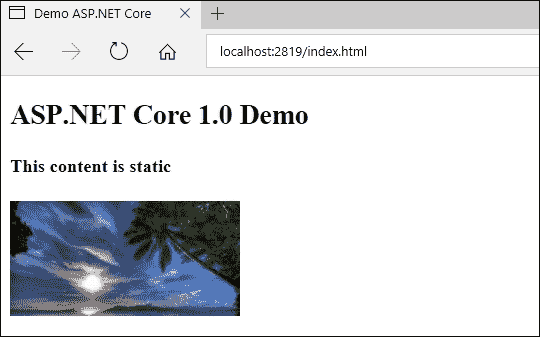

因此，没有任何阻止你使用 ASP.NET Core 技术来构建和部署静态站点，甚至不需要使用 MVC、Web Pages、Web Forms 或其他经典 ASP.NET 元素的功能性站点。

一旦我们了解了 ASP.NET Core 的基本结构，就到了查看更复杂的项目的时候了，（MVC 类型），类似于微软以前在模板中包含的典型初始解决方案，包括控制器、视图、Razor 的使用，以及第三方资源，如 BootStrap 和 jQuery 等。

但在我们深入之前，让我先指出最近在 ASP.NET Core 开发团队发布的基准测试中获得的一些令人惊讶的结果：使用 ASP.NET Core 的性能提升是有意义的。

该基准测试是为了比较经典 ASP.NET 4.6、Node.js、ASP.NET Core (Weblist)、ASP.NET Core on Mono、ASP.NET Core (CLR)、ASP.NET Core (on Linux)和 ASP.NET Core (Windows)，在最后一种情况下，在细粒度请求中每秒达到 1,150,000 个请求（远优于 Node.js）。请参考以下图表：

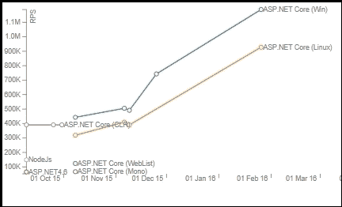

## ASP.NET Core 1.0 MVC

如果我们在创建新的 ASP.NET Core 应用程序时选择完整模板，我们会发现一些有意义的更改和扩展功能。

我认为比较这两种方法以确切了解允许这些类型应用程序的哪些元素被添加或修改是有趣的。首先，注意新的文件结构。

现在，我们认识到我们从 ASP.NET MVC 应用程序中已经知道的典型元素：控制器、视图（在这种情况下没有`Model`文件夹，因为基本模板中不需要它），以及来自`wwwroot`的四个静态资源文件夹。

它们包含应用程序中使用的 CSS 推荐位置文件夹、静态图像、JavaScript 文件（例如，访问新的 ECMA Script2015 API），以及 Bootstrap 的 3.3.6 版本、jQuery 的 2.2 版本和 jQuery Validation 插件的 1.14 版本（当然，版本号会随时间变化）。

这些文件通过`Bower`加载到项目中。在依赖关系部分，您会找到一个`Bower`文件夹，您可以使用它——甚至是动态地——来更改版本、更新到更高版本等。

### 小贴士

如果您在任何一个`Bower`条目上右键单击，上下文菜单将提供更新包、卸载它或管理其他包的选项，以便您可以添加新的缺失包。

所有这些都在**wwwroot**部分下。但是，查看**Controllers**和**Views**文件夹，您会发现某种程度上的熟悉结构和内容：

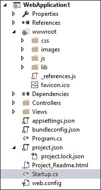

当然，如果您运行应用程序，主页面将启动，类似于之前的 ASP.NET MVC 版本——只是结构已经改变。让我们看看如何，从回顾`Startup.cs`和`Program.cs`文件开始。

在`Startup`内容中首先要注意的是，现在，类有一个构造函数。这个构造函数使用类型为`IConfigurationRoot`的对象，命名为`Configuration`，定义为公共的；因此，它包含的内容可以在整个应用程序中访问。

如文档所述：

> “配置只是一个源集合，它提供了读取和写入名称/值对的能力。如果将名称/值对写入配置，则不会持久化。这意味着当再次读取源时，写入的值将丢失。”

为了使项目正常运行，您必须配置至少一个源。实际上，当前实现做了其他事情：

```cs
public Startup(IHostingEnvironmentenv)
{
  var builder = newConfigurationBuilder()
  .SetBasePath(env.ContentRootPath)
  .AddJsonFile("appsettings.json", optional: true, reloadOnChange: true)
  .AddJsonFile($"appsettings.{env.EnvironmentName}.json", optional: true)
  .AddEnvironmentVariables();
  Configuration = builder.Build();
}
```

该过程分为两个阶段。首先，创建一个`Configuration Builder`对象，并配置它从不同的源（JSON 文件）读取。以这种方式，当运行时创建`Startup`实例时，所有必需的值已经读取，如下一张截图所示：

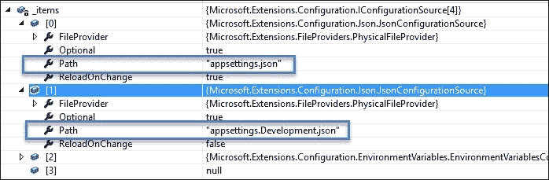

与原始演示相比，下一个重要更改是 MVC 是一个可选服务，需要显式注册。这是在`ConfigureServices`方法中完成的。

最后，运行时在`Startup`对象中调用`Configure`。这次，我们看到调用了`Add Debug()`，并且根据应用程序的环境（开发或生产），配置了不同的错误页面。（顺便说一下，也请注意对`Add StaticFiles()`的调用，这是我们之前在演示中添加的。）

在这个中间件配置过程的最后一步是配置路由。那些经验丰富并且已经熟悉 ASP.NET MVC 的人会很容易地认出我们在这里使用的与经典版本中相似的代码结构，尽管这里的默认配置已经简化了。

这也解释了为什么应该在`Configure`之前调用`Configure Services`，因为后者调用添加了 MVC 服务。

所有这些准备就绪后，应用程序就可以启动了；因此，运行时将转到入口点（`Program.cs`中的`Main`方法）。

这里还有一个有趣的行为：构建了 Web 宿主。`WebHost Builder`负责构建。只有当这个构建器被实例化和配置后，过程才会结束，调用`Build()`方法。这个方法生成一个工作并调整过的服务器，最终启动。查看代码也告诉我们更多关于结构的信息：

```cs
public static void Main(string[] args)
{
  var host = new WebHostBuilder()
  .Use Kestrel()
  .Use ContentRoot(Directory.GetCurrentDirectory())
  .Use IISIntegration()
  .Use Startup<Startup>()
  .Build();

  host.Run();
}
```

注意`UseStartup`方法是如何将主程序与之前定义的`Startup`对象连接起来的。

自然地，如果你想检查最终运行服务器的属性，在`host.Run()`调用中的断点会告诉你关于`Services`和`Server Features`属性的信息。

当然，关于运行时及其用于配置和执行服务器所使用的类还有很多内容，你可以在文档中找到这些内容，而且这些内容远远超出了本介绍的范畴。

至于其余的代码（业务逻辑），它与经典 MVC 中的代码非常相似，但我们会在为了使架构跨平台以及提供对常见开发者工具（如 Bower、NPM、Gulp、Grunt 等）的原生支持之外，找到许多新增和修改。

查看`HomeController`类，基本上结构相同，只是现在动作方法被定义为`IActionResult`类型，而不是`ActionResult`类型：

```cs
public IActionResult About()
{
  ViewData["Message"] = "Your application description page.";

  return View();
}
```

因此，我们可以通过完全相同的模式添加另一个动作方法。这发生在**模型**部分（此处未显示）。模型应该被定义为一个**POCO**（**Plain Old CLR Object**）类，具有很少或没有行为。这样，业务逻辑就被封装起来，可以在应用程序需要的地方访问。

让我们创建一个`Model`和一个`Action`方法及其相应的视图，这样我们就可以看到它与之前版本有多么相似。

我们将创建一个新的`Model`文件夹，并在其中添加一个名为`PACKTAddress`的类，我们将定义一些属性：

```cs
public classPACKTAddress
{
  public string Company { get; set; }
  public string Street { get; set; }
  public string City { get; set; }
  public string Country { get; set; }
}
```

一旦编译完成，我们就可以在 `HomeController` 中创建一个新的操作方法。我们需要创建一个 `PACKTAddress` 类的实例，用所需的信息填充其属性，并将其传递给相应的视图，该视图将接收并展示数据：

```cs
public IActionResult PACKTContact()
{
  ViewData["Message"] = "PACKT Company Data";

  var viewModel = new Models.PACKTAddress()
  {
    Company = "Packt Publishing Limited",
    Street = "2nd Floor, Livery Place, 35 Livery Street",
    City = "Birmingham",
    Country = "UK"
  };
  return View(viewModel);
}
```

这样，我们新视图的业务逻辑几乎就准备好了。下一步是添加一个与操作方法同名的视图文件，它将位于 `Views/Home` 文件夹中其兄弟文件的旁边。

在视图中，我们需要添加对刚刚传递的模型的引用，并使用 Tag Helpers 来恢复数据，以便在页面上展示其结果。

这相当简单直接：

```cs
@model WebApplication1.Models.PACKTAddress
<h2>PACKT Publishing office information</h2>
<address>
  @Model.Company<br/>
  @Model.Street<br/>
  @Model.City, @Model.Country <br/>
  <abbrtitle="Phone">P:</abbr>
  0121 265 6484
</address>
```

在构建此视图时，应该注意以下几点。首先，我们在视图编辑器中具有与经典 MVC 一样的普通 Intellisense。这很重要，这样我们就可以始终确保上下文正确识别值模型。

因此，如果我们已经编译了代码并且一切正常，我们应该在创建视图的过程中看到这些辅助功能：

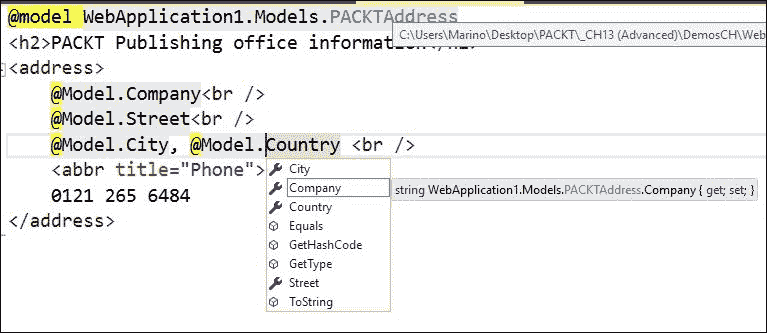

最后，我们必须通过在 `_Layout.cshtml` 主页中包含一个新的菜单项来指向视图，就像之前的条目一样，将我们的新视图集成到主页中。因此，修改后的菜单将如下所示：

```cs
<ulclass="nav navbar-nav">
  <li><aasp-controller="Home"asp-action="Index">Home</a></li>
  <li><aasp-controller="Home"asp-action="About">About</a></li>
  <li><aasp-controller="Home"asp-action="Contact">Contact</a></li>
  <li><aasp-controller="Home"asp-action="PACKTContact">PACKT Information</a></li>
</ul>
```

在这里，您会注意到与 ASP.NET 相关的新自定义属性的存在：`asp-controller`、`asp-action` 等等。这与我们在构建 AngularJS 应用程序时处理控制器的方式类似。

此外，请注意我们使用 `ViewData` 对象传递了一些额外的信息，该对象已被恢复以供首选使用，而不是之前的 `ViewBag` 对象。

最后，我在标准图像（没有问题或配置功能）中添加了一个指向这本书封面的链接。当我们启动应用程序时，将出现一个新的菜单元素，如果我们点击该链接，我们应该在主应用程序页面内看到新的页面，就像我们预期的那样：

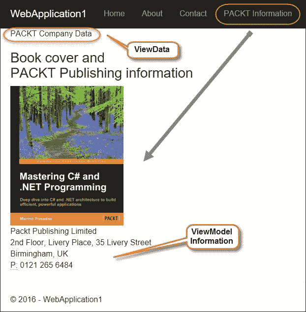

## 管理脚本

如您在查看文件夹内容后可能看到的，与配置选项相关的 `.json` 文件更多。实际上，在这个项目中，我们看到有几个文件，每个文件负责配置的一部分。它们的作用如下：

+   `launch Settings.json`：它位于 `Properties` 目录下。它配置端口、浏览器、基本 URL 和环境变量。

+   `app Settings.json`：它位于根级别，而不是 wwwroot。它定义了日志值，也是放置其他应用程序相关数据的地方，例如连接字符串。

+   `bower.json`：它位于根级别，而不是 wwwroot。它定义了应用程序中必须使用 Bower 服务更新的外部组件，例如 Bootstrap、jQuery 等。

+   `bundle Config.json`：它位于根目录，而不是 wwwroot。这是你定义要捆绑和压缩哪些文件的地方，同时指定每种情况下的原始和最终文件名。

因此，我们已经看到了编程模型的改进，还有许多与新的 Tag Helpers、建模、数据访问和其他许多我们无法在此涵盖的功能相关的改进，但我希望这已经为新的架构提供了一个介绍。

# .NET Core 1.1

在关闭本书编辑过程的前几天，微软在 Connect() 事件中宣布了 .NET Core 新版本的可用性。这次更新也影响了“Core”系列的相关版本：ASP.NET Core 1.1 和 EF Core 1.1。

显然，这不是一个有很多基础性变化或破坏性变化的版本。开发团队的重点是扩大操作系统目标，提高性能，并修复错误，从根本上讲。

因此，根据 Github 官方页面 ([`github.com/dotnet/core/blob/master/release-notes/1.1/1.1.md`](https://github.com/dotnet/core/blob/master/release-notes/1.1/1.1.md)) 和团队博客，更改主要集中在以下四个不同领域：

+   支持以下发行版：

    +   Red Hat Enterprise Linux 7.2

    +   CentOS 7.1+

    +   Debian 8.2+

    +   Fedora 23, 24*

    +   Linux Mint 17.1, 18*

    +   Oracle Linux 7.1

    +   Ubuntu 14.04 & 16.04

    +   Mac OS X 10.11, 和 10.12

    +   Windows 7+ / Server 2012 R2+

    +   Windows Nano Server TP5 Linux Mint 18

    +   OpenSUSE 42.1

    +   MacOS 10.12（也添加到 .NET Core 1.0）

    +   Windows Server 2016（也添加到 .NET Core 1.0）

+   性能改进，这导致了超过 Node 和 Nginx 获得的基准测试（达到 ASP.NET Core 1,15 百万请求/秒）

+   API 中添加了几个新功能，以及数百个错误修复

+   现在的文档进行了重大更新，现在更加易于访问和全面

对于 ASP.NET Core 1.1，文档指出，这个版本的设计围绕以下功能主题，以帮助开发者：

+   使用除 Windows Internet Information Server (IIS) 以外的主机时，改进了和跨平台兼容的网站托管能力

+   支持使用原生 Windows 功能进行开发

+   在整个 UI 框架中，中间件和其他 MVC 功能的兼容性、可移植性和性能

+   改善了在 Microsoft Azure 上部署和管理 ASP.NET Core 应用程序的经验

关于此版本提供的新闻的更多详细信息，您可以阅读文章 *Announcing the Fastest ASP.NET Yet, ASP.NET Core 1.1 RTM*，在 [`blogs.msdn.microsoft.com/webdev/2016/11/16/announcing-asp-net-core-1-1/`](https://blogs.msdn.microsoft.com/webdev/2016/11/16/announcing-asp-net-core-1-1/)。

# 摘要

在这一章的最后一部分，我们看到了三个不太为人所知的方面，其中包括对微软今年正式提出的新的 .NET Core 和 ASP.NET Core 方案的简要介绍。

这是本书的最后一章，我在其中回顾了使用（主要是，但不仅限于）C# 语言来进行的 .NET 编程状态。

我们对语言的不同版本进行了历史性的回顾，包括最新的稳定版 C# 7，并通过一系列示例展示了它在不同上下文和应用场景中的行为以及如何使用它。

我们还比较了其他提案，如功能型语言 F# 和流行的 TypeScript。

数据管理也是一个重要的主题，涵盖了当今最流行的两种模型（SQL 和 NoSQL），展示了如何使用这两种模型，它们的优点和注意事项。

最后，我们专门用几章内容介绍了遍历技术，这些技术涉及到整个应用程序，如架构、良好实践、安全性和性能，并以这一杂项章节结束。

我真诚地希望这篇文章能作为您参考，了解 .NET 程序员今天所拥有的许多可能性，并可能为您的需求开辟新的路径和渠道。
