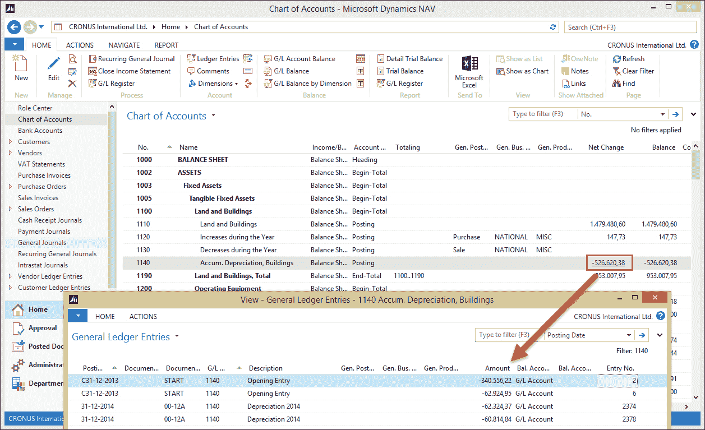

# 第一章. Microsoft Dynamics NAV 简介

从前有座山，这个故事往往从这里开始，尽管 Microsoft Dynamics NAV 的故事远非童话，但它确实有一些神奇之处。

超过 10 万次的安装量，使其成为中端市场最受欢迎的 ERP 软件包之一。在这本书中，我们将探讨 Dynamics NAV 应用程序的神奇之处。我们将看到 Dynamics NAV 如何提供更好的信息来了解我们的业务状况，并提供更好的洞察力，以优化或需要改变的过程。

在本章中，我们将讨论 Microsoft Dynamics NAV 应用程序的基本原则，它的结构以及原因。阅读本章后，您将更好地了解在实施和设计 Microsoft Dynamics NAV 时可以期待什么。

# 版本和历史

在本书出版时，Microsoft Dynamics NAV 2013R2 是产品的最新版本。当 Windows 版本首次在 1995 年推出时，该产品被称为 Navision Financials 1.0。最初开发该产品的丹麦软件公司 Navision Software A/S 尚未被微软收购，这是一场革命。它是一个完整的 Windows 产品，拥有小型公司所需的所有基本功能。重要的是要理解，原始版本的目标是针对小型公司。

从那时起，我们已经推出了许多（20 多个）版本。所有新版本都包含了新的功能，随着产品的成熟，它也更适合大型公司。这得益于 Microsoft SQL Server 平台的支持，使得更多并发用户可以在同一应用程序区域中工作。

直到 5.0 版本，产品的技术并未发生变化。微软的初衷是同时发布一个全新的技术平台和新的功能变更。但结果证明这是一个非常困难的任务，因此他们决定将技术分为两个版本发布。5.0 版本包含了新的功能和改进，而 2009 版，或称 6.0 版，作为技术发布号，则是一个技术发布。

技术挑战是从旧的 C++平台迁移到.NET，并从两层架构迁移到三层架构。这也是第一个用户界面发生重大变化的发布。Microsoft Dynamics NAV 2009 包含了一个全新的用户界面，即角色定制客户端，它是从头开始全新构建的——现有的（经典）用户界面保持不变，没有任何改动。在这次迁移过程中，尽管在 2009 SP1 中进行了小的改进和错误修复，但所有应用程序功能都被冻结。

使用 Microsoft Dynamics NAV 2013，我们已经进入了一个全新的时代，其中转型已经完成。产品已转换为 .NET，甚至支持从 C/AL 编程语言直接使用 DotNet 互操作性。经典用户界面和本地数据库都已停止使用。

本书支持 2013 版本的功能，尽管大多数概念都与旧版本相关。

# 本书的内容是什么

本书标题为《Microsoft Dynamics NAV 2013 应用设计》。应用设计是什么意思？在 Microsoft Dynamics NAV 2013 中它又意味着什么？

Microsoft Dynamics NAV 2013 是一个完整的 ERP 软件包，但与其他 ERP 软件包不同，它具有提供开放结构和开发平台的设计能力。其理念是提供 80% 的解决方案，并允许其他 20% 由合格的商业应用开发者设计。

合作渠道是 Microsoft Dynamics NAV 的一个独特部分。自从 Navision 上市以来，公司管理层就决定，只有采用间接销售模式，并让分销商（称为合作伙伴）有权更改产品并添加新功能，才具有实际意义。

本书既涉及 80%，也涉及 20%。我们将看到，应用这些百分比时，不同行业会有所不同。有些行业几乎达到 100% 的匹配，而其他行业则需要 80% 的开发。

因此，本书在标准应用程序的使用与设计更改、扩展产品之间有一条非常细的界限。尽管这不是一本开发书，但我们几乎在每一章都会深入探讨代码和对象。

阅读本章将足以理解代码，但如果您想了解更多，我们强烈推荐阅读《Programming Microsoft Dynamics NAV 2013》，作者 David A. Studebaker、Christopher D. Studebaker，出版社 Packt Publishing。

本书不是 Microsoft Dynamics NAV 2013 的手册。它将向您清晰地展示应用程序结构的布局及其可能性。我们不想取代或重写 Microsoft 文档，而是想提供您可能未曾考虑过的想法。

# 设置与定制

在 Microsoft Dynamics NAV 中，实施和开发之间的界限非常模糊。在其他 ERP 软件包中，您可能会进行大量的设置，但在 Dynamics NAV 中，使用开发工具进行更改通常更有意义。

标准包在功能上非常完整，但并不支持所有行业。它更多的是为合作伙伴工作的框架。在本书中，我们将解释这个框架及其构建的哲学。理解这个哲学对于了解如何扩展功能至关重要。

然而，扩展功能意味着定制应用程序。2013 年的最终用户是否仍然想要定制应用程序？大多数情况下，他们会说他们不希望他们的软件被定制，但紧接着，他们会说软件应该改变以适应他们的业务方式，并且他们应该不得不改变他们的业务以适应软件。

正因如此，微软推动他们的合作伙伴在标准产品之上创建水平和垂直解决方案，并将这些解决方案作为具有自己版本的独立产品发布，仿佛它们是标准应用程序的一部分。这种使用合作伙伴渠道的方式是一个独特概念，已被证明非常成功，使 Microsoft Dynamics NAV 几乎适用于任何行业。

然而，大多数公司都有其独特的工作方式，因此他们总是需要或多或少定制化的解决方案。拥有总成本取决于定制的程度以及这些定制是如何设计的。

关键在于知道何时进行设置和何时进行定制。只有对应用程序有坚实的理解，才能帮助你确定哪一个是正确的。

阅读这本书后，你将知道如何设计你的应用程序以在拥有权和功能之间取得良好的平衡。

# 简单之美

如前所述，应用程序被设计成可以由外部合作伙伴扩展和更改。当创建这个合作伙伴计划时，做出了一项决定，即如果应用程序完全开放供他们添加和更改，合作伙伴才能做好工作。这种理念在开始实施或更改 Microsoft Dynamics NAV 时非常重要。

合作伙伴可以更改应用程序中的所有业务逻辑。他们可以向表中添加新字段并创建自己的表。他们唯一不能做的是从基础应用程序的表中删除字段。

如您所见，Microsoft Dynamics NAV 是一个极其灵活和开放的产品，拥有很多自由。但自由伴随着责任。在 Dynamics NAV 中，你负责你系统中的维护工作。

## 水平解决方案与垂直解决方案

由于这个开放系统，合作伙伴已经对系统进行了数千次大小不同的更改。其中一些更改被捆绑成新的功能组件，并被称为附加组件。这些附加组件通常是改变 Dynamics NAV 成为特定行业产品而不是通用 ERP 系统的解决方案。其他附加组件是可以在所有行业中使用的特定功能，例如 EDI 或工作流。微软将这些特定行业的附加组件称为垂直解决方案，将通用附加组件称为水平解决方案。

## 开源

尽管 Dynamics NAV 为合作伙伴提供了开源，但它并没有配备像大多数开发者所习惯的开发环境。它有一个定制工具，允许你像定制另一个 ERP 系统一样定制应用设置。这个定制工具是一个基本工具，使用起来很方便，但缺少一些开发功能，如版本控制或 IntelliSense。这使得跟踪你的更改变得更加困难。我们将在第十章“应用设计”中讨论如何使用 Team Foundation Server 进行对象版本控制，第十章。

# 设计模式

当定制 Microsoft Dynamics NAV 时，你可以使用应用中的经过验证的概念。这些经过验证的概念被称为设计模式。有三种类型的设计模式。

## 架构模式

架构模式是主要的数据处理和表结构。例如，主数据、单例表、文档以及过账和存档流程。

## 设计模式

虽然这个名字是人们用来指代整个概念的名称，但设计模式是可重用的元素，用于解决特定问题，如数字序列和阻塞实体。

## 实现模式

不同的开发技术被称为实现模式。例如，代理、外观、临时数据集和钩子。

## APIs

**应用程序编程接口**（**API**）是一般不会改变的代码块，它们对于使用 Dynamics NAV 来说与.NET 库对于在 C#中工作一样重要。在 Microsoft Dynamics NAV 中，我们有一些可重用但不会改变的构建块。例如，地址格式化和导航页面。

# 本书结构

本书将涵盖 Dynamics NAV 在多个垂直行业中的大多数功能元素。我们将通过供应链矩阵来完成这项工作。我们将研究的具体行业包括时尚、汽车、药品、食品和家具。对于生产和贸易，我们将研究一般流程，并了解咨询公司和分销公司如何帮助这一流程。

下图显示了本书的结构：


对于所有这些行业，我们将研究标准产品中哪些部分可以被利用，以及我们需要在哪些地方提供垂直解决方案。我们将讨论这些垂直解决方案如何与标准包接口，或者甚至可能改变标准产品的行为。

然而，产品的两个部分在用途和易用性上对所有行业都非常通用，我们将单独讨论它们。这些是**财务管理**和**关系管理**。

为了强调垂直概念的优势，我们将为一家分销公司设计和创建一个垂直解决方案。

现在，我们将探讨应用的一些基本概念。

# 角色定制概念

在 NAV 2009 版本发布时，微软营销决定引入角色定制 ERP 的概念。到目前为止，大多数 ERP 系统都是模块驱动的，这意味着应用程序有一个财务、CRM、销售、采购等区域。对各个模块的访问是分开的。采购人员需要切换到销售才能查看销售订单。

公司中的大多数人都有专门的任务，ERP 系统应该支持这些任务。在经典的 ERP 界面中，用户必须自己决定所需部件的位置。随着角色定制概念的引入，这种情况发生了变化。


这张截图显示了采购者的角色中心。正如您所看到的，这个人在组织中的所有信息都集中在一个地方，并且可以以类似工作流程的方式使用。此外，**销售订单**可以从**主菜单**窗口访问。这与 5.0 版本或之前的菜单完全不同。


然而，角色定制概念并不是新的。Dynamics NAV 合作伙伴已经实施它多年。在经典菜单中，如前一张截图所示，创建新菜单非常容易，大多数公司根据角色实施自己的菜单。当在 4.0 版本中引入 Microsoft Outlook 风格菜单时，最终用户可以创建快捷菜单套件，这些套件也很快成为角色中心。您可以看出，角色定制概念对 Dynamics NAV 来说就像回家一样。

在 Microsoft Dynamics NAV 2013 中，Windows 客户端不再被称为角色定制客户端，就像在 2009 版本中那样。所有可用的客户端都是角色定制的。

# 构成要素

为了理解本书中的开发示例，我们将讨论 Microsoft Dynamics NAV 2013 的一些基本构建块。


与所有数据库应用程序一样，它从表开始。它们以结构化的方式包含显示的所有信息。重要的是要理解，Microsoft Dynamics NAV 的表并不是完全规范化的。表的结构与用户界面的工作方式相匹配。这使得非技术人员更容易理解数据模型。我们将在第二章中讨论应用的独特结构，“一个示例应用”。

然而，表不仅包含数据，还包含业务逻辑。由于它们的结构类似于数据库中的功能，表包含简单的功能，如地址验证，以及用于增值税和折扣计算的更复杂的功能。

当功能变得更加复杂或可以在应用程序中共享时，最好将它们移动到代码单元对象。这些是针对特定目的的业务逻辑容器。表也可以用作类，而不存储数据。这允许更结构化的编程。

对于用户界面，有两种对象类型：报告和页面。报告最初是打算打印在纸上的，但随着当前技术状况的发展，它们越来越多地被用作信息仪表板，将管理信息与钻取功能相结合。

由于表是按照应用程序的工作方式结构化的，页面必然绑定到一个表上。对于新接触这个概念的人来说，有时需要一段时间才能习惯。

菜单套件定义了当人们离开角色中心并前往部门页面时导航的结构方式。菜单套件用于**搜索**窗口。

最后一个对象类型是外部接口对象。XML 端口使得可以在系统和外部之间导入和导出数据。

查询对象是在 Microsoft Dynamics NAV 2013 中引入的，允许开发者在元数据级别上定义可用于 C/AL 代码的 SQL Server SELECT 语句。可以将多个表合并到一个查询中。查询对象还可以公开为 OData Web 服务。

对于这本书，表和页面对象是最重要的理解对象。然而，这本书的大部分内容也可以应用于旧版本，但此时应将表单应用于本书中提到的页面。

## 作为用户界面和业务逻辑的表

Microsoft Dynamics NAV 中的表对象非常重要。因为它不是规范化的，所以它包含了大量关于数据库如何工作的信息。

例如，工作卡（88）基于一个表，即工作（167）。这个表包含了这个屏幕所需的所有字段。


在传统的开发环境中，这个屏幕会有一个事务`GetJobData`和`UpdateJobData`。这些事务会从数据库中读取信息，映射到屏幕上，如果用户完成操作，则将信息保存到数据库中。然而，在 Microsoft Dynamics NAV 中，所有在界面上显示的字段都存储在一个表中。这使得屏幕可以内置触发器来获取数据和更新数据库。

表对象随后包含实现此文档所需的所有业务逻辑。让我们看看这个表中的一些字段：


在前面的截图中，我们可以看到许多字段，例如**WIP 方法**、**货币代码**等，这些都是完成工作所必需的。


当我们点击**C/AL 代码**图标并聚焦于货币代码时，我们得到以下结果：

```cs
Currency Code - OnValidate()
IF "Currency Code" <> xRec."Currency Code" THEN
  IF NOT JobLedgEntryExist THEN
    CurrencyUpdatePlanningLines
  ELSE
    ERROR(Text000,FIELDCAPTION("Currency Code"),TABLECAPTION);
```

这包含在每次此字段发生变化时执行的业务逻辑。在这种情况下，货币因子将被重新计算并在销售行中更新。

因此，Microsoft Dynamics NAV 中的表不仅仅是数据容器，它们是业务逻辑和应用工作流程的基础。

# Dynamics NAV 在供应链中的应用

Dynamics NAV 产品几乎在商业供应链的每个地方都被使用。这主要是因为它是一个高度可定制的 ERP 系统。Dynamics NAV 用于传统的供应链公司，如制造工厂、批发公司和零售业，无论是否有很大变化。但通过附加组件，该产品也用于运输公司或回收行业。

为了更好地理解这一点，了解公司的工作方式很重要。公司是一个人或一组人使用材料和资源向其他公司或最终消费者提供产品或服务的人或团体。一组共同工作的公司被称为供应链。Dynamics NAV 可以用于所有这些公司，尽管它传统上用于有 5 到 250 个并发用户的公司。

为了服务这一过程，Dynamics NAV 有一系列以下基本模块：

+   **财务管理**：传统上，这被用于公司以符合联邦的簿记法规。对于刚开始创业的创业者来说，这通常是他们最不喜欢的部分。然而，良好的簿记可以清楚地了解公司的状况，并利用良好的财务信息支持战略决策。

+   **库存**：每个成长中的公司都会达到一个点，那时没有系统就无法处理库存。持有过多的库存非常昂贵。一个好的库存系统可以帮助你尽可能高效地保持库存。

+   **关系管理（RM）**：当涉及到人时，公司不仅与客户和供应商打交道。RM 将帮助您跟踪您的公司所涉及的每一个公司和每个人。

+   **销售**：销售流程通常是企业赚钱的地方。系统将帮助您跟踪客户下订单的情况。

+   **采购**：采购部门通常分为两部分。一部分是公司自身所需商品的采购。这种设施管理在大公司中可以发展成为自己的业务。另一部分采购是购买销售过程中所需的材料和资源。对于一些贸易公司，这甚至可以是一个直接发货的过程，你永远不会在仓库里有购买的货物。

+   **仓储管理**：仓库越来越大，对支持拣选和上架过程的系统的需求也越来越大。这通常与销售和采购过程紧密相连。

+   **制造**：当你自己制造产品时，你需要一个系统来帮助你从一种或多种购买的物料和资源中创建新的项目。

+   **工作**：在某些公司，提供服务的流程非常复杂，需要自己的管理流程。时间和计费通常是这些公司非常重要的流程。

+   **服务管理**：这支持处理您的物品的保修和必要的定期维护的服务流程。

# 一些基本设计模式

Microsoft Dynamics NAV 有一些基本的设计模式，这些模式在整个应用程序中被重复使用，并且理解本书的概念是必要的。

## 编号系列

数据库需要唯一的记录。应用程序有两种方法来实现这一点。

一些表有自动递增编号，无法被影响。这些通常是具有可审计目的的会计表。这些表的例子包括总账分录、总账登记簿和增值税分录。

另一种方式是使用灵活的字母数字代码。在一些设置表中，用户可以自由创建自己的编号，就像在位置表中一样，但大多数时候使用编号系列功能。这些功能可以根据最终用户的访问权限进行影响。让我们更详细地看看它们：


用户可以定义自己的编号，通常以一个字母数字字符开始。编号可以是自动的、手动的，或者两者的组合。编号可以有一个起始日期和递增编号。这样，你可以对你的销售发票进行编号，例如 SI11-0001。SI 代表销售发票，11 代表 2011 年，0001 是递增编号。

例如，编号系列可以相互链接，使得可以为国内外客户使用不同的编号系列。

## 扩展文本

在 Microsoft Dynamics NAV 中，大多数主数据表都有两个描述字段，但可以添加额外的文本。

文本可以定义在系统中的所有语言，并使其在特定时期内有效。

我们可以启用或禁用系统中的大多数文档的文本使用，这样我们就可以为**销售报价**提供一些长文本，为**销售发票**提供一些较短的文本，如下面的截图所示：


## 导航

Microsoft Dynamics NAV 顾问们喜欢您使用像 SI11-0001 这样的编号的原因是因为**导航**功能。这个功能使得在数据库中找到与该文档相关联的所有信息成为可能。如果您将您的销售发票命名为 110001，您的采购发票也是同样的名称，系统将无法在详细级别找到信息。


当在 CRONUS 演示数据库中导航到**过账销售发票 103006**时，我们得到与这个编号相关联的所有信息。

导航显示文档和条目。使用**显示**选项，我们可以深入到记录中，甚至更深入到信息中。导航存在于大多数显示过账交易和历史数据的页面上。

## 设置表格

一个 ERP 应用程序可以用多种不同的方式使用，为了使其按我们的意愿工作，我们需要正确设置它。我们已经讨论过，Dynamics NAV 比其他 ERP 软件包设置要少得多，并且更有可能被更改，但无论如何，还是有设置工作要做。

应用程序的每个部分都有自己的设置表。还有一些是应用程序级或跨应用程序的设置表。在实施过程中，我们需要确保触及所有这些表。实施后更改这些设置应非常谨慎。

设置表使用单例表设计模式。以下表格显示了按类型分组的所有 Microsoft Dynamics NAV 设置表：

| 特定设置表 | 应用程序级设置表 |
| --- | --- |
| 总账设置销售与应收账款设置采购与应付账款设置库存设置资源设置工作设置营销设置人力资源设置生产计划设置 FA 设置非库存项目设置仓库设置服务管理设置制造设置 | 源代码设置更改日志设置 SMTP 邮件设置审批设置作业队列设置在线地图设置交互模板设置员工门户设置通知设置订单承诺设置 BizTalk 管理设置 |

当我们从应用程序打开设置时，我们会看到一些选项，包括我们之前讨论的编号：


## 发布组

Microsoft Dynamics NAV 在将其发布到 **总账**方面非常灵活。这是在发布组中设置的。这些形成了一个矩阵，由应用程序筛选出来。

大多数应用程序区域都有一个或多个发布组表：

+   客户发布组

+   供应商发布组

+   库存发布组

+   招聘发布组

+   通用业务发布组

+   通用产品发布组

+   银行账户发布组

+   增值税业务发布组

+   增值税产品发布组

+   FA 发布组

    ### 小贴士

    我们将在 第三章 *财务管理* 中更详细地讨论发布组。

## 定价

当涉及到定价和折扣时，Microsoft Dynamics NAV 有一种非常简单但有效的方法来计算。

所有销售和采购价格都存储在四个简单的表中：

+   7002 – 销售价格

+   7004 – 销售行折扣

+   7012 – 采购价格

+   7014 – 采购行折扣

系统通过在这些表中筛选来找到适当的价格。筛选越窄，价格被应用的可能性就越大。


例如，项目卡片上项目**1972-W**的正常价格为 97,480，但从 **2011-1-1** 开始为 **843,345**。

筛选是在代码单元销售价格计算管理（7000）和采购价格计算管理（7010）中完成的。我们将在 第二章 *一个示例应用程序* 中讨论这个结构，我们也将为我们的应用程序创建这样的结构。

## 维度

在整个应用程序中，可以使用无限数量的维度来分析数据。这些维度是从主数据表中继承的。


应用程序有两个全局维度，这些维度直接过账到每个交易中。另外六个维度可以定义为快捷维度，以便直接在日记账和文档中使用。可以添加无限数量的附加维度，但需要付出额外的努力才能访问。


前面的截图显示了如何在**销售文档**中使用全局和快捷维度。

Microsoft Dynamics NAV 内置了 OLAP 功能。它允许我们在应用程序内或 SQL Server 分析服务中创建用于分析的立方体。


虽然立方体可以在过账时实时更新，但强烈建议定期批量更新它们。此外，维度的数量会影响系统的性能。

在 Microsoft Dynamics NAV 2013 中重新设计了维度。这次重新设计对应用程序性能产生了巨大影响，可以将数据库大小减少高达 30%。

# 架构设计模式

在创建自己的结构之前，了解 Microsoft Dynamics NAV 的一些特定架构设计模式原则非常重要。构建块是分层和重复使用的，并且相互依赖以确保数据完整性。

## 主数据

数据模型从主数据开始。有三种类型或级别的主数据。它们都用于交易。我们区分补充、正常和辅助主数据。

补充数据的例子包括货币、地点和付款条款。它们通常不使用编号系列，但允许我们创建自己的唯一代码。

主数据示例包括总账科目、客户、供应商、项目、资源和固定资产。它们使用编号系列进行编号，并拥有自己的日记账结构。

补充表格的一个例子是项目供应商表。

## 日记账

每个交易都以日记账开始。每个日记账可以包含多个子交易，这些子交易由系统视为一个整体。这样，系统就能够检查，例如，交易完成后系统的一致性是否得到保持。

下图显示了日记账的结构。**PK**代表**主键**，它是表的唯一标识符：


每个日记账可以包含一个或多个模板，每个模板可以包含一个或多个批次，允许多个用户拥有多个模板和批次。日记账行有一个源编号字段，例如，它引用的是总账科目编号或我们正在更改的项目编号。当我们过账日记账时，更改将存储在分录表中，以及所有行。对于日记账，维护一个登记簿，以便审计师可以检查交易是否一致。

## 总账

要查看应用程序中它是如何工作的，我们可以转到 **会计科目表** 和 **总分类账**，如下面的截图所示：



如果我们选择 **总账科目 1140** 并向下钻取，我们将看到此记录的详细信息。

这些是通过日记创建的，所以让我们打开一个日记：


这本日记包含了同一过账日期的两份文件，余额为零。当我们过账这本日记时，系统将创建总账条目和登记簿。


这是 Dynamics NAV 的基本构建块。Dynamics NAV 中的所有内容都是建立在日记、登记簿和条目之上的。


# 平衡

在任何 ERP 系统中，总计和平衡至关重要，无论你是总计总账、客户付款还是库存，了解每个账户、客户或项目的余额都很重要。

传统上，这需要计算这些余额并决定一个存储总计和子总计的地方。在 Dynamics NAV 中，系统内置了处理平衡和总计的技术。

这种内置技术被称为 **求和索引字段技术**（**SIFT**）。对于 Dynamics NAV 来说，这是其成功的关键特性。

它的工作方式是，作为开发者，你在索引级别上定义你的总计。通过将总计字段与一个键关联，系统知道它需要为你维护总计。

在原始的专有数据库中，这项技术是内置的，对用户不可见，但在 SQL Server 数据库中，我们可以看到它是如何工作的。

如果我们进入 CRONUS 数据库并打开带有其键的 **总账分录** 表，我们会看到以下信息，如下面的截图所示：


让我们以第二个键为例。该键包含总账科目编号和过账日期字段。如果我们仔细查看 **SumIndexFields** 列，我们会看到以下字段列出：


注意，这些都是十进制类型的字段。这是 `SumIndexfields` 的强制性要求。

### 小贴士

从 SQL Server Management studio 中，你可以看到由 `SumIndexField` 定义生成的数据。每个带有 `SumIndexField` 的键在数据库中生成一个视图。在旧版本（5 SP 1 之前），`SumIndexFields` 被保存在表中。

因此，现在我们知道我们不必担心维护总计，我们可以把时间花在真正重要的事情上。

# 流字段和流过滤器

如前所述，Microsoft Dynamics NAV 中的屏幕是直接基于一个表构建的。这些表定义包含所有字段，包括总计。然而，这些总计并不是真正的数据库字段。

这可以通过比较 Microsoft Dynamics NAV 中的表定义与 SQL Server 中的表定义来展示：


字段**日期筛选器（28）**到**预算金额（33）**不是数据库中的实际字段。它们是辅助字段，用于在屏幕上显示数据。

流程筛选器可以有七种类型；总和、平均值、存在、计数、最小值、最大值和查找，并包含对数据库的查询。例如，日期余额（31）显示以下内容：

```cs
Sum("G/L Entry".Amount 
  WHERE (G/L Account No.=FIELD(No.),
         G/L Account No.=FIELD(FILTER(Totaling)),
         Business Unit Code=FIELD(Business Unit Filter),
         Global Dimension 1 Code=FIELD(Global Dimension 1 Filter),
         Global Dimension 2 Code=FIELD(Global Dimension 2 Filter),
         Posting Date=FIELD(UPPERLIMIT(Date Filter))))
```

这在 G/L 条目表（17）的字段金额上创建总和，筛选条件为**G/L 账户**、**G/L 账户编号**、**业务单元代码**、**全局维度 1 和 2 代码**以及**过账日期**。

其中一些筛选器是 G/L 账户表中的实际字段，但其他的是流程筛选器。不存在的字段可以用作运行时筛选器，以限制查询的结果。

我们将在本书的后面部分使用和讨论更多这些流程筛选器和流程字段。

# 更多期刊和条目

因此，现在我们知道了期刊是如何工作的，构建 Dynamics NAV 的过账图可能很有趣。Dynamics NAV 有多个期刊、登记簿和条目，它们相互叠加。

下表显示了最重要的期刊、登记簿和条目：

| 期刊 | 登记簿 | 条目 |
| --- | --- | --- |
| 总账分录行（81）项目分录行（83）资源分录行（207）工作分录行（210） | G/L 登记簿（45）项目登记簿（46）资源登记簿（240）工作登记簿（241） | G/L 条目（17）客户账簿条目（21）供应商账簿条目（25）项目账簿条目（32）工作账簿条目（169）资源账簿条目（203）增值税条目（254）银行账户账簿条目（271） |

请注意，当你在数据库中查看时，你会找到更多这些表格，但这些都是主要构建块。

每个期刊负责创建自己的条目，但可能需要运行另一个期刊。例如，项目期刊可能需要使用总账期刊来生成 G/L 条目，而工作期刊可能需要使用项目期刊来创建项目账簿条目。

我们已经讨论了 G/L 条目表，该表用于存储基本财务信息。这是基本管理表。

其他条目表是子账簿表。它们存储冗余信息，但为特定用途提供额外信息。子账簿的总计应始终与 G/L 平衡。我们将在第三章中看到它是如何工作的，*财务管理*。以下是更多表格：

+   客户和供应商账簿条目表用于存储关于应收账款的具体信息。它们与客户和供应商主数据表相关联。

+   增值税条目表存储特定信息以简化注册。大多数公司每月或每季度与一个或多个政府机构进行增值税注册。许多国家的增值税与本书中描述的本地化国家系统可能不同。

+   银行账户条目应显示我们在银行账户上进行的所有交易。

ERP 软件包的物流部分由项目日志处理。每个购买、生产或销售的项目都通过这个日志处理。服务通过资源日志处理。资源可以是人员或像电梯这样的设备。

**工作日志**是一个覆盖整个应用的伞状层。它允许您分组交易，使分析大型项目的成本和利润变得更容易。

## 过账架构

当我们将所有这些信息组合到一个架构中时，我们可以创建以下基本的 Microsoft Dynamics NAV 过账架构：


在这里，您可以清楚地看到哪个杂志负责创建哪个条目。条目表始终由一个流程维护。

**总账**是应用程序的核心，其中基本财务信息在账簿条目中创建。所有基本信息都在 G/L 条目表中，这些条目被分组在 G/L 注册表中，然后总是保持平衡。**客户**、**供应商**、**增值税**和**银行账户**账簿条目是子表，始终引用 G/L 注册表。我们永远不能创建这些条目而不触及应用程序的这一部分。

## 子条目和详细条目

当创建条目时，其基本结构不应更改以保持审计能力。这就是为什么 Microsoft Dynamics NAV 中的大多数条目都有子条目或详细条目的原因。

**客户**和**供应商**账簿条目包含应用、未实现损益、各种折扣和更正的详细信息。这样，我们能够跟踪条目的变化，而不改变原始信息。


项目账簿条目根据您对项目的操作有多种子条目。

Microsoft Dynamics NAV 中最重要的表之一是价值条目表。每个项目账簿条目都有一个或多个这样的条目。这个表是库存和应用程序财务部分之间的软连接。

仓库条目允许在我们组织内部移动项目，而不触及基本库存或财务应用程序。

# 将杂志结合到流程中

杂志和条目表使我们能够在公司中进行基本的平衡，但公司的人并不习惯于使用杂志。

传统上，公司与文档一起工作。在引入 ERP 应用程序之前也是如此。销售代表会带着纸质的订单块穿越全国，然后回到后台办公室。后台办公室随后使用运输文件和发票发货。

Microsoft Dynamics NAV 支持与文档一起工作。传统上，我们将文档分为销售和采购文档，但 Microsoft Dynamics NAV 的后续版本也有仓库文档。其他支持的文档包括提醒和服务文档。

## 文档结构

Microsoft Dynamics NAV 中的文档总是包含标题和行。标题包含关于交易的基本信息，例如发货日期、地址和付款条款。

行包含有关销售或购买的信息。这可能包括各种总账账户、项目和资源。

文档可以根据交易类型具有不同的阶段。报价是销售或采购过程中的典型起点。当报价被批准时，它可以升级为订单，然后发货并开具发票。该过程也可以通过退货订单反向进行，从而产生贷项通知。


## 文档交易

数据库中的交易可以通过文档启动。当文档被处理时，必要的日记会自动填充。例如，当订单发货时，货物离开仓库，然后创建并过账一个项目日记来处理这种情况。当发票过账时，会生成一个总账日记来创建总账分录和客户或供应商账簿分录。

# 其他模式

之前讨论的日记和文档模式无疑是交易结构中最重要的。但 Microsoft Dynamics NAV 也有其他结构。

三个最重要的其他模式是 CRM、工作和制造。这些领域都是其他流程的伞状结构。

## 关系管理

Microsoft Dynamics NAV RM 帮助您维护主数据和分析交易数据。它既在数据处理过程的开始，也在结束。

我们已经看到了客户、供应商和银行主数据记录。但如果供应商也是客户，或者反之，怎么办。我们不希望维护相同的数据两次。我们可能还想保留额外的信息，例如联系人信息和客户及供应商的兴趣。我们将在第四章*关系管理*中看到更多。

我们还需要分析我们使用文档和日记结构创建的数据。


## 工作

有时，一个项目可能不仅仅是一个购买和/或销售文档。一个项目可能需要从几周到一年以上，并需要多个文档。

Dynamics NAV 中的工作结构允许您处理这种情况。每个文档和日记交易都可以附加到工作上，这使得分析盈亏甚至安排工作变得容易。

工作模块还允许您在开始项目之前进行计算，并在整个过程中平衡这个计算。


## 制造

当您生产自己的产品时，在 ERP 流程中您有不同的需求，与您只购买您销售的产品相比。

微软 Dynamics NAV 的制造模块允许您处理此过程。基本上，它的作用是从一个或多个其他项目或资源中创建一个项目。


# 摘要

在本章中，我们介绍了微软 Dynamics NAV 的基本结构。我们讨论了设计理念、应用程序对象以及独特的表结构。我们探讨了角色定制概念及其对产品旧版本的反映。我们讨论了产品的一些基本功能，如编号系列和应用设置。我们还讨论了重要的基本过账结构和 SIFT 的工作方式。我们讨论了文档结构如何覆盖日记账结构，以及总结构如何位于其上。

在下一章中，我们将探讨一个示例行业应用及其对标准功能的影响。
