# 第三章：财务管理

无论你经营的是一家公司、非营利组织还是教育机构，进行适当的簿记是强制性的，也是政府要求的。

这使得财务管理成为 Microsoft Dynamics NAV 最常用的部分，同时也是最不明显的地方进行更改，因为联邦法规不允许在这个应用程序的这一部分有太多的创造性。

本章的第一部分主要讲述了我们在上一章中讨论的“看、学、爱”原则。如果我们不知道工具的基本功能和结构，就无法将我们的应用程序与财务管理集成。

在本章的第二部分，我们将探讨一些如何更改或扩展财务管理工作方式的示例。

最后，我们将探讨如何从新设计的过账程序中在总账中创建过账。

在阅读本章后，你应该能够在新数据库中设置财务管理，并创建基本过账到总账，并理解如何将财务管理与你的应用程序集成。

# 会计科目表

**会计科目表**（**COA**）是一个组织使用的账户列表，用于定义每一类支出或收到的资金或等价物。它用于组织实体的财务，并分离支出、收入、资产和负债，以便让相关方更好地了解实体的财务状况。

每个财务系统都以会计科目表（COA）开始，尽管不同国家的编号可能不同，但我们都有损益表和资产负债表。

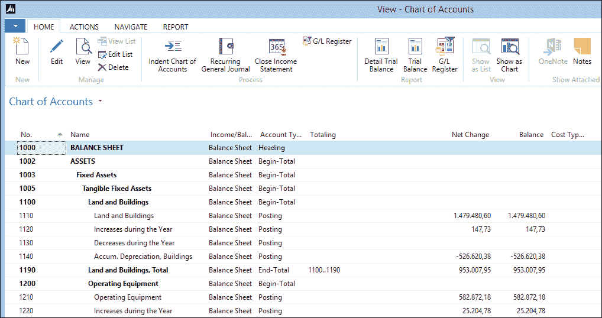

Microsoft Dynamics NAV 还有一些其他特殊的科目：**标题**、**开始总计**和**结束总计**科目。

使用这些账户，你可以使会计科目表更易于阅读。总账科目内的账户会自动缩进。

## 过账科目

在创建新的过账科目时，有几个选项可以选择。大多数选项不是强制性的，但它们使得在生成条目时更容易推动最终用户使用正确的账户。

让我们通过打开**总账科目卡**来查看选项：

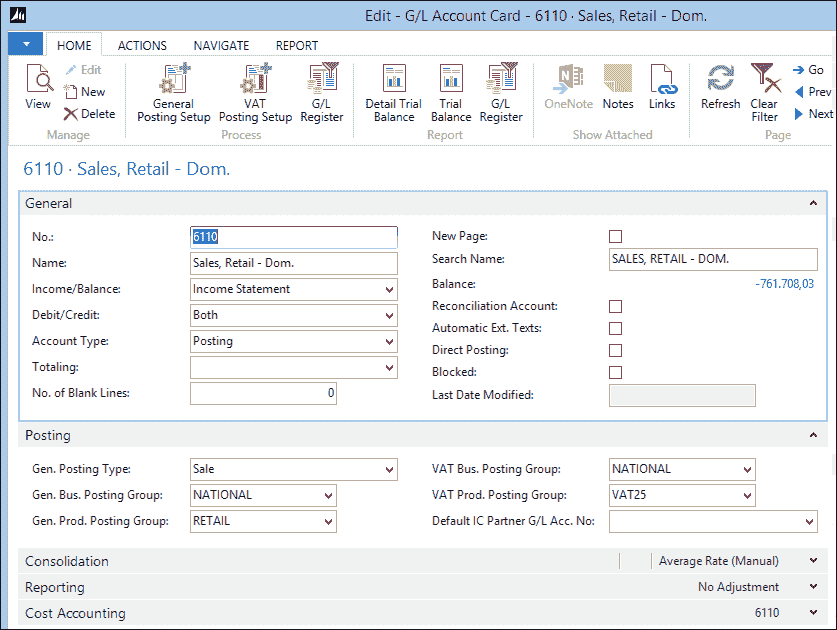

需要做的第一个也是最重要的决定是创建的账户类型。它可以是**损益表**或**资产负债表**。损益表账户在每个新的财政年度重置为零，而资产负债表账户则无限期地继续。资产负债表账户的总和应始终与损益表账户的总和相匹配。

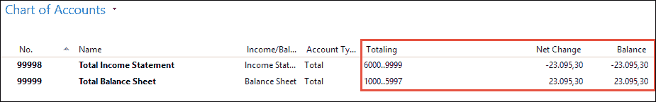

### 小贴士

你可以创建两个总计账户来检查你的总账余额是否准确。对所有损益表和所有资产负债表进行总计。

您也可以强制一个账户只接受借记或贷记记账。**空白行数**和**新页面**字段在打印报告时使用，对系统没有影响。**对账账户**几乎不再使用，除非您不使用子会计。

**自动外部文本**在您使用此账户在销售或采购文档中时，会自动创建第一章中讨论的额外文本，*Microsoft Dynamics NAV 简介*。

**直接记账**是一个非常重要的选项。强烈建议在账户用于任何记账设置之一时禁用此选项。当**直接记账**启用时，最终用户可以在此账户中创建条目，破坏总账和子管理之间的平衡。我们将在本章后面更详细地讨论这一点。

当您允许**直接记账**时，**记账**选项卡上的字段非常重要。

**通用记账类型**确定账户是否用于增值税计算和过滤的采购和/或销售。更详细的增值税规范由增值税业务和产品记账组确定。一般业务和产品记账组可以用来自动填写这些字段，当使用此账户时。

在**合并**选项卡中，您可以填写在合并两个或多个公司时使用的合并账户。我们将在本章后面讨论合并。

Microsoft Dynamics NAV 允许使用额外的报告货币。这是从欧元在欧洲之前的日子继承下来的，在欧元引入的年份非常受欢迎。今天，它被国际公司使用，例如，一家位于美国的荷兰母公司。在**报告**选项卡中，您可以确定在使用此功能时如何处理汇率调整。

## 增值税与销售税

Microsoft Dynamics NAV 允许计算欧洲增值税和北美销售税。本书中的示例基于欧洲增值税。

对于销售税，使用**税区代码**和**税组代码**字段而不是增值税业务记账组和增值税产品记账组。

## 记录表

如第一章中所述，*Microsoft Dynamics NAV 简介*，当您记账销售或采购文档时，总账的条目是在总账日记账中创建的。因此，让我们更详细地看看这个功能，看看我们能用它做什么。

### 子会计

理论上，您可以用总账条目表来运行 Microsoft Dynamics NAV，但在会计中，我们已经发明了子管理。

子管理非常古老。在计算机发明之前，人们会为所有客户和供应商制作卡片以跟踪他们的余额。更新这些卡片是一个手动且耗时的工作，出错的可能性很高。

在 Microsoft Dynamics NAV 中，这会自动处理。在总账中，我们有四个子管理：

+   **银行**：对于银行账户上的每笔交易，都会创建一个银行账簿条目。所有银行账簿条目的总和应与您的银行账户余额相符。它允许您快速找到付款。

+   **客户**：无论何时向客户销售商品或客户支付客户账簿，都会创建一个条目。它允许您分析支付历史并发出提醒。

+   **供应商**：当您使用供应商购买商品时，系统会创建一个供应商账簿条目。我们可以使用供应商账簿条目来确定哪些发票需要支付。供应商账簿条目是客户账簿条目的相反。

+   **增值税/税**：这些条目帮助我们轻松创建清晰的增值税/税报表。

如前所述，子管理总额与总账匹配非常重要。例如，当您的银行账户余额为**2.846,54**时，总账账户也应具有该金额。

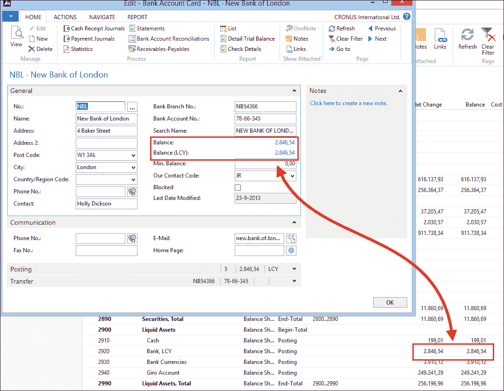

对于此，您可以禁用我们之前讨论的**直接过账**选项。

# 与总账工作

当我们打开总账时，我们可以开始进行交易。让我们讨论一下可能性。

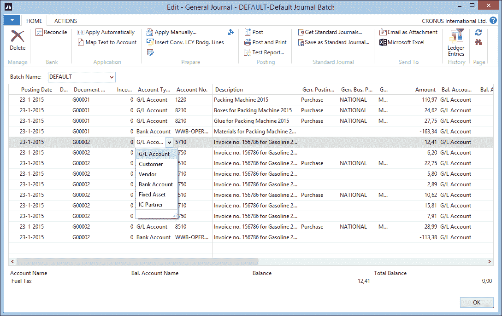

总账的一般字段中最重要的字段是**过账日期**和**单据编号**。这些字段的每种组合的金额总和应该始终平衡。换句话说，任何特定组合的**过账日期**和**单据编号**的所有日记账条目总和应该始终为零。

我们可以发布到不同的账户类型。当我们直接过账到**总账账户**时，很明显会发生什么；将为该金额创建一个新的**总账条目**。当我们选择其他**账户类型**时，子管理将开始工作。例如，当我们选择**客户**时，将创建一个**客户账簿条目**以及一个**总账条目**。使用的**总账账户**由过账组决定，我们将在本章后面讨论。

在这里，我们还可以看到**通用过账类型**、**一般业务**和**产品过账**组以及**增值税业务**和**产品过账**组返回。这些是从我们之前讨论的**总账账户**继承的，但您可以选择不同的一个。

增值税选项决定了自动进行的增值税计算。会创建一个包含增值税金额的增值税条目，并创建额外的**总账条目**。

平衡总账有两种方法。我们可以创建两个具有相同借方和贷方金额的条目，或者我们可以使用余额字段。

让我们通过一个例子来看看这些。我们在一个不规则的供应商那里购买了一些东西。我们只有一张带有金额和增值税的小收据，我们希望将其纳入我们的公司。

金额是 440 元，包括 10%的增值税，因此我们想要创建以下交易：

| 成本 | 增值税 | 当前账户 |
| --- | --- | --- |
| 400,00 | 40,00 | 440,00 |

交易也可以在以下屏幕截图中看到：

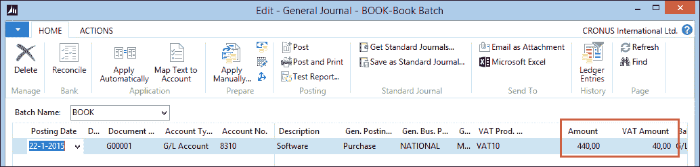

我们可以看到，Microsoft Dynamics NAV 计算了**增值税金额**，并通过填充余额账户，我们只需要一条记录，这条记录总是平衡的。

当我们**导航**这个交易时，我们看到我们有三个**总账分录**和一个**增值税分录**。

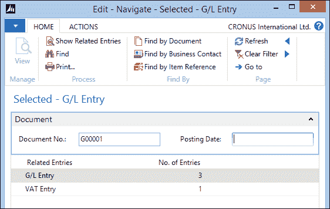

打开**总账分录**显示正确的金额。


在另一个例子中，我们将通过银行日记账创建客户付款。

## 分录应用

银行日记账是一种具有特定页面 ID 的总账。这使得应用程序可以根据相同的企业逻辑具有不同的用户界面。银行日记账的一个特定功能是能够轻松地将付款应用于发票。

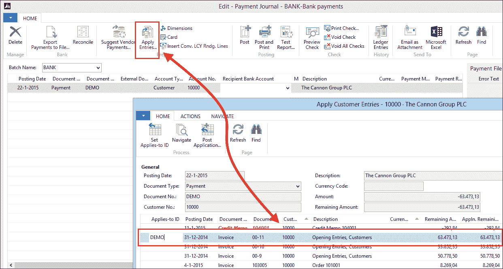

银行日记账不直接发布到总账账户，而是使用其他账户类型。在这种情况下，**账户类型**是**客户**，而**余额账户类型**是**银行账户**。而不是一个包含总账账户的列表，**账户号**字段现在指的是**客户**，而**余额账户号**字段指的是**银行账户**。后者自动从日记账批次定义中填充。

我们将使用**应用分录**功能来确定这笔付款适用于哪张发票。如果我们没有这样做，系统将不知道哪张发票已付款。

另一个选项是自动应用分录，但当客户决定跳过付款时，系统可能会感到困惑，因此强烈建议手动应用分录。

当我们发布这篇日志并导航条目时，我们看到所有必要的子管理都已更新：

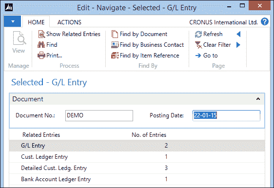

## 发布组

在上一节中，我们讨论了在总账中使用客户编号和银行账户编号作为账户编号。然后系统可以确定使用哪些总账账户编号。但这是如何工作的？

这是通过使用各种发布组矩阵来完成的。大多数发布到总账的应用部分都有自己的发布组表。发布组有两种类型：单层和矩阵层。

单层有直接的总账账户列，而矩阵层有一个额外的设置表：

| 单层 | 矩阵层 |
| --- | --- |
| 客户过账组 供应商过账组 库存过账组 项目过账组 银行账户过账组 FA 过账组 | 通用业务过账组 通用产品过账组 增值税业务过账组 增值税产品过账组 库存过账设置 |

### 注意

每个国家使用不同的会计科目表和法规。本书中的总账科目用于 CRONUS 示例数据库。这些在每个国家和实施中可能都不同。

让我们看看**客户过账组**：

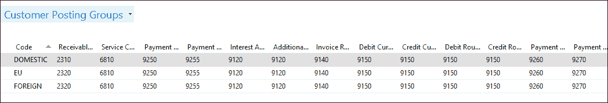

我们看到三个不同的代码及其各自的账户。那么这个代码在哪里使用？让我们打开**客户卡片**：

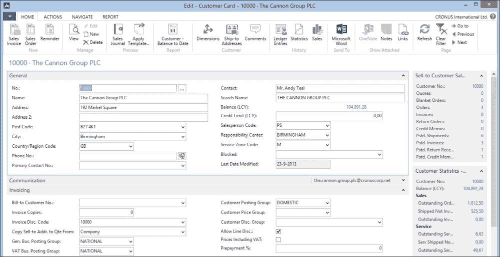

在**开票**选项卡上，我们看到客户过账组。所以这就是确定客户总账科目的依据。

我们还在**客户卡片**上看到了其他过账组。有一个**通用业务过账组**和一个**增值税业务过账组**。

在我们的列表中，它们是矩阵层。因此，它们并不直接指向总账科目。当我们打开**通用业务过账组**时，我们看到如下：

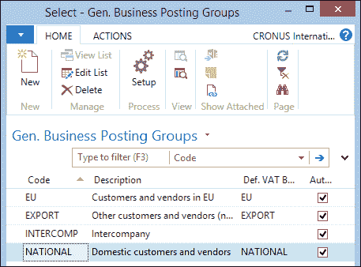

只需一个简单的表格将其连接到**默认增值税业务过账组**。要查看总账科目在哪里定义，我们需要转到**一般过账设置**。

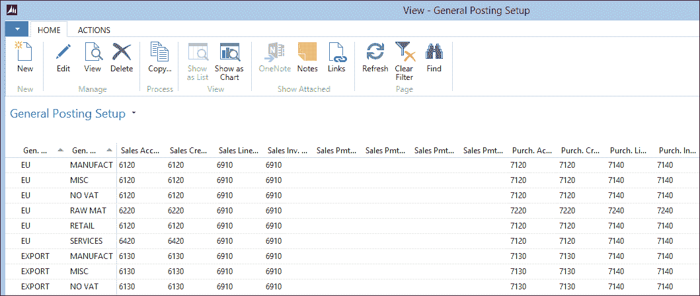

我们可以看到，当与**通用产品过账组**结合时，可以确定总账科目。那么**通用产品过账组**从哪里来？为了找出答案，我们需要转到**项目卡片**：

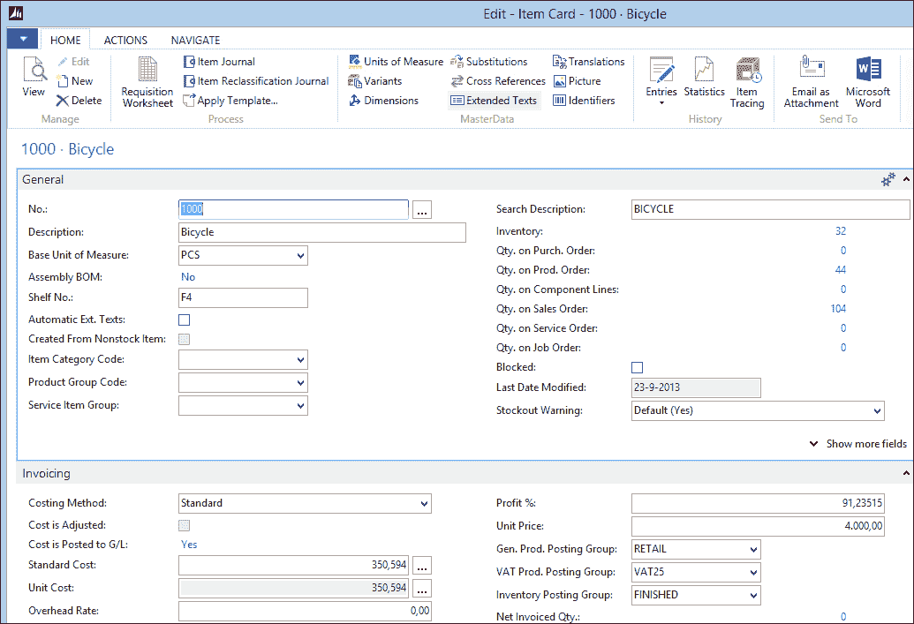

这里我们可以看到相同的选项卡，**开票**，与产品过账组。

我们的旅程在这里结束，因为我们可以看到最后一个矩阵过账组，**库存**。当我们打开这个设置时，我们看到它是通过**库存过账组**和**位置代码**的组合来确定的：

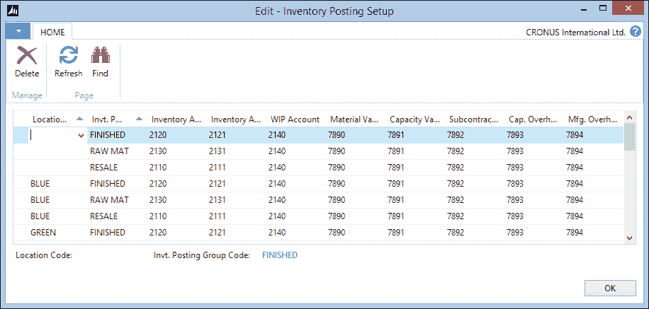

## 维度

除了总账和子科目之外，Microsoft Dynamics NAV 允许第三级过账。可以将无限数量的维度附加到每个过账中，并用于交叉分析系统。

### 注意

使用更多维度会导致在处理交易时数据库活动增加，以及系统设置的复杂性增加。在实施过程中应仔细考虑这一点。

维度起源于旧的项目代码和部门代码功能，允许您合并或区分成本和利润。维度是通过过滤机制确定的。每个主数据记录都可以有维度定义。

让我们看看样本维度代码和值：

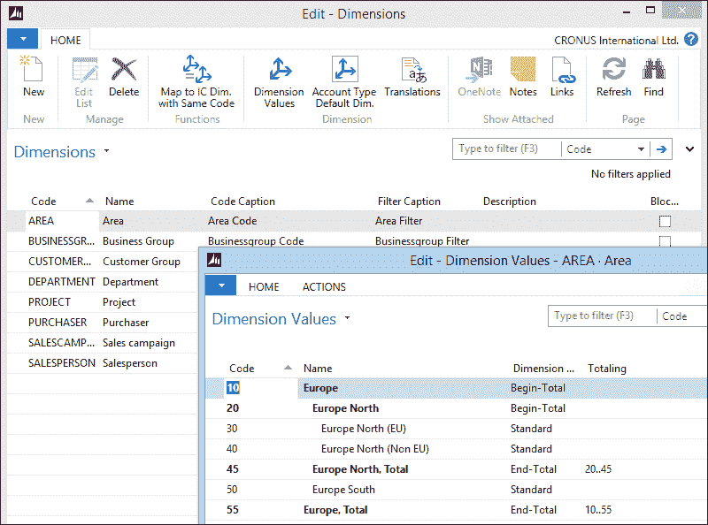

**维度代码区域**有几个**维度值**。在这里，您也可以有总记录，就像在总账中一样。

当多个主数据记录具有相同的维度代码但值不同时，可以设置优先级。还可以阻止发布维度的组合。

维度是分析数据和构建系统以避免错误输入的有力工具。然而，确定这些组合并维护设置需要大量的时间和特殊技能。

当我们讨论报告可能性时，我们将看到更多关于维度的内容。

## 预算

Microsoft Dynamics NAV 同样允许进行预算。我们可以创建自己的预算代码。预算代码可以是一年、一个部门，或者是我们想要尝试并最终丢弃的某个预算。

预算可以在总账科目上进行，也可以在任何维度上进行。

预算期间的决策非常重要。如果您想将月度预算与实际数字进行比较，创建年度预算就没有意义了。大多数公司使用月度预算。我们很可能还想为损益表账户创建预算，而不是为资产负债表创建预算。


将预算导入和导出到 Excel 是一个非常重要的功能。在这里，我们可以轻松复制和粘贴，例如，每个月自动有相同的值。

### 创建预算条目

通过在列中简单地输入新的金额来创建预算条目。在 Microsoft Dynamics NAV 的早期版本中，一个内置机制会根据前一个值和新输入值之间的差异来处理条目的创建。

在 Microsoft Dynamics NAV 2009 中，这从角色定制客户端更改为 C/AL 代码。处理金额的矩阵页面对象是预算矩阵（9203）。此页面使用矩阵管理代码单元（9200）来模拟经典内置算法。

## 会计期间

虽然大多数公司的会计期间从 1 月 1 日到 12 月 31 日分为月份，但可能会有例外。

这由 Microsoft Dynamics NAV 支持，并在**会计期间**中设置：

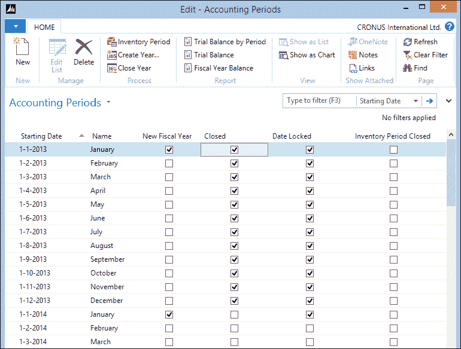

只要存在日期算法，我们就可以自由设置自己想要的发布期间。

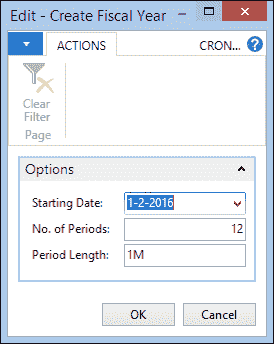

当适当的时候，也应该关闭发布期间。在关闭发布期间时，所有损益表总账科目都设置为零，利润/亏损发布到平衡账户。

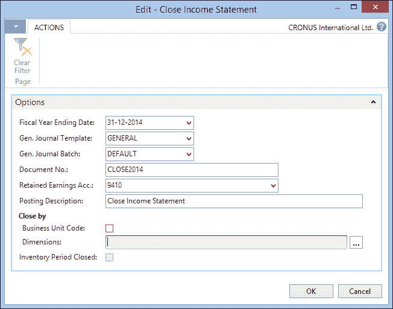

当我们运行此批处理时，总账会填充发布。不建议在此处进行更改。

### 截止日期

在关闭损益表后，仍然可以进行交易，但需要特殊发布日期，称为截止日期。当在发布日期前加上**C**字符时，系统会将其视为特殊交易并允许您发布。


当筛选`01-01-2013..31-12-2013`时，系统将不包括结算日期的条目。筛选`01-01-2013..C31-12-2013`和`01-01-2013..31-01-2014`将包括结算日期的条目。

## 货币

除了有额外报告货币的可能性外，Microsoft Dynamics NAV 中的每笔交易都可以有自己的货币。交易会根据当前的汇率转换为**本地货币**（**LCY**）。

处理货币很简单，只要汇率不变化。之后，它可能会变得复杂。汇率可以像你希望的那样频繁变化，但每天最多只能变化一次。在考虑实施每日汇率变化之前，你应该看看后果。

当你更改货币汇率时，系统中的所有内容都会进行调整，这可能导致你的系统中出现大量交易。更改货币汇率需要以下两个步骤：

1.  输入新值。在我们的例子中，2010 年的新**美元**汇率是**60**：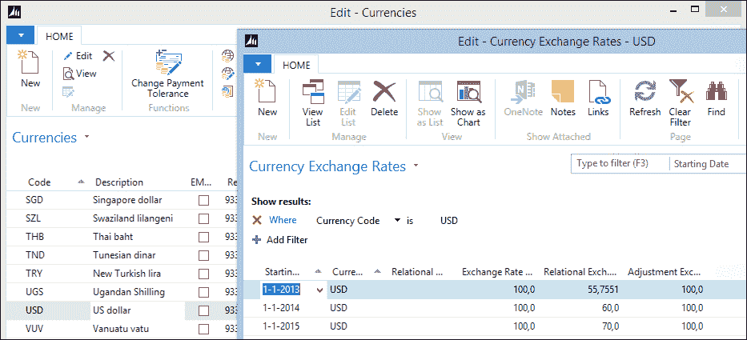

1.  实施价值和生成条目。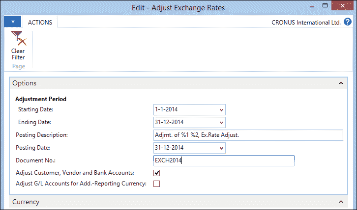

## 合并

合并意味着将两个或多个公司的总账（部分）合并到一个合并公司中。要在 Microsoft Dynamics NAV 中处理合并，首先必须在 G/L 账户中填充合并账户。这些合并账户必须是合并公司中的有效账户。

合并公司是数据库中的一个“虚拟”公司，它仅存在于合并目的。合并公司为每个合并公司都有一个业务单元。

数据可以通过 XML 或 TXT 格式从数据库中导出。

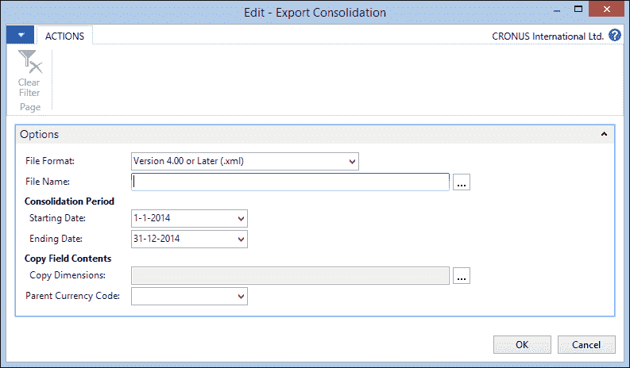

数据通过合并公司在**业务单元**列表中导入。

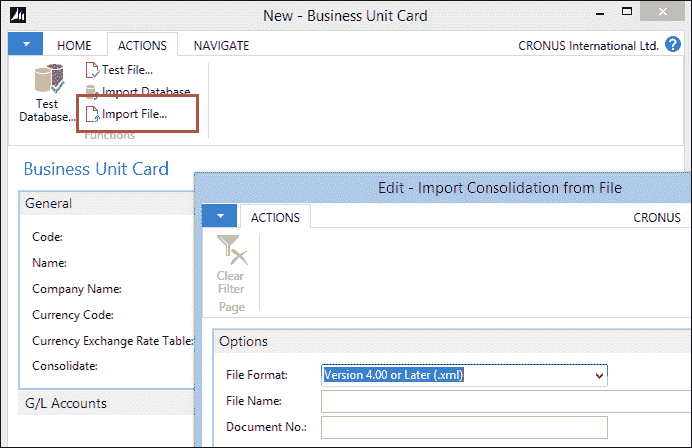

另一个选项是从数据库内部使用**导入数据库**功能导入。

## 增值税申报表

大多数公司可以发出增值税申报表以收回支付给供应商的增值税，并支付从客户那里收到的增值税。这是在增值税申报表中完成的。这是一个简单的列表，我们可以根据增值税条目进行筛选。

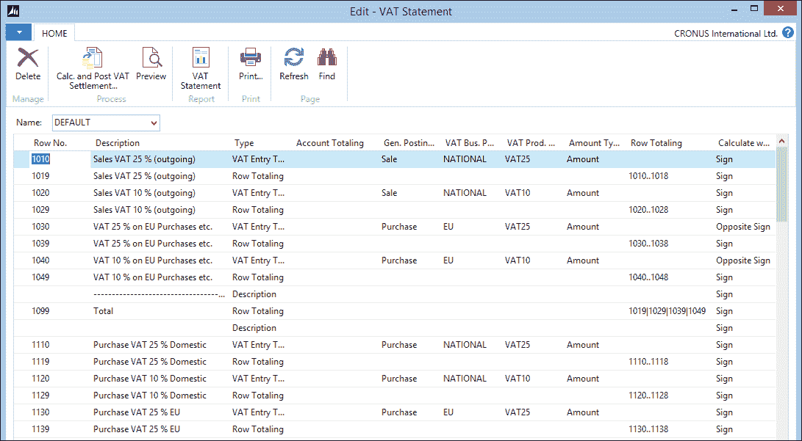

每个国家都有自己的增值税申报表，许多国家在这个应用领域有本地化。

## 数据分析

一些公司因为强制要求而做账，但对生成的信息处理很少，但你可以用系统创建的信息做很多事情。

在大公司中，使用分析工具通常是获得公司资产清晰视图的唯一方法。

### 账户总表

账户总表是一个报告工具。总账户提供了大量信息，通过应用限制总计（流量过滤器），我们可以缩小这些信息。

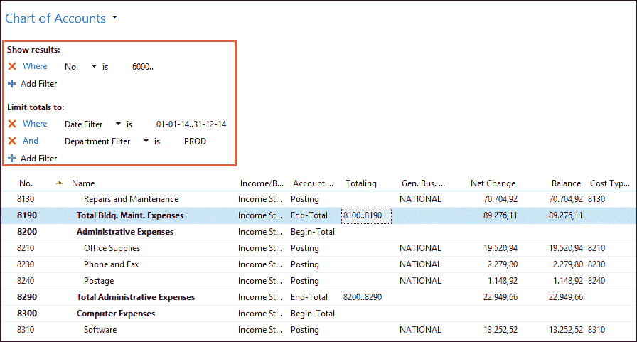

此示例筛选总账账户编号大于或等于 6000 的记录，并将总计限制在 2014 年和部门 PROD。

### 小贴士

您可以通过单击页面名称**账户表**然后**另存为视图**来保存这些视图。选择一个有意义的名称，如 2010 年生产利润表，便于查找。

### 账户报表

对于高级报告需求，我们可以使用账户报表。就像增值税申报表一样，它允许我们在这种情况下对总账分录进行筛选。我们可以根据单个总账账户或使用总过滤。如果筛选变得复杂，我们可以对单个行进行求和并隐藏源行。我们还可以将多达四个维度应用于每个账户报表。

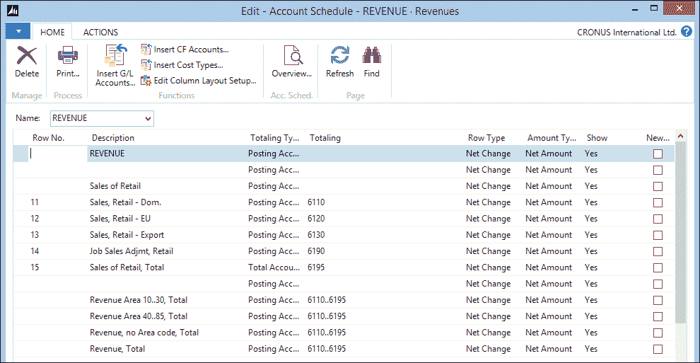

账户报表还允许您定义列布局。您可以在每个计划中使用多个列布局，并在其他计划中重用**列布局**。

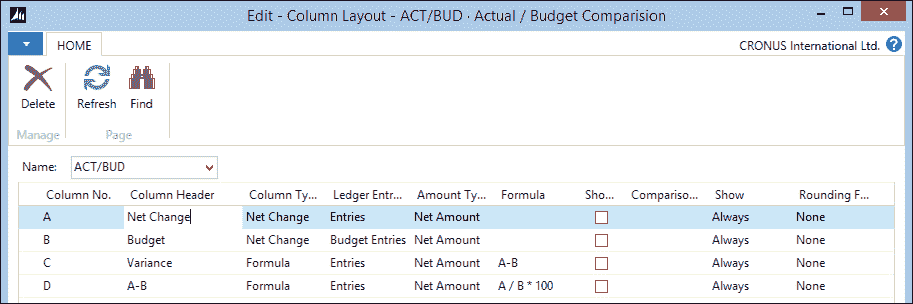

列布局可以包含公式和日期筛选器。我们可以按列显示预算或总账分录。

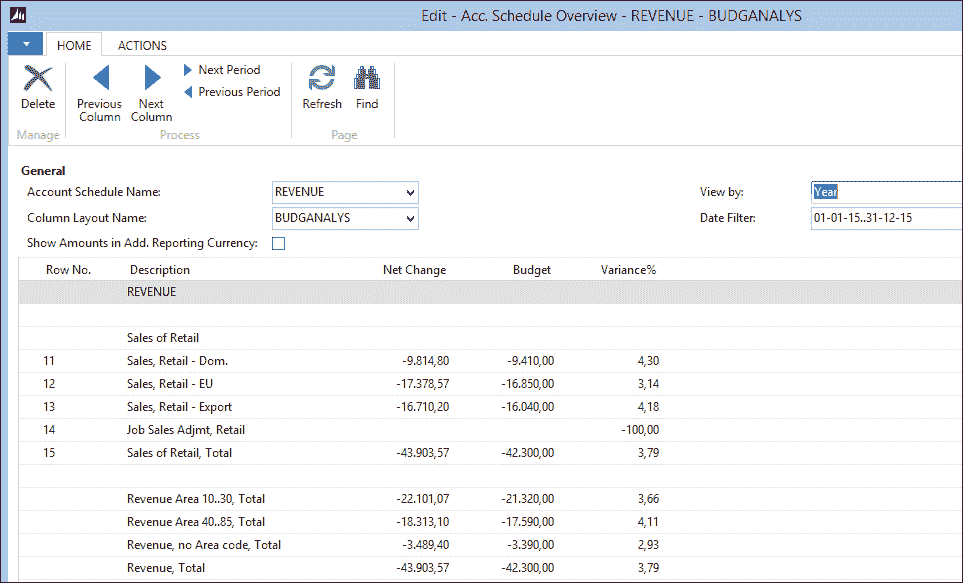

### 注意

有关如何使用账户报表的宝贵信息，请参阅[`dynamicsnavfinancials.com/`](http://dynamicsnavfinancials.com/)

### 按维度分析

如本章前面所述，Microsoft Dynamics NAV 允许在总账中发布无限数量的维度。为了分析这些信息，我们需要告诉系统要比较什么。这是通过按维度分析来完成的。

每个分析视图都有一个唯一的代码。分析视图可以针对临时需求生成并在之后丢弃，或者永久保留在系统中进行定期报告。分析视图生成冗余信息，这些信息始终可以丢弃并重新生成。

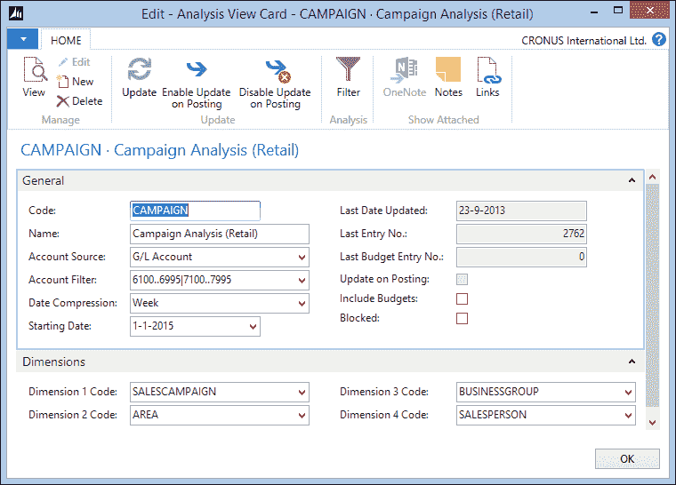

### 小贴士

建议使用单独系统上的数据库副本来使用分析视图，并在夜间更新它们。

当更新时，分析视图包含分析视图条目中筛选器内的所有数据。如果不妥善维护，这可能是一个包含大量数据的巨大表格。

分析视图的结果可以在矩阵中查看，其中所有值都可以用作行、列和筛选器。

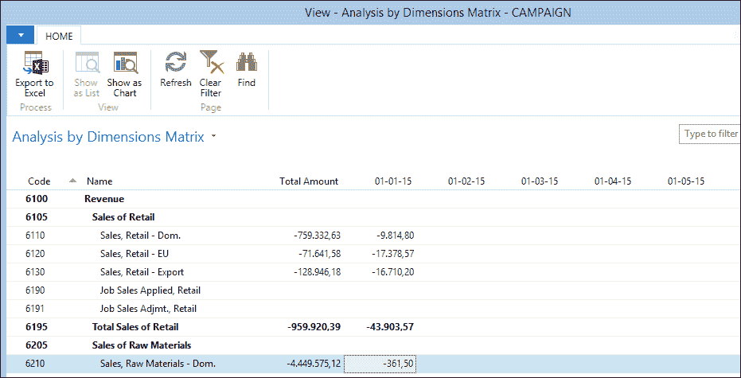

在本例中，我们按区域和销售人员查看销售活动的结果。

## 设置

财务管理有一个单一的总账设置表，这很重要，因为许多这些设置字段将决定 Microsoft Dynamics NAV 的核心行为。

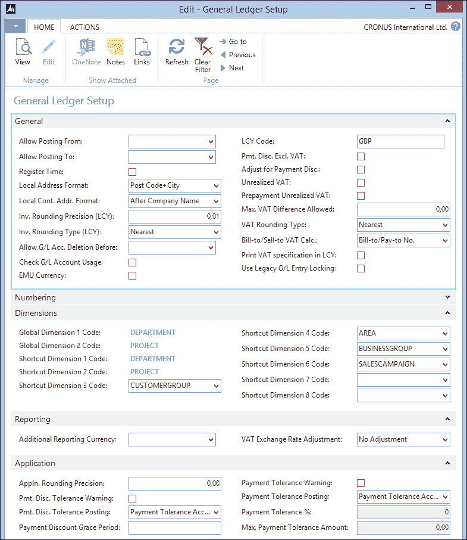

我们将讨论设置选项，以了解它们的功能，并探索为应用程序创建灵活设置的可能性：

+   **允许过账从**和**允许过账到**：这些限制了人们在过账到总账时选择过账日期的自由。强烈建议启用此功能以避免过账日期为 01012090 而不是 01012009。

+   **登记时间**：这允许您在用户每次登录和注销时在时间登记簿中创建条目。

+   **本地地址格式**和**本地联系人地址格式**：这指的是在本地国家打印地址的方式。在 Microsoft Dynamics NAV 中，对于本地值，最好将**国家代码**和**货币代码**留空。

+   **发票舍入精度（LCY）**和**发票舍入类型（LCY）**：这些定义了您的发票舍入是如何计算的。**最接近**是一种最佳实践，并允许您的客户轻松地在他们的系统中登记您的发票。

+   **允许在过账前删除总账科目**：这允许您清理已关闭的财政年度。这个功能几乎很少使用，在使用此功能之前您应该咨询您的合作伙伴。

+   **检查总账科目使用情况**：在删除之前，此选项检查总账科目是否在设置表中使用。

+   **EMU 货币**：这是在欧洲联盟中具有固定兑换率到欧元的货币。在打印报告时，**LCY 代码**字段用于指示公司的本地货币。

+   **不含增值税的付款折扣**：这表明在应用付款折扣时是否计算增值税。当您选中此字段时，您需要考虑**调整付款折扣**字段，因为这将重新计算增值税。

+   **未实现增值税**：只有当您的公司必须处理此问题时才应选中此选项。否则，将导致不必要的过账。这是仅在客户支付发票而不是在开具发票时才有效的增值税。

+   **预付款未实现增值税**：只有当您的公司处理**未实现增值税**并且您想为预付款功能实施此选项时才应选中此选项。

+   **允许的最大增值税差异**：此字段确定最大增值税差异金额。大多数情况下，增值税差异不会超过 0.01。

    ### 小贴士

    您可以通过在增值税业务过账组中选择**完整增值税**来过账增值税差异。

+   **增值税舍入类型**：这决定了增值税余数的计算方式。建议使用**最接近**。

+   **账单/销售至增值税计算**：这允许您更改增值税业务过账组的来源，无论是账单客户或销售客户以及付款供应商或购买供应商。

+   **打印增值税说明**：此字段允许您的发票上的增值税始终以您的本地货币显示。

+   **银行账户号码**：这几乎总是由人工确定的数字序列。大多数公司有最多 10 个银行账户。

+   **Global Dimensions**: 这决定了哪些维度直接记入总账条目和子管理。这些通常用于限制总计，应仔细考虑。

+   **Shortcut Dimensions**: 当您输入日记账和文档时，这些维度更容易访问。它们可以很容易地稍后切换。

+   **Additional Reporting Currency**: 这是一个对跨国公司有用的功能。记住，如果汇率发生变化，这需要额外的努力。您可以稍后更改它，但将启动一个批处理作业，如果您有大型数据库，这可能需要很长时间。

+   **VAT Exchange Rate Adjustment**: 这使得在报告货币汇率变化时重新计算增值税成为可能。在激活之前，请仔细考虑这一点。它很可能会生成难以分析和使用的信息。

+   **Appln Rounding Precision**: 这可以用来允许在应用不同货币时进行舍入差异。

+   **Pmt. Disc. Tolerance Warning**: 当此字段被勾选时，每当有差异被记入时，都会出现警告。

+   **Pmt. Disc. Tolerance Posting**: 这决定了支付容差金额是记入特殊账户还是正常折扣账户。

+   **Payment Discount Grace Period**: 这可以用来决定当人们支付延迟一两天时，是否仍然扣除折扣金额。

+   **Payment Tolerance Warning**: 当容差金额记入总账时，此选项将显示警告。

+   **Payment Tolerance Posting**: 这决定了是否使用特殊总账账户来记入此金额。

+   **Payment Tolerance %**: 这决定了容差百分比。要更改此值，将使用一个批处理函数来更新开放条目。

+   **Max. Payment Tolerance Amount**: 此字段设置金额的最大值，因此如果百分比设置为 5%，则开出的 100,000 欧元的发票的容差金额不能超过 5,000 欧元。

# 定制财务管理

由于财务管理受政府监管，并且标准功能已经非常完整，因此这个应用领域不太可能有很多变化，尽管我们有一些功能更改的例子。

### 注意

本章中的示例包含在我们在第二章中使用的对象中，*一个示例应用*。

## 销售行描述到总账条目

当我们记入销售发票时，系统将根据销售行生成总账条目。为了避免创建过多的条目，它们被压缩。这是通过使用缓冲表，即发票记入缓冲来完成的。

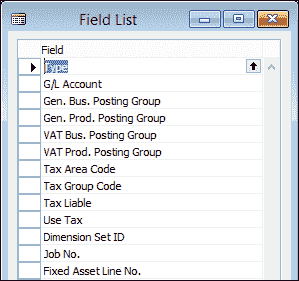

只有在前面列出的字段的组合下，才会创建一个总账分录记录。正如我们所看到的，描述不是其中之一。这导致总账分录具有销售头部的过账描述，这在会计师查看总账分录时常常令人困惑。

作为例子，我们将生成一张销售发票，其中包含一个总账科目行，销售这些书籍之一。

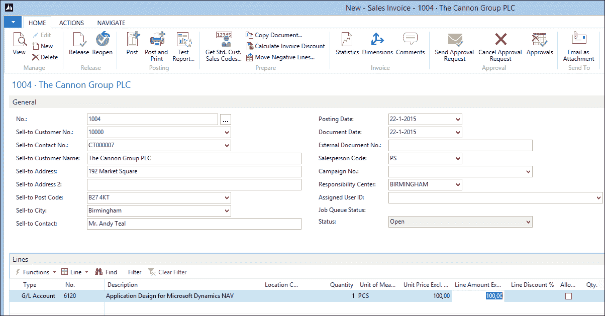

当我们过账这张发票时，我们会得到这些总账分录。注意，描述已经消失了。

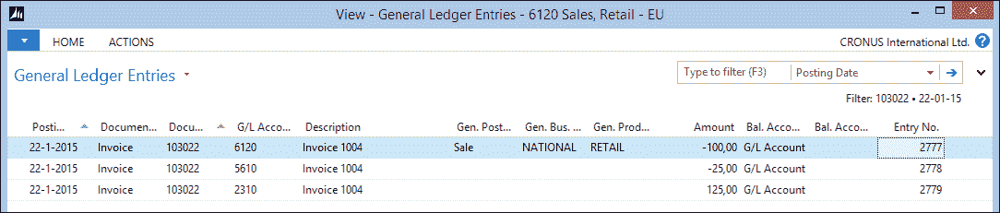

要改变这种行为，我们必须更改**发票过账缓冲**表。描述字段需要作为唯一组合的一部分，因为分组是在`Sales-Post Codeunit (80)`中的`UpdInvPostingBuffer`函数中使用`FIND`命令完成的：

```cs
UpdInvPostingBuffer()
...
InvPostingBuffer[2] := InvPostingBuffer[1];
IF InvPostingBuffer[2].FIND THEN BEGIN
  InvPostingBuffer[2].Amount := 
    InvPostingBuffer[2].Amount + InvPostingBuffer[1].Amount;
  ...
  InvPostingBuffer[2].MODIFY;
END ELSE
  InvPostingBuffer[1].INSERT;
```

这需要以下两个步骤：

1.  我们需要将描述字段添加到表中。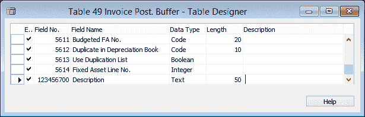

1.  我们需要将这个新字段添加到键中。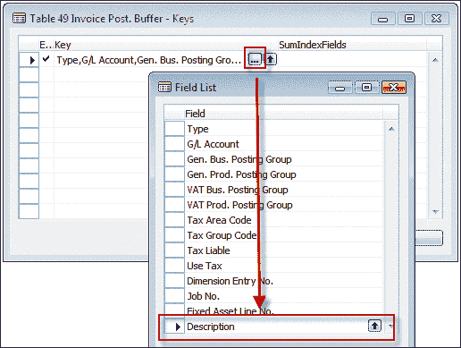

    ### 小贴士

    Microsoft Dynamics NAV 中的键只能包含 252 个字节，所以请小心不要向这个表添加太多字段。

当这项工作完成时，需要更改填充缓冲表的方式。这是在`Invoice Post. Buffer (49)`表本身的`PrepareSales`函数中完成的：

```cs
PrepareSales()
CLEAR(Rec);
Type := SalesLine.Type;
"System-Created Entry" := TRUE;
...
"Job No." := SalesLine."Job No.";
"VAT %" := SalesLine."VAT %";
"VAT Difference" := SalesLine."VAT Difference";
//* Description >>>
Description := SalesLine.Description;
//* Description <<<
IF Type = Type::"Fixed Asset" THEN BEGIN
  ...
END;
```

我们将要做的最后一个更改是在销售文档的过账程序中。这是我们之前在第二章中讨论的，*一个示例应用*中的 Sales-Post 代码单元（80）：

```cs
IF Invoice THEN BEGIN
  // Post sales and VAT to G/L entries from posting buffer
  LineCount := 0;
  IF InvPostingBuffer[1].FIND('+') THEN
    REPEAT
      LineCount := LineCount + 1;
      Window.UPDATE(3,LineCount);

      GenJnlLine.INIT;
      GenJnlLine."Posting Date" := "Posting Date";
      GenJnlLine."Document Date" := "Document Date";
//* Posting Description now from buffer table >>>
//      GenJnlLine.Description := "Posting Description";
      GenJnlLine.Description :=
        InvPostingBuffer[1].Description;
//* Posting Description <<<
      GenJnlLine."Reason Code" := "Reason Code";
```

我们现在将使用缓冲表中的新字段，而不是销售头部的过账描述。当我们再次过账相同的发票时，这是更改后的结果：

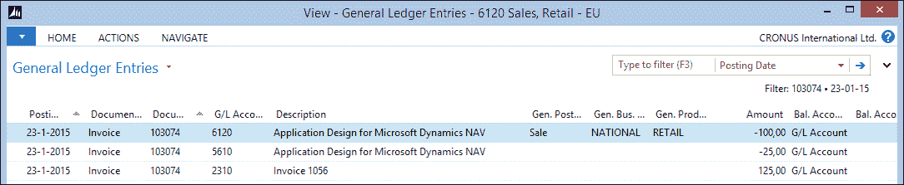

这使得阅读总账变得容易得多。

### 小贴士

如果我们有大额发票并且有不同的描述，这个更改可能会导致我们的系统创建更多的总账分录。在过账程序中创建额外的总账分录需要更多时间，从而导致过账交易运行时间更长，数据库更大。

## 总账分录中的额外字段

虽然总账分录表有很多信息，但一些公司希望在过账过程中添加额外的字段并填充这些字段。

对于这个例子，我们将使用来自第二章，*一个示例应用*中的网球场应用数据库。对于这个业务，将**网球场编号**作为总账分录中的一个字段来分析可能非常有用。

第一步是向总账分录表添加字段，并确保我们有与源表的关系。

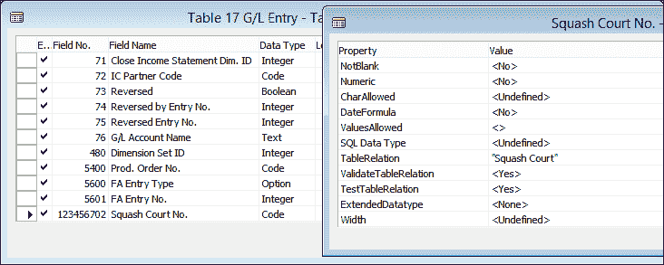

我们已经了解到总账分录是从总账生成的，因此我们还需要在那里添加这个字段。这可以通过复制和粘贴来完成。

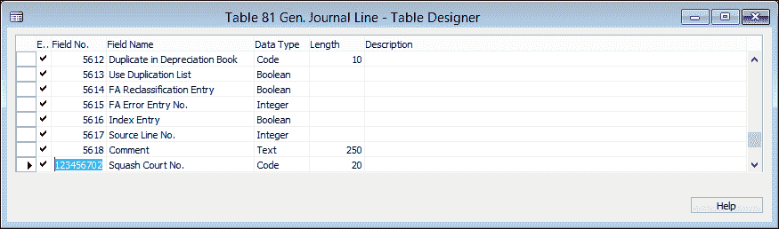

最后一步是确保我们将信息从日记账移动到账簿分录表。就像在我们的示例挤压应用程序中一样，这是在`通用日记账过账行代码单元（12）`中完成的，只是这个代码单元有更多的代码。

我们需要找到创建总账分录的地方，并将我们的字段添加到那里。这是在`InitGLEntry`函数中完成的，如下所示：

```cs
InitGLEntry()
...

GLEntry.INIT;
GLEntry."Posting Date" := GenJnlLine."Posting Date";
GLEntry."Document Date" := GenJnlLine."Document Date";
GLEntry."Document Type" := GenJnlLine."Document Type";
GLEntry."Document No." := GenJnlLine."Document No.";
...
GLEntry."Source Code" := GenJnlLine."Source Code";
//* Squash App. >>>
GLEntry."Squash Court No." := GenJnlLine."Squash Court No.";
//* Squash App. <<<
IF GenJnlLine."Account Type" = ...
```

在 Microsoft Dynamics NAV 中，要添加一个字段到财务过账过程，这所有都是必需的。当然，除非我们使用它，否则这样做是没有意义的，所以一个合乎逻辑的下一步可能是将这个新字段添加到我们之前示例中的发票过账缓冲表。

这显示了在 Microsoft Dynamics NAV 中结合解决方案是多么容易。

# 与财务管理集成

虽然它不太可能对财务管理产生重大变化，但在新的过账程序中创建总账分录可能是必要的。

在上一章中，我们简要指出，在 Microsoft Dynamics NAV 过账交易时，实际的日记账行记录永远不会真正插入到数据库中。它们用作过账期间的临时容器来存储数据。执行实际的`INSERT`操作需要定义日记账模板名称、日记账批次名称和行号，这可能会在数据库中引起锁定。

让我们创建一个新的代码单元，用于创建总账交易。

## 创建总账交易

在创建代码单元后，我们需要设置两个变量，这是将事物过账到总账的最低要求。

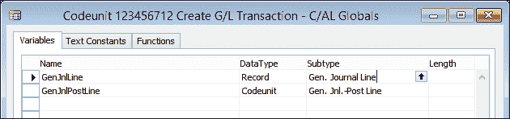

前面的截图显示了两个变量：

+   **GenJnlLine**：这是对`通用日记账行表（81）`的引用。

+   **GenJnlPostLine**：`通用日记账过账行代码单元（12）`创建总账分录、登记簿和其他财务分录。

### C/AL 代码

创建新的总账分录需要一些必填字段。总账日记账行中的所有其他字段要么是基本条目的可选字段，要么在更高级的过账中是必填的，正如我们稍后将了解到的。

我们将首先将此代码写入`OnRun`触发器，如下所示：

```cs
OnRun() 
GenJnlLine.INIT;
GenJnlLine."Posting Date" := WORKDATE;
GenJnlLine.Description := 'Test Entry';
GenJnlLine."Document No." := 'PACKT';
GenJnlLine."Account No." := '6120';
GenJnlLine.Amount := 100;
GenJnlPostLine.RunWithCheck(GenJnlLine);
```

如果我们执行此 C/AL 代码，我们将收到以下错误消息，这表明我们的交易将导致账户余额不平衡：

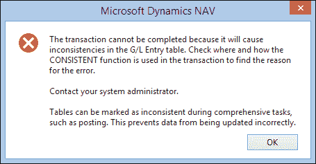

我们可以通过在相同的`OnRun`触发器中创建一个`-100`的平衡交易来修复这个问题，如下所示：

```cs
GenJnlLine.INIT;
GenJnlLine."Posting Date" := WORKDATE;
GenJnlLine.Description := 'Test Entry';
GenJnlLine."Document No." := 'PACKT';
GenJnlLine."Account No." := '6120';
GenJnlLine.Amount := -100;
GenJnlPostLine.RunWithCheck(GenJnlLine, TempJnlLineDim);
```

在执行代码单元后，我们可以导航到我们的文档编号，以查看我们创建的总账分录：


这是一个如何与财务管理集成的非常简单的示例；让我们创建一个更高级的示例。

### 高级条目

我们将创建一个新的带有维度的客户账簿分录。为此，我们应该将我们创建的 C/AL 部分之一更改为以下代码：

```cs
GenJnlLine.INIT;
GenJnlLine."Posting Date" := WORKDATE;
GenJnlLine.Description := 'Test Entry';
GenJnlLine."Document No." := 'PACKT2';
GenJnlLine."Account Type" := GenJnlLine."Account Type"::Customer;
GenJnlLine."Account No." := '10000';
GenJnlLine.Amount := 100;
GenJnlPostLine.RunWithCheck(GenJnlLine);
```

但当我们执行此 C/AL 代码时，我们收到以下错误信息：

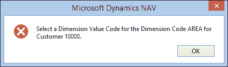

这意味着我们需要实现维度。让我们将以下 C/AL 代码添加到常规程序中：

```cs
...
GenJnlLine.Amount := 100;
GenJnlLine."Dimension Set ID" := 3;
GenJnlPostLine.RunWithCheck(GenJnlLine, TempJnlLineDim);
```

这将使用维度集条目`3`，其中包含此交易所需的维度。

### 小贴士

MSDN 上的这篇文章[`msdn.microsoft.com/en-us/library/jj552498(v=nav.71).aspx`](http://msdn.microsoft.com/en-us/library/jj552498(v=nav.71).aspx)解释了维度集在 Microsoft Dynamics NAV 2013 架构中的应用。

现在，当我们导航到**PACKT**时，我们看到系统已创建了一个**客户账簿**条目和一个**详细客户账簿条目**。

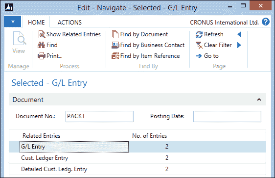

## 看，学，爱

在 Microsoft Dynamics NAV 中，有许多如何与财务管理集成的示例。以下是一个创建总账分录的有趣代码单元列表：

+   `销售过账（80）`

+   `采购过账（90）`

+   `作业计算在制品（1000）`

+   `检查管理（367）`

+   `销售预付款（442）`

+   `库存过账到总账（5802）`

+   `服务过账日记账管理（5987）`

好吧，进去看看这些代码单元，了解微软是如何进行集成的。

# 摘要

在本章中，我们探讨了 Microsoft Dynamics NAV 的财务核心。理解条目流程很重要，因为它是设置过账组的方式。定期检查子管理是否与总账平衡是很重要的。

如果系统设置正确，报告的可能性将提供很大的洞察力。在运行系统中更改设置选项时要小心。

在下一章中，我们将探讨这个模块的相反面；关系管理。虽然财务管理系统很严格，但关系管理系统是灵活且可扩展的。
