# 第七章。仓储与物流

在前面的章节中，我们探讨了公司在生产和贸易业务中如何使用 ERP。所有这些公司共同努力，将成品运送到零售店，最终消费者可以在那里购买。

在这个过程中，产品会在公司之间移动。这需要使用不同类型的运输工具，如卡车、船只、火车和飞机。可能还需要将产品存储在仓库中，直到它们被售出或运送到商店。

越来越多的公司决定外包物流而不是拥有自己的运输。在这种情况下，物流可以成为供应链的一个独立部分。本章讨论了这一过程及其对 ERP 系统的影响。

物流公司的特定方面之一是，他们处理的产品不是他们的财产。尽管它们是消费者产品总成本的一部分，但他们并不关心其库存的详细价值。物流公司将其仓库处理、存储和运输作为服务出售。

Microsoft Dynamics NAV 没有内置功能来处理这个问题，因此在本章中，我们将讨论如何设计一个应用程序来完成这项工作。

对于这项业务有几种附加解决方案，在现实世界中，这些附加组件应被视为潜在解决方案进行评估。在本章中，我们将讨论如何设计和创建一个基本框架，以便轻松扩展而不会增加太多复杂性。

### 注意

本章提供的对象不应在实际客户场景中实现。它们仅用于本章的示例目的。

阅读本章后，您将更好地了解如何设计一个稳固的附加解决方案，以及如何将其集成到标准的 Microsoft Dynamics NAV 产品中。

# 如何阅读本章

在本章中，我们将展示如何设计 Microsoft Dynamics NAV 的附加组件。在这个例子中，我们为一家仓储与物流公司创建了一个解决方案。这是因为它与 Microsoft Dynamics NAV 中现有的功能（仓储）相似，并且是构建在标准应用程序功能之上的好例子。

我们将首先分析业务流程，然后讨论为什么我们不会使用标准应用程序功能，并解释我们新应用程序将拥有的模块。

下一步是更深入地研究这些模块，并为每个模块定义设计模式。然后我们将像前几章一样遍历应用程序，并逆向工程它来解释所有部件是如何设计的。

要做到这一点，我们需要下载并安装应用程序。随着本章的深入，我们将讨论在 Microsoft Dynamics NAV 开发环境中可以打开和分析的大部分对象。

### 小贴士

随着我们在本章中的进展，打开对象以了解更多信息。这些对象功能丰富，本书无法详细讨论所有内容。

## 章节对象

在本章中，需要一些对象和**动态链接库**（**DLL**）文件。附录

## 流程

为了为特定市场设计一个稳固的解决方案，我们首先需要分析业务流程，看看标准产品与流程的契合点和差距在哪里。

将使用此解决方案的公司是物流提供商。这些公司不买卖产品，而是销售物流服务，如运输和仓储。

在供应链中可能存在多个时刻需要这些公司。产品通常在全球各地的公司制造，然后运送到其他地方的消费者手中。产品可以覆盖很长的距离，如下面的图表所示：

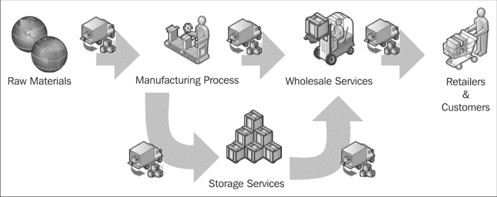

## 使用标准功能

与许多 ERP 系统一样，Microsoft Dynamics NAV 是为人们处理自己的产品而设计的，并支持我们在前几章中看到的成本核算过程。对于物流服务提供商来说，这种库存控制和估值功能不是必需的，因为产品不是他们的财产。这意味着他们可能希望使用仓库功能而不需要项目账簿条目，这在 Microsoft Dynamics NAV 中是非常困难的。

物流服务提供商还提供运输解决方案。他们将取走产品并将其交付给客户。这个过程包括在路线上结合不同的停靠点，从而实现更经济的运输方式。此功能在 Microsoft Dynamics NAV 中不可用。

## 定义模块

在本章中，我们将在 Microsoft Dynamics NAV 之上设计三个新的模块，这些模块相互集成，并且仍然可以单独使用。这些模块还通过**销售与采购文档**与标准应用程序集成。

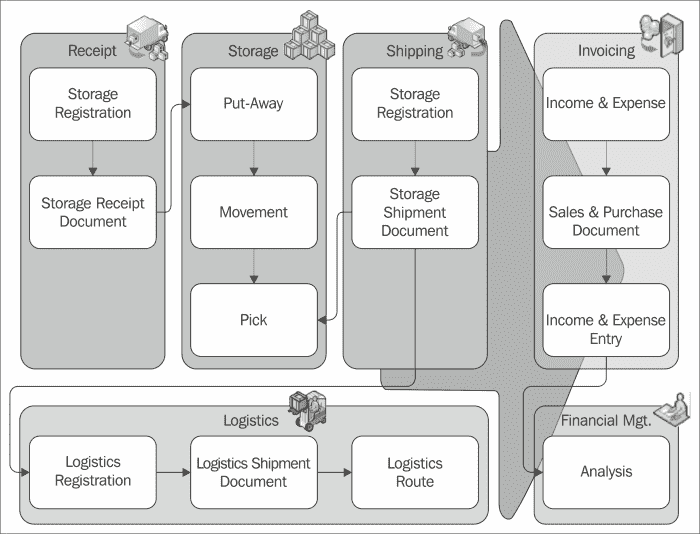

### 仓储

应用程序的第一部分是仓储模块。这使我们能够接收和发送产品，并在仓库内部移动它们。此模块的设计与我们在第六章中讨论的标准应用程序中的仓库文档非常相似，即*贸易*。

### 物流

物流模块支持路线规划，将产品运送给消费者。这集成到存储模块中，但也可以从标准应用的销售发货文件中使用。

对于这个模块的设计，我们参考了在第五章“生产”中讨论的 Microsoft Dynamics NAV 生产订单。路线和发货有一个**状态**字段，表示进度，类似于生产订单。

### 开票

存储和运输服务将定期或当产品离开仓库时向客户开票。

为了做到这一点，我们将使用标准的 Microsoft Dynamics NAV 开票解决方案，但我们将在物流解决方案和开票功能之间添加一个新的**收入与支出**模块。

我们已经探讨了工作分录的设计以及它们的开票方式。这将在下一章中讨论。

# 存储应用

在一个仓储仓库中，产品时刻在进出。仓储公司与生产工厂的一个主要区别在于，仓储公司并不关心他们具体拥有哪些产品；他们关心的是存储所需的空间量。这个业务是销售存储处理、存储空间和运输服务。

对于我们的应用，我们假设我们的仓库有一个收货区域和一个发货区域，一个中间的临时区域和一个大批量存储区域。如果我们简化仓库，它可能看起来像以下平面图：

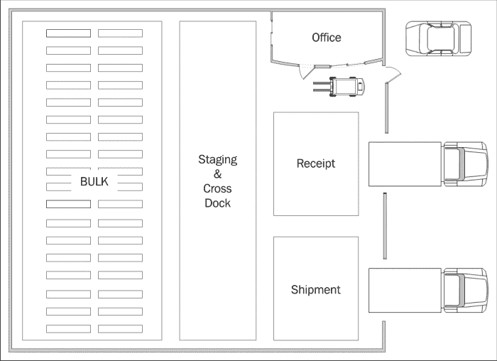

让我们详细看看各个部分：

+   **收货单**：当产品到达时，它们首先从卡车上卸载到收货区域。这通常位于卸货码头附近，以便卡车在产品卸载并检查装货文件后能快速移动到下一个目的地。从收货地点，产品应尽可能快地被储存起来，因为另一辆卡车可能即将到来，我们需要空间。现在产品可以前往临时区域或大批量区域。

+   **临时区域**：临时区域是一个中间区域，产品可以在此储存，但一旦仓库过于繁忙，无法在大量区域妥善储存，且我们需要收货区域的空间时，产品会迅速离开仓库。

+   **发货**：当产品离开仓库时，它们首先会被移动到发货区域。这使我们能够在卡车到达时快速装载，并轻松地将装货文件与实际产品进行比较。

+   **大批量存储**：当我们预计产品将在仓库中停留较长时间时，它们将被储存在大批量区域，在那里我们可以定义货架。根据系统设置，一个货架可以容纳一个或多个产品。

## 文档

第一步是通过创建收据文档来登记将要进入我们仓库的内容。在以前的日子里，我们经常通过电话或传真接收这些信息，但今天大多数公司使用接口，如 EDI 和 Web 门户来处理。这使我们避免在系统中输入信息时出错，并允许我们自动填充收据文档。

收据文档将被组合成上架文档，以记录从一个区域到另一个区域的转移。软件还将建议一个货架来存储产品。

当产品离开仓库时，我们的客户也会注册一个出货文档。在他们调用时，我们将开始订单拣选过程并合并出货。拣选文档将告诉我们产品存储在哪个货架上。

顺便说一句，可能还需要在仓库内移动产品。这将在内部移动文档中记录。

存储文档与物流文档结构相关联，我们将在本章后面讨论物流时看到这一点。

## 看，学，爱

在第二章中，*一个示例应用程序*，我们学习了如何使用日记和条目设计模式来注册使用。在本章中，我们将继续这一做法并添加一些文档设计模式结构。

为了设计我们的应用程序，我们将查看现有 Microsoft Dynamics NAV 组件的设计方式，并重用它们。

### 小贴士

在[`community.dynamics.com/nav/w/designpatterns/default.aspx`](https://community.dynamics.com/nav/w/designpatterns/default.aspx)，你可以找到数十种 Microsoft Dynamics NAV 设计模式，包括本章中使用的许多模式。

### 日记

我们应用程序的核心是**存储日记**，它是由与之前**挤压日记**相同的模板创建的。区别在于仓库工作人员使用文档而不是日记。

### 文档

我们将支持我们之前讨论的五种文档类型，即收据、出货、上架、拣选和移动。这些文档可以由最终用户手动创建，也可以自动创建。我们还将提供一个接口结构，允许客户注册收据和出货。

由于所有文档都具有相同的结构和大部分相同的字段，它们都位于同一张表中以共享业务逻辑。

### 小贴士

对于多种文档类型使用相同的表可以更容易地在应用程序中共享业务逻辑。

这也是在我们在第六章中讨论的标准 Microsoft Dynamics NAV 销售和采购文档应用程序中完成的，*贸易*。

### 管理数据

为了定义我们在仓库中存储的内容，我们将使用一个名为**Product**的新表，它与标准系统中的 Item 表类似。通过创建一个新表，我们将提高我们解决方案的可升级性，这将帮助我们更好地控制自己的应用程序，换句话说，不太可能受到微软在标准产品中实施的变化的影响。

## 绘制设计模式

如果我们将这些信息组合成表格和事务结构，它将看起来像以下图表：


实际库存保存在**Storage Entries**中。通过筛选仓库代码、区域代码或货架号，可以计算库存。

### 共享表

**Storage & Logistics**附加应用程序也有一些共享表。为附加程序的每个部分创建产品或仓库表是没有意义的。我们选择共享用于角色中心定义的设置和提示表。Storage & Logistics 应用程序有四个角色中心。

### 提示

通过共享提示表，将相同的提示放置在不同的角色中心上要容易得多。如果我们为每个角色中心创建一个表，我们每次更改请求都需要复制和粘贴提示定义到表中。

## 入门

在我们的场景中，我们将为 CRONUS International Ltd.公司运送和接收产品，我们为该公司提供运输服务。我们在奥地利、比利时、捷克共和国、丹麦、德国、大不列颠、冰岛、荷兰、挪威、瑞典、斯洛文尼亚、斯洛伐克和美国都有仓库。

每个仓库都有与本章前面解释的基本布局相同。从仓库出发，我们规划路线将产品运送到消费者。初始化应用程序并重新启动应用程序后，**角色中心**应该看起来像这样：

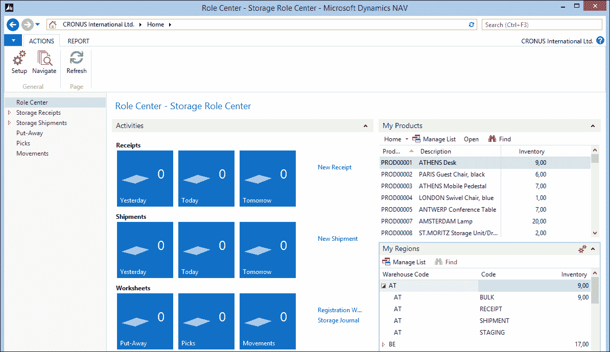

让我们详细看看各个部分：

+   **活动**：此窗口显示仓库地面的工作流程

+   **我的产品**：这包含我们库存中的所有客户产品

+   **我的区域**：这使我们能够看到我们的仓库中库存在哪里

## 开启余额

开启余额是使用存储日记账创建的。通过使用日记账创建开启条目，我们确保遵循业务规则。

在我们的设计中，我们决定不允许最终用户直接在批量位置注册库存。我们首先接收它，然后创建一个上架单将其移动到批量位置。我们将在本章后面讨论存储单据时看到这是如何完成的。

### 注意

查看**Storage & Logistics Setup (123456701)**页面，了解这是如何在`CreateOpeningBalance()`函数中完成的。

## 产品

产品是我们客户所持有的物品的参考，我们将其保存在库存中。它们包含一个**账单客户编号**和一个**客户物品编号**。这使得我们能够，例如，为两个不同的客户保留编号为**70000**的物品。

我们还可以查看和设置此产品的**存储价格**，我们将在稍后用于开票。

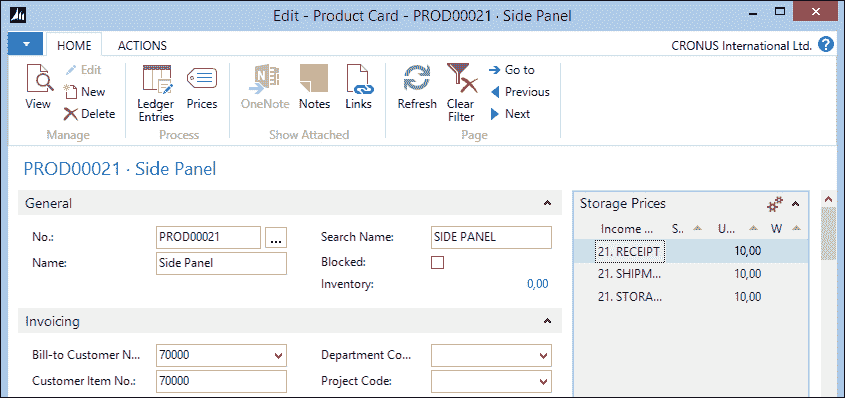

### 仓库

仓库是一个有地址的物理建筑。为了将产品从一个仓库移动到另一个仓库，我们需要将它们运走，创建一个路线，然后在另一个建筑中实际接收它们。

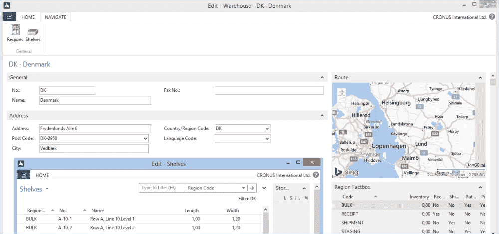

### 区域

区域是仓库的一部分，用于特定的存储活动。在我们的例子中，我们有收据、暂存、批量运输和装运区域。为了将产品从一个区域移动到另一个区域，我们应该创建一个上架、移动或拣选文件。

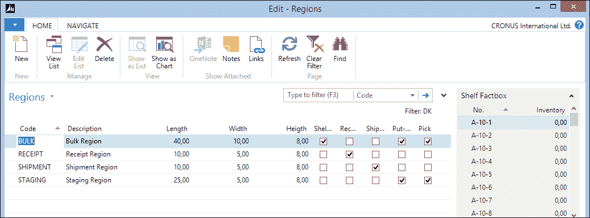

### 货架

货架是区域的一个特定部分。货架的特定代码通常表示其在仓库中的位置。例如，我们的仓库有两排，A 和 B，每排有 18 行和 8 层，每个货架可以存放一个托盘。

## 注册工作表

仓库流程从接收产品开始。为了在产品抵达码头时节省时间，我们要求客户提前注册他们的产品。这是在存储注册工作表中完成的。

在我们的应用程序中，我们模拟了与客户 CRONUS International Ltd 的界面。我们可以直接从角色中心启动界面。

1.  我们从**角色中心**启动**CRONUS 存储导入收据**报告，如下截图所示：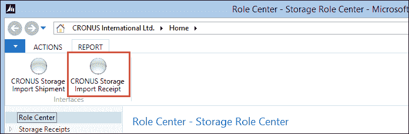

1.  系统弹出并要求输入**存储注册代码**。

1.  我们将从列表中选择**CRONUS**并开始导入过程。

1.  在此之后，我们打开**注册工作表**。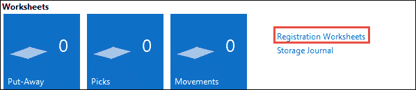

1.  当我们现在打开注册工作表时，我们看到 CRONUS 今天将发送给我们什么。这使我们能够准备我们的业务，可能移动一些产品，并安排资源。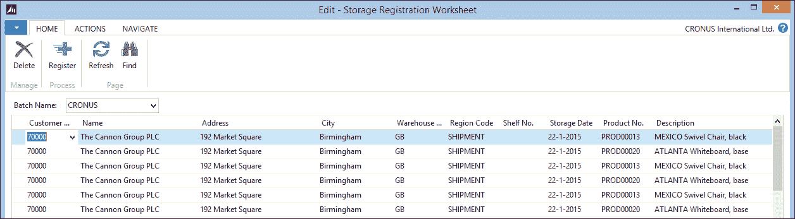

1.  我们现在可以注册这个工作表，这将为我们创建收据文件。

## 存储文件

我们使用文件来确定哪个产品放在哪里。在系统中手动创建这些文件需要大量工作，因此在我们的应用程序中，这是自动完成的。

### 收据

默认情况下，所有接收到的产品都存储在**收据**区域。这个区域没有货架。如果需要，我们可以更改区域代码。

在我们注册收据文件后，我们在**收据**位置有库存：

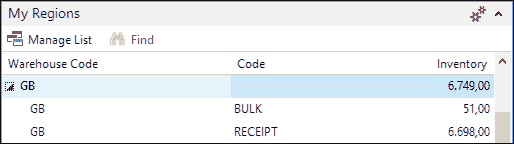

由于这是一个相对较小的区域，我们需要尽快将产品移动到批量位置。这是通过上架文件完成的。

### 上架

上架文档用于将产品从收货区域移动到批量区域。存储条目告诉我们收货区域有什么，因此我们将该信息复制到一个新的上架文档中。这些文档可以手动创建，并且基于文档上的仓库信息，我们可以将数据拉入文档。

另一个要求是有一个自动化的流程，根据收货区域的所有内容创建上架文档。

1.  为了提供这项功能，我们创建了**收货到上架（123456715）**报告。这个仅处理报告读取收货区域的存储条目，并基于某些预定义的规则创建上架文档。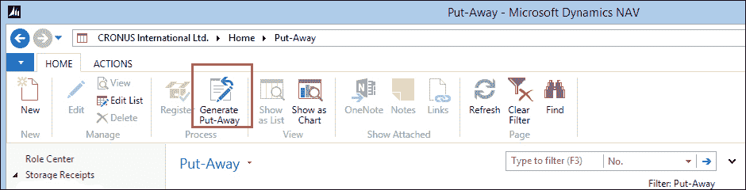

1.  报告根据类型为**收货**和具有库存的存储条目进行筛选。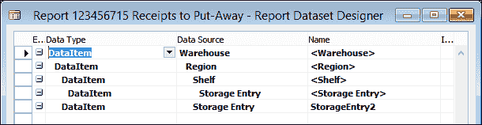

1.  它为每个仓库创建一个上架文档，建议仓库中的第一个上架区域。对于每个`StorageEntry`，将启动`CreateLine`函数。让我们看看这个 C/AL 代码：

    ```cs
    CreateLineCreateLine()

    FindOrCreateStorageHdr;
    Region2.SETRANGE("Warehouse Code");
    Region2.SETRANGE("Put-Away", TRUE);
    Region2.FINDFIRST;

    WITH StorageEntry DO BEGIN
      NextLineNo := NextLineNo + 10000;
      StorageLn."Document Type" := StorageHdr."Document Type";
      StorageLn."Document No." := StorageHdr."No.";
      StorageLn."Line No." := NextLineNo;
      StorageLn."No." := "Product No.";
      StorageLn."Warehouse Code" := "Warehouse Code";
      StorageLn."Region Code" := Region2.Code;
    ```

1.  第一步是检查是否需要创建一个新的存储文档。我们为每个`Warehouse`和`StorageDate`创建一个新文档。

1.  然后，系统通过区域表进行筛选，以找到上架区域。对于每个`StorageEntry`，创建一个`StorageLine`。

1.  运行报告后，我们的上架文档看起来像这样：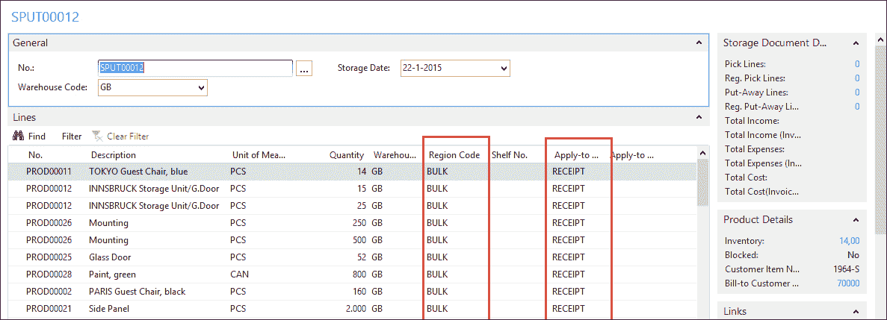

1.  建议的**区域代码**是**BULK**，而**应用区域代码**是**RECEIPT**。

1.  如果我们现在尝试注册此文档，我们将收到错误，因为我们没有输入任何`货架`，因为在这个区域这是强制性的。

    ### 注意

    此检查在`Storage Jnl.-Check Line`代码单元中完成。通过将这些检查移动到这个代码单元，我们确保这些规则在每个过账中都是强制性的。

1.  由于我们依赖系统来跟踪我们的库存，我们还可以让它为我们建议可用的货架。这也是通过批量报告**123456716 生成上架货架**完成的。让我们设计这个报告，并查看`StorageLineDataItem`中的 C/AL 代码：

    ```cs
    Storage Line - OnAfterGetRecord()

    Counter := Counter + 1;
    Window.UPDATE(1,"Document No.");
    Window.UPDATE(2,ROUND(Counter / CounterTotal * 10000,1));

    Shelf.SETRANGE("Warehouse Code", "Storage Line"."Warehouse Code");
    Shelf.SETRANGE("Region Code", "Region Code");
    Shelf.SETRANGE(Inventory, 0);
    Shelf.SETRANGE("Blocked by Storage", FALSE);
    Shelf.FINDFIRST;

    "Shelf No." := Shelf."No.";
    MODIFY;
    ```

1.  对于上架文档中的每个`StorageLine`，它通过基于`Inventory`和`BlockedByStorage`的可用性进行筛选，找到另一个货架。

1.  `BlockedByStorage`字段是一个返回值为真的流程字段，如果货架上使用了仓库文档，将阻止两台叉车停在同一个货架上。

1.  当执行此报告时，我们可以注册此上架文档，并可以看到使用**总账分录**操作从**产品卡片**生成的**存储条目**：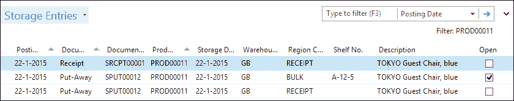

在这里，我们可以看到上架文档已将其条目应用于收货条目。由于我们移动了所有东西，原始条目已关闭，剩余数量设置为零。

此功能与我们创建在第二章中类似，即当将发票条目应用于预订时。

### 运输

一段时间后，当产品存放在库存中，客户可能会发送请求要求运输。运输文档使用与收据文档相同的界面发送。

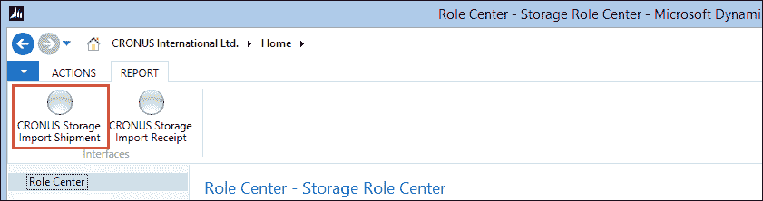

CRONUS 存储导入运输选项

运行**CRONUS 存储导入运输**报告将创建**存储登记表**，我们可以检查并将其注册到运输文档，就像之前收据文档那样。

系统为每个**收货地址**创建一个运输文档。

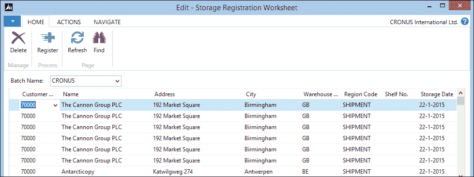

现在，我们必须开始将产品从存储区域移动到运输区域的过程。

### 挑选

将要运输的产品需要使用挑选文档从散装区或预存区挑选。与上架功能一样，我们的应用程序设计提供了一个支持此过程的自动化流程。

创建文档时，我们使用批处理**报告 123456717 挑选**，如下截图所示：

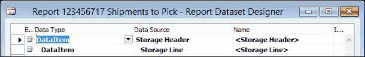

此报告可以将运输合并为一个或多个挑选文档：

```cs
Storage Line - OnAfterGetRecord()

Counter := Counter + 1;
Window.UPDATE(1,"Document No.");
Window.UPDATE(2,ROUND(Counter / CounterTotal * 10000,1));

Product.GET("No.");
Product.SETRANGE("Warehouse Filter Code", "Warehouse Code");
Product.CALCFIELDS(Inventory);
IF Quantity > Product.Inventory THEN
  ERROR(Text001, Quantity, Product.Inventory, "No.");

QtyToPick := Quantity;

StorageEntry.SETCURRENTKEY("Product No.");
StorageEntry.SETRANGE("Warehouse Code", "Storage Header"."Warehouse Code");
StorageEntry.SETRANGE("Product No.", "No.");
StorageEntry.SETRANGE(Open, TRUE);
IF StorageEntry.FINDSET(TRUE) THEN REPEAT
  StorageEntry.CALCFIELDS("Blocked by Storage");
  IF NOT StorageEntry."Blocked by Storage" THEN BEGIN
    IF QtyToPick >= StorageEntry.Quantity THEN
      QtyToPick := QtyToPick - StorageEntry.Quantity
    ELSE BEGIN
      StorageEntry.Quantity := QtyToPick;
      QtyToPick := 0;
    END;
    CreateLine(StorageEntry);
  END;
UNTIL (StorageEntry.NEXT = 0) OR (QtyToPick = 0);

IF QtyToPick > 0 THEN
  ERROR(Text002, "No.");
```

首先，系统检查产品是否存放在这个仓库中。如果在这里，它开始浏览存储条目以寻找可用的货架。在这里，我们也使用**由存储流程阻塞**字段来避免两名员工争夺同一产品。

我们应用程序中的一个功能需求是避免有一半的运输需要挑选并阻止**运输**区域不完整。如果挑选可用库存不足，系统将显示错误。

挑选创建后，我们更新**运输单上的挑选状态**字段。在以下截图中，我们可以看到有三个**挑选行**附加到这个运输单上：

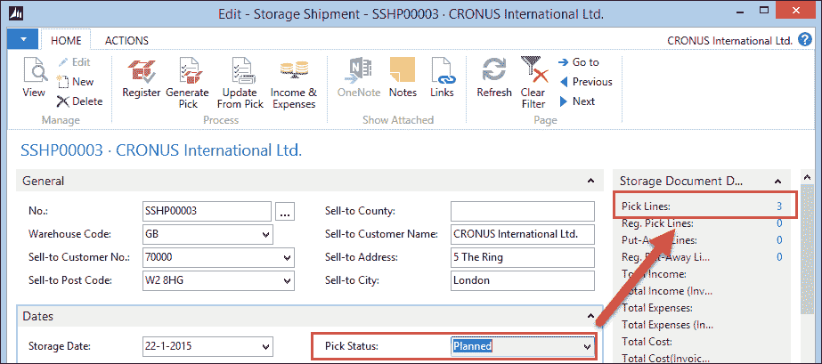

当我们点击**3**时，系统打开行。双击行将打开挑选文档。

### 小贴士

要影响双击事件，将**RETURN**快捷键分配到页面上的一个操作。

在挑选文档注册后，运输状态变为**完全挑选**。我们可以看到**挑选行**已注册：

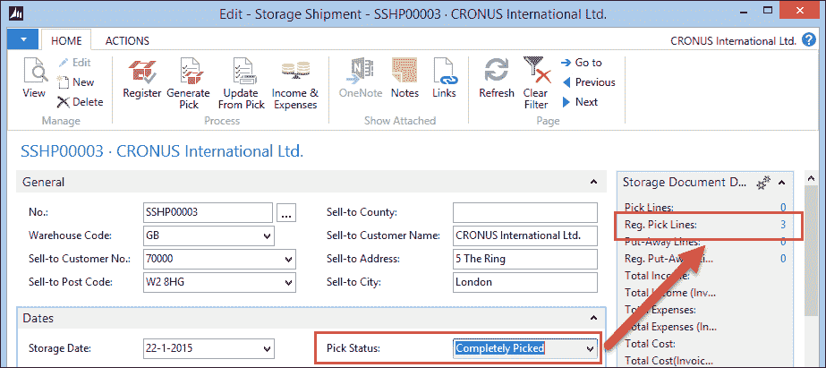

在可以注册运输之前，最后一步是使用挑选文档中的**应用至存储条目编号**更新存储行。为此步骤，我们设计了一个专门的报告**更新存储运输（123456718）**，可以从**存储运输文档**启动，如下截图所示：

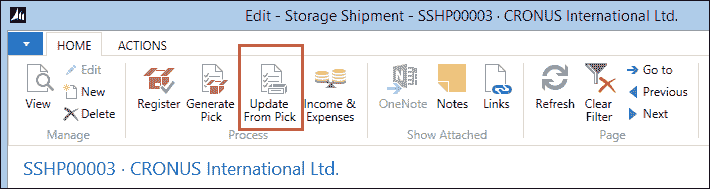

在此之后，可以注册运输。产品现在已经离开我们的仓库，正在前往客户的路上。

# 物流应用程序

类似于标准应用程序中的生产订单，我们物流应用程序中的流程是状态驱动的，而不是交易驱动的。这就是为什么这个应用程序部分没有条目日记。表格可以有存档副本，但它们不是正常注册或过账常规的一部分。

### 注意

对于本章本部分的示例，我们应该将**默认角色中心**更改为**物流角色中心（123456700）**，在**配置文件表（2000000072）**中。

## 绘制设计模式

如果我们查看物流应用程序的结构，我们可以看到典型的过账交易是缺失的。该应用程序使用基于在表格触发器中定义的事件的状态驱动工作流程。


物流运输和运输详情与仓库的运输有很多相似之处。我们选择将它们移动到新表格中的原因如下：

+   **安全性**：在 Microsoft dynamics NAV 中，表格级别对于安全性来说最为重要。如果我们共享这个表格，将无法设置用户以访问物流而不访问仓库或反之亦然。

+   **锁定**：如果两个部门使用同一表格进行不同的目的，它们很可能有不同的锁定机制。例如，在物流中，运输单绑定到路线对象。仓库运输单绑定到其他运输文档。在主流程中以不同方式过滤同一表格将显著增加阻塞和死锁的概率。

+   **表格大小**：存储文档在创建后不久就会被注册。大多数文档在创建当天就会被删除并移动到注册的表格中。物流运输的周期较长。将产品从我们的仓库运送到客户那里需要更长的时间，在这个过程中，由于外部事件，许多事情可能会出错。运输表格可能会像制造或标准 Microsoft Dynamics NAV 产品中的作业一样定期清理。

## 开始

要开始物流流程，我们可以手动创建一些运输单，但应用程序也提供了对销售运输单和仓库运输单的接口。

让我们从**物流角色中心**的**活动**中的**合并运输（销售）**选项开始，生成一些可以工作的数据。

## 运输

物流运输是产品从一个物理地址移动到另一个物理地址。

在我们的示例中，运输单是从我们的仓库到客户那里创建的，但运输单也可以是从另一个地址到客户。跟踪运输单的状态对于计划者来说非常重要。一旦所有必填字段都被检查，运输单就会立即进入**准备发货**状态。

当运输组合成路线时，运输状态变为**运输**。在此阶段，产品将从仓库中取出。当发生这种情况时，**取货日期时间**将被填写。这是从路线中完成的。

交付后，**交付日期时间**被填写，状态设置为**已发货**。

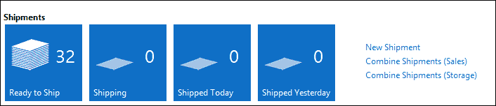

规划者可以遵循他们在角色中心中的工作流程来跟踪运输。

## 路线

运输被组合成路线。对于规划者进行产品规划，确保运输详情正确非常重要。产品的长度、宽度、高度和重量决定了它们是否可以装入卡车、船只、飞机或火车。

我们的示例附加系统有一个报告将运输组合成路线。如果路线中的运输具有相同的地址信息，它们将被组合成停靠点。

### 组合运输

组合运输在**运输至路线和仓库（123456701）**报告中完成。运输按仓库分组。对于每个仓库，都会创建一个新的路线。

对于每个运输，系统创建一个路线停靠点。停靠点有不同的类型，取货、交付、取货分组和交付分组。然后每个运输都会得到一个取货和交付停靠点：

```cs
Shipment - OnAfterGetRecord()

IF Route.Description <> Warehouse.Name THEN BEGIN
  Route."No." := '';
  Route.Description := Warehouse.Name;
  Route."Shipment Date" := WORKDATE;
  Route.Status := Route.Status::Planned;

  Route."Bill-to Customer No." := "Bill-to Customer No.";
  Route."Bill-to Name" := "Bill-to Name";

  Route.INSERT(TRUE);
  i := 0;
END;

i := i + 10000;

RouteStop."Route No." := Route."No.";
RouteStop."Line No." := i;
RouteStop.Type := RouteStop.Type::Pickup;
RouteStop.VALIDATE("Shipment No.", "No.");
RouteStop.INSERT;

i := i + 10000;

RouteStop."Route No." := Route."No.";
RouteStop."Line No." := i;
RouteStop.Type := RouteStop.Type::Delivery;
RouteStop.VALIDATE("Shipment No.", "No.");
RouteStop.INSERT;
```

在创建路线并将运输分配到停靠点后，启动了一个分组和优化算法。这是代码单元`路径优化器（123456700）`。

### 路径优化器

我们示例中的算法旨在通过计算每个地址与仓库的距离来找到将产品运送到地址的最佳路线。路线从距离我们仓库最近的地址开始，并以距离最远的地址结束。

这只是一个简单算法的示例。每个公司都将有自己的算法需要实现：

```cs
RouteStopPickup.SETRANGE("Route No.", Route."No.");
RouteStopPickup.SETRANGE(Type, RouteStopPickup.Type::Pickup);
RouteStopPickup.FINDFIRST;

RouteStopDelivery.SETRANGE("Route No.", Route."No.");
RouteStopDelivery.SETRANGE(Type, RouteStopDelivery.Type::Delivery);
RouteStopDelivery.FINDSET;
REPEAT
  Window.UPDATE(2, RouteStopDelivery."Shipment No.");

  IF NOT Optimizer.GET(RouteStopDelivery.Name) THEN BEGIN
    CLEAR(BingMapMgt);
    BingMapMgt.CalculateRoute('', RouteStopPickup.Latitude, RouteStopPickup.Longitude,'', RouteStopDelivery.Latitude,
      RouteStopDelivery.Longitude, Optimizer."Distance (Distance)",Optimizer."Activity Time", Optimize::Distance);

    Optimizer.Name := RouteStopDelivery.Name;
    Optimizer.Latitude := RouteStopDelivery.Latitude;
    Optimizer.Longitude := RouteStopDelivery.Longitude;
    Optimizer.INSERT;
  END;

UNTIL RouteStopDelivery.NEXT = 0;
```

距离的计算是通过调用 Bing Maps 的 Web 服务来完成的。这已在第九章*接口*中解释。

每个距离都存储为记录到**优化器**表中，这是一个辅助表。在这个代码单元中，这是一个临时变量。

临时表具有多项优势，使它们的使用变得有趣。由于它们不存储在数据库中，与真实表相比，它们具有更好的性能。这也对并发性有益，因为不会有锁定。

### 小贴士

临时表可以自由使用。在使用时，它们不会被检查在许可文件中。要创建和修改定义，仍然需要一个有效的许可。视频[`www.youtube.com/watch?v=QHn5oEOJv0Q`](https://www.youtube.com/watch?v=QHn5oEOJv0Q)展示了如何使用临时数据集。

在生成距离后，所有取货运输都被组合成一个停靠点，通过将它们分配到相同的`序列号`值：

```cs
RouteStopGroup.INIT;
RouteStopGroup."Route No." := Route."No.";
RouteStopGroup."Line No." := 10;
RouteStopGroup.Type := RouteStopGroup.Type::"Pickup Group";
RouteStopGroup."Sequence No." := 10;
RouteStopGroup.Name := RouteStopPickup.Name;
RouteStopGroup.INSERT;

RouteStopPickup.MODIFYALL("Sequence No.", 10);
```

通过对距离辅助表按距离排序，我们可以轻松地为配送站点分配正确的`序列号`。对于每个`序列号`值，我们还会在站点表中生成一个分组记录：

```cs
Optimizer.SETCURRENTKEY("Distance (Distance)");
Optimizer.ASCENDING(FALSE);
Optimizer.FIND('-');
REPEAT
  RouteStopGroup.INIT;
  RouteStopGroup."Route No." := Route."No.";
  RouteStopGroup."Line No." := Sequence;
  RouteStopGroup.Type := 
    RouteStopGroup.Type::"Delivery Group";
  RouteStopGroup."Sequence No." := Sequence;
  RouteStopGroup.Name := Optimizer.Name;
  RouteStopGroup.INSERT;

  RouteStopDelivery.SETRANGE(Name, Optimizer.Name);
  RouteStopDelivery.MODIFYALL("Sequence No.", Sequence);

  Sequence := Sequence + 10;
  IF (xLongitude <> Optimizer.Longitude) OR 
    (xLatitude <> Optimizer.Latitude) 
  THEN BEGIN
    IF xLongitude + xLatitude <> 0 THEN BEGIN
      CLEAR(BingMapMgt);
      BingMapMgt.CalculateRoute('', xLatitude, xLongitude,'', 
        Optimizer.Latitude, Optimizer.Longitude, 
        RouteStopGroup.Distance, RouteStopGroup.Time, 
        Optimize::Distance);
      RouteStopGroup.MODIFY;
    END;
    xLongitude := Optimizer.Longitude;
    xLatitude := Optimizer.Latitude;
  END;
UNTIL Optimizer.NEXT = 0;
```

在优化路线后，它应该看起来像以下截图所示。我们在仓库取走两批货物，并将它们运送到国家内的两个地址。

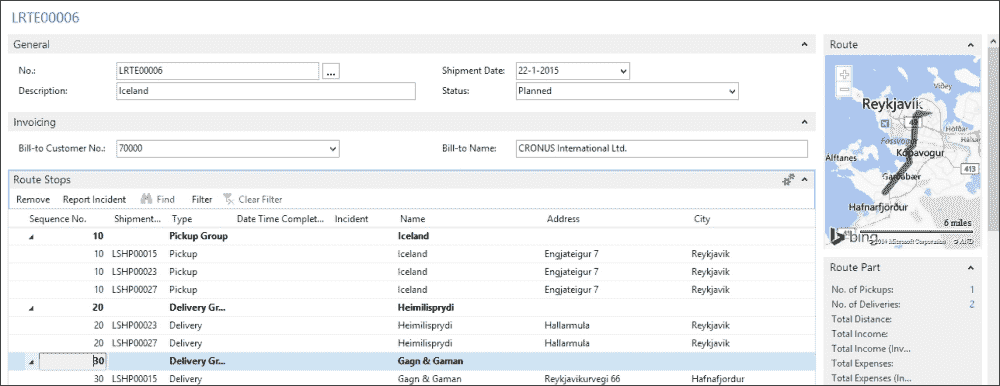

## 路线跟进

在路线过程中，规划师需要跟踪司机。这将导致货件状态更新。

在我们的解决方案中，规划师应填写**完成日期时间**字段。此字段在货件中使用流程字段自动更新。

## 事件

货件的特殊状态是事件。如果由于任何原因我们无法交付货件，它应该被送回仓库并再次发货。根据事件的原因，我们可能需要开票额外服务。

事件可以发生在停泊组或单个货件上，并且可以具有**不可交付**、**已关闭**或**其他**状态。规划师可以添加额外注释。

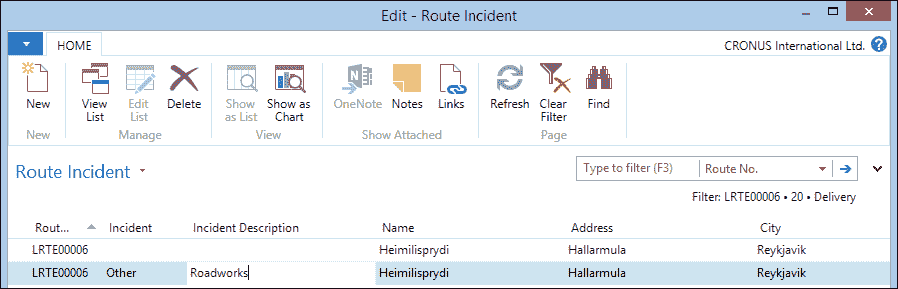

没有事件的其他货件将获得新的状态，而事件将移动到角色中心的另一个位置。

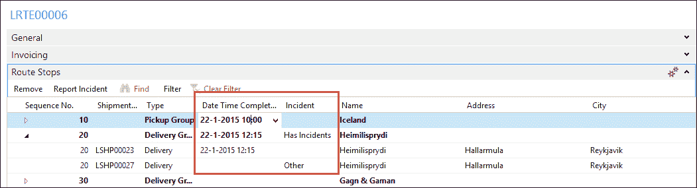

### 跟进

规划师可以通过角色中心跟踪事件。未处理的事件，保持状态开放，直到有人决定如何处理它。

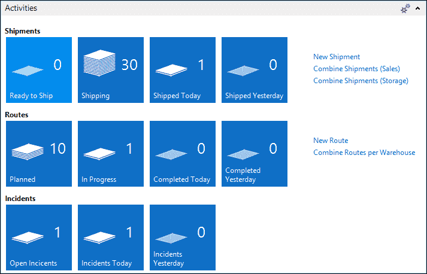

# 发票应用程序

在第二章中，*一个示例应用*，我们介绍了附加解决方案的发票。对于本章的解决方案，我们将更进一步。

我们公司开票不同的物流服务，例如：

+   存储收货和发货的处理成本

+   我们保存库存期间的存储成本

+   将产品运输到最终消费者的运输成本

所有这些成本都需要合并到一张发票中。一些客户可能需要每月开票或每周开票，对于偶然的客户，我们直接开票。这需要一个特殊的模块来处理开票。

### 注意

对于本章本节中的示例，**默认角色中心**在**配置文件表（2000000072）**中应更改为**收入与支出角色中心（123456761）**。

让我们看看需要开具发票的过程：

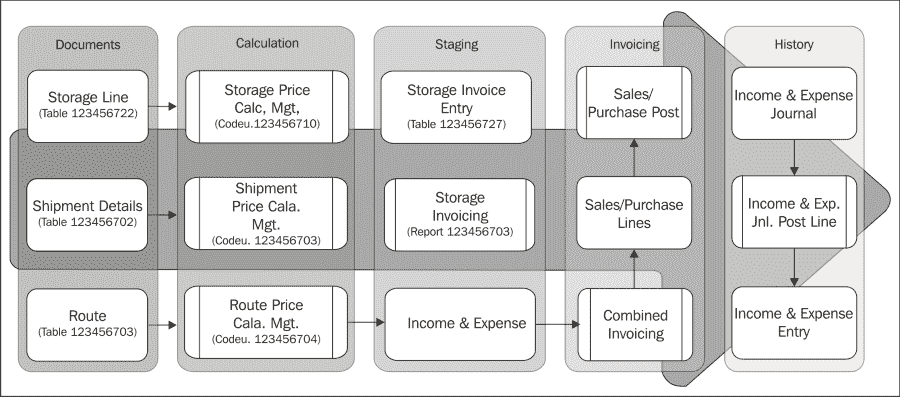

## 收入和支出

我们希望一次性向客户开票的所有内容，我们存储在一个新的表中，我们将称之为收入与支出。这是一个容器，它们将在这里保存，直到为该客户完成定期开票。

收入与支出记录可以由最终用户手动创建或由系统自动创建。让我们看看它们：

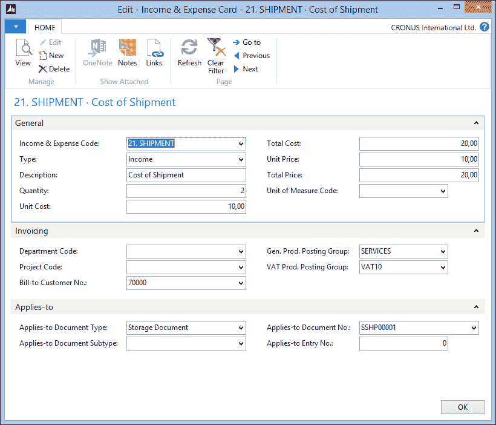

要创建新的收入与支出记录，我们需要填写以下字段：

+   **收入与支出代码**：这是指收入与支出组。

+   **类型**：这可以是收入或支出。前者将用于销售发票，后者预留用于未来在采购发票上使用，如果我们决定雇佣其他公司来处理我们的物流。

+   **描述**：这是将在销售发票上打印的描述。

+   **数量**：这是我们完成的服务数量。例如，存储天数或路线中的公里数或英里数。

+   **单位成本/总价**：这可以用来计算服务的利润。

+   **单价/总价**：这是客户将在销售发票上看到的单价。

+   **计量单位代码**：这是指计算方法，如`BOX`、`KM`、`MILES`或`DAY`。

+   **适用文档子类型**：这是指存储表头、已注册存储表头、物流运输或物流路线。如有必要，这可以扩展以容纳其他附加组件。

+   **适用文档（行）编号**：这是指该收入与支出记录所属的存储和物流文档。

+   **适用过账编号**：这是指存储发票过账。

## 开票

在创建收入与支出后，我们可以开始开票流程。为此，在微软 Dynamics NAV 的开票部分进行了一些小的更改，例如，我们选择了一种与第二章，“一个示例应用”略有不同的方法。

### 销售行

**销售行**表（37）进行了一些小的修改。我们为**收入**添加了一个额外的类型，并为**编号**字段实现了表关系：

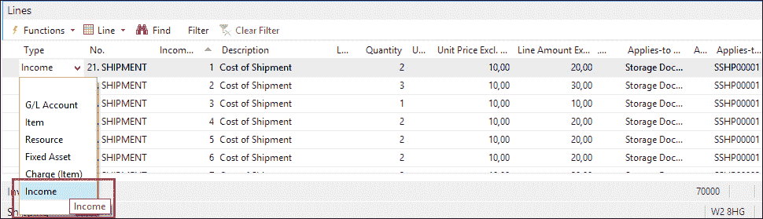

这使我们能够在不首先创建收入与支出的情况下，在销售发票上创建新条目。

销售行还引用了**收入与支出过账编号**和**应用至**字段。这使得我们能够在**销售过账代码单元**中创建**收入与支出日记账行**。

### 代码单元销售过账（80）

销售过账代码单元只有一处更改以填充收入与支出日记账：

```cs
OnRun()

        ...
        SalesLine.Type::Income:          //* Chapter 7
          PostIncome;

PostIncome()

IF SalesLine."Qty. to Invoice" = 0 THEN 
  EXIT;

WITH IncExpJnlLn DO BEGIN
  INIT;
  "Posting Date" := "Posting Date";
  ...
  "Source Code" := SrcCode;
  "Posting No. Series" := "Posting No. Series";
  "Dimension Set ID" := SalesLine."Dimension Set ID";
  IncExpJnlPostLine.RunWithCheck(IncExpJnlLn);
END;
```

这是以与资源日记账相同的方式进行，然而，我们将创建日记账行的代码移动到了一个函数中，这提高了我们代码的可读性和可升级性。

### 小贴士

由于销售行已填充了所有**过账组**和**金额**字段，标准应用程序将自动生成总账分录、增值税分录和客户账簿分录。

## 定价方法

我们的可选解决方案有三个级别的自动价格计算，这在很大程度上是相同的。我们可以为存储文档、物流运输和路线计算价格。

让我们以存储价格为例，看看这是如何操作的。

### 存储价格

在**存储价格**表中，我们可以为不同的存储活动注册价格。

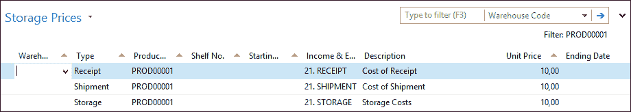

当价格计算完成后，系统将在这个表中筛选以找到最佳匹配的价格。例如，如果一个产品有一个没有仓库代码的收据价格，这个价格将在所有仓库中使用，但如果填充了一个仓库代码，这个仓库将有特殊的价格。

价格可以区分成收据、发货、拣选、上架、移动和存储。前几种选项用于存储文件，后几种则在计算存储成本时使用。

**收入与支出代码**决定了将为这种组合创建哪种类型的收入与支出。存储文件可以包含多个收入与支出，例如，一个正常的收据行和一个海关盈余。

### 计算

收入与支出是使用价格计算管理代码单元创建的，这是我们熟悉从第二章，“一个示例应用”中，但这次我们不会更新单价，而是创建收入与支出。

存储的计算是在代码单元 123456710 中完成的：

```cs
FindStorageLinePrice

WITH StorageLine DO BEGIN
  Product.GET("No.");
  StorageLinePriceExists(StorageHeader, StorageLine);
  CreateIncExp(StorageHeader,StorageLine,TempStoragePrice);

END;
```

`FindStorageLinePrice`函数将调用标准的`StorageLinePriceExists`函数来找到符合标准的存储价格。对于过滤器中的所有存储价格，它将调用`CreateIncExp`函数：

```cs
CreateIncExp()

IncExp.SETRANGE("Applies-to Document Type", IncExp."Applies-to Document Type"::"Storage Header");
IncExp.SETRANGE("Applies-to Document No.", StorageHeader."No.");
IncExp.SETRANGE("Applies-to Document Line No.", StorageLine."Line No.");
IncExp.DELETEALL;

WITH StoragePrice DO BEGIN
  FoundStoragePrice := FINDSET;
  IF FoundStoragePrice THEN BEGIN
    REPEAT
      IncExpCode.GET(StoragePrice."Income & Expense Code");
      IncExp.INIT;
      IncExp."Entry No." := 0;           //* For Autoincrement
      IncExp.Type := IncExpCode.Type;
      IncExp."Income & Expense Code" := 
        "Income & Expense Code";
      IncExp.Description := Description;
      IncExp.Quantity := StorageLine.Quantity;
      IncExp."Unit Cost" := IncExpCode."Unit Cost";
      IncExp."Total Cost" := IncExp.Quantity * 
        IncExp."Unit Cost";
      IncExp."Unit Price" := StoragePrice."Unit Price";
      IncExp."Total Price" := IncExp.Quantity * 
        IncExp."Unit Price";
      IncExp."Applies-to Document Type" := 
        IncExp."Applies-to Document Type"::"Storage Header";
      IncExp."Applies-to Document No." := StorageHeader."No.";
      IncExp."Applies-to Document Line No." := 
        StorageLine."Line No.";
      IncExp."Bill-to Customer No." := 
        StorageHeader."Bill-to Customer No.";
      IncExp."Gen. Prod. Posting Group" := 
        IncExpCode."Gen. Prod. Posting Group";
      IncExp."VAT Prod. Posting Group" := 
        IncExpCode."VAT Prod. Posting Group";
      IncExp.INSERT;
    UNTIL NEXT = 0;
  END;
END;
```

每个价格将创建一个单独的收入与支出记录。

### 提示

收入与支出表设置为**自动递增**。这意味着 SQL Server 将为我们生成条目编号。这使得多个用户可以同时在此表中生成条目而不会相互阻塞。

### 结果

当系统或最终用户生成新文件时，价格将自动计算。用户可以在**事实盒**中看到总成本和价格，并在必要时更改、删除或添加记录，如下面的截图所示：

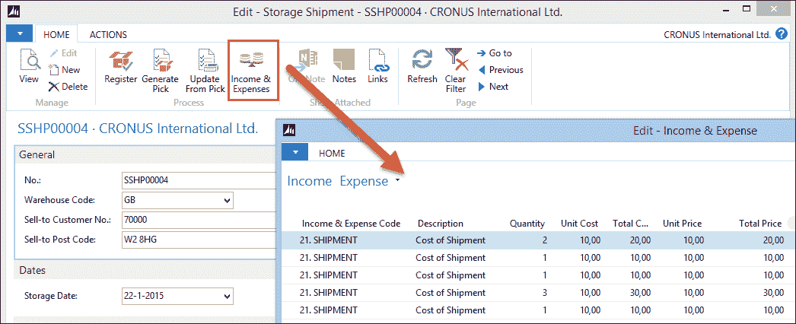

## 定期开票

我们提供的一项服务是存储。这意味着有时产品可能在我们仓库中存放几天甚至几周或几个月。我们的客户将根据他们使用我们仓库空间的时间进行收费。

每次我们在仓库接收产品或将产品移动到另一个区域或货架时，都会创建一个存储条目以跟踪。对于开票，我们也会创建存储发票条目。这主要是因为库存处理和开票是由不同的人在不同的时间完成的。当我们开始开票流程时，产品可以发货给客户。

存储发票条目使用从存储条目的存储日期继承的**从存储日期**创建。存储发票条目还有一个**到存储日期**，保持空白，直到产品离开仓库或移动到可能具有另一个价格的其他位置。收入和支出代码确定将开票的价格，并在发布**存储单据**时确定。

批处理报告**存储开票（123456703）**用于创建收入和支出。让我们看看这是如何完成的。


报告只有一个存储发票条目 `DataItem`，它根据**Open=Yes**进行筛选。

在报告中，所有存储发票条目首先被移动到缓冲表，然后稍后处理。实施此类解决方案有两个重要原因：

+   **更改记录集**：此报告根据存储发票条目进行筛选，这些条目可以开票。当存储发票条目完全开票后，我们希望更改此值。这意味着我们使用的记录集在处理过程中正在改变。这是 SQL Server 后端无法处理的事情，这将导致非常差劲的性能。通过首先将所有记录移动到缓冲表，筛选将在维护在服务层而不是 SQL Server 上的虚拟表上进行。

+   **锁定**：如果我们根据开放条目进行筛选并修改我们的数据集，这将导致锁定比必要的更多记录。在非聚集索引上筛选将导致 SQL Server 转到范围锁定而不是行锁定。通过使用聚集索引逐个读取实际的存储发票条目，我们将确保 SQL Server 只锁定我们用于此过程的记录，允许其他用户在此表末尾继续创建新记录。

### 处理缓冲区

在处理缓冲区时，我们首先检查此条目是否之前已经开过票。如果是这样，我们从上一个日期开始开票；如果不是，我们使用从存储日期。

然后，我们检查产品是否已经离开仓库或已被移动。如果是这样，我们可以通过开票直到这个日期来关闭此条目；否则，我们将开票直到工作日。

### 小贴士

用户可以更改系统的工日期并以此方式影响系统的行为，开票直到另一个日期。

```cs
ProcessBuffer()

StorageInvEntry.LOCKTABLE;

WITH TempStorageInvEntry DO
  IF FIND('-') THEN REPEAT
    StorageInvEntry.GET("Entry No.");

    IF "Last Invoice Date" <> 0D THEN
      FromDate := "Last Invoice Date"
    ELSE
      FromDate := "From Storage Date";

    IF "To Storage Date" <> 0D THEN
      StorageInvEntry."Last Invoice Date" := "To Storage Date"
    ELSE
      StorageInvEntry."Last Invoice Date" := WORKDATE;

    Date.SETRANGE("Period Type", Date."Period Type"::Datum);
    Date.SETRANGE("Period No.", 1, 5);
    Date.SETRANGE("Period Start", FromDate, 
      StorageInvEntry."Last Invoice Date");
    IncExp."Entry No." := 0;
    IncExp."Income & Expense Code" := "Income & Expense Code";
    IncExp.Type := IncExp.Type::Income;
    IncExp.Description := STRSUBSTNO(Text000, FromDate, 
      StorageInvEntry."Last Invoice Date");
    IncExp.Quantity := Date.COUNT;
    IncExp."Unit Cost" := "Unit Cost";
    IncExp."Total Cost" := IncExp.Quantity * "Total Cost";
    IncExp."Unit Price" := "Unit Price";
    IncExp."Total Price" := IncExp.Quantity * "Unit Price";
    IncExp."Global Dimension 1 Code" := 
      "Global Dimension 1 Code";
    IncExp."Global Dimension 2 Code" := 
      "Global Dimension 2 Code";
    IncExp."Bill-to Customer No." := "Bill-to Customer No.";
    IncExpCode.GET(IncExp."Income & Expense Code");
    IncExp."Gen. Prod. Posting Group" := 
      IncExpCode."Gen. Prod. Posting Group";
    IncExp."VAT Prod. Posting Group" := 
      IncExpCode."VAT Prod. Posting Group";
    IncExp."Unit of Measure Code" := 
       IncExpCode."Unit of Measure Code";
    IncExp."Applies-to Entry No." := "Entry No.";
    IncExp.INSERT;

    StorageInvEntry.Open := "To Storage Date" <> 0D;
    StorageInvEntry.MODIFY;
  UNTIL NEXT = 0;
```

我们代码中的下一步是计算两个日期之间的工作日数。这将防止我们的客户为周六和周日支付存储费用。我们通过使用虚拟日期表来完成这项工作。此表包含从公元 0000 年 1 月 1 日到 9999 年 12 月 31 日的所有日期、周、月、季度和年份，并在日期计算中非常有用。

使用这个结果，我们现在可以创建稍后将要开票的收入和支出记录。如果**到存储日期**已填写，我们将关闭存储发票条目。

## 组合开票

我们使用的数据库模型允许我们将我们对客户提供的所有服务进行开票。我们可以为客户创建一张包含处理、存储和运输成本的发票。

这是通过批量报告 123456704 合并仓储与物流来完成的，该报告与第二章中的报告完全相同，*一个示例应用*。

# 附加组件灵活性

本章中我们创建的附加组件绝对还没有准备好供真正的公司使用，但它展示了如何创建一个可以很容易被他人扩展的灵活解决方案。

大多数现代物流服务提供商向客户提供其他服务，例如增值物流、项目跟踪和第三方及第四方物流。

## 增值物流

当一家公司提供增值物流服务时，他们不仅保留产品在库存中，还提供围绕这一服务的其他服务，例如展示包装。

这可以最好地与微软 Dynamics NAV 中的制造过程相比较。一个称为物料清单的项目列表被组合成一个新的产品。然后，这个新产品被发送给客户。

当展示不再需要时，例如，当营销活动结束时，展示需要从客户那里取回并拆卸成原始产品。

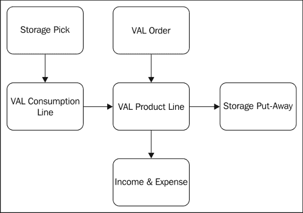

在我们的解决方案中，这可以通过创建一个 VAL 区域来实现，产品将被移动到该区域。

## 项目跟踪

我们的客户还想知道他们产品的位置，它们在哪个仓库，以及哪个产品被发送给了哪个客户。这在食品和医药行业中尤为重要，以便在出现问题的情况下能够召回大量产品。

要在我们的解决方案中实现这一点，需要一些更改。首先，我们需要在库存条目中实现跟踪代码，其次，当我们将产品发送出我们的仓库时，我们需要实现某种跟踪条目，因为我们的物流解决方案目前没有任何条目，只有状态字段。

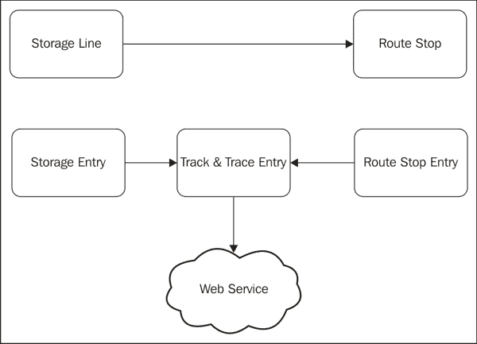

## 第三方和第四方物流

在我们的示例数据库中，我们计划在路线上安排运输，并使用我们自己的卡车将货物运送到最终客户。这被称为第二方物流。如果我们要用我们自己的卡车处理我们自己的产品，那么第一方物流将是这种情况。

下图显示了如果外包并合并，物流的日益复杂化：

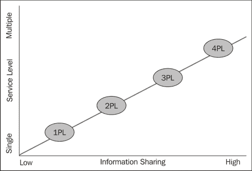

如果我们提供第三方物流，我们将使用其他公司为我们客户提供部分服务。然后我们将告诉他们要处理服务的哪一部分，并在完成后向我们报告。涉及的第三方不知道整个交易的所有细节。

如果我们提供第三方物流服务，我们将把整个仓库或路线外包给另一家公司。我们只会告诉他们哪些产品应该移动到何处，他们会处理这些事情，而无需我们知道细节。

很常见，第三和第四方物流是混合使用的，但它们通常由不同公司之间的接口来处理。

# 摘要

在本章中，我们与之前章节相比，从完全不同的角度审视了 Microsoft Dynamics NAV 产品。

目标并不是为 Microsoft Dynamics NAV 设计一个坚不可摧的存储和物流附加解决方案，因为这需要远超过一个章节的内容。本章中的信息旨在展示如何在 Microsoft Dynamics NAV 之上集成新功能。我们分析了业务流程，设计了新的数据和事务模型来处理这些流程，并在产品中实现了这些。

为了我们的解决方案，我们设计了两种新的文档结构和两种新的日记和条目结构。我们通过创建一个易于扩展的框架，紧密遵循 Microsoft Dynamics NAV 的标准方法。我们还花了一些时间研究如何防止数据库中的不必要的锁定以及如何避免更改筛选后的数据集。

最后，我们查看了一些示例，说明我们的附加解决方案如何被增强以更好地满足市场上的其他需求。

本章并未结束。本章提供的 C/AL 对象可以用来研究，以便更好地理解各个部分是如何组合在一起的。

在下一章中，我们将设计一个在 Microsoft Dynamics NAV 中的应用程序。我们将探讨它如何被用于咨询公司，使用工作模块并扩展新功能以满足特定需求。
