# 第二章. 管理付款和银行

销售和采购周期在货物发出、提供服务或发出发票后并未结束。在此之后，公司必须对已交付的项目收费，并必须为已接收的服务付款。

对于公司来说，管理预付款、现金支付或延期支付至关重要。在本章中，我们将学习如何进行以下操作：

+   管理不同的付款方式，如付款登记

+   在 NAV 中处理收付款项

+   导入银行对账

# 管理到期日

当您开始与新的客户或供应商合作时，您会与他们就发票的到期日达成协议。在客户和供应商卡的**付款**选项卡上，您选择适合协议的**付款条款**选项卡。之后，当您创建发票时，程序将自动计算到期日。

## 付款条款

**付款条款**页面包含公司使用的每套**付款条款**的一行。您可以根据需要创建任意数量的付款条款。

每套付款条款都必须包含一个程序使用的**到期日计算公式**，该公式与发票的文档日期一起计算到期日。此外，您还可以指定一个**折扣日期计算公式**和一个**折扣百分比**，这些将用于根据提前付款计算折扣。

导航到`部门/财务管理/应收账款/设置`以查看完整列表，如下面的屏幕截图所示：

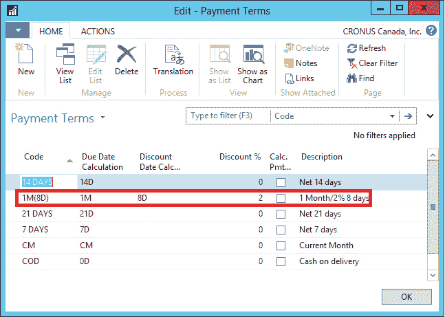

付款条款代码通过填写名为**付款条款代码**的字段分配给每个客户。当客户使用发票时，付款条款将被复制到其中，并根据发票的文档日期计算到期日。

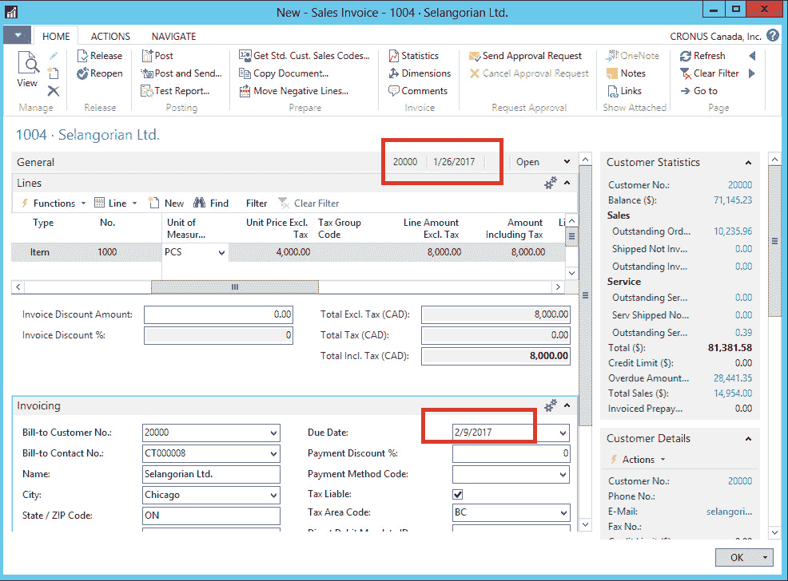

当发票过账时，会创建一个带有相应**到期日**的客户账簿条目。您可以在以下图表中看到数据流：

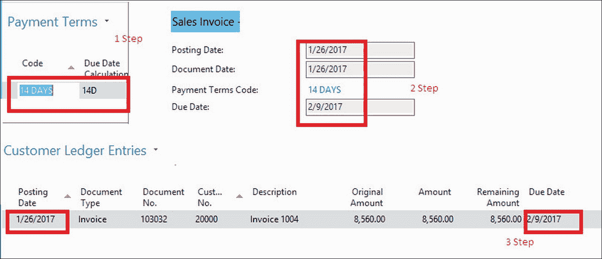

如果您与客户就这笔销售达成不同的付款条款协议，您可以更改特定发票的付款条款。如果需要，您还可以更改账簿条目的到期日。在流程结束时，系统会检查账簿条目的到期日，以向客户收取费用并向供应商提出付款建议。

在**客户账簿条目**选项卡中的**挂起**字段用于指示发票在可以收回付款或对其加收利息之前应等待批准。您可以在该字段中填写您的首字母或任何其他代码。同样，该字段也适用于供应商账簿条目，以指示发票尚不能支付。实际上，本节中解释的每一项也适用于供应商。

## 预付款

预付款是在最终开票前开具发票并过账到销售或采购预付款订单的付款。根据公司和项目规格，您可能需要在向客户发货或从供应商接收货物之前进行付款。

您使用 Microsoft Dynamics NAV 中的预付款功能开具和收取客户所需的押金或向供应商汇款押金。

在最终发票发出之前，我们没有基于支付的账目记录。无论文件中包含的项目或服务如何，都可以为客户或供应商设置预付款。您还可以为某些项目指定不同的预付款比率。如果您需要全部提前支付，请使用 100%的比率。

以下是一些预付款的类型：

+   **客户和供应商预付款**：您可以在名为**预付款百分比**的字段中指定客户或供应商卡的预付款百分比，这将适用于所有订单。如果您想为单个项目使用预付款，请留空该字段。

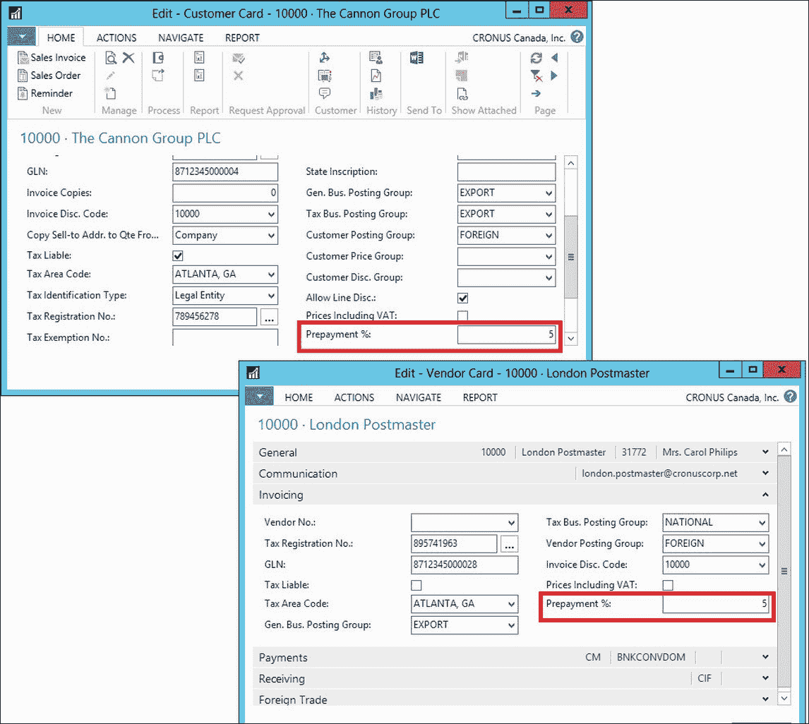

+   **项目预付款**：类似于您设置价格的方式，您可以指定项目的预付款比率。您可以在**销售预付款百分比**和**采购预付款百分比**页面上进行设置，分别可以从客户和供应商列表的标签栏访问。您也可以从项目列表中访问这两个页面。

## 预付款处理流程

预付款处理流程中涉及到的步骤如下：

+   **设置预付款**：首先，我们将执行以下先决条件设置，以便在 NAV 2016 中处理预付款

+   **一般过账设置**：在此表格中，我们将定义与**通用业务过账**和**通用产品过账**组相关的**采购预付款**和**销售预付款**的 G/L 账户卡：

+   **总账设置**：在此表格中，我们将启用和禁用一般预付款功能：

    +   禁用**预付款未实现税**

+   **销售与应收账款设置**：在此表格中，我们将启用和禁用与销售相关的预付款功能：

    +   在过账时启用**检查预付款**

    +   为预付款单据设置编号序列

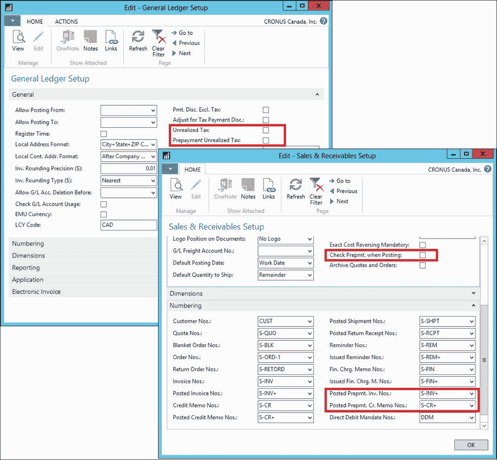

+   **分配预付款百分比**：您可以通过以下任何组合定义预付款百分比：

    +   客户卡

    +   供应商卡

    +   项目卡（客户-项目）

    +   项目卡（供应商-项目）

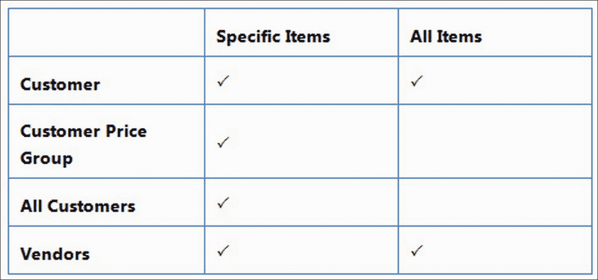

+   **处理**：一旦您完成了所有先前的预付款设置，我们就可以继续进行预付款过账，如下所示：

    1.  创建一个具有预付款要求的销售订单。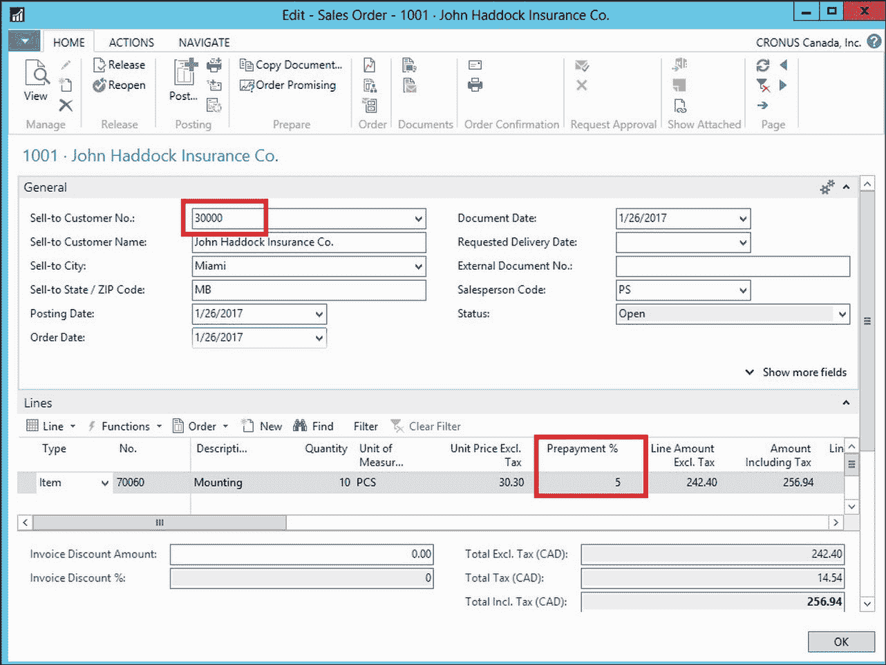

    1.  向客户发送预付款金额的预付款发票。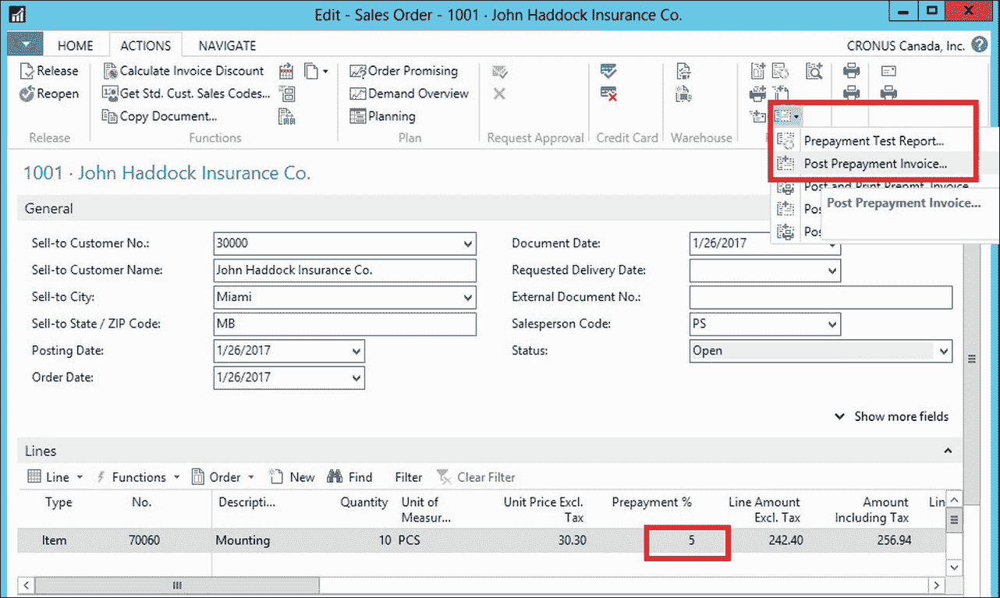

    1.  客户支付预付款金额。

    1.  将预付款金额应用于**销售订单**。

    1.  向客户发货并发票。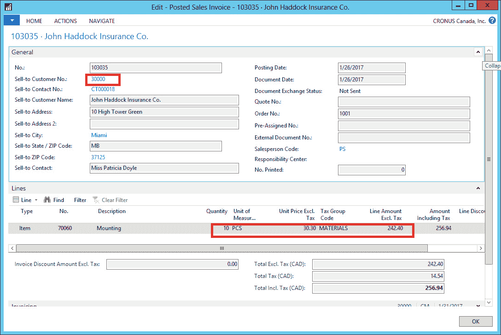

    1.  核实销售发票，金额为销售订单总额减去预付款金额。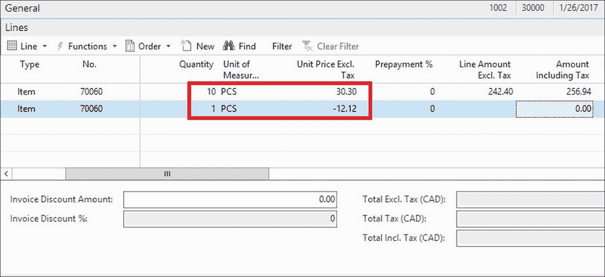

    1.  从客户那里收取剩余的付款并将付款过账到**销售订单**。

# 使用信用卡和其他支付方式

不同的支付方式，由客户和供应商使用，可以在`部门/财务管理/应收账款/设置/支付方式`中定义。

注意，**现金**和**信用卡**都定义了**余额账户号**。当您使用所选的支付方式过账发票时，系统将创建并过账付款，因此您不必稍后手动操作。这在付款与开票同时进行时非常有用。

当您在销售订单或发票中使用信用卡支付方式时，您必须指定将使用哪张信用卡。信用卡在客户卡片上创建，通过功能区上的**信用卡 - 信用卡**操作创建。信用卡通常需要填写的信息，例如卡类型、持卡人姓名、卡号和到期日期。一旦选择了信用卡，就需要对发票总金额进行授权。这可以手动或自动完成。当发票过账时，实际付款将发送到支付服务。然后，付款将被捕获并在 Dynamics NAV 中过账。如果无法处理，将显示错误消息。在这种情况下，发票仍然过账，但付款没有过账。可以使用**现金收据日记账**窗口稍后捕获并过账。

# 发布付款

当您支付或被支付时，无论使用何种方式，您都需要在系统中登记交易。为此，您可以使用**现金收据日记账**窗口或**付款日记账**窗口。这两个窗口的工作方式相同，但**付款日记账**还可以用于打印支票。要过账付款，您需要提供以下信息：

+   向您付款的客户

+   他们用于付款的银行账户

+   正在支付的发票

+   考虑以下示例：

假设客户`20000`，`Selangorian Ltd.`已为我们支付了发票`103032`，该发票应在`2017 年 02 月 09 日`到期。让我们按照以下步骤进行付款过账：

1.  从`日记账/现金收据日记账`访问**现金收据日记账**窗口。

1.  选择**银行**部分，并双击它。

1.  在日记账上创建一条新记录，包含以下信息：

    | **过账日期** | **单据类型** | **单据编号** |
    | --- | --- | --- |
    | 01/26/2017 | 付款 | 这将由一个系列号自动填充。 |

1.  为了表明付款的客户：

    | **账户类型** | **账户编号** | **描述** |
    | --- | --- | --- |
    | 客户 | 20000 | 这将填写客户名称。您可以更改它。 |

1.  要指示客户用于向我们付款的银行账户：

    | **余额账户类型** | **余额账户编号** |
    | --- | --- |
    | 银行账户 | WWB-OPERATING. 这是识别银行的代码。 |

1.  要指示正在支付的发票：

    | **适用文档编号** |  |
    | --- | --- |
    | 103032 | 当您点击此字段时，会打开一个页面，显示客户的所有待处理条目。选择一个。 |

1.  一旦您在**适用文档编号**字段中选择了待处理条目，日记账行中的其余字段将自动填写：**金额**和**适用文档类型**。完成后，您将得到如下所示的内容：

1.  过账交易。

如果您不知道正在支付哪张发票，您可以在**适用文档编号**字段中留空，稍后将其应用于发票。

## 建议供应商付款

**付款日记账**窗口有一个名为**建议供应商付款**的不错功能。此过程根据某些条件为您创建付款行，例如以下内容：

+   它仅包括您选择的日期之前的到期发票

+   您可以指定付款的最大可用金额，因此它只会建议该金额以下的付款

+   当您有特定的可用金额时，您可以在**付款日记账**中为供应商设置优先级，以便最重要的供应商总是首先得到支付

+   它不会处理挂起的发票

然而，此过程仅建议，这意味着在实际过账付款之前，您可以修改所需的内容。

## 创建和打印支票

在**付款日记账**中，您还可以打印支票，用作向供应商付款的方法。

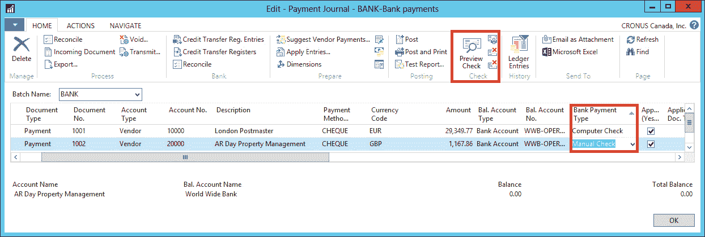

当您的**付款日记账**中有一张或多张计算机支票时，您必须使用功能区上的相应操作打印它们。如果支票尚未打印，系统将不允许您过账付款。然而，如果您已选择**手动支票**，则不需要打印任何内容，这意味着您已手动创建支票，只想让 Dynamics NAV 跟踪它。日记账的过账将创建支票账簿条目。

# 客户余额

余额是客户欠您的总金额或您欠供应商的总金额。客户和供应商的余额可以通过称为**余额（LCY）**的字段在他们的卡片上查看。**LCY**代表**本地货币**。这意味着，无论使用哪种货币，金额总是转换为您的本地货币。

要了解余额金额的详细信息，您可以点击金额，相应的账簿条目将显示出来。这可以在以下屏幕截图中看到：

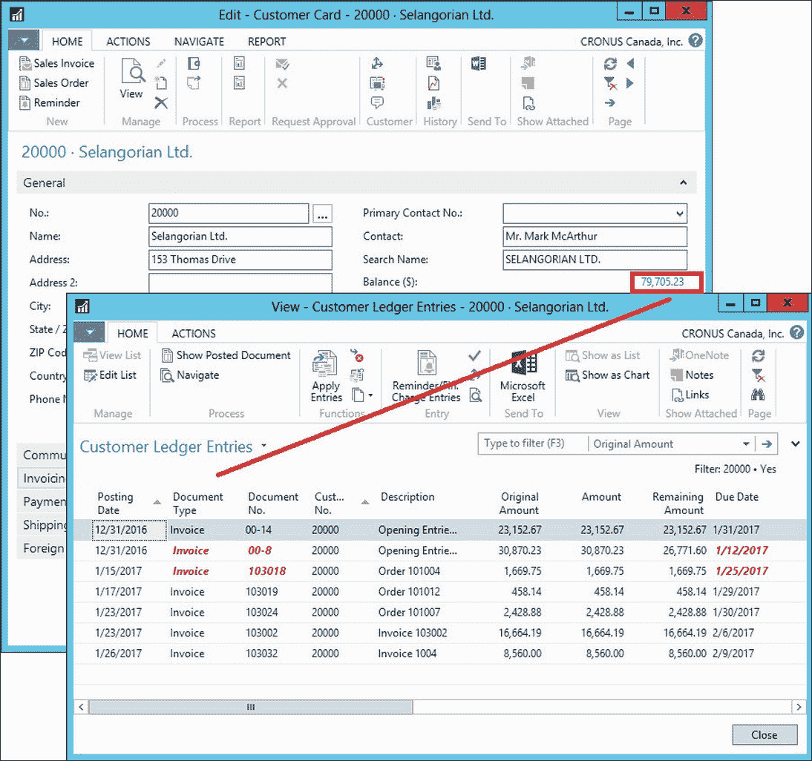

如您所见，客户`20000`，`Selangorian Ltd.`有七张待付款项。其中两张已经到期（它们以红色显示）且发票`00-8`已部分付款（注意剩余金额低于原始金额）。

## 哪张发票已付款？

客户`20000`，`Selangorian Ltd.`过去有许多其他交易。在上一个屏幕截图中，我们只查看了开放交易，但我们可以通过返回卡片并点击**导航**选项卡中的**账簿条目**来查看所有交易。

要查看哪些发票已付款，比较**原始金额**和**剩余金额**列。如果**剩余金额**列为零，则已收到全部付款。

此外，如果**开放**列中的复选框未选中，则发票已全额结算。

## 供应商余额

此页面上有两个关键字段：**剩余金额**和**开放**。请注意，许多交易尚未开放，剩余金额显示为零。这意味着那些发票已经付款，或者贷项备忘录和付款已应用于发票以减少其剩余金额：

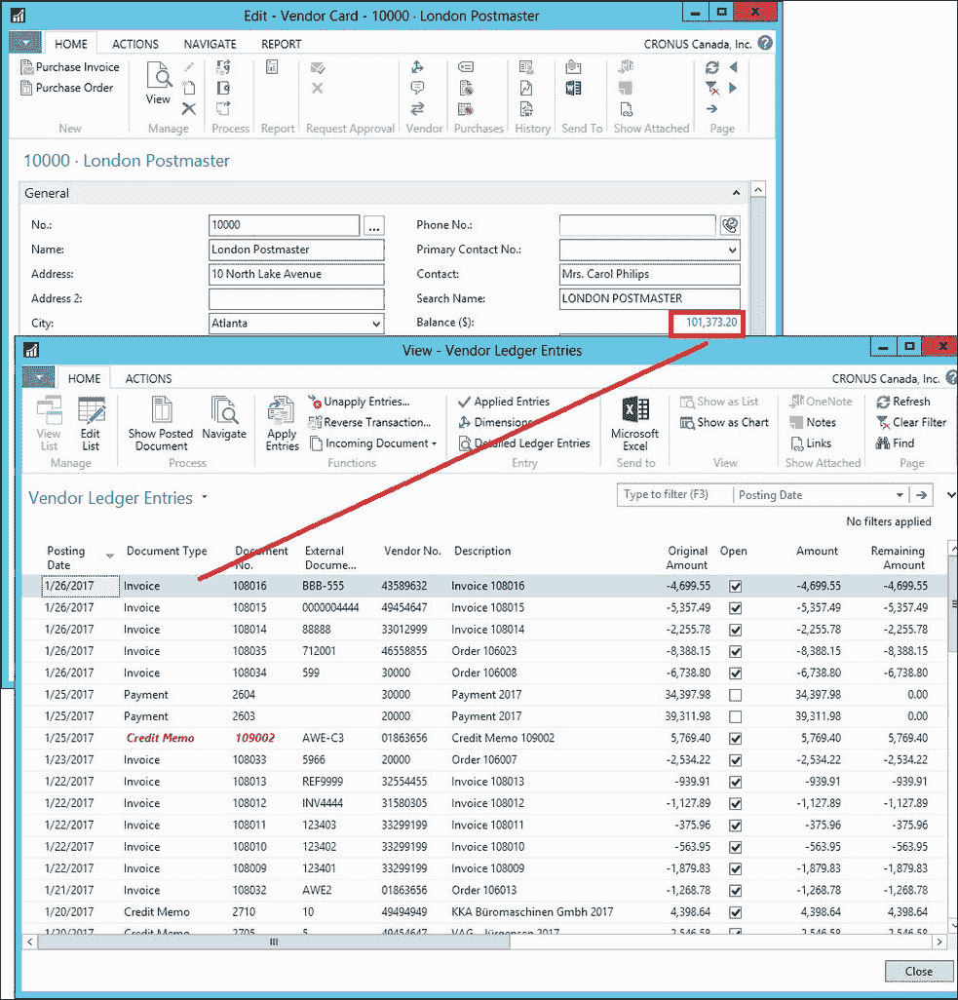

选择一个账簿条目，然后点击功能区中的**已应用条目**，以了解某笔交易是如何被应用的。然后您可以重新应用条目。

# 付款登记

**付款登记**功能是一种独特的处理客户收据的方法，无需通过**现金收据日记**创建条目。此功能旨在支持用户在涉及平衡内部账户的任务中，使用实际现金数字确保从客户处有效收款。为此，我们必须执行以下步骤：

1.  前往 `部门/财务管理/现金管理/付款登记`*.*

1.  设置**付款登记**。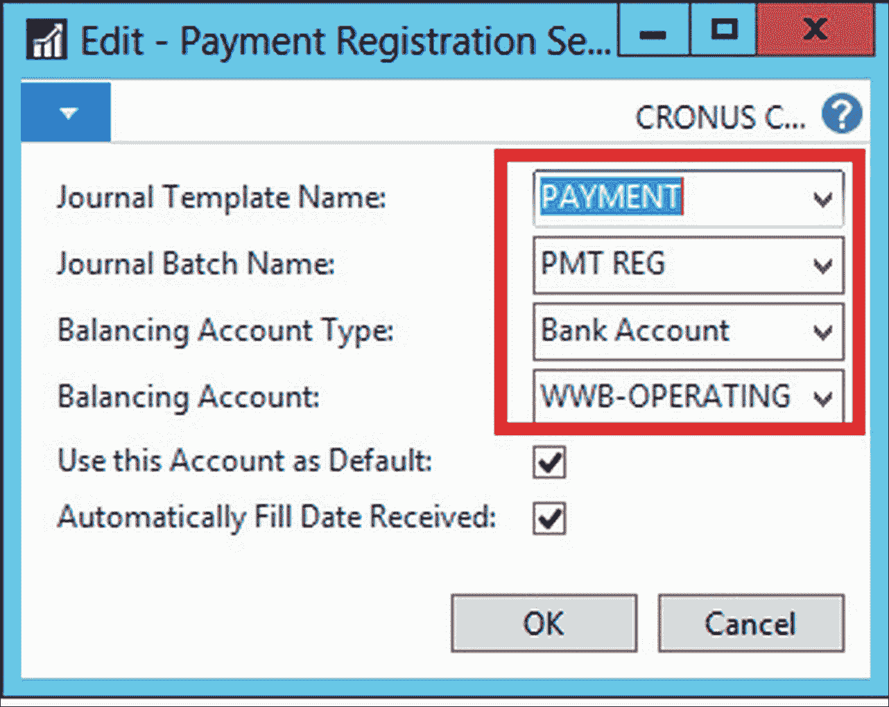

1.  **更改收到的金额或日期**：**付款登记**窗口显示所有开放的客户账簿条目。通常，您只需标记条目，过账，然后您就完成了。

1.  **一次性付款**：这涉及一个客户的多个发票通过一笔付款来处理。

1.  **逾期金额的财务费用**：可以通过选择**财务费用备忘录**功能，直接从**付款登记**窗口创建**财务费用备忘录**窗口。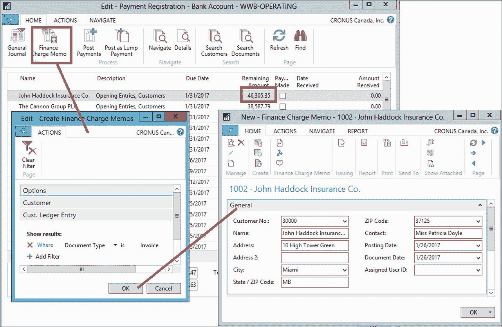

1.  **处理付款折扣**：如果在付款折扣期内收到付款，扣除的金额将自动添加，并在过账付款后，发票和付款将被完全应用并关闭。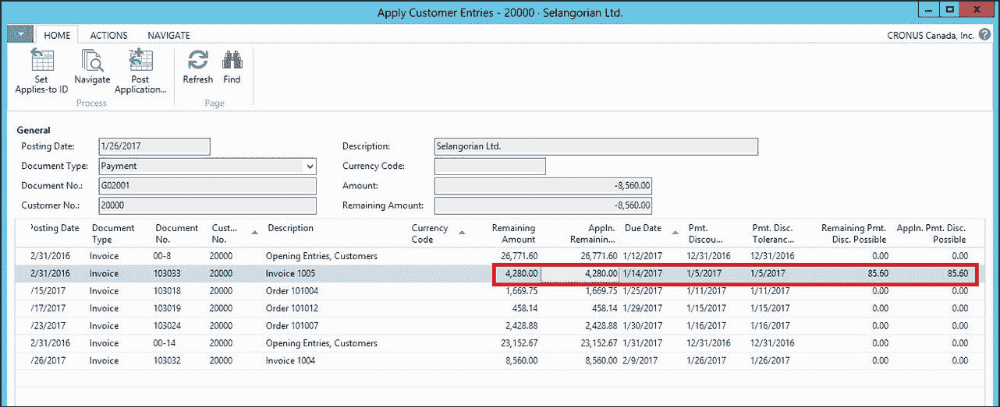

# 付款对账

付款对账日记账是我们指定付款的地方，无论是来自客户的收入还是向供应商的支出，这些付款已在您的电子银行网站上记录为交易，并且需要应用于它们相关的开账项。

您可以在**支付对账表**窗口中执行以下主要活动：

+   导入银行交易付款文件，这些付款已支付到或从您的银行账户，然后自动将这些付款应用于它们相关的开账项。

+   从**支付对账表**窗口手动审查并应用那些自动应用于错误的开账项或根本未应用的付款，窗口显示如下：

# 付款应用规则

在**付款应用规则**窗口中，您设置规则以控制当您在**支付对账表**窗口中使用**自动应用**功能时，付款应如何自动应用于它们相关的开账项。为此，请参考以下截图：

# 银行数据转换服务

银行数据转换服务对所有 Microsoft Dynamics NAV 客户免费提供，无需额外费用。

银行数据转换服务用于以下目的：

+   允许用户以银行要求的任何格式从 Microsoft Dynamics NAV 导出付款文件，以便高效处理 outgoing payments

+   允许用户以 Microsoft Dynamics NAV 要求的格式从任何银行导入银行对账单文件，以便高效对账付款及其银行账户

+   为所有 Microsoft Dynamics NAV 本地化版本的 Dynamics NAV 提供对许多银行的全面支持

## 使用银行数据转换服务或 SEPA 信用转账进行付款

在**支付日记账**窗口中，您可以通过从日记账行导出包含付款信息的文件来处理对供应商的付款。然后，您可以将文件上传到您的电子银行，在那里处理相关的资金转账。

要启用 SEPA 信用转账，您必须首先设置一个银行账户、一个供应商和支付日记账所基于的通用日记账批次。

然后，您通过自动填写带有指定过账日期的到期付款的**支付日记账**窗口来准备对供应商的付款。

+   **激活银行数据转换服务**：此服务用于将任何银行对账单文件转换为可以导入或导出您的银行数据需求的格式：

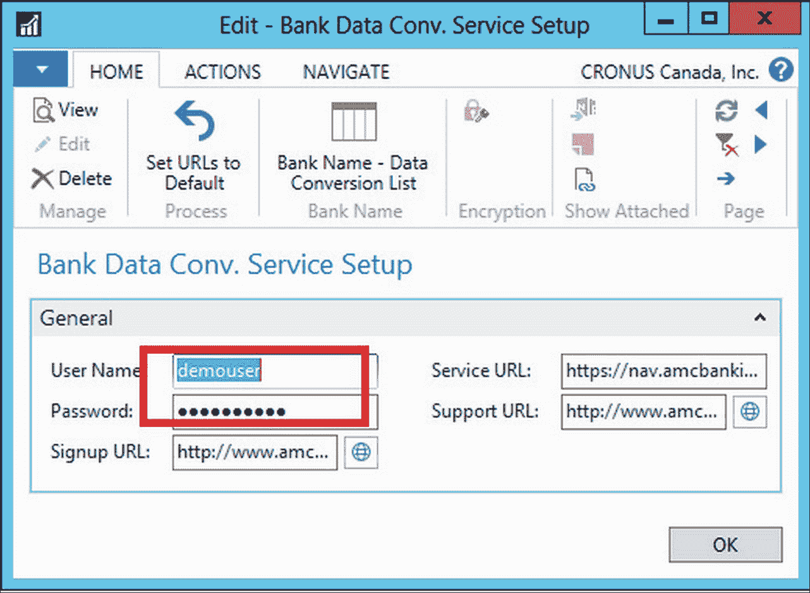

+   **供应商付款方式**：要在支付日记账中执行 SEPA 信用转账，我们必须在供应商卡片中指定**银行数据转换**付款方式：

+   **银行对账单导入格式**：我们还需要在银行的卡片中链接**银行数据转换服务**或**SEPA CAMT**，以便将对账单导入 Microsoft dynamics NAV 2016：

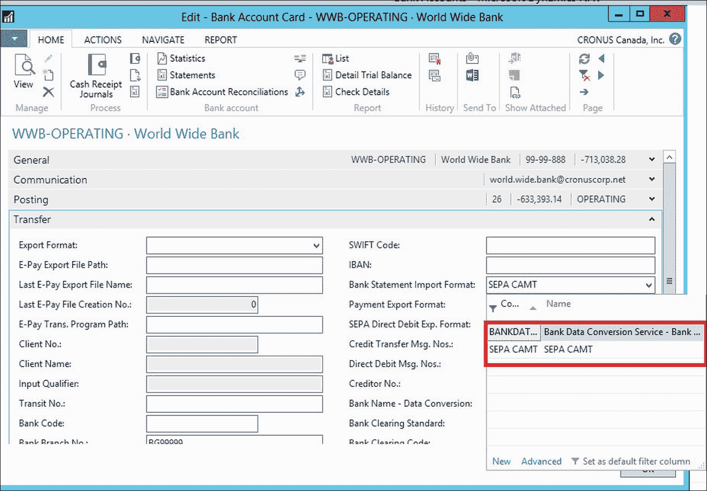

+   **建议供应商付款**：执行此操作以在**支付日记账**中填充供应商到期付款的行，过账日期基于相关采购文件的到期日：

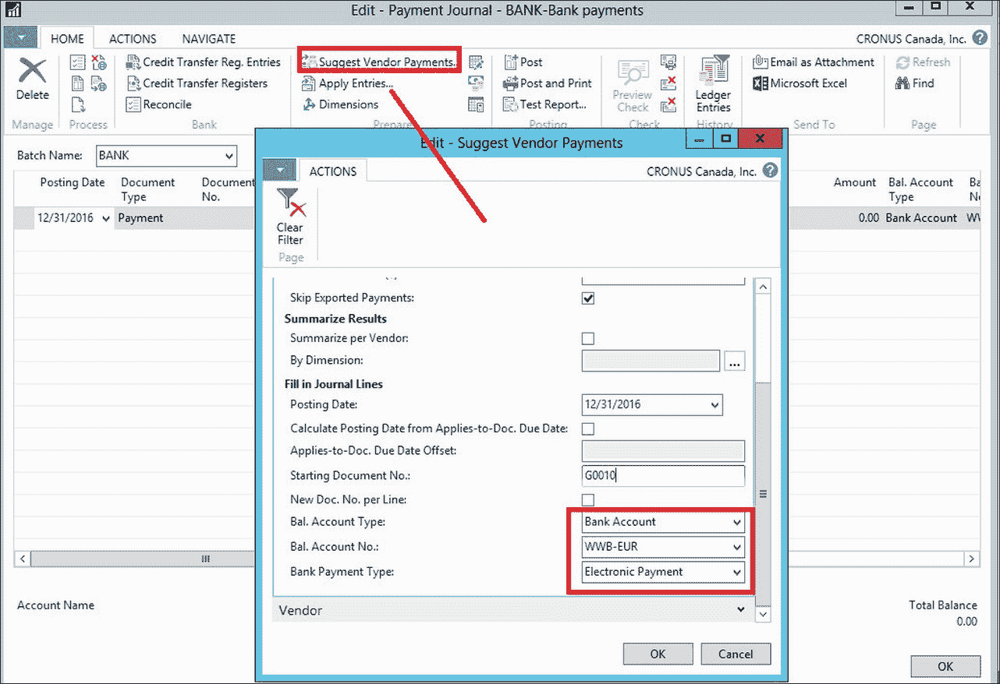

+   **将付款导出为银行文件**：当您准备好使用**支付日记账**窗口向供应商付款时，您可以将日记账行上的付款信息导出为文件。然后，您可以将文件上传到您的电子银行以处理相关的资金转账：

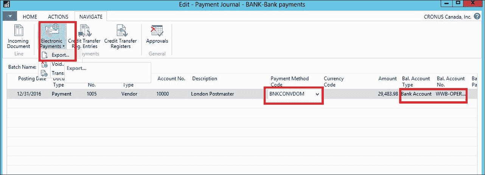

+   **过账日记账**：当银行成功处理电子支付后，将**支付日记账**过账以影响供应商、总账和银行账户。

## NAV 中的收付款

一个名为**支付对账**的新功能允许用户将银行交易数据导入一个专门的 UI，并自动打开代表客户和供应商文档的条目。功能包括高级记录匹配、强大的审查工具，以及自由定义付款匹配容忍度和修改通用匹配算法的可能性。

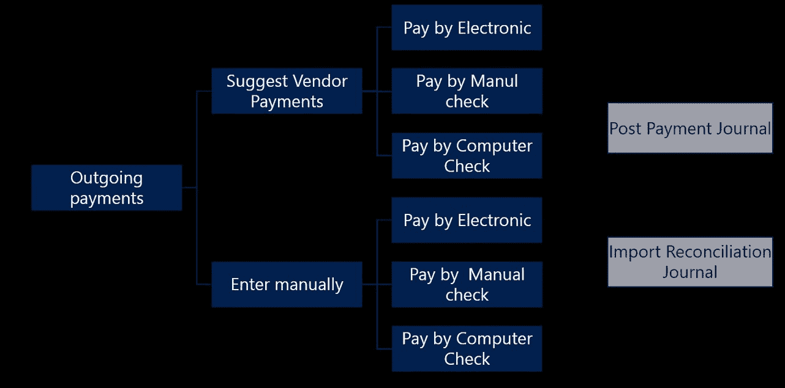

## 数据交换框架

**数据交换框架**用于定义银行文件、电子文档、货币汇率以及其他与 ERP 系统交换数据的文件格式；这些格式根据数据文件或流的提供者以及国家/地区而有所不同。

下面的图显示了数据交换框架的架构：

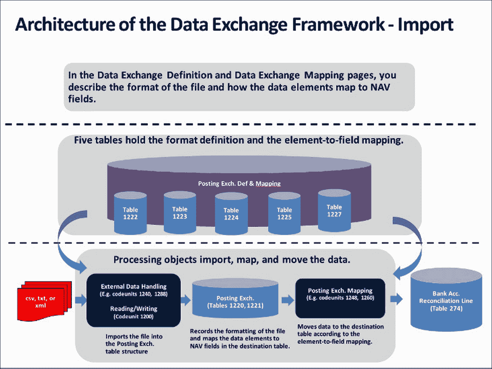

# 银行账户货币限制

在您设置好银行账户后，您可能需要在具有相同和不同货币代码的两个银行账户之间转账。

下面的截图显示了过账交易时的银行账户货币限制：

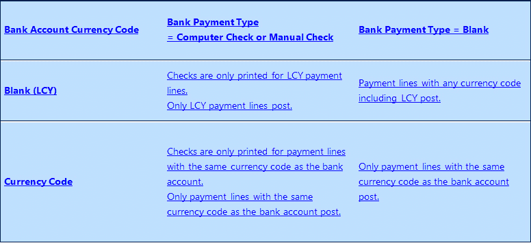

# 银行对账

银行对账功能的目的在于检查银行提供的对账单是否与您在过账付款时创建的银行账户账簿条目一致。它帮助您检查是否有任何尚未过账到系统中的现金流动。在给定期间结束时，对账单的期末余额必须等于 Dynamics NAV 中银行账户的余额。

要创建一个新的银行账户对账，请按照以下步骤操作：

1.  前往`部门/财务管理/现金管理/银行对账单`并点击**新建**。

1.  在**银行账户号**字段中选择`WWB-OPERATING`代码。

1.  选择**03/31/2017**作为对账单日期，并将**对账单结束余额**写为`-600000`。

1.  点击功能区上的**建议行...**选项，然后点击**确定**。

1.  新的对账行作为开放银行总账条目的副本创建。

1.  将对账行与银行对账单行进行核对。

1.  发布这些行。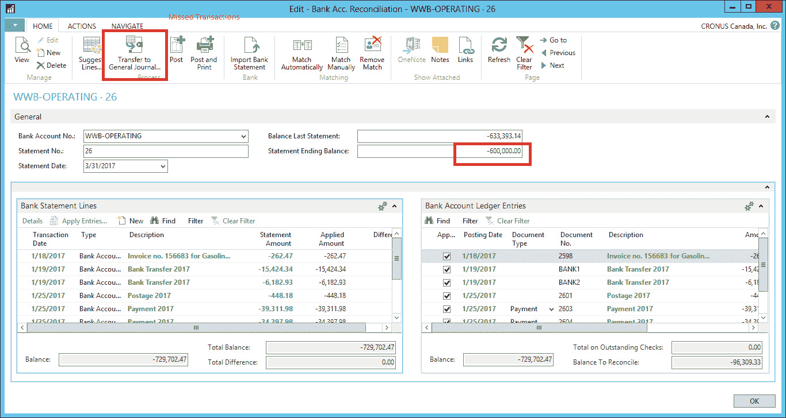

在前面的屏幕截图中，大多数银行对账单条目已经录入系统，但第一行和最后一行缺失。您可以在银行对账中手动创建它们，并使用**转移到总账...**操作将它们转移到相应的账簿，在那里完成交易，并发布它们。

一旦缺失的语句行被发布，从银行对账页面使用**应用分录**操作来选择要应用于手动创建的银行对账行的新的银行总账分录。

最后，使用功能区上的**发布**操作发布银行对账。一旦对账发布，其结束余额将成为下一张对账单的初始余额。

# 摘要

在本章中，您学习了如何使用不同的支付方式管理客户和供应商的付款。我们还学习了如何在系统中创建和发布这些付款以及它们如何影响客户和供应商的余额。最后，我们看到了如何在 Dynamics NAV 中将银行总账条目与实际银行对账单进行对账。

在下一章中，我们将看到如何管理不同的会计流程。
