# 第五章. 预测 - 预算和现金流管理

会计规则基于*既成事实*，但公司需要预测/预测事件。Dynamics NAV 提供了一些可以帮助实现这一目标的工具，我们将在本章中介绍：

+   预算

+   现金流管理

# 预算

预算是特定时间段内计划成本、收入和资源的概述。Dynamics NAV 允许你为固定资产、项目、销售和采购以及项目创建预算。但我们将重点介绍本节中的总账预算。

使用总账预算功能，你可以通过选择 G/L 账户、期间和维度的组合来创建同一时间段的多个预算，简单或复杂的预算。你也可以从上一期复制预算，或在应用程序外使用 Excel 创建预算，然后将其导入 Dynamics NAV。

## 创建预算

让我们为 2017 年第一季度创建一个新的预算。执行以下步骤：

1.  在**搜索**框中，输入`G/L Budgets`并选择相关链接。

1.  一旦进入**总账预算**页面，点击功能区上的**新建**。创建一个新预算，其值如图所示：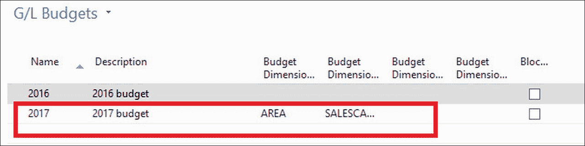

1.  点击功能区上的**编辑预算**选项。

1.  在**按**字段中，选择**月份**。

1.  在**数据过滤器**字段中，输入`01/01/17.12/31/17`。

1.  我们将输入**SALES**部门的**MERCEDES**项目的销售预算，因此添加以下维度作为过滤器：

1.  在**预算矩阵**标签页中，输入每个期间的预算金额，如图所示：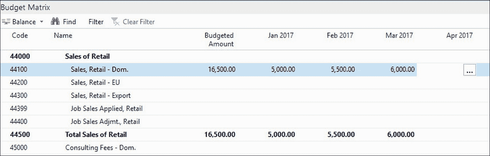

    ### 注意

    当你在**预算矩阵**标签页中输入金额时，系统会根据给定信息创建**总账预算条目**。你可以通过双击账户编号**44110**的**预算金额**字段来查看它们。

1.  保持**过滤器**字段为空。然后双击账户**44110**的**预算金额**字段。

1.  在**总账预算条目**页面，创建以下行：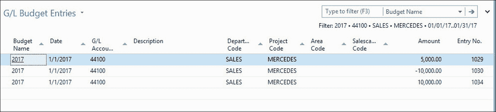

1.  返回预算页面，你会看到创建的行已按相应期间汇总。你可以参考**预算矩阵**页面。

1.  从**部门过滤器**字段中移除过滤器。

1.  点击功能区上的**复制预算**选项。要运行**复制总账预算**作业，选择以下选项，如图所示：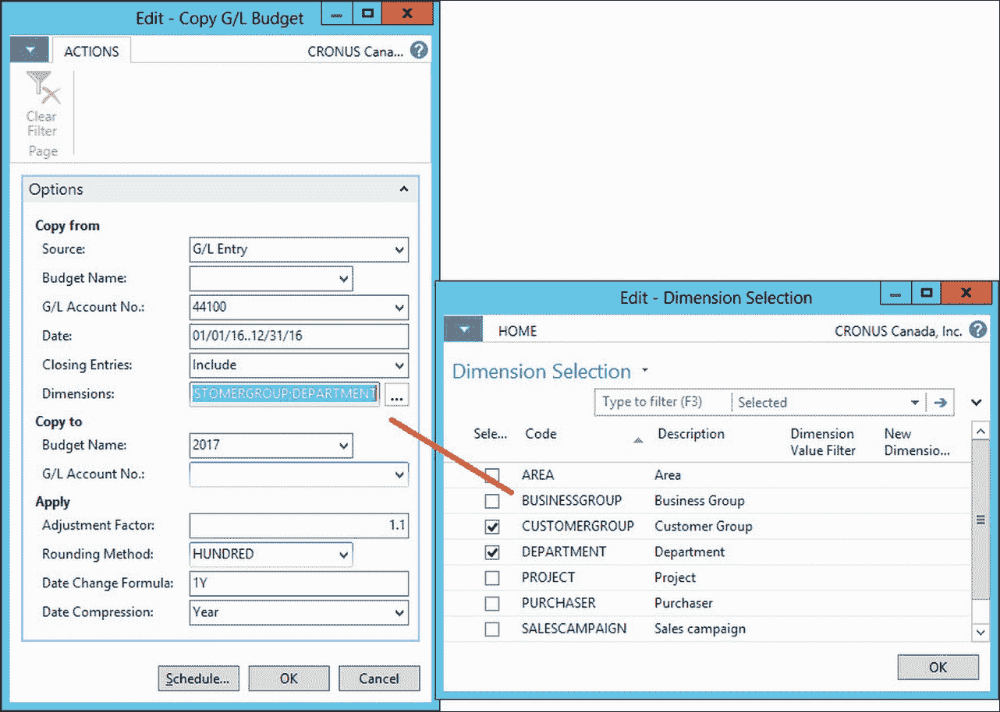

1.  我们已将**G/L 账户编号**字段过滤，仅包括我们正在处理的两个账户。在**日期**字段中，我们选择了与前一年相同的期间。因此，在**日期变更公式**输入框中，输入`1Y`以将日期增加一年。我们正在为**CUSTOMERGROUP**和**AREA**维度创建预算，所以在**维度**字段中已勾选它们。

1.  最后，我们希望应用 10% 的销售增量，因此我们选择`1.1`作为调整系数。我们选择按月压缩变动并四舍五入到百位。

1.  点击**确定**。系统将根据前一期的实际总账条目创建新的预算条目。我们已为两个不同的区域创建了预算。对于其余的区域，我们将创建一个 Excel 模板并要求区域总监为我们填写预算。然后，我们将导入 Excel 表格以完成我们的预算。

1.  从功能区点击**导出到 Excel**选项。使用以下选项运行报告：

    | **字段** | **值** |
    | --- | --- |
    | **开始日期** | `01/01/2017` |
    | **期间数** | `3` |
    | **期间长度** | `1M` |
    | **列维度** | `CUSTOMERGROUP; DEPARTMENT` |
    | **G/L 账户编号** | `41100` |

1.  美洲区域的主管已填写以下 Excel 表格：

1.  在预算页面上，从功能区选择**从 Excel 导入**选项并选择 Excel 文件。

1.  在**选项**字段中选择**添加条目**并点击**确定**。

1.  系统将根据 Excel 模板中引入的金额创建新的预算条目。

## 使用预算

您已经看到了创建预算的三种方法。现在，我们将了解何时可以使用预算。预算主要是为了比较实际金额与预算金额以衡量绩效。预算条目也可以用作现金流管理的来源。我们将在下一节中介绍这些内容。

在**部门** | **财务管理** | **总账** | **报告** | **财务报表**下找到的**试算平衡表/预算**报告，比较了账户总账中每个账户的给定期间的预算金额。

您还可以在**账户报表**上使用预算以汇总方式衡量绩效。在**列布局**定义中，在**账簿条目类型**字段中，您可以选择**预算条目**值以基于预算条目进行计算。要查看示例，请导航到**部门** | **财务管理** | **设置** | **通用** | **列布局**并分析**ACT/BUD**列布局的定义。

# 现金流管理

理解现金流入和流出的流程对于任何公司都至关重要。我们需要知道在到期时是否有足够的资金支付债权人费用。这正是现金流管理功能将告诉我们的。我们将在本节中了解如何做到这一点。

现金流量管理功能分析多个信息来源，以便能够预测现金需求。此功能使用的信息来源如下：

+   **总账**: 这部分使用有关流动资金以及我们在上一节中看到的预算的信息

+   **采购**: 这部分使用有关当前应付账款以及从开放采购订单中获取的预测信息

+   **销售**: 这部分使用有关当前应收账款以及从开放销售订单中获取的预测信息

+   **服务**: 这部分使用有关开放服务订单的信息

+   **固定资产**: 这部分使用有关计划处置和预算购置固定资产的信息

+   **手动收入和支出**: 这也可以使用我们可以手动设置的信息，例如工资、信贷利息、私人消费等

让我们通过创建一个现金流量预测来了解一下它是如何工作的：

1.  导航到**部门** | **财务管理** | **现金流量** | **现金流量预测**。

1.  点击**新建**以创建一个新的现金流量预测。

1.  按下*Enter*键。系统将为新的预测分配一个编号。

1.  输入以下截图所示的信息：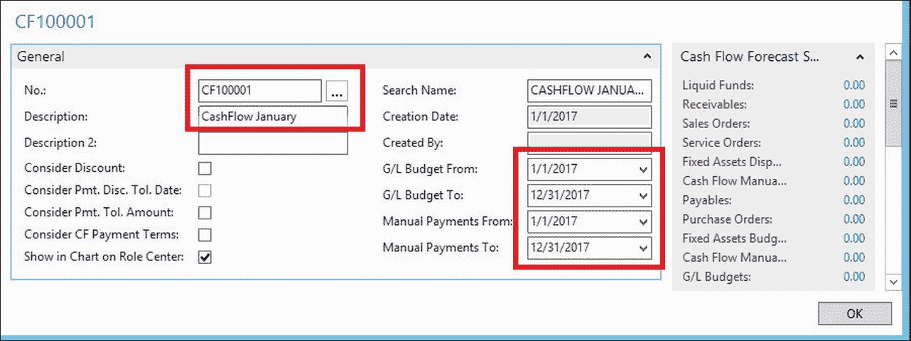

1.  关闭现金流量预测卡。

我们已经创建了预测，并设置了其基本信息。下一步是从系统中获取现金信息并将其纳入我们的预测。为此，请执行以下步骤：

1.  导航到**部门** | **财务管理** | **现金流量** | **现金流量工作表**。

1.  点击**建议工作表行**。

1.  在**现金流量预测**字段中，选择您刚刚创建的预测。

1.  指定您想要从中获取信息以进行现金流量预测的来源。例如，我们已选择所有可用的来源，如以下截图所示：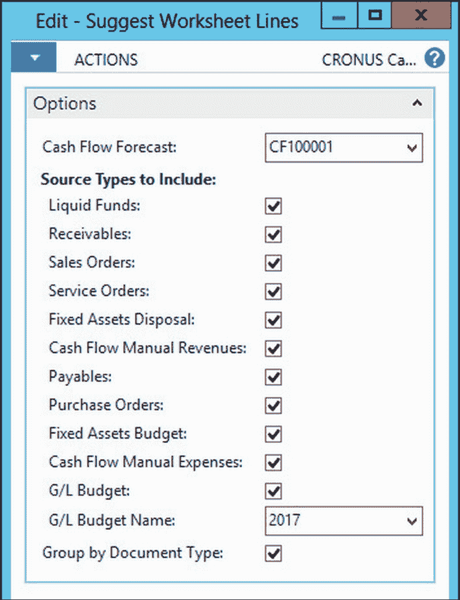

1.  点击**确定**。系统将在所有指定的来源中查找，并在**现金流量工作表**上创建行。在这些行上，您将看到：**来源类型**、**来源编号**、**现金流量日期**和**金额**（当地货币）。

1.  您可以修改建议的行、删除它们或创建新的行。这将允许您调整建议，以便获得更好的预测。

1.  点击**登记**。

在这一点上，我们已经创建了现金流量预测，并将所有关于现金流入和流出的信息都纳入其中。现在，我们需要分析所有这些信息，以便能够检测到任何流动性问题。

打开现金流量预测卡，并点击**按期间查看现金可用性**。在以下截图所示的窗口中，我们可以观察到第 3 周存在流动性问题。流动性问题将在第四周得到解决。我们可以重新安排一些采购订单或与供应商协商更长的付款期限。考虑以下实例：

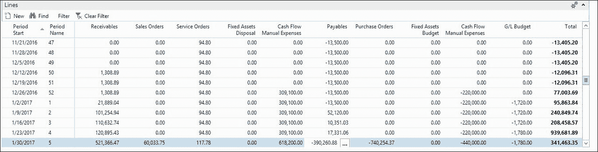

双击**第 3 周**的**采购订单**值，我们将看到哪些采购订单在本周到期。实际上，只有一个采购订单，到期日为`2017 年 1 月 13 日`。我们已经与我们的供应商交谈，并同意将付款日期改为`2017 年 1 月 21 日`。在更新采购订单上的付款信息后，我们在现金流量工作表上建议并注册了新的预测行。正如我们现在在**按期间划分的现金可用性**窗口中所看到的，现金问题不再存在。

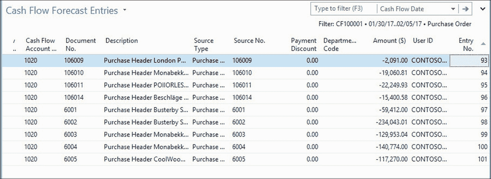

## 创建手动费用和收入

可以创建手动费用和收入，以完成将用于分析公司流动性演变的现金信息。系统中已经有很多现金信息（例如**应收账款**和**应付账款**），但也有许多其他现金信息不在系统中，我们需要手动输入。

创建现金流量手册费用，请执行以下步骤：

1.  导航到**部门** | **财务管理** | **现金流量**，然后单击**现金流量手册费用**。

1.  单击**新建**图标，并根据以下截图中的信息创建一个新的手动费用：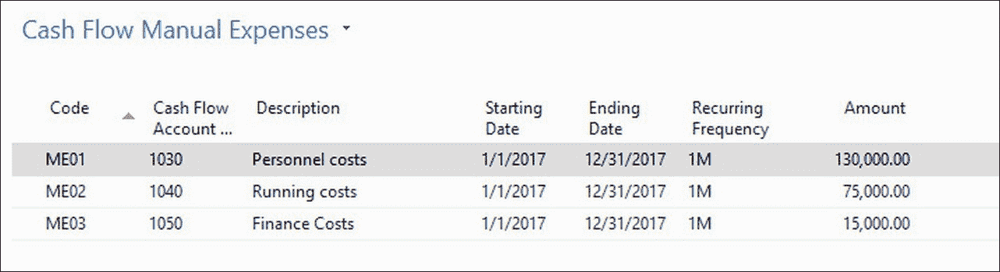

这些是手动费用，例如**人员成本**、**运营成本**和**财务成本**，从 2017 年 1 月 1 日到 2017 年 12 月 31 日每个月的金额分别为**130000**、**75000**和**15000**。目前，这些费用将在建议工作表行时被考虑在内。

在**部门** | **财务管理** | **现金流量** | **现金流量手册收入**处，以类似的方式创建手动收入。

## 现金流量管理设置

现金流量管理功能使用自己的会计科目表：**现金流量会计科目表**。您可以定义所需的会计科目表。对于将从总账或预算获取信息的现金流量账户，您必须指定总账账户过滤器以及总账集成类型（余额、预算或两者）：

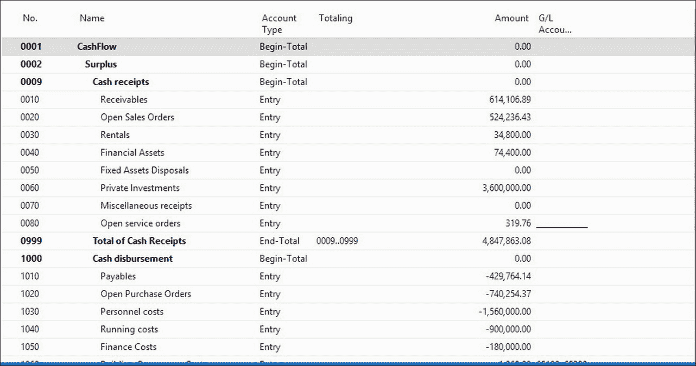

完成现金流量会计科目表后，我们必须通过导航到**部门** | **财务管理** | **现金流量** | **现金流量设置**并定义**现金流量账户...**来完成设置，建议的行将从不同的区域发布。在以下截图中，您可以看到您需要提供哪些信息：

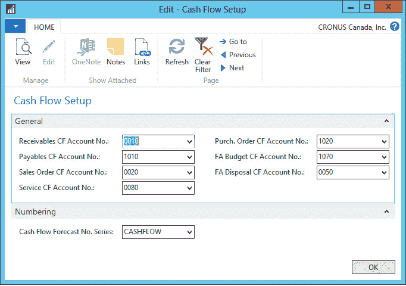

# 摘要

在本章中，我们看到了可以帮助公司预测和预见财务事件的工具。你学习了如何使用不同的信息来源创建新的预算。你可以手动输入预算金额，通过调整系数从实际的通用账目条目中复制，或者从 Excel 中导入。你还学习了如何通过分析多个信息来源，如流动资金、应收账款和应付账款、未完成订单和预算，来预测现金需求。

到目前为止，我们已经接触到了销售和采购、银行账户管理以及不同的会计流程。在 Dynamics NAV 中，所有事情都导向会计，但财务管理区域内的多数操作都可以在有限的会计知识下完成。在下一章中，我们将学习那些允许这种情况发生的设置选项。
