# 第八章：固定资产设置和交易

这本书几乎要结束了。我们已经用 Dynamics NAV 覆盖了财务管理最重要的方面。但是，在本章中，你将学习从购置到处置的固定资产的完整生命周期。在本章中，我们将做以下几件事：

+   固定资产设置

+   固定资产过账

+   固定资产报告

# 固定资产是什么？

Microsoft Dynamics NAV 中的固定资产功能提供了对您的固定资产的概览，并确保正确的定期折旧。它还使您能够跟踪维护成本，管理与固定资产相关的保险政策，过账固定资产交易，并生成各种报告和统计信息。

以下是固定资产流程图：

1.  **固定资产设置**：对于每个固定资产，您必须设置一个包含有关资产信息的卡片，例如折旧账、折旧方法、固定资产过账组、维护信息等。

1.  **折旧**：您可以设置多个折旧账来适应各种类型的折旧。您可以计算手动或自动折旧。

1.  **过账交易**：在固定资产应用区域的所有过账都是从日志中完成的。有四种不同的日志：

    +   FA G/L 日志

    +   FA 日志

    +   FA 重新分类日志

    +   保险日志

1.  **维护**：对于每个资产，您可以记录维护成本和下一次服务日期。跟踪维护费用对于预算目的和做出是否更换固定资产的决定可能很重要。

1.  **保险**：每个固定资产可以附加一个或多个保险单。因此，您可以轻松验证保险单金额是否符合与该政策相关的资产价值。这也使得监控年度保险费变得容易。

1.  **统计和报告**：对于每一本固定资产折旧账，都有一个提供账面价值、可折旧基础、累计折旧以及销售收益或损失的快速概览的统计窗口。每个主要资产都有自己的统计窗口。

有几个标准报告可用，其中一些可以根据特定需求进行定制。

# 固定资产卡片

我们指定有关固定资产的信息，例如序列号、责任员工、过账代码和维护信息。每个固定资产都有一个卡片。每个卡片包含几个不同类型的快速标签页，其中包含有关固定资产的各种信息。

要访问**固定资产卡片**，请导航到**部门** | **财务管理** | **固定资产** | **固定资产**。然后，创建一个**新固定资产**，如图下截图所示：

# 固定资产交易

所有**固定资产**（**FA**）交易都必须在固定资产分录中发布。如果固定资产连接到与总账集成的折旧账簿，则使用固定资产总账分录。

固定资产的基本交易包括折旧、购置成本、减值和处置。如果由于某种原因金额发生变化或已发布的交易中存在错误，您可以纠正已发布的条目。您还可以为固定资产创建报告、预算、成本核算和指数化。

## 固定资产分录

所有固定资产交易都可以通过以下四个分录进行发布：

+   **固定资产总账分录**：此分录中的所有条目将根据固定资产过账组过账到固定资产账簿和总账

+   **固定资产分录**：在此分录中发布的所有条目仅过账到固定资产账簿

+   **固定资产重新分类分录**：在此分录中发布的所有条目都用于转移、分割或合并固定资产

+   **保险分录**：在此分录中发布的所有条目都用于发布保险账簿条目

## 获取固定资产

您可以通过固定资产总账分录、采购订单、采购发票或固定资产分录来获取固定资产，而不会影响总账。

通常，在购买时一起输入残值。只有当您在**固定资产过账类型**字段中选择了**购置成本**选项时，才能填写**残值**字段。在这种情况下，在字段中输入固定资产的残值。

通常，残值必须以负数金额输入。

## 购买固定资产

在购买固定资产之前，您必须使用固定资产卡片设置固定资产（如前一张截图所示）。

要购买固定资产并发布购置成本，请按照以下步骤操作：

1.  在导航窗格中，转到**部门** | **财务管理** | **应付账款** | **采购发票**。

1.  点击**新建**。

1.  在**供应商编号**字段中，点击字段并选择供应商**44127904**。

1.  在**供应商发票编号**字段中，输入`2016-E-101`。

1.  在**行**快速选项卡中，右键单击标题并使用**选择列**功能添加**固定资产过账类型**字段。

1.  在**类型**字段中，选择**固定资产**。

1.  在**编号**字段中，选择**FA000110**。

1.  在**数量**字段中，输入`1`。

1.  在**直接单位成本（不含增值税）**字段中，输入`11,000.00`。

1.  在**固定资产过账类型**字段中，选择**购置成本**

1.  点击**过账**以发布**固定资产**的购买。

1.  当您收到消息**您想发布发票吗？**时，点击**是**。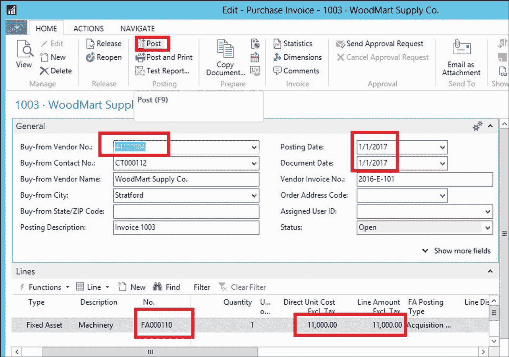

## 计算和发布折旧

折旧用于在固定资产的折旧年限内分配固定资产。固定资产折旧可以通过两种方法进行计算和发布：

+   **手册**：我们可以使用固定资产总账分录或固定资产分录

+   **自动**：我们可以运行计算折旧批量作业

### 使用固定资产/总账日记账进行手动折旧

对于与总账集成的固定资产，手动过账折旧，请使用固定资产/总账日记账：

1.  在导航面板中，转到**部门** | **财务管理** | **固定资产** | **固定资产/总账日记账**。

1.  在**固定资产/总账日记账**窗口中，在**过账日期**字段中，输入相关的过账日期。

1.  在**账户类型**字段中，点击字段然后选择**固定资产**。

1.  在**账户编号**字段中，点击字段然后选择您想要过账折旧的固定资产。

1.  在**折旧账簿代码**字段中，点击字段然后选择与所选固定资产集成并连接到总账的折旧账簿，例如，公司。

1.  在**固定资产过账类型**字段中，点击字段然后选择**折旧**。

1.  确保在固定资产过账组中设置了分配键，然后点击**主页**快速选项卡中的**插入固定资产余额账户**。现在将自动创建具有不同部门代码的平衡分录。您可以使用**选择列**功能添加**部门代码**字段。

1.  点击**过账**以过账折旧。

1.  当您收到消息**您想要过账日记账分录吗？**时，点击**是**。

1.  当您收到消息**日记账分录已成功过账**时，点击**确定**。

### 自动计算折旧

**计算折旧**是一个批量作业，它根据您在批量作业请求页面上设置的条件自动计算折旧。已售出、已阻止或非活动资产，以及使用手动折旧方法的资产不包括在自动折旧计算中。批量作业自动创建日记账分录，您只需在固定资产/总账日记账中检查和过账创建的分录即可。

以下演示解释了如何使用**计算折旧**批量作业计算固定资产**FA000110**的折旧。

要计算折旧，请按照以下步骤操作：

1.  在导航面板中，转到**部门** | **财务管理** | **固定资产** | **固定资产**。

1.  在**固定资产**窗口中，选择带有固定资产**FA000110**的行，然后点击**导航**快速选项卡中的**日记账分录**。新的折旧必须计算为一月。

1.  关闭**固定资产日记账分录**窗口。

1.  双击**FA000110**。接下来，在**常规**组中的**操作**快速选项卡中，点击**计算折旧**。将出现**计算折旧**批量作业请求页面。

1.  在**选项**快速选项卡中，在**折旧账簿**字段中，选择**公司**。

1.  在**固定资产过账日期**字段中，键入`1/1/2017`。

1.  选择**插入平衡账户**复选框。

1.  在**固定资产**快速选项卡中，将**编号**字段的过滤器设置为**FA000110**：

1.  点击**确定**以计算 2017 年 1 月 1 日的折旧。批量作业计算固定资产编号**FA000110**的折旧，并在固定资产总账/损益账分录中创建行。

1.  关闭固定资产卡片。

1.  导航到**部门** | **财务管理** | **固定资产** | **固定资产总账/损益账分录**。

1.  **固定资产总账/损益账分录**窗口包含由**计算折旧**批量作业创建的行。

1.  查看行，然后点击**过账**以过账折旧。

1.  当你收到消息**您想要过账分录行吗？**时，点击**是**。

1.  当你收到消息**分录行已成功过账**时，点击**确定**。

1.  点击**确定**以关闭**固定资产总账/损益账分录**窗口。

## 固定资产的减值和增值

+   让我们来看看减值和增值的含义。减值是指固定资产价值的减少。减少可能是由于资产过时或损坏造成的。

+   欣赏是指固定资产（通常是土地和建筑物）价值的增加。它也可以用于由于对物品需求增加而价值增加的固定资产。

## 固定资产处置

固定资产的全部或部分处置是固定资产典型生命周期的最后一步。对于部分处置的固定资产，您可以过账多个处置条目。在您可以对资产的部分进行处置之前，您必须将资产分成两个单独的资产，如下所示：

+   使用**固定资产总账/损益账分录**将处置交易过账到具有总账集成的折旧账簿。

+   使用**固定资产分录**将处置交易过账到没有总账集成的折旧账簿。

在**处置计算方法**字段中为每个折旧账簿设置处置方法。程序可以处理以下方法之一的处置：

+   **净额法**：将处置损失或收益记入相应的账户。这是最常见的处置方法。

+   **总额法**：将账面价值损益记入账户和销售损益账户。当你在一个分录中输入销售价格时，程序会计算处置损益并计算所有其他相关条目。损益金额自动从销售价格和账面价值的差额计算得出。

### 通过固定资产总账/损益账分录过账处置

要通过固定资产总账/损益账分录进行处置，请按照以下步骤操作：

1.  在导航窗格中，转到**财务管理** | **固定资产** | **固定资产总账/损益账分录**。

1.  在**固定资产总账/损益账分录**窗口中，在行上输入适当的信息。

1.  在**金额**字段中，输入处置金额作为贷方或负数。

1.  在**操作**快速选项卡中，点击**过账**。

1.  当你收到消息**你想过账日记账行吗？**时，点击**是**。

1.  当你收到消息**日记账行已成功过账**时，点击**确定**。

## 预算固定资产交易

当你设置预算资产时，你可以计划资产的增加。资产购买后，你必须通过固定资产日记账、采购发票或固定资产总账创建新资产并过账，以实际采购成本。然后你可以比较预算成本和实际成本。预算资产不集成到总账中。此信息可从固定资产预测价值报告中获得。

你可以通过在**过账**快速选项卡中的固定资产卡片上选择**预算资产**复选框来指示资产是为预算而创建的。

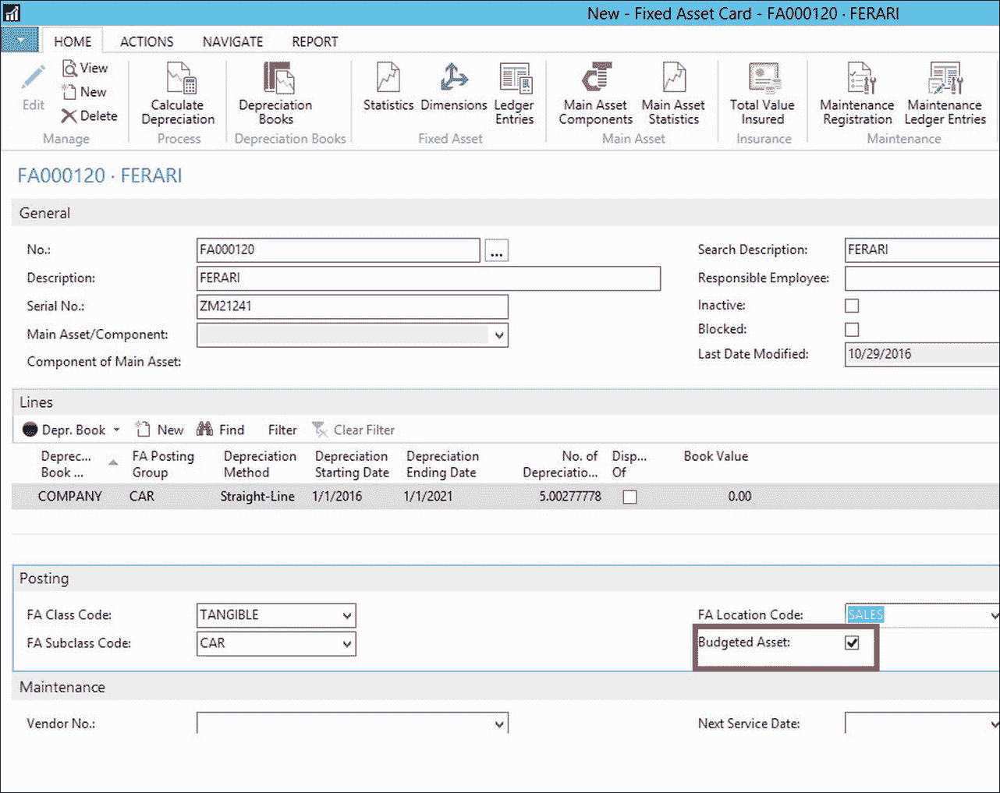

### 演示 - 未来采购成本预算

在本演示中，我们将通过为计划未来购买的固定资产设置固定资产卡片来准备未来采购成本的预算。

要为未来采购成本编制预算，请按照以下步骤操作：

1.  导航到**部门** | **财务管理** | **固定资产（组）** | **固定资产（列表页）**。

1.  点击**新建**以创建一个新的固定资产。

1.  按*Enter*键自动分配资产编号。

1.  在**描述**字段中，输入`法拉利`。

1.  在**序列号**字段中，输入`ZM 21 241`。

1.  在**行**快速选项卡中的**折旧账簿代码**字段，点击字段然后选择**COMPANY**。

1.  在**固定资产过账组**字段中，点击字段并选择**CAR**。

1.  在**折旧方法**字段中，点击字段并选择**直线法**。

1.  在**折旧开始日期**字段中，输入`2016/1/1`。

1.  在**折旧结束日期**字段中，输入`2021/1/31`。

1.  在**固定资产类别代码**字段的**过账**快速选项卡中，点击字段并选择**TANGIBLE**。

1.  在**固定资产子类代码**字段中，点击字段并选择**CAR**。

1.  在**固定资产位置代码**字段中，点击字段并选择**SALES**。

1.  选择**预算资产**复选框以防止过账到总账

1.  关闭**固定资产卡片**窗口。

1.  导航到**部门** | **财务管理** | **固定资产** | **固定资产日记账**以打开**固定资产日记账**窗口。

1.  按照以下截图输入并过账预算的采购成本，然后过账该行：

## 资产重新分类

当你想转移、分割或合并资产时，可以使用资产转移。

使用重新分类日记账对所有资产转移的过账进行分类。

## 转移资产

当你转移固定资产时，程序会将固定资产条目（购置成本和折旧）从一个固定资产账户转移到另一个固定资产账户。为了理解这一点，让我们看看以下演示：

1.  创建一个新的固定资产：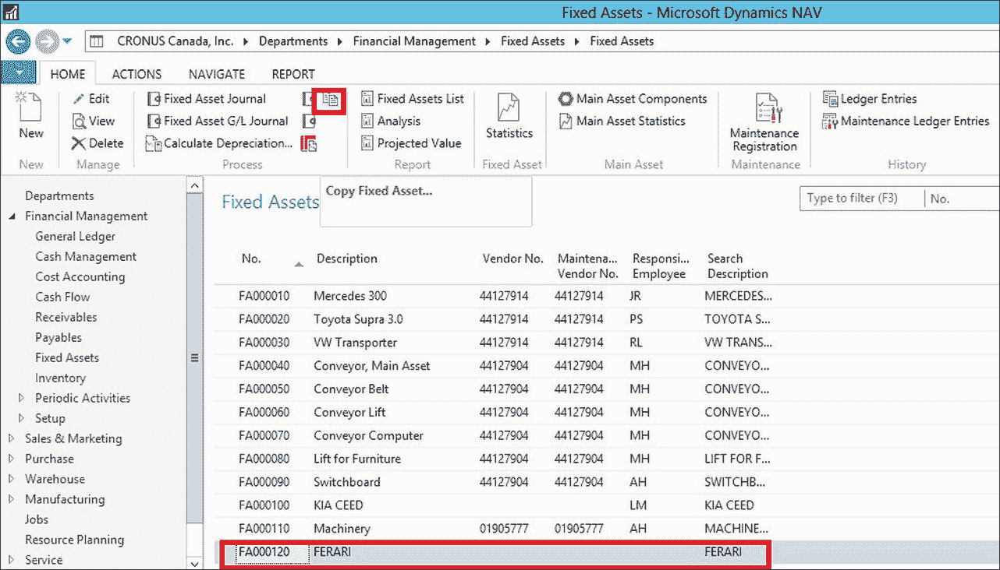

1.  从现有固定资产复制：

1.  查看新资产：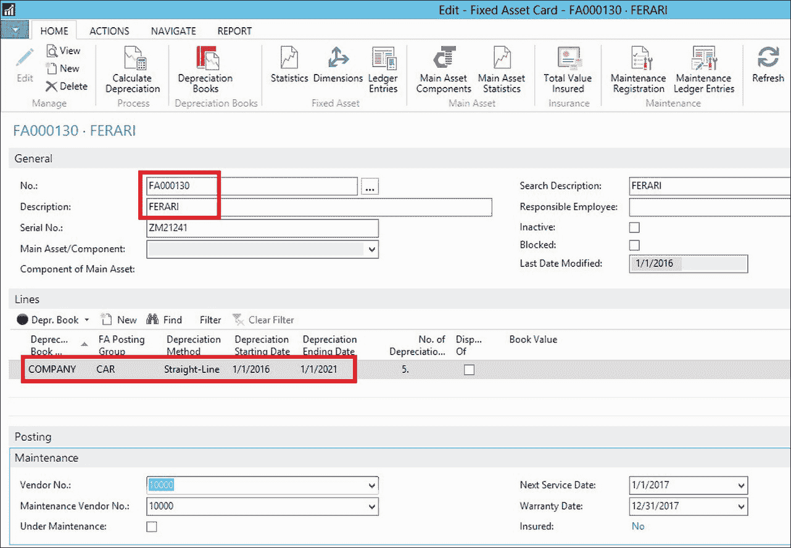

1.  从 FA G/L 日记中获取新资产：

1.  将新固定资产（通过将价值转移到另一个固定资产将固定资产重新分类 50%）进行转移：

1.  登记重新分类：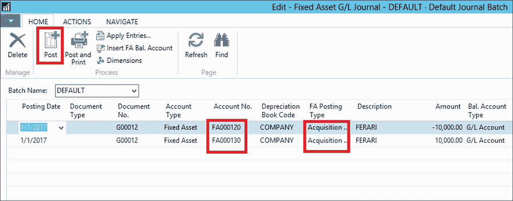

# 设置维护信息

维护费用是用于维护固定资产价值的常规定期成本。与资本改进不同，维护费用不会增加资产的价值。

要在 Microsoft Dynamics 中使用固定资产维护功能，你应该设置以下内容：

1.  固定资产卡片上的维护信息：

1.  固定资产过账组以允许将维护成本过账到总账：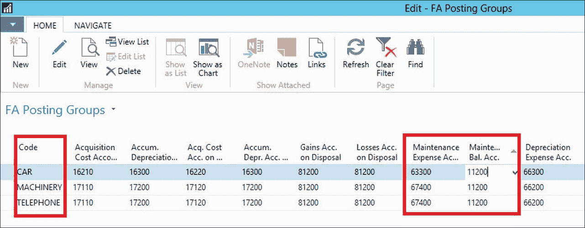

1.  维护代码，以便你在登记维护成本时选择维护类型：

## 维护登记和成本

每次将固定资产送修时，你必须记录相关信息，例如服务日期、供应商编号、服务代理商名称和电话号码。

当服务完成并且你收到维护发票时，你通过 FA G/L 日记、采购发票或 FA 日记登记维护成本，具体取决于相关的折旧账簿是否与总账集成。

## 跟踪服务访问

每次有人对固定资产进行维护时，你都可以在**维护登记**窗口中登记此事。

要跟踪服务访问，请按照以下步骤操作：

1.  在导航面板中，转到**部门** | **财务管理** | **固定资产** | **固定资产**。

1.  选择你想登记服务访问的固定资产行。

1.  在**主页**快速选项卡中，单击**维护登记**：

## 记录维护成本

当你收到维护发票时，你可以在以下方式之一中在 Microsoft Dynamics NAV 2016 中记录维护成本：

+   如果折旧账簿启用了 G/L 集成，请使用采购发票或 FA G/L 日记：

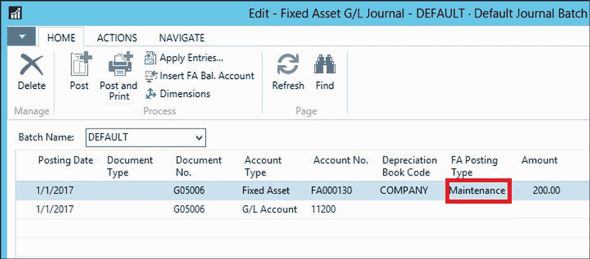

+   如果折旧账簿未启用 G/L 集成，则仅使用 FA 日记：

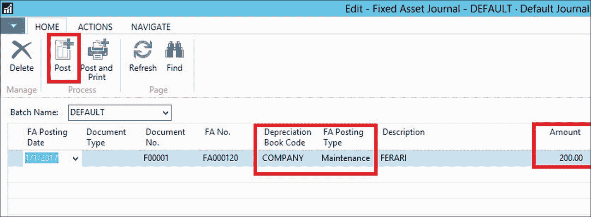

# 设置保险信息

您应该在保险卡上设置保险单的一般信息。您可以针对每个保险单创建一个保险卡。

## 固定资产设置页面

在**固定资产设置**窗口中，您设置有关固定资产保险的一般信息。

要设置固定资产保险的一般信息，转到**部门** | **财务管理** | **固定资产** | **FA 设置**。

## 保险类型

在 Microsoft Dynamics NAV 2016 中，您可以按保险类型对保险单进行分组，例如，盗窃或火灾保险。

要设置保险类型，转到**部门** | **财务管理** | **固定资产** | **保险类型**。

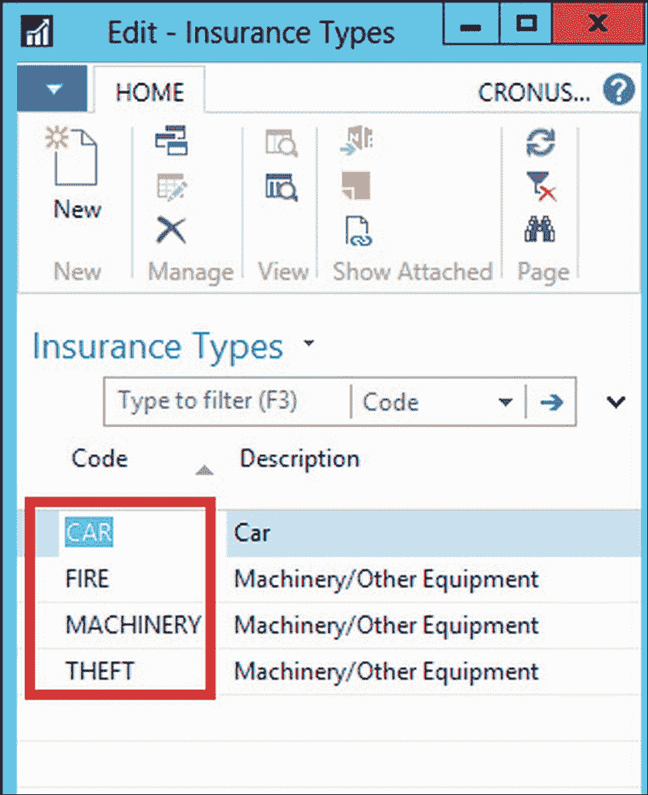

## 保险卡

您应该为与固定资产相关的每个保险单创建一个保险卡。在保险卡上，您指定有关保险单的一般信息：

1.  要设置新的保险单，在导航窗格中转到**部门** | **财务管理** | **固定资产** | **保险**。

1.  点击**新建**以创建新的保险卡。

1.  在**常规**快速选项卡中，填写以下表格中显示的字段。点击**编号**字段并按*Enter*键：

| **字段** | **值** |
| --- | --- |
| 编号 | Auto |
| 描述 | 车辆保险 |
| 生效日期 | 01/01/16 |
| 保险类型 | CAR |
| 保险单号 | 443434343444 |
| 年度保费 | 500.00 |
| 政策覆盖范围 | 20,000.00 |

窗口中将出现以下内容：

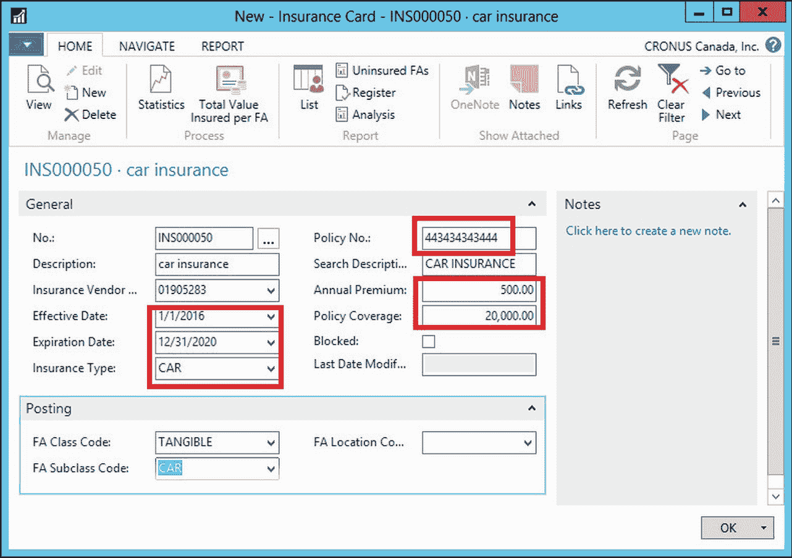

## 将资产附加到保险单

在 Microsoft Dynamics NAV 2016 中，您可以附加任何资产到保险单。将固定资产附加到保险单为您提供了一种简单的方法，在需要时找到与资产相关的相关保险单。

## 将固定资产链接到保险单

在您完成设置保险信息后，固定资产可以链接到保险单。

您可以将一个或多个资产链接到单个保险单。您还可以将同一保险单的不同金额链接到单个资产。

固定资产可以通过以下两种方式之一附加到保险单：

+   在 FA 日记账、FA 总账日记账行或采购发票上填写**保险号**字段后，发布采购成本。

+   在日记账行上不填写**保险号**字段，然后使用保险日记账将采购成本过账到保险覆盖账簿

您可以从以下任何位置过账采购成本到保险覆盖账簿：

+   采购发票

+   保险日记账

+   FA 总账日记账

+   FA 日记账

当**保险号**字段有值时，**固定资产卡片**窗口中的**维护**快速选项卡中的**被保险人**字段会自动设置为**是**。

在您出售固定资产后，程序会自动将固定资产卡片上的**被保险人**字段设置为**否**。

## 通过保险日记将固定资产链接到保险单

如果您未将固定资产的购置成本与保险单链接而过账，无论是从采购发票还是从 FA 日记中的一个，您可以通过从保险日记过账购置成本将固定资产链接到保险单。

例如，如果您在固定资产`FA1500`的采购发票上的**保险单号**字段中没有输入保险号码`INS000040`，您仍然可以通过保险日记将保险单附加到资产的购置成本。

要过账保险日记，请按照以下步骤操作：

1.  在导航窗格中，转到**部门** | **财务管理** | **固定资产** | **保险日记**。

1.  在**过账日期**字段中，输入`1/1/2016`。

1.  在**保险单号**字段中，输入`INS000050`。

1.  在**固定资产号**字段中，输入`FA00120`。

1.  在**金额**字段中，输入`200000.00`。

1.  在日记分录的**金额**字段中，输入资产的购置成本。对于本例，使用之前示例中的信息`FA00120`。在**固定资产号**字段中输入`FA00120`，在`保险单号`字段中输入`INS000050`，并在**金额**字段中输入购置成本`20000.00`。

1.  点击**过账**以过账日记。

1.  当您收到消息**您想要过账日记分录吗？**时，点击**是**。

1.  当您收到消息**日记分录已成功过账**时，点击**确定**。

1.  在导航窗格中，转到**部门** | **财务管理** | **固定资产** | **固定资产**，然后双击带有固定资产 FA00120 的行以打开固定资产卡片。

1.  要验证固定资产的总保险价值，请点击**总保险价值**在**导航**快速选项卡。

# 固定资产报告

我们在 NAV 2016 中有几个标准报告，用于总账、固定资产、维护、保险、折旧、账面价值等。但在这里我们只讨论其中的一些。

## 维护细节报告

本报告显示了固定资产的详细维护费用。报告可以显示不同时间段的固定资产维护费用，按维护类型或其他类别（如固定资产类别）细分。

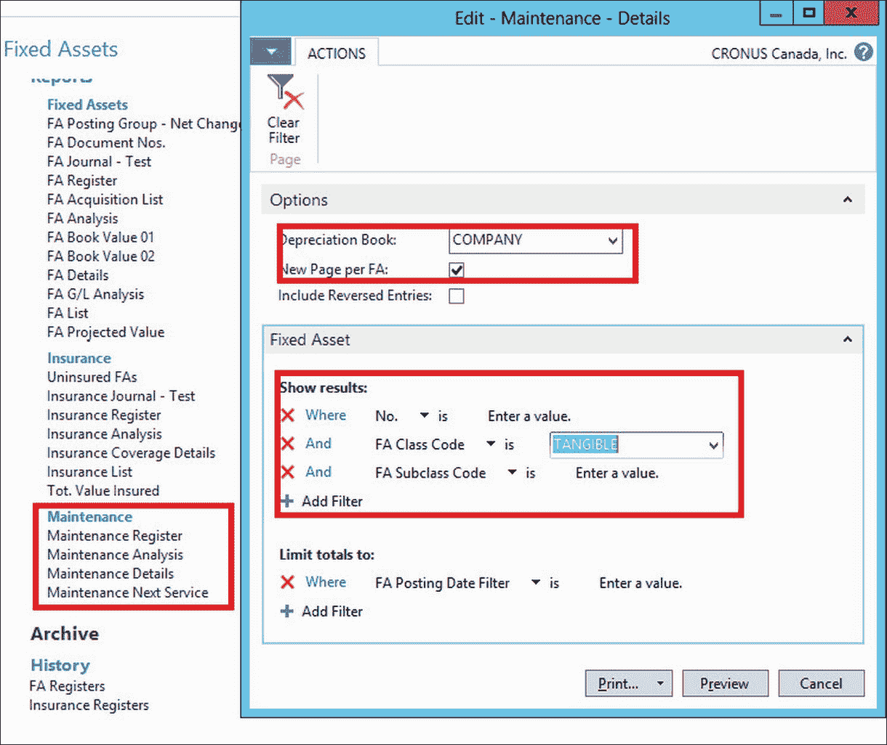

## 保险覆盖详情报告

保险覆盖详情报告打印**总保险价值**报告。它显示了哪些保险单覆盖了每一项资产，并指定了金额。

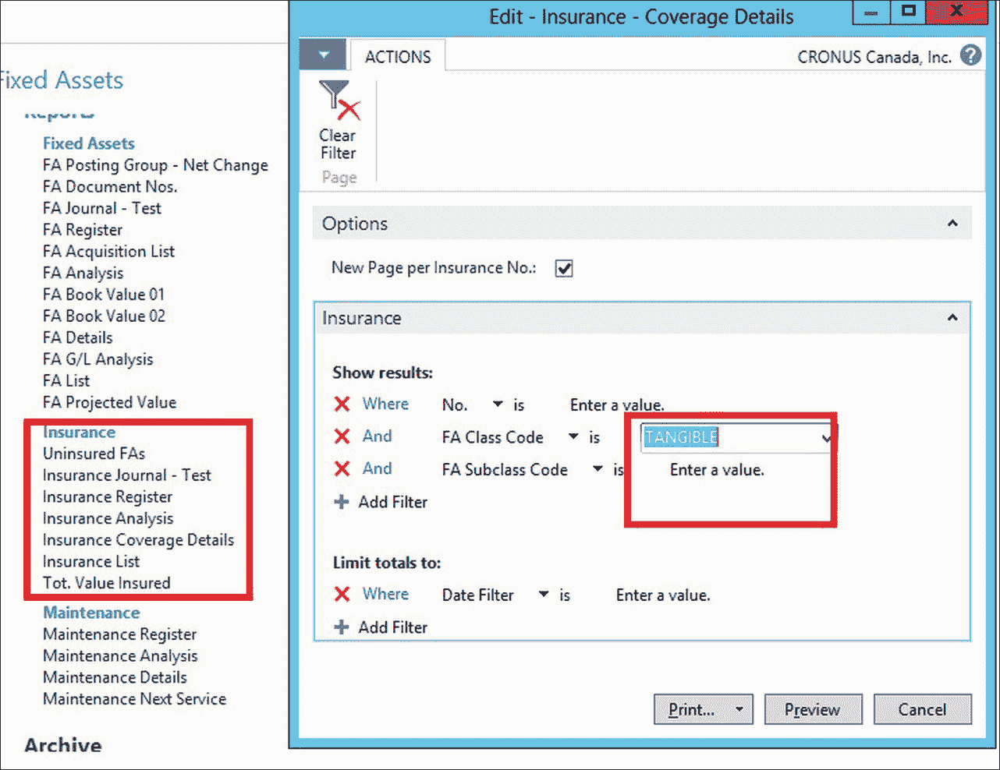

## 固定资产详情报告

该报告显示了您固定资产的分析，包括针对单个资产和/或资产组的各种类型的数据。在 **固定资产** 快速选项卡中，如果您希望报告仅包括某些固定资产，可以设置过滤器。在 **选项** 快速选项卡中，您可以从多个选项中选择，以定制报告以满足您的特定需求：

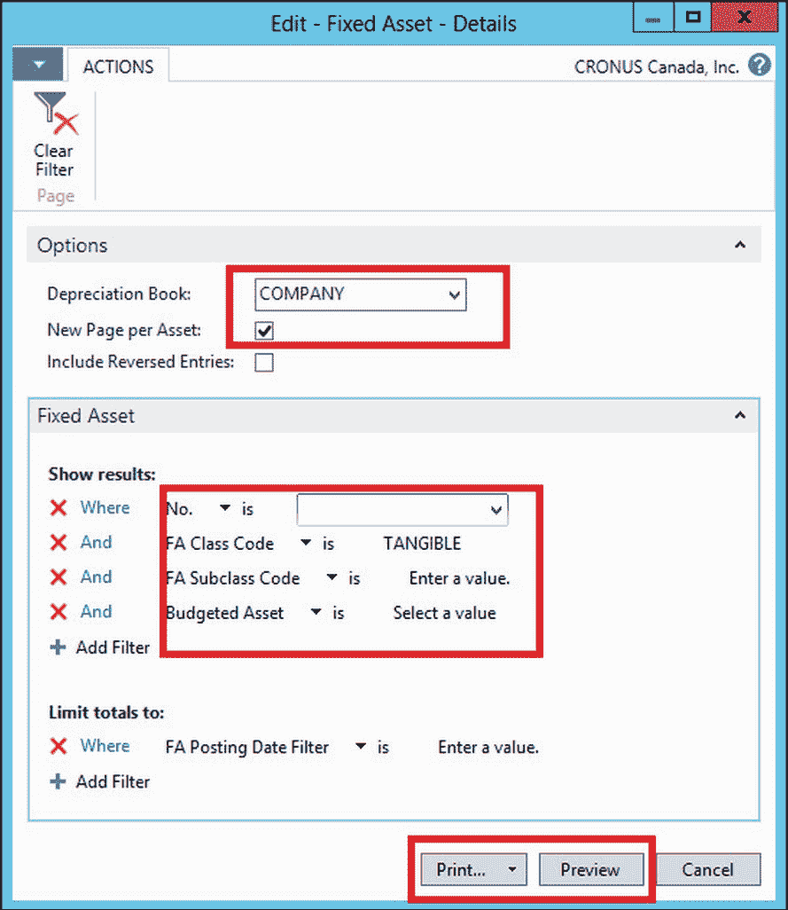

## FA 注册报告

该报告显示了交易详情，包括日记类型、日期、用户 ID、批次等，针对所有固定资产。

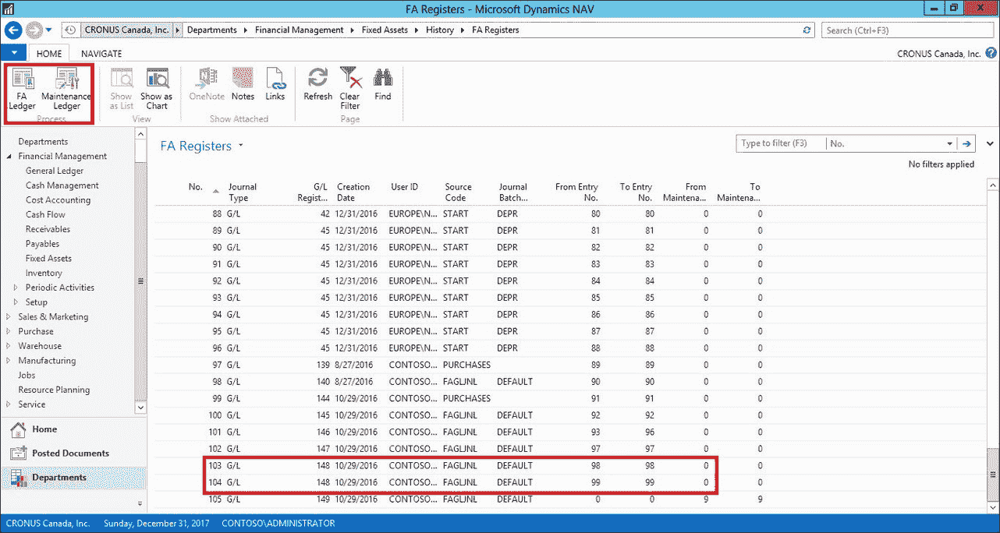

# Microsoft 在 WPC 上宣布 Dynamics® 365。

在 Microsoft 的 **世界合作伙伴大会**（**WPC**）上，Microsoft 发布了 Madeira 项目，这是一个看起来有点像简化版的 Office 365 和 Microsoft Dynamics® NAV 基本模块的新平台。尽管这是一个令人兴奋的前景，但人们普遍面临的一个大问题是理解所有 Dynamics 产品的区别。让我们来看看。

## 什么是 Microsoft Dynamics 365？

Microsoft Dynamics 365 是一种仅在线的企业软件解决方案。这由两个产品组成：

+   **Dynamics 365 商业版**：这是 **项目 Madeira**（本质上是在 Office 365 内部由 Microsoft 托管的 Dynamics NAV 和 Office 365 的完全集成），针对需要有限和现成解决方案的小型企业。Project Madeira 是一个由 Microsoft 在 Office 365 内部托管的全新云服务产品的代号。该解决方案基于 Microsoft Dynamics NAV。以下是一些其功能：

    +   Madeira 最初是 Dynamics NAV 下一个版本的代号。

    +   Microsoft 一直在努力使 Dynamics NAV 成为 Azure 的一流公民，并在 Office 365 中实现。在 NAV 2015 和 2016 中，公司可以将他们的本地 ERP 解决方案连接到 Azure Active Directory 和他们的 Office 365 账户，并运行混合云/本地解决方案。

    +   这对于中型和大型组织来说效果非常好。

    +   Madeira Microsoft 现在通过自己托管解决方案，使上线过程变得非常简单。

+   **Dynamics 365 企业版**：这是基于 Dynamics AX、CRM 在线和 Office 365 的新产品，再次实现完全集成。

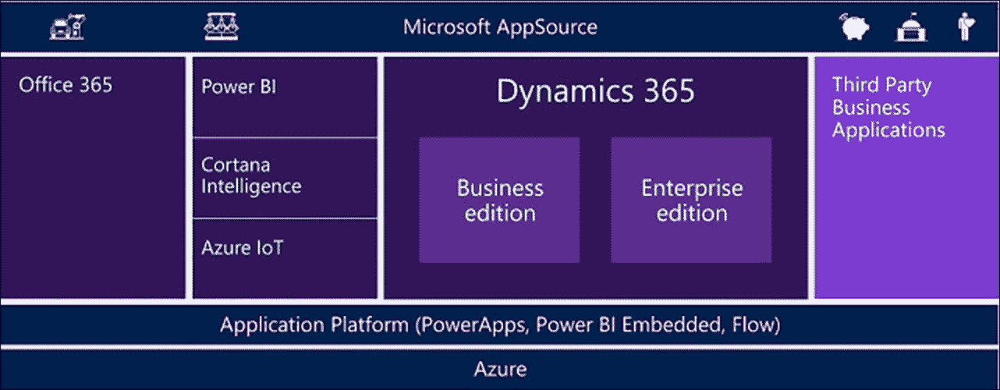

Dynamics 365 不是现有 Dynamics 产品的替代品。实际上，Microsoft 已经明确表示 Dynamics NAV 将继续开发，并且许多新工具和功能将跨包可用。

以下截图提供了两者的区别。**商业版**除了 **财务** 选项外，还提供了 **销售** 和 **营销**，而 **企业版**则提供了后者和一些更多功能：

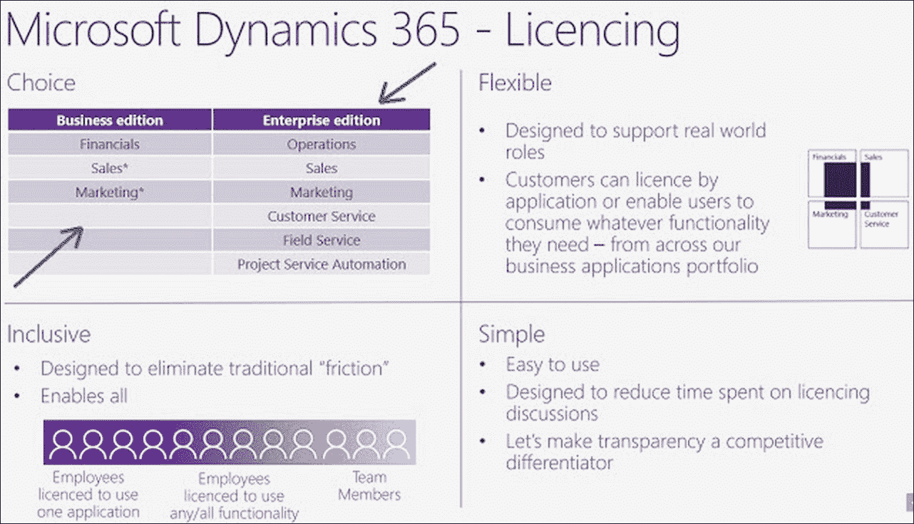

# 摘要

在本章中，你学习了 Dynamics NAV 中其他财务管理可能性，例如固定资产的使用和确保正确的定期折旧。你还学会了跟踪你的折旧、维护成本、保险单和与固定资产相关的贷款资产；过账固定资产交易；以及生成各种报告和统计数据。你现在已经熟悉了固定资产从购置到处置的完整生命周期。

在前面的章节中，我们讨论了所有其他财务概念（从基础到高级），例如配置总账科目卡、货币、过账组、多笔交易、现金和银行管理，以及完整的 P2P 和 O2C 循环。你现在可以开始使用 Microsoft Dynamics NAV 2016 来在你的公司中实施财务管理了。
