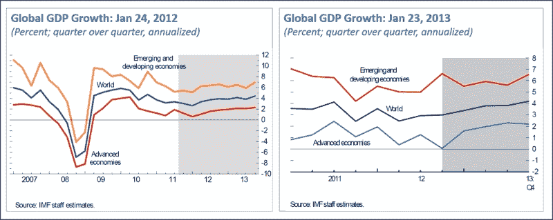
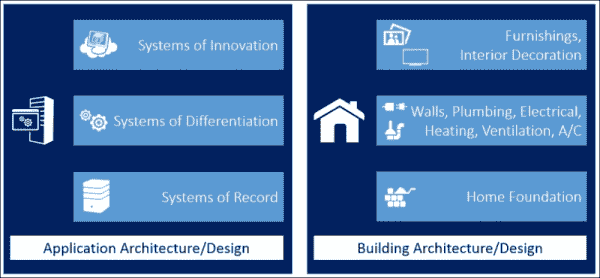
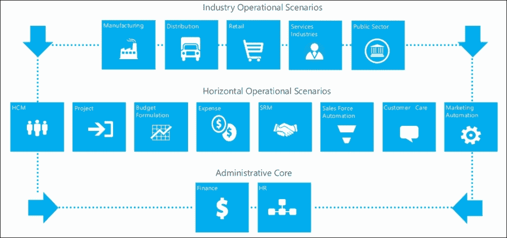
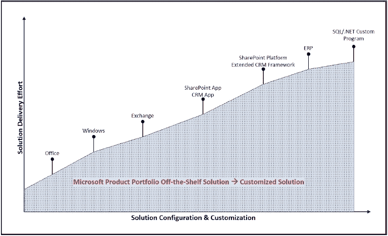
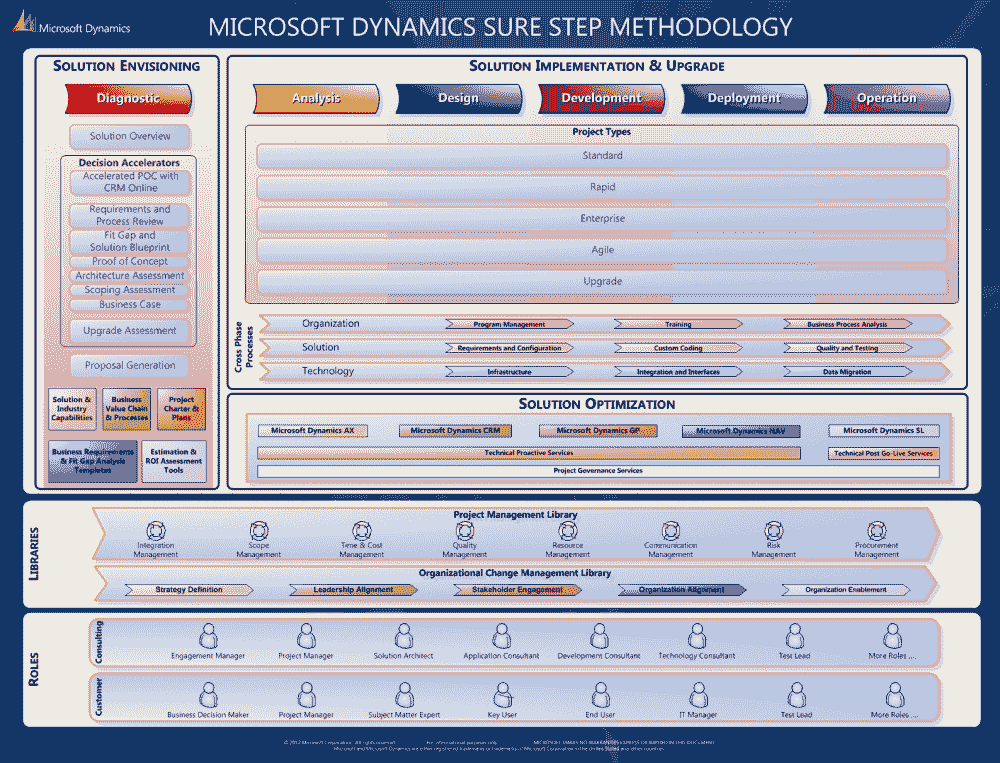
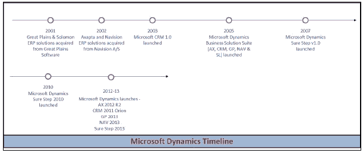

# 第一章：背景和概念

> *对 ERP 系统（或基于最佳实践功能的任何集成应用套件）的最大批评之一是它们缺乏灵活性，不支持业务变化。Gartner 发现，在太多情况下，任何感知到的缺乏灵活性更多是由于 ERP 应用程序的采购和部署方式，而不是技术本身的固有缺陷。*
> 
> *Gartner, Inc., 2012 年 1 月*

商业解决方案的成功，尤其是企业资源规划（ERP）和客户关系管理（CRM）解决方案的成功，并不仅仅关乎技术。经验告诉我们，它同样关乎人和流程，就像它关乎软件一样。软件只是使能者，成功的钥匙在于制定一个适合公司短期和长期目标的组织解决方案策略，将需求与适当解决方案相匹配，然后管理实施以满足既定目标。

当组织考虑 ERP 和 CRM 系统时，他们通常想到的是核心财务和簿记功能，或者基本的客户联系管理活动。虽然这些系统确实可以并支持这些功能，但了解这些解决方案的现代版本开始为公司及其用户群提供的能力也同样重要。这些系统已经远远超出了这些基本基础，涵盖了组织在多个功能、部门和跨部门方面的需求。当前一代的商业解决方案能够提供支持包括产品工程、销售自动化、营销自动化、客户关怀、销售订单管理、供应商关系管理、供应链规划、订单履行和物流，以及售后服务和支持的复合应用。

考虑到现代系统提供的广泛功能，组织在构建策略时必须系统化，并调整他们的方法来了解可用的解决方案功能，并将它们与公司特定领域的具体需求相匹配。近年来，帮助组织构建成功解决方案策略的最佳研究模型之一是**Gartner Pace Layer Model**。本章将向读者介绍这个模型，并解释它如何帮助组织调查其业务系统需求。

微软一直明白，只有当解决方案与客户需求良好匹配，并且解决方案的实施能够满足用户需求时，其客户才能从他们的软件投资中获得最大价值。带着这种愿景，微软开发和推出了**微软 Dynamics Sure Step 方法**，以帮助服务提供商正确定位和部署微软 Dynamics ERP/CRM 产品套件——AX、CRM、GP、NAV 和 SL。Sure Step 是一个促进咨询和客户资源合作的平台，代表了软件供应商、实施者和客户之间合作的重要三角关系，实施方法成为实施应用的关键元素。

在本章中，我们将介绍本书中使用的概念和定义，并为后续章节奠定背景。我们还将概述微软 Dynamics Sure Step，以及帮助实施者和客户的不同方法方面。

# 商业解决方案市场

过去几年，全球大多数经济体经历了经济衰退或相对低迷的活动。然而，根据**国际货币基金组织**（**IMF**）的数据，我们开始看到 2012 年第三季度出现了一些微小的改善，并且他们预测 2013 年将出现全球增长。有趣的是，IMF 指出，“加速的主要来源是新兴市场经济体，那里的活动正如预期那样普遍回升，以及美国，那里的增长超出预期，金融状况稳定。”以下图表说明了这一点——左边的图表来自 2012 年 1 月，右边的图表来自 2013 年 1 月：

分析师将 2013 年的 ERP 和 CRM 商业解决方案市场规模量化为接近 630 亿美元。这个数字中有许多零，说明了市场潜力。尽管许多地区的经济体继续对销售周期产生影响，从而抑制了这些解决方案的采用，但商业解决方案仍然是商业领导者在追求为利益相关者创造价值的过程中首要考虑的事项。

在他们的 2012 年 CEO 调查中，高德纳（Gartner）对 200 位 CEO 和商业高管进行了市场预期和优先事项的访谈。当被问及在接下来的五年中，哪种新类型的信息将对其行业最具颠覆性时，**技术**排名第一，其次是**法律和监管**、**可持续性和环境**、**消费者行为**和**数字媒体指标**。对于哪项技术赋能的能力将是未来五年提高业务的重要投资领域的问题，CEO 们将以下内容列为他们的首要任务：

+   CRM

+   数据驱动管理

+   电子商务

+   业务流程重组

+   ERP

+   协作与知识管理

+   云业务

+   社会组织

+   企业移动性

+   改进业务报告

+   可持续性

+   动态业务流程管理

+   跟踪性和供应链优化

+   产品成本分析

CEO 们为了更好地管理业务而希望获得的信息的前几类如下：

+   客户情报

+   竞争对手情报

+   销售信息（管道/增长）

+   监管信息

+   成本

+   内部财务信息和预测

+   行业趋势数据

+   劳动力和生产率信息

+   经济数据

+   实时数据

+   商业更优

+   地理市场数据

国际货币基金组织和 Gartner 的分析告诉我们，尽管经济形势如此，但商业领袖仍然继续投资于技术，作为提高其商业盈利能力和地位的手段。在技术组合中，包括 CRM 和 ERP 在内的商业解决方案仍然是这些领导者的首要任务。因此，为组织开发适当的解决方案策略成为整体战略的关键部分，我们将在下一节中讨论。

# 使用分层速度构建解决方案策略

迈克尔·波特是商业战略领域的主要作者和思想家之一。波特认为，运营效率不是战略，它是必要的但不是充分的。他陈述说：

> *问题的根源在于未能区分运营效率和战略。对生产力、质量和速度的追求催生了大量管理工具和技术：全面质量管理、基准测试、基于时间的竞争、外包、合作伙伴关系、再造、变革管理。尽管由此产生的运营改进往往非常显著，但许多公司因无法将这些收益转化为可持续的盈利能力而感到沮丧。而且，几乎不知不觉地，管理工具取代了战略。"他继续补充说，运营效率“意味着比竞争对手更好地执行类似的活动。运营效率包括但不限于效率。 ....相比之下，战略定位意味着与竞争对手执行不同的活动或以不同的方式执行类似的活动。*

广受赞誉并推荐的 Gartner 分层速度模型帮助公司通过分解组织变化速度对应的系统和解决方案套件，来确定适当的解决方案策略。在其分层速度模型中，Gartner 将系统分为三个类别：

+   变化速度最慢的系统——记录系统

+   变化速度中等的系统——差异化系统

+   变化速度最快的系统——创新系统

Gartner 的分类基本上决定了组织中相应系统的变化率，并据此提出关于如何进行评估和更换过程的建议。理解速度分层模型的一个好方法是将系统应用程序架构与建筑的建筑和设计联系起来。以下图表展示了这种关联：

一座建筑始于地基。一旦奠定，除非出现一些重大的建筑需求，否则不太可能改变。同样，商业解决方案的根基是行政 ERP 系统，这些系统支持公司的财务和人力资源需求。这些**记录系统**通常一经设定就保持不变，长达二十到三十年，当然，这并不包括对总账和账户表的持续修改和维护。在他的关于*模型驱动开发和分层速度*的博客中，Butti 将这些描述为：

> *支持核心交易处理并管理组织的关键主数据的系统。变化率较低，因为这些流程已经确立，并且对大多数组织来说是共同的，并且通常受到监管要求的影响。*

然后是建筑的墙壁、**供暖、通风和空调**（**HVAC**）、管道、电气和其他区分建筑与其他建筑的核心方面。这些方面比地基更快地经历变革。从应用程序架构的角度来看，这些类似于**差异化系统**。这个领域包括运营系统，如供应链管理系统、销售自动化系统和车间控制系统。组织在遇到其生态系统的变化时，每三到十年就会寻求新的或更新的系统。Butti 将这些描述为：

> *能够实现独特公司流程或行业特定能力的应用程序。*
> 
> *它们需要频繁重新配置，以适应不断变化的商业实践或客户需求。*

最后，你会在建筑中看到室内装饰和家具。墙面涂料可以更换，或者家具、画作、图片等都可以定期移动。同样，**创新系统**可能需要快速更新，几个月到一年内。社交商务、商业智能和报告系统等都需要对现有平台进行快速更改。Butti 暗示了这些：

> *基于临时构建的新应用程序，用于解决新的商业需求或机会。这些通常是生命周期较短的工程项目……使用部门或外部资源以及消费级技术。*

在他的研究文章《将 Pace Layering 应用于 ERP 战略》中，Nigel Raynor 讨论了这种方法如何帮助减少 ERP 供应商在组织应用战略中的主导地位，并创建一个更具差异化的业务解决方案治理模型。他还讨论了如何通过分层策略帮助组织将应用组合分解成更小的组，从而帮助他们的业务用户识别差异化和创新的机会。

Pace Layer 模型帮助组织弥合业务和 IT 团队之间的差距。业务用户迫切需要易于使用和部署的现代系统，并满足一组特定的要求。另一方面，IT 部门有一个更战略性的目标，即管理有限的应用程序，以最小化集成和系统管理成本。Pace Layer 模型帮助公司制定一个既能满足业务对差异化和创新系统的需求，又能满足 IT 团队对支持核心业务流程的安全系统的目标的战略。

# 两层方法、云计算和工作负载

Gartner Pace Layer 模型提倡根据相应的组织需求采用适当的系统。Gartner 以及许多其他分析师现在都在宣扬公司需要为他们的应用组合构建一个更敏捷的战略，以便他们能够快速适应其生态系统中不断变化的情况。因此，旧有的单一实例业务系统涵盖组织所有方面的口号在当今时代已不再相关或可行。

现在在设计应用战略和部署到组织中的两层方法越来越受到重视。两层方法通常由两个解决方案组成；一个解决方案支持组织的行政职能，包括财务和人力资源，第二个解决方案支持组织的运营职能，从产品工程到销售和采购，订单履行，维护和售后服务。通常，在传统系统中投入大量资金的组织发现这是一种保护这些投资的方法，同时还能使他们的运营中的应用现代化，并提供用户所需的灵活性和对重要信息的访问。

在研究文章《两层战略：重振 ERP 的方法》中，作者 Drew Robb 讨论了两层战略的好处以及为什么公司越来越采用它。文章引用了一位首席执行官的话：

> *我还没有遇到一个在全球范围内仅运行一个 SAP 实例的企业。它不存在。运行的实例从未低于个位数。最佳情况是，它有几十个。*

阿伯丁集团将考虑采用两级架构的公司数量定为 25%，而恒星研究公司在其研究中发现，48%的组织正在考虑采用该架构。然而，阿伯丁也指出，他们预计这一数字将会上升。无论实际数字如何，很明显，这已经成为公司中越来越受欢迎的策略。

文章列举了以下适合两级策略的场景：

+   具有非常具体的地方性关注——单一地点或单一国家或地区的多地点——因此对多货币或多语言支持的需求较少

+   专注于特定行业的业务运营，可能是一个在总部或组织内部其他地方不太突出的垂直行业

+   新收购的运营，存在多个不匹配的过时、不受支持的 ERP，需要单一的小型或中型 ERP

+   没有正式 ERP 的初创公司或小型子公司，企业渴望使用二级 ERP 来实施业务严谨性

+   在第二级的小型运营，不需要使用企业级 ERP 软件，但随着运营的增长，它可能会更多地融入企业体系

还值得注意的是，随着云计算和软件即服务（SaaS）模式的兴起，两级方法甚至获得了更多的关注。在 SaaS 中，SaaS 提供商几乎完全管理解决方案，用户对技术基础设施的访问最小或没有，也不需要。越来越多的提供商，包括微软，正在为用户提供在线和本地选项，以支持端到端或特定点的解决方案，从而允许客户利用两级方法作为逐步将技术转移到云的手段。公司可以选择将支持一个或多个子公司的应用程序迁移到云，或者选择将特定的功能，如**费用报告**或**间接采购**，迁移到云。

为了实现这种方法，像微软这样的公司正在吹嘘能够在**工作负载**中实施解决方案的能力。工作负载可以是一个单独的业务流程，如费用管理，也可以是一个功能内的多个业务流程，如供应商关系管理、供应链管理、人力资本管理或销售、营销或客户服务。在这方面，工作负载可以包括**ERP 和 CRM 工作负载**。工作负载还可以解决组织垂直功能的运营需求，如其制造或零售运营。本质上，工作负载方法将系统分解成多个块，使公司能够选择那些特别适合其需求的块，并使他们能够在最符合其短期和长期商业目标及用户需求的时间表上部署这些块。工作负载方法还使实施周期更短、成本更低。

下面的图示说明了微软 Dynamics 工作负载方法。该模型在 2013 年 3 月的*微软 Dynamics Convergence 2013*活动中向客户和合作伙伴展示，并在*Dynamics Business 2.0 Vision*论文中也有描述。

如以下图所示，微软将其工作负载分为三个层级——适用于企业功能的**管理核心**、适用于多个行业且可以针对其中任何一个行业进行定制的**横向运营工作负载**，以及涵盖特定垂直领域（如分销或制造）业务流程的**行业运营工作负载**。

# 方法论的重要性

一致的方法论对于客户项目成功至关重要。对于实施客户解决方案的服务提供商来说，一个可预测和可靠的方法论也同样重要。这在 CRM 和 ERP 解决方案部署中尤其如此，其持续时间可以从几个月到几年不等，具体取决于实施的范围，并且交付团队通常由来自服务提供商到客户的多个人组成。在这些合作中，方法论提供了一个统一的分类法，这样所有个人都可以说是在同一张乐谱上工作。

方法论可以定义为以下之一：

+   某一学科所采用的方法、规则和假设，以及其背后的理论

+   对学科内应用的方法和过程进行系统研究。

methodology 也可以被描述为与特定学科或领域相关的理论、概念和过程的集合。方法论不仅仅是一系列方法的汇编，它指的是科学方法及其背后的原理，以及方法定义和组成部分的假设。

这些定义提供了构建、设计和构建方法论的结构，包括一个适应 CRM 和 ERP 业务解决方案交付的方法论。对于 CRM 和 ERP 解决方案，一个可行的 methodology 应该为用户提供工作流程和流程，并且它还应该提供与项目执行中涉及的各种学科和角色的连接。它应该提供详细的指导和假设，以便为每个活动提供灵活性，使用户能够通过采用方法论的所有或仅相关方面来适应相应的 engagement。

一种可持续的方法不仅提供了解决方案部署的一系列流程。对于服务提供商，一个可行的 methodology 可以提供：

+   解决方案开发和部署的端到端流程，创建一个可重复的过程，有助于执行卓越

+   能够将 shell 和样本模板、参考架构和其他类似文档链接到关键活动

+   创建一个有效的**知识管理**（**KM**）系统的结构，便于更容易地收集、存储、检索和重复使用在客户 engagement 中创建的内容

+   能够为咨询团队成员的培训制定一个合理的结构，包括对新员工的培训

+   能够将质量保证方法与部署过程对齐——对于使用独立 QA 流程作为咨询工作监督的组织来说非常重要

+   能够为解决方案开发和部署制定结构化的估算流程

+   创建一个用于项目范围控制和管理的结构，以及早期风险识别和调解的流程

对于客户，一个可行的 methodology 可以提供：

+   清晰的端到端流程，用于解决方案开发，可以由客户的关键用户和分配给项目的**主题专家**（**SMEs**）遵循

+   一致的术语和分类法，特别是在 SMEs 可能没有先前实施此类规模系统的经验的情况下，这使得每个人都更容易达成共识

+   能够开发一个良好的知识管理系统，以捕获未来项目/升级的经验教训

+   能够为最终用户培训和新人入职制定合理的结构和文档

+   创建一个确保项目在范围内进行的结构，包括早期风险识别和调解的流程

包含上述方面和特性的方法论可以证明对服务提供商和客户都有益。对于服务提供商的好处包括：

+   咨询团队与销售团队的更好协调

+   一种更科学的交易管理和审批流程，考虑到潜在的风险

+   更好的流程促进在销售周期中确定的客户知识向解决方案交付团队的转移

+   能够向客户展示服务提供商“以前是如何做的”，并有效地建立他们能够交付预期解决方案的信任

+   清晰地展示解决方案对客户的商业价值

+   能够将多个软件包集成到为顾客提供的整体解决方案中

+   能够在范围内、按时、在既定的预算内交付最初设想中的解决方案

对于客户来说，以下是一些好处：

+   能够理解和阐述解决方案对组织内所有利益相关者的商业价值

+   确保已经建立了一个清晰的解决方案蓝图

+   确保解决方案按照最初设想在范围内、按时、在既定的预算内交付

+   确保整体解决方案能够集成多个软件包

总结来说，一个好的方法论为组织创造了一个更好的整体生态系统。这里提到的只是一些在组织中观察到的益处；当你在自己的组织中利用方法论时，你可能会发现其他益处。

# 解决方案选择方法论的重要性

通常而言，业务解决方案的交付，尤其是 CRM 和 ERP 咨询，与其他解决方案（如电子邮件系统）的部署非常不同。电子邮件通信无疑对公司来说很重要，尽管在今天的环境中，社交方面似乎对内部沟通同样重要。然而，一家公司完全可以在可预见的时期内没有电子邮件运作——人们可能实际上不得不求助于现在看起来似乎是过时的通信方式，拿起电话与其他方交谈。虽然这听起来可能很幽默，但这并不离现实太远，一些员工可能会争论说，在电子邮件中断期间，他们的效率实际上可能会提高，因为他们实际上能够专注于他们的核心工作要求。

与基础设施解决方案相比，CRM 和 ERP 系统通常构成了公司的骨架。这些系统支持核心功能，如从报价到订单录入、订单履行、收付款、人力资源和薪酬、库存管理、分销/生产计划、需求预测以及销售管道管理等。如果这些系统长时间中断，公司将会受到严重损害。这就是为什么 CRM 和 ERP 系统通常被视为关键任务系统，而基础设施系统则通常被视为业务关键系统。

从解决方案交付的角度来看，与基础设施项目相比，CRM 和 ERP 项目也存在着相当大的差异。以下插图展示了微软产品组合中的部分产品。随着您从左到右浏览这个系列，如以下图表所示，预计的解决方案交付工作量以及配置、定制和复杂性将以指数级增长：

在这个图形表示中，关键点是 CRM 和 ERP 解决方案需要特定的配置和定制，这远超典型的基础设施解决方案。当您考虑这些解决方案如何应用于众多不同行业和垂直领域的组织多个功能时，这一点是可以理解的。随着定制需求的增加，努力和复杂性也随之增加。这并不是说所有基础设施项目都将直接采用现成解决方案，或者所有 CRM 和 ERP 项目都将高度定制。任何解决方案都将具有一系列的复杂性，从快速部署到更长时间、更复杂的解决方案开发和部署。强调的重点是，这种更高的复杂性意味着在解决方案交付过程中需要有一个实施方法论，以确保适当的项目和质量管理。本质上，这正是微软 Dynamics Sure Step 所提供的，我们将在下一节中介绍。

正如我们之前提到的，CRM 和 ERP 解决方案通常支持组织的核心业务功能。因此，客户在选择满足他们需求的正确解决方案之前，会花费很长时间进行必要的尽职调查。鉴于这种重要性，如果一种方法论不仅有助于解决方案交付生命周期，而且超越这一点帮助客户进行选择过程，那么这种方法对客户来说可能具有极高的价值。从销售者的角度来看，这也是重要的——鉴于这种重要性，客户在选择解决方案提供商或实施者时，就像他们在业务应用本身上所做的那样进行尽职调查。如果解决方案提供商向客户提供一种方法论，帮助他们选择满足他们需求的正确解决方案，然后交付预期的解决方案，那么客户肯定会更愿意与该合作伙伴建立长期关系。

在解决方案选择/尽职调查过程中，Sure Step 指导客户完成需求收集过程，包括确认他们当前的（“现状”）流程和确定他们未来的（“目标”）流程。然后客户能够确定每个需求如何适应所提出的解决方案。此外，客户还能够确定必要的基础设施组件（硬件和任何第三方软件），以及发布时间表（包括咨询和客户组织资源需求的整体计划）。尽职调查阶段的关键输出是一个解决方案蓝图，它阐述了为客户提出的解决方案，以及一份工作说明书，解释了如何执行解决方案蓝图。

# 介绍 Microsoft Dynamics Sure Step

在上一节中，我们讨论了在选择和部署 CRM 和 ERP 解决方案时拥有一个稳固的方法的重要性。**Microsoft Dynamics Sure Step** 为用户提供了这样的服务——既适用于客户也适用于服务提供商。我们将在本节中介绍 Sure Step，并在本书的其余部分讨论它是如何设计来履行这些承诺给组织的。

Microsoft Dynamics Sure Step 是适用于所有 Microsoft Dynamics 解决方案的全套客户生命周期方法论。它为服务提供商提供从销售到交付的全面指导，项目管理的纪律对齐，以及基于现场的最佳实践，同时促进尽职调查过程和为客户提供高质量解决方案的交付。

Sure Step 的首个版本于 2007 年发布，自那时起，Sure Step 已发展以满足 Microsoft Dynamics 生态系统的需求。现有的工作流程已被修改和简化，并引入了新的工作流程。该方法也被扩展为一个完整生命周期方法，包括客户的尽职调查生命周期作为解决方案交付过程的先导。此外，更多内容正在提供给用户，当前版本提供了超过一千个内容项，从指导页面到模板到一般项目管理库。以下是一些 Sure Step 的关键特征，包括 Sure Step 2013 版本的亮点。

使用六个阶段，Sure Step 不仅涵盖交付，还包括解决方案定位和销售。第一阶段**诊断**为服务提供商提供指导和建议，以帮助客户在选择满足其需求的正确解决方案时进行尽职调查。其余阶段，**分析**、**设计**、**开发**、**部署**和**运营**，提供了解决方案交付的工作流程和内容。

Sure Step 为整个 Microsoft Dynamics 解决方案套件提供覆盖，包括 Microsoft Dynamics AX、Microsoft Dynamics CRM、Microsoft Dynamics GP、Microsoft Dynamics NAV 和 Microsoft Dynamics SL。最近的 Sure Step 版本还扩展了该内容的通用覆盖范围，涵盖了特定行业和跨行业解决方案领域。

Sure Step 提供了一种非常灵活的解决方案交付方法，包括瀑布式和迭代式方法。**标准**、**快速**和**企业**是瀑布式项目类型，可以根据客户合作情况进行扩展或缩减，而**升级**项目类型也是一种瀑布式方法，专门针对升级现有解决方案。Sure Step 还为那些适合迭代式解决方案交付方法的合作提供了**敏捷**项目类型。

Sure Step 中的项目类型具有一种结构，将每个合作分解为跨阶段或泳道。Sure Step 的跨阶段包括 **项目管理**、**培训**、**业务流程分析**、**需求和配置**、**定制编码**、**质量和测试**、**基础设施**、**集成和接口**以及 **数据迁移**。这些跨阶段为用户提供了一个功能性的活动或步骤的旋转，以交付相应的解决方案领域。

Sure Step 包括对 Microsoft Dynamics 合作中优化方案的覆盖。这些方案包括在实施过程中的主动质量保证审查，以及上线后的审查，以帮助维护已运行一段时间系统的持续维护。

其他 Sure Step 功能包括涵盖项目管理和组织变革管理学科的关键流程指导，以及参与项目中涉及的典型角色，无论是来自咨询组织还是客户组织。Sure Step 应用程序还允许用户在适当的文件夹中创建项目，无论是在他们的本地机器上还是在 SharePoint 服务器上，以帮助多个项目团队之间的协作工作。

可以通过两种方式访问 Sure Step：

+   传统选项是**Sure Step 客户端**，可以下载到用户选择的机器上，并允许用户在离线模式下访问指导、工具和模板。

+   第二个选项是较新的**Sure Step 在线**。用户需要互联网连接才能利用这个访问选项，但好处是他们可以更快地获取 Sure Step 团队提供的更新，而 Sure Step 客户端可能更新频率较低。

# 微软 Dynamics 概述

如前文所述，Sure Step 涵盖了整个微软 Dynamics 解决方案系列。在本节中，我们将对这些解决方案进行概述，这主要旨在提供一个快速参考，或者为那些可能不熟悉该系列所有解决方案的读者提供一个起点。

微软 Dynamics 是微软的业务管理解决方案系列，提供企业资源规划（ERP）和客户关系管理（CRM）功能。该系列包括四个 ERP 解决方案，这些解决方案是通过收购产生的，以及一个 CRM 解决方案，其开发是在微软开始的。

**微软 Dynamics GP**（以前称为 Great Plains）和**微软 Dynamics SL**（以前称为 Solomon）都是在 2001 年从位于美国北达科他州 Fargo 的 Great Plains Software 公司收购的。Great Plains 开发了一套在中美市场流行的中型企业会计软件包，而 Solomon 则提供了一套具有项目管理功能的项目会计 ERP 系统。**微软 Dynamics AX**（以前称为 Axapta）和**微软 Dynamics NAV**（以前称为 Navision）都是在 2002 年从丹麦的 Navision A/S 公司收购的。Axapta 和 Navision 是流行的 ERP 解决方案，尤其是在欧洲的制造和分销中型企业中。这些 ERP 系统成为了微软新成立的一个部门——**微软商业解决方案**（**MBS**）的起点，而微软 CRM 也被添加到 MBS 产品组合中。正如之前所述，微软 CRM 主要是自产的，并于 2003 年首次发布（版本 1.0）。

2005 年，微软重新命名了产品，并创建了一套名为 Microsoft Dynamics 的业务解决方案。这个套件包括四个 ERP 解决方案——Microsoft Dynamics AX、Microsoft Dynamics GP、Microsoft Dynamics NAV 和 Microsoft Dynamics SL，以及一个 CRM 解决方案——Microsoft Dynamics CRM。整个套件使用 Microsoft SQL Server 作为数据库技术。

下图展示了时间线：

Microsoft Dynamics 解决方案被设计成让用户感到熟悉，与客户已经部署的现有系统轻松协作，赋能个人和团队提高生产力，并帮助组织推动业务成功。ERP 套件提供了帮助企业在财务规划、会计、产品工程和数据管理、供应商关系和采购、供应链、生产、分销和物流、项目会计、现场服务和人力资源流程等领域的功能。CRM 解决方案允许公司通过销售自动化、客户服务和营销等功能，简化员工与客户沟通和协作的方式。

Microsoft Dynamics AX 是为全球企业提供的一套业务解决方案，它支持行业特定的和运营业务流程，以及财务和人力资源管理方面的全面核心 ERP 功能。

Microsoft Dynamics CRM 通过组织和自动化那些能够培养客户满意度和忠诚度的业务流程，帮助降低成本并提高盈利性。

Microsoft Dynamics GP、Microsoft Dynamics NAV 和 Microsoft Dynamics SL 是为小型和中型企业提供的一套业务解决方案，它们提供开箱即用的业务管理功能。

除了全面的 Microsoft Dynamics 解决方案套件之外，**独立软件供应商**（**ISV**）合作伙伴还提供了一系列集成和专业的解决方案，这些解决方案针对特定行业和更深入的功能需求。

# 理解什么是项目

这似乎是一个简单的问题，但我们是否曾想过对我们业务至关重要的是什么？在我们开始制定如何管理和销售项目策略之前，我们需要了解什么是项目，更重要的是，它不是什么。

大多数人回答问题时会提到活动、计划、会议、截止日期、文档、人员和目标。这是我们很多人对项目的看法，但我们可以把所有通过计划活动试图达成目标的活动都称为项目吗？答案可能是，不一定。例如，在汽车公司的生产工厂中，人们通过计划活动实现目标并协作，但我们不会将这些活动归类为项目。

在我们能够谈论一个项目之前，我们需要确定我们努力的独特性和临时性。项目按定义是临时的，因为它们有明确的开始和结束日期。我们大多数人都很清楚我们项目的开始日期；结束日期可能更令人担忧，并且常常与全新软件解决方案的上线日期混淆。项目也是独特的，不仅因为它们产生独特的可交付成果，还因为执行的环境是独特的。独特可能意味着它以前从未做过，或者可能以前以非常相似的方式做过，但从未完全以同样的方式做过。因此，根据定义，没有两个项目是相同的。

在我们可以在文献中找到的大多数项目定义中，这些关键要素都得到了很好的吸收。

**项目管理知识体系**（**PMBOK**）将项目定义为：

> *一个旨在创造独特产品、服务或结果的临时努力。项目的临时性质表明它有一个明确的开始和结束。当项目目标实现或项目因目标无法实现或无法实现而终止，或者当项目不再需要时，项目结束。*

通过实施 Microsoft Dynamics 解决方案，我们实施 ERP 或 CRM 软件功能，从产品的角度来看，许多这些实施看起来很相似。那么，是什么使这些实施变得独特呢？

尽管我们正在实施典型的 ERP 或 CRM 功能，但我们需要为每个客户实施独特的业务需求。每个客户都有对特定可交付成果的独特需求，例如内部报告和定制功能，以匹配他们独特的业务流程组织。但更重要的是要注意，人们使这些实施变得独特。在客户环境中实施解决方案总是独特的，因为我们总是与不同的人合作。他们总是有不同的背景、知识水平、期望、目标和他们自己独特的工作方式。我们还与不断变化的咨询实施团队合作，这取决于我们顾问的可用性，从而产生一个独特的环境。所以，是的，Microsoft Dynamics 的实施是项目，因为它们是独特的，并且它们旨在是临时的。我们总是需要在有限的时间内交付我们的项目，而且没有任何两次合作是相同的。然而，这涉及很多不确定性，因此我们的 Microsoft Dynamics 合作以不确定性与风险并存为特征（在 ISO 31000:2009 中，风险被定义为不确定性对目标的影响）。

现在我们已经理解了什么是项目，我们也需要了解它不是什么。项目不是持续和重复的；项目不是运营。由持续重复的过程驱动的业务承担的风险较小，因为环境控制得更好。在我们的项目中，我们没有这样的控制环境。我们可能了解一些我们的关键用户，但我们可能不知道系统的所有关键和最终用户，也不知道他们可能对业务流程和业务解决方案的熟悉程度。我们不知道他们的沟通能力如何，也不知道他们在团队中的表现如何。在规划新的合作时，我们不知道的事情太多了。

重要的是要意识到这些风险，并意识到我们所从事的业务与以运营驱动的业务完全不同。只有在这种情况下，我们才能真正开始制定如何管理和销售项目的策略。因此，我们应该审查我们的未来提案和计划，考虑到我们正在规划的是一个项目，这最终意味着在规划风险。我们应该规划这些计划和策略如何覆盖不确定性。

大多数项目的定义都包括独特性和临时性的要素，但并没有具体说明。以下是一些需要回答的其他问题：

+   理解合同和商业事务同样重要吗？

+   我们是否在交付项目？

+   我们如何参与项目？

+   我们有项目责任吗？

+   我们承担了多少项目风险？

这些问题的答案规定了如何销售和管理我们的项目。仅仅外包资源来完成项目任务，并不需要与承担固定价格项目所有项目风险的管理相同。

# 实施解决方案

向软件供应商询问他们对商业解决方案的定义，你可能会收到一些专注于帮助自动化业务流程、赋能业务各个方面并最终加速组织成功的功能性的答案。诸如洞察力、效率、灵活性、成本降低、响应性等词语被用来展示投资回报的证明。

但当你向客户提出同样的问题时，你会得到什么答案？客户的回答通常不太确定，并且相当不一致。大多数决策者都有自己的理由，解释为什么他们想在组织中拥有软件解决方案。他们想要实现的目标与该公司的独特历史、他们无可比拟的做法以及他们所属的行业部门有关。他们的目标也与公司的商业计划和战略目标直接相关。这意味着客户对商业解决方案的定义永远不会是普遍的，而总是具体的。

尽管商业解决方案旨在在组织内实现相同的结果，但客户通常寻求非常具体的解决方案来解决他们独特的难题，并支持他们所设想的商业挑战。无论解决方案的功能多么丰富，独特的客户期望不能只是现成交付。这个差距需要通过实施过程来弥合。

有些人可能会认为，在小型和中等规模的公司中实施商业解决方案，与在大公司中的大规模实施相比要简单得多。在这里，不要急于下结论。一般来说，小企业的业务流程可能不太标准化。但你会发现，有许多丰富而有趣的程序代表了他们独特的工作方式。这使得需要一个独特的商业解决方案的需求更加迫切，并要求实施过程更加高效。

到现在为止，你已经明白实施过程是整体解决方案的关键部分。但在你进入客户的场所开始实施之前，考虑一下这一切对客户的意义是明智的。想象一下自己处于客户的位置，不要想当然。你的实施策略将如何影响这个组织？他们能否构想出实施过程是什么，更重要的是，它对他们意味着什么额外的价值？他们是否意识到风险，并且知道成功实施项目需要双方共同努力？他们是否清楚自己的角色是什么？

商业解决方案的实施充满了挑战。即使是已经交付这些解决方案多年的顾问，在项目中也可能会遇到他们以前未曾遇到的问题。无论培训了多少年，无论有多少经验丰富的同事作为影子，独特的挑战总会出现。考虑到这一点，我们的客户有时无法估计他们需要投入多少努力来实施，并且没有意识到他们的参与的重要性。因此，对于咨询团队来说，确保客户理解他们在整体解决方案交付过程中的期望是非常重要的。

# ERP 和 CRM 实施及统计数据

**技术评估中心**（**TEC**）是一个研究机构，它有几篇关于 ERP 和 CRM 解决方案的出版物。在他们题为《确保软件顺利实施的 5 大最佳实践》的研究白皮书中，他们提出了客户实施团队的一些关键点。强调的最佳实践包括：适当的规划、持续监控、更新利益相关者、预防范围蔓延以及协商额外的产品或服务。

管理层的支持也被认为是成功实施的关键之一。TEC 认为，企业管理层必须积极参与系统选择决策，指定一名执行赞助人参与并提供项目所需的支持。高级管理层赞助人积极推动预期的组织变革，被强调为“成功实施的关键、必须采取的步骤”。

确保跨职能团队的参与是 TEC 提到的另一个成功的关键。由组织内部所有职能部门和管理层组成的团队，有助于整个用户社区积极承担项目责任。这也确保了实施团队能够反映用户的需求，从而最大化解决方案带来的价值。

这些是客户团队需要记住的好点子，以便他们了解自己在实施解决方案中的责任。以下统计数据将说明，忽视这些教训的团队将自食其果。

近年来，关于 CRM 和 ERP 实施的报告通常强调客户期望与实际结果之间存在差距。研究还指出，时间和成本绩效仍然是客户和服务提供商之间争议的焦点。在解释这些统计数据时，必须谨慎。在将研究结果与自己的组织相关联之前，重要的是要了解研究测量的是什么，不同类型的受访者以及他们的方法论方法。

展示软件开发失败的最受欢迎的报告之一是 1994 年的 *Standish 的混沌报告*。当混沌报告报告软件开发项目成功率为 16%时，Standish 混沌报告震惊了行业。同一报告称，53% 的项目在实施上面临挑战，31% 的项目失败。尽管被认为具有争议性，但这份报告成功吸引了全球对解决方案交付问题的关注。

几年后，我们仍然有混沌报告，但现在我们还有许多其他研究。混沌报告 2009 年的统计数据表明，32% 的项目成功，24% 的项目失败，44% 的项目面临挑战。根据 Panorama Consulting 2011 年对 ERP 实施的研究：

> *54% 的公司表示他们的 ERP 项目耗时超过了预期，56% 的公司花费超过了预期。*

与他们上一年度的研究相比，统计数据实际上有所改善——70% 的项目报告称上一年度项目耗时更长。研究发现，43% 的公司超出了预期的预算：

> *提到了项目控制不足和预期不切实际。他们还倾向于关注与软件相关的成本，而忽视了与组织变革管理相关的成本。*

不论统计数据如何，几乎所有的研究都得出结论，我们有机会改进，因为我们的大多数 ERP 和 CRM 项目比预期花费的时间更长，成本更高。在承担 ERP 和 CRM 项目时，这些值得记住，并据此进行规划。组织应该从失败和有挑战性的项目中学习，并且解决方案实施中的利益相关者应将它们作为持续改进努力的输入。

似乎也很容易将所有失败的实现责任归咎于服务提供商。但正如我们在前面的章节中提到的，一个解决方案由许多组件组成，包括产品（软件供应商）、服务提供商以及解决方案的使用者（客户）。虽然责怪实施者所有的失败可能很容易，但这并不完全合理。例如，看到客户政治和组织低效阻碍他们自己的项目并不罕见。

微软自己对客户升级 Microsoft Dynamics 合作的研究表明，几乎一半的升级是由于实施问题。进一步的研究表明，缺乏团队内的正式流程、沟通问题和范围管理等因素，证实了需要一个良好的解决方案交付方法的需求。

许多因素决定客户是否将项目视为成功。时间和成本是两个最重要的标准，但还有一个重要的参数有时被忽视——商业价值。最近的研究声称，ERP/CRM 的实施未能提供足够的商业价值，并且解决方案的组织变革报告为无效管理。这再次强调了需要一个良好的交付流程，这个流程从组织在开始项目之前明确确定成功因素开始。例如，微软服务要求在项目章程或类似的项目文件中注明**满意度条件**（**COS**），并在合作开始时由客户签字。COS 可以是非常好的项目成功指标，但衡量这个指标的关键是明确建立：

+   基线指标——项目启动之前存在的值

+   预测指标——合作的目标

当在前期建立基线指标时，项目指标在合作之后进行测量；团队可以清楚地确定项目的成功或失败。

核心研究公司（Nucleus Research）于 2009 年发布了一本名为《最大化交付 Microsoft Dynamics 成功》的指南手册，该手册至今仍提供了有价值的参考点。根据指南手册：

> *当正确部署时，微软 Dynamics ERP 和 CRM 解决方案可以为客户带来显著的回报——然而，这通常取决于选择一个能够按时、按预算完成项目，并且与初始项目范围和规划变化最小的合作伙伴。*

核心集团还指出：

> *尽管结构化的实施方法为微软合作伙伴带来了最大的成功，但合作伙伴也需要足够灵活，以满足客户的具体需求，并随着商业动态的变化而不断发展……像 Sure Step 这样的结构化方法可以帮助合作伙伴平衡对客户诊断、实施和优化解决方案的方法。实施合作伙伴的技能和指导是微软 Dynamics 客户成功的关键因素，而那些最成功的合作伙伴已经超越了临时的诊断、沟通和项目管理，转而采用更结构化的实施方法，如 Sure Step。他们通过改进沟通、提高客户满意度，最终通过提高盈利能力和增长来获得这些好处。*

# 摘要

本章作为本书的引言。我们首先讨论了商业解决方案市场的需求和优先级。然后解释了根据使用场景，CRM 和 ERP 解决方案如何对客户组织至关重要。这种关键性强调了选择满足客户需求可靠方法的需求，这种方法建立在愿景阶段获得的知识基础上，以提供满足要求的解决方案。我们还介绍了微软 Dynamics Sure Step 作为一种旨在满足这些需求的方法。

本章还包括了对微软 Dynamics 解决方案组合的简要概述。我们还介绍了商业解决方案领域中的项目概念，并讨论了实施这些解决方案以及从过去的实施中吸取的教训。

下一章将涵盖解决方案销售背后的知识体系以及它如何与客户的尽职调查过程很好地对齐。我们将展示这种方法对服务提供商和客户的益处。
