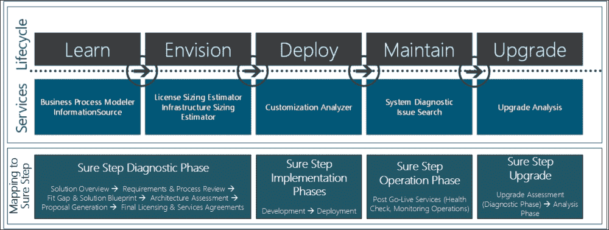

# 第三章：使用 Sure Step 进行解决方案构思

在前几章中，我们回顾了一般方法论概念，包括商业解决方案的全生命周期方法论的概念。简而言之，客户生命周期方法论始于解决方案发现阶段，接着是解决方案交付阶段，然后是运营阶段以及解决方案的任何未来升级。Microsoft Dynamics Sure Step 方法论是客户生命周期方法的一个优秀例子，并包括所有这些领域的指导。

在第二章《解决方案销售和推动尽职调查》中，我们深入探讨了解决方案发现阶段。我们讨论了在这一阶段解决方案提供商采用解决方案销售以及他们从这种系统方法中获得的好处。对于客户，我们看到了这一阶段如何帮助他们进行尽职调查，以及为什么这一阶段不仅对于选择符合其组织需求和愿景的解决方案至关重要，而且也为预期解决方案的高质量交付奠定了基础。

本章基于这些概念，深入探讨 Sure Step 方法论中被称为诊断阶段的解决方案发现阶段的具体内容。本章将涵盖以下主题：

+   Sure Step 诊断阶段的概述

+   诊断阶段的解决方案销售指导如何引导销售员形成可重复的过程，包括对 Sure Step 决策加速器提供的详细分析

+   将解决方案销售流程应用于现有客户

+   诊断阶段如何支持客户的尽职调查过程

+   CRM 在线解决方案的加速概念验证

+   对行业和跨行业解决方案的 Sure Step 诊断阶段指导

# Sure Step 诊断阶段

Sure Step 诊断阶段是 Sure Step 方法的第一个阶段，构成了该方法的预实施阶段。诊断阶段的设计旨在实现以下双重目标：

+   为销售员提供一个一致且可重复的过程，以加速并关闭他们的销售周期

+   为客户提供全面的过程，帮助他们验证和选择满足其需求的正确解决方案

除了之前讨论的之外，彻底执行诊断阶段中规定的步骤还提供了额外的益处。遵循这一阶段的重点步骤和指导确保双方对业务需求和解决方案愿景有一个共同的理解，以满足需求，从而为预期解决方案的高质量交付奠定基础。

Sure Step 诊断阶段流程包括活动、决策加速器产品和服务。在 Sure Step 中，**活动**是流程中的特定行动或步骤。活动可能产生可交付成果作为步骤的输出，或者它可能是导致后续结果的过程中的规定步骤。相比之下，**决策加速器**（**DA**）产品本身就是一个**小型**项目，每个 DA 产品可能包括多个服务，每个服务都需要多个行动来实现产品声明的目标。Sure Step 有以下三个决策加速器产品：

+   对新 Dynamics 客户进行诊断，包括需求和服务流程审查

+   通过利用 CRM 在线服务的加速概念验证对新 Dynamics CRM 客户进行诊断

+   从升级评估开始对现有 Dynamics 客户进行诊断

我们将在以下章节中详细介绍这些 DA 产品。

记住 Sure Step 的目的是帮助卖方和客户选择正确的解决方案非常重要，因此，遵循这一理念，Sure Step 并不旨在成为卖方的潜在客户生成工具。Sure Step 从微软解决方案销售流程的潜在客户阶段开始，这意味着它不会涉及营销、活动和其他旨在提高解决方案知名度或为潜在客户细分市场进行画像的活动。Sure Step 在机会管理阶段发挥作用，因此它是在确定潜在客户之后开始的，并为协助和验证客户的解决方案选择提供指导，同时为卖方提供执行该解决方案销售的重复性流程。

## 决策加速器（DA）产品的概念

决策加速器产品是一组旨在吸引客户并在短时间内向他们提供所需信息的具体行动，以便客户可以继续进行其决策过程的下一阶段。对于卖方来说，决策加速器产品旨在帮助他们加速或缩短销售周期，以实现成功的交易。对于客户来说，这些产品是快速互动的，旨在帮助他们寻找他们需要的信息，以便进入决策过程的下一阶段。

一个 DA 产品本身可能包括多个服务，每个服务都包括多个构成其自身流程或一系列步骤的行动。DA 产品可能从启动或小型互动的启动开始，通过规定的行动逐步推进，以产生声明中的可交付成果或可交付成果，以实现预期的结果。DA 产品通常以向客户展示结果和关闭小型项目结束。

每个 DA 都有特定的目的，并包含多个服务，旨在为客户提供和解决方案提供商提供灵活性。根据客户的需求，解决方案提供商的销售团队能够选择合适的诊断 DA 服务组合。

# 新 Dynamics 客户的诊断

通过与**微软解决方案销售流程**（MSSP）的协同，诊断阶段天生支持解决方案提供商的销售周期，提供指导性和活动，引导销售员通过一个规定的销售周期。您可能还记得，在第二章中介绍的 MSSP，即**解决方案销售与推动尽职调查**，是为了使微软的内部和合作伙伴销售机制得以实现。正如我们讨论的，MSSP 基于解决方案销售概念，这是一种帮助解决方案提供商及其买家之间建立信任关系的哲学，同时促进双方之间建立合作关系，共同制定一个对双方都有益的解决方案愿景。

以下图表展示了 Sure Step 诊断阶段流程以及与 MSSP（托管服务提供商）的协同。图表中具体展示了如何支持潜在客户或新客户的销售周期。Sure Step 诊断阶段同样为现有客户提供了类似的流程，我们将在后续章节中进行讨论。潜在客户的决策加速器包括六个服务，我们将在本节中进行介绍。接下来几节我们将讨论 CRM Online 潜在客户和现有客户的 DA（决策加速器）流程。

正如 MSSP 一样，Sure Step 诊断阶段被分解为销售周期的七个阶段。对于销售员来说，这些阶段对应着销售完成的概率。活动和决策加速器产品随后与这些阶段对齐，以便加速销售周期，使其尽快完成。此过程最后的阶段是引入解决方案交付，即实施阶段和相应的 Sure Step 活动。

+   **潜在客户 0%**至**合格 10%**：

    +   **解决方案概述**活动

+   **开发 20%**：

    +   **需求与流程审查**决策加速器服务

+   **解决方案 40%**：

    +   **适配差距与解决方案蓝图**决策加速器服务

    +   **架构评估**决策加速器服务

    +   **范围评估**决策加速器服务

+   **证明 60%**：

    +   **概念验证**决策加速器服务

    +   **业务案例**决策加速器服务

    +   **提案生成**活动

+   **关闭 80%**：

    +   **最终许可与服务协议**活动

+   **部署 100%**：

    +   **项目动员**活动

## 开始发现过程

Sure Step 诊断阶段始于解决方案概述活动，以用于发现或诊断准备。在本节中，Sure Step 提供了关于 Microsoft Dynamics ERP 和 CRM 解决方案的功能信息，以及针对选定行业及其相应子行业的解决方案指南。

在**潜在客户 0%**阶段进行的解决方案概述活动旨在为销售团队提供客户信息。内容可以用作销售员与潜在客户面对面会议的准备，作为与客户电话交谈的脚本的一部分，或作为可能为未来会议奠定基础的客户简介或介绍信。Sure Step 还包括指向相关网站的链接，这些网站将提供最新的解决方案材料，包括 Microsoft Dynamics 网站。

### Microsoft Dynamics 生命周期服务工具与 Sure Step 的对齐

Microsoft Dynamics 研发生命周期服务工具正在开发和发布一种新的工具类型，以帮助客户和解决方案提供商。以下图表显示了在解决方案生命周期中提供的工具概述。您还可以找到工具与 Sure Step 阶段/项目类型的映射，以了解生命周期服务工具将在未来的 Sure Step 版本中如何被利用。随着这些工具的开发，Sure Step 将继续提供关键链接到这些工具，以及在特定活动/产品中可以调用的说明。在后续章节中，我们将讨论这些工具在 Sure Step 诊断阶段的应用。

如前图所示，解决方案销售团队可以在解决方案概述活动中利用 Microsoft Dynamics **信息源工具**。信息源是销售团队响应客户关于**信息请求（RFI）**或**提案请求（RFP）**的宝贵工具。该工具提供了从数百份 RFP 中精选的问题和答案，旨在提高销售团队的效率和响应率。

行业定位指南和解决方案是该活动涵盖的另一个重要领域。在 Sure Step 2010 版本中，该方法被扩展到涵盖 Microsoft Dynamics 针对部分行业和跨行业解决方案。行业和跨行业解决方案的议题将在后续章节中更详细地介绍。

当销售团队向**合格 10%**阶段迈进时，他们需要评估客户组织是否已经定义了选择流程并指派资源来评估解决方案和替代方案，以及确定客户是否已经为近期获取解决方案分配了高级预算。他们还希望确保客户的评估是公平的，这意味着它没有偏向于特定的竞争对手，他们只是按照公司标准或规则走形式。当资格得到确认后，销售团队可以开始利用决策加速器服务来帮助客户展望他们的未来解决方案。

在接下来的部分中，我们将从销售组织的角度讨论决策加速器服务的使用。在随后的部分中，我们将提供客户对其使用的观点。

## 展望未来状态的第一步

Sure Step 中的第一个决策加速器服务是需求与流程审查。这项服务旨在帮助客户确定其未来状态的业务需求，以及可视化与其相关组织功能的待执行流程。

该决策加速器方案的第一部分允许销售员使用针对客户正在探索的 ERP 或 CRM 解决方案的详细、角色定制问卷模板来确定客户的需求。这些模板中问题的角色定制特性使得销售员能够针对组织中特定群体的功能需求进行回应，例如会计经理、市场营销人员、库存经理、产品规划师或生产经理。这是解决方案销售的关键推动因素，因为销售员能够以与客户产生共鸣的方式与他们互动。而不是直接向客户介绍产品特性和功能，并可能因此使他们感到厌烦，销售员有能力与客户进行有意义的讨论，讨论他们的日常职能和岗位职责，从而挖掘客户的痛点和其他有价值的信息，例如当前系统的限制和影响其性能的因素。

一个优秀的解决方案销售员和/或服务与销售执行人员应该能够利用这些问题与客户建立关系。根据潜在合作的规模和范围，销售团队还可能涉及解决方案架构师、高级顾问或项目经理参与这些讨论，为客户带来现实生活中的信誉和经验。通过有系统地处理这些问题，销售员记录下这些客户会议的发现。这些发现成为解决方案业务需求的基础。

以下是从 Sure Step 中截取的**角色定制问卷**内容的屏幕截图，适用于 Microsoft Dynamics AX。AX 问卷包含问题，旨在与组织的行政人员，如总裁或 CEO，以及个人角色，如会计经理、应付账款协调员和物料经理等进行对话。

虽然问卷有助于本服务的要求部分，但此 DA 服务还提供对特定业务流程图的访问，以实现本服务的流程目标。业务流程图构成了使用解决方案功能时的标准流程，并且可以作为设想客户组织未来状态工作流程的起点。值得注意的是，业务流程图练习在实施阶段也会被调用，始于分析阶段。

Sure Step 为每个 Microsoft Dynamics ERP 和 CRM 解决方案都包含几个流程图。这一直是 Sure Step 用户群中最广泛使用的模板集之一。在即将发布的版本中，用户可以期待这个区域将进行翻新，从 AX 流程图开始。即将推出的新生命周期服务工具之一是**业务流程建模器**（**BPM**）。BPM 工具是流程图的一个优秀进化——它与行业最佳实践保持一致，包括**美国生产力与质量中心**（**APQC**），为用户提供一个共同的框架和分类法，以便将他们自己的组织功能流程与之相关联。正如 APQC 所描述的，他们的“**流程分类框架**（**PCF**）”是一个业务流程分类法，允许组织客观地跟踪和比较其内部和外部与任何行业的组织绩效。它还构成了与业务流程相关的各种项目的基石。APQC 还解释了 PCF 的开发原因及其组织效益。“最初设想为辅助绩效改进项目的工具，该框架已经发展成为今天广泛分类法。组织可以使用 PCF 的通用术语来命名、组织和映射他们的流程。”

当前的 BPM 工具包含几个跨职能流程，未来还将有更多加入。当 BPM 工具扩展到包括所有 AX 功能区域时，它将包含 Sure Step 中的现有 AX 流程图。在那个阶段，Sure Step 流程图将被移除，并替换为指向 BPM 工具的指针。以下是 BPM 工具的屏幕截图：

使用 BPM 工具，解决方案提供商可以与客户合作，了解他们即将实施的解决方案需求和流程。此外，他们还可以确定需求与标准 Dynamics AX 解决方案之间的 Fit Gap。预计 BPM 工具也将与另一个研发工具 **RapidStart** 在不久的将来保持一致。有了这种同步，客户和解决方案交付团队将获得使用在 Fit Gap 练习中被认为是标准解决方案匹配的需求来生成实施起始设置的额外好处。

BPM 工具提供的另一个好处是将行业 **关键绩效指标** (**KPIs**) 与相应的行业业务流程联系起来。我们将在关于从解决方案中估算投资回报率的章节中讨论 KPIs 的使用和重要性。

从服务提供商的角度来看，他们在这次需求分析中正在帮助客户。虽然 Sure Step 为此提供的服务中包括的模板——包括问卷和流程图——是按照相应的 Microsoft Dynamics 产品独特设计的，但客户组织将此输出用作其他解决方案评估的基础并不困难。在这种情况下，客户也有可能决定选择替代 Microsoft Dynamics 的解决方案。考虑到这一点，服务提供商期望获得公平的补偿是可以理解的——服务提供商正在提供他们组织中的经验丰富的资源，以帮助客户展望其组织的未来状态，并记录满足这一愿景的解决方案需求。在严格意义上，提供的服务类似于商业咨询，即使存在对特定解决方案的偏见。

因此，服务提供商可以合法地将他们的服务定位为客户补偿。当然，服务提供商也可以选择将这项合作视为一项商业投资，并提供全部或部分服务作为无偿服务；然而，在他们将其视为公平竞争并且他们认为他们与竞争对手一样有机会赢得客户业务的情况下，这样做才是他们最好的利益所在。

还应指出，需求与流程审查并不总是必须执行的，有些情况下，例如当客户已经独立进行了全面的需求分析并将它们记录在 RFP 中时，就不需要执行。然而，如果客户已经制定了 RFP，那么可能还有其他竞争对手或供应商帮助客户制定需求，在这种情况下，您可能至少需要在某种程度上执行需求与流程审查 DA。这一讨论在“决策加速器的其他使用场景”部分进行了详细阐述。

## 确定合适的解决方案

在确定并记录了新解决方案的需求之后，流程的下一步是确定所提出的解决方案如何满足这些需求以及它如何与客户组织的愿景相一致。Sure Step Fit Gap 和解决方案蓝图决策加速器服务已被“设计”来满足这一目的。这也很好地符合 MSSP 的一个主要原则：在使自己与众不同之前，先使自己平等。

Fit Gap 分析是客户和销售团队在解决方案评估阶段应进行的重要练习。分析的前提是逐一审查为新解决方案定义的每个需求，并确定它们是否可以通过所提出的解决方案得到满足。为此，第一步包括销售团队将之前练习中收集到的业务需求转化为解决方案需求。正如前文所述，销售团队也可能在生成 RFP 或**报价请求**（**RFQ**）之后介入，在这种情况下，能够将一般业务需求转化为具体解决方案需求变得更加重要。

功能性解决方案架构师和/或经验丰富的功能性顾问通常参与将更大的业务需求分解为更小的解决方案需求。一个例子可能是当客户表明，对他们的**销售和运营计划**（**S&OP**）流程进行彻底改革是他们的一项业务需求。S&OP 涉及许多领域，包括销售计划和预测以及供应和库存计划等。虽然这是一个极端的例子，但它只是表明，业务需求可能是一个更大的目标，但解决方案需求需要更加细分，以确保解决方案交付团队能够真正地将需求程度映射到解决方案上。

如果一个需求可以通过现成的解决方案功能或通过配置标准解决方案来实现，则该需求被认为与所提出的解决方案相“匹配”。也有可能客户组织的当前流程或工作流程的微小变化会导致与解决方案的匹配。然而，如果基础解决方案需要定制，换句话说，需要编写一些代码来实现需求，那么该需求被认为与所提出的解决方案存在“差距”。

理解构成解决方案的内容也同样重要。通常，拟合度分析是在基础微软 Dynamics 解决方案的基础上进行的。然而，如果预期微软 Dynamics 解决方案的附加**独立软件供应商**（**ISV**）解决方案将成为整体解决方案的一部分，那么“解决方案”一词应包括基础微软 Dynamics 解决方案以及相应的 ISV 解决方案。因此，如果一个需求可以通过组合解决方案满足，而不需要任何额外的定制代码组件，那么该需求将被视为符合。

符合整体解决方案的需求数量占总需求数量的百分比，表示为建议解决方案的**拟合度**。

### 注意

建议解决方案的拟合度（以百分比表示）= 符合建议解决方案的需求数量 / 新解决方案的总需求数量。

其中，符合建议解决方案的需求数量 = 由解决方案的标准功能满足的需求 + 由解决方案的配置满足的需求 + 由客户组织中的工作流程/流程变更满足的需求。

关于通过简单改变客户的业务流程或工作流程以满足特定要求的重要性不容忽视。在实践中，这种选择往往没有被考虑；相反，你可以看到服务提供商提出昂贵的定制设计或附加解决方案作为替代方案。但第一步始终应该是检查客户组织的当前工作流程。我们需要找到答案，例如：“他们目前是否因为现有系统的限制或可能是因为过去某个时候设置的创造性解决方案（现在不再必要）而正在执行这些步骤？”以及“是否存在其他任何微小的原因，简单的流程变动可能导致公司使用解决方案的标准功能来实现他们的目标？”如果这些问题的答案是肯定的，那么双方考虑将工作流程变更作为替代方案是更可取的，这不仅从降低解决方案交付成本的角度来看，而且从长期角度来看——客户能够使用解决方案的标准功能越多，他们升级到未来版本就越容易。从长远来看，这会导致**总拥有成本**（**TCO**）的降低，从而为客户提出的解决方案带来更高的价值。如果卖家真正在实践解决方案销售理念，他们也会努力降低客户的 TCO，而不是通过定制化来扩大解决方案的范围。此外，服务提供商应始终努力设计最简单的解决方案来满足客户的需求，从而降低所提解决方案的整体风险状况。这也应该是卖家在可能的情况下避免复杂定制的一个考虑点。

回到适配性分析，该练习的输出是确定所提解决方案对客户需求的适配度。然而，解决方案应该具有多少适配度值才能被接受是一个具体问题。一些组织可能需要至少 75%的适配度来实现较低的 TCO 目标。其他组织可能由于业务的具体性质，无法使用现成功能来满足需求，可能会评估是否应该开发自己的应用程序，或者从现有的代码库开始，并扩展以满足其需求，它们可能对适配度值的要求较低。

下面的屏幕截图显示了 Sure Step 对 Microsoft Dynamics CRM 项目进行适配性分析的一个示例输出。这只是包含五个需求映射到类别的简单截图，但它展示了客户对 CRM 解决方案的适配度图示。

如前文所述，新的生命周期服务将有助于在未来增强这一领域。对于适配性差距练习，解决方案提供商在未来可以利用 BPM 工具与客户合作，了解他们的待实施解决方案需求和流程，然后确定需求与标准 Dynamics AX 解决方案之间的适配性差距。

在完成适配性差距分析后，适配性差距和解决方案蓝图决策加速服务的第二部分是开发解决方案蓝图。解决方案蓝图是一份文档，用于传达服务提供商对其提出的解决方案的概念设计，以满足客户的需求。该文档应包括销售方对客户业务需求的理解，以及整体解决方案，包括任何附加解决方案、所需定制以及被认为满足客户未来状态愿景所必需的集成组件。

## 确定基础设施影响

购买打包应用作为其业务解决方案的客户，对三个成本视角感兴趣——软件成本（以及任何相关的维护成本）、解决方案交付的服务或实施成本，以及硬件或基础设施成本。

Sure Step 架构评估决策加速服务主要处理业务解决方案获取成本的第三部分。值得注意的是，无论解决方案是在本地部署，即物理位于客户的某个地点，还是由第三方提供商托管，或者是否为在线解决方案，都会产生基础设施成本。对于本地、托管或在线解决方案，需求显然会有所不同；例如，前者可能需要更多的硬件或服务器组件，而后两者可能需要更高的带宽和延迟。

该服务将在 Sure Step 的未来版本中通过参考新的生命周期服务工具得到增强，特别是**基础设施规模估算器**工具。

在理解客户需求和提出的解决方案蓝图以满足客户需求的基础上，销售团队能够在本练习中开发解决方案的概念架构。这项通常由技术解决方案架构师或技术应用顾问执行的练习，包括制定高级硬件和基础设施计划。除了上一活动中的业务需求和解决方案蓝图外，本活动考虑的其他输入还包括预期的交易量、关键用户场景以及任何其他基准测试活动。

本练习产生的基础设施和硬件推荐由客户用于获取支持其业务解决方案的基础设施估算。

架构评估 DA 服务还提供更深入的服务，以帮助客户在其他领域，如性能预测和基准测试、高可用性和灾难恢复规划。客户可能在业务的一个特定领域有担忧，该领域产生高使用率或解决方案的流量模式。或者由于解决方案的关键任务性质，他们可能需要基础设施计划包括故障转移机制，以最小化或消除停机时间。客户还可能希望计划包括灾难恢复，以确保他们的数据得到适当的保护，并在发生故障时可以恢复。对于这种情况，可以进行像概念验证基准测试这样的技术深入研究服务，这些服务由非常资深和经验丰富的技术资源执行，可以为客户提供所需的答案，并消除对系统操作的任何担忧。这些服务通常是昂贵且耗时的，可能需要特定的实验室设置等。这些服务通常也由客户支付。

## 估算交付成本、方法、计划和角色

Sure Step 范围评估决策加速器服务处理上一节中提到的业务解决方案获取成本的第二个组成部分——解决方案交付的服务或实施成本。但这项服务提供的不仅仅是成本；它还提供了确定整体解决方案交付方法的决策点，从而制定了高级时间表和交付团队结构。

执行范围评估 DA 服务的第一步是确定整体解决方案的部署方法。在这个练习中，解决方案交付团队和客户一起确定解决方案是否可以以更小、更易于管理的版本发布，或者是否希望在解决方案上线时立即实现所有功能。将解决方案分多个版本发布被称为解决方案交付的**分阶段方法**；在这里，每个版本中只启用选定的解决方案功能，每个版本都是在前一个版本的基础上构建的。分阶段方法的替代方案是在单个版本中交付完整解决方案，这通常被称为解决方案交付的**大爆炸方法**。读者需要注意的一个关键点是：不要将分阶段方法与瀑布式解决方案交付方法的阶段混淆。瀑布式阶段将整体项目或发布分解成更小的部分，而分阶段方法是将整体合作分解成多个项目或发布的技巧。

项目范围越大，或解决方案在客户组织中的影响范围越广，分阶段方法相对于大爆炸方法就越受欢迎。以下是一些支持性原因：

+   分阶段方法使客户组织能够更早地开始使用解决方案，从而促进系统更平滑的采用。由于每个发布的范围有限，交付团队可以更快地将该部分解决方案推送到生产，从而使用户能够比大爆炸方法更早地开始使用系统。

+   由于范围有限，解决方案测试也可能更容易管理，这意味着对解决方案的测试可能更加集中，并且受影响的流程更少。

+   客户还可以通过选择对他们重要但可能更容易或更快用新解决方案解决的问题，更早地开始从解决方案中受益。

+   对于复杂解决方案，客户还可以通过早期采用系统获得对项目的宝贵支持，从而为交付团队带来快速胜利，这在销售/咨询术语中通常被称为“摘取低垂的果实”。

+   从整体风险管理角度来看，分阶段方法通常被视为一种风险较低的策略，原因如上所述。

当然，分阶段的方法并不总是最佳选择。有时，客户组织可能需要在开始使用系统之前启用所有功能。在这种情况下，大爆炸方法可能是唯一的替代方案。大爆炸方法也有其他优点：

+   如果相同的用户群将使用新增功能，他们不需要在每次发布时都重新培训。

+   解决方案测试将涵盖所有可能的场景，因此客户组织可以最终确定整体解决方案是否满足他们的需求。这也有可能降低整体测试成本。在分阶段方法中，您首先测试第一版的情况，然后在测试第二版时可能需要与其它情况一起重新测试这些场景。

+   在某些情况下，如果正在使用的系统的一部分可能需要将外部源临时连接到新系统，则不需要创建**废弃**的界面或集成代码。

### 多站点部署的分阶段方法和分阶段选项

分阶段交付方法还有一个方面——其在向多个站点交付解决方案中的重要性及其使用。具有多个分支机构或站点的大型组织可以以两种方式来描述：

+   在多个国家/地区设有分支机构的组织，每个分支机构都拥有高比例相似的业务模式和流程

+   在多个国家/地区设有站点且每个站点具有独立功能的组织，例如企业、销售、研发和制造

当具有类似流程的组织考虑其业务解决方案的部署时，他们会在其各个站点寻找一个核心解决方案。这种方法在 Sure Step 的企业项目类型中有所描述，它使用核心构建来开发所有站点的通用解决方案，并添加一个站点构建来满足特定站点的需求。这两种构建类型随后合并以部署到相应的站点。另一方面，对于具有独特需求的站点的解决方案部署，每个站点都需要自己的交付方法。以下截图显示了这两种选项：

无论整体解决方案是使用分阶段还是大爆炸方法来部署，客户和解决方案交付团队还需要为单个发布选择交付方法。

解决方案交付有两种不同的方法——瀑布和敏捷，具体描述如下：

+   **瀑布：** 这是一个顺序过程，描述了从一阶段到另一阶段的线性活动流程，最终以解决方案被提升到生产状态并投入运营结束。

+   **敏捷：** 这是一个迭代式解决方案开发方法，它促进了拥有和指定解决方案需求的资源与负责解决方案开发和部署的资源之间的协作过程。

就像整体分阶段或大爆炸方法一样，在解决方案交付的两种方法中，没有对错之分；这仅仅是一个组织偏好的问题。一些组织偏好瀑布方法的架构，因为它清晰地分解了每个阶段的活动，从而导致了解决方案的部署。而另一些组织则倾向于在开发活动中让解决方案的需求演变，这是敏捷方法的一个特点。Microsoft Dynamics Sure Step 方法论通过提供标准、企业、快速和敏捷的工作流程（以及为现有客户部署的升级工作流程）来支持这两种方法。我们将在专注于解决方案交付的后续章节中更详细地介绍这一方面。

在执行范围评估决策加速服务时，销售和解决方案交付团队的下一步是与客户合作，使用解决方案蓝图作为输入来了解他们的解决方案优先级。为此，交付团队需要识别固有的限制以及项目中的任何施加的限制。固有的限制通常由系统施加；例如，一个系统需要一定的逻辑配置顺序，例如从账户表开始，然后移动到 ERP 系统的一般账簿。另一方面，施加的限制通常是外部限制；例如，客户可能拥有需要续订的特定许可软件，而客户不希望续订，并且更希望在新解决方案的相应模块在第三方软件的许可证到期之前启用。了解这些限制使解决方案交付团队能够制定出满足客户对新解决方案目标的时间表。

执行范围评估决策加速服务的下一步是确定解决方案部署活动所需的努力。这包括解决方案的设置、配置和开发、环境设置以及用户培训需求等方面。许多服务提供商开发成本计算电子表格和数据库来支持他们在这些任务中，通常根据他们在类似过去项目中的经验来填写这些电子表格。其他组织使用包括启用特定功能的基础值的估算工具。这些基础值可能来自过去的历史，但通常构成多个顾问在多个项目中的经验平均值。因此，这些估算工具为估算解决方案交付努力提供了一个一致、可重复的框架。当然，估算工具也可能提供一种方法来覆盖给定的估计，例如，在风险较高的合作中添加可能需要的提升。

带着关于整体解决方案实施方法、单个发布交付方法、固有和施加的限制以及解决方案部署活动所需努力的信息，销售和交付团队可以在下一步确定解决方案的实施时间表。

## 降低风险感知

虽然 Sure Step 需求与流程审查、适配差距和解决方案蓝图、架构评估以及范围评估决策加速服务旨在帮助客户构想其未来的解决方案以及交付该解决方案的成本，但概念验证 DA 服务提供的是缓解客户在解决方案特定领域的任何潜在担忧，同时继续以解决方案构想的主题进行。

概念验证决策加速服务需要利用解决方案交付资源来设置、配置和定制解决方案以满足客户特定需求的一个子集。由于客户尚未购买软件许可证，交付团队通常会构建自己的演示环境来执行此解决方案设置，例如在虚拟 PC（**VPC**）程序中虚拟化标准 PC 及其硬件。在完成解决方案设置后，交付团队将在会议室环境中设置解决方案演示，客户的业务和技术决策者将能够预览和批评解决方案功能。

当客户在经过需求审查和流程审查、差距分析和解决方案蓝图、架构评估和范围评估 DA 服务之后，对 Microsoft Dynamics 解决方案相当满意，但在某些特定领域仍存在疑虑时，概念验证 DA 是一项适当的服务。这里有两个关键点。第一个是客户相当确信拟议的 Microsoft Dynamics 解决方案将满足他们的需求，第二个是销售团队确定了客户寻求额外证据点的特定领域。这些是需要记住的重要观点，因为概念验证练习应该是一个时间有限、范围有限的参与活动，帮助客户在系统采购前做出最终决定。从服务提供商的角度来看，如果概念验证 DA 服务定位为无偿参与，那么这些点变得至关重要，因为可能本来在账单客户参与中工作的资源被要求为潜在客户的需求工作。

如果客户决定继续推进拟议的解决方案，概念验证 DA 练习的输出也可以成为起点。如果交付团队和客户团队的事先尽职调查包括系统配置和/或编写满足特定要求的自定义代码，这些应该被贯彻到系统的实施中。这是另一个方面，拥有客户生命周期方法，如 Sure Step，允许团队在销售周期中构建前一个阶段的工作。

关于概念验证参与的一个另一点是，在完成这项练习之后，项目范围或解决方案愿景可能会发生变化。客户团队可能会想到额外的应用，或者要求不同的解决方案功能集以满足他们的需求。在这些情况下，销售团队需要回过头来更新解决方案蓝图和相应的交付估计，甚至可能需要重新设计拟议的系统架构。

## 估算投资回报

Sure Step 业务案例决策加速服务旨在为解决方案提供**投资回报率**（**ROI**）分析，帮助客户高管了解解决方案的价值主张并证明他们的投资是合理的。业务案例 DA 服务确定了给定投资的量化商业价值以及他们新系统的总拥有成本（TCO）。

回到第二章的讨论，*解决方案销售和推动尽职调查*，确定解决方案对客户组织的影响，并阐述其价值，对于客户和销售团队来说是一项非常重要的活动。当解决方案具有价值时，推动高管支持变得更加容易，这对于项目至关重要。此外，明确的价值预测将有助于在实施解决方案的过程中克服不可避免的挑战时激励团队。在某些情况下，公司可能不愿意分享某些财务信息，但鉴于他们即将在资金、资源和时间上的投资，他们进行这项练习是合理的，这样他们可以清楚地了解新系统可能带来的组织收益。

在业务案例 DA 练习中，客户和服务提供商团队共同工作，以确定与所提议解决方案相关的直接和间接效益。直接效益对预算或成本有可衡量的影响。新系统产生的直接效益示例包括：

+   库存周转率提高，导致库存成本降低

+   完成任务所需人员减少

+   在特定时期内通过系统处理的订单增加

+   由于错误发货导致的回报减少

相反，间接效益不易量化。可能需要观察和预测估计的影响。尽管如此，这些因素仍然很重要。新系统产生的间接效益示例包括：

+   通过更好的可见性获得的生产力提升

+   降低行政开销成本

+   降低沟通成本

+   客户保留率提高

业务案例 DA 服务分析了之前讨论的效益与获取解决方案相关的总成本之间的关系，使客户能够了解他们新系统的总拥有成本（TCO）。TCO 成本要素包括解决方案获取成本、运营成本以及任何额外的长期成本。

如前所述，解决方案获取包括三个组成部分——软件成本（以及任何相关的维护成本）、解决方案交付的服务或实施成本，以及硬件或基础设施成本。软件成本直接来自许可协议。范围评估 DA 服务产生服务交付的成本估计，而架构评估 DA 服务产生确定硬件或基础设施成本的输入。

运营成本可能包括客户组织员工培训和再培训的成本；参与解决方案测试的客户资源的成本；以及其他成本，如保险、电费和其他物理基础设施需求。另一方面，长期成本可能包括定期解决方案审查的成本以及解决方案升级和扩展的成本。

利益和成本是确定解决方案投资回报率的基础。Sure Step 提供了一个由独立分析公司**Nucleus Research**开发的有效的 ROI 计算工具。该标准化工具提供了一种系统地捕捉利益和成本的方法，从而允许团队预测预期的 ROI、回收期和/或**净现值**（**NPV**）。为 ERP 和 CRM 解决方案的分析提供了单独的 ROI 工具。以下截图显示了 Nucleus Research 为 Microsoft Dynamics AX 提供的 ROI 工具的报告部分：

服务提供商执行业务案例 DA 服务的先前步骤，以开发财务结果并报告。财务结果包括对风险评估领域的见解，如资本回收和潜在差异。然后，根据需要将这些结果提供给客户的高级管理人员。

除了之前提到的财务分析外，业务案例 DA 还有助于组织确定新解决方案的关键绩效指标（KPI）和**满意度条件**（**COS**）。建立 KPI 和 COS 是确保该倡议长期健康的重要练习，因为它们提供了一种跟踪持续进展的手段，最终确定解决方案的成功（或失败）。与建立 KPI 的同时，还需要确定这些 KPI 的基线指标，这将帮助团队了解他们在合作开始时的位置以及他们通过新解决方案所取得的成就。

正如我们在前面的章节中讨论的那样，新的 BPM 工具基于 APQC 的过程分类框架，并且客户和解决方案提供商也可以利用它来确定他们解决方案的适当行业 KPI。正如 APQC 所描述的，“PCF 也被用作 APQC 开放标准基准的基础，组织可以将其绩效与其他组织的绩效进行比较。APQC 根据 PCF 中列举和定义的过程跟踪响应。”

## 制定项目章程和提案

确步提案生成活动是在执行客户参与的相关决策加速器服务之后的下一步。提案生成活动的一个关键输出是项目章程，它是总结从决策加速器服务以及客户的前期诊断准备活动中得出的结论的载体。项目章程包括高级项目范围、解决方案交付方法、工作流程、时间表、活动和依赖关系。它还包括将参与解决方案交付的角色，包括服务提供商和客户团队，以及他们相应的技能要求。

项目章程的开发始于总结高级范围。为此，销售团队将审查需求与流程审查决策加速器服务以及适配差距和解决方案蓝图 DA 服务的输出。基于在这些练习中确定、定义和记录的需求，项目章程将确定范围，包括新解决方案的业务需求和功能需求以及待执行的业务流程。

项目章程还将包括非功能性需求以及任何其他技术需求，例如与外部系统的集成和接口。任何性能需求，如系统响应、延迟、系统停机时间和故障转移要求，也将记录在提案中。为此，团队将总结架构评估 DA 服务的发现。

项目章程还应讨论在范围评估 DA 服务中确定的解决方案交付方法。这包括决定我们是否将进行多次发布或单次发布。它还涉及决定每个发布的合适实施方法——瀑布或敏捷。

项目章程应附有高级项目计划。虽然整体实施方法将在项目章程中涵盖，但解决方案交付的高级时间表、活动和依赖关系将在项目计划中记录。

项目章程中涵盖的另一个方面是对提议的角色和职责以及项目团队技能和要求的评估。这一评估的起点可以是范围评估 DA 活动的输出。然后，项目计划应指定下一级别的细节，包括指明哪些活动和何时相应的角色将参与实施。对于涉及多个发布的较长期活动，项目章程还应定义整体的项目治理模型。治理模型应明确阐述每个发布的项目管理及关键角色。该模型还应定义在项目层面上升起沟通和问题的结构，例如成立一个指导委员会，该委员会将包括来自客户组织各层面的关键业务利益相关者以及交付团队的关键利益相关者。

项目章程还可以包括项目沟通计划和日程安排，包括从个人发布资源团队到指导委员会的项目状态的时间表和信息结构。

对于参与活动所确定的假设、范围界定和风险是项目章程中应突出的关键区域。列出任何进入解决方案定义的假设，以及明显超出参与范围的要求，以避免任何误解或错误理解，这一点非常重要。项目章程还应记录已识别的风险，并尝试为每个风险识别和概述缓解策略。任何客户拥有的且超出直接项目控制范围的依赖项也应明确突出。

建议生成活动通常在微软解决方案销售流程的验证阶段执行。如果概念验证和/或业务案例练习作为参与活动的一部分执行，则建议生成通常是下一步。销售团队在这个活动中试图影响客户的解决方案决策，并努力获得客户的口头批准。在收到其建议的口头批准后，销售团队可以继续进行预算估算的开发和制作工作说明书。

## 销售周期结束

确定步骤最终许可和服务协议活动建立在提案生成活动之上，以正式化客户与销售方之间的协议。销售方可能是多个实体，或者在某些情况下，是一个单一实体。从软件许可和持续软件维护的角度来看，这可能包括微软、微软合作伙伴和独立软件供应商，为微软 Dynamics 核心解决方案提供附加解决方案。同样，它也可能包括服务交付方面的多个当事人，包括微软认证的实施合作伙伴和**微软咨询服务**（**MCS**）。

新的生命周期服务工具可以从许可的角度用于微软 Dynamics AX 解决方案。许可证大小估算工具帮助解决方案提供商和客户确定服务器和用户许可，包括允许多少用户以及允许哪些类型的用户访问系统。

从服务提供商的角度来看，在这个练习中的一个关键步骤是为客户提供服务交付的预算估算。预算估算本质上总结了范围评估决策加速服务的成果，并包括服务提供商和客户之间可能提出的任何费率折扣。如果客户在整个诊断阶段活动中积极参与，预算估算不应让他们感到意外。然而，服务提供商可以预期在费率讨论和时间框架方面会有一定程度的对话；这就是为什么需要向客户提供估算的原因，因为它有助于通过谈判最终确定正式协议的开放沟通。

在双方满意的一轮谈判之后，服务提供商启动工作说明书，作为开始实施解决方案的正式协议。工作说明书基于提案生成活动中启动的项目章程和项目计划文件。这是一项正式的法律协议，需要客户和服务提供商签署，因此它将包括项目章程的许多组成部分，包括项目范围、任何超出范围的要求、假设、风险因素、方法、时间表和资源。

工作说明书还将包括服务交付和支付计划方面的法律条款和条件。

工作说明书本身可以采取不同的方法。最常见的方法是**时间和材料**（**T&M**）格式，其中客户预计将在解决方案实施过程中产生的所有服务和费用在约定的间隔内支付。双方的项目经理负责确保项目保持在范围和预算内，通常有变更订单控制和流程来管理偏差。合作的范围和持续时间越大，双方就越有可能同意 T&M 格式，这将允许降低风险系数，尤其是对于服务提供商。

以下是在 Sure Step 中标准项目类型工作说明书模板的**目录**截图。工作说明书（SOW）已作为模板提供给使用 Sure Step 的组织，以便根据其特定需求进行定制，包括必要的法律参考。

另一种方法，在更紧张的经济时期更为常见，是固定范围的合作。在这种方法中，客户和服务提供商在开始时就严格定义了范围内的需求，服务提供商随后负责以约定的费用交付所有需求。这种方法对于服务提供商来说通常风险更高，尤其是在较大的合作中。合作范围通常在实施过程中经过一些级别的修改。这通常导致服务提供商在其费用结构中构建一个风险系数，以确保在缓解情况下得到一定程度的保障。值得一提的是，Sure Step 包括指导和建议来管理不可避免的范围修改——这包含在项目管理学科的项目管理部分中的提案管理部分。

除了工作说明书之外，提供给客户的另一个组件是软件许可和维护协议。如前所述，这可能仅适用于 Microsoft Dynamics，也可能包括任何相关的 ISV 解决方案。

业务解决方案交付的第三个组成部分是硬件和基础设施需求。这通常由客户的采购部门根据架构评估 DA 服务提出的建议来处理。

## 启动交付周期

在 Sure Step 诊断阶段中的最后一个活动是项目动员活动，这是解决方案实施开始的先导。这对于销售和咨询团队来说是一个关键活动，特别是在大多数情况下，销售周期涉及的资源与将交付解决方案的人员不同。

项目动员活动在客户签署工作说明书（SOW）之后进行。它确保销售资源和交付资源之间对客户需求和预期解决方案有清晰的知识转移。在这个活动中，服务交付经理还锁定将执行解决方案实施的咨询资源。如果资源在实施开始前需要额外的培训，经理负责确保培训计划得到安排并执行，不会影响解决方案交付的开始。

## 决策加速器服务其他方面

在前几节中，我们详细讨论了 Sure Step 决策加速器服务中每个服务的定位和用法。每个服务都是为了解决特定领域而设计的，并且它们相互补充，帮助客户展望他们的未来解决方案以及解决方案的交付方式。正如之前所提到的，DA 服务是各自独立且可选的，因此只需要使用那些满足客户参与需求的服务。尽管如此，有三个关键的 DA 服务应以某种形式执行，以确保解决方案符合愿景和需求。这三个关键 DA 服务是适配性差距和解决方案蓝图、架构评估和范围评估。

第一个 DA 服务，需求与流程审查，如果客户对新解决方案或新解决方案的未来流程没有全面了解，也是非常重要的。客户似乎越来越多地以请求提案（RFP）开始他们的业务解决方案选择过程。如果 RFP 包含了组织需求及未来流程的详尽组成，卖家可以开始进行适配性差距练习，以确定需求是否与他们的解决方案很好地匹配。然而，正如之前所提到的，即使客户已经有一个 RFP，也可能有其他竞争对手或供应商帮助客户制定需求。在这种情况下，你可能需要执行需求与流程审查的 DA 服务，至少在一定程度上。

确定解决方案的匹配程度至关重要，同样重要的是确定解决方案蓝图、未来基础设施、方法、时间表和交付所提议解决方案的成本。这就是为什么匹配差距和解决方案蓝图 DA、架构评估 DA 和范围评估 DA 被认为是关键的 DA 服务。如果在执行这些服务之后，客户确信他们拥有满足其需求的正确解决方案，销售团队可能能够直接进入最终许可和服务协议活动，并跳过概念验证和业务案例 DA 服务。然而，业务案例 DA 确实提供了重要的价值证明以及 KPI 识别。因此，业务案例仍然是一个高度推荐的活动。

对于较小的交易，销售团队经常会提出关于 Sure Step 决策加速器服务是否仍然适用的问题。无论 DA 服务定位为付费服务与否，它们仍然适用，因为它们降低了客户以及确保在提案中已记录和考虑所有需求的供应商的风险因素。重要的是要记住，每个 DA 服务的持续时间由销售和客户团队决定。因此，对于较小的合作，解决方案提供商至少应利用 Sure Step 提供的模板，并在必要时以简化的方式完成步骤。这将确保他们不会做出任何错误的假设，并且他们也能清楚地向客户传达他们对需求的理解和解决方案的愿景。通过这个过程还可以降低低估交易的风险，因为销售团队可能会发现他们在这一过程中没有考虑到的点。因此，至少，销售团队应使用 Sure Step 模板来记录他们的假设和解决方案愿景，并向客户传达。执行此过程的一个选项是将必要的服务结合起来，特别是三个关键服务，并以一系列步骤执行服务，在工作说明书中产生总结性文件。

# 利用 CRM 在线服务进行加速 POC 的诊断

对于考虑 Dynamics CRM 解决方案的客户，无论是在线还是本地部署，Sure Step 推出了一项名为“CRM 在线加速 POC”的服务。这项服务旨在利用可提供给潜在客户的免费试用许可证，使他们能够在决定继续进行解决方案愿景和解决方案获取之前，在自己的环境中“试驾”CRM 在线解决方案。Microsoft Dynamics 是世界上为数不多的同时为本地和在线解决方案提供相同基础代码库的独特解决方案提供商之一。因此，客户可以在 CRM 在线上验证功能，同时仍然可以选择部署本地解决方案。因此，这项 Sure Step 服务被称为“CRM 在线加速 POC”，而不是仅针对 CRM 在线解决方案。

CRM 在线加速 POC 的活动流程如下所示：

该服务的概念设计旨在为客户提供一些标准场景。客户随后将能够上传他们自己的数据集用于这些场景，从而能够快速验证相应的 CRM 功能，并对 Dynamics CRM 产品有一个舒适的感觉。

首先，Microsoft 服务团队开发了五个现成的**销售自动化**（**SFA**）场景，涵盖了以下基本工作流程：

+   领导捕获

+   领导分配/路由

+   机会管理

+   引用/合同开发

+   合同转换

SFA 场景通过 CRM 市场以快速入门包的形式提供给 Dynamics 合作伙伴生态系统。除了为场景设置解决方案外，该包还包括交付指南、演示脚本和样本数据，这些数据可以作为客户针对相应场景进行 Proof of Concept 的构建块。

使用之前讨论的材料，解决方案提供商可以在该服务的第一步执行高级需求分析和差距分析。如果一个或多个场景符合客户需求，解决方案提供商可以进行初步的业务价值评估，以初步了解解决方案的好处，以及进行架构评估，以确定客户的用户如何访问系统。随后，提供商的团队将使用客户数据设置系统，并将其转交给客户指定的用户，他们可以使用剩余的免费试用许可证来测试系统。为客户提供带有自己数据的设置的想法是为了使他们在测试和评估新系统时更加直观。

如果解决方案提供商在客户互动中遇到其他预定义场景，并遵循之前提到的流程，则除了五种已提到的场景之外，还可以利用加速 POC 概念。加速 POC 场景还可以作为 CRM 解决方案客户演示的起点。

还应提及的是，加速 POC 旨在通过让销售团队在 CRM 功能的一个有限子集上获得实际操作经验，从而为销售团队赢得快速胜利。当客户对解决方案的这一方面感到舒适时，解决方案提供商可以利用之前讨论的其他决策加速服务，包括需求和流程审查、适配差距和解决方案蓝图、架构评估和范围评估，以确定客户所需完整解决方案的范围。

# 当前 Dynamics 客户的诊断阶段

在前面的章节中，我们介绍了针对新或潜在 Dynamics 客户的 Sure Step 诊断阶段指南。诊断阶段也支持现有 Dynamics 客户尽职调查和解决方案销售流程，这是本节讨论的主题。

以下图表展示了现有客户决策加速服务中活动和服务的流程。该流程与潜在客户的流程非常相似，唯一的区别在于升级评估 DA 服务取代了需求和流程审查 DA 服务。

与潜在客户的流程类似，现有客户的流程从诊断准备开始。然而，在这种情况下，销售团队使用指南来解释对应 Microsoft Dynamics 解决方案新版本的特性和功能。当客户表示有兴趣将现有解决方案迁移到当前版本时，下一步是升级评估 DA 服务。

## 评估升级需求

在执行升级评估 DA 服务时，服务交付团队有两个主要目标。首先，交付团队评估当前解决方案以确定拟议升级的影响。其次，他们确定将解决方案升级到当前版本的最佳方法。

升级评估 DA 服务从解决方案交付团队与客户会面开始，以了解升级需求。解决方案交付团队通常由解决方案和/或服务销售主管以及解决方案架构师和高级应用顾问组成，以便向客户提供现实世界的视角。

Sure Step 提供了针对特定产品的问卷，这些问卷可以用于升级评估练习，包括针对 Microsoft Dynamics AX、CRM、CRM Online、GP、NAV 和 SL 的升级问卷。在未来版本中，AX 的升级问卷可能会被来自新 Microsoft Dynamics R&D 生命周期服务的升级分析工具所取代。

在下一步中，解决方案架构师和/或应用顾问将审查客户现有解决方案的配置、自定义、集成、物理基础设施和系统架构。然后团队将突出那些可以通过新功能增强来满足的要求，并确定在新产品版本中是否还有可能不再必要的自定义配置。

团队还会审查需要升级到新解决方案的自定义配置，并识别与升级解决方案相关的任何复杂性和风险。最后，团队将明确区分那些由当前功能满足的要求和那些需要实现新功能的要求。对于新功能，交付团队可以利用需求与流程审查 DA 服务中的相应产品问卷。

升级评估 DA 服务的最后一步是就升级的交付方法达成一致。如果没有新的功能被认为作为升级的一部分是必要的，解决方案可以使用技术升级项目类型指南、工作流程和模板。另一方面，如果认为需要新的功能，建议采用分阶段的方法，其中第一个发布是技术升级，将解决方案提升到当前产品版本，然后随后的发布或多个发布使用其他 Sure Step 项目类型（快速、标准、企业或敏捷）来实现新功能。

## 将其他决策加速器产品服务应用于升级项目

如果升级严格是为了将解决方案提升到产品的当前、受支持的版本，解决方案交付团队可以跳过适配差距和解决方案蓝图练习，直接前往架构评估 DA 服务以确定新的硬件和基础设施需求，以及范围评估 DA 服务以估算升级的工作量。团队还可以选择将这些服务合并为一个单一的产品，并仅使用其他产品提供的模板和工具来向客户提供工作说明书和升级估算。

如果升级将引入新的功能，根据新需求的重要性，客户和销售团队可能认为执行或组合适应性差距和解决方案蓝图、架构评估和范围评估决策加速服务是必要的。这确保了双方共同讨论并达成一致，以制定适当的蓝图、系统架构和整体发布方法。

在这两种情况下，概念验证决策加速服务和业务案例决策加速服务可能不是必需的，尽管根据升级中引入的新功能范围，客户和销售团队可能决定使用业务案例工具来确保项目合理性得到建立。

在完成必要的决策加速服务之后，销售团队可以继续进行提案生成活动，以建立项目章程和项目计划。接下来的步骤是完成最终许可和服务协议活动中的销售，包括就产品许可的新条款和解决方案升级的工作说明书达成一致。最后，在项目动员活动中，交付团队被动员起来，以确保升级合作能够顺利启动。

# 支持客户的购买周期

如我们在本章开头所述，Sure Step 诊断阶段旨在帮助解决方案提供商组织中的销售人员和客户组织中的买家。在前一节中，我们讨论了该阶段对销售方的适用性；在本节中，我们将讨论如何通过选择合适的解决方案来满足他们的愿景和需求，从而通过一个彻底的过程来启用客户的尽职调查工作。

在第二章“解决方案销售和推动尽职调查”中，我们讨论了与客户购买周期相对应的阶段。以下图表显示了我们将相同的 Sure Step 诊断阶段活动和决策加速服务应用于解决方案销售过程的方式，也符合客户的购买周期阶段：

+   **第一阶段：需求确定**

    +   **解决方案概述**活动

    +   **需求和流程审查**决策加速服务

+   **第二阶段：备选方案评估**

    +   **适应性差距和解决方案蓝图**决策加速服务

    +   **架构评估**决策加速服务

    +   **范围评估**决策加速服务

+   **第三阶段：风险评估**

    +   **概念验证**决策加速服务

    +   **业务案例**决策加速服务

    +   **提案生成**活动

让我们先从从客户的角度来探讨决策加速器服务和其服务的应用开始。从销售者的角度来看，术语“服务”可以被视为一个可销售的单元。但另一方面，“决策加速器”这个术语不仅超越了销售者，也扩展到了客户，因为这些单元的目的是帮助他们迅速获得问题的答案，并以逻辑和结构化的方式推进他们的决策过程。在这种情况下，“决策加速器服务”这个术语对客户来说同样适用。

下文将讨论活动与决策加速器服务与客户购买周期的对齐。如果读者尚未这样做，建议他们回顾前面的章节，以了解决策加速器服务的结构，因为这部分内容在本节中未重复。

## 定义组织需求

买家通过理解组织的痛点并收集市场上可用的解决方案信息来开始他们的需求确定阶段。诊断准备活动中的指导链接到其他网站和其他信息源，可以帮助解决解决方案信息收集工作。如果客户的组织在 Sure Step 覆盖的行业中运营，他们还可以在行业部分中获得有关解决方案如何满足其特定需求的更多信息。

虽然诊断准备活动中的指导为客户提供了对可用解决方案的外部认识，但 Sure Step 需求与流程审查决策加速器服务有助于客户理解他们自己的内部需求。使用此服务中的角色定制问卷模板，客户团队中的**领域专家**（**SMEs**）可以针对每个角色进行“一天的生活”场景分析，从而从用户的角度量化部门和组织的需求，而不仅仅是从产品角度。

客户还可以使用详细的过程图作为起点，特别是使用新的 BPM 工具开始可视化组织的新解决方案的工作流程。同样，这有助于客户从用户的角度描述他们的需求。最终，解决方案的成功或失败取决于其与用户的适用性或相关性，这一点不能过于强调。

需求和待执行流程的文档是未来解决方案愿景的基础。根据其开发方式，客户组织可以利用这些文件对解决方案备选方案进行彻底评估，并选择满足其需求的最佳解决方案。

## 确定合适的解决方案

在确定需求之后，买家开始评估解决方案的替代方案。这正是 Sure Step 适配差距和解决方案蓝图、架构评估和范围评估决策加速器服务可以帮助客户确定 Microsoft Dynamics 解决方案是否适合他们的地方。

如前文所述，适配差距和解决方案蓝图 DA 练习首先确定解决方案对每个需求的适配度。一些客户可能希望适配度值更高，以最小化定制，而另一些客户可能在需要相当定制化解决方案的专业环境中运营，因此他们可能对较低的适配度值感到满意。然而，在两种情况下，客户都希望确保解决方案的 TCO 是可接受的。

在确定解决方案适配度之后，客户主题专家将与解决方案提供商合作，制定未来解决方案的蓝图。解决方案蓝图通常呈交给客户的执行者或业务赞助者。因此，该文档应使用商业语言编写，并清楚地解释业务需求或痛点将通过拟议的解决方案得到满足或解决。

拥有解决方案蓝图后，买家随后获取其他关键信息以评估解决方案是否符合他们的成本标准。架构评估 DA 服务将向客户提供拟议的硬件和架构，客户的采购部门可以据此确定物理基础设施成本。如果客户对解决方案的性能、可扩展性和可靠性有任何担忧，他们也可以通过要求在相应领域进行更详细的分析，从服务提供商那里请求更多技术验证。

最后，范围评估 DA 服务向客户业务赞助者提供了解决方案交付的努力估计和相关成本。这项练习还向客户提供了对交付解决方案的整体方法的了解，包括时间表、预测资源、角色和责任。

## 理解和缓解风险

在购买周期的最后阶段，客户将希望确保预期的解决方案利益远大于相关的风险。Sure Step 概念验证决策加速器服务可以帮助缓解客户主题专家或部门领导对解决方案某个特定领域的任何具体担忧。解决方案交付团队将设置、配置和定制解决方案，并在可能的情况下使用客户数据来展示解决方案的应用符合客户的要求。在此提供方案中执行的任何解决方案努力都将转移到实施中，并成为解决方案交付的起点。

Sure Step 商业案例决策加速器服务也帮助客户在其购买周期的这一阶段，但更多的是从管理解决方案的执行和组织认可的角度来看。使用独立分析师开发的 ROI 工具，这项服务可以帮助客户团队向组织中的其他关键利益相关者（如首席执行官、首席财务官或董事会）证明解决方案的收购是合理的。这可能是对抗组织政治的关键一步，在解决方案交付周期的起伏不定中也非常重要。

最后，Sure Step 提案生成活动为客户赞助者和客户项目经理提供整体项目章程和项目计划，确保他们有明确的文档记录了买方和卖方之间达成的协议，以避免任何后续的假设或误解。项目章程还将确定与解决方案交付相关的风险，并为每个风险概述缓解策略。解决方案提供商制定的项目章程也可能指出客户拥有的任何依赖项或假设；客户应确保他们有必要的资源，以便这些依赖项不会成为交付团队的障碍。

## 升级现有解决方案的方法

与对新解决方案的评估过程类似，Sure Step 诊断阶段也支持寻求升级其解决方案的现有客户的尽职调查过程。以下图表显示了一个与新的解决方案评估非常相似的流程，唯一的区别是升级评估 DA 服务现在取代了需求和流程审查 DA 服务：

如前文所述，Sure Step 升级评估决策加速器服务捕捉了客户更改或增强其当前解决方案的业务需求，并确定升级到解决方案最新版本的最好方法。如果当前解决方案包含可能因新功能而不再被认为是必要的自定义功能，交付团队将识别这一点。他们还将评估整体升级的复杂性以及升级的发布流程。

升级评估 DA 练习的发现也将决定客户应承担 Fit Gap 和解决方案蓝图、架构评估、范围评估、概念验证和商业案例决策加速器服务的程度。根据所需新功能的重要性，客户赞助者和主题专家可以决定根据需要跳过或合并这些服务。无论如何使用 DA 服务，都应在提案生成活动中为客户制定项目章程和项目计划。

# 针对特定行业的解决方案定位

Sure Step 为解决方案提供商和客户提供行业和跨行业解决方案的指导。Sure Step 提供了涵盖行业和跨行业的微软 Dynamics 解决方案能力的概述，并包括选定行业垂直领域的业务痛点，解决方案提供商可以使用这些痛点来定位潜在客户。

如前述截图所示，Sure Step 目前为以下领域提供指导：

+   **行业/垂直解决方案**

    +   **制造业**

    +   **公共部门**

    +   **零售行业**

    +   **服务行业**

+   **跨行业/水平解决方案**

    +   **扩展 CRM 解决方案**

    +   **客户关怀**

我们将在以下章节中讨论这些解决方案。

## 行业/垂直解决方案

自从微软 Dynamics AX 2009 版本发布以来，微软 Dynamics 一直为客户提供广泛的行业场景或工作负载的核心解决方案功能和能力，并继续在 AX 2012 版本中提供。您可能还记得我们在第一章中介绍了工作负载的概念，*背景和概念*。作为一个快速回顾，工作负载可以是一个单独的业务流程，如费用管理，也可以是一个功能内的多个业务流程，如供应商关系管理、供应链管理、人力资本管理、销售、营销或客户服务。

从系统角度来看，工作负载包括 ERP 和 CRM 系统。相应地，微软的行业解决方案也涵盖了操作和行政 ERP 工作负载以及 CRM 工作负载。以下截图显示了微软 Dynamics 对行业解决方案的愿景和方法：

Sure Step 行业/垂直解决方案部分旨在描述标准微软 Dynamics AX 和 CRM 解决方案在之前讨论的行业中的功能。还为特定行业内的特定垂直领域提供了额外的观点。

### 制造业

根据制造商品的方式，制造业被广泛分为两个领域——流程制造业和离散制造业。流程制造业是一个制造业分支，其中商品的生产是通过公式和配方实现的，从而产生加工品或**库存单位**（**SKU**）。相比之下，离散制造业的生产过程是通过物料清单和路线的指定来实现的，从而产生组件、子组件和/或组装 SKU。

对于流程制造业，Sure Step 包括以下行业的客户需求和 AX 解决方案的匹配：

+   食品和饮料行业

+   化学品

+   生物科学和制药业

+   非耐用品消费品

+   主要金属

+   纸浆和造纸

+   肉类、猪肉和家禽

Sure Step 指南包括针对特定客户需求的具体内容，例如食品和饮料行业的计重和基于配方的计量单位，或生命科学和制药行业的集中质量控制与合规支持，这些内容在相应的页面上。

制造行业垂直领域的额外内容和指南也可在诊断阶段的决策加速服务中找到。在需求与流程审查 DA 服务下，Sure Step 为流程制造行业提供补充问卷，帮助确定客户需求如何与批量制造流程相匹配。对于离散制造，通用的针对微软 Dynamics AX 的角色定制问卷提供了与离散生产流程相关的具体问题，包括针对生产计划和经理的问题。这些问卷还可以帮助确定客户的流程是否在混合模式制造环境中包括离散过程。

Sure Step 还提供了涵盖先前提到的流程制造行业的流程图，以及离散制造流程图，例如微软 Dynamics AX 的生产流程图。

未来发布的 Sure Step 可能会参考来自微软 Dynamics **生命周期服务**（**LCS**）工具的相应制造内容，例如制造流程图和行业配置。

### 公共部门行业

公共部门行业指的是由国家或政府控制和运营的操作和业务。公共部门行业覆盖范围广泛，包括几个子行业和垂直领域。该行业在垂直层面具有非常具体的企业需求，以及在国家层面的监管差异。

在 Sure Step 2010 中，包括了针对公共部门的指南。虽然 Sure Step 中的指南描述了选定公共部门行业垂直领域的组织需求，但迄今为止，仅针对微软 Dynamics CRM 解决方案功能进行了解决方案对齐。未来的版本可能包括与 Dynamics AX 功能的对齐——至少，将提供对微软 Dynamics Lifecycle Services 工具中相应内容的适当引用。目前，Sure Step 公共部门指南分为以下领域：

+   政府

    +   公民服务平台（政府服务中心）

    +   政府工作场所现代化

    +   司法案件和记录管理

+   健康

    +   共享服务

    +   医疗保健和记录管理

+   教育

    +   学生咨询和招生

    +   学生注册和入学

    +   学生管理

    +   教育案例管理

+   非营利组织

Sure Step 内容包括面向特定公共部门解决方案领域的业务需求问卷和流程图，为选定解决方案领域的适配性差距分析工作表，架构评估考虑事项的附录，范围评估提供的范围指南附录，以及概念验证提供的样本演示幻灯片。此内容的一个例子是针对政府组织经济发展需求的“需求和流程审查决策加速服务”问卷。

在接下来的部分中，我们将讨论决策加速服务的用例以及先前引用的内容，以帮助公共部门客户在选择适当的解决方案以满足其需求时进行尽职调查。

#### 用例 - 地方政府委员会的决策加速

本案例研究说明了服务提供商通过执行决策加速服务组合来帮助客户通过其决策过程的例子。客户是一家拥有 300 名员工和 6 人 IT 团队的澳大利亚地方政府委员会，为大约 40,000 名居民提供政府服务。委员会一直使用专有应用程序来管理服务请求，但该流程和解决方案未能很好地解决选民的需求。

为了实现其战略计划中概述的服务标准，委员会确定他们需要更换现有的客户访问请求系统。他们需要一个解决方案来通过减少呼叫等待时间来提高选民满意度。他们需要一个能够帮助他们在第一次接触点回答更多选民请求的解决方案。他们还希望为选民提供更多联系委员会的选择。最后，该解决方案还预期能够通过易于使用的工具提供每个选民的综合视图，从而通过委员会系统用户提供更一致的服务，并帮助他们快速解决问题。

对现成系统进行初步调查以解决其需求，结果导致委员会陷入僵局。在目睹了委员会成员见证的解决方案演示后，委员会决定让微软参与打造一个全面的政府服务中心解决方案。

在初步资格活动之后，销售执行人员组建了一个由微软服务和微软合作伙伴资源组成的预销售交付团队。该团队的任务是了解委员会的需求，以开发和展示预期的解决方案。

预销售交付团队向客户展示了一个计划，该计划包括执行三个决策加速服务，即适配性差距和解决方案蓝图、概念验证和范围评估，如下所示：

委员会接受了该计划，并同意资助这项活动。预销售交付团队在几周的时间内执行每个决策加速器服务，并为每个 DA 服务分配一到两名资源。一个 DA 服务自然地流向下一个 DA 服务，这进一步增强了委员会成员对过程的信心。

交付团队花时间了解委员会的要求，制定了一个愿景解决方案，构建并演示了一个概念验证解决方案，并最终交付了一个评估和计划以结构化解决方案交付。这个过程超出了委员会的预期，导致以下一位成员的评论：

> *通常在地方政府，我们会得到一个产品并被告知围绕它工作流程。这可能意味着改变人们的工作方式，这会花费时间和金钱。所以与微软合作是一种令人耳目一新的体验，因为他们采取了相反的方式。他们询问我们的流程，并据此工作，调整他们的产品以使其适应。他们真正倾听业务，并让我们来决定。结果是，一个非常适合地方政府的解决方案。*

本案例说明了彻底的诊断过程的有效性，该过程为客户和服务提供商都带来了双赢的局面。它还展示了 Sure Step 中决策加速器产品结构的灵活性，允许账户团队选择要采用的服务以及执行它们的特定顺序。记住，离客户最近的人是制定满足客户需求正确流程的最佳人选。因此，他们也应该是决定遵循什么流程以实现他们目标的人。拥有灵活且一致且可重复的流程允许现场团队做到这一点。

### 零售行业

Sure Step 在 2010 年版本中引入了对零售行业的覆盖，以与最初的 Dynamics AX 零售解决方案发布保持一致。该指南的结构沿着以下零售价值链支柱：

+   规划（包括预测和商品销售）

+   销售（包括忠诚度计划、促销活动和营销活动）

+   管理（包括商店补充和仓库管理）

+   采购（包括采购和供应商管理）

+   维护（包括退货和销售点工作流程）

零售价值链随后扩展到特定的子行业，包括以下：

+   **专业零售**

+   **一般商品**

+   **健康与个人护理**

+   **食品和饮料**（杂货连锁店等）

Sure Step 还在决策加速器产品部分提供了内容，包括针对零售价值链支柱的定制零售问卷补充和业务流程图。

与制造和公共部门行业一样，用户应期待 Sure Step 的未来版本将参考来自 Microsoft Dynamics 生命周期服务工具的相应零售内容，例如零售流程图和行业配置。

### 服务行业

与零售覆盖范围一样，Sure Step 为服务行业沿着服务行业价值链支柱提供指导。以下包括以下内容：

+   开发（包括关系管理）

+   销售（涵盖账户和机会管理）

+   交付（包括参与管理）

+   资源（包括人才管理）

+   维护（包括非项目收入）

+   管理

服务行业价值链随后扩展到特定的子行业，包括以下内容：

+   专业服务，包括政府承包商和法律服务

+   建筑和工程，以及建筑行业

+   媒体和娱乐，包括广告

同样，Sure Step 还为决策加速器提供内容，包括为之前讨论的子行业和垂直行业提供的角色定制零售问卷附录。

与其他行业一样，用户可以期待 Sure Step 的未来版本将参考来自 Microsoft Dynamics 生命周期服务工具的相应服务行业内容，包括流程图和行业配置。

## 跨行业/横向解决方案

前一节讨论了 Sure Step 对选定行业和垂直行业的覆盖范围。Sure Step 还提供关于跨行业解决方案的指导，这些解决方案可以被视为一组核心 Microsoft Dynamics 解决方案能力，适用于多个行业的客户组织；这些也可以适应特定行业或垂直行业。

### 跨行业客户关怀解决方案

随着 Microsoft Dynamics CRM 2011 的发布，客户通过利用 Microsoft Dynamics CRM 的**客户关怀加速器**（**CCA**）获得了构建客户关怀解决方案的灵活平台。CCA 可以作为以下不同业务线解决方案的基础：

+   通过聚合来自不同业务应用的信息到集成桌面，提供组织对其客户信息和互动的 360 度视图。客户服务代表通过立即访问业务关键信息来快速有效地服务客户，从而提高客户满意度和忠诚度。

+   通过创建桌面自动化工作流来消除重复数据输入，这些工作流简化了业务流程，消除了代理在多个应用程序中重新输入相同数据的需要，从而减少了人为错误并确保一致的客户服务体验。

+   **计算机电话集成**（**CTI**）为组织提供一个一致的框架，以连接 CTI 系统与关键业务线应用。

+   活动报告可以帮助接触中心经理通过访问代理桌面交易报告来识别潜在的过程瓶颈。

Sure Step 包括由微软服务团队开发的多个客户关怀内容模板，包括微软 Dynamics CRM 的 CCA 问卷、架构规划指南、基础设施规模表和 CCA 架构评估问卷。还提供了 CCA 的概念验证交付指南和业务案例客户报告模板。

### xRM 或扩展 CRM 解决方案

扩展 CRM，或 xRM，指的是将微软 Dynamics CRM 作为一个平台，以及任何与之集成的其他外部应用程序，用于管理交易关系。本质上，xRM 中的“x”代表由解决方案启用的相应业务实践。关系管理解决方案扩展的例子包括**医疗保健关系管理**（**HRM**）、**媒体关系管理**（**MRM**）、**学生关系管理**（**SRM**）等。xRM 解决方案可以扩展到多个行业或垂直领域的事实是 Sure Step 内容定位在跨行业部分的原因。

微软 Dynamics CRM 平台组件的灵活性使其能够被许多不同组织以多种方式利用。该产品能够在单个平台上快速创建和部署大量关系型**业务线**（**LOB**）应用程序，共享资源和技术，使用户在业务线应用程序中拥有一致的使用体验，这些技术对他们来说已经熟悉。这些应用程序具有高度的可扩展性，可以快速适应用户和企业的独特需求，同时最大限度地降低总拥有成本。

在 Sure Step 中提到的定位扩展 CRM 解决方案的一些关键好处包括以下内容：

+   熟悉的微软办公软件类型用户界面，它推动了用户熟悉度和解决方案的采用

+   预定义的安全组织管理模式

+   内置用户驱动报告和分析功能

+   声明式数据建模，具有即时网络服务数据操作

+   平台已知性能和可用性指标

+   使用标准微软.NET 技术易于扩展和集成

+   使用多租户和扩展配置提供可扩展的交付

Sure Step 还包括额外的模板，例如微软 Dynamics CRM 2011 应用程序框架功能，以说明支持扩展 CRM 业务解决方案的关键功能和主题。

## 未来行业和跨行业解决方案内容

正如我们在前面的章节中讨论的，并在前面的部分中引用的，Microsoft Dynamics 研发生命周期服务为用户提供了一系列广泛的工具。随着这些工具的不断构建和发布，用户可以期待在这些工具中获取更多针对行业和跨行业解决方案的内容和相关性。因此，未来的 Sure Step 版本将包括链接到工具的特定区域，以及它们在解决方案销售周期中可以如何被利用。

# 快速参考

在本章中，我们介绍了几个关键的诊断活动和决策加速器服务。以下是一个快速参考。

+   **针对新 Microsoft Dynamics 客户的诊断**：从 Microsoft Dynamics 解决方案和行业/跨行业定位指南开始。利用决策加速器服务，从需求与流程审查服务开始。在之后要考虑的三个关键 DA 服务是适配性差距和解决方案蓝图、架构评估和范围评估服务。考虑业务案例服务，并且至少确定参与项目的预期解决方案效益和客户成功因素。

+   **针对新 Microsoft Dynamics CRM 客户的诊断**：如果标准场景适用且可以获取试用许可证，则从 CRM 在线服务的加速验证概念开始。在获得初步客户认可后，利用其他 DA 服务，包括需求与流程审查、适配性差距和解决方案蓝图、架构评估和范围评估服务。

+   **针对现有 Dynamics 客户的诊断**：根据需要利用 Microsoft Dynamics 解决方案和行业/跨行业定位指南。从升级评估 DA 服务开始，以确定将现有解决方案升级到当前产品版本的正确方法。如果在升级过程中要引入新功能，则利用其他 DA 服务，包括适配性差距和解决方案蓝图、架构评估和范围评估服务。

# 摘要

在本章中，我们专注于 Sure Step 的诊断阶段。我们讨论了这一阶段是如何被设计成双重目的的——既帮助销售者定位解决方案并完成销售，又帮助客户进行尽职调查过程并选择满足他们需求的正确解决方案。我们涵盖了为新 Dynamics 客户在诊断阶段使用决策加速器服务的情况，为利用 CRM 在线服务进行加速 POC 的 Dynamics CRM 客户进行诊断阶段的情况，以及为现有 Dynamics 客户进行的诊断阶段。我们还讨论了制造业、公共部门、零售和服务行业的行业/垂直解决方案，以及客户关怀和扩展 CRM 的跨行业/横向解决方案。

诊断阶段非常重要。如果尽职调查活动执行不当，实施过程可能会受到影响，客户的满意度也会较低。如果做得正确，它可能导致有效、成本效益高、按时和高品质的解决方案交付。它还为顺利的解决方案交付过程奠定了基础。

在本章中，我们介绍了几个关键的诊断活动以及决策加速服务——请参阅快速参考部分以获取简要描述。

在接下来的章节中，我们将探讨解决方案交付方法。我们将从项目管理讨论开始，然后详细介绍 Sure Step 提供的实施工作流程、模板和工具。
