# 第八章。项目和组织变革管理

在最后四章中，我们涵盖了尽职调查和解决方案销售、解决方案交付、解决方案优化和解决方案升级。支撑这些领域的都是项目和变革管理学科，它们为成功的合作和满意的客户提供基础。这些学科将是本章的重点，另一个重要方面——Sure Step 如何使项目团队能够在非集中式协同工作时有效协作，也将被探讨。

在本章中，我们将涵盖以下内容：

+   Sure Step 库中的项目管理学科，为项目经理提供基础和指导

+   Sure Step 中强调解决员工观点和担忧的组织变革管理学科，这些观点和担忧可能源于用新系统替换现有系统

+   Sure Step 中的“项目”功能，它简化了在本地驱动器、共享驱动器或 SharePoint 服务器上自动设置项目的操作

# Sure Step 项目管理库

Sure Step 包括一个被称为**项目管理库**的内容部分。从项目管理基础的角度来看，这一部分应被视为项目经理的指南手册。它提供了对项目管理学科、项目管理流程和组织变革管理的内部视角。它提供了知识和最佳实践，旨在作为寻求持续提高项目管理技能的项目经理的持续灵感来源。您可以将其与**项目管理协会（PMI）的**《*项目管理知识体系指南（PMBOK 指南）*》进行比较，该指南为许多项目经理提供了项目管理的基石。

我们，作为项目经理，是否需要了解项目管理基础？这个问题可能看起来微不足道，但事实并非如此。项目管理是一个真正的职业；这不仅仅是你作为副业可以做的事情。多年来，专业项目经理的社区显著增长，这表明越来越多的专业人士确实理解了成功项目管理的真正本质和重要性。但尽管这种积极的演变，一些管理者似乎仍在忽视这一点，继续在忽视最佳实践的情况下管理他们的项目。对于那些将项目管理视为真正的职业并寻求提高技能、渴望学习新事物并找到将项目管理知识提升到更高水平灵感的项目经理来说，项目管理库是一个优秀的知识中心。

Sure Step 中的企业项目类型与项目管理库中讨论的不同学科的流程、活动、工具和模板完全一致。Sure Step 中的其他项目类型仅包括学科中描述的一部分；您如何利用项目管理方法与每个学科相结合，取决于您对特定项目质量保证的设想。

## 理解项目管理学科

你是否曾想过项目经理需要做什么？只需在 Sure Step 项目管理库中点击一下，就可以获得项目经理真正需要管理的鸟瞰图。项目管理学科涵盖了以下八个与项目经理职责相关的管理领域：

+   风险管理

+   范围管理

+   时间和成本管理

+   资源管理

+   沟通管理

+   质量管理

+   采购管理

+   整合管理

项目经理需要在始终独特且临时性的背景下管理所有这些领域。项目永远不可能相同，我们总是时间紧迫，尽管如此，我们仍必须管理所有这些学科。这是一项相当艰巨的任务！在一个以运营为导向的公司中，这些管理领域中的每一个都由专门的经理控制，而我们的项目经理需要结合他们的技能和知识，因此所有最佳实践和指导都将非常受欢迎。这正是 Sure Step 在项目管理库中提供项目管理学科所有基础的原因。

### 风险管理

风险管理学科教导我们关于初始和持续风险管理的 fundamentals。在这里，我们可以寻求关于如何处理风险识别、风险分析和如何建立有效的风险应对计划的指导。除了宝贵的指导外，我们还可以找到有助于我们在风险管理练习中变得更加高效的宝贵工具，例如以下内容：

+   **项目风险登记册**：此登记册允许我们列出、描述和分类我们已识别的风险，并根据我们的概率和影响估计生成风险评级。它还允许我们制定应急计划和响应措施。真正有趣的是，这个风险登记册模板还包括一个已填充已知风险的检查表标签，这些风险适用于 Dynamics 实施。

+   **风险识别清单**：这个已填充风险的清单可以作为项目经理风险评估的有效起点。风险识别清单是一个围绕环境、人员、程序和技术风险因素构建的问卷，并作为风险识别的有效工具。

### 范围管理

你熟悉范围蔓延吗？相信你一定熟悉！我们能否在我们的项目中预防范围蔓延？不，我们不能，但我们能更好地管理它。周到的范围管理可以提高我们实现客户满意度和接受实施解决方案的成功概率。范围管理学科提供了关于项目团队如何规划、定义、记录、验证、管理和控制项目范围的建议。这些指导在项目管理流程中得到了强调，如下面的图所示：

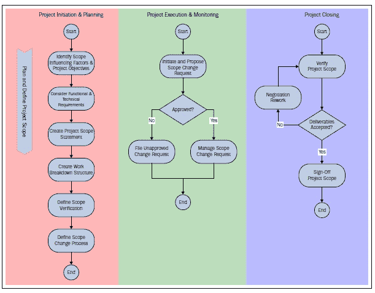

在本节中，我们将找到有关如何为我们的项目范围制作工作分解结构的具体信息，以及我们需要在良好的范围声明中包含哪些要素，等等。

除了提供对范围管理基础知识的有益见解外，Sure Step 还提供了工具和模板，帮助我们提高效率。其中之一是**变更请求**表单，有两种版本可供选择。

第一个变更请求表单将我们的注意力引向权衡矩阵。变更请求似乎主要只关注对客户成本的影响。然而，变更的影响远不止预算；它可能影响范围复杂性、技能和资源的部署以及进度。我们需要调查这些其他影响要素，并监控一系列变更可能对我们产生的影响。

第二个可用的模板比之前的模板提供了更详细的变更描述和权衡分析。因此，当我们面临具有重大影响且需要广泛深入文档的大规模变更时，我们可能会考虑使用这个模板。这个模板不仅教导我们调查变更的所有影响是一个好主意，而且还表明分析不进行变更的影响同样有价值。客户组织需要意识到，在实施过程中，愿景和想法可能会改变，导致变更和额外的需求。然而，增量范围的好处并不总是值得实施。有些请求可能不会对公司的效率或决策者的目标产生重大影响，但会对项目和其风险产生巨大影响。分析不实施这些变更的影响可以降低潜在风险和范围蔓延。

### 时间和成本管理

在这个学科领域，Sure Step 提供了指导和技巧来设置和管理初始和持续的时间及成本管理。任何参与项目的经理都将并且必须关注任务的时程和预算限制。从某种意义上说，即使他们没有对这个学科的基本原则和最佳实践的了解，他们也会管理它。这种活动无处不在，有些人甚至（不公正地）将项目管理缩小到时间和成本管理。所以，是的，这很重要。而且，我们越提高管理时间和成本的能力，我们就越有可能控制我们的时间和成本绩效。

需要学习的第一个教训是，初始的时间及成本管理必须与持续的时间及成本管理保持一致。初始和持续的时间及成本管理都需要一个共同的基础；这就是**工作分解结构**（WBS）的作用所在。WBS 定义了向客户提供所需价值所需的所有可交付成果和活动。它是我们项目估算和后续工作的基础，并允许在项目利益相关者之间建立一种共同的语言。如果我们在开始时对可交付成果的分解与持续项目中的后续分解有显著差异，我们可能会遇到问题，因为我们将难以将时间和成本绩效与我们所计划的绩效对齐。在 Sure Step 内容中进行简单的搜索指令可以揭示 WBS 的重要性。在 WBS 上进行搜索会产生超过 30 个 Sure Step 活动的结果，如下面的截图所示：

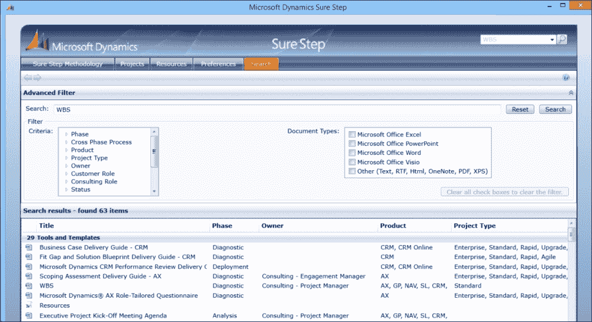

这个学科还将提供关于估算过程的信息。估算通常被认为是一个真正的挑战。在充满不确定性的时刻，我们需要估算成本和时间持续时间。如果我们能够在所有范围和风险都确定的时候进行估算，那将是极好的。但不幸的是，我们没有获得这种特权。因此，我们需要依赖我们的估算效率。一个好的估算对于咨询公司和客户组织都至关重要，使良好的估算过程成为*不可或缺的*。这个 Sure Step 学科向读者介绍了普遍接受的估算技术，例如使用咨询专家、类似项目的估算、参数估算以及自下而上和自上而下的估算。它还关注敏捷环境中估算的挑战，并提供了一些坚实的建议，例如使用三点分析和让客户参与估算过程。

我们还可以在这个学科中找到关于如何制定项目进度计划和如何准备项目跟踪和报告的指导。Sure Step 强调了结构化和良好记录的估算和跟踪技术的的重要性。我们不仅可以从这些技术中受益于单一项目，而且作为历史参考，它们对未来估算也将具有很高的价值。我们还可以从提供的**挣值概念**内容中获得灵感，这是一种将项目范围、成本和进度整合在一起的方法，通过项目跟踪产生早期预警信号。这种方法确定了根据我们已花费的金额我们所交付的内容，并计算在保持相同绩效的情况下，我们还需要多少时间和成本。

### 资源管理

资源管理学科探讨如何在项目背景下组织和管理人力资源、设备和物资资源。对于人力资源规划来说，区分角色和资源非常重要。项目角色是指完成项目工作所需的功能性职位类别或名称，例如，技术顾问、开发顾问或业务分析师。资源是指具体的小组或个人，他们完成项目工作。一个资源可能执行多个角色。角色和责任通常使用**资源分配矩阵**（**RAM**）来描述。RAM 的一种特定形式是**RACI 矩阵**。RACI 矩阵根据以下标准将责任分配给每个角色：

+   **负责**：此角色涉及努力完成任务，并交付完成工作所需的时间和技能。

+   **负责**：此角色包括对交付成果或任务正确且彻底完成的最终责任。负责角色下的人员将向负责角色汇报。

+   **咨询**：此角色涉及提供主动和咨询性的帮助。

+   **知情**：此角色涉及通过报告任务进度来保持最新状态。

Sure Step 使用 RACI 矩阵的扩展版本，提供了以下两个额外的角色：

+   **验证**：此角色涉及对定义的范围和质量标准执行检查

+   **签字确认**：此角色体现了审查、验证和接受的行为

以下截图是使用 RACI 矩阵映射责任与角色的一个示例：

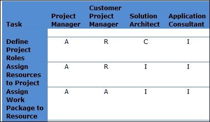

此学科还涵盖了如何开发、管理和发布项目团队，并得到了如以下截图所示的**角色和责任**模板等有用工具和模板的支持：

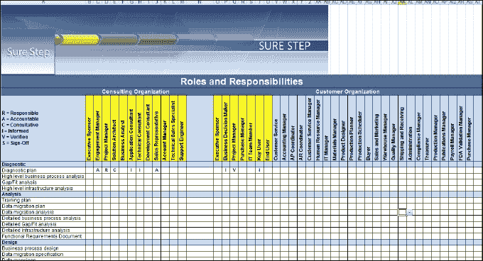

### 沟通管理

在 Sure Step 中，一个重要的主题是沟通的重要性。正如我们在前面的章节中所述，Sure Step 的生命周期在设计时就非常注重互动，旨在促进客户与实施者资源之间的沟通。此外，项目管理库将整个学科领域都致力于项目沟通的艺术。这一学科讨论了如何进行团队会议，例如指导团队会议、项目管理会议和项目团队会议。该学科还向我们介绍了如何执行项目绩效报告以及如何管理我们的利益相关者。我们还可以从这一学科中学到如何制作一份好的**项目章程**以及如何进行有效的启动会议。这一学科得到了以下模板的支持：

+   项目状态报告

+   沟通计划

+   启动会议演示和会议议程

+   项目章程

它还指出，项目的成功或失败是由利益相关者决定的，而不是由项目经理决定的，因此，我们需要关注项目利益相关者的分析。

### 质量管理

质量管理学科解决的是如何确保、控制和提升质量以达到所需和平衡水平的问题。**质量保证**（**QA**）被视为满足项目需求和质量标准的总体规划。它通常被定义为在质量体系中实施的有计划、系统的活动，以确保产品或服务的质量要求得到满足。从某种意义上说，由 Sure Step 流程指导的实施可以被视为质量保证的一个要素。然而，这还远远不够，因为我们必须根据客户的具体质量期望和需求调整我们的计划方法。这意味着我们首先需要了解质量对我们客户意味着什么，然后才能进一步细化我们的主动质量方法。质量保证关乎我们为满足要求而实施的过程。质量保证不是关注可交付成果本身，而是关注我们计划如何交付它们。**质量控制**（**QC**）活动集中于可交付成果，并关注这些项目可交付成果的验收。现在假设你是客户项目经理，负责签署你实施项目的功能需求文档。在签署之前，你可以检查这份文档的每一页，以确保其正确性、准确性和与未来业务流程和需求的一致性。这将是质量控制的一个例子。你也可以验证这份文档是如何创建的过程。通过这样做，你将获取有关组织的工作坊、参加人员、关键用户如何验证这些信息、是否经过 Fit Gap 评估的双检查等信息。这是一个关注文档创建过程的质保例子。以下图表说明了 Sure Step 如何将质量保证和质量控制整合到项目管理过程中：

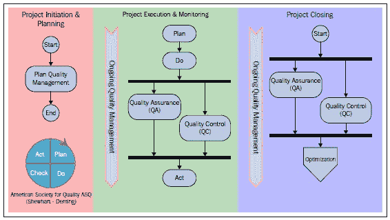

### 采购管理

这一学科讨论了如何管理从项目团队外部采购服务和可交付成果以满足定义的项目需求。分包可能涉及某些项目风险，但也提供了避免、减轻或转移风险的可能性。采购管理的重要输入和输出是考虑和定义约束、假设和边界。这一学科通过涵盖分包的计划、监控和关闭来解释如何做到这一点。

### 集成管理

集成管理本质上将所有学科整合在一起。这是因为它在整合从项目构思到关闭的各个方面时跨越了所有学科。集成是连接所有学科的粘合剂（范围、时间、成本、质量、资源、沟通、风险和采购）。

集成管理的第一部分是准备项目章程。这是一个关键文件，正式承认项目，赋予项目经理权限，提供高级要求，建立业务案例，并将项目与客户或组织目标联系起来。它还作为衡量成功的方式的定义。

一旦项目章程获得批准，项目经理和团队（以及适当的其他人员）必须采取项目章程中概述的指导方向，并确定规划细节：项目将如何被管理和控制。几乎每个学科领域都会被分析，以确定其定义、规划、管理和控制的方式，然后汇总到**项目管理计划**中。此计划包括项目的策略和方法，以及管理和控制项目的措施和流程，以确保满足项目章程的目标和成功标准。

在达成项目管理计划协议后，项目工作开始，并从此处开始，必须进行监控和控制。项目经理随后必须将所有执行过程整合成一个协调一致的努力，以实现项目管理计划并产生项目成果。

**监控**和**控制项目工作**是一个从项目启动到项目关闭的集成控制功能。项目经理需要监控过程进展情况，通常并不实际执行工作。监控和控制项目工作的集成功能包括分析跟踪风险、执行质量检查、接收变更以及采取纠正措施等活动。

项目范围可能已经完成，但质量是否可接受？进度可能已经满足，但我们是否在预算范围内？项目经理必须平衡不同学科领域的需求，以控制项目。

监控和控制项目工作的结果可能需要变更请求和对项目管理计划以及其他项目文件的更新。这些变更在接受或拒绝后，在**执行集成变更控制**（**PICC**）过程中进行处理。可能需要请求影响项目任何部分的变更，集成变更控制过程确定了所有学科领域的影响。

最后一个流程是**关闭项目阶段**。此流程在每个阶段结束时以及项目结束时被调用。如果项目在完成前被终止，此流程将确保所有文档被收集和归档。此流程最终确定所有项目管理学科的所有活动，并正式完成项目、阶段或合同义务。

# 组织变革管理

**组织变革管理（OCM）**是一门学科，它提供了一种结构化的方法，将个人、团队和组织从当前状态过渡到期望的未来状态，同时最小化阻力并最大化采用。

OCM 是业务解决方案交付合作成功的关键，有时也容易被忽视。正如本书多次讨论的那样，业务解决方案包括组织的多个流程和工作流程，对这些系统的任何更改都可能影响许多个人的日常运营和行为。在较小的组织中，由于 CEO 或总裁通常是此类大型项目的推动力，公司往往可以通过相当粗暴的力量或来自顶层的压力来“接受或否则”。但随着组织的规模扩大，以及项目范围和影响扩大，项目团队将 OCM 视为交付活动的组成部分就变得至关重要。这将确保及时消除采用障碍，并且员工支持是解决方案部署方法的一个组成部分。

在他们题为《变革管理对商业影响》的文章中，作者们汇集了多项研究，以了解组织变革管理（OCM）对项目的影响和重要性。作者们解释了 OCM 的目的：

> *“...以减轻项目风险，包括成本、进度和性能。”*

OCM 通过以下方式实现这一点：

> *“...通过有效地开发、部署和调整公司资产以实现特定项目的更快经济价值。”*

文章引用了麦肯锡公司的一项研究，该研究考察了许多项目变量，特别是 OCM 项目对项目投资回报率（ROI）的影响。结果令人震惊！包括良好 OCM 项目的项目产生了 143%的 ROI，这意味着公司从每花费一美元的项目中获得了 43 美分的收益。另一方面，没有或 OCM 项目较差的项目产生了 35%的 ROI，这意味着公司每花费一美元就损失了 65 美分。

作者们还突出了一篇题为《CRM 项目成功六大障碍》的研究，列举了以下 CRM 项目失败的原因：

+   缺乏指导

+   集成难题

+   缺乏长期战略

+   脏数据

+   缺乏员工支持

+   没有责任

作者们还描述了由公认的变化管理研究领导者 ProSci 进行的一项研究。为了有效地管理项目在组织中产生的变化，组织需要以下条件：

+   有效的强大高管支持

+   获得一线经理和员工的支持

+   优秀的团队

+   持续和有针对性的沟通

+   计划和组织的方法

作为一种流程，OCM 的目标是赋予员工接受和拥抱当前商业环境变化的权力。*Employee's Survival Guide to Change*的作者*Jeff Hiatt*谈论了谈论发生在他人身上的变化是多么容易和有趣，但当变化发生在他们自己的环境中时，个人会变得多么担忧和不舒服。Hiatt 将变革管理领域描述如下：

> *两个思想领域的融合……一个工程师改善业务绩效的方法和一个心理学家管理变革中的人性方面的方法。*

在由*The Anton Press*出版的名为*Integrating People with Process and Technology*的书中，*Jon Anton*和其他人探讨了组织的科技获取并不一定转化为其员工的使用。以下是从作者那里得出的一个引人注目的观察：

> *关于技术实施的真相是，尽管技术实现了供应商承诺的功能，但如果变革管理没有被纳入整体技术项目预算的一部分，就会引发 ROI 问题。在技术实施包括变革管理的情况下，实施过程成为一种令人兴奋的经历，它提高了公司的效率和效果。*

为了成功部署解决方案，作者的建议是公司应该

> *...以这种方式整合他们的员工、流程和技术...使变化得到接受并被看作是好的。*

他们将“好的”变革定义为技术：

> *...使员工更容易完成工作并提高效率，使员工为服务客户更具有操作上的有效性，并使公司的产品和服务易于访问。*

这些讨论强调了在项目管理中管理变革管理方程中的人性方面的重要性。最终，是系统用户最终定义了解决方案的成功或失败。如果没有用户的认可，如果用户看不到使用它的必要性，那么解决方案再好也没有用。因此，在实施过程中让用户紧密参与，听取并考虑任何担忧，这一点非常重要。公司进行变革研讨会来传达对即将到来的变革持开放态度的重要性也并不少见。

关于人和变革主题的更受欢迎的书籍之一是 Spencer Johnson 的《谁动了我的奶酪？》。这本书以两个老鼠和两个小人物为寓言，讲述了一个角色如何能够穿越迷宫找到奶酪，而另一个角色则因为不愿改变而挣扎。这个故事可以与公司环境联系起来，其中“迷宫”是员工工作的组织，而“奶酪”则是组织试图实现的目标。这个启发性的故事帮助许多员工应对不可避免的变化，并已被用作变革研讨会指南。

到目前为止，我们已经讨论了 OCM 的一般概念。在下一节中，我们将探讨 Sure Step 如何在实施过程中启用并支持组织变革的概念。

## 在 Sure Step 中的组织变革管理

在 Sure Step 中，组织变革管理被描述为一个综合的沟通、培训、赞助和组织对齐的方法，以帮助员工有效地过渡到新的工作方式。Sure Step 方法描绘了以下四个关键组织变革管理领域的成功策略——回顾上一节可以看出，这些策略与变革管理研究分析师的方法非常一致。

+   **高管和利益相关者参与**：此策略需要业务发起人的所有权和责任，通过要求组织的业务单元领导者创造一个环境，使 ERP/CRM 解决方案带来的流程变化被接受并拥有。该策略包括开放沟通、设定适当的期望、及时协助解决关键项目问题，并提供适当的强化水平以确保项目成功。

+   **组织对齐和动员**：为了使此策略成功，交付团队需要分析劳动力影响，并以当前业务实践为基准，过渡到未来的流程。需要积极参与适当的业务利益相关者，以了解解决方案的能力，并评估其各自领域的解决方案有效性。

+   **沟通**：这个关键成功领域侧重于解决方案设计、实施时间表和进度、利益相关者所需参与的沟通，以及接受新的工作方法。沟通包括在适当的时间以适当的形式通过适当的方式传递正确的信息，以及通过定期调查和迭代经验教训讨论的反馈和响应策略。

+   **培训**：此策略侧重于确保最终用户对新业务流程感到舒适，拥有在设计的流程中工作的所需技能集，并且已经对应用程序的使用进行了充分培训。该策略涵盖了初始和持续的用户培训，以确保新流程和工具的成功采用。

OCM 的 Sure Step 指引沿着五个支柱进行对齐。以下各节将描述这些支柱。OCM 领域内提供的指导被分解为活动，如下面的截图所示：

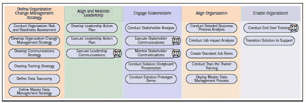

还应指出，这些活动反过来又与 Sure Step 项目类型集成，这意味着它们在相应的项目工作流程中被作为规定的步骤进行说明。

### 定义 OCM 策略

OCM 策略定义了项目或程序中各种变更管理组件的整体愿景、目标和活动，以确保解决方案的成功采用。OCM 策略的子组件包括以下内容：

+   **组织风险和准备度评估**：这评估了组织进行此类规模项目的准备情况，了解可能存在的风险，并定义缓解策略以克服项目成功的障碍。

+   **组织变更管理策略**：这定义了特定变更管理活动、资源以及相互依赖关系的性质和顺序，以促进变更过程

+   **沟通策略**：这定义了信息传递和沟通的内容、方法和时间，以使管理层、利益相关者和业务部门保持一致

+   **培训策略**：这定义了培训受众和将新流程和解决方案同化到用户群体中使用的策略

+   **数据分类**：这定义了所需的数据实体以及任何可选的数据元素

+   **主数据管理策略**：这定义了在解决方案投入生产后管理和维护主数据的整体策略和流程

如前所述，Sure Step 中 OCM 领域部分的活动也实施在 Sure Step 项目类型中，特别是企业项目类型。例如，**进行组织风险和准备度评估**是企业项目类型程序管理跨阶段的一个活动。项目活动还包括优秀的工具和模板，例如组织风险准备度分析工具。

### 对齐和动员领导力

定义了策略组件后，为该子领域的商业高管和赞助者创建了整体变更管理行动计划，包括以下活动：

+   **领导行动计划**：通过定义所有级别的沟通，从高管和中级经理到受新解决方案影响最大的人，推动变革策略。计划应包括定期检查点，以审计绩效，并在必要时进行必要的课程修正。

+   **领导沟通**：这确保项目业务高管和赞助人在项目期间定期与利益相关者沟通。

对于领导沟通活动，Sure Step 包括一个现成的 Outlook 电子邮件模板，可以根据组织的消息风格进行调整。

### 吸引利益相关者

本 OCM 子领域的目的是确保通过以下活动在整个项目生命周期中识别项目利益相关者，并积极参与：

+   **利益相关者沟通**：这包括为领导层和项目团队制定适当的沟通方案，获取反馈，并在必要时创建行动计划来解决提出的问题

+   **解决方案故事板演示**：这涉及在设计完成之前向利益相关者展示解决方案故事板，以获得对解决方案的积极反馈和承诺

+   **解决方案原型演示**：这涉及在解决方案开发期间向利益相关者展示配置好的解决方案，以获得对解决方案可用性的积极反馈。

与之前的子领域类似，这些活动与 Sure Step 项目类型活动保持一致，包括用于沟通、创建故事板等的模板。

### 调整组织

本 OCM 子领域的关键目标是确保利益相关者充分准备采用新解决方案。这是通过实施对未来流程的预期解决方案，定义角色和职责，以及为组织准备和执行培训来实现的。

+   **未来状态业务流程模型**：基于新解决方案开发未来状态业务流程，这反过来又为培训和对利益相关者采用新解决方案进行对齐提供了基线。

+   **工作影响分析**：这是确保利益相关者拥有理解项目倡议对其工作表现、工作描述和职业道路影响所需信息的关键步骤

+   **角色和职责**：这基于工作影响分析，以定义由新解决方案产生的新角色和修改后的职责

+   **培训师培训**：这确保组织培训师熟悉新解决方案，并准备好培训最终用户。

+   **主数据管理流程**：这确保主数据管理流程由数据所有者实施，并建立适当的数据所有权和问责制

如前几章所述，Sure Step 提供了一个庞大的流程模型库，可以用来开发未来的业务流程流程。还包括其他模板，例如工作影响分析电子表格，这些模板也包含在相关项目类型活动中。

### 使组织具备能力

这个子领域确保新解决方案的部署，用户的培训，以及适当的支持流程的运营。

+   **终端用户培训**：这确保了为终端用户提供充足且持续的培训，以促进用户对新解决方案的采用

+   **过渡解决方案支持**：参与适当的支持组织，并将解决方案移交给将提供持续支持的团队。

+   **主数据管理流程移交**：这确保了数据管理流程被移交给数据所有者，以便在新解决方案中保持数据完整性和准确性

数据管理有时对用户来说可能令人困惑，为什么它属于组织变革管理。在 ERP/CRM 解决方案部署中，顾问经常使用的一个老话是，“垃圾进，垃圾出。”虽然听起来很严厉，但即使新解决方案很好，如果提供的数据仍然很差，它只会导致解决方案用户更快地获得错误信息。因此，管理数据元素是一个重要的变革组件，可能会影响利益相关者。

在上述章节中，我们介绍了 OCM 的概念，并从 Sure Step 的角度探讨了 OCM。正如我们所学的，OCM 是一个关键的学科，在解决方案交付过程中不应被忽视。鉴于公司在解决方案上的投资，包括 OCM 专家来指导组织成功采用新解决方案应该是理所当然的。

# 与其他项目方法论对齐

项目经理有多种项目方法论可供选择，以确保业务软件的成功交付。在本章早期，我们探讨了 Sure Step 与项目管理协会（PMI）的项目管理库之间的联系。在世界的许多地区和许多行业，其他项目实施方法论被视为标准。例如包括微软解决方案框架或**PRINCE2**。

## PRINCE2 和 Sure Step

PRINCE2 是一个框架，最初在 20 世纪 80 年代末为英国政府创建，用于管理其 IT 实施。如今，它不仅在公共部门组织中高度流行，而且在私营部门中也越来越有影响力，尤其是在澳大利亚和英国。这种偏好的原因部分在于 PRINCE2 的关键流程属性以及框架提供的控制层的感知好处。PRINCE2 是以流程驱动的，同时具有七个指导原则和七个主题，在每个项目流程阶段提供控制。

原则如下：

+   持续的业务合理性

+   从经验中学习

+   明确的角色和责任

+   分阶段管理

+   异常管理

+   专注于产品

+   量身定制以满足特定项目环境的需求

这些原则在 Sure Step 中有所体现。

七大主题如下，所有这些都与 Sure Step PM 库有间接相似之处：

+   商业案例

+   组织

+   质量

+   计划

+   风险

+   变更

+   进度

由于每个实施都可以根据许多因素（无论是地理、行业部门还是客户的管理团队）指定其自己的方法论要求，因此了解其他方法论或框架可以与 Sure Step 互补，确保不会忽略微软研发团队共享的最佳实践是非常重要的。

# Sure Step 的项目功能

在第四章至第七章中，我们介绍了五种瀑布和敏捷 Sure Step 项目类型，包括为项目活动提供的模板。这些模板包括我们在上述部分讨论的一些项目和变更管理模板。在本节中，我们现在将注意力转向使用适当的交叉部分模板启动项目，这些模板根据用户的选择预先填充。 

Sure Step 提供了一个名为**项目**的功能，用于轻松设置项目模板和与项目团队成员的高效协作。此功能可在 Sure Step 应用程序的第二标签下找到，或在 Sure Step Online 的左下角，标题为**项目**，如下一个截图所示：

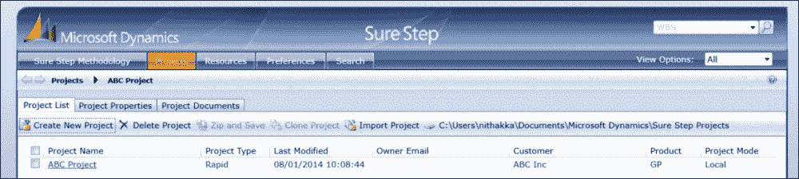

作为参考，我们之前提到的指南、模板和工具位于 Sure Step 应用程序的第一个标签下，并标记为**Sure Step 方法论**，如前一个 Sure Step 应用程序截图所示。

创建和管理项目的流程由所使用的 Sure Step 应用程序决定，如果使用 Sure Step 的桌面版或在线版，则会有所不同，具体细节将在以下部分中详细说明。

## Sure Step 项目创建向导

Sure Step 项目功能可以执行，以在本地驱动器（或共享驱动器）或 SharePoint 服务器上启动项目。启动这些项目的流程将在以下部分中描述。

为了创建项目，Sure Step 提供了一个直观的**Microsoft Dynamics Sure Step 项目创建向导**，该向导引导用户完成设置。以下截图显示了向导的一个屏幕：

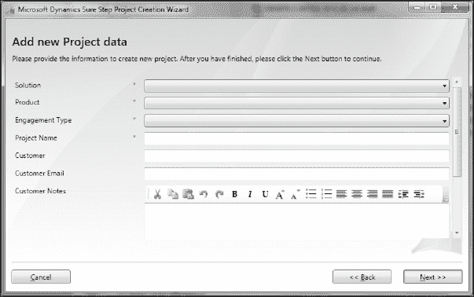

如果项目是为特定行业（如流程或公共部门）的客户，或者如果解决方案是跨行业解决方案（如 xRM），则**解决方案**下拉菜单提供这些选择。选择这些选项之一后，将关联到创建的项目中的相应模板。另一方面，如果客户项目不是这些行业或跨行业解决方案之一，将提供一个**通用**解决方案值，该值附加与标准产品相关的模板。

**产品**下拉菜单是您选择项目基于的适当 Microsoft Dynamics 产品的位置。向导根据所选解决方案缩小选择范围——这意味着，例如，如果您选择**公共部门**，则只提供 CRM 作为产品值，因为 Sure Step 目前只为公共部门提供 CRM 解决方案指导。在未来的某个时刻，当为特定行业提供更多产品覆盖时，解决方案过滤器将提供相应的产品值。

**参与类型**下拉菜单提供了 Sure Step 支持的以下三种参与类型的多个选择。

+   如果参与活动与预售/尽职调查相关，用户将选择**诊断阶段产品**，这是我们之前章节中描述的决策加速产品。对于这个选择，向导将允许用户选择多个决策加速产品，以支持需要服务提供商在尽职调查过程中结合多个产品的客户场景。

+   如果参与活动是为了解决方案交付，用户将选择**实施**。在下一个选择中，用户被要求选择四种瀑布项目类型之一，或敏捷项目类型，作为实施的基础。

+   如果参与活动是为了优化或审查，用户将选择**优化产品**。就像诊断阶段产品选项一样，**优化产品**选择允许用户选择多个优化或审查产品。

向导还提供了选择项目是否应在本地驱动器或 SharePoint 服务器上创建的选项。

### 在本地驱动器上创建项目

在本地驱动器上创建项目的用例通常限于实施团队资源有限的小型项目。在这些情况下，项目通常在顾问的个人计算机上设置并驻留，并且交付成果在适当的时候与客户共享。然而，Sure Step 确实允许用户将默认驱动器从`C:\`更改为共享驱动器，以便更多资源可以共同工作在同一项目上。Sure Step 还提供了其他协作选项，例如导出和导入这些项目。

当查看项目时，重要的是要注意，当用户点击特定的阶段，例如本例中的分析阶段时，视图将变为更详细的一个，显示文档描述、此成果的所有者角色以及参与咨询角色和客户角色，提供更以角色为中心的体验。

### 在 SharePoint 服务器上创建项目

Projects 功能更常见的用例是在 SharePoint 服务器上启动项目。在项目设置流程结束时，项目创建向导为用户提供选择**基于 SharePoint 的项目**的选项。指定 SharePoint 站点的相应 URL 后，Sure Step 将运行检查以确保用户有创建站点的适当权限，检查结果为正时，将自动将相应的 Sure Step 模板填充到站点。以下截图显示了此过程中的步骤：

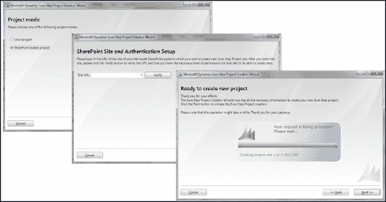

以下截图显示了结果 SharePoint 站点的示例。此示例是使用企业项目类型为 CRM 项目创建的 SharePoint 站点。

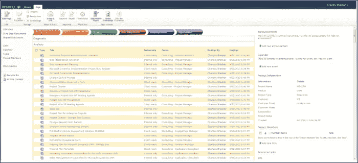

## Sure Step Online 项目创建向导

当使用 Sure Step Online 的项目创建向导时，创建项目的流程与上述描述不同。Sure Step Online 只能创建 SharePoint 文档库站点的项目。为了将选定的 SharePoint 站点与 Sure Step 的内容存储链接起来，必须完成以下一次性设置：

1.  通过在 Sure Step Online 中导航到**项目**标签（左下角）并按照以下截图中的链接下载 Microsoft Dynamics Sure Step Online 项目向导（`SureStepProjectWizard.xap`）来完成此操作：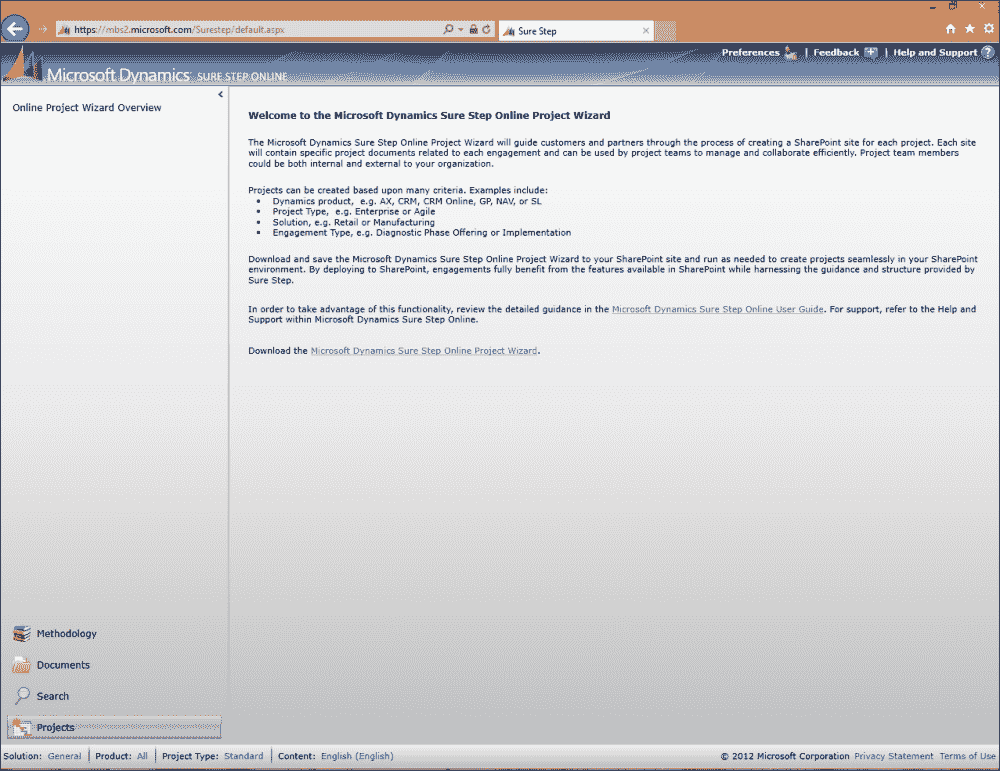

1.  下载后，导航到 SharePoint 站点，并选择将`.xap`文件作为文档添加，如下截图所示：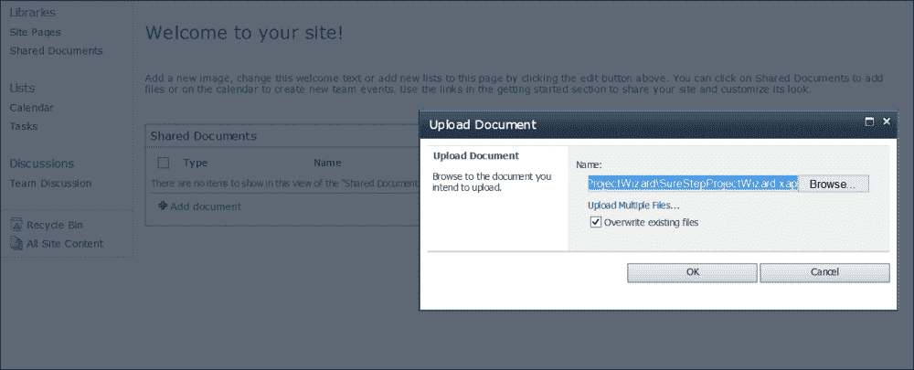

1.  添加后，`SureStepProjectWizard.xap`应作为 Silverlight 网页部件添加到库中的新页面，从而使向导显示如下：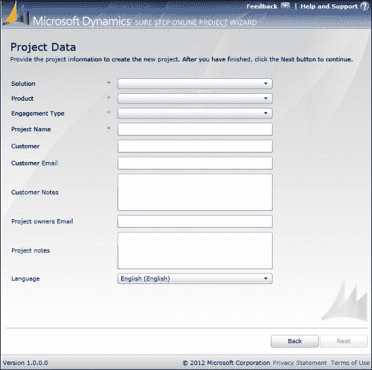

    现已安装和配置，Sure Step Online 项目向导将以与 Sure Step 桌面版本类似的方式工作。完成项目信息（如前述截图所示）后，选择**下一步**将打开向导中的下一个窗口。在这里，必须选择项目类型。选项包括**企业**、**标准**、**快速**、**升级**和**敏捷**，如下截图所示：

    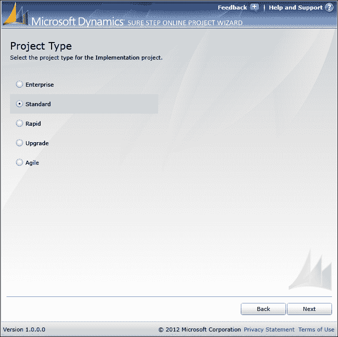

1.  向导的第三步将确定项目创建的 SharePoint 站点位置（如下截图所示）。为了继续操作，用户必须在相关的 SharePoint 站点上创建权限。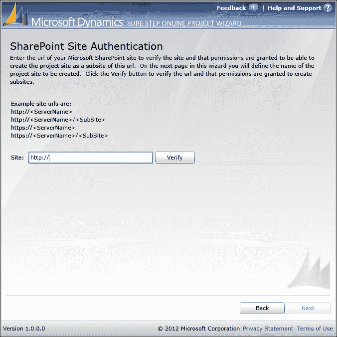

1.  下一步将要求用户选择项目将驻留的站点名称。向导将创建此步骤，因此无需提前创建页面。最后一步确认项目需求，然后启动项目创建。

使用 Sure Step 在线版相对于桌面版 Sure Step 的一个主要优势是值得注意的。每次使用在线向导创建项目时，都会从 Microsoft 的内容数据存储中下载最新更新的内容，从而始终确保在项目中使用的是最新内容。这是因为在线环境相对于桌面版本的简单性。Microsoft 能够以最少的延迟在线部署新内容。部署到桌面版本需要更多时间，需要分配给正式发布计划的内容构建。

一旦创建项目，向导将显示一个链接到新项目站点。打开链接将用户导航到新项目，其中包含所有相关的 Sure Step 文档以及菜单栏上项目阶段的快捷方式，如下截图所示：

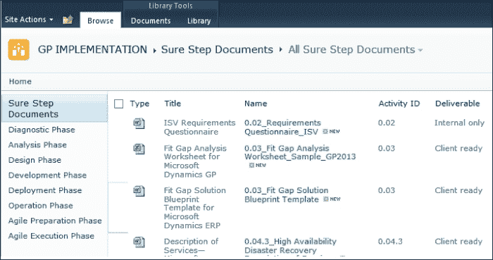

## 使用项目功能自定义 Sure Step 模板

在可下载的 Sure Step 版本中，Sure Step 项目功能还为用户提供了一些其他有用的选项。**更改标志**功能是一个很好的例子。

Sure Step 模板预先填充了 Sure Step 标志，该标志也受元数据控制。元数据允许用户通过在项目属性下使用更改标志功能，快速地在所有文档中统一更改标志。更改标志功能支持多种用例，例如，对于特定项目将 Sure Step 标志替换为客户标志，或者将标志更改为服务提供商的标志以创建他们自己组织的定制模板集。

最后一点对于服务提供商尤其关键。项目功能允许保存、导入和克隆现有项目，从而通过行业、参与规模、参与方法等方式促进项目文件夹的创建。因此，服务提供商可以决定创建一系列项目文档，例如，他们的咨询团队可以作为所有汽车制造客户起点使用的 Microsoft Dynamics AX 标准项目类型模板。或者他们可以为使用快速项目类型的 Microsoft Dynamics SL 的离线部署创建另一个文件夹。或者，他们可能为更喜欢敏捷方法的 CRM 客户创建另一个项目文件夹。每个模板都可以预先填充组织的标志和从以往合作中汲取的关键经验教训。

Sure Step 将其称为 **60-20-20** 规则，这意味着 Sure Step 提供了模板的起始 60%，服务提供商随后根据其在特定领域的专业知识进行定制，并增加其 20%。在最后的 20% 中，咨询团队将模板转化为针对客户环境的特定可交付成果。

# 摘要

在本章中，我们介绍了 Sure Step 项目管理库，其中包括项目管理和组织变革管理学科。我们还讨论了 Sure Step 中的项目功能，该功能允许轻松设置项目模板，并使团队在离线和 SharePoint 环境中与其他团队成员高效协作。

在下一章中，我们将从服务提供商和独立软件供应商的角度讨论 Sure Step 方法的采用。我们将讨论 Sure Step 采用路线图以及它如何帮助组织采用该方法作为自己的方法。
