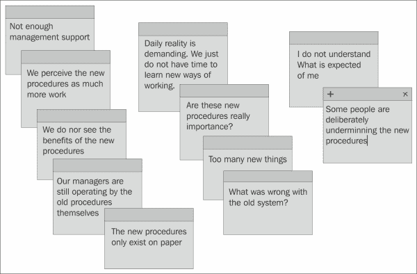
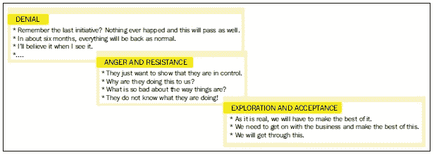
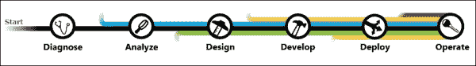
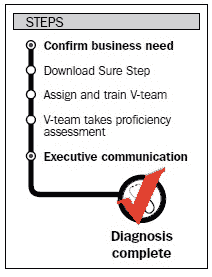
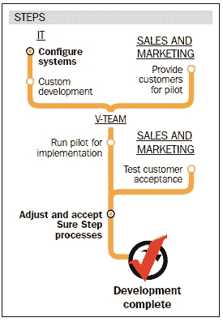
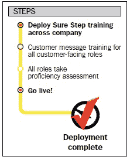
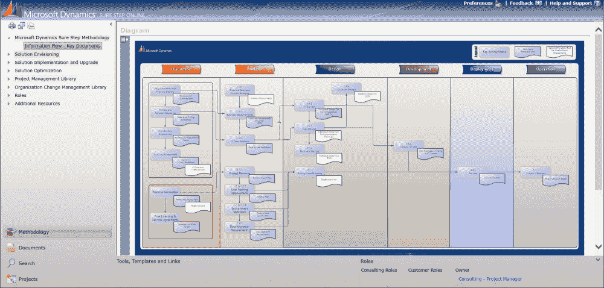
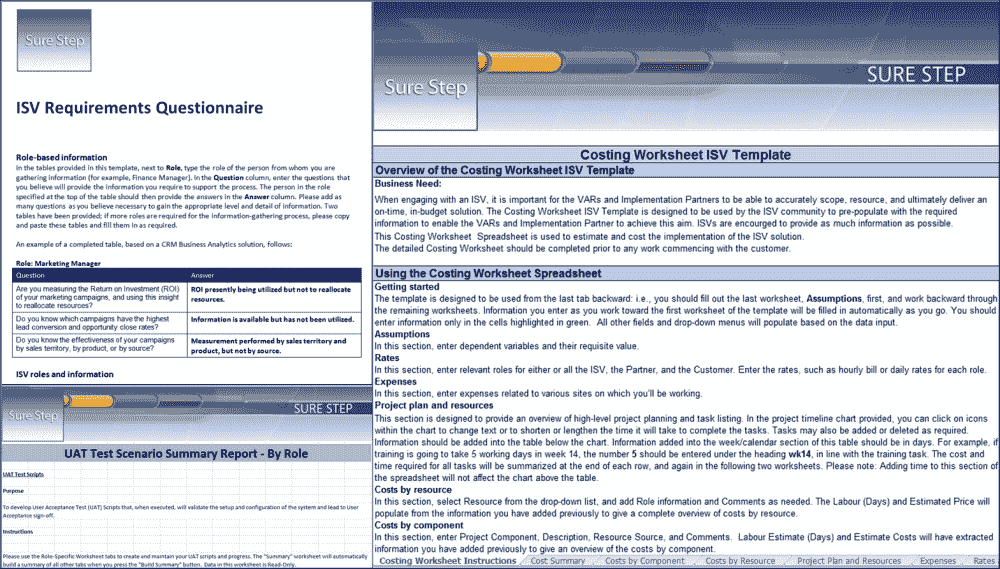
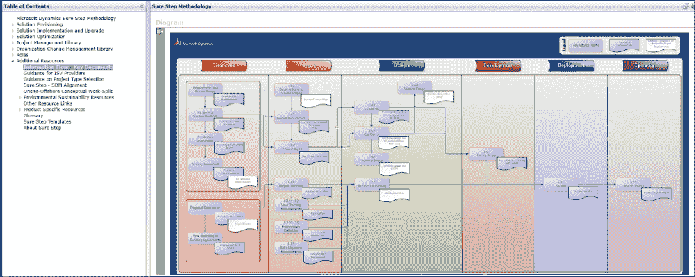

# 第九章。采用 Sure Step 的实用指南

在前几章中，我们讨论了 Sure Step 的各种特性，包括尽职调查和解决方案销售启用、高质量解决方案实施和升级的方法、审查和优化的选项，以及项目和变更管理学科。现在，我们将把我们的重点转移到另一个重要领域——组织如何采用 Sure Step 方法论，并使用它来持续地向客户交付解决方案。

在本章中，我们将涵盖以下内容：

+   采用 Sure Step 的策略开发和执行，包括在组织内部管理变革

+   如何为您的组织制定 Sure Step 采用计划

+   来自真实 Sure Step 采用计划的快速胜利

+   你如何从 Sure Step 在线中受益

+   **独立软件供应商**（**ISVs**）如何从采用 Sure Step 中受益

# 不要把你的大脑停在门外

微软 Dynamics 合作伙伴和客户都可以通过 PartnerSource 和 CustomerSource 轻松访问 Sure Step 应用程序，分别。从这些微软门户中，Sure Step 可以轻松下载并安装，几分钟内即可释放所有 Sure Step 内容和工具。项目经理和顾问还可以通过**微软官方课程资料**（**MOC**）、微软在线学习和由**微软认证学习解决方案合作伙伴**（**CPLS**）提供的**讲师指导培训**（**ILT**）课程熟悉并了解 Sure Step。这意味着，只需投入适量的时间，组织就可以获得 Sure Step 方法论工具、内容和知识。那么，将您的组织置于 Sure Step 轨道上是否像吃馅饼一样简单？正如我们许多人所知，这离事实相去甚远。任何希望调整其流程以采用新的实施方法组织的组织都注定要面临一系列挑战。为了成功，他们需要有效的策略，并且必须正确执行，同时管理组织变革，而这并不是小事！

## 执行策略

|   | *"计划只有当它们立即转化为辛勤工作时才是好的意图。"* |   |
| --- | --- | --- |
|   | --彼得·德鲁克 |

战略执行不同于战略制定，但它们需要相辅相成。战略执行可以定义为“将你的策略转化为成功所需的所有行动”。一个伟大的策略不能弥补糟糕的执行，反之亦然。《战略执行英雄》一书，作者*Jeroen De Flander*，《绩效工厂》，在比较战略执行与战略制定时列出了四个重要的区别。战略执行涉及组织中的每个人，而战略制定主要保留给选定的执行团队。战略执行所需的时间比战略制定长得多——这是一场马拉松而不是短跑。执行需要短期和长期思考，因为短期胜利是使执行成功所必需的。战略执行还需要与战略制定不同的技能集。成功的策略制定者是分析思维和机会识别的冠军，而执行者则是沟通和辅导技能的大师。

合作伙伴组织的关键关注领域之一是提高他们在 Microsoft Dynamics 实施中的质量、满意度和盈利水平。在制定战略时，我们可能会考虑定义我们的质量目标，并制定使用 Microsoft Dynamics Sure Step 作为工具来实现这些质量卓越目标的计划。但仅仅拥有战略计划本身并不能保证成功。一个策略，即使是伟大的策略，也不会自行实施！为了将 Sure Step 策略转化为执行，组织需要制定一个公司范围内的计划，利用管理辅导支持来详细说明实现快速胜利所需的逐步步骤，从而实现更大规模的转型。与成功获取具有成功实施知识资源的资源相比，这一过程的执行是完全不同的游戏。

## 管理变革

在第四章《管理项目》中，我们已经介绍了变革作为适应 Sure Step 的挑战。这并不令人惊讶，因为我们大多数人必须熟悉改变我们个人和职业生活中那些陈旧习惯的巨大困难。现在，花一些时间思考一下你在职业生涯中的某些变革倡议。它们是否完全成功，达到了你计划的程度？如果没有，试着列出它们失败的三种原因。它们是否与以下图表中的那些相似？

这个插图仅突出了一些反思变革项目失败原因的常见痛点。大多数公司确实有失败的变革倡议记录。这些失败中的大多数是由典型的变革管理挑战引起的。如果我们想要成功适应 Sure Step，我们需要有一个强大的执行计划来克服这些变革管理挑战。而且，意识是这一方向的第一步。人们是习惯的动物，在做已知的事情时感到最安全。

### 为什么变革倡议会失败

在第三章中，*Solution Envisioning with Sure Step*，我们已经提到了书籍*Our Iceberg Is Melting first edition*，*John Kotter*，*St. Martin's Press*。他描述了变革倡议失败的十个原因。让我们在以下章节中更详细地看看这些原因。

#### 低估了对期望变革的清晰愿景的需求

我们为什么需要变革？结果会是什么，它与我们的目标和公司战略有何关系？我们会卖出更多并变得更盈利吗？实施这一变革的令人信服的理由是什么？它的商业理由是什么？我们需要确保我们的变革倡议与目标承诺和公司目标相连接，并且在我们期望的变革背后有一个强大的愿景。就像在足球中，除非我们知道球门在哪里，否则我们不会走得太远。所以，首先要做的是理解我们想要实现什么！

#### 没有清晰地传达愿景

在不知道为什么要改变做事方式的情况下，你是否感到舒适？当然你不会，这适用于大多数人。当我们向员工引入变革时，他们需要知道组织真正想要和需要变革的原因。我们想要解决哪些问题？这将提高我们的绩效和质量水平吗？解释这个倡议如何与战略计划相符。这将帮助我们实现目标吗？如何？引入组织变革的领导必须向将执行变革的人推销愿景。他们需要通过良好的沟通和信息使整个公司相信这个愿景是可信和可实现的。缺乏这种必要的沟通是战略与执行之间的脱节。

#### 没有建立一个实质性的联盟

我们的变革倡议需要得到我们组织内一个庞大群体的支持，以克服传统和惰性。他们需要对引入的变革充满信心、受到鼓舞和兴奋。因此，他们将向团队传播新的程序，并帮助他人过渡到新的工作方式。他们还将与那些不相信和抵制变革的人进行辩论，并克服他们的批评。这个支持者的联盟将作为你在更有效和以质量为导向的公司运动中的竞选伙伴。这个联盟需要强大，包括公司不同部门和学科中权威的执行和非执行角色的混合。我们必须在强制使用任何新工具或程序之前，投入时间来创建这样一个信仰者的群体。我们需要在我们的组织中识别推动者和潜在的推动者。他们两者都对变革持有积极的普遍态度；他们不害怕变革，比其他人感到更少的不安全。真正的推动者会立即欢迎特定的变革，并以光速寻求新工作方式的优势。潜在的推动者对变革并不持负面态度，但他们不会很快找到优势。他们只需要额外的鼓励来发现变革的真实价值。我们需要在变革之旅中，让这两种类型的推动者都参与进来。

#### 允许对愿景的阻碍

人们不喜欢改变他们的做事方式，新的程序使他们感到不安全。这对大多数人来说都是如此，即使是那些推动变革的人也是如此。然而，有些人比其他人更害怕变革，我们这里说的是一般意义上的变革。这可能导致对任何变革的抵制。我们需要了解我们的对手，并从第一天开始管理他们的抵制。真正的对手通常并不难识别。他们对任何变革都持有强烈的负面态度，而且还有强烈的个人原因反对这种特定的变革。

这些对手将试图否认变革，并引发愤怒和抵制。我们需要为此做好准备，并通过探索接受来管理他们。以下图表描绘了这一现象的各个方面：

我们还需要预见隐藏的对手或机会主义者。识别他们将会更具挑战性。尽管他们表面上似乎支持变革，但他们对于变革持有负面的普遍态度。他们在推动者和反对者之间保持平衡，这意味着我们的挑战是给他们提供足够的信息和鼓励，让他们理解变革的好处。

我们需要关闭反对者领导的对改进计划的任何反抗，并且我们需要确保反对者的人数不超过支持变革的联盟。

#### 没有产生与改进绩效相关的紧迫感

即使整个团队有最好的意图，变革项目也会因为缺乏紧迫感而受到威胁。即使我们支持新的流程和工具，实际操作它们通常会被推迟。有一些普遍的借口，比如“是的，我们支持它，因为它很好，但现在我们没有时间，因为还有其他更高优先级的事情。”我们以前听过这些，但很快，“总有一天”就会变成“没有那一天”，我们的变革项目就会结束。这就是为什么我们需要将我们的变革目标与公认的紧迫感联系起来。

人们需要理解为什么我们需要快速变革以及整个组织将如何从中受益。没有时间可以浪费，因为这至关重要；我们需要立即行动。*约翰·科特*表示，公司管理层的 75％必须确信当前的商业实践是完全不可接受的。如果没有对变革的紧迫感，变革过程就会受到威胁。

#### 没有制定短期胜利的计划

探索变革的第一结果和好处是至关重要的。这将激励人们适应任何新引入的程序或工具，并且体验这些好处将鼓励他们继续我们的改进和变革追求。我们让组织等待第一结果和胜利的时间越长，我们失去的支持和热情就越多，我们的对手获得的弹药就越多。看着锅永远不会沸腾。

#### 没有领导并指导商业行为的变革

如前所述，变革并不容易发生，策略的执行也不会自行实施。在每一个成功的变革项目中，我们都会找到个人。我们的员工需要意识到变革，因此，他们需要被指导和引导进入这个变革。实际上，这是管理和领导的责任。我们的挑战是在我们的组织中创造对变革的认识并建立对变革的责任感。实际上，“照我说的做”的方法不太可能在我们转型的努力中带来即时成功。我们需要真正愿意承担变革和绩效责任的人，使指导成为更好的选择。本质上，这就是通过变革进行领导——将人力与新的愿景对齐并激励他们在障碍中实现它。通过指导，我们可以让我们的员工参与到变革中，而不是将变革强加给他们。人们会做他们认为和感觉的事情，而不是被强加的事情。

#### 管理者无法在日常执行中及之上进行操作

改变日常执行实践是管理层的责任。管理者需要与新的愿景的价值观和信念相联系，并在他们部门的日常实践中引入新的行为。这话说起来容易，但尽管管理者负责这项工作，但一大群管理者发现自己很难超越日常执行。这把我们引到了下一个部分——*言行不一*。

#### 言行不一

“说一套做一套”显然是无效的，但却是非常常见的管理方法。管理者可能已经与新的愿景建立了联系，并抓住每一个机会表达他们对它的支持，但在实践中，他们仍然在部署那些陈旧的习惯和商业实践。如果管理者不支持新行为的实践和执行，那么他们的员工很可能也不会支持。新的程序显然不在他们的心中，任何人员组织都会立即感觉到这一点。

#### 未将变革锚定在企业文化中

大多数在不止一家公司工作过的人一定都经历过，有一种叫做公司或企业文化的东西——某种存在于公司氛围中的东西，使得这个组织与众不同。我们也一定经历过，这种独特的文化对我们在这个公司中的行为、表现、互动以及感受产生了影响。关于什么是企业文化，有许多定义，它们都指向组织内部人们和群体所共享的价值观和规范。由于这种文化影响着我们的行为和与同事、供应商、客户互动的方式，它代表了在该公司内所能达到的极限。这就是为什么我们的变革项目，我们对更多质量的追求，需要坚持公司的文化。我们必须加强新的规范和价值观，并向组织展示它们是文化的重要组成部分。新员工应立即融入这些新价值观，为此，激励和晋升可能成为有价值的工具。

# 制定你的 Sure Step 采用计划

之前关于战略执行和变革管理的章节清楚地表明，采用任何实施方法都是一个重要但复杂且耗时的任务，它影响着整个合作伙伴组织。要成功采用，你需要一个指导性的采用计划，这个计划被构建和设想得如此之好，以至于它将帮助你克服典型的变革和战略执行陷阱。你必须包括这些基本要素：

+   确认商业需求和愿景

+   高管沟通

+   评估你当前的商业实践

+   识别和沟通风险与回报

+   目标设定和辅导模型

在战略执行以及变革管理理论中，强调团队需要了解他们将要经历的变革过程。我们的人都将在这个变革中扮演关键角色，因此他们需要理解这个场景。

## 创建路线图

采纳路线图是一种有组织的引导您的组织走向变革的方法。它必须包括每一步推荐的职责和角色，强调高管沟通的重要性及时机、实施团队活动、销售和 IT 的参与，以及在整个公司中最终部署变革。有了路线图作为您的指南，您将能够保持动力，实现采纳 Sure Step 的全部好处。

路线图可以按照以下图中所示的 Sure Step 的六个阶段进行管理，分为六个阶段：

让我们以下面的章节更详细地看看每个阶段。

### 诊断

这是对商业领导者的一项行动呼吁，以确定实施 Sure Step 的令人信服的理由。为什么我们需要 Sure Step？我们是否有战略上的理由这样做？它的商业需求是什么？我们背后的愿景是什么？确定那些推动我们在日常实践和行为中使用 Sure Step 的信念和价值观。目标在哪里，我们想要实现什么，以及如何衡量？

在这个阶段，我们还想开始建立我们的强大联盟。我们需要一个对变革持一般积极态度的团队，他们可以通过产生快速结果和激励他人探索新程序来在组织内部领导和促进变革。他们将鼓励并帮助他们的同事找到他们自己的个人利益和适应这种变革的理由。这是一个想要承担新绩效责任的团队——我们期望输出背后的支柱。现在是时候计划指派 Sure Step 的倡导者和**胜利团队（V 团队）**了。

#### Sure Step 的倡导者

倡导者是变革的日常领导者。他们负责制定和执行公司的采纳计划。理想的倡导者是一个具有专业知识、分量和信誉的高级人员，能够促进、领导和指导公司范围内的变革倡议。这个人必须深刻理解业务，得到公司最高层成员的支持，同时，在公司等级制度中上下都受到尊重。倡导者需要理解人们的恐惧，并能够指导他们探索和接受。一个在公司或竞争性公司中担任过多种角色的倡导者可能更有可能将自己置于另一个位置。倡导者需要清楚地意识到他/她为他人树立了榜样。因此，倡导者需要践行所宣扬的。

#### V 团队

我们的冠军的首要任务是识别和招募 V 团队候选人，他们将分别负责评估、配置和部署 Sure Step。这必须是一个经过深思熟虑的行动，涉及到识别一个良好的支持者混合体。

V 团队需要成为我们整个公司的强大代表，包括所有角色和部门。考虑至少包括以下角色：

+   一位销售经理

+   一位高级应用顾问

+   一位高级开发顾问

+   一位高级项目经理

一个理想的 V 团队还将有来自 IT、市场和人力资源部门的兼职参与，因为我们希望将我们的变革倡议与公司的文化紧密结合，而且我们的倡议也可能影响工作角色。

通过分配冠军和 V 团队，我们已经形成了我们的实质性联盟。在流程的这个阶段，我们需要通知和培训我们的冠军和团队关于这个新的 Sure Step 世界。Sure Step 是什么，以及这种方法的真正基本要素和好处是什么？这次培训需要鼓舞人心和提供信息，而不是详细和超负荷。我们希望我们的联盟感受到好处，而不是让他们被详细的技术方面超负荷。

在这个阶段，你还应该安排进行高管沟通——这是改变成功的一个真正重要的活动。高管们需要沟通为什么这个改变如此重要，并解释其令人信服的原因。他们需要明确指出，这不仅仅是一项强加的任务，而是涉及到每个人的主动性。他们需要提供关于成功模样的共同图景。你的员工需要理解策略，并受到激励和承诺采取行动。

下一个图表总结了诊断阶段的步骤：

完成这一阶段平均估计需要 30 天。

### 分析

这是我们将用细齿梳子仔细检查我们的习惯性实施过程，以详细了解为什么这种转型如此迫切需要的地方。我们需要关注哪里，在哪里可以找到快速胜利，以及哪些需要更多重新设计的时间？我们需要准备进行一次深入和诚实的自我评估，包括我们的流程、技能和组织结构。所有这些都会受到影响。最后，我们需要正确的输入来制定我们的采用计划。

这项调查通常是通过组织一个或多个评估研讨会来进行的。利用外部专家 Sure Step 采用促进者来管理这些研讨会及其产出可能是个好主意。

来自研讨会的输出必须被转换成行动计划，以便在采用计划的执行中进行实施。

### 注意

只执行这个计划一次将错过持续改进的机会。如 Kaizen 等质量改进理念表明，质量改进应该是一个持续的努力，而不是一次性引入小改进和标准化的举措。因此，我们希望多次通过路线图，每次都提高我们的一般质量和 Sure Step 采用的特定水平。

通过我们评估的结果，我们可以确定个人 V 团队成员需要哪些专业技能培训来履行他们的职责。例如，这可能包括销售方法或项目管理培训。行动计划还将指导我们如何进一步发展 V 团队在 Sure Step 方面的技能。

此阶段需要 V 团队和公司的重要利益相关者进行强有力的合作。我们需要他们的输入和真诚的意见，并且我们真的需要倾听他们。实践表明，提供输入并共同推动这一变革机会的机会确实能够激励他们。以前项目的经验告诉我们，大多数 V 团队的反馈极为积极，并导致了在执行 Sure Step 实践方面的高度承诺。

与 V 团队一起，冠军必须保持警惕，关注此采用过程中附带的潜在风险和陷阱。以下是一些需要提出的重要问题：

+   什么可能会成为障碍？

+   对于组织来说，什么会过于雄心勃勃？

+   什么是可实现的，什么又是不可能的？

不要过于雄心勃勃，也不要把所有东西都推倒。你的改进计划需要是可实现的，并且得到你组织的接受。

我们还需要在这里最终确定我们的商业案例，并向 CEO 报告我们的采用计划和**投资回报率**（ROI）案例。然后 CEO 将确认继续推进的决定。

完成此阶段平均预计需要 30 天。

### 设计

在这一点上，我们已经从分析阶段进行的评估和研讨会中收集到了宝贵的信息。我们想要改进和改变我们当前的销售和实施流程的目标就在我们的雷达上。我们也知道目标在哪里，因为我们已经确定了我们的短期和长期目标以及回报。我们现在准备开始通过将它们与 Sure Step 模板中我们公司可实现的方面进行映射，来重新设计我们当前的流程，使其成为我们公司的理想流程。

我们的倡导者必须领导 V 团队根据 Sure Step 原则和指南重新设计销售流程、项目实施流程和绩效管理流程。我们将关注那些在前一阶段确定需要我们关注的方面。这个过程设计的一部分是一个**概念验证**探索，检查常见的销售和实施场景，并规划如何使用 Sure Step 来应对它们。在设计过程中，我们需要在 V 团队中就我们新的工作方式达成共识。我们甚至可能需要在公司内部更广泛的范围内进行检查，因为这些新流程需要被接受并可实现。我们需要寻找对所有利益相关者的增值。这正是路线图建议运行一些潜在客户的新流程试点的原因。基于这个试点的结果，我们应该重新审视我们的设计，进行必要的调整。这是一个互动过程，允许利益相关者与我们新的执行计划合作。

一旦我们对新的流程设计达成共识，我们就可以开始将其记录为新的工作指导。这些记录的指导将引导我们的组织进行实施，并快速提升新员工的技能。同时，我们需要意识到这些新程序可能对工作角色产生影响，因此，我们应该通知人力资源部门我们的结果。我们还需要检查新流程对 IT 基础设施可能产生的影响。

在销售团队能够参与到包括新流程的试点之前，他们需要全面了解我们的组织将以 Sure Step 的方式进行工作。因此，我们需要为参与试点的销售团队组织基于 Sure Step 和新的程序的基于角色的培训。试点之后，V 团队会整理并吸收试点反馈，并根据这些反馈调整流程。

那时，就是高管们向公司通报这些新程序和试点结果的时候了。这次至关重要的沟通将推动公司接受这些新程序。

下面的图表总结了设计阶段的步骤：

完成这一阶段平均估计需要 30 天。

### 开发

在定义了新流程之后，下一步是开发它们。这不仅涉及到使用 Sure Step 中找到的资源，还包括完成任何所需的定制工作。正如我们在前面的章节中所发现的，Sure Step 包括一套令人印象深刻的工具和模板，可能对您有所帮助。其中一些是关键的且必需的，一些是可选的且有帮助的，而有些可能对我们的特定需求没有立即的用处。在前一阶段，我们设计了一套这些工具和模板来支持我们的新流程。其中一些工具和模板可能需要一些定制，以适应我们的特定需求。我们可能还需要配置和设置我们的 SharePoint 协作基础设施。以下是这一阶段我们需要做的事情。

在前一阶段由销售团队启动的试点项目继续进行。营销捕捉客户对我们基于 Sure Step 的新合作的反应，而人力资源部门将彻底研究角色定义和组织结构的变更。根据我们的试点项目和客户接受度测量的结果，现在是时候对我们的 Sure Step 流程进行最终修改了。

以下图表总结了开发阶段的步骤：

完成这一阶段所需的时间取决于需要完成的工作量。

### 部署

现在是时候确保公司全面使用 Sure Step 的上线准备。所有员工都需要具备相关知识，以便他们能够执行任务，并且所有面向客户的角色都需要理解 Sure Step 的精髓，以便在他们的客户和潜在客户中传达 Sure Step 的价值。

这种准备需要有效的沟通。我们的首席执行官应向公司发送一项全面沟通，表明我们准备使用 Sure Step 上线，履行在流程开始时做出的承诺和目标。首席执行官需要认识到公司范围内的努力以及每个人对达到这一伟大成果的贡献的重要性。这种沟通需要激发兴奋和对此新工作方式的极大信心。

确保我们的团队准备就绪需要关注在部署 Sure Step 培训之前，对我们人员进行必要的技能培训，如项目管理。销售和实施团队的所有成员现在都需要相信并宣扬 Sure Step 的巨大好处。他们需要能够通过在日常工作中实践这些新程序并帮助客户充分协作来承担这些新程序的责任。

以下图表总结了部署阶段的步骤：

完成这一阶段平均所需的时间估计为 30 天。

### 运营

您的员工现在正在日常工作中实践新的程序、工具和模板。这意味着新的工作方式是基于并受到 Sure Step 原则和工具的启发。通过讨论结果、展示改进和从日常工作中学习，强化这种使用方式非常重要。我们需要通过详细说明迄今为止取得的进展、每个人的努力成果以及 Sure Step 合作伙伴采用的未来目标，继续在公司内部保持沟通的链条。

Sure Step 采用路线图建议我们对实施采用成熟度进行第二次健康检查。自从我们开始这段旅程以来，它有了怎样的改进？建议将我们的再评估与作为我们的基准的深入和诚实的自我评估进行比较。我们正在寻找任何仍然存在的差距，以便我们可以计划如何解决它们。

这不是我们的变革倡议停止的地方；事实上，恰恰相反。我们负责确保通过指导我们的管理者不断强化和管理流程，持续确保 Sure Step 的有效性和采用。成熟的顾问和管理者将需要持续指导。他们的自然倾向将是回归他们已经知道的东西。

将客户满意度调查结果传达给已接受 Sure Step 合作伙伴采用型实施的客户，将推动我们组织的学习曲线。

我们新获得的、以质量为导向的价值观，以及我们员工参与质量改进项目的经验，是进行第二次采用程序的良好基础。记住，第一轮的目标可能不是全面采用 Sure Step。相反，我们在那些我们发现了改进机会的领域重新设计了我们的流程，这促使我们采取行动。我们总会找到改进的机会。因此，规划第二次改进周期的第二轮是前进的正确方式。

## 采用程序的价值

上一节仅揭开了一部分变革程序伴随的挑战的面纱。采用程序提供了一个基于最佳实践的预定义框架，以克服典型的陷阱。它还允许您向员工传达和可视化公司如何实施期望的变革。对于所有涉及和受影响的员工来说，提前知道他们的旅程是如何组织的非常重要。为了使其更加完善，这个程序教会我们如何通过可重复的变革过程将转型转化为实际绩效。对于我们业务中的任何策略执行者或变革经理来说，这样的程序是无价的！

## GROW 成新的行为

作为一位深思熟虑的读者，你已经注意到辅导被定位为你在转型之旅中最有效的管理工具。每个转型项目的核心都是人，人们做的是他们感觉和思考的事情，而不是强加给他们的事情。GROW 模型是最著名的辅导模型之一，是一个成为更好的教练的框架。GROW 这个名字代表：

+   **G**: 目标设定

+   **R**: 现实

+   **O**: 选项

+   **W**: 意愿

**目标设定**包括定义目标。最终用户想要实现什么？这个人在这项转型过程中短期和长期的目标是什么？教练和最终用户需要就实现的目标达成一致。**现实**指的是最终用户的真实当前情况。这个人当前的工作方式或提议的转型中遇到了什么问题？他或她感知的现实是什么？**选项**代表选择。作为教练，我们需要帮助人们找到对感知问题的不同可能解决方案。**意愿**承诺采取行动。最终用户做出了什么决定？他或她将做什么，以及何时完成？

现在你可能想知道为什么基于这些 GROW 原则的辅导在本章关于 Sure Step 采用中受到强调。答案很简单：因为这个模型在产生你员工的意识和责任感方面最为有效。我们希望人们在我们的转型项目中承担责任，因为只有他们才能实现预期的变革。只要人们在事情出错或不符合预期时责怪他人，他们就不会对结果做出承诺。

责任与选择相辅相成。当人们做出选择时，他们会因为感到责任而承诺于这些选择。这正是我们想要执行我们的变革策略时的情况。我们的员工需要感到在他们的日常专业现实中执行 Sure Step 原则的责任。一个重要的细节是他们需要做出选择。通过提问和探索他们日常感知的现实，教练可以帮助承诺采取行动，以实现达成一致的目标。教练不应做出选择；我们希望得到真正的承诺。一个好的教练是一个积极的倾听者，提供观点，是能够让他们的同伴思考的人，也是能够使他们接受新的输入并因为这一点看到新选项的人。

# 关键文档 Visio 图

当个人或组织首次审视 Sure Step 时，许多人的初步反应是 Sure Step 包含的信息太多，难以实际应用。这种初步判断实际上是由于 Sure Step 中可用知识的深度和广度而导致的误解。

为了帮助用户轻松适应该方法，Sure Step 包括一个**关键文档 Visio 图**，列出了需要关注的 21 个主要活动以及任何相关的工具或模板。这个框架是任何成功的 Sure Step 项目所需的最低、理想、关键路径。以下截图显示了**关键文档**流程图：

从这个图表开始，您可以轻松检查和评估列出的文档，并最终评估您是否想在采纳的方法中使用它们。文档的需求取决于项目类型的选择。瀑布式和敏捷式项目管理确实有不同的文档标准。在瀑布式管理中，对快速、标准、企业型和升级型项目类型的文档需求不同。项目的独特性也决定了所需的文档集。

# 来自真实、已实施的 Sure Step 采纳计划的几点建议

每个采纳 Sure Step 的过程都是独特的，包括一套针对参与公司的特定挑战，但有些挑战是反复出现的且普遍存在的，例如以下内容：

+   **范围识别挑战**：许多客户和实施合作伙伴在与良好、可靠的范围定义的复杂性作斗争

+   **沟通**：在许多情况下，缺乏基本的、正式化的沟通基础

+   **项目生命周期规划**：许多组织缺乏一个默认的、标准化的项目生命周期规划，这个规划被所有项目经理所熟知并使用

Sure Step 包括良好的、易于使用的指导、工具和模板，以及帮助您克服这些挑战的想法：

+   用于范围识别的效率工具，例如问卷、特定产品的流程图和 Fit Gap 分析表格

+   现成的沟通文档，如项目章程和项目状态报告

+   一种标准化的项目生命周期方法，该方法通过可视化的活动和成果，适用于瀑布式和敏捷式项目类型

实践证明，这些工具在公司范围内的实施和使用为许多公司提供了比以往任何时候都更大的翅膀，并提升了项目绩效。

# 如何访问 Sure Step

访问 Sure Step 有两种方法。第一种是传统的桌面下载版本，第二种是 Sure Step 在线版。两者提供非常相似的功能，并允许用户执行类似的过程，但有一些差异。在本节中，将详细说明这些差异。

## Sure Step 2012

可下载版 Sure Step 的最新版本被标记为 Sure Step 2012。这可以从 PartnerSource 或 CustomerSource 以 328 MB 的下载大小获得。此下载将包括所有英文内容。还有其他语言的下载可用，其中一些是完整的，而另一些则是部分语言包。可用的语言包括中文、丹麦语、法语、德语、葡萄牙语、俄语、西班牙语和土耳其语。每个下载的大小约为 350 MB，并且对客户端应用的语言包数量没有限制。

预计从现在起，Sure Step 的下载版本发布周期将受到限制。

## Sure Step 在线版

基于云的 Sure Step 在线版是用 Silverlight 创建的，需要在宿主计算机上安装 Silverlight。访问 Sure Step 在线版可以通过 PartnerSource 或 CustomerSource。所有语言包都包含在在线版本中。

微软的发布周期是临时的，由于其架构，新内容可以提供给最终用户，而无需下载或重新安装内容包。

## Sure Step 2012 与 Sure Step 在线版之间的关键区别

Sure Step 2012 与 Sure Step 在线版之间的关键区别如下：

+   **搜索**：在可下载客户端中，搜索将在工具和模板、内容名称、标签以及每个文档内进行。在 Sure Step 在线版中，情况相同，只是搜索结果不会包括文档内的内容。

+   **创建项目**：在可下载客户端中，项目可以本地创建，用于特定机器，或创建在 SharePoint 网站上，以便项目团队访问。现有的本地项目可以克隆以在其他项目中重复使用。在 Sure Step 在线版中，项目只能创建在 SharePoint 上。没有复制功能；然而，可以在 SharePoint 中创建项目模板以满足这一需求。

+   **创建新项目**：在 Sure Step 在线版中创建新项目时，总是下载最新内容以确保使用最新的项目内容。Sure Step 在线版通过在运行项目创建向导时连接到微软的在线数据存储来实现这一点。相反，使用 Sure Step 2012 客户端，新内容仅在新内容包中可用，并受限于微软的有限发布周期。

+   **使用标志和默认项目属性自定义模板**：这仅在 Sure Step 的下载版本中可用（如第八章项目和组织变更管理所述），*项目和组织变更管理*。

# 准备参加 Sure Step 认证考试

阅读这本书当然是迈出的一个好第一步。

Sure Step 认证考试针对以下两个原因针对项目管理受众：

+   项目经理具备必要的项目管理知识背景

+   项目经理可能会忽视整个项目生命周期

如果你缺乏项目管理基础知识，建议你通过参加项目管理基础课程来获取这些知识。

Microsoft Dynamics MVP，*Vjekoslav Babic*（MCP、MCT、PMP）在他的博客 [www.vjeko.com](http://www.vjeko.com) 上记录了获得 Sure Step 认证所需的七个步骤。它们如下：

1.  参加一个 Microsoft Dynamics Sure Step 课程。

1.  学习文档流程。

1.  阅读指导材料。

1.  在 Microsoft Dynamics PartnerSource 站点的可用性评估测试中进行测试。

1.  阅读更多指导材料。

1.  重新进行性评估测试。

1.  参加考试。

# Sure Step for ISVs

在上一节中，我们讨论了服务提供商如何从采用 Sure Step 方法以及采用过程本身中受益。现在，我们将注意力转向 ISVs，他们开发解决方案来增强 Microsoft Dynamics 核心解决方案。

## 分类 ISVs

在 Microsoft Dynamics 生态系统中，ISVs 提供的解决方案可以大致分为三个领域，如下所示：

+   垂直解决方案

+   水平解决方案

+   补充解决方案

行业-垂直和跨行业-水平解决方案在第三章，“使用 Sure Step 进行解决方案构想”中介绍，这一概念也适用于 ISVs。**垂直**解决方案是行业的子类别，其特征是具有类似产品或服务的企业。例如，汽车、化工和电子是制造业的子类别或垂直。垂直解决方案通常涵盖端到端流程，因此它相应地设计来满足垂直导向企业的特定需求。

与垂直解决方案相反，**水平**解决方案旨在满足广泛的业务流程或需求，可能需要一些变化来涵盖多个垂直或行业。例如，簿记、工资单和人力资源应用程序是水平解决方案。

第三类，**补充**解决方案，也可以被视为横向解决方案，因为这些解决方案也可以用于多个垂直或行业。但是，虽然横向解决方案可以解决多个垂直或行业的多个流程，补充解决方案是一个“点解决方案”，它针对垂直或水平市场的一个特定功能，因此，它补充了垂直或水平解决方案。补充解决方案的例子包括信用卡验证、地址查找或条形码解决方案。

## ISVs 如何从 Sure Step 计划中受益

作为 ISV，无论您在哪个类别中开发解决方案，您都可以从将您的解决方案文档与 Sure Step 方法对齐中受益。由于解决方案固有的范围，如果您是垂直或水平解决方案提供商，这种对齐尤其有帮助。在本节中，我们将了解您如何从中受益。

正如您所知，Sure Step 旨在协助客户解决方案的需求收集。这进而引出一次适配性差距练习，以确定标准解决方案中有多少部分符合客户的需求，以及是否存在必须通过其他方式解决的差距。在适配性差距练习期间，**增值经销商**（**VAR**）和/或服务提供商可能会确定，部分需求最好通过 ISV 解决方案来满足。如果这一判断发生在诊断销售前阶段，拥有适当文档，如需求问卷和适配性差距工作表，将有助于 VAR 或服务提供商选择正确的 ISV 解决方案。作为 ISV 提供商，这是您的首要利益，因为它使您能够选择您的 ISV 解决方案。即使这一判断仅发生在实施阶段，预计在分析阶段的职能需求与适配性差距研讨会期间，这些文档将再次帮助服务提供商确认他们正在做出正确的 ISV 选择。

显然，确保您的 ISV 解决方案是被选中的，这是您的首要目标。我们将讨论您可以提供其他工件以增加 VAR 或服务提供商的信心水平。现在，让我们继续讨论您作为 ISV 提供商，通过与 Sure Step 方法对齐可以获得的额外好处。

您的 ISV 解决方案在 Microsoft Dynamics 生态系统中的知名度越高，您对产品的需求就越大，这无疑是一个好问题。但随之而来的是组织规模问题。您是否有资源协助多个销售机会，或者您是否有资源支持出现的实施问题？将您的流程和文档与 Sure Step 对齐可以帮助您解决这些问题。

Sure Step 对齐的其它内在好处包括缓解项目风险和提高解决方案交付时间。正如我们在前面的章节中学到的，拥有一个 Sure Step 提供的持续、可重复和端到端的生命周期方法，可以帮助服务提供商降低在合作过程中可能出现的整体风险和问题。这反过来也可以减少部署时间，从而降低客户整体解决方案交付成本。如果你的 ISV 应用程序是客户部署的整体解决方案的一部分，确保它也符合 Sure Step 将只会帮助实施团队的生活更加轻松。他们能够找到适当活动的工件，从而减少该组件的整体交付时间。他们还将使用单一分类法来描述和实施整体解决方案，这是不容忽视的。在**企业资源规划**（ERP）或**客户关系管理**（CRM）解决方案实施过程中，客户用户基础本身就经历了足够的波动；他们确实需要弄清楚多个术语来描述相同的任务。

拥有良好的基于 Sure Step 的文档也可以减少服务提供商成为你的 ISV 解决方案专家所需的时间。随着这些顾问进入其他合作，他们成为你产品的传教士，从而产生更多需求。此外，文档可以帮助顾问为整体解决方案的这一部分向客户用户提供高质量的培训。

这些只是 Sure Step 为 ISVs 带来的潜在好处中的一些。总的来说，这对 ISV、VAR/服务提供商，最重要的是客户，都是一个双赢的局面。

## ISV 的 Sure Step 工件

我们已经讨论了需求问卷和适配差距工作表作为 ISV 提供商应提供的核心工件。以下列表中列出了你可能提供的其他重要文档。

将它们考虑为诊断阶段，以协助解决方案销售和客户的尽职调查。

+   **产品概述**：这是不言而喻的！一个好的产品需要一个强大的概述文档来描述解决方案的功能。

+   **需求问卷和适配差距工作表**：这已经在前面讨论过，但在此处添加以完成列表。这些文档可以与需求与流程审查决策加速器提供方案和适配差距与解决方案蓝图决策加速器（DA）提供方案一起使用。

+   **基础设施和第三方软件要求**：这些规范将由技术顾问在架构评估 DA 中使用，以确定附加解决方案的基础设施需求。技术顾问需要确定现有硬件是否足够，或者是否需要额外的硬件组件来满足综合解决方案的需求。例如，如果您的 ISV 应用程序还需要任何第三方组件，则应提前了解，以便团队可以提前规划采购。

+   **成本估算工作表**：使用这些工作表指导服务提供商在范围评估练习中开发预算估算、时间表和资源需求，作为整体解决方案部署的一部分。

+   **演示数据**：如果销售团队在概念验证 DA 或销售周期的任何其他阶段需要向客户展示解决方案附加功能，这是一个重要的需求。此数据集应易于安装，因为在销售周期中时间通常至关重要。还应指出，演示数据在实施过程中也可能有所帮助，例如在解决方案概述或为用户培训目的设置沙盒环境时。

虽然诊断文档的目的是帮助销售团队为客户定位和构想整体解决方案，但以下实施子集将帮助咨询团队向客户交付承诺的解决方案。以下列出的 ISV 推荐工件与 Sure Step 实施项目类型中的九个跨阶段流程相对应。这些阶段如下：

+   **项目管理跨阶段**：如果您的 ISV 解决方案在部署期间可能需要额外的活动，请考虑提供项目计划补充说明。您还可以考虑其他文档来描述与您的解决方案相关的**满意度条件**（**COS**）或**关键绩效指标**（**KPI**）。

+   **培训跨阶段**：如果适用，请包括对您的 ISV 解决方案的培训指导。

+   **业务流程分析跨阶段**：用例场景提供了产品实际使用的示例，这对正在开发整体解决方案愿景的解决方案架构师非常有帮助。业务流程图，特别是针对垂直 ISV 解决方案——在一定程度上，对于水平 ISV 解决方案——也可以在这方面提供帮助。这些内容在销售周期中也可能被利用。

+   **需求和配置跨阶段**：提供设置/配置模板将极大地帮助实施团队在参数设置等领域的实施，以便顾问可以正确配置针对客户需求的特定解决方案。

+   **定制编码跨阶段**：例如，用于定制的**功能设计文档**（FDD）和**技术设计文档**（TDD）模板可以帮助咨询团队的开发资源设计和记录任何所需的解决方案定制。

+   **质量和测试跨阶段**：用于**用户验收测试**（UAT）和其他相关测试的脚本对于测试您的 ISV 解决方案非常重要。这些将有助于确保综合解决方案的质量交付。如果可行，您还可以考虑其他模板，例如技术审查和项目治理合规性检查清单。

+   **基础设施跨阶段**：该领域的关键文档以安装指南的形式存在，描述了 ISV 应用程序应如何与核心 Microsoft Dynamics 解决方案协同安装。请记住在这些指南中包含卸载程序，这可能在切换环境时有所帮助，以及其他方面。

+   **集成和接口跨阶段**：使用这个区域来解释您的产品如何与核心解决方案集成。如果适用，您还可以包括有关您的产品如何与客户行业或垂直领域通常使用的其他第三方解决方案集成的指导。

+   **数据迁移跨阶段**：如果适用，提供数据迁移脚本和特定映射模板的指导，用于将数据从其他第三方解决方案迁移到您的产品中。

Sure Step 为您提供了起始模板，包括需求收集模板、成本计算工作表模板、用户验收测试脚本模板等，这些可以帮助您开始与 Sure Step 保持一致！以下截图显示了这些模板中的一些：

前一截图所示的 ISV 工件列表可能一开始看起来令人不知所措，因此非常重要的一点是，您不需要一次性开发所有这些文档。这份列表应帮助您考虑哪些领域将有助于代表和部署您产品的销售和实施团队。使用判断力来决定哪些领域需要立即着手工作，哪些领域可以在您的业务发展过程中开发和提供。在下一节中，您还可以找到一个表格，其中包含针对**认证为 Microsoft Dynamics**（CfMD）计划的模板推荐，这可能也有助于您确定从哪些开始，以及随着时间的推移构建哪些。

## Sure Step 和 CfMD 计划

微软推出的 CfMD 项目将高质量和严格的测试标准应用于合作伙伴开发的商业管理解决方案。CfMD 解决方案由独立公司进行测试，并经过客户验证。通过承诺 CfMD 项目的质量要求，ISV 解决方案为分销商和客户提供更高的可见性和更大的市场推广机会。这些解决方案为客户和分销商提供了较低的风险特征，因为它们被行业中的其他公司使用并推荐，经过彻底测试并证明符合微软对合作伙伴解决方案的最高标准，并且非常重要的一点是，它们经过测试，与微软 Dynamics 和微软技术解决方案兼容和集成。

认证解决方案的主要目标之一是提供可信赖的、风险较低的解决方案，这些解决方案在解决方案投入生产时可以更快地实施并更容易维护。因此，随着 Sure Step 2010 版本的发布，CfMD 项目为微软 Dynamics ISV 解决方案提供商要开发的 Sure Step 工件引入了最佳实践指南。CfMD 项目还规定了 ISV 组织必须拥有一个或多个获得 Sure Step 方法认证的资源，以确保与 Sure Step 保持一致。

以下表格从 CfMD 的角度说明了 ISV 提供商的文档要求。在 ISV 软件测试列下带有勾选标记的文档是 CfMD 测试过程所必需的，而其他文档则是推荐的。

| 建议的文档 | ISV 软件测试 | CfMD |
| --- | --- | --- |
| 诊断阶段 |   |   |
| 产品概述 | √ |   |
| 收集需求问卷 | √ |   |
| 具体考虑 ISV 解决方案的 Fit Gap 分析工作表 | √ |   |
| 为 ISV 考虑的 Fit Gap 和解决方案蓝图增强 |   | √ |
| ISV 基础设施和第三方软件要求 | √ |   |
| 关于 VAR 如何准确界定范围、确定资源和估算相应 ISV 解决方案成本的指南 | √ |   |
| 简短演示视频 |   | √ |
| 中等演示视频 |   | √ |
| 产品定位和**独特卖点**（**USPs**） |   | √ |
| 案例研究 | √ |   |
| **通过运营阶段进行分析** |   |   |
| 安装、配置和卸载程序 | √ |   |
| ISV 样本项目计划和如何将这些计划纳入标准 Sure Step 计划的指南，例如提供示例 | √ |   |
| 集成指南 | √ |   |
| 操作指南 |   | √ |
| 可安装的演示数据 | √ |   |
| 训练计划 |   | √ |
| ISV 特定的业务用例场景 | √ |   |
| ISV 的设置/配置要求 | √ |   |
| FDD 和 TDD 考虑事项，包括安全要求 | √ |   |
| 用户验收测试 | √ |   |
| 所有相关测试、单元、功能、性能、数据或集成测试的测试脚本示例 |   | √ |
| 交付审计清单 |   | √ |
| 为 ISV 基础设施需求添加环境定义和部署计划 |   | √ |
| 指导特定动态解决方案和 ISV 集成 |   | √ |
| ISV 数据迁移指南 |   | √ |

CfMD 计划还创建了一个*认证的 Microsoft Dynamics 合作伙伴到合作伙伴连接*网站作为额外的好处，允许经销商直接联系认证的解决方案提供商。这为 ISV 提供了一个额外的论坛来展示他们的解决方案，并有机会招募最佳的转售合作伙伴。

作为 ISV 解决方案提供商，考虑 CfMD 计划，并利用其业务增长的好处。

### 用例 - 小型 Dynamics 合作伙伴采用 Sure Step

在这个案例研究中，我们关注一个小型 Dynamics 合作伙伴（让我们称他们为 Partner1）采用 Sure Step 方法论的过程。Partner1 的客户群主要集中在**中小企业**（**SME**）领域。Partner1 是一家增值经销商和解决方案实施者，其主要关注点不仅限于 Microsoft Dynamics CRM 解决方案，还承担较小的 ERP 项目。Partner1 有 24 名员工，包括 6 名销售人员，15 名顾问，以及 3 名行政/会计/基础设施岗位的员工。

Partner1 在两个领域遇到了困难：在追逐的机会上，胜负比不均衡，以及解决方案交付的不一致性导致客户满意度不高。从某种意义上说，这两个问题相互关联：缺乏良好的客户参考导致它经常输给竞争对手。

Partner1 的首席执行官首次在合作伙伴会议上了解到 Sure Step，在那里他还看到了该方法论的演示。他对这些能力印象深刻，并认为这可以帮助他的组织解决当前的两大难题。但在开始评估练习之前，他希望得到他组织内其他人的确认，认为这是值得追求的，因此他要求他的咨询总监评估 Sure Step 是否适合他们。

Partner1 的咨询总监和高级项目经理审查了通过 PartnerSource 可访问的 Sure Step 100 级在线培训课程。他们也确信进一步评估 Sure Step 的时间和精力将是一笔值得的投资，咨询总监甚至认为这对他们组织的生存至关重要。

作为第一步，他们从微软的 PartnerSource 网站上下载了 Sure Step，以更好地了解他们可用的指导、工件和工具。第二步是实施培训师培训模式，其中高级项目经理将进行深入的、讲师主导的课堂培训，然后回来教育组织中的其他成员关于 Sure Step 的知识。在其他关键咨询资源接受了 Sure Step 的培训之后，公司将评估是否以及如何需要定制该方法论以适应他们的流程。他们还将选择一个项目，并试用 Sure Step。

虽然计划相当合理，但执行并没有像 Partner1 所期望的那样顺利进行。首先，虽然项目经理参加的培训传达了 Sure Step 的知识，但 Partner1 仍然需要通过将他们的流程和交付成果映射到 Sure Step 方法论中进行练习。这需要专门资源和时间。这是一个项目经理的任务，他的主要工作是确保他/她的当前客户项目保持正确的轨道，他没有这样的奢侈时间去完成。Partner1 还觉得 Sure Step 中他们认为需要的文档有点令人不知所措，并且在与销售和交付之间的内部分类法对齐方面遇到了困难。最后，由于销售团队没有参与这项练习，销售动作以及更重要的是销售团队承诺的交付成果并没有与交付团队想要采取的新方法保持一致。项目陷入了停滞，对于 Partner1 来说，一切照旧。问题是他们的销售和交付困境还在继续。

在这个阶段，CEO 能够在一个活动中与一位微软高管和另一位合作伙伴会面。讨论和交换的后续笔记证实了他对 Sure Step 能够帮助缓解其公司困境的信念，并引导他追求一个更稳健的采用方法。

Partner1 决定使用 Sure Step 采用路线图作为指导。在已经确定了一个采用 Sure Step 的令人信服的理由之后，Partner1 的第一步是为项目指定一个 Sure Step 的倡导者。项目经理被指定为 Sure Step 的倡导者，并且她也被从一些日常压力中解脱出来，以便能够专注于采用。Partner1 提名了一个由销售经理、咨询总监和其他顾问组成的 V 团队。团队利用 Sure Step 在线自我评估来分析他们作为一个组织所处的位置以及他们需要采取哪些步骤来改进他们的流程。

在 CEO 批准了计划之后，团队着手重新设计他们的流程，以使其与 Sure Step 保持一致。Partner1 决定从销售和交付流程中重要的文档子集开始——如以下截图所示，这些是 Sure Step 指定的关键文档：

对于他们的 CRM 实施，Partner1 决定围绕敏捷项目类型构建他们的模板，而他们选择了标准项目类型进行 ERP 实施。使用 Sure Step 的项目功能，团队调整了 Sure Step 模板，并为他们的 CRM 和 ERP 解决方案创建了以 Partner1 为中心的可交付文档。在销售周期结束时提供给客户的**工作说明书**（**SOW**）模板也被重新创建并与其新的 Sure Step 可交付成果对齐。

Partner1 对这些文档进行了 CRM 和 ERP 项目的试点，并根据需要进行了微调，在所有项目上使用之前。他们还建立了定期审查项目和流程的制度，以确保他们的经验教训被转移到未来的合作中。

Partner1 已经能够简化他们的流程，并利用 Sure Step 向客户展示他们有可行的解决方案来交付承诺的服务。他们不仅关闭了更多的机会，而且客户满意度很高，员工士气和留存率也都很高。

# 摘要

在本章中，我们从服务提供商和 ISV 的角度介绍了 Sure Step 方法的采用。我们了解了为帮助他们采用这一过程而提供的资源，以及他们如何管理组织中的变化。

我们将在下一章总结我们对 Sure Step 的学习，并讨论一些读者在短期内需要关注的重点领域。
