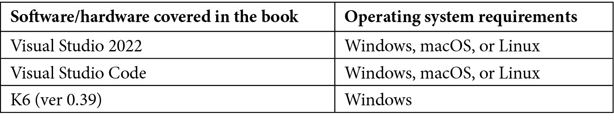

# 前言

代码的简化是每位开发者的梦想。最小化 API 是.NET 6 中的一个新特性，旨在简化代码。它们用于在 ASP.NET Core 中构建具有最小依赖关系的 API。最小化 API 通过使用更紧凑的代码语法来简化 API 开发。

使用最小化 API 的开发者将能够在某些情况下利用这种语法，以更少的代码和更少的文件维护来更快地工作。在这里，您将了解.NET 6 的主要新特性，并理解最小化 API 的基本主题，这些在.NET 5 和先前版本中是不可用的。您将了解如何启用 Swagger 进行 API 文档，以及如何处理 CORS 和应用程序错误。您将学习如何使用微软的新.NET 框架——依赖注入来更好地组织代码。最后，您将看到最小化 API 在.NET 6 中引入的性能和基准测试改进。

在本书结束时，您将能够利用最小化 API，并理解它们与经典 Web API 开发的相关性。

# 本书面向对象

本书面向希望构建.NET 和.NET Core API 并希望研究.NET 6 新特性的.NET 开发者。假设您对 C#、.NET、Visual Studio 和 REST API 有基本了解。

# 本书涵盖的内容

*第一章*，*最小化 API 简介*，向您介绍在.NET 6 中引入最小化 API 的动机。我们将解释.NET 6 的主要新特性以及.NET 团队正在进行的这项最新版本的工作。您将了解我们决定编写本书的原因。

*第二章*，*探索最小化 API 及其优势*，向您介绍最小化 API 与.NET 5 及所有先前版本的基本区别方式。我们将详细探讨使用 System.Text.JSON 进行路由和序列化。最后，我们将讨论一些与编写第一个 REST API 相关的概念。

*第三章*，*使用最小化 API*，向您介绍最小化 API 与.NET 5 及所有先前版本的高级区别方式。我们将详细探讨如何启用 Swagger 进行 API 文档。我们将看到如何启用 CORS 以及如何处理应用程序错误。

*第四章*，*在最小化 API 项目中使用依赖注入*，向您介绍依赖注入，并介绍如何与最小化 API 一起使用它。

*第五章*，*使用日志记录来识别错误*，向您介绍.NET 提供的日志工具。记录器是开发者用来调试应用程序或理解其生产中失败原因的工具之一。日志库已经内置到 ASP.NET 中，并启用了设计中的几个功能。

*第六章*，*探索验证和映射*，将教会您如何验证 API 接收到的数据，以及如何返回任何错误或消息。一旦数据得到验证，它就可以映射到一个模型，然后用于处理请求。

*第七章*，*与数据访问层的集成*，帮助您了解在最小 API 中访问和使用数据的最佳实践。

*第八章*，*添加身份验证和授权*，探讨了如何通过利用我们自己的数据库或像 Azure Active Directory 这样的云服务来编写身份验证和授权系统。

*第九章*，*利用全球化和本地化*，展示了如何在最小 API 项目中利用翻译系统，并以客户端相同的语言提供错误。

*第十章*，*评估和基准测试最小 API 的性能*，展示了.NET 6 的改进以及将随着最小 API 引入的特性。

# 为了充分利用本书

您需要在计算机上安装 Visual Studio 2022 和 ASP.NET 以及 Web 开发工作负载，或者安装 Visual Studio Code 和 K6。

所有代码示例都已使用 Windows 操作系统上的 Visual Studio 2022 和 Visual Studio Code 进行测试。



**如果您使用的是本书的数字版，我们建议您亲自输入代码或从书的 GitHub 仓库（下一节中有一个链接）获取代码。这样做将帮助您避免与代码复制粘贴相关的任何潜在错误。**

要完全理解本书，需要具备 Microsoft 网络技术的基本开发技能。

# 下载示例代码文件

您可以从 GitHub 下载本书的示例代码文件：[`github.com/PacktPublishing/Minimal-APIs-in-ASP.NET-Core-6`](https://github.com/PacktPublishing/Minimal-APIs-in-ASP.NET-Core-6)。如果代码有更新，它将在 GitHub 仓库中更新。

我们在[`github.com/PacktPublishing/`](https://github.com/PacktPublishing/)的丰富图书和视频目录中也有其他代码包可供选择。查看它们吧！

# 下载彩色图像

我们还提供了一份 PDF 文件，其中包含本书中使用的截图和图表的彩色图像。

您可以在此处下载：[`packt.link/GmUNL`](https://packt.link/GmUNL)

# 使用的约定

本书使用了多种文本约定。

`文本中的代码`：表示文本中的代码单词、数据库表名、文件夹名、文件名、文件扩展名、路径名、虚拟 URL、用户输入和 Twitter 昵称。以下是一个示例：“在最小 API 中，我们使用`WebApplication`对象的`Map*`方法定义路由模式。”

代码块设置如下：

```cs
app.MapGet("/hello-get", () => "[GET] Hello World!"); 
app.MapPost("/hello-post", () => "[POST] Hello World!"); 
app.MapPut("/hello-put", () => "[PUT] Hello World!"); 
app.MapDelete("/hello-delete", () => "[DELETE] Hello World!");
```

当我们希望引起您对代码块中特定部分的注意时，相关的行或项目将以粗体显示：

```cs
if (app.Environment.IsDevelopment()) 
{
app.UseSwagger(); 
    app.UseSwaggerUI(); 
}
```

任何命令行输入或输出都应如下编写：

```cs
dotnet new webapi -minimal -o Chapter01
```

**粗体**：表示新术语、重要词汇或您在屏幕上看到的词汇。例如，菜单或对话框中的词汇以**粗体**显示。以下是一个示例：“打开 Visual Studio 2022，从主屏幕点击**创建新项目**。”

小贴士或重要注意事项

看起来像这样。

# 联系我们

我们始终欢迎读者的反馈。

**一般反馈**：如果您对本书的任何方面有疑问，请通过电子邮件发送至 customercare@packtpub.com，并在邮件主题中提及书名。

**勘误**：尽管我们已经尽最大努力确保内容的准确性，但错误仍然可能发生。如果您在本书中发现错误，我们将非常感激您向我们报告。请访问[www.packtpub.com/support/errata](http://www.packtpub.com/support/errata)并填写表格。

**盗版**：如果您在互联网上发现我们作品的任何非法副本，我们将非常感激您提供位置地址或网站名称。请通过 copyright@packt.com 与我们联系，并提供材料的链接。

**如果您想成为一名作者**：如果您在某个领域有专业知识，并且对撰写或为本书做出贡献感兴趣，请访问[authors.packtpub.com](http://authors.packtpub.com)。

# 分享您的想法

一旦您阅读了《精通 ASP.NET Core 中的最小 API》，我们非常乐意听到您的想法！请[点击此处直接访问此书的亚马逊评论页面](https://packt.link/r/1803237821)并分享您的反馈。

您的评论对我们和科技社区都很重要，并将帮助我们确保我们提供高质量的内容。

前言

前言

# 第一部分：简介

在本书的第一部分，我们希望向您介绍本书的背景。我们将解释最小 API 的基础知识以及它们是如何工作的。我们希望一块一块地添加所需的知识，以便充分利用最小 API 所能赋予我们的所有功能。

我们在本部分将涵盖以下章节：

+   *第一章*，*最小 API 简介*

+   *第二章*，*探索最小 API 及其优势*

+   *第三章*，*使用最小 API*
