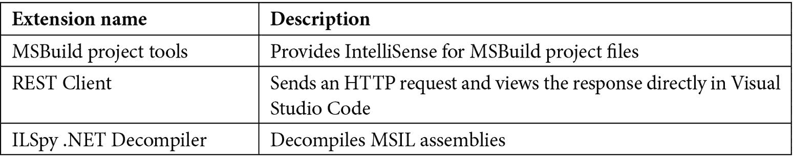
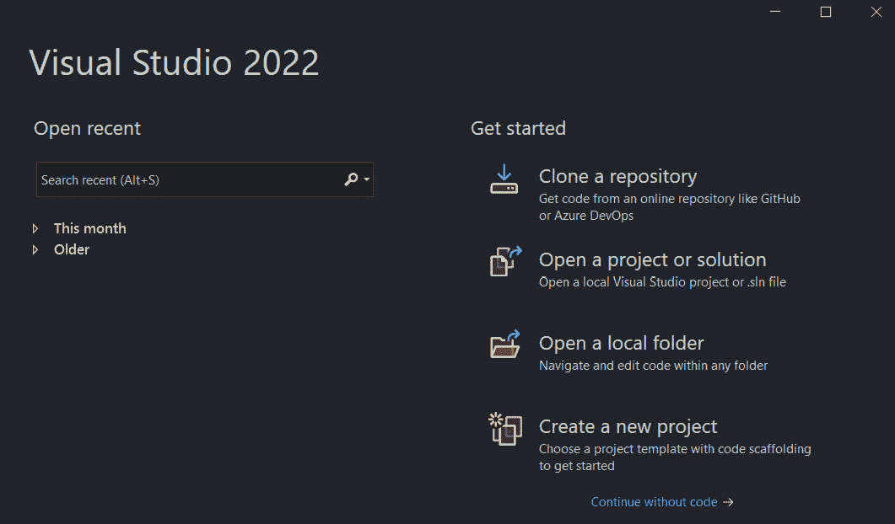
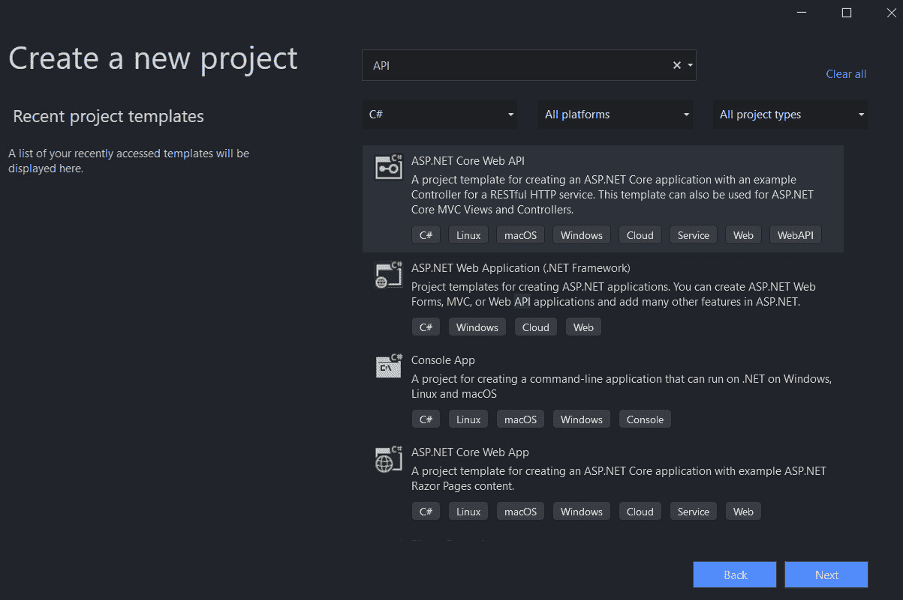
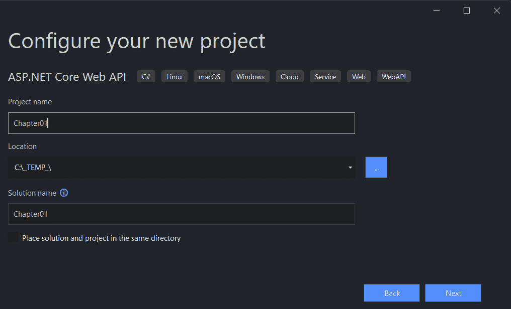
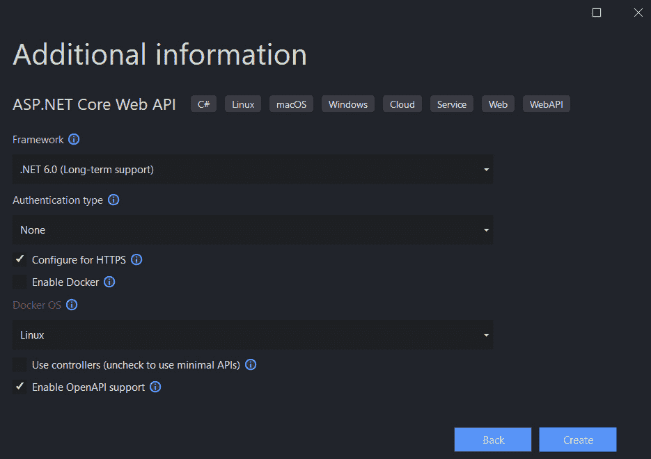

# 第一章：最小 API 简介

在本书的这一章中，我们将介绍一些与.NET 6.0 中的最小 API 相关的基本主题，展示如何设置.NET 6 的开发环境，以及更具体地，如何使用 ASP.NET Core 开发最小 API。

我们将首先简要介绍最小 API 的历史。然后，我们将使用 Visual Studio 2022 和 Visual Code Studio 创建一个新的最小 API 项目。最后，我们将查看我们的项目结构。

到本章结束时，你将能够创建一个新的最小 API 项目，并开始使用这个新的 REST API 模板进行工作。

在本章中，我们将涵盖以下主题：

+   微软 Web API 的简要历史

+   创建一个新的最小 API 项目

+   查看项目结构

# 技术要求

要使用 ASP.NET Core 6 最小 API，首先需要在你的开发环境中安装.NET 6。

如果你还没有安装它，我们现在就安装：

1.  导航到以下链接：[`dotnet.microsoft.com`](https://dotnet.microsoft.com)。

1.  点击**下载**按钮。

1.  默认情况下，浏览器会为你选择正确的操作系统，但如果不是，请在页面顶部选择你的操作系统。

1.  下载.NET 6.0 SDK 的 LTS 版本。

1.  启动安装程序。

1.  重新启动机器（这不是强制性的）。

你可以使用以下命令在终端中查看你的开发机器上安装的 SDK：

```cs
dotnet –list-sdks
```

在开始编码之前，你需要一个代码编辑器或一个**集成开发环境**（**IDE**）。你可以从以下列表中选择你喜欢的：

+   Visual Studio Code for Windows、Mac 或 Linux

+   Visual Studio 2022

+   Visual Studio 2022 for Mac

在过去几年中，Visual Studio Code 不仅在开发者社区中，而且在微软社区中都非常受欢迎。即使你使用 Visual Studio 2022 进行日常工作，我们也建议下载并安装 Visual Studio Code 并尝试使用它。

让我们下载并安装 Visual Studio Code 和一些扩展：

1.  导航到[`code.visualstudio.com`](https://code.visualstudio.com)。

1.  下载**稳定版**或**内部预览版**。

1.  启动安装程序。

1.  启动 Visual Studio Code。

1.  点击**扩展**图标。

你将在列表顶部看到 C#扩展。

1.  点击**安装**按钮并等待。

你可以安装其他推荐的用于 C#和 ASP.NET Core 开发的扩展。如果你想安装它们，请查看以下表格中的我们的建议：



此外，如果你想使用最广泛使用的.NET 开发者的 IDE，你可以下载并安装 Visual Studio 2022。

如果您没有许可证，请检查您是否可以使用社区版。获取许可证有一些限制，但如果您是学生、拥有开源项目或想作为个人使用，则可以使用它。以下是下载和安装 Visual Studio 2022 的步骤：

1.  导航到[`visualstudio.microsoft.com/downloads/`](https://visualstudio.microsoft.com/downloads/)。

1.  选择 Visual Studio 2022 版本 17.0 或更高版本并下载。

1.  启动安装程序。

1.  在**工作负载**选项卡上，选择以下内容：

    +   **ASP.NET 和 Web 开发**

    +   **Azure 开发**

1.  在**单独组件**选项卡上，选择以下内容：

    +   **Git for Windows**

本章中的所有代码示例都可以在本书的 GitHub 存储库中找到，网址为[`github.com/PacktPublishing/Minimal-APIs-in-ASP.NET-Core-6/tree/main/Chapter01`](https://github.com/PacktPublishing/Minimal-APIs-in-ASP.NET-Core-6/tree/main/Chapter01)。

现在，您有一个环境，可以跟随并尝试本书中使用的代码。

# 微软 Web API 简史

几年前，在 2007 年，随着 ASP.NET MVC 的引入，.NET Web 应用程序经历了一次演变。从那时起，.NET 为在其他语言中常见的模型-视图-控制器模式提供了原生支持。

五年后，在 2012 年，RESTful API 成为了互联网上的新趋势，.NET 通过一种名为 ASP.NET Web API 的新方法来响应这一趋势，这种方法比**Windows Communication Foundation**（**WCF**）更容易开发面向 Web 的服务。后来，在 ASP.NET Core 中，这些框架在 ASP.NET Core MVC 的名称下统一：一个用于开发 Web 应用程序和 API 的单个框架。

在 ASP.NET Core MVC 应用程序中，控制器负责接受输入、协调操作，并在最后返回响应。开发者可以通过过滤器、绑定、验证等功能扩展整个管道。这是一个功能齐全的框架，用于构建现代 Web 应用程序。

但在现实世界中，也存在一些场景和用例，您不需要 MVC 框架的所有功能，或者您必须考虑性能限制。ASP.NET Core 实现了很多中间件，您可以随意从您的应用程序中删除或添加，但在这个场景中，您需要自己实现许多常见功能。

最后，ASP.NET Core 6.0 通过最小 API 填补了这些空白。

现在我们已经概述了最小 API 的简史，接下来我们将开始创建一个新的最小 API 项目。

# 创建一个新的最小 API 项目

让我们从我们的第一个项目开始，尝试分析在编写 RESTful API 时的新模板。

在本节中，我们将创建我们的第一个最小 API 项目。我们将首先使用 Visual Studio 2022，然后我们将展示您也可以使用 Visual Studio Code 和 .NET CLI 创建项目。

## 使用 Visual Studio 2022 创建项目

按照以下步骤在 Visual Studio 2022 中创建新项目：

1.  打开 Visual Studio 2022 并在主屏幕上，点击 **创建新项目**：



图 1.1 – Visual Studio 2022 启动屏幕

1.  在下一屏幕上，在窗口顶部的文本框中输入 `API` 并选择名为 **ASP.NET Core Web API** 的模板：



图 1.2 – 创建新项目屏幕

1.  接下来，在 **配置新项目** 屏幕上，为新项目输入名称并选择新解决方案的根文件夹：

图 1.3 – 配置新项目屏幕

在此示例中，我们将使用名称 `Chapter01`，但您可以选择任何您喜欢的名称。

1.  在以下 **其他信息** 屏幕上，请确保从 **框架** 下拉菜单中选择 **.NET 6.0（长期支持）**。最重要的是，取消选中 **使用控制器（取消选中以使用最小 API）** 选项。



图 1.4 – 其他信息屏幕

1.  点击 **创建**，几秒钟后，您将看到您的新最小 API 项目代码。

现在我们将展示如何使用 Visual Studio Code 和 .NET CLI 创建相同的项目。

## 使用 Visual Studio Code 创建项目

使用 Visual Studio Code 创建项目比使用 Visual Studio 2022 更容易、更快，因为您不需要使用 UI 或向导，而是只需使用终端和 .NET CLI。

您不需要安装任何新东西，因为 .NET CLI 已包含在 .NET 6 安装中（如之前的 .NET SDK 版本）。按照以下步骤使用 Visual Studio Code 创建项目：

1.  打开您的控制台、shell 或 Bash 终端，并切换到您的当前工作目录。

1.  使用以下命令创建新的 Web API 应用程序：

    ```cs
    dotnet new webapi -minimal -o Chapter01
    ```

如您所见，我们在前面的命令中插入了 `-minimal` 参数，以使用最小 API 项目模板而不是带有控制器的 ASP.NET Core 模板。

1.  现在请使用以下命令在 Visual Studio Code 中打开新项目：

    ```cs
    cd Chapter01
    code.
    ```

现在我们已经知道了如何创建新的最小 API 项目，我们将快速查看这个新模板的结构。

# 查看项目结构

无论您使用的是 Visual Studio 还是 Visual Studio Code，您都应该在 `Program.cs` 文件中看到以下代码：

```cs
var builder = WebApplication.CreateBuilder(args);
// Add services to the container.
// Learn more about configuring Swagger/OpenAPI at https://aka.ms/aspnetcore/swashbuckle
builder.Services.AddEndpointsApiExplorer();
builder.Services.AddSwaggerGen();
var app = builder.Build();
// Configure the HTTP request pipeline.
if (app.Environment.IsDevelopment())
{
    app.UseSwagger();
    app.UseSwaggerUI();
}
app.UseHttpsRedirection();
var summaries = new[]
{
    "Freezing", "Bracing", "Chilly", "Cool", "Mild", "Warm", 
    "Balmy", "Hot", "Sweltering", "Scorching"
};
app.MapGet("/weatherforecast", () =>
{
  var forecast = Enumerable.Range(1, 5).Select(index =>
      new WeatherForecast
      (
          DateTime.Now.AddDays(index),
          Random.Shared.Next(-20, 55),
          summaries[Random.Shared.Next(summaries.Length)]
      ))
      .ToArray();
      return forecast;
})
.WithName("GetWeatherForecast");
app.Run();
internal record WeatherForecast(DateTime Date, int TemperatureC, string? Summary)
{
    public int TemperatureF => 32 + (int)(TemperatureC / 
    0.5556);
}
```

首先，使用最小 API 方法，所有代码都将位于 `Program.cs` 文件中。如果你是一位资深的 .NET 开发者，理解前面的代码很容易，你会发现它与使用控制器方法时使用的一些东西很相似。

最终，它只是另一种编写 API 的方式，但基于 ASP.NET Core。

然而，如果你是 ASP.NET 的新手，这种单文件方法很容易理解。它很容易理解如何在模板中扩展代码并添加更多功能到这个 API 中。

不要忘记，最小意味着它包含构建 HTTP API 所需的最小组件集，但这并不意味着你将要构建的应用程序将是简单的。它将需要一个良好的设计，就像任何其他 .NET 应用程序一样。

最后一点，最小 API 方法不是 MVC 方法的替代品。它只是另一种编写相同内容的方式。

让我们回到代码。

即使是最小 API 的模板也使用了 .NET 6 网络应用程序的新方法：顶级语句。

这意味着项目只有一个 `Program.cs` 文件，而不是使用两个文件来配置应用程序。

如果你不喜欢这种编码风格，你可以将你的应用程序转换为 ASP.NET Core 3.x/5. 的旧模板。这种方法在 .NET 中仍然有效。

重要提示

我们可以在 [`docs.microsoft.com/dotnet/core/tutorials/top-level-templates`](https://docs.microsoft.com/dotnet/core/tutorials/top-level-templates) 找到更多关于 `.NET 6 顶级语句` 模板的信息。

默认情况下，新模板包括对 OpenAPI 规范的支持，特别是 Swagger。

假设我们的端点文档和游乐场已经设置好，无需任何额外配置即可直接使用。

你可以在以下两行代码中看到 Swagger 的默认配置：

```cs
builder.Services.AddEndpointsApiExplorer();
builder.Services.AddSwaggerGen();
```

很常见，你不想将 Swagger 和所有端点暴露给生产或预发布环境。默认模板仅通过以下代码在开发环境中启用 Swagger：

```cs
if (app.Environment.IsDevelopment())
{
         app.UseSwagger();
         app.UseSwaggerUI();
}
```

如果应用程序正在开发环境中运行，你必须包括 Swagger 文档，否则则不需要。

注意

我们将在 *第三章* *使用最小 API* 中详细讨论 Swagger。

在模板的最后几行代码中，我们为 .NET 6 网络应用程序引入了另一个通用概念：环境。

通常情况下，当我们开发一个专业应用程序时，应用程序会经历许多阶段，包括开发、测试，最终发布给最终用户。

按照惯例，这些阶段被规范为开发、预发布和发布。作为开发者，我们可能希望根据当前环境改变应用程序的行为。

有几种方法可以访问这些信息，但在现代 .NET 6 应用程序中检索实际环境的最典型方法是使用环境变量。您可以直接从 `Program.cs` 文件中的 `app` 变量访问环境变量。

以下代码块展示了如何直接从应用程序的启动点检索所有关于环境的信息：

```cs
if (app.Environment.IsDevelopment())
{
           // your code here
}
if (app.Environment.IsStaging())
{
           // your code here
}
if (app.Environment.IsProduction())
{
           // your code here
}
```

在许多情况下，您可以定义额外的环境，并且您可以使用以下代码检查您的自定义环境：

```cs
if (app.Environment.IsEnvironment("TestEnvironment"))
{
           // your code here
}
```

在最小 API 中定义路由和处理程序时，我们使用 `MapGet`、`MapPost`、`MapPut` 和 `MapDelete` 方法。如果您习惯于使用 HTTP 动词，您会注意到动词 `Patch` 不存在，但您可以使用 `MapMethods` 定义任何一组动词。

例如，如果您想创建一个新的端点将一些数据发送到 API，您可以编写以下代码：

```cs
app.MapPost("/weatherforecast", async (WeatherForecast 
    model, IWeatherService repo) =>
{
         // ...
});
```

如您在前面简短的代码中看到的，使用新的最小 API 模板添加新的端点非常容易。

以前这更加困难，尤其是对于一个新开发者来说，要编码一个新的端点并使用绑定参数以及依赖注入，这更加困难。

重要注意事项

我们将在 *第二章* *探索最小 API 及其优势* 和 *第四章* *最小 API 项目中的依赖注入* 中详细讨论路由和依赖注入。

# 摘要

在本章中，我们首先简要介绍了最小 API 的历史。接下来，我们看到了如何使用 Visual Studio 2022 以及 Visual Studio Code 和 .NET CLI 创建项目。然后，我们检查了新模板的结构，如何访问不同的环境，以及如何开始与 REST 端点交互。

在下一章中，我们将看到如何绑定参数、新的路由配置以及如何自定义响应。
