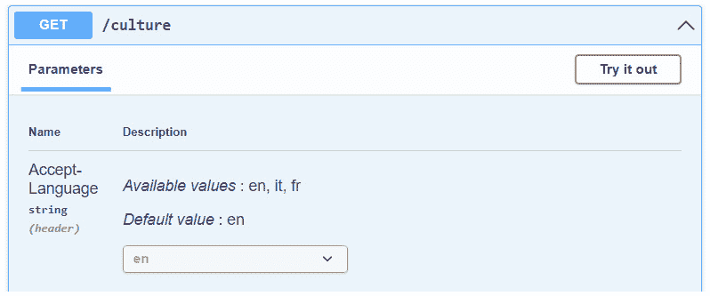
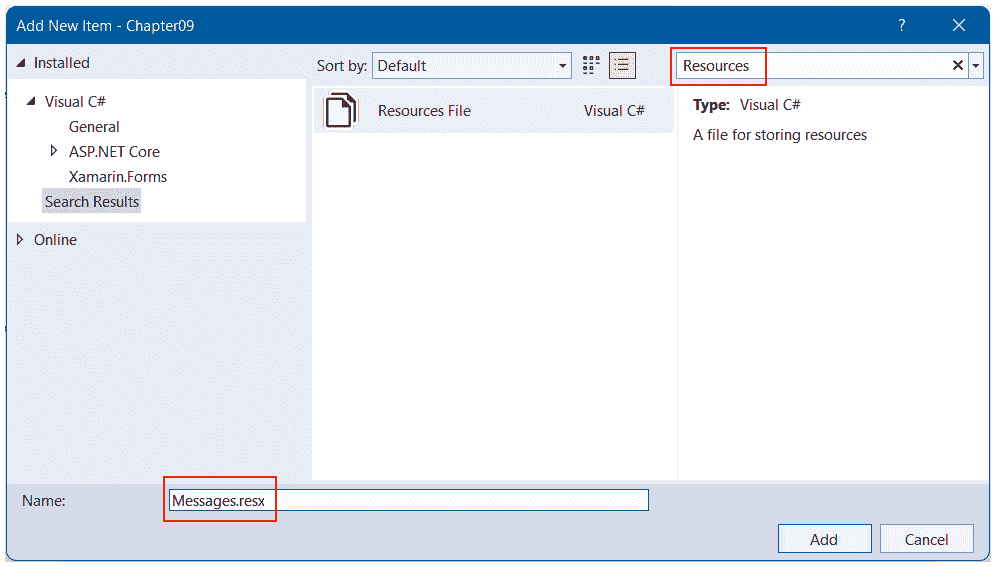
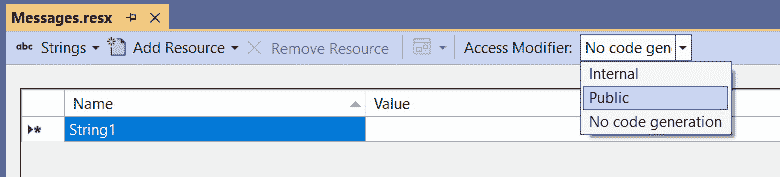
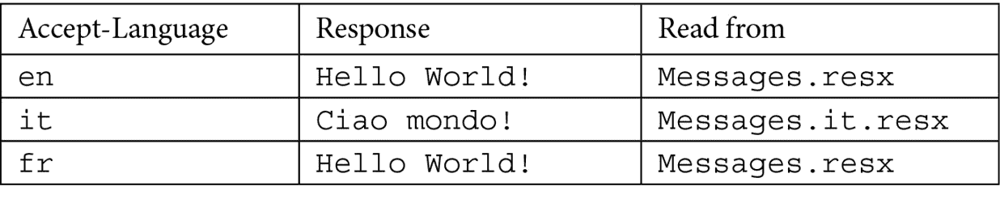
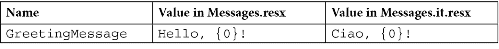
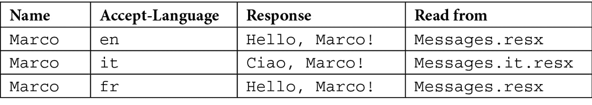
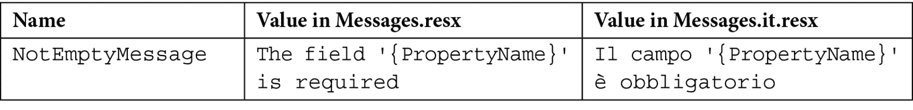

# 第九章：利用全球化和本地化

在开发应用程序时，考虑多语言支持非常重要；多语言应用程序可以扩大受众范围。这对于 Web API 也是如此：端点返回的消息（例如，验证错误）应该本地化，并且服务应该能够处理不同的文化并处理时区。在本章中，我们将讨论 **全球化** 和 **本地化**，并解释最小 API 中可用于处理这些概念的功能。提供的信息和示例将指导我们在服务中添加多语言支持并正确处理所有相关行为，以便我们能够开发全球应用程序。

在本章中，我们将涵盖以下主题：

+   介绍全球化和本地化

+   本地化最小 API 应用

+   使用资源文件

+   在验证框架中集成本地化

+   向全球化的最小 API 添加 UTC 支持

# 技术要求

要遵循本章中的描述，你需要创建一个 ASP.NET Core 6.0 Web API 应用程序。有关如何操作的说明，请参阅 *第一章* *最小 API 简介* 中的 *技术要求* 部分。

如果你正在使用控制台、shell 或 Bash 终端创建 API，请记住将你的工作目录更改为当前章节号（`Chapter09`）。

本章中的所有代码示例都可以在本书的 GitHub 仓库中找到，网址为 [`github.com/PacktPublishing/Minimal-APIs-in-ASP.NET-Core-6/tree/main/Chapter09`](https://github.com/PacktPublishing/Minimal-APIs-in-ASP.NET-Core-6/tree/main/Chapter09)。

# 介绍全球化和本地化

当考虑国际化时，我们必须处理全球化和本地化这两个看似指代相同概念但实际上涉及不同领域的术语。全球化是设计能够管理和支持不同文化的应用程序的任务。本地化是将应用程序适应特定文化的过程，例如，通过为每个将得到支持的文化提供翻译资源。

注意

国际化、全球化和本地化这些术语通常分别缩写为 *I18N*、*G11N* 和 *L10N*。

与我们在前几章中介绍的所有其他功能一样，全球化和本地化可以通过 ASP.NET Core 提供的相应中间件和服务来处理，并在最小 API 和基于控制器的项目中以相同的方式工作。

您可以在官方文档中找到关于全球化和本地化的详细介绍，这些文档分别可在[`docs.microsoft.com/dotnet/core/extensions/globalization`](https://docs.microsoft.com/dotnet/core/extensions/globalization)和[`docs.microsoft.com/dotnet/core/extensions/localization`](https://docs.microsoft.com/dotnet/core/extensions/localization)找到。在本章的其余部分，我们将重点介绍如何在最小 API 项目中添加对这些功能的支持；这样，我们将介绍一些重要概念，并解释如何在 ASP.NET Core 中利用全球化和本地化。

# 本地化最小 API 应用程序

要在最小化 API 应用程序中启用本地化，让我们按照以下步骤进行：

1.  使应用程序可本地化的第一步是设置相应的选项来指定支持的文化，如下所示：

    ```cs
    var builder = WebApplication.CreateBuilder(args);
    //...
    var supportedCultures = new CultureInfo[] { new("en"), new("it"), new("fr") };
    builder.Services.Configure<RequestLocalizationOptions>(options =>
    {
       options.SupportedCultures = supportedCultures;
       options.SupportedUICultures = supportedCultures;
       options.DefaultRequestCulture = new 
       RequestCulture(supportedCultures.First());
    });
    ```

在我们的示例中，我们想要支持三种文化——英语、意大利语和法语——因此，我们创建了一个`CultureInfo`对象的数组。

我们正在定义中立文化，即具有语言但不与国家或地区关联的文化。我们也可以使用特定的文化，如`en-US`或`en-GB`，来表示特定地区的文化：例如，`en-US`将指代在美国普遍存在的英语文化，而`en-GB`将指代在英国普遍存在的英语文化。这种差异很重要，因为根据场景的不同，我们可能需要使用特定国家的信息来正确实现本地化。例如，如果我们想显示日期，我们必须知道美国的日期格式是`M/d/yyyy`，而英国的日期格式是`dd/MM/yyyy`。因此，在这种情况下，与特定文化一起工作变得至关重要。如果我们需要支持跨文化之间的语言差异，我们也会使用特定的文化。例如，一个特定的单词可能因国家而异（例如，美国的*color*与英国的*colour*）。话虽如此，对于我们的最小 API 场景，使用中立文化就足够了。

1.  接下来，我们配置`RequestLocalizationOptions`，设置文化并指定在没有提供文化信息时使用的默认文化。我们指定支持的文化和支持的 UI 文化：

    +   支持的文化控制着文化相关函数的输出，例如日期、时间和数字格式。

    +   支持的 UI 文化用于选择从`.resx`文件中搜索的翻译字符串。我们将在本章后面讨论`.resx`文件。

在典型应用程序中，文化和 UI 文化设置为相同的值，但当然，如果需要，我们可以使用不同的选项。

1.  现在我们已经配置了我们的服务以支持全球化，我们需要将本地化中间件添加到 ASP.NET Core 管道中，以便它能够自动设置请求的文化。让我们使用以下代码来完成：

    ```cs
    var app = builder.Build();
    //...
    app.UseRequestLocalization();
    //...
    app.Run();
    ```

在前面的代码中，通过 `UseRequestLocalization()`，我们向 ASP.NET Core 管道添加了 `RequestLocalizationMiddleware` 以设置每个请求的当前文化。这项任务是通过一个可以读取有关文化信息的 `RequestCultureProvider` 列表来执行的。默认提供者包括以下内容：

+   `QueryStringRequestCultureProvider`: 搜索 `culture` 和 `ui-culture` 查询字符串参数

+   `CookieRequestCultureProvider`: 使用 ASP.NET Core 的 cookie

+   `AcceptLanguageHeaderRequestProvider`: 从 `Accept-Language` HTTP 头读取请求的文化

对于每个请求，系统将按照此确切顺序尝试使用这些提供者，直到找到第一个可以确定文化的提供者。如果无法设置文化，则将使用 `RequestLocalizationOptions` 的 `DefaultRequestCulture` 属性中指定的文化。

如果需要，也可以更改请求文化提供者的顺序，甚至可以定义一个自定义提供者以实现我们自己的逻辑来确定文化。有关此主题的更多信息，请参阅 [`docs.microsoft.com/aspnet/core/fundamentals/localization#use-a-custom-provider`](https://docs.microsoft.com/aspnet/core/fundamentals/localization#use-a-custom-provider)。

重要提示

本地化中间件必须插入到任何可能使用请求文化的其他中间件之前。

在 Web API 的情况下，无论是使用基于控制器的 API 还是最小 API，我们通常通过 `Accept-Language` HTTP 头设置请求文化。在下一节中，我们将看到如何扩展 Swagger 以添加在尝试调用方法时添加此头部的功能。

## 将全球化支持添加到 Swagger

我们希望 Swagger 能够提供一种方式来指定每个请求的 `Accept-Language` HTTP 头，以便我们可以测试我们的全球化端点。从技术上讲，这意味着向 Swagger 添加一个 **操作过滤器**，该过滤器能够自动插入语言头，使用以下代码：

```cs
public class AcceptLanguageHeaderOperationFilter : IOperationFilter
{
     private readonly List<IOpenApiAny>? 
     supportedLanguages;
     public AcceptLanguageHeaderOperationFilter 
     (IOptions<RequestLocalizationOptions> 
     requestLocalizationOptions)
     {
           supportedLanguages = 
           requestLocalizationOptions.Value.
           SupportedCultures?.Select(c => 
           newOpenApiString(c.TwoLetterISOLanguageName)).
           Cast<IOpenApiAny>().           ToList();
     }
     public void Apply(OpenApiOperation operation, 
     OperationFilterContext context)
     {
           if (supportedLanguages?.Any() ?? false)
           {
                 operation.Parameters ??= new 
                 List<OpenApiParameter>();
                 operation.Parameters.Add(new 
                 OpenApiParameter
                 {
                       Name = HeaderNames.AcceptLanguage,
                       In = ParameterLocation.Header,
                       Required = false,
                       Schema = new OpenApiSchema
                       {
                             Type = "string",
                             Enum = supportedLanguages,
                             Default = supportedLanguages.
                             First()
                       }
                 });
           }
     }
}
```

在前面的代码中，`AcceptLanguageHeaderOperationFilter` 通过依赖注入获取我们在启动时定义的 `RequestLocalizationOptions` 对象，并从中提取 Swagger 所期望的格式化的支持语言。然后，在 `Apply()` 方法中，我们添加一个新的 `OpenApiParameter`，它对应于 `Accept-Language` 头。特别是，通过 `Schema.Enum` 属性，我们使用在构造函数中提取的值提供支持语言列表。此方法对每个操作（即每个端点）都会被调用，这意味着参数将自动添加到每个端点中。

现在，我们需要将新的过滤器添加到 Swagger 中：

```cs
var builder = WebApplication.CreateBuilder(args);
//...
builder.Services.AddSwaggerGen(options =>
{
     options.OperationFilter<AcceptLanguageHeaderOperation
     Filter>();
});
```

正如我们在前面的代码中所做的那样，对于每个操作，Swagger 都会执行过滤器，该过滤器会添加一个参数来指定请求的语言。

因此，让我们假设我们有以下端点：

```cs
app.MapGet("/culture", () => Thread.CurrentThread.CurrentCulture.DisplayName);
```

在前面的处理程序中，我们只是返回线程的文化。这种方法不接受任何参数；然而，在添加前面的过滤器后，Swagger UI 将显示以下内容：



图 9.1 – 添加到 Swagger 的 Accept-Language 头

操作过滤器已向端点添加了一个新参数，允许我们从下拉列表中选择语言。我们可以点击**尝试**按钮从列表中选择一个值，然后点击**执行**来调用端点：


图 9.2 – 带有 Accept-Language HTTP 头的执行结果

这是选择`it`作为语言请求的结果：Swagger 已添加`Accept-Language` HTTP 头，该头随后被 ASP.NET Core 用于设置当前文化。然后，在最后，我们在路由处理程序中获取并返回文化显示名称。

这个例子向我们展示了我们已经正确地将全球化支持添加到我们的最小 API 中。在下一节中，我们将进一步探讨并处理本地化，首先根据相应的语言向调用者提供翻译过的资源。

# 使用资源文件

我们的最小 API 现在支持全球化，因此可以根据请求切换文化。这意味着我们可以向调用者提供本地化消息，例如，在通信验证错误时。这个功能基于所谓的`.resx`文件，这是一种特定的 XML 文件，包含表示必须本地化的消息的键值字符串对。

注意

这些资源文件与.NET 早期版本以来完全相同。

## 创建和使用资源文件

使用资源文件，我们可以轻松地将字符串与代码分离，并按文化分组。通常，资源文件放在名为`Resources`的文件夹中。要使用 Visual Studio 创建此类文件，请按照以下步骤进行：

重要提示

不幸的是，Visual Studio Code 不支持处理`.resx`文件。有关此主题的更多信息，请参阅[`github.com/dotnet/AspNetCore.Docs/issues/2501`](https://github.com/dotnet/AspNetCore.Docs/issues/2501)。

1.  在**解决方案资源管理器**中右键单击文件夹，然后选择**添加** | **新项**。

1.  在`Resources`中，选择相应的模板，并为文件命名，例如，`Messages.resx`：



图 9.3 – 将资源文件添加到项目中

新文件将立即在 Visual Studio 编辑器中打开。

1.  在新文件中要做的第一件事是从 **访问修饰符** 选项中选择 **内部** 或 **公共**（根据我们想要达到的代码可见性），这样 Visual Studio 就会创建一个 C# 文件，该文件将创建暴露属性以访问资源：



图 9.4 – 修改资源文件访问修饰符

一旦我们更改此值，Visual Studio 将向项目中添加一个 `Messages.Designer.cs` 文件，并自动创建与我们在资源文件中插入的字符串相对应的属性。

资源文件必须遵循精确的命名约定。包含默认文化消息的文件可以具有任何名称（例如，在我们的例子中为 `Messages.resx`），但提供相应翻译的其他 `.resx` 文件必须具有相同的名称，并指定它们所引用的文化（中性或特定）。因此，我们有 `Messages.resx`，它将存储默认（英语）消息。

1.  由于我们还想将我们的消息本地化为意大利语，我们需要创建另一个名为 `Messages.it.resx` 的文件。

注意

我们故意没有为法语文化创建资源文件，这样我们就可以看到 APS.NET Core 在实际中是如何查找本地化消息的。

1.  现在，我们可以开始对资源文件进行实验。让我们打开 `Messages.resx` 文件，并设置 `HelloWorld` 和 `Hello World!`。

以这种方式，Visual Studio 将在 `Messages` 自动生成的类中添加一个静态 `HelloWorld` 属性，允许我们根据当前文化访问值。

1.  为了演示这种行为，也打开 `Messages.it.resx` 文件，并添加一个具有相同 `HelloWorld` 的项，但现在设置为 `Ciao mondo!`。

1.  最后，我们可以添加一个新的端点来展示资源文件的使用：

    ```cs
    // using Chapter09.Resources;
    app.MapGet("/helloworld", () => Messages.HelloWorld);
    ```

在前面的路由处理程序中，我们简单地访问了静态 `Mesasges.HelloWorld` 属性，正如之前讨论的那样，在编辑 `Messages.resx` 文件时，该属性已被自动创建。

如果我们现在运行最小化 API 并尝试执行此端点，我们将根据在 Swagger 中选择的请求语言获得以下响应：



表 9.1 – 根据请求语言生成的响应

当访问像 `HelloWorld` 这样的属性时，自动生成的 `Messages` 类内部使用 `ResourceManager` 来查找相应的本地化字符串。首先，它会寻找一个名称包含请求文化的资源文件。如果找不到，它将回退到该文化的父文化。这意味着，如果请求的文化是特定的，`ResourceManager` 将搜索中性文化。如果仍然找不到资源文件，则使用默认的文件。

在我们的情况下，使用 Swagger，我们可以选择仅英语、意大利语或法语作为中性文化。但如果客户端发送其他值会怎样？我们可以有如下情况：

+   请求文化是 `it-IT`：系统搜索 `Messages.it-IT.resx`，然后找到并使用 `Messages.it.resx`。

+   请求文化是 `fr-FR`：系统搜索 `Messages.fr-FR.resx`，然后搜索 `Messages.fr.resx`，并且（因为两者都不可用）最后使用默认的 `Messages.resx`。

+   请求文化是 `de`（德语）：因为这不是一个受支持的文化，所以默认请求文化将被自动选择，因此字符串将在 `Messages.resx` 文件中搜索。

注意

如果存在本地化资源文件，但它不包含指定的键，则将使用默认文件中的值。

## 使用资源文件格式化本地化消息

我们还可以使用资源文件来格式化本地化消息。例如，我们可以将以下字符串添加到项目的资源文件中：



表 9.2 – 一个自定义的本地化消息

现在，让我们定义这个端点：

```cs
// using Chapter09.Resources;
app.MapGet("/hello", (string name) =>
{
     var message = string.Format(Messages.GreetingMessage, 
     name);
     return message;
});
```

如前述代码示例所示，我们根据请求的文化从资源文件中获取一个字符串。但是，在这种情况下，消息包含一个占位符，因此我们可以使用它通过传递给路由处理器的名称来创建一个自定义的本地化消息。如果我们尝试执行端点，我们将得到如下结果：



表 9.3 – 基于请求语言的定制本地化消息的响应

能够创建在运行时使用不同值替换占位符的本地化消息，这对于创建真正可本地化的服务是一个关键点。

在一开始，我们提到在 Web API 中本地化的典型用例是在验证时需要提供本地化错误消息。在下一节中，我们将看到如何将此功能添加到我们的最小 API 中。

# 在验证框架中集成本地化

在 *第六章*，*探索验证和映射*中，我们讨论了如何将验证集成到最小 API 项目中。我们学习了如何使用 `MiniValidation` 库，而不是 `FluentValidation`，来验证我们的模型并向调用者提供验证消息。我们还提到 `FluentValidation` 已经为标准错误消息提供了翻译。

然而，使用这两个库，我们可以利用我们刚刚添加到项目中的本地化支持来支持本地化和自定义验证消息。

## 使用 MiniValidation 本地化验证消息

使用 `MiniValidation` 库，我们可以使用基于 **数据注释** 的验证与最小 API。有关如何将此库添加到项目的说明，请参阅 *第六章*，*探索验证和映射*。

然后，重新创建相同的 `Person` 类：

```cs
public class Person
{
     [Required]
     [MaxLength(30)]
     public string FirstName { get; set; }
     [Required]
     [MaxLength(30)]
     public string LastName { get; set; }
     [EmailAddress]
     [StringLength(100, MinimumLength = 6)]
     public string Email { get; set; }
}
```

每个验证属性都允许我们指定一个错误消息，它可以是静态字符串或对资源文件的引用。让我们看看如何正确处理`Required`属性的本地化。在资源文件中添加以下值：


表 9.4 – 数据注释使用的本地化验证错误消息

我们希望当必需的验证规则失败时，返回与`FieldRequiredAnnotation`对应的本地化消息。此外，此消息包含一个占位符，因为我们希望将其用于每个必需字段，因此我们还需要属性名称的翻译。

使用这些资源，我们可以使用以下声明更新`Person`类：

```cs
public class Person
{
     [Display(Name = "FirstName", ResourceType = 
      typeof(Messages))]
     [Required(ErrorMessageResourceName = 
     "FieldRequiredAnnotation",
      ErrorMessageResourceType = typeof(Messages))]
     public string FirstName { get; set; }
     //...
}
```

每个验证属性，如`Required`（如本例中所示），都公开了允许我们指定要使用的资源名称和包含相应定义的类的类型的属性。请记住，名称是一个简单的字符串，编译时没有检查，所以如果我们写了一个错误值，我们只有在运行时才会得到错误。

接下来，我们可以使用`Display`属性来指定必须插入验证消息中的字段名称。

注意

您可以在 GitHub 仓库 https://github.com/PacktPublishing/Minimal-APIs-in-ASP.NET-Core-6/blob/main/Chapter09/Program.cs#L97 上找到带有本地化数据注释的`Person`类的完整声明。

现在，我们可以重新添加*第六章*，*探索验证和映射*中显示的验证代码。不同的是，现在验证消息将是本地化的：

```cs
app.MapPost("/people", (Person person) =>
{
     var isValid = MiniValidator.TryValidate(person, out 
     var errors);
     if (!isValid)
     {
           return Results.ValidationProblem(errors, title: 
           Messages.ValidationErrors);
     }
     return Results.NoContent();
});
```

在前面的代码中，`MiniValidator.TryValidate()`方法返回的`errors`字典中包含的消息将根据请求文化进行本地化，如前几节所述。我们还指定了`Results.ValidationProblem()`调用中的`title`参数，因为我们还想本地化这个值（否则，它将始终是默认的`One or more validation errors occurred`）。

如果我们更喜欢使用`FluentValidation`而不是数据注释，我们知道它默认支持标准错误消息的本地化*第六章*，*探索验证和映射*。然而，使用这个库，我们还可以提供我们的翻译。在下一节中，我们将讨论实现此解决方案的方法。

## 使用 FluentValidation 本地化验证消息

使用`FluentValidation`，我们可以完全解耦验证规则和我们的模型。如前所述，请参阅*第六章*，*探索验证和映射*，了解如何将此库添加到项目中以及如何配置它。

接下来，让我们重新创建`PersonValidator`类：

```cs
public class PersonValidator : AbstractValidator<Person>
{
     public PersonValidator()
     {
           RuleFor(p => p.FirstName).NotEmpty().
           MaximumLength(30);
           RuleFor(p => p.LastName).NotEmpty().
           MaximumLength(30);
           RuleFor(p => p.Email).EmailAddress().Length(6, 
           100);
     }
}
```

如果我们没有指定任何消息，将使用默认消息。让我们添加以下资源来自定义`NotEmpty`验证规则：



表 9.5 – FluentValidation 使用的本地化验证错误消息

注意，在这种情况下，我们还有一个占位符，它将被属性名称替换。然而，与数据注释不同，`FluentValidation`使用带有名称的占位符来更好地识别其含义。

现在，我们可以在验证器中添加这条消息，例如，对于`FirstName`属性：

```cs
RuleFor(p => p.FirstName).NotEmpty().
     WithMessage(Messages.NotEmptyMessage).
     WithName(Messages.FirstName);
```

我们使用`WithMessage()`来指定在之前的规则失败时必须使用的消息，之后我们添加`WithName()`调用以覆盖消息的`{PropertyName}`占位符所使用的默认属性名称。

注意

你可以在 GitHub 仓库中找到`PersonValidator`类的完整实现以及本地化消息，网址为 https://github.com/PacktPublishing/Minimal-APIs-in-ASP.NET-Core-6/blob/main/Chapter09/Program.cs#L129。

最后，我们可以在我们的端点中利用本地化的验证器，就像我们在*第六章*中做的那样，*探索验证和映射*：

```cs
app.MapPost("/people", async (Person person, IValidator<Person> validator) =>
{
     var validationResult = await validator.
     ValidateAsync(person);
     if (!validationResult.IsValid)
     {
           var errors = validationResult.ToDictionary();
           return Results.ValidationProblem(errors, title: 
           Messages.ValidationErrors);
     }
     return Results.NoContent();
});
```

与数据注释的情况一样，`validationResult`变量将包含本地化错误消息，我们使用`Results.ValidationProblem()`方法（再次，使用`title`属性的定义）将其返回给调用者。

小贴士

在我们的例子中，我们已经看到如何使用`WithMessage()`方法显式地为每个属性分配翻译。`FluentValidation`还提供了一种替换所有（或部分）其默认消息的方法。你可以在官方文档中找到更多信息，网址为[`docs.fluentvalidation.net/en/latest/localization.xhtml#default-messages`](https://docs.fluentvalidation.net/en/latest/localization.xhtml#default-messages)。

这就结束了我们使用资源文件进行本地化的概述。接下来，我们将讨论处理旨在全球使用的服务时的重要话题：正确处理不同的时区。

# 为全局化的最小 API 添加 UTC 支持

到目前为止，我们已经为我们的最小 API 添加了全球化和本地化支持，因为我们希望它能够被尽可能广泛的受众使用，无论文化如何。但是，如果我们考虑让全球受众能够访问，我们应该考虑与全球化相关的几个方面。全球化不仅涉及语言支持；还有一些重要的因素我们需要考虑，例如地理位置以及时区。

例如，我们可以让我们的最小 API 在意大利运行，意大利遵循中欧时间（CET）（GMT+1），而我们的客户可以使用全球范围内的浏览器来执行单页应用程序，而不是移动应用。我们还可以有一个包含我们数据的数据库服务器，这可能是另一个时区。此外，在某个时刻，可能需要为全球用户提供更好的支持，因此我们必须将我们的服务迁移到另一个位置，这可能具有新的时区。总之，我们的系统可以处理不同时区的数据，并且，潜在地，同一服务在其生命周期中可能需要切换时区。

在这种情况下，理想的解决方案是使用`DateTimeOffset`数据类型，它包含时区信息并且`JsonSerializer`完全支持，在序列化和反序列化过程中保留时区信息。如果我们总能使用它，我们就能自动解决与全球化相关的任何问题，因为将`DateTimeOffset`值转换为不同的时区是直接的。然而，有些情况下我们无法处理`DateTimeOffset`类型，例如：

+   当我们在一个依赖于`DateTime`的遗留系统上工作时，更新代码以使用`DateTimeOffset`不是一个选择，因为它需要太多的更改，并且与旧数据不兼容。

+   我们有一个数据库服务器，例如 MySQL，它没有直接存储`DateTimeOffset`的列类型，因此处理它需要额外的努力，例如使用两个单独的列，增加了领域的复杂性。

+   在某些情况下，我们可能对发送、接收和保存时区并不感兴趣——我们只想以“通用”的方式处理时间。

因此，在所有我们无法或不想使用`DateTimeOffset`数据类型的情况下，处理不同时区的最佳和最简单的方法之一是使用协调世界时（*UTC*）处理所有日期：服务必须假设它接收的日期是 UTC 格式，另一方面，API 返回的所有日期都必须是 UTC 格式。

当然，我们必须集中处理这种行为；我们不希望每次接收或发送日期时都要记住应用 UTC 格式的转换。知名的 JSON.NET 库提供了一个选项，用于指定在处理`DateTime`属性时如何处理时间值，允许它自动将所有日期视为 UTC，并在它们表示本地时间时将它们转换为该格式。然而，在最小 API 中使用的 Microsoft `JsonSerializer`的当前版本不包括此功能。从*第二章*，*探索最小 API 及其优势*，我们知道我们无法更改最小 API 中的默认 JSON 序列化器，但我们可以通过创建一个简单的`JsonConverter`来克服对 UTC 支持的缺乏：

```cs
public class UtcDateTimeConverter : JsonConverter<DateTime>
{
     public override DateTime Read(ref Utf8JsonReader 
     reader, Type typeToConvert, JsonSerializerOptions  
     options)
     => reader.GetDateTime().ToUniversalTime();
     public override void Write(Utf8JsonWriter writer, 
     DateTime value, JsonSerializerOptions options)
     => writer.WriteStringValue((value.Kind == 
     DateTimeKind.Local ? value.ToUniversalTime() : value)
     .ToString("yyyy'-'MM'-'dd'T'HH':'mm':'ss'.'
     fffffff'Z'"));
}
```

使用此转换器，我们告诉 `JsonSerializer` 如何处理 `DateTime` 属性：

+   当从 JSON 中读取 `DateTime` 时，值将使用 `ToUniversalTime()` 方法转换为 UTC。

+   当 `DateTime` 必须写入 JSON 时，如果它表示本地时间（`DateTimeKind.Local`），则在序列化之前将其转换为 UTC – 然后，使用 `Z` 后缀进行序列化，表示时间是 UTC。

现在，在使用此转换器之前，让我们添加以下端点定义：

```cs
app.MapPost("/date", (DateInput date) =>
{
     return Results.Ok(new
     {
           Input = date.Value,
           DateKind = date.Value.Kind.ToString(),
           ServerDate = DateTime.Now
     });
});
public record DateInput(DateTime Value);
```

让我们尝试使用一个格式为 `2022-03-06T16:42:37-05:00` 的日期来调用它。我们将得到以下类似的结果：

```cs
{
  "input": "2022-03-06T22:42:37+01:00",
  "dateKind": "Local",
  "serverDate": "2022-03-07T18:33:17.0288535+01:00"
}
```

包含时区的输入日期已自动转换为服务器的本地时间（在本例中，服务器位于意大利，如开头所述），这也可以通过 `dateKind` 字段得到证明。此外，`serverDate` 包含一个相对于服务器时区的日期。

现在，让我们将 `UtcDateTimeConverter` 添加到 `JsonSerializer`：

```cs
var builder = WebApplication.CreateBuilder(args);
//...
builder.Services.Configure<Microsoft.AspNetCore.Http.Json.
JsonOptions>(options =>
{
     options.SerializerOptions.Converters.Add(new 
     UtcDateTimeConverter());
});
```

使用此配置，每个 `DateTime` 属性都将使用我们的自定义转换器进行处理。现在，再次执行端点，使用之前相同的输入。这次，结果将如下所示：

```cs
{
  "input": "2022-03-06T21:42:37.0000000Z",
  "dateKind": "Utc",
  "serverDate": "2022-03-06T17:40:08.1472051Z"
}
```

输入相同，但我们的 `UtcDateTimeConverter` 现在已将日期转换为 UTC，另一方面，已将服务器日期序列化为 UTC；现在，我们的 API 以集中的方式可以自动处理所有日期作为 UTC，无论其时区或调用者的时区如何。

最后，还有两个其他要点以确保所有系统都能正确地使用 UTC：

+   当我们需要在代码中获取当前日期时，我们总是必须使用 `DateTime.UtcNow` 而不是 `DateTime.Now`

+   客户端应用程序必须知道它们将接收到 UTC 格式的日期，并相应地操作，例如，调用 `ToLocalTime()` 方法

这样，最小化 API 真正实现了全球化，可以与任何时区一起工作；无需担心显式转换，所有输入或输出的时间都将始终是 UTC，因此处理它们将变得更加容易。

# 摘要

在一个互联互通的世界中，考虑到全球化和本地化支持来开发最小化 API 是至关重要的。ASP.NET Core 包含创建能够根据用户文化做出反应并提供基于请求语言翻译的服务所需的所有功能：使用本地化中间件、资源文件和自定义验证消息可以创建几乎支持所有文化的服务。我们还讨论了在处理不同时区时可能出现的全球化相关问题，并展示了如何使用集中的 UTC 日期时间格式来解决这些问题，以便我们的 API 可以无缝地在任何地理位置和时间区工作。

在*第十章*，*评估和基准测试最小 API 的性能*，我们将讨论为什么创建最小 API，并分析使用最小 API 相对于经典基于控制器的方法的性能优势。
