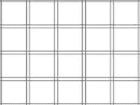
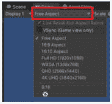
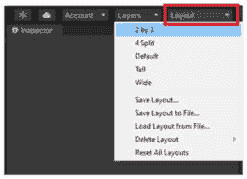
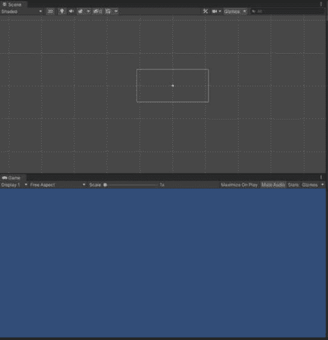
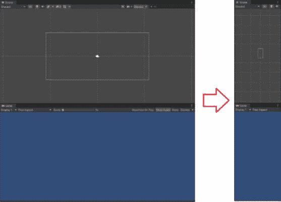
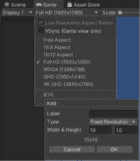
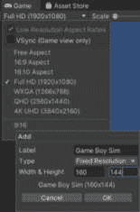
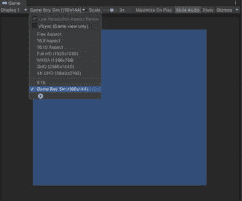
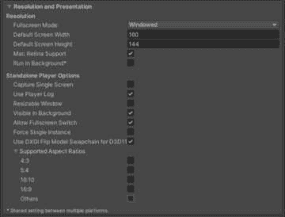
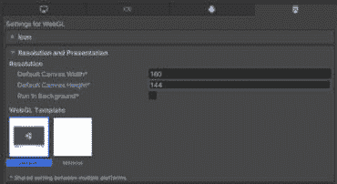

# 第一章：设计用户界面

当与用户界面（UI）打交道时，理解一些设计基础是很重要的。本章将涵盖设计 UI 的基础和一些关键概念，以帮助您正确起步。

在本章中，我们将讨论以下主题：

+   定义 UI 和 GUI

+   描述四种类型的界面

+   布局用户界面

+   区分和设置分辨率和宽高比

本书不是关于设计 UI 的艺术。它是一篇技术性文章，讨论 UI 功能的实现。然而，我确实想讨论一些 UI 设计的基本设计原则。我不期望你在阅读本章后成为一个出色的 UI 设计师。但我确实希望你能从本章中获得一些关于布局和设计原则的基本理解，这样也许你的艺术家朋友们就不会太取笑你了。

# 技术要求

对于本章，您需要以下内容：

Unity 2020.3.26f1 或更高版本

# 定义 UI 和 GUI

那么，UI 和 GUI 究竟代表什么，它们之间有什么区别？**UI**代表**用户界面**，而**GUI**（发音为“gooey”）代表**图形用户界面**。*界面*意味着*交互*，因此 UI 是让玩家与游戏交互的一组设备。鼠标、键盘、游戏控制器、触摸屏等等都是 UI 的一部分。GUI 是 UI 的图形子集。因此，屏幕上的按钮、下拉菜单和图标都是游戏 GUI 的一部分。由于 GUI 是 UI 的子集，许多人（包括我自己）倾向于只把 GUI 称为 UI。Unity 也将他们提供的所有 GUI 项目模板称为 UI。

本书将主要关注 GUI 设计，但也会讨论 UI 控件的一些非图形方面，例如从鼠标、屏幕点击、键盘或控制器访问数据。本章将特别探讨不同界面类型的一些基本设计考虑因素。

# 四种游戏界面类型

当你说“游戏 UI”时，大多数人会想到出现在所有游戏项目前面的**抬头显示**（**HUD**）。然而，实际上有四种不同类型的游戏界面：非叙事的、叙事的、元和空间的。

Fagerholt 和 Lorentzon 首先在 2009 年的论文《超越 HUD：FPS 游戏中的用户界面以提高玩家沉浸感：硕士学位论文》中描述了这四种不同的界面类型。从那时起，这个术语在整个 UI 游戏设计领域得到了广泛使用。您可以在[`publications.lib.chalmers.se/records/fulltext/111921.pdf`](http://publications.lib.chalmers.se/records/fulltext/111921.pdf)找到原始出版物。

这四种类型的区别是由以下两个维度的交叉决定的：

+   **叙事性**：它是故事的一部分吗？

+   **空间性**：它是否在游戏环境之中？

下面的图表展示了这两个问题之间的交叉关系以及它们如何定义四种类型的界面：

图 1.1：四种界面类型

一款游戏的 HUD 属于**非叙事性**类别。这种信息纯粹是为了玩家查看，而游戏中的角色并不知道它的存在。它存在于游戏视图的**第四面墙**上，看起来像是屏幕上所有内容的前面。这种类型 UI 的例子无穷无尽，因为几乎每款游戏都有一些非叙事性 UI 元素。

另一方面，**叙事性**界面是指存在于游戏世界中，而游戏中的角色知道它的存在。常见的例子包括角色查看库存或地图。最常提到的叙事性 UI 例子是《死亡空间》中的库存和健康显示。库存显示在一个弹出在可玩角色前面的全息显示窗口上，而你选择他的武器时与之交互。他的健康状态也通过他背上的仪表来指示。《黑暗料理传说》（2008）的库存也是以叙事方式显示的。虽然有一些 UI 元素只有玩家可以看到，但主要角色在夹克口袋中查看库存并与物品交互。*无主之地：失落遗产*和*孤岛惊魂 2*都使用角色在场景中实际持有的地图，并与地图交互。《辐射 3》和《辐射 4》使用叙事性界面在角色的 Pip-Boy 上显示库存和地图，Pip-Boy 永久固定在他们的手臂上。当角色在车辆或服装中时，游戏也会使用这种类型的显示，各种显示出现在盾牌、窗户或驾驶舱上。

**元界面**是指游戏中的角色知道但不在场景中物理显示的界面。常见的例子是赛车游戏的速度显示。*Forza 7*实际上使用了元和叙事显示的组合来显示速度表。元速度指示器持续显示在屏幕的右下角，供玩家查看。由于角色始终知道他们开得有多快，因此他们会知道这个速度指示器，因此它是一个元界面。还有一种叙事速度表在汽车的仪表板上显示，当以第一人称视角玩游戏时会出现。这种类型显示的另一种常见用途是在屏幕上出现的手机，暗示可玩角色正在与之交互。*女神异闻录 5*、*Catherine*和*侠盗猎车手 5*都使用这种界面类型进行手机交互。

最后一种类型的界面，**空间**界面存在于场景中，但游戏中的角色对此并不知情。存在于场景中但角色并不知情的界面非常常见。这通常用于让玩家知道场景中可交互物品的位置、游戏角色正在做什么，或者场景中角色和物品的信息。例如，在《塞尔达传说：荒野之息》中，箭头出现在敌人的头顶上，指示林克将要攻击谁。林克实际上并不意识到这些箭头图标；它们的存在是为了让玩家知道他正在关注谁。“异度之刃 2”使用空间界面，通过在可挖掘区域上方显示铲子图标来指示玩家可以挖掘的位置。

# 布局 UI 元素

当布局您游戏的 UI 时，我强烈建议检查同一类型的其他游戏，看看它们是如何实现它们的 UI 的。玩这些游戏，看看它们是否让您感觉良好。

如果您不确定如何布局您游戏的 UI，我建议将游戏屏幕划分为一个*带排水沟的网格*，就像以下图中所示，并将物品放置在非排水沟区域：

图 1.2：带排水沟的网格

您可以使用尽可能多的网格，但根据网格布局项目将有助于确保 UI 以平衡的方式排列。

在大多数情况下，HUD 项目应保持在网格的外边缘。任何显示在中心网格中的 UI 都会限制玩家的视野。因此，这个区域适合弹出窗口，暂停游戏。

您的游戏将在哪种设备上运行对于确定布局很重要。如果您的游戏是为移动设备设计的，并且有很多玩家将与之交互的按钮，那么按钮通常最适合屏幕的底部或侧面部分。这是因为玩家握手机的方式，以及屏幕的顶部中央部分是玩家用拇指最难触及的区域。此外，伸手到这个区域会让他们用手挡住大部分游戏视图。我们将在*第二章*中更详细地讨论为移动设备设计 UI。

您会注意到，当您玩电脑游戏时，它们往往比移动和主机游戏有更小、更杂乱的 UI。这是由于可见性和交互。用鼠标点击小对象比用手指轻触或用 D-pad 选择它们要容易得多。此外，屏幕分辨率要大得多，这允许 UI 占用更多空间。

当试图确定 UI 项的大小和相对位置时，你可以参考**菲茨定律**。菲茨定律可以基于 UI 项的大小和距离用户起始位置的距离，从数学上计算出用户导航到 UI 项所需的时间。在这里我不会讲解数学（尽管我内心渴望这样做），但可以从菲茨定律中汲取的教训如下：

+   不要使可交互的 UI 元素太小且间隔太远

+   将最重要的可交互元素设计得最大，并且彼此靠近

接下来，我们将探讨分辨率和宽高比。

# 分辨率和宽高比

游戏的**分辨率**是游戏运行的屏幕的像素维度。例如，一个游戏可以运行在 1,024x768 上。这意味着游戏宽度为 1,024 像素，高度为 768 像素。游戏的**宽高比**是宽度和高度的比率（表示为宽度:高度）。这个宽高比是通过将分辨率宽度除以分辨率高度然后简化分数来确定的。例如，如果你的游戏分辨率为 1024x768，那么宽高比如下：

1024*px*/768*px*=4/3

在这里，分数 4/3 代表宽高比 4:3。

下表提供了一组常见的宽高比和相关分辨率：

图 1.3：常见的宽高比和分辨率

在设计你的 UI 时，分辨率和宽高比将在你的 UI 外观中扮演重要角色。了解你的目标设备的分辨率和宽高比将是设计你的 UI 的重要第一步，原因如下：

+   它将决定你的 UI 布局

+   你在 Unity 中构建 UI 的方式将由你计划支持多少分辨率和宽高比来决定

如果你只为单一分辨率/宽高比构建，UI 的构建将会更加简单，因为你不需要确保所有元素在多个宽高比下都保持其相对位置。然而，如果你构建的游戏将在多个分辨率/宽高比下运行（例如，一个移动项目或一个在窗口内缩放的网页游戏），你希望你的 UI 能够适当地缩放和移动。你还将希望能够在测试期间轻松地更改分辨率，以确保 UI 在显示窗口变化时能够适当地定位。

即使你将允许分辨率和宽高比变化，你也应该决定一个默认分辨率。这个默认分辨率代表了你理想设计的分辨率。这将是你初始设计和 UI 布局的基础，因此如果分辨率或宽高比发生变化，UI 将尽可能保持相同的设计。

注意

由于今天所有销售的电视都具有 16:9 的宽高比，因此为控制台游戏制作的任何 UI 都应该考虑到 16:9 的宽高比。

## 改变游戏视图的宽高比和分辨率

您可以在**游戏**标签页中轻松地在不同的分辨率和纵横比之间切换。这将允许您查看您的 UI 在不同的分辨率和纵横比下的缩放情况：

1.  如果您导航到您的**游戏**标签页，您将看到文字**自由纵横比**。点击**自由纵横比**将显示一个菜单，显示各种纵横比和分辨率：

    图 1.4：从游戏视图中选择自由纵横比模式

    此列表中显示的项目是您当前所选构建目标最常见的纵横比和分辨率。在前面的屏幕截图中，我的构建目标是**PC、Mac 和 Linux 独立版**，因此显示了最常见的监视器设置。如果我将构建目标更改为 iOS，我会看到一组流行的 iPhone 和 iPad 屏幕尺寸。

    **自由纵横比**意味着游戏的纵横比将相对于**游戏**视图的窗口进行缩放。因此，通过在**游戏**窗口上移动框架，您将改变纵横比。

1.  您可以通过将编辑器的布局设置为同时显示**屏幕**和**游戏**标签页的布局，轻松地看到**自由纵横比**对游戏纵横比的影响。例如，将**布局**设置为**2x3**将做到这一点。在 Unity 编辑器的右上角选择**布局**下拉菜单以更改布局。

    图 1.5：更改编辑器布局

    现在，**游戏**和**场景**标签页都将显示在您的屏幕左侧。

    

    图 1.6：2x3 布局的成果

1.  现在，减小**游戏**标签页的大小，使其成为一个非常小的细长矩形。您会看到，场景视图中的主摄像机现在也显示为一个非常小的细长矩形：

图 1.7：在自由纵横比模式下调整游戏视图大小的成果

1.  您可以从下拉菜单中选择一个纵横比，并看到，当您调整游戏窗口的大小时，代表实际游戏的蓝色区域将保持您选择的纵横比，黑色条带将填充任何额外的空间。摄像机也将保持该比例。

1.  **全高清 (1920x1080)** 将尝试模拟 1920x1080 的分辨率。您设置的**游戏**标签页的窗口很可能不足以支持 1920x1080 像素；如果是这样，它将按以下截图所示进行缩放：

图 1.8：游戏视图缩放

1.  如果您想使用的分辨率或纵横比在分辨率下拉菜单中不可用，您可以通过在下拉菜单底部选择加号来添加自己的项目到该菜单。如果您想创建一个固定分辨率项，请将 **类型** 设置为 **固定分辨率**。如果您想创建一个固定纵横比项，请将 **类型** 设置为 **纵横比**。

    图 1.9：添加新的分辨率或纵横比预设

    例如，如果您想制作一个让人联想到旧 Game Boy 游戏的游戏，您可以添加一个 160x144 像素的预设：

    

    图 1.10：创建固定分辨率预设

1.  一旦您点击 **确定**，新的预设项将显示在列表底部。当您选择它时，**游戏**选项卡的相机和可见区域将保持由 160x144 分辨率创建的纵横比：

图 1.11：选择自定义预设

## 为单一分辨率构建

如果您正在创建计划在 **PC、Mac 和 Linux 独立**目标平台上构建的游戏，您可以强制分辨率始终相同。为此，请转到 **编辑** | **项目设置** | **玩家**。此时，您的检查器应显示以下内容：

图 1.12：PC、Mac 和 Linux 独立玩家分辨率设置

这里可能显示的平台数量可能更多或更少；这取决于您安装的 Unity 模块。

要在 **PC、Mac 和 Linux 独立**游戏中强制特定分辨率，请取消选择 **默认为原生分辨率**。将提供输入 **默认屏幕宽度** 和 **默认屏幕高度** 的选项，您可以输入所需的分辨率值。然后，当您构建游戏时，它将以您指定的尺寸播放。

以下截图显示了强制 PC 游戏以 Game Boy Color 尺寸的窗口播放的设置：

图 1.13：设置特定的 PC、Mac 和 Linux 独立玩家分辨率

您也可以通过 WebGL 构建强制设置特定的分辨率。需要考虑的选项较少，但基本概念是相同的。以下截图显示了在 WebGL 的 **Player Settings** 中强制游戏以 **160**x**140** 分辨率显示的设置：

图 1.14：设置特定的 WebGL 分辨率

在 *第二章* 中，我们将讨论如何为具有可变分辨率且无法预先定义的移动游戏设置分辨率属性。

# 摘要

本章讨论了一些与 UI 相关的基本设计原则和术语。你现在应该能够区分 GUI 和 UI，并定义四种类型的界面：叙事性界面、空间界面、元界面和非叙事性界面。此外，你还应该了解一些布局 UI 的基本规则以及如何在不同的分辨率和宽高比下工作。

下一章将扩展这些设计原则，并探讨为移动游戏设计 UI 时的一些重要考虑因素。
