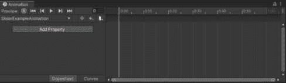
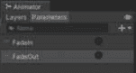

# 第十四章：动画化 UI 元素

由于我们已经讨论了如何为按钮创建动画过渡，因此在本章中，我们将更深入地探讨动画过渡，并讨论如何更普遍地创建 UI 元素的动画。

本章假设你对 Unity 的动画系统有基本的了解，并且不会详细描述各种菜单的名称和动画窗口、动画控制器窗口的布局。动画片段和动画控制器将简要介绍，重点介绍它们与 UI 的关系及其实现，这些将在本章末尾的示例中进行讨论。

在本章中，我们将讨论以下主题：

+   将动画应用于各种 UI 元素

+   创建淡入淡出的弹出窗口

+   使用状态机和动画事件创建复杂的动画系统

尽管我假设你对 Unity 的动画系统有基本的了解，但我确实想强调动画片段和动画控制器之间的区别。

当你在 Unity 中为项目中的项目创建动画时，你从**动画片段**开始。一个动画片段应该代表一个单一的动作或运动。例如，如果你有一个执行两个独立动作的菜单，弹跳和缩放，你会为每个动作创建一个单独的动画片段。虽然你可以在单个动画片段中包含多个事件，但除非它们总是同时发生，否则非常重要不要将多个动作放入一个片段中。

每个游戏对象都可以拥有多个动画片段。**动画控制器**决定了所有这些动画如何链接在一起。因此，一个游戏对象的动画控制器将包含其所有的动画片段。

我想要区分这一点，因为在过去，我见过一些包含多个动作的史诗级动画片段的项目，这些动作本应该被分解成更简单的动作。

注意

与前几章一样，本节中展示的所有示例都可以在提供的代码包中的 Unity 项目中找到。它们可以在标记为**第十四章**的场景中找到。

# 技术要求

你可以在此处找到本章的相关代码和资产文件：[`github.com/PacktPublishing/Mastering-UI-Development-with-Unity-2nd-Edition/tree/main/Chapter%2014`](https://github.com/PacktPublishing/Mastering-UI-Development-with-Unity-2nd-Edition/tree/main/Chapter%2014)

# 动画片段

Unity 动画系统的优点在于你可以动画化 UI 的几乎所有属性。要创建动画片段，只需打开动画窗口（**窗口** | **动画** 或 *Ctrl* + *6*），然后选择要动画化的 UI 元素，然后选择**创建**：


图 14.1：动画窗口

一旦这样做，系统会提示你保存动画片段。

创建动画剪辑后，您可以通过单击**添加属性**将任何属性添加到剪辑的时间线：



图 14.2：SliderExampleAnimation 时间线

这样做将显示对象的每个组件，以及其所有子组件的列表：


图 14.3：添加动画属性

您还可以查看每个子组件的组件和子组件：


图 14.4：展开动画组件

然后，您可以查看这些子组件的组件和子组件。您可以继续这种方式，直到耗尽所选 GameObject 下嵌套的 GameObject 列表。

如果您展开 GameObject 的组件或其子组件之一，您将注意到该组件所有可动画的属性列表。正如您将在以下屏幕截图中所注意到的，**滑动**组件上的几乎所有属性都可以以这种方式进行动画处理：


图 14.5：滑动组件及其可动画属性

只有具有以下数据类型的属性才能使用动画系统进行动画处理：

+   `Vector2`、`Vector3`和`Vector4`

+   `四元数`

+   `布尔值`

+   `浮点数`

+   `颜色`

选择加号将属性添加到动画时间线，并附带两个关键帧。然后您可以在各个关键帧更改每个属性的值。

**关键帧**是动画中的一个重要或**关键**（因此得名）帧。它表示动画中转换的开始或结束点。


图 14.6：SliderExampleAnimation 第一个关键帧

在前面的屏幕截图中，红色方框内的值表示特定帧的属性值。布尔值由复选框表示，浮点值由数字表示。每种类型都可以通过选择它们进行直接编辑。

Unity 将在关键帧之间填充值，以便它们在曲线上变化（或插值）。您可以通过选择**曲线**选项卡来查看插值曲线。

您可以通过播放动画或拖动播放头查看整个帧的变化。

**播放头**是表示当前正在显示的帧的标记。“拖动播放头”意味着将播放头拖动到时间线上以查看单个帧的变化。


图 14.7：时间线的曲线版本

布尔属性沿线性曲线插值。所有其他属性（因为它们是浮点数的组合）沿渐变-渐出曲线插值。你可以通过右键单击关键帧处的切线手柄来调整这些插值。 

通常，这些渐变曲线会导致你的 UI 看起来*弹跳*，调整插值曲线可以消除这种弹跳。例如，由于默认插值曲线的渐变-渐出特性，在两个点之间动画一个对象可能会使对象瞬间超过目标点。

## 动画事件

我最喜欢的关于动画剪辑的事情之一是能够在时间轴上的帧中添加动画事件。动画事件允许你在指定的帧上调用游戏对象上存在的函数。它们由时间轴上方的白色*旗帜*表示，悬停在它们上方将显示由动画事件调用的函数的名称。

动画事件只能调用附加到动画剪辑上的游戏对象上存在的函数。该函数可以是公共的或私有的，也可以有参数。参数可以是以下类型：

+   `float`

+   `int`

+   `string`

+   对象引用

+   `AnimationEvent`对象

你可以通过在想要放置动画事件的帧上方的区域右键单击并点击**添加动画事件**，或者点击**添加事件**按钮来将动画事件添加到动画剪辑的时间轴上。选择**添加事件**按钮将在播放头当前停留的位置添加动画事件。


图 14.8：动画事件

你可以通过选择白色旗帜并点击**删除**来删除动画事件，也可以通过点击并拖动它来移动它。

动画事件检查器的外观取决于动画剪辑是否附加到游戏对象，以及游戏对象是否当前被选中。以下截图显示了两种外观：


图 14.9：动画事件的检查器

如果动画剪辑附加到游戏对象上，并且游戏对象被选中，将出现一个下拉菜单，其中列出了所有可用的函数。如果选定的函数有参数，则将提供有关该参数的选项（请参阅前面的截图）。否则，必须手动输入函数的名称和要传递的参数。

如果你启用`Chapter14`场景中的`Slider Animation Example`游戏对象并播放，你会看到一个带有事件的动画正在播放。

现在我们已经了解了动画剪辑，让我们看看动画控制器。

# 动画控制器

每当为对象创建动画剪辑时，例如在前面章节中的`Slider` GameObject 上的`SliderExampleAnimation`动画剪辑，就会创建一个名为`Slider`的动画器，并将动画器组件附加到`Slider` GameObject：


图 14.10：滑块动画器的检查器

需要动画器来播放动画剪辑，因为它决定了何时播放动画剪辑。

动画器是一种称为**状态机**的决策树类型。它包含一系列**状态**。状态本质上是在某一时刻的**状态**。状态机的**当前状态**将表示此刻正在发生的事情。例如，如果有一个描述我的行为和动作的状态机，我的**当前状态**将是**在键盘上打字**。我的状态机将会有我可以最终过渡到的其他状态，例如**睡觉**或**因为即将截止日期而哭泣**，如果满足某些条件。

动画器中的状态由称为**节点**的矩形表示。状态通过表示为箭头线的转换连接。这些转换发生在预定时间或满足一组条件之后。当前状态将有一个蓝色的动画状态栏，显示该状态完成的百分比。如果当前状态正在等待转换发生，这个状态栏可能会循环或停在完全位置，直到满足转换的条件：


图 14.11：滑块动画器

动画器窗口的右下角显示了当前动画控制器名称及其文件夹位置。当你有多个不同的动画器时，这非常有用，因为它告诉你你正在使用哪个动画器。

状态可以是空的，或者代表动画剪辑。如果一个状态代表动画剪辑，那么在它的**检查器**中，其**运动**属性将设置为一个动画剪辑，如下面的截图所示：


图 14.12：动画状态的“运动”属性

大多数状态将以灰色显示，但那些颜色不同的将代表特殊状态。每个动画器在其内部都将有一个**入口**节点（绿色）、一个**退出**节点（红色）和一个**任何状态**节点（蓝色）。你添加到动画器的第一个状态将被分配为默认层状态节点（橙色）。你可以随时更改默认层状态的状态。请注意，动画器层将在后面的章节中讨论。

**入口**和**退出**节点本质上作为状态机之间的**门**。你可以在状态机内部有状态机，这些**门**分别决定状态机进入和退出后会发生什么。因此，**入口**节点代表状态机开始实例，而**退出**节点代表状态机停止的实例。

**入口**节点始终过渡到默认层状态，并且无法定义过渡的条件，因此过渡将始终自动且立即发生。因此，你可以将默认层状态视为状态机开始时将发生的**第一个**状态。

**任何状态**节点是一个**包容性**状态。当你想要发生过渡，而不管当前状态时，你将使用此状态。你只能从**任何状态**节点过渡出去。继续以描述我行为的状态机为例，我会从**任何状态**过渡到*关于即将截止日期哭泣*的状态，因为无论我现在在做什么，如果满足条件“截止日期在 24 小时内”，我可能会突然哭泣。

如前所述，动画师将保持在当前状态，直到经过指定的时间或满足一组条件。选择过渡箭头将显示过渡条件：


图 14.13：动画的扩展属性

从前一个屏幕截图的过渡需要指定的时间和条件。过渡也不是瞬时的，需要`0.25`秒才能完成。

发生过渡必须满足的**条件**由动画师的**参数**设置，这些参数可以在动画窗口的左上角找到和创建：


图 14.14：添加动画参数

这些参数的值可以从脚本中设置。有四种类型的参数：在过渡使用后变为`False`。触发参数对于创建需要停止并等待才能进入下一个状态的洪水门类型动作很有帮助。在状态和过渡形成循环的情况下，这些参数比布尔参数更受欢迎，因为布尔参数在状态循环回之前必须手动重置。

当你查看参数列表时，可以通过右侧的值来判断它们的类型。浮点参数有十进制数字，整型参数有整数，布尔参数有方形复选框，触发参数有圆形单选按钮。

由于动画器是状态机，它可以用来完成比动画更多的任务。动画器可以用来跟踪复杂的游戏逻辑。例如，我为一个三消 RPG 创建以下状态机来跟踪游戏中当前发生的情况。使用它来跟踪游戏当前状态允许我根据游戏中的情况限制玩家可以做什么。

例如，如果敌人角色正在攻击，玩家将不会与棋盘上的碎片交互：


图 14.15：用于逻辑的动画状态机示例

现在我们已经回顾了动画控制器属性，让我们看看它的用途。

## 过渡动画的动画器

在*第九章*中，我们探讨了按钮动画过渡并为按钮创建了一个简单的动画。我们让按钮组件自动为我们生成动画器，但从未查看过动画器或对其进行任何操作。现在我们已经讨论了动画器，让我们看看保存在`Assets/Animations`中的`Play Button`的动画器：


图 14.16：按钮的动画器

如前述截图所示，为我们自动生成的动画器并不特别复杂，其设置也是一目了然的。它包含以下五个动画片段的状态：`Normal`、`Highlighted`、`Pressed`、`Selected`和`Disabled`。所有动画片段都从`Any State`过渡。此外，还有五个触发参数：`Normal`、`Highlighted`、`Pressed`、`Selected`和`Disabled`。

为任何允许过渡动画的 UI 元素自动生成动画器将产生相同的设置。尽管这个动画器为你预设了，但你可以根据自己的需要自由调整它。

## 动画层

当使用动画器时，如果你有一个具有多个节点过渡的状态，则只能发生一个过渡。例如，在以下截图中，`ChooseAState`状态只能同时过渡到其他状态中的一个，即使所有过渡条件都满足也是如此；这适用于你使用的任何类型的参数：


图 14.17：第十四章场景中的分支动画示例

如果你想同时触发多个动画，可以使用动画层。以下图层设置将使所有三个状态同时运行：


图 14.18：第十四章场景中的动画层示例

我发现，像这样的需求最常见的情况是当您有一个由多个精灵图集组成的对象，并且您希望同时触发多个精灵图集动画，将它们全部放在同一个动画剪辑中并不合理。例如，我在一个游戏中工作，其中 2D 角色有多个可互换的部分，每个部分都有自己的精灵图集动画。必须让每个部分的无动作动画同时开始。由于部分可以互换，因此可以实现多种部分组合，制作所有可能的无动作动画组合并不合理。给每个可能的部件分配自己的动画器也不合理。因此，我为每个身体部分创建了一个层，并能够同时播放所有单个精灵动画。

## 在脚本中设置动画参数

您可以通过使用`Animator`类的`SetFloat()`、`SetInteger()`、`SetBool()`、`SetTrigger()`和`ResetTrigger()`函数通过脚本设置动画参数的值。您可以通过在动画器中分配给它们的字符串名称来引用动画参数变量。

要设置动画参数，您首先需要获取定义了参数的动画器；您可以使用公共动画器变量或使用`GetComponent<Animator>()`来完成此操作。然后，在动画器上调用必要的函数。

让我们看看一个示例，该示例将设置以下**参数**：


图 14.19：不同类型的动画参数

以下脚本将设置之前截图中所定义的动画参数：

```cs
using System.Collections;
using System.Collections.Generic;
using UnityEngine;
public class Chapter14Examples : MonoBehaviour
{
    Animator theAnimator;
    void Awake()
    {
        theAnimator = GetComponent<Animator>();
    }
    public void SetAnimatorParameters()
    {
        theAnimator.SetFloat("FloatParameter", 1.0f);
        theAnimator.SetInteger("IntParameter", 1);
        theAnimator.SetBool("BoolParameter", true);
        theAnimator.SetTrigger("TriggerParameter"); // sets to true
        theAnimator.ResetTrigger("TriggerParameter"); // sets to false
    }
    public void ExampleFunction()
    {
        Debug.Log("The Animation Event is not sending an argument");
    }
    public void ExampleParameterFunction(int value)
    {
        Debug.Log("The Animation Event sends the following value: " + value);
    }
}
```

使用触发器的优点是您通常不需要重置它，因为一旦过渡使用它，它就会立即重置。然而，如果您设置了触发器，但过渡从未到达，您将需要使用`ResetTrigger()`来重置它。

## 动画器行为

如果您想在状态内的特定点执行代码，您可以使用一种独特的脚本类，称为状态机行为。状态机行为可以添加到您在动画器中创建的任何状态节点。我指定*您创建*，因为您不能将它们添加到**进入**节点、**退出**节点或**任何****状态**节点。

您可以通过选择一个状态并点击**添加行为**来创建一个新的状态机行为：


图 14.20：如何将行为添加到动画状态

以这种方式创建的所有新状态机行为都保存在`Assets`文件夹中。

当您打开脚本时，它将自动填充以下代码：

```cs
using System.Collections;
using System.Collections.Generic;
using UnityEngine;
public class ChooseAStateBehaviour : StateMachineBehaviour
{
    // OnStateEnter is called when a transition starts and the state machine starts to evaluate this state
    //override
    public override void OnStateEnter(Animator animator, AnimatorStateInfo stateInfo, int layerIndex)
    {
        // Implement state enter logic here
    }
    // OnStateUpdate is called on each Update frame between OnStateEnter and OnStateExit callbacks
    //override
    public override void OnStateUpdate(Animator animator, AnimatorStateInfo stateInfo, int layerIndex)
    {
        // Implement state update logic here
    }
    // OnStateExit is called when a transition ends and the state machine finishes evaluating this state
    //override
    public override void OnStateExit(Animator animator, AnimatorStateInfo stateInfo, int layerIndex)
    {
        // Implement state exit logic here
    }
    // OnStateMove is called right after Animator.OnAnimatorMove()
    //override
    public override void OnStateMove(Animator animator, AnimatorStateInfo stateInfo, int layerIndex)
    {
        // Implement code that processes and affects root motion
    }
    // OnStateIK is called right after Animator.OnAnimatorIK()
    //override
    public override void OnStateIK(Animator animator, AnimatorStateInfo stateInfo, int layerIndex)
    {
        // Implement code that sets up animation IK (inverse kinematics)
    }
}
```

注意，这个类是从`StateMachineBehaviour`派生出来的，而不是像我们附加到 GameObject 上的脚本那样从`MonoBehaviour`派生。

脚本中预先编写了一些函数，以及如何使用它们的描述。就像`Awake()`、`Start()`和`Update()`是 MonoBehaviour 的预定义函数一样，`OnStateEnter()`、`OnStateUpdate()`、`OnStateExit()`、`OnStateIK()`和`OnStateMove()`是在特定时间调用的预定义函数。你可以删除你不想使用的任何函数。你还可以在此脚本中编写其他函数，它们不受这些预定义函数的限制。

这些函数可以执行你想要它们执行的操作，甚至可以设置你的动画机的动画参数。

我发现状态机行为非常有帮助，因为我广泛使用状态机来控制游戏逻辑。在前面这个部分，我向你展示了我为三合一 RPG 创建的状态机。我使用了多个状态机行为来让其他脚本知道状态何时改变，在指定时间调用其他脚本中的函数，等等。

现在我们已经回顾了使用动画剪辑和动画控制器，让我们看看一些如何在我们的项目中实现它们的示例。

示例

本章的主要重点是提供创建常见 UI 动画和效果的示例。让我们开始吧。在这些示例中，我将向你展示一个基本的可重用动画，用于淡入淡出 UI 面板，以及一个更复杂的依赖于玩家交互的宝箱动画。

## 动画弹出窗口的淡入淡出效果

在我们的第一个示例中，我们将继续在我们的主场景中工作。

目前，我们有`暂停面板`和`物品栏面板`，当按下*P*或*I*键时会立即出现。这并不特别有趣，所以让我们添加一些动画，使面板通过淡入淡出和缩放动画来弹出和消失。

每次进入新场景时，必须展开所有父项以查看其子项，这可能会变得相当繁琐。一个打开所有父项的快捷方式是选择层次结构中的所有内容，然后按键盘上的右箭头键。如果你有多个嵌套，你可以多次这样做。按左箭头键将折叠父项。

我们设置这些动画及其功能的工作流程将是创建动画剪辑，设置我们的动画机，然后编写在适当时间设置动画机参数的代码。为了使步骤更容易理解，我将它们分为几个部分。第一部分涵盖了设置动画剪辑和动画机的所有步骤，第二部分涵盖了编写代码涉及的设置。

### 设置动画

要在`暂停面板`和`物品栏面板`上创建弹出和消失的动画，请执行以下步骤：

1.  我们首先将一个动画剪辑添加到`暂停面板`，这将使其缩放并淡入。打开动画窗口，从层次结构中选择`暂停面板`。选择`Assets/Animation`文件夹，并将其命名为`FadeAndScale`。

1.  我们想控制这个面板的四个属性：其缩放、其 Alpha 值、其交互能力以及其射线投射阻塞。让我们从缩放开始。我们可以从 Rect Transform 组件调整这个属性。选择 **添加属性**，然后点击 **Rect Transform** 下 **Scale** 旁边的加号，如下所示：


图 14.21：添加 Scale 属性

1.  **Scale** 属性在 **0:00** 和 **1:00** 初始化了两个关键帧。这意味着动画将持续一秒钟，对于一个弹出动画来说有点长。选择 **1:00** 的关键帧，并将其拖动到 **0:30**，使动画缩短到半秒钟：


图 14.22：调整动画长度

1.  我们希望面板开始时较小，然后变大。为了实现这一点，我们需要调整 *x* 和 *y* 缩放。在两个关键帧上展开 `1`。由于我们希望缩放从小开始，然后放大到正常大小，我们希望它从 `0` 缩放到 `1`。我们只需要调整 *x* 和 *y* 缩放，因为 *z* 缩放实际上不会影响 2D 对象。因此，在关键帧 `0` 中，在它们的属性框中输入 `0`，如下所示：

    图 14.23：调整 Scale 属性

    如果你播放动画，你会注意到 `Pause Panel` 快速缩放。由于父子关系会以父元素的比例缩放子元素，所以我们不需要单独动画化所有 `Pause Panel` 子元素的缩放。

1.  现在，让我们控制面板的 Alpha 值以渐显它。我们不想在 `Pause Panel` 上动画化 Alpha。这样做只会影响面板背景图像的 Alpha 值，而不会影响子元素。相反，我们想在 `Pause Panel` 上动画化 Alpha 值，并让所有子元素一起工作。记住，这正是我们最初使用 Canvas Group 组件的原因。让我们选择 **添加属性** | **Canvas Group** | **Alpha**：


图 14.24：添加 Alpha 属性

1.  要渐显，面板应从完全透明开始，并最终变为完全不透明。两个关键帧都已经有了 `1`，所以将第一个关键帧的 `0` 改变。播放动画（或拖动播放头）将显示面板及其所有子元素渐显。

1.  我们需要动画化面板是否可以被交互。我们不希望当面板仍在弹出时，玩家能够与下拉菜单或静音按钮交互。这同样由 Canvas Group 组件控制——选择 **添加属性** | **Canvas Group** | **Interactable**。

1.  只有在它完全弹出场景后，`Pause Panel` 和其子项才应该是可交互的。因此，在第一个关键帧旁边取消选择 **CanvasGroup.Interactable** 旁边的复选框，使 Canvas Group 从可交互状态动画到不可交互状态。当你拖动播放头时，你会看到属性直到最后一帧都不会再次开启。

1.  我们需要动画的最后一项是其射线投射阻塞。将 `false` 选择为 `true`，就像你在 `FadeAndScale` 动画片段的时间线上所做的那样，现在应该出现以下内容：


图 14.25：FadeAndScale 动画片段的时间线

1.  现在我们已经设置了动画片段，我们可以在动画器内部开始工作。当我们创建 `FadeAndScale` 动画片段时，一个名为 `Pause Panel` 的动画器被自动创建。还向 `Pause Panel` 游戏对象添加了一个动画器组件，并将其分配给 `Pause Panel` 动画器。

    选择 `Pause Panel` 后，打开动画器窗口。你应该会看到以下类似的内容：

    

    图 14.26：Pause Panel 的动画器

    你将看到一个名为 `FadeAndScale` 的状态。此状态使用 `FadeAndScale` 动画片段作为其 **运动**，你可以在其检查器中查看。

1.  目前，由于 `FadeAndScale` 状态连接到 `FadeAndScale` 动画将立即播放。它也会循环播放。这显然不是我们想要的。让我们通过创建一个空状态作为层默认状态来阻止它在游戏开始时播放。在动画器内任意位置右键单击并选择 **创建状态** | **空状态**：

    图 14.27：创建空状态

    这将在动画器中添加一个名为 `New State` 的灰色状态。

1.  通过在其检查器中更改名称，将 `New State` 重命名为 `Empty State`。

1.  通过右键单击并选择 **设置为层** **默认状态**，将 `Empty State` 设置为层默认状态：

    图 14.28：设置状态为层默认状态

    现在，它将连接到 `FadeAndScale`，它也将不再是层默认状态，并且不会连接到任何过渡：

    

    图 14.29：将空状态设置为层默认状态

    我们使用空状态作为层默认状态，因为我们希望面板在等待我们告诉它开始动画时什么也不做。

1.  将项目重新排列为更易于查看的布局。我个人喜欢以下布局用于此动画器：


图 14.30：重新排列状态

1.  `FadeAndScale`动画剪辑现在在游戏开始时不再立即播放。然而，它仍然设置为具有动画循环。为了修复这个问题，从您的**项目**文件夹视图中选择`FadeAndScale`动画剪辑。这将打开其检查器。

    取消选择**循环时间**属性以禁用动画的循环：


图 14.31：取消选择循环时间

1.  我们希望`Pause Panel`能够根据命令淡入和淡出，但我们没有淡出动画剪辑，只有淡入动画剪辑。实际上，我们不需要创建整个动画剪辑来实现这种动作。我们可以简单地播放`FadeAndScale`动画剪辑的反向。通过选择它并按*Ctrl* + *D*来复制`FadeAndScale`状态。这将为您提供一个名为`FadeAndScale 0`的新状态，其**运动**设置为`FadeAndScale`动画剪辑：


图 14.32：复制状态

1.  将`FadeAndScale`状态重命名为`FadeAndScaleIn`，将`FadeAndScale 0`状态重命名为`FadeAndScaleOut`。

1.  要设置`FadeAndScaleOut`状态反向播放`FadeAndScale`动画剪辑，我们只需在其检查器中更改其`-1`：


图 14.33：设置反向播放动画

1.  现在我们已经正确设置了所有状态，我们可以创建它们之间的过渡。首先创建两个名为`FadeIn`和`FadeOut`的触发参数：

    图 14.34：动画师参数

    我们在这里使用触发参数，因为我们希望在使用这些值后它们能够立即重置。这样，我们就可以创建一个动画循环，而无需编写重置参数值的代码。

1.  您可以通过在第一个状态上右键单击，选择**创建过渡**，然后点击第二个状态来创建状态之间的过渡：

    图 14.35：创建过渡

    按以下方式在状态之间创建过渡：

    

    图 14.36：最终状态过渡布局

    这种过渡流程将允许面板从无动画过渡到`FadeAndScale`动画剪辑，然后过渡到反转的`FadeAndScale`动画剪辑，并在两者之间来回切换。

1.  如果你玩游戏，`暂停面板`将立即从`空状态`变为`淡入并缩放`状态，然后变为`淡出并缩放`状态，并在这两个状态之间无限循环。这是因为过渡被自动设置为在动画完成后发生。要停止这种行为，你必须告诉过渡只在设置了一个参数之后发生。选择`空状态`和`淡入并缩放`状态之间的过渡。选择`淡入`触发器中的加号。由于我们不想让时间成为过渡的因素，取消选择**具有** **退出时间**：


图 14.37：过渡属性

1.  完成在`淡入并缩放`和`淡出并缩放`状态之间的过渡。将`淡入并缩放`状态设置为`淡出并缩放`状态，将`淡出并缩放`状态设置为`淡入并缩放`状态，并将`淡入并缩放`状态设置为`0`以确保瞬间过渡：


图 14.38：如何设置暂停面板的过渡

1.  如果你现在玩游戏，你会注意到`暂停面板`在游戏开始时是可见的。这是因为我们的动画状态覆盖了我们之前在`ShowHidePanels.cs`中编写的代码，该代码使`暂停面板`在场景开始时不可见。我们稍后会处理我们的损坏代码，但现在，通过将`Canvas Group`组件设置为以下值，使`暂停面板`在开始时不可见：

    图 14.39：Canvas Group 的属性

    现在你玩游戏时，`暂停面板`将不会在开始时出现。

1.  我们已经完成了`暂停面板`动画的设置，但在你继续到`库存面板`之前，检查动画是否工作正常。为此，调整你的窗口，以便你的游戏视图和 Animator 窗口都可见：

    图 14.40：播放空状态

    你将看到当前`暂停面板`状态上的进度条正在运行。要强制过渡，点击适当的触发参数旁边的圆圈。

1.  如果你的动画工作正常，你现在可以设置`库存面板`上的动画。你可能正在想，“呃，现在我必须为`库存面板`再次做所有这些吗？！”然而，不用担心，你不必再次这样做，因为你可以将`暂停面板`的 Animator 在`库存面板`上重用。我们在`暂停面板`的`淡入并缩放`动画剪辑中更改的所有属性也存在于`库存面板`上。因此，为了给`库存面板`提供相同的动画和控件集，我们可以简单地将我们创建的 Animator 附加到`库存面板`。

    由于我们将在两个不同的对象上使用我们创建的 Animator，所以将其重命名是个好主意。将名称从 `Pause Panel` 更改为 `PopUpPanels`。现在，将其拖动到 `Inventory Panel` 上。

1.  正如我们不得不改变 `Pause Panel` 上 Canvas Group 的属性以防止它在场景开始时出现一样，我们还需要改变 `Inventory Panel` 上的属性。将属性设置为 *图 14**.39* 中所示。

现在我们已经为我们的两个面板设置了动画，我们可以开始编写代码，当按下 *P* 和 *I* 键时触发动画以显示面板。

### 使用代码设置 Animator 的参数

我们有一个名为 `ShowHidePanels.cs` 的脚本附加到 `Main Camera` 上，当按下 *P* 和 *I* 键时，分别显示 `Pause Panel` 和 `Inventory Panel`。遗憾的是，它不再工作，因为现在的动画现在超过了我们在其中设置的 Canvas Groups 的属性。我们可以重用这个逻辑，但我们需要做一些工作才能让我们的面板再次弹出。

我们将对 `ShowHidePanels.cs` 文件所做的更改将导致前一章场景中的面板停止显示。如果您计划访问前一章的场景，请现在保存此脚本的副本来供以后使用。

要使用代码触发 `Pause Panel` 和 `Inventory Panel` 上的动画，请完成以下步骤：

1.  打开 `ShowHidePanels.cs` 脚本。注释掉 `Start()` 和 `Update()` 方法中所有使用 `TogglePanel()` 的代码。在注释掉这些行之后，您应该看到以下内容：

    ```cs
    void Start()
    {
        // Initialize Panels on Start
        TogglePanel(inventoryPanel, inventoryUp);
        TogglePanel(pausePanel, pauseUp);
    }
    void Update()
    {
        // Handle inventory Panel toggle
        if (Input.GetKeyDown(KeyCode.I) && !pauseUp)
        {
            inventoryUp = !inventoryUp;
            TogglePanel(inventoryPanel, inventoryUp);
        }
        // Handle pause Panel toggle
        if (Input.GetButtonDown("Pause"))
        {
            pauseUp = !pauseUp;
            TogglePanel(pausePanel, pauseUp);
            Time.timeScale = pauseUp ? 0 : 1; // Pause/unpause game by setting time scale
        }
    }
    ```

1.  我们不再使用它们的 Canvas Group 组件来引用 `Pause Panel` 和 `Inventory Panel`，而是现在使用它们的 Animator 组件。在类的顶部创建以下两个变量声明：

    ```cs
    public Animator inventoryPanelAnim;
    public Animator pausePanelAnim;
    ```

1.  现在让我们创建一个新的方法，称为 `FadePanel()`，它接受 `Animator` 和 `bool` 参数：

    ```cs
    public void FadePanel(Animator anim, bool show)
    {
        if (show)
        {
            anim.SetTrigger("FadeIn");
        }
        else
        {
            anim.SetTrigger("FadeOut");
        }
    }
    ```

1.  更新 `Update()` 方法，现在在曾经调用 `TogglePanel()` 方法的地方调用新的 `FadePanel()` 方法。以下代码中加粗的文本表示添加的代码：

    ```cs
    void Update()
    {
        // inventory Panel
        if (Input.GetKeyDown(KeyCode.I) && !pauseUp)
        {
            inventoryUp = !inventoryUp;
            //TogglePanel(inventoryPanel, inventoryUp);
            FadePanel(inventoryPanelAnimator, inventoryUp);
        }
        // pause Panel
        if (Input.GetButtonDown("Pause"))
        {
            pauseUp = !pauseUp;
            //TogglePanel(pausePanel, pauseUp);
            FadePanel(pausePanelAnimator, pauseUp);
            Time.timeScale = Convert.ToInt32(pauseUp);
        }
    }
    ```

    这就是我们需要对代码所做的所有更改。

1.  将 `Inventory Panel` 和 `Pause Panel` 拖动到 **显示/隐藏** **面板** 组件的相应插槽中：


图 14.41：显示/隐藏面板组件的属性

1.  玩游戏并观察它是否大致工作。`Inventory Panel` 应根据需要显示和消失，但 `Pause Panel` 不会像预期的那样淡出。这是因为以下代码行阻止了所有依赖于时间缩放的动画发生：

    ```cs
    Time.timeScale = Convert.ToInt32(pauseUp);
    ```

    那行代码被用来有效地暂停游戏。然而，这意味着它将暂停我们的 `Pause Panel` 弹出动画。别担心，你仍然可以使用这个简单的暂停代码，并在游戏暂停时运行动画。你只需要告诉 `Pause Panel` 上的 Animator，当时间尺度设置为 `0` 时，它仍然可以工作。你可以通过将 Animator 组件上的 **Update Mode** 从 **Normal** 更改为 **Unscaled Time** 来做到这一点：


图 14.42：将 Update Mode 设置为 Unscaled Time

1.  也要设置 `Inventory Panel` 的 Animator 组件。

玩游戏，你应该会有平滑动画的暂停和库存面板。我们现在可以继续到更复杂的动画。

## 动画复杂宝箱

对于这个示例，我们将使用一个新的场景。我们将创建的动画稍微复杂一些——一个宝箱将飞入场景，然后等待玩家打开它。一旦玩家打开它，宝箱将使用粒子系统在它前面弹出动画打开。然后，三个可收集物品将依次飞出。每个可收集物品都将有自己的 *闪亮* 动画开始播放。

以下图是一种故事板，显示了动画播放的一些关键帧：


图 14.43：本例动画的最终版本

在本章中，我们将涵盖所有项目，除了粒子系统，我们将在下一章中介绍。

注意

胸部精灵图集是从 [`bayat.itch.io/platform-game-assets`](https://bayat.itch.io/platform-game-assets) 获得的，而物品精灵图集是从 [`opengameart.org/content/shining-coin-shining-health-shining-power-up-sprite-sheets`](https://opengameart.org/content/shining-coin-shining-health-shining-power-up-sprite-sheets) 获得的。

这个示例有很多内容。它构建起来并不特别复杂，但提供从头开始构建它的步骤会需要太多步骤。这超出了本书的范围；但在这个书的这个阶段，你 hopefully 可以查看一个已经构建好的场景，并理解它是如何实现的。因此，我们将从这个示例的包文件开始，其中包含了场景中放置的所有项目，一些已经创建的动画，以及所有新的精灵图集。

在你开始之前，导入 `Chapter 14` `- Examples - LootBox - Start.unitypackage` 资产包。

如果你想查看完成的示例，请查看标记为 `Chapter 14` `- Examples - LootBox -` `End.unitypackage` 的包。

注意

Unity 层不会保存在 Unity 资产包中。本例将描述创建一个名为 **UI Particles** 的层，并让相机忽略或包含该层，但这在提供的包中并未显示。

为了使示例更容易吸收，我已经将步骤分为三个不同的部分。为了完成这个示例，我们将执行以下功能：

1.  设置各个项目的各种动画片段。

1.  使用状态机，即动画控制器，将所有动画连接起来，并确保它们的时间安排适当。

1.  创建在箱子打开时显示的粒子系统，并确保它在 UI 中正确显示（将在下一章完成）。

### 设置动画

让我们从为场景中的每个对象创建动画开始这个部分。为了创建这个场景的所有动画，请完成以下步骤：

1.  如果你还没有这样做，导入`Chapter 14` `- Examples - LootBox - Start.unitypackage`。你应该看到一个场景，其中有两个画布——一个带有按钮和背景图像，另一个带有箱子、物品和按钮，如下面的截图所示：

    图 14.44：包的场景布局

    在导入包之后，你也会注意到在`Assets`文件夹中提供了一些动画片段和控制器。

1.  `Chest`对象需要两个动画，一个是它从屏幕的侧面*飞入*的动画，另一个是它的*精灵表打开*的动画。让我们先制作飞入动画。在层级中选择`Chest`对象，然后选择`ChestFlyingIn.anim`，并将其保存到`Assets/Animations/LootBox/Clips`文件夹中。

1.  在`Assets/Animations/LootBox/Clips`文件夹中自动创建了一个名为`Chest.controller`的新动画控制器。将其移动到`Assets/Animations/LootBox/Controllers`文件夹。

1.  在动画窗口中，在画布中选择`Chest`：


图 14.45：ChestFlyingIn 动画

1.  目前，动画时长为一秒，这比我们想要的要长一些。将第二个关键帧移动到`0:30`标记，使其时长为半秒。

1.  我们将在场景中移动对象到不同的关键帧，并希望它们被保存在动画中。因此，为了使动画记录你在场景中做的任何更改，请在动画窗口中选择记录按钮。

1.  目前场景中`Chest`的位置就是我们希望在飞入动画结束时所在的位置，所以我们不会在第二个关键帧上影响位置。然而，我们希望它从屏幕外开始，所以当动画播放头在第一帧时，使用`Chest`的第一帧位置。这由 Rect Transform 上的红色色调表示。

    图 14.46：移动箱子并记录属性

    如果你拖动播放头，你会看到箱子从左向右移动。

1.  现在，让我们让胸部以弧线而不是直线飞入。我们将使用动画曲线来完成这个操作。选择**曲线**选项卡，如下所示：

    图 14.47：选择曲线菜单

    绿色线代表锚定位置的**y**属性。选择**Anchored Position.y**属性以关注它。

1.  选择第一和第二个关键帧锚点以影响它们的句柄。移动它们的句柄，直到绿色曲线看起来更像一个弧线：

    图 14.48：调整曲线的锚点

    现在，当你播放动画时，你会看到胸部沿着弧线移动。

1.  让胸部在飞过时淡入，向动画中添加一个`color`属性。返回到`0`使胸部在第一帧不可见：


图 14.49：ChestFlyingIn 动画第一帧的属性

1.  每次创建新动画时，它都会自动设置为循环。我们不希望这个动画循环播放，所以从**项目**视图中选择`ChestFlyingIn`动画剪辑以查看其**检查器**属性。取消选择**Loop** **Time**复选框。

1.  我们不希望`ChestFlyingIn`动画剪辑在场景开始时自动播放。由于这是为`Chest`创建的第一个动画剪辑，它将被设置为动画器的默认状态。选择`Chest`，打开动画器窗口。

1.  通过在动画器窗口内右键单击并选择`Empty State`创建一个新的默认状态，并通过右键单击并选择**设置为层默认状态**将其设置为默认状态。我们将在稍后对胸部的动画器做更多操作，但现在我们只做这些。


图 14.50：胸部的动画器

1.  现在，让我们设置胸部的开启动画。在仍然选择`Chest`的情况下，在动画窗口中，从动画剪辑下拉列表中选择**创建新剪辑…**

    图 14.51：创建新剪辑

    将新的动画剪辑命名为`ChestOpening.anim`，并将其保存在`Assets/Animations/LootBox/Clips`文件夹中。

1.  这个动画剪辑将包含来自精灵图的全部精灵。从项目视图中，将所有子精灵拖放到动画时间轴上。将自动添加一个新的属性**Image.Sprite**，所有子精灵将按顺序添加到时间轴上：


图 14.52：胸部的精灵图动画

1.  目前，动画播放得太快。它以每秒 60 帧的速度运行，只有 6 帧。我们需要更改帧率。首先，我们必须在动画窗口中启用采样率选项。选择时间轴上的三个点，然后选择**显示** **采样率**。


图 14.53：启用采样率菜单项

1.  现在，将`12`；这将更改动画的帧率为`12` fps：


图 14.54：更改采样率

1.  由于`胸`有一个会影响其 alpha 值的动画，让我们确保这个动画在播放时始终具有全 alpha 值。在第一帧和最后一帧上选择`1`。实际上，我们只需要在第一帧上将 alpha 设置为`1`，但我喜欢在这里添加起始帧和结束帧，这样我就可以非常确定动画是如何使用这个值的。

1.  我们不希望这个动画循环播放，所以从**项目**视图中选择`ChestOpening`动画剪辑，查看其**检查器**属性。取消选择**循环** **时间**复选框。

1.  本例所需的所有其他动画都已设置。它们的设置与这个类似，或者与前面示例中创建的类似。然而，它们并没有连接到正确的游戏对象。

    让我们给`胸打开画布`中的其他对象添加动画。将`硬币`动画控制器拖到`硬币`游戏对象的检查器中，将`心形`动画控制器拖到`心形`游戏对象的检查器中，将`升级`动画控制器拖到`升级`游戏对象的检查器中。这些动画控制器都可以在`Assets/Animations/Loot Box/Controllers`文件夹中找到。现在，您可以通过选择游戏对象并在动画窗口中按播放来预览所有物品从胸中弹出并发光的动画（在游戏视图中按播放将不会显示正在播放的动画）。

1.  让我们初始化`胸`以及所有对象为不可见。从层次结构中选择`胸`、`硬币`、`心形`和`升级`游戏对象。在其图像组件中，更改它们的`0`的 alpha 值。

1.  `胸打开画布`和该画布上的`按钮`都有动画。这些动画将影响对象上的 Canvas Group 组件。目前，它们还没有 Canvas Group 组件。因此，向`胸打开画布`及其子`按钮`添加 Canvas Group 组件。

1.  初始化两个新的 Canvas Group 组件，使其 alpha 值为`0`，并设置为`false`。

    现在，场景中应该只看到开始按钮。

1.  现在，向`胸打开画布`及其子`按钮`添加`CanvasGroupFadeInOut`动画控制器。

现在每个对象的动画都已完全设置。我们仍然需要完成`胸`的动画控制器的工作，并为各种动画器添加一些更多逻辑，但现在我们已经完成了动画剪辑。

### 构建状态机并设置动画时间

下一步是设置我们的状态机并编写代码，使各种动画在正确的时间播放。

为了连接各种动画并在正确的时间播放，完成以下步骤：

1.  我们将首先创建一个状态机，它将作为我们动画序列的逻辑。在`Assets/Animations/Loot Box/Controllers`中创建一个新的 Animator Controller，命名为`ChestOpeningStateMachine.controller`。

1.  打开`ChestOpeningStateMachine` Animator Controller 并创建 12 个新的空状态。按照以下屏幕截图中的方式排列、命名和转换状态：

    图 14.55：动画的状态机

    前一个屏幕截图中的状态机展示了打开胸部动画的事件序列和交互。标记为**等待玩家**的状态将在游戏等待玩家按下按钮以继续动画时播放。其他动画将根据定时事件自动播放。

1.  在上一步骤中创建的状态机实际上不会包含任何动画。它仅仅是一个流程图，描述了游戏中当前正在发生的情况。我们还将使用它向场景中的各种对象发送信息，让它们知道它们应该或不应该做什么。由于我们只想用这个来控制这个序列的逻辑，而不是在场景中实际动画化任何东西，我们可以在场景中的任何对象上添加一个 Animator 组件。因此，让我们将其添加到`Main Camera`上。从项目视图中拖动`ChestOpeningStateMachine` Animator 到`Main Camera`的检查器中。

1.  现在，我们需要设置状态机中各种状态的转换条件。创建四个动画触发参数，分别命名为`ShowChest`、`OpenChest`、`CloseChest`和`AnimationComplete`。

1.  现在，为每个转换设置触发条件，如图下所示；对于每个转换，确保取消选择**Has Exit Time**和**Fixed Duration**：


图 14.56：各种转换的触发器

注意

我强烈建议你在处理这个示例时将此图像添加到书签或打印出你的**ChestOpeningStateMachine** Animator 的屏幕截图。在处理这个示例时，拥有这样一个你可以轻松参考的流程图将使完成的步骤更容易遵循。

1.  在我们编写代码之前，让我们为`Chest`设置 Animator。目前，`Chest`的 Animator 应该看起来像以下这样：


图 14.57：胸部的 Animator

动画器仅包含动画状态，但尚未指示它们是如何相互连接的。我们需要创建过渡并设置动画参数。重新排列状态并向动画器添加过渡，使其看起来如下：


图 14.58：更新的胸部动画器

1.  创建三个动画触发参数，分别命名为`ShowChest`、`OpenChest`和`Reset`。

1.  现在，为每个过渡设置触发条件，如以下截图所示；确保在每次过渡中取消选择**Has Exit Time**和**Fixed Duration**：


图 14.59：胸部动画器的触发器

1.  现在我们所有的动画器都已适当地设置，我们可以开始编码。我们将使用`ChestOpeningStateMachine`动画器，在玩家在指定状态下点击指定的按钮时，使每个适当的动画播放。然后`ChestOpeningStateMachine`动画器将自动设置出现在完整动画序列中的各种对象上的动画器上的适当触发器。我们需要一种方法来跟踪场景中哪些项目具有由`ChestOpeningStateMachine`动画器控制的动画器，它们的各项参数是什么，以及需要满足哪些条件才能设置这些参数。我们将把这些信息都记录在一个脚本中。创建一个新的脚本，命名为`ChestAnimControls`，并将其保存在`Assets/Scripts/LootBox`中。

1.  为了给我们一个优雅、干净的方式来跟踪所有必要的信息，我们将使用类和枚举列表（我将在稍后解释这些是什么以及为什么我们使用它们）。从`ChestAnimControls`类中删除`Start()`和`Update()`函数，并编写以下代码：

    ```cs
    // The different types of parameters
    public enum TypesOfParameters
    {
        floatParam,
        intParam,
        boolParam,
        triggerParam
    }
    // Properties of animation parameters
    [System.Serializable]
    public class ParameterProperties
    {
        public string parameterString; // What string sets it?
        public string whichState; // Name of the state it's called from, null=not called by the state machine
        public TypesOfParameters parameterType; // What type of Animator Parameter is it?
        public float floatValue; // Float value required, if float
        public int intValue; // Int value required, if int
        public bool boolValue; // Bool value required, if bool
    }
    // Make a list of all animatable objects and their parameters
    [System.Serializable]
    public class AnimatorProperties
    {
        public string name; // So the name will appear in the inspector rather than "Element 0, Element 1, etc"
        public Animator theAnimator; // The animator
        public List<ParameterProperties> animatorParameters; // Its parameter properties
    }
    ```

    你会注意到前面的代码有三个部分：`TypesOfParameters`枚举、`ParameterProperties`类和`AnimatorProperties`类。首先，让我们看看`TypesOfParameters`枚举。这是一个 Animator 参数类型列表，可以在 Animator 中使用。枚举列表是一个包含一组用名称表示的常量的自定义类型。使用枚举列表的好处是列表在检查器中显示为下拉菜单。现在，让我们看看`ParameterProperties`类。场景中每个被动画化的对象都有一组与其 Animator 参数相关的属性，我们需要跟踪这些属性。类可以是一个有效的工具，用于将数据集分组在一起。因此，我使用类来分组参数名称、参数将被设置的状态、参数的类型以及如果是`float`、`integer`或`Boolean`参数，其值。请注意，参数类型是使用枚举列表`TypesOfParameters`定义的。这样做是因为每个动画师参数都有有限和特定的参数集。现在，让我们看看`AnimatorProperties`子类。对于场景中的每个对象，我们需要跟踪其名称、其动画师以及所有参数及其设置条件。请注意，参数及其属性的列表由`ParameterProperties`类定义。与 Unity 一起工作的一个重大好处是能够在检查器中分配和查看公共变量。然而，当你在一个类内部创建一个类时，公共变量在检查器中是不可见的，除非你在类上方放置`[System.Serializable]`。这给子类赋予了`Serializable`属性，并允许其公共变量在检查器中可见。

注意

我想指出，这段代码允许动画师拥有**浮点数**、**整数**和**布尔值**参数，尽管我们在任何动画师中使用的唯一参数是触发器。我这样写是为了使其更通用，以便你可以在未来的其他动画中重用此代码。

1.  如果你觉得我们在前一步写的代码令人眼花缭乱，别担心——在检查器中看到所有内容列出来会稍微清晰一些。到目前为止，我们只是设置了几组不同的数据。现在，我们需要创建一个变量来使用这些信息。我们需要所有动画项目的列表，所以请将以下代码添加到你的脚本中：

    ```cs
    public List<AnimatorProperties> animatedItems; //all the animated items controlled by this state machine
    ```

1.  通过将其拖动到其检查器中，将`ChestAnimControls`脚本附加到`主相机`。

1.  在`主相机`的检查器中，点击**动画项目**旁边的箭头以展开列表：


图 14.60：胸动画控制组件

1.  我们总共有六个项目需要由这个脚本和我们所创建的状态机来控制它们的动画师。因此，将列表的大小改为`6`。展开**Animator Items** | **Element 0**及其**Animator Parameters**：

    图 14.61：胸部的动画控制属性

    记住，`animatedItems`变量是一个`AnimatorProperties`列表。所以，`AnimatorProperties`类。

1.  我们首先需要列出数据的第一个项目是`Chest Open Canvas` GameObject。在层次结构中将`Chest Open Canvas`从`Chest Open Canvas`输入到**名称**槽中，你会看到**Element 0**标签被替换为**Chest Open Canvas**。每次你在 Unity 的检查器中有一个对象的列表时，如果对象中的第一个是字符串，该字符串将替换**元素** **x** 标签：


图 14.62：胸部的打开画布属性

1.  现在，我们需要列出`Chest Open Canvas`的动画器中使用的所有参数及其设置条件。它有两个我们需要列出数据的参数，所以将大小改为`2`。展开两个生成的**元素**，如下所示：

    图 14.63：参数属性和参数类型

    记住，`animatorParameters`变量是一个`ParameterProperties`列表。所以，有两个`ParameterProperties`类。此外，在`ParameterProperties`类中，`parameterType`是一个`TypesOfParameters`变量。`TypesOfParameters`是一个枚举列表，所以任何该类型的变量将显示为一个下拉菜单，其中包含在定义的列表中出现的选项。

1.  现在，我们需要列出`Chest Open Canvas`的每个参数，`ChestOpeningStateMachine`将设置参数，并指定其**参数类型**：

    图 14.64：胸部的打开画布属性

    由于每个都是触发动画参数，我们不需要担心**浮点值**、**整数值**或**布尔值**的值。

1.  现在，我们可以像填写`Chest Open Canvas`的信息一样，以同样的方式填写其他五个动画对象的动画师信息。按照以下方式填写`Chest`的动画师信息：


图 14.65：胸部的属性

1.  按照以下方式填写`Coin`的动画师信息：


图 14.66：硬币属性

1.  按照以下方式填写`Heart`的动画师信息：


图 14.67：心脏属性

1.  按照以下方式填写`PowerUp`的动画器信息：


图 14.68：PowerUp 属性

1.  按照以下方式填写“按钮”的动画器信息：


图 14.69：按钮属性

1.  现在我们已经初始化并定义了状态机所需的所有适当数据值，让我们实际上让状态机执行其适当的逻辑。首先，我们需要为动画器创建一个变量。将以下变量初始化添加到您的脚本中：

    ```cs
    Animator theStateMachine; //the state machine animator component
    ```

1.  现在，在`Awake()`函数中初始化状态机的动画器：

    ```cs
    void Awake()
    {
        theStateMachine = GetComponent<Animator>(); // Get the state machine
    }
    ```

1.  要让状态机自动设置各个动画器的各种参数，我们需要遍历我们所列出的所有动画项及其列出的参数。如果动画项有一个需要在状态机当前状态下设置的参数，我们将根据列出的条件设置它。创建以下函数以执行该功能：

    ```cs
    // Functionality: Check if any of the animations need their parameters set
    // Called from enter state
    public void CheckForParameterSet()
    {
        // Loop through all of the objects
        foreach (AnimatorProperties animatorProp in animatedItems)
        {
            // Loop through its set of parameters
            foreach (ParameterProperties parameter in animatorProp.animatorParameters)
            {
                // Find the ones called on the current state
                if (theStateMachine.GetCurrentAnimatorStateInfo(0).IsName(parameter.whichState))
                {
                    // Determine parameter type
                    // Float types
                    if (parameter.parameterType == TypesOfParameters.floatParam)
                    {
                        animatorProp.theAnimator.SetFloat(parameter.parameterString, parameter.floatValue);
                    }
                    // Int types
                    else if (parameter.parameterType == TypesOfParameters.intParam)
                    {
                        animatorProp.theAnimator.SetInteger(parameter.parameterString, parameter.intValue);
                    }
                    // Bool type
                    else if (parameter.parameterType == TypesOfParameters.boolParam)
                    {
                        animatorProp.theAnimator.SetBool(parameter.parameterString, parameter.boolValue);
                    }
                    // Trigger type
                    else
                    {
                        animatorProp.theAnimator.SetTrigger(parameter.parameterString);
                    }
                }
            }
        }
    }
    ```

    `CheckForParameterSet`函数将确定在状态机当前状态下指定的动画器是否需要一个参数集。然而，这个函数目前还没有被任何地方调用。我们希望这个函数在状态机中的任何状态开始时被调用。我们可以通过状态机行为来实现这一点。打开`ChestOpeningStateMachine`动画器并选择`ChestStateMachineBehaviour`，然后点击`ChestStateMachineBehaviour`将被添加到`Assets`文件夹中。将其移动到`Assets/Scripts/LootBox`文件夹并打开它。

1.  这个状态机行为中包含了很多内容。我们只需要`OnStateEnter`函数。调整`ChestStateMachineBehaviour`类中的代码，包括以下内容以在开始时在`ChestAnimControls`脚本上调用`CheckForParameterSet`函数：

    ```cs
    ChestAnimControls theControllerScript;
    public void Awake()
    {
        // Get the script that holds the state machine logic
        theControllerScript = FindObjectOfType<ChestAnimControls>();
    }
    // OnStateEnter is called when a transition starts and the state machine starts to evaluate this state
    public override void OnStateEnter(Animator animator, AnimatorStateInfo stateInfo, int layerIndex)
    {
        theControllerScript.CheckForParameterSet();
    }
    ```

1.  我们需要这个脚本在每个不说是`ChestStateMachineBehaviour`的状态上，对右侧列中的每个状态（在检查器中不说`ChestStateMachineBehaviour`的那些）进行操作。现在，状态机将适当地在进入适当的状态时调用每个单独项目的动画，但我们没有实际控制状态机流程的东西。

1.  现在，它将停留在`Button Canvas`上的`Button`中，显示`ChestAnimControls.cs`脚本：

    ```cs
    // Called by player interactions (Waiting On Player)
    public void PlayerInputTrigger(string triggerString)
    {
        theStateMachine.SetTrigger(triggerString);
    }
    ```

    这个函数将触发状态机由字符串作为参数指定的触发参数。

1.  我们需要从“按钮画布”上的“按钮”调用该函数：


图 14.70：按钮的 On Click() 事件

1.  现在，我们需要创建一些逻辑，使 `Chest Open Canvas` 上的 `Button` 从 `Assets/Scripts/LootBox` 文件夹中的其他两个 `OpenCloseButton.cs` 转换过来。

1.  使用以下代码将 `UnityEngine.UI` 命名空间添加到 `OpenCloseButton` 脚本中：

    ```cs
    using UnityEngine.UI;
    ```

1.  现在，将以下代码添加到 `OpenCloseButton` 脚本中：

    ```cs
    Text buttonText;
    Animator chestAnimController;
    void Awake()
    {
        buttonText = transform.GetComponentInChildren<Text>();
        chestAnimController = Camera.main.GetComponent<Animator>();
    }
    public void OpenOrClose()
    {
        Debug.Log("click");
        if (buttonText.text == "Open")
        {
            chestAnimController.SetTrigger("OpenChest");
            SetText("Close");
        }
        else
        {
            chestAnimController.SetTrigger("CloseChest");
            SetText("Open");
        }
    }
    public void SetText(string setTextTo)
    {
        buttonText.text = setTextTo;
    }
    ```

    `OpenOrClose()` 函数将由按钮在 `Chest Open Canvas` 上的 `Button` 调用，用于打开和关闭箱子。它将根据按钮上当前写入的文本设置适当的触发器，并使用 `SetText()` 函数将其文本更改为 `"Open"` 或 `"Close"`。

1.  将 `OpenCloseButton` 脚本作为组件添加到 `Chest` 的 `Open Canvas` 上的 `Button`。

1.  现在，在 `Chest` 的 `Open Canvas` 上添加以下 `Button`：


图 14.71：按钮的 On Click() 属性

1.  如果你现在玩游戏并点击 `ChestOpeningStateMachine` 动画师中的 `AnimationComplete` 触发器。我们需要另一个脚本来设置此触发器。在 `Assets/Scripts/LootBox` 文件夹中创建一个新的脚本，命名为 `AnimationControls`。

1.  根据以下方式调整 `AnimationControls` 类中的代码：

    ```cs
    Animator chestAnimController;
    void Awake()
    {
        chestAnimController = Camera.main.GetComponent<Animator>();
    }
    // Call as an animation event on the last frame of animations
    public void ProceedStateMachine()
    {
        chestAnimController.SetTrigger("AnimationComplete");
    }
    ```

1.  上述代码只是简单地使用 `ProceedStateMachine()` 函数设置了 `AnimationComplete` 触发器。

    此触发器用于确保在开始下一个状态之前，每个单独的动画都能完全播放。为了确保动画触发器在整个动画播放完毕后才设置，我们将在必要的动画中适当的时间使用动画事件来调用 `ProceedStateMachine()` 函数。

    当你使用动画事件时，你想要调用的函数必须位于与动画相同对象的脚本上。我们希望函数在 `Chest Open Canvas`、`Chest`、`Coin`、`Heart`、`PowerUp` 和 `Chest Open Canvas` 上的 `Button` 的动画结束时被调用。因此，将 `AnimationControls` 脚本作为组件添加到每个对象上。

1.  现在，我们需要将 `ProceedStateMachine()` 函数作为动画事件添加到各种动画中。选择 `Chest Open Canvas` 并查看其 `CanvasGroupFadeIn` 动画。在其最后一个动画帧上，在时间轴的顶部深灰色区域右键单击，并从下拉菜单中选择 `ProceedStateMachine()`。它将是列表中的最后一个函数。当你悬停在它上方时，现在你应该在最后一个关键帧上方有一个白色旗帜，上面写着 **ProceedStateMachine**：


图 14.72：将 ProceedStateMachine 事件添加到动画中

1.  如果你现在玩游戏并点击 `ChestFlyingIn` 动画。为了使动画序列完成，将 `ProceedStateMachine()` 函数作为动画事件添加到以下每个动画中：`ChestFlyingIn`、`ChestOpening`、`CoinPopping`、`HeartPopping` 和 `PowerUpPop`。

1.  现在玩游戏几乎可以按照预期的方式运行。当重新播放动画序列时，物品从宝箱中弹出的时机有些问题。目前，`AnimationComplete`触发器有些问题。我们需要确保当状态机重新启动时，该触发器被明确重置，以避免一些时序问题。为了解决这个问题，我们需要一个额外的状态机行为。在它的检查器中选择`ResetTriggers`。记住，每次你创建一个新的状态机行为时，它都会被添加到`Asset`文件夹中，所以将其移动到`Asset/Scripts/LootBox`文件夹。

1.  我们希望`AnimationComplete`触发器参数在`ResetTriggers`类被重置时重置，如下所示：

    ```cs
    // OnStateEnter is called when a transition starts and the state machine starts to evaluate this state
    override public void OnStateEnter(Animator animator, AnimatorStateInfo stateInfo, int layerIndex)
    {
        animator.ResetTrigger("AnimationComplete");
    }
    ```

1.  现在，将`ResetTriggers`状态机行为添加到所有三个**等待玩家**的状态中。

现在玩游戏应该能够正确触发动画序列，除了粒子系统，这部分将在下一章介绍。

# 摘要

在 Unity 中动画化 UI 元素与动画化任何其他 2D 对象并没有显著区别。因此，本章提供了一个动画的简要概述。本章还提供了一个使用状态机和动画事件创建复杂动画的工作流程示例。我们可以用动画做很多事情，本章中的示例展示了你在动画 UI 时可以使用的技术。希望这些示例能为你提供足够的技巧变化，以便你未来能够确定如何制作自己的动画。

在下一章中，我们将讨论如何在 UI 前面渲染粒子效果。
