# 第二章：调试

调试是查找、识别和修复代码中错误（错误或错误）的过程，并且有许多方法可以实现这一点。为了有效地编写脚本，你需要了解你可用于在 Unity 中进行调试的最常见的工作流程和工具集。在进一步考虑它们之前，了解调试的一般限制和它无法实现的事情是很重要的。调试不是一种万能的魔法药，可以消除所有错误并保证应用程序无错误。计算机科学家埃德加·W·迪杰斯特拉说：“程序测试可以用来显示错误的存在，但永远不能显示它们的缺失”。关键点是，在测试过程中，你可能会遇到一个或多个错误。这些错误可以通过调试来识别、测试和修复。然而，尽管你的测试可能非常广泛和细致，但你永远无法覆盖所有可能的案例或场景，因为这些组合在实际上可能是无限的。因此，你永远不能绝对确定已经找到了所有可能的错误。即使在发布当天，你的游戏中也可能仍然存在测试无法检测到的错误。当然，实际上可能根本没有任何错误遗留，但你无法绝对确定这一点。因此，调试不是关于实现无错误的应用程序。它的目标更加谦虚。它关于在许多常见和合理的情况下系统地测试你的游戏，以找到和纠正你遇到的所有错误，或者至少是时间预算允许的所有严重错误。无论如何，调试是脚本编写的一个关键部分，因为没有它，你就无法追踪和修复错误。调试技术从简单到复杂，在本章中，我们将涵盖它们的一个广泛范围。

# 编译错误和控制台

调试通常指的是运行时使用的错误排除技术；也就是说，它指的是你在游戏运行时可以做的事情来查找和纠正错误。当然，这种对调试的理解前提是你的代码已经是有效且编译过的。隐含的假设是你能够用 C#编写有效的语句并编译代码，而你只是想找到由程序逻辑引起的运行时错误。因此，重点不在于语法，而在于逻辑，这确实是正确的。然而，在本节中，我将非常简要地谈谈代码编译、编写有效代码以及使用控制台查找和纠正有效性错误。这很重要，不仅是为了一般性地介绍**控制台**窗口，也是为了为更深入地思考调试打下坚实的基础。考虑以下代码示例 2-1 脚本文件（`ErrorScript.cs`）：

```cs
01 using UnityEngine;
02 using System.Collections;
03 
04 public class ErrorScript : MonoBehaviour 
05 {
06 int MyNumber = 5;
07 
08 // Use this for initialization
09 void Start () {
10 
11        mynumber = 7;
12 }
13 
14 // Update is called once per frame
15 void Update () {
16        mynumber = 10;
17 }
18 }
```

要编译前面的代码示例 2-1，只需在 MonoDevelop 中保存脚本文件（*Ctrl* + *S*）然后重新聚焦 Unity 编辑器窗口。从这里，编译将自动发生。如果它没有发生，你也可以从 **项目** 面板右键单击脚本文件，并在上下文菜单中选择 **重新导入**。对于代码示例 2-1，将生成两个错误，这些错误将在 **控制台** 窗口中显示。如果你还没有打开 **控制台** 窗口，可以通过从应用程序菜单中选择 **窗口** > **控制台** 来显示它。**控制台** 窗口非常重要，你几乎总是希望它在界面的某个地方打开。这是 Unity 作为引擎与作为开发者的你沟通的地方。因此，如果你的代码有编译错误，Unity 会将它们列在 **控制台** 中，让你知道它们是什么。

代码示例 2-1 生成两个编译时错误，如下截图所示。这些错误发生是因为第 11 行和第 16 行引用了不存在的变量 `mynumber`，尽管 `MyNumber` 存在（大小写敏感）。这种编译时错误是关键的，因为它们会使你的代码无效。这意味着你无法编译你的代码并运行你的游戏，直到错误被纠正。

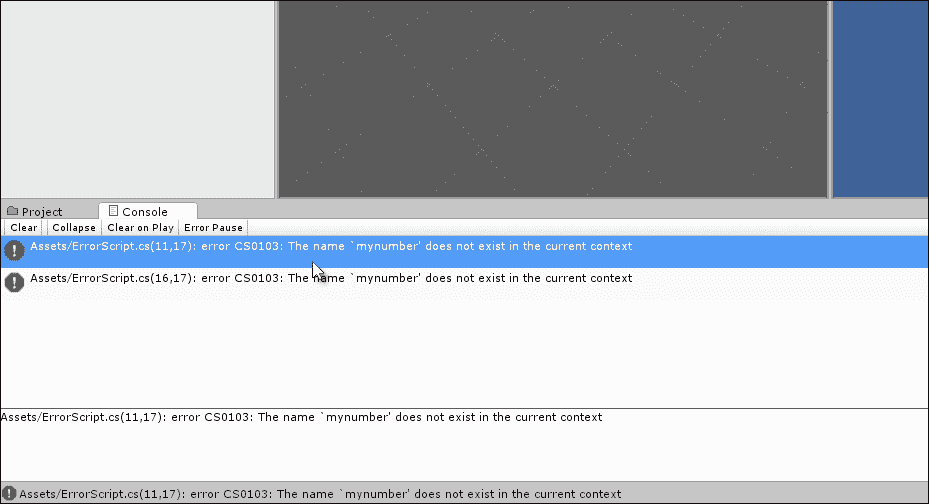

在控制台窗口中查看编译错误

如果编译错误没有按预期显示在 **控制台** 中，请确保错误过滤器已启用。要启用此功能，请单击 **控制台** 窗口右上角的错误过滤器图标（一个红色的感叹号图标）。**控制台** 窗口有三个过滤器，注释（**A**）、警告（**B**）和错误（**C**），如下截图所示，用于隐藏和显示特定消息。这些切换在 **控制台** 窗口中每种消息类型的可见性。注释是指你作为程序员，使用 `Debug.Log` 语句从你的代码中显式打印到 **控制台** 窗口的消息。我们很快就会看到这方面的例子（你也可以使用 `Print` 函数）。警告是指检测到你的代码中的潜在问题或浪费。这些在语法上是有效的，即使你忽略它们，也可以编译，但它们可能会引起问题或产生意外和浪费的结果。错误是指任何影响代码编译有效性的编译时错误，例如代码示例 2-1 中的错误。

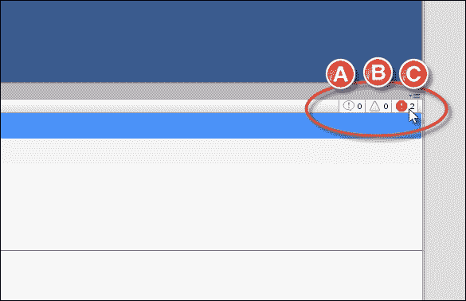

启用/禁用控制台窗口过滤器

当控制台充满了多个错误时，错误通常是按照编译器检测到的顺序列出的，即从上到下。被认为是一种最佳实践，按顺序处理错误，因为早期错误可能会引起后续错误。因此，解决早期错误可能会，潜在地，解决后续错误。要解决一个错误，首先双击**控制台**窗口中的错误，MonoDevelop 将自动打开，突出显示错误本身被发现或首次检测到的行。需要注意的是，MonoDevelop 会带您到错误首次被检测到的行，尽管解决错误并不总是涉及编辑该行。根据问题，您可能需要更改到突出显示的行以外的行。如果您双击由代码示例 2-1 生成的**控制台**中的顶部错误（第一个错误），MonoDevelop 将打开并突出显示第 11 行。您可以通过两种方式修复这个错误：要么在第 11 行将`mynumber`重命名为`MyNumber`，要么在第 6 行将变量`MyNumber`重命名为`mynumber`。现在，考虑以下代码示例 2-2：

```cs
01 using UnityEngine;
02 using System.Collections;
03 
04 public class ErrorScript : MonoBehaviour 
05 {
06 int MyNumber = 5;
07 
08 // Use this for initialization
09 void Start () {
10 	
11       MyNumber = 7;
12 }
13 
14 // Update is called once per frame
15 void Update () {
16       MyNumber = 10;
17 }
18 }
```

代码示例 2-2 修复了代码示例 2-1 中的错误。然而，它给我们留下了一个警告（如以下截图所示）。这表明变量`MyNumber`从未被使用。它在第 11 行和第 16 行被赋值，但这种赋值对应用程序的最终结果没有任何影响。在这里，这个警告可以被忽略，代码仍然有效。警告应该主要被视为编译器对您的代码提出的建议。您如何处理它们是您最终的选择，但我建议您在可能的情况下尝试消除错误和警告。

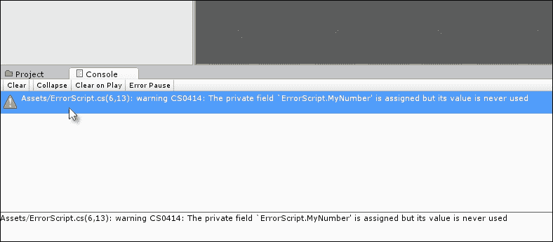

尝试消除错误和警告

# 使用 Debug.Log 进行调试——自定义消息

也许，在 Unity 中最古老且最著名的调试技术是使用`Debug.Log`语句将诊断信息打印到**控制台**，从而说明程序流程和对象属性。这项技术非常灵活且吸引人，因为它可以在几乎每一个**集成开发环境**（**IDE**）中使用，而不仅仅是 MonoDevelop。此外，所有 Unity 对象，包括向量和颜色对象，都有一个方便的`ToString`函数，它允许它们的内部成员（如*X*、*Y*和*Z*）被打印成人类可读的字符串——这种字符串可以轻松地发送到控制台进行调试。例如，考虑以下代码示例 2-3。这个代码示例演示了一个重要的调试工作流程，即打印关于对象实例化的状态信息。当这个脚本附加到场景对象上时，它会将其世界位置打印到**控制台**，并附带一条描述性信息：

```cs
01 using UnityEngine;
02 using System.Collections;
03 
04 public class CubeScript : MonoBehaviour 
05 {
06 // Use this for initialization
07 void Start () {

08        Debug.Log ("Object created in scene at position: " + transform.position.ToString());transform.position.ToString());

09 }
10 }
```

以下截图展示了当附加到立方体`GameObject`时，此代码在**控制台**中的输出。`Debug.Log`消息打印在主控制台消息列表中。如果用鼠标选择该消息，**控制台**还将指示与该语句相关的脚本文件和行。

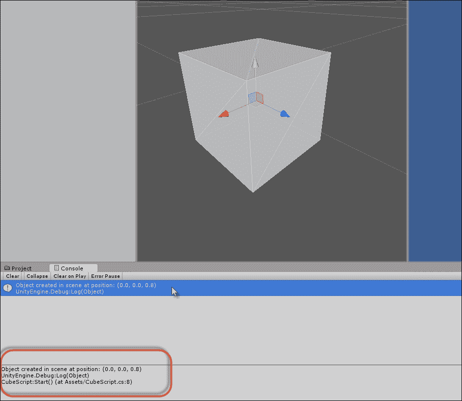

Debug.Log 消息可以将对象转换为字符串，控制台窗口也会指示相关的脚本文件和行

`Debug.Log`作为调试技术的局限性主要与代码整洁性和程序复杂性相关。首先，`Debug.Log`语句要求您明确地将代码添加到源文件中。当您完成调试后，您需要手动删除`Debug.Log`语句，或者保留它们，这既浪费资源又会导致混淆，尤其是如果您需要在许多其他地方添加额外的`Debug.Log`语句。其次，尽管`Debug.Log`在针对特定问题或监控特定变量随时间变化时很有用，但最终要获得代码及其执行的高级视图以跟踪您检测到但位置完全未知的问题是很尴尬的。然而，这些批评不应被视为完全避免使用`Debug.Log`语句的建议。它们应仅被视为适当使用它们的考虑。`Debug.Log`在错误或问题可以追溯到主要嫌疑人对象，并且您想观察或监控其值以查看它们如何变化或更新时效果最佳，尤其是在`OnStart`等事件期间。

### 注意

**移除 Debug.Log 语句**

当您的游戏准备构建和发布时，请记住删除或注释掉任何`Debug.Log`语句以获得额外的整洁性。

# 重写 ToString 方法

以下代码示例 2-3 展示了在结合使用`Debug.Log`调试时，`ToString`方法的便利性。`ToString`允许您将对象转换为人类可读的字符串，并将其输出到**控制台**。在 C#中，每个类默认继承`ToString`方法。这意味着通过继承和多态，您可以重写您类的`ToString`方法，按需定制它，并生成一个更易读、更准确的调试字符串，该字符串代表您的类成员。考虑以下代码示例 2-4，它重写了`ToString`。如果您养成为每个类重写`ToString`的习惯，您的类将更容易调试：

```cs
using UnityEngine;
using System.Collections;
//--------------------------------------------
//Sample enemy Ogre class
public class EnemyOgre : MonoBehaviour 
{
//--------------------------------------------
//Attack types for OGRE
public enum AttackType {PUNCH, MAGIC, SWORD, SPEAR};

//Current attack type being used
public AttackType CurrentAttack = AttackType.PUNCH;

//Health
public int Health = 100;

//Recovery Delay (after attacking)
public float RecoveryTime = 1.0f;

//Movement speed of Ogre - metres per second
public float Speed = 1.0f;

//Name of Ogre
public string OgreName = "Harry";
//--------------------------------------------
//Override ToString method
public override string ToString ()
{
    //Return a string representing the class

          return string.Format ("***Class EnemyOgre*** OgreName: {0} | Health: {1} | Speed: {2} | CurrentAttack: {3} | RecoveryTime: {4}", 
          OgreName, Health, Speed, CurrentAttack, RecoveryTime);
}

//--------------------------------------------
void Start()
{

            Debug.Log (ToString());
}
   //--------------------------------------------
}
//--------------------------------------------
```

前述代码的输出可以在以下所示的控制台窗口中看到：

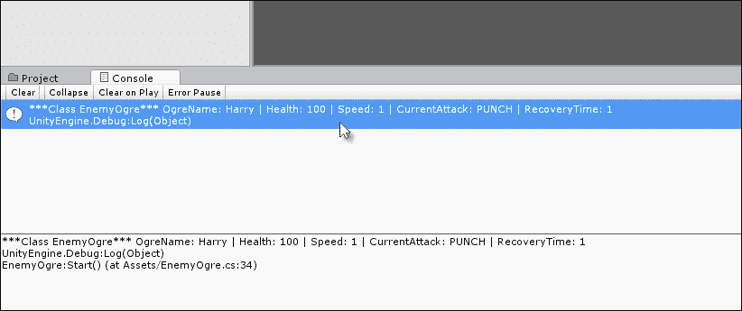

重写 ToString 方法以自定义类的调试消息

### 注意

**String.Format**

代码示例 2-3 的第 30 行使用了`String.Format`函数来构建一个完整的字符串。这个函数在你需要创建一个包含字面语句和变量值的字符串时非常有用，这些值可能是不同类型的。通过在字符串参数中插入标记`{0}, {1}, {2}…`，`Format`函数将按照提供的顺序将它们替换为后续函数参数；也就是说，`String.Format`将在标记的位置连接你的字符串参数，以及你的函数参数的字符串形式。因此，字符串`{0}`将被替换为`OgreName.ToString()`。有关`String.Format`的更多信息，请参阅[`msdn.microsoft.com/en-us/library/system.string.format%28v=vs.110%29.aspx`](http://msdn.microsoft.com/en-us/library/system.string.format%28v=vs.110%29.aspx)在线文档。

你可以在发布和调试版本之间划分并隔离代码块，这样当特定的标志被启用时，你可以运行针对调试的代码。例如，在调试游戏时，你通常会开发两组或多种代码：发布代码和调试代码。想象一个常见的场景，当你需要找到并解决代码中的错误时，你会求助于插入`Debug.Log`语句来打印变量和类的状态值。你可能还会插入额外的行，例如`if`语句和循环，来测试不同的场景并探索对象如何反应。修改代码一段时间后，问题似乎得到了修复，因此你移除了额外的调试代码并继续像之前一样进行测试。然而，后来你发现问题又出现了，或者出现了类似的问题。所以现在你希望你最终还是保留了调试代码，因为它们可能再次有用。你可能会对自己承诺说，下次你将简单地注释掉调试代码，而不是完全删除它。这样，如果代码再次需要，你可以简单地移除注释。然而，当然，必须注释和取消注释代码也是很麻烦的，尤其是如果有很多行，并且它们散布在多个文件和文件的部分。然而，你可以使用自定义的全局定义来解决此问题以及类似的问题。本质上，全局定义是一个特殊的预处理器标志，你可以启用或禁用它来有条件地编译或排除你的代码块。通过将标志设置为`true`，Unity 将自动编译你的代码的一个版本，而将标志设置为`false`，Unity 将编译另一个版本。这将允许你只在一组源文件中维护两个版本或变体：一个用于调试，一个用于发布。让我们在 Unity 中实际看看这个例子。考虑以下代码示例 2-5：

```cs
01 using UnityEngine;
02 using System.Collections;
03 
04 public class CubeScript : MonoBehaviour 
05 {
06 // Use this for initialization
07 void Start ()
08 {
09        #if SHOW_DEBUG_MESSAGES
10        //runs ONLY if the Define SHOW_DEBUG_MESSAGES is active
11        Debug.Log ("Pos: " + transform.position.ToString());
12       #endif
13 
14       //runs because it's outside the #if #endif block
15        Debug.Log ("Start function called");
16 }
17 }
```

第 09-12 行使用预处理指令 `#if` 和 `#endif` 进行条件功能。这个条件不是在运行时像常规的 `if` 语句那样执行，而是在编译时执行。在编译时，Unity 将决定全局定义 `SHOW_DEBUG_MESSAGES` 是否指定或激活。如果，并且只有当它是激活的，那么第 10 和 11 行将被编译，否则编译器将忽略这些行，将它们视为注释。使用这个功能，你可以将所有调试代码隔离在检查调试定义的 `#if #endif` 块内，并根据 `SHOW_DEBUG_MESSAGES` 定义激活和停用代码，该定义适用于项目范围内的所有源文件。那么剩下的问题是定义是如何设置的。要设置全局定义，从应用程序菜单导航到**编辑** | **项目设置** | **玩家**。然后，在**脚本定义符号**字段中输入定义名称，确保在输入名称后按*Enter*键确认更改，如图所示：

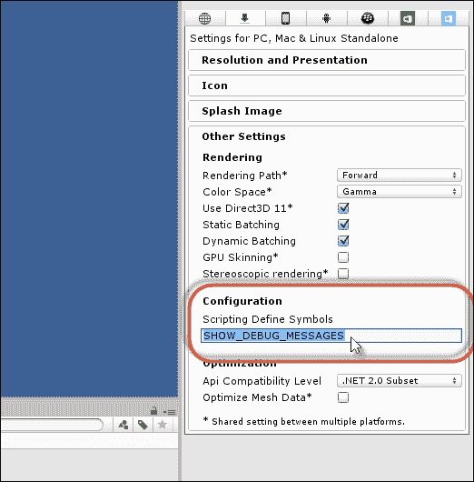

从 Unity 编辑器添加全局自定义定义，这允许你条件编译代码

### 注意

**移除定义并添加多个定义**

只需在**脚本定义符号**字段中输入你的全局定义名称即可使其生效并应用于你的代码。你可以删除名称来移除定义，但也可以在名称前加上斜杠 `/`（例如，`/SHOW_DEBUG_MESSAGE`）来禁用定义，这样就可以更容易地稍后重新启用它。你还可以添加多个定义，每个定义之间用分号符号分隔（例如，`DEFINE1;DEFINE2;DEFINE3…`）。

# 可视调试

使用数据的抽象或文本表示（如 `Debug.Log`）进行调试通常足够，但并不总是最优的。有时，一张图片胜过千言万语。所以，例如，当为敌人和其他角色编写视线功能，允许他们在进入范围时看到玩家和其他对象时，获取视图中视线实际位置的实时和图形表示非常有用。这个功能是以线条或线框立方体的形式绘制的。同样，如果一个对象正在沿着路径移动，那么在视图中绘制这条路径并以彩色线条显示它将非常棒。这个目的不是为了创建最终游戏中真正显示的视觉辅助工具，而是为了简化调试过程，让我们更好地了解游戏的工作方式。这些类型的辅助工具或图示是可视调试的一部分。Unity 已经为我们提供了许多自动的图示，例如碰撞体的线框边界框和摄像机的视锥体。然而，我们也有能力为我们自己的对象创建自己的图示。本节将进一步探讨图示。

如前所述，许多 Unity 对象，如碰撞体、触发体积、NavMesh 代理、摄像机和灯光，在选择时已经提供了自己的视觉辅助和 Gizmo。除非您将其关闭或将其大小减小到零，否则这些默认显示在**场景**视图中。因此，如果您已添加了原生 Unity 对象但在**场景**视图中看不到 Gizmo，请务必检查从**场景**工具栏通过**Gizmo**按钮可访问的**Gizmo**面板。启用您想要看到的所有 Gizmo，并调整**大小**滑块以增加或减少 Gizmo 的大小（选择最适合您的大小），如图所示：

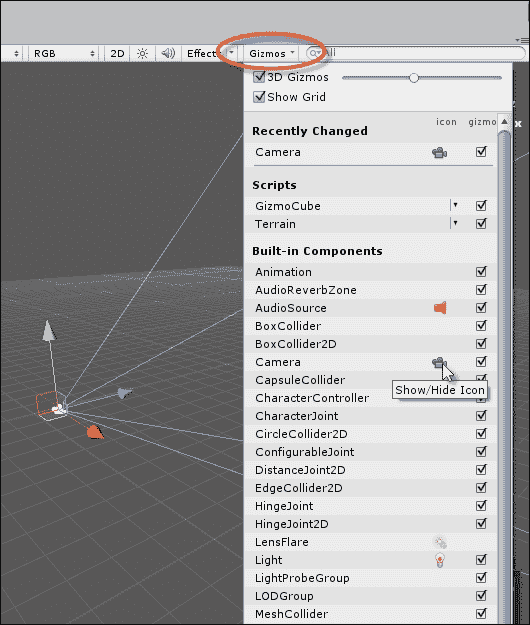

在场景视图中启用 Gizmo

### 注意

**游戏标签页中的 Gizmo**

Gizmos 默认不会在**游戏**标签页中显示。然而，您可以通过**游戏**标签页工具栏右上角的**Gizmo**按钮轻松更改此行为。此菜单的工作方式与**场景**标签页的**Gizmo**菜单类似，如前一张截图所示。

考虑以下代码示例 2-6。这是一个可以附加到对象上的示例类，它依赖于 Unity 的 Gizmo 类来绘制自定义范围的辅助 Gizmo。更多信息可以在网上找到，请参阅[`docs.unity3d.com/ScriptReference/Gizmos.html`](http://docs.unity3d.com/ScriptReference/Gizmos.html)。在此示例中，这个类绘制了一个以指定半径为中心的边界线框球体，代表对象的攻击范围。此外，它还绘制了一条视线向量，代表对象的正面方向，提供了对象朝向的视觉指示。所有这些 Gizmo 都是在`MonoBehaviour`的`OnDrawGizmos`事件中绘制的，条件是变量`DrawGizmos`为`true`：

```cs
using UnityEngine;
using System.Collections;

public class GizmoCube : MonoBehaviour
{
//Show debugging info?
 public bool DrawGizmos = true;

    //Called to draw gizmos. Will always draw.
    //If you want to draw gizmos for only selected object, then call

    //OnDrawGizmosSelected
 void OnDrawGizmos() 
    {
        if(!DrawGizmos) return;

         //Set gizmo color
         Gizmos.color = Color.blue;

        //Draw front vector - show the direction I'm facing
 Gizmos.DrawRay(transform.position, transform.forward.normalized *  4.0f);

          //Set gizmo color
          //Show proximity radius around cube
          //If cube were an enemy, they would detect the player within this radius

Gizmos.color = Color.red;
 Gizmos.DrawWireSphere(transform.position, 4.0f);

          //Restore color back to white
          Gizmos.color = Color.white;
   }
}
```

以下截图显示了如何绘制帮助调试的 Gizmo：

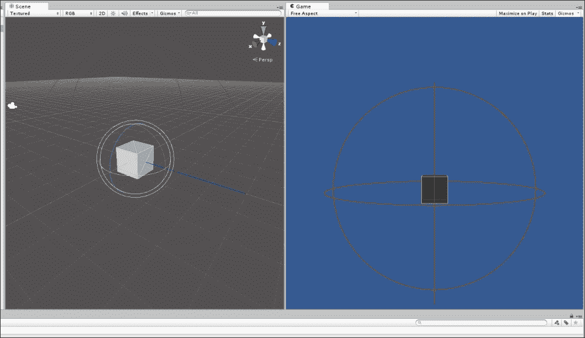

绘制 Gizmo

# 错误日志

当你编译并构建游戏以分发给测试人员时，无论他们是在办公室集中还是分布在全球各地，你都需要一种方法来记录游戏过程中发生的错误和异常。一种方法是通过日志文件。日志文件是由游戏在本地计算机上运行时生成的人类可读文本文件，它们记录了错误发生的详细信息，如果发生的话。你记录的信息量是一个需要仔细考虑的问题，因为记录过多的细节可能会使文件变得难以理解，而记录过少则可能使文件无用。然而，一旦达到平衡，测试人员就可以将日志发送给你进行检查，这有望让你能够快速定位代码中的错误并有效地修复它们，也就是说，不会引入新的错误！在 Unity 中实现日志行为有许多方法。一种方法是通过使用本地的`Application`类通过委托接收异常通知。考虑以下代码示例 2-7：

```cs
 01 //------------------------------------------------
 02 using UnityEngine;
 03 using System.Collections;
 04 using System.IO;
 05 //------------------------------------------------
 06 public class ExceptionLogger : MonoBehaviour 
 07 {
 08      //Internal reference to stream writer object
 09      private System.IO.StreamWriter SW;
 10 
 11      //Filename to assign log
 12      public string LogFileName = "log.txt";
 13 
 14      //------------------------------------------------
 15      // Use this for initialization
 16      void Start () 
 17      {
 18             //Make persistent
 19             DontDestroyOnLoad(gameObject);
 20 
 21      //Create string writer object

 22       SW = new System.IO.StreamWriter(Application.persistentDataPath + "/" + LogFileName);

 23 
 24      Debug.Log(Application.persistentDataPath + "/" + LogFileName);

 25       }
 26       //------------------------------------------------
 27      //Register for exception listening, and log exceptions
 28      void OnEnable() 
 29      {
 30            Application.RegisterLogCallback(HandleLog);
 31      }
 32      //------------------------------------------------
 33      //Unregister for exception listening
 34      void OnDisable() 
 35      {
 36           Application.RegisterLogCallback(null);
 37      }
 38       //------------------------------------------------
 39       //Log exception to a text file

 40       void HandleLog(string logString, string stackTrace, LogType type)

 41      {
 42      //If an exception or error, then log to file
 43      if(type == LogType.Exception || type == LogType.Error)
 44             {

 45                  SW.WriteLine("Logged at: " + System.DateTime.Now.ToString() + " - Log Desc: " + logString + " - Trace: " + stackTrace + " - Type: " + type.ToString());

 46             }
 47       }
 48       //------------------------------------------------
 49       //Called when object is destroyed
 50       void OnDestroy()
 51       {
 52             //Close file
 53             SW.Close();
 54       }
 55       //------------------------------------------------
 56 }
 57 //------------------------------------------------
```

以下是对代码示例 2-7 的注释：

+   **第 22 行**：创建一个新的`StreamWriter`对象，用于将调试字符串写入计算机上的文件。该文件位于`Application.persistentDataPath`内部；这指向一个始终可写的系统位置。

+   **第 30 行**：使用函数引用`HandleLog`作为参数调用`Application.RegisterLogCallBack`方法。这依赖于委托。简而言之，传递了`HandleLog`函数的引用，当发生错误或异常时，这个引用将被调用，允许我们将详细信息写入日志文件。

+   **第 45 行**：当发生错误时，调用`StreamWriter`的`WriteLine`方法将文本数据打印到日志文件。错误信息由 Unity 通过`HandleLog`参数提供：`logString`、`stackTrace`和`LogType`。`StreamWriter`类是 Mono Framework 的一部分，Mono Framework 是 Microsoft .NET Framework 的开源实现。有关`StreamWriter`的更多信息，请参阅[`msdn.microsoft.com/en-us/library/system.io.streamwriter%28v=vs.110%29.aspx`](http://msdn.microsoft.com/en-us/library/system.io.streamwriter%28v=vs.110%29.aspx)。

    ### 小贴士

    测试错误记录器的一种快速方法就是创建一个除以零的错误。别忘了在代码中某处插入一行`Debug.Log (Application.persistentDataPath);`，以便将日志文件路径打印到**控制台**窗口。这可以帮助你通过 Windows 资源管理器或 Mac 查找器快速找到系统中的日志文件。请注意，使用的是`persistentDataPath`变量而不是绝对路径，因为它们在不同的操作系统之间是不同的。

以下截图显示了如何将错误打印到基于文本的日志文件：

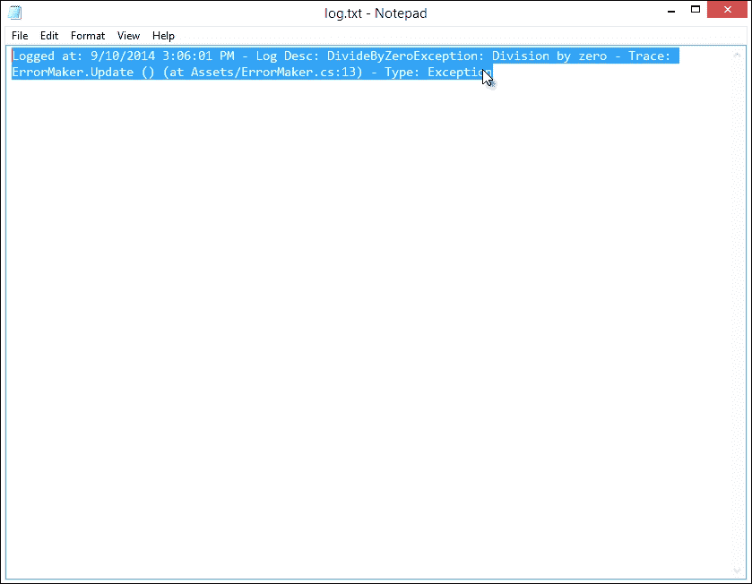

将错误打印到基于文本的日志文件可以使调试和错误修复更容易

C#中的委托是什么？想象一下，你能够创建一个变量并将其分配一个函数引用而不是一个常规值。完成此操作后，你可以像调用函数一样调用该变量，在稍后时间调用引用的函数。你甚至可以在以后重新分配变量以引用新的不同函数。本质上，这就是委托的工作方式。如果你熟悉 C++，委托实际上与函数指针相当。因此，委托是特殊类型，可以引用和调用函数。它们非常适合创建可扩展的回调系统和事件通知。例如，通过保持委托类型的列表或数组，许多不同的类可以通过将自己添加到列表中作为回调的监听器来注册自己。有关 C#的更多信息，请参阅[`msdn.microsoft.com/en-gb/library/ms173171.aspx`](http://msdn.microsoft.com/en-gb/library/ms173171.aspx)。以下代码示例 2-8 展示了在 Unity 中 C#委托使用的一个例子：

```cs
using UnityEngine;
using System.Collections;
//---------------------------------------------------
public class DelegateUsage : MonoBehaviour 
{
 //Defines delegate type: param list
 public delegate void EventHandler(int Param1, int Param2);
//---------------------------------------------------
//Declare array of references to functions from Delegate type - max 10 events

public EventHandler[] EH = new EventHandler[10];
//---------------------------------------------------
/// <summary>
/// Awake is called before start. Will add my Delegate HandleMyEvent to list
/// </summary>
void Awake()
{
    //Add my event (HandleMyEvent) to delegate list
    EH[0] = HandleMyEvent;
}
//---------------------------------------------------
/// <summary>
/// Will cycle through delegate list and call all events
/// </summary>
 void Start()
 {
    //Loop through all delegates in list
    foreach(EventHandler e in EH) 
    {
          //Call event here, if not null
          if(e!=null)
               e(0,0); //This calls the event
    }
 }
//---------------------------------------------------
/// <summary>
/// This is a sample delegate event. Can be referenced by Delegate Type EventHandler
/// </summary>
/// <param name="Param1">Example param</param>
/// <param name="Param2">Example param</param>
 void HandleMyEvent (int Param1, int Param2)
 {
    Debug.Log ("Event Called");
 }
//---------------------------------------------------
```

# 编辑器调试

有时候人们声称 Unity 编辑器没有内置的调试工具，但这并不完全正确。使用 Unity，你可以在游戏运行时同时播放游戏和编辑场景。你甚至可以观察和编辑对象检查器中的属性，无论是私有的还是公共的，就像我们之前看到的。这可以给你一个关于游戏运行时的完整和图形化的视图；并允许你检测和观察广泛潜在的错误。这种调试形式不应被低估。要充分利用编辑器中的调试，请通过点击检查器右上角的上下文菜单图标，从对象检查器激活**调试**模式，然后从菜单中选择**调试**，如图所示：

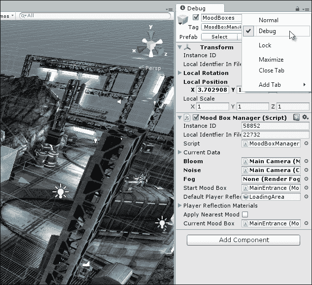

从对象检查器访问调试模式

接下来，请确保你的视口配置得当，以便在**播放**模式下同时看到**场景**和**游戏**视图，以及**统计**面板。为了实现这一点，如果**游戏**选项卡工具栏中的**最大化播放**按钮被激活，请将其禁用。然后，在界面中将**场景**和**游戏**选项卡并排排列，或者如果你有多个显示器，可以将它们跨多个显示器排列。如果你的预算允许，强烈建议使用多个显示器，但单个显示器也可以很好地工作，只要你投入额外的时间来调整和调整每个窗口的大小，以最好地满足你的需求。此外，你通常希望**控制台**窗口可见，而**项目**面板隐藏，以防止意外选择和移动资源，如下面的截图所示。记住，你还可以自定义 Unity GUI 布局。更多信息请参阅[`docs.unity3d.com/Manual/CustomizingYourWorkspace.html`](http://docs.unity3d.com/Manual/CustomizingYourWorkspace.html)。

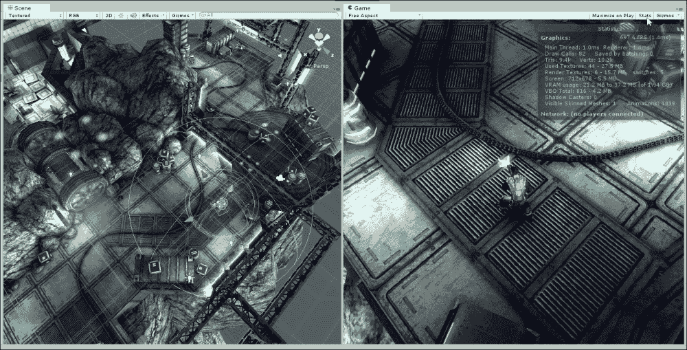

使用单显示器布局从编辑器调试游戏

一旦你准备好在编辑器中进行调试，点击工具栏上的播放按钮，如果你需要停止游戏事件来检查特定对象及其值，可以使用暂停。记住，你仍然可以在游戏中使用变换（位置、旋转和缩放）工具来重新定位玩家或敌人，从而尝试新的值并查看哪些有效，哪些无效。然而，最重要的是，在**游戏**模式下通过对象检查器或变换工具对场景的所有编辑都是临时的，并在**播放**模式结束后恢复。因此，如果你需要永久更改设置，那么你需要在**编辑**模式中做出更改。当然，你可以随时使用**组件**上下文菜单在**播放**和**编辑**模式之间复制和粘贴值，如下面的截图所示。记住，快捷键(*Ctrl* + *P*)在**播放**模式之间切换，(*Ctrl* + *Shift* + *P*)在暂停和未暂停之间切换。Unity 的完整快捷键列表可以在[`docs.unity3d.com/Manual/UnityHotkeys.html`](http://docs.unity3d.com/Manual/UnityHotkeys.html)找到。

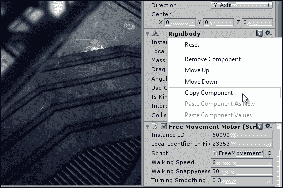

通过组件上下文菜单复制和粘贴组件值

# 使用性能分析器

一个部分用于调试和部分用于优化的额外工具是**性能分析器**窗口，它仅在 Unity Pro 中通过在应用程序菜单的**窗口**中点击**性能分析器**选项卡来访问，如下面的截图所示。简而言之，性能分析器为你提供了一个从上到下的统计视图，展示了时间和工作负载如何在游戏的各个部分以及系统硬件组件（如 CPU 和显卡）之间分布。使用性能分析器，你可以确定，例如，场景中相机渲染所消耗的时间与物理计算或音频功能相比，以及与其他类别相比。它让你能够测量性能，比较数字，并评估性能可以改进的地方。性能分析器并不是一个专门提醒你代码中存在错误的具体工具。然而，如果你在运行游戏时遇到性能问题，如卡顿和冻结，那么它可能能引导你找到可以进行优化的地方。因此，如果你决定性能是你的游戏问题，并且需要经过教育、研究分析的改进起点，性能分析器是一个你会转向的工具。

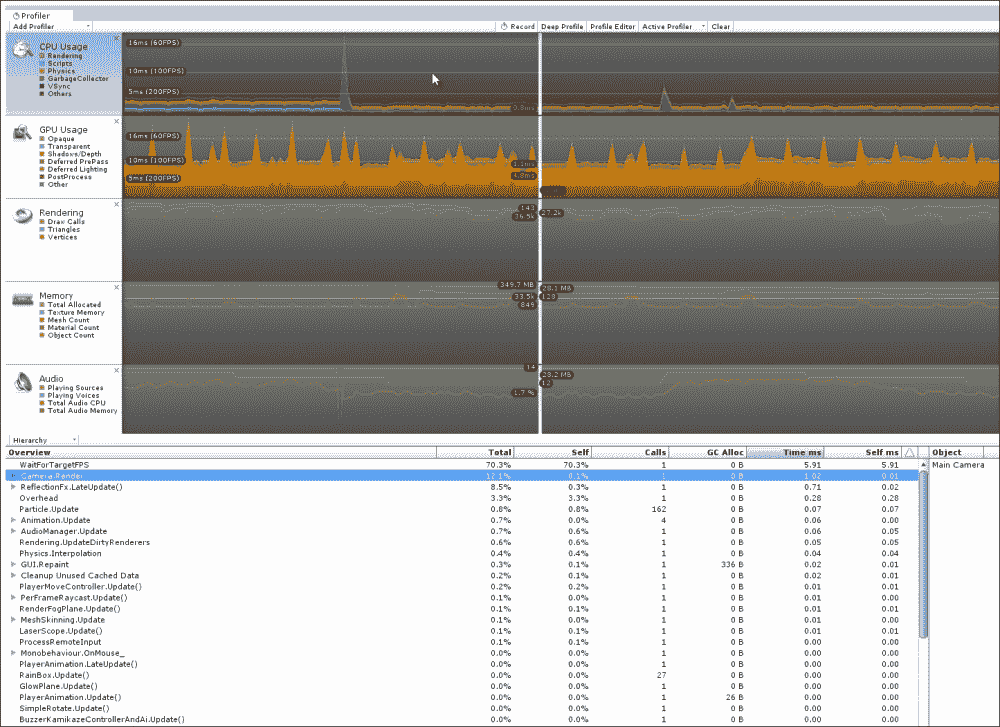

性能分析器通常用于诊断性能问题

当你使用打开的**Profiler**窗口运行游戏时，图表会填充关于最近帧的统计数据。性能分析器通常不会记录自游戏开始以来的所有帧的信息，而只记录最近的一些帧，这些帧可以合理地放入内存中。在**Profiler**窗口的上部工具栏中有一个可切换的“深度分析”方法，理论上它允许你获取关于游戏的额外信息，但我建议你避免使用此模式。它可能会在运行资源密集型和代码密集型游戏时导致 Unity 编辑器的性能问题，甚至可能完全冻结编辑器。相反，我建议你只使用默认模式。当使用此模式时，在大多数情况下，你可能会想要从**CPU Usage**区域禁用**VSync**的可视化，以获得更好的其他性能统计信息视图，包括**Rendering**和**Scripts**，如下面的截图所示。为此，只需在图表索引区域单击**VSync**图标：

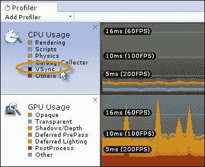

在 Profiler 窗口的 CPU 使用区域禁用 VSync 显示

图表的横轴代表帧——最近添加到内存缓冲区的帧。当游戏运行时，这个轴会持续填充新的数据。纵轴代表时间或计算开销：更高的值表示更苛刻且更慢的帧时间。在**播放**模式下，当图表填充了一些数据后，你可以暂停游戏来检查其状态。从图表中选择帧以查看该帧的游戏性能的更多信息。当你这样做时，**Profile**窗口下半部分的**Hierarchy**面板会填充关于在选定帧上执行的代码的功能数据。在查看图表时，注意观察突然的增加（峰值或尖峰），如下面的截图所示。这些表示突然且强烈的活动帧。有时，它们可能是由于硬件操作而无法避免的一次性事件，或者它们是合法发生的，并不是性能问题的来源，例如场景转换或加载界面。

然而，它们也可能表示问题，尤其是如果它们经常发生。因此，在诊断性能问题时，寻找峰值是一个好的开始。

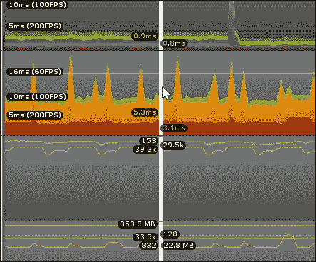

从性能分析器图表中选择帧

**Hierarchy**视图列出了在选定帧上执行的代码中的所有主要函数和事件。对于每个函数，都有几个关键属性，如**Total**、**Self**、**Time ms**和**Self ms**，如下所示：

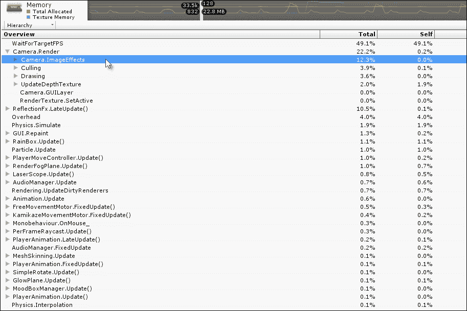

检查选定帧中的函数调用

让我们更详细地讨论这些关键属性：

+   **Total 和 Time ms**: **Total** 列表示函数消耗的帧时间的比例。例如，**49.1%** 的值意味着所选帧所需的总时间的 49.1% 被函数消耗，包括调用子函数（函数内部调用的函数）所花费的时间。**Time ms** 列以绝对值表达帧消耗时间，以毫秒为单位。这两个值共同提供了对在每一帧和总体上调用函数代价的相对和绝对度量。

+   **Self 和 Self ms**: **Total** 和 **Total ms** 设置衡量所选帧中函数的消耗，但它们包括从函数内部调用的其他函数所花费的总时间。**Self** 和 **Self ms** 排除这部分时间，仅表达函数内部所花费的总时间，减去等待其他函数完成的多余时间。这些值在试图确定导致性能问题的特定函数时通常是最重要的。

更多关于 Unity Profiler 的信息可以在 [`docs.unity3d.com/Manual/ProfilerWindow.html`](http://docs.unity3d.com/Manual/ProfilerWindow.html) 找到。

# 使用 MonoDevelop 进行调试 – 入门

之前，我们遇到了调试的 `Debug.Log` 方法，在代码的关键时刻打印辅助消息到控制台，以帮助我们了解程序的执行情况。然而，这种方法虽然有效，但存在一些显著的缺点。首先，当编写包含许多 `Debug.Log` 语句的大型程序时，很容易有效地“垃圾邮件”控制台，导致难以区分所需的和不必要的消息。其次，通过插入 `Debug.Log` 语句来更改代码以监控程序流程和查找错误通常是一种不良的做法。理想情况下，我们应该能够在不更改代码的情况下进行调试。因此，我们有许多理由去寻找替代的调试方法。MonoDevelop 可以在这里帮助我们。具体来说，在 Unity 的最新版本中，MonoDevelop 可以原生地附加到正在运行的 Unity 进程。通过这样做，我们可以访问一系列常见的调试工具，就像在开发其他类型的软件时遇到的那样，例如断点和跟踪。然而，目前 MonoDevelop 和 Unity 之间的连接可能存在一些问题，对于某些系统上的某些用户来说。但是，当按预期工作的时候，MonoDevelop 可以提供丰富且有用的调试体验，使我们能够超越仅仅编写 `Debug.Log` 语句的简单方法。

要使用 MonoDevelop 开始调试，让我们考虑断点。在调试代码时，您可能会需要观察程序在到达指定行时的流程。断点允许您在 MonoDevelop 中标记源文件中的一行或多行，当程序在 Unity 中运行时，其执行将在第一个断点处暂停。在此暂停时，您有机会检查代码和变量的状态，以及检查和编辑它们的值。您还可以通过单步执行继续执行。这允许您按正常程序逻辑逐行推进执行。您有机会在代码经过每一行时检查它。让我们看一个示例案例。以下代码示例 2-9 显示了一个简单的脚本文件。当附加到对象时，它会检索场景中所有对象（包括自身）的列表，然后在**Start**函数执行时将它们的位置设置为世界原点（0, 0, 0），该函数在关卡启动时发生：

```cs
using UnityEngine;
using System.Collections;

public class DebugTest : MonoBehaviour 
{
   // Use this for initialization
void Start () 
    {
         //Get all game objects in scene
         Transform[] Objs = Object.FindObjectsOfType<Transform>();

         //Cycle through all objects
         for(int i=0; i<Objs.Length; i++)
         {
               //Set object to world origin
 Objs[i].position = Vector3.zero;
         }
    }
 }
```

让我们在高亮行上设置一个断点，通过 MonoDevelop。当程序执行到达此行时，它将暂停。要设置断点，将鼠标光标置于高亮行上，在左侧灰色边缘处右键单击，并选择**新断点**。否则，可以使用 MonoDevelop 应用程序菜单在**运行**中选择**新断点**选项，或者您也可以按*F9*键（或者您也可以左键单击行号），如图所示：

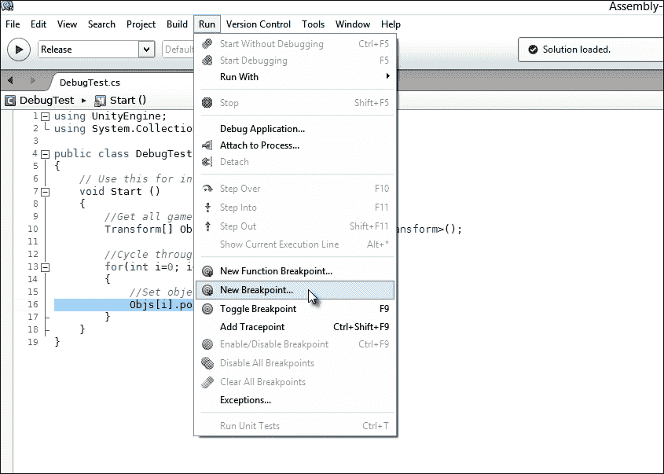

在 MonoDevelop 中创建新的断点

断点行将以红色突出显示。为了使断点在游戏运行时与 Unity 正常工作，您需要将 MonoDevelop 附加到正在运行的 Unity 进程。为此，请确保 Unity 编辑器与 MonoDevelop 同时运行，然后从 MonoDevelop 应用程序菜单中选择**附加到进程**选项，如以下截图所示：


附加到进程

**附加到进程**对话框出现，**Unity Editor**应列在**进程名称**中，MonoDevelop 可以附加到该进程。窗口左下角的**调试器**下拉列表应指定为**Unity Debugger**。选择**Unity Editor**选项，然后选择**附加**按钮，如图所示：

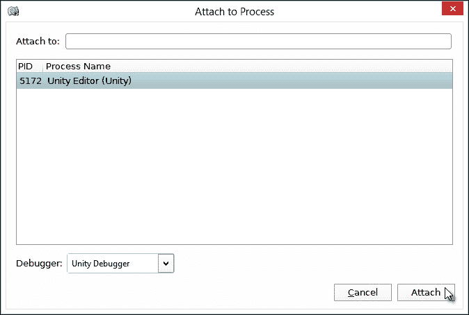

从**附加到进程**对话框中选择 Unity 编辑器

当 MonoDevelop 作为进程附加到 Unity 时，两个新的底部对齐的面板将自动停靠到 MonoDevelop 界面中，这些面板包括**监视**窗口和**立即**窗口，如以下截图所示。当您的游戏在 Unity 编辑器中运行时，这些窗口提供了额外的调试信息和视图，我们将在下一节中看到。

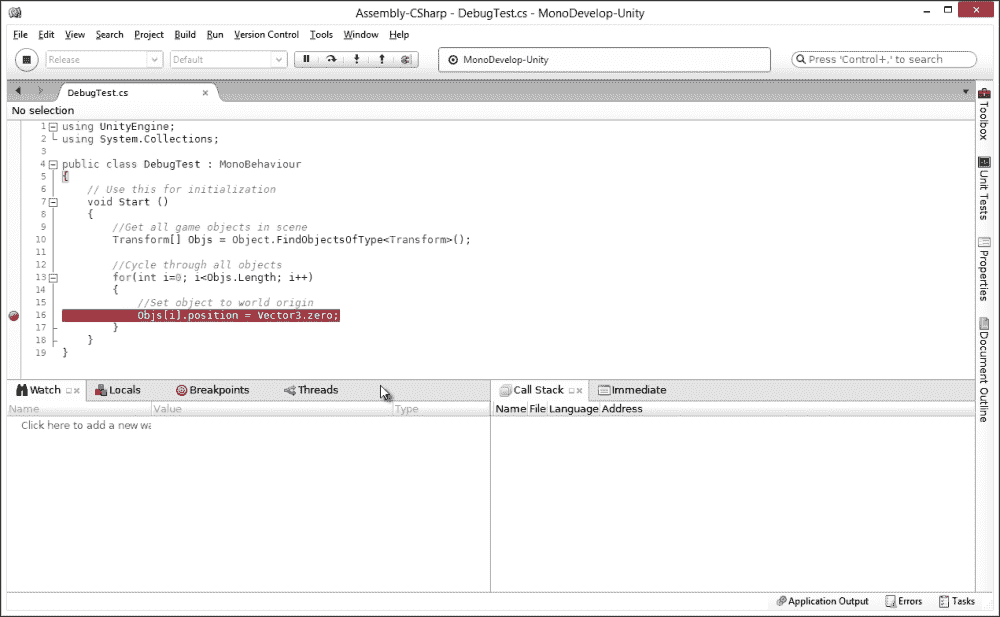

当附加到 Unity 进程时，两个新的面板会自动停靠到 MonoDevelop 中

接下来，返回到 Unity 编辑器，并确保脚本文件 `DebugTest.cs`（如代码示例 2-9 所示）已附加到场景中的对象上，并且场景中包含其他对象（任何对象，例如立方体或圆柱体）。然后，使用 Unity 工具栏中的播放按钮运行您的游戏，如图所示：

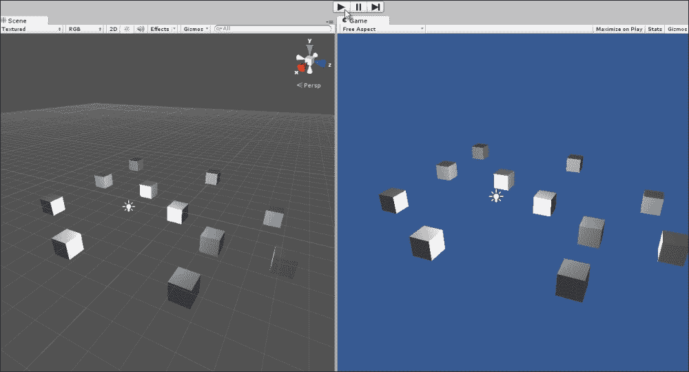

从 Unity 编辑器运行以准备使用 MonoDevelop 调试

当您在附加 MonoDevelop 时按下 Unity 工具栏上的播放按钮，当达到断点时（断点模式），Unity 的执行将暂停。焦点将切换到带有断点行（在源文件中用黄色突出显示）的 MonoDevelop 窗口，该行指示当前的执行步骤，如图以下截图所示。在此模式下，您不能使用 Unity 编辑器，并且您不能在视图中切换或甚至像在编辑器调试中那样在对象检查器内编辑设置。MonoDevelop 正在等待您的输入以恢复执行。接下来的几节将考虑一些在断点模式下可用的有用调试工具。

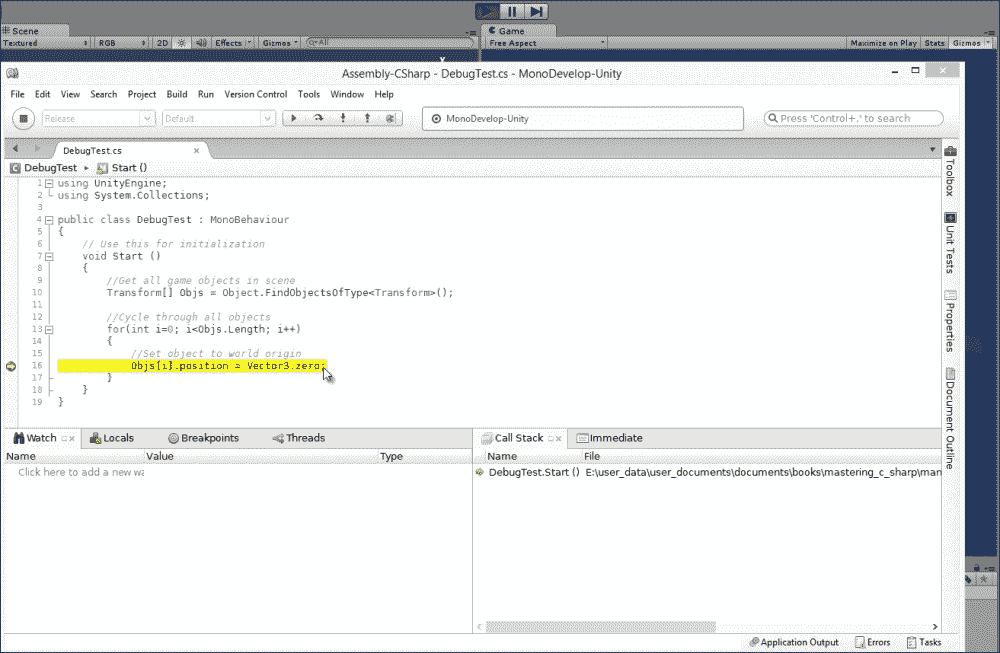

从 MonoDevelop 内进入断点模式

# 使用 MonoDevelop 调试 – 观察窗口

**观察**窗口允许您查看当前步骤中内存中活动的变量的值，这包括局部和全局变量。在断点模式下快速为变量添加监视的一种方法是在代码编辑器中突出显示它，然后将鼠标悬停在其上。当您这样做时，将鼠标悬停几秒钟，将自动出现一个弹出窗口。此窗口允许完全检查变量，如图以下截图所示。您可以收缩和展开类的成员，并检查所有变量的状态。

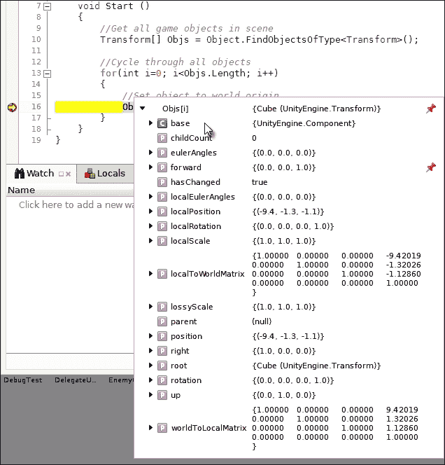

在断点模式下使用悬停监视检查变量

您可以使用此悬停方法检查任何活动对象的几乎所有变量值。然而，通常，您可能希望在一个变量甚至一组变量上放置一个更持久的监视，以便您可以在列表中一起查看它们的值。为此，您可以使用位于 MonoDevelop 界面左下角的**观察**窗口。要在该窗口中添加新的监视，请右键单击**观察**列表，然后从上下文菜单中选择**添加监视**，如图所示：

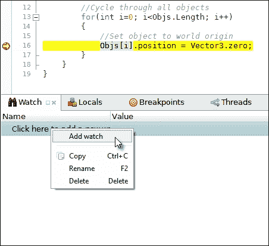

向观察窗口添加监视

在添加新的观察时，您可以在**名称**字段中输入任何有效的表达式或变量名，结果值将在**值**列中显示，如下面的截图所示。在**观察**字段中显示的值仅适用于当前执行行，并且随着程序的进行而改变。请记住，您可以添加任何在当前作用域中可以引用的有效变量的观察，包括`name`、`tag`、`transform.position`等。

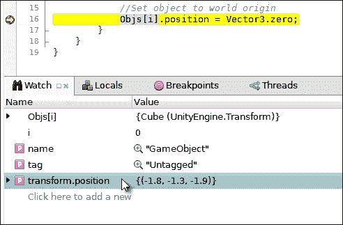

在观察窗口中添加观察

您可以使用**观察**窗口来检查任何有效的变量和表达式，无论它们是否与活动类或代码行相关。这意味着您可以看到全局变量的值以及与其它类或对象相关的任何变量，只要它们是有效的并且在内存中。然而，如果您只对查看局部变量感兴趣，即变量的作用域与当前步骤中正在执行的代码块相关，那么您可以使用**局部变量**窗口而不是**观察**窗口。此窗口会自动为所有局部变量添加观察。您不需要手动添加。在这里，**局部变量**窗口默认情况下位于**观察**窗口旁边：

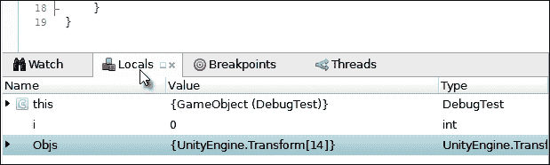

仅使用**局部变量**窗口检查局部变量

如果您在 MonoDevelop 界面中没有看到任何相关的**调试**窗口，例如**观察**窗口或**局部变量**窗口，您可以通过点击 MonoDevelop 应用程序菜单中的**视图**下的**调试窗口**选项来手动显示或隐藏它们：

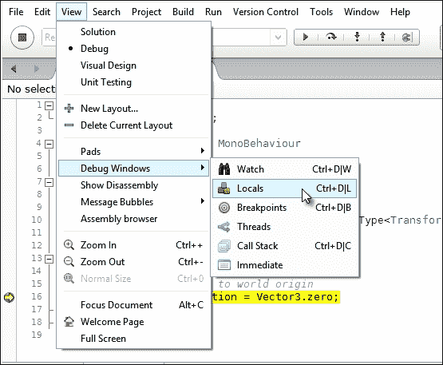

**观察**和**局部变量**窗口的一个优点是它们提供了对变量的读写访问。这意味着您不仅限于查看变量值，还可以写入它们，在 MonoDevelop 内部更改变量。要这样做，只需从**观察**或**局部变量**窗口的双击**值**字段，然后为变量输入新值：

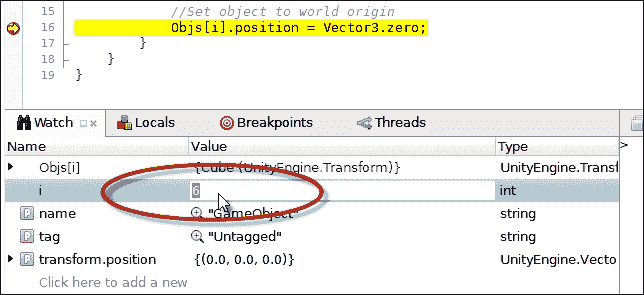

从观察窗口编辑值

# 使用 MonoDevelop 进行调试 – 继续和单步执行

在达到断点并检查你的代码后，你很可能会想要退出断点模式并以某种方式继续程序执行。你可能想继续程序执行，这实际上将程序控制权交还给 Unity。这允许执行继续正常进行，直到遇到下一个断点（如果有的话）。这种方法有效地以正常方式恢复执行，并且除非遇到新的断点，否则永远不会再次暂停。要从 MonoDevelop 以这种方式继续，请按 *F5* 键或从 MonoDevelop 工具栏中按播放按钮。否则，从 MonoDevelop 应用程序菜单中选择 **Run** 中的 **Continue Debugging** 选项，如图所示：

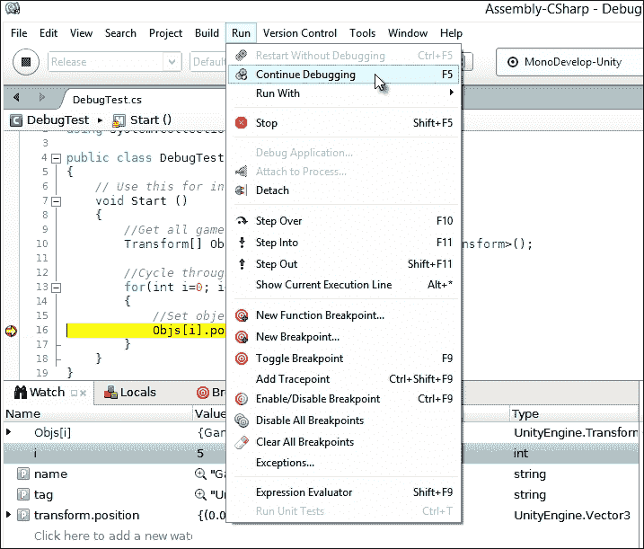

退出断点模式并使用继续调试恢复

然而，有许多情况下，你不想以这种方式继续执行。相反，你希望逐行执行代码，逐行评估每行，并检查程序流程以查看变量如何变化以及受语句的影响。单步执行模式有效地让你观察程序流程的实时情况。在调试中主要有三种单步执行方式：单步执行、进入和退出。单步执行指示调试器移动到下一行代码，然后再次暂停，等待你的检查，就像下一行是一个新的断点一样。如果在下一行遇到外部函数调用，调试器会像往常一样调用该函数，然后跳到下一行而不进入函数。这样，函数就是“单步执行”的。函数仍然会发生，但它在继续模式下发生，并且下一个步骤或断点设置在函数之后的下一行。要单步执行，请按 *F10*，从应用程序菜单中选择 **Run** 中的 **Step Over** 命令，或按 MonoDevelop 工具栏中的 **Step Over** 按钮，如图所示：

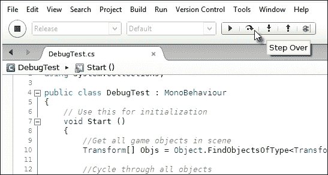

单步执行代码会将执行移动到下一语句，而不进入外部函数

如果遇到外部函数调用，**Step Into** (*F11*) 命令允许调试进入此函数。这实际上在进入函数的第一行设置了下一个断点，允许在下一个步骤中继续调试。如果你需要观察多少个函数协同工作，这可能会很有用。在任何时候，如果你想通过在继续模式下向前移动来退出进入的函数，可以使用 **Step Out** (*Shift* + *F11*) 命令，并且执行将在外部函数的下一行继续。

# 使用 MonoDevelop 调试 – 调用堆栈

更复杂的程序通常涉及大量的函数和函数调用。在执行过程中，函数可以调用其他函数，而这些函数可以继续在函数内部的复杂函数链中调用更多函数。这意味着当在函数内部设置断点时，您永远不知道函数在运行时实际调用时是如何被最初调用的。断点告诉您程序执行已到达指定的行，但它不会告诉您执行最初是如何到达那里的。有时，这可能很容易推断，但有时可能会困难得多，尤其是在函数在循环、条件语句和嵌套循环和条件语句中调用时。考虑以下代码示例 2-10，它已被从早期的代码示例 2-9 中修改。这个类包含几个调用其他函数的函数：

```cs
using UnityEngine;
 using System.Collections;

 public class DebugTest : MonoBehaviour 
 {
    // Use this for initialization
    void Start () 
    {
          //Get all game objects in scene
          Transform[] Objs = Object.FindObjectsOfType<Transform>();

         //Cycle through all objects
         for(int i=0; i<Objs.Length; i++)
         {
                //Set object to world origin
                Objs[i].position = Vector3.zero;
         }

         //Enter Function 01
         Func01();
    }
    //-------------------------------------
    //Function calls func2
 void Func01()
    {
           Func02();
    }
    //-------------------------------------
    //Function calls func3
    void Func02()
    {
           Func03();
    }
    //-------------------------------------
    //Function prints message
    void Func03()
    {
 Debug.Log ("Entered Function 3");
    }
    //-------------------------------------
 }
```

如果在代码示例 2-10 的第 38 行设置了断点（已高亮显示），当执行到这一行时程序将暂停。通过阅读这个示例，我们可以看到到达该函数的一条路径是通过`Start`函数调用`Func01`，然后`Func01`调用`Func02`，最后`Func02`最终调用`Func03`。但是，我们如何知道这是唯一的路径呢？技术上，例如，项目中的另一个类和函数可以直接调用`Func03`。那么，在调试过程中，我们如何知道我们到达这个函数的路径呢？基于到目前为止检查的工具，我们无法知道。然而，我们可以使用**调用栈**窗口。这个窗口默认显示在 MonoDevelop 界面的右下角，列出了为达到当前步骤的激活函数而进行的所有函数调用，从而返回到第一个或初始函数调用。它为我们提供了一个从激活函数到第一个或初始函数的函数名称的面包屑路径。因此，**调用栈**以倒序列出函数名称，最活跃或最近的函数位于栈顶，向下延伸到栈底最早或第一个函数。您还可以访问这些函数的位置，以评估它们作用域内的变量，如下所示：

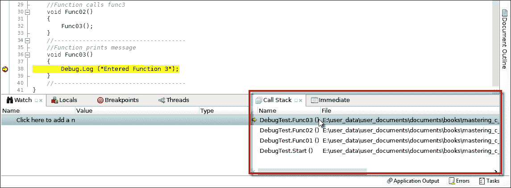

使用调用栈追踪程序执行期间函数的启动过程

# 使用 MonoDevelop 进行调试 – 立即窗口

对于游戏，**即时**窗口类似于许多第一人称射击游戏（如*Unreal*、*Half Life*或*Call of Duty*）中的**控制台**窗口。**即时**窗口默认停靠在 MonoDevelop 界面的右下角。它在断点模式下变为活动状态。使用它，我们可以输入表达式和语句，它们将被立即评估，就像它们是此步骤的源代码的一部分一样。我们可以获取和设置活动变量的值，以及执行其他操作。我们可以编写任何有效的表达式，例如`2+2`和`10*5`。这些表达式的结果将在**即时**窗口的下一行输出，如图所示：

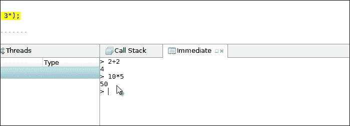

在即时窗口中评估表达式

当然，你不仅限于编写涉及基本算术运算（如加法和减法）的孤立语句。你可以编写包含活动变量的完整表达式：

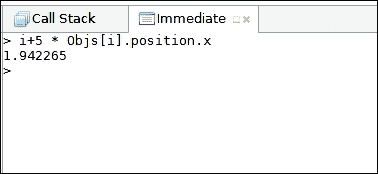

在即时窗口中编写更高级的表达式

总体而言，**即时**窗口特别适用于测试代码，在**即时**窗口中编写替代场景，并查看它们的评估结果。

# 使用 MonoDevelop 进行调试 – 条件断点

断点对于调试至关重要，它代表了应用程序执行暂停进入调试状态的开始点。通常，断点正是你设置断点并开始调试所需的东西！然而，有时断点在其默认配置下可能会变得令人烦恼。一个例子是在循环内部设置断点。有时，你可能只想在循环超过指定次数迭代后使断点生效或暂停执行，而不是从开始就在每次迭代后生效。默认情况下，循环内的断点会在每次迭代时暂停执行，如果循环很长，这种暂停行为可能会很快变得令人厌烦。为了解决这个问题，你可以设置断点条件，指定断点生效必须为真的状态。要设置断点条件，右键单击断点，从上下文菜单中选择**断点属性**，如图所示：

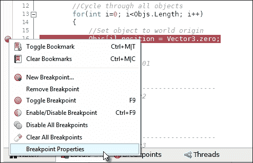

通过访问断点属性来设置条件

选择**断点属性**将显示**断点属性**对话框，其中可以指定断点的条件。在**条件**部分，选择**当条件为真时中断**选项，然后使用**条件表达式**字段指定确定断点的条件。对于循环条件，表达式`i>5`将在循环迭代器超过`5`时触发断点。当然，变量`i`应替换为您自己的变量名。


设置断点的条件

# 使用 MonoDevelop 进行调试 – 跟踪点

跟踪点可以为您提供比使用`Debug.Log`语句更整洁的替代方案，正如我们所看到的，这迫使我们修改正在调试的代码。跟踪点的工作方式类似于断点，即在您的源文件中标记行。它们不会更改代码本身，但（与断点不同）当调试器遇到它们时，它们不会暂停程序执行。相反，它们会自动执行指定的指令。通常，它们会将调试语句打印到 MonoDevelop 的**应用程序输出**窗口中，但不会打印到 Unity 的**控制台**。要在代码示例 2-10 的第 16 行设置断点，请将光标置于第 16 行，然后从应用程序菜单中选择**运行**中的**添加跟踪点**（或按*Ctrl* + *Shift* + *F9*），如下所示：

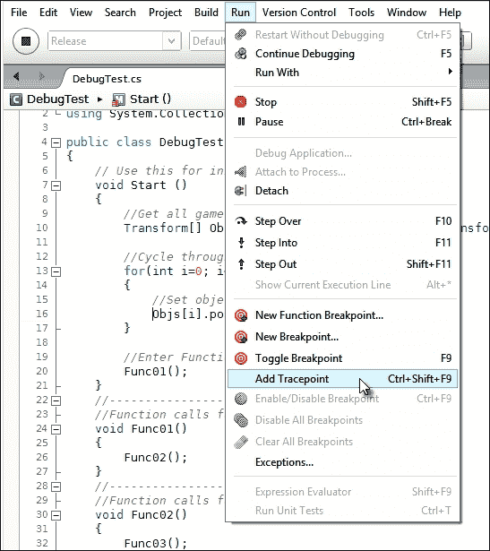

将跟踪点添加到 MonoDevelop 中选定的行

在选择**添加跟踪点**选项时，MonoDevelop 将显示**添加跟踪点**对话框。**跟踪文本**字段允许你在运行时遇到跟踪点时将文本打印到**应用程序输出**窗口。您还可以插入大括号开闭符号来定义字符串中应评估表达式的区域。这可以让您将变量的值打印到调试字符串中，例如`"循环计数器是 {i}"`，如下所示：

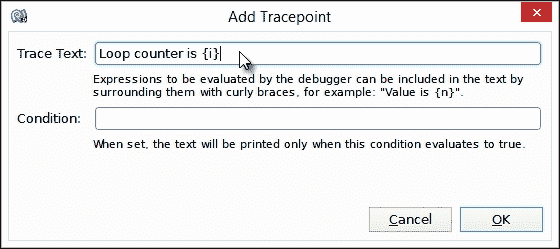

设置跟踪点文本

点击**确定**后，跟踪点将被添加到所选行。在 MonoDevelop 中，该行将以菱形标记，而不是圆形；这个菱形形状表示一个断点：

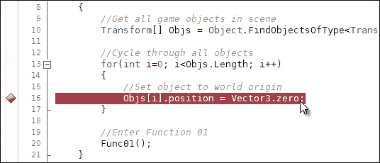

插入跟踪点

在代码编辑器中设置所选行的跟踪点并通过 MonoDevelop 的附加程序运行应用程序后，游戏将正常运行，直接从 Unity 编辑器中运行。然而，当遇到跟踪点时，应用程序不会暂停或进入断点模式，就像使用断点时那样。相反，跟踪点会自动将打印的语句输出到 MonoDevelop 的**应用程序输出**窗口，而不会造成暂停。默认情况下，此窗口停靠在 MonoDevelop 界面的底部：


Tracepoints 可以将诸如 Debug.Log 这样的语句打印到 MonoDevelop 的应用程序输出窗口中

跟踪点是使用 Unity 内部的 `Debug.Log` 语句的有效且有用的替代方案，并且你不需要以使用 `Debug.Log` 时的方式修改代码来使用它们。不幸的是，它们不会直接打印到 Unity 的 **控制台**。相反，它们出现在 MonoDevelop 的 **应用程序输出** 窗口中。然而，只要你认识到这一点，使用跟踪点可以是一种强大且有用的方法来查找和移除错误。

# 摘要

本章讨论了调试过程，这个过程主要关于从你的游戏中查找和移除错误。在 Unity 中，实现这一目标有许多方法，特别是考虑了以下方法：`Debug.Log` 语句，可能是所有调试方法中最简单的一种。使用这种技术，`Debug.Log` 语句被插入到代码的关键行中，并将诊断信息打印到 Unity 的 **控制台**。接下来，我们探讨了自定义定义：使用它们，你可以在发布和调试版本之间隔离和分离代码块；这允许你在启用特定标志时运行特定的调试代码。然后，我们讨论了错误日志。本章演示了如何创建一个与原生 Unity 应用程序类集成的错误记录器类，使用委托。我们还看到了分析器；Unity 分析器是一个专业功能，它为我们提供了对处理如何随时间分布以及系统资源的统计洞察。此外，我们还探讨了编辑器调试和可视化调试，以获得对场景更清晰的视觉洞察，以及影响对象行为因素。最后，我们看到了 MonoDevelop 调试，这不需要我们编辑代码。这些包括断点、跟踪点、步骤和监视器。接下来，我们将探讨如何与 `GameObjects` 一起工作。
