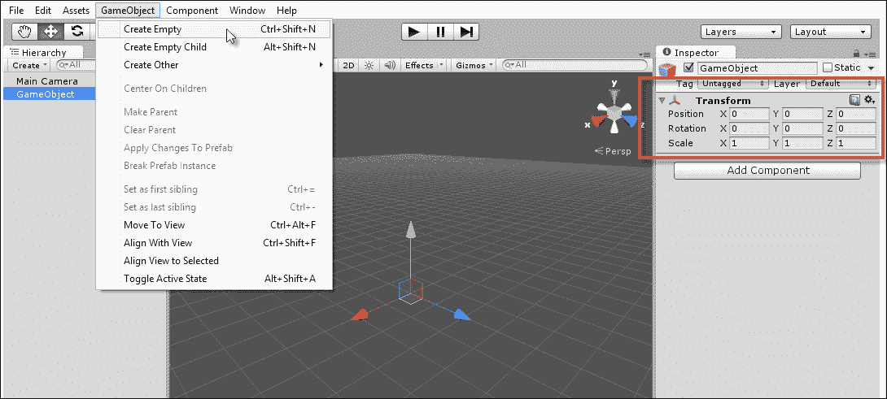
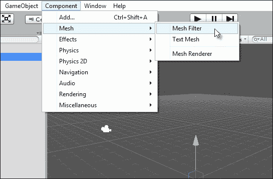
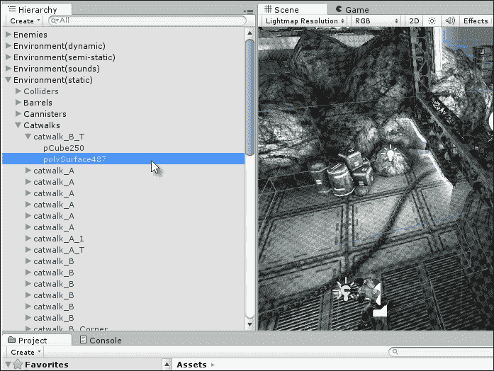
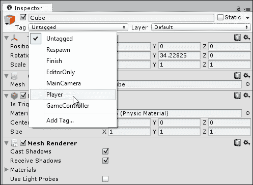
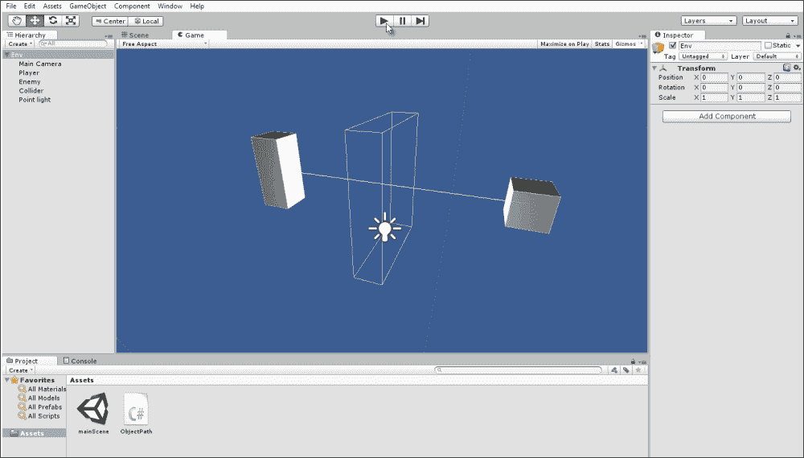
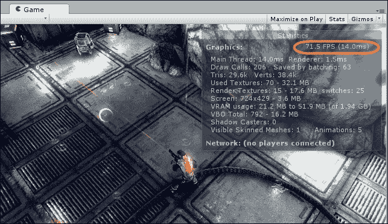

# 第三章：单例、静态、GameObject 和世界

在 Unity 中，每个级别或游戏世界都由一个场景表示，而场景是由位于笛卡尔 3D 坐标系中、具有*x*、*y*和*z*轴的游戏对象集合组成的。场景中的单位以 Unity 单位计量，在实际应用中相当于米。为了能够熟练地使用 Unity 进行脚本编写，理解场景和对象的解剖结构以及对象间通信的方式至关重要；也就是说，了解场景中独立且分离的对象如何相互通信以实现预期的效果非常重要。因此，本章重点介绍了在场景中优化搜索、引用和访问对象的本地 Unity 方法。它还关注了诸如静态和单例等额外概念，用于创建在场景间移动并保留其数据的对象。当然，本章不仅会单独考虑这些方法，还会尝试在考虑性能和效率的实用环境中评估它们。

# GameObject

在许多意义上，`GameObject`是场景中的基本单元或实体。它最自然地对应于我们日常所说的“事物”。实际上，你需要在游戏中实现的具体的上下文特定行为或事物类型并不重要，因为在所有情况下，你都需要`GameObjects`来实现它们。`GameObjects`不需要对玩家可见；它们可以是，并且通常是不可见的。声音、碰撞体和管理类是一些不可见的`GameObjects`的例子。另一方面，许多`GameObjects`将是可见的：网格、动画网格、精灵等等。然而，在所有情况下，无论是可见的还是不可见的，`GameObject`都是在场景中以相关组件的集合形式实例化的。**组件**本质上是从`MonoBehaviour`派生出的类，并且可以附加到场景中的`GameObject`上以改变其行为。每个`GameObject`至少有一个共同的最小组件，并且无法移除，即**变换**组件（或对于 GUI 对象而言是 RectTransform）。这个组件负责跟踪对象的位置、旋转和缩放。例如，如果你通过从应用程序菜单中选择**GameObject** | **Create Empty**来在场景中创建一个空白、空的游戏对象，如图下所示，你将在场景中得到一个新的游戏对象，它只包含一个变换组件。因此，即使是新的空`GameObject`在严格意义上也不是空的，但它几乎是`GameObject`可能达到的最空状态。该对象仍然需要一个变换组件来保持其在场景中的物理位置。



所有 GameObject 都具备变换组件

当然，一个 `GameObject` 可以有多个组件，一个对象的行为是由其组件的组合和交互产生的。你可以使用 **组件** 菜单向对象添加更多预制的组件，也可以通过将你的脚本拖放到对象上来添加自己的自定义组件。



组件附加到 `GameObject` 上

因此，`GameObjects` 由组件组成。在更高层次上，场景由单个世界空间内的多个 `GameObjects` 集合组成。此外，对象之间存在着由场景层次结构定义的重要关系。对象可以是其他对象的子对象，而这些对象反过来又是它们的父对象（`transform.parent`）。这种关系对对象的移动和变换有重要影响。简而言之，对象的变换组件的值会向下级联并添加到所有子对象的变换中。通过这种方式，子 `GameObject` 总是相对于其父对象进行偏移和变换；父对象的位置是子对象位置的起点。然而，如果一个对象没有父对象，那么它就会从世界原点（0, 0, 0）进行变换。以下截图显示了 **层次结构** 面板：



`GameObjects` 存在于一个场景层次结构中，该结构决定了它们的变换

# 组件交互

我们已经看到了 `GameObject` 的解剖结构，它是一个组件的集合，没有更多。这引发了一些关于组件如何相互交互和通信的物流问题。每个组件实际上都是一个自包含的脚本文件，与其他组件分开，但组件通常需要与其他组件交互。具体来说，你经常需要访问同一 `GameObject` 上其他组件的变量并调用函数，甚至可能需要在每一帧都这样做。本节探讨了这种组件间的通信。

在其他组件上调用函数的一种方法是通过使用 `SendMessage` 和 `BroadcastMessage`，如第一章*Unity C# 快速入门*中所示。这些函数是无类型的。具体来说，它们是我们可能在脚本中的任何地方调用的函数，用于通过名称在 *所有* 附加到同一对象的组件上调用方法，无论它们的类型如何。这些函数根本不关心组件类型。这使得 `SendMessage` 和 `BroadcastMessage` 都很方便使用。然而，它们的问题有两个方面。首先，它们是全有或全无的事情；我们可能对所有组件或根本不调用按名称的函数。我们不能挑选和选择消息被发送到的组件，因为它总是发送到所有组件。其次，这两种方法（`SendMessage` 和 `BroadcastMessage`）在内部依赖于反射，这在使用频繁时可能会引起性能问题，例如在 `Update` 事件中调用这些函数，或者在更糟糕的情况下，在 `OnGUI` 事件中。因此，在可能的情况下，寻求使用替代方法。让我们在以下章节中考虑这些方法。

## GetComponent

如果你需要直接访问对象上的特定单个组件并且你知道其数据类型，尝试使用以下代码示例 3-1 中的 `GetComponent`。这个函数让你可以访问附加到 `GameObject` 的匹配类型的第一个组件。一旦你获得了它的引用，你就可以像访问任何常规对象一样访问该组件，设置和获取其公共变量，并调用其方法：

```cs
01 using UnityEngine;
02 using System.Collections;
03 //-----------------------------------------------------
04 public class MyCustomComponent : MonoBehaviour
05 {
06   //Reference to transform of object
07   private Transform ThisTransform = null;
08 //-----------------------------------------------------
09   // Use this for initialization
10   void Start ()
11   {
12     //Get cached reference to transform
13     ThisTransform = GetComponent<Transform>();
14   }
15 //-----------------------------------------------------
16   // Update is called once per frame
17   void Update ()
18   {
19     //Update position

20     if(ThisTransform !=null) {ThisTransform.localPosition += Time.deltaTime * 10.0f * ThisTransform.forward;}

21   }
22 //-----------------------------------------------------
23 }
24 //-----------------------------------------------------
```

以下是对代码示例 3-1 的注释：

+   **第 07 行和第 13 行**：变量 `ThisTransform` 被声明为私有。这个变量被分配了一个指向附加到 `GameObject` 的 Transform 组件的引用，并且它是在 `Start` 事件内部使用 `GetComponent` 函数实现的。在特定访问 Transform 组件的情况下，我们也可以使用继承的 `transform` 属性，例如 `ThisTransform = transform;`。

+   **第 20 行**：在这里，`ThisTransform` 变量被直接用来设置 `GameObject` 的 `localPosition`。同样，对于 Transform 组件来说，我们也可以使用 `transform.localPosition`。然而，这种方法在内部会调用额外的函数调用，因为成员 `transform` 是一个 C# 属性，而不是一个标准变量。更多关于属性的信息可以在第一章*Unity C# 快速入门*中找到。因此，在 `Start` 或 `Awake` 事件中使用 `GetComponent` 来检索私有类变量的组件引用通常是访问外部组件最有效的方法之一，特别是如果组件必须定期访问，例如在 `Update` 函数中。

    ### 注意

    **localPosition 与 position 的区别**

    Transform 组件公开了两个主要的位置成员：`position` 和 `localPosition`。设置这两个中的任何一个都会以特定和独特的方式改变对象的位置。位置成员始终定义对象在全局空间中的位置，作为从世界原点测量的值。因此，在脚本中设置此变量可能不会对应于当对象被选中时在对象检查器中看到的 Transform 组件的实际数字。例如，如果您的对象是另一个未定位到世界原点的对象的子对象，那么 Unity 会通过必要的任何方式偏移对象相对于父对象的位置，以便将其定位到指定的全局空间位置。相比之下，`localPosition` 成员直接对应于在对象检查器中显示的 Transform 组件的 `position` 值。具体来说，它指定了对象的位置，作为从其父位置或（如果对象没有父对象）从世界原点的测量偏移量。在后一种情况下，`position` 和 `localPosition` 成员将是相同的。

    关于 `GetComponent` 函数的更多信息，可以在 Unity 在线文档中找到，网址为 [`docs.unity3d.com/ScriptReference/GameObject.GetComponent.html`](http://docs.unity3d.com/ScriptReference/GameObject.GetComponent.html)。

    您还可以通过 MonoDevelop 的 **帮助** 菜单访问 Unity 文档，方法是导航到 **帮助** | **Unity API 参考**。

## 获取多个组件

有时，您可能希望在一个列表中检索多个组件：有时是所有组件的列表，有时是仅匹配特定类型的组件的列表。您可以使用 `GetComponents` 函数来实现这一点。请参阅以下代码示例 3-2。与 `GetComponent` 函数一样，在一次性事件（如 `Start` 和 `Awake`）期间调用 `GetComponents` 是一种良好的实践，而不是在频繁事件（如 `Update`）期间调用：

```cs
01 using UnityEngine;
02 using System.Collections;
03 //-----------------------------------------------------
04 public class MyCustomComponent : MonoBehaviour
05 {
06   //Reference to all components as array
07   private Component[] AllComponents = null;
08   //-----------------------------------------------------
09   // Use this for initialization
10   void Start ()
11   {
12     //Gets a list of all components attached to this object
13     AllComponents = GetComponents<Component>();
14
15     //Loops through each and list it to the console
16     foreach(Component C in AllComponents)
17     {
18       //Print to console
19       Debug.Log (C.ToString());
20     }
21   }
22 }
23 //-----------------------------------------------------
```

### 注意

**关于组件的更多内容**

Unity 提供了 `GetComponent` 和 `GetComponents` 函数的额外变体，这些变体有助于实现对象间的通信，而不仅仅是同一对象内组件之间的通信。这些函数包括 `GetComponentsInChildren`，用于检索所有子对象中所有组件的累积列表，以及 `GetComponentsInParent`，用于检索对象父对象中的所有组件。

关于 `GetComponents` 函数的更多信息，可以在 Unity 在线文档中找到，网址为 [`docs.unity3d.com/ScriptReference/Component.GetComponents.html`](http://docs.unity3d.com/ScriptReference/Component.GetComponents.html)。

## 组件和消息

`GetComponent` 函数族运行良好，应该能满足您几乎所有的组件间通信需求。当适当使用时，它们的确比 `SendMessage` 或 `BroadcastMessage` 表现得更好。然而，在某些情况下，如果给定一个 `GameObject`，您能够仅对 `SendMessage` 上的一个组件而不是所有组件调用方法，而不需要事先知道组件类型，这将是非常理想的。现在，您可以通过使用代理和接口（下一章将介绍）在一定程度上实现这种行为。然而，在这里，我们将考虑 `SendMessage` 方法。一个特别有用的场景是创建可扩展的行为。例如，也许您的游戏有许多敌人类型，您需要保留添加更多类型的可能性，所有这些类型都可以以不同的方式实现。尽管它们不同，但所有敌人都需要在游戏保存时将数据保存到持久文件中。那么，对于敌人来说，处理一个 `OnSave` 函数将非常有用，该函数将由特定的组件实现。这是可以的，但您希望仅由该组件上的 `SendMessage` 系统调用 `OnSave` 函数。您不希望调用对象上其他组件的方法，以防它们也处理一个您不希望意外调用的 `OnSave` 函数。简而言之，您可以使用 `Invoke` 方法实现这一点。考虑以下代码示例 3-3：

```cs
01 using UnityEngine;
02 using System.Collections;
03 //-----------------------------------------------------
04 public class MyCustomComponent : MonoBehaviour
05 {
06   //Reference to component on which function must be called
07   public MonoBehaviour Handler = null;
08
09   //-----------------------------------------------------
10   // Use this for initialization
11   void Start ()
12   {
13     //Call function immediately
14     Handler.Invoke("OnSave",0.0f);
15   }
16 }
17 //-----------------------------------------------------
```

以下是对代码示例 3-3 的注释：

+   **第 07 行**: 此类具有一个公共引用变量 `Handler`。使用此字段，您可以通过对象检查器将任何组件拖放到 `Handler` 槽中。这表示将要向其发送消息的组件。请注意，其类类型为 `MonoBehaviour` 或任何从该类派生的类。这意味着实现了类型无关性，我们不需要事先知道对象类型。

+   **第 14 行**: 调用 `MonoBehaviour` 的 `Invoke` 方法来运行任何具有匹配名称的方法。第二个浮点数参数指定了在多少秒后调用该函数。0 秒表示立即调用。

    ### 小贴士

    关于 `Invoke` 函数的更多信息可以在 Unity 在线文档中找到，链接为[`docs.unity3d.com/ScriptReference/MonoBehaviour.Invoke.html`](http://docs.unity3d.com/ScriptReference/MonoBehaviour.Invoke.html)。

# 游戏对象和世界

在 Unity 中，另一个关键任务是在脚本中搜索场景中的对象，尤其是如果对象在运行时实例化。例如，“获取玩家对象”和“获取场景中所有敌人”等任务对于许多操作都很重要，从复活敌人和增益到重新定位玩家和检查对象之间的碰撞。要检索特定 `GameObjects` 的引用，Unity 提供了一组与 `GameObject` 类相关的函数。这些函数可能很有用但成本高昂，因此请确保在可能的情况下，在 `Start` 和 `Awake` 等一次性事件中调用它们。让我们进一步探讨这些内容，以及与其他技术和方法一起使用找到的对象的其他技术。

## 查找游戏对象

在场景中查找对象可以通过 `GameObject.Find` 或 `GameObject.FindObjectWithTag` 函数实现。在这两个函数中，出于性能考虑，后者几乎总是首选。然而，让我们首先考虑 `GameObject.Find`。此函数在场景中搜索与名称完全匹配的第一个对象（区分大小写），然后返回该对象。搜索的名称应与 **层次** 面板中显示的对象名称相匹配。不幸的是，该函数执行字符串比较以确定匹配，因此它是一个缓慢且繁琐的选项。此外，它仅对保证具有唯一名称的对象真正有效，而很多时候对象并没有。然而，话虽如此，`GameObject.Find` 在对象名称适当的情况下仍然非常有用：

```cs
//Find Object with the name of player
ObjPlayer = GameObject.Find ("Player");
```

### 注意

**游戏对象查找**

如果你注意到 `GameObject`，你就会意识到 `Find` 函数是静态的。这意味着你不需要任何特定 `GameObject` 的实例化就可以调用该函数。你可以通过 `GameObject.Find` 直接从任何源文件中调用它。静态和全局作用域的概念将在本章的后面讨论。

关于 `GameObject.Find` 函数的更多信息，可以在 Unity 在线文档中找到，网址为 [`docs.unity3d.com/ScriptReference/GameObject.Find.html`](http://docs.unity3d.com/ScriptReference/GameObject.Find.html)。

### 小贴士

`GameObject.Find` 可能是一个较慢的函数。因此，仅在一触即发的事件中使用它，例如 `Awake` 和 `Start`。

通过标签进行搜索更有效。场景中的每个对象都有一个默认分配为 **Untagged** 的标签成员。这个成员是一个唯一标识符，可以标记单个对象或多个对象，将它们组合成一个集合。通常，为了通过标签搜索对象，你首先需要显式地给对象分配一个标签。你可以在脚本中使用 `GameObject.tag` 公共成员来完成此操作。然而，你更常用 Unity 编辑器。你可以在 Unity 编辑器中通过点击对象检查器中的 **Tag** 下拉列表并选择一个标签来为选定的对象分配一个标签。此外，你可以通过选择 **Add Tag** 选项来创建新的、自定义的标签。常见的标签包括 **Player**、**Enemy**、**Weapon**、**Bonus**、**Prop**、**Environment**、**Light**、**Sound** 和 **GameController** 等。请查看以下截图：



为对象分配标签

在场景中为一个或多个对象分配了标签之后，你可以在代码中有效地通过标签搜索对象。`GameObject.FindGameObjectWithTag` 函数在场景中搜索具有匹配标签的对象，并返回第一个匹配的对象。`GameObject.FindObjectsWithTag` 返回所有匹配的对象数组。请参见以下代码示例 3-4 以获取示例。请注意，尽管 `FindGameObjectsWithTag` 函数需要一个字符串参数，但 Unity 内部将字符串转换为数值形式，以提高标签比较的速度：

```cs
using UnityEngine;
using System.Collections;
//-----------------------------------------------------
public class ObjectFinder : MonoBehaviour
{
  //Tag name of objects to find
  public string TagName = "Enemy";
  //Array of found objects matching tag
  public GameObject[] FoundObjects;

  //-----------------------------------------------------
  // Use this for initialization
  void Start ()
  {
    //Find objects of matching tag

    FoundObjects = GameObject.FindGameObjectsWithTag(TagName);

  }
}
//-----------------------------------------------------
```

### 小贴士

有时候，你可能希望给单个对象分配多个标签。不幸的是，Unity 目前还不支持这种行为。然而，你可以通过将空游戏对象作为你的主要对象的父对象，并给每个子对象分配所需的标签来绕过这个限制。但是，当通过标签搜索对象时，请记住获取父对象的引用，实际上这个对象才是你需要的那一个。

## 对象比较

当你在场景中搜索特定对象时，`GameObject` 搜索函数非常有用，但有时你需要比较你已经找到的两个对象。通常，你想要比较两个对象的名称或标签。你可以使用 `CompareTag` 函数来实现标签比较：

```cs
//Compares tag of this object with another Obj_Y
bool bMatch = gameObject.CompareTag(Obj_Y.tag);
```

此外，你有时可能想要比较两个对象以确定它们是否是同一个对象，而不仅仅是它们是否具有相同的标签。这在编码决策行为时尤为重要。例如，在确定敌人角色在战斗中应该与玩家战斗还是逃跑时，了解敌人附近是否有支援单位帮助他就很有帮助。为了回答这个问题，你可以使用标签搜索找到场景中的所有敌人，正如我们之前看到的。然而，结果也将包括最初发出调用并现在正在决定做什么的敌人，因此我们希望将其排除在结果之外。代码示例 3-4 演示了`GetInstanceID`如何帮助我们：

```cs
01 //Find objects of matching tag
02 FoundObjects = GameObject.FindGameObjectsWithTag(TagName);
03
04 //Search through all objects and exclude ourselves
05 foreach(GameObject O in FoundObjects)
06 {
07   //If two objects are the same
08   if(O.GetInstanceID() == gameObject.GetInstanceID())
09     continue; //Skip this iteration
10
11   //[...] Do stuff here
12 }
```

## 获取最近的对象

给定一个`GameObjects`数组，可能是从搜索中返回的，你如何找到场景中离你最近的那个对象，从线性距离的角度来看？下面的代码示例 3-5 演示了如何使用`Vector3.Distance`函数来找到这个对象，该函数可以检索场景中任意两点之间的最短距离（以米为单位）：

```cs
//Returns the nearest game object
GameObject GetNearestGameObject(GameObject Source, GameObject[] DestObjects)
{
  //Assign first object
  GameObject Nearest = DestObjects[0];

  //Shortest distance
  float ShortestDistance = Vector3.Distance(Source.transform.position, DestObjects[0].transform.position);

  //Loop through all objects
  foreach(GameObject Obj in DestObjects)
  {
    //Calculate distance
    float Distance = Vector3.Distance(Source.transform.position, Obj.transform.position);
    //If this is shortest, then update
    if(Distance < ShortestDistance)
    {
      //Is shortest, now update
      Nearest = Obj;
      ShortestDistance = Distance;
    }
  }

  //Return nearest
  return Nearest;
}
```

## 查找指定类型的任何对象

有时候，你可能只想获取场景中指定类型的所有组件列表，而不考虑它们实际附加到哪个游戏对象上；这些组件包括所有敌人、所有可收集对象、所有变换组件、所有碰撞体等等。从脚本中实现这一点很简单，但成本较高，如下面的代码示例 3-6 所示。具体来说，通过调用`Object.FindObjectsOfType`函数，你可以检索场景中指定对象的所有实例的完整列表，除非对象被禁用。由于这种方法成本较高，应避免在基于帧的事件，如`Update`期间调用它。使用`Start`和`Awake`事件，以及不频繁调用的函数代替：

```cs
void Start()
{
  //Get a list of all colliders in the scene
  Collider[] Cols = Object.FindObjectsOfType<Collider>();
}
```

## 清除 GameObject 之间的路径

给定场景中的任意两个`GameObjects`，例如**玩家**和一个**敌人**角色，通常需要测试它们之间的清晰路径，即测试是否存在任何碰撞体与两个对象之间绘制的想象线相交。这有助于视线系统，正如我们稍后将要看到的，但也可以更普遍地用于对象剔除，以确定 AI 功能和其他功能。



使用 Physics.LineCast 测试两个 GameObject 之间的清晰路径

实现这种行为有许多方法。一种方法是使用`Physics.LineCast`函数，如下面的代码示例 3-7 所示：

```cs
01 using UnityEngine;
02 using System.Collections;
03 //Determines if a clear line or path exists between two objects
04 public class ObjectPath : MonoBehaviour
05 {
06   //Reference to sample enemy object
07   public GameObject Enemy = null;
08
09   //Layer mask to limit line detection
10   public LayerMask LM;
11   //----------------------------------------------------
12   // Update is called once per frame
13   void Update ()
14   {
15     //Check if clear path between objects

16     if(!Physics.Linecast(transform.position, Enemy.transform.position, LM))

17     {
18       //There is clear path
19       Debug.Log ("Path clear");
20     }
21   }
22   //----------------------------------------------------
23   //Show helper debug line in viewport
24   void OnDrawGizmos()
25   {
26     Gizmos.DrawLine(transform.position, Enemy.transform.position);
27   }
28   //----------------------------------------------------
29 }
```

以下是对代码示例 3-7 的注释：

+   **第 07 行**：此示例类应附加到`Player`；否则，另一个源对象接受一个公共成员变量`Enemy`，该变量应测试是否有清晰路径。

+   **第 10 行**：`LayerMask`变量指定了一个位掩码，表示碰撞测试应用于场景中的哪些层。有关位掩码的更多信息可以在 Unity 在线文档中找到，链接为[`docs.unity3d.com/Manual/Layers.html`](http://docs.unity3d.com/Manual/Layers.html)。

+   **第 16 行**：`Physics.Linecast`函数用于确定场景中两个对象之间是否存在清晰且不间断的路径。请注意，如果两个对象本身具有碰撞器，例如`BoxColliders`，则这些碰撞器将包含在碰撞检测中；它们不会被忽略。换句话说，一个对象的自身碰撞器可以影响任何`LineCast`调用的结果。因此，使用`LayerMask`变量来包含或排除特定的层。

    ### 小贴士

    书籍配套文件中的`Chapter03/LineCast`文件夹包含了一个`Physics.LineCast`项目。

## 访问对象层次结构

Unity 中的**层次结构**面板提供了一个场景中所有`GameObjects`之间父子关系的图形化展示。这种关系很重要，因为子对象包含并继承其父对象的变换。然而，通常在编辑器中定义和编辑层次关系是不够的。你经常需要在代码中将一个对象作为父对象附加到另一个对象上，并遍历指定对象的全部子对象以处理数据或对其调用功能。让我们首先看看如何将对象设置为父对象。以下代码示例 3-8 展示了如何通过变换组件将一个对象 X 附加到另一个对象 Y 作为其子对象：

```cs
using UnityEngine;
using System.Collections;
//----------------------------------------------------
public class Parenter : MonoBehaviour
{
  //Reference to child object in scene
  private GameObject Child;
  //Reference to parent object in scene
  private GameObject Parent;
  //----------------------------------------------------
  // Use this for initialization
  void Start ()
  {
    //Get parent and child objects
    Child = GameObject.Find("Child");
    Parent = GameObject.Find("Parent");

    //Now parent them
    Child.transform.parent = Parent.transform;
  }
  //----------------------------------------------------
}
//----------------------------------------------------
```

现在，让我们看看如何遍历附加到父对象的所有子对象。同样，这也是通过变换组件实现的，如下面的代码示例 3-9 所示：

```cs
using UnityEngine;
using System.Collections;
//------------------------------------------
public class CycleChildren : MonoBehaviour
{
  //------------------------------------------
  // Use this for initialization
  void Start ()
  {
    //Cycle though children of this object
    for(int i=0; i<transform.childCount; i++)
    {
      //Print name of child to console
      Debug.Log (transform.GetChild(i).name);
    }
  }
  //------------------------------------------
}
//------------------------------------------
```

# 世界、时间和更新

Unity 场景表示在相同 3D 空间内的一组有限的`GameObjects`，并且它们也共享相同的时间框架。每个游戏都需要建立一个统一的时间概念，以实现同步的动画和变化，因为动画意味着随时间的变化。在 Unity 中，`Time`类可用于在脚本中读取和理解时间及其流逝。因此，使用这个类是创建可预测和一致运动的关键技能。关于这一点，我们稍后会详细讨论。

每个游戏都有一个帧率，这以每秒帧数（**FPS**）的形式定义。这个速率可以在**游戏**标签页的**统计**面板中查看。FPS 告诉你 Unity 在 1 秒内能够循环或迭代多少次来从相机到屏幕绘制新的渲染。每次迭代被称为**帧**。帧率随时间和不同计算机而显著变化。它受计算机性能、可能正在运行的其他进程以及当前帧需要渲染的内容等因素的影响。这意味着你永远不能依赖 FPS 随时间保持一致或在不同的计算机上相同；通常会有不同的 FPS。请查看以下截图：



每秒帧数（FPS）对于创建基于时间的动作和动画非常重要

为了近似帧的概念，Unity 提供了三个类事件，每个`MonoBehaviour`类都可以实现这些事件来执行必须持续更新或随时间变化的函数。这些事件之前已经介绍过，但现在我们将更深入地探讨它们，特别是`Update`、`FixedUpdate`和`LateUpdate`：

+   `Update`：`Update`事件在每个场景中每个活动的`GameObject`上的每个活动组件上每帧调用一次。如果一个对象被`MonoBehaviour.SetActive`方法禁用，那么直到该对象被激活，该对象的`Update`事件将不会调用。简而言之，`Update`事件最准确地代表了 Unity 中帧的概念，因此它适用于执行重复的行为或功能，这些行为或功能需要随时间更新和监控，例如玩家输入事件、键盘按键和鼠标点击。请注意，`Update`事件在每一帧中所有组件的调用顺序是不确定的；也就是说，你无法确定在某一帧中对象 X 的`Update`函数是否会在对象 Y 的`Update`函数之前被调用。

+   `FixedUpdate`：与`Update`一样，这个事件通常每帧调用多次。然而，它的调用模式是规则和规范的，每次调用之间有固定的时间间隔。`FixedUpdate`最常见的使用是与 Unity 物理交互。如果你需要随时间更新 Rigidbody 组件的速度或属性，那么应该使用`FixedUpdate`而不是`Update`。

+   `LateUpdate`：这个事件与`Update`一样，在每一帧都会被调用。然而，`LateUpdate`总是在`Update`和`FixedUpdate`之后被调用。这意味着当`LateUpdate`被调用时，你可以确定`Update`和`FixedUpdate`已经为当前帧上的每个对象调用过了。这使得`LateUpdate`成为更新相机移动的有用地方，特别是第三人称相机，确保相机始终跟随对象在当前帧上的最新位置。

`Update`、`FixedUpdate`和`LateUpdate`的细节，结合时间和 FPS 的概念，对你在创建运动时应该如何或不应如何编写游戏代码有重大影响。具体来说，出现了两条主要准则，这些准则将在接下来的两个小节中讨论。

## 规则#1 – 帧是宝贵的

帧应该每秒发生多次；如果不这样，你的游戏看起来会卡顿且不完整。在每一帧，都会为场景中的每个活动`MonoBehaviour`调用一次`Update`事件。这意味着每一帧场景的计算复杂度（和性能）在很大程度上取决于你在`Update`事件内部做了什么。更多的功能需求意味着更多的处理时间和工作量，无论是 CPU 还是 GPU。对于包含许多对象和组件的大场景，如果不通过仔细的代码规划来减少`Update`函数中的工作量，事情很容易失控。因此，将`Update`事件或任何定期调用的基于帧的事件视为宝贵的是非常重要的。简而言之，你应该只在真正需要时在它们内部放置代码，例如读取玩家输入或观察光标移动。将事件驱动编程作为思考起点是有帮助的，因为这可以帮助你严重减少插入到`Update`函数中的工作量。下一章将考虑事件驱动编程和事件系统。

## 规则#2 – 运动必须相对于时间

由于你无法保证帧的频率（帧率随时间和计算机而变化），因此你需要非常小心地编码运动和变化，以实现为玩家提供一致的游戏体验。考虑这样一个简单的情况：随着时间的推移，在场景中平滑地移动一个立方体对象。创建运动的一种方法（一种不好的方法）将如下所示，在以下代码示例 3-10 中：

```cs
using UnityEngine;
using System.Collections;

public class Mover : MonoBehaviour
{
  //Amount to move cube per frame
  public float AmountToMove = 1.0f;

  // Update is called once per frame
  void Update ()
  {
    //Move cube along x axis
    transform.localPosition += new Vector3(AmountToMove,0,0);
  }
}
```

此代码在将附加对象通过变量`AmountToMove`在每一帧移动方面是有效的。问题是它是依赖于帧率的。现在，由于帧在时间和计算机之间不一致，每个用户最终都会收到不同的体验；具体来说，他们会看到立方体以不同的速度移动。这是不好的，因为我们根本无法预测游戏对任何特定用户将如何运行。为了解决这个问题，我们需要将运动映射到时间而不是帧上。帧是可变的，但时间是恒定的；一秒就是那样。为了实现这一点，我们可以使用`deltaTime`变量，它是`Time`类的一部分。请参见以下代码示例 3-11。这是示例 3-10 的修改版。

```cs
using UnityEngine;
using System.Collections;

public class Mover : MonoBehaviour
{
  //Speed of cube
  public float Speed = 1.0f;

  // Update is called once per frame
  void Update ()
  {
    //Move cube along forward direction by speed
 transform.localPosition += transform.forward * Speed * Time.deltaTime;
  }
}
```

`deltaTime`变量是一个浮点值，总是表示自上次调用`Update`函数以来经过的时间（以秒为单位）。例如，值为 0.5 表示自上次帧以来已经过去了半秒，依此类推。这很有用，因为`deltaTime`可以作为乘数。通过在每一帧将速度变量乘以`deltaTime`，我们可以知道对象应该移动多远，因为*距离 = 速度 x 时间*。因此，`deltaTime`为我们提供了对象运动的帧率独立性。

# 不朽的对象

默认情况下，Unity 将每个对象视为存在于场景的自封闭时间和空间中。场景之间的差异就像不同宇宙之间的差异。因此，对象不会在它们所属的场景之外存活；这意味着每当活动场景改变时，它们就会死亡。这通常是您希望对象表现的方式，因为场景通常非常不同且相互独立。然而，即便如此，仍然会有一些您不希望销毁的对象。会有一些您需要在场景之间传递的对象，例如**玩家**角色、高分系统或`GameManager`类。这些通常是高级对象，它们的生存不应局限于特定的场景；它们应该跨越或弧形跨越多个场景。您可以使用`DontDestroyOnLoad`函数轻松创建对象持久性，但它有重要的后果值得考虑。请看以下代码示例 3-12：

```cs
using UnityEngine;
using System.Collections;
//-------------------------------------------
//This object will survive scene changes
public class PersistentObj : MonoBehaviour
{
  //-------------------------------------------
  // Use this for initialization
  void Start ()
  {
    //Make this object survive
 DontDestroyOnLoad(gameObject);
  }
}
//-------------------------------------------
```

场景之间的对象持久性很重要，但*移动的对象*在场景之间移动时会带着它们的行李。这意味着任何所有子对象都将与持久对象一起存活，以及它使用的任何资产或资源，例如网格、纹理、声音等。这本身并不是问题，但重要的是要意识到这一点。因此，许多持久对象都是轻量级创建的，也就是说，作为没有子对象的空游戏对象，只包含它们正常工作所需的基本组件组成。这确保了只有必要的关键数据在场景变化之间存活。

### 注意

**场景切换**

要在 Unity 中更改活动场景，请使用`Application.LoadLevel`函数。这个函数有多种变体，包括`LoadLevelAsync`、`LoadLevelAdditive`和`LoadLevelAdditiveAsync`。有关级别加载函数的更多信息，可以在[`docs.unity3d.com/ScriptReference/Application.html`](http://docs.unity3d.com/ScriptReference/Application.html)在线找到。

如我们之前所见，`DontDestroyOnLoad`函数在活动场景中的现有对象上被调用，防止该对象在未来的场景变化中被销毁。然而，由此有时会出现关于对象复制的問題。具体来说，如果你后来重新加载或返回到持久对象最初存在的原始场景，则会创建该对象的持久副本，即从上一个场景带过来的持久原始对象和为场景的新实例创建的新对象实例。当然，每次重新进入场景都会放大这个问题，因为每次都会创建一个新的副本。这种复制通常不是你想要的。你通常希望在任何时候只有一个对象实例存在：一个玩家、一个游戏管理器或一个高分排行榜。为了实现这一点，你需要创建一个单例对象，正如下一节所解释的。

# 理解单例对象和静态

有些类在实例化方式上与其他类根本不同。大多数类定义了一个属性和行为集合的模板，这些属性和行为可能在场景中以`GameObjects`的形式实例化多次。敌对类可以用来实例化许多敌对对象，提升类用于许多提升对象，等等。然而，一些类如`GameManager`、`HighScoreManager`、`AudioManager`或`SaveGameManager`旨在作为一个独立实体存在，它整合了一套统一的行为。简而言之，在任何时候，该类只应有一个实例，而不应该有多个实例。拥有多个实例要么没有意义，要么以某种方式损害对象的权威和实用性。这类对象被称为单例。单例通常是跨场景持久存在的对象，尽管它们不必如此。单例（使其成为单例）的唯一必要成分是，在任何时候内存中不能有该类的多个实例。现在，让我们在创建示例`GameManager`类的上下文中创建一个单例对象。

实际上，每个游戏都有一个`GameManager`或`GameController`类；并且这些几乎总是持久存在的单例对象。`GameManager`基本上负责游戏中的所有高级功能。它必须确定游戏是否已暂停，是否满足胜利条件，以及有可靠的方式在任何时候了解游戏中的情况，等等。以下是对代码示例 3-13 中`GameManager`示例的初步了解：

```cs
using UnityEngine;
using System.Collections;
//-----------------------------------------
//Sample Game Manager class
public class GameManager : MonoBehaviour
{
  //-----------------------------------------
  //High score
  public int HighScore = 0;

  //Is game paused
  public bool IsPaused = false;

  //Is player input allowed
  public bool InputAllowed = true;
  //-----------------------------------------
  // Use this for initialization
  void Start ()
  {
    //Make game manager persistent
    DontDestroyOnLoad(gameObject);
  }
  //-----------------------------------------
}
//-----------------------------------------
```

此对象将在场景之间持续存在，但如何使其（或任何类似类）成为一个单例对象呢？以下代码示例 3-14 演示了如何实现：

```cs
01 using UnityEngine;
02 using System.Collections;
03 //-----------------------------------------
04 //Sample Game Manager class - Singleton Object
05 public class GameManager : MonoBehaviour
06 {
07   //-----------------------------------------
08   //C# Property to get access to singleton instance
09   //Read only - only has get accessor
10   public static GameManager Instance
11   {
12     //return reference to private instance
13     get
14     {
15       return instance;
16     }
17   }
18
19   //-----------------------------------------
20   private static GameManager instance = null;
21   //-----------------------------------------
22   //High score
23   public int HighScore = 0;
24
25   //Is game paused
26   public bool IsPaused = false;
27
28   //Is player input allowed
29   public bool InputAllowed = true;
30   //-----------------------------------------
31   // Use this for initialization
32   void Awake ()
33   {
34     //Check if existing instance of class exists in scene
35     //If so, then destroy this instance
36     if(instance)
37     {
38       DestroyImmediate(gameObject);
39       return;
40     }
41
42     //Make this active and only instance
43     instance = this;
44
45     //Make game manager persistent
46     DontDestroyOnLoad(gameObject);
47   }
48   //-----------------------------------------
49 }
50 //-----------------------------------------
```

以下是对代码示例 3-14 的注释：

+   **第 10-20 行**：在`Manager`类中添加了一个私有成员`instance`，该成员被声明为`static`。这意味着如果存在多个实例，变量将在所有类的实例之间共享，而不是每个实例都有其特定值的变量。这允许每个新实例在创建时确定内存中是否存在该类的现有实例。这个变量也通过`Instance`属性公开访问，该属性只有一个`get`成员，使其为只读。

+   **第 36-43 行**：在这里，在对象创建时调用的`Awake`事件中，检查实例变量以查看当前场景中是否已经存在该类的有效实例。如果存在，则当前对象将被删除，因为只允许一个此类实例存在，并且已经存在。这意味着`GameManager`将跨场景持续存在，场景中始终只有一个原始对象实例。

### 注意

**Awake 与 Start 的区别**

在代码示例 3-12 中，`GameManager`类使用的是`Awake`函数，而不是`Start`。`Start`和`Awake`之间的区别如下：

`Awake`总是在`Start`之前被调用。

`Awake`总是在对象创建时被调用。`Start`在`GameObject`变为活动状态的第一个帧上被调用。如果一个`GameObject`在场景开始时未激活，则`Start`将不会在对象激活之前被调用。对于默认激活的对象，`Start`在场景开始时被调用，在`Awake`事件之后。

如果你需要将组件引用缓存到类的局部变量中，例如`ThisTransform`中的 Transform 组件，那么请使用`Awake`事件而不是`Start`。在`Start`事件期间，应该假设所有对象的局部引用都已经有效。

为`GameManager`拥有一个全局静态的`Instance`属性带来的巨大好处是，它能够立即且直接地被任何其他脚本文件访问，无需任何局部变量或对象引用。这意味着每个类都可以立即访问所有`GameManager`属性，并可以调用高级游戏功能。例如，要从不同的类设置`GameManager`上的游戏分数变量，可以使用以下代码示例 3-15：

```cs
using UnityEngine;
using System.Collections;
//-------------------------------------------
public class ScoreSetter : MonoBehaviour
{
  //-------------------------------------------
  // Use this for initialization
  void Start ()
  {
    //Set score on GameManager
    GameManager.Instance.HighScore = 100;
  }
  //-------------------------------------------
}
//-------------------------------------------
```

### 提示

更多关于单例对象的信息可以在网上找到，链接为[`unitypatterns.com/singletons/`](http://unitypatterns.com/singletons/)。

# 摘要

本章讨论了`GameObject`、场景和组件，以及它们在场景中的通用用法。这些问题表面上可能看起来很简单，但理解它们的用法并能够使用它们来管理对象是一项强大的技能，这在几乎所有的 Unity 游戏开发项目中都是必需的。具体来说，我们看到了`GameObject`，它是一组相互作用的组件集合，以产生统一的行为。变换组件尤为重要。我们还探讨了场景。场景是在其中`GameObject`存在的单一时间和空间。通常，场景是一个自我封闭的实体，防止任何对象存在于其外部。此外，每个场景都通过一个时间概念来工作，这使得变化和动画成为可能。时间可以通过`deltaTime`来衡量，它像一个乘数，使我们能够实现帧率无关的运动。最后，我们探讨了单例设计模式，它使用静态成员来定义类，在实践中，这些类在任何时候都只能有一个活跃的实例存在于内存中。在下一章中，我们将继续探讨事件驱动编程。
