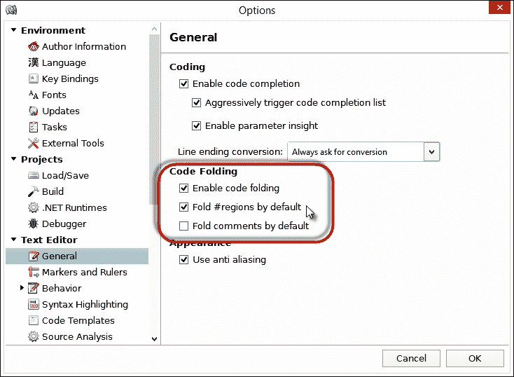
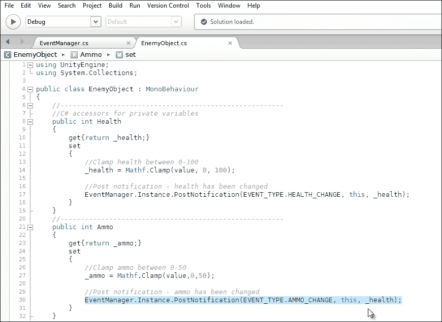
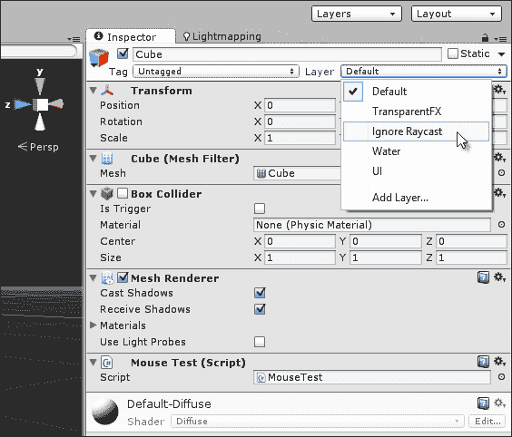
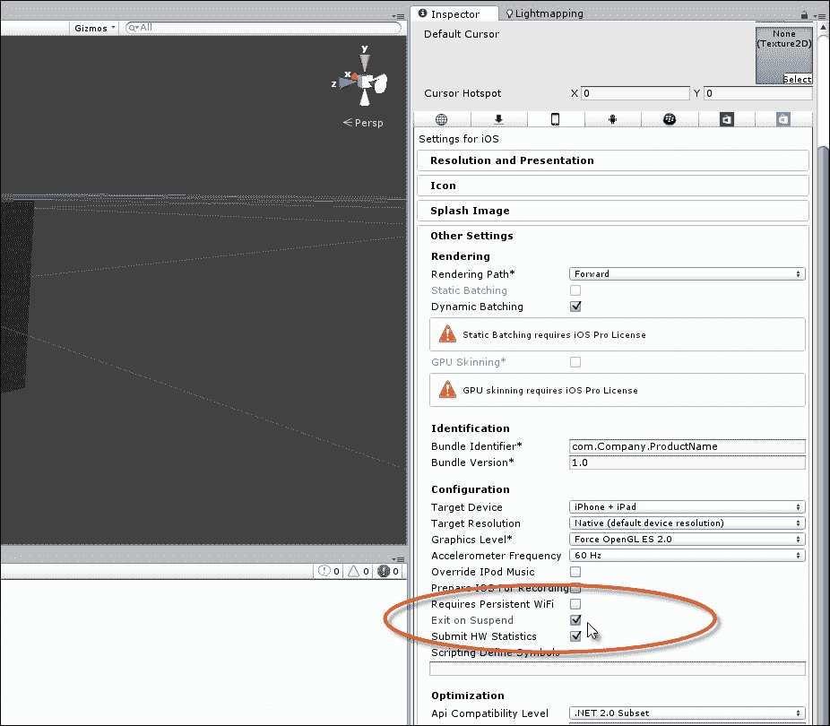
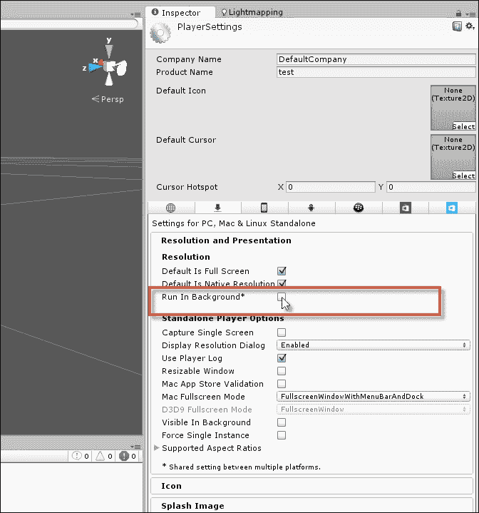

# 第四章：事件驱动编程

`MonoBehaviour` 对象的 `Update` 事件似乎提供了一个方便的位置来执行应该定期执行、跨越多个帧和可能多个场景的代码。当创建需要持续一段时间的行为，例如敌人的人工智能或连续运动时，似乎没有其他替代方案，只能通过在 `Update` 函数中填充许多 `if` 和 `switch` 语句，根据对象当前需要执行的操作将代码分支到不同的方向。但是，当以这种方式看待 `Update` 事件，将其视为实现长期行为的默认位置时，它可能会给更大、更复杂的游戏带来严重的性能问题。在深入分析后，不难看出为什么会这样。通常，游戏中充满了许多行为，在任何单个场景中同时发生的事情也很多，通过 `Update` 函数实现所有这些行为几乎是不切实际的。仅考虑敌人角色，它们需要知道玩家何时进入和离开它们的视线，当它们的健康值低时，当它们的弹药耗尽时，当它们站在有害地形上时，当它们受到伤害时，当它们在移动或停止移动时，以及更多。在最初思考这一系列行为时，似乎它们都需要持续和连续的关注，因为敌人应该始终能够立即知道这些属性的变化是由于玩家输入而发生的。这可能是 `Update` 函数在这些情况下似乎是最合适的位置的主要原因，但还有更好的替代方案，即事件驱动编程。通过将你的游戏和应用程序视为事件，你可以显著提高性能。因此，本章将考虑事件的问题以及如何在游戏中管理它们。

# 事件

游戏世界是完全确定性的系统；在 Unity 中，场景代表一个共享的 3D 笛卡尔空间和时间线，其中存在有限的`GameObjects`。只有当游戏逻辑和代码允许时，事情才会在这个空间内发生。例如，只有当某处有代码告诉它们这样做，并且在特定条件下，比如玩家按下键盘上的特定按钮时，物体才能移动。从示例中可以看出，行为不是简单的随机，而是相互关联的；物体只有在键盘事件发生时才会移动。在这些动作之间建立了一个重要的联系，其中一个动作导致另一个动作。这些联系或链接被称为事件；每个独特的连接都是一个单独的事件。事件不是主动的，而是被动的；它们代表机会的时刻，但本身并不代表行动，例如按键、鼠标点击、物体进入碰撞器体积、玩家被攻击等等。这些都是事件的例子，但它们都没有说明程序实际上应该做什么，而只是刚刚发生的场景类型。事件驱动编程从将事件作为一个一般概念来认识开始，并将游戏中的几乎每一种情况都视为事件的实例化；也就是说，作为一个在特定时间发生的事件，而不仅仅是一个事件概念。理解这类游戏事件是有帮助的，因为这样就可以将游戏中的所有动作视为对事件直接且及时的响应。具体来说，事件与响应相连接；事件发生并触发响应。进一步地，响应可以继续成为触发进一步响应的事件，依此类推。换句话说，游戏世界是一个完整、集成的由事件和响应组成的系统。一旦以这种方式看待世界，接下来就会产生一个问题，那就是如何通过仅仅依赖`Update`函数在每一帧上推进行为来提高性能。而方法就是通过找到减少事件发生频率的方法。现在，这样表述可能听起来像是一种粗略的策略，但它很重要。为了说明这一点，让我们考虑一个例子，即敌人在战斗中对玩家开火的场景。

在整个游戏过程中，敌人需要跟踪许多属性。首先，他们的健康，因为当它变低时，敌人应该寻找医疗包和辅助工具来恢复他们的健康。其次，他们的弹药，因为当它变低时，敌人应该寻求收集更多，而且敌人还需要对何时向玩家开火做出合理的判断，例如只有当有清晰的视线时。现在，仅仅通过思考这个场景，我们已经确定了可能被识别为事件的动作之间的某些联系。但在进一步考虑这一点之前，让我们看看我们如何可能使用`Update`函数来实现这种行为，如下面的代码示例 4-1 所示。然后，我们将看看事件如何帮助我们改进这种实现：

```cs
 // Update is called once per frame
 void Update () 
 {
    //Check enemy health
    //Are we dead?
    if(Health <= 0)
    {
          //Then perform die behaviour
          Die();
          return;
    }

    //Check for health low
    if(health <= 20)
    {
          //Health is low, so find first-aid
          RunAndFindHealthRestore();
          return;
    }

    //Check ammo

    //Have we run out of ammo?
    if(Ammo <= 0)
    {
          //Then find more
          SearchMore();
          return;
    }

    //Health and ammo are fine. Can we see player? If so, shoot
    if(HaveLineOfSight)
    {
            FireAtPlayer();
   }
 }
```

前面的代码示例 4-1 展示了充满大量条件检查和响应的`Update`函数。本质上，`Update`函数试图将事件处理和响应行为合并为一个，导致了一个不必要的昂贵过程。如果我们考虑这些不同过程（如健康和弹药检查）之间的事件连接，我们可以看到代码如何被更整洁地重构。例如，弹药只在两种情况下改变：当武器被发射或当收集到新的弹药时。同样，健康也只在两种情况下改变：当玩家成功攻击敌人或当敌人收集到急救包时。在前一种情况下，会有减少，而在后一种情况下，会有增加。

由于这些是属性变化的唯一时间（即事件），因此这些是它们值需要验证的唯一点。请参阅以下代码示例 4-2，其中重构了敌人，包括 C#属性和大大减少的`Update`函数：

```cs
 using UnityEngine;
 using System.Collections;

 public class EnemyObject : MonoBehaviour 
 {
    //-------------------------------------------------------
    //C# accessors for private variables
 public int Health
    {
          get{return _health;}
          set
          {
                //Clamp health between 0-100
               _health = Mathf.Clamp(value, 0, 100);

                //Check if dead
                if(_health <= 0)
                {
                      OnDead();
                      return;
                }

                //Check health and raise event if required
                if(_health <= 20)
                {
                      OnHealthLow();
                      return;
                }
          }
    }
    //-------------------------------------------------------
 public int Ammo
    {
          get{return _ammo;}
          set
          {
               //Clamp ammo between 0-50
              _ammo = Mathf.Clamp(value,0,50);
                //Check if ammo empty
                if(_ammo <= 0)
                {
                      //Call expired event
                      OnAmmoExpired();
                      return;
                }
          }
    }
    //-------------------------------------------------------
   //Internal variables for health and ammo
 private int _health = 100;
 private int _ammo = 50;
    //-------------------------------------------------------
    // Update is called once per frame
    void Update () 
    {
    }
    //-------------------------------------------------------
    //This event is called when health is low
   void OnHealthLow()
    {
          //Handle event response here
    }
    //-------------------------------------------------------
    //This event is called when enemy is dead
 void OnDead()
    {
        //Handle event response here
    }
    //-------------------------------------------------------
    //Ammo run out event
 void OnAmmoExpired()
    {
        //Handle event response here
    }
    //-------------------------------------------------------
 }
```

代码示例 4-2 中的敌人类已经被重构为事件驱动设计，其中属性如`Ammo`和`Health`的验证不是在`Update`函数内部，而是在赋值时进行。从这里，根据新分配的值，在适当的地方引发事件。通过采用事件驱动设计，我们引入了性能优化和代码整洁性；我们减少了与代码示例 4-1 中的`Update`函数中发现的过剩负担和价值检查，而只允许特定值的事件驱动我们的代码，因为我们知道它们只会在相关时间被调用。

# 事件管理

事件驱动编程可以使我们的生活变得更加简单。但是，当我们接受事件进入设计时，我们很快就会遇到一系列需要彻底解决的新问题。具体来说，我们在代码示例 4-2 中看到了如何使用 C#的属性来验证和检测相关变化，并在适当的时候引发事件（例如`OnDead`）。在原则上，这工作得很好，至少当敌人需要通知自己发生的事件时是这样。然而，如果敌人需要知道其他敌人的死亡，或者需要知道指定数量的其他敌人被击杀时怎么办？当然，考虑到这个具体案例，我们可以回到代码示例 4-2 中的敌人类，并对其进行修改，使其不仅为当前实例调用`OnDead`事件，而且为所有其他敌人调用，就像我们在前面的章节中看到的那样，使用`SendMessage`等函数。但这并没有真正解决我们的问题。事实上，让我们直接陈述理想情况；我们希望每个对象都能选择性地监听每种类型的事件，并在事件发生时得到通知，就像事件发生在它们身上一样容易。因此，我们现在面临的问题是如何编写一个优化的系统，以便轻松管理此类事件。简而言之，我们需要一个`EventManager`类，允许对象监听特定事件。这个系统依赖于以下三个核心概念：

+   `EventListener`：监听器指的是任何希望在事件发生时得到通知的对象，即使是其自己的事件。在实践中，几乎每个对象都将是至少一个事件的监听器。例如，一个敌人可能希望得到有关低血量和低弹药的通知等。在这种情况下，它至少是两个单独事件的监听器。因此，每当一个对象期望在事件发生时被告知，它就变成了一个监听器。

+   `EventPoster`：与监听器相反，当一个对象检测到事件发生时，它必须宣布或发布一个公共通知，允许所有其他监听器得到通知。在代码示例 4-2 中，敌人类使用属性检测`Ammo`和`Health`事件，并在需要时调用内部事件。但为了在这个意义上成为一个真正的发布者，我们需要对象在全局级别引发事件。

+   `EventManager`：最后，有一个贯穿所有级别的全局单例`EventManager`对象，它可以在不同级别之间持续存在。这个对象有效地将监听器与发布者联系起来。它接受发布者发送的事件通知，然后立即将通知以事件的形式分发给所有适当的监听器。

## 从接口开始事件管理

事件处理系统中的第一个或原始实体是监听者——当特定事件发生时，应该通知其关于这些事件的东西。潜在地，监听者可以是任何类型的对象或任何类型的类；它只是期望被通知关于特定事件。简而言之，监听者需要将自己注册到`EventManager`上，作为对一或多个特定事件的监听者。然后，当事件实际发生时，监听者应该通过函数调用直接被通知。因此，从技术上讲，监听者为`EventManager`提出了一个类型特定性问题，即如果监听者可能是任何类型的对象，那么管理者应该如何在监听者上调用事件。当然，这个问题可以通过我们看到的`SendMessage`或`BroadcastMessage`来解决。确实，网上有免费的事件处理系统，例如依赖于这些函数的`NotificationCenter`。然而，在本章中，我们将避免使用它们，而是使用接口和多态，因为`SendMessage`和`BroadcastMessage`都严重依赖于反射（反射的信息将在第八章中介绍，*自定义 Unity 编辑器*）。具体来说，我们将创建一个所有监听对象都将从中派生的接口。

### 提示

关于免费可用的`NotificationCenter`（C#版本）的更多信息，可以在 Unity 维基上找到：[`wiki.unity3d.com/index.php?title=CSharpNotificationCenter`](http://wiki.unity3d.com/index.php?title=CSharpNotificationCenter)。

在 C#中，接口就像一个空心的抽象基类。就像一个类一样，接口将一组方法和函数组合成一个类似于模板的单个单元。但是，与类不同，接口只允许你定义函数原型，例如函数的名称、返回类型和参数。它不允许你定义函数体。原因在于接口仅仅定义了派生类将拥有的全部函数集。派生类可以按需实现这些函数，而接口的存在只是为了使得其他对象可以通过多态调用这些函数，而不必知道每个派生类的具体类型。这使得接口成为创建`Listener`对象的合适候选者。通过定义一个所有对象都将从中派生的`Listener`接口，每个对象都有能力成为事件的监听者。

以下代码示例 4-3 演示了一个示例`Listener`接口：

```cs
01 using UnityEngine;
02 using System.Collections;
03 //-----------------------------------------------------------
04 //Enum defining all possible game events
05 //More events should be added to the list
06 public enum EVENT_TYPE {GAME_INIT, 
07                                 GAME_END,
08                                 AMMO_EMPTY,
09                                 HEALTH_CHANGE,
10                                 DEAD};
11 //-----------------------------------------------------------
12 //Listener interface to be implemented on Listener classes
13 public interface IListener
14 {
15 //Notification function invoked when events happen
16 void OnEvent(EVENT_TYPE Event_Type, Component Sender, Object Param = null);

17 }
18 //-----------------------------------------------------------
```

以下是对代码示例 4-3 的注释：

+   **行 06-10**：此枚举应定义所有可能引发的游戏事件的完整列表。示例代码仅列出了五个游戏事件：`GAME_INIT`、`GAME_END`、`AMMO_EMPTY`、`HEALTH_CHANGE`和`DEAD`。您的游戏可能还有更多。实际上，您不需要使用枚举来编码事件；您可以直接使用整数。但我使用枚举来提高代码中事件的可读性。

+   **行 13-17**：使用 C#接口定义了`Listener`接口为`IListener`。它支持一个事件，即`OnEvent`。此函数将由所有派生类继承，并在发生注册监听器的事件时由管理者调用。请注意，`OnEvent`只是一个函数原型；它没有主体。

    ### 提示

    在[`msdn.microsoft.com/en-us/library/ms173156.aspx`](http://msdn.microsoft.com/en-us/library/ms173156.aspx)可以找到有关 C#接口的更多信息。

使用`IListener`接口，我们现在能够仅通过类继承从任何对象创建监听器；也就是说，任何对象现在都可以声明自己为监听器，并可能接收事件。例如，可以将新的`MonoBehaviour`组件通过以下代码示例 4-4 转换为监听器。此代码，如前几章所述，使用了多重继承，即从两个类继承。有关多重继承的更多信息，请参阅[`www.dotnetfunda.com/articles/show/1185/multiple-inheritance-in-csharp`](http://www.dotnetfunda.com/articles/show/1185/multiple-inheritance-in-csharp)：

```cs
using UnityEngine;
 using System.Collections;

 public class MyCustomListener : MonoBehaviour, IListener
 {
    // Use this for initialization
    void Start () {}
    // Update is called once per frame
    void Update () {}
    //---------------------------------------
    //Implement OnEvent function to receive Events 
 public void OnEvent(EVENT_TYPE Event_Type, Component Sender, Object Param = null)
    {
    }
    //---------------------------------------
 }
```

## 创建一个`EventManager`

如我们所见，任何对象现在都可以转换为监听器。但监听器仍然必须以某种方式向管理对象注册自己。因此，当事件实际发生时，调用监听器上的事件是管理者的责任。现在让我们转向管理者本身及其实现细节。该管理类将被命名为`EventManager`，如下面的代码示例 4-5 所示。作为一个持久化的单例对象，这个类应该附加到场景中的一个空`GameObject`上，这样它就可以通过静态实例属性直接被场景中的其他对象访问。关于这个类及其使用的更多信息将在后续注释中讨论：

```cs
001 using UnityEngine;
002 using System.Collections;
003 using System.Collections.Generic;
004 //-----------------------------------
005 //Singleton EventManager to send events to listeners
006 //Works with IListener implementations
007 public class EventManager : MonoBehaviour
008 {
009      #region C# properties
010 //-----------------------------------
011     //Public access to instance
012     public static EventManager Instance
013       {
014             get{return instance;}
015             set{}
016       }
017    #endregion
018 
019    #region variables
020       // Notifications Manager instance (singleton design pattern)
021    private static EventManager instance = null;
022 
023      //Array of listeners (all objects registered for events)
024      private Dictionary<EVENT_TYPE, List<IListener>> Listeners = new Dictionary<EVENT_TYPE, List<IListener>>();

025     #endregion
026 //-----------------------------------------------------------
027     #region methods
028      //Called at start-up to initialize
029     void Awake()
030     {
031             //If no instance exists, then assign this instance
032             if(instance == null)
033            {
034                   instance = this;
035                   DontDestroyOnLoad(gameObject); 
036            }
037             else
038                   DestroyImmediate(this);
039      }
040//-----------------------------------------------------------
041      /// <summary>
042      /// Function to add listener to array of listeners
043      /// </summary>
044      /// <param name="Event_Type">Event to Listen for</param>
045     /// <param name="Listener">Object to listen for event</param>
046     public void AddListener(EVENT_TYPE Event_Type, IListener Listener)
047     {
048            //List of listeners for this event
049            List<IListener> ListenList = null;
050 
051            // Check existing event type key. If exists, add to list
052            if(Listeners.TryGetValue(Event_Type, out ListenList))
053            {
054                   //List exists, so add new item
055                   ListenList.Add(Listener);
056                   return;
057            }
058 
059            //Otherwise create new list as dictionary key
060            ListenList = new List<IListener>();
061            ListenList.Add(Listener);
062            Listeners.Add(Event_Type, ListenList); 
063      }
064 //-----------------------------------------------------------
065       /// <summary>
066       /// Function to post event to listeners
067       /// </summary>
068       /// <param name="Event_Type">Event to invoke</param>
069       /// <param name="Sender">Object invoking event</param>
070       /// <param name="Param">Optional argument</param>
071       public void PostNotification(EVENT_TYPE Event_Type, Component Sender, Object Param = null)

072       {
073            //Notify all listeners of an event
074 
075            //List of listeners for this event only
076            List<IListener> ListenList = null;
077 
078            //If no event exists, then exit 
079            if(!Listeners.TryGetValue(Event_Type, out ListenList))
080                    return;
081 
082             //Entry exists. Now notify appropriate listeners
083             for(int i=0; i<ListenList.Count; i++)
084             {
085                   if(!ListenList[i].Equals(null)) 
086 
ListenList[i].OnEvent(Event_Type, Sender, Param);
087             }
088      }
089 //-----------------------------------------------------------
090      //Remove event from dictionary, including all listeners
091      public void RemoveEvent(EVENT_TYPE Event_Type)
092      {
093            //Remove entry from dictionary
094            Listeners.Remove(Event_Type);
095      }
096 //-----------------------------------------------------------
097       //Remove all redundant entries from the Dictionary
098      public void RemoveRedundancies()
099      {
100             //Create new dictionary
101             Dictionary<EVENT_TYPE, List<IListener>> TmpListeners = new Dictionary<EVENT_TYPE, List<IListener>>();

102 
103             //Cycle through all dictionary entries
104             foreach(KeyValuePair<EVENT_TYPE, List<IListener>> Item in Listeners)

105             {
106                   //Cycle all listeners, remove null objects
107                   for(int i = Item.Value.Count-1; i>=0; i--)
108                   {
109                         //If null, then remove item
110                         if(Item.Value[i].Equals(null))
111                                 Item.Value.RemoveAt(i);
112                   }
113 
114            //If items remain in list, then add to tmp dictionary
115                    if(Item.Value.Count > 0)
116                          TmpListeners.Add (Item.Key, Item.Value);
117             }
118 
119             //Replace listeners object with new dictionary
120             Listeners = TmpListeners;
121       }
122 //-----------------------------------------------------------
123       //Called on scene change. Clean up dictionary
124       void OnLevelWasLoaded()
125       {
126            RemoveRedundancies();
127       }
128 //-----------------------------------------------------------
129      #endregion
130 }
```

### 提示

关于`OnLevelWasLoaded`事件的更多信息，请参阅[`docs.unity3d.com/ScriptReference/MonoBehaviour.OnLevelWasLoaded.html`](http://docs.unity3d.com/ScriptReference/MonoBehaviour.OnLevelWasLoaded.html)。

以下是对代码示例 4-5 的注释：

+   **行 003**: 注意添加了 `System.Collections.Generic` 命名空间，这使我们能够访问额外的 mono 类，包括 `Dictionary` 类。这个类将在整个 `EventManager` 类中使用。关于 mono 及其类的更多信息将在第六章 Chapter 6，*Working with Mono* 中解释。简而言之，`Dictionary` 类是一种特殊的二维数组，允许我们根据键值对存储值数据库。关于 `Dictionary` 类的更多信息可以在 [`msdn.microsoft.com/en-us/library/xfhwa508%28v=vs.110%29.aspx`](http://msdn.microsoft.com/en-us/library/xfhwa508%28v=vs.110%29.aspx) 找到。

+   **行 007**: `EventManager` 类是从 `MonoBehaviour` 派生的，并且应该附加到场景中的一个空 `GameObject` 上，在那里它将作为一个持久的单例存在。

+   **行 024**: 使用 `Dictionary` 类声明了一个私有成员变量 `Listeners`。这种结构维护了一个键值对的哈希表数组，可以像数据库一样进行查找和搜索。`EventManager` 类的键值对形式为 `EVENT_TYPE` 和 `List<Component>`。简而言之，这意味着可以存储一系列事件类型（如 `HEALTH_CHANGE`），对于每种类型，可能有零个、一个或多个组件正在监听，并且在事件发生时应该被通知。实际上，`Listeners` 成员是 `EventManager` 依赖的主要数据结构，用于维护谁在监听什么。有关 Mono 框架及其常见类的更详细信息，请参阅第六章 Chapter 6，*Working with Mono*。

+   **行 029-039**: `Awake` 函数负责单例功能，即使 `EventManager` 类成为一个跨场景持久存在的单例对象。有关持久单例的更多信息，请参阅第三章 Chapter 3，*Singletons, Statics, GameObjects, and the World*。

+   **行 046-063**: `EventManager` 的 `AddListener` 方法应由 `Listener` 对象为每个需要监听的事件调用一次。该方法接受两个参数：要监听的事件（`Event_Type`）和监听者对象本身的引用（从 `IListener` 派生），如果事件发生，则应通知该对象。`AddListener` 函数负责访问 `Listeners` 字典并生成一个新的键值对来存储事件与监听者之间的连接。

+   **行 071-088**: `PostNotification` 函数可以被任何对象调用，无论是否为监听者，只要检测到事件即可。当被调用时，`EventManager` 会遍历字典中所有匹配的条目，寻找与当前事件连接的所有监听者，并通过 `IListener` 接口调用 `OnEvent` 方法来通知他们。

+   **第 098-127 行**: `EventManager` 类的最终方法负责在场景变化时保持 `Listeners` 结构的数据完整性，并且当 `EventManager` 类持续存在时。尽管 `EventManager` 类在场景之间持续存在，但 `Listeners` 变量中的监听器对象可能不会持续存在。它们可能在场景变化时被销毁。如果是这样，场景变化将使一些监听器无效，留下 `EventManager` 中无效的条目。因此，调用 `RemoveRedundancies` 方法来查找并消除所有无效条目。Unity 在每次场景变化时都会自动调用 `OnLevelWasLoaded` 事件。

### 注意

**字典**

字典的伟大之处不仅在于它们作为动态数组的访问速度（这相对较快），还在于您通过对象类型和数组索引操作符与它们交互的方式。在典型的数组中，每个元素必须通过其数值和整数索引来访问，例如 `MyArray[0]` 和 `MyArray[1]`。但与字典不同。具体来说，您可以使用代表键值对键部分的 `EVENT_TYPE` 对象来访问元素，例如 `MyArray[EVENT_TYPE.HEALTH_CHANGE]`。有关字典的更多信息，请参阅 Microsoft 官方文档[`msdn.microsoft.com/en-us/library/xfhwa508%28v=vs.110%29.aspx`](http://msdn.microsoft.com/en-us/library/xfhwa508%28v=vs.110%29.aspx)。

# 使用 #region 和 #endregion 在 MonoDevelop 中进行代码折叠

两个预处理器指令 `#region` 和 `#endregion`（与代码折叠功能结合使用）对于提高代码的可读性和提高导航源文件的速度非常有用。它们在不影响代码的有效性或执行的情况下为源代码添加组织和结构。实际上，`#region` 标记代码块的顶部，而 `#endregion` 标记其结束。一旦标记了一个区域，它就变得可折叠，也就是说，可以使用 `MonoDevelop` 代码编辑器将其折叠，前提是启用了代码折叠功能。折叠代码区域对于隐藏它以供查看非常有用，这允许您集中精力阅读与您的需求相关的其他区域，如下面的截图所示：



在 MonoDevelop 中启用代码折叠

### 小贴士

要在 MonoDevelop 中启用代码折叠，从应用程序菜单中选择 **工具** 中的 **选项**。这会显示 **选项** 窗口。从这里，在 **文本编辑器** 选项中选择 **通用** 选项卡，并点击 **启用代码折叠** 以及 **默认折叠 #region**。

## 使用事件管理器

现在，让我们从单个场景中的监听者和发布者的角度，看看如何在实际环境中使用`EventManager`类。首先，为了监听一个事件（任何事件），监听者必须将自己注册到`EventManager`单例实例中。通常，这将在最早的机会发生，比如`Start`函数。不要使用`Awake`函数；这个函数是为对象的内部初始化保留的，而不是指向当前对象之外的功能，比如其他对象的状态和设置。查看以下代码示例 4-6，注意它依赖于`Instance`静态属性来检索活动`EventManager`单例的引用：

```cs
//Called at start-up
void Start()
{
//Add myself as listener for health change events
EventManager.Instance.AddListener(EVENT_TYPE.HEALTH_CHANGE, this);
}
```

在注册了一个或多个事件的监听者之后，对象可以在检测到事件时向`EventManager`发布通知，如下面的代码示例 4-7 所示：

```cs
public int Health
{
get{return _health;}
set
{
   //Clamp health between 0-100
   _health = Mathf.Clamp(value, 0, 100);

   //Post notification - health has been changed EventManager.Instance.PostNotification(EVENT_TYPE.HEALTH_CHANGE, this, _health);
}
}
```

最后，在为事件发布通知之后，所有相关的监听者将通过`EventManager`自动更新。具体来说，`EventManager`将调用每个监听者的`OnEvent`函数，给监听者提供解析事件数据和响应所需的机会，如下面的代码示例 4-8 所示：

```cs
//Called when events happen
public void OnEvent(EVENT_TYPE Event_Type, Component Sender, object Param = null)
{
//Detect event type
switch(Event_Type)
{
    case EVENT_TYPE.HEALTH_CHANGE:
         OnHealthChange(Sender, (int)Param);
    break;
}
}
```

### 小贴士

关于使用`EventManager`的演示，请参阅本章代码包中的`events`文件夹项目。

## 使用委托的替代方案

接口是实现事件处理系统的有效且简洁的方式，但并非唯一的方式。我们还可以使用 C#的一个特性，称为委托。本质上，我们可以在变量中创建一个函数并存储对其的引用。这个变量允许你将函数视为引用类型变量。也就是说，使用委托，你可以存储函数的引用，稍后可以用来调用该函数本身。其他语言，如 C++，通过函数指针提供类似的行为。通过使用委托实现事件系统，我们消除了接口的需求。考虑以下代码示例 4-7，这是使用委托的`EventManager`的替代实现。相关的代码更改被突出显示，以帮助说明接口和委托实现之间的差异。除了对委托类型的微小更改外，所有其他函数保持不变，如下所示：

```cs
001 using UnityEngine;
002 using System.Collections;
003 using System.Collections.Generic;
004 //-----------------------------------------------------------
005 //Enum defining all possible game events
006 //More events should be added to the list
007 public enum EVENT_TYPE {GAME_INIT, 
008       GAME_END,
009       AMMO_CHANGE,
010        HEALTH_CHANGE,
011        DEAD};
012 //-----------------------------------------------------------
013 //Singleton EventManager to send events to listeners
014 //Works with delegate implementations
015 public class EventManager : MonoBehaviour
016 {
017       #region C# properties
018 //-----------------------------------------------------------
019      //Public access to instance
020      public static EventManager Instance
021      {
022             get{return instance;}
023             set{}
024      }
025      #endregion
026 
027      #region variables
028      //Notifications Manager instance (singleton design pattern)
029      private static EventManager instance = null;
030 
031      // Declare a delegate type for events
032      public delegate void OnEvent(EVENT_TYPE Event_Type, Component Sender, object Param = null);

033 
034       //Array of listener objects
035       private Dictionary<EVENT_TYPE, List<OnEvent>> Listeners = new Dictionary<EVENT_TYPE, List<OnEvent>>();

036       #endregion
037 //-----------------------------------------------------------
038      #region methods
039      //Called at start-up to initialize
040      void Awake()
041      {
042            //If no instance exists, then assign this instance
043           if(instance == null)
044            {
045                   instance = this;
046                   DontDestroyOnLoad(gameObject); 
047            }
048            else
049                   DestroyImmediate(this);
050      }
051 //-----------------------------------------------------------
052      /// <summary>
053      /// Add listener-object to array of listeners
054      /// </summary>
055      /// <param name="Event_Type">Event to Listen for</param>
056      /// <param name="Listener">Object to listen for event</param>
057     public void AddListener(EVENT_TYPE Event_Type, OnEvent Listener)

058     {
059             //List of listeners for this event
060             List<OnEvent> ListenList = null;
061 
062            // Check existing event. If one exists, add to list
063           if(Listeners.TryGetValue(Event_Type, out ListenList))
064            {
065                   //List exists, so add new item
066                   ListenList.Add(Listener);
067                   return;
068             }
069 
070            //Otherwise create new list as dictionary key
071            ListenList = new List<OnEvent>();
072            ListenList.Add(Listener);
073            Listeners.Add(Event_Type, ListenList); 
074      }
075 //-----------------------------------------------------------
076       /// <summary>
077       /// Function to post event to listeners
078       /// </summary>
079       /// <param name="Event_Type">Event to invoke</param>
080       /// <param name="Sender">Object invoking event</param>
081       /// <param name="Param">Optional argument</param>
082       public void PostNotification(EVENT_TYPE Event_Type, Component Sender, object Param = null)

083       {
084             //Notify all listeners of an event
085 
086             //List of listeners for this event only
087             List<OnEvent> ListenList = null;
088 
089             //If no entry exists, then exit 
090            if(!Listeners.TryGetValue(Event_Type, out ListenList))
091                   return;
092 
093            //Entry exists. Now notify appropriate listeners
094            for(int i=0; i<ListenList.Count; i++)
095             {
096                 if(!ListenList[i].Equals(null)) 
097                         ListenListi;
098            }
099      }
100 //-----------------------------------------------------------
101       //Remove event from dictionary, including all listeners
102       public void RemoveEvent(EVENT_TYPE Event_Type)
103       {
104            //Remove entry from dictionary
105            Listeners.Remove(Event_Type);
106       }
107 //-----------------------------------------------------------
108       //Remove all redundant entries from the Dictionary
109       public void RemoveRedundancies()
110       {
111             //Create new dictionary
112             Dictionary<EVENT_TYPE, List<OnEvent>> TmpListeners = new Dictionary<EVENT_TYPE, List<OnEvent>>();

113 
114            //Cycle through all dictionary entries
115            foreach(KeyValuePair<EVENT_TYPE, List<OnEvent>> Item in Listeners)

116            {
117                   //Cycle through all listeners
118                   for(int i = Item.Value.Count-1; i>=0; i--)
119                   {
120                        //If null, then remove item
121                       if(Item.Value[i].Equals(null))
122                            Item.Value.RemoveAt(i);
123                   }
124 
125                  //If items remain, then add to tmp dictionary
126                  if(Item.Value.Count > 0)
127                       TmpListeners.Add (Item.Key, Item.Value);
128            }
129 
130            //Replace listeners with new dictionary
131            Listeners = TmpListeners;
132      }
133 //-----------------------------------------------------------
134      //Called on scene change. Clean up dictionary
135      void OnLevelWasLoaded()
136      {
137              RemoveRedundancies();
138      }
139 //-----------------------------------------------------------
140       #endregion
141 }
```

### 小贴士

关于 C#委托的更多信息，可以在微软文档中找到，网址为[`msdn.microsoft.com/en-gb/library/aa288459%28v=vs.71%29.aspx`](http://msdn.microsoft.com/en-gb/library/aa288459%28v=vs.71%29.aspx)。

以下是对代码示例 4-7 的注释：

+   **行 005-011**：在这里，事件类型枚举已经从原始的`IListener`类移动到了`EventManager`文件中。由于委托实现避免了接口的需求，特别是对于`IListener`，枚举可以被移动到管理源文件中。

+   **第 032 行**：公共成员 `OnEvent` 被声明为代表类型。注意，声明是混合的，因为它结合了变量声明风格和函数原型。这指定了可以分配给代表变量的函数原型；任何具有该结构的函数都可以从任何类或任何脚本文件中分配。因此，`OnEvent` 函数成为了一个代表类型，并在创建内部字典的下一条语句中使用。

+   **第 035 行**：声明了私有字典监听器，并且对于每种事件类型，存储了一个代表（而不是接口）的数组；每个代表指向一个在事件发生时应被调用的函数。

+   **第 097 行**：关键的是，在 `EventManager` 上调用 `PostNotification` 函数来在事件发生时调用所有代表（监听函数）。这发生在第 097 行的语句 `ListenListi;` 中。这就像调用函数一样调用代表，如下面的截图所示：

    探索 EventManager 项目

前面的截图显示了 `EventManager` 项目。

### 小贴士

要查看 `EventManager` 代表实现的实际应用，请参阅本章代码包中的 `events_delgateversion` 文件夹项目。

## MonoBehaviour 事件

为了结束这一章，让我们考虑一些 Unity 已经为我们提供的用于事件驱动编程的事件。`MonoBehaviour` 类已经公开了一系列在特定条件下自动调用的事件。这些函数或事件以 `On` 前缀开始，包括 `OnGUI`、`OnMouseEnter`、`OnMouseDown`、`OnParticleCollision` 等事件。本节考虑了一些常见事件类型的细节。

### 小贴士

`MonoBehaviour` 事件的完整列表可以在 Unity 文档中找到，链接为 [`docs.unity3d.com/ScriptReference/MonoBehaviour.html`](http://docs.unity3d.com/ScriptReference/MonoBehaviour.html)。

## 鼠标和触摸事件

一组有用的事件是鼠标输入和触摸输入事件集。这些包括`OnMouseDown`、`OnMouseEnter`和`OnMouseExit`。在 Unity 的早期版本中，这些事件仅针对鼠标特定事件触发，而不是触摸输入。但最近，触摸输入已经映射到它们；这意味着点击现在默认注册为鼠标事件。为了澄清，`OnMouseDown`在鼠标按钮按下且光标悬停在对象上时调用一次。然而，事件不会在按钮释放之前重复调用。同样，`OnMouseEnter`在光标第一次悬停在对象上且未退出时调用一次，而`OnMouseExit`在光标从之前进入的对象上移开时调用。这些事件的成功取决于对象是否附加了碰撞器组件，以近似其体积，其中检测鼠标事件。这意味着如果没有对象附加了碰撞器，则不会触发任何鼠标事件。

然而，有时即使附加了碰撞器，`MouseEvents`也不会触发，因为其他对象（具有碰撞器）会遮挡你根据当前视图从活动相机需要点击的对象。也就是说，可点击的对象在背景中。当然，你可以通过简单地将前景对象分配到`IgnoreRaycast`层来解决这个问题（至少在许多情况下），使它们免受物理射线投射操作的影响。

要将对象分配到`IgnoreRaycast`层，只需在场景中选择对象，然后点击对象检查器中的**层**下拉菜单，将对象分配到**忽略射线投射**层，如下面的截图所示：



将对象分配到忽略射线投射层

但有时这并不可行。通常你需要多个相机和许多具有碰撞器的对象，它们有时会遮挡你想要选择或根据鼠标输入事件调整的对象。在这些情况下，你可能需要手动处理鼠标输入事件。以下代码示例 4-8 实现了这些功能，根据输入手动调用特定的鼠标事件。本质上，此代码使用`Raycast`系统将手动检测到的输入事件重定向到`MonoBehaviour`鼠标事件。此代码还使用了**协程**；在代码示例之后考虑：

```cs
using UnityEngine;
 using System.Collections;
 //---------------------
 public class ManualMouse : MonoBehaviour
 {
    //---------------------
    //Get collider attached to this object
    private Collider Col = null;
    //---------------------
    //Awake function - called at start up
    void Awake()
    {
         //Get collider
         Col = GetComponent<Collider>();
    }
    //---------------------
    //Start Coroutine
    void Start()
    {
          StartCoroutine(UpdateMouse());
   }
   //---------------------
   public IEnumerator UpdateMouse()
   {
         //Are we being intersected
         bool bIntersected = false;

         //Is button down or up
         bool bButtonDown = false;

         //Loop forever
         while(true)
         {
         //Get mouse screen position in terms of X and Y
         //You may need to use a different camera Ray ray = Camera.main.ScreenPointToRay(Input.mousePosition);
         RaycastHit hit;

               //Test ray for collision against this collider
               if (Col.Raycast(ray, out hit, Mathf.Infinity))
               {
   //Object was interesected  if(!bIntersected) SendMessage("OnMouseEnter", SendMessageOptions.DontRequireReceiver);

                       bIntersected = true;

               //Test for mouse events
               if(!bButtonDown && Input.GetMouseButton(0))
{
bButtonDown = true; SendMessage("OnMouseDown", SendMessageOptions.DontRequireReceiver);
}

                if(bButtonDown && !Input.GetMouseButton(0))
{
bButtonDown = false; SendMessage("OnMouseUp", SendMessageOptions.DontRequireReceiver);
}
                }
                else
                {
                      //Was previously entered and now leaving
                      if(bIntersected) SendMessage("OnMouseExit", SendMessageOptions.DontRequireReceiver);

                      bIntersected = false;
                      bButtonDown = false;
                }

                //Wait until next frame
                yield return null;
           }
    }
    //---------------------
 }
 //---------------------
```

### 注意

**协程**

协程是一种特殊类型的函数。它们的行为类似于线程，因为它们似乎与主游戏循环并行或异步运行，也就是说，一旦执行它们，它们似乎在后台运行。执行不会暂停或等待函数完成，就像传统函数那样。这使得协程非常适合创建看起来异步的行为。技术上，所有协程都必须返回 `IEnumerator` 类型，其体中至少包含一个 yield 语句，并且必须使用 `StartCoroutine` 函数启动。yield 语句是一个特殊语句，它将协程的执行挂起，直到满足其条件。语句 `yield return new WaitForSeconds(x)` 将暂停执行 `x` 秒，在间隔后从下一行恢复。相比之下，语句 `yield return null` 将暂停当前帧的执行，在下一帧的下一行恢复执行。有关协程及其使用的更多信息，请参阅 Unity 文档中的 [`docs.unity3d.com/Manual/Coroutines.html`](http://docs.unity3d.com/Manual/Coroutines.html)。

## 应用焦点和暂停

三种额外的 `MonoBehaviour` 事件因其操作而引起混淆或惊讶。它们是：`OnApplicationPause`、`OnApplicationFocus` 和 `OnApplicationQuit`。

`OnApplicationQuit` 事件在游戏退出之前发送到场景中的所有对象，但在场景及其内容被有效销毁之前。如果在编辑器中测试游戏，则在播放停止时调用 `OnApplicationQuit`。然而，值得注意的是，对于 iOS 设备，`OnApplicationQuit` 可能不会被调用，因为 iOS 设备通常不会退出或退出应用程序，而是将它们挂起，以便用户做其他事情，这允许他们返回并从离开的地方继续。如果您需要在挂起时接收 `OnApplicationQuit` 事件，您需要从 **Player Settings** 窗口中启用相关选项。要访问此选项，从应用程序菜单导航到 **Edit** | **Project Settings** | **Player**，然后从对象检查器中展开 **Other Settings** 选项卡，为 iOS 构建启用 **Exit on Suspend** 复选框，如图所示：



启用 iOS 的挂起时退出选项

`OnApplicationFocus` 是在游戏失去焦点时发送到场景中所有对象的事件，通常在桌面计算机上的多任务操作中游戏窗口被停用时。这可以是一个重要的游戏事件，尤其是在多人游戏中，即使一个或多个玩家没有积极参与，共享世界中的动作和事件也会继续。在这些情况下，您可能需要暂停或恢复特定的行为或淡入或淡出游戏音乐。

`OnApplicationPause`是一个模糊的事件，因为 Unity 中暂停的概念并没有明确定义。我相信，存在两种不同的暂停类型，即最终暂停和相对暂停。最终暂停是指游戏中每个活动和每个事件都被完全暂停；在这种状态下，时间不会流逝，什么都不能前进。相对暂停则相反，是最常见的一种。在这种情况下，游戏是自我意识或意识到处于暂停状态的；它暂停了一些事件，例如世界内的事件，但允许其他事件继续，例如 GUI 交互和用户输入，这可以取消暂停游戏。`OnApplicationPause`事件指的是第一种暂停，而不是后者。当满足几个条件时，此事件将被调用。这些条件将在下一节中讨论。

首先，如果**“在后台运行”**选项在**“玩家设置”**标签页下的**“分辨率”**组中未启用，则`OnApplicationPause`仅在桌面版上被调用。此选项禁用时，桌面游戏将在窗口失去焦点时自动暂停。这意味着`OnApplicationPause`将遵循`OnApplicationFocus`事件。



禁用“在后台运行”选项

在 iOS 中，每当应用被最小化或推入后台时，都会调用`OnApplicationPause`。

### 小贴士

不要依赖于`OnApplicationPause`事件来创建自己的相对暂停功能。为了实现这一点，请使用`Time.timeScale`变量或编写一个更全面的系统，在该系统中您可以有选择地控制哪些元素被暂停。

# 摘要

本章重点介绍了通过一致地通过`EventManager`类采用事件驱动框架，为您的应用程序提供的多种好处。在实现此类管理器时，我们能够依赖于接口或委托，并且两种方法都很强大且可扩展。具体来说，我们看到了如何轻松地将更多功能添加到`Update`函数中，但这样做可能会导致严重的性能问题。更好的做法是分析功能之间的联系，将其重构为事件驱动框架。本质上，事件是事件驱动系统的原材料。它们代表了一个动作（原因）与另一个动作（反应）之间的必要联系。为了管理事件，我们创建了`EventManager`类——一个将发布者与听众链接的集成类或系统。它接收发布者关于事件的即时通知，然后立即向所有听众发出事件函数调用。在下一章中，我们将检查相机和渲染。
