# 第五章. 相机、渲染和场景

本章重点介绍你可以使用相机、渲染和场景以及它们之间有趣的组合做的一些事情。一般来说，相机是一个视点，从该视点渲染场景。它是一个 3D 空间中的点，从该点以特定的视角和视场捕捉场景视图，并将其光栅化成像素形式的纹理。然后，它通过与其他任何相机的渲染混合和合成渲染到屏幕上。因此，相机、渲染和场景是紧密相连的过程。在本章中，我们将了解如何动画化相机和构建飞行动画，如何沿着曲线路径移动相机，以及如何了解对象是否被看到以及何时被特定相机看到。此外，我们还将了解如何手动编辑和处理相机渲染以创建后处理效果，以及如何配置正交相机以渲染用于 2D 游戏和图形用户界面的像素完美的 2D 纹理。那么，让我们开始吧。

# 相机 Gizmo

当在**场景**选项卡中选择相机并且启用** Gizmo**显示时，它显示一个截锥体 Gizmo，清楚地指示相机在场景中的位置以及从该视角可以看到的内容，考虑到其其他属性，如视场，如下截图所示：

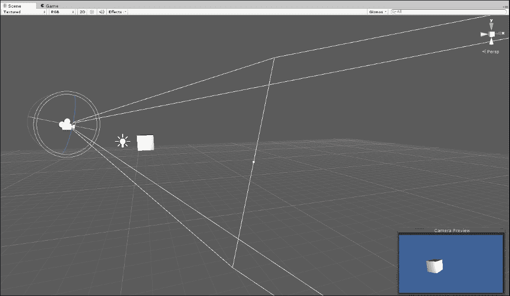

在场景视图中选择相机时，相机显示截锥体

这个 Gizmo 特别有助于定位选定的相机以获得场景的最佳视图。然而，有时你想要实现几乎相反的效果，即定位未选中的相机视图中的对象。具体来说，你希望将特定对象移动到相机的截锥体内，并确保它对该相机可见。在正常情况下，这可能会很繁琐，因为默认情况下，相机在未选中时不显示其截锥体 Gizmo。这意味着当你移动对象时，你需要不断地选择和重新选择你的相机来检查移动的对象是否真的在相机截锥体内，并在必要时调整和微调它们的位置。为了解决这个问题，如果 Unity 允许你永久查看截锥体 Gizmo，即使相机被选中，那将非常棒，但至少在撰写本书时，它并没有这样做。然而，为了解决这个问题，你可以编写一个脚本，如下面的代码示例 5-1 所示：

```cs
01 using UnityEngine;
02 using System.Collections;
03 //-------------------------------------------------------
04 [ExecuteInEditMode]
05 [RequireComponent(typeof(Camera))]
06 //-------------------------------------------------------
07 public class DrawFrustumRefined : MonoBehaviour 
08 {
09 //-------------------------------------------------------
10 private Camera Cam = null;
11 public bool ShowCamGizmo = true;
12 //-------------------------------------------------------
13 void Awake()
14 {
15       Cam = GetComponent<Camera>();
16 }
17 //-------------------------------------------------------
18 void OnDrawGizmos()
19 {
20       //Should we show gizmo?
21       if(!ShowCamGizmo) return;
22       //Get size (dimensions) of Game Tab
23       Vector2 v = DrawFrustumRefined.GetGameViewSize();
24       float GameAspect = v.x/v.y; //Calculate tab aspect ratio
25       float FinalAspect = GameAspect / Cam.aspect; 
26 
27       Matrix4x4 LocalToWorld = transform.localToWorldMatrix;
28       Matrix4x4 ScaleMatrix = Matrix4x4.Scale(new Vector3(Cam.aspect * (Cam.rect.width / Cam.rect.height), FinalAspect,1)); 

29       Gizmos.matrix = LocalToWorld * ScaleMatrix;
30       Gizmos.DrawFrustum(transform.position, Cam.fieldOfView, Cam.nearClipPlane, Cam.farClipPlane, FinalAspect); 

31       Gizmos.matrix = Matrix4x4.identity; //Reset gizmo matrix
32 }
33 //-------------------------------------------------------
34 //Function to get dimensions of game tab
35 public static Vector2 GetGameViewSize()
36 {
37       System.Type T = System.Type.GetType("UnityEditor.GameView,UnityEditor");
38        System.Reflection.MethodInfo GetSizeOfMainGameView = T.GetMethod("GetSizeOfMainGameView",System.Reflection.BindingFlags.NonPublic | System.Reflection.BindingFlags.Static);

39        return (Vector2)GetSizeOfMainGameView.Invoke(null,null);
40 }
41 //-------------------------------------------------------
42 }
43 //-------------------------------------------------------
```

以下是在代码示例 5-1 中的注释：

+   **第 27-31 行**：`Gizmos.DrawFrustum` 函数接受诸如位置和旋转等参数，这些参数是在世界空间中而不是局部空间中。这意味着所有位置参数必须首先使用从局部空间到世界空间的矩阵进行转换。这是通过 `Transform` 类的 `localToWorldMatrix` 成员实现的。此外，宽高比参数还需要在实际视口的高度和宽度以及游戏窗口的宽度和高度之间进行进一步计算。

+   **第 35-40 行**：`GetGameViewSize` 函数返回一个二维向量，表示“游戏”标签视图的实际像素尺寸。它通过未记录的编辑器功能检索这些值。应强调函数调用的“未记录”性质；这意味着代码很容易被未来的版本甚至小版本更新所破坏或失效。

以下截图显示了棱台：

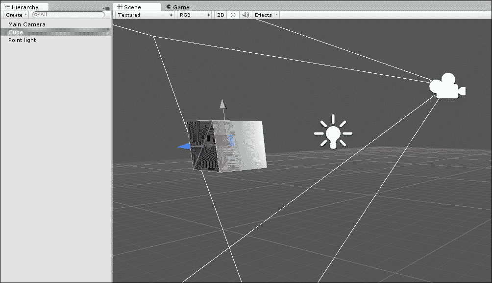

即使相机未被选中，也会显示棱台

# 被看到

在游戏过程中，经常会出现关于对象可见性的问题，有些是实际的，有些是假设性的。关于实际场合，我们可以提出几个问题，包括对象 X 是否现在对相机 Y 可见，对象 X 是否现在对任何相机可见，或者对象 X 何时对特定相机或任何相机变得可见或不可见。至于假设性，我们会问如果将相机移动到位置 Z，对象 X 是否会可见。在实际场合的情况下，我们关注的是基于所有相机的位置，当前帧中对象的实际可见性，而对于假设性，我们关注的是如果将相机移动到特定位置会发生什么。这两种情况对游戏都很重要。知道对象（如敌人角色）是否真正对相机可见对于定义行为和 AI 很重要。这是因为当对象不可见时，我们可以暂停许多行为和计算以节省处理工作量。此外，知道如果移动相机对象是否会变得可见是有帮助的，因为它让我们能够预测哪些对象（如果有的话）将在下一帧进入可见范围，这样我们就可以提前做好准备。现在，在考虑如何在脚本中回答这些问题之前，值得考虑的是可见性的最狭义含义。

在可见性的方面，有两个主要概念：视锥体和遮挡。每个透视相机都有一个视锥体，正如我们之前所看到的；这个视锥体是从相机镜头向外延伸的梯形体积，它包含一个由视野和裁剪平面距离属性定义的区域。从本质上讲，视锥体在数学上定义了相机的视野——场景中相机现在可以潜在观察到的区域。这个词“潜在”很重要，因为即使一个活跃且可见的对象位于相机视锥体内，也不一定意味着它对相机是可见的。这是因为视锥体内的对象可以遮挡视锥体内的其他对象；也就是说，较近的对象可以完全或部分地遮挡或隐藏它们后面的对象。因此，真正的可见性测试至少涉及两个过程：首先，确定对象是否在视锥体内，其次，确定它是否被遮挡。只有当一个对象通过这两个测试时，才能将其归类为对相机可见，即使在那时，也只是在假设对象没有被自定义着色器或其他后处理效果隐藏或渲染为不可见的情况下。简而言之，有许多原因说明真正的可见性测试是一个复杂的过程，但在这里，我会将两阶段测试视为大多数目的足够好了。

## 检测对象的可视性

也许，在 Unity 中对对象进行的最简单、最直接的可见性测试就是确定对象何时对任何相机变得可见或不可见。两个伴随事件，`OnBecameVisible`和`OnBecameInvisible`，会在任何具有渲染器组件的对象上自动调用，包括`MeshRenderer`和`SkinnedMeshRenderer`。当然，即使这些空游戏对象位于相机的视野内，也不会调用它们，因为（从技术上讲）它们不包含任何可见的部分，尽管所有部分都在空间上有位置。你可以像以下代码示例 5-2 中所示那样处理这些事件：

```cs
 //----------------------------------------------
 using UnityEngine;
 using System.Collections;
 //----------------------------------------------
 public class ViewTester : MonoBehaviour 
 {
    //----------------------------------------------
   void OnBecameVisible()
    {
          Debug.Log ("Became Visible");
    }
    /----------------------------------------------
    void OnBecameInvisible()
    {
          Debug.Log ("Became Invisible");
    }
    //----------------------------------------------
 }
 //----------------------------------------------
```

在事件 `OnBecameVisible` 和 `OnBecameInvisible` 中，有几个重要的注意事项值得注意。首先，这里的可见性仅指一个对象已经进入摄像机的视锥体内；因此，它仍然可能被其他更近的对象遮挡，所以它可能根本不可见。其次，这些事件适用于所有摄像机，而不是特定摄像机。`OnBecameVisible` 只调用一次，告诉你对象之前不可见，现在已进入至少一个摄像机的视锥体。同样，`OnBecameInvisible` 也只调用一次，告诉你对象之前可见，现在已离开所有摄像机的视锥体。最后，而且相当不实用，这些函数还包括场景摄像机的可见性。这意味着如果你在打开并可见的 **场景** 选项卡中测试你的游戏，并且对象在 **场景** 选项卡中对你可见，这将算作可见。简而言之，`OnBecameVisible` 和 `OnBecameInvisible` 方法只有在你的行为依赖于场景中的总可见性或不可见性时才有用，其中可见性仅对应于视锥体的存在。换句话说，这些事件是切换依赖于可见性的行为的好地方，例如，AI 行为，例如 NPC 惊慌行为和其他类型的 NPC 之间的交互。

### 小贴士

关于函数 `OnBecameVisible` 和 `OnBecameInvisible` 的更多信息，可以在 Unity 文档中在线找到，网址为 [`docs.unity3d.com/ScriptReference/MonoBehaviour.OnBecameVisible.html`](http://docs.unity3d.com/ScriptReference/MonoBehaviour.OnBecameVisible.html) 和 [`docs.unity3d.com/ScriptReference/MonoBehaviour.OnBecameInvisible.html`](http://docs.unity3d.com/ScriptReference/MonoBehaviour.OnBecameInvisible.html)。

## 关于对象可见性的更多内容

除了测试对象何时进入和离开摄像机可见性之外，另一个重要的检查是测试对象是否现在对特定摄像机可见。与在对象进入或离开视锥体时一次性调用的 `OnBecameVisible` 和 `OnBecameInvisible` 不同，这种测试是关于对象当前状态的一种假设，没有关于它的先验知识。为了实现这一点，可以使用 `OnWillRenderObject` 事件。只要对象对该摄像机可见，这个事件就会在每个帧上连续调用一次，每次调用都是针对它可见的每个摄像机。这里的“可见”是指“在摄像机视锥体内”。同样，不应用遮挡测试。参考以下代码示例 5-3，并注意在这个事件内部，可以使用 `Camera.current` 成员来获取当前对象可见的摄像机的引用，包括场景视图摄像机：

```cs
   void OnWillRenderObject()
   {
        Debug.Log (Camera.current.name);
   }
```

## 视锥体测试 – 渲染器

有很多时候，Unity 本地相机事件，正如我们之前所看到的，不足以满足你的可见性和视锥测试需求。具体来说，你可能只想测试是否只有一个特定的相机可以看到渲染器，如果它是可见的，一个不可见对象是否会被看到，空间中指定的一点是否被相机看到，或者如果将相机移动到新位置，相机是否会看到特定的对象。所有这些情况在不同的场景中都可以作为重要的可见性测试，并且所有这些都需要一定程度的手动测试。为了满足这些相机可见性需求，我们需要更密集地编写代码。以下章节中的函数将被编译为在专门的 `CamUtility` 类中的静态函数。让我们首先创建一个函数来测试特定渲染器组件是否位于特定 `Camera` 对象的视锥体内，如下面的代码示例 5-4 所示：

```cs
01 using UnityEngine;
02 using System.Collections;
03 //---------------------------------------------------------
04 public class CamUtility
05 {
06 //---------------------------------------------------------
07 //Function to determine whether a renderer is within frustum of a specified camera
08 //Returns true if renderer is within frustum, else false
09 public static bool IsRendererInFrustum(Renderer Renderable, Camera Cam)

10 {
11        //Construct frustum planes from camera
12        //Each plane represents one wall of frustrum
13        Plane[] planes = GeometryUtility.CalculateFrustumPlanes(Cam);

14 
15       //Test whether renderable is within frustum planes
16       return GeometryUtility.TestPlanesAABB(planes, Renderable.bounds);

17 }
18 //---------------------------------------------------------
19 }
```

从第 10-17 行，`GeometryUtility` 类被用来生成一个描述相机视锥体的平面对象数组。平面在 3D 空间中的作用类似于线在 2D 空间中的作用；它们在 3D 中标记出一个平坦的、想象中的表面。视锥体平面是一组六个平面，它们在 3D 空间中旋转并对齐，以表示完整的梯形相机视锥体。然后，这个数组被 `TestPlanesAABB` 函数（**轴对齐边界框**（**AABB**））使用，该函数确定网格渲染器的碰撞边界是否存在于由这些平面定义的视锥体内。

## 视锥测试 – 点

当然，你并不总是想测试渲染器的可见性。相反，你可能只想测试一个点。这可能有两个主要原因。首先，你可能想知道一个对象，例如粒子或枪靶位置，是否实际上是可见的。其次，你可能不仅想知道一个点是否可见，还想知道它在屏幕空间中的位置；这将由相机渲染。下面的代码示例 5-5 将执行此操作。它将测试一个点是否在相机视锥体内，如果是的话，它还会进一步返回该点在标准化视口空间（介于 1-0 之间）中屏幕上的渲染位置。

```cs
 //---------------------------------------------------------
 //Determines if point is within frustum of camera
 //Returns true if point is within frustum, else false
 //The out param ViewPortLoc defines the location 

public static bool IsPointInFrustum(Vector3 Point, Camera Cam, out Vector3 ViewPortLoc)
    {
         //Create new bounds with no size
         Bounds B = new Bounds(Point, Vector3.zero);

        //Construct frustum planes from camera
        //Each plane represents one wall of frustrum

         Plane[] planes = GeometryUtility.CalculateFrustumPlanes(Cam);

        //Test whether point is within frustum planes
        bool IsVisible = GeometryUtility.TestPlanesAABB(planes, B);
        //Assign viewport location
        ViewPortLoc = Vector3.zero;

       //If visible then get viewport location of point
       if(IsVisible)
                ViewPortLoc = Cam.WorldToViewportPoint(Point);

         return IsVisible;
    }
    //---------------------------------------------------------
```

## 视锥测试 – 遮挡

如前所述，在严格意义上，可见性主要是一个两阶段过程，而不是一个单阶段过程。迄今为止的所有可见性测试都仅限于检查物体是否位于摄像机的视锥体内。通常情况下，这已经足够了，并且应该始终优先考虑。然而，有时这真的不够，因为即使在视锥体内的物体中，一个物体也可能遮挡另一个物体，因为较近的物体可能会完全或部分地遮挡较远的物体。尽管如此，这本身并不总是问题，因为通常情况下，确定物体可见性的主要兴趣只是要知道摄像头是否足够近，以便启用一组性能密集型行为（如 AI 行为）。目的是不是真正的可见性测试，而是要知道摄像头是否足够近。在这些情况下，物体是否被遮挡并不重要；重要的是它们是否在视锥体内。然而，偶尔遮挡确实很重要，例如当玩家查看特定物体时显示 GUI 元素或弹出通知。在这些情况下，遮挡很重要，因为 GUI 元素不应该在墙的另一侧的物体上弹出。有时，你可以通过创造性地使用碰撞体、触发器和仔细放置物体来绕过这些情况，有时，除了进一步通过遮挡测试过滤视锥体内的物体外，别无选择。现在，视锥体内物体的遮挡测试是一个深奥的主题，通过某些实现，它可能会产生显著的性能开销。因此，最好的方法之一是使用简单的`Physics.LineCast`方法调用来确定从摄像头到目标物体之间绘制的想象线是否被其他碰撞体相交。这种方法通常效果很好，但其局限性应该被认识到。首先，它假设所有可见物体都有碰撞体；任何违反此规则的例外都不会被`LineCast`方法检测到。其次，由于碰撞体仅近似网格的边界，并且不围绕网格顶点进行包裹，因此当网格有内部空洞时，`LineCast`方法可能会失败，因为周围的碰撞体会阻止`LineCast`穿透它们。最后，具有透明材质的网格，这些材质会揭示其后面的物体，将始终失败`LineCast`方法。考虑以下代码示例 5-6：

```cs
    //---------------------------------------------------------
    //Function to determine whether an object is visible
    public static bool IsVisible(Renderer Renderable, Camera Cam)
    {
         //If in frustrum then cast line
         if(CamUtility.IsRendererInFrustum(Renderable, Cam))
               return 

//Is direct line between camera and object?
!Physics.Linecast(Renderable.transform.position, Cam.transform.position);
         return false; //No line found or not in frustum
    }
    //---------------------------------------------------------
```

## 摄像头视觉 – 前视和后视

在某些游戏中，例如 RTS 游戏或休闲游戏，相机地平线（或远裁剪平面）并不那么重要，因为相机总是能看到它前面的所有东西。在这些情况下，当对象在视锥体之外时，它们只在*x*和*y*平面上之外，但不在局部的*z*轴上；也就是说，隐藏的对象之所以被隐藏，仅仅是因为相机没有直接看向它们。然而，当相机适当定位时，对象在远处永远不会太远而看不到远裁剪平面之外。在这种情况下，可见性测试通常可以简化为更快的简单方向测试。因此，问题从“对象是否在视锥体内且未被遮挡？”转变为“对象是在相机前面还是后面？”在这里，我们需要的是不同的答案；这不是一个可见性问题，而是一个方向问题，即相机及其主题是否定位得如此，以至于主题在相机前面或后面。为了测试这一点，可以使用向量点积。点积接受两个向量作为输入，并将它们减少为一个单维的数值输出。这个值描述了两个输入向量之间的角度关系。在以下代码示例 5-7 中，可以将`CamFieldView`类附加到相机上，并检测相机是否可以看到目标对象，即目标对象是否在相机前方有限视野内：

```cs
 using UnityEngine;
 using System.Collections;
 //-------------------------------------------------
 public class CamFieldView : MonoBehaviour 
 {
    //-------------------------------------------------
    //Field of view (degrees) in which can see in front of us
    //Measure in degrees from forward vector (left or right)
    public float AngleView = 30.0f;

    //Target object for seeing
    public Transform Target = null;

    //Local transform
    private Transform ThisTransform = null;
    //-------------------------------------------------
    // Use this for initialization
    void Awake () 
    {
         //Get local transform
         ThisTransform = transform;
    }
    //-------------------------------------------------
     // Update is called once per frame
     void Update ()
    {
         //Update view between camera and target
         Vector3 Forward = ThisTransform.forward.normalized;
         Vector3 ToObject = (Target.position - ThisTransform.position).normalized;

         //Get Dot Product
         float DotProduct = Vector3.Dot(Forward, ToObject);
         float Angle = DotProduct * 180f;

         //Check within field of view
        if(Angle >= 180f-AngleView)
         {
                  Debug.Log ("Object can be seen");
         }
    }
    //-------------------------------------------------
 }
 //-------------------------------------------------
```

# 正交相机

在 Unity 中，每个新创建的相机对象默认配置为透视相机，除非你更改默认设置。这种相机类型最接近现实生活中的相机，它们在 3D 空间中有一个位置，有一个弯曲的镜头，并采用将捕获的图像转换到平坦的二维表面（如屏幕）的方法。这种相机的典型症状是透视缩短，这是对渲染对象施加的畸变的名称。具体来说，随着渲染对象向远处退去，它们会变得越来越小，随着它们从视线的中心点远离，它们的形状和外观会发生变化，并且所有平行线都会在远处的某个消失点汇聚，无论是地平线本身还是次要的线条上。然而，与透视相机相对的是正交相机。这些相机对于创建 2D 和真正等距的游戏非常有用，而不仅仅是模仿等距。使用正交相机时，镜头被压扁成一个平面，结果是透视缩短的消失，即平行线保持平行，对象不会随着距离的增加而缩小，二维在远离视线的中心时仍然是二维，等等。你可以通过从对象检查器中的**投影**类型设置轻松地将相机从**透视**切换到**正交**，如下面的截图所示：

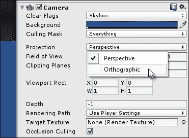

将透视摄像机更改为正交摄像机

在将**透视**类型更改为**正交**后，摄像机视锥体也将从梯形体积变为盒子。盒子内的所有内容都将可见，并且靠近的对象将继续遮挡更远处的对象，但所有其他深度感知都将消失，如下面的截图所示。因此，这种摄像机被认为适合用于 2D 游戏。

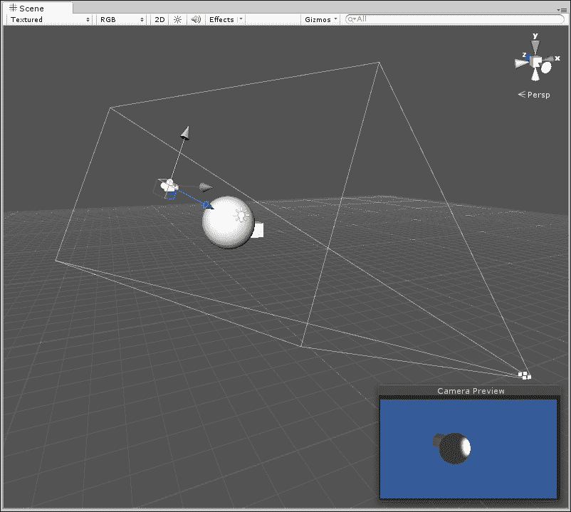

正交摄像机的视锥体是一个盒子

在使用**正交**摄像机工作时，中心问题是如何在场景中的世界单位（单位）和屏幕上的像素之间创建 1:1 的关系。这个问题产生的原因是在 2D 游戏和 GUI 中，显示在屏幕上的图形以默认和正确的尺寸显示是有用的，正如在纹理文件中定义的那样。相比之下，在大多数 3D 游戏中，纹理映射、透视和缩放意味着纹理看起来是扭曲的，即投影到 3D 对象的表面上，它们不是直接看到的，就像在照片编辑程序中一样，而是在透视中看到的。对于 2D 游戏和精灵来说，情况是不同的。这些图形通常正面观看。因此，最好以默认大小显示它们，像素对像素。这种显示称为像素完美，因为纹理中的每个像素都将显示在屏幕和游戏中，且不发生变化。然而，在实践中实现这一点需要特定的方法。简而言之，要将 1 个世界单位映射到 1 个像素，应在**摄像机**选项卡中将**大小**字段设置为游戏垂直分辨率的一半。因此，如果你的游戏以 1024 x 768 运行，则**大小**字段应设置为`364`，因为 768 / 2 = 364，如下所示：

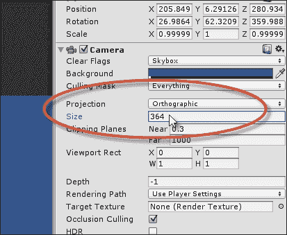

大小字段控制世界单位如何映射到屏幕上的像素

您可以直接在编辑器中设置**大小**字段，但这仅在游戏分辨率恒定且永不更改的情况下才有效。如果用户可以调整游戏窗口大小或更改游戏分辨率，那么您就需要在脚本中更新摄像机大小，如下面的代码示例 5-8 所示：

```cs
01 //-------------------------------------------------------
02 using UnityEngine;
03 using System.Collections;
04 //-------------------------------------------------------
05 [RequireComponent(typeof(Camera))] 
06 //-------------------------------------------------------
07 public class OrthoCam : MonoBehaviour
08 {
09 //private reference to camera component
10 private Camera Cam = null;
11 
12 //Reference to Pixels to World Units Scale
13 public float PixelsToWorldUnits = 200f;
14 //-------------------------------------------------------
15 // Use this for initialization
16 void Awake () 
17 {
18        //Get camera reference
19        Cam = GetComponent<Camera>();
20 }
21 //-------------------------------------------------------
22 // Update is called once per frame
23 void LateUpdate () 
24 {
25        //Update orthographic size
26        Cam.orthographicSize = Screen.height / 2f / PixelsToWorldUnits;

27 }
28 //-------------------------------------------------------
29 }
30 //-------------------------------------------------------
```

注意，成员变量`PixelsToWorldUnits`已添加到第 13 行，以根据导入的精灵纹理的**像素到单位**字段缩放正交大小，如下面的截图所示。这有助于确保精灵在屏幕上显示时将具有正确的像素大小。这是因为所有精灵都必须按此值缩放，以将纹理中的像素映射到世界中的单位。

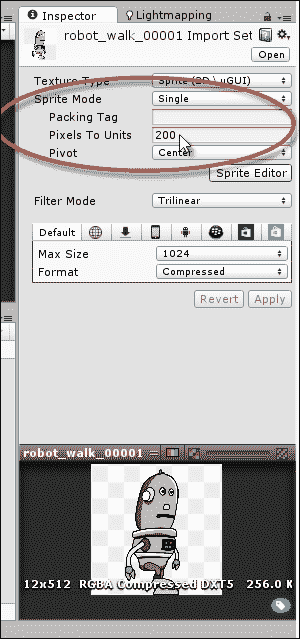

设置精灵纹理的像素到单位缩放

# 摄像机渲染和后期处理

官方 Unity 文档关于相机渲染和后期处理的内容相对较少。然而，这并不意味着关于这个主题没有太多可说的。相反，Unity 相机和对象在如何渲染场景方面提供了广泛的灵活性。这些主题属于后期处理的范畴。具体来说，这指的是对相机渲染输出所做的所有额外编辑和修改，这些编辑和修改不包括在正常渲染中。这包括模糊效果、颜色调整、鱼眼效果等等。应该指出的是，这些功能的访问仅限于 Unity 的专业版本，而不是免费版本。因此，免费用户将无法跟随并完成本节。然而，对于专业版本用户，有广泛的相机渲染功能可用，如图中所示。本节通过创建一个相机切换系统来考虑这些功能，其中一个相机将平滑地淡入到另一个相机。通过交叉淡入，我并不是简单地指一个相机会切换到另一个相机，这（顺便提一下）可以通过改变相机的深度场来实现，因为高级相机渲染在低级相机之上。我更指的是第一个相机的渲染输出将逐渐在透明度上溶解，以揭示第二个相机的输出。那么，让我们开始吧。

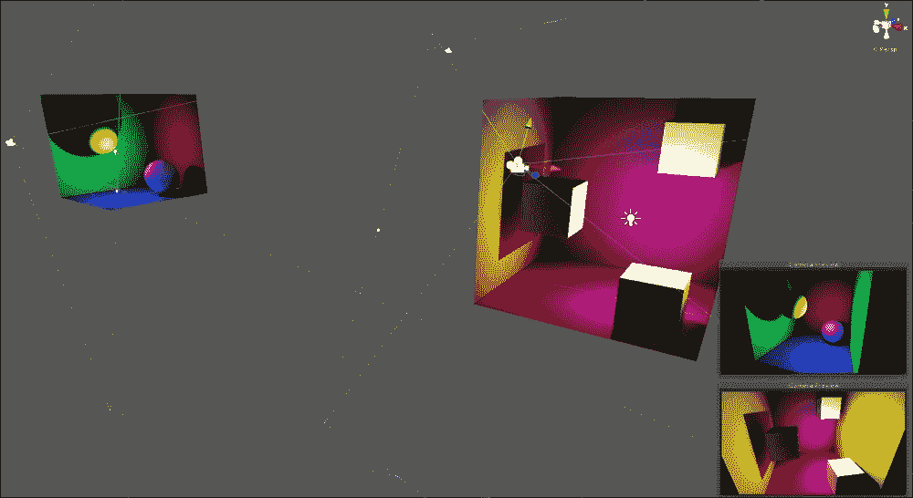

创建具有多个相机的场景

以包含两个独立区域或区域的场景开始项目，如图中所示的前一个屏幕截图。示例项目包含在本书的配套文件（代码包）中，位于本章 `Cameras` 文件夹内。场景的每个区域应分配一个单独的相机；这样，场景中就有两个相机，每个相机组件都应该被禁用。这将防止相机自动渲染自身。在这里，我们将手动渲染相机；这将允许每个相机的渲染结果组合并淡入到其他相机之上。

### 小贴士

对于每个相机，都移除了 `AudioListener` 组件，因为 Unity 场景在任何时候只能有一个活动的 `AudioListener`。

接下来，在场景的原点创建一个标记为 `MainCamera` 的第三个相机，并设置一个空的剔除遮罩，确保相机处于活动状态但不能渲染任何内容。这将代表中央主场景相机，它将组合来自所有其他相机的渲染结果，如图所示：

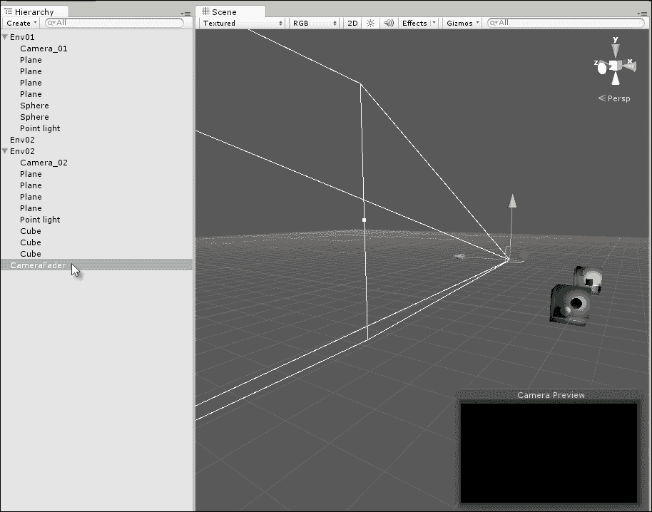

创建用于渲染的第三个主相机

现在，场景应该有三个相机：两个位于不同位置的不同和禁用的相机（相机 **X** 和 **Y**），以及一个位于场景原点的主相机（相机 **Z**）。在此基础上，以下代码示例 5-9 可以分配给相机 **Z**，这允许在按下空格键时在相机 **X** 和 **Y** 之间进行淡入淡出。

```cs
001 //Class to fade from camera 0 to 1, and back from 1 to 0
002 //This class assumes there are only two scene cameras
003 //---------------------------------------
004 using UnityEngine;
005 using System.Collections;
006 //---------------------------------------
007 public class CameraFader : MonoBehaviour
008 {
009       //---------------------------------------
010       //All cameras in the scene to be composited
011       public Camera[] Cameras;
012 
013      //Color to multiply with render)
014      public Color[] CamCols = null;
015 
016      //Fade in/out time in seconds 
017       public float FadeTime = 2.0f;
018 
019       //Material used as shader to final render
020       public Material Mat = null;
021       //---------------------------------------
022       // Use this for initialization
023       void Start () 
024       {
025             //Assign render textures to each camera
026             foreach(Camera C in Cameras)
027                    C.targetTexture = new RenderTexture(Screen.width, Screen.height, 24); //Create texture

028       }
029       //---------------------------------------
030       //Called once per frame after the camera has 
031       //finished rendering but before the render is shown
032       //Companion function: OnPreRender
033        void OnPostRender()
034       {
035            //Define screen rect
036            Rect ScreenRct = new Rect(0,0,Screen.width,Screen.height);
037 
038            //Source Rect
039            Rect SourceRect = new Rect(0,1,1,-1);
040 
041            //Render each camera to their target texture
042            for(int i = 0; i<Cameras.Length; i++)
043             {
044                   //Render camera
045                   Cameras[i].Render();
046 
047                   //Draw textures to screen using camera
048                   GL.PushMatrix();
049                   GL.LoadPixelMatrix();
050                   Graphics.DrawTexture(ScreenRct, Cameras[i].targetTexture, SourceRect, 0,0,0,0, CamCols[i]); 
051                   GL.PopMatrix(); //Reset matrix
052            }
053       }
054       //---------------------------------------
055       //This function is called after OnPostRender
056       //And when final pixels are to be shown on screen
057       //src = current render from camera
058       //dst = texture to be shown on screen
059       void OnRenderImage(RenderTexture src, RenderTexture dst)
060       {
061             //Now push final pixels to screen with Mat
062             Graphics.Blit(src, dst, Mat);
063       }
064       //---------------------------------------
065       //Lerp color over period TotalTime
066      //Fade alpha for topmost rendered camera CamCols[1]
067      public IEnumerator Fade(Color From, Color To, float TotalTime)

068      {
069           float ElapsedTime = 0f;
070 
071            //Loop while total time is not met
072            while(ElapsedTime <= TotalTime)
073             {
074                   //Update color
075                   CamCols[1] = Color.Lerp(From, To, ElapsedTime/TotalTime);
076 
077                  //Wait until next frame
078                  yield return null;
079 
080                 //Update Time
081                 ElapsedTime += Time.deltaTime;
082             }
083 
084            //Apply final color
085             CamCols[1] = Color.Lerp(From, To, 1f);
086     }
087       //---------------------------------------
088       //Sample for testing camera functionality
089       //Press space bar to fade in and out between cameras
090       void Update()
091       {
092             //Fade camera in or out when space is pressed
093             if(Input.GetKeyDown(KeyCode.Space))
094             {
095                   StopAllCoroutines();
096 
097                   //Should we fade out or in
098                   if(CamCols[1].a <= 0f)
099                          StartCoroutine(Fade(CamCols[1], new Color(0.5f,0.5f,0.5f,1f), FadeTime)); //Fade in

100                    else
101                           StartCoroutine(Fade(CamCols[1], new Color(0.5f,0.5f,0.5f,0f), FadeTime)); //Fade out

102            }
103       }
104       //---------------------------------------
105 }
```

以下是对代码示例 5-9 的注释：

+   **行 011-020**: `CamerFader` 类负责在 `Camera[0]` 和 `Camera[1]` 之间进行交叉淡入淡出。为了实现这一点，创建了几个变量。`Cameras` 数组维护了一个相机列表：在这种情况下是两个相机。`CamCols` 数组与 `Cameras` 相关联。它描述了通过哪种颜色将相机渲染进行乘法；这允许通过 alpha 值使渲染透明。`FadeTime` 变量定义了相机在一个方向上淡入或淡出的总时间（以秒为单位）。最后，`Mat` 变量引用任何将应用于主相机最终渲染的有效材质，即完成渲染的像素，包括从所有其他相机复合的所有内容。

+   **行 023-038**: `Start` 方法为每个相机创建 `RenderTexture`，并将纹理分配给其 `TargetTexture` 成员。从本质上讲，这意味着每个相机都被分配了一个内部纹理，其渲染将在本地进行复合。

+   **行 033-052**: Unity 会自动调用 `OnPostRender` 事件，针对场景中任何活动的相机对象，每帧一次，在相机完成正常渲染之后。这给对象一个机会在正常渲染数据之上渲染额外的相机或元素。在这里，调用 `Cameras` 数组中每个相机的 `Render` 方法；此方法手动渲染相机，不是直接在屏幕上，而是在其渲染纹理上。一旦渲染到纹理上，`Graphics.DrawTexture` 函数按照数组的顺序将每个相机的 `RenderTexture` 绘制到屏幕上，一个叠一个。请注意，每个 `DrawTexture` 调用都会将 `CamCols` 颜色乘以纹理；这也考虑了 alpha 成分以实现透明度。

+   **第 059-063 行**：与 `OnPostRender` 类似，Unity 会自动在每一帧调用活动相机对象的 `OnRenderImage` 事件。它在 `OnPostRender` 之后和相机渲染显示在屏幕上之前被调用。此事件提供两个参数，即 `src` 和 `dst`。`src` 参数是对包含从 `OnPostRender` 输出的相机完成渲染的渲染纹理的引用，而 `dst` 参数引用定义了当 `OnRenderImage` 事件完成时将在屏幕上显示的渲染纹理。简而言之，此函数为我们提供了手动在代码中或通过着色器编辑渲染像素的机会。在这里，调用 `Graphics.Blit` 函数使用与材质引用 `Mat` 关联的着色器将源复制到目标渲染纹理。 

+   **第 067-085 行**：`Fade` 是一个 `CoRoutine`，它将 `From` 颜色过渡到 `To` 颜色，过渡时间为 `TotalTime`。此 `CoRoutine` 方法用于在相机颜色之间过渡 `0` 和 `1` 的 alpha 值，分别代表透明和不透明。

以下截图显示了交叉淡入淡出相机效果：

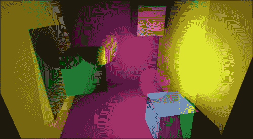

混合相机

# 相机抖动

现在，这是我们可以使用 Unity 免费版本实现的效果：相机抖动！对于战斗、射击和动作游戏通常来说，相机抖动效果可能很重要。它传达了冲击、危险、动作、动态和兴奋——一种动态反馈。实际上，它还可以用来代替许多其他动画，这些动画模拟了普遍的运动和情感，而在场景的其他地方找不到这些运动和情感。在这方面，相机抖动可以通过创建一个总动画来节省我们大量的工作，就像这里所展示的那样：

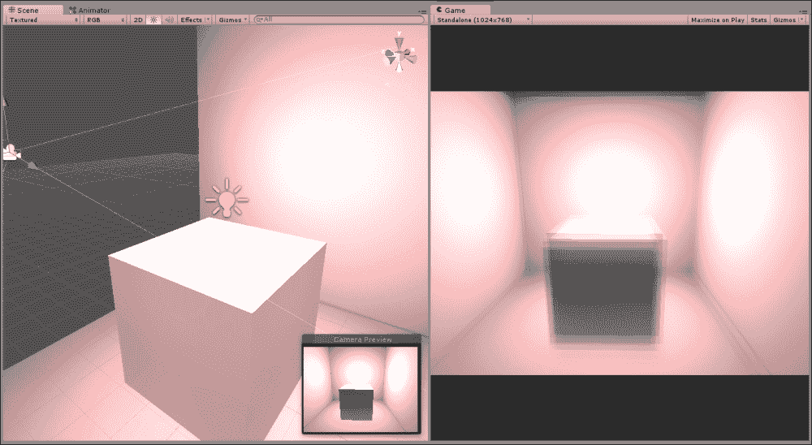

相机抖动效果

创建相机抖动有许多方法，但它们都涉及使用某种“随机”函数在最小和最大范围之间波动相机位置。有时，“随机性”保持原始状态，有时则使用阻尼功能来平滑，以创建更慢或更“流畅”的抖动。请参考以下代码示例 5-10，该示例可以附加到任何相机上以创建抖动效果：

```cs
 using UnityEngine;
 using System.Collections;
 //---------------------
 public class CameraShake : MonoBehaviour 
 {
    private Transform ThisTransform = null;

     //Total time for shaking in seconds
     public float ShakeTime = 2.0f;
     //Shake amount - distance to offset in any direction
     public float ShakeAmount = 3.0f;

     //Speed of camera moving to shake points
     public float ShakeSpeed = 2.0f;

    //---------------------
    // Use this for initialization
    void Start () 
    {
         //Get transform component
         ThisTransform = GetComponent<Transform>();

         //Start shaking
        StartCoroutine(Shake());
    }
    //---------------------
    //Shake camera
    public IEnumerator Shake()
    {
         //Store original camera position
         Vector3 OrigPosition = ThisTransform.localPosition;

          //Count elapsed time (in seconds)
          float ElapsedTime = 0.0f;

         //Repeat for total shake time
         while(ElapsedTime < ShakeTime)
         {
               //Pick random point on unit sphere
                Vector3 RandomPoint = OrigPosition + Random.insideUnitSphere * ShakeAmount;

                //Update Position
                ThisTransform.localPosition = Vector3.Lerp(ThisTransform.localPosition, RandomPoint, Time.deltaTime * ShakeSpeed);

                //Break for next frame
                yield return null;

                //Update time
                 ElapsedTime += Time.deltaTime;
         }
         //Restore camera position
         ThisTransform.localPosition = OrigPosition;
    }
    //---------------------
 }
 //---------------------
```

# 相机和动画

相机飞行动画是一种动画，其中相机在特定位置随时间移动和旋转，以创建电影效果。它们的重要性主要是为了创建过场动画，尽管并非仅限于此。这对于创建需要以特定和深思熟虑的方式映射的相机运动，如风格化的第三人称相机和其他俯视视角非常有用。创建此类相机运动的最常见方法是在 Unity 的动画编辑器中使用预定义，或者使用第三方工具，如 Maya、Blender 和 3DS Max。然而，有时需要对相机进行更程序化的控制，以手动调整其位置，远离平均中心，使用平滑的曲线运动，通过一系列点或遵循特定的预定义路线。本节考虑了三种方法。

## 跟随相机

也许，最常见的相机需求之一就是跟随相机，即跟踪场景中指定物体的相机，并跟随它。这种相机在物体和相机之间保持一定的距离，如下面的截图所示。这对于第三人称相机非常有用，例如肩上视角和俯视视角的即时战略游戏。

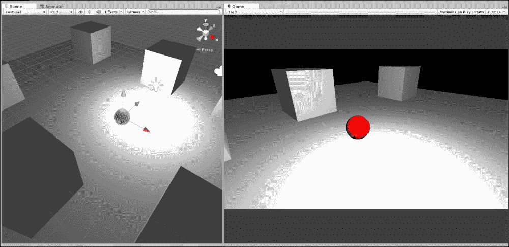

使相机平滑地跟随一个物体

### 小贴士

该项目可以在本书配套文件（代码包）中找到，位于本章`Camera_Smooth_Damp`文件夹内。

对于这类相机，简单的跟随行为通常不足以满足你的需求。如果是这样，你只需将相机作为对象的父对象并保持即可。然而，通常你希望相机运动有一定的平滑或阻尼，也就是说，速度逐渐减慢直到停止，而不是突然立即停止，这时相机要么以全速行驶，要么完全不移动。为了实现这一点，可以使用`Quaternion.Slerp`和`Vector3.SmoothDamp`函数。考虑以下代码示例 5-11，这是一个可以附加到任何相机上以平滑跟随物体的类：

```cs
 using UnityEngine;
 using System.Collections;
 //---------------------------------------------------------------
 public class CamFollow : MonoBehaviour 
 {
 //---------------------------------------------------------------
    //Follow target
     public Transform Target = null;

    //Reference to local transform
    private Transform ThisTransform = null;

    //Linear distance to maintain from target (in world units)
    public float DistanceFromTarget = 10.0f;

    //Height of camera above target
    public float CamHeight = 1f;

    //Damping for rotation
    public float RotationDamp = 4f;

    //Damping for position
    public float PosDamp = 4f;
 //---------------------------------------------------------------
    void Awake()
    {
         //Get transform for camera
         ThisTransform = GetComponent<Transform>();
    }
 //---------------------------------------------------------------
    // Update is called once per frame
    void LateUpdate () 
    {
         //Get output velocity
         Vector3 Velocity = Vector3.zero;

         //Calculate rotation interpolate
         ThisTransform.rotation = Quaternion.Slerp(ThisTransform.rotation, Target.rotation, RotationDamp * Time.deltaTime);

         //Get new position
         Vector3 Dest = ThisTransform.position = Vector3.SmoothDamp(ThisTransform.position, Target.position, ref Velocity, PosDamp * Time.deltaTime);

         //Move away from target
         ThisTransform.position = Dest - ThisTransform.forward * 
DistanceFromTarget;

          //Set height
          ThisTransform.position = new Vector3(ThisTransform.position.x, CamHeight, ThisTransform.position.z);

         //Look at dest
         ThisTransform.LookAt(Dest);
    }
 //---------------------------------------------------------------
 }
```

### 小贴士

关于`Quaternion.Slerp`的更多信息可以在网上找到，链接为[`docs.unity3d.com/ScriptReference/Quaternion.Slerp.html`](http://docs.unity3d.com/ScriptReference/Quaternion.Slerp.html)，关于`Vector3.SmoothDamp`的更多信息可以在网上找到，链接为[`docs.unity3d.com/ScriptReference/Vector3.SmoothDamp.html`](http://docs.unity3d.com/ScriptReference/Vector3.SmoothDamp.html)。

# 相机和曲线

对于过场动画、菜单背景或更简单的相机飞行镜头，你可能只需要让相机大致沿直线移动，允许相机移动时有一定的曲线和速度波动，使用平滑进入和平滑结束的运动。这意味着相机在路径开始时加速，并在路径结束时逐渐减速。为了实现这一点，你可以通过 Unity 的动画编辑器使用预定义的动画，或者你可以使用动画曲线，它提供了对对象随时间变换的高度灵活性和控制，如下所示：

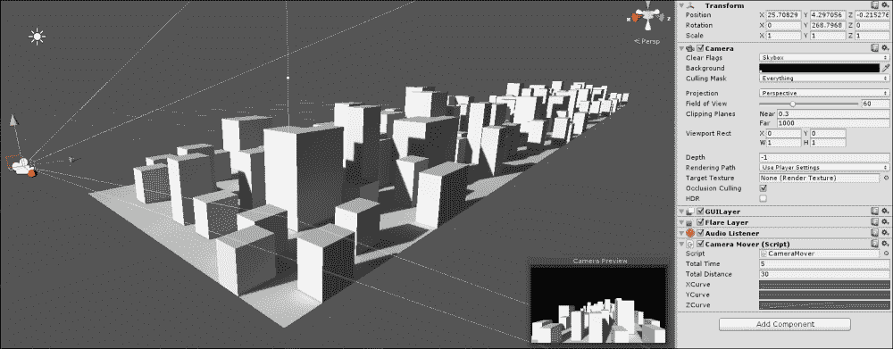

使用动画曲线移动相机

要创建一个允许你控制对象速度和随时间运动的脚本，包括曲线运动和速度的平滑或阻尼，可以使用以下代码示例 5-12：

```cs
//-----------------------------
 using UnityEngine;
 using System.Collections;
 //-----------------------------
 public class CameraMover : MonoBehaviour 
 {
    //-----------------------------
    //Total time for animation
    public float TotalTime = 5.0f;

    //Total Distance to move on each axis
    public float TotalDistance = 30.0f;
    //Curves for motion
    public AnimationCurve XCurve;
    public AnimationCurve YCurve;
    public AnimationCurve ZCurve;

    //Transform for this object
    private Transform ThisTransform = null;
    //-----------------------------
    void Start()
   {
         //Get transform component
         ThisTransform = GetComponent<Transform>();

        //Start animation
        StartCoroutine(PlayAnim());
    }
    //-----------------------------
    public IEnumerator PlayAnim()
    {
         //Time that has passed since anim start
         float TimeElapsed = 0.0f;

          while(TimeElapsed < TotalTime)
          {
                //Get normalized time
                float NormalTime = TimeElapsed / TotalTime;

               //Sample graph for X Y and Z
               Vector3 NewPos = ThisTransform.right.normalized * XCurve.Evaluate(NormalTime) * TotalDistance;

                NewPos += ThisTransform.up.normalized * YCurve.Evaluate(NormalTime) * TotalDistance;

                NewPos += ThisTransform.forward.normalized * ZCurve.Evaluate(NormalTime) * TotalDistance;

               //Update position
               ThisTransform.position = NewPos;

               //Wait until next frame
               yield return null;

               //Update time
               TimeElapsed += Time.deltaTime;
          }
    }
    //-----------------------------

 }
 //-----------------------------
```

### 小贴士

在本章的`Camera_Anim_Curves`文件夹中，可以在本书的配套文件（代码包）中找到一个使用动画曲线进行相机移动的示例项目。

要使用`CameraMover`类，将脚本附加到相机上，并在对象检查器中点击每个**X**、**Y**和**Z**曲线字段来绘制相机随时间变化的距离和速度。通过点击一个**Graph**色块，你可以编辑图表，从而添加点并定义应用于该轴的运动曲线。请注意，**X**、**Y**和**Z**运动是绘制到对象的局部轴（前方、向上和向右）而不是世界轴（*x*、*y*和*z*）。这允许对象运动相对于局部轴进行，从而为你提供了对对象运动的根级控制，同时尊重动画数据的相关性，如下所示：

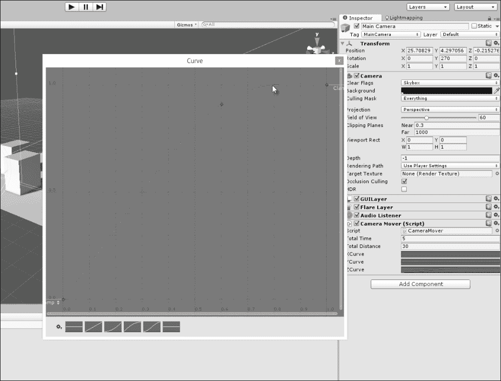

使用动画曲线绘制运动曲线

### 小贴士

更多有关动画曲线的信息可以在 Unity 文档中找到，请访问[`docs.unity3d.com/Manual/AnimatorCurves.html`](http://docs.unity3d.com/Manual/AnimatorCurves.html)。

## 相机路径 – iTween

一个非常常见的功能请求，奇怪的是，它尚未作为原生 Unity 功能实现，那就是可编程的运动路径。这指的是一个 `GameObject`，例如相机，能够通过球形插值平滑地跟随路径或样条曲线，其中路径由一系列连接的游戏对象定义。这个功能已经存在，因为相机运动可以通过使用 Unity 的动画编辑器创建的预定义动画来定义。然而，人们希望对运动路径有更多灵活和程序化的控制，其中路径由一组航点定义，这些航点可以在代码中随时间调整。这种功能特别有用，例如，在太空射击游戏中，敌舰的轨迹明显遵循平滑的曲线飞行路径，有时根据玩家太空船的位置而改变，如以下截图所示。在 Unity 中实现这一点的有许多方法，但一个快速简便的解决方案是使用 Bob Berkebile 提供的免费插件 iTween；这可以直接从 Unity 的 Asset Store 下载和导入。更多关于 iTween 的信息，请访问 [`itween.pixelplacement.com/index.php`](http://itween.pixelplacement.com/index.php)。

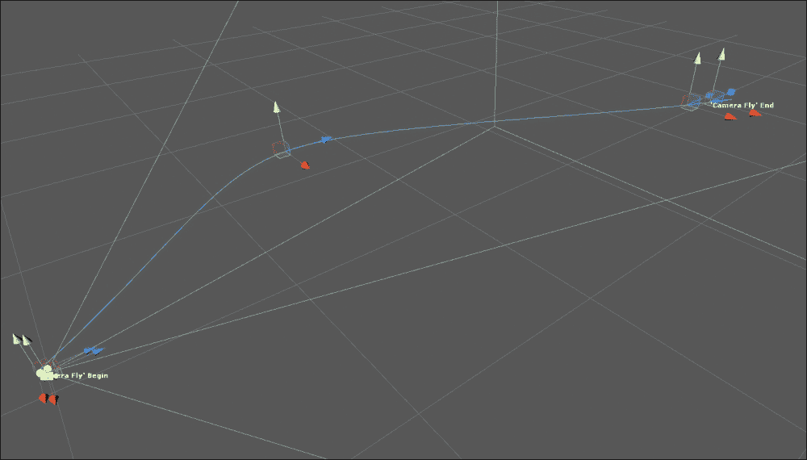

使用 iTween 创建相机运动路径

除了默认的 iTween 包之外，您还可以下载免费提供的 iTween 扩展，即 Visual iTween Path Editor，可通过 [`pixelplacement.com/2010/12/03/visual-editor-for-itween-motion-paths/`](http://pixelplacement.com/2010/12/03/visual-editor-for-itween-motion-paths/) 访问。

在导入两个 iTween 包之后，下一步是开始使用它来创建沿路径动画的对象。以相机飞行为例，将脚本 `iTweenPath` 拖放到相机对象上。此脚本允许您创建一个由多个航点组成的独立且命名的路径，如下所示：

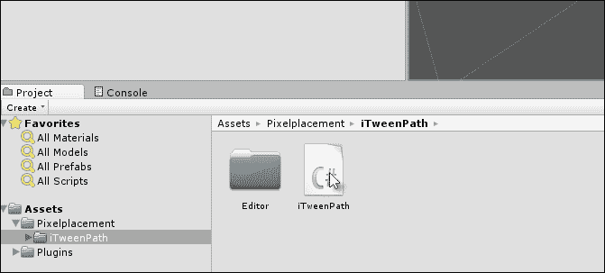

iTweenPath 脚本允许您定义一个航点路径

要为路径定义多个航点，请在**节点计数**字段中输入要创建的总航点数，然后选择**场景**视图中每个节点的小工具，将其转换到适当的位置。注意，在定义相机行进路径的点之间绘制的曲线路径：

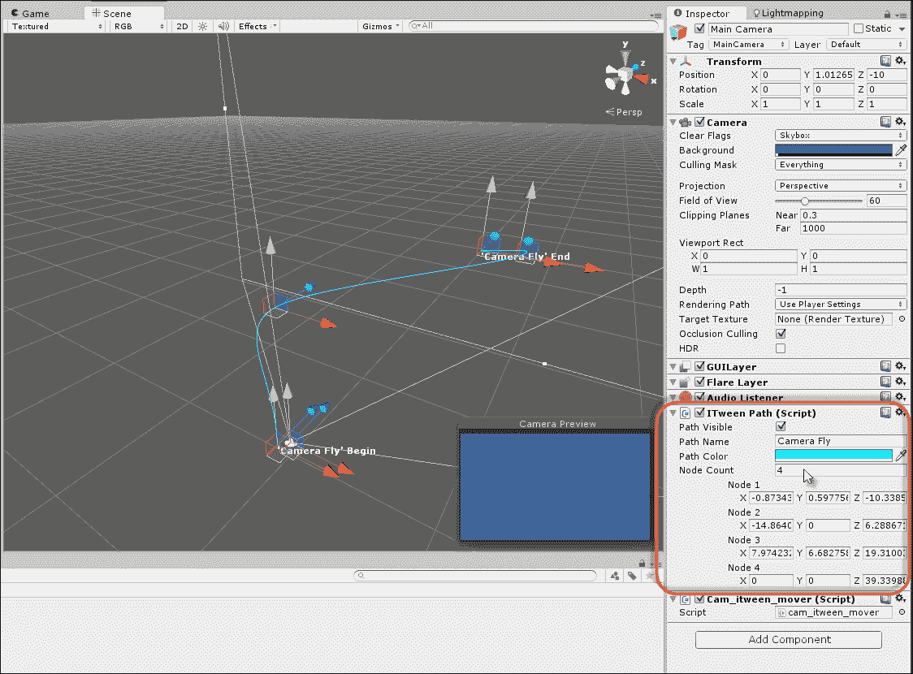

定义路径的航点

然后，为了在运行时使相机跟随路径，将以下代码示例 5-13 脚本添加到相机中：

```cs
 using UnityEngine;
 using System.Collections;

 public class cam_itween_mover : MonoBehaviour 
 {
    // Use this for initialization
    void Start () 
    {
 iTween.MoveTo(gameObject, iTween.Hash("path", iTweenPath.GetPath("Camera Fly") , "time", 4f, "easetype", iTween.EaseType.easeInOutSine));
    }
 }
```

### 小贴士

更多关于 iTween 及其使用的详细信息，可在网上找到，请访问 [`itween.pixelplacement.com/gettingstarted.php`](http://itween.pixelplacement.com/gettingstarted.php)。

# 摘要

本章主要集中讨论了相机常见的许多预期或必需的任务。在 Unity 和任何游戏引擎中，相机都是必不可少的，因为它们代表了场景渲染到屏幕上的视角。在 Unity 中，大多数相机功能通常被视为理所当然，因此，相机为我们提供的许多灵活性和控制性都丢失了，并且没有被讨论。具体来说，在这里，我们首先考虑了 gizmo 渲染，即如何在场景视图中永久渲染相机 gizmo，即使相机被取消选择。其次，我们看到了如何确定哪些对象对相机是可见的，哪些是不可见的。这包括了几种重要的测试，如视锥体存在性和遮挡测试。第三，我们看到了如何创建和配置正交相机，这些相机可以渲染没有透视畸变的 2D 元素。第四，我们看到了如何通过渲染纹理编辑和增强相机渲染。这涉及到覆盖一系列相机关键事件，并将来自其他相机的渲染混合以创建相机交叉淡入淡出效果。第五，我们看到了如何创建更高级的相机运动，例如相机抖动。最后，你学习了关于相机路径的知识，即相机能够跟随指定路径的能力，无论这条路径是由一系列游戏对象航点定义的，还是简单地跟随一个对象。接下来，我们将进一步探索 Mono 框架。
