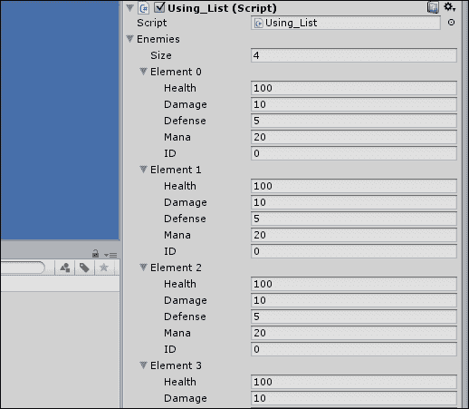
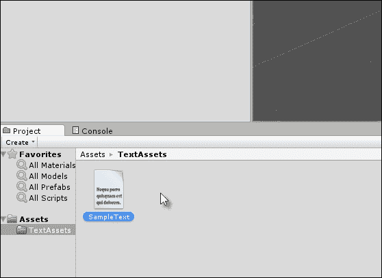
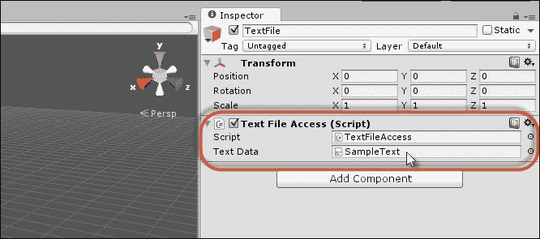

# 第六章：使用 Mono

Unity 支持两种主要的脚本语言，即 C#和 JavaScript。开发者从一开始就应该选择这两种语言中的一种，并在整个项目中一致使用；这样所有脚本都使用所选语言编写。如果不这样做（通过混合不同语言的脚本文件），通常会导致不必要的头痛和困惑。然而，一旦你确定了一种语言，比如 C#，它通常不会提供你创建游戏所需的所有功能。C#本身不能加载和解析 XML 文件以支持保存游戏数据，也不能创建窗口对象和 GUI 小部件以在复杂的数据集和集合上执行高级搜索和查询行为。为了实现这些附加行为和更多功能，我们必须转向外部库。一些库可以直接从 Unity 的 Asset Store 购买，这些库通常用于特定的和专门的目的。然而，Unity 附带 Mono 框架，这是一个免费、跨平台和开源的 Microsoft .NET Framework（编程库）实现，并提供该库中的大多数类。.NET Framework 具有处理字符串、文件输入输出、搜索和排序数据、跟踪动态列表、解析 XML 等功能。这意味着通过 Mono，你可以获得一个广泛的工具集，以有效地和高效地管理应用程序中的数据。本章通过考虑列表、栈、**语言集成查询**（**Linq**）、正则表达式、枚举器等方式，探讨了 Mono 在 Unity 应用程序中部署的许多方法。

以下截图显示了 Mono 框架界面：


Mono 框架随 Unity 引擎一起提供

# 列表和集合

在游戏编程中，最常见的一项任务可能是存储数据列表。这种数据的特点千差万别：高分、玩家统计数据、敌人统计数据、库存物品、武器、升级、关卡列表等等。尽可能选择静态数组来存储数据，因为它们速度快、效率高。静态数组在第一章中进行了详细讨论，*Unity C# 快速回顾*。简而言之，静态数组是在事先创建的，它们的最大容量从一开始就是固定的。可以在运行时向它们添加和删除项目，但它们的总大小永远不会改变。如果它们的最大容量没有得到利用，那么空间就会被浪费。正如其名称所暗示的，静态数组是存储保持恒定的数据列表（如游戏中的所有关卡、可能收集的所有武器、可能收集的所有升级等等）的绝佳选择。

然而，你通常会需要动态数组，它可以根据数据的变化精确地增长和缩小容量，例如，当敌人被生成和销毁，库存物品来来去去，武器被收集和丢弃等情况。Mono 框架提供了许多类来维护数据列表。这三个主要类是`List`、`Stack`和`Dictionary`。每个类都适用于特定的目的。

## `List`类

如果你需要一个无序的、按顺序排列的任何单一数据类型的项列表，即一个随着存储数据的大小而增长和缩小的列表，那么`List`类是理想的。`List`类非常适合添加和删除项，以及按顺序遍历所有存储的项。此外，`List`对象可以通过 Unity 对象检查器进行编辑。以下代码示例 6-1 使用了一个示例 C#文件`Using_List.cs`：

```cs
01 using UnityEngine;
02 using System.Collections;
03 using System.Collections.Generic;
04 //----------------------------------------
05 //Sample enemy class for holding enemy data
06 [System.Serializable]
07 public class Enemy
08 {
09 public int Health = 100;
10 public int Damage = 10;
11 public int Defense = 5;
12 public int Mana = 20;
13 public int ID = 0;
14 }
15 //----------------------------------------
16 public class Using_List : MonoBehaviour 
17 {
18 //----------------------------------------
19 //List of active enemies in the scene
20 public List<Enemy> Enemies = new List<Enemy>();
21 //----------------------------------------
22 // Use this for initialization
23 void Start () 
24 {
25        //Add 5 enemies to the list
26        for(int i=0; i<5; i++)
27              Enemies.Add (new Enemy()); //Add method inserts item to end of the list
28 
29        //Remove 1 enemy from start of list (index 0)
30        Enemies.RemoveRange(0,1);
31 
32        //Iterate through list 
33        foreach (Enemy E in Enemies)
34        {
35              //Print enemy ID
36              Debug.Log (E.ID);
37        }
38 }
39 }
40 //----------------------------------------
```

### 小贴士

更多关于使用`List`的详细信息可以在本书的配套文件（代码包）中找到，位于`Chapter06\Collections`。你还可以在 MSDN 上查看`List`类的参考文档，网址为[`msdn.microsoft.com/en-us/library/6sh2ey19%28v=vs.110%29.aspx`](http://msdn.microsoft.com/en-us/library/6sh2ey19%28v=vs.110%29.aspx)。

以下是对代码示例 6-1 的注释：

+   **第 03 行**：要使用`List`类，你必须包含`System.Collections.Generic`命名空间。

+   **第 06 行**：如果你的列表数据类型被声明为`System.Serializable`类，那么列表将在对象检查器中显示。

+   **第 20 行**：你可以在类成员声明中仅用一行语句声明和初始化一个新的列表实例。

+   **第 27 行**：使用`Add`方法立即将新对象添加到列表的末尾。

+   **第 30 行**：可以使用多种方法删除项。`RemoveRange`允许你从列表中删除多个连续的项。其他删除方法包括`Remove`、`RemoveAll`和`RemoveAt`。

+   **第 33 行**：你可以使用`foreach`循环遍历列表中的所有项。

+   **第 27-33 行**：通常，在遍历列表时不要向列表中添加或删除项。

以下截图显示了对象检查器中的`List`类：



在对象检查器中查看`List`类

`List` 类支持几种方法来单独或集体地删除项目，这些方法旨在在列表迭代（循环）之外使用。然而，有时在迭代过程中删除项目既方便又简单，例如当你需要处理完每个项目后删除它时。一个典型的例子是在需要删除场景中所有引用类型对象（如敌人）的同时，也删除它们在数组中的条目以避免空引用。然而，在循环中删除项目可能会引起问题，因为迭代器很容易在循环过程中丢失对数组的跟踪，尤其是在项目总数在循环过程中变化时。为了在单个过程中循环和删除，你应该从数组末尾开始向前遍历，而不是从前往后，如下面的代码示例 6-2 所示：

```cs
 //Remove all items from a loop 
 void RemoveAllItems()
 {
    //Traverse list backwards
 for(int i = Enemies.Count-1; i>=0; i--)
    {
         //Call function on enemy before removal
         Enemies[i].MyFunc();

        //Remove this enemy from list
        Enemies.RemoveAt(i);
    }
 }
```

## `Dictionary` 类

`List` 类可能是 Mono 框架中用于内存数据存储的最有用的类之一。然而，我们不要忘记 `Dictionary` 类（类似于 C++ 中的 `std::map` 类）。这个类在需要不仅仅是简单项目列表的情况下特别有用。如果你需要根据键值搜索并立即访问特定元素，那么 `Dictionary` 类是必不可少的。对于列表中的每个项目，你必须保存一个相应的键或 ID，该键或 ID 可以唯一地识别该项目。然后 `Dictionary` 类允许你仅基于其键立即访问此项目。这使得 `Dictionary` 类在真正的字典中非常有用，例如，如果你需要在一个大型字典或单词数据库中查找特定单词的含义或分数值。单词本身将是键，而单词定义将是值。

当然，现在你可以使用多个 `List` 对象而不是 `Dictionary` 类来复制这种行为。然而，在性能方面，`Dictionary` 类非常快，几乎像闪电一样快。你可以在字典中以极小的性能成本存储大量数据。这使得它们对于从键值快速查找数据非常有价值，如下面的代码示例 6-3 所示；

```cs
01 using UnityEngine;
02 using System.Collections;
03 using System.Collections.Generic; 
04 
05 public class Using_Dictionary : MonoBehaviour 
06 {
07 //Database of words. <Word, Score> key-value pair
08 public Dictionary<string, int> WordDatabase = new Dictionary<string, int>();

09 
10 // Use this for initialization
11 void Start () 
12 {
13        //Create some words
14        string[] Words = new string[5];
15        Words[0]="hello";
16        Words[1]="today";
17        Words[2]="car";
18        Words[3]="vehicle";
19        Words[4]="computers";
20 
21        //add to dictionary with scores 
22        foreach(string Word in Words)
23             WordDatabase.Add(Word, Word.Length);
24  
25       //Pick word from list using key value
26       //Uses array syntax! 
27       Debug.Log ("Score is: " + WordDatabase["computers"].ToString());

28 }
29 }
```

以下是对代码示例 6-3 的注释：

+   **行 03**：与 `List` 类一样，你必须包含 `System.Collections.Generic` 命名空间

+   **行 08**：在这里，字典在一行中声明和创建；与 `List` 类不同，`Dictionary` 不出现在 Unity 对象检查器中

+   **行 13-23**：`Dictionary` 类使用 `Add` 方法进行填充

+   **行 27**：在 `Dictionary` 类中访问元素的方式与数组类似，只是通过指定每个元素使用其键数据而不是数组索引

    ### 提示

    关于使用`Dictionary`的更多详细信息，可以在第四章 *事件驱动编程*中找到，当考虑使用`EventManager`进行事件驱动编程时。

## `Stack`类

如果你正在制作一个玩家需要从牌堆中抽取顶牌的卡牌游戏，如果你需要一个撤销历史，如果你正在编写定制的路径查找，或者如果你正在创建一个复杂的施法系统，甚至是一个汉诺塔谜题游戏([`en.wikipedia.org/wiki/Tower_of_Hanoi`](http://en.wikipedia.org/wiki/Tower_of_Hanoi))，那么你很可能在某个环节需要使用到`Stack`。栈是一种基于**后进先出**（**LIFO**）模型的特殊列表。这个概念是关于堆叠的。你可以将项目推入列表，这些项目会堆叠成一个垂直的塔，最近推入的项目始终在顶部。然后，你可以从栈顶（从数组中移除）逐个弹出项目。你弹出项目的顺序始终是它们被推入的顺序的相反。

这就是为什么`Stack`在撤销或倒退功能上特别有用。请参考以下代码示例 6-4，了解如何使用`Stack`：

```cs
 using UnityEngine;
 using System.Collections;
 using System.Collections.Generic;
 //------------------------------------------
 [System.Serializable]
 public class PlayingCard
 {
    public string Name;
    public int Attack;
    public int Defense;
 }
 //------------------------------------------
 public class Using_Stack : MonoBehaviour 
 {
    //------------------------------------------
   //Stack of cards
   public Stack<PlayingCard> CardStack = new Stack<PlayingCard>();
   //------------------------------------------
    // Use this for initialization
    void Start () 
   {
         //Create card array
         PlayingCard[] Cards = new PlayingCard[5];

        //Create cards with sample data
        for(int i=0; i<5; i++)
        {
                Cards[i] = new PlayingCard();
                Cards[i].Name = "Card_0" + i.ToString();
                Cards[i].Attack = Cards[i].Defense = i * 3;

                //Push card onto stack
                CardStack.Push(Cards[i]);
          }

          //Remove cards from stack while(CardStack.Count > 0)
          {
                PlayingCard PickedCard = CardStack.Pop();

                //Print name of selected card
                Debug.Log (PickedCard.Name);
          }
   }
   //------------------------------------------
 }
 //------------------------------------------
```

# `IEnumerable`和`IEnumerator`

当你处理数据集合时，无论是`List`、`Dictionary`、`Stack`还是其他，你通常会想遍历（或遍历）列表中的所有项目或至少基于特定标准的一些项目。在某些情况下，你可能想按顺序遍历所有项目或某些项目。最常见的是，你希望按顺序正向遍历项目，但正如我们所看到的，有时反向遍历也是合适的。你可以使用标准的`for`循环遍历项目。然而，这引发了一些问题，`IEnumerable`和`IEnumerator`的接口可以帮助我们解决这些问题。让我们看看有哪些问题。考虑以下代码示例 6-5 中的`for`循环：

```cs
 //Create a total variable
 int Total = 0;

 //Loop through List object, from left to right
 for(int i=0; i<MyList.Count; i++)
 {
    //Pick number from list
    int MyNumber = MyList[i];

    //Increment total
    Total += MyNumber;
 }
```

在使用`for`循环时，有三个主要的不便之处。让我们先从前两个说起。第一个是不太吸引人使用一个仅仅从左到右、从开始到结束循环的语法，我们必须始终使用一个整数迭代变量（`i`）来访问每个数组元素，随着循环的进行。第二个是迭代器本身并不真正是“界限安全”的。实际上，它可以在数组限制之上或之下增加或减少，从而引发越界错误。

这些问题在一定程度上可以通过更整洁的`foreach`循环来解决，它具有界限安全性和更简单的语法，如以下代码示例 6-6 所示：

```cs
 //Create a total variable
 int Total = 0;

 //Loop through List object, from left to right
 foreach(int Number in MyList)
 {
    //Increment total
    Total += Number;
 }
```

`foreach` 循环更简单，在可读性方面更受欢迎，但这里的情况比表面看起来要复杂得多。`foreach` 循环仅适用于实现了 `IEnumerable` 接口的类。实现了 `IEnumerable` 的对象必须返回一个有效的 `IEnumerator` 接口实例。因此，为了使对象能在 `foreach` 循环中工作，它必须依赖于另外两个接口。那么随之而来的问题是，为什么简单的循环或遍历行为会有如此复杂的内部复杂性。答案是，不仅 `IEnumerable` 和 `IEnumerator` 通过 `foreach` 循环解决了更简单语法和边界安全迭代的前两个问题，而且它们还解决了第三个问题。具体来说，它们允许我们遍历或迭代不是真正数组类型的对象组；也就是说，它们让我们能够像在数组中一样遍历许多不同类型的对象，无论它们是否在数组中。这可以非常强大。让我们通过一个实际例子来看看这个功能是如何工作的。

## 使用 IEnumerator 遍历敌人

以一个包含许多不同且邪恶的法师角色（用 `Wizard` 类编码）的中世纪世界为背景的 RPG 游戏为例。为了举例，这些法师将以随机位置和随机间隔出现在关卡中，可能会给玩家带来无法预料的麻烦，施放法术，并执行邪恶行为。这种随机生成的结果是，默认情况下，我们无法预先知道在任何给定时间内场景中会有多少法师，也无法知道它们被生成在哪里，因为这是随机的。然而，我们仍然有合法的理由需要找到所有的法师；也许，所有法师都必须被禁用、隐藏、暂停或杀死，或者，也许我们需要进行人数统计以防止过度生成。因此，无论法师的生成和其随机性如何，仍然有很好的理由能够在需要时访问关卡中的所有法师。

我们已经在 第二章 中看到了一种方法，即 *调试*，我们可以检索所有法师的可遍历列表，如下面的代码示例 6-7 所示：

```cs
 //Get all wizards
 Wizard[] WizardsInScene = Object.FindObjectsOfType<Wizard>();

 //Cycle through wizards
 foreach (Wizard W in WizardsInScene)
 {
    //Access each wizard through W
 }
```

`FindObjectsOfType` 函数的问题在于，当频繁使用时，它会变慢，并且性能受限。即使是 Unity 文档在 [`docs.unity3d.com/ScriptReference/Object.FindObjectsOfType.html`](http://docs.unity3d.com/ScriptReference/Object.FindObjectsOfType.html) 也建议不要重复使用它。

### 小贴士

在本书的配套文件（代码包）中可以找到一个使用 `IEnumerator` 和 `IEnumerable` 接口的 Unity 项目示例，位于 `Chapter06\Enumerators`。

因此，我们可以使用 `IEnumerable` 和 `IEnumerator` 实现类似的行为，这避免了显著的性能损失。使用这两个接口，我们将能够高效地遍历场景中的所有巫师，使用 `foreach` 循环，就像它们在数组中一样，如下面的代码示例 6-8 所示：

```cs
01 using UnityEngine;
02 using System.Collections;
03 using System.Collections.Generic;
04 //----------------------------------------------------
05 //Class derives from IEnumerator
06 //Handles bounds safe iteration of all wizards in scene
07 public class WizardEnumerator : IEnumerator
08 {
09 //Current wizard object pointed to by enumerator
10 private Wizard CurrentObj = null;
11 //----------------------------------------------------
12 //Overrides movenext
13 public bool MoveNext()
14 {
15       //Get next wizard
16       CurrentObj = (CurrentObj==null) ? Wizard.FirstCreated : CurrentObj.NextWizard;

17 
18       //Return the next wizard
19       return (CurrentObj != null);
20 }
21 //----------------------------------------------------
22 //Resets the iterator back to the first wizard
23 public void Reset()
24 {
25       CurrentObj = null;
26 }
27 //----------------------------------------------------
28 //C# Property to get current wizard
29 public object Current
30 {
31       get{return CurrentObj;} 
32 }
33 //----------------------------------------------------
34 }
35 //----------------------------------------------------
36 //Sample class defining a wizard object
37 //Derives from IEnumerable, allowing looping with foreach
38 [System.Serializable]
39 public class Wizard : MonoBehaviour, IEnumerable
40 {
41 //----------------------------------------------------
42 //Reference to last created wizard
43 public static Wizard LastCreated = null;
44 
45 //Reference to first created wizard
46 public static Wizard FirstCreated = null;
47 
48 //Reference to next wizard in the list
49 public Wizard NextWizard = null;
50 
51 //Reference to previous wizard in the list
52 public Wizard PrevWizard = null;
53 
54 //Name of this wizard
55 public string WizardName = "";
56 //----------------------------------------------------
57 //Constructor
58 void Awake()
59 {
60       //Should we update first created
61      if(FirstCreated==null)
62             FirstCreated = this;
63 
64       //Should we update last created
65       if(Wizard.LastCreated != null) 
66       {
67              Wizard.LastCreated.NextWizard = this;
68              PrevWizard = Wizard.LastCreated;
69       }
70 
71        Wizard.LastCreated = this;
72 }
73 //----------------------------------------------------
74 //Called on object destruction
75 void OnDestroy()
76 {
77       //Repair links if object in chain is destroyed
78       if(PrevWizard!=null)
79              PrevWizard.NextWizard = NextWizard;
80 
81       if(NextWizard!=null) 
82              NextWizard.PrevWizard = PrevWizard;
83 }
84 //----------------------------------------------------
85 //Get this class as enumerator
86 public IEnumerator GetEnumerator()
87 {
88        return new WizardEnumerator();
89 }
90 //----------------------------------------------------
91 }
92 //-------------------------------------------------------------------
```

以下是对代码示例 6-8 的注释：

+   **第 07 行和第 39 行**：在这里创建了两个类：第一个是 `WizardEnumerator`，它实现了 `IEnumerator`，第二个是 `Wizard`，它实现了 `IEnumerable`。`WizardEnumerator` 类被实例化只是为了迭代一个巫师集合，该集合跟踪迭代过程中的当前巫师。为了遍历或迭代场景中的所有巫师，它依赖于 `Wizard` 类的成员变量，正如我们将在接下来的部分中看到的。

+   **第 13、23 和 29 行**：`WizardEnumerator` 类实现了 `IEnumerator` 的方法和属性，具体来说，`MoveNext`（遍历到循环中的下一个巫师）、`Reset`（将迭代器重置回第一个巫师）和 `Current`（返回循环中的活动巫师）。

+   **第 39 行**：`Wizard` 类封装了场景中的巫师角色，并从两个类继承：`MonoBehaviour` 和 `IEnumerable`。这意味着这两个类的所有功能都结合在这个派生类中。它内部维护了几个变量，允许枚举器在任何时候遍历场景中的所有巫师实例。首先，`Wizard` 拥有 `FirstCreated` 和 `LastCreated` 静态成员（这些成员对所有巫师实例都是全局的）。这些变量在对象创建时设置（参见第 58 行的 `Awake` 函数）。`FirstCreated` 总是指向首先创建的巫师实例，而 `LastCreated` 总是指向最近创建的实例。

+   **第 48 行和第 52 行**：`Wizard` 类还维护了实例变量 `NextWizard` 和 `PrevWizard`。这实现了双向链表；也就是说，每个巫师的实例都指向之前和之后创建的实例，这允许所有巫师之间形成链式连接。第一个巫师将具有 `PrevWizard` 或 `null`，而最后一个巫师将具有 `NextWizard` 或 `null`。这些变量使得迭代器能够在没有巫师在数组中的情况下遍历所有巫师实例。

+   **第 86 行**：`GetEnumerator` 方法返回一个实例到 `Enumerator` 对象。这是 `IEnumerable` 接口的要求，并允许使用 `foreach` 循环遍历所有巫师。

一起，`Wizard` 和 `WizardEnumerator` 类提供了快速、直接且高效的 `Wizard` 对象循环，即使不需要真正存在一个巫师数组。为了在实践中看到这一点，在一个巫师场景中，以下代码示例 6-9 可以枚举所有巫师：

```cs
void Update()
{
   //Press space to list all wizards in scene
   if(Input.GetKeyDown(KeyCode.Space))
   {
         //Get first wizard through static member
         Wizard WizardCollection= Wizard.FirstCreated;

         //If there is at least one wizard, then loop them all
         if(Wizard.FirstCreated != null)
          {
                //Loop through all wizards in foreach
                foreach(Wizard W in WizardCollection)
                       Debug.Log (W.WizardName);

          }
   }
}
```

您也可以通过直接访问`Enumerator`对象来遍历`foreach`循环外的所有向导，如下面的代码示例 6-10 所示：

```cs
void Update()
{
   //Press space to list all wizards in scene
   if(Input.GetKeyDown(KeyCode.Space))
   {
         //Get Enumerator
         IEnumerator WE = Wizard.FirstCreated.GetEnumerator();

          while(WE.MoveNext())
          {
                Debug.Log(((Wizard)WE.Current).WizardName);
          }
   }
}
```

# 字符串和正则表达式

与文本数据一起工作至关重要，并且有多个原因。如果您需要显示字幕、显示游戏中的文本以及实现本地化功能（支持多种语言），那么您将处理文本，特别是文本资产。在 Unity 中，文本资产指的是 Unity 项目中包含的任何文本文件，即使涉及多行（每行由`\n`转义字符分隔），每个资产也被视为一个长字符串。然而，一旦代码接收到这样的字符串，通常会有许多您想要处理它的方法。让我们看看一些常见但重要的字符串操作。

## 空字符串、空字符串和空白

在处理字符串时，您不能总是保证其有效性；有时，字符串格式不良且没有意义。因此，在处理之前，您通常会需要验证它们。验证字符串的常见方法首先检查字符串是否为空，然后（如果非空）检查字符串的长度，因为如果长度为`0`，则字符串为空，因此无效，即使它不是`null`。

再次，您可能还希望消除字符串完全由空格组成的可能性，因为一个既不是`null`又只包含空白字符的字符串实际上长度不是`0`，尽管这通常意味着没有要处理的内容。您可以单独验证字符串的这些状态，但.NET 中的字符串类为您提供了复合或一站式便利检查，具体是`IsNullOrWhiteSpace`方法。然而，此方法是在.NET 4.5 中引入的，Mono 不支持此版本。这意味着需要手动实现等效行为，如下面的代码示例 6-11 所示：

```cs
 using UnityEngine;
 using System.Collections;
 //-------------------------------------------------------------
 //Class extension to add Null or White Space functionality
 public static class StringExtensions {
 public static bool IsNullOrWhitespace(this string s){
          return s == null || s.Trim().Length == 0;
    }
 }
 //-------------------------------------------------------------
 public class StringOps : MonoBehaviour 
 {
    //Validate string
    public bool IsValid(string MyString)
    {
          //Check for null or white space
 if(MyString.IsNullOrWhitespace()) return false;

          //Now validate further
          return true;
    }
 }
 //-------------------------------------------------------------
```

## 字符串比较

您通常会需要比较两个独立的字符串，通常是为了比较它们是否相等，以确定两个字符串是否相同。您可以使用`==`运算符，例如`string1 == string2`，但为了最佳性能，请使用`theString.Equals`方法。此方法有几个版本，计算成本各不相同。通常，您应该选择包含`StringComparison`类型参数的任何版本。当比较类型明确指定时，操作将表现得最好，如下面的代码示例 6-12 所示：

```cs
   //Compare strings
   public bool IsSame(string Str1, string Str2)
   {
        //Ignore case
         return string.Equals(Str1, Str2, System.StringComparison.CurrentCultureIgnoreCase);
   }
```

### 小贴士

关于`String.Compare`方法的更多信息可以在 MSDN 上找到，网址为[`msdn.microsoft.com/en-us/library/system.string.compare%28v=vs.110%29.aspx`](http://msdn.microsoft.com/en-us/library/system.string.compare%28v=vs.110%29.aspx)。

另一种快速且定期比较两个相同字符串是否相等的方法是使用字符串哈希，即把每个字符串转换成唯一的整数，然后比较这些整数，如下面的代码示例 6-13 所示：

```cs
   //Compare strings as hash
   public bool StringHashCompare(string Str1, string Str2)
   {
          int Hash1 = Animator.StringToHash(Str1);
          int Hash2 = Animator.StringToHash(Str2);

         return Hash1 == Hash2;
   }
```

### 小贴士

你也可以使用 Mono 库中的`String.GetHashCode`函数来获取字符串的哈希码。更多信息，请访问[`msdn.microsoft.com/en-us/library/system.string.gethashcode%28v=vs.110%29.aspx`](http://msdn.microsoft.com/en-us/library/system.string.gethashcode%28v=vs.110%29.aspx)。

有时，你可能不想比较相等性。你的意图可能是确定哪个字符串在字母顺序上具有更高的优先级，即如果它们在字典中按字母顺序排列，一个字符串是否会出现在另一个之前。你可以使用`String.Compare`函数来实现这一点。然而，再次提醒，确保使用具有`StringComparison`类型参数的版本，如下面的代码示例 6-14 所示。使用这个版本，如果`Str1`在`Str2`之前，将返回`-1`；如果`Str2`在`Str1`之前，将返回`1`；如果两个字符串相等，将返回`0`。

```cs
   //Sort comparison
   public int StringOrder (string Str1, string Str2)
   {
          //Ignores case
          return string.Compare(Str1, Str2, 
System.StringComparison.CurrentCultureIgnoreCase);
   }
```

### 小贴士

虽然`String.Compare`返回`0`表示两个字符串相等，但永远不要使用这个函数进行相等性测试。对于相等性测试，请使用`String.Equals`或哈希，因为它们都比`String.Compare`执行得快得多。

## 字符串格式化

如果你正在创建 GUI 元素，例如高分 HUD、玩家名称、现金计数器或资源指示器，你不仅需要显示文本，还需要在字符串中显示数值，例如，通过将单词`Score:`与实际分数的字符串表示结合，分数会根据玩家的表现随时间变化。实现这一目标的一种方法是使用`String.Format`方法，如下面的代码示例 6-15 所示。

```cs
//Construct string from three numbers
public void BuildString(int Num1, int Num2, float Num3)
{
   string Output = string.Format("Number 1 is: {0}, Number 2 is: {1}, Number 3 is: {2}", Num1, Num2, Num3);

   Debug.Log (Output.ToString("n2"));
}
```

## 字符串循环

到目前为止，我们已经看到了`IEnumerable`和`IEnumerator`接口。幸运的是，这些接口适用于字符串，可以用来遍历或循环字符串中的每个字母。这可以通过`IEnumerator`接口本身或通过`foreach`循环实现。让我们看看两种方法，如下面的代码示例 6-16 和 6-17 所示：

```cs
   //Sample 6-16
//Loops through string in foreach
   public void LoopLettersForEach(string Str)
   {
          //For each letter
          foreach(char C in Str)
          {
               //Print letter to console
               Debug.Log (C);
          }
   }

//Sample 6-17
   //Loop through string as iterator
   public void LoopLettersEnumerator(string Str)
   {
         //Get Enumerator
         IEnumerator StrEnum = Str.GetEnumerator();

         //Move to nextletter
         while(StrEnum.MoveNext())
        {
               Debug.Log ((char)StrEnum.Current);
        }
   }
```

## 创建字符串

为了让你的代码更易读，以更整洁的方式工作，并且通常与.NET 及其预期使用方式保持一致，避免初始化字符串变量为：`string MyString = "";`。相反，尝试以下代码进行字符串声明和赋值，使用`String.empty`：

```cs
string MyString = string.Empty;
```

## 搜索字符串

如果你正在处理从文件中读取的多行文本，例如 Text Asset，你可能需要找到较大字符串中较小字符串的第一个出现，例如，在较大字符串中找到一个较小且独立的单词。你可以使用 `String.IndexOf` 方法来实现这一点。如果找到匹配项，函数将返回一个正整数，表示找到的单词的第一个字符在较大字符串中的位置，作为从第一个字母测量的偏移量。如果没有找到匹配项，函数返回 `-1`，如下面的代码示例 6-18 所示：

```cs
   //Searches string for a specified word and returns found index of first occurrence
   public int SearchString(string LargerStr, string SearchStr)
   {
          //Ignore case
          return LargerStr.IndexOf(SearchStr, System.StringComparison.CurrentCultureIgnoreCase);
   }
```

## 正则表达式

有时，你可能需要在非常大的字符串上执行更复杂的搜索，例如找到以特定字母开头的所有单词，所有以 `a` 开头并以 `t` 结尾的单词等。在这些情况下，如果你找到了任何结果，你希望结果可用在数组中。你可以有效地使用正则表达式（`Regex`）来实现这一点。正则表达式允许你使用传统和专门的语法定义一个字符串值，指定搜索模式。例如，字符串 `[dw]ay` 表示“找到所有以 `ay` 结尾且以 `d` 或 `w` 开头的单词。因此，找到 `day` 或 `way` 的所有出现”。然后可以将正则表达式应用于较大的字符串，使用 `Regex` 类执行搜索。.NET 框架通过 `RegularExpressions` 命名空间提供对正则表达式搜索的访问，如下面的代码示例 6-19 所示：

```cs
01 //-------------------------------------------------------
02 using UnityEngine;
03 using System.Collections;
04 //Must include Regular Expression Namespace
05 using System.Text.RegularExpressions;
06 //-------------------------------------------------------
07 public class RGX : MonoBehaviour 
08 {
09 //Regular Expression Search Pattern
10 string search = "[dw]ay";
11 
12 //Larger string to search
13 string txt = "hello, today is a good day to do things my way";
14 
15 // Use this for initialization
16 void Start () 
17 {
18        //Perform search and get first result in m
19        Match m = Regex.Match(txt, search);
20 
21        //While m refers to a search result, loop
22        while(m.Success)
23        {
24              //Print result to console
25              Debug.Log (m.Value);
26 
27             //Get next result, if any
28             m = m.NextMatch();
29        }
30 }
31 }
32 //-------------------------------------------------------
```

以下是对代码示例 6-19 的注释：

+   **第 05 行**：使用正则表达式搜索的所有源文件都必须包含 `RegularExpressions` 命名空间。

+   **第 09 行和第 13 行**：字符串 `Search` 定义了正则表达式本身。字符串 `txt` 定义了要由正则表达式搜索的较大字符串。字符串 `Search` 搜索所有出现单词 `day` 和 `way`。

+   **第 19 行**：调用 `Regex.Match` 方法对字符串 `txt` 应用正则表达式搜索。结果存储在局部变量 `m` 中。这个变量可以被迭代以扫描所有结果。

+   **第 25 行**：在 `m` 中的结果将包括基于字符串 `txt` 的三个匹配项（而不是两个）。这些匹配项将包括在 `to*day*` 中找到的 `day`，以及单独的 `day` 和 `way`。

    ### 小贴士

    更多有关正则表达式的信息可以在网上找到，链接为 [`en.wikipedia.org/wiki/Regular_expression`](http://en.wikipedia.org/wiki/Regular_expression)。

# 无限参数

虽然技术上不属于 .NET 或 Mono 的部分，但我们对这两个库的探索多次触及到接受看似无限链的参数的函数，例如 `String.Format` 函数。使用 `String.Format`，可以插入所需的所有对象参数以包含到格式化字符串中。在本节中，我想稍微（并且非常快速）偏离一下，展示你可以编写自己的函数来接受和处理无限数量的参数；它们创建起来很简单。请参考以下代码示例 6-20，该示例可以求和可能无限大的整数数组：

```cs
01 public int Sum(params int[] Numbers)
02 {
03 int Answer = 0;
04 
05 for(int i=0; i<Numbers.Length; i++)
06         Answer += Numbers[i];
07 
08 return Answer;
09 }
```

以下是对代码示例 6-20 的注释：

+   **行 01**：要接受可能无限数量的参数，请使用 `params` 关键字并将参数声明为数组类型

+   **行 05**：`params` 参数可以像常规数组一样访问

# 语言集成查询

显然，游戏处理大量数据。它们不仅处理字符串，还处理对象、数据库、表格、文档等等，太多以至于无法在此列出。然而，尽管数据广泛且种类繁多，但总有过滤数据的共同需求，查看与当时需求相关的较小子集。例如，给定场景中所有法师对象的完整数组（或枚举列表），我们可能希望进一步限制结果，仅查看健康值小于 50% 且防御点数小于 5 的法师。目的可能是，也许，在法师中启动大规模逃跑行为，寻找附近的药水并恢复他们的健康，然后再继续攻击玩家。现在让我们考虑这个场景的实现以及一项技术，Linq，如何帮助我们。

### 小贴士

完整的 Linq 示例项目可以在本书的配套文件（代码包）中找到，位于 `Chapter06\Linq\`。

首先，可以给出一个非常基本和示例性的法师敌人类定义，如下所示代码示例 6-21。此类包括对行为逻辑至关重要的 `Health` 和 `Defense` 成员变量：

```cs
 //-------------------------------------------
 using UnityEngine;
 using System.Collections;
 //-------------------------------------------
 public class Enemy : MonoBehaviour 
 {
    public int Health = 100;
    public int Mana = 20;
   public int Attack = 5; 
    public int Defense = 10;
 }
 //-------------------------------------------
```

现在，给定场景中所有敌人对象的集合，我们可以使用以下代码根据我们的标准将数据过滤到一个更小的数组中，如下所示代码示例 6-22。

此代码有效地遍历所有成员，通过一个条件 `if` 语句运行它们，然后，最终如果满足条件，将敌人添加到结果数组中。在这种情况下，条件是一个敌人的健康值是否小于 50%，以及他们的防御是否小于 5：

```cs
 //Get list of enemies matching search criteria
 public void FindEnemiesOldWay()
 {
    //Get all enemies in scene
    Enemy[] Enemies = Object.FindObjectsOfType<Enemy>();

    //Filtered Enemies
    List<Enemy> FilteredData = new List<Enemy>();

    //Loop through enemies and check
 foreach(Enemy E in Enemies)
    {
 if(E.Health <= 50 && E.Defense < 5)
         {
               //Found appropriate enemy
               FilteredData.Add (E);
         }
    }

    //Now we can process filtered data
    //All items in FilteredData match search criteria
    foreach(Enemy E in FilteredData)
    {
         //Process Enemy E
         Debug.Log (E.name);
    }
 }
```

此代码在将较大的数据集根据特定标准限制为较小的数据集方面是有效的。然而，Linq 允许我们用更少的代码和通常更高的性能实现相同的结果。Linq 是一种高级且专门的语言，用于在数据集上运行查询，包括数组、对象，以及数据库和 XML 文档。Linq 在幕后自动将查询转换为适用于所使用数据集的适当语言（例如，数据库的 SQL）。目标是提取我们需要的成果到一个常规数组中。

以下代码示例 6-23 展示了使用 Linq 对前面代码示例 6-22 的另一种方法：

```cs
01 using UnityEngine;
02 using System.Collections;
03 using System.Collections.Generic;
04 using System.Linq;
05 //-------------------------------------------------
06 public void FindEnemiesLinqWay()
07 {
08 //Get all enemies in scene
09 Enemy[] Enemies = Object.FindObjectsOfType<Enemy>();
10 
11 //Perform search
12 Enemy[] FilteredData = (from EnemyChar in Enemies
13         where EnemyChar.Health <= 50 && EnemyChar.Defense < 5
14         select EnemyChar).ToArray();
15 
16 //Now we can process filtered data
17 //All items in FilteredData match search criteria
18 foreach(Enemy E in FilteredData)
19 {
20       //Process Enemy E
21       Debug.Log (E.name);
22 }
23 }
24 //-------------------------------------------------
```

以下是对代码示例 6-23 的注释：

+   **第 03-04 行**：要使用 Linq，必须包含 `System.Collections.Linq` 命名空间，并且要使用 `List` 对象，必须包含 `System.Collections.Generic` 命名空间。

+   **第 12-14 行**：Linq 代码的主体部分在这里出现。它由三个主要部分组成。首先，我们指明了从源数据中选取的项目，具体是从数据集 `Enemies` 中选取敌人对象。其次，我们定义了搜索的标准，具体是 `EnemyChar.Health <= 50 && EnemyChar.Defense < 5`。然后，当满足条件时，我们选择该对象添加到结果中；我们选择了 `EnemyChar`。最后，我们使用 `ToArray` 函数将结果转换为数组。

### 小贴士

更多关于 Linq 的信息可以在 MSDN 上找到，网址为 [`msdn.microsoft.com/en-gb/library/bb397926.aspx`](http://msdn.microsoft.com/en-gb/library/bb397926.aspx)。

# Linq 和正则表达式

当然，Linq 不必独立工作。例如，它可以与正则表达式结合使用，从较大的字符串中提取特定的字符串模式，并将匹配的结果转换为可遍历的数组。这在处理逗号分隔值文件（CSV 文件）时特别有用，例如，数据格式化在文本文件中，每个条目由逗号字符分隔。Linq 和正则表达式都可以快速、轻松地将每个值读入一个唯一的数组元素。例如，考虑一个即时战略（RTS）游戏，其中必须为新单位生成人类名称。这些名称本身以 CSV 格式存储，并分为两组：男性和女性。在生成角色时，它可以是男性或女性，并且必须从 CSV 数据中为它们分配一个合适的名称，如下面的代码示例 6-24 所示：

```cs
01 //Generate female name
02 //Regular Expression Search Pattern
03 //Find all names prefixed with 'female:' but do not include the prefix in the results
04 string search = @"(?<=\bfemale:)\w+\b";
05 
06 //CSV Data - names of characters
07 string CSVData = "male:john,male:tom,male:bob,female:betty,female:jessica,male:dirk";

08 
09 //Retrieve all prefixed with 'female'. Don't include prefix
10 string[] FemaleNames = (from Match m in Regex.Matches(CSVData, search)

11          select m.Groups[0].Value).ToArray();
12 
13 //Print all female names in results
14 foreach(string S in FemaleNames)
15 Debug.Log (S);
16 
17 //Now pick a random female name from collection
18 string RandomFemaleName = FemaleNames[Random.Range(0, FemaleNames.Length)];
```

以下是对代码示例 6-24 的注释：

+   **第 04 行**：成员变量 `Search` 定义了一个正则表达式搜索模式。在这个例子中，`Search` 变量用于所有以 `female:` 为前缀的单词。然而，更值得注意的是，前缀本身不应包含在结果字符串中。

+   **第 07 行**：成员变量`CSVData`定义了一个包含男性和女性名字的完整 CSV 字符串，这些名字按照预期的格式结构化。这个字符串本质上代表了数据库或数据源。

+   **第 10-11 行**：在这里，Linq 与正则表达式搜索结合使用，检索 CSV 中的所有女性名字，不包括前缀。然后，这个列表被转换成一个字符串数组`FemaleNames`。

    ### 注意

    **字符串和@符号**

    从代码示例 6-24 的第 04 行可以看出，正则表达式字符串前面带有符号`@`。这是 C#的约定，允许你在源文件中编写字符串字面量；这个字符串字面量可以包含转义序列（如`\`），而不会破坏或使字符串本身无效。

# 与文本数据资产一起工作

在迄今为止的所有示例中，我们都考虑了直接存储在字符串对象中的文本，但你也可以在 Unity 中处理文本文件。具体来说，你可以从外部源加载文本。在这里，我将演示如何做到这一点。

## 文本资产 – 静态加载

第一种方法是拖放一个文本文件到 Unity 项目中，该项目导入文本资产。文件以**TextAssets**类型导入，如下所示：



将文本文件导入 Unity 作为 TextAssets

你可以通过公开一个`TextAsset`公共成员从任何脚本文件访问文件及其文本数据，如下面的代码示例 6-25 所示：

```cs
//--------------------------------------------------
using UnityEngine;
using System.Collections;
//--------------------------------------------------
public class TextFileAccess : MonoBehaviour 
{
   //Reference a text file
   public TextAsset TextData = null;

   // Use this for initialization
   void Start () 
   {
         //Display text in file
         Debug.Log (TextData.text);
   }
}
//--------------------------------------------------
```

这段代码意味着你只需将`TextAsset`文件拖放到对象检查器中的**文本数据**槽位，如下所示：



从脚本访问文本文件资产

# 文本资产 – 从本地文件加载

另一种加载文本数据的方法是从项目外部加载，即从本地硬盘上的文件加载。以这种方式加载的文本数据是通过脚本动态读入项目的，不一定是在场景启动时，而是在你执行必要的代码时。这意味着对于涉及大量处理的较长的文本文件，延迟成为一个严重的考虑因素。因此，通常最好优先选择静态加载的文本资产而不是动态形式。对于任何动态资产，我建议你在场景启动时加载和处理它们，以避免游戏中的延迟，如下面的代码示例 6-26 所示：

```cs
 using UnityEngine;
 using System.Collections;
 using System.IO;

 //Function to load text data from external file
 public static string LoadTextFromFile(string Filename)
 {
    //If file does not exist on system, then return empty string
    if(!File.Exists(Filename)) return string.Empty;

    //File exists, now load text from file
    return File.ReadAllText(Filename);
 }
```

代码示例 6-26 将整个文本文件加载到一个字符串对象中。然而，你可能更喜欢逐行处理文本文件，特别是如果文件是一个配置文件，其中的值在单独的行中指定。为此，请参阅下面的代码示例 6-27：

```cs
 //Function to load text data, line by line, into a string array
 public static string[] LoadTextAsLines(string Filename)
 {
    //If file does not exist on system, then return empty array
    if(!File.Exists(Filename)) return null; 

    //Get lines
    return File.ReadAllLines(Filename);
 }
```

## 文本资产 – 从 INI 文件加载

在众多文本文件类型中，可以加载的常见格式是 INI 文件。也许在 Unity 游戏中并不那么常见，因为许多开发者使用 `PlayerPreferences` 类来存储应用程序设置。即便如此，INI 文件的优势在于可以在一个地方以相同的格式存储应用程序配置数据，跨越许多不同的平台。因此，有充分的理由使用 INI 文件。请参考代码示例 6-28，了解使用键值对格式的示例 INI 文件：

```cs
ApplicationName=MyTestApp
Date=1st Nov 2014
Author=Alan Thorn
Engine=Unity
Build=Production
```

加载 INI 文件的一个理想数据结构是反映键值对结构的字典。因此，将 INI 文件加载到字典中会非常好。

然而，Unity 和 Mono 都没有提供原生支持，这意味着我们必须自己编写功能代码，如下面的代码示例 6-29 所示：

```cs
 using UnityEngine;
 using System.Collections;
 using System.Collections.Generic;
 using System.IO;
 using System.Text;

 //Function to read basic ini file to dictionary
 public static Dictionary<string, string> ReadINIFile(string Filename)
 {
    //If file does not exist on system, then return null
    if(!File.Exists(Filename)) return null;

    //Create new dictionary
    Dictionary<string, string> INIFile = new Dictionary<string, string>();

    //Create new stream reader
    using (StreamReader SR = new StreamReader(Filename))
   {
         //String for current line
         string Line;

         //Keep reading valid lines
         while(!string.IsNullOrEmpty(Line = SR.ReadLine()))
         {
                //Trim line of leading and trailing white space
                Line.Trim();

                //Split the line at key=value
                string[] Parts = Line.Split(new char[] {'='});

                //Now add to dictionary
                INIFile.Add(Parts[0].Trim(), Parts[1].Trim());
         }
    }

    //Return dictionary
    return INIFile;
 }
```

从此函数返回的字典将与 INI 文件的格式相匹配。因此，可以通过字符串形式 `Value = MyDictionary["Key"];` 访问值。您还可以在 `foreach` 循环中遍历字典中的所有键和值成员，如下面的代码示例 6-30 所示：

```cs
 //Build a dictionary from an INI file
 Dictionary<string,string> DB = ReadINIFile(@"c:\myfile.ini");

 //List all entries in dictionary
 foreach(KeyValuePair<string, string> Entry in DB)
 {
    //Loop through each key and value pair
    Debug.Log("Key: " + Entry.Key + " Value: " + Entry.Value);
 }
```

## 文本资产 – 从 CSV 文件加载

在本章的早期部分，我们看到了如何处理具有男性女性角色名称的 CSV 文件。现在，让我们看看一些源代码，展示如何将磁盘上的 CSV 文件加载到字符串数组中，每个字符串由逗号分隔，如下面的代码示例 6-31 所示：

```cs
 //Function to load a string array from a CSV file
 public static string[] LoadFromCSV(string Filename)
 {
    //If file does not exist on system, then return null
    if(!File.Exists(Filename)) return null;

    //Get all text
    string AllText = File.ReadAllText(Filename);

    //Return string array
    return AllText.Split(new char[] {','});
 }
```

## 文本资产 – 从网络加载

如果您正在制作多人游戏，需要在网络上访问玩家或游戏数据，如果需要在线验证密码散列，或者需要访问网页以处理其元素，那么您将需要 `WWW` 类来检索在线文本数据，如下面的代码示例 6-32 所示：

```cs
 //Gets text from the web in a string
 public IEnumerator GetTextFromURL(string URL)
 {
    //Create new WWW object
 WWW TXTSource = new WWW(URL);

    //Wait for data to load
    yield return TXTSource;

    //Now get text data
 string ReturnedText = TXTSource.text;
 }
```

### 小贴士

关于 `WWW` 类的更多信息可以在 Unity 在线文档中找到，网址为[`docs.unity3d.com/ScriptReference/WWW.html`](http://docs.unity3d.com/ScriptReference/WWW.html)。

# 摘要

本章探讨了 Mono 框架在实际环境中的广泛应用。它采用了三部分结构。首先，我们探讨了 C#中常用的数据结构，包括 `List`、`Dictionary` 和 `Stack`。从那里，我们继续研究它们在存储和搜索数据以及组织和处理字符串中的常见用法。我们还探讨了用于在字符串中搜索数据模式的正则表达式，以及用于过滤 Mono 中所有集合类型对象的 Linq 语言。最后，我们检查了各种导入文本数据的方法，包括项目内部和本地文件中的文本数据，以及通过网络流过的文本数据。下一章将进入人工智能的世界；它考虑了路径查找、有限状态机、视线、决策、光线投射等内容。
