# 第七章. 人工智能

本章采用高度实用和专业的视角。在这里，我们将从开始到结束全面覆盖单个 Unity 项目的开发，创建一个具有**人工智能**（**AI**）的敌人角色的迷宫场景；这些角色具有搜索和追逐我们、攻击我们以及寻找恢复生命药水的逃逸能力。以下截图显示了 Unity 中的迷宫场景：

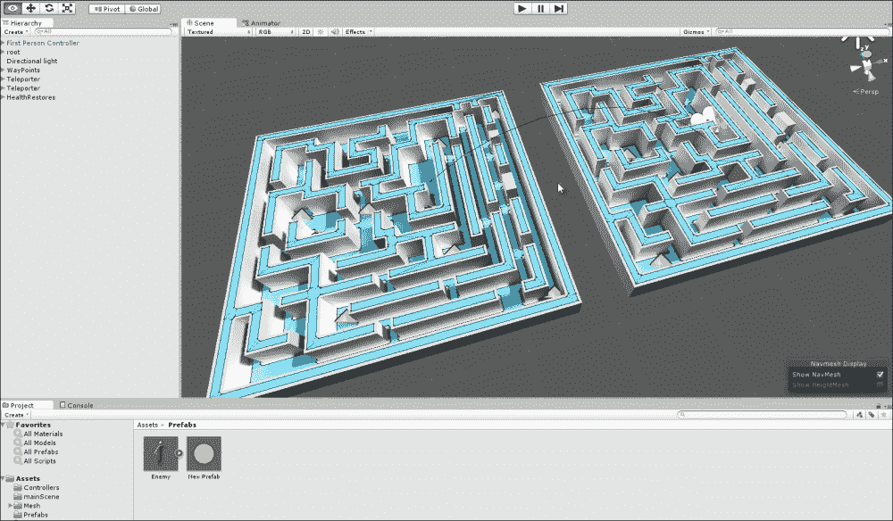

迷宫场景

### 小贴士

本书的人工智能项目可以在本书的配套文件（代码包）中找到，位于本章的`ai`文件夹中。

在创建此项目时，我们将几乎应用到目前为止所看到的所有概念和想法，以孤立和纯粹的形式审视它们如何在项目中结合，同时结合一系列独特的 AI 概念，如**有限状态机**（**FSMs**）、导航网格、视线等。为了跟上本章内容并从中获得最大收益，我建议您创建一个新的空白 Unity 项目，并从头到尾完成每个步骤。本章结束时，最终完成的项目可以在本书的配套文件（代码包）中找到，位于本章的`ai`文件夹中。

# 游戏中的人工智能

智能的概念可以从许多角度来理解：心理的、科学的、哲学的、精神的、社会学的，等等。其中许多都是深刻的。然而，在视频游戏中，它主要关乎外观，即智能的外观。也许这就是为什么标题中出现了“人工”这个词。其想法是，视频游戏主要是关于有趣和有趣的体验。这意味着游戏的可信度取决于玩家对游戏实际发生事件的参与程度。因此，每当一个**非玩家角色**（**NPC**），如 RPG 中的敌人法师，做一些“愚蠢”的事情（比如毫无理由地穿过固体墙壁，或者像被卡住一样盲目地来回走动），玩家就会感觉到有问题。他们认为角色之所以不聪明，是因为在特定情况下角色的行为不合适，并且无法用游戏中的其他任何事情来合理解释。角色行为的“错误”或“愚蠢”迫使玩家意识到一个漏洞，在这个过程中，玩家就会从体验中脱离出来，意识到这只是一个游戏。结果是，对于游戏来说，AI 在很大程度上是让角色在玩家观察时对他们的处境做出适当的反应。在 AI 用于敌人或对手的游戏中，这主要涉及调整难度，即不要让 AI 太容易或太难。从这种角度来看，AI 不是关于构建一个模拟人类思维和意识的数学模型，从内心或内部视角模拟我们思考时发生的事情。它只是关于创造行为，让角色在特定条件下表现得像我们预期的那样，如下面的截图所示。因此，游戏的 AI 有一种“空洞”的感觉，但这个哲学观察在这里不必再进一步关注。

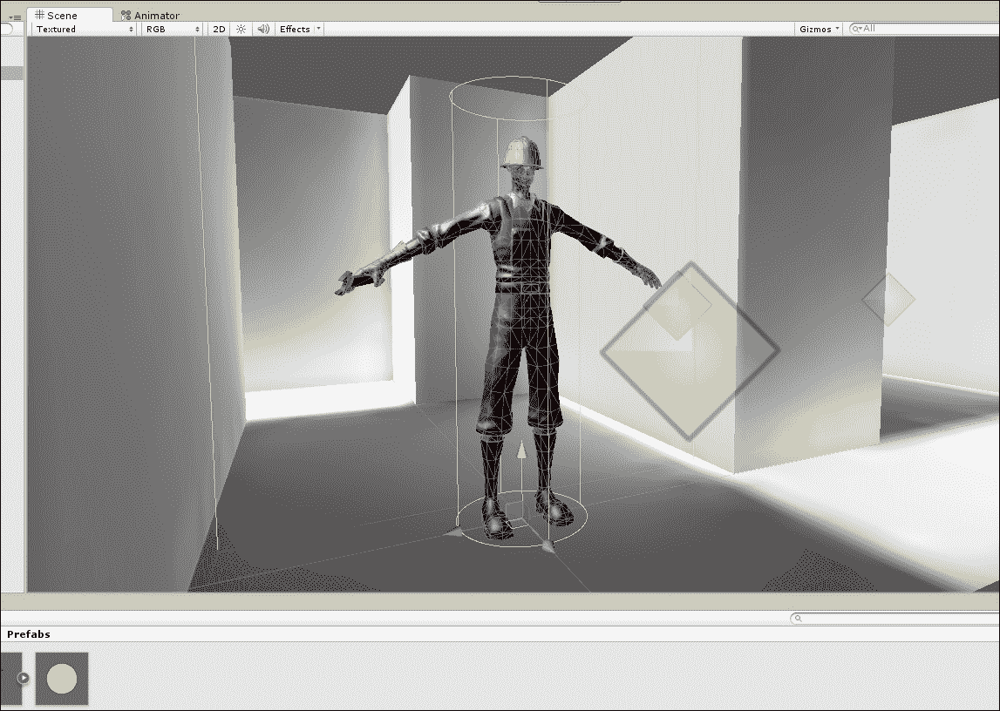

使用 Unity 构造者网格创建的敌人 AI 角色

在本章中，我们将创建一个设置在迷宫环境中的第一人称样本游戏。在这里，玩家可以攻击敌人，敌人也可以攻击玩家。敌人网格本身基于 Unity 附带的可动画构造者角色，并具有行走、奔跑和跳跃动画。构造者角色（不是类构造函数）将在环境中搜索，寻找玩家，一旦找到，就会追逐并攻击他们。构造者也可以被攻击，当被攻击时，如果他们的健康值降低，他们会逃跑并寻找增强道具。所以，让我们开始吧！

# 开始项目

首先，创建一个空白的新 Unity 项目和一个新场景。对于这个示例，我已经通过文件菜单命令从**Asset**中选择**Import Package**选项导入了几个 Unity 资产包。这些包是**Character Controller**、**Skyboxes**和**Particles**，如图下所示。**Character Controllers**包含构造网格和动画，以及一个第一人称控制器预制体。

**Skyboxes**包为相机将看到的场景添加了一些视觉效果，而**Particles**包将被用来创建传送装置，正如我们将看到的。

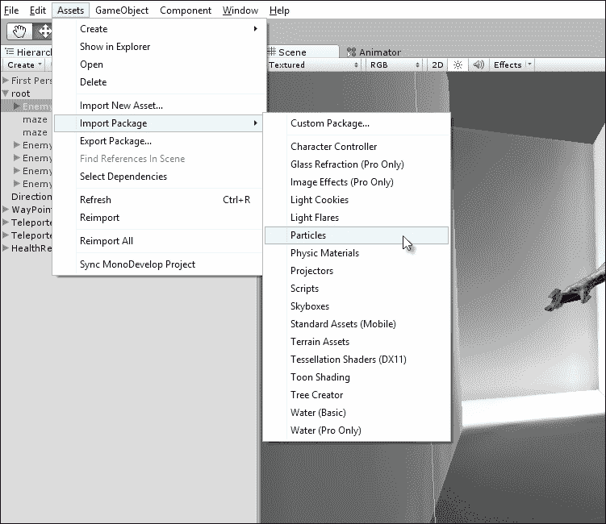

将资产导入到项目中

此外，将一个第一人称控制器和迷宫网格添加到场景中（网格包含在本章的书籍配套文件中的`assets`文件夹中）并创建一些照明和光照贴图，以使事物看起来最初就很好。这个网格是在一个 3D 建模程序中创建的，在这个例子中，是 Blender ([`www.blender.org/`](http://www.blender.org/))。然而，这些资产本身对于 AI 本身并不是关键的，但它们创建了一个可展示的灰盒场景，你可以在这个场景中工作。光照贴图的细节超出了本书的范围，但可以通过从应用程序菜单中选择**Window**选项中的**Lightmapping**来访问光照贴图功能，如图下所示。

更多关于光照贴图的信息可以在在线 Unity 文档中找到，网址为[`docs.unity3d.com/Manual/Lightmapping.html`](http://docs.unity3d.com/Manual/Lightmapping.html)。

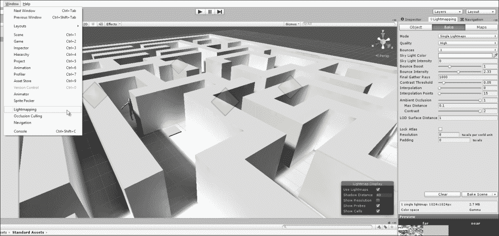

创建初始场景

# 导航网格烘焙

需要创建的敌人需要在关卡中智能地行走，以找到并追逐玩家，以及找到恢复生命力的道具。AI 不能简单地从任何两点之间直线行走，因为可能会有墙壁和其他角色等障碍物。当遇到这些物体时，AI 应该绕过这些物体导航。为了长期实现这一点，应该使用导航网格。这是一个不可见的网格资产，Unity 会自动生成，以近似关卡中所有可通行的水平表面，即被分类为地面的表面。导航网格本身不包含 AI。它不会使任何事物行走。导航网格实际上是一个数学模型，它包含所有必要的用于 AI 单位成功计算和避开障碍物路径的数据。要为关卡生成导航网格，请从应用程序菜单的**Window**选项卡中选择**Navigation**选项。这将显示**Navigation Mesh**选项卡，它可以停靠到对象检查器中。

### 小贴士

关于导航网格烘焙的基础知识，请参阅在线 Unity 文档，网址为[`docs.unity3d.com/Manual/Navmeshes.html`](http://docs.unity3d.com/Manual/Navmeshes.html)。

在烘焙导航网格时，需要注意一些额外的细节，如下面的截图所示：

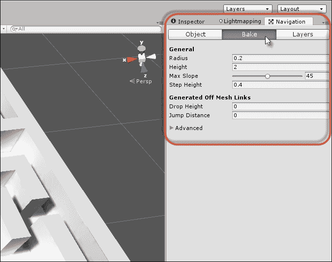

准备烘焙导航网格

首先，**半径**设置可能需要从默认值进行调整。简而言之，此设置定义了一个围绕角色脚部的想象中的圆圈；这个圆圈表示它们作为步行代理的大致尺寸。如果半径太大，导航网格看起来会断裂或破碎，如果太小，网格生成将花费很长时间，此外，你的代理在行走时可能会穿透墙壁。通过一定程度的试错和细化，你可以找到一个最适合你项目的值。对于这个示例，0.2 的值效果最佳。如果半径过高，你的导航网格在狭窄区域会断裂，这并不好，因为代理无法穿越缝隙，如下面的截图所示：

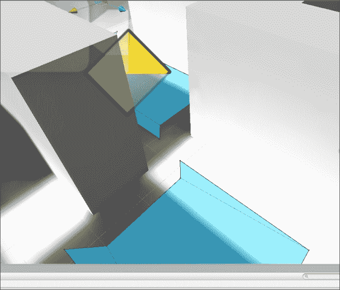

狭小区域的导航网格断裂

其次，生成的导航网格（一旦生成）可能会出现在真实网格地板之上或向上偏移。如果发生这种情况，你可以将**高度误差百分比**设置从**高级**组中的`1`降低，如下面的截图所示。这可以防止你的代理看起来在空中悬浮。记住，在调整任何设置后，你需要重新烘焙导航网格以应用更改。

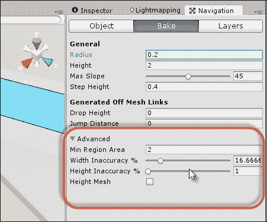

降低高度误差百分比将生成的导航网格移动到真实地板更近的位置

从图中可以看出，迷宫场景有两个独立的迷宫区域（左和右），它们之间没有连接的网格，不允许创建路径。对于这个示例，智能代理应该能够通过传送器在各个部分之间自由移动，如果需要的话，将它们从一个区域传送到另一个区域。

要在导航网格的断裂处实现这种连接，允许 AI 在表面上计算有效路径，我们可以使用离网链接。为应该作为传送平台或平台使用的级别添加一个新的网格。在这个示例中，我使用了一个标准的盒子网格和一个粒子系统以增强效果，但这不是必需的。然后，将离网链接组件附加到网格对象上，如下所示：


使用离网链接创建传送平台

对目的地传送器垫重复此过程。对于每个传送器，将对象的变换分配给离网格链接组件的**开始**字段。这表示选定的传送器为起点。然后，对于**结束**字段，分配目标变换。这在这两个传送器之间建立连接，创建它们之间的路径。当连接建立时，当在编辑器中打开并激活**导航**面板时，应在场景视图中绘制一个连接箭头，如图所示。您还可以自动生成离网格链接。有关更多信息，请访问[`www.youtube.com/watch?v=w3-sSozYph4`](https://www.youtube.com/watch?v=w3-sSozYph4)。

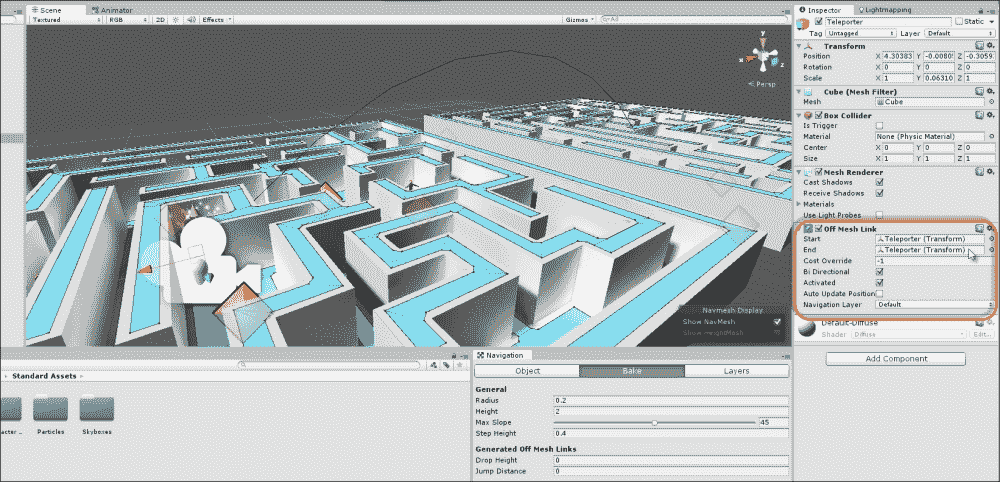

定义离网格链接之间的连接

### 小贴士

本章的起始项目，准备好进行 AI 编码，可以在本书的配套文件（代码包）中找到，位于本章的`Start`文件夹中。

# 启动 NPC 代理

现在，让我们为关卡创建一个 AI 代理，一个可以与玩家交互的实体。首先，代理需要在场景中有一个物理网格表示。为此，我使用了`Constructor`网格，它是之前导入的 Unity **Character Controllers**包的一部分。从**项目**面板拖放此网格到场景中，然后移除可能创建的任何动画组件，如图所示。动画将很重要，但稍后将会创建一个定制的动画控制器。

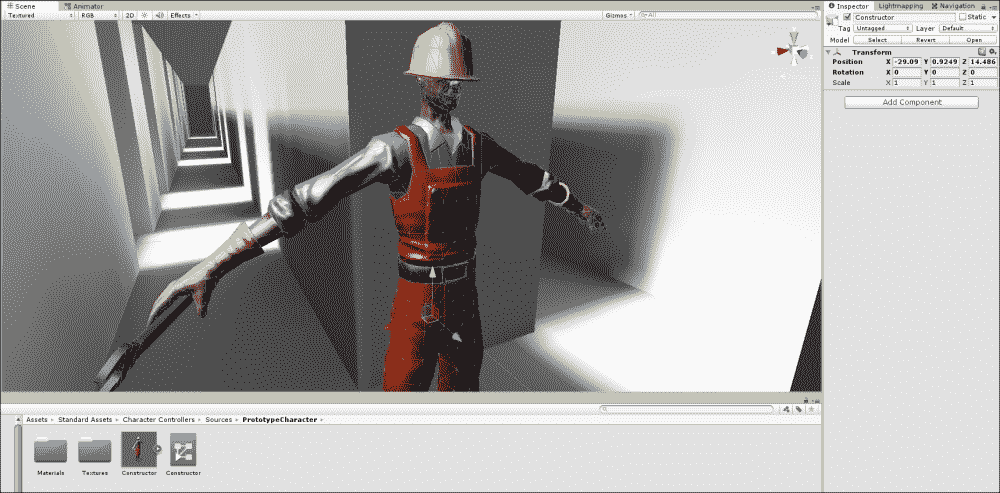

为敌人角色添加构造网格

### 小贴士

记住我们并没有使用第三人称控制器预制件；这里仅使用构造网格。

接下来，通过导航到**组件** | **导航** | **Nav Mesh Agent**为对象添加`NavMeshAgent`组件。这允许对象与导航网格一起工作，并在被指示时能够找到并旅行路径。将组件的**半径**和**高度**值设置为与网格尺寸相匹配。将**停止距离**设置为`2`；这控制玩家在停止前应该到达目的地有多近，如图所示。当然，对于你自己的项目，**停止距离**的值可能需要编辑。

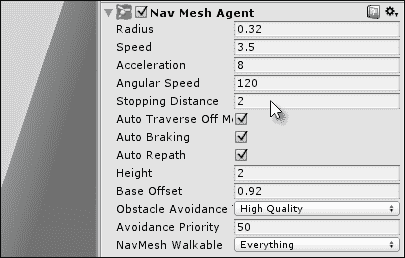

配置 NavMeshAgent 组件以进行路径查找

现在，添加一个`Rigidbody`组件并勾选**Is Kinematic**复选框，如图所示。这允许对象进入触发体积，并通过引起和接收物理事件成为物理系统的一部分。然而，当勾选**Is Kinematic**时，Unity 不会覆盖对象的变换（位置、旋转和缩放）。这允许`NavMeshAgent`专门控制角色的移动。

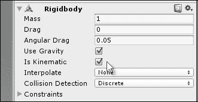

为刚体组件配置物理属性

现在，向对象添加一个`BoxCollider`组件，并启用**Is Trigger**复选框将其转换为触发体积，即允许物理对象通过而不是阻止它们的体积。这将由 AI 用来近似代理的视野或观察区域。它将跟随代理，并且只有进入其视野的其他对象才被视为值得进一步考虑。为了将体积调整到代理的视野大小，使用**X**、**Y**和**Z**大小字段，如图所示：

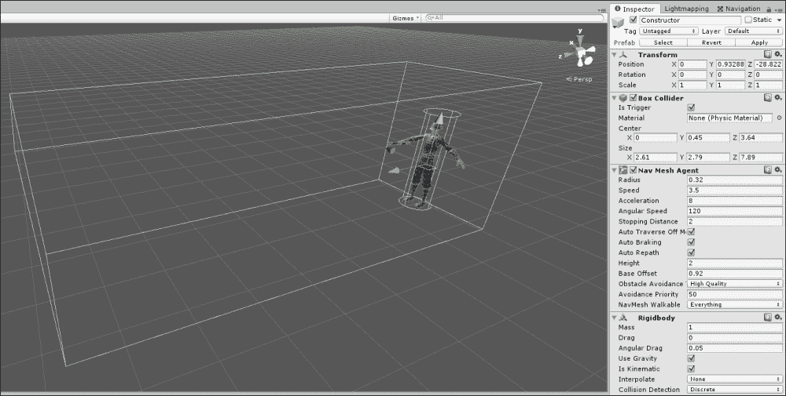

使用 BoxCollider 组件为敌人代理配置视野

最后，在项目中创建一个新的 C#脚本文件，名为`AI_Enemy.cs`，以定义敌人的智能。此脚本将封装敌人角色的完整 AI，并将在本章的整个过程中开发。一旦文件最初创建，将其附加到场景中的敌人对象上。我们现在准备好跳入 AI 编码和图形构建了！我们将从创建 FSM 及其相关状态开始，这些状态指定了敌人应该如何行为。

# Mecanim 中的有限状态机

从现在开始，我们将主要集中讨论在 C#中为敌人角色编写 AI，以及从视觉编码的角度为 Mecanim 图进行编码。Mecanim 指的是 Unity 的动画系统([`docs.unity3d.com/Manual/MecanimAnimationSystem.html`](http://docs.unity3d.com/Manual/MecanimAnimationSystem.html))。在接下来的章节中，我们将逐步构建一个完整的类，该类将查看并讨论特定的代码部分，并且完整的类源代码将随着我们的进展逐步组合。它可以在完成的项目中的`AI_Enemy.cs`文件中查看。

首先，从概念上考察有限状态机（FSM）。当思考敌人角色时，我们可以观察到它们具有一组特定的行为。敌人开始场景时是站立不动的，然后开始巡逻。在巡逻期间，他们可能会看到玩家角色。如果他们这样做，他们会追逐玩家，直到玩家进入攻击范围。当玩家进入攻击范围时，他们会攻击玩家。现在，这些规则唯一的例外是如果敌人受到严重的健康伤害，使他们接近死亡。达到这种临界水平时，敌人将不会采取攻击性行为，而是逃跑并寻找恢复健康的药水，直到他们的健康水平恢复正常。

在这样总结敌人行为集合时，我们识别出了一系列离散且关键的敌人智能状态。这些状态包括空闲、巡逻、追逐、攻击和逃跑。敌人在任何时刻只能处于这些状态中的一个，并且每个状态决定了敌人的行为方式。为了实现这种逻辑，我们可以使用有限状态机（FSM）设计。这并不是指特定的类或对象类型（如`MonoBehaviour`或`ScriptableObject`），而是一种设计模式，一种编码方式。FSM 从一个有限的状态集合（空闲、巡逻、追逐等，如前所述）开始，然后管理这些状态之间逻辑上的连接。这决定了何时以及如何从一个状态转换到另一个状态。实际上，我们这里的敌人将取决于底层的两个状态机：一个在 C#代码中，另一个在 Mecanim 动画师图表中。后者仅控制每个状态下敌人网格应播放的动画。让我们首先构建 Mecanim 图表。

右键点击**项目**面板，创建一个新的**动画控制器**资产。在**动画**窗口中打开该资产，该窗口可通过从应用程序主菜单中选择**窗口**中的**动画**选项访问，如图所示：

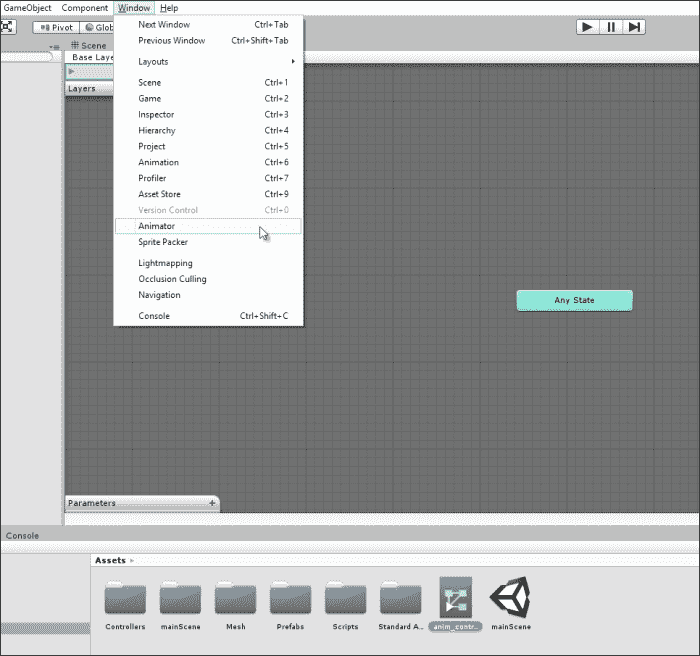

访问动画图表

Mecanim 动画师图表定义了网格的所有可能的动画状态，并且这些状态应该与已经概述的敌人状态相对应，即空闲、巡逻、追逐、攻击和逃跑。为了配置这些状态的动画，在**项目**面板中选择**构造器**网格资产，并在对象检查器中启用**Loop Time**和**Loop Pose**复选框，如图所示。这可以防止角色动画在播放一次后停止：

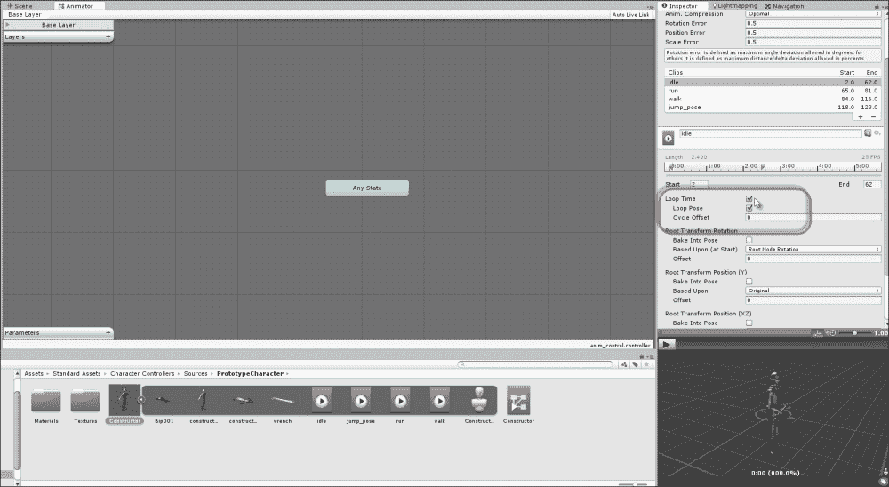

为 Mecanim FSM 准备动画资产

现在，让我们向图表中添加动画状态，每个状态一个动画。对于**空闲**状态，应播放空闲动画。对于**巡逻**状态，应播放行走动画，因为角色应该四处走动。对于**追逐**和**逃跑**状态，应播放跑步动画，而对于**攻击**状态，应播放跳跃动画。**构造器**模型缺少专门的攻击动画，因此（在这个示例中）跳跃动画将足够作为攻击动画。

将这些动画通过拖放从**项目**面板拖到图表编辑器中，并为每个状态适当地命名，如图所示：

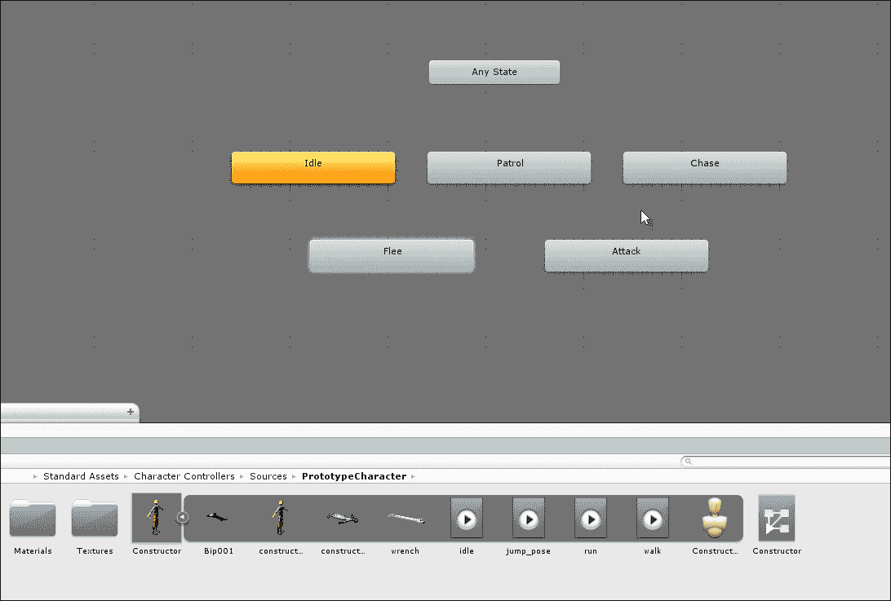

在动画窗口中构建 FSM

除了迄今为止添加的标准动画状态外，我们再添加一个额外的空状态。这将成为敌人的初始和默认状态；此状态不播放任何动画，实际上代表了一个无状态的状态，直到我们在关卡启动时明确地将敌人放入特定的状态。要创建一个空和默认状态，右键单击图编辑器内的空白区域，从上下文菜单中选择**创建状态**中的**空**选项（适当地重命名为`Start`或`Init`），然后右键单击状态并选择**设置为默认状态**，如图所示：

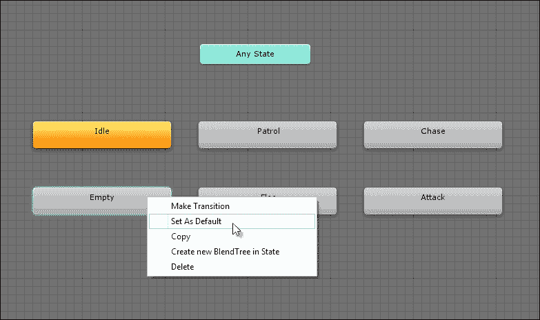

将空节点设置为默认状态

图现在为角色每个状态定义了一个动画，但状态之间没有连接；每个状态都是孤立的。具体来说，没有逻辑来控制一个状态如何移动到另一个状态的条件。为了解决这个问题，使用 Mecanim 窗口左下角的**参数**框创建五个新的触发器。触发器变量是一种特殊的布尔类型，Unity 会自动将其重置为`false`；每次将其设置为`true`时，它允许行为被启动一次，例如状态更改。正如我们将看到的，可以在 C#代码中访问触发器。

现在，创建五个触发器：**空闲**、**巡逻**、**追逐**、**攻击**和**寻找健康**，如图所示：

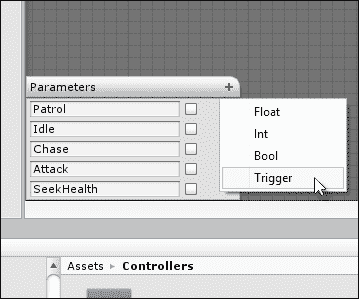

为每个动画状态创建一个触发器变量

在创建好状态和触发器之后，现在可以在图中更精确地定义状态之间的连接。具体来说，当触发器**巡逻**被激活时，**空闲**状态应转换为**巡逻**状态，当触发器**追逐**被激活时，**巡逻**状态转换为**追逐**状态，当触发器**攻击**被激活时，**追逐**状态转换为**攻击**状态，依此类推。此外，大多数状态之间存在双向链接：**巡逻**可以转换为**追逐**（例如，当敌人看到玩家时），而**追逐**可以转换回**巡逻**（当敌人失去对玩家的视线时）。要创建状态之间的连接，右键单击一个状态，从上下文菜单中选择**创建转换**，然后单击应建立连接的目标状态。

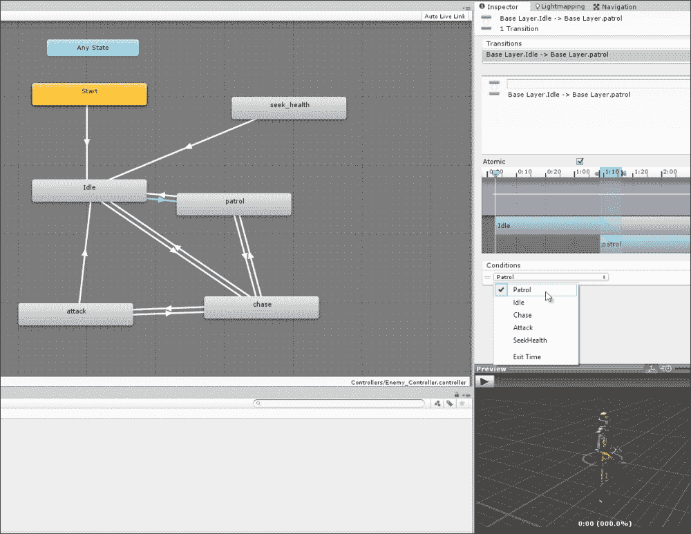

设置状态转换的条件

图现在定义了一个完整的动画状态机（FSM）用于敌人对象。将其附加到场景中的敌人对象上很简单。

将**Animator**组件添加到对象上，然后从**项目**面板中将**Animator**控制器拖放到**Animator**组件的**控制器**字段中，如图所示：

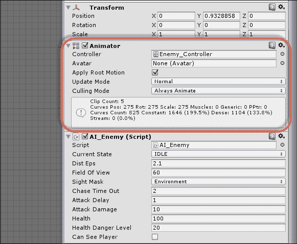

将动画器附加到敌人对象上

# C#中的有限状态机 – 入门

现在动画的 FSM 已经完成，我们应该将注意力转向 C# 中的 FSM，该 FSM 管理敌人的行为，并在 Mecanim 图中启动触发器，以在正确的时间播放适当的动画（行走和跑步）。为了开始实现，请将以下公共枚举添加到 `AI_Enemy.cs` 脚本文件的顶部，如下面的代码示例 7-1 所示。此枚举定义了敌人 FSM 中所有可能的状态，并且每个状态都分配了其唯一的字符串哈希码；即，`IDLE` 状态分配了 `2081823275` 的值，这是字符串 `IDLE` 的哈希码，以此类推。这将在以后与 Mecanim 一起工作，特别是启动触发器时非常重要。您可以使用 `Animator` 类的 `StringToHash` 函数检索字符串的哈希码，如下所示：

```cs
//Define possible states for enemy
public enum AI_ENEMY_STATE {IDLE = 2081823275,
                            PATROL=207038023,
                            CHASE= 1463555229,
                            ATTACK=1080829965,
                            SEEKHEALTH=-833380208};
```

### 提示

更多信息可以在网上找到：[`docs.unity3d.com/ScriptReference/Animator.StringToHash.html`](http://docs.unity3d.com/ScriptReference/Animator.StringToHash.html)。

基于 `AI_ENEMY_STATE` 枚举，`AI_Enemy` 类将维护一个公共变量 `CurrentState`，该变量表示敌人对象当前的活动状态。随着时间的推移，状态的变化，该变量将发生变化，如下面的代码所示：

```cs
//Current state of enemy
public AI_ENEMY_STATE CurrentState = AI_ENEMY_STATE.IDLE;
```

与大多数对象一样，类 `AI_Enemy` 具有用于检索缓存的组件引用的 `Awake` 函数，包括 `NavMeshAgent` 和本地 `Transform`，以及场景中的其他对象，例如 `Player` 对象。这些引用将在脚本的其他地方使用，如下面的代码示例 7-2 所示：

```cs
//Get Animator
ThisAnimator = GetComponent<Animator>();

//Get Navigation Mesh Agent
ThisAgent = GetComponent<NavMeshAgent>();

//Get Transform Component
ThisTransform = transform;

//Get Player Transform
PlayerTransform = GameObject.FindGameObjectWithTag("Player").transform;

//Get Collider
ThisCollider = GetComponent<BoxCollider>();
```

### 提示

此代码使用缓存的变量：`ThisAnimator`、`ThisTransform`、`ThisAgent` 和 `ThisCollider`。这使得我们能够在级别启动时立即检索附加组件的直接引用，从而节省了我们每次需要访问对象时调用 C# 属性函数（`get` 和 `set`）的需要。因此，`This.Transform` 比优化后的、缓存的变量 `ThisTransform` 带有更大的性能开销。

FSM 中的每个状态都将编码为一个单独的 Coroutine，每个状态一个 Coroutine。Coroutine 将无限期且专一地循环，只要状态处于活动状态，定义该状态下敌人的所有行为。状态机的主要任务是选择并启动正确的状态，以满足正确的条件。让我们首先创建 `Idle` 状态——敌人的默认或正常状态。

# 创建空闲状态

敌对对象开始于 `Idle` 状态（一个“无所事事”的状态），这主要是过渡性的。在这个状态下，敌人站在原地，播放空闲动画。状态在场景启动时只进入一次，但当我们退出其他状态时，我们也会返回到它，作为进入新状态的前一个中间步骤。实际上，在这个状态下，敌人应该只播放空闲动画一次，然后在动画完成后离开状态。敌人还可以自动移动到 `Patrol` 状态，在那里他们开始搜索场景中的玩家。这涉及两个步骤。首先，我们需要在 `Idle` 状态开始时开始播放空闲动画。其次，我们需要在空闲动画完成时得到通知，以启动对 `Patrol` 状态的改变。请参阅以下代码示例 7-3 中的 `Idle` 状态：

```cs
01 //--------------------------------------------------
02 //This coroutine runs when object is in idle state
03 public IEnumerator State_Idle()
04 {
05       //Set current state
06       CurrentState = AI_ENEMY_STATE.IDLE;
07 
08       //Activate idle state with Mecanim
09       ThisAnimator.SetTrigger((int) AI_ENEMY_STATE.IDLE);
10 
11       //Stop nav mesh agent movement 
12        ThisAgent.Stop();
13  
14       //Loop forever while in idle state
15       while(CurrentState == AI_ENEMY_STATE.IDLE)
16        {
17              //Check if we can see player
18              if(CanSeePlayer)
19              {
20                    // can see player?, chase to attack
21                    StartCoroutine(State_Chase());
22                    yield break;
23               }
24 
25              //Wait for next frame
26              yield return null;
27        }
28 }
29 //--------------------------------------------------
```

以下是对代码示例 7-3 的注释：

+   **第 03 行**: `State_Idle` 被编码为一个 Coroutine。有关协程的更多信息，请参阅 Unity 在线文档[`docs.unity3d.com/Manual/Coroutines.html`](http://docs.unity3d.com/Manual/Coroutines.html)。简而言之，Coroutine 的工作方式类似于异步函数（作为一个在后台运行的代码块，与其他函数并行）。因此，第 15 行中的无限循环不会导致崩溃，因为 Coroutine 的工作方式就像一个单独的线程。Coroutine 总是返回类型 `IEnumerator`，并且它们体内总是包含一个 `yield` 语句。

+   **第 09 行**: 在这一行调用了动画器 `SetTrigger` 函数；它将字符串 `Idle` 的哈希码作为参数传递，以在 Mecanim 图中设置 `Idle` 触发器，从而开始播放空闲动画。这将 C# FSM 连接到 Mecanim FSM。注意，在第 12 行，调用了 `Stop` 函数来停止 `NavMeshAgent` 组件可能正在执行的所有动作。这是因为当空闲动画播放时，敌人不应该移动。

+   **第 15 行**: 在这里，`State_Idle` 函数进入了一个无限循环；也就是说，只要敌人处于 `Idle` 状态，它就会逐帧循环。当 `Idle` 状态处于活动状态时，循环内的所有内容都会在每一帧执行，允许对象更新并随时间改变其行为。

+   **第 18 行**: 除了等待空闲动画完成之外，`Idle` 状态的一个退出条件是如果在期间看到了玩家。玩家可见性由布尔变量 `CanSeePlayer`（视线的细节将在稍后考虑）确定。如果 `CanSeePlayer` 为 `true`，则使用 `StartCoroutine` 函数激活 `Chase` 状态，并通过调用 `yield break` 终止 `Idle` 状态。

目前实现的`Idle`状态会无限循环，除非看到玩家，否则不会改变到其他状态。然而，`Idle`状态应该是临时的；空闲动画应该播放一次，然后通知我们其完成。为了实现这种回放通知，我们可以使用动画事件。为此，在**项目**面板中选择**构造器**角色网格，打开**动画**选项卡，在对象检查器中检查空闲动画。从这里，打开**事件**选项卡，如下面的截图所示：

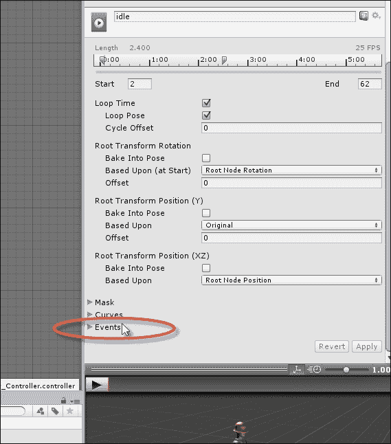

在对象检查器中展开事件选项卡

然后，在时间**1**（在末尾）处双击动画时间轴，在该时间插入一个函数调用。当动画完成时，这会向敌人对象发送消息，如下面的截图所示。为此，我在`AI_Enemy`类中编写了一个名为`OnIdleAnimCompleted`的方法：

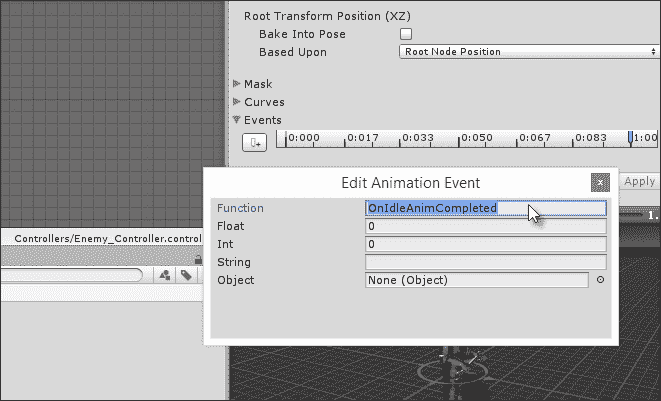

在动画结束时调用函数

当空闲动画完成时，Unity 会自动调用`OnIdleAnimCompleted`函数。以下代码示例 7-4 显示了此方法的实现方式：

```cs
   //Event called when Idle animation is completed
   public void OnIdleAnimCompleted()
   {
         //Stop active Idle state
         StopAllCoroutines();
 StartCoroutine(State_Patrol());
   }
```

# 创建巡逻状态

在`Patrol`状态中，敌人应该在环境中徘徊并寻找玩家。此状态可以从`Idle`状态进入，在空闲动画完成后，也可以从`Chase`状态进入，如果敌人在追逐过程中失去对玩家的视线。巡逻涉及循环逻辑。具体来说，敌人应该在导航网格上的某个随机目的地选择一个目的地，然后前往该目的地。当到达目的地时，该过程应该重复，依此类推。唯一导致敌人离开此状态的条件是看到玩家，这要求进入`Chase`状态。

虽然解释起来很简单，但此状态依赖于两个更复杂的问题：首先，必须选择一个随机位置，其次，应执行玩家可见性检查。首先，让我们考虑随机位置选择。

在**场景**选项卡中，我创建了一个由标记为**航点**的空游戏对象组成的集合。这些对象除了在`NavMesh`地板上标记位置外，什么都不做。这些共同代表了一个敌人巡逻期间可能前往的所有可能位置。因此，敌人需要随机选择这些目的地之一，如下所示：


在**场景**选项卡中创建航点目的地

要实现`Patrol`状态的目的地选择，`AI_Enemy`的`Awake`函数将首先检索场景中所有要使用的航点列表。我们可以使用`Linq`来完成此操作，如下面的代码示例 7-5 所示。此示例代码检索场景中所有航点的静态变换数组，在名为`Waypoints`的私有变量中：

```cs
01 //Find all gameobjects with waypoint
02 GameObject[] Waypoints = GameObject.FindGameObjectsWithTag("Waypoint");
03 
04 //Select all transform components from waypoints using Linq
05 WayPoints = (from GameObject GO in Waypoints
06                   select GO.transform).ToArray();
```

在检索到所有航点列表后，可以编写 `Patrol` 状态，如下面的代码示例 7-6 所示，该示例定期选择航点作为新的移动目标：

```cs
01 //--------------------------------------------------
02 //This coroutine runs when object is in patrol state
03 public IEnumerator State_Patrol()
04 {
05 //Set current state
06 CurrentState = AI_ENEMY_STATE.PATROL;
07 
08 //Set Patrol State
09 ThisAnimator.SetTrigger((int) AI_ENEMY_STATE.PATROL);
10 
11 //Pick a random waypoint
12 Transform RandomDest = WayPoints[Random.Range(0, WayPoints.Length)];
13 
14 //Go to destination
15 ThisAgent.SetDestination(RandomDest.position);
16 
17 //Loop forever while in patrol state
18 while(CurrentState == AI_ENEMY_STATE.PATROL)
19 {
20        //Check if we can see player
21        if(CanSeePlayer)
22        {
23             //If we can see player, then chase to attack 
24             StartCoroutine(State_Chase());
25             yield break;
26        }
27 
28        //Check if we have reached destination
29        if(Vector3.Distance(ThisTransform.position, RandomDest.position) <= DistEps)

30        {
31              //Reached destination. Changed state back to Idle
32              StartCoroutine(State_Idle());
33              yield break;
34        }
35 
36        //Wait for next frame
37        yield return null;
38 }
39 }
40 //--------------------------------------------------
```

以下是对代码示例 7-6 的注释：

+   **行 12**: 在这里，`Random.Range` 函数从 `Waypoints` 数组中随机选择一个目标。这个目标作为参数传递给 `NavMeshAgent` 组件的 `SetDestination` 函数，该函数将敌人发送到目标位置。

+   **行 28**: 使用 `Vector3.Distance` 函数来确定代理是否到达目的地。这并不检查敌人位置和目的地位置之间的相等性，因为浮点数的不精确性意味着我们无法保证它们永远相同。相反，它检查敌人是否已经到达目的地指定距离内（`DistEps`），将其分类为已到达。

+   **行 32**: 如果达到目标，敌人将返回到 `Idle` 状态。在等待空闲动画的一个周期后，敌人将再次进入 `Patrol` 状态。

+   **行 21**: 再次，`Patrol` 状态取决于玩家是否对敌人可见。如果是，他们进入 `Chase` 状态。

布尔变量 `CanSeePlayer` 表示，对于任何一帧，玩家是否当前对敌人可见。这个变量在每一帧都会更新。这个过程从 `Update` 函数内部开始，如下面的代码示例 7-7 所示：

```cs
01 void Update()
02 {
03 //Assume we cannot see player
04 CanSeePlayer = false;
05 
06 //If player not inside bounds then exit
07 if(!ThisCollider.bounds.Contains(PlayerTransform.position)) return;

08 
09 //Player is inside bounds, update line of sight
10 CanSeePlayer = HaveLineSightToPlayer(PlayerTransform);
11 }
```

`Update` 函数的关键问题是玩家是否在附加到敌人的盒子碰撞体内；这个盒子碰撞体代表敌人的视野或范围。如果玩家在这个盒子内，玩家可能对敌人可见。在这种情况下，需要进一步的检查以确保这一点。这就是 `HaveLineSightToPlayer` 函数至关重要的地方。这个函数返回一个布尔值（`true`/`false`），表示玩家是否对敌人可见，如下面的代码示例 7-8 所示：

```cs
//Function to return whether player can be seen right now
private bool HaveLineSightToPlayer(Transform Player)
{
//Get angle between enemy sight and player
float Angle = Mathf.Abs(Vector3.Angle(ThisTransform.forward, (Player.position-ThisTransform.position).normalized));

    //If angle is greater than field of view, we cannot see player
    if(Angle > FieldOfView) return false;

    //Check with raycast- make sure player is not on other side of wall
    if(Physics.Linecast(ThisTransform.position, Player.position, SightMask)) return false;

    //We can see player
    return true;
 }
```

正如我们在前面的章节中看到的，可见性是通过两个阶段的过程确定的。首先，敌人视线向量与指向玩家方向的归一化向量之间的角度决定了可见性。如果角度小于敌人的视野角度，那么玩家就会在敌人前方，并且会被看到，前提是没有障碍物，例如墙壁，位于敌人和玩家之间。第二个测试由 `Physics.Linecast` 执行，确定是否可以在敌人和玩家之间画一条不间断的直线。如果可以，那么他们之间就没有障碍物，玩家就会被看到。

# 创建 `Chase` 状态

如果敌人看到玩家但不在攻击距离内，敌人会跑向玩家进行攻击。这种敌人带着敌意跑向玩家的状态就是`Chase`状态。这个状态有两个主要的退出条件。如果敌人到达攻击距离，他们应该从`Chase`状态变为`Attack`状态。相反，如果玩家从视线中消失，敌人应该尽可能地继续追逐一段时间，然后在一段时间后如果玩家仍然没有被看到，就放弃追逐。请参考以下代码示例 7-9：

```cs
01 //This coroutine runs when object is in chase state
02 public IEnumerator State_Chase()
03 {
04 //Set current state
05 CurrentState = AI_ENEMY_STATE.CHASE;
06 
07 //Set Chase State
08 ThisAnimator.SetTrigger((int) AI_ENEMY_STATE.CHASE);
09 
10 //Loop forever while in chase state
11 while(CurrentState == AI_ENEMY_STATE.CHASE)
12 {
13        //Set destination to player
14        ThisAgent.SetDestination(PlayerTransform.position);
15 
16       //If we lose sight of player, keep chasing 
17       if(!CanSeePlayer)
18       {
19              //Begin time out
20              float ElapsedTime = 0f;
21 
22              //Continue to chase
23              while(true)
24              {
25                    //Increment time
26                    ElapsedTime += Time.deltaTime;
27 
28                    //Set destination to player
29 ThisAgent.SetDestination( PlayerTransform.position);
30 
31                   //Wait for next frame
32                   yield return null;
33 
34                   //Has timeout expired?
35                   if(ElapsedTime >= ChaseTimeOut)
36                   {
37                          //If cannot see player, change to idle
38                          if(!CanSeePlayer)
39                          {
40                                //Change to idle 
41                                StartCoroutine(State_Idle());
42                                yield break;
43                          }
44                          else
45                                break; //can see player again
46                   }
47              }
48        }
49 
50        //If we have reached player then attack
51 if(Vector3.Distance(ThisTransform.position, PlayerTransform.position) <= DistEps)

52        {
53              //We have reached distance, now attack
54              StartCoroutine(State_Attack());
55              yield break;
56        }
57 
58        //Wait until next
59        yield return null;
60 }
61 }
```

以下是对代码示例 7-9 的注释：

+   **第 17-48 行**: 在这个阶段，`State`循环确定玩家已经失去可见性。当这种情况发生时，敌人将继续追逐玩家一段时间，这段时间为`ChaseTimeOut`。在这段时间过去后，敌人再次检查玩家的可见性。如果在那时看到玩家，追逐将像之前一样继续。否则，敌人将变为`Idle`状态，准备再次开始巡逻寻找玩家。

+   **第 51-59 行**: 在这里，`Chase`状态检查敌人是否进入了攻击范围（`DistEps`）。如果是这样，有限状态机（FSM）将进入`State_Attack`状态。

# 创建攻击状态

在`Attack`状态中，只要敌人可见，敌人就会不断地攻击玩家。攻击后，敌人必须恢复才能发起新的攻击。这个状态唯一的退出条件是失去对玩家的视线。当这种情况发生时，敌人将返回`Chase`状态，然后根据玩家是否被找到，他们要么回到攻击状态，要么进入`Idle`状态，如下面的代码示例 7-10 所示：

```cs
//This coroutine runs when object is in attack state
 public IEnumerator State_Attack()
 {
    //Set current state
    CurrentState = AI_ENEMY_STATE.ATTACK;

    //Set Chase State
    ThisAnimator.SetTrigger((int) AI_ENEMY_STATE.ATTACK);
     //Stop nav mesh agent movement
 ThisAgent.Stop();

    //Set up timer for attack interval
    float ElapsedTime = 0f;

    //Loop forever while in attack state
    while(CurrentState == AI_ENEMY_STATE.ATTACK)
    {
         //Update timer
         ElapsedTime += Time.deltaTime;

        //Check if player has passed beyond the attack distance
if(!CanSeePlayer || Vector3.Distance(ThisTransform.position, PlayerTransform.position) > DistEps)
          {
               //Change to chase
               StartCoroutine(State_Chase());
               yield break;
          }

          //Check attack delay
          if(ElapsedTime >= AttackDelay)
          {
                //Reset counter
                ElapsedTime = 0f;

               //Launch attack
               PlayerTransform.SendMessage("ChangeHealth", -AttackDamage, SendMessageOptions.DontRequireReceiver);
          }

          //Wait until next frame
          yield return null;
    }
 }
```

# 创建寻找健康（或逃跑）状态

当敌人健康值降低到一定程度以下并可以通过收集医疗包来恢复时，就会进入`Seek-Health`状态。这个状态与大多数其他状态不同，因为它可以从任何状态到达或进入。进入这个状态不依赖于它与其他状态的关系，而只依赖于玩家的健康。具体来说，当敌人的健康值降低到最低阈值以下时，应该进入这个状态。由于这种配置，请确保将`Seek-Health`动画状态在 Mecanim 图中连接到允许在任何状态下触发跑步动画的**Any State**节点，如下所示：

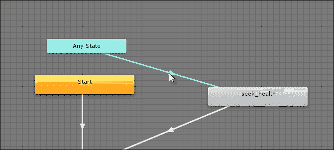

`Seek-Health`状态可以从任何状态访问

每个敌人都有一个`Health`变量；这个变量会根据敌人是否找到医疗包或被攻击而上下调整。这种变化发生在`ChangeHealth`方法内部，这也是我们确定是否必须启动`SeekHealth`状态的地方。`ChangeHealth`函数是公开的；它允许`SendMessage`和`BroadcastMessage`在需要时将其作为事件触发，如下面的代码示例 7-11 所示：

```cs
//Event called health changed
 public void ChangeHealth(float Amount)
 {
    //Reduce health
    Health += Amount;

    //Should we die?
    if(Health <= 0)
    {
          StopAllCoroutines();
          Destroy(gameObject);
          return;
    }

    //Check health danger level
    if(Health > HealthDangerLevel) return;

    //Health is less than or equal to danger level, now seek health restores, if available
    StopAllCoroutines();
 StartCoroutine(State_SeekHealth());
 }
```

可以像以下代码示例 7-12 所示那样编写`State_SeekHealth`方法：

```cs
01 //This coroutine runs when object is in seek health state
02 public IEnumerator State_SeekHealth()
03 {
04 //Set current state
05 CurrentState = AI_ENEMY_STATE.SEEKHEALTH;
06 
07 //Set Chase State
08 ThisAnimator.SetTrigger((int) AI_ENEMY_STATE.SEEKHEALTH);
09 
10 //This is the nearest health restore
11 HealthRestore HR = null;
12 
13 //Loop forever while in seek health state
14 while(CurrentState == AI_ENEMY_STATE.SEEKHEALTH)
15 {
16        //If health restore is not valid, then get nearest
17        if(HR == null) HR = GetNearestHealthRestore(ThisTransform);
18 
19        //There is an active health restore, so move there
20        ThisAgent.SetDestination(HR.transform.position);
21 
22        //If HR is null, then no more health restore, go to idle
23        if(HR == null || Health > HealthDangerLevel)
24        {
25              //Change to idle
26              StartCoroutine(State_Idle());
27              yield break;
28 	      }
29 
30       //Wait until next frame
31       yield return null;
32 }
33 }
```

以下是对代码示例 7-12 的注释：

+   **行 17**：`Health-Seek`状态首先在场景中找到最近的急救包，并将其用作代理的目标。这在某种程度上是作弊，因为（当然）没有远程观察能力，敌人不应该能够知道最近的急救包在哪里。然而，记住重要的是敌人实际上知道什么，而不是它对玩家看起来如何。如果玩家不知道这个逻辑，并且无法从外观上了解它，那么这就没有任何意义。此外，还请注意，玩家或另一个敌人可能在敌人到达目的地之前收集急救包。因此，在每个帧上，敌人必须确定目标急救包是否仍然有效，如果不是，他们必须选择下一个最近的急救包。

+   **行 23**：如果没有急救包可用或健康值已恢复到安全极限，敌人将返回到`空闲`状态。

`SeekHealth`状态要求我们找到并检索场景中最近的急救包的引用。这是通过使用`GetNearestHealthRestore`方法实现的，如下面的代码示例 7-13 所示：

```cs
01 //Function to get nearest health restore to Target in scene
02 private HealthRestore GetNearestHealthRestore(Transform Target)
03 {
04 //Get all health restores
05 HealthRestore[] Restores = Object.FindObjectsOfType<HealthRestore>();

06 
07 //Nearest
08 float DistanceToNearest = Mathf.Infinity;
09 
10 //Selected Health Restore
11 HealthRestore Nearest = null;
12 
13 //Loop through all health restores
14 foreach(HealthRestore HR in Restores)
15 {
16        //Get distance to this health restore
17 float CurrentDistance = Vector3.Distance(Target.position, HR.transform.position);

18 
19        //Found nearer health restore, so update
20        if(CurrentDistance <= DistanceToNearest)
21        {
22              Nearest = HR;
23              DistanceToNearest = CurrentDistance;
24        }
25 }
26 
27 //Return nearest or null
28 return Nearest;
29 }
```

# 总结

本章创建的完整 AI 项目可以在本书的配套文件（代码包）中找到，位于本章的`ai`文件夹中。我建议您打开它并进行测试。使用第一人称控制器，玩家可以导航关卡，避开敌人，并且当敌人进入射程时可以使用空格键进行攻击，如下所示：

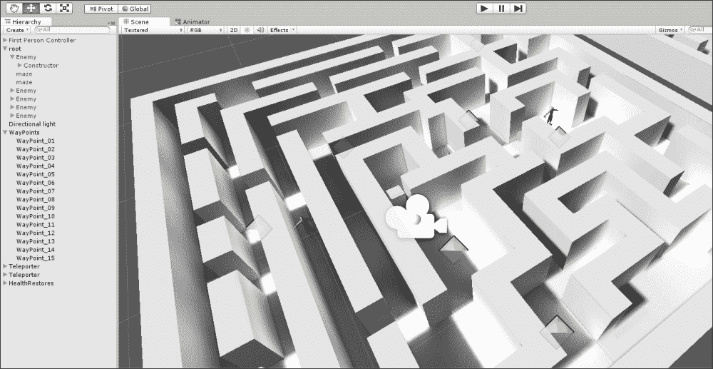

测试 AI_Enemy 类

尽管如此，还有很多方法可以进一步改进项目，例如，通过添加多种敌人类型以及每种类型的多种策略，从躲避到装死，等等。然而，尽管如此，我们已经走了很长的路，并开发了依赖于 C# FSM 以及 Mecanim FSM 进行动画播放的人工智能。

在下一章中，我们将跳出 AI 的世界，进入编辑器自定义的世界，以使游戏开发更加顺畅！
