# 第十章：源代码控制和其他技巧

本章考虑了在 C#中编写脚本或与脚本一起工作的三个主要技巧和窍门。这些技巧本身强大且重要，但它们并不完全属于之前的任何一章，这些章节主要按主题划分。这些技巧按无特定顺序列出，它们被包含在内的主要理由是基于它们的实用性，以及因为它们在其他地方的文档很少且往往结论不明确。因此，本章读起来像是一个有用的“你知道吗？”技巧和窍门的集合，这些技巧结合起来，提供了大量实用和实质性的知识。这三个技巧包括：

+   Git 版本控制

+   资源文件夹和外部文件

+   加载和保存游戏

# Git – 源代码控制

术语**源代码控制**或**版本控制**指的是旨在使尽可能多的人的开发实践既简单又安全的任何软件。简而言之，它允许您轻松快速地跟踪和撤销对文件的更改，并与其他人共享这些更改。通常，软件开发（包括游戏开发）依赖于两个重要的事实或要素。首先，它是一个集体努力，多个开发者作为团队的一部分共同工作，无论是在同一物理位置（如办公室）还是在遥远的位置，但共享一个虚拟空间（如虚拟办公室、论坛，甚至是电子邮件）。其次，在开发过程中，开发者将对源代码进行微调、编辑和改进。从这两个看似简单的事实中产生了修订控制旨在满足的一系列重要需求。

这些需求如下：

+   **协作**：当多个开发者共同对同一项目进行编码时，他们通常需要共享源文件。他们可以通过电子邮件或其他手动方法来回传文件，但这使得在大规模和长期项目中编码变得困难。很快，监控代码随时间的变化以及将两组更改合并到一个文件中就会变得困难。

+   **回滚**：有时，代码更改和改进会被证明是错误的。提出的编辑或修复并不总是达到预期的效果，必须撤销或回滚到早期状态。您可以自己保留早期文件的副本，但随着时间的推移，维护可能许多副本将会变得繁琐且不必要地令人困惑。

+   **跟踪更改和记录**：通常，您需要跟踪谁做了什么，尤其是在调试时。如果有人对代码进行了编辑，您会想知道谁更改了代码，为什么，以及何时更改。再次，您可以手动维护一个日志文件，通过注释和条目来记录更改过程，但这将会变得繁琐且耗时。

版本控制旨在解决协作、回滚和跟踪更改的三个主要问题。版本控制软件包括 Git、Perforce、Microsoft Team Foundation Server 等。本章特别考虑 Git；它被广泛使用，免费，跨平台，且开源。使用 Git，您可以首先配置一个特殊的数据库，称为 **仓库**，它可以是本地的（在您的计算机上）或远程的（通过网络）。然后，一旦配置完成，您就可以跟踪和维护您所有 Unity 项目的任何更改，如果需要，可以回滚到项目的早期状态，并与他人共享或协作。让我们看看如何使用图形用户界面配置 Git 以进行通用使用。

## 步骤 #1 – 下载

对于 Unity 项目，有许多方法可以开始使用 Git。本章探讨了官方 Git 软件与前端 TortoiseGit 的结合使用。使用这两个软件包，开发者可以跟踪和维护他们项目的所有更改，无论是单独工作还是团队合作。

要开始，请下载并安装官方 Git 软件，该软件可在 [`git-scm.com/`](http://git-scm.com/) 获取：

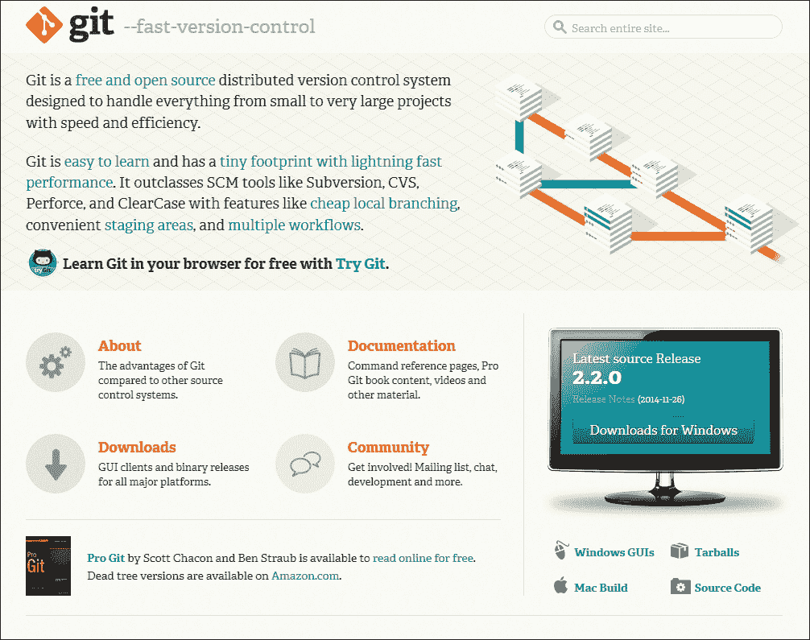

下载和安装 Git

### 小贴士

关于使用 Git 的详细信息可以在免费的在线电子书 *Pro Git* 中找到，作者是 *Scott Chacon 和 Ben Straub*，由 *Apress* 出版，可在 [`git-scm.com/book/en/v2`](http://git-scm.com/book/en/v2) 获取。

在 Git 安装并下载后，获取 TortoiseGit 是很有用的。这不是原始 Git 软件包的一部分，但它是 Windows 的一个可选前端组件，它允许您将 Git 与 Windows 壳集成，并通过图形用户界面而不是命令行与 Git 交互。

要下载和安装 TortoiseGit，请访问 [`code.google.com/p/tortoisegit/`](https://code.google.com/p/tortoisegit/)：

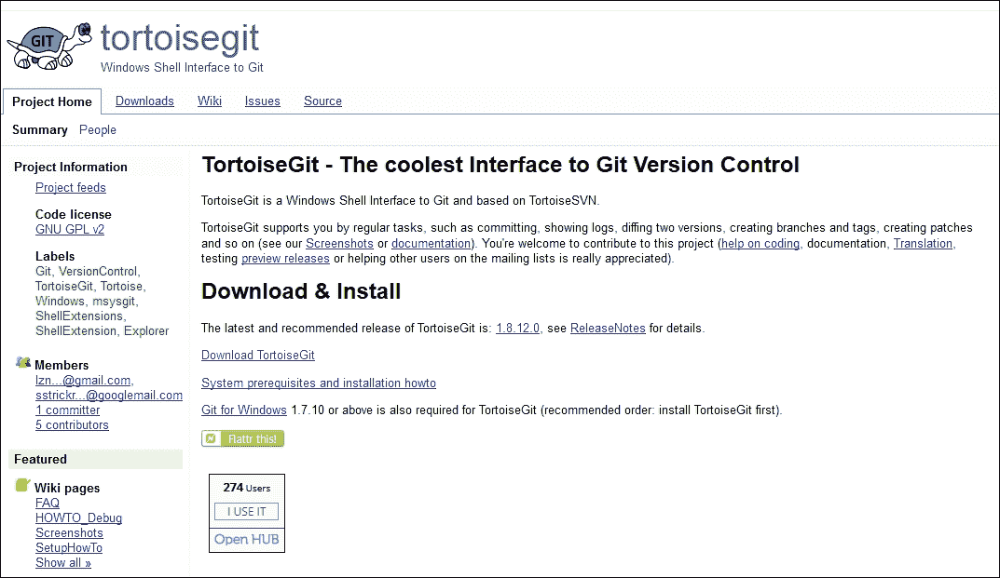

下载和安装 TortoiseGit

## 步骤 #2 – 构建 Unity 项目

安装 Git 的初衷是为了跟踪和维护 Unity 项目的更改，以便在需要时进行回滚，作为原始文件的备份版本，以及与其他开发者共享更改。因此，这取决于您是否已经有一个需要维护的 Unity 项目。安装 Git 和 TortoiseGit 后的下一步是创建一个新的 Unity 项目或找到一个应该被跟踪的现有项目。以下是对 Unity 项目文件夹的截图：

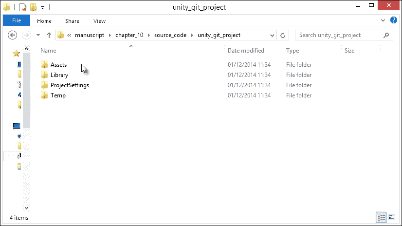

查看 Unity 项目文件夹

找到 Unity 项目后，在 Windows 资源管理器中打开项目文件夹以查看项目文件。如果您不知道或记不起文件夹的位置，您可以直接从 Unity 编辑器界面打开它。为此，在 Unity **项目**面板内右键单击，从上下文菜单中选择**在资源管理器中显示**：

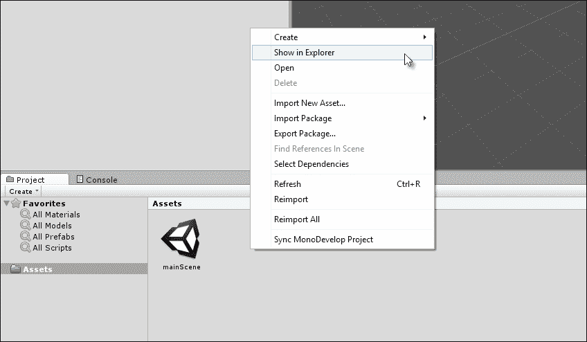

从 Unity 界面访问项目文件夹

## 步骤 #3 – 配置 Unity 以进行源代码控制

Git 与二进制文件和文本文件都兼容，但与文本文件配合得最好。当使用 Unity 时，编辑器会为您项目和导入的资产生成许多元数据文件。默认情况下，这些文件是隐藏的，并以二进制形式存在，它们位于 Unity 项目文件夹内。一些生成的元文件仅针对运行在您计算机上的 Unity 实例特定，例如界面首选项，而其他文件则与项目中的资产和数据相关，例如网格、纹理和脚本文件。为了从 Git 获得最佳效果，您需要通过在 **项目**资源管理器中使元文件可见，并使用基于文本的格式而不是二进制格式来调整 Unity 的默认行为。为此，从菜单栏选择**编辑** | **项目设置** | **编辑器**。

从这里，使用对象检查器将**版本控制**字段设置为**可见元文件**，将**资产序列化**字段设置为**强制文本**：

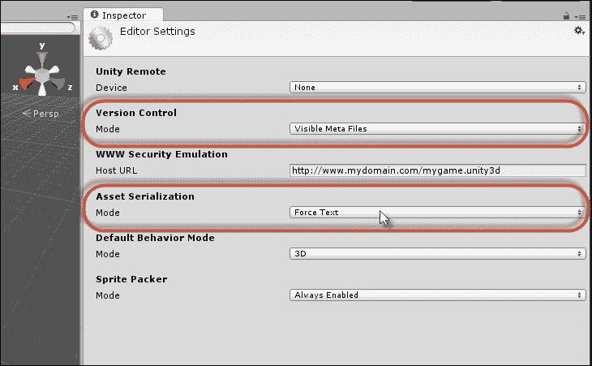

配置 Unity 以进行版本控制

当这些设置更改时，您将看到与每个项目资产（包括场景）关联的 `.meta` 文件。此外，元文件将以人类可读的文本格式存在，甚至可以编辑（尽管不建议手动编辑）。请看以下截图：

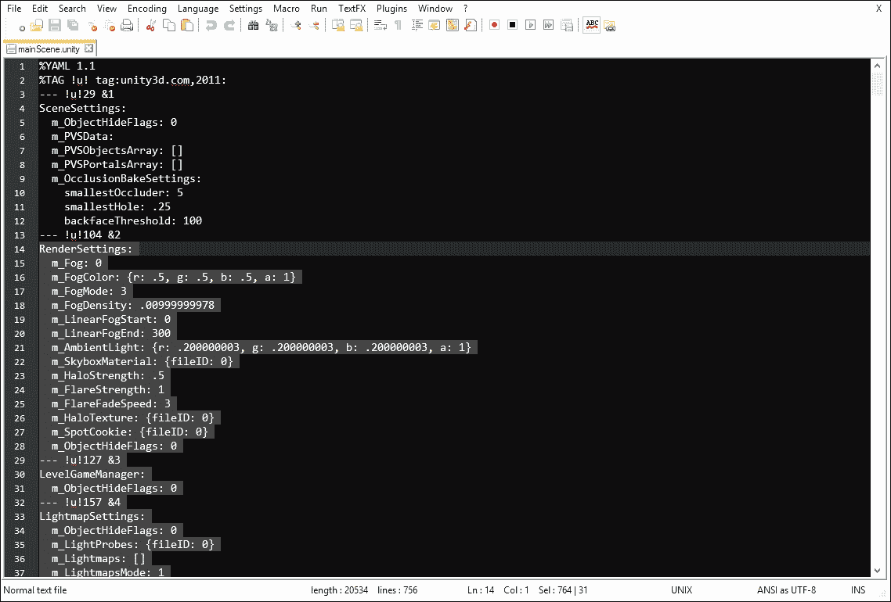

在文本编辑器中查看场景资产（以文本格式）

## 步骤 #4 – 创建 Git 仓库

创建和配置 Unity 项目后的下一阶段是创建 Git 数据库或仓库本身，该仓库将跟踪和维护 Unity 文件的所有更改。仓库可以是远程的（托管在网络上或外部计算机上）或本地的（托管在同一计算机上）。仓库将保留原始文件以及随时间对它们所做的所有更改，允许您在需要时回滚到文件的早期版本。仓库还可以与其他仓库共享和合并以进行文件共享。本章仅考虑本地仓库，因此现在让我们创建一个。为此，打开 Unity 项目文件夹（根文件夹），然后右键单击以显示 Windows 上下文菜单。从菜单中选择**在此处初始化 Git**：

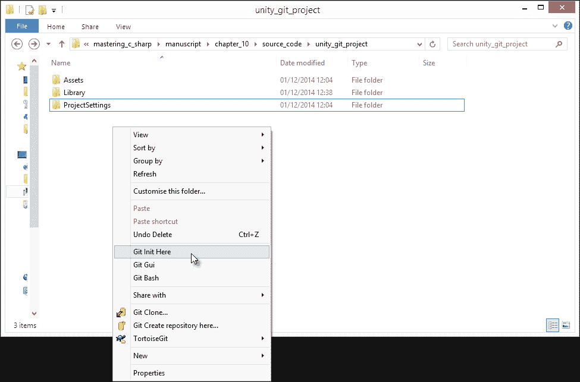

创建 Git 仓库

一旦创建，将生成一个名为 `.git` 的新隐藏文件夹。这个文件夹包含项目的所有仓库文件。文件和文件夹的图标将变为默认的红色符号，表示项目文件夹内的文件尚未添加到仓库中，因此 Git 无法跟踪对它们的更改（我们很快就会处理这个问题）。这在上面的截图中有显示：

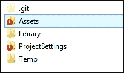

红色高亮的文件夹包含未包含在 Git 仓库中的文件

## 步骤 #5 – 忽略文件

Git 仓库现在已创建，准备接收其第一组文件（一个 *提交*）。然而，在添加它们之前，有一些特定的文件和类型可以安全地忽略。Unity 具有一些项目或系统特定的文件，这些文件对项目的关键程度不如对用户的关键程度；也就是说，一些文件总是只包含用户界面首选项以及只读文件、临时文件和其他不需要添加到仓库且可以安全忽略的特定数据。要忽略这些文件，我们可以在项目的根文件夹内创建一个 `.gitignore` 文本文件，并列出所有要忽略的文件和文件夹，如下所示：

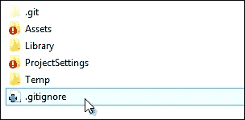

创建 Git 忽略文件以排除特定文件类型从仓库

对于 Unity，此文件（`.gitignore`）应如下所示。请确保将文件放在根文件夹内：

```cs
[Ll]ibrary/
[Tt]emp/
[Oo]bj/
[Bb]uild/
/*.csproj
/*.unityproj
/*.sln
/*.suo
/*.user
/*.userprefs
/*.pidb
/*.booproj
sysinfo.txt
```

## 步骤 #6 – 创建第一个提交

仓库现在已配置好，以接收第一组 Unity 项目文件。要添加这些文件，在根文件夹窗口内右键单击，然后在上下文菜单中转到 **Git Commit** | **Master**。在 Git 中，文件通常是批量提交的，而不是逐个提交。**提交** 窗口允许你选择要提交的所有文件。

点击 **All** 按钮，选择文件夹中的所有文件，然后在 **Message** 字段中为提交分配一个描述。消息应该允许任何用户理解提交包含的文件。准备好后，点击 **OK** 提交文件：

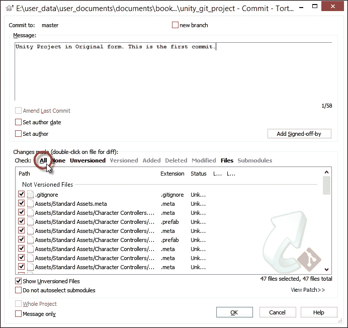

提交原始项目文件

提交完成后，文件图标将变为绿色，表示文件匹配，即表示项目文件夹中的文件与仓库中的文件相同：

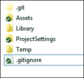

文件与仓库保持最新

## 步骤 #7 – 修改文件

Git 应该是一个完整的文件跟踪解决方案；这意味着它不仅应该存储你的原始文件，还应该存储所有后续的更改和编辑，允许你回滚到任何以前的版本。

如果你现在返回 Unity 并修改你的文件，添加新资产或编辑现有的资产，Windows 资源管理器内的文件图标将再次变为红色，表示本地文件与仓库文件不匹配：

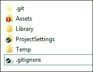

修改文件

如果您决定最近的变化是错误的，并且希望恢复到最后一次所做的更改，您可以通过在项目文件夹窗口内右键单击并从上下文菜单中选择**TortoiseGit** | **还原...**来实现：

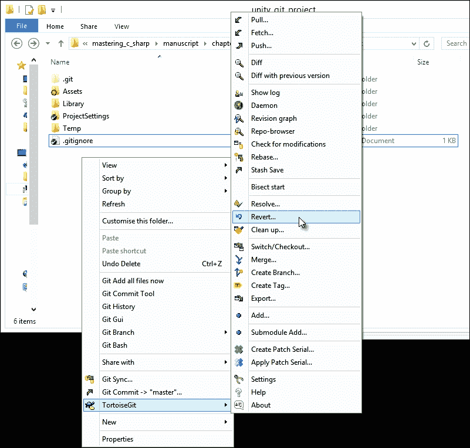

还原（撤销）最近的变化

将显示**还原**对话框，允许您选择要还原的文件。选择所有必要的文件，然后选择**确定**。Git 将恢复所有选定的文件，用仓库中的最新版本覆盖本地版本：

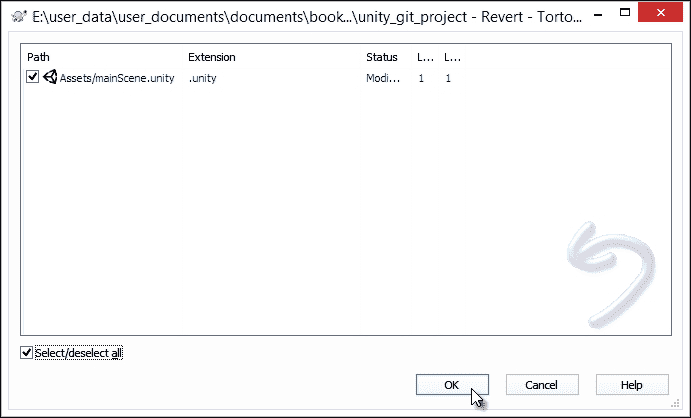

选择要还原的文件

另一方面，您可能不想还原或撤销最近的变化。相反，您可能已经创建了一个有效的更改；这应该作为文件的最新版本添加到 Git 仓库中。如果是这样，那么只需重新提交文件。在项目文件夹窗口内右键单击，并从上下文菜单中选择**Git 提交** | **主分支**。务必在**提交**对话框的**消息**字段中输入一个新且描述性的消息。

## 步骤 #8 – 从仓库获取文件

一旦所有文件的原始提交已完成，如果您故意或意外地删除了 Unity 文件夹中的所有文件（除了`.git`和`.gitignore`文件），您仍然可以再次检索所有最新文件。这是因为 Git 仓库包含这些文件。

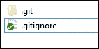

您可以从 Git 仓库的项目文件夹中恢复已删除的文件

### 小贴士

当然，如果您真的在按照书中的指示删除自己的文件，确保在测试过程中保留手动备份，以防万一出现问题！

要实现这一点，请在项目文件夹窗口内右键单击，并从上下文菜单中选择**TortoiseGit** | **切换/检出**：

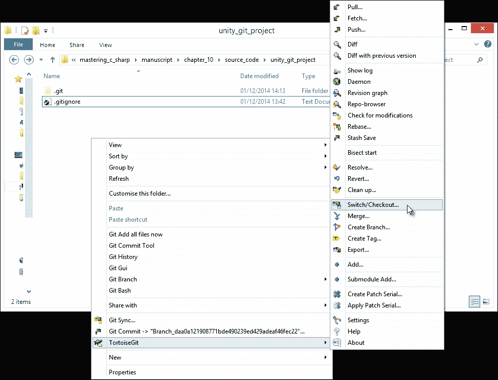

使用切换/检出选项从仓库获取最新文件

从**切换/检出**对话框中，选择**主分支**作为**切换到**字段。

您可能还需要从选项中启用**强制**复选框（请参阅文档以获取更多详细信息）。然后，单击**确定**以获取最新文件。一旦所有文件都检索到，您将看到以下截图：

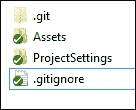

使用检出获取最新文件

或者，您可能希望将项目切换回仓库中的较早提交，而不是获取最新文件，而是获取较早的提交。为此，首先从上下文菜单中选择**Tortoise Git** | **切换/检出**以显示**检出**对话框。然后，从**切换到**组中启用**提交**单选框：

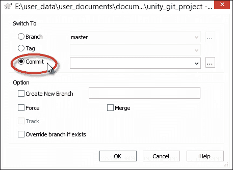

启用**提交**单选按钮以获取旧提交

点击 **提交** 字段旁边的浏览按钮 (**…**) 以显示可用的仓库提交，并选择早期版本以切换到。然后，点击 **确定** 以退出 **仓库提交** 对话框，并再次点击 **确定** 以确认从所选提交中检出。所选提交的文件将随后恢复到项目文件夹。记住，每个提交都有一个作者（对于团队工作的人来说），这让你可以了解谁更改了什么：

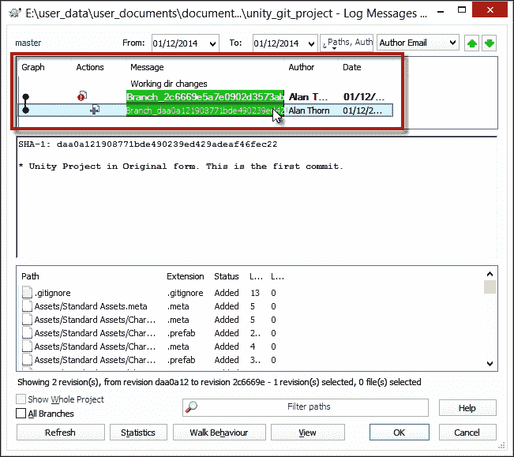

从仓库中选择旧提交以恢复

## 步骤 #9 – 浏览仓库

有时，你可能既不想从仓库中添加文件，也不想检索文件，只想浏览它们以查看内容。你可以通过使用 TortoiseGit 的一部分——仓库浏览器工具快速轻松地做到这一点。要访问此工具，从上下文菜单中选择 **TortoiseGit** | **仓库浏览器**：

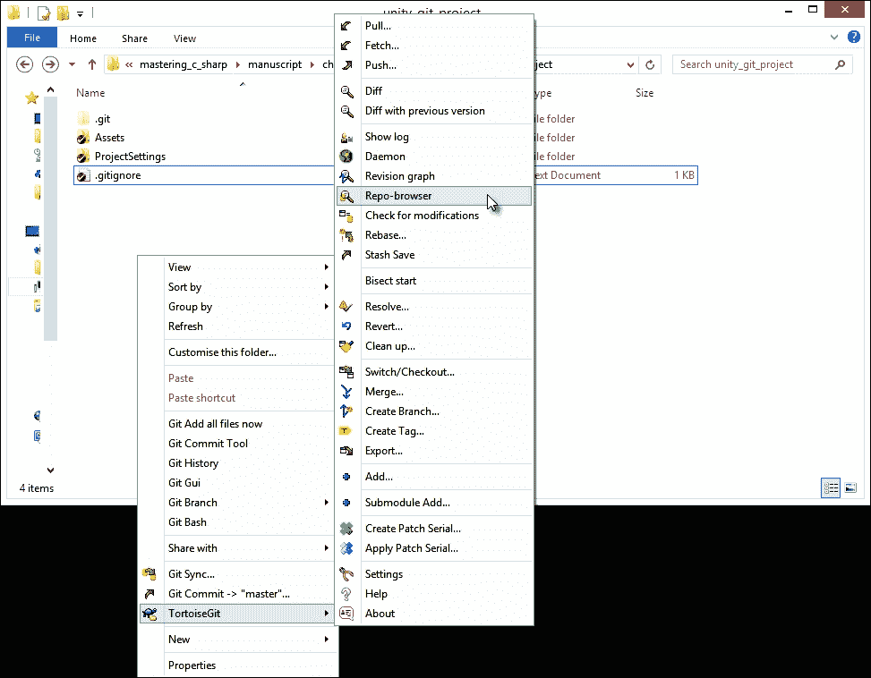

查看仓库浏览器工具

仓库浏览器工具允许你从 GUI 窗口中预览文件和层次结构：

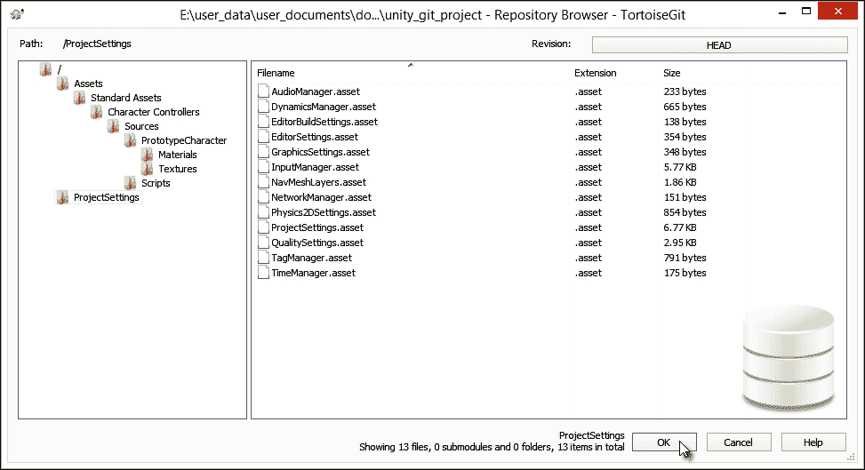

检查仓库内的文件

# 资源文件夹和外部文件

你的游戏通常会依赖于从文件（如 XML 文件）加载的外部数据，例如，用于字幕、本地化或关卡序列化。请看以下截图：

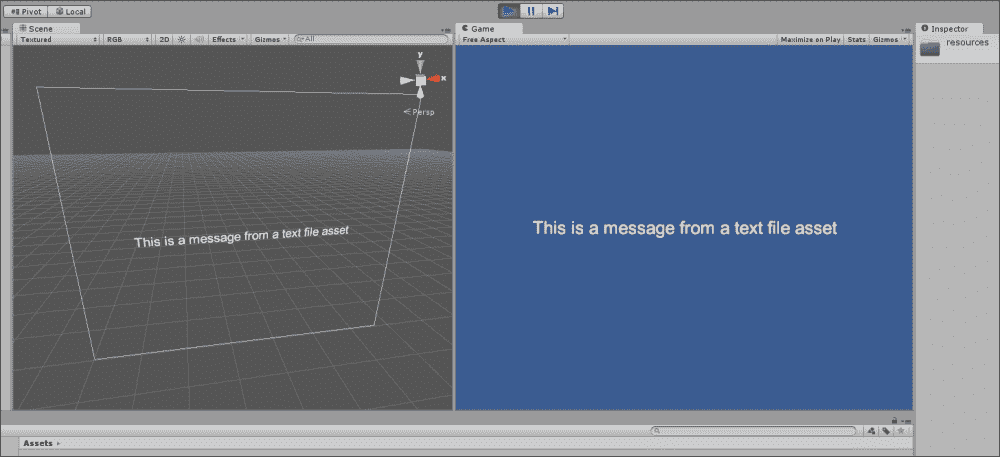

打印从外部文本文件资产加载的消息，该消息将与项目一起编译

在这些情况下，你需要特定的功能范围。第一个是能够以 Unity 可以解析和理解的方式从文件中动态加载数据到内存中的能力。第二个是能够在将文件导入 Unity 后更改和编辑文件内容，并且更改的效果可以在游戏中更新，而无需进行代码更改。第三个是能够将包含在主 Unity 构建中的文件编译和分发为独立游戏，而不是作为与主可执行文件分开的独立且可编辑的文件。进一步阐述第三点，你通常不想将游戏作为独立构建与单独的外部文件（如 XML 文件）一起分发，这些文件可以被玩家打开和编辑。相反，作为开发者，你希望在 Unity 编辑器中编辑和更改文件，并且希望文件本身被编译并构建到你的最终 Unity 独立项目中，就像其他资产一样。你可以使用资源文件夹来实现这一点。

要使用资源文件夹，在 Unity 项目中创建一个名为 `resources` 的文件夹。一个项目可以包含零个、一个或多个 `resources` 文件夹。在文件夹内，添加所有资产，例如可以被 Unity 在运行时加载的文本文件：

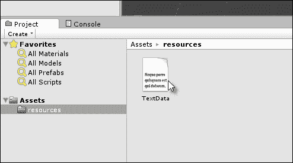

将外部文件添加到资源文件夹

一旦文件被添加到 `resources` 文件夹，您就可以使用 `Resources.Load` 函数将其加载到内存中。请参阅以下代码示例 10-1，它将一个示例文本资源加载到一个 UI 文本组件中：

```cs
using UnityEngine;
using System.Collections;
using UnityEngine.UI;
//---------------------------------------------
public class LoadTextData : MonoBehaviour
{
  //Reference to UI Text Component
  private Text MyText = null;

  //Reference to text asset in resources folder
  private TextAsset TextData = null;
  //---------------------------------------------
  // Use this for initialization
  void Awake () {
    //Get Text Component
    MyText = GetComponent<Text>();

    //Load text data from resources folder
    TextData = Resources.Load("TextData") as TextAsset;
  }
  //---------------------------------------------
  // Update is called once per frame
  void Update () {
    //Update text label component
    MyText.text = TextData.text;
  }
  //---------------------------------------------
}
//---------------------------------------------
```

### 小贴士

更多关于资源文件夹和 `Resources` 类的信息可以在在线 Unity 文档中找到，网址为 [`docs.unity3d.com/ScriptReference/Resources.html`](http://docs.unity3d.com/ScriptReference/Resources.html)。

# AssetBundles 和外部文件

如果您使用的是 Unity Pro，并希望向用户提供动态内容，允许玩家**修改**（**mod**）游戏内容，添加他们自己的资源，以及附加组件，以及支持您自己的附加组件和插件，那么 AssetBundles 将非常有用。AssetBundles 允许您将许多不同的 Unity 资源打包成一个单独的外部文件，该文件位于主项目之外，可以动态地加载到任何 Unity 项目中，无论是从磁盘上的本地文件还是通过互联网：

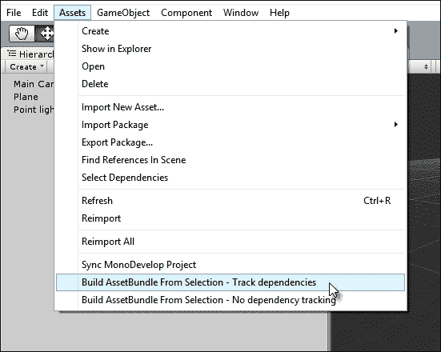

从所选资源构建 AssetBundles

要开始使用，请将 Unity 资产包编辑器脚本导入到项目中，以便从 **项目** 面板轻松构建 AssetBundles；为此，将以下代码示例 10-2 粘贴到项目 `Editor` 文件夹内的一个 C# 脚本文件中；否则，您可以从以下网址下载脚本：[`docs.unity3d.com/ScriptReference/BuildPipeline.BuildAssetBundle.html`](http://docs.unity3d.com/ScriptReference/BuildPipeline.BuildAssetBundle.html)：

```cs
  // C# Example
  // Builds an asset bundle from the selected objects in the
  // project view.
  // Once compiled go to "Menu" -> "Assets" and select one of the
  // choices to build the Asset Bundle

  using UnityEngine;
  using UnityEditor;
  public class ExportAssetBundles {
    [MenuItem("Assets/Build AssetBundle From Selection - Track dependencies")]
    static void ExportResource () {
      // Bring up save panel
      string path = EditorUtility.SaveFilePanel ("Save Resource", "", "New Resource", "unity3d");
      if (path.Length != 0) {
        // Build the resource file from the active selection.
        Object[] selection = Selection.GetFiltered(typeof(Object), SelectionMode.DeepAssets);
        BuildPipeline.BuildAssetBundle(Selection.activeObject, selection, path,
          BuildAssetBundleOptions.CollectDependencies | BuildAssetBundleOptions.CompleteAssets);
        Selection.objects = selection;
      }
    }
    [MenuItem("Assets/Build AssetBundle From Selection - No dependency tracking")]
    static void ExportResourceNoTrack () {
      // Bring up save panel
      string path = EditorUtility.SaveFilePanel ("Save Resource", "", "New Resource", "unity3d");
      if (path.Length != 0) {
        // Build the resource file from the active selection.
        BuildPipeline.BuildAssetBundle(Selection.activeObject, Selection.objects, path);
      }
    }
  }
```

要创建 AssetBundle，请选择要包含在包中的所有资源，然后从菜单栏转到 **资产** | **从选择构建 AssetBundle**。一旦选择，请选择您计算机上保存包的位置。

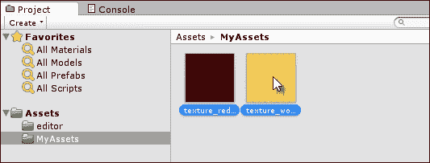

选择要包含在 AssetBundle 中的资源

然后，为了测试 AssetBundle，创建一个新的项目或打开一个没有资源的不同项目，您可以在运行时使用 `WWW` 类将它们加载到您的项目中。请参阅以下代码示例 10-3，它展示了如何从本地文件下载 AssetBundle，提取纹理资源，并将其分配给附加的网格渲染器组件的材料：

```cs
using UnityEngine;
using System.Collections;

public class LoadAssetBundle : MonoBehaviour
{
  //Mesh Renderer Reference
  private MeshRenderer MR = null;

  // Use this for initialization
  IEnumerator Start ()
  {
    //Get asset bundle file from local machine
    WWW www = new WWW (@"file:///c:\asset_textures.unity3d");

    //Wait until load is completed
    yield return www;

    //Retrieve texture from asset bundle
    Texture2D Tex = www.assetBundle.Load("texture_wood",typeof(Texture2D)) as Texture2D;

    //Assign texture in bundle to mesh
    MR = GetComponent<MeshRenderer>();
    MR.material.mainTexture = Tex;
  }
}
```

这就是纹理资源将呈现的样子：

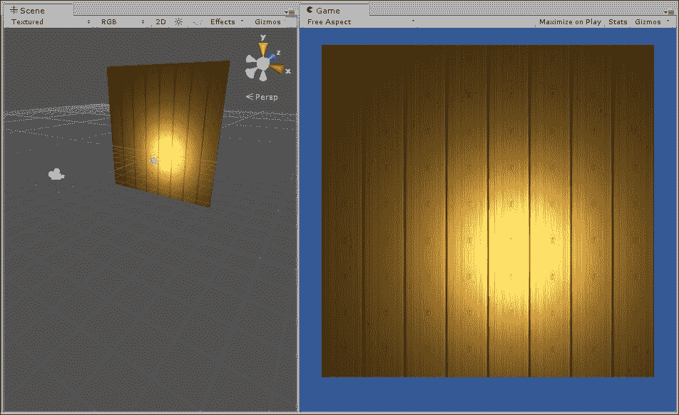

从 AssetBundle 加载纹理资源到网格渲染器

### 小贴士

更多关于 AssetBundles 的信息可以在在线 Unity 文档中找到，网址为 [`docs.unity3d.com/Manual/AssetBundlesIntro.html`](http://docs.unity3d.com/Manual/AssetBundlesIntro.html)。

# 持久数据和保存的游戏

允许玩家保存和加载游戏状态对于许多游戏来说很重要，尤其是持续时间较长的游戏，如冒险、实时策略和角色扮演游戏。在这些情况下，游戏应允许用户将游戏数据保存到和从外部文件中加载。

在 Unity 中，通过 XML 或二进制文件的数据序列化来实现这一点：

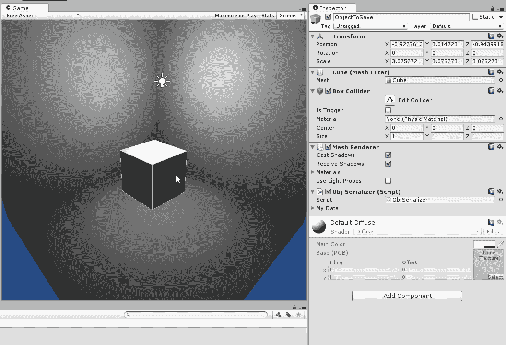

将对象的 Transform 属性保存到 XML 文件中

**序列化**是将内存中的数据（例如`GameObject`上的组件状态）转换为可以写入文件并从文件中重新加载以在内存中重新创建组件的流的进程。因此，创建保存游戏的过程首先是决定哪些数据必须保存和加载（这是游戏特定的），然后创建一个新的类来存储这些数据。考虑以下代码示例 10-4（`ObjSerializer.cs`），它可以附加到任何`GameObject`上，以将 Transform 组件（平移、旋转和缩放）序列化和反序列化到外部文件，无论是 XML 格式还是二进制格式。为了实现这一点，使用了`XmlSerializer`类将内存中的对象转换为 XML，而`BinaryFormatter`将内存中的对象转换为二进制文件。XML 文件是可读的文本文件，而二进制文件通常不能被人类正常读取或理解：

```cs
001 //-----------------------------------------------
002 using UnityEngine;
003 using System.Collections;
004 using System.Collections.Generic;
005 using System.Xml;
006 using System.Xml.Serialization;
007 using System.Runtime.Serialization.Formatters.Binary;
008 using System.IO;
009 //-----------------------------------------------
010 public class ObjSerializer : MonoBehaviour
011 {
012   //Data to save to file XML or Binary
013   [System.Serializable]
014   [XmlRoot("GameData")]
015   public class MySaveData
016   {
017     //Transform data to save/load to and from file
018     //represents a conversion of a transform object
019     //into simpler values, like floats
020     [System.Serializable]
021     public struct DataTransform
022     {
023       public float X;
024       public float Y;
025       public float Z;
026       public float RotX;
027       public float RotY;
028       public float RotZ;
029       public float ScaleX;
030       public float ScaleY;
031       public float ScaleZ;
032     }
033
034     //Transform object to save
035   public DataTransform MyTransform = new DataTransform();

036   }
037
038   //My Save Data Object declared here
039   public MySaveData MyData = new MySaveData();
040   //-----------------------------------------------
041   //Populate structure MyData with transform data
042   //This is the data to be saved to a file
043   private void GetTransform()
044   {
045     //Get transform component on this object
046     Transform ThisTransform = transform;
047
048     //Got transform, now fill data structure
049     MyData.MyTransform.X = ThisTransform.position.x;
050     MyData.MyTransform.Y = ThisTransform.position.y;
051     MyData.MyTransform.Z = ThisTransform.position.z;
052     MyData.MyTransform.RotX = ThisTransform.localRotation.eulerAngles.x;

053     MyData.MyTransform.RotY = ThisTransform.localRotation.eulerAngles.y;

054     MyData.MyTransform.RotZ = ThisTransform.localRotation.eulerAngles.z;

055     MyData.MyTransform.ScaleX = ThisTransform.localScale.x;

056     MyData.MyTransform.ScaleY = ThisTransform.localScale.y;

057     MyData.MyTransform.ScaleZ = ThisTransform.localScale.z;
058     }
059     //-----------------------------------------------
060     //Restore the transform component with loaded data
061     //Call this function after loading data back from a file
        // for restore
062     private void SetTransform()
063     {
064       //Get transform component on this object
065       Transform ThisTransform = transform;
066
067       //We got the transform component, now restore data
068       ThisTransform.position = new Vector3(MyData.MyTransform.X, MyData.MyTransform.Y, MyData.MyTransform.Z);

069       ThisTransform.rotation = Quaternion.Euler(MyData.MyTransform.RotX, MyData.MyTransform.RotY, MyData.MyTransform.RotZ);

070       ThisTransform.localScale = new Vector3(MyData.MyTransform.ScaleX, MyData.MyTransform.ScaleY, MyData.MyTransform.ScaleZ);

071     }
072   //-----------------------------------------------
073   //Saves game data to XML file
074   //Call this function to save data to an XML file
075   //Call as Save
076   public void SaveXML(string FileName = "GameData.xml")
077   {
078     //Get transform data
079     GetTransform();
080
081     //Now save game data
082     XmlSerializer Serializer = new XmlSerializer(typeof(MySaveData));

083     FileStream Stream = new FileStream(FileName, FileMode.Create);

084     Serializer.Serialize(Stream, MyData);
085     Stream.Close();
086   }
087   //-----------------------------------------------
088   //Load game data from XML file
089   //Call this function to load data from an XML file
090   //Call as Load
091   public void LoadXML(string FileName = "GameData.xml")
092   {
093     //If file doesn’t exist, then exit
094     if(!File.Exists(FileName)) return;
095
096     XmlSerializer Serializer = new XmlSerializer(typeof(MySaveData));

097     FileStream Stream = new FileStream(FileName, FileMode.Open);

098     MyData = Serializer.Deserialize(Stream) as MySaveData;

099     Stream.Close();
100
101     //Set transform - load back from a file
102     SetTransform();
103   }
104   //-----------------------------------------------
105   public void SaveBinary(string FileName = "GameData.sav")
106   {
107     //Get transform data
108     GetTransform();
109
110     BinaryFormatter bf = new BinaryFormatter();
111     FileStream Stream = File.Create(FileName);
112     bf.Serialize(Stream, MyData);
113     Stream.Close();
114   }
115   //-----------------------------------------------
116   public void LoadBinary(string FileName = "GameData.sav")
117   {
118     //If file doesn’t exist, then exit
119     if(!File.Exists(FileName)) return;
120
121     BinaryFormatter bf = new BinaryFormatter();
122   FileStream Stream = File.Open(FileName, FileMode.Open);

123     MyData = bf.Deserialize(Stream) as MySaveData;
124     Stream.Close();
125
126     //Set transform - load back from a file
127     SetTransform();
128   }
129   //-----------------------------------------------
130 }
131 //-----------------------------------------------
```

### 小贴士

加载和保存游戏数据的完整示例可以在本书的配套文件中找到，位于`Chapter10/XML_and_Binary`文件夹中。

# 摘要

本章考虑了三个主要的小贴士，其中可能唯一的主题是文件管理。第一个小贴士考虑了 Git 版本控制，特别是免费和开源的版本控制软件如何允许我们跟踪项目中的更改以及与其他开发者轻松协作。第二个小贴士涉及动态加载文件数据，首先使用`resources`文件夹内部的内部项目文件，然后使用 AssetBundles。后者对于创建可以由开发者和玩家 alike 编辑的外部资产特别有用。第三和最后一个小贴士演示了如何在游戏中将数据保存到文件中，然后通过序列化重新加载。通过序列化，用户可以保存和恢复游戏数据，允许他们在稍后时间继续播放。
